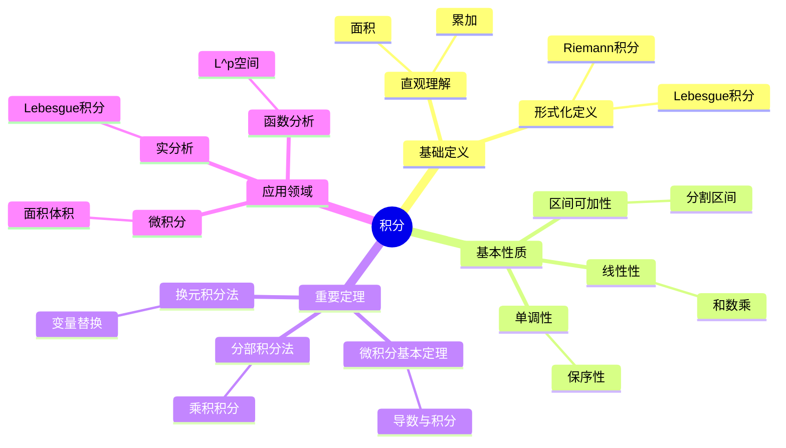

# 积分 (Integral)

**概念编号**: C.CORE.016
**知识层次**: L0-L2
**知识领域**: D3 (分析)
**创建日期**: 2025年11月21日
**最后更新**: 2025年11月21日

---

## 📋 概述

积分是微积分的核心概念，是导数的逆运算。积分理论在数学、物理学、工程学等领域有广泛应用，是计算面积、体积、质量等量的基础工具。

**权威资源对齐**:

- Wikipedia: [Integral](https://en.wikipedia.org/wiki/Integral)
- Stanford课程: Math 51 (Linear Algebra and Differential Calculus)
- Princeton课程: MAT 201 (Analysis)
- MIT课程: 18.01 (Single Variable Calculus)
- Metamath: [Integral](http://us.metamath.org/mpeuni/df-itg.html)

---

## 🎯 严格定义

### 基础定义 (L0)

**直观理解**: 积分是计算曲线下面积、体积等量的工具，是"累加"的连续版本。

**基本定义**: 函数 $f$ 在区间 $[a,b]$ 上的定积分 $\int_a^b f(x)dx$ 表示曲线 $y = f(x)$ 下从 $a$ 到 $b$ 的面积。

**简单例子**:

- $\int_0^1 x dx = \frac{1}{2}$
- $\int_0^{\pi} \sin x dx = 2$
- $\int_1^e \frac{1}{x} dx = 1$

### 形式化定义 (L1)

**Riemann积分**: 函数 $f$ 在 $[a,b]$ 上的Riemann积分定义为：

$$\int_a^b f(x)dx = \lim_{||P|| \to 0} \sum_{i=1}^n f(\xi_i)(x_i - x_{i-1})$$

其中 $P$ 是 $[a,b]$ 的分割，$||P||$ 是分割的细度。

**Lebesgue积分**: 更一般的积分理论，基于测度论。

**记号**:

- $\int_a^b f(x)dx$: 定积分
- $\int f(x)dx$: 不定积分
- $\int f$: 简记

---

## 📚 历史背景

### 发展脉络

**17世纪**: 积分的起源

- **Newton (1665)**: 使用反流数法
- **Leibniz (1684)**: 使用积分记号

**19世纪**: 积分的严格化

- **Cauchy (1823)**: 严格化积分定义
- **Riemann (1854)**: 提出Riemann积分
- **Lebesgue (1902)**: 提出Lebesgue积分

### 关键人物

- **Isaac Newton (1643-1727)**: 反流数法的发明者
- **Gottfried Leibniz (1646-1716)**: 积分记号的发明者
- **Bernhard Riemann (1826-1866)**: Riemann积分的提出者
- **Henri Lebesgue (1875-1941)**: Lebesgue积分的提出者

---

## 🔍 性质与定理

### 基本性质 (L1)

**性质1: 积分的线性性**:

- **和**: $\int (f+g) = \int f + \int g$
- **数乘**: $\int (cf) = c\int f$

**性质2: 积分的区间可加性**:

- **陈述**: $\int_a^b f + \int_b^c f = \int_a^c f$

**性质3: 积分的单调性**:

- **陈述**: 若 $f \leq g$，则 $\int f \leq \int g$

### 重要定理 (L2)

**定理1: 微积分基本定理**:

- **第一部分**: 若 $F' = f$，则 $\int_a^b f = F(b) - F(a)$
- **第二部分**: $\frac{d}{dx}\int_a^x f(t)dt = f(x)$

**定理2: 换元积分法**:

- **陈述**: $\int f(g(x))g'(x)dx = \int f(u)du$，其中 $u = g(x)$

**定理3: 分部积分法**:

- **陈述**: $\int fg' = fg - \int f'g$

---

## 💡 应用实例

### 理论应用

- 微积分（积分的计算和应用）
- 实分析（Lebesgue积分）
- 函数分析（$L^p$ 空间）

### 实际应用

- 物理学（功、能量、概率）
- 工程学（面积、体积、质量）
- 经济学（累积量）

---

## 🔗 关联概念

### 依赖关系

- 极限（积分的定义需要极限）
- 连续（连续函数可积）
- 导数（微积分基本定理）

### 推广关系

- 重积分（多元函数的积分）
- 线积分（曲线上的积分）
- 面积分（曲面上的积分）

---

## 📖 参考文献

- Wikipedia: [Integral](https://en.wikipedia.org/wiki/Integral)
- Rudin, W. (1976). *Principles of Mathematical Analysis*. McGraw-Hill.
- Spivak, M. (2008). *Calculus*. Publish or Perish.

---

## 🗺️ 思维导图 (编号: C.CORE.016.MIND)

### 积分概念思维导图

---

## 📊 知识多维关系矩阵 (编号: C.CORE.016.MATRIX)

### 积分的多维关系矩阵

| 维度 | 指标 | 积分 |
|------|------|------|
| **知识层次** | L0基础 | ⭐⭐⭐⭐ |
| | L1中级 | ⭐⭐⭐⭐⭐ |
| | L2高级 | ⭐⭐⭐⭐ |
| | L3研究 | ⭐⭐⭐ |
| **知识领域** | D1基础数学 | ⭐⭐⭐ |
| | D2代数 | ⭐⭐ |
| | D3分析 | ⭐⭐⭐⭐⭐ |
| | D4几何 | ⭐⭐⭐⭐ |
| **依赖关系** | 前置概念 | 极限、连续 |
| | 后续概念 | 微分方程、测度论 |
| **应用关系** | 理论应用 | ⭐⭐⭐⭐⭐ |
| | 实际应用 | ⭐⭐⭐⭐⭐ |
| | 交叉应用 | ⭐⭐⭐⭐ |
| **学习难度** | 直观理解 | ⭐⭐⭐ |
| | 形式化理解 | ⭐⭐⭐⭐ |
| | 深入应用 | ⭐⭐⭐⭐ |

---

## 💭 形象化解释与论证 (编号: C.CORE.016.VISUAL)

### 形象化解释

**1. 积分的直观理解**

- **类比**: 积分就像"计算曲线下面积"或"累加的连续版本"
- **例子**:
  - 曲线下面积：$\int_a^b f(x)dx$表示曲线$y=f(x)$下从$a$到$b$的面积
  - 体积：$\int_a^b A(x)dx$表示横截面积为$A(x)$的立体体积
  - 累积量：$\int_0^t v(t)dt$表示速度$v(t)$的累积位移

**2. Riemann积分的直观理解**

- **类比**: Riemann积分就像"用矩形逼近面积"
- **解释**:
  - 将区间分成小段
  - 每段用矩形近似
  - 当分割越来越细时，矩形面积和趋于真实面积

**3. 微积分基本定理的直观理解**

- **类比**: 微积分基本定理就像"积分和导数是互逆运算"
- **解释**:
  - 第一部分：如果知道导数，可以通过积分计算原函数
  - 第二部分：如果知道积分，可以通过求导得到被积函数

### 认知科学视角

**1. 数学教育家Dienes的观点**

- **多表征原则**: 通过几何（面积）、物理（累积）、代数（公式）等多种方式理解积分
- **变化性原则**: 通过不同的积分例子理解积分的本质
- **教学启示**: 使用面积可视化、物理类比、符号计算等多种方法

**2. 数学认知学家Tall的观点**

- **过程-对象对偶**: 理解"积分过程"（如何计算）和"积分"（对象）
- **认知层次**: 从直观理解（"面积"）到形式化理解（Riemann积分定义）

---

## 👨‍🏫 专家观点与论证 (编号: C.CORE.016.EXPERT)

### 数学家的观点

**1. Isaac Newton (1643-1727) - 微积分的发明者**
> "积分是反流数法，是计算面积和体积的工具。"
>
> **意义**: Newton发明了积分（反流数法），开创了微积分。

**2. Gottfried Leibniz (1646-1716) - 积分记号的发明者**
> "积分记号$\int$是理解积分的关键，它使积分计算更加直观。"
>
> **意义**: Leibniz发明了积分记号，使积分计算更加直观。

**3. Bernhard Riemann (1826-1866) - Riemann积分的提出者**
> "Riemann积分给出了积分的严格定义，这是分析学的基础。"
>
> **意义**: Riemann给出了积分的严格定义，奠定了现代分析学的基础。

**4. Henri Lebesgue (1875-1941) - Lebesgue积分的提出者**
> "Lebesgue积分是Riemann积分的推广，它使更多函数可积。"
>
> **意义**: Lebesgue提出了更一般的积分理论，为现代分析学奠定了基础。

### 数学教育家的观点

**1. Zoltan Dienes (1916-2014) - 数学教育家**
> "积分概念应该通过几何（面积）、物理（累积）、代数（公式）等多种方式学习。"
>
> **教学启示**:
>
> - 使用面积可视化展示积分
> - 使用物理类比理解积分（如位移、功）
> - 逐步引入Riemann积分定义

**2. Hans Freudenthal (1905-1990) - 数学教育家**
> "积分概念的学习需要从'面积计算'发展到'抽象积分结构'。"
>
> **认知发展**:
>
> - **面积阶段**: 理解积分作为面积计算
> - **结构阶段**: 理解积分作为函数空间上的线性泛函

### 数学认知学家的观点

**1. David Tall - 数学认知学家**
> "积分概念的理解需要从'过程'（如何计算）发展到'对象'（积分本身）。"
>
> **认知层次**:
>
> - **过程层次**: 理解"如何计算积分"（如$\int x dx = \frac{x^2}{2}$）
> - **对象层次**: 理解"积分"（如$\int f$是一个数或函数）

---

**创建日期**: 2025年11月21日
**最后更新**: 2025年11月21日
**维护状态**: 持续更新中
