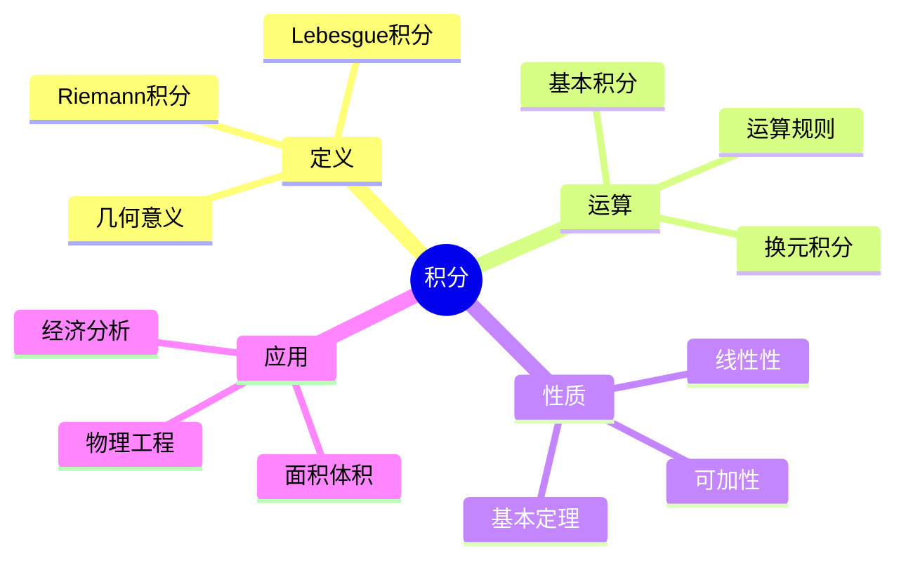
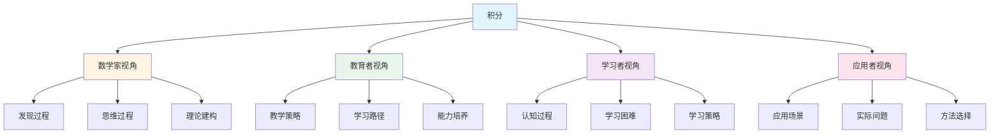
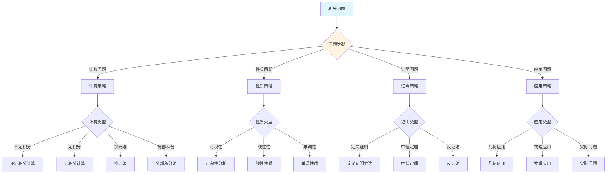
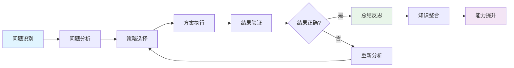
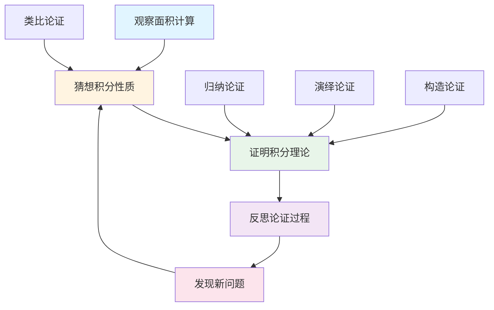
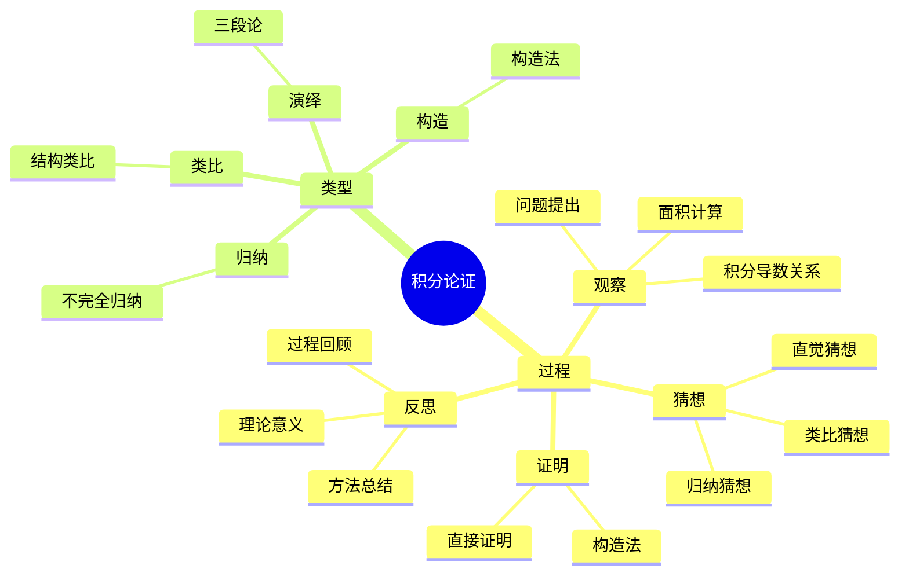
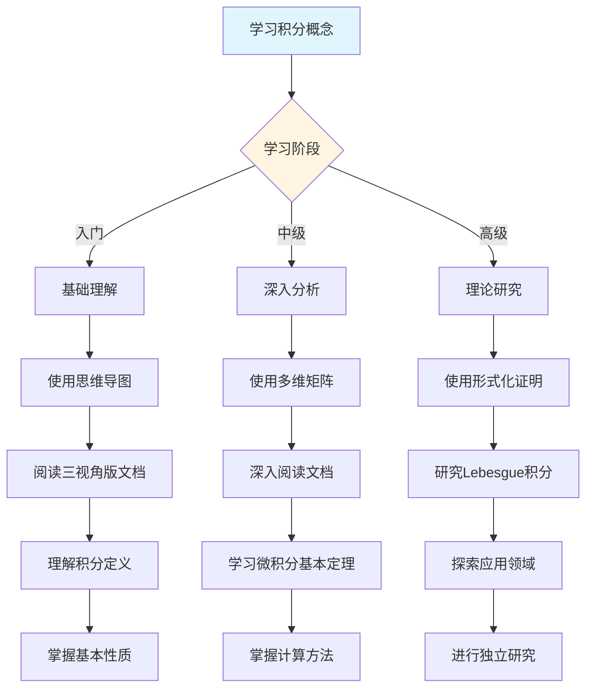
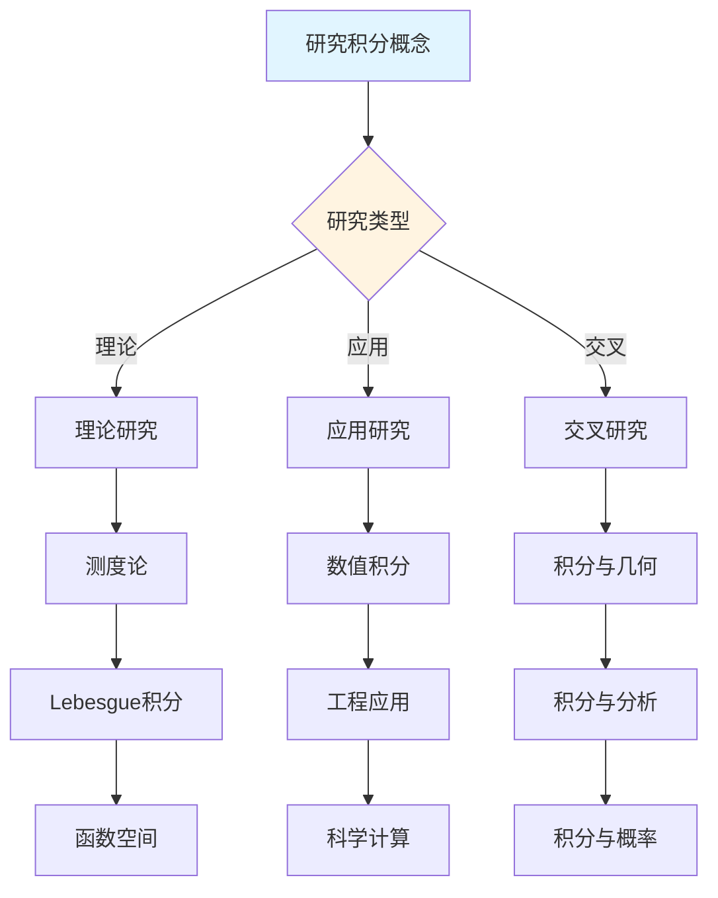
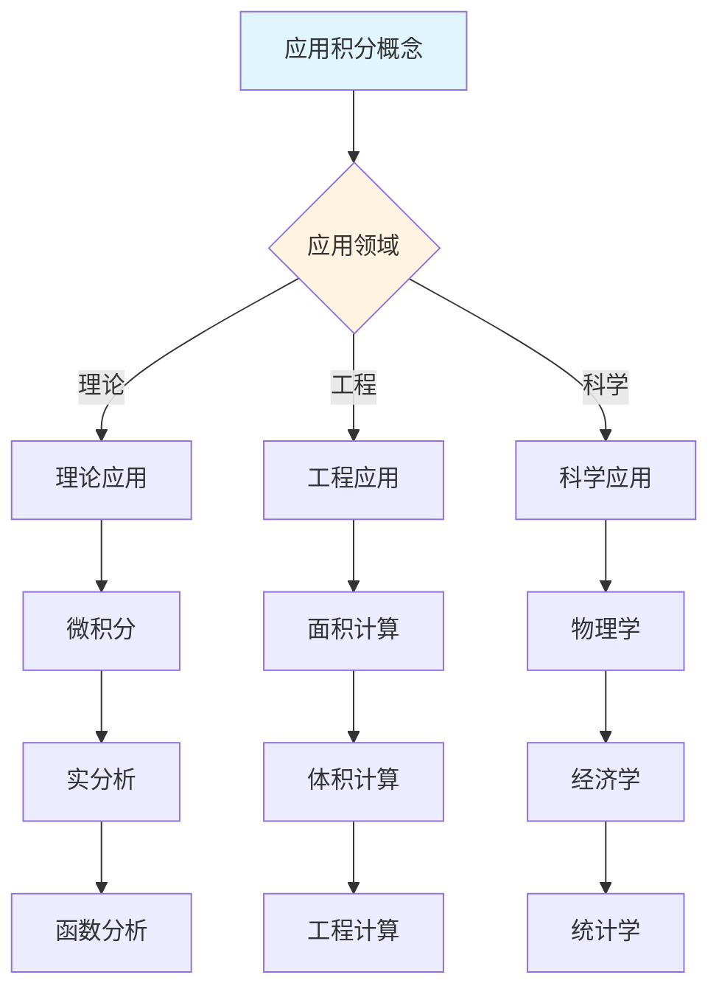
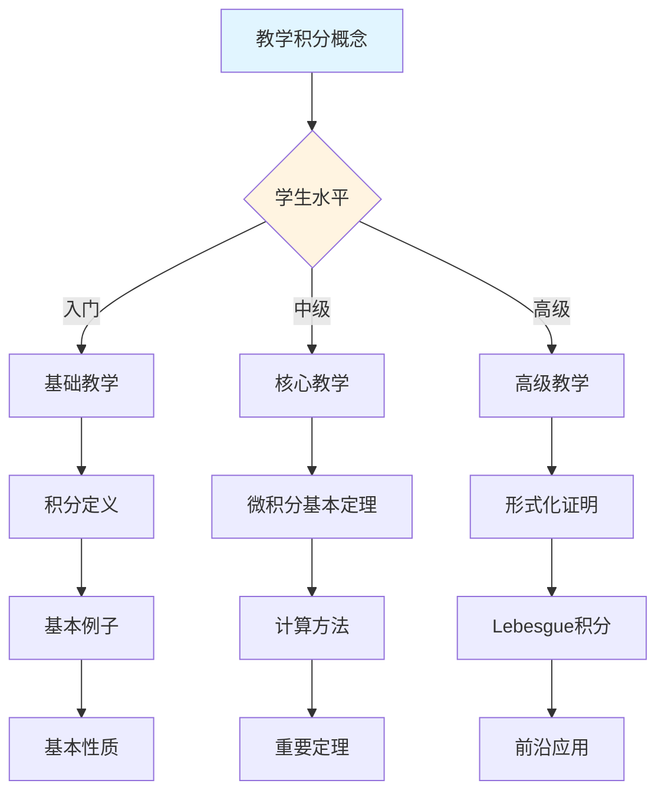

---
msc_primary: "00A99"
---

# 积分 (Integral) - 三视角组织版

**概念编号**: C.CORE.016
**知识层次**: L0-L2
**知识领域**: D3 (分析)
**创建日期**: 2025年1月
**最后更新**: 2026-04-05

---

## 📋 目录 / Table of Contents

- [积分 (Integral) - 三视角组织版](#积分-integral---三视角组织版)
  - 📋 目录 / Table of Contents
  - 1. 📋 概述 (编号: C.CORE.016.01)
  - [🧠 认知学视角：如何理解积分 (编号: C.CORE.016.02)](#认知学视角如何理解积分-编号-ccore01602)
    - [认知起点 (编号: C.CORE.016.02.01)](#认知起点-编号-ccore0160201)
    - [认知过程 (编号: C.CORE.016.02.02)](#认知过程-编号-ccore0160202)
      - [阶段1：直观理解阶段 (编号: C.CORE.016.02.02.01)](#阶段1直观理解阶段-编号-ccore016020201)
      - [阶段2：概念形成阶段 (编号: C.CORE.016.02.02.02)](#阶段2概念形成阶段-编号-ccore016020202)
      - [阶段3：形式化阶段 (编号: C.CORE.016.02.02.03)](#阶段3形式化阶段-编号-ccore016020203)

## 形式化定义

**定义（Riemann积分）**：函数 $f$ 在 $[a, b]$ 上的Riemann积分定义为：
$$\int_a^b f(x)\,dx = \lim_{\|P\| \to 0} \sum_{i=1}^n f(\xi_i) \Delta x_i$$
其中 $P = \{x_0, x_1, \ldots, x_n\}$ 是分割，$\|P\| = \max \Delta x_i$

**定义（Lebesgue积分）**：对可测函数 $f$，Lebesgue积分定义为：
$$\int f\,d\mu = \int_0^\infty \mu(\{x : f(x) > t\})\,dt$$

**符号说明**：
- $\int_a^b$：定积分
- $\int$：不定积分
- $F(x) = \int_a^x f(t)\,dt$：变上限积分
- $\iint, \iiint$：重积分
- $\oint$：环路积分

    - [认知障碍 (编号: C.CORE.016.02.03)](#认知障碍-编号-ccore0160203)
    - [认知工具 (编号: C.CORE.016.02.04)](#认知工具-编号-ccore0160204)
  - [🎓 教育学视角：如何教学积分 (编号: C.CORE.016.03)](#教育学视角如何教学积分-编号-ccore01603)
    - [教学目标 (编号: C.CORE.016.03.01)](#教学目标-编号-ccore0160301)
    - [教学路径 (编号: C.CORE.016.03.02)](#教学路径-编号-ccore0160302)
      - [阶段1：引入阶段（激发兴趣） (编号: C.CORE.016.03.02.01)](#阶段1引入阶段激发兴趣-编号-ccore016030201)
      - [阶段2：探索阶段（主动建构） (编号: C.CORE.016.03.02.02)](#阶段2探索阶段主动建构-编号-ccore016030202)
      - [阶段3：形式化阶段（抽象概括） (编号: C.CORE.016.03.02.03)](#阶段3形式化阶段抽象概括-编号-ccore016030203)
      - [阶段4：巩固阶段（应用深化） (编号: C.CORE.016.03.02.04)](#阶段4巩固阶段应用深化-编号-ccore016030204)
    - [教学难点 (编号: C.CORE.016.03.03)](#教学难点-编号-ccore0160303)
    - [教学策略 (编号: C.CORE.016.03.04)](#教学策略-编号-ccore0160304)
    - [评估方法 (编号: C.CORE.016.03.05)](#评估方法-编号-ccore0160305)
  - [🔬 数学家视角：如何思考积分 (编号: C.CORE.016.04)](#数学家视角如何思考积分-编号-ccore01604)
    - [问题起源 (编号: C.CORE.016.04.01)](#问题起源-编号-ccore0160401)
    - [思维过程 (编号: C.CORE.016.04.02)](#思维过程-编号-ccore0160402)
      - [步骤1：问题提出 (编号: C.CORE.016.04.02.01)](#步骤1问题提出-编号-ccore016040201)
      - [步骤2：概念形成 (编号: C.CORE.016.04.02.02)](#步骤2概念形成-编号-ccore016040202)
      - [步骤3：理论发展 (编号: C.CORE.016.04.02.03)](#步骤3理论发展-编号-ccore016040203)
    - [历史发展 (编号: C.CORE.016.04.03)](#历史发展-编号-ccore0160403)
    - [3.2 关键人物和贡献 (编号: C.CORE.016.04.04)](#32-关键人物和贡献-编号-ccore0160404)
    - [重要定理 (编号: C.CORE.016.04.05)](#重要定理-编号-ccore0160405)
    - [开放问题 (编号: C.CORE.016.04.06)](#开放问题-编号-ccore0160406)
    - [一、第一人称思维描述 (编号: C.CORE.016.04.07)](#一第一人称思维描述-编号-ccore0160407)
      - [1.1 Newton和Leibniz的发现过程](#11-newton和leibniz的发现过程)
    - [二、数学直觉的形成 (编号: C.CORE.016.04.08)](#二数学直觉的形成-编号-ccore0160408)
      - [2.1 直觉在概念发现中的作用](#21-直觉在概念发现中的作用)
      - [2.2 如何培养积分直觉](#22-如何培养积分直觉)
    - [三、数学美的教育价值 (编号: C.CORE.016.04.09)](#三数学美的教育价值-编号-ccore0160409)
      - [3.1 积分论的美在哪里](#31-积分论的美在哪里)
      - [3.2 如何培养学生的数学美感](#32-如何培养学生的数学美感)
    - [四、问题解决策略 (编号: C.CORE.016.04.10)](#四问题解决策略-编号-ccore0160410)
      - [4.1 数学家的启发式方法](#41-数学家的启发式方法)
      - [4.2 思维过程分析](#42-思维过程分析)
    - [五、批判性反思 (编号: C.CORE.016.04.11)](#五批判性反思-编号-ccore0160411)
      - [5.1 积分概念的局限性](#51-积分概念的局限性)
      - [5.2 积分理论的未解决问题](#52-积分理论的未解决问题)
  - [💡 数学解释：为什么积分是这样定义的 (编号: C.CORE.016.05)](#数学解释为什么积分是这样定义的-编号-ccore01605)
    - [一、直观解释：积分是什么？](#一直观解释积分是什么)
      - [1.1 具体例子](#11-具体例子)
      - [1.2 形象类比](#12-形象类比)
      - [1.3 几何直观](#13-几何直观)
      - [1.4 操作体验](#14-操作体验)
    - [二、知性解释：积分的本质是什么？](#二知性解释积分的本质是什么)
      - [2.1 概念定义](#21-概念定义)
      - [2.2 分类体系](#22-分类体系)
      - [2.3 抽象结构](#23-抽象结构)
      - [2.4 知识体系](#24-知识体系)
    - [三、理性解释：积分的公理化定义](#三理性解释积分的公理化定义)
      - [3.1 公理体系](#31-公理体系)
      - [3.2 形式化证明](#32-形式化证明)
      - [3.3 系统建构](#33-系统建构)
    - [四、多视角解释：从不同角度理解积分](#四多视角解释从不同角度理解积分)
      - [4.1 数学家视角：积分是如何被发现的？](#41-数学家视角积分是如何被发现的)
      - [4.2 教育者视角：如何教学积分？](#42-教育者视角如何教学积分)
      - [4.3 学习者视角：如何学习积分？](#43-学习者视角如何学习积分)
      - [4.4 应用者视角：如何应用积分？](#44-应用者视角如何应用积分)
    - [五、思维表征：用多种方式理解积分](#五思维表征用多种方式理解积分)
      - [5.1 思维导图：积分的知识结构](#51-思维导图积分的知识结构)
      - [5.2 矩阵对比：不同解释方式的对比](#52-矩阵对比不同解释方式的对比)
      - [5.3 多视角表征：从不同角度表征积分](#53-多视角表征从不同角度表征积分)
      - [5.4 决策树：积分问题分类和策略选择](#54-决策树积分问题分类和策略选择)
      - [5.5 决策逻辑路径：积分问题解决过程](#55-决策逻辑路径积分问题解决过程)
      - [5.6 多维对比矩阵：积分概念特征对比](#56-多维对比矩阵积分概念特征对比)
  - [🔍 数学论证：如何论证积分 (编号: C.CORE.016.06)](#数学论证如何论证积分-编号-ccore01606)
    - [一、论证过程：从观察到反思](#一论证过程从观察到反思)
      - [1.1 观察（Observation）](#11-观察observation)
      - [1.2 猜想（Conjecture）](#12-猜想conjecture)
      - [1.3 证明（Proof）](#13-证明proof)
      - [1.4 反思（Reflection）](#14-反思reflection)
    - [二、论证类型：多种推理方式](#二论证类型多种推理方式)
      - [2.1 归纳论证（Inductive Reasoning）](#21-归纳论证inductive-reasoning)
      - [2.2 演绎论证（Deductive Reasoning）](#22-演绎论证deductive-reasoning)
      - [2.3 类比论证（Analogical Reasoning）](#23-类比论证analogical-reasoning)
      - [2.4 构造论证（Constructive Reasoning）](#24-构造论证constructive-reasoning)
    - [三、论证可视化：用图形表示论证过程](#三论证可视化用图形表示论证过程)
      - [3.1 论证流程图](#31-论证流程图)
      - [3.2 论证类型对比](#32-论证类型对比)
      - [3.3 论证思维导图](#33-论证思维导图)
  - [🔗 三视角整合 (编号: C.CORE.016.07)](#三视角整合-编号-ccore01607)
    - [三个视角的关联](#三个视角的关联)
    - [如何综合运用三个视角](#如何综合运用三个视角)
  - [📚 参考文献 (编号: C.CORE.016.08)](#参考文献-编号-ccore01608)
    - [权威资源](#权威资源)
    - [经典教材](#经典教材)
    - [研究论文](#研究论文)

---

## 1. 📋 概述 (编号: C.CORE.016.01)

积分是微积分的核心概念，是导数的逆运算。积分理论在数学、物理学、工程学等领域有广泛应用，是计算面积、体积、质量等量的基础工具。

本文档从**数学认知学**、**教育学**、**数学家**三个视角深入展开积分概念，避免简单的概念堆垒。

**权威资源对齐**:

- Wikipedia: [Integral](https://en.wikipedia.org/wiki/Integral)
- Stanford课程: Math 51 (Linear Algebra and Differential Calculus)
- Princeton课程: MAT 201 (Analysis)
- MIT课程: 18.01 (Single Variable Calculus)
- Metamath: [Integral](http://us.metamath.org/mpeuni/df-itg.html)[需更新][需更新]

---

## 🧠 认知学视角：如何理解积分 (编号: C.CORE.016.02)

### 认知起点 (编号: C.CORE.016.02.01)

**学习者已有的知识基础**:

- 函数的概念
- 导数的概念
- 日常经验中的"累加"、"求和"概念

**日常经验中的类似概念**:

- "面积"：曲线下的面积
- "体积"：旋转体的体积
- "累加"：连续累加

### 认知过程 (编号: C.CORE.016.02.02)

#### 阶段1：直观理解阶段 (编号: C.CORE.016.02.02.01)

**具体例子**:

- 例子1：$\int_0^1 x dx = \frac{1}{2}$ - 计算面积
- 例子2：$\int_0^{\pi} \sin x dx = 2$ - 计算面积
- 例子3：$\int_1^e \frac{1}{x} dx = 1$ - 计算面积

**形象类比**:

- **面积类比**: 积分就像"计算曲线下的面积"
  - 将区间分成小段
  - 每段用矩形近似
  - 求和得到总面积

- **累加类比**: 积分就像"连续累加"
  - 有限和：$\sum_{i=1}^n a_i$
  - 无限和：$\int_a^b f(x)dx$

**可视化表示**:

```text
积分的几何意义:
    y
    ↑
    |  ╱╲
    | ╱  ╲
    |╱    ╲
    └──────────→ x
     a    b
    面积 = ∫f(x)dx
```

#### 阶段2：概念形成阶段 (编号: C.CORE.016.02.02.02)

**从例子中抽象出共同特征**:

- 所有例子都涉及"累加"
- 累加是"连续的"
- 累加是"极限"

**识别关键属性**:

1. **累加性**: 将区间分成小段，每段累加
2. **连续性**: 连续累加
3. **极限性**: 通过极限定义

**建立概念边界**:

- **什么是积分**: 函数在区间上的"累加值"
- **什么不是积分**:
  - 有限和（不是连续累加）
  - 函数值本身（不是累加）

#### 阶段3：形式化阶段 (编号: C.CORE.016.02.02.03)

**严格定义**:

- Riemann积分：通过分割和求和定义
- Lebesgue积分：基于测度论的更一般积分

**公理化表述**:

- Riemann积分：$\int_a^b f(x)dx = \lim_{||P|| \to 0} \sum_{i=1}^n f(\xi_i)(x_i - x_{i-1})$
- Lebesgue积分：基于测度论的积分

**逻辑结构**:

- 积分是微积分的核心
- 积分是导数的逆运算
- 积分是计算量的基础工具

### 认知障碍 (编号: C.CORE.016.02.03)

**常见误解**:

1. **误解1**: 认为积分就是面积
   - **纠正**: 积分可以表示面积，但不只是面积

2. **误解2**: 认为所有函数都可积
   - **纠正**: 不是所有函数都可积，如Dirichlet函数

3. **误解3**: 混淆定积分和不定积分
   - **纠正**: 定积分是数，不定积分是函数

**理解难点**:

1. **难点1**: 积分的抽象性
   - **原因**: 积分比较抽象
   - **解决方法**: 从面积开始，逐步抽象

2. **难点2**: Riemann积分的定义
   - **原因**: Riemann积分定义比较复杂
   - **解决方法**: 从直观理解开始，逐步形式化

3. **难点3**: 积分的计算
   - **原因**: 积分的计算规则较多
   - **解决方法**: 用具体例子，逐步掌握计算规则

**认知陷阱**:

- **面积**: 需要理解积分不只是面积
- **可积性**: 需要理解可积的条件

### 认知工具 (编号: C.CORE.016.02.04)

**类比工具**:

- **面积类比**: 积分 = 计算曲线下的面积
- **累加类比**: 积分 = 连续累加

**可视化工具**:

- **函数图像**: 用函数图像表示积分
- **分割图**: 用分割图表示Riemann和

**具体化工具**:

- **具体例子**: 用具体例子理解抽象概念
- **反例**: 用反例理解概念边界

---

## 🎓 教育学视角：如何教学积分 (编号: C.CORE.016.03)

### 教学目标 (编号: C.CORE.016.03.01)

**知识目标**:

- 理解积分的基本概念
- 掌握Riemann积分的定义
- 理解积分的性质
- 理解积分的应用

**能力目标**:

- 能够计算积分
- 能够应用积分解决实际问题
- 能够理解积分的几何意义
- 能够理解积分的物理意义

**情感目标**:

- 培养数学抽象思维
- 培养分析思维
- 激发对数学的兴趣

### 教学路径 (编号: C.CORE.016.03.02)

#### 阶段1：引入阶段（激发兴趣） (编号: C.CORE.016.03.02.01)

**实际问题**:

- 问题1：如何计算曲线下的面积？
- 问题2：如何计算体积？
- 问题3：如何计算质量？

**历史背景**:

- 积分的历史发展
- 积分在数学中的地位
- 积分在物理中的应用

**引发认知冲突**:

- 问题：如何从有限和到连续累加？
- 引出积分的概念

#### 阶段2：探索阶段（主动建构） (编号: C.CORE.016.03.02.02)

**引导发现**:

1. 让学生自己计算有限和
2. 让学生观察有限和的变化
3. 引导学生抽象出积分的定义

**合作探究**:

- 小组讨论：什么是积分？
- 小组讨论：积分有哪些性质？
- 小组讨论：如何计算积分？

**多元表征**:

- **语言表征**: "积分是函数在区间上的累加值"
- **符号表征**: $\int_a^b f(x)dx$
- **图形表征**: 函数图像、分割图
- **集合表征**: Riemann积分定义

#### 阶段3：形式化阶段（抽象概括） (编号: C.CORE.016.03.02.03)

**严格定义**:

- Riemann积分的定义
- 积分的性质
- 积分的计算规则

**性质证明**:

- 积分的基本性质
- 积分的运算性质
- 微积分基本定理

**应用拓展**:

- 积分在微积分中的应用
- 积分在物理中的应用
- 积分在工程中的应用

#### 阶段4：巩固阶段（应用深化） (编号: C.CORE.016.03.02.04)

**练习应用**:

- 基础练习：积分的计算
- 应用练习：用积分解决实际问题
- 综合练习：积分的综合应用

**变式训练**:

- 不同形式的积分计算
- 不同难度的积分应用
- 积分的几何和物理应用

**知识整合**:

- 积分与其他概念的联系
- 积分在数学体系中的地位

### 教学难点 (编号: C.CORE.016.03.03)

**难点1：积分的抽象性**:

- **难点描述**: 学生难以理解积分的抽象概念
- **解决方法**:
  - 从面积开始
  - 逐步抽象
  - 用具体例子说明

**难点2：Riemann积分的定义**:

- **难点描述**: 学生难以理解Riemann积分定义
- **解决方法**:
  - 从直观理解开始
  - 逐步形式化
  - 用分割图可视化

**难点3：积分的计算**:

- **难点描述**: 学生难以掌握积分的计算规则
- **解决方法**:
  - 用具体例子
  - 逐步掌握计算规则
  - 用练习巩固

### 教学策略 (编号: C.CORE.016.03.04)

**策略1：从具体到抽象**:

- 先给出具体例子
- 再抽象出一般概念
- 最后给出严格定义

**策略2：多元表征**:

- 用语言、符号、图形等多种方式表示同一概念
- 帮助学生建立不同表征之间的联系

**策略3：问题驱动**:

- 从实际问题出发
- 引出数学概念
- 解决问题

**策略4：可视化教学**:

- 使用函数图像
- 使用分割图
- 使用具体例子

### 评估方法 (编号: C.CORE.016.03.05)

**形成性评估**（评估理解过程）:

- 课堂提问：检查学生对概念的理解
- 小组讨论：观察学生的思考过程
- 练习作业：检查学生的应用能力

**总结性评估**（评估最终理解）:

- 测验：检查学生对概念和计算的掌握
- 项目：检查学生应用积分解决实际问题的能力
- 反思：检查学生对积分概念的理解深度

---

## 🔬 数学家视角：如何思考积分 (编号: C.CORE.016.04)

### 问题起源 (编号: C.CORE.016.04.01)

**历史背景**:

- 17世纪：积分的起源
- 19世纪：积分的严格化
- 20世纪：积分的现代发展

**原始问题**:

- **问题1**: 如何计算曲线下的面积？
- **问题2**: 如何计算体积？
- **问题3**: 积分有哪些性质？

**研究动机**:

- 解决几何问题
- 建立微积分基础
- 发展分析学

### 思维过程 (编号: C.CORE.016.04.02)

#### 步骤1：问题提出 (编号: C.CORE.016.04.02.01)

**观察到的现象**:

- 需要计算曲线下的面积
- 需要计算体积
- 需要"累加"连续的量

**提出的猜想**:

- 可以引入积分概念
- 积分可以计算面积和体积
- 积分有丰富的性质

**需要解决的问题**:

- 如何定义积分？
- 积分应该满足什么条件？
- 积分有哪些性质？

#### 步骤2：概念形成 (编号: C.CORE.016.04.02.02)

**尝试性定义**:

- **Riemann积分**: 通过分割和求和
- **Lebesgue积分**: 基于测度论

**性质探索**:

- 积分的基本性质
- 积分的运算性质
- 微积分基本定理

**结构发现**:

- 积分是微积分的核心
- 积分是导数的逆运算
- 积分是计算量的基础工具

#### 步骤3：理论发展 (编号: C.CORE.016.04.02.03)

**定理证明**:

- 积分的基本性质
- 积分的运算性质
- 微积分基本定理

**应用拓展**:

- 积分在微积分中的应用
- 积分在物理中的应用
- 积分在工程中的应用

**理论完善**:

- Riemann积分的严格定义
- Lebesgue积分的发展
- 积分的应用研究

### 历史发展 (编号: C.CORE.016.04.03)

**早期阶段**（17世纪）:

- **Newton (1665)**: 使用流数法，引入积分概念
- **Leibniz (1684)**: 使用积分符号，引入积分概念
- **Euler (1748)**: 广泛使用积分

**关键突破**（19世纪）:

- **Cauchy (1823)**: 严格化Riemann积分
- **Riemann (1854)**: 完善Riemann积分
- **Lebesgue (1902)**: 发展Lebesgue积分

**现代发展**（20世纪）:

- **Lebesgue (1902)**: 发展Lebesgue积分
- **Bourbaki (1939)**: 统一积分理论

### 3.2 关键人物和贡献 (编号: C.CORE.016.04.04)

**Isaac Newton (1643-1727)**:

- 使用流数法，引入积分概念
- 建立微积分的基础

**Gottfried Wilhelm Leibniz (1646-1716)**:

- 使用积分符号，引入积分概念
- 建立微积分的基础

**Bernhard Riemann (1826-1866)**:

- 完善Riemann积分
- 建立现代积分理论

**Henri Lebesgue (1875-1941)**:

- 发展Lebesgue积分
- 建立现代测度论

### 重要定理 (编号: C.CORE.016.04.05)

**微积分基本定理**:

- 若$F' = f$，则$\int_a^b f(x)dx = F(b) - F(a)$
- 意义：连接导数和积分

**积分的运算性质**:

- 和、积、商的积分性质
- 换元积分法
- 分部积分法
- 意义：积分计算的基础

**Fubini定理**:

- 多重积分可以化为累次积分
- 意义：多重积分计算的基础

### 开放问题 (编号: C.CORE.016.04.06)

**未解决问题**:

- 积分的计算问题
- 积分的应用问题
- 积分的推广问题

**研究方向**:

- 积分的范畴论研究
- 积分的几何研究
- 积分的应用研究

### 一、第一人称思维描述 (编号: C.CORE.016.04.07)

#### 1.1 Newton和Leibniz的发现过程

**详细历史背景**:

- **1665-1666年**：Newton发明流数法（微积分的前身）
- **1684年**：Leibniz发表第一篇关于微积分的论文
- **1854年**：Riemann严格化积分定义
- **1902年**：Lebesgue发展Lebesgue积分

**Newton的详细第一人称描述**:
> "1665年，我在研究面积问题时，遇到了一个问题：如何计算曲线下的面积？
>
> 我发现，如果$F'(x) = f(x)$，那么曲线$y = f(x)$下的面积是$F(b) - F(a)$。
>
> 我的方法是这样的：
>
> - **思路**：用'流数法'计算面积
> - **方法**：如果$F'(x) = f(x)$，则$\int_a^b f(x)dx = F(b) - F(a)$
> - **关键**：积分是导数的逆运算
>
> 例如，要计算$\int_0^1 x^2 dx$：
>
> - **找原函数**：$F(x) = \frac{x^3}{3}$，因为$F'(x) = x^2$
> - **计算**：$\int_0^1 x^2 dx = F(1) - F(0) = \frac{1}{3} - 0 = \frac{1}{3}$
>
> 这让我意识到，积分是导数的逆运算，可以通过找原函数来计算。这为微积分提供了基础。"

**Leibniz的详细第一人称描述**:
> "1684年，我在研究曲线下的面积时，遇到了一个问题：如何计算曲线下的面积？
>
> 我发现，曲线下的面积可以通过'积分'来计算。
>
> 我的方法是这样的：
>
> - **思路**：用'微分法'计算面积
> - **方法**：$\int_a^b f(x)dx$表示曲线$y = f(x)$从$x=a$到$x=b$下的面积
> - **关键**：积分是累积量的概念
>
> 例如，要计算$\int_0^1 x^2 dx$：
>
> - **几何意义**：抛物线$y = x^2$从$x=0$到$x=1$下的面积
> - **计算方法**：用矩形逼近，然后取极限
> - **结果**：$\frac{1}{3}$
>
> 我还发现了微积分基本定理：
>
> - **定理**：$\frac{d}{dx}\int_a^x f(t)dt = f(x)$
> - **意义**：积分和导数是互逆运算
>
> 这让我意识到，积分是研究累积量的重要工具，积分和导数是互逆运算。这为微积分提供了基础。"

**详细的思维过程**:

1. **观察到的现象**（1665-1684年）:

   **现象1：曲线下的面积**
   - **问题**：如何计算曲线下的面积？
   - **例子**：抛物线$y = x^2$从$x=0$到$x=1$下的面积
   - **需要**：统一的计算方法

   **现象2：累积量**
   - **问题**：如何计算累积量？
   - **例子**：速度的积分是位移
   - **需要**：统一的概念

   **现象3：需要统一的概念**
   - **问题**：如何统一处理面积和累积量？
   - **思路**：用积分统一
   - **需要**：建立积分理论

2. **提出的猜想**（1665-1684年）:

   **猜想1：用积分描述累积量**
   - **思路**：定义积分$\int_a^b f(x)dx$表示累积量
   - **例子**：$\int_0^1 x^2 dx$表示面积
   - **优点**：统一描述累积量

   **猜想2：积分与导数相关**
   - **关系**：积分是导数的逆运算
   - **例子**：如果$F'(x) = f(x)$，则$\int_a^b f(x)dx = F(b) - F(a)$
   - **意义**：用导数计算积分

   **猜想3：微积分基本定理**
   - **定理**：$\frac{d}{dx}\int_a^x f(t)dt = f(x)$
   - **意义**：积分和导数是互逆运算
   - **应用**：简化积分计算

3. **遇到的困难**（1665-1854年）:

   **困难1：如何严格定义积分？**
   - **问题**：如何定义积分？
   - **解决**：Riemann用Riemann和定义积分
   - **意义**：为积分提供严格的数学基础

   **困难2：如何计算积分？**
   - **问题**：如何计算复杂积分？
   - **解决**：使用微积分基本定理、换元积分法、分部积分法
   - **意义**：简化积分计算

   **困难3：如何应用积分理论？**
   - **问题**：如何用积分理论解决实际问题？
   - **解决**：建立积分的应用（面积、体积、物理问题）
   - **意义**：为积分提供应用基础

4. **突破的时刻**（1854年，Riemann；1902年，Lebesgue）:

   **突破1：Riemann积分**
   - Riemann用Riemann和严格定义积分
   - **关键**：$\int_a^b f(x)dx = \lim_{n \to \infty} \sum_{i=1}^n f(\xi_i)\Delta x_i$
   - **意义**：为积分提供严格的数学基础

   **突破2：Lebesgue积分**
   - Lebesgue发展Lebesgue积分
   - **关键**：Lebesgue积分推广了Riemann积分
   - **意义**：为积分提供更广泛的应用

   **突破3：微积分基本定理**
   - 证明微积分基本定理
   - **关键**：$\int_a^b f(x)dx = F(b) - F(a)$，其中$F' = f$
   - **意义**：简化积分计算

### 二、数学直觉的形成 (编号: C.CORE.016.04.08)

#### 2.1 直觉在概念发现中的作用

**Newton的直觉**:

- **直觉1**: "积分"是"累积量"——这个直觉引导Newton发现积分
- **直觉2**: 积分是导数的逆运算——这个直觉引导Newton建立微积分基本定理
- **直觉3**: 积分是微积分的核心——这个直觉引导Newton建立微积分理论

**Leibniz的直觉**:

- **直觉1**: "积分"是"面积"——这个直觉引导Leibniz发现积分
- **直觉2**: 积分可以计算累积量——这个直觉引导Leibniz建立微积分
- **直觉3**: 积分是微积分的核心——这个直觉引导Leibniz建立微积分理论

**直觉的验证**:

- 通过严格的数学证明验证直觉的正确性
- 通过Riemann积分和Lebesgue积分严格化积分定义
- 通过应用验证积分的广泛性

**直觉的深化**:

- 从"累积量"到"积分的严格定义"
- 从"计算面积"到"微积分的广泛应用"
- 从"微积分核心"到"积分的深入发展"

#### 2.2 如何培养积分直觉

**数学家的建议**:

- **Newton**: "积分直觉是长期训练的结果。通过大量练习和深入思考，我们可以培养对积分的直觉。"
- **Leibniz**: "从具体例子开始，逐步抽象，这是培养积分直觉的有效方法。"

**培养方法**:

1. **大量练习**: 通过大量积分计算练习，培养对积分的直觉
2. **深入思考**: 深入思考积分的本质，理解积分的深层结构
3. **类比和联想**: 通过类比和联想，建立积分与其他概念的联系
4. **与专家交流**: 与数学家交流，学习他们的思维方式

**教学启示**:

- 从具体例子开始，逐步抽象
- 鼓励学生思考积分的本质
- 引导学生建立积分与其他概念的联系

### 三、数学美的教育价值 (编号: C.CORE.016.04.09)

#### 3.1 积分论的美在哪里

**结构美**:

- **简洁性**: 积分的概念非常简洁——"函数在区间上的累积量"
- **统一性**: 积分可以统一描述数学中的各种累积量
- **和谐性**: 积分运算满足优美的规律（线性性、换元法等）

**数学家的评价**:

- **Newton**: "积分论的美在于它的统一性。它为我们提供了一个统一的框架来理解累积量。"
- **Leibniz**: "积分论的美在于它的基础性。它是微积分的基础，所有微积分概念都可以用积分来描述。"

#### 3.2 如何培养学生的数学美感

**数学家的建议**:

- **Newton**: "展示积分论的美感，让学生感受到数学的美。"
- **Leibniz**: "通过积分论的历史和发展，让学生理解数学的美。"

**教学方法**:

1. **展示数学美**:
   - 展示积分概念的简洁性和统一性
   - 展示积分运算的优美规律
   - 展示积分在数学中的基础地位

2. **引导学生欣赏**:
   - 引导学生欣赏积分概念的简洁性
   - 引导学生欣赏积分运算的和谐性
   - 引导学生欣赏积分的基础性

3. **鼓励学生创造美**:
   - 鼓励学生发现积分论的美
   - 鼓励学生创造优美的积分证明
   - 鼓励学生探索积分论的美

### 四、问题解决策略 (编号: C.CORE.016.04.10)

#### 4.1 数学家的启发式方法

**策略1：从具体到抽象**:

- 从具体的积分例子开始
- 抽象出积分的一般性质
- 建立积分的理论体系

**策略2：从简单到复杂**:

- 先理解基本积分
- 再理解积分运算
- 最后理解积分理论

**策略3：从问题到理论**:

- 从实际问题出发
- 引出积分概念
- 建立积分理论

#### 4.2 思维过程分析

**问题识别**:

- 识别问题类型：积分定义问题、积分计算问题、积分应用问题
- 识别问题难度：简单问题、中等问题、复杂问题

**策略选择**:

- 简单问题：直接方法
- 中等问题：分步方法
- 复杂问题：分解方法

**执行和反思**:

- 执行策略，解决问题
- 反思过程，总结经验
- 改进方法，提高效率

### 五、批判性反思 (编号: C.CORE.016.04.11)

#### 5.1 积分概念的局限性

**概念的边界**:

- 积分只描述函数在区间上的累积量，不能描述所有函数性质
- 积分要求函数可积，不是所有函数都可积
- 积分不能表示所有数学量

**概念的推广**:

- Lebesgue积分：更一般的积分
- 分数阶积分：积分的推广
- 随机积分：随机过程中的积分

#### 5.2 积分理论的未解决问题

**未解决的问题**:

- 积分的计算问题：如何计算复杂积分？
- 积分的应用问题：如何更好地应用积分？
- 积分的推广问题：如何推广积分概念？

**研究方向**:

- 积分的范畴论研究
- 积分的几何研究
- 积分的应用研究

---

## 💡 数学解释：为什么积分是这样定义的 (编号: C.CORE.016.05)

### 一、直观解释：积分是什么？

#### 1.1 具体例子

**生活中的例子**：

- **面积计算**：曲线下的面积是积分
  - 例如：$y = x^2$在$[0, 1]$下的面积是$\int_0^1 x^2 dx = \frac{1}{3}$
  - **为什么这样定义**：因为我们需要一个概念来表示"累积量"
- **体积计算**：旋转体的体积是积分
  - 例如：$y = x^2$绕$x$轴旋转形成的体积
  - **为什么这样定义**：因为我们需要一个概念来表示"三维累积量"
- **路程计算**：速度的积分是路程
  - 例如：如果速度是$v(t)$，则路程是$\int_0^T v(t) dt$
  - **为什么这样定义**：因为我们需要一个概念来表示"累积距离"

**数学中的例子**：

- **定积分**：$\int_a^b f(x) dx$
  - **为什么这样定义**：我们需要一个概念来表示"函数在区间上的累积量"
- **不定积分**：$\int f(x) dx = F(x) + C$（$F'(x) = f(x)$）
  - **为什么这样定义**：我们需要一个概念来表示"导数的逆运算"
- **多重积分**：$\iint_D f(x, y) dx dy$
  - **为什么这样定义**：我们需要一个概念来表示"多元函数的累积量"

#### 1.2 形象类比

**累积类比**：

- **积分就像"累积量"**
  - 将无限小的量累加起来
  - 得到总的累积量
- **为什么这样类比**：这个类比帮助我们理解积分的本质

**面积类比**：

- **积分就像"曲线下的面积"**
  - 将曲线下的无限小矩形面积累加起来
  - 得到总的面积
- **为什么这样类比**：这个类比帮助我们理解积分的几何意义

#### 1.3 几何直观

**函数图像表示**：

- 使用函数图像表示积分
- 例如：积分是函数图像下的面积
- **为什么使用图像**：图像提供几何直观，帮助我们理解积分

**Riemann和表示**：

- 使用Riemann和表示积分
- 例如：$\int_a^b f(x) dx = \lim_{n \to \infty} \sum_{i=1}^n f(x_i^*) \Delta x$
- **为什么使用Riemann和**：Riemann和提供直观的积分构造

#### 1.4 操作体验

**积分运算的操作**：

- **计算积分**：$\int x^2 dx = \frac{x^3}{3} + C$
  - **为什么这样操作**：因为我们需要一个运算来表示"函数的积分"
- **积分运算规则**：$\int (f+g) dx = \int f dx + \int g dx$，$\int cf dx = c \int f dx$
  - **为什么这样操作**：因为我们需要一个运算来表示"积分的运算性质"
- **换元积分**：$\int f(g(x)) g'(x) dx = \int f(u) du$（$u = g(x)$）
  - **为什么这样操作**：因为我们需要一个工具来计算复杂积分

### 二、知性解释：积分的本质是什么？

#### 2.1 概念定义

**积分的内涵**：

- **积分是函数在区间上的累积量**
  - **Riemann积分定义**：$\int_a^b f(x) dx = \lim_{n \to \infty} \sum_{i=1}^n f(x_i^*) \Delta x$
  - **几何意义**：积分是函数图像下的面积
  - **物理意义**：积分是累积量（如路程、质量）
- **为什么这样定义**：这些特征使得积分成为一个完整的分析工具，支持所有累积量研究

**积分的外延**：

- **定积分**：$\int_a^b f(x) dx$（有上下限的积分）
- **不定积分**：$\int f(x) dx$（没有上下限的积分）
- **广义积分**：$\int_a^\infty f(x) dx$（无穷区间上的积分）
- **为什么这样分类**：不同的积分类型有不同的性质和用途

#### 2.2 分类体系

**按类型分类**：

- **定积分**：有上下限的积分
- **不定积分**：没有上下限的积分
- **广义积分**：无穷区间或瑕积分
- **为什么这样分类**：类型是积分的基本特征

**按方法分类**：

- **Riemann积分**：通过Riemann和定义
- **Lebesgue积分**：基于测度论
- **为什么这样分类**：方法是积分的重要特征

#### 2.3 抽象结构

**积分的运算结构**：

- **积分的加法**：$\int (f+g) dx = \int f dx + \int g dx$
- **积分的数乘**：$\int cf dx = c \int f dx$
- **为什么有这些运算**：这些运算使得积分具有代数结构

**积分的关系结构**：

- **积分与导数**：$\frac{d}{dx} \int_a^x f(t) dt = f(x)$（微积分基本定理）
- **为什么有这个关系**：这个关系帮助我们研究积分和导数的关系

**积分的子结构**：

- **上积分**：$\overline{\int_a^b} f(x) dx$
- **下积分**：$\underline{\int_a^b} f(x) dx$
- **为什么有这些结构**：这些结构是积分理论的基础

#### 2.4 知识体系

**积分在数学体系中的位置**：

- **基础地位**：积分是微积分的基础
  - 积分是导数的逆运算
  - 积分是分析学的基础
- **为什么是基础**：积分提供了统一的框架来研究累积量

**积分与其他概念的关系**：

- **积分与导数**：积分和导数是互逆运算（微积分基本定理）
- **积分与极限**：积分是极限的特殊情况
- **积分与级数**：积分可以表示为级数
- **为什么有这些关系**：这些关系揭示了积分与其他数学概念的内在联系

### 三、理性解释：积分的公理化定义

#### 3.1 公理体系

**积分的Riemann定义**：

- **定义**：$\int_a^b f(x) dx = \lim_{n \to \infty} \sum_{i=1}^n f(x_i^*) \Delta x$，如果这个极限存在
- **为什么需要这个定义**：这个定义提供了积分的严格数学基础

**积分的Lebesgue定义**：

- **定义**：基于测度论的积分定义
- **为什么这样定义**：这个定义将积分放在更一般的框架中

#### 3.2 形式化证明

**积分运算性质的证明**：

##### 定理1：积分的线性性

**定理陈述**：如果$f$和$g$在$[a,b]$上可积，则$\int_a^b (cf + dg)(x) dx = c \int_a^b f(x) dx + d \int_a^b g(x) dx$。

**形式化表述**：
$$\forall f, g: [a,b] \to \mathbb{R} \text{可积}, \forall c, d \in \mathbb{R},$$
$$\int_a^b (cf + dg)(x) dx = c \int_a^b f(x) dx + d \int_a^b g(x) dx$$

**证明**（Riemann积分）：
1. **Riemann和**：对分割$P = \{x_0, x_1, \ldots, x_n\}$，Riemann和为：
   $$S_P(cf + dg) = \sum_{i=1}^n (cf + dg)(\xi_i)(x_i - x_{i-1}) = \sum_{i=1}^n (cf(\xi_i) + dg(\xi_i))(x_i - x_{i-1})$$
2. **展开**：$= c \sum_{i=1}^n f(\xi_i)(x_i - x_{i-1}) + d \sum_{i=1}^n g(\xi_i)(x_i - x_{i-1}) = c S_P(f) + d S_P(g)$
3. **取极限**：当分割的模$\|P\| \to 0$时，$\int_a^b (cf + dg)(x) dx = c \int_a^b f(x) dx + d \int_a^b g(x) dx$

**为什么这样证明**：利用Riemann积分的定义和极限的线性性。

---

##### 定理2：微积分基本定理（第一部分）

**定理陈述**：如果$f$在$[a,b]$上连续，则$F(x) = \int_a^x f(t) dt$在$[a,b]$上可导，且$F'(x) = f(x)$。

**形式化表述**：
$$\forall f: [a,b] \to \mathbb{R} \text{连续}, \quad F(x) = \int_a^x f(t) dt \Rightarrow F'(x) = f(x)$$

**证明**：
1. **定义**：$F'(x) = \lim_{h \to 0} \frac{F(x+h) - F(x)}{h}$
2. **展开**：$F(x+h) - F(x) = \int_a^{x+h} f(t) dt - \int_a^x f(t) dt = \int_x^{x+h} f(t) dt$
3. **中值定理**：由积分中值定理，存在$\xi \in [x, x+h]$使得$\int_x^{x+h} f(t) dt = f(\xi) \cdot h$
4. **取极限**：$\frac{F(x+h) - F(x)}{h} = f(\xi)$，当$h \to 0$时，$\xi \to x$，因此$F'(x) = f(x)$

**为什么这样证明**：利用积分的定义和积分中值定理，通过中间值证明。

---

##### 定理3：微积分基本定理（第二部分）

**定理陈述**：如果$F$在$[a,b]$上可导，且$F' = f$连续，则$\int_a^b f(x) dx = F(b) - F(a)$。

**形式化表述**：
$$\forall F: [a,b] \to \mathbb{R} \text{可导}, \quad F' = f \text{连续} \Rightarrow \int_a^b f(x) dx = F(b) - F(a)$$

**证明**：
1. **构造**：设$G(x) = \int_a^x f(t) dt$，由第一部分，$G'(x) = f(x) = F'(x)$
2. **导数差为零**：$(F - G)'(x) = F'(x) - G'(x) = 0$，因此$F(x) - G(x) = C$（常数）
3. **确定常数**：$F(a) - G(a) = C$，而$G(a) = 0$，因此$C = F(a)$
4. **结论**：$F(x) = G(x) + F(a)$，特别地，$F(b) = G(b) + F(a) = \int_a^b f(x) dx + F(a)$，因此$\int_a^b f(x) dx = F(b) - F(a)$

**为什么这样证明**：利用第一部分和常数函数的导数性质，通过构造辅助函数证明。

#### 3.3 系统建构

**积分论在数学基础中的地位**：

- **作为微积分基础**：积分是微积分的基础
- **提供累积工具**：积分提供了研究累积量的工具
- **统一框架**：积分统一了各种累积量研究

**积分论的发展历史**：

- **Newton的引入**（1665年）：使用流数法，引入积分概念
- **Leibniz的引入**（1684年）：使用积分符号，引入积分概念
- **Riemann的严格化**（1854年）：严格化Riemann积分
- **Lebesgue的发展**（1902年）：发展Lebesgue积分
- **为什么这样发展**：数学的发展需要严格的基础，积分论的发展反映了这一需求

### 四、多视角解释：从不同角度理解积分

#### 4.1 数学家视角：积分是如何被发现的？

**Newton的发现过程**：

- **问题提出**：如何计算曲线下的面积？
- **关键洞察**：使用流数法，引入积分概念
- **重要发现**：积分可以统一描述各种累积量
- **为什么这样发现**：数学家的直觉和严格证明相结合

**Riemann的严格化过程**：

- **问题识别**：需要严格化积分概念
- **策略选择**：使用Riemann和
- **定义设计**：积分是Riemann和的极限
- **为什么这样设计**：需要提供严格的基础

#### 4.2 教育者视角：如何教学积分？

**教学策略**：

- **从具体到抽象**：先学习具体例子，再学习抽象定义
- **从简单到复杂**：先学习基本积分，再学习复杂积分
- **从直观到形式化**：先使用面积等直观工具，再学习Riemann和定义
- **为什么这样教学**：符合认知规律，帮助学生逐步建立理解

**学习路径**：

- **阶段1**：直观理解（使用面积和具体例子）
- **阶段2**：概念形成（学习积分的定义和性质）
- **阶段3**：形式化（学习Riemann和定义）
- **为什么这样设计**：循序渐进，逐步深入

#### 4.3 学习者视角：如何学习积分？

**认知过程**：

- **直观阶段**：通过面积理解积分的含义
- **概念阶段**：理解积分的定义和性质
- **形式化阶段**：理解Riemann和定义
- **为什么这样学习**：符合认知发展规律

**学习困难**：

- **困难1**：理解"累积量"的概念
- **困难2**：理解"Riemann和"的概念
- **困难3**：理解"微积分基本定理"的概念
- **如何克服**：通过具体例子、类比、历史背景等方式帮助理解

#### 4.4 应用者视角：如何应用积分？

**应用场景**：

- **物理**：使用积分计算物理量（如路程、质量）
- **工程**：使用积分进行建模和计算
- **经济**：使用积分分析经济累积量
- **为什么这样应用**：积分提供了强大的工具来处理各种问题

**应用方法**：

- **建立模型**：将实际问题转化为积分问题
- **使用理论**：使用积分理论解决问题
- **验证结果**：验证结果的正确性
- **为什么这样应用**：积分论提供了强大的工具来解决实际问题

### 五、思维表征：用多种方式理解积分

#### 5.1 思维导图：积分的知识结构


```mermaid
mindmap
  root((积分))
    定义
      Riemann积分
      Lebesgue积分
      几何意义
    运算
      基本积分
      运算规则
      换元积分
    性质
      线性性
      可加性
      基本定理
    应用
      面积体积
      物理工程
      经济分析
```

#### 5.2 矩阵对比：不同解释方式的对比

| 解释方式 | 特点 | 方法 | 工具 | 适用阶段 | 优势 | 局限 |
|---------|------|------|------|---------|------|------|
| **直观解释** | 具体、形象、可视 | 例子、类比、直观 | 图像、面积 | 入门阶段 | 易于理解 | 不够严格 |
| **知性解释** | 概念、分类、抽象 | 定义、分类、结构 | 概念图、知识图谱 | 中级阶段 | 系统完整 | 不够直观 |
| **理性解释** | 公理、证明、形式化 | 公理、证明、系统 | 形式化工具、证明系统 | 高级阶段 | 严格准确 | 不够具体 |
| **多视角解释** | 多角度、整合 | 多视角、整合 | 多视角工具 | 所有阶段 | 全面深入 | 可能复杂 |

#### 5.3 多视角表征：从不同角度表征积分


```mermaid
graph TD
    A[积分] --> B[数学家视角]
    A --> C[教育者视角]
    A --> D[学习者视角]
    A --> E[应用者视角]

    B --> B1[发现过程]
    B --> B2[思维过程]
    B --> B3[理论建构]

    C --> C1[教学策略]
    C --> C2[学习路径]
    C --> C3[能力培养]

    D --> D1[认知过程]
    D --> D2[学习困难]
    D --> D3[学习策略]

    E --> E1[应用场景]
    E --> E2[实际问题]
    E --> E3[方法选择]

    style A fill:#e1f5ff
    style B fill:#fff4e1
    style C fill:#e8f5e9
    style D fill:#f3e5f5
    style E fill:#fce4ec
```

#### 5.4 决策树：积分问题分类和策略选择


```mermaid
graph TD
    A[积分问题] --> B{问题类型}
    B -->|计算问题| C[计算策略]
    B -->|性质问题| D[性质策略]
    B -->|证明问题| E[证明策略]
    B -->|应用问题| F[应用策略]

    C --> C1{计算类型}
    C1 -->|不定积分| C2[不定积分计算]
    C1 -->|定积分| C3[定积分计算]
    C1 -->|换元法| C4[换元法]
    C1 -->|分部积分| C5[分部积分法]

    D --> D1{性质类型}
    D1 -->|可积性| D2[可积性分析]
    D1 -->|线性性| D3[线性性质]
    D1 -->|单调性| D4[单调性质]

    E --> E1{证明类型}
    E1 -->|定义证明| E2[定义证明方法]
    E1 -->|中值定理| E3[中值定理]
    E1 -->|反证法| E4[反证法]

    F --> F1{应用类型}
    F1 -->|几何应用| F2[几何应用]
    F1 -->|物理应用| F3[物理应用]
    F1 -->|实际问题| F4[实际问题]

    style A fill:#e1f5ff
    style B fill:#fff4e1
```

**说明**：

- **问题分类**：根据问题类型（计算、性质、证明、应用）进行分类
- **策略选择**：根据问题类型选择相应的解决策略
- **方法应用**：根据具体问题选择合适的方法

#### 5.5 决策逻辑路径：积分问题解决过程


```mermaid
graph LR
    A[问题识别] --> B[问题分析]
    B --> C[策略选择]
    C --> D[方案执行]
    D --> E[结果验证]
    E --> F{结果正确?}
    F -->|是| G[总结反思]
    F -->|否| H[重新分析]
    H --> C

    G --> I[知识整合]
    I --> J[能力提升]

    style A fill:#e1f5ff
    style G fill:#e8f5e9
    style J fill:#f3e5f5
```

**说明**：

- **问题识别**：识别积分问题的类型和关键要素
- **问题分析**：分析问题的条件和目标
- **策略选择**：根据问题类型选择解决策略
- **方案执行**：执行选定的解决方案
- **结果验证**：验证结果的正确性
- **总结反思**：总结解题过程，反思解题方法
- **知识整合**：整合相关知识点
- **能力提升**：提升问题解决能力

#### 5.6 多维对比矩阵：积分概念特征对比

| 对比维度 | 积分定义 | 积分计算 | 积分性质 | 积分应用 |
|---------|---------|---------|---------|---------|
| **核心特征** | 黎曼积分、几何意义、物理意义 | 不定积分、定积分、换元法、分部积分 | 可积性、线性性、单调性 | 几何、物理、实际问题 |
| **理解难度** | ⭐⭐⭐⭐⭐ | ⭐⭐⭐⭐ | ⭐⭐⭐⭐ | ⭐⭐⭐⭐ |
| **应用频率** | ⭐⭐⭐⭐⭐ | ⭐⭐⭐⭐⭐ | ⭐⭐⭐⭐ | ⭐⭐⭐⭐⭐ |
| **理论基础** | 积分定义理论 | 积分计算理论 | 积分性质理论 | 积分应用理论 |
| **教学重点** | 概念理解 | 计算技能 | 性质分析 | 应用能力 |
| **学习阶段** | 中级阶段 | 中级阶段 | 中级阶段 | 中级-高级 |
| **认知维度** | 理性 | 知性+理性 | 理性 | 理性+应用 |
| **思维表征** | 思维导图 | 决策树 | 决策逻辑路径 | 知识图谱 |

**说明**：

- **核心特征**：每个方面的核心特征
- **理解难度**：从1星到5星，表示理解难度
- **应用频率**：从1星到5星，表示应用频率
- **理论基础**：每个方面的理论基础
- **教学重点**：每个方面的教学重点
- **学习阶段**：每个方面的学习阶段
- **认知维度**：每个方面的认知维度
- **思维表征**：每个方面推荐的思维表征方法

---

## 🔍 数学论证：如何论证积分 (编号: C.CORE.016.06)

### 一、论证过程：从观察到反思

#### 1.1 观察（Observation）

**具体现象观察**：

- **现象1**：面积计算需要积分的概念
  - 例如：曲线$y = f(x)$下从$a$到$b$的面积需要积分$\int_a^b f(x)dx$
  - **为什么重要**：这个现象揭示了积分作为累积量工具的必要性
- **现象2**：积分与导数的关系
  - 例如：如果$F'(x) = f(x)$，则$\int_a^b f(x)dx = F(b) - F(a)$（微积分基本定理）
  - **为什么重要**：这个现象揭示了积分与导数的互逆关系

**模式识别**：

- **模式1**：Riemann和的极限
  - 例如：$\int_a^b f(x)dx = \lim_{n \to \infty} \sum_{i=1}^n f(\xi_i)\Delta x_i$
  - **为什么重要**：这个模式可能反映了积分的本质
- **模式2**：积分的线性性
  - 例如：$\int (f+g) = \int f + \int g$，$\int (cf) = c\int f$
  - **为什么重要**：这个模式可能反映了积分的代数结构

**问题提出**：

- **问题1**：如何严格定义积分，避免"无穷小"的歧义？
  - **为什么提出**：这个问题可能揭示积分的本质和基础
- **问题2**：如何证明微积分基本定理？
  - **为什么提出**：这个问题可能揭示积分与导数的关系

#### 1.2 猜想（Conjecture）

**归纳猜想**：

- **猜想1**：积分是研究累积量的统一工具
  - **依据**：观察面积、体积、质量都依赖于积分
  - **为什么提出**：这个猜想可能揭示积分的统一性
- **猜想2**：微积分基本定理
  - **依据**：观察积分与导数的关系
  - **为什么提出**：这个猜想可能揭示积分与导数的互逆关系

**类比猜想**：

- **猜想1**：积分类似于"累加"
  - **类比对象**：累加（离散）
  - **为什么提出**：这个类比可能揭示积分的本质
- **猜想2**：Riemann和类似于"矩形面积和"
  - **类比对象**：矩形面积和
  - **为什么提出**：这个类比可能揭示Riemann和的作用

**直觉猜想**：

- **猜想1**：积分是"最自然"的累积量概念
  - **直觉来源**：积分的直观
  - **为什么提出**：这个直觉可能揭示积分的基础地位
- **猜想2**：积分有"最小"的公理结构
  - **直觉来源**：积分的公理结构
  - **为什么提出**：这个直觉可能揭示积分的本质

#### 1.3 证明（Proof）

**直接证明**：

- **证明1**：微积分基本定理
  - **证明思路**：使用导数的定义和积分的定义
  - **关键步骤**：证明$\frac{d}{dx}\int_a^x f(t)dt = f(x)$，因此$\int_a^b f(x)dx = F(b) - F(a)$，其中$F' = f$
  - **为什么这样证明**：这个证明方法直接、清晰
- **证明2**：积分的线性性
  - **证明思路**：使用Riemann和的性质
  - **关键步骤**：证明$\int (f+g) = \lim \sum (f+g)\Delta x = \lim \sum f\Delta x + \lim \sum g\Delta x = \int f + \int g$
  - **为什么这样证明**：这个证明方法直接、清晰

**构造法**：

- **构造法**：构造Riemann和
  - **构造方法**：定义分割$P$，构造Riemann和$\sum f(\xi_i)\Delta x_i$
  - **验证**：验证Riemann和的极限存在且唯一
  - **为什么这样证明**：构造法适合证明存在性命题

#### 1.4 反思（Reflection）

**过程回顾**：

- **论证回顾**：从观察面积计算需要积分的概念，到猜想积分的性质，再到严格证明
  - **成功之处**：成功建立了积分的严格理论
  - **不足之处**：积分概念需要进一步推广
  - **改进方向**：推广到Lebesgue积分、Stieltjes积分等

**方法总结**：

- **证明方法**：使用了直接证明、构造法
  - **方法特点**：直接证明清晰，构造法明确
  - **适用范围**：不同方法适用于不同类型的命题
- **证明技巧**：使用Riemann和、极限的性质、微积分基本定理
  - **技巧要点**：将积分问题转化为极限问题，使用构造法处理存在性问题
  - **应用场景**：这些技巧可以应用于其他微积分问题

**理论意义**：

- **理论贡献**：建立了积分的严格理论，揭示了积分的分析结构
  - **为什么重要**：这个论证揭示了微积分的基础结构
- **应用价值**：积分为微积分、物理工程、概率论提供了基础
  - **为什么重要**：这个论证可以应用于所有累积量问题

### 二、论证类型：多种推理方式

#### 2.1 归纳论证（Inductive Reasoning）

**不完全归纳**：

- **例子1**：从具体函数的积分归纳一般规律
  - **观察**：观察$\int x dx = \frac{x^2}{2}$，$\int x^2 dx = \frac{x^3}{3}$的规律
  - **结论**：$\int x^n dx = \frac{x^{n+1}}{n+1}$（$n \neq -1$）
  - **局限性**：不完全归纳的结论需要严格证明

#### 2.2 演绎论证（Deductive Reasoning）

**三段论**：

- **例子1**：证明积分的性质
  - **大前提**：所有积分都满足线性性
  - **小前提**：$\int_0^1 x dx$和$\int_0^1 x^2 dx$都是积分
  - **结论**：$\int_0^1 (x + x^2) dx = \int_0^1 x dx + \int_0^1 x^2 dx$
  - **为什么有效**：三段论是严格的演绎推理

#### 2.3 类比论证（Analogical Reasoning）

**结构类比**：

- **例子1**：积分与累加的类比
  - **类比对象**：累加
  - **相似性**：积分是累加的连续版本
  - **结论**：积分可以理解为"累加"
  - **局限性**：类比不能替代严格证明

#### 2.4 构造论证（Constructive Reasoning）

**构造法**：

- **例子1**：构造Riemann和
  - **构造方法**：定义分割，构造Riemann和
  - **验证**：验证Riemann和的极限存在
  - **为什么有效**：构造法是严格的直接证明

### 三、论证可视化：用图形表示论证过程

#### 3.1 论证流程图


```mermaid
graph TD
    A[观察面积计算] --> B[猜想积分性质]
    B --> C[证明积分理论]
    C --> D[反思论证过程]
    D --> E[发现新问题]
    E --> B

    F[归纳论证] --> C
    G[演绎论证] --> C
    H[类比论证] --> B
    I[构造论证] --> C

    style A fill:#e1f5ff
    style B fill:#fff4e1
    style C fill:#e8f5e9
    style D fill:#f3e5f5
    style E fill:#fce4ec
```

#### 3.2 论证类型对比

| 论证类型 | 特点 | 适用场景 | 优势 | 局限 |
|---------|------|---------|------|------|
| **归纳论证** | 从特殊到一般 | 发现规律、提出猜想 | 启发性强 | 结论或然 |
| **演绎论证** | 从一般到特殊 | 严格证明、逻辑推理 | 结论必然 | 需要前提 |
| **类比论证** | 基于相似性 | 启发思路、发现联系 | 创造性高 | 结论或然 |
| **构造论证** | 直接构造 | 证明存在性命题 | 直接明确 | 需要构造 |

#### 3.3 论证思维导图


```mermaid
mindmap
  root((积分论证))
    过程
      观察
        面积计算
        积分导数关系
        问题提出
      猜想
        归纳猜想
        类比猜想
        直觉猜想
      证明
        直接证明
        构造法
      反思
        过程回顾
        方法总结
        理论意义
    类型
      归纳
        不完全归纳
      演绎
        三段论
      类比
        结构类比
      构造
        构造法
```

---

## 🔗 三视角整合 (编号: C.CORE.016.07)

### 三个视角的关联

**认知学视角 ↔ 教育学视角**:

- 认知学视角揭示的理解机制，指导教育学视角的教学设计
- 教育学视角的教学实践，验证认知学视角的理论

**认知学视角 ↔ 数学家视角**:

- 数学家视角的思维过程，启发认知学视角的认知路径
- 认知学视角的认知障碍，解释数学家视角的历史困难

**教育学视角 ↔ 数学家视角**:

- 数学家视角的历史发展，为教育学视角提供教学素材
- 教育学视角的教学策略，帮助学习者理解数学家视角的思维过程

### 如何综合运用三个视角

**学习建议**:

1. **从认知学视角开始**: 先建立直观理解
2. **用教育学视角深化**: 通过教学路径系统学习
3. **用数学家视角升华**: 理解概念的深层意义和历史背景

**教学建议**:

1. **引入阶段**: 用数学家视角的问题起源激发兴趣
2. **探索阶段**: 用认知学视角的认知过程引导发现
3. **形式化阶段**: 用教育学视角的教学策略系统教学
4. **巩固阶段**: 综合三个视角深化理解

---

## 📚 参考文献 (编号: C.CORE.016.08)

### 权威资源

- Wikipedia: [Integral](https://en.wikipedia.org/wiki/Integral)
- Metamath: [Integral](http://us.metamath.org/mpeuni/df-itg.html)[需更新][需更新]

### 经典教材

- Newton, I. (1687). *Philosophiæ Naturalis Principia Mathematica*. London.
- Leibniz, G. W. (1684). "Nova methodus pro maximis et minimis". *Acta Eruditorum*.
- Rudin, W. (1976). *Principles of Mathematical Analysis*. McGraw-Hill.

### 研究论文

- Newton, I. (1687). *Philosophiæ Naturalis Principia Mathematica*. London.
- Leibniz, G. W. (1684). "Nova methodus pro maximis et minimis". *Acta Eruditorum*.
- Riemann, B. (1854). "Über die Darstellbarkeit einer Function durch eine trigonometrische Reihe". *Abhandlungen der Königlichen Gesellschaft der Wissenschaften zu Göttingen*.

---

**创建日期**: 2025年1月
**最后更新**: 2026-04-05
**维护状态**: 持续更新中

---

## 📚 附录: 扩展分析


### 1. 多理论分析

---
msc_primary: "00A99"
---

# 积分概念的多理论分析示例 / Multi-Theory Analysis Example: Integral Concept


---


## 🎯 一、Tall三个世界理论分析 / Tall's Three Worlds Theory Analysis (编号: C.CORE.016.MULTI.01)

### 1.1 感知-操作世界（Embodied World）

**积分在感知-操作世界中的理解 / Understanding Integrals in the Embodied World**：

- **具体经验 / Concrete Experience**：
  - 通过面积理解积分：曲线下面积、区域面积 / Understanding integrals through area: area under curves, area of regions
  - 例如：计算不规则图形的面积、计算体积 / Examples: calculating area of irregular shapes, calculating volume
  - 通过累积理解积分：累积量、累积变化 / Understanding integrals through accumulation: accumulated quantities, accumulated changes
  - 例如：累积距离、累积收益、累积质量 / Examples: accumulated distance, accumulated profit, accumulated mass

- **身体动作 / Bodily Actions**：
  - 通过分割、近似、求和理解积分 / Understanding integrals through division, approximation, and summation
  - 通过观察面积变化理解积分 / Understanding integrals through observing area changes
  - 通过测量累积量理解积分 / Understanding integrals through measuring accumulated quantities

- **直观理解 / Intuitive Understanding**：
  - 积分是"曲线下面积" / Integral is "area under the curve"
  - 积分是"累积量" / Integral is "accumulated quantity"
  - 积分是"导数的逆运算" / Integral is "inverse operation of derivative"

**教学建议 / Teaching Suggestions**：

- 使用具体例子（面积、体积、累积量） / Use concrete examples (area, volume, accumulated quantities)
- 通过动态演示理解积分 / Understand integrals through dynamic demonstrations
- 使用图形可视化积分 / Use graphics to visualize integrals

### 1.2 概念-符号世界（Symbolic World）

**积分在概念-符号世界的理解 / Understanding Integrals in the Symbolic World**：

- **符号表示 / Symbolic Representation**：
  - 使用积分符号：$\int_a^b f(x)dx$、$\int f(x)dx$ / Using integral notation: $\int_a^b f(x)dx$, $\int f(x)dx$
  - 使用不定积分符号：$\int f(x)dx = F(x) + C$ / Using indefinite integral notation: $\int f(x)dx = F(x) + C$
  - 使用定积分符号：$\int_a^b f(x)dx = F(b) - F(a)$ / Using definite integral notation: $\int_a^b f(x)dx = F(b) - F(a)$

- **概念理解 / Conceptual Understanding**：
  - 积分是导数的逆运算（微积分基本定理） / Integral is the inverse operation of derivative (Fundamental Theorem of Calculus)
  - 积分满足线性性、可加性等性质 / Integrals satisfy properties such as linearity and additivity
  - 积分与面积、体积、累积量密切相关 / Integrals are closely related to area, volume, and accumulated quantities

- **抽象操作 / Abstract Operations**：
  - 通过符号操作计算积分 / Calculating integrals through symbolic operations
  - 通过积分规则简化计算 / Simplifying calculations through integral rules
  - 通过积分研究函数性质 / Studying function properties through integrals

**教学建议 / Teaching Suggestions**：

- 逐步引入积分符号 / Gradually introduce integral notation
- 通过积分规则练习计算 / Practice calculations through integral rules
- 使用积分研究函数性质 / Use integrals to study function properties

### 1.3 形式-公理世界（Formal World）

**积分在形式-公理世界的理解 / Understanding Integrals in the Formal World**：

- **公理系统 / Axiomatic System**：
  - 黎曼积分的严格定义：$\int_a^b f(x)dx = \lim_{n \to \infty} \sum_{i=1}^n f(\xi_i)\Delta x_i$ / Strict definition of Riemann integral: $\int_a^b f(x)dx = \lim_{n \to \infty} \sum_{i=1}^n f(\xi_i)\Delta x_i$
  - 通过极限严格定义积分 / Strictly defining integrals through limits
  - 通过公理推导演分性质 / Deriving integral properties through axioms

- **形式化定义 / Formal Definition**：
  - 黎曼积分的形式化定义 / Formal definition of Riemann integral
  - 勒贝格积分的形式化定义 / Formal definition of Lebesgue integral
  - 积分的可积性条件 / Integrability conditions for integrals

- **逻辑推理 / Logical Reasoning**：
  - 通过逻辑推理证明积分性质 / Proving integral properties through logical reasoning
  - 通过形式化方法研究微积分 / Studying calculus through formal methods
  - 通过测度论研究积分的一般性质 / Studying general properties of integrals through measure theory

**教学建议 / Teaching Suggestions**：

- 介绍积分定义 / Introduce integral definition
- 通过形式化证明理解积分性质 / Understand integral properties through formal proofs
- 研究积分在微积分中的作用 / Study the role of integrals in calculus

### 1.4 三个世界的转换 / Transitions Between Worlds

**转换路径 / Transition Paths**：

1. **从感知-操作到概念-符号 / From Embodied to Symbolic**：
   - 将具体面积累加操作抽象为积分符号 / Abstracting concrete area accumulation operations into integral symbols
   - 从操作中提取积分概念 / Extracting integral concepts from operations
   - 例如：从"累加面积"到"积分$\int_a^b f(x)dx$" / Example: from "accumulating area" to "integral $\int_a^b f(x)dx$"

2. **从概念-符号到形式-公理 / From Symbolic to Formal**：
   - 将积分概念形式化为黎曼积分定义 / Formalizing integral concepts into Riemann integral definition
   - 从符号运算到逻辑推理 / From symbolic operations to logical reasoning
   - 例如：从"$\int_a^b f(x)dx$"到"$\lim_{n \to \infty} \sum_{i=1}^n f(\xi_i)\Delta x_i$" / Example: from "$\int_a^b f(x)dx$" to "$\lim_{n \to \infty} \sum_{i=1}^n f(\xi_i)\Delta x_i$"

**转换支持 / Transition Support**：

- **识别转换困难 / Identifying Transition Difficulties**：
  - 识别从具体累加到抽象积分的困难 / Identifying difficulties in transitioning from concrete accumulation to abstract integrals
  - 识别从符号运算到形式化定义的困难 / Identifying difficulties in transitioning from symbolic operations to formal definitions

- **设计转换活动 / Designing Transition Activities**：
  - 设计过渡活动支持转换 / Designing transition activities to support transitions
  - 提供渐进式支持 / Providing progressive support

- **评估转换效果 / Assessing Transition Effectiveness**：
  - 评估转换成功 / Assessing transition success
  - 提供反馈支持 / Providing feedback support

---

## 🔬 二、Dubinsky APOS理论分析 (编号: C.CORE.016.MULTI.02)

### 2.1 Action（动作）

**积分的Action阶段 / Action Stage of Integral**：

- **具体操作 / Concrete Operations**：
  - 计算积分：$\int f(x)dx = ?$（给定$f(x)$） / Computing integrals: $\int f(x)dx = ?$ (given $f(x)$)
  - 使用积分规则：$\int (f+g)dx = \int f dx + \int g dx$ / Using integral rules: $\int (f+g)dx = \int f dx + \int g dx$
  - 计算定积分：$\int_a^b f(x)dx = ?$ / Computing definite integrals: $\int_a^b f(x)dx = ?$

- **操作特点 / Operation Characteristics**：
  - 需要外部指导（教师、教材） / Requires external guidance (teacher, textbook)
  - 操作是具体的、机械的 / Operations are concrete and mechanical
  - 需要逐步执行 / Requires step-by-step execution

- **学习活动 / Learning Activities**：
  - 练习计算积分 / Practice computing integrals
  - 练习使用积分规则 / Practice using integral rules
  - 练习计算定积分 / Practice computing definite integrals

**教学建议 / Teaching Suggestions**：

- 提供大量练习机会 / Provide ample practice opportunities
- 给予及时反馈 / Give timely feedback
- 逐步增加操作复杂度 / Gradually increase operation complexity

### 2.2 Process（过程）

**积分的Process阶段**：

- **内化过程**：
  - 将积分计算内化为心理过程
  - 理解积分计算的内在逻辑
  - 能够独立完成积分计算

- **过程理解**：
  - 理解"积分"是"累积的过程"
  - 理解"积分计算"是"求原函数的过程"
  - 理解"定积分"是"面积计算的过程"

- **灵活应用**：
  - 能够灵活应用积分概念
  - 能够处理复杂的积分问题
  - 能够理解积分的各种性质

**教学建议**：

- 引导学生内化操作过程
- 通过变式练习加深理解
- 鼓励学生探索积分应用

### 2.3 Object（对象）

**积分的Object阶段**：

- **对象化理解**：
  - 将积分视为独立的对象
  - 理解积分作为数学对象的结构
  - 能够对积分进行运算和操作

- **对象操作**：
  - 能够比较不同的积分
  - 能够组合积分运算
  - 能够研究积分的性质

- **概念整合**：
  - 理解积分与导数的关系（微积分基本定理）
  - 理解积分与面积、体积的关系
  - 理解积分在微积分中的作用

**教学建议**：

- 引导学生将积分对象化
- 通过对象操作加深理解
- 整合积分与其他概念

### 2.4 Schema（图式）

**积分的Schema阶段**：

- **图式构建**：
  - 构建完整的积分图式
  - 整合积分的各种理解
  - 建立积分与其他概念的联系

- **图式应用**：
  - 能够灵活应用积分图式
  - 能够解决复杂的积分问题
  - 能够研究积分理论

- **图式发展**：
  - 不断发展积分图式
  - 探索积分的新应用
  - 研究积分理论的发展

**教学建议**：

- 帮助学生构建积分图式
- 通过应用发展图式
- 鼓励学生探索积分理论

### 2.5 APOS发展路径 / APOS Development Path

**发展过程 / Development Process**：

1. **Action → Process / 动作到过程**：
   - 将外部积分计算操作内化为心理过程 / Internalizing external integral computation actions as mental processes
   - 从需要指导到独立完成 / From needing guidance to independent completion
   - 例如：从"计算$\int_0^1 x^2 dx$"到"理解积分计算过程" / Example: from "computing $\int_0^1 x^2 dx$" to "understanding the integral computation process"

2. **Process → Object / 过程到对象**：
   - 将积分计算过程对象化 / Objectifying integral computation processes
   - 从过程理解到对象理解 / From process understanding to object understanding
   - 例如：从"理解积分计算过程"到"将积分视为对象" / Example: from "understanding the integral computation process" to "treating integrals as objects"

3. **Object → Schema / 对象到图式**：
   - 整合积分的所有方面形成完整图式 / Integrating all aspects of integrals to form a complete schema
   - 从对象理解到系统理解 / From object understanding to systematic understanding
   - 例如：从"理解积分对象"到"形成微积分图式" / Example: from "understanding integral objects" to "forming a calculus schema"

**发展支持 / Development Support**：

- **识别发展困难 / Identifying Development Difficulties**：
  - 识别内化困难 / Identifying internalization difficulties
  - 识别对象化困难 / Identifying objectification difficulties
  - 识别图式化困难 / Identifying schematization difficulties

- **设计发展活动 / Designing Development Activities**：
  - 设计支持内化的活动 / Designing activities to support internalization
  - 设计支持对象化的活动 / Designing activities to support objectification
  - 设计支持图式化的活动 / Designing activities to support schematization

- **评估发展效果 / Assessing Development Effectiveness**：
  - 评估各阶段发展 / Assessing development at each stage
  - 提供反馈支持 / Providing feedback support

---

## 💬 三、Sfard交流理论分析 / Sfard's Commognitive Theory Analysis (编号: C.CORE.016.MULTI.03)

### 3.1 积分作为交流工具 / Integral as a Communication Tool

**积分的交流功能 / Communicative Function of Integrals**：

- **数学交流 / Mathematical Communication**：
  - 积分用于表达"累积量"：$\int_a^b f(x)dx$ / Integrals are used to express "accumulated quantities": $\int_a^b f(x)dx$
  - 积分用于描述"面积"：曲线下面积 / Integrals are used to describe "area": area under curves
  - 积分用于表达数学关系：微积分基本定理 / Integrals are used to express mathematical relationships: Fundamental Theorem of Calculus

- **概念表达 / Conceptual Expression**：
  - 通过积分表达"累积"、"求和"等概念 / Expressing concepts such as "accumulation" and "summation" through integrals
  - 通过积分符号表达"积分运算"的概念 / Expressing the concept of "integral operation" through integral notation
  - 通过定积分表达"面积"、"体积"的概念 / Expressing concepts such as "area" and "volume" through definite integrals

- **问题解决 / Problem Solving**：
  - 使用积分语言表达问题 / Using integral language to express problems
  - 使用积分方法解决问题 / Using integral methods to solve problems
  - 使用微积分方法证明定理 / Using calculus methods to prove theorems

### 3.2 积分学习的实践参与 / Practice Participation in Integral Learning

**通过参与数学实践学习积分 / Learning Integrals through Participation in Mathematical Practice**：

- **实践场景 / Practice Scenarios**：
  - 通过面积计算学习积分 / Learning integrals through area calculations
  - 通过体积计算学习积分 / Learning integrals through volume calculations
  - 通过物理应用学习积分 / Learning integrals through physics applications
  - 通过微积分研究学习积分理论 / Learning integral theory through calculus research

- **实践方式 / Practice Methods**：
  - 参与数学讨论，使用积分语言 / Participating in mathematical discussions, using integral language
  - 解决数学问题，应用积分方法 / Solving mathematical problems, applying integral methods
  - 研究数学理论，理解积分作用 / Studying mathematical theory, understanding the role of integrals

- **学习效果 / Learning Outcomes**：
  - 通过实践理解积分概念 / Understanding integral concepts through practice
  - 通过应用掌握积分方法 / Mastering integral methods through application
  - 通过参与形成数学思维 / Forming mathematical thinking through participation

**教学建议 / Teaching Suggestions**：

- 设计数学实践活动 / Design mathematical practice activities
- 鼓励学生参与数学讨论 / Encourage students to participate in mathematical discussions
- 提供实际问题解决机会 / Provide opportunities for solving real-world problems

---

## 🧠 四、Piaget认知发展理论分析 / Piaget's Cognitive Development Theory Analysis (编号: C.CORE.016.MULTI.04)

### 4.1 具体运算阶段（7-12岁）/ Concrete Operational Stage (7-12 years)

**积分在具体运算阶段的理解 / Understanding Integrals in the Concrete Operational Stage**：

- **具体对象 / Concrete Objects**：
  - 通过具体面积值理解积分 / Understanding integrals through concrete area values
  - 例如：计算矩形面积、计算简单图形面积 / Examples: calculating rectangular area, calculating area of simple shapes
  - 需要具体数值支持理解 / Requires concrete numerical support for understanding

- **逻辑思维 / Logical Thinking**：
  - 能够理解积分的基本概念 / Being able to understand basic integral concepts
  - 能够进行简单的积分计算 / Being able to perform simple integral calculations
  - 但需要具体对象支持 / But requires concrete object support

- **教学建议 / Teaching Suggestions**：
  - 使用具体面积值 / Use concrete area values
  - 通过计算器验证积分值 / Verify integral values through calculators
  - 逐步引入抽象概念 / Gradually introduce abstract concepts

### 4.2 形式运算阶段（12+岁）/ Formal Operational Stage (12+ years)

**积分在形式运算阶段的理解 / Understanding Integrals in the Formal Operational Stage**：

- **抽象思维 / Abstract Thinking**：
  - 能够理解抽象的积分概念 / Being able to understand abstract integral concepts
  - 能够进行符号操作 / Being able to perform symbolic operations
  - 能够进行逻辑推理 / Being able to perform logical reasoning

- **形式推理 / Formal Reasoning**：
  - 能够证明积分性质 / Being able to prove integral properties
  - 能够理解积分定义 / Being able to understand integral definition
  - 能够研究微积分 / Being able to study calculus

- **教学建议 / Teaching Suggestions**：
  - 引入抽象概念和符号 / Introduce abstract concepts and symbols
  - 进行逻辑推理训练 / Conduct logical reasoning training
  - 研究微积分理论 / Study calculus theory

---

## 🌍 五、Vygotsky社会文化理论分析 / Vygotsky's Sociocultural Theory Analysis (编号: C.CORE.016.MULTI.05)

### 5.1 最近发展区（ZPD）/ Zone of Proximal Development (ZPD)

**积分学习的最近发展区 / Zone of Proximal Development in Integral Learning**：

- **独立能力 / Independent Ability**：
  - 能够理解积分的基本概念 / Being able to understand basic integral concepts
  - 能够进行简单的积分计算 / Being able to perform simple integral calculations
  - 能够理解积分与面积的关系 / Being able to understand the relationship between integrals and area

- **潜在能力 / Potential Ability**：
  - 能够理解积分定义 / Being able to understand integral definition
  - 能够证明积分性质 / Being able to prove integral properties
  - 能够研究微积分理论 / Being able to study calculus theory

- **教学建议 / Teaching Suggestions**：
  - 识别学生的最近发展区 / Identify students' zone of proximal development
  - 提供适当的支持和指导 / Provide appropriate support and guidance
  - 逐步提高学习要求 / Gradually increase learning requirements

### 5.2 社会互动 / Social Interaction

**通过社会互动学习积分 / Learning Integrals through Social Interaction**：

- **互动方式 / Interaction Methods**：
  - 与教师互动，学习积分概念 / Interacting with teachers to learn integral concepts
  - 与同学互动，讨论积分问题 / Interacting with classmates to discuss integral problems
  - 参与数学社区，研究积分理论 / Participating in mathematical communities to study integral theory

- **互动效果 / Interaction Effects**：
  - 通过互动理解积分概念 / Understanding integral concepts through interaction
  - 通过讨论深化理解 / Deepening understanding through discussion
  - 通过参与形成数学思维 / Forming mathematical thinking through participation

- **教学建议 / Teaching Suggestions**：
  - 设计互动学习活动 / Design interactive learning activities
  - 鼓励学生讨论和交流 / Encourage students to discuss and communicate
  - 提供合作学习机会 / Provide cooperative learning opportunities

### 5.3 文化工具 / Cultural Tools

**积分作为文化工具 / Integrals as Cultural Tools**：

- **数学工具 / Mathematical Tools**：
  - 积分是数学研究的重要工具 / Integrals are important tools for mathematical research
  - 积分用于解决实际问题 / Integrals are used to solve real-world problems
  - 积分用于研究数学理论 / Integrals are used to study mathematical theory

- **文化意义 / Cultural Significance**：
  - 积分是数学文化的重要组成部分 / Integrals are an important part of mathematical culture
  - 积分反映了数学思维的发展 / Integrals reflect the development of mathematical thinking
  - 积分体现了数学的美感 / Integrals embody the beauty of mathematics

- **教学建议 / Teaching Suggestions**：
  - 介绍积分的历史和文化意义 / Introduce the history and cultural significance of integrals
  - 展示积分在数学中的作用 / Demonstrate the role of integrals in mathematics

---

## 🔄 六、多理论整合分析框架 (编号: C.CORE.016.MULTI.06)

### 6.1 理论互补性

**各理论在积分学习中的互补作用**：

- **Tall理论**：提供三个世界的理解框架
  - 感知-操作世界：面积、体积的直观理解
  - 概念-符号世界：积分符号和运算
  - 形式-公理世界：积分定义和理论

- **APOS理论**：提供认知发展路径
  - Action：积分计算操作
  - Process：积分计算过程
  - Object：积分作为对象
  - Schema：积分图式

- **Sfard理论**：提供交流视角
  - 积分作为交流工具
  - 通过实践参与学习

- **Piaget理论**：提供认知发展阶段
  - 具体运算阶段：具体面积值
  - 形式运算阶段：抽象积分概念

- **Vygotsky理论**：提供社会文化视角
  - 最近发展区：学习支持
  - 社会互动：合作学习
  - 文化工具：数学文化

### 6.2 整合教学策略 / Integrated Teaching Strategies

**基于多理论的整合教学策略 / Integrated Teaching Strategies Based on Multiple Theories**：

1. **多层次理解 / Multi-Level Understanding**：
   - 从感知-操作世界开始（面积、体积） / Start from embodied world (area, volume)
   - 过渡到概念-符号世界（积分符号） / Transition to symbolic world (integral notation)
   - 最终达到形式-公理世界（积分定义） / Finally reach formal world (integral definition)

2. **渐进式发展 / Progressive Development**：
   - 从Action开始（积分计算操作） / Start from Action (integral calculation operations)
   - 发展为Process（积分计算过程） / Develop into Process (integral calculation process)
   - 对象化为Object（积分作为对象） / Objectify into Object (integrals as objects)
   - 构建Schema（积分图式） / Construct Schema (integral schema)

3. **实践参与 / Practice Participation**：
   - 通过数学实践学习积分 / Learning integrals through mathematical practice
   - 使用积分语言交流 / Using integral language for communication
   - 解决实际问题 / Solving real-world problems

4. **认知发展支持 / Cognitive Development Support**：
   - 根据认知发展阶段设计教学 / Design teaching according to cognitive development stages
   - 提供适当的支持和指导 / Provide appropriate support and guidance
   - 促进认知发展 / Promote cognitive development

5. **社会文化融入 / Sociocultural Integration**：
   - 通过社会互动学习 / Learning through social interaction
   - 使用文化工具 / Using cultural tools
   - 理解数学文化 / Understanding mathematical culture

---

## 📊 七、与其他概念的比较分析 / Comparison Analysis with Other Concepts (编号: C.CORE.016.MULTI.07)

### 7.1 与导数的关系 / Relationship with Derivatives

**积分与导数的关系 / Relationship between Integrals and Derivatives**：

- **微积分基本定理 / Fundamental Theorem of Calculus**：
  - 积分是导数的逆运算 / Integrals are inverse operations of derivatives
  - $\frac{d}{dx}\int_a^x f(t)dt = f(x)$ / $\frac{d}{dx}\int_a^x f(t)dt = f(x)$
  - $\int_a^b f'(x)dx = f(b) - f(a)$ / $\int_a^b f'(x)dx = f(b) - f(a)$

- **认知理解 / Cognitive Understanding**：
  - 导数：瞬时变化率 / Derivatives: instantaneous rate of change
  - 积分：累积变化量 / Integrals: accumulated change
  - 两者通过微积分基本定理联系 / Both are connected through the fundamental theorem of calculus

- **教学建议 / Teaching Suggestions**：
  - 强调积分与导数的关系 / Emphasize the relationship between integrals and derivatives
  - 通过微积分基本定理理解积分 / Understand integrals through the fundamental theorem of calculus
  - 整合导数与积分的教学 / Integrate teaching of derivatives and integrals

### 7.2 与极限的关系 / Relationship with Limits

**积分与极限的关系 / Relationship between Integrals and Limits**：

- **定义关系 / Definitional Relationship**：
  - 积分通过极限定义 / Integrals are defined through limits
  - $\int_a^b f(x)dx = \lim_{n \to \infty} \sum_{i=1}^n f(\xi_i)\Delta x_i$ / $\int_a^b f(x)dx = \lim_{n \to \infty} \sum_{i=1}^n f(\xi_i)\Delta x_i$

- **认知理解 / Cognitive Understanding**：
  - 极限：趋近过程 / Limits: approaching process
  - 积分：累积过程 / Integrals: accumulation process
  - 积分是极限的特殊应用 / Integrals are special applications of limits

- **教学建议 / Teaching Suggestions**：
  - 强调积分与极限的关系 / Emphasize the relationship between integrals and limits
  - 通过极限理解积分定义 / Understand integral definition through limits
  - 整合极限与积分的教学 / Integrate teaching of limits and integrals

### 7.3 与其他分析学概念的关系 / Relationship with Other Analysis Concepts

**积分在分析学中的地位 / Position of Integrals in Analysis**：

- **核心地位 / Core Position**：
  - 积分是分析学的核心概念 / Integrals are core concepts in analysis
  - 积分与导数、极限、连续等概念密切相关 / Integrals are closely related to derivatives, limits, continuity, and other concepts
  - 积分是研究函数的重要工具 / Integrals are important tools for studying functions

- **应用广泛 / Wide Applications**：
  - 积分用于计算面积、体积 / Integrals are used to calculate areas and volumes
  - 积分用于解决物理问题
  - 积分用于研究数学理论

- **教学建议**：
  - 强调积分在分析学中的地位
  - 整合积分与其他概念
  - 展示积分的广泛应用

---

## 🧠 七、元认知理论分析 / Metacognitive Theory Analysis (编号: C.CORE.016.MULTI.07.5)

### 7.1 元认知知识（Metacognitive Knowledge）

**关于积分概念的知识 / Knowledge About the Integral Concept**：

- **概念知识 / Conceptual Knowledge**：
  - 积分的定义：函数在区间上的累积量，通过极限定义 / Integrals are accumulated quantities over intervals, defined through limits
  - 积分的性质：线性性、可加性、单调性 / Properties: linearity, additivity, monotonicity
  - 积分的计算方法：定义法、牛顿-莱布尼茨公式、换元法、分部积分 / Computation methods: definition method, Newton-Leibniz formula, substitution, integration by parts
  - 积分与其他概念的关系：积分是微积分的核心，是导数的逆运算 / Relationship: integrals are core concepts of calculus and inverse operations of derivatives

- **策略知识 / Strategy Knowledge**：
  - 学习策略：从几何直观（面积）到代数严格，通过具体例子掌握积分计算 / Learning strategies: from geometric intuition (area) to algebraic rigor, master integral computation through concrete examples
  - 理解策略：从黎曼和到定积分，从几何意义到物理意义 / Understanding strategies: from Riemann sums to definite integrals, from geometric meaning to physical meaning
  - 应用策略：将积分方法应用到实际问题中 / Application strategies: apply integral methods to real-world problems

- **任务知识 / Task Knowledge**：
  - 典型任务：积分计算、积分应用、面积体积问题 / Typical tasks: integral computation, integral applications, area and volume problems
  - 任务难度：基础任务（积分计算）→ 中级任务（积分应用）→ 高级任务（面积体积问题） / Task difficulty: basic (integral computation) → intermediate (integral applications) → advanced (area and volume problems)
  - 任务要求：理解积分概念，掌握积分方法，能够进行积分推理 / Task requirements: understand integral concepts, master integration methods, be able to reason about integrals

### 7.2 元认知监控（Metacognitive Monitoring）

**理解监控 / Comprehension Monitoring**：

- **自我提问 / Self-Questioning**：
  - "我理解积分的基本概念了吗？" / "Do I understand the basic concept of integrals?"
  - "我能区分定积分和不定积分吗？" / "Can I distinguish between definite and indefinite integrals?"
  - "我理解积分的几何意义吗？" / "Do I understand the geometric meaning of integrals?"

- **理解检查 / Comprehension Checking**：
  - 能否用自己的话解释积分概念？ / Can I explain the concept of integrals in my own words?
  - 能否识别积分计算的错误？ / Can I identify errors in integral computation?
  - 能否判断函数的可积性？ / Can I determine the integrability of functions?

- **困难识别 / Difficulty Identification**：
  - 识别理解困难：黎曼和、定积分定义、几何意义、物理意义 / Identify comprehension difficulties: Riemann sums, definite integral definition, geometric meaning, physical meaning
  - 识别运算困难：积分计算、积分应用、面积体积问题 / Identify operation difficulties: integral computation, integral applications, area and volume problems

**过程监控 / Process Monitoring**：

- **学习过程监控 / Learning Process Monitoring**：
  - 监控学习进度：是否按计划学习？ / Monitor learning progress: Am I learning according to plan?
  - 监控学习效果：是否掌握了积分概念？ / Monitor learning effectiveness: Have I mastered the concept of integrals?
  - 监控学习困难：遇到了哪些困难？ / Monitor learning difficulties: What difficulties have I encountered?

- **策略使用监控 / Strategy Use Monitoring**：
  - 使用的策略是否有效？ / Is the strategy I'm using effective?
  - 是否需要调整策略？ / Do I need to adjust my strategy?
  - 策略使用是否正确？ / Am I using the strategy correctly?

### 7.3 元认知调节（Metacognitive Regulation）

**计划调节 / Planning Regulation**：

- **学习计划制定 / Learning Plan Development**：
  - 制定学习计划：先学积分基本概念，再学积分方法，最后学积分应用 / Develop learning plan: first learn basic integral concepts, then learn integration methods, finally learn integral applications
  - 调整学习计划：根据学习情况调整计划 / Adjust learning plan: adjust plan based on learning situation
  - 优化学习路径：选择最适合自己的学习路径 / Optimize learning path: choose the learning path that best suits oneself

**策略调节 / Strategy Regulation**：

- **策略选择 / Strategy Selection**：
  - 根据任务类型选择策略：简单任务用直接方法，复杂任务用分步方法 / Select strategies based on task type: use direct methods for simple tasks, step-by-step methods for complex tasks
  - 根据学习阶段选择策略：入门阶段用具体例子，高级阶段用抽象方法 / Select strategies based on learning stage: use concrete examples in entry stage, abstract methods in advanced stage

- **策略调整 / Strategy Adjustment**：
  - 如果遇到困难，尝试不同的策略 / If encountering difficulties, try different strategies
  - 如果策略无效，调整策略 / If strategy is ineffective, adjust strategy
  - 如果策略有效，继续使用并优化 / If strategy is effective, continue using and optimize

**反思调节 / Reflection Regulation**：

- **学习反思 / Learning Reflection**：
  - 反思学习过程：从积分学习中获得了什么？ / Reflect on learning process: What have I gained from learning integrals?
  - 反思学习困难：遇到了哪些困难？如何克服？ / Reflect on learning difficulties: What difficulties did I encounter? How did I overcome them?
  - 反思学习策略：使用的策略是否有效？如何改进？ / Reflect on learning strategies: Were the strategies I used effective? How can I improve?

- **错误反思 / Error Reflection**：
  - 从错误中学习：分析错误原因，避免类似错误 / Learn from errors: analyze error causes, avoid similar errors
  - 改进学习方法：根据错误调整学习方法 / Improve learning methods: adjust learning methods based on errors

**教学建议 / Teaching Suggestions**：

- 教授元认知知识：帮助学生建立关于积分的元认知知识 / Teach metacognitive knowledge: help students build metacognitive knowledge about integrals
- 培养监控能力：引导学生自我监控理解过程 / Develop monitoring ability: guide students to self-monitor their comprehension process
- 训练调节能力：教授学生如何调节学习策略 / Train regulation ability: teach students how to regulate learning strategies
- 使用元认知提示语：在学习过程中使用提示语引导学生 / Use metacognitive prompts: use prompts to guide students during learning

---

## 🎓 八、学习路径设计 (编号: C.CORE.016.MULTI.08)

### 8.1 基础路径（L0→L1）

**从直观理解到严格定义**：

1. **感知-操作世界**：
   - 理解面积、体积的直观概念
   - 通过具体例子理解积分
   - 使用图形可视化积分

2. **概念-符号世界**：
   - 引入积分符号
   - 学习积分规则
   - 练习积分计算

3. **形式-公理世界**：
   - 学习积分定义
   - 理解积分性质
   - 证明积分定理

### 8.2 进阶路径（L1→L2）

**从基本概念到深入应用**：

1. **APOS发展**：
   - 从Action到Process
   - 从Process到Object
   - 从Object到Schema

2. **实践参与**：
   - 通过数学实践学习
   - 使用积分解决问题
   - 研究积分理论

3. **认知发展**：
   - 从具体运算到形式运算
   - 发展抽象思维能力
   - 形成数学思维

### 8.3 高级路径（L2→L3）

**从应用到研究**：

1. **理论深化**：
   - 研究积分理论
   - 探索积分应用
   - 研究积分发展

2. **图式发展**：
   - 发展积分图式
   - 整合积分与其他概念
   - 形成数学思维

3. **文化理解**：
   - 理解积分的历史
   - 理解积分的文化意义
   - 形成数学文化理解

### 8.4 情感因素考虑 / Affective Considerations

**减少数学焦虑 / Reducing Math Anxiety**：

- 从具体例子（面积、体积、累积量）开始，降低积分概念的抽象难度 / Start with concrete examples (area, volume, accumulated quantities) to reduce the abstract difficulty of integral concepts
- 使用动态演示理解积分 / Use dynamic demonstrations to understand integrals
- 允许学生犯错，营造安全的学习环境 / Allow students to make mistakes and create a safe learning environment
- 提供逐步支持，帮助学生建立信心 / Provide progressive support to help students build confidence

**激发学习动机 / Motivating Learning**：

- 展示积分在现实中的应用（物理、工程、统计学等） / Show applications of integrals in real life (physics, engineering, statistics, etc.)
- 设计有趣的积分问题 / Design interesting integral problems
- 介绍积分的历史和数学家的故事（Newton、Leibniz、Riemann） / Introduce the history of integrals and mathematician stories (Newton, Leibniz, Riemann)
- 展示积分的规律和美感 / Show the patterns and beauty of integrals

**培养数学兴趣 / Cultivating Math Interest**：

- 展示积分的美感 / Show the beauty of integrals
- 介绍Newton、Leibniz、Riemann等数学家的故事 / Introduce stories of mathematicians like Newton, Leibniz, and Riemann
- 探索积分在微积分中的核心地位 / Explore the central role of integrals in calculus

---

## 🔗 九、关联文档 / Related Documents (编号: C.CORE.016.MULTI.09)

### 9.1 相关概念文档 / Related Concept Documents

- [积分](./16-积分.md) - 积分概念主文档 / [Integral](./16-积分.md) - Main document for integral concept
- [积分-三视角版](./16-积分.md) - 积分三视角版文档 / [Integral-Three Perspectives Version](./16-积分.md) - Three perspectives version document for integral
- [导数-多理论分析示例](./15-导数.md) - 导数多理论分析示例 / [Derivative-Multi-Theory Analysis Example](./15-导数.md) - Multi-theory analysis example for derivative
- [极限-多理论分析示例](./13-极限.md) - 极限多理论分析示例 / [Limit-Multi-Theory Analysis Example](./13-极限.md) - Multi-theory analysis example for limit

### 9.2 相关理论文档 / Related Theoretical Documents

- [国际主流数学认知理论整合框架](../00-国际主流数学认知理论整合框架-2025年1月.md) / [International Mainstream Mathematical Cognitive Theories Integration Framework](../00-国际主流数学认知理论整合框架-2025年1月.md)
- [概念体系深度改进计划](./../00-概念体系全面梳理与推进计划-2025年1月.md) / [Concept System Deep Improvement Plan](./../00-概念体系全面梳理与推进计划-2025年1月.md)

---

**维护状态**: 持续更新中
**状态**: ✅ 已完成


### 2. 决策导图

---
msc_primary: "00A99"
---

# 积分概念决策导图示例


---


## 🎓 一、学习决策导图 (编号: C.CORE.016.DECISION.01)

### 1.1 学习路径决策


```mermaid
graph TD
    A[学习积分概念] --> B{学习阶段}
    B -->|入门| C[基础理解]
    B -->|中级| D[深入分析]
    B -->|高级| E[理论研究]

    C --> C1[使用思维导图]
    C1 --> C2[阅读三视角版文档]
    C2 --> C3[理解积分定义]
    C3 --> C4[掌握基本性质]

    D --> D1[使用多维矩阵]
    D1 --> D2[深入阅读文档]
    D2 --> D3[学习微积分基本定理]
    D3 --> D4[掌握计算方法]

    E --> E1[使用形式化证明]
    E1 --> E2[研究Lebesgue积分]
    E2 --> E3[探索应用领域]
    E3 --> E4[进行独立研究]

    style A fill:#e1f5ff
    style B fill:#fff4e1
```

### 1.2 学习重点决策

**基于知识矩阵的学习重点**：

| 学习阶段 | 知识层次 | 学习重点 | 推荐资源 |
|---------|---------|---------|---------|
| **入门** | L0基础 | 积分的定义、基本例子 | 思维导图、三视角版文档 |
| **入门** | L0基础 | 积分的直观理解（面积、累积） | 三视角版文档、应用实例 |
| **中级** | L1中级 | 微积分基本定理 | 多维矩阵、形式化证明 |
| **中级** | L1中级 | 换元积分法、分部积分法 | 三视角版文档、习题库 |
| **高级** | L2高级 | Lebesgue积分 | 形式化证明系统 |
| **高级** | L2高级 | 测度论 | 形式化证明系统 |

### 1.3 学习方法决策

**基于认知维度的学习方法**：

1. **直观维度**（入门阶段）
   - 使用思维导图建立总体框架
   - 使用具体例子理解概念（面积、体积、累积量）
   - 使用几何直观理解积分

2. **知性维度**（中级阶段）
   - 使用多维矩阵分析概念特征
   - 使用概念分类系统理解（定积分vs不定积分、Riemann积分vs Lebesgue积分）
   - 使用关系分析建立联系（与导数、极限、连续的关系）

3. **理性维度**（高级阶段）
   - 使用形式化证明严格理解
   - 使用逻辑推理深入分析
   - 使用系统建构整体把握

---

## 🔬 二、研究决策导图 (编号: C.CORE.016.DECISION.02)

### 2.1 研究方向决策


```mermaid
graph TD
    A[研究积分概念] --> B{研究类型}
    B -->|理论| C[理论研究]
    B -->|应用| D[应用研究]
    B -->|交叉| E[交叉研究]

    C --> C1[测度论]
    C1 --> C2[Lebesgue积分]
    C2 --> C3[函数空间]

    D --> D1[数值积分]
    D1 --> D2[工程应用]
    D2 --> D3[科学计算]

    E --> E1[积分与几何]
    E1 --> E2[积分与分析]
    E2 --> E3[积分与概率]

    style A fill:#e1f5ff
    style B fill:#fff4e1
```

### 2.2 研究问题决策

**基于知识矩阵的研究问题**：

1. **理论研究问题**
   - 测度论：Lebesgue测度的构造
   - Lebesgue积分：可积性理论
   - 函数空间：L^p空间理论

2. **应用研究问题**
   - 数值积分：数值方法研究
   - 工程应用：工程问题中的积分计算
   - 科学计算：科学计算中的积分方法

3. **交叉研究问题**
   - 积分与几何：曲面积分、体积积分
   - 积分与分析：复积分、路径积分
   - 积分与概率：概率测度、期望值

### 2.3 研究方法决策

**基于形式化证明的研究方法**：

1. **构造性证明** → 积分的构造
   - 直接构造积分
   - 适用于Riemann积分

2. **测度方法** → Lebesgue积分
   - 使用测度理论
   - 适用于Lebesgue积分

3. **函数分析方法** → 函数空间
   - 使用函数分析
   - 适用于L^p空间

---

## 💼 三、应用决策导图 (编号: C.CORE.016.DECISION.03)

### 3.1 应用场景决策


```mermaid
graph TD
    A[应用积分概念] --> B{应用领域}
    B -->|理论| C[理论应用]
    B -->|工程| D[工程应用]
    B -->|科学| E[科学应用]

    C --> C1[微积分]
    C1 --> C2[实分析]
    C2 --> C3[函数分析]

    D --> D1[面积计算]
    D1 --> D2[体积计算]
    D2 --> D3[工程计算]

    E --> E1[物理学]
    E1 --> E2[经济学]
    E2 --> E3[统计学]

    style A fill:#e1f5ff
    style B fill:#fff4e1
```

### 3.2 应用方法决策

**基于应用场景的应用方法**：

1. **理论应用** → 使用形式化证明
   - 微积分：面积、体积计算
   - 实分析：Lebesgue积分
   - 函数分析：L^p空间

2. **工程应用** → 使用论证过程
   - 面积计算：使用定积分
   - 体积计算：使用多重积分
   - 工程计算：使用数值积分

3. **科学应用** → 使用综合方法
   - 物理学：功的计算、能量计算
   - 经济学：累积收益计算
   - 统计学：概率计算

---

## 🎓 四、教学决策导图 (编号: C.CORE.016.DECISION.04)

### 4.1 教学内容决策


```mermaid
graph TD
    A[教学积分概念] --> B{学生水平}
    B -->|入门| C[基础教学]
    B -->|中级| D[核心教学]
    B -->|高级| E[高级教学]

    C --> C1[积分定义]
    C1 --> C2[基本例子]
    C2 --> C3[基本性质]

    D --> D1[微积分基本定理]
    D1 --> D2[计算方法]
    D2 --> D3[重要定理]

    E --> E1[形式化证明]
    E1 --> E2[Lebesgue积分]
    E2 --> E3[前沿应用]

    style A fill:#e1f5ff
    style B fill:#fff4e1
```

### 4.2 教学方法决策

**基于认知维度的教学方法**：

1. **直观维度**（入门教学）
   - 使用思维导图建立框架
   - 使用具体例子（面积、体积、累积量）
   - 使用几何直观理解

2. **知性维度**（中级教学）
   - 使用多维矩阵深入分析
   - 使用概念分类系统
   - 使用关系分析建立联系

3. **理性维度**（高级教学）
   - 使用形式化证明严格理解
   - 使用逻辑推理深入分析
   - 使用系统建构整体把握

---

## 🔄 五、整合应用示例 (编号: C.CORE.016.DECISION.05)

### 5.1 完整学习流程示例

**阶段1：入门理解**:

1. 使用学习决策导图 → 确定学习路径：基础概念 → 积分定义 → 基本性质 → 基本应用
2. 使用总体思维导图 → 了解积分在分析学中的位置
3. 阅读[积分-三视角版](./16-积分.md) → 理解积分的定义和基本性质
4. 使用论证过程 → 理解积分的直观意义（面积、累积、累加）

**阶段2：深入分析**:

1. 使用多维矩阵 → 分析积分的多维度特征（知识层次L1中级层、知识领域D3分析、学习难度中等偏难）
2. 阅读[积分-三视角版](./16-积分.md) → 深入理解微积分基本定理和计算方法
3. 使用形式化证明 → 学习微积分基本定理的形式化证明
4. 使用分支关联思维导图 → 了解积分与导数、极限、连续的关系

**阶段3：应用研究**:

1. 使用研究决策导图 → 确定研究方向：Lebesgue积分
2. 使用知识关联网络 → 发现积分与测度论、函数空间的关系
3. 使用形式化证明系统 → 构建Lebesgue积分理论体系
4. 阅读[积分-三视角版](./16-积分.md) → 了解积分的历史发展和开放问题

---

## 🔗 六、关联文档 (编号: C.CORE.016.DECISION.06)

### 6.1 核心概念文档

- [积分-三视角版](./16-积分.md)
- [积分](./16-积分.md)

### 6.2 框架文档

- [决策思维导图体系](../01-总体思维导图/05-决策思维导图体系.md)
- [概念体系全面梳理与推进计划](../00-概念体系全面梳理与推进计划-2025年1月.md)
- [核心概念与新框架整合指南](../00-核心概念与新框架整合指南-2025年1月.md)

### 6.3 相关文档

- [核心概念索引](./00-核心概念索引.md)
- [知识矩阵总览](../02-知识矩阵/00-知识矩阵总览.md)
- [形式化证明系统](../00-形式化证明系统-2025年11月.md)

---

**维护状态**: 持续更新中

