# 积分 (Integral)

**概念编号**: C.CORE.016
**知识层次**: L0-L2
**知识领域**: D3 (分析)
**创建日期**: 2025年11月21日
**最后更新**: 2025年11月21日

---

## 📑 目录

- [积分 (Integral)](#积分-integral)
  - [📑 目录](#-目录)
  - [1. 📋 概述](#1--概述)
  - [2. 🎯 严格定义](#2--严格定义)
    - [2.1 基础定义 (L0)](#21-基础定义-l0)
    - [2.2 形式化定义 (L1)](#22-形式化定义-l1)
  - [3. 📚 历史背景](#3--历史背景)
    - [3.1 发展脉络](#31-发展脉络)
    - [3.2 关键人物](#32-关键人物)
    - [3.3 重要事件](#33-重要事件)
  - [4. 🔍 性质与定理](#4--性质与定理)
    - [4.1 基本性质 (L1)](#41-基本性质-l1)
    - [4.2 重要定理 (L2)](#42-重要定理-l2)
  - [5. 🔬 形式化证明](#5--形式化证明)
    - [定理1: 微积分基本定理的形式化证明](#定理1-微积分基本定理的形式化证明)
  - [6. 💡 应用实例](#6--应用实例)
    - [6.1 理论应用](#61-理论应用)
    - [6.2 实际应用](#62-实际应用)
      - [应用1: 物理学 - 功的计算](#应用1-物理学---功的计算)
      - [应用2: 工程学 - 面积计算](#应用2-工程学---面积计算)
      - [应用3: 经济学 - 累积收益计算](#应用3-经济学---累积收益计算)
  - [7. 🔗 关联概念](#7--关联概念)
    - [依赖关系](#依赖关系)
    - [推广关系](#推广关系)
  - [8. 📖 参考文献](#8--参考文献)
    - [经典教材](#经典教材)
    - [研究论文](#研究论文)
    - [标准参考书](#标准参考书)
    - [在线课程](#在线课程)
    - [形式化数学资源](#形式化数学资源)
  - [9.1 🗺️ 思维导图 (编号: C.CORE.016.MIND)](#91-️-思维导图-编号-ccore016mind)
    - [积分概念思维导图](#积分概念思维导图)
  - [9.2 📊 知识多维关系矩阵 (编号: C.CORE.016.MATRIX)](#92--知识多维关系矩阵-编号-ccore016matrix)
    - [积分的多维关系矩阵](#积分的多维关系矩阵)
  - [9.3 💭 形象化解释与论证 (编号: C.CORE.016.VISUAL)](#93--形象化解释与论证-编号-ccore016visual)
    - [形象化解释](#形象化解释)
    - [认知科学视角](#认知科学视角)
  - [9.6 👨‍🏫 专家观点与论证 (编号: C.CORE.016.EXPERT)](#96--专家观点与论证-编号-ccore016expert)
    - [数学家的观点](#数学家的观点)
    - [数学教育家的观点](#数学教育家的观点)
    - [数学认知学家的观点](#数学认知学家的观点)
  - [9.7 🎨 认知维度表征 (编号: C.CORE.016.COGNITIVE)](#97--认知维度表征-编号-ccore016cognitive)
    - [直观维度表征 (编号: C.CORE.016.INTUITIVE)](#直观维度表征-编号-ccore016intuitive)
      - [形象类比](#形象类比)
      - [具体例子](#具体例子)
      - [可视化表示](#可视化表示)
      - [几何直观](#几何直观)
    - [知性维度表征 (编号: C.CORE.016.INTELLECTUAL)](#知性维度表征-编号-ccore016intellectual)
      - [概念定义](#概念定义)
      - [概念分类](#概念分类)
      - [概念关系](#概念关系)
      - [知识矩阵](#知识矩阵)
    - [理性维度表征 (编号: C.CORE.016.RATIONAL)](#理性维度表征-编号-ccore016rational)
      - [公理体系](#公理体系)
      - [形式化定义](#形式化定义)
      - [逻辑推理](#逻辑推理)
      - [证明系统](#证明系统)
    - [综合整合表征 (编号: C.CORE.016.INTEGRATED)](#综合整合表征-编号-ccore016integrated)
      - [多维度整合](#多维度整合)
      - [图形转换](#图形转换)
      - [应用示例](#应用示例)
  - [9.5 📚 习题库](#95--习题库)
    - [L0基础题（5道）](#l0基础题5道)
    - [L1中级题（6道）](#l1中级题6道)
    - [L2高级题（4道）](#l2高级题4道)

---

## 1. 📋 概述

积分是微积分的核心概念，是导数的逆运算。
积分理论在数学、物理学、工程学等领域有广泛应用，是计算面积、体积、质量等量的基础工具。

**权威资源对齐**:

- Wikipedia: [Integral](https://en.wikipedia.org/wiki/Integral)
- Stanford课程: Math 51 (Linear Algebra and Differential Calculus)
- Princeton课程: MAT 201 (Analysis)
- MIT课程: 18.01 (Single Variable Calculus)
- Metamath: [Integral](http://us.metamath.org/mpeuni/df-itg.html)

---

## 2. 🎯 严格定义

### 2.1 基础定义 (L0)

**直观理解**: 积分是计算曲线下面积、体积等量的工具，是"累加"的连续版本。

**基本定义**: 函数 $f$ 在区间 $[a,b]$ 上的定积分 $\int_a^b f(x)dx$ 表示曲线 $y = f(x)$ 下从 $a$ 到 $b$ 的面积。

**简单例子**:

- $\int_0^1 x dx = \frac{1}{2}$
- $\int_0^{\pi} \sin x dx = 2$
- $\int_1^e \frac{1}{x} dx = 1$

### 2.2 形式化定义 (L1)

**Riemann积分**: 函数 $f$ 在 $[a,b]$ 上的Riemann积分定义为：

$$\int_a^b f(x)dx = \lim_{||P|| \to 0} \sum_{i=1}^n f(\xi_i)(x_i - x_{i-1})$$

其中 $P$ 是 $[a,b]$ 的分割，$||P||$ 是分割的细度。

**Lebesgue积分**: 更一般的积分理论，基于测度论。

**记号**:

- $\int_a^b f(x)dx$: 定积分
- $\int f(x)dx$: 不定积分
- $\int f$: 简记

---

## 3. 📚 历史背景

### 3.1 发展脉络

**古代**: 积分思想的萌芽

- **Archimedes (约公元前250年)**: 使用穷竭法计算面积和体积
- **Kepler (1615)**: 使用无穷小方法计算体积

**17世纪**: 积分的起源

- **Newton (1665)**: 使用反流数法，建立微积分基本定理
- **Leibniz (1684)**: 使用积分记号 $\int$，建立积分法则
- **Cavalieri (1635)**: 使用不可分量方法

**18世纪**: 积分理论的发展

- **Euler (1748)**: 系统研究积分，建立积分表
- **Bernoulli家族**: 研究各种积分技巧
- **d'Alembert (1754)**: 研究积分方程

**19世纪**: 积分的严格化

- **Cauchy (1823)**: 在《无穷小分析教程》中严格化积分定义
- **Riemann (1854)**: 提出Riemann积分，研究可积性
- **Darboux (1875)**: 提出Darboux积分，等价于Riemann积分

**20世纪**: 积分的现代发展

- **Lebesgue (1902)**: 提出Lebesgue积分，推广积分理论
- **Stieltjes (1894)**: 提出Stieltjes积分
- **Henstock-Kurzweil (1950s)**: 提出Henstock积分

### 3.2 关键人物

- **Archimedes (约公元前287-212年)**: 使用穷竭法
- **Isaac Newton (1643-1727)**: 反流数法的发明者
- **Gottfried Leibniz (1646-1716)**: 积分记号的发明者
- **Leonhard Euler (1707-1783)**: 系统研究积分
- **Augustin-Louis Cauchy (1789-1857)**: 严格化积分定义
- **Bernhard Riemann (1826-1866)**: Riemann积分的提出者
- **Henri Lebesgue (1875-1941)**: Lebesgue积分的提出者

### 3.3 重要事件

- **约公元前250年**: Archimedes使用穷竭法
- **1665**: Newton使用反流数法
- **1684**: Leibniz发表积分学论文
- **1823**: Cauchy严格化积分定义
- **1854**: Riemann提出Riemann积分
- **1902**: Lebesgue提出Lebesgue积分

---

## 4. 🔍 性质与定理

### 4.1 基本性质 (L1)

**性质1: 积分的线性性**:

- **和**: $\int (f+g) = \int f + \int g$
- **数乘**: $\int (cf) = c\int f$

**性质2: 积分的区间可加性**:

- **陈述**: $\int_a^b f + \int_b^c f = \int_a^c f$

**性质3: 积分的单调性**:

- **陈述**: 若 $f \leq g$，则 $\int f \leq \int g$

### 4.2 重要定理 (L2)

**定理1: 微积分基本定理**:

- **第一部分**: 若 $F' = f$，则 $\int_a^b f = F(b) - F(a)$
- **第二部分**: $\frac{d}{dx}\int_a^x f(t)dt = f(x)$

**定理2: 换元积分法**:

- **陈述**: $\int f(g(x))g'(x)dx = \int f(u)du$，其中 $u = g(x)$

**定理3: 分部积分法**:

- **陈述**: $\int fg' = fg - \int f'g$

---

## 5. 🔬 形式化证明

### 定理1: 微积分基本定理的形式化证明

**定理陈述（第一部分）**:
$$\forall f \forall a [\text{Cont}(f) \to \forall x (F'(x) = f(x))]$$
其中 $F(x) = \int_a^x f(t) \, dt$

**前提**:

- 连续函数的定义
- 导数的定义
- 积分的定义
- 积分中值定理

**形式化证明**:

```text
步骤1: 假设条件
  设: Cont(f) and F(x) = int_a^x f(t) dt

步骤2: 计算F的导数
  F'(x) = lim_{h->0} (F(x+h) - F(x))/h
        = lim_{h->0} (1/h) int_x^{x+h} f(t) dt

步骤3: 应用积分中值定理
  对充分小的h: exists c in [x, x+h], int_x^{x+h} f(t) dt = f(c)h
  因此: (1/h) int_x^{x+h} f(t) dt = f(c)

步骤4: 取极限
  lim_{h->0} f(c) = f(x)  (连续性: c -> x as h -> 0)
  因此: F'(x) = f(x)

步骤5: 结论
  因此: Cont(f) -> forall x, F'(x) = f(x)
```

**定理陈述（第二部分）**:
$$\forall f \forall F [F' = f \to \int_a^b f(x) \, dx = F(b) - F(a)]$$

**形式化证明**:

```text
步骤1: 假设条件
  设: F' = f

步骤2: 定义辅助函数
  定义: G(x) = int_a^x f(t) dt
  由第一部分: G' = f

步骤3: 比较F和G
  (G - F)' = G' - F' = f - f = 0
  因此: G - F是常数

步骤4: 计算常数
  (G - F)(a) = G(a) - F(a) = 0 - F(a) = -F(a)
  因此: G(x) - F(x) = -F(a)
  即: G(x) = F(x) - F(a)

步骤5: 代入b
  G(b) = F(b) - F(a)
  即: int_a^b f(x) dx = F(b) - F(a)

步骤6: 结论
  因此: F' = f -> int_a^b f(x) dx = F(b) - F(a)
```

**Metamath格式参考**:

```text
${
  ftc1.1 $e |- f e. ( CC ^m RR ) $.
  ftc1.2 $e |- Cont(f) $.
  ftc1.3 $e |- A e. RR $.
  ftc1.4 $e |- F = (x e. RR |-> int_A^x f(t) dt) $.
  ftc1 $p |- F' = f $=
    ( ... ) ABCDEFG $.
$}
```

---

## 6. 💡 应用实例

### 6.1 理论应用

- 微积分（积分的计算和应用）
- 实分析（Lebesgue积分）
- 函数分析（$L^p$ 空间）

### 6.2 实际应用

#### 应用1: 物理学 - 功的计算

**问题描述**:
物体在力 $F(x) = 2x + 1$（牛顿）作用下从 $x = 0$ 移动到 $x = 5$（米），求所做的功。

**数学建模**:
功是力对位移的积分：$W = \int_0^5 F(x)dx$

**计算过程**:

- $W = \int_0^5 (2x + 1)dx$
- $W = [x^2 + x]_0^5 = (25 + 5) - (0 + 0) = 30$ 焦耳

**结果解释**:
物体在力作用下移动5米所做的功是30焦耳。

**数据**:

- 位移: 0到5米
- 力函数: $F(x) = 2x + 1$
- 功: 30焦耳

#### 应用2: 工程学 - 面积计算

**问题描述**:
计算曲线 $y = x^2$ 与 $x$ 轴在区间 $[0, 2]$ 围成的面积。

**数学建模**:
面积是函数在区间上的定积分：$A = \int_0^2 x^2 dx$

**计算过程**:

- $A = \int_0^2 x^2 dx = \left[\frac{x^3}{3}\right]_0^2 = \frac{8}{3} - 0 = \frac{8}{3}$ 平方单位

**结果解释**:
曲线 $y = x^2$ 与 $x$ 轴在 $[0, 2]$ 围成的面积是 $\frac{8}{3}$ 平方单位。

**数据**:

- 区间: $[0, 2]$
- 函数: $y = x^2$
- 面积: $\frac{8}{3}$ 平方单位

#### 应用3: 经济学 - 累积收益计算

**问题描述**:
某公司的收益率为 $r(t) = 1000 + 50t$（元/年），求前10年的累积收益。

**数学建模**:
累积收益是收益率对时间的积分：$R = \int_0^{10} r(t)dt$

**计算过程**:

- $R = \int_0^{10} (1000 + 50t)dt$
- $R = [1000t + 25t^2]_0^{10} = 10000 + 2500 = 12500$ 元

**结果解释**:
前10年的累积收益是12500元。

**数据**:

- 时间区间: 0到10年
- 收益率函数: $r(t) = 1000 + 50t$
- 累积收益: 12500元

---

## 7. 🔗 关联概念

### 依赖关系

- 极限（积分的定义需要极限）
- 连续（连续函数可积）
- 导数（微积分基本定理）

### 推广关系

- 重积分（多元函数的积分）
- 线积分（曲线上的积分）
- 面积分（曲面上的积分）

---

## 8. 📖 参考文献

### 经典教材

1. **Rudin, W. (1976). *Principles of Mathematical Analysis* (3rd ed.). McGraw-Hill.**
   - **内容**: 数学分析的经典教材，严格处理积分理论
   - **适用层次**: L1-L3
   - **特点**: 严谨清晰，适合深入学习

2. **Spivak, M. (2008). *Calculus* (4th ed.). Publish or Perish.**
   - **内容**: 微积分的经典教材，深入讨论积分
   - **适用层次**: L0-L2
   - **特点**: 强调严格性和直观性

3. **Apostol, T. M. (1967). *Calculus, Volume 1: One-Variable Calculus, with an Introduction to Linear Algebra* (2nd ed.). Wiley.**
   - **内容**: 微积分的现代处理，强调几何直观
   - **适用层次**: L0-L2
   - **特点**: 直观易懂，包含大量应用

### 研究论文

1. **Newton, I. (1687). *Philosophiæ Naturalis Principia Mathematica*. London: Royal Society.**
   - **内容**: 使用积分（流数法）研究物理问题
   - **重要性**: 积分的起源，微积分基本定理的早期应用

2. **Leibniz, G. W. (1686). De geometria recondita et analysi indivisibilium atque infinitorum. *Acta Eruditorum*, 292-300.**
   - **内容**: 引入积分记号，建立积分法则
   - **重要性**: 现代积分记号的起源

3. **Riemann, B. (1854). Über die Darstellbarkeit einer Function durch eine trigonometrische Reihe. *Abhandlungen der Königlichen Gesellschaft der Wissenschaften zu Göttingen*, 13, 87-132.**
   - **内容**: 定义Riemann积分
   - **重要性**: 积分理论严格化的开始

4. **Lebesgue, H. (1902). Intégrale, longueur, aire. *Annali di Matematica Pura ed Applicata*, 7(1), 231-359.**
   - **内容**: 定义Lebesgue积分
   - **重要性**: 现代积分理论的基础

### 标准参考书

1. **Wikipedia contributors. (2024). Integral. In *Wikipedia, The Free Encyclopedia*. Retrieved from <https://en.wikipedia.org/wiki/Integral>**
   - **内容**: 积分概念的全面介绍
   - **特点**: 易于访问，包含大量示例

2. **Wikipedia contributors. (2024). Fundamental theorem of calculus. In *Wikipedia, The Free Encyclopedia*. Retrieved from <https://en.wikipedia.org/wiki/Fundamental_theorem_of_calculus>**
   - **内容**: 微积分基本定理的详细介绍
   - **特点**: 包含证明和应用

### 在线课程

1. **MIT OpenCourseWare. (2024). 18.01 Single Variable Calculus. Retrieved from <https://ocw.mit.edu/>**
   - **内容**: 单变量微积分课程，深入讨论积分
   - **特点**: 免费公开课程

2. **Khan Academy. (2024). Integrals. Retrieved from <https://www.khanacademy.org/>**
   - **内容**: 积分的在线课程
   - **特点**: 适合初学者

### 形式化数学资源

1. **Metamath contributors. (2024). Integrals. In *Metamath Proof Explorer*. Retrieved from <http://us.metamath.org/mpeuni/df-itg.html>**
   - **内容**: 积分的形式化证明
   - **特点**: 完全形式化的证明系统

---

## 9.1 🗺️ 思维导图 (编号: C.CORE.016.MIND)

### 积分概念思维导图

```mermaid
mindmap
  root((积分))
    基础定义
      直观理解
        面积
        累加
      形式化定义
        Riemann积分
        Lebesgue积分
    基本性质
      线性性
        和数乘
      区间可加性
        分割区间
      单调性
        保序性
    重要定理
      微积分基本定理
        导数与积分
      换元积分法
        变量替换
      分部积分法
        乘积积分
    应用领域
      微积分
        面积体积
      实分析
        Lebesgue积分
      函数分析
        L^p空间
```



---

## 9.2 📊 知识多维关系矩阵 (编号: C.CORE.016.MATRIX)

### 积分的多维关系矩阵

| 维度 | 指标 | 积分 |
|------|------|------|
| **知识层次** | L0基础 | ⭐⭐⭐⭐ |
| | L1中级 | ⭐⭐⭐⭐⭐ |
| | L2高级 | ⭐⭐⭐⭐ |
| | L3研究 | ⭐⭐⭐ |
| **知识领域** | D1基础数学 | ⭐⭐⭐ |
| | D2代数 | ⭐⭐ |
| | D3分析 | ⭐⭐⭐⭐⭐ |
| | D4几何 | ⭐⭐⭐⭐ |
| **依赖关系** | 前置概念 | 极限、连续 |
| | 后续概念 | 微分方程、测度论 |
| **应用关系** | 理论应用 | ⭐⭐⭐⭐⭐ |
| | 实际应用 | ⭐⭐⭐⭐⭐ |
| | 交叉应用 | ⭐⭐⭐⭐ |
| **学习难度** | 直观理解 | ⭐⭐⭐ |
| | 形式化理解 | ⭐⭐⭐⭐ |
| | 深入应用 | ⭐⭐⭐⭐ |

---

## 9.3 💭 形象化解释与论证 (编号: C.CORE.016.VISUAL)

### 形象化解释

**1. 积分的直观理解**:

- **类比**: 积分就像"计算曲线下面积"或"累加的连续版本"
- **例子**:
  - 曲线下面积：$\int_a^b f(x)dx$表示曲线$y=f(x)$下从$a$到$b$的面积
  - 体积：$\int_a^b A(x)dx$表示横截面积为$A(x)$的立体体积
  - 累积量：$\int_0^t v(t)dt$表示速度$v(t)$的累积位移

**2. Riemann积分的直观理解**:

- **类比**: Riemann积分就像"用矩形逼近面积"
- **解释**:
  - 将区间分成小段
  - 每段用矩形近似
  - 当分割越来越细时，矩形面积和趋于真实面积

**3. 微积分基本定理的直观理解**:

- **类比**: 微积分基本定理就像"积分和导数是互逆运算"
- **解释**:
  - 第一部分：如果知道导数，可以通过积分计算原函数
  - 第二部分：如果知道积分，可以通过求导得到被积函数

### 认知科学视角

**1. 数学教育家Dienes的观点**:

- **多表征原则**: 通过几何（面积）、物理（累积）、代数（公式）等多种方式理解积分
- **变化性原则**: 通过不同的积分例子理解积分的本质
- **教学启示**: 使用面积可视化、物理类比、符号计算等多种方法

**2. 数学认知学家Tall的观点**:

- **过程-对象对偶**: 理解"积分过程"（如何计算）和"积分"（对象）
- **认知层次**: 从直观理解（"面积"）到形式化理解（Riemann积分定义）

---

## 9.6 👨‍🏫 专家观点与论证 (编号: C.CORE.016.EXPERT)

### 数学家的观点

**1. Isaac Newton (1643-1727) - 微积分的发明者**:
> "积分是反流数法，是计算面积和体积的工具。"
>
> **意义**: Newton发明了积分（反流数法），开创了微积分。

**2. Gottfried Leibniz (1646-1716) - 积分记号的发明者**:
> "积分记号$\int$是理解积分的关键，它使积分计算更加直观。"
>
> **意义**: Leibniz发明了积分记号，使积分计算更加直观。

**3. Bernhard Riemann (1826-1866) - Riemann积分的提出者**:
> "Riemann积分给出了积分的严格定义，这是分析学的基础。"
>
> **意义**: Riemann给出了积分的严格定义，奠定了现代分析学的基础。

**4. Henri Lebesgue (1875-1941) - Lebesgue积分的提出者**:
> "Lebesgue积分是Riemann积分的推广，它使更多函数可积。"
>
> **意义**: Lebesgue提出了更一般的积分理论，为现代分析学奠定了基础。

### 数学教育家的观点

**1. Zoltan Dienes (1916-2014) - 数学教育家**:
> "积分概念应该通过几何（面积）、物理（累积）、代数（公式）等多种方式学习。"
>
> **教学启示**:
>
> - 使用面积可视化展示积分
> - 使用物理类比理解积分（如位移、功）
> - 逐步引入Riemann积分定义

**2. Hans Freudenthal (1905-1990) - 数学教育家**:
> "积分概念的学习需要从'面积计算'发展到'抽象积分结构'。"
>
> **认知发展**:
>
> - **面积阶段**: 理解积分作为面积计算
> - **结构阶段**: 理解积分作为函数空间上的线性泛函

### 数学认知学家的观点

**1. David Tall - 数学认知学家**:
> "积分概念的理解需要从'过程'（如何计算）发展到'对象'（积分本身）。"
>
> **认知层次**:
>
> - **过程层次**: 理解"如何计算积分"（如$\int x dx = \frac{x^2}{2}$）
> - **对象层次**: 理解"积分"（如$\int f$是一个数或函数）

---

## 9.7 🎨 认知维度表征 (编号: C.CORE.016.COGNITIVE)

### 直观维度表征 (编号: C.CORE.016.INTUITIVE)

#### 形象类比

- **面积类比**: 积分就像"曲线下的面积"
  - 定积分计算曲线与坐标轴围成的面积
  - 就像计算不规则图形的面积

- **累积类比**: 积分就像"累积"的过程
  - 就像累积速度得到位移
  - 就像累积力得到功

#### 具体例子

- **例子1**: $\int_0^1 x dx = \frac{1}{2}$
  - 计算直线 $y=x$ 下从 $0$ 到 $1$ 的面积
  - 结果是一个三角形，面积为 $\frac{1}{2}$

- **例子2**: $\int_0^{\pi} \sin x dx = 2$
  - 计算正弦曲线下从 $0$ 到 $\pi$ 的面积
  - 结果等于 $2$

#### 可视化表示

```mermaid
graph LR
    A[函数值] --> B[面积元素]
    B --> C[累加]
    C --> D[积分值]
    E[曲线下面积] --> D

    style A fill:#fff4e1
    style D fill:#e8f5e9
```



#### 几何直观

- **函数图像**: 通过函数图像理解积分
  - 定积分等于曲线下的面积
  - 可以通过几何图形计算

- **物理直观**: 通过物理现象理解积分
  - 位置函数的积分是位移
  - 速度函数的积分是位移

---

### 知性维度表征 (编号: C.CORE.016.INTELLECTUAL)

#### 概念定义

- **严格定义**: $\int_a^b f(x)dx = \lim_{||P|| \to 0} \sum_{i=1}^n f(\xi_i)(x_i - x_{i-1})$
- **等价定义**: Riemann积分、Lebesgue积分
- **特征描述**: 积分是导数的逆运算，是计算面积、体积等量的工具

#### 概念分类

- **定积分 vs 不定积分**: 按积分类型分类
- **Riemann积分 vs Lebesgue积分**: 按积分理论分类
- **单重积分 vs 多重积分**: 按积分维数分类

#### 概念关系

```mermaid
graph TD
    A[积分] --> B[导数]
    A --> C[极限]
    A --> D[连续]
    B --> E[微积分基本定理]
    C --> F[Riemann和]

    style A fill:#e8f5e9
```



#### 知识矩阵

| 维度 | 指标 | 积分 |
|------|------|------|
| **知识层次** | L0基础 | ⭐⭐⭐⭐ |
| | L1中级 | ⭐⭐⭐⭐⭐ |
| | L2高级 | ⭐⭐⭐⭐ |
| **知识领域** | D3分析 | ⭐⭐⭐⭐⭐ |
| **学习难度** | 直观理解 | ⭐⭐⭐ |
| | 形式化理解 | ⭐⭐⭐⭐⭐ |
| **认知维度** | 直观维度 | ⭐⭐⭐⭐⭐ |
| | 知性维度 | ⭐⭐⭐⭐⭐ |
| | 理性维度 | ⭐⭐⭐⭐ |

---

### 理性维度表征 (编号: C.CORE.016.RATIONAL)

#### 公理体系

- **Riemann积分定义**: 通过分割和Riemann和定义
- **Lebesgue积分定义**: 通过测度理论定义
- **积分运算规则**: 线性性、区间可加性、单调性

#### 形式化定义

- **形式化定义**: 使用极限严格定义
- **符号系统**: $\int$, $\int_a^b$, $\int f$
- **类型系统**: 积分是函数类型到数值类型的映射

#### 逻辑推理

- **基本定理**: 微积分基本定理、换元积分法、分部积分法
- **证明思路**: 使用极限定义和连续性证明
- **推理链**: 定义 → 运算性质 → 微积分基本定理 → 计算方法

#### 证明系统

- **证明方法**: 极限方法、测度方法、函数分析方法
- **形式化证明**: 可以使用Lean4等工具进行形式化
- **验证工具**: Metamath、Lean4等

---

### 综合整合表征 (编号: C.CORE.016.INTEGRATED)

#### 多维度整合

```mermaid
graph TB
    subgraph 直观维度
        A1[面积类比]
        A2[累积类比]
    end

    subgraph 知性维度
        B1[概念定义]
        B2[概念分类]
    end

    subgraph 理性维度
        C1[Riemann定义]
        C2[形式化证明]
    end

    A1 --> B1
    A2 --> B1
    B1 --> B2
    B2 --> C1
    C1 --> C2

    style A1 fill:#fff4e1
    style B1 fill:#e8f5e9
    style C1 fill:#f3e5f5
```

#### 图形转换

- **思维导图**: 展示积分的知识结构
- **知识图谱**: 展示积分与其他概念的关系
- **知识矩阵**: 展示积分的多维度特征

#### 应用示例

- **应用1**: 计算曲线下的面积
- **应用2**: 计算物体的体积
- **应用3**: 计算物理量（如功、能量）

---

## 9.5 📚 习题库

### L0基础题（5道）

**EX.CORE.016.01** (L0, 计算)

- **题目**: 计算：$\int_0^1 x \, dx$。
- **答案**: $\int_0^1 x \, dx = \left[\frac{x^2}{2}\right]_0^1 = \frac{1}{2}$。

**EX.CORE.016.02** (L0, 计算)

- **题目**: 计算：$\int_0^{\pi} \sin x \, dx$。
- **答案**: $\int_0^{\pi} \sin x \, dx = [-\cos x]_0^{\pi} = -(-1) - (-1) = 2$。

**EX.CORE.016.03** (L0, 概念理解)

- **题目**: 用Riemann和计算 $\int_0^1 x^2 \, dx$（使用 $n$ 等分）。
- **答案**: $\int_0^1 x^2 \, dx = \lim_{n \to \infty} \sum_{i=1}^n \left(\frac{i}{n}\right)^2 \cdot \frac{1}{n} = \lim_{n \to \infty} \frac{1}{n^3} \sum_{i=1}^n i^2 = \lim_{n \to \infty} \frac{n(n+1)(2n+1)}{6n^3} = \frac{1}{3}$。

**EX.CORE.016.04** (L0, 计算)

- **题目**: 使用换元法计算：$\int_0^1 x(1 + x^2)^2 \, dx$。
- **答案**: 设 $u = 1 + x^2$，则 $du = 2x \, dx$，$\int_0^1 x(1 + x^2)^2 \, dx = \frac{1}{2} \int_1^2 u^2 \, du = \frac{1}{2} \left[\frac{u^3}{3}\right]_1^2 = \frac{7}{6}$。

**EX.CORE.016.05** (L0, 应用)

- **题目**: 计算曲线 $y = x^2$ 在 $[0, 1]$ 上的面积。
- **答案**: $\int_0^1 x^2 \, dx = \frac{1}{3}$。

### L1中级题（6道）

**EX.CORE.016.06** (L1, 证明)

- **题目**: 证明：若 $f$ 在 $[a, b]$ 上Riemann可积，则 $f$ 在 $[a, b]$ 上有界。
- **提示**: 使用Riemann可积的定义。
- **答案**: 假设 $f$ 无界，则对任意分割，存在子区间上 $f$ 无界，因此Riemann和可以任意大，矛盾。

**EX.CORE.016.07** (L1, 证明)

- **题目**: 证明微积分基本定理第一部分：若 $F(x) = \int_a^x f(t) \, dt$，则 $F'(x) = f(x)$（$f$ 连续）。
- **提示**: 使用导数的定义。
- **答案**: $F'(x) = \lim_{h \to 0} \frac{F(x+h) - F(x)}{h} = \lim_{h \to 0} \frac{1}{h} \int_x^{x+h} f(t) \, dt = f(x)$（由积分中值定理）。

**EX.CORE.016.08** (L1, 证明)

- **题目**: 证明微积分基本定理第二部分：若 $F' = f$，则 $\int_a^b f(x) \, dx = F(b) - F(a)$。
- **提示**: 使用第一部分。
- **答案**: 设 $G(x) = \int_a^x f(t) \, dt$，则 $G' = f = F'$，因此 $G - F$ 是常数，所以 $G(b) - G(a) = F(b) - F(a)$，即 $\int_a^b f(x) \, dx = F(b) - F(a)$。

**EX.CORE.016.09** (L1, 计算)

- **题目**: 使用分部积分计算：$\int_0^{\pi} x \sin x \, dx$。
- **答案**: $\int_0^{\pi} x \sin x \, dx = [-x \cos x]_0^{\pi} + \int_0^{\pi} \cos x \, dx = \pi + [\sin x]_0^{\pi} = \pi$。

**EX.CORE.016.10** (L1, 证明)

- **题目**: 证明：若 $f$ 在 $[a, b]$ 上连续，则存在 $c \in [a, b]$ 使得 $\int_a^b f(x) \, dx = f(c)(b - a)$（积分中值定理）。
- **提示**: 使用连续函数的最值定理。
- **答案**: 设 $m = \min f$，$M = \max f$，则 $m(b - a) \leq \int_a^b f(x) \, dx \leq M(b - a)$，由中间值定理存在 $c \in [a, b]$ 使得 $f(c) = \frac{1}{b-a} \int_a^b f(x) \, dx$。

**EX.CORE.016.11** (L1, 应用)

- **题目**: 计算：$\int_0^1 \frac{1}{\sqrt{1 - x^2}} \, dx$。
- **答案**: 设 $x = \sin t$，则 $\int_0^1 \frac{1}{\sqrt{1 - x^2}} \, dx = \int_0^{\pi/2} \frac{\cos t}{\cos t} \, dt = \frac{\pi}{2}$。

### L2高级题（4道）

**EX.CORE.016.12** (L2, 证明)

- **题目**: 证明：连续函数在 $[a, b]$ 上Riemann可积。
- **提示**: 使用一致连续性。
- **答案**: $f$ 在 $[a, b]$ 上一致连续，因此对任意 $\varepsilon > 0$，存在 $\delta > 0$ 使得当 $|x - y| < \delta$ 时 $|f(x) - f(y)| < \varepsilon$。选择分割使得最大子区间长度 $< \delta$，则上Riemann和与下Riemann和的差 $< \varepsilon(b - a)$，因此 $f$ 可积。

**EX.CORE.016.13** (L2, 证明)

- **题目**: 证明：若 $f$ 在 $[a, b]$ 上单调，则 $f$ 在 $[a, b]$ 上Riemann可积。
- **提示**: 使用单调函数的性质。
- **答案**: 设 $f$ 单调递增，对分割 $P$，上Riemann和与下Riemann和的差 $= \sum (M_i - m_i)\Delta x_i \leq \max(M_i - m_i) \sum \Delta x_i = (f(b) - f(a))\|P\|$，当 $\|P\| \to 0$ 时趋于 $0$。

**EX.CORE.016.14** (L2, 综合)

- **题目**: 证明：若 $f$ 在 $[a, b]$ 上Riemann可积，$g$ 连续，则 $g \circ f$ 不一定Riemann可积。
- **提示**: 构造反例。
- **答案**: 设 $f$ 是Riemann函数（在有理点取 $1/q$，在无理点取 $0$），$g(x) = x$，则 $f$ 可积但 $g \circ f = f$ 可积。但若 $g$ 不连续，可以构造反例。

**EX.CORE.016.15** (L2, 证明)

- **题目**: 证明：Lebesgue可积函数是Riemann可积当且仅当它的不连续点集是零测集。
- **提示**: 使用Lebesgue判别法。
- **答案**: 这是Lebesgue判别法：函数Riemann可积当且仅当它的不连续点集是Lebesgue零测集。

---

**创建日期**: 2025年11月21日
**最后更新**: 2025年1月（与新框架整合）

**关联文档**：

- [积分-多理论分析示例](./16-积分-多理论分析示例-2025年1月.md) ⭐ 最新 - 多理论分析示例

- [积分-三视角版](./16-积分-三视角版.md) ⭐ 三视角版本
- [积分-决策导图示例](./16-积分-决策导图示例-2025年1月.md) ⭐ 最新 - 决策导图示例
- [概念体系全面梳理与推进计划](../00-概念体系全面梳理与推进计划-2025年1月.md) ⭐ 最新
- [核心概念与新框架整合指南](../00-核心概念与新框架整合指南-2025年1月.md) ⭐ 最新

**维护状态**: 持续更新中
