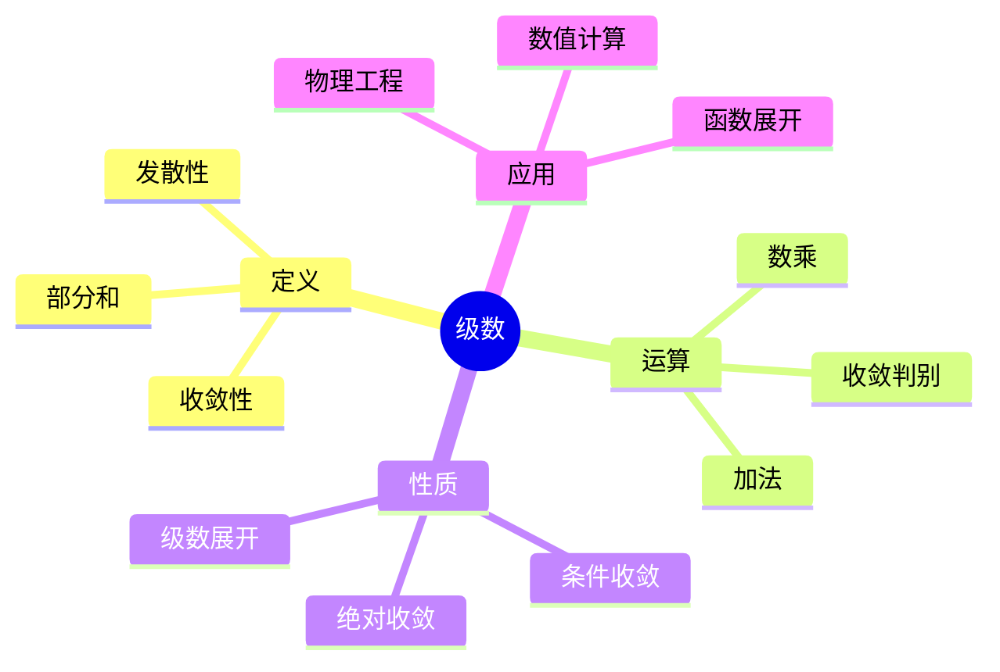
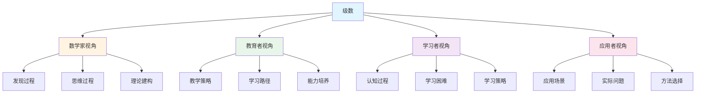
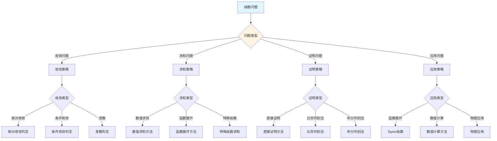
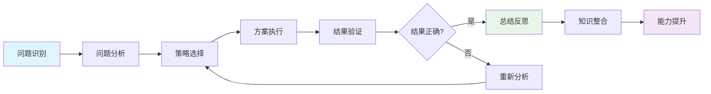
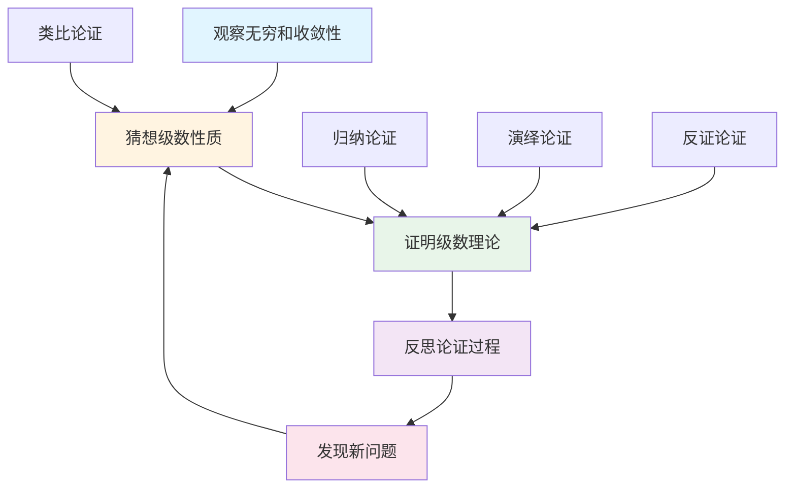
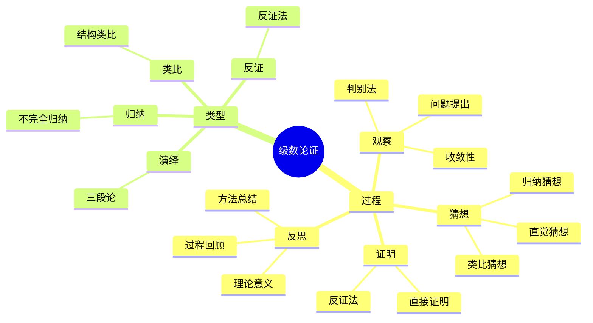

# 级数 (Series) - 三视角组织版

**概念编号**: C.CORE.017
**知识层次**: L0-L2
**知识领域**: D3 (分析)
**创建日期**: 2025年1月
**最后更新**: 2025年1月

---

## 📋 目录 / Table of Contents

- [级数 (Series) - 三视角组织版](#级数-series---三视角组织版)
  - [📋 目录 / Table of Contents](#-目录--table-of-contents)
  - [1. 📋 概述 (编号: C.CORE.017.01)](#1--概述-编号-ccore01701)
  - [🧠 认知学视角：如何理解级数 (编号: C.CORE.017.02)](#-认知学视角如何理解级数-编号-ccore01702)
    - [认知起点 (编号: C.CORE.017.02.01)](#认知起点-编号-ccore0170201)
    - [认知过程 (编号: C.CORE.017.02.02)](#认知过程-编号-ccore0170202)
      - [阶段1：直观理解阶段 (编号: C.CORE.017.02.02.01)](#阶段1直观理解阶段-编号-ccore017020201)
      - [阶段2：概念形成阶段 (编号: C.CORE.017.02.02.02)](#阶段2概念形成阶段-编号-ccore017020202)
      - [阶段3：形式化阶段 (编号: C.CORE.017.02.02.03)](#阶段3形式化阶段-编号-ccore017020203)
    - [认知障碍 (编号: C.CORE.017.02.03)](#认知障碍-编号-ccore0170203)
    - [认知工具 (编号: C.CORE.017.02.04)](#认知工具-编号-ccore0170204)
  - [🎓 教育学视角：如何教学级数 (编号: C.CORE.017.03)](#-教育学视角如何教学级数-编号-ccore01703)
    - [教学目标 (编号: C.CORE.017.03.01)](#教学目标-编号-ccore0170301)
    - [教学路径 (编号: C.CORE.017.03.02)](#教学路径-编号-ccore0170302)
      - [阶段1：引入阶段（激发兴趣） (编号: C.CORE.017.03.02.01)](#阶段1引入阶段激发兴趣-编号-ccore017030201)
      - [阶段2：探索阶段（主动建构） (编号: C.CORE.017.03.02.02)](#阶段2探索阶段主动建构-编号-ccore017030202)
      - [阶段3：形式化阶段（抽象概括） (编号: C.CORE.017.03.02.03)](#阶段3形式化阶段抽象概括-编号-ccore017030203)
      - [阶段4：巩固阶段（应用深化） (编号: C.CORE.017.03.02.04)](#阶段4巩固阶段应用深化-编号-ccore017030204)
    - [教学难点 (编号: C.CORE.017.03.03)](#教学难点-编号-ccore0170303)
    - [教学策略 (编号: C.CORE.017.03.04)](#教学策略-编号-ccore0170304)
    - [评估方法 (编号: C.CORE.017.03.05)](#评估方法-编号-ccore0170305)
  - [🔬 数学家视角：如何思考级数 (编号: C.CORE.017.04)](#-数学家视角如何思考级数-编号-ccore01704)
    - [问题起源 (编号: C.CORE.017.04.01)](#问题起源-编号-ccore0170401)
    - [思维过程 (编号: C.CORE.017.04.02)](#思维过程-编号-ccore0170402)
      - [步骤1：问题提出 (编号: C.CORE.017.04.02.01)](#步骤1问题提出-编号-ccore017040201)
      - [步骤2：概念形成 (编号: C.CORE.017.04.02.02)](#步骤2概念形成-编号-ccore017040202)
      - [步骤3：理论发展 (编号: C.CORE.017.04.02.03)](#步骤3理论发展-编号-ccore017040203)
    - [历史发展 (编号: C.CORE.017.04.03)](#历史发展-编号-ccore0170403)
    - [3.2 关键人物和贡献 (编号: C.CORE.017.04.04)](#32-关键人物和贡献-编号-ccore0170404)
    - [重要定理 (编号: C.CORE.017.04.05)](#重要定理-编号-ccore0170405)
    - [开放问题 (编号: C.CORE.017.04.06)](#开放问题-编号-ccore0170406)
    - [一、第一人称思维描述 (编号: C.CORE.017.04.07)](#一第一人称思维描述-编号-ccore0170407)
      - [1.1 Euler的发现过程](#11-euler的发现过程)
    - [二、数学直觉的形成 (编号: C.CORE.017.04.08)](#二数学直觉的形成-编号-ccore0170408)
      - [2.1 直觉在概念发现中的作用](#21-直觉在概念发现中的作用)
      - [2.2 如何培养级数直觉](#22-如何培养级数直觉)
    - [三、数学美的教育价值 (编号: C.CORE.017.04.09)](#三数学美的教育价值-编号-ccore0170409)
      - [3.1 级数论的美在哪里](#31-级数论的美在哪里)
      - [3.2 如何培养学生的数学美感](#32-如何培养学生的数学美感)
    - [四、问题解决策略 (编号: C.CORE.017.04.10)](#四问题解决策略-编号-ccore0170410)
      - [4.1 数学家的启发式方法](#41-数学家的启发式方法)
      - [4.2 思维过程分析](#42-思维过程分析)
    - [五、批判性反思 (编号: C.CORE.017.04.11)](#五批判性反思-编号-ccore0170411)
      - [5.1 级数概念的局限性](#51-级数概念的局限性)
      - [5.2 级数理论的未解决问题](#52-级数理论的未解决问题)
  - [💡 数学解释：为什么级数是这样定义的 (编号: C.CORE.017.05)](#-数学解释为什么级数是这样定义的-编号-ccore01705)
    - [一、直观解释：级数是什么？](#一直观解释级数是什么)
      - [1.1 具体例子](#11-具体例子)
      - [1.2 形象类比](#12-形象类比)
      - [1.3 几何直观](#13-几何直观)
      - [1.4 操作体验](#14-操作体验)
    - [二、知性解释：级数的本质是什么？](#二知性解释级数的本质是什么)
      - [2.1 概念定义](#21-概念定义)
      - [2.2 分类体系](#22-分类体系)
      - [2.3 抽象结构](#23-抽象结构)
      - [2.4 知识体系](#24-知识体系)
    - [三、理性解释：级数的公理化定义](#三理性解释级数的公理化定义)
      - [3.1 公理体系](#31-公理体系)
      - [3.2 形式化证明](#32-形式化证明)
      - [3.3 系统建构](#33-系统建构)
    - [四、多视角解释：从不同角度理解级数](#四多视角解释从不同角度理解级数)
      - [4.1 数学家视角：级数是如何被发现的？](#41-数学家视角级数是如何被发现的)
      - [4.2 教育者视角：如何教学级数？](#42-教育者视角如何教学级数)
      - [4.3 学习者视角：如何学习级数？](#43-学习者视角如何学习级数)
      - [4.4 应用者视角：如何应用级数？](#44-应用者视角如何应用级数)
    - [五、思维表征：用多种方式理解级数](#五思维表征用多种方式理解级数)
      - [5.1 思维导图：级数的知识结构](#51-思维导图级数的知识结构)
      - [5.2 矩阵对比：不同解释方式的对比](#52-矩阵对比不同解释方式的对比)
      - [5.3 多视角表征：从不同角度表征级数](#53-多视角表征从不同角度表征级数)
      - [5.4 决策树：级数问题分类和策略选择](#54-决策树级数问题分类和策略选择)
      - [5.5 决策逻辑路径：级数问题解决过程](#55-决策逻辑路径级数问题解决过程)
      - [5.6 多维对比矩阵：级数概念特征对比](#56-多维对比矩阵级数概念特征对比)
  - [🔍 数学论证：如何论证级数 (编号: C.CORE.017.06)](#-数学论证如何论证级数-编号-ccore01706)
    - [一、论证过程：从观察到反思](#一论证过程从观察到反思)
      - [1.1 观察（Observation）](#11-观察observation)
      - [1.2 猜想（Conjecture）](#12-猜想conjecture)
      - [1.3 证明（Proof）](#13-证明proof)
      - [1.4 反思（Reflection）](#14-反思reflection)
    - [二、论证类型：多种推理方式](#二论证类型多种推理方式)
      - [2.1 归纳论证（Inductive Reasoning）](#21-归纳论证inductive-reasoning)
      - [2.2 演绎论证（Deductive Reasoning）](#22-演绎论证deductive-reasoning)
      - [2.3 类比论证（Analogical Reasoning）](#23-类比论证analogical-reasoning)
      - [2.4 反证论证（Proof by Contradiction）](#24-反证论证proof-by-contradiction)
    - [三、论证可视化：用图形表示论证过程](#三论证可视化用图形表示论证过程)
      - [3.1 论证流程图](#31-论证流程图)
      - [3.2 论证类型对比](#32-论证类型对比)
      - [3.3 论证思维导图](#33-论证思维导图)
  - [🔗 三视角整合 (编号: C.CORE.017.07)](#-三视角整合-编号-ccore01707)
    - [三个视角的关联](#三个视角的关联)
    - [如何综合运用三个视角](#如何综合运用三个视角)
  - [📚 参考文献 (编号: C.CORE.017.08)](#-参考文献-编号-ccore01708)
    - [权威资源](#权威资源)
    - [经典教材](#经典教材)
    - [研究论文](#研究论文)

---

## 1. 📋 概述 (编号: C.CORE.017.01)

级数是无穷项的和，是分析学的重要工具。级数理论在数学、物理学、工程学等领域有广泛应用，是函数展开、数值计算的基础。

本文档从**数学认知学**、**教育学**、**数学家**三个视角深入展开级数概念，避免简单的概念堆垒。

**权威资源对齐**:

- Wikipedia: [Series (Mathematics)](https://en.wikipedia.org/wiki/Series_(mathematics))
- Stanford课程: Math 171 (Real Analysis)
- Princeton课程: MAT 201 (Analysis)
- MIT课程: 18.100A (Real Analysis)
- Metamath: [Series](http://us.metamath.org/mpeuni/df-sum.html)

---

## 🧠 认知学视角：如何理解级数 (编号: C.CORE.017.02)

### 认知起点 (编号: C.CORE.017.02.01)

**学习者已有的知识基础**:

- 序列的概念
- 极限的概念
- 日常经验中的"求和"概念

**日常经验中的类似概念**:

- "累加"：连续累加
- "总和"：所有项的和
- "无限和"：无穷项的和

### 认知过程 (编号: C.CORE.017.02.02)

#### 阶段1：直观理解阶段 (编号: C.CORE.017.02.02.01)

**具体例子**:

- 例子1：$\sum_{n=1}^\infty \frac{1}{n^2} = \frac{\pi^2}{6}$
- 例子2：$\sum_{n=0}^\infty \frac{x^n}{n!} = e^x$
- 例子3：$\sum_{n=0}^\infty x^n = \frac{1}{1-x}$（$|x| < 1$）

**形象类比**:

- **累加类比**: 级数就像"无限累加"
  - 有限和：$\sum_{i=1}^n a_i$
  - 无限和：$\sum_{n=1}^\infty a_n$

- **过程类比**: 级数就像"过程的极限"
  - 部分和序列：$S_n = \sum_{k=1}^n a_k$
  - 级数的和：$\lim_{n \to \infty} S_n$

**可视化表示**:

```text
级数的收敛:
    S_n
    ↑
    |  ●
    | ●
    |●
    └──────────→ n
    收敛到 S
```

#### 阶段2：概念形成阶段 (编号: C.CORE.017.02.02.02)

**从例子中抽象出共同特征**:

- 所有例子都涉及"无限和"
- 无限和是"极限"
- 无限和可能收敛或发散

**识别关键属性**:

1. **部分和**: $S_n = \sum_{k=1}^n a_k$
2. **极限**: $\lim_{n \to \infty} S_n$
3. **收敛性**: 极限存在且有限

**建立概念边界**:

- **什么是级数**: 无穷项的和，定义为部分和序列的极限
- **什么不是级数**:
  - 有限和（不是无限）
  - 序列本身（不是和）

#### 阶段3：形式化阶段 (编号: C.CORE.017.02.02.03)

**严格定义**:

- 级数定义：$\sum_{n=1}^\infty a_n = \lim_{N \to \infty} \sum_{n=1}^N a_n$
- 收敛性：若极限存在且有限，则级数收敛

**公理化表述**:

- 级数定义为部分和序列的极限
- 收敛性通过极限定义

**逻辑结构**:

- 级数是分析学的重要工具
- 级数是函数展开的基础
- 级数是数值计算的基础

### 认知障碍 (编号: C.CORE.017.02.03)

**常见误解**:

1. **误解1**: 认为所有级数都收敛
   - **纠正**: 不是所有级数都收敛，如调和级数发散

2. **误解2**: 认为级数就是序列
   - **纠正**: 级数是序列的部分和的极限，不是序列本身

3. **误解3**: 混淆绝对收敛和条件收敛
   - **纠正**: 绝对收敛是更强的条件

**理解难点**:

1. **难点1**: 无限和的概念
   - **原因**: "无限和"比较抽象
   - **解决方法**: 从有限和开始，逐步到无限和

2. **难点2**: 收敛性的判断
   - **原因**: 收敛性判断比较复杂
   - **解决方法**: 用具体例子，掌握判断方法

3. **难点3**: 绝对收敛和条件收敛
   - **原因**: 绝对收敛和条件收敛的区别比较抽象
   - **解决方法**: 用具体例子，强调区别

**认知陷阱**:

- **无限性**: 需要理解"无限和"的含义
- **收敛性**: 需要理解收敛的条件

### 认知工具 (编号: C.CORE.017.02.04)

**类比工具**:

- **累加类比**: 级数 = 无限累加
- **过程类比**: 级数 = 过程的极限

**可视化工具**:

- **部分和序列**: 用部分和序列表示级数
- **收敛图**: 用收敛图表示收敛性

**具体化工具**:

- **具体例子**: 用具体例子理解抽象概念
- **反例**: 用反例理解概念边界

---

## 🎓 教育学视角：如何教学级数 (编号: C.CORE.017.03)

### 教学目标 (编号: C.CORE.017.03.01)

**知识目标**:

- 理解级数的基本概念
- 掌握级数的定义
- 理解级数的收敛性
- 理解级数的应用

**能力目标**:

- 能够判断级数的收敛性
- 能够计算级数的和
- 能够应用级数解决实际问题
- 能够理解级数的应用

**情感目标**:

- 培养数学抽象思维
- 培养分析思维
- 激发对数学的兴趣

### 教学路径 (编号: C.CORE.017.03.02)

#### 阶段1：引入阶段（激发兴趣） (编号: C.CORE.017.03.02.01)

**实际问题**:

- 问题1：如何表示函数？
- 问题2：如何计算$\pi$？
- 问题3：如何计算$e$？

**历史背景**:

- 级数的历史发展
- 级数在数学中的地位
- 级数在物理中的应用

**引发认知冲突**:

- 问题：如何从有限和到无限和？
- 引出级数的概念

#### 阶段2：探索阶段（主动建构） (编号: C.CORE.017.03.02.02)

**引导发现**:

1. 让学生自己计算有限和
2. 让学生观察有限和的变化
3. 引导学生抽象出级数的定义

**合作探究**:

- 小组讨论：什么是级数？
- 小组讨论：级数有哪些性质？
- 小组讨论：如何判断收敛性？

**多元表征**:

- **语言表征**: "级数是无穷项的和"
- **符号表征**: $\sum_{n=1}^\infty a_n$
- **图形表征**: 部分和序列
- **集合表征**: 极限定义

#### 阶段3：形式化阶段（抽象概括） (编号: C.CORE.017.03.02.03)

**严格定义**:

- 级数的定义
- 收敛性的定义
- 级数的性质

**性质证明**:

- 级数的基本性质
- 级数的运算性质
- 收敛性判别法

**应用拓展**:

- 级数在分析学中的应用
- 级数在物理中的应用
- 级数在工程中的应用

#### 阶段4：巩固阶段（应用深化） (编号: C.CORE.017.03.02.04)

**练习应用**:

- 基础练习：级数的收敛性判断
- 应用练习：用级数解决实际问题
- 综合练习：级数的综合应用

**变式训练**:

- 不同形式的级数
- 不同难度的收敛性判断
- 级数的应用

**知识整合**:

- 级数与其他概念的联系
- 级数在数学体系中的地位

### 教学难点 (编号: C.CORE.017.03.03)

**难点1：无限和的概念**:

- **难点描述**: 学生难以理解无限和
- **解决方法**:
  - 从有限和开始
  - 逐步到无限和
  - 用具体例子说明

**难点2：收敛性的判断**:

- **难点描述**: 学生难以判断收敛性
- **解决方法**:
  - 用具体例子
  - 掌握判断方法
  - 用练习巩固

**难点3：绝对收敛和条件收敛**:

- **难点描述**: 学生难以理解绝对收敛和条件收敛的区别
- **解决方法**:
  - 用具体例子
  - 强调区别
  - 用反例说明

### 教学策略 (编号: C.CORE.017.03.04)

**策略1：从具体到抽象**:

- 先给出具体例子
- 再抽象出一般概念
- 最后给出严格定义

**策略2：多元表征**:

- 用语言、符号、图形等多种方式表示同一概念
- 帮助学生建立不同表征之间的联系

**策略3：问题驱动**:

- 从实际问题出发
- 引出数学概念
- 解决问题

**策略4：可视化教学**:

- 使用部分和序列
- 使用收敛图
- 使用具体例子

### 评估方法 (编号: C.CORE.017.03.05)

**形成性评估**（评估理解过程）:

- 课堂提问：检查学生对概念的理解
- 小组讨论：观察学生的思考过程
- 练习作业：检查学生的应用能力

**总结性评估**（评估最终理解）:

- 测验：检查学生对概念和计算的掌握
- 项目：检查学生应用级数解决实际问题的能力
- 反思：检查学生对级数概念的理解深度

---

## 🔬 数学家视角：如何思考级数 (编号: C.CORE.017.04)

### 问题起源 (编号: C.CORE.017.04.01)

**历史背景**:

- 17-18世纪：级数的起源
- 19世纪：级数的严格化
- 20世纪：级数的现代发展

**原始问题**:

- **问题1**: 如何表示函数？
- **问题2**: 如何计算数值？
- **问题3**: 级数有哪些性质？

**研究动机**:

- 表示函数
- 计算数值
- 发展分析学

### 思维过程 (编号: C.CORE.017.04.02)

#### 步骤1：问题提出 (编号: C.CORE.017.04.02.01)

**观察到的现象**:

- 函数可以用级数表示
- 数值可以用级数计算
- 需要研究级数的性质

**提出的猜想**:

- 可以引入级数概念
- 级数可以表示函数
- 级数有丰富的性质

**需要解决的问题**:

- 如何定义级数？
- 级数应该满足什么条件？
- 级数有哪些性质？

#### 步骤2：概念形成 (编号: C.CORE.017.04.02.02)

**尝试性定义**:

- **极限定义**: 通过部分和序列的极限
- **函数定义**: 通过函数展开

**性质探索**:

- 级数的基本性质
- 级数的收敛性
- 级数的运算性质

**结构发现**:

- 级数是分析学的重要工具
- 级数是函数展开的基础
- 级数是数值计算的基础

#### 步骤3：理论发展 (编号: C.CORE.017.04.02.03)

**定理证明**:

- 级数的基本性质
- 级数的收敛性判别法
- 级数的运算性质

**应用拓展**:

- 级数在分析学中的应用
- 级数在物理中的应用
- 级数在工程中的应用

**理论完善**:

- 级数的严格定义
- 级数的收敛性理论
- 级数的应用研究

### 历史发展 (编号: C.CORE.017.04.03)

**早期阶段**（17-18世纪）:

- **Newton (1665)**: 使用级数展开函数
- **Leibniz (1684)**: 使用级数计算
- **Euler (1748)**: 广泛使用级数

**关键突破**（19世纪）:

- **Cauchy (1821)**: 严格化级数理论
- **Weierstrass (1872)**: 完善级数理论

**现代发展**（20世纪）:

- **Bourbaki (1939)**: 统一级数理论
- **函数分析 (1950s)**: 级数的函数分析研究

### 3.2 关键人物和贡献 (编号: C.CORE.017.04.04)

**Isaac Newton (1643-1727)**:

- 使用级数展开函数
- 建立级数理论的基础

**Gottfried Wilhelm Leibniz (1646-1716)**:

- 使用级数计算
- 建立级数理论的基础

**Augustin-Louis Cauchy (1789-1857)**:

- 严格化级数理论
- 建立现代分析学

### 重要定理 (编号: C.CORE.017.04.05)

**级数的收敛性判别法**:

- 比较判别法
- 比值判别法
- 根值判别法
- 意义：级数收敛性判断的基础

**绝对收敛定理**:

- 绝对收敛的级数收敛
- 意义：级数收敛性的重要性质

**Taylor级数**:

- 函数可以用Taylor级数展开
- 意义：函数展开的基础

### 开放问题 (编号: C.CORE.017.04.06)

**未解决问题**:

- 级数的计算问题
- 级数的应用问题
- 级数的推广问题

**研究方向**:

- 级数的函数分析研究
- 级数的应用研究
- 级数的推广研究

### 一、第一人称思维描述 (编号: C.CORE.017.04.07)

#### 1.1 Euler的发现过程

**详细历史背景**:

- **1748年**：Euler发表《无穷分析引论》（Introductio in analysin infinitorum）
- **背景**：研究函数的展开，发现函数可以用级数表示
- **问题**：如何用级数表示函数？级数什么时候收敛？

**Euler的详细第一人称描述**:
> "1748年，我在研究函数时，遇到了一个问题：如何用级数表示函数？
>
> 我发现，许多函数可以用级数展开：
>
> - **指数函数**：$e^x = \sum_{n=0}^{\infty} \frac{x^n}{n!} = 1 + x + \frac{x^2}{2!} + \frac{x^3}{3!} + \cdots$
> - **正弦函数**：$\sin x = \sum_{n=0}^{\infty} \frac{(-1)^n x^{2n+1}}{(2n+1)!} = x - \frac{x^3}{3!} + \frac{x^5}{5!} - \cdots$
> - **余弦函数**：$\cos x = \sum_{n=0}^{\infty} \frac{(-1)^n x^{2n}}{(2n)!} = 1 - \frac{x^2}{2!} + \frac{x^4}{4!} - \cdots$
>
> 我的发现是：
>
> - **级数的概念**：级数是无穷和$\sum_{n=0}^{\infty} a_n$
> - **收敛性**：级数收敛当且仅当部分和序列收敛
> - **应用**：级数可以表示函数，可以计算函数值
>
> 例如，要计算$e$的值：
>
> - **级数**：$e = \sum_{n=0}^{\infty} \frac{1}{n!} = 1 + 1 + \frac{1}{2!} + \frac{1}{3!} + \cdots$
> - **部分和**：$S_n = 1 + 1 + \frac{1}{2!} + \cdots + \frac{1}{n!}$
> - **极限**：$e = \lim_{n \to \infty} S_n \approx 2.71828$
>
> 我还发现了Euler公式：
>
> - **公式**：$e^{i\theta} = \cos\theta + i\sin\theta$
> - **证明**：使用级数展开
> - **意义**：连接指数函数和三角函数
>
> 这让我意识到，级数是研究函数的重要工具，级数可以表示函数，可以计算函数值。这为分析学提供了基础。"

**详细的思维过程**:

1. **观察到的现象**（1748年）:

   **现象1：函数可以用级数表示**
   - **问题**：许多函数可以用级数展开
   - **例子**：$e^x = \sum_{n=0}^{\infty} \frac{x^n}{n!}$
   - **需要**：理解级数的性质

   **现象2：级数有收敛和发散的性质**
   - **问题**：如何判断级数是否收敛？
   - **例子**：$\sum_{n=1}^{\infty} \frac{1}{n^2}$收敛，$\sum_{n=1}^{\infty} \frac{1}{n}$发散
   - **需要**：建立收敛性判别法

   **现象3：需要统一的概念**
   - **问题**：如何统一处理不同的级数？
   - **思路**：用级数理论统一
   - **需要**：建立级数理论

2. **提出的猜想**（1748年）:

   **猜想1：用级数表示函数**
   - **思路**：定义级数$\sum_{n=0}^{\infty} a_n$表示函数
   - **例子**：$e^x = \sum_{n=0}^{\infty} \frac{x^n}{n!}$
   - **优点**：统一表示函数

   **猜想2：级数的收敛性判别法**
   - **方法**：比较判别法、比值判别法、根值判别法
   - **例子**：用比值判别法判断$\sum_{n=1}^{\infty} \frac{1}{n^2}$的收敛性
   - **意义**：为级数提供收敛性判断方法

   **猜想3：级数是分析学的基础**
   - **性质**：级数可以表示函数，可以计算函数值
   - **应用**：级数可以应用到更广泛的领域
   - **意义**：级数是分析学的基础

3. **遇到的困难**（1748-1821年）:

   **困难1：如何严格定义级数？**
   - **问题**：如何定义级数？
   - **解决**：Cauchy用部分和序列的极限定义级数
   - **意义**：为级数提供严格的数学基础

   **困难2：如何判断级数的收敛性？**
   - **问题**：如何判断级数是否收敛？
   - **解决**：建立收敛性判别法（比较判别法、比值判别法、根值判别法）
   - **意义**：为级数提供收敛性判断方法

   **困难3：如何应用级数理论？**
   - **问题**：如何用级数理论解决实际问题？
   - **解决**：建立Taylor级数、Fourier级数
   - **意义**：为级数提供应用基础

4. **突破的时刻**（1821年，Cauchy）:

   **突破1：级数的严格定义**
   - Cauchy用部分和序列的极限严格定义级数
   - **关键**：$\sum_{n=0}^{\infty} a_n = \lim_{N \to \infty} \sum_{n=0}^{N} a_n$
   - **意义**：为级数提供严格的数学基础

   **突破2：收敛性判别法**
   - 建立收敛性判别法（比较判别法、比值判别法、根值判别法）
   - **关键**：用这些方法判断级数的收敛性
   - **意义**：为级数提供收敛性判断方法

   **突破3：Taylor级数**
   - 建立Taylor级数理论
   - **关键**：函数可以用Taylor级数展开
   - **意义**：为函数展开提供基础

### 二、数学直觉的形成 (编号: C.CORE.017.04.08)

#### 2.1 直觉在概念发现中的作用

**Euler的直觉**:

- **直觉1**: "级数"是"无穷和"——这个直觉引导Euler发现级数
- **直觉2**: 级数可以表示函数——这个直觉引导Euler建立级数理论
- **直觉3**: 级数是分析学的基础——这个直觉引导Euler建立级数理论

**直觉的验证**:

- 通过严格的数学证明验证直觉的正确性
- 通过收敛性判别法严格化级数理论
- 通过应用验证级数的广泛性

**直觉的深化**:

- 从"无穷和"到"级数的严格定义"
- 从"表示函数"到"级数的广泛应用"
- 从"分析学基础"到"级数的深入发展"

#### 2.2 如何培养级数直觉

**数学家的建议**:

- **Euler**: "级数直觉是长期训练的结果。通过大量练习和深入思考，我们可以培养对级数的直觉。"
- **Cauchy**: "从具体例子开始，逐步抽象，这是培养级数直觉的有效方法。"

**培养方法**:

1. **大量练习**: 通过大量级数计算练习，培养对级数的直觉
2. **深入思考**: 深入思考级数的本质，理解级数的深层结构
3. **类比和联想**: 通过类比和联想，建立级数与其他概念的联系
4. **与专家交流**: 与数学家交流，学习他们的思维方式

**教学启示**:

- 从具体例子开始，逐步抽象
- 鼓励学生思考级数的本质
- 引导学生建立级数与其他概念的联系

### 三、数学美的教育价值 (编号: C.CORE.017.04.09)

#### 3.1 级数论的美在哪里

**结构美**:

- **简洁性**: 级数的概念非常简洁——"无穷项的和"
- **统一性**: 级数可以统一描述数学中的各种无穷和
- **和谐性**: 级数运算满足优美的规律（收敛性、绝对收敛性等）

**数学家的评价**:

- **Euler**: "级数论的美在于它的统一性。它为我们提供了一个统一的框架来理解无穷和。"
- **Cauchy**: "级数论的美在于它的基础性。它是分析学的基础，所有分析概念都可以用级数来描述。"

#### 3.2 如何培养学生的数学美感

**数学家的建议**:

- **Euler**: "展示级数论的美感，让学生感受到数学的美。"
- **Cauchy**: "通过级数论的历史和发展，让学生理解数学的美。"

**教学方法**:

1. **展示数学美**:
   - 展示级数概念的简洁性和统一性
   - 展示级数运算的优美规律
   - 展示级数在数学中的基础地位

2. **引导学生欣赏**:
   - 引导学生欣赏级数概念的简洁性
   - 引导学生欣赏级数运算的和谐性
   - 引导学生欣赏级数的基础性

3. **鼓励学生创造美**:
   - 鼓励学生发现级数论的美
   - 鼓励学生创造优美的级数证明
   - 鼓励学生探索级数论的美

### 四、问题解决策略 (编号: C.CORE.017.04.10)

#### 4.1 数学家的启发式方法

**策略1：从具体到抽象**:

- 从具体的级数例子开始
- 抽象出级数的一般性质
- 建立级数的理论体系

**策略2：从简单到复杂**:

- 先理解基本级数
- 再理解级数运算
- 最后理解级数理论

**策略3：从问题到理论**:

- 从实际问题出发
- 引出级数概念
- 建立级数理论

#### 4.2 思维过程分析

**问题识别**:

- 识别问题类型：级数定义问题、级数收敛性问题、级数应用问题
- 识别问题难度：简单问题、中等问题、复杂问题

**策略选择**:

- 简单问题：直接方法
- 中等问题：分步方法
- 复杂问题：分解方法

**执行和反思**:

- 执行策略，解决问题
- 反思过程，总结经验
- 改进方法，提高效率

### 五、批判性反思 (编号: C.CORE.017.04.11)

#### 5.1 级数概念的局限性

**概念的边界**:

- 级数只描述无穷和，不能描述所有数学结构
- 级数要求收敛性，不是所有级数都收敛
- 级数不能表示所有数学量

**概念的推广**:

- 广义级数：更一般的级数
- 形式级数：不考虑收敛性的级数
- 随机级数：随机过程中的级数

#### 5.2 级数理论的未解决问题

**未解决的问题**:

- 级数的计算问题：如何计算复杂级数？
- 级数的应用问题：如何更好地应用级数？
- 级数的推广问题：如何推广级数概念？

**研究方向**:

- 级数的函数分析研究
- 级数的应用研究
- 级数的推广研究

---

## 💡 数学解释：为什么级数是这样定义的 (编号: C.CORE.017.05)

### 一、直观解释：级数是什么？

#### 1.1 具体例子

**生活中的例子**：

- **无限和**：$1 + \frac{1}{2} + \frac{1}{4} + \frac{1}{8} + \cdots = 2$
  - 例如：每次取一半，无限累加
  - **为什么这样定义**：因为我们需要一个概念来表示"无限和"
- **函数展开**：$e^x = 1 + x + \frac{x^2}{2!} + \frac{x^3}{3!} + \cdots$
  - 例如：指数函数可以用级数表示
  - **为什么这样定义**：因为我们需要一个概念来表示"函数的级数展开"
- **数值计算**：$\pi = 4(1 - \frac{1}{3} + \frac{1}{5} - \frac{1}{7} + \cdots)$
  - 例如：$\pi$可以用级数计算
  - **为什么这样定义**：因为我们需要一个概念来表示"数值的级数表示"

**数学中的例子**：

- **几何级数**：$\sum_{n=0}^\infty ar^n = \frac{a}{1-r}$（$|r| < 1$）
  - **为什么这样定义**：我们需要一个概念来表示"几何级数"
- **幂级数**：$\sum_{n=0}^\infty a_n x^n$
  - **为什么这样定义**：我们需要一个概念来表示"函数的幂级数展开"
- **Fourier级数**：$\sum_{n=-\infty}^\infty c_n e^{inx}$
  - **为什么这样定义**：我们需要一个概念来表示"函数的Fourier级数展开"

#### 1.2 形象类比

**累加类比**：

- **级数就像"无限累加"**
  - 将无限多个数累加起来
  - 得到级数的和
- **为什么这样类比**：这个类比帮助我们理解级数的本质

**近似类比**：

- **级数就像"近似值"**
  - 部分和是近似值
  - 级数和是精确值
- **为什么这样类比**：这个类比帮助我们理解级数的收敛性

#### 1.3 几何直观

**部分和序列表示**：

- 使用部分和序列表示级数
- 例如：$S_n = \sum_{i=1}^n a_i$是部分和序列
- **为什么使用部分和**：部分和提供直观的级数表示

**收敛性表示**：

- 使用收敛性表示级数
- 例如：级数收敛当且仅当部分和序列收敛
- **为什么使用收敛性**：收敛性提供直观的级数性质

#### 1.4 操作体验

**级数运算的操作**：

- **计算级数和**：$\sum_{n=1}^\infty \frac{1}{n^2} = \frac{\pi^2}{6}$
  - **为什么这样操作**：因为我们需要一个运算来表示"级数的和"
- **级数运算规则**：$\sum (a_n + b_n) = \sum a_n + \sum b_n$，$\sum ca_n = c \sum a_n$
  - **为什么这样操作**：因为我们需要一个运算来表示"级数的运算性质"
- **级数收敛性判别**：使用比值判别法、根值判别法等
  - **为什么这样操作**：因为我们需要一个工具来判断级数的收敛性

### 二、知性解释：级数的本质是什么？

#### 2.1 概念定义

**级数的内涵**：

- **级数是无限多个数的和**
  - **定义**：$\sum_{n=1}^\infty a_n = \lim_{n \to \infty} S_n$，其中$S_n = \sum_{i=1}^n a_i$
  - **收敛性**：如果$\lim_{n \to \infty} S_n$存在，则级数收敛
  - **发散性**：如果$\lim_{n \to \infty} S_n$不存在，则级数发散
- **为什么这样定义**：这些特征使得级数成为一个完整的分析工具，支持所有无限和研究

**级数的外延**：

- **收敛级数**：级数和存在的级数
- **发散级数**：级数和不存在的级数
- **条件收敛级数**：收敛但不绝对收敛的级数
- **绝对收敛级数**：$\sum |a_n|$收敛的级数
- **为什么这样分类**：不同的级数类型有不同的性质和用途

#### 2.2 分类体系

**按收敛性分类**：

- **收敛级数**：级数和存在
- **发散级数**：级数和不存在
- **为什么这样分类**：收敛性是级数的基本特征

**按类型分类**：

- **数项级数**：$\sum a_n$（$a_n$是数）
- **函数项级数**：$\sum f_n(x)$（$f_n$是函数）
- **为什么这样分类**：类型是级数的重要特征

#### 2.3 抽象结构

**级数的运算结构**：

- **级数的加法**：$\sum (a_n + b_n) = \sum a_n + \sum b_n$
- **级数的数乘**：$\sum ca_n = c \sum a_n$
- **为什么有这些运算**：这些运算使得级数具有代数结构

**级数的关系结构**：

- **级数与序列**：级数是序列的部分和序列的极限
- **为什么有这个关系**：这个关系帮助我们研究级数

**级数的子结构**：

- **部分和序列**：$S_n = \sum_{i=1}^n a_i$
- **余项**：$R_n = \sum_{i=n+1}^\infty a_i$
- **为什么有这些结构**：这些结构是级数理论的基础

#### 2.4 知识体系

**级数在数学体系中的位置**：

- **基础地位**：级数是分析学的基础
  - 级数是函数展开的基础
  - 级数是数值计算的基础
- **为什么是基础**：级数提供了统一的框架来研究无限和

**级数与其他概念的关系**：

- **级数与序列**：级数是序列的部分和序列的极限
- **级数与函数**：函数可以用级数表示
- **级数与积分**：级数可以表示为积分
- **为什么有这些关系**：这些关系揭示了级数与其他数学概念的内在联系

### 三、理性解释：级数的公理化定义

#### 3.1 公理体系

**级数的极限定义**：

- **定义**：$\sum_{n=1}^\infty a_n = \lim_{n \to \infty} S_n$，其中$S_n = \sum_{i=1}^n a_i$，如果这个极限存在
- **为什么需要这个定义**：这个定义提供了级数的严格数学基础

**级数的Cauchy定义**：

- **定义**：级数收敛当且仅当部分和序列是Cauchy序列
- **为什么这样定义**：这个定义将级数放在更一般的框架中

#### 3.2 形式化证明

**级数运算性质的证明**：

- **级数的线性性**：$\sum (ca_n + db_n) = c \sum a_n + d \sum b_n$
  - **证明**：使用级数的定义和极限的线性性
  - **为什么这样证明**：利用级数的定义和极限的性质
- **绝对收敛性**：如果$\sum |a_n|$收敛，则$\sum a_n$收敛
  - **证明**：使用Cauchy准则和三角不等式
  - **为什么这样证明**：利用绝对收敛性和Cauchy准则

**级数关系的证明**：

- **级数与积分**：某些级数可以表示为积分
  - **证明**：使用级数的定义和积分的定义
  - **为什么这样证明**：利用级数和积分的定义

#### 3.3 系统建构

**级数论在数学基础中的地位**：

- **作为分析学基础**：级数是分析学的基础
- **提供展开工具**：级数提供了函数展开的工具
- **统一框架**：级数统一了各种无限和研究

**级数论的发展历史**：

- **Newton的引入**（1665年）：使用级数展开函数
- **Euler的发展**（1748年）：广泛使用级数
- **Cauchy的严格化**（1821年）：严格化级数理论
- **为什么这样发展**：数学的发展需要严格的基础，级数论的发展反映了这一需求

### 四、多视角解释：从不同角度理解级数

#### 4.1 数学家视角：级数是如何被发现的？

**Newton的发现过程**：

- **问题提出**：如何用级数表示函数？
- **关键洞察**：使用级数展开函数
- **重要发现**：级数可以统一描述各种函数
- **为什么这样发现**：数学家的直觉和严格证明相结合

**Cauchy的严格化过程**：

- **问题识别**：需要严格化级数概念
- **策略选择**：使用极限定义
- **定义设计**：级数是部分和序列的极限
- **为什么这样设计**：需要提供严格的基础

#### 4.2 教育者视角：如何教学级数？

**教学策略**：

- **从具体到抽象**：先学习具体例子，再学习抽象定义
- **从简单到复杂**：先学习几何级数，再学习一般级数
- **从直观到形式化**：先使用部分和等直观工具，再学习极限定义
- **为什么这样教学**：符合认知规律，帮助学生逐步建立理解

**学习路径**：

- **阶段1**：直观理解（使用部分和和具体例子）
- **阶段2**：概念形成（学习级数的定义和性质）
- **阶段3**：形式化（学习极限定义）
- **为什么这样设计**：循序渐进，逐步深入

#### 4.3 学习者视角：如何学习级数？

**认知过程**：

- **直观阶段**：通过部分和理解级数的含义
- **概念阶段**：理解级数的定义和性质
- **形式化阶段**：理解极限定义
- **为什么这样学习**：符合认知发展规律

**学习困难**：

- **困难1**：理解"无限和"的概念
- **困难2**：理解"收敛性"的概念
- **困难3**：理解"级数展开"的概念
- **如何克服**：通过具体例子、类比、历史背景等方式帮助理解

#### 4.4 应用者视角：如何应用级数？

**应用场景**：

- **分析学**：使用级数展开函数
- **数值计算**：使用级数计算数值
- **物理**：使用级数描述物理过程
- **为什么这样应用**：级数提供了强大的工具来处理各种问题

**应用方法**：

- **建立模型**：将实际问题转化为级数问题
- **使用理论**：使用级数理论解决问题
- **验证结果**：验证结果的正确性
- **为什么这样应用**：级数论提供了强大的工具来解决实际问题

### 五、思维表征：用多种方式理解级数

#### 5.1 思维导图：级数的知识结构



#### 5.2 矩阵对比：不同解释方式的对比

| 解释方式 | 特点 | 方法 | 工具 | 适用阶段 | 优势 | 局限 |
|---------|------|------|------|---------|------|------|
| **直观解释** | 具体、形象、可视 | 例子、类比、直观 | 部分和、图像 | 入门阶段 | 易于理解 | 不够严格 |
| **知性解释** | 概念、分类、抽象 | 定义、分类、结构 | 概念图、知识图谱 | 中级阶段 | 系统完整 | 不够直观 |
| **理性解释** | 公理、证明、形式化 | 公理、证明、系统 | 形式化工具、证明系统 | 高级阶段 | 严格准确 | 不够具体 |
| **多视角解释** | 多角度、整合 | 多视角、整合 | 多视角工具 | 所有阶段 | 全面深入 | 可能复杂 |

#### 5.3 多视角表征：从不同角度表征级数



#### 5.4 决策树：级数问题分类和策略选择



**说明**：

- **问题分类**：根据问题类型（收敛、求和、证明、应用）进行分类
- **策略选择**：根据问题类型选择相应的解决策略
- **方法应用**：根据具体问题选择合适的方法

#### 5.5 决策逻辑路径：级数问题解决过程



**说明**：

- **问题识别**：识别级数问题的类型和关键要素
- **问题分析**：分析问题的条件和目标
- **策略选择**：根据问题类型选择解决策略
- **方案执行**：执行选定的解决方案
- **结果验证**：验证结果的正确性
- **总结反思**：总结解题过程，反思解题方法
- **知识整合**：整合相关知识点
- **能力提升**：提升问题解决能力

#### 5.6 多维对比矩阵：级数概念特征对比

| 对比维度 | 级数定义 | 级数收敛 | 级数求和 | 级数应用 |
|---------|---------|---------|---------|---------|
| **核心特征** | 无穷和、部分和 | 收敛性、发散性 | 数值求和、函数展开 | Taylor级数、数值计算、物理应用 |
| **理解难度** | ⭐⭐⭐ | ⭐⭐⭐⭐ | ⭐⭐⭐⭐ | ⭐⭐⭐⭐ |
| **应用频率** | ⭐⭐⭐⭐ | ⭐⭐⭐⭐⭐ | ⭐⭐⭐⭐⭐ | ⭐⭐⭐⭐ |
| **理论基础** | 级数定义 | 收敛理论、判别法 | 求和理论、展开理论 | 级数应用理论 |
| **教学重点** | 概念理解 | 收敛判定 | 求和方法 | 应用能力 |
| **学习阶段** | 中级阶段 | 中级-高级 | 中级-高级 | 中级-高级 |
| **认知维度** | 知性+理性 | 理性 | 理性 | 理性+应用 |
| **思维表征** | 思维导图 | 决策树 | 决策逻辑路径 | 知识图谱 |

**说明**：

- **核心特征**：每个方面的核心特征
- **理解难度**：从1星到5星，表示理解难度
- **应用频率**：从1星到5星，表示应用频率
- **理论基础**：每个方面的理论基础
- **教学重点**：每个方面的教学重点
- **学习阶段**：每个方面的学习阶段
- **认知维度**：每个方面的认知维度
- **思维表征**：每个方面推荐的思维表征方法

---

## 🔍 数学论证：如何论证级数 (编号: C.CORE.017.06)

### 一、论证过程：从观察到反思

#### 1.1 观察（Observation）

**具体现象观察**：

- **现象1**：无穷和可能收敛也可能发散
  - 例如：$\sum_{n=1}^\infty \frac{1}{n^2}$收敛，$\sum_{n=1}^\infty \frac{1}{n}$发散
  - **为什么重要**：这个现象揭示了级数收敛性的重要性
- **现象2**：级数的收敛判别法
  - 例如：比较判别法、比值判别法、根值判别法
  - **为什么重要**：这个现象揭示了级数收敛性的判断方法

**模式识别**：

- **模式1**：Cauchy收敛准则
  - 例如：$\sum a_n$收敛当且仅当$\forall \varepsilon > 0, \exists N, \forall m,n > N, |\sum_{k=m}^n a_k| < \varepsilon$
  - **为什么重要**：这个模式可能反映了级数收敛的本质
- **模式2**：绝对收敛性
  - 例如：绝对收敛的级数收敛，且可以重排
  - **为什么重要**：这个模式可能反映了级数的结构

**问题提出**：

- **问题1**：如何严格定义级数收敛，避免"无穷和"的歧义？
  - **为什么提出**：这个问题可能揭示级数收敛的本质和基础
- **问题2**：如何证明比较判别法？
  - **为什么提出**：这个问题可能揭示级数收敛性的判断方法

#### 1.2 猜想（Conjecture）

**归纳猜想**：

- **猜想1**：级数是研究无穷和的统一工具
  - **依据**：观察不同无穷和都依赖于级数
  - **为什么提出**：这个猜想可能揭示级数的统一性
- **猜想2**：比较判别法
  - **依据**：观察具体级数的收敛性
  - **为什么提出**：这个猜想可能揭示级数收敛性的判断方法

**类比猜想**：

- **猜想1**：级数类似于"无穷和"
  - **类比对象**：无穷和
  - **为什么提出**：这个类比可能揭示级数的本质
- **猜想2**：级数收敛类似于"序列收敛"
  - **类比对象**：序列收敛
  - **为什么提出**：这个类比可能揭示级数收敛的本质

**直觉猜想**：

- **猜想1**：级数是"最自然"的无穷和概念
  - **直觉来源**：级数的直观
  - **为什么提出**：这个直觉可能揭示级数的基础地位
- **猜想2**：级数有"最小"的公理结构
  - **直觉来源**：级数的公理结构
  - **为什么提出**：这个直觉可能揭示级数的本质

#### 1.3 证明（Proof）

**直接证明**：

- **证明1**：比较判别法
  - **证明思路**：使用级数的定义和序列的性质
  - **关键步骤**：证明若$0 \leq a_n \leq b_n$且$\sum b_n$收敛，则$\sum a_n$收敛
  - **为什么这样证明**：这个证明方法直接、清晰
- **证明2**：比值判别法
  - **证明思路**：使用级数的定义和极限的性质
  - **关键步骤**：证明若$\lim |a_{n+1}/a_n| = L < 1$，则$\sum a_n$绝对收敛
  - **为什么这样证明**：这个证明方法直接、清晰

**反证法**：

- **反证法**：证明级数收敛的必要条件
  - **假设**：假设$\sum a_n$收敛但$\lim a_n \neq 0$
  - **矛盾**：导出Cauchy收敛准则的矛盾
  - **为什么这样证明**：反证法适合证明必要条件

#### 1.4 反思（Reflection）

**过程回顾**：

- **论证回顾**：从观察无穷和可能收敛也可能发散，到猜想级数的性质，再到严格证明
  - **成功之处**：成功建立了级数的严格理论
  - **不足之处**：级数概念需要进一步推广
  - **改进方向**：推广到函数项级数、幂级数等

**方法总结**：

- **证明方法**：使用了直接证明、反证法
  - **方法特点**：直接证明清晰，反证法有效
  - **适用范围**：不同方法适用于不同类型的命题
- **证明技巧**：使用Cauchy收敛准则、比较判别法、极限的性质
  - **技巧要点**：将级数问题转化为序列问题，使用反证法处理必要条件
  - **应用场景**：这些技巧可以应用于其他级数问题

**理论意义**：

- **理论贡献**：建立了级数的严格理论，揭示了级数的分析结构
  - **为什么重要**：这个论证揭示了分析学的基础结构
- **应用价值**：级数为分析学、数论、物理工程提供了基础
  - **为什么重要**：这个论证可以应用于所有无穷和问题

### 二、论证类型：多种推理方式

#### 2.1 归纳论证（Inductive Reasoning）

**不完全归纳**：

- **例子1**：从具体级数的收敛性归纳一般规律
  - **观察**：观察$\sum \frac{1}{n^2}$收敛，$\sum \frac{1}{n}$发散
  - **结论**：$\sum \frac{1}{n^p}$收敛当且仅当$p > 1$
  - **局限性**：不完全归纳的结论需要严格证明

#### 2.2 演绎论证（Deductive Reasoning）

**三段论**：

- **例子1**：证明级数的性质
  - **大前提**：所有收敛级数都满足Cauchy收敛准则
  - **小前提**：$\sum \frac{1}{n^2}$收敛
  - **结论**：$\sum \frac{1}{n^2}$满足Cauchy收敛准则
  - **为什么有效**：三段论是严格的演绎推理

#### 2.3 类比论证（Analogical Reasoning）

**结构类比**：

- **例子1**：级数与序列的类比
  - **类比对象**：序列
  - **相似性**：级数的部分和序列收敛
  - **结论**：级数可以理解为"部分和序列的极限"
  - **局限性**：类比不能替代严格证明

#### 2.4 反证论证（Proof by Contradiction）

**反证法**：

- **例子1**：证明级数收敛的必要条件
  - **假设**：假设$\sum a_n$收敛但$\lim a_n \neq 0$
  - **矛盾**：导出矛盾
  - **结论**：若$\sum a_n$收敛，则$\lim a_n = 0$
  - **为什么有效**：反证法是严格的间接证明

### 三、论证可视化：用图形表示论证过程

#### 3.1 论证流程图



#### 3.2 论证类型对比

| 论证类型 | 特点 | 适用场景 | 优势 | 局限 |
|---------|------|---------|------|------|
| **归纳论证** | 从特殊到一般 | 发现规律、提出猜想 | 启发性强 | 结论或然 |
| **演绎论证** | 从一般到特殊 | 严格证明、逻辑推理 | 结论必然 | 需要前提 |
| **类比论证** | 基于相似性 | 启发思路、发现联系 | 创造性高 | 结论或然 |
| **反证论证** | 假设否定 | 证明必要条件 | 间接有效 | 需要矛盾 |

#### 3.3 论证思维导图



---

## 🔗 三视角整合 (编号: C.CORE.017.07)

### 三个视角的关联

**认知学视角 ↔ 教育学视角**:

- 认知学视角揭示的理解机制，指导教育学视角的教学设计
- 教育学视角的教学实践，验证认知学视角的理论

**认知学视角 ↔ 数学家视角**:

- 数学家视角的思维过程，启发认知学视角的认知路径
- 认知学视角的认知障碍，解释数学家视角的历史困难

**教育学视角 ↔ 数学家视角**:

- 数学家视角的历史发展，为教育学视角提供教学素材
- 教育学视角的教学策略，帮助学习者理解数学家视角的思维过程

### 如何综合运用三个视角

**学习建议**:

1. **从认知学视角开始**: 先建立直观理解
2. **用教育学视角深化**: 通过教学路径系统学习
3. **用数学家视角升华**: 理解概念的深层意义和历史背景

**教学建议**:

1. **引入阶段**: 用数学家视角的问题起源激发兴趣
2. **探索阶段**: 用认知学视角的认知过程引导发现
3. **形式化阶段**: 用教育学视角的教学策略系统教学
4. **巩固阶段**: 综合三个视角深化理解

---

## 📚 参考文献 (编号: C.CORE.017.08)

### 权威资源

- Wikipedia: [Series (Mathematics)](https://en.wikipedia.org/wiki/Series_(mathematics))
- Metamath: [Series](http://us.metamath.org/mpeuni/df-sum.html)

### 经典教材

- Newton, I. (1665). *De analysi per aequationes numero terminorum infinitas*. London.
- Euler, L. (1748). *Introductio in analysin infinitorum*. Lausanne.
- Rudin, W. (1976). *Principles of Mathematical Analysis*. McGraw-Hill.

### 研究论文

- Newton, I. (1665). "De analysi per aequationes numero terminorum infinitas". *London*.
- Euler, L. (1748). *Introductio in analysin infinitorum*. Lausanne.

---

**创建日期**: 2025年1月
**最后更新**: 2025年1月
**维护状态**: 持续更新中
