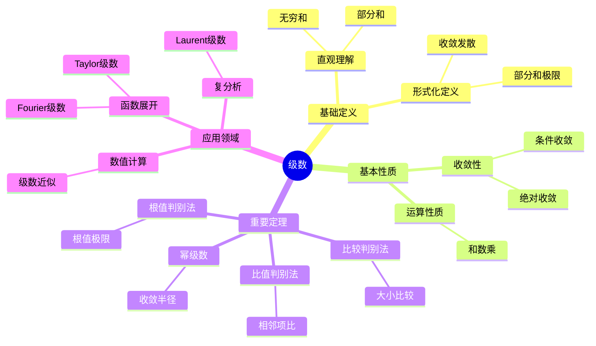
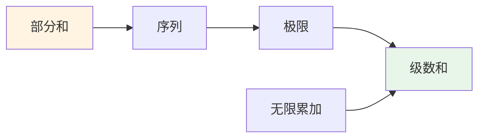
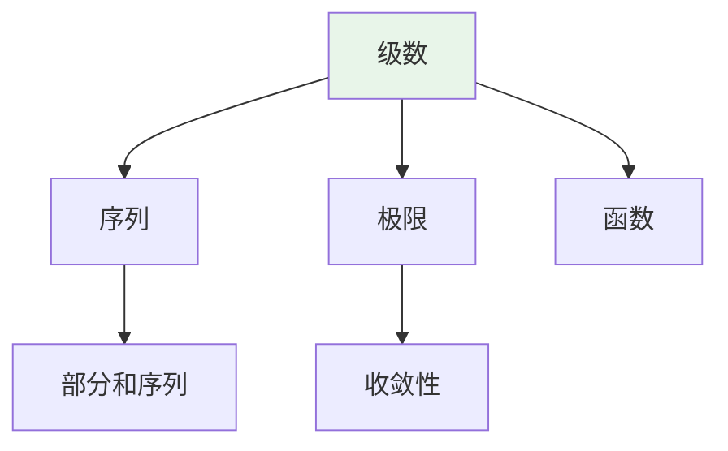
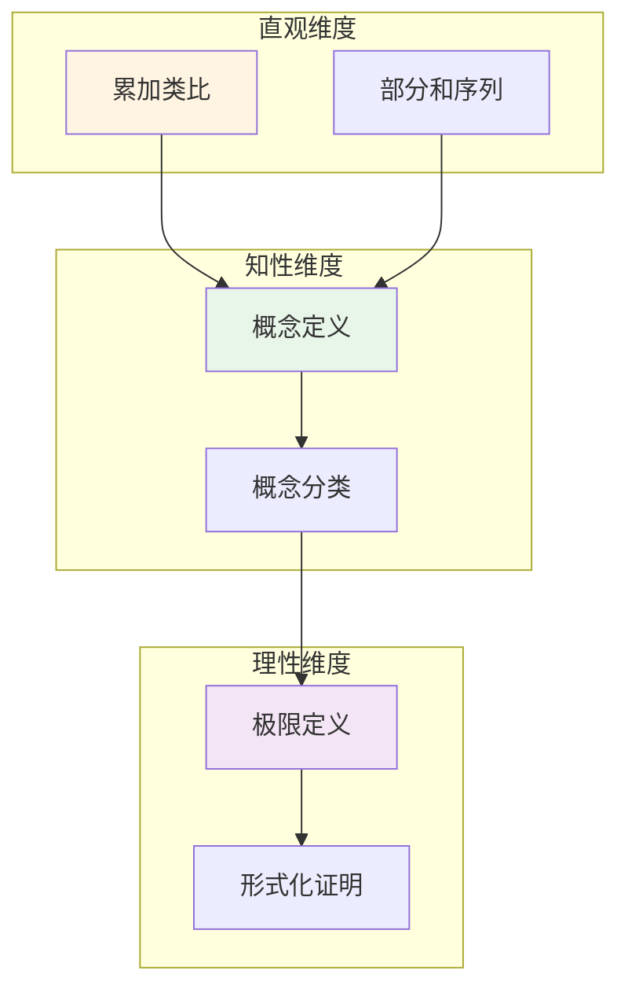

# 级数 (Series)

**概念编号**: C.CORE.017
**知识层次**: L0-L2
**知识领域**: D3 (分析)
**创建日期**: 2025年11月21日
**最后更新**: 2025年11月21日

---

## 📋 概述

级数是无穷项的和，是分析学的重要工具。
级数理论在数学、物理学、工程学等领域有广泛应用，是函数展开、数值计算的基础。

**权威资源对齐**:

- Wikipedia: [Series (Mathematics)](https://en.wikipedia.org/wiki/Series_(mathematics))
- Stanford课程: Math 171 (Real Analysis)
- Princeton课程: MAT 201 (Analysis)
- MIT课程: 18.100A (Real Analysis)
- Metamath: [Series](http://us.metamath.org/mpeuni/df-sum.html)

---

## 🎯 严格定义

### 基础定义 (L0)

**直观理解**: 级数是无穷项的和，是有限和的推广。

**基本定义**: 级数 $\sum_{n=1}^\infty a_n$ 定义为部分和序列 $(S_n)$ 的极限，其中 $S_n = \sum_{k=1}^n a_k$。

**简单例子**:

- $\sum_{n=1}^\infty \frac{1}{n^2} = \frac{\pi^2}{6}$
- $\sum_{n=0}^\infty \frac{x^n}{n!} = e^x$
- $\sum_{n=0}^\infty x^n = \frac{1}{1-x}$（$|x| < 1$）

### 形式化定义 (L1)

**级数定义**: 级数 $\sum_{n=1}^\infty a_n$ 定义为：

$$\sum_{n=1}^\infty a_n = \lim_{N \to \infty} \sum_{n=1}^N a_n$$

若极限存在且有限，则级数收敛；否则发散。

**绝对收敛**: 若 $\sum |a_n|$ 收敛，则 $\sum a_n$ 绝对收敛。

**条件收敛**: 若 $\sum a_n$ 收敛但 $\sum |a_n|$ 发散，则条件收敛。

---

## 📚 历史背景

### 发展脉络

**17-18世纪**: 级数的使用

- **Newton (1665)**: 使用级数展开
- **Euler (1748)**: 广泛使用级数
- **Leibniz (1684)**: 研究交错级数

**19世纪**: 级数的严格化

- **Cauchy (1821)**: 严格化级数理论
- **Abel (1826)**: 研究幂级数
- **Weierstrass (1872)**: 完善级数理论

### 关键人物

- **Isaac Newton (1643-1727)**: 使用级数展开
- **Leonhard Euler (1707-1783)**: 广泛使用级数
- **Augustin-Louis Cauchy (1789-1857)**: 严格化级数理论
- **Niels Abel (1802-1829)**: 研究幂级数

---

## 🔍 性质与定理

### 基本性质 (L1)

**性质1: 级数的运算**:

- **和**: $\sum (a_n + b_n) = \sum a_n + \sum b_n$
- **数乘**: $\sum (ca_n) = c\sum a_n$

**性质2: 收敛的必要条件**:

- **陈述**: 若 $\sum a_n$ 收敛，则 $\lim_{n \to \infty} a_n = 0$

**性质3: 绝对收敛性**:

- **陈述**: 绝对收敛的级数收敛

### 重要定理 (L2)

**定理1: 比较判别法**:

- **陈述**: 若 $0 \leq a_n \leq b_n$ 且 $\sum b_n$ 收敛，则 $\sum a_n$ 收敛

**定理2: 比值判别法**:

- **陈述**: 若 $\lim |a_{n+1}/a_n| = L$，则 $L < 1$ 时收敛，$L > 1$ 时发散

**定理3: 根值判别法**:

- **陈述**: 若 $\lim \sqrt[n]{|a_n|} = L$，则 $L < 1$ 时收敛，$L > 1$ 时发散

**定理4: 幂级数收敛半径**:

- **陈述**: 幂级数 $\sum a_n x^n$ 有收敛半径 $R = 1/\limsup \sqrt[n]{|a_n|}$

---

## 💡 应用实例

### 理论应用

- 函数展开（Taylor级数、Fourier级数）
- 数值计算（级数近似）
- 复分析（Laurent级数）

### 实际应用

- 物理学（Fourier分析）
- 工程学（信号处理）
- 计算机科学（数值方法）

---

## 🔗 关联概念

### 依赖关系

- 序列（级数是序列的部分和）
- 极限（级数的定义需要极限）

### 推广关系

- 函数项级数（项是函数的级数）
- 幂级数（$\sum a_n x^n$）
- Fourier级数（三角级数）

---

## 📖 参考文献

- Wikipedia: [Series (Mathematics)](https://en.wikipedia.org/wiki/Series_(mathematics))
- Rudin, W. (1976). *Principles of Mathematical Analysis*. McGraw-Hill.
- Apostol, T. M. (1974). *Mathematical Analysis*. Addison-Wesley.

---

## 🗺️ 思维导图 (编号: C.CORE.017.MIND)

### 级数概念思维导图

---

## 📊 知识多维关系矩阵 (编号: C.CORE.017.MATRIX)

### 级数的多维关系矩阵

| 维度 | 指标 | 级数 |
|------|------|------|
| **知识层次** | L0基础 | ⭐⭐⭐⭐ |
| | L1中级 | ⭐⭐⭐⭐⭐ |
| | L2高级 | ⭐⭐⭐⭐ |
| | L3研究 | ⭐⭐⭐ |
| **知识领域** | D1基础数学 | ⭐⭐⭐ |
| | D2代数 | ⭐⭐ |
| | D3分析 | ⭐⭐⭐⭐⭐ |
| | D6数论 | ⭐⭐⭐ |
| **依赖关系** | 前置概念 | 序列、极限 |
| | 后续概念 | 函数展开、Fourier分析 |
| **应用关系** | 理论应用 | ⭐⭐⭐⭐⭐ |
| | 实际应用 | ⭐⭐⭐⭐ |
| | 交叉应用 | ⭐⭐⭐ |
| **学习难度** | 直观理解 | ⭐⭐⭐ |
| | 形式化理解 | ⭐⭐⭐⭐ |
| | 深入应用 | ⭐⭐⭐ |

---

## 💭 形象化解释与论证 (编号: C.CORE.017.VISUAL)

### 形象化解释

**1. 级数的直观理解**:

- **类比**: 级数就像"无穷项的和"或"累加的极限"
- **例子**:
  - 几何级数：$1 + \frac{1}{2} + \frac{1}{4} + \frac{1}{8} + \cdots = 2$
  - 调和级数：$1 + \frac{1}{2} + \frac{1}{3} + \frac{1}{4} + \cdots$（发散）
  - 指数级数：$e^x = 1 + x + \frac{x^2}{2!} + \frac{x^3}{3!} + \cdots$

**2. 收敛的直观理解**:

- **类比**: 收敛就像"部分和趋于一个固定值"
- **解释**:
  - 部分和序列$(S_n)$有极限
  - 当$n$趋于无穷时，$S_n$趋于级数的和
  - 如果极限不存在或为无穷，级数发散

**3. 绝对收敛的直观理解**:

- **类比**: 绝对收敛就像"绝对值级数收敛"
- **解释**:
  - 绝对收敛的级数可以任意重排而不改变和
  - 条件收敛的级数重排可能改变和（Riemann重排定理）

### 认知科学视角

**1. 数学教育家Dienes的观点**:

- **多表征原则**: 通过数值、图形、符号等多种方式理解级数
- **变化性原则**: 通过不同的级数例子理解级数的本质
- **教学启示**: 使用数值计算、图形可视化、符号证明等多种方法

**2. 数学认知学家Tall的观点**:

- **过程-对象对偶**: 理解"级数求和过程"（如何计算）和"级数"（对象）
- **认知层次**: 从直观理解（"无穷和"）到形式化理解（部分和极限）

---

## 👨‍🏫 专家观点与论证 (编号: C.CORE.017.EXPERT)

### 数学家的观点

**1. Isaac Newton (1643-1727) - 级数展开的发明者**:
> "级数展开是研究函数的重要工具，Taylor级数揭示了函数的局部性质。"
>
> **意义**: Newton使用级数展开研究函数，开创了函数分析。

**2. Leonhard Euler (1707-1783) - 级数理论的大师**:
> "级数是数学中最强大的工具之一，Euler公式$e^{i\pi} + 1 = 0$体现了级数的深刻性。"
>
> **意义**: Euler广泛使用级数，建立了级数理论的基础。

**3. Augustin-Louis Cauchy (1789-1857) - 级数严格化的推动者**:
> "级数必须严格定义，收敛性判别法是理解级数的关键。"
>
> **意义**: Cauchy严格化了级数理论，建立了现代分析学的基础。

**4. Niels Abel (1802-1829) - 幂级数理论的奠基者**:
> "幂级数的收敛半径是理解幂级数的关键，Abel定理揭示了幂级数的深刻性质。"
>
> **意义**: Abel建立了幂级数理论，为复分析奠定了基础。

### 数学教育家的观点

**1. Zoltan Dienes (1916-2014) - 数学教育家**:
> "级数概念应该通过数值、图形、符号等多种方式学习。"
>
> **教学启示**:
>
> - 使用数值计算展示级数收敛
> - 使用图形可视化级数部分和
> - 逐步引入收敛性判别法

**2. Hans Freudenthal (1905-1990) - 数学教育家**:
> "级数概念的学习需要从'有限和'发展到'无穷和结构'。"
>
> **认知发展**:
>
> - **有限阶段**: 理解有限和（如$\sum_{k=1}^n a_k$）
> - **无穷阶段**: 理解无穷级数（如$\sum_{k=1}^\infty a_k$）

### 数学认知学家的观点

**1. David Tall - 数学认知学家**:
> "级数概念的理解需要从'过程'（如何求和）发展到'对象'（级数本身）。"
>
> **认知层次**:
>
> - **过程层次**: 理解"如何计算级数"（如部分和序列）
> - **对象层次**: 理解"级数"（如$\sum a_n$是一个级数）

---

## 🎨 认知维度表征 (编号: C.CORE.017.COGNITIVE)

### 直观维度表征 (编号: C.CORE.017.INTUITIVE)

#### 形象类比

- **累加类比**: 级数就像"无限累加"
  - 就像不断添加项，看总和是否趋向某个值
  - 就像银行账户不断存款，看余额是否稳定

- **序列类比**: 级数就像"部分和序列的极限"
  - 部分和序列越来越接近某个值
  - 就像数列的"最终值"

#### 具体例子

- **例子1**: $\sum_{n=1}^\infty \frac{1}{n^2} = \frac{\pi^2}{6}$
  - 部分和：$1, 1.25, 1.36, 1.42, \ldots$
  - 收敛到 $\frac{\pi^2}{6} \approx 1.645$

- **例子2**: $\sum_{n=0}^\infty \frac{x^n}{n!} = e^x$
  - 这是指数函数的幂级数展开
  - 对所有 $x$ 都收敛

#### 可视化表示

#### 几何直观

- **部分和序列**: 通过部分和序列理解级数
  - 部分和序列的图像
  - 收敛级数的部分和趋向某个值

- **面积直观**: 通过面积理解级数
  - 正项级数可以理解为面积
  - 收敛级数的"总面积"有限

---

### 知性维度表征 (编号: C.CORE.017.INTELLECTUAL)

#### 概念定义

- **严格定义**: $\sum_{n=1}^\infty a_n = \lim_{N \to \infty} \sum_{n=1}^N a_n$
- **等价定义**: 绝对收敛、条件收敛
- **特征描述**: 级数是无穷项的和，是有限和的推广

#### 概念分类

- **收敛级数 vs 发散级数**: 按收敛性分类
- **绝对收敛 vs 条件收敛**: 按收敛方式分类
- **正项级数 vs 交错级数**: 按项的性质分类

#### 概念关系

#### 知识矩阵

| 维度 | 指标 | 级数 |
|------|------|------|
| **知识层次** | L0基础 | ⭐⭐⭐⭐ |
| | L1中级 | ⭐⭐⭐⭐⭐ |
| | L2高级 | ⭐⭐⭐⭐ |
| **知识领域** | D3分析 | ⭐⭐⭐⭐⭐ |
| **学习难度** | 直观理解 | ⭐⭐⭐ |
| | 形式化理解 | ⭐⭐⭐⭐ |
| **认知维度** | 直观维度 | ⭐⭐⭐⭐ |
| | 知性维度 | ⭐⭐⭐⭐⭐ |
| | 理性维度 | ⭐⭐⭐⭐ |

---

### 理性维度表征 (编号: C.CORE.017.RATIONAL)

#### 公理体系

- **级数定义**: $\sum_{n=1}^\infty a_n = \lim_{N \to \infty} \sum_{n=1}^N a_n$
- **收敛性条件**: 部分和序列收敛
- **绝对收敛性**: $\sum |a_n|$ 收敛

#### 形式化定义

- **形式化定义**: 使用极限严格定义
- **符号系统**: $\sum$, $\sum_{n=1}^\infty$, $\sum_{n=0}^\infty$
- **类型系统**: 级数是序列类型到数值类型的映射

#### 逻辑推理

- **基本定理**: 收敛的必要条件、绝对收敛性、比较判别法
- **证明思路**: 使用极限定义和序列性质证明
- **推理链**: 定义 → 收敛性条件 → 判别法 → 重要定理

#### 证明系统

- **证明方法**: 极限方法、比较方法、积分方法
- **形式化证明**: 可以使用Lean4等工具进行形式化
- **验证工具**: Metamath、Lean4等

---

### 综合整合表征 (编号: C.CORE.017.INTEGRATED)

#### 多维度整合

#### 图形转换

- **思维导图**: 展示级数的知识结构
- **知识图谱**: 展示级数与其他概念的关系
- **知识矩阵**: 展示级数的多维度特征

#### 应用示例

- **应用1**: 函数展开（Taylor级数、Fourier级数）
- **应用2**: 数值计算（级数近似）
- **应用3**: 物理应用（波动、热传导）

---

**创建日期**: 2025年11月21日
**最后更新**: 2025年11月21日
**维护状态**: 持续更新中
