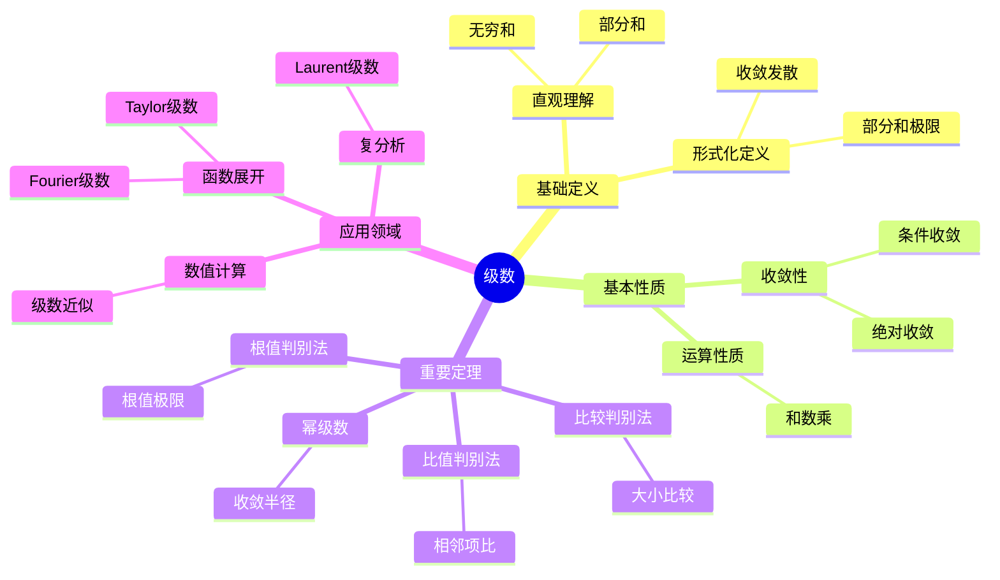
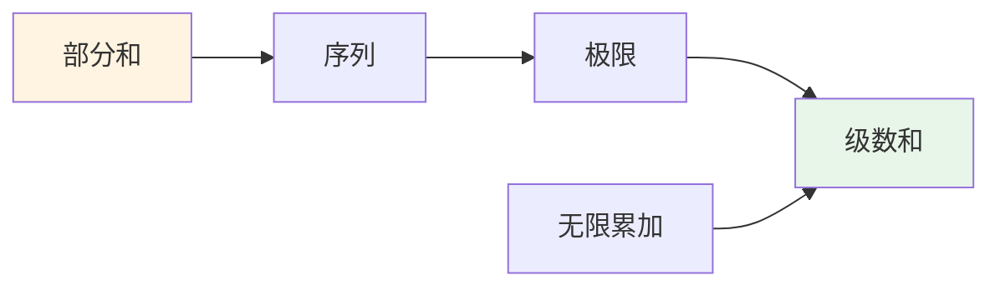
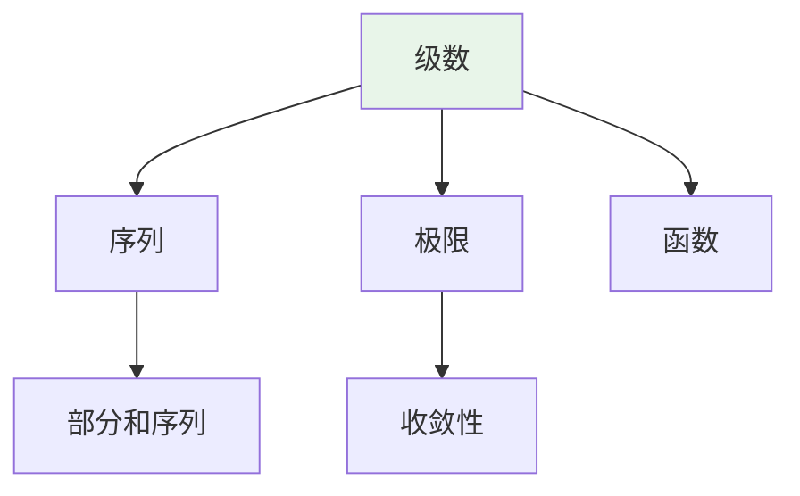
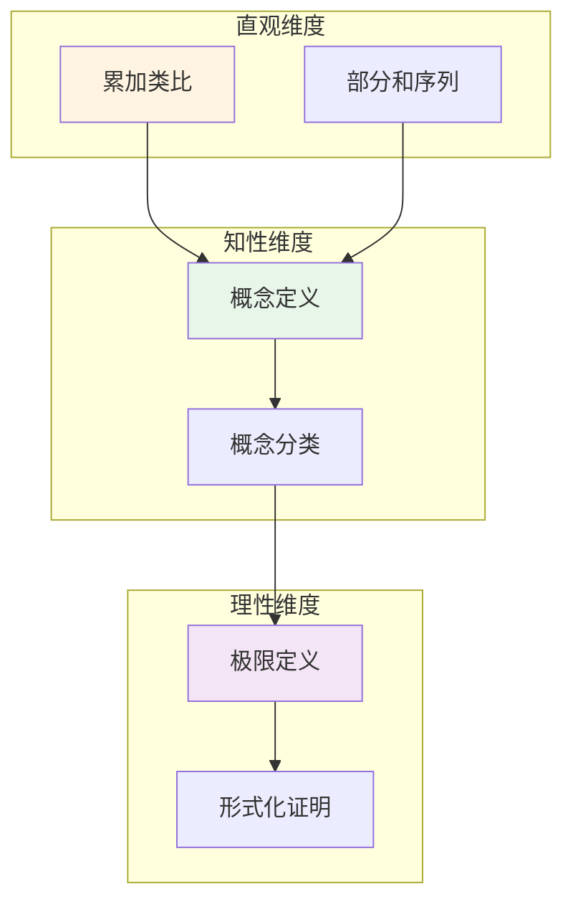

# 级数 (Series)

**概念编号**: C.CORE.017
**知识层次**: L0-L2
**知识领域**: D3 (分析)
**创建日期**: 2025年11月21日
**最后更新**: 2025年11月21日

---

## 📑 目录

- [级数 (Series)](#级数-series)
  - [📑 目录](#-目录)
  - [1. 📋 概述](#1--概述)
  - [2. 🎯 严格定义](#2--严格定义)
    - [2.1 基础定义 (L0)](#21-基础定义-l0)
    - [2.2 形式化定义 (L1)](#22-形式化定义-l1)
  - [3. 📚 历史背景](#3--历史背景)
    - [3.1 发展脉络](#31-发展脉络)
    - [3.2 关键人物](#32-关键人物)
    - [3.3 重要事件](#33-重要事件)
  - [4. 🔍 性质与定理](#4--性质与定理)
    - [4.1 基本性质 (L1)](#41-基本性质-l1)
    - [4.2 重要定理 (L2)](#42-重要定理-l2)
  - [5. 🔬 形式化证明](#5--形式化证明)
    - [定理1: 比较判别法的形式化证明](#定理1-比较判别法的形式化证明)
  - [6. 💡 应用实例](#6--应用实例)
    - [6.1 理论应用](#61-理论应用)
    - [6.2 实际应用](#62-实际应用)
      - [应用1: 物理学 - Fourier级数展开](#应用1-物理学---fourier级数展开)
      - [应用2: 工程学 - Taylor级数近似](#应用2-工程学---taylor级数近似)
      - [应用3: 计算机科学 - 数值积分](#应用3-计算机科学---数值积分)
  - [7. 🔗 关联概念](#7--关联概念)
    - [依赖关系](#依赖关系)
    - [推广关系](#推广关系)
  - [8. 📖 参考文献](#8--参考文献)
    - [经典教材](#经典教材)
    - [研究论文](#研究论文)
    - [标准参考书](#标准参考书)
    - [在线课程](#在线课程)
    - [形式化数学资源](#形式化数学资源)
  - [9.1 🗺️ 思维导图 (编号: C.CORE.017.MIND)](#91-️-思维导图-编号-ccore017mind)
    - [级数概念思维导图](#级数概念思维导图)
  - [9.2 📊 知识多维关系矩阵 (编号: C.CORE.017.MATRIX)](#92--知识多维关系矩阵-编号-ccore017matrix)
    - [级数的多维关系矩阵](#级数的多维关系矩阵)
  - [9.3 💭 形象化解释与论证 (编号: C.CORE.017.VISUAL)](#93--形象化解释与论证-编号-ccore017visual)
    - [形象化解释](#形象化解释)
    - [认知科学视角](#认知科学视角)
  - [9.6 👨‍🏫 专家观点与论证 (编号: C.CORE.017.EXPERT)](#96--专家观点与论证-编号-ccore017expert)
    - [数学家的观点](#数学家的观点)
    - [数学教育家的观点](#数学教育家的观点)
    - [数学认知学家的观点](#数学认知学家的观点)
  - [9.7 🎨 认知维度表征 (编号: C.CORE.017.COGNITIVE)](#97--认知维度表征-编号-ccore017cognitive)
    - [直观维度表征 (编号: C.CORE.017.INTUITIVE)](#直观维度表征-编号-ccore017intuitive)
      - [形象类比](#形象类比)
      - [具体例子](#具体例子)
      - [可视化表示](#可视化表示)
      - [几何直观](#几何直观)
    - [知性维度表征 (编号: C.CORE.017.INTELLECTUAL)](#知性维度表征-编号-ccore017intellectual)
      - [概念定义](#概念定义)
      - [概念分类](#概念分类)
      - [概念关系](#概念关系)
      - [知识矩阵](#知识矩阵)
    - [理性维度表征 (编号: C.CORE.017.RATIONAL)](#理性维度表征-编号-ccore017rational)
      - [公理体系](#公理体系)
      - [形式化定义](#形式化定义)
      - [逻辑推理](#逻辑推理)
      - [证明系统](#证明系统)
    - [综合整合表征 (编号: C.CORE.017.INTEGRATED)](#综合整合表征-编号-ccore017integrated)
      - [多维度整合](#多维度整合)
      - [图形转换](#图形转换)
      - [应用示例](#应用示例)
  - [9.5 📚 习题库](#95--习题库)
    - [L0基础题（5道）](#l0基础题5道)
    - [L1中级题（6道）](#l1中级题6道)
    - [L2高级题（4道）](#l2高级题4道)

## 1. 📋 概述

级数是无穷项的和，是分析学的重要工具。
级数理论在数学、物理学、工程学等领域有广泛应用，是函数展开、数值计算的基础。

**权威资源对齐**:

- Wikipedia: [Series (Mathematics)](https://en.wikipedia.org/wiki/Series_(mathematics))
- Stanford课程: Math 171 (Real Analysis)
- Princeton课程: MAT 201 (Analysis)
- MIT课程: 18.100A (Real Analysis)
- Metamath: [Series](http://us.metamath.org/mpeuni/df-sum.html)

---

## 2. 🎯 严格定义

### 2.1 基础定义 (L0)

**直观理解**: 级数是无穷项的和，是有限和的推广。

**基本定义**: 级数 $\sum_{n=1}^\infty a_n$ 定义为部分和序列 $(S_n)$ 的极限，其中 $S_n = \sum_{k=1}^n a_k$。

**简单例子**:

- $\sum_{n=1}^\infty \frac{1}{n^2} = \frac{\pi^2}{6}$
- $\sum_{n=0}^\infty \frac{x^n}{n!} = e^x$
- $\sum_{n=0}^\infty x^n = \frac{1}{1-x}$（$|x| < 1$）

### 2.2 形式化定义 (L1)

**级数定义**: 级数 $\sum_{n=1}^\infty a_n$ 定义为：

$$\sum_{n=1}^\infty a_n = \lim_{N \to \infty} \sum_{n=1}^N a_n$$

若极限存在且有限，则级数收敛；否则发散。

**绝对收敛**: 若 $\sum |a_n|$ 收敛，则 $\sum a_n$ 绝对收敛。

**条件收敛**: 若 $\sum a_n$ 收敛但 $\sum |a_n|$ 发散，则条件收敛。

---

## 3. 📚 历史背景

### 3.1 发展脉络

**17-18世纪**: 级数的早期研究

- **Newton (1665)**: 使用级数展开，研究二项式级数
- **Leibniz (1684)**: 研究交错级数，发现 $\frac{\pi}{4} = 1 - \frac{1}{3} + \frac{1}{5} - \cdots$
- **Taylor (1715)**: 提出Taylor级数
- **Maclaurin (1742)**: 提出Maclaurin级数
- **Euler (1748)**: 广泛使用级数，发现 $\sum_{n=1}^\infty \frac{1}{n^2} = \frac{\pi^2}{6}$

**19世纪**: 级数的严格化

- **Cauchy (1821)**: 在《分析教程》中严格化级数理论，提出Cauchy收敛准则
- **Abel (1826)**: 研究幂级数，提出Abel定理
- **Dirichlet (1837)**: 研究Dirichlet级数
- **Weierstrass (1872)**: 完善级数理论，研究一致收敛

**20世纪**: 级数的现代发展

- **Hardy-Littlewood (1914)**: 研究级数的求和
- **Ramanujan (1913)**: 发现级数的奇妙性质
- **Bourbaki (1939)**: 在抽象框架下统一级数理论

### 3.2 关键人物

- **Isaac Newton (1643-1727)**: 使用级数展开
- **Gottfried Leibniz (1646-1716)**: 研究交错级数
- **Brook Taylor (1685-1731)**: 提出Taylor级数
- **Colin Maclaurin (1698-1746)**: 提出Maclaurin级数
- **Leonhard Euler (1707-1783)**: 广泛使用级数
- **Augustin-Louis Cauchy (1789-1857)**: 严格化级数理论
- **Niels Abel (1802-1829)**: 研究幂级数

### 3.3 重要事件

- **1665**: Newton使用级数展开
- **1684**: Leibniz研究交错级数
- **1715**: Taylor提出Taylor级数
- **1748**: Euler发现 $\sum_{n=1}^\infty \frac{1}{n^2} = \frac{\pi^2}{6}$
- **1821**: Cauchy严格化级数理论
- **1826**: Abel研究幂级数
- **1913**: Ramanujan发现级数的奇妙性质

---

## 4. 🔍 性质与定理

### 4.1 基本性质 (L1)

**性质1: 级数的运算**:

- **和**: $\sum (a_n + b_n) = \sum a_n + \sum b_n$
- **数乘**: $\sum (ca_n) = c\sum a_n$

**性质2: 收敛的必要条件**:

- **陈述**: 若 $\sum a_n$ 收敛，则 $\lim_{n \to \infty} a_n = 0$

**性质3: 绝对收敛性**:

- **陈述**: 绝对收敛的级数收敛

### 4.2 重要定理 (L2)

**定理1: 比较判别法**:

- **陈述**: 若 $0 \leq a_n \leq b_n$ 且 $\sum b_n$ 收敛，则 $\sum a_n$ 收敛

**定理2: 比值判别法**:

- **陈述**: 若 $\lim |a_{n+1}/a_n| = L$，则 $L < 1$ 时收敛，$L > 1$ 时发散

**定理3: 根值判别法**:

- **陈述**: 若 $\lim \sqrt[n]{|a_n|} = L$，则 $L < 1$ 时收敛，$L > 1$ 时发散

---

## 5. 🔬 形式化证明

### 定理1: 比较判别法的形式化证明

**定理陈述**:
$$\forall (a_n) \forall (b_n) [0 \leq a_n \leq b_n \land \sum b_n \text{ 收敛} \to \sum a_n \text{ 收敛}]$$

**前提**:

- 级数收敛的定义
- 部分和的性质
- 单调有界定理

**形式化证明**:

```text
步骤1: 假设条件
  设: 0 <= a_n <= b_n for all n, and sum b_n 收敛

步骤2: 部分和的有界性
  定义: S_n = sum_{k=1}^n a_k, T_n = sum_{k=1}^n b_k
  性质: S_n <= T_n for all n (步骤1: a_n <= b_n)
  性质: (T_n)收敛，因此有界 (级数收敛定义)
  因此: (S_n)有界 (S_n <= T_n)

步骤3: 部分和的单调性
  S_{n+1} = S_n + a_{n+1} >= S_n (步骤1: a_n >= 0)
  因此: (S_n)单调递增

步骤4: 应用单调有界定理
  由步骤2和步骤3: (S_n)单调递增有上界
  由单调有界定理: (S_n)收敛
  因此: sum a_n 收敛

步骤5: 结论
  因此: [0 <= a_n <= b_n and sum b_n 收敛] -> sum a_n 收敛
```

**Metamath格式参考**:

```text
${
  comparison.1 $e |- (a_n) e. Seq $.
  comparison.2 $e |- (b_n) e. Seq $.
  comparison.3 $e |- forall n, 0 <= a_n <= b_n $.
  comparison.4 $e |- sum b_n 收敛 $.
  comparison $p |- sum a_n 收敛 $=
    ( ... ) ABCDEFG $.
$}
```

---

**定理4: 幂级数收敛半径**:

- **陈述**: 幂级数 $\sum a_n x^n$ 有收敛半径 $R = 1/\limsup \sqrt[n]{|a_n|}$

---

## 6. 💡 应用实例

### 6.1 理论应用

- 函数展开（Taylor级数、Fourier级数）
- 数值计算（级数近似）
- 复分析（Laurent级数）

### 6.2 实际应用

#### 应用1: 物理学 - Fourier级数展开

**问题描述**:
将周期为 $2\pi$ 的方波 $f(x) = \begin{cases} 1 & 0 \leq x < \pi \\ -1 & \pi \leq x < 2\pi \end{cases}$ 展开为Fourier级数。

**数学建模**:
Fourier级数：$f(x) = \frac{a_0}{2} + \sum_{n=1}^{\infty} [a_n\cos(nx) + b_n\sin(nx)]$。

**计算过程**:

- $a_0 = \frac{1}{\pi}\int_0^{2\pi} f(x)dx = 0$
- $a_n = \frac{1}{\pi}\int_0^{2\pi} f(x)\cos(nx)dx = 0$（奇函数）
- $b_n = \frac{1}{\pi}\int_0^{2\pi} f(x)\sin(nx)dx = \frac{2}{n\pi}[1 - (-1)^n]$
- Fourier级数：$f(x) = \frac{4}{\pi}\sum_{n=1}^{\infty} \frac{\sin((2n-1)x)}{2n-1}$

**结果解释**:
方波可以展开为Fourier级数，这是信号分析的基础。

**数据**:

- 周期: $2\pi$
- 基频: 1 Hz
- 谐波: 奇次谐波

#### 应用2: 工程学 - Taylor级数近似

**问题描述**:
使用Taylor级数近似计算 $e^{0.1}$，精度要求 $10^{-6}$。

**数学建模**:
$e^x = \sum_{n=0}^{\infty} \frac{x^n}{n!} = 1 + x + \frac{x^2}{2!} + \frac{x^3}{3!} + \cdots$

**计算过程**:

- $x = 0.1$
- $e^{0.1} \approx 1 + 0.1 + \frac{0.01}{2} + \frac{0.001}{6} + \frac{0.0001}{24} + \cdots$
- $= 1 + 0.1 + 0.005 + 0.000167 + 0.00000417 + \cdots$
- $\approx 1.105171$（前5项）

**结果解释**:
Taylor级数可以精确近似函数值，用于数值计算。

**数据**:

- 参数: $x = 0.1$
- 近似值: $e^{0.1} \approx 1.105171$
- 精度: $10^{-6}$

#### 应用3: 计算机科学 - 数值积分

**问题描述**:
使用级数方法计算 $\int_0^1 e^{-x^2} dx$。

**数学建模**:
$e^{-x^2} = \sum_{n=0}^{\infty} \frac{(-x^2)^n}{n!} = \sum_{n=0}^{\infty} \frac{(-1)^n x^{2n}}{n!}$

**计算过程**:

- $\int_0^1 e^{-x^2} dx = \int_0^1 \sum_{n=0}^{\infty} \frac{(-1)^n x^{2n}}{n!} dx$
- $= \sum_{n=0}^{\infty} \frac{(-1)^n}{n!(2n+1)}$
- $= 1 - \frac{1}{3} + \frac{1}{10} - \frac{1}{42} + \cdots \approx 0.7468$

**结果解释**:
级数方法可以计算无法用初等函数表示的积分。

**数据**:

- 积分区间: $[0, 1]$
- 近似值: 0.7468
- 方法: 级数展开

---

## 7. 🔗 关联概念

### 依赖关系

- 序列（级数是序列的部分和）
- 极限（级数的定义需要极限）

### 推广关系

- 函数项级数（项是函数的级数）
- 幂级数（$\sum a_n x^n$）
- Fourier级数（三角级数）

---

## 8. 📖 参考文献

### 经典教材

1. **Rudin, W. (1976). *Principles of Mathematical Analysis* (3rd ed.). McGraw-Hill.**
   - **内容**: 数学分析的经典教材，严格处理级数理论
   - **适用层次**: L1-L3
   - **特点**: 严谨清晰，适合深入学习

2. **Apostol, T. M. (1974). *Mathematical Analysis: A Modern Approach to Advanced Calculus* (2nd ed.). Addison-Wesley.**
   - **内容**: 数学分析的现代处理，强调几何直观
   - **适用层次**: L1-L2
   - **特点**: 直观易懂，包含大量应用

3. **Knopp, K. (1990). *Theory and Application of Infinite Series* (2nd ed.). Dover Publications.**
   - **内容**: 无穷级数的专门教材
   - **适用层次**: L1-L3
   - **特点**: 级数专题，包含收敛判别法

### 研究论文

1. **Newton, I. (1669). *De analysi per aequationes numero terminorum infinitas*. London: Royal Society.**
   - **内容**: 使用级数研究函数
   - **重要性**: 级数理论的起源

2. **Euler, L. (1748). *Introductio in analysin infinitorum*. Lausanne: Marc-Michel Bousquet.**
   - **内容**: 系统研究级数，发现Euler公式
   - **重要性**: 级数理论的系统化

3. **Cauchy, A.-L. (1821). *Cours d'analyse de l'École Royale Polytechnique*. De l'Imprimerie Royale.**
   - **内容**: 严格化级数收敛理论
   - **重要性**: 级数理论严格化的开始

### 标准参考书

1. **Wikipedia contributors. (2024). Series (mathematics). In *Wikipedia, The Free Encyclopedia*. Retrieved from <https://en.wikipedia.org/wiki/Series_(mathematics)>**
   - **内容**: 级数概念的全面介绍
   - **特点**: 易于访问，包含大量示例

2. **Wikipedia contributors. (2024). Convergence tests. In *Wikipedia, The Free Encyclopedia*. Retrieved from <https://en.wikipedia.org/wiki/Convergence_tests>**
   - **内容**: 级数收敛判别法的详细介绍
   - **特点**: 包含所有主要判别法

### 在线课程

1. **MIT OpenCourseWare. (2024). 18.01 Single Variable Calculus. Retrieved from <https://ocw.mit.edu/>**
   - **内容**: 单变量微积分课程，深入讨论级数
   - **特点**: 免费公开课程

2. **Khan Academy. (2024). Series. Retrieved from <https://www.khanacademy.org/>**
   - **内容**: 级数的在线课程
   - **特点**: 适合初学者

### 形式化数学资源

1. **Metamath contributors. (2024). Series. In *Metamath Proof Explorer*. Retrieved from <http://us.metamath.org/mpeuni/df-sum.html>**
   - **内容**: 级数的形式化证明
   - **特点**: 完全形式化的证明系统

---

## 9.1 🗺️ 思维导图 (编号: C.CORE.017.MIND)

### 级数概念思维导图



---

## 9.2 📊 知识多维关系矩阵 (编号: C.CORE.017.MATRIX)

### 级数的多维关系矩阵

| 维度 | 指标 | 级数 |
|------|------|------|
| **知识层次** | L0基础 | ⭐⭐⭐⭐ |
| | L1中级 | ⭐⭐⭐⭐⭐ |
| | L2高级 | ⭐⭐⭐⭐ |
| | L3研究 | ⭐⭐⭐ |
| **知识领域** | D1基础数学 | ⭐⭐⭐ |
| | D2代数 | ⭐⭐ |
| | D3分析 | ⭐⭐⭐⭐⭐ |
| | D6数论 | ⭐⭐⭐ |
| **依赖关系** | 前置概念 | 序列、极限 |
| | 后续概念 | 函数展开、Fourier分析 |
| **应用关系** | 理论应用 | ⭐⭐⭐⭐⭐ |
| | 实际应用 | ⭐⭐⭐⭐ |
| | 交叉应用 | ⭐⭐⭐ |
| **学习难度** | 直观理解 | ⭐⭐⭐ |
| | 形式化理解 | ⭐⭐⭐⭐ |
| | 深入应用 | ⭐⭐⭐ |

---

## 9.3 💭 形象化解释与论证 (编号: C.CORE.017.VISUAL)

### 形象化解释

**1. 级数的直观理解**:

- **类比**: 级数就像"无穷项的和"或"累加的极限"
- **例子**:
  - 几何级数：$1 + \frac{1}{2} + \frac{1}{4} + \frac{1}{8} + \cdots = 2$
  - 调和级数：$1 + \frac{1}{2} + \frac{1}{3} + \frac{1}{4} + \cdots$（发散）
  - 指数级数：$e^x = 1 + x + \frac{x^2}{2!} + \frac{x^3}{3!} + \cdots$

**2. 收敛的直观理解**:

- **类比**: 收敛就像"部分和趋于一个固定值"
- **解释**:
  - 部分和序列$(S_n)$有极限
  - 当$n$趋于无穷时，$S_n$趋于级数的和
  - 如果极限不存在或为无穷，级数发散

**3. 绝对收敛的直观理解**:

- **类比**: 绝对收敛就像"绝对值级数收敛"
- **解释**:
  - 绝对收敛的级数可以任意重排而不改变和
  - 条件收敛的级数重排可能改变和（Riemann重排定理）

### 认知科学视角

**1. 数学教育家Dienes的观点**:

- **多表征原则**: 通过数值、图形、符号等多种方式理解级数
- **变化性原则**: 通过不同的级数例子理解级数的本质
- **教学启示**: 使用数值计算、图形可视化、符号证明等多种方法

**2. 数学认知学家Tall的观点**:

- **过程-对象对偶**: 理解"级数求和过程"（如何计算）和"级数"（对象）
- **认知层次**: 从直观理解（"无穷和"）到形式化理解（部分和极限）

---

## 9.6 👨‍🏫 专家观点与论证 (编号: C.CORE.017.EXPERT)

### 数学家的观点

**1. Isaac Newton (1643-1727) - 级数展开的发明者**:
> "级数展开是研究函数的重要工具，Taylor级数揭示了函数的局部性质。"
>
> **意义**: Newton使用级数展开研究函数，开创了函数分析。

**2. Leonhard Euler (1707-1783) - 级数理论的大师**:
> "级数是数学中最强大的工具之一，Euler公式$e^{i\pi} + 1 = 0$体现了级数的深刻性。"
>
> **意义**: Euler广泛使用级数，建立了级数理论的基础。

**3. Augustin-Louis Cauchy (1789-1857) - 级数严格化的推动者**:
> "级数必须严格定义，收敛性判别法是理解级数的关键。"
>
> **意义**: Cauchy严格化了级数理论，建立了现代分析学的基础。

**4. Niels Abel (1802-1829) - 幂级数理论的奠基者**:
> "幂级数的收敛半径是理解幂级数的关键，Abel定理揭示了幂级数的深刻性质。"
>
> **意义**: Abel建立了幂级数理论，为复分析奠定了基础。

### 数学教育家的观点

**1. Zoltan Dienes (1916-2014) - 数学教育家**:
> "级数概念应该通过数值、图形、符号等多种方式学习。"
>
> **教学启示**:
>
> - 使用数值计算展示级数收敛
> - 使用图形可视化级数部分和
> - 逐步引入收敛性判别法

**2. Hans Freudenthal (1905-1990) - 数学教育家**:
> "级数概念的学习需要从'有限和'发展到'无穷和结构'。"
>
> **认知发展**:
>
> - **有限阶段**: 理解有限和（如$\sum_{k=1}^n a_k$）
> - **无穷阶段**: 理解无穷级数（如$\sum_{k=1}^\infty a_k$）

### 数学认知学家的观点

**1. David Tall - 数学认知学家**:
> "级数概念的理解需要从'过程'（如何求和）发展到'对象'（级数本身）。"
>
> **认知层次**:
>
> - **过程层次**: 理解"如何计算级数"（如部分和序列）
> - **对象层次**: 理解"级数"（如$\sum a_n$是一个级数）

---

## 9.7 🎨 认知维度表征 (编号: C.CORE.017.COGNITIVE)

### 直观维度表征 (编号: C.CORE.017.INTUITIVE)

#### 形象类比

- **累加类比**: 级数就像"无限累加"
  - 就像不断添加项，看总和是否趋向某个值
  - 就像银行账户不断存款，看余额是否稳定

- **序列类比**: 级数就像"部分和序列的极限"
  - 部分和序列越来越接近某个值
  - 就像数列的"最终值"

#### 具体例子

- **例子1**: $\sum_{n=1}^\infty \frac{1}{n^2} = \frac{\pi^2}{6}$
  - 部分和：$1, 1.25, 1.36, 1.42, \ldots$
  - 收敛到 $\frac{\pi^2}{6} \approx 1.645$

- **例子2**: $\sum_{n=0}^\infty \frac{x^n}{n!} = e^x$
  - 这是指数函数的幂级数展开
  - 对所有 $x$ 都收敛

#### 可视化表示



#### 几何直观

- **部分和序列**: 通过部分和序列理解级数
  - 部分和序列的图像
  - 收敛级数的部分和趋向某个值

- **面积直观**: 通过面积理解级数
  - 正项级数可以理解为面积
  - 收敛级数的"总面积"有限

---

### 知性维度表征 (编号: C.CORE.017.INTELLECTUAL)

#### 概念定义

- **严格定义**: $\sum_{n=1}^\infty a_n = \lim_{N \to \infty} \sum_{n=1}^N a_n$
- **等价定义**: 绝对收敛、条件收敛
- **特征描述**: 级数是无穷项的和，是有限和的推广

#### 概念分类

- **收敛级数 vs 发散级数**: 按收敛性分类
- **绝对收敛 vs 条件收敛**: 按收敛方式分类
- **正项级数 vs 交错级数**: 按项的性质分类

#### 概念关系



#### 知识矩阵

| 维度 | 指标 | 级数 |
|------|------|------|
| **知识层次** | L0基础 | ⭐⭐⭐⭐ |
| | L1中级 | ⭐⭐⭐⭐⭐ |
| | L2高级 | ⭐⭐⭐⭐ |
| **知识领域** | D3分析 | ⭐⭐⭐⭐⭐ |
| **学习难度** | 直观理解 | ⭐⭐⭐ |
| | 形式化理解 | ⭐⭐⭐⭐ |
| **认知维度** | 直观维度 | ⭐⭐⭐⭐ |
| | 知性维度 | ⭐⭐⭐⭐⭐ |
| | 理性维度 | ⭐⭐⭐⭐ |

---

### 理性维度表征 (编号: C.CORE.017.RATIONAL)

#### 公理体系

- **级数定义**: $\sum_{n=1}^\infty a_n = \lim_{N \to \infty} \sum_{n=1}^N a_n$
- **收敛性条件**: 部分和序列收敛
- **绝对收敛性**: $\sum |a_n|$ 收敛

#### 形式化定义

- **形式化定义**: 使用极限严格定义
- **符号系统**: $\sum$, $\sum_{n=1}^\infty$, $\sum_{n=0}^\infty$
- **类型系统**: 级数是序列类型到数值类型的映射

#### 逻辑推理

- **基本定理**: 收敛的必要条件、绝对收敛性、比较判别法
- **证明思路**: 使用极限定义和序列性质证明
- **推理链**: 定义 → 收敛性条件 → 判别法 → 重要定理

#### 证明系统

- **证明方法**: 极限方法、比较方法、积分方法
- **形式化证明**: 可以使用Lean4等工具进行形式化
- **验证工具**: Metamath、Lean4等

---

### 综合整合表征 (编号: C.CORE.017.INTEGRATED)

#### 多维度整合



#### 图形转换

- **思维导图**: 展示级数的知识结构
- **知识图谱**: 展示级数与其他概念的关系
- **知识矩阵**: 展示级数的多维度特征

#### 应用示例

- **应用1**: 函数展开（Taylor级数、Fourier级数）
- **应用2**: 数值计算（级数近似）
- **应用3**: 物理应用（波动、热传导）

---

## 9.5 📚 习题库

### L0基础题（5道）

**EX.CORE.017.01** (L0, 计算)

- **题目**: 计算几何级数：$\sum_{n=0}^\infty \frac{1}{2^n}$。
- **答案**: $\sum_{n=0}^\infty \frac{1}{2^n} = \frac{1}{1 - 1/2} = 2$。

**EX.CORE.017.02** (L0, 计算)

- **题目**: 判断级数 $\sum_{n=1}^\infty \frac{1}{n}$ 是否收敛。
- **答案**: 发散（调和级数）。

**EX.CORE.017.03** (L0, 概念理解)

- **题目**: 计算：$\sum_{n=1}^\infty \frac{1}{n(n+1)}$。
- **答案**: $\sum_{n=1}^\infty \frac{1}{n(n+1)} = \sum_{n=1}^\infty \left(\frac{1}{n} - \frac{1}{n+1}\right) = 1$（望远镜级数）。

**EX.CORE.017.04** (L0, 计算)

- **题目**: 判断级数 $\sum_{n=1}^\infty (-1)^n \frac{1}{n}$ 是否收敛。
- **答案**: 收敛（交错级数，由Leibniz判别法）。

**EX.CORE.017.05** (L0, 应用)

- **题目**: 计算：$\sum_{n=0}^\infty \frac{x^n}{n!}$（$x \in \mathbb{R}$）。
- **答案**: $e^x$（指数函数的Taylor级数）。

### L1中级题（6道）

**EX.CORE.017.06** (L1, 证明)

- **题目**: 证明：若级数 $\sum a_n$ 收敛，则 $\lim_{n \to \infty} a_n = 0$。
- **提示**: 使用级数收敛的定义。
- **答案**: 设 $S_n = \sum_{k=1}^n a_k$，则 $a_n = S_n - S_{n-1}$，若 $\sum a_n$ 收敛，则 $S_n \to S$，因此 $a_n = S_n - S_{n-1} \to S - S = 0$。

**EX.CORE.017.07** (L1, 证明)

- **题目**: 证明比较判别法：若 $0 \leq a_n \leq b_n$ 且 $\sum b_n$ 收敛，则 $\sum a_n$ 收敛。
- **提示**: 使用部分和的有界性。
- **答案**: $S_n = \sum_{k=1}^n a_k \leq \sum_{k=1}^n b_k \leq \sum_{k=1}^\infty b_n < \infty$，因此 $(S_n)$ 有界且单调递增，所以收敛。

**EX.CORE.017.08** (L1, 证明)

- **题目**: 证明比值判别法：若 $\lim_{n \to \infty} \left|\frac{a_{n+1}}{a_n}\right| = L < 1$，则 $\sum a_n$ 绝对收敛。
- **提示**: 与几何级数比较。
- **答案**: 存在 $N$ 使得当 $n > N$ 时 $\left|\frac{a_{n+1}}{a_n}\right| < r < 1$，因此 $|a_n| < |a_N| r^{n-N}$，与收敛的几何级数比较得到绝对收敛。

**EX.CORE.017.09** (L1, 计算)

- **题目**: 判断级数 $\sum_{n=1}^\infty \frac{n^2}{2^n}$ 是否收敛。
- **答案**: 收敛（使用比值判别法：$\lim_{n \to \infty} \frac{(n+1)^2/2^{n+1}}{n^2/2^n} = \frac{1}{2} < 1$）。

**EX.CORE.017.10** (L1, 证明)

- **题目**: 证明根值判别法：若 $\limsup_{n \to \infty} \sqrt[n]{|a_n|} = L < 1$，则 $\sum a_n$ 绝对收敛。
- **提示**: 与几何级数比较。
- **答案**: 存在 $N$ 使得当 $n > N$ 时 $\sqrt[n]{|a_n|} < r < 1$，因此 $|a_n| < r^n$，与收敛的几何级数比较得到绝对收敛。

**EX.CORE.017.11** (L1, 应用)

- **题目**: 计算：$\sum_{n=1}^\infty \frac{1}{n^2}$。
- **答案**: $\frac{\pi^2}{6}$（Basel问题，Euler的结果）。

### L2高级题（4道）

**EX.CORE.017.12** (L2, 证明)

- **题目**: 证明：级数 $\sum_{n=1}^\infty \frac{1}{n^p}$ 收敛当且仅当 $p > 1$。
- **提示**: 使用积分判别法。
- **答案**: 函数 $f(x) = x^{-p}$ 在 $[1, \infty)$ 上单调递减，$\int_1^\infty x^{-p} \, dx$ 收敛当且仅当 $p > 1$，由积分判别法级数收敛当且仅当 $p > 1$。

**EX.CORE.017.13** (L2, 证明)

- **题目**: 证明：若 $\sum a_n$ 条件收敛，则对任意 $L \in \mathbb{R}$，可以重排级数使其收敛到 $L$（Riemann重排定理）。
- **提示**: 使用正项和负项的分离。
- **答案**: 将级数分为正项和负项两部分，两者都发散到 $\pm \infty$。通过交替选择正项和负项，可以构造重排使其收敛到任意 $L$。

**EX.CORE.017.14** (L2, 综合)

- **题目**: 证明：幂级数 $\sum_{n=0}^\infty a_n x^n$ 的收敛半径 $R = \frac{1}{\limsup_{n \to \infty} \sqrt[n]{|a_n|}}$。
- **提示**: 使用根值判别法。
- **答案**: 对 $|x| < R$，$\limsup \sqrt[n]{|a_n x^n|} = |x| \limsup \sqrt[n]{|a_n|} < 1$，因此绝对收敛。对 $|x| > R$，类似得到发散。

**EX.CORE.017.15** (L2, 证明)

- **题目**: 证明：若幂级数 $\sum a_n x^n$ 在 $x = R$ 处收敛，则它在 $[0, R]$ 上一致收敛（Abel定理）。
- **提示**: 使用Abel变换。
- **答案**: 使用Abel变换：$\sum_{n=0}^N a_n x^n = \sum_{n=0}^{N-1} S_n(x^n - x^{n+1}) + S_N x^N$，其中 $S_n = \sum_{k=0}^n a_k$。由一致有界性和 $x^n$ 的单调性，得到一致收敛。

---

**创建日期**: 2025年11月21日
**最后更新**: 2025年1月（与新框架整合）

**关联文档**：
- [级数-三视角版](./17-级数-三视角版.md) ⭐ 三视角版本
- [级数-决策导图示例](./17-级数-决策导图示例-2025年1月.md) ⭐ 最新 - 决策导图示例
- [概念体系全面梳理与推进计划](../00-概念体系全面梳理与推进计划-2025年1月.md) ⭐ 最新
- [核心概念与新框架整合指南](../00-核心概念与新框架整合指南-2025年1月.md) ⭐ 最新

**维护状态**: 持续更新中
