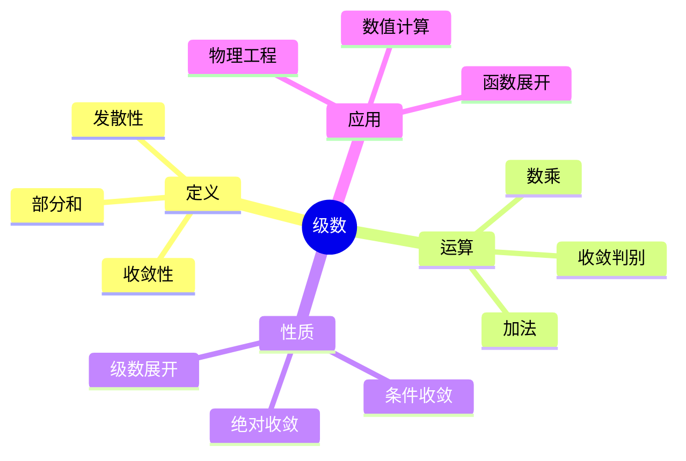
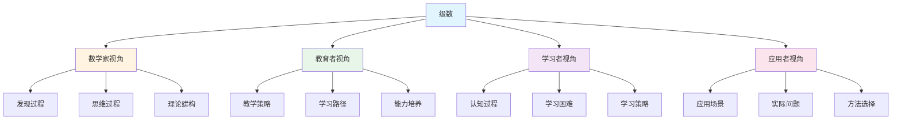
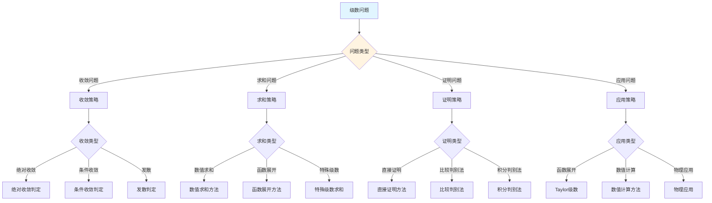
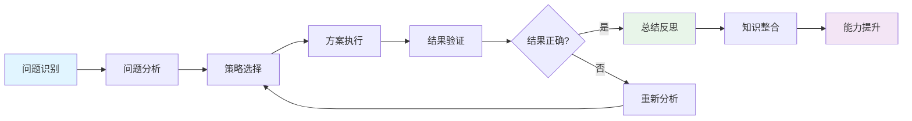
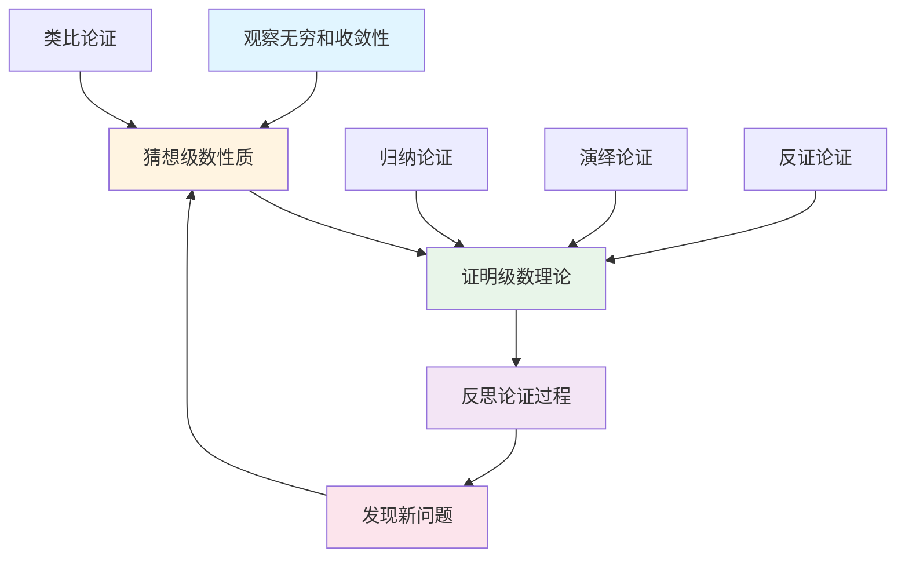
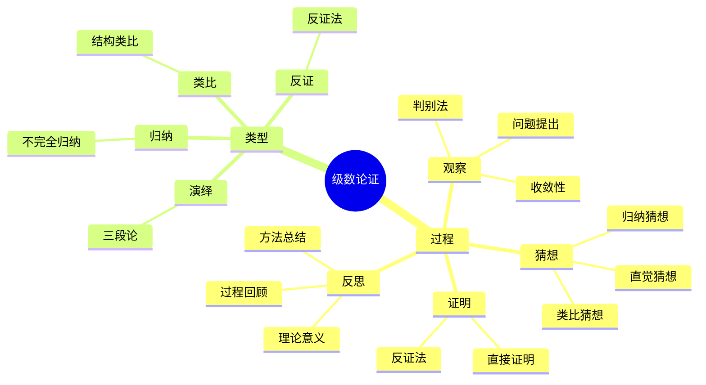
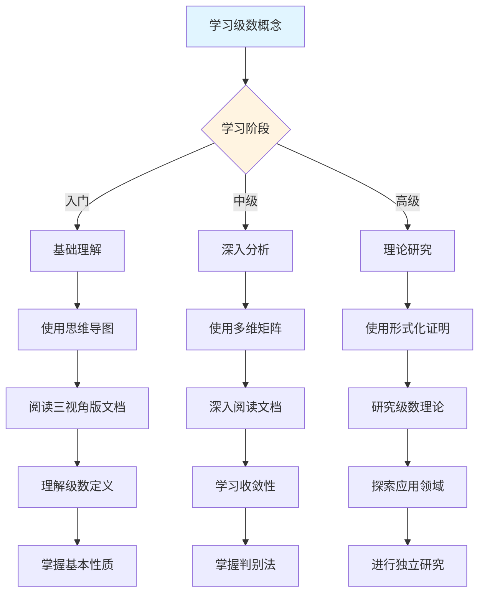
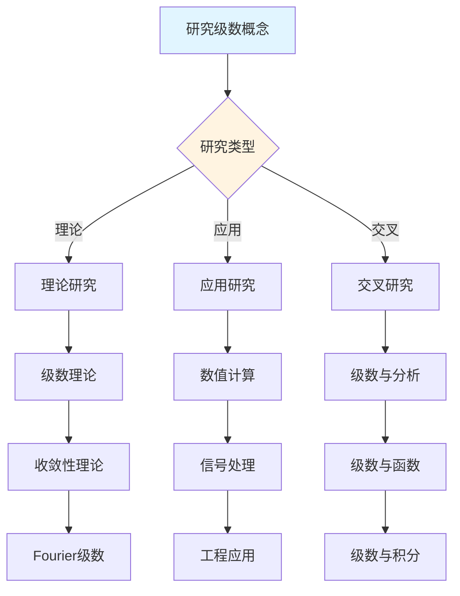
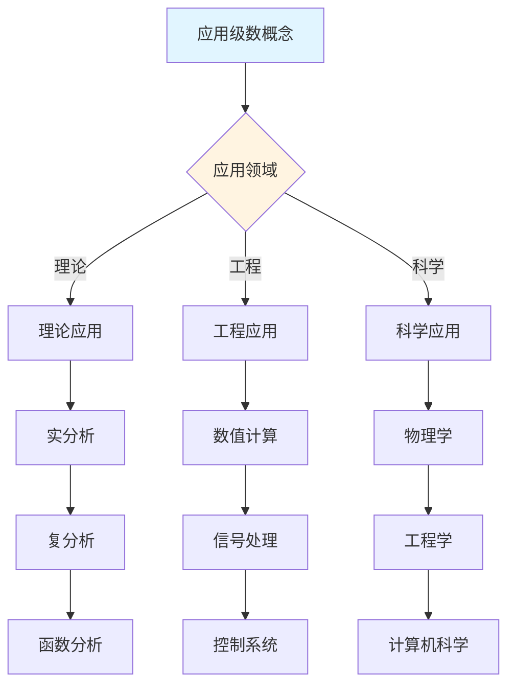
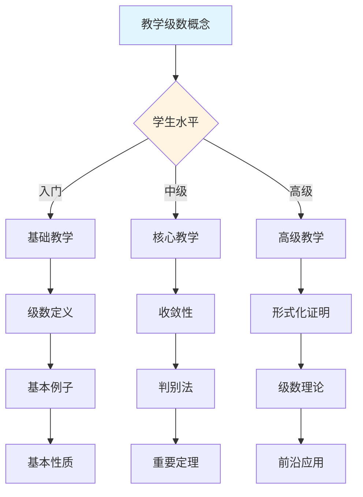

---
msc_primary: "00A99"
---

# 级数 (Series) - 三视角组织版

**概念编号**: C.CORE.017
**知识层次**: L0-L2
**知识领域**: D3 (分析)
**创建日期**: 2025年1月
**最后更新**: 2026-04-05

---

## 📋 目录 / Table of Contents

- [级数 (Series) - 三视角组织版](#级数-series---三视角组织版)
  - 📋 目录 / Table of Contents
  - 1. 📋 概述 (编号: C.CORE.017.01)
  - [🧠 认知学视角：如何理解级数 (编号: C.CORE.017.02)](#认知学视角如何理解级数-编号-ccore01702)
    - [认知起点 (编号: C.CORE.017.02.01)](#认知起点-编号-ccore0170201)
    - [认知过程 (编号: C.CORE.017.02.02)](#认知过程-编号-ccore0170202)
      - [阶段1：直观理解阶段 (编号: C.CORE.017.02.02.01)](#阶段1直观理解阶段-编号-ccore017020201)
      - [阶段2：概念形成阶段 (编号: C.CORE.017.02.02.02)](#阶段2概念形成阶段-编号-ccore017020202)
      - [阶段3：形式化阶段 (编号: C.CORE.017.02.02.03)](#阶段3形式化阶段-编号-ccore017020203)

## 形式化定义

**定义（无穷级数）**：数列 $\{a_n\}$ 的无穷级数定义为部分和序列的极限：
$$\sum_{n=1}^\infty a_n = \lim_{N \to \infty} S_N = \lim_{N \to \infty} \sum_{n=1}^N a_n$$

**收敛判别**：
- **绝对收敛**：$\sum |a_n|$ 收敛
- **条件收敛**：$\sum a_n$ 收敛但 $\sum |a_n|$ 发散

**符号说明**：
- $\sum_{n=1}^\infty$ 或 $\sum_{n \geq 1}$：求和符号
- $S_N = \sum_{n=1}^N a_n$：第 $N$ 个部分和
- $\prod_{n=1}^\infty$：无穷乘积
- 幂级数：$\sum_{n=0}^\infty a_n x^n$

    - [认知障碍 (编号: C.CORE.017.02.03)](#认知障碍-编号-ccore0170203)
    - [认知工具 (编号: C.CORE.017.02.04)](#认知工具-编号-ccore0170204)
  - [🎓 教育学视角：如何教学级数 (编号: C.CORE.017.03)](#教育学视角如何教学级数-编号-ccore01703)
    - [教学目标 (编号: C.CORE.017.03.01)](#教学目标-编号-ccore0170301)
    - [教学路径 (编号: C.CORE.017.03.02)](#教学路径-编号-ccore0170302)
      - [阶段1：引入阶段（激发兴趣） (编号: C.CORE.017.03.02.01)](#阶段1引入阶段激发兴趣-编号-ccore017030201)
      - [阶段2：探索阶段（主动建构） (编号: C.CORE.017.03.02.02)](#阶段2探索阶段主动建构-编号-ccore017030202)
      - [阶段3：形式化阶段（抽象概括） (编号: C.CORE.017.03.02.03)](#阶段3形式化阶段抽象概括-编号-ccore017030203)
      - [阶段4：巩固阶段（应用深化） (编号: C.CORE.017.03.02.04)](#阶段4巩固阶段应用深化-编号-ccore017030204)
    - [教学难点 (编号: C.CORE.017.03.03)](#教学难点-编号-ccore0170303)
    - [教学策略 (编号: C.CORE.017.03.04)](#教学策略-编号-ccore0170304)
    - [评估方法 (编号: C.CORE.017.03.05)](#评估方法-编号-ccore0170305)
  - [🔬 数学家视角：如何思考级数 (编号: C.CORE.017.04)](#数学家视角如何思考级数-编号-ccore01704)
    - [问题起源 (编号: C.CORE.017.04.01)](#问题起源-编号-ccore0170401)
    - [思维过程 (编号: C.CORE.017.04.02)](#思维过程-编号-ccore0170402)
      - [步骤1：问题提出 (编号: C.CORE.017.04.02.01)](#步骤1问题提出-编号-ccore017040201)
      - [步骤2：概念形成 (编号: C.CORE.017.04.02.02)](#步骤2概念形成-编号-ccore017040202)
      - [步骤3：理论发展 (编号: C.CORE.017.04.02.03)](#步骤3理论发展-编号-ccore017040203)
    - [历史发展 (编号: C.CORE.017.04.03)](#历史发展-编号-ccore0170403)
    - [3.2 关键人物和贡献 (编号: C.CORE.017.04.04)](#32-关键人物和贡献-编号-ccore0170404)
    - [重要定理 (编号: C.CORE.017.04.05)](#重要定理-编号-ccore0170405)
    - [开放问题 (编号: C.CORE.017.04.06)](#开放问题-编号-ccore0170406)
    - [一、第一人称思维描述 (编号: C.CORE.017.04.07)](#一第一人称思维描述-编号-ccore0170407)
      - [1.1 Euler的发现过程](#11-euler的发现过程)
    - [二、数学直觉的形成 (编号: C.CORE.017.04.08)](#二数学直觉的形成-编号-ccore0170408)
      - [2.1 直觉在概念发现中的作用](#21-直觉在概念发现中的作用)
      - [2.2 如何培养级数直觉](#22-如何培养级数直觉)
    - [三、数学美的教育价值 (编号: C.CORE.017.04.09)](#三数学美的教育价值-编号-ccore0170409)
      - [3.1 级数论的美在哪里](#31-级数论的美在哪里)
      - [3.2 如何培养学生的数学美感](#32-如何培养学生的数学美感)
    - [四、问题解决策略 (编号: C.CORE.017.04.10)](#四问题解决策略-编号-ccore0170410)
      - [4.1 数学家的启发式方法](#41-数学家的启发式方法)
      - [4.2 思维过程分析](#42-思维过程分析)
    - [五、批判性反思 (编号: C.CORE.017.04.11)](#五批判性反思-编号-ccore0170411)
      - [5.1 级数概念的局限性](#51-级数概念的局限性)
      - [5.2 级数理论的未解决问题](#52-级数理论的未解决问题)
  - [💡 数学解释：为什么级数是这样定义的 (编号: C.CORE.017.05)](#数学解释为什么级数是这样定义的-编号-ccore01705)
    - [一、直观解释：级数是什么？](#一直观解释级数是什么)
      - [1.1 具体例子](#11-具体例子)
      - [1.2 形象类比](#12-形象类比)
      - [1.3 几何直观](#13-几何直观)
      - [1.4 操作体验](#14-操作体验)
    - [二、知性解释：级数的本质是什么？](#二知性解释级数的本质是什么)
      - [2.1 概念定义](#21-概念定义)
      - [2.2 分类体系](#22-分类体系)
      - [2.3 抽象结构](#23-抽象结构)
      - [2.4 知识体系](#24-知识体系)
    - [三、理性解释：级数的公理化定义](#三理性解释级数的公理化定义)
      - [3.1 公理体系](#31-公理体系)
      - [3.2 形式化证明](#32-形式化证明)
      - [3.3 系统建构](#33-系统建构)
    - [四、多视角解释：从不同角度理解级数](#四多视角解释从不同角度理解级数)
      - [4.1 数学家视角：级数是如何被发现的？](#41-数学家视角级数是如何被发现的)
      - [4.2 教育者视角：如何教学级数？](#42-教育者视角如何教学级数)
      - [4.3 学习者视角：如何学习级数？](#43-学习者视角如何学习级数)
      - [4.4 应用者视角：如何应用级数？](#44-应用者视角如何应用级数)
    - [五、思维表征：用多种方式理解级数](#五思维表征用多种方式理解级数)
      - [5.1 思维导图：级数的知识结构](#51-思维导图级数的知识结构)
      - [5.2 矩阵对比：不同解释方式的对比](#52-矩阵对比不同解释方式的对比)
      - [5.3 多视角表征：从不同角度表征级数](#53-多视角表征从不同角度表征级数)
      - [5.4 决策树：级数问题分类和策略选择](#54-决策树级数问题分类和策略选择)
      - [5.5 决策逻辑路径：级数问题解决过程](#55-决策逻辑路径级数问题解决过程)
      - [5.6 多维对比矩阵：级数概念特征对比](#56-多维对比矩阵级数概念特征对比)
  - [🔍 数学论证：如何论证级数 (编号: C.CORE.017.06)](#数学论证如何论证级数-编号-ccore01706)
    - [一、论证过程：从观察到反思](#一论证过程从观察到反思)
      - [1.1 观察（Observation）](#11-观察observation)
      - [1.2 猜想（Conjecture）](#12-猜想conjecture)
      - [1.3 证明（Proof）](#13-证明proof)
      - [1.4 反思（Reflection）](#14-反思reflection)
    - [二、论证类型：多种推理方式](#二论证类型多种推理方式)
      - [2.1 归纳论证（Inductive Reasoning）](#21-归纳论证inductive-reasoning)
      - [2.2 演绎论证（Deductive Reasoning）](#22-演绎论证deductive-reasoning)
      - [2.3 类比论证（Analogical Reasoning）](#23-类比论证analogical-reasoning)
      - [2.4 反证论证（Proof by Contradiction）](#24-反证论证proof-by-contradiction)
    - [三、论证可视化：用图形表示论证过程](#三论证可视化用图形表示论证过程)
      - [3.1 论证流程图](#31-论证流程图)
      - [3.2 论证类型对比](#32-论证类型对比)
      - [3.3 论证思维导图](#33-论证思维导图)
  - [🔗 三视角整合 (编号: C.CORE.017.07)](#三视角整合-编号-ccore01707)
    - [三个视角的关联](#三个视角的关联)
    - [如何综合运用三个视角](#如何综合运用三个视角)
  - [📚 参考文献 (编号: C.CORE.017.08)](#参考文献-编号-ccore01708)
    - [权威资源](#权威资源)
    - [经典教材](#经典教材)
    - [研究论文](#研究论文)

---

## 1. 📋 概述 (编号: C.CORE.017.01)

级数是无穷项的和，是分析学的重要工具。级数理论在数学、物理学、工程学等领域有广泛应用，是函数展开、数值计算的基础。

本文档从**数学认知学**、**教育学**、**数学家**三个视角深入展开级数概念，避免简单的概念堆垒。

**权威资源对齐**:

- Wikipedia: [Series (Mathematics)](https://en.wikipedia.org/wiki/Series_(mathematics))
- Stanford课程: Math 171 (Real Analysis)
- Princeton课程: MAT 201 (Analysis)
- MIT课程: 18.100A (Real Analysis)
- Metamath: [Series](http://us.metamath.org/mpeuni/df-sum.html)[需更新][需更新]

---

## 🧠 认知学视角：如何理解级数 (编号: C.CORE.017.02)

### 认知起点 (编号: C.CORE.017.02.01)

**学习者已有的知识基础**:

- 序列的概念
- 极限的概念
- 日常经验中的"求和"概念

**日常经验中的类似概念**:

- "累加"：连续累加
- "总和"：所有项的和
- "无限和"：无穷项的和

### 认知过程 (编号: C.CORE.017.02.02)

#### 阶段1：直观理解阶段 (编号: C.CORE.017.02.02.01)

**具体例子**:

- 例子1：$\sum_{n=1}^\infty \frac{1}{n^2} = \frac{\pi^2}{6}$
- 例子2：$\sum_{n=0}^\infty \frac{x^n}{n!} = e^x$
- 例子3：$\sum_{n=0}^\infty x^n = \frac{1}{1-x}$（$|x| < 1$）

**形象类比**:

- **累加类比**: 级数就像"无限累加"
  - 有限和：$\sum_{i=1}^n a_i$
  - 无限和：$\sum_{n=1}^\infty a_n$

- **过程类比**: 级数就像"过程的极限"
  - 部分和序列：$S_n = \sum_{k=1}^n a_k$
  - 级数的和：$\lim_{n \to \infty} S_n$

**可视化表示**:

```text
级数的收敛:
    S_n
    ↑
    |  ●
    | ●
    |●
    └──────────→ n
    收敛到 S
```

#### 阶段2：概念形成阶段 (编号: C.CORE.017.02.02.02)

**从例子中抽象出共同特征**:

- 所有例子都涉及"无限和"
- 无限和是"极限"
- 无限和可能收敛或发散

**识别关键属性**:

1. **部分和**: $S_n = \sum_{k=1}^n a_k$
2. **极限**: $\lim_{n \to \infty} S_n$
3. **收敛性**: 极限存在且有限

**建立概念边界**:

- **什么是级数**: 无穷项的和，定义为部分和序列的极限
- **什么不是级数**:
  - 有限和（不是无限）
  - 序列本身（不是和）

#### 阶段3：形式化阶段 (编号: C.CORE.017.02.02.03)

**严格定义**:

- 级数定义：$\sum_{n=1}^\infty a_n = \lim_{N \to \infty} \sum_{n=1}^N a_n$
- 收敛性：若极限存在且有限，则级数收敛

**公理化表述**:

- 级数定义为部分和序列的极限
- 收敛性通过极限定义

**逻辑结构**:

- 级数是分析学的重要工具
- 级数是函数展开的基础
- 级数是数值计算的基础

### 认知障碍 (编号: C.CORE.017.02.03)

**常见误解**:

1. **误解1**: 认为所有级数都收敛
   - **纠正**: 不是所有级数都收敛，如调和级数发散

2. **误解2**: 认为级数就是序列
   - **纠正**: 级数是序列的部分和的极限，不是序列本身

3. **误解3**: 混淆绝对收敛和条件收敛
   - **纠正**: 绝对收敛是更强的条件

**理解难点**:

1. **难点1**: 无限和的概念
   - **原因**: "无限和"比较抽象
   - **解决方法**: 从有限和开始，逐步到无限和

2. **难点2**: 收敛性的判断
   - **原因**: 收敛性判断比较复杂
   - **解决方法**: 用具体例子，掌握判断方法

3. **难点3**: 绝对收敛和条件收敛
   - **原因**: 绝对收敛和条件收敛的区别比较抽象
   - **解决方法**: 用具体例子，强调区别

**认知陷阱**:

- **无限性**: 需要理解"无限和"的含义
- **收敛性**: 需要理解收敛的条件

### 实际计算示例

#### 示例1: 等比级数求和
**问题**: 求 $\sum_{n=0}^{\infty} \frac{1}{2^n}$。

**步骤**:
$$S = 1 + \frac{1}{2} + \frac{1}{4} + \frac{1}{8} + \cdots = \frac{1}{1 - \frac{1}{2}} = 2$$

**数值验证**: $1 + 0.5 + 0.25 + 0.125 + 0.0625 = 1.9375 \approx 2$

---

#### 示例2: Taylor展开
**问题**: 求 $e^x$ 在 $x = 0$ 处的Taylor展开（前5项）。

**步骤**:
$$e^x = 1 + x + \frac{x^2}{2!} + \frac{x^3}{3!} + \frac{x^4}{4!} + \cdots$$

**近似**: $e^{0.1} \approx 1 + 0.1 + 0.005 + 0.000167 + 0.000004 \approx 1.10517$

---

#### 示例3: 收敛性判断
**问题**: 判断 $\sum \frac{1}{n^2}$ 的收敛性。

**步骤**:
- p-级数，$p = 2 > 1$
- **结论**: 收敛
- 和为 $\frac{\pi^2}{6} \approx 1.645$

---

### 认知工具 (编号: C.CORE.017.02.04)

**类比工具**:

- **累加类比**: 级数 = 无限累加
- **过程类比**: 级数 = 过程的极限

**可视化工具**:

- **部分和序列**: 用部分和序列表示级数
- **收敛图**: 用收敛图表示收敛性

**具体化工具**:

- **具体例子**: 用具体例子理解抽象概念
- **反例**: 用反例理解概念边界

---

## 🎓 教育学视角：如何教学级数 (编号: C.CORE.017.03)

### 教学目标 (编号: C.CORE.017.03.01)

**知识目标**:

- 理解级数的基本概念
- 掌握级数的定义
- 理解级数的收敛性
- 理解级数的应用

**能力目标**:

- 能够判断级数的收敛性
- 能够计算级数的和
- 能够应用级数解决实际问题
- 能够理解级数的应用

**情感目标**:

- 培养数学抽象思维
- 培养分析思维
- 激发对数学的兴趣

### 教学路径 (编号: C.CORE.017.03.02)

#### 阶段1：引入阶段（激发兴趣） (编号: C.CORE.017.03.02.01)

**实际问题**:

- 问题1：如何表示函数？
- 问题2：如何计算$\pi$？
- 问题3：如何计算$e$？

**历史背景**:

- 级数的历史发展
- 级数在数学中的地位
- 级数在物理中的应用

**引发认知冲突**:

- 问题：如何从有限和到无限和？
- 引出级数的概念

#### 阶段2：探索阶段（主动建构） (编号: C.CORE.017.03.02.02)

**引导发现**:

1. 让学生自己计算有限和
2. 让学生观察有限和的变化
3. 引导学生抽象出级数的定义

**合作探究**:

- 小组讨论：什么是级数？
- 小组讨论：级数有哪些性质？
- 小组讨论：如何判断收敛性？

**多元表征**:

- **语言表征**: "级数是无穷项的和"
- **符号表征**: $\sum_{n=1}^\infty a_n$
- **图形表征**: 部分和序列
- **集合表征**: 极限定义

#### 阶段3：形式化阶段（抽象概括） (编号: C.CORE.017.03.02.03)

**严格定义**:

- 级数的定义
- 收敛性的定义
- 级数的性质

**性质证明**:

- 级数的基本性质
- 级数的运算性质
- 收敛性判别法

**应用拓展**:

- 级数在分析学中的应用
- 级数在物理中的应用
- 级数在工程中的应用

#### 阶段4：巩固阶段（应用深化） (编号: C.CORE.017.03.02.04)

**练习应用**:

- 基础练习：级数的收敛性判断
- 应用练习：用级数解决实际问题
- 综合练习：级数的综合应用

**变式训练**:

- 不同形式的级数
- 不同难度的收敛性判断
- 级数的应用

**知识整合**:

- 级数与其他概念的联系
- 级数在数学体系中的地位

### 教学难点 (编号: C.CORE.017.03.03)

**难点1：无限和的概念**:

- **难点描述**: 学生难以理解无限和
- **解决方法**:
  - 从有限和开始
  - 逐步到无限和
  - 用具体例子说明

**难点2：收敛性的判断**:

- **难点描述**: 学生难以判断收敛性
- **解决方法**:
  - 用具体例子
  - 掌握判断方法
  - 用练习巩固

**难点3：绝对收敛和条件收敛**:

- **难点描述**: 学生难以理解绝对收敛和条件收敛的区别
- **解决方法**:
  - 用具体例子
  - 强调区别
  - 用反例说明

### 教学策略 (编号: C.CORE.017.03.04)

**策略1：从具体到抽象**:

- 先给出具体例子
- 再抽象出一般概念
- 最后给出严格定义

**策略2：多元表征**:

- 用语言、符号、图形等多种方式表示同一概念
- 帮助学生建立不同表征之间的联系

**策略3：问题驱动**:

- 从实际问题出发
- 引出数学概念
- 解决问题

**策略4：可视化教学**:

- 使用部分和序列
- 使用收敛图
- 使用具体例子

### 评估方法 (编号: C.CORE.017.03.05)

**形成性评估**（评估理解过程）:

- 课堂提问：检查学生对概念的理解
- 小组讨论：观察学生的思考过程
- 练习作业：检查学生的应用能力

**总结性评估**（评估最终理解）:

- 测验：检查学生对概念和计算的掌握
- 项目：检查学生应用级数解决实际问题的能力
- 反思：检查学生对级数概念的理解深度

---

## 🔬 数学家视角：如何思考级数 (编号: C.CORE.017.04)

### 问题起源 (编号: C.CORE.017.04.01)

**历史背景**:

- 17-18世纪：级数的起源
- 19世纪：级数的严格化
- 20世纪：级数的现代发展

**原始问题**:

- **问题1**: 如何表示函数？
- **问题2**: 如何计算数值？
- **问题3**: 级数有哪些性质？

**研究动机**:

- 表示函数
- 计算数值
- 发展分析学

### 思维过程 (编号: C.CORE.017.04.02)

#### 步骤1：问题提出 (编号: C.CORE.017.04.02.01)

**观察到的现象**:

- 函数可以用级数表示
- 数值可以用级数计算
- 需要研究级数的性质

**提出的猜想**:

- 可以引入级数概念
- 级数可以表示函数
- 级数有丰富的性质

**需要解决的问题**:

- 如何定义级数？
- 级数应该满足什么条件？
- 级数有哪些性质？

#### 步骤2：概念形成 (编号: C.CORE.017.04.02.02)

**尝试性定义**:

- **极限定义**: 通过部分和序列的极限
- **函数定义**: 通过函数展开

**性质探索**:

- 级数的基本性质
- 级数的收敛性
- 级数的运算性质

**结构发现**:

- 级数是分析学的重要工具
- 级数是函数展开的基础
- 级数是数值计算的基础

#### 步骤3：理论发展 (编号: C.CORE.017.04.02.03)

**定理证明**:

- 级数的基本性质
- 级数的收敛性判别法
- 级数的运算性质

**应用拓展**:

- 级数在分析学中的应用
- 级数在物理中的应用
- 级数在工程中的应用

**理论完善**:

- 级数的严格定义
- 级数的收敛性理论
- 级数的应用研究

### 历史发展 (编号: C.CORE.017.04.03)

**早期阶段**（17-18世纪）:

- **Newton (1665)**: 使用级数展开函数
- **Leibniz (1684)**: 使用级数计算
- **Euler (1748)**: 广泛使用级数

**关键突破**（19世纪）:

- **Cauchy (1821)**: 严格化级数理论
- **Weierstrass (1872)**: 完善级数理论

**现代发展**（20世纪）:

- **Bourbaki (1939)**: 统一级数理论
- **函数分析 (1950s)**: 级数的函数分析研究

### 3.2 关键人物和贡献 (编号: C.CORE.017.04.04)

**Isaac Newton (1643-1727)**:

- 使用级数展开函数
- 建立级数理论的基础

**Gottfried Wilhelm Leibniz (1646-1716)**:

- 使用级数计算
- 建立级数理论的基础

**Augustin-Louis Cauchy (1789-1857)**:

- 严格化级数理论
- 建立现代分析学

### 重要定理 (编号: C.CORE.017.04.05)

**级数的收敛性判别法**:

- 比较判别法
- 比值判别法
- 根值判别法
- 意义：级数收敛性判断的基础

**绝对收敛定理**:

- 绝对收敛的级数收敛
- 意义：级数收敛性的重要性质

**Taylor级数**:

- 函数可以用Taylor级数展开
- 意义：函数展开的基础

### 开放问题 (编号: C.CORE.017.04.06)

**未解决问题**:

- 级数的计算问题
- 级数的应用问题
- 级数的推广问题

**研究方向**:

- 级数的函数分析研究
- 级数的应用研究
- 级数的推广研究

### 一、第一人称思维描述 (编号: C.CORE.017.04.07)

#### 1.1 Euler的发现过程

**详细历史背景**:

- **1748年**：Euler发表《无穷分析引论》（Introductio in analysin infinitorum）
- **背景**：研究函数的展开，发现函数可以用级数表示
- **问题**：如何用级数表示函数？级数什么时候收敛？

**Euler的详细第一人称描述**:
> "1748年，我在研究函数时，遇到了一个问题：如何用级数表示函数？
>
> 我发现，许多函数可以用级数展开：
>
> - **指数函数**：$e^x = \sum_{n=0}^{\infty} \frac{x^n}{n!} = 1 + x + \frac{x^2}{2!} + \frac{x^3}{3!} + \cdots$
> - **正弦函数**：$\sin x = \sum_{n=0}^{\infty} \frac{(-1)^n x^{2n+1}}{(2n+1)!} = x - \frac{x^3}{3!} + \frac{x^5}{5!} - \cdots$
> - **余弦函数**：$\cos x = \sum_{n=0}^{\infty} \frac{(-1)^n x^{2n}}{(2n)!} = 1 - \frac{x^2}{2!} + \frac{x^4}{4!} - \cdots$
>
> 我的发现是：
>
> - **级数的概念**：级数是无穷和$\sum_{n=0}^{\infty} a_n$
> - **收敛性**：级数收敛当且仅当部分和序列收敛
> - **应用**：级数可以表示函数，可以计算函数值
>
> 例如，要计算$e$的值：
>
> - **级数**：$e = \sum_{n=0}^{\infty} \frac{1}{n!} = 1 + 1 + \frac{1}{2!} + \frac{1}{3!} + \cdots$
> - **部分和**：$S_n = 1 + 1 + \frac{1}{2!} + \cdots + \frac{1}{n!}$
> - **极限**：$e = \lim_{n \to \infty} S_n \approx 2.71828$
>
> 我还发现了Euler公式：
>
> - **公式**：$e^{i\theta} = \cos\theta + i\sin\theta$
> - **证明**：使用级数展开
> - **意义**：连接指数函数和三角函数
>
> 这让我意识到，级数是研究函数的重要工具，级数可以表示函数，可以计算函数值。这为分析学提供了基础。"

**详细的思维过程**:

1. **观察到的现象**（1748年）:

   **现象1：函数可以用级数表示**
   - **问题**：许多函数可以用级数展开
   - **例子**：$e^x = \sum_{n=0}^{\infty} \frac{x^n}{n!}$
   - **需要**：理解级数的性质

   **现象2：级数有收敛和发散的性质**
   - **问题**：如何判断级数是否收敛？
   - **例子**：$\sum_{n=1}^{\infty} \frac{1}{n^2}$收敛，$\sum_{n=1}^{\infty} \frac{1}{n}$发散
   - **需要**：建立收敛性判别法

   **现象3：需要统一的概念**
   - **问题**：如何统一处理不同的级数？
   - **思路**：用级数理论统一
   - **需要**：建立级数理论

2. **提出的猜想**（1748年）:

   **猜想1：用级数表示函数**
   - **思路**：定义级数$\sum_{n=0}^{\infty} a_n$表示函数
   - **例子**：$e^x = \sum_{n=0}^{\infty} \frac{x^n}{n!}$
   - **优点**：统一表示函数

   **猜想2：级数的收敛性判别法**
   - **方法**：比较判别法、比值判别法、根值判别法
   - **例子**：用比值判别法判断$\sum_{n=1}^{\infty} \frac{1}{n^2}$的收敛性
   - **意义**：为级数提供收敛性判断方法

   **猜想3：级数是分析学的基础**
   - **性质**：级数可以表示函数，可以计算函数值
   - **应用**：级数可以应用到更广泛的领域
   - **意义**：级数是分析学的基础

3. **遇到的困难**（1748-1821年）:

   **困难1：如何严格定义级数？**
   - **问题**：如何定义级数？
   - **解决**：Cauchy用部分和序列的极限定义级数
   - **意义**：为级数提供严格的数学基础

   **困难2：如何判断级数的收敛性？**
   - **问题**：如何判断级数是否收敛？
   - **解决**：建立收敛性判别法（比较判别法、比值判别法、根值判别法）
   - **意义**：为级数提供收敛性判断方法

   **困难3：如何应用级数理论？**
   - **问题**：如何用级数理论解决实际问题？
   - **解决**：建立Taylor级数、Fourier级数
   - **意义**：为级数提供应用基础

4. **突破的时刻**（1821年，Cauchy）:

   **突破1：级数的严格定义**
   - Cauchy用部分和序列的极限严格定义级数
   - **关键**：$\sum_{n=0}^{\infty} a_n = \lim_{N \to \infty} \sum_{n=0}^{N} a_n$
   - **意义**：为级数提供严格的数学基础

   **突破2：收敛性判别法**
   - 建立收敛性判别法（比较判别法、比值判别法、根值判别法）
   - **关键**：用这些方法判断级数的收敛性
   - **意义**：为级数提供收敛性判断方法

   **突破3：Taylor级数**
   - 建立Taylor级数理论
   - **关键**：函数可以用Taylor级数展开
   - **意义**：为函数展开提供基础

### 二、数学直觉的形成 (编号: C.CORE.017.04.08)

#### 2.1 直觉在概念发现中的作用

**Euler的直觉**:

- **直觉1**: "级数"是"无穷和"——这个直觉引导Euler发现级数
- **直觉2**: 级数可以表示函数——这个直觉引导Euler建立级数理论
- **直觉3**: 级数是分析学的基础——这个直觉引导Euler建立级数理论

**直觉的验证**:

- 通过严格的数学证明验证直觉的正确性
- 通过收敛性判别法严格化级数理论
- 通过应用验证级数的广泛性

**直觉的深化**:

- 从"无穷和"到"级数的严格定义"
- 从"表示函数"到"级数的广泛应用"
- 从"分析学基础"到"级数的深入发展"

#### 2.2 如何培养级数直觉

**数学家的建议**:

- **Euler**: "级数直觉是长期训练的结果。通过大量练习和深入思考，我们可以培养对级数的直觉。"
- **Cauchy**: "从具体例子开始，逐步抽象，这是培养级数直觉的有效方法。"

**培养方法**:

1. **大量练习**: 通过大量级数计算练习，培养对级数的直觉
2. **深入思考**: 深入思考级数的本质，理解级数的深层结构
3. **类比和联想**: 通过类比和联想，建立级数与其他概念的联系
4. **与专家交流**: 与数学家交流，学习他们的思维方式

**教学启示**:

- 从具体例子开始，逐步抽象
- 鼓励学生思考级数的本质
- 引导学生建立级数与其他概念的联系

### 三、数学美的教育价值 (编号: C.CORE.017.04.09)

#### 3.1 级数论的美在哪里

**结构美**:

- **简洁性**: 级数的概念非常简洁——"无穷项的和"
- **统一性**: 级数可以统一描述数学中的各种无穷和
- **和谐性**: 级数运算满足优美的规律（收敛性、绝对收敛性等）

**数学家的评价**:

- **Euler**: "级数论的美在于它的统一性。它为我们提供了一个统一的框架来理解无穷和。"
- **Cauchy**: "级数论的美在于它的基础性。它是分析学的基础，所有分析概念都可以用级数来描述。"

#### 3.2 如何培养学生的数学美感

**数学家的建议**:

- **Euler**: "展示级数论的美感，让学生感受到数学的美。"
- **Cauchy**: "通过级数论的历史和发展，让学生理解数学的美。"

**教学方法**:

1. **展示数学美**:
   - 展示级数概念的简洁性和统一性
   - 展示级数运算的优美规律
   - 展示级数在数学中的基础地位

2. **引导学生欣赏**:
   - 引导学生欣赏级数概念的简洁性
   - 引导学生欣赏级数运算的和谐性
   - 引导学生欣赏级数的基础性

3. **鼓励学生创造美**:
   - 鼓励学生发现级数论的美
   - 鼓励学生创造优美的级数证明
   - 鼓励学生探索级数论的美

### 四、问题解决策略 (编号: C.CORE.017.04.10)

#### 4.1 数学家的启发式方法

**策略1：从具体到抽象**:

- 从具体的级数例子开始
- 抽象出级数的一般性质
- 建立级数的理论体系

**策略2：从简单到复杂**:

- 先理解基本级数
- 再理解级数运算
- 最后理解级数理论

**策略3：从问题到理论**:

- 从实际问题出发
- 引出级数概念
- 建立级数理论

#### 4.2 思维过程分析

**问题识别**:

- 识别问题类型：级数定义问题、级数收敛性问题、级数应用问题
- 识别问题难度：简单问题、中等问题、复杂问题

**策略选择**:

- 简单问题：直接方法
- 中等问题：分步方法
- 复杂问题：分解方法

**执行和反思**:

- 执行策略，解决问题
- 反思过程，总结经验
- 改进方法，提高效率

### 五、批判性反思 (编号: C.CORE.017.04.11)

#### 5.1 级数概念的局限性

**概念的边界**:

- 级数只描述无穷和，不能描述所有数学结构
- 级数要求收敛性，不是所有级数都收敛
- 级数不能表示所有数学量

**概念的推广**:

- 广义级数：更一般的级数
- 形式级数：不考虑收敛性的级数
- 随机级数：随机过程中的级数

#### 5.2 级数理论的未解决问题

**未解决的问题**:

- 级数的计算问题：如何计算复杂级数？
- 级数的应用问题：如何更好地应用级数？
- 级数的推广问题：如何推广级数概念？

**研究方向**:

- 级数的函数分析研究
- 级数的应用研究
- 级数的推广研究

---

## 💡 数学解释：为什么级数是这样定义的 (编号: C.CORE.017.05)

### 一、直观解释：级数是什么？

#### 1.1 具体例子

**生活中的例子**：

- **无限和**：$1 + \frac{1}{2} + \frac{1}{4} + \frac{1}{8} + \cdots = 2$
  - 例如：每次取一半，无限累加
  - **为什么这样定义**：因为我们需要一个概念来表示"无限和"
- **函数展开**：$e^x = 1 + x + \frac{x^2}{2!} + \frac{x^3}{3!} + \cdots$
  - 例如：指数函数可以用级数表示
  - **为什么这样定义**：因为我们需要一个概念来表示"函数的级数展开"
- **数值计算**：$\pi = 4(1 - \frac{1}{3} + \frac{1}{5} - \frac{1}{7} + \cdots)$
  - 例如：$\pi$可以用级数计算
  - **为什么这样定义**：因为我们需要一个概念来表示"数值的级数表示"

**数学中的例子**：

- **几何级数**：$\sum_{n=0}^\infty ar^n = \frac{a}{1-r}$（$|r| < 1$）
  - **为什么这样定义**：我们需要一个概念来表示"几何级数"
- **幂级数**：$\sum_{n=0}^\infty a_n x^n$
  - **为什么这样定义**：我们需要一个概念来表示"函数的幂级数展开"
- **Fourier级数**：$\sum_{n=-\infty}^\infty c_n e^{inx}$
  - **为什么这样定义**：我们需要一个概念来表示"函数的Fourier级数展开"

#### 1.2 形象类比

**累加类比**：

- **级数就像"无限累加"**
  - 将无限多个数累加起来
  - 得到级数的和
- **为什么这样类比**：这个类比帮助我们理解级数的本质

**近似类比**：

- **级数就像"近似值"**
  - 部分和是近似值
  - 级数和是精确值
- **为什么这样类比**：这个类比帮助我们理解级数的收敛性

#### 1.3 几何直观

**部分和序列表示**：

- 使用部分和序列表示级数
- 例如：$S_n = \sum_{i=1}^n a_i$是部分和序列
- **为什么使用部分和**：部分和提供直观的级数表示

**收敛性表示**：

- 使用收敛性表示级数
- 例如：级数收敛当且仅当部分和序列收敛
- **为什么使用收敛性**：收敛性提供直观的级数性质

#### 1.4 操作体验

**级数运算的操作**：

- **计算级数和**：$\sum_{n=1}^\infty \frac{1}{n^2} = \frac{\pi^2}{6}$
  - **为什么这样操作**：因为我们需要一个运算来表示"级数的和"
- **级数运算规则**：$\sum (a_n + b_n) = \sum a_n + \sum b_n$，$\sum ca_n = c \sum a_n$
  - **为什么这样操作**：因为我们需要一个运算来表示"级数的运算性质"
- **级数收敛性判别**：使用比值判别法、根值判别法等
  - **为什么这样操作**：因为我们需要一个工具来判断级数的收敛性

### 二、知性解释：级数的本质是什么？

#### 2.1 概念定义

**级数的内涵**：

- **级数是无限多个数的和**
  - **定义**：$\sum_{n=1}^\infty a_n = \lim_{n \to \infty} S_n$，其中$S_n = \sum_{i=1}^n a_i$
  - **收敛性**：如果$\lim_{n \to \infty} S_n$存在，则级数收敛
  - **发散性**：如果$\lim_{n \to \infty} S_n$不存在，则级数发散
- **为什么这样定义**：这些特征使得级数成为一个完整的分析工具，支持所有无限和研究

**级数的外延**：

- **收敛级数**：级数和存在的级数
- **发散级数**：级数和不存在的级数
- **条件收敛级数**：收敛但不绝对收敛的级数
- **绝对收敛级数**：$\sum |a_n|$收敛的级数
- **为什么这样分类**：不同的级数类型有不同的性质和用途

#### 2.2 分类体系

**按收敛性分类**：

- **收敛级数**：级数和存在
- **发散级数**：级数和不存在
- **为什么这样分类**：收敛性是级数的基本特征

**按类型分类**：

- **数项级数**：$\sum a_n$（$a_n$是数）
- **函数项级数**：$\sum f_n(x)$（$f_n$是函数）
- **为什么这样分类**：类型是级数的重要特征

#### 2.3 抽象结构

**级数的运算结构**：

- **级数的加法**：$\sum (a_n + b_n) = \sum a_n + \sum b_n$
- **级数的数乘**：$\sum ca_n = c \sum a_n$
- **为什么有这些运算**：这些运算使得级数具有代数结构

**级数的关系结构**：

- **级数与序列**：级数是序列的部分和序列的极限
- **为什么有这个关系**：这个关系帮助我们研究级数

**级数的子结构**：

- **部分和序列**：$S_n = \sum_{i=1}^n a_i$
- **余项**：$R_n = \sum_{i=n+1}^\infty a_i$
- **为什么有这些结构**：这些结构是级数理论的基础

#### 2.4 知识体系

**级数在数学体系中的位置**：

- **基础地位**：级数是分析学的基础
  - 级数是函数展开的基础
  - 级数是数值计算的基础
- **为什么是基础**：级数提供了统一的框架来研究无限和

**级数与其他概念的关系**：

- **级数与序列**：级数是序列的部分和序列的极限
- **级数与函数**：函数可以用级数表示
- **级数与积分**：级数可以表示为积分
- **为什么有这些关系**：这些关系揭示了级数与其他数学概念的内在联系

### 三、理性解释：级数的公理化定义

#### 3.1 公理体系

**级数的极限定义**：

- **定义**：$\sum_{n=1}^\infty a_n = \lim_{n \to \infty} S_n$，其中$S_n = \sum_{i=1}^n a_i$，如果这个极限存在
- **为什么需要这个定义**：这个定义提供了级数的严格数学基础

**级数的Cauchy定义**：

- **定义**：级数收敛当且仅当部分和序列是Cauchy序列
- **为什么这样定义**：这个定义将级数放在更一般的框架中

#### 3.2 形式化证明

**级数运算性质的证明**：

##### 定理1：级数的线性性

**定理陈述**：如果$\sum_{n=1}^\infty a_n$和$\sum_{n=1}^\infty b_n$收敛，则$\sum_{n=1}^\infty (ca_n + db_n) = c \sum_{n=1}^\infty a_n + d \sum_{n=1}^\infty b_n$。

**形式化表述**：
$$\forall \{a_n\}, \{b_n\} \subseteq \mathbb{R}, \forall c, d \in \mathbb{R},$$
$$(\sum_{n=1}^\infty a_n \text{收敛}) \land (\sum_{n=1}^\infty b_n \text{收敛}) \Rightarrow \sum_{n=1}^\infty (ca_n + db_n) = c \sum_{n=1}^\infty a_n + d \sum_{n=1}^\infty b_n$$

**证明**：
1. **部分和**：$S_n = \sum_{i=1}^n (ca_i + db_i) = c \sum_{i=1}^n a_i + d \sum_{i=1}^n b_i = c A_n + d B_n$
2. **取极限**：$\lim_{n \to \infty} S_n = \lim_{n \to \infty} (c A_n + d B_n) = c \lim_{n \to \infty} A_n + d \lim_{n \to \infty} B_n = c \sum_{n=1}^\infty a_n + d \sum_{n=1}^\infty b_n$

**为什么这样证明**：利用级数的定义（部分和序列的极限）和极限的线性性。

---

##### 定理2：绝对收敛性

**定理陈述**：如果$\sum_{n=1}^\infty |a_n|$收敛，则$\sum_{n=1}^\infty a_n$收敛。

**形式化表述**：
$$\forall \{a_n\} \subseteq \mathbb{R}, \quad \sum_{n=1}^\infty |a_n| \text{收敛} \Rightarrow \sum_{n=1}^\infty a_n \text{收敛}$$

**证明**：
1. **Cauchy准则**：级数收敛当且仅当部分和序列是Cauchy序列
2. **给定**：$\sum |a_n|$收敛，因此$\{A_n = \sum_{i=1}^n |a_i|\}$是Cauchy序列
3. **对任意$\varepsilon > 0$**：存在$N$使得当$m > n \geq N$时，$|A_m - A_n| = \sum_{i=n+1}^m |a_i| < \varepsilon$
4. **三角不等式**：$|\sum_{i=n+1}^m a_i| \leq \sum_{i=n+1}^m |a_i| < \varepsilon$
5. **结论**：$\{\sum_{i=1}^n a_i\}$是Cauchy序列，因此$\sum a_n$收敛

**为什么这样证明**：利用Cauchy准则和三角不等式，通过绝对值的性质证明。

---

##### 定理3：级数与积分的关系（积分判别法）

**定理陈述**：如果$f: [1, \infty) \to \mathbb{R}$是单调递减的非负函数，则$\sum_{n=1}^\infty f(n)$收敛当且仅当$\int_1^\infty f(x) dx$收敛。

**形式化表述**：
$$\forall f: [1, \infty) \to \mathbb{R} \text{单调递减非负}, \quad \sum_{n=1}^\infty f(n) \text{收敛} \leftrightarrow \int_1^\infty f(x) dx \text{收敛}$$

**证明**：
1. **不等式**：由于$f$单调递减，$f(n+1) \leq \int_n^{n+1} f(x) dx \leq f(n)$
2. **求和**：$\sum_{n=1}^{N-1} f(n+1) \leq \int_1^N f(x) dx \leq \sum_{n=1}^{N-1} f(n)$
3. **等价性**：$\sum_{n=2}^N f(n) \leq \int_1^N f(x) dx \leq \sum_{n=1}^{N-1} f(n)$
4. **结论**：当$N \to \infty$时，级数和积分同时收敛或同时发散

**为什么这样证明**：利用单调性和积分的几何意义，通过比较级数和积分证明。

#### 3.3 系统建构

**级数论在数学基础中的地位**：

- **作为分析学基础**：级数是分析学的基础
- **提供展开工具**：级数提供了函数展开的工具
- **统一框架**：级数统一了各种无限和研究

**级数论的发展历史**：

- **Newton的引入**（1665年）：使用级数展开函数
- **Euler的发展**（1748年）：广泛使用级数
- **Cauchy的严格化**（1821年）：严格化级数理论
- **为什么这样发展**：数学的发展需要严格的基础，级数论的发展反映了这一需求

### 四、多视角解释：从不同角度理解级数

#### 4.1 数学家视角：级数是如何被发现的？

**Newton的发现过程**：

- **问题提出**：如何用级数表示函数？
- **关键洞察**：使用级数展开函数
- **重要发现**：级数可以统一描述各种函数
- **为什么这样发现**：数学家的直觉和严格证明相结合

**Cauchy的严格化过程**：

- **问题识别**：需要严格化级数概念
- **策略选择**：使用极限定义
- **定义设计**：级数是部分和序列的极限
- **为什么这样设计**：需要提供严格的基础

#### 4.2 教育者视角：如何教学级数？

**教学策略**：

- **从具体到抽象**：先学习具体例子，再学习抽象定义
- **从简单到复杂**：先学习几何级数，再学习一般级数
- **从直观到形式化**：先使用部分和等直观工具，再学习极限定义
- **为什么这样教学**：符合认知规律，帮助学生逐步建立理解

**学习路径**：

- **阶段1**：直观理解（使用部分和和具体例子）
- **阶段2**：概念形成（学习级数的定义和性质）
- **阶段3**：形式化（学习极限定义）
- **为什么这样设计**：循序渐进，逐步深入

#### 4.3 学习者视角：如何学习级数？

**认知过程**：

- **直观阶段**：通过部分和理解级数的含义
- **概念阶段**：理解级数的定义和性质
- **形式化阶段**：理解极限定义
- **为什么这样学习**：符合认知发展规律

**学习困难**：

- **困难1**：理解"无限和"的概念
- **困难2**：理解"收敛性"的概念
- **困难3**：理解"级数展开"的概念
- **如何克服**：通过具体例子、类比、历史背景等方式帮助理解

#### 4.4 应用者视角：如何应用级数？

**应用场景**：

- **分析学**：使用级数展开函数
- **数值计算**：使用级数计算数值
- **物理**：使用级数描述物理过程
- **为什么这样应用**：级数提供了强大的工具来处理各种问题

**应用方法**：

- **建立模型**：将实际问题转化为级数问题
- **使用理论**：使用级数理论解决问题
- **验证结果**：验证结果的正确性
- **为什么这样应用**：级数论提供了强大的工具来解决实际问题

### 五、思维表征：用多种方式理解级数

#### 5.1 思维导图：级数的知识结构


```mermaid
mindmap
  root((级数))
    定义
      部分和
      收敛性
      发散性
    运算
      加法
      数乘
      收敛判别
    性质
      绝对收敛
      条件收敛
      级数展开
    应用
      函数展开
      数值计算
      物理工程
```

#### 5.2 矩阵对比：不同解释方式的对比

| 解释方式 | 特点 | 方法 | 工具 | 适用阶段 | 优势 | 局限 |
|---------|------|------|------|---------|------|------|
| **直观解释** | 具体、形象、可视 | 例子、类比、直观 | 部分和、图像 | 入门阶段 | 易于理解 | 不够严格 |
| **知性解释** | 概念、分类、抽象 | 定义、分类、结构 | 概念图、知识图谱 | 中级阶段 | 系统完整 | 不够直观 |
| **理性解释** | 公理、证明、形式化 | 公理、证明、系统 | 形式化工具、证明系统 | 高级阶段 | 严格准确 | 不够具体 |
| **多视角解释** | 多角度、整合 | 多视角、整合 | 多视角工具 | 所有阶段 | 全面深入 | 可能复杂 |

#### 5.3 多视角表征：从不同角度表征级数


```mermaid
graph TD
    A[级数] --> B[数学家视角]
    A --> C[教育者视角]
    A --> D[学习者视角]
    A --> E[应用者视角]

    B --> B1[发现过程]
    B --> B2[思维过程]
    B --> B3[理论建构]

    C --> C1[教学策略]
    C --> C2[学习路径]
    C --> C3[能力培养]

    D --> D1[认知过程]
    D --> D2[学习困难]
    D --> D3[学习策略]

    E --> E1[应用场景]
    E --> E2[实际问题]
    E --> E3[方法选择]

    style A fill:#e1f5ff
    style B fill:#fff4e1
    style C fill:#e8f5e9
    style D fill:#f3e5f5
    style E fill:#fce4ec
```

#### 5.4 决策树：级数问题分类和策略选择


```mermaid
graph TD
    A[级数问题] --> B{问题类型}
    B -->|收敛问题| C[收敛策略]
    B -->|求和问题| D[求和策略]
    B -->|证明问题| E[证明策略]
    B -->|应用问题| F[应用策略]

    C --> C1{收敛类型}
    C1 -->|绝对收敛| C2[绝对收敛判定]
    C1 -->|条件收敛| C3[条件收敛判定]
    C1 -->|发散| C4[发散判定]

    D --> D1{求和类型}
    D1 -->|数值求和| D2[数值求和方法]
    D1 -->|函数展开| D3[函数展开方法]
    D1 -->|特殊级数| D4[特殊级数求和]

    E --> E1{证明类型}
    E1 -->|直接证明| E2[直接证明方法]
    E1 -->|比较判别法| E3[比较判别法]
    E1 -->|积分判别法| E4[积分判别法]

    F --> F1{应用类型}
    F1 -->|函数展开| F2[Taylor级数]
    F1 -->|数值计算| F3[数值计算方法]
    F1 -->|物理应用| F4[物理应用]

    style A fill:#e1f5ff
    style B fill:#fff4e1
```

**说明**：

- **问题分类**：根据问题类型（收敛、求和、证明、应用）进行分类
- **策略选择**：根据问题类型选择相应的解决策略
- **方法应用**：根据具体问题选择合适的方法

#### 5.5 决策逻辑路径：级数问题解决过程


```mermaid
graph LR
    A[问题识别] --> B[问题分析]
    B --> C[策略选择]
    C --> D[方案执行]
    D --> E[结果验证]
    E --> F{结果正确?}
    F -->|是| G[总结反思]
    F -->|否| H[重新分析]
    H --> C

    G --> I[知识整合]
    I --> J[能力提升]

    style A fill:#e1f5ff
    style G fill:#e8f5e9
    style J fill:#f3e5f5
```

**说明**：

- **问题识别**：识别级数问题的类型和关键要素
- **问题分析**：分析问题的条件和目标
- **策略选择**：根据问题类型选择解决策略
- **方案执行**：执行选定的解决方案
- **结果验证**：验证结果的正确性
- **总结反思**：总结解题过程，反思解题方法
- **知识整合**：整合相关知识点
- **能力提升**：提升问题解决能力

#### 5.6 多维对比矩阵：级数概念特征对比

| 对比维度 | 级数定义 | 级数收敛 | 级数求和 | 级数应用 |
|---------|---------|---------|---------|---------|
| **核心特征** | 无穷和、部分和 | 收敛性、发散性 | 数值求和、函数展开 | Taylor级数、数值计算、物理应用 |
| **理解难度** | ⭐⭐⭐ | ⭐⭐⭐⭐ | ⭐⭐⭐⭐ | ⭐⭐⭐⭐ |
| **应用频率** | ⭐⭐⭐⭐ | ⭐⭐⭐⭐⭐ | ⭐⭐⭐⭐⭐ | ⭐⭐⭐⭐ |
| **理论基础** | 级数定义 | 收敛理论、判别法 | 求和理论、展开理论 | 级数应用理论 |
| **教学重点** | 概念理解 | 收敛判定 | 求和方法 | 应用能力 |
| **学习阶段** | 中级阶段 | 中级-高级 | 中级-高级 | 中级-高级 |
| **认知维度** | 知性+理性 | 理性 | 理性 | 理性+应用 |
| **思维表征** | 思维导图 | 决策树 | 决策逻辑路径 | 知识图谱 |

**说明**：

- **核心特征**：每个方面的核心特征
- **理解难度**：从1星到5星，表示理解难度
- **应用频率**：从1星到5星，表示应用频率
- **理论基础**：每个方面的理论基础
- **教学重点**：每个方面的教学重点
- **学习阶段**：每个方面的学习阶段
- **认知维度**：每个方面的认知维度
- **思维表征**：每个方面推荐的思维表征方法

---

## 🔍 数学论证：如何论证级数 (编号: C.CORE.017.06)

### 一、论证过程：从观察到反思

#### 1.1 观察（Observation）

**具体现象观察**：

- **现象1**：无穷和可能收敛也可能发散
  - 例如：$\sum_{n=1}^\infty \frac{1}{n^2}$收敛，$\sum_{n=1}^\infty \frac{1}{n}$发散
  - **为什么重要**：这个现象揭示了级数收敛性的重要性
- **现象2**：级数的收敛判别法
  - 例如：比较判别法、比值判别法、根值判别法
  - **为什么重要**：这个现象揭示了级数收敛性的判断方法

**模式识别**：

- **模式1**：Cauchy收敛准则
  - 例如：$\sum a_n$收敛当且仅当$\forall \varepsilon > 0, \exists N, \forall m,n > N, |\sum_{k=m}^n a_k| < \varepsilon$
  - **为什么重要**：这个模式可能反映了级数收敛的本质
- **模式2**：绝对收敛性
  - 例如：绝对收敛的级数收敛，且可以重排
  - **为什么重要**：这个模式可能反映了级数的结构

**问题提出**：

- **问题1**：如何严格定义级数收敛，避免"无穷和"的歧义？
  - **为什么提出**：这个问题可能揭示级数收敛的本质和基础
- **问题2**：如何证明比较判别法？
  - **为什么提出**：这个问题可能揭示级数收敛性的判断方法

#### 1.2 猜想（Conjecture）

**归纳猜想**：

- **猜想1**：级数是研究无穷和的统一工具
  - **依据**：观察不同无穷和都依赖于级数
  - **为什么提出**：这个猜想可能揭示级数的统一性
- **猜想2**：比较判别法
  - **依据**：观察具体级数的收敛性
  - **为什么提出**：这个猜想可能揭示级数收敛性的判断方法

**类比猜想**：

- **猜想1**：级数类似于"无穷和"
  - **类比对象**：无穷和
  - **为什么提出**：这个类比可能揭示级数的本质
- **猜想2**：级数收敛类似于"序列收敛"
  - **类比对象**：序列收敛
  - **为什么提出**：这个类比可能揭示级数收敛的本质

**直觉猜想**：

- **猜想1**：级数是"最自然"的无穷和概念
  - **直觉来源**：级数的直观
  - **为什么提出**：这个直觉可能揭示级数的基础地位
- **猜想2**：级数有"最小"的公理结构
  - **直觉来源**：级数的公理结构
  - **为什么提出**：这个直觉可能揭示级数的本质

#### 1.3 证明（Proof）

**直接证明**：

- **证明1**：比较判别法
  - **证明思路**：使用级数的定义和序列的性质
  - **关键步骤**：证明若$0 \leq a_n \leq b_n$且$\sum b_n$收敛，则$\sum a_n$收敛
  - **为什么这样证明**：这个证明方法直接、清晰
- **证明2**：比值判别法
  - **证明思路**：使用级数的定义和极限的性质
  - **关键步骤**：证明若$\lim |a_{n+1}/a_n| = L < 1$，则$\sum a_n$绝对收敛
  - **为什么这样证明**：这个证明方法直接、清晰

**反证法**：

- **反证法**：证明级数收敛的必要条件
  - **假设**：假设$\sum a_n$收敛但$\lim a_n \neq 0$
  - **矛盾**：导出Cauchy收敛准则的矛盾
  - **为什么这样证明**：反证法适合证明必要条件

#### 1.4 反思（Reflection）

**过程回顾**：

- **论证回顾**：从观察无穷和可能收敛也可能发散，到猜想级数的性质，再到严格证明
  - **成功之处**：成功建立了级数的严格理论
  - **不足之处**：级数概念需要进一步推广
  - **改进方向**：推广到函数项级数、幂级数等

**方法总结**：

- **证明方法**：使用了直接证明、反证法
  - **方法特点**：直接证明清晰，反证法有效
  - **适用范围**：不同方法适用于不同类型的命题
- **证明技巧**：使用Cauchy收敛准则、比较判别法、极限的性质
  - **技巧要点**：将级数问题转化为序列问题，使用反证法处理必要条件
  - **应用场景**：这些技巧可以应用于其他级数问题

**理论意义**：

- **理论贡献**：建立了级数的严格理论，揭示了级数的分析结构
  - **为什么重要**：这个论证揭示了分析学的基础结构
- **应用价值**：级数为分析学、数论、物理工程提供了基础
  - **为什么重要**：这个论证可以应用于所有无穷和问题

### 二、论证类型：多种推理方式

#### 2.1 归纳论证（Inductive Reasoning）

**不完全归纳**：

- **例子1**：从具体级数的收敛性归纳一般规律
  - **观察**：观察$\sum \frac{1}{n^2}$收敛，$\sum \frac{1}{n}$发散
  - **结论**：$\sum \frac{1}{n^p}$收敛当且仅当$p > 1$
  - **局限性**：不完全归纳的结论需要严格证明

#### 2.2 演绎论证（Deductive Reasoning）

**三段论**：

- **例子1**：证明级数的性质
  - **大前提**：所有收敛级数都满足Cauchy收敛准则
  - **小前提**：$\sum \frac{1}{n^2}$收敛
  - **结论**：$\sum \frac{1}{n^2}$满足Cauchy收敛准则
  - **为什么有效**：三段论是严格的演绎推理

#### 2.3 类比论证（Analogical Reasoning）

**结构类比**：

- **例子1**：级数与序列的类比
  - **类比对象**：序列
  - **相似性**：级数的部分和序列收敛
  - **结论**：级数可以理解为"部分和序列的极限"
  - **局限性**：类比不能替代严格证明

#### 2.4 反证论证（Proof by Contradiction）

**反证法**：

- **例子1**：证明级数收敛的必要条件
  - **假设**：假设$\sum a_n$收敛但$\lim a_n \neq 0$
  - **矛盾**：导出矛盾
  - **结论**：若$\sum a_n$收敛，则$\lim a_n = 0$
  - **为什么有效**：反证法是严格的间接证明

### 三、论证可视化：用图形表示论证过程

#### 3.1 论证流程图


```mermaid
graph TD
    A[观察无穷和收敛性] --> B[猜想级数性质]
    B --> C[证明级数理论]
    C --> D[反思论证过程]
    D --> E[发现新问题]
    E --> B

    F[归纳论证] --> C
    G[演绎论证] --> C
    H[类比论证] --> B
    I[反证论证] --> C

    style A fill:#e1f5ff
    style B fill:#fff4e1
    style C fill:#e8f5e9
    style D fill:#f3e5f5
    style E fill:#fce4ec
```

#### 3.2 论证类型对比

| 论证类型 | 特点 | 适用场景 | 优势 | 局限 |
|---------|------|---------|------|------|
| **归纳论证** | 从特殊到一般 | 发现规律、提出猜想 | 启发性强 | 结论或然 |
| **演绎论证** | 从一般到特殊 | 严格证明、逻辑推理 | 结论必然 | 需要前提 |
| **类比论证** | 基于相似性 | 启发思路、发现联系 | 创造性高 | 结论或然 |
| **反证论证** | 假设否定 | 证明必要条件 | 间接有效 | 需要矛盾 |

#### 3.3 论证思维导图


```mermaid
mindmap
  root((级数论证))
    过程
      观察
        收敛性
        判别法
        问题提出
      猜想
        归纳猜想
        类比猜想
        直觉猜想
      证明
        直接证明
        反证法
      反思
        过程回顾
        方法总结
        理论意义
    类型
      归纳
        不完全归纳
      演绎
        三段论
      类比
        结构类比
      反证
        反证法
```

---

## 🔗 三视角整合 (编号: C.CORE.017.07)

### 三个视角的关联

**认知学视角 ↔ 教育学视角**:

- 认知学视角揭示的理解机制，指导教育学视角的教学设计
- 教育学视角的教学实践，验证认知学视角的理论

**认知学视角 ↔ 数学家视角**:

- 数学家视角的思维过程，启发认知学视角的认知路径
- 认知学视角的认知障碍，解释数学家视角的历史困难

**教育学视角 ↔ 数学家视角**:

- 数学家视角的历史发展，为教育学视角提供教学素材
- 教育学视角的教学策略，帮助学习者理解数学家视角的思维过程

### 如何综合运用三个视角

**学习建议**:

1. **从认知学视角开始**: 先建立直观理解
2. **用教育学视角深化**: 通过教学路径系统学习
3. **用数学家视角升华**: 理解概念的深层意义和历史背景

**教学建议**:

1. **引入阶段**: 用数学家视角的问题起源激发兴趣
2. **探索阶段**: 用认知学视角的认知过程引导发现
3. **形式化阶段**: 用教育学视角的教学策略系统教学
4. **巩固阶段**: 综合三个视角深化理解

---

## 📚 参考文献 (编号: C.CORE.017.08)

### 权威资源

- Wikipedia: [Series (Mathematics)](https://en.wikipedia.org/wiki/Series_(mathematics))
- Metamath: [Series](http://us.metamath.org/mpeuni/df-sum.html)[需更新][需更新]

### 经典教材

- Newton, I. (1665). *De analysi per aequationes numero terminorum infinitas*. London.
- Euler, L. (1748). *Introductio in analysin infinitorum*. Lausanne.
- Rudin, W. (1976). *Principles of Mathematical Analysis*. McGraw-Hill.

### 研究论文

- Newton, I. (1665). "De analysi per aequationes numero terminorum infinitas". *London*.
- Euler, L. (1748). *Introductio in analysin infinitorum*. Lausanne.

---

**创建日期**: 2025年1月
**最后更新**: 2026-04-05
**维护状态**: 持续更新中

---

## 📚 附录: 扩展分析


### 1. 多理论分析

---
msc_primary: "00A99"
---

# 级数概念的多理论分析示例 / Multi-Theory Analysis Example: Series Concept


---


## 🎯 一、Tall三个世界理论分析 (编号: C.CORE.017.MULTI.01)

### 1.1 感知-操作世界（Embodied World）

**级数在感知-操作世界中的理解**：

- **具体经验**：
  - 通过"累加"的日常经验理解级数：1 + 1/2 + 1/4 + 1/8 + ...
  - 例如：几何级数、调和级数
  - 通过观察部分和序列理解级数的收敛性
  - 例如：部分和序列的图形表示

- **身体动作**：
  - 通过"累加"的动作理解级数
  - 通过观察部分和的变化理解级数
  - 通过操作计算器验证级数值

- **直观理解**：
  - 级数是"无穷项的和"
  - 级数可能收敛或发散
  - 级数可以用来表示函数

**教学建议**：

- 使用具体例子（几何级数、调和级数）
- 通过动态演示理解级数
- 使用图形可视化级数

### 1.2 概念-符号世界（Symbolic World）

**级数在概念-符号世界的理解 / Understanding Series in the Symbolic World**：

- **符号表示 / Symbolic Representation**：
  - 使用级数符号：$\sum_{n=1}^\infty a_n$、$\sum_{n=0}^\infty a_n$ / Using series notation: $\sum_{n=1}^\infty a_n$, $\sum_{n=0}^\infty a_n$
  - 使用部分和符号：$S_n = \sum_{k=1}^n a_k$ / Using partial sum notation: $S_n = \sum_{k=1}^n a_k$
  - 使用收敛符号：$\sum_{n=1}^\infty a_n = S$ / Using convergence notation: $\sum_{n=1}^\infty a_n = S$

- **概念理解 / Conceptual Understanding**：
  - 级数是部分和序列的极限 / Series are limits of partial sum sequences
  - 级数有收敛性和发散性 / Series have convergence and divergence
  - 级数可以用来展开函数 / Series can be used to expand functions

- **抽象操作 / Abstract Operations**：
  - 通过符号操作计算级数 / Calculating series through symbolic operations
  - 通过判别法判断级数收敛性 / Determining series convergence through tests
  - 通过级数展开研究函数 / Studying functions through series expansions

**教学建议 / Teaching Suggestions**：

- 逐步引入级数符号 / Gradually introduce series notation
- 通过判别法练习判断收敛性 / Practice determining convergence through tests
- 使用级数展开研究函数 / Use series expansions to study functions

### 1.3 形式-公理世界（Formal World）

**级数在形式-公理世界的理解 / Understanding Series in the Formal World**：

- **公理系统 / Axiomatic System**：
  - 级数的严格定义：$\sum_{n=1}^\infty a_n = \lim_{n \to \infty} S_n$ / Strict definition of series: $\sum_{n=1}^\infty a_n = \lim_{n \to \infty} S_n$
  - 通过极限严格定义级数 / Strictly defining series through limits
  - 通过公理推导级数性质 / Deriving series properties through axioms

- **形式化定义 / Formal Definition**：
  - 级数的形式化定义 / Formal definition of series
  - 收敛性的形式化定义 / Formal definition of convergence
  - 级数性质的形式化证明 / Formal proof of series properties

- **逻辑推理 / Logical Reasoning**：
  - 通过逻辑推理证明级数性质 / Proving series properties through logical reasoning
  - 通过形式化方法研究分析学 / Studying analysis through formal methods
  - 通过函数分析研究级数的一般性质 / Studying general properties of series through functional analysis

**教学建议 / Teaching Suggestions**：

- 介绍级数定义 / Introduce series definition
- 通过形式化证明理解级数性质 / Understand series properties through formal proofs
- 研究级数在分析学中的作用 / Study the role of series in analysis

### 1.4 三个世界的转换 / Transitions Between Worlds

**转换路径 / Transition Paths**：

1. **从感知-操作到概念-符号 / From Embodied to Symbolic**：
   - 将具体无限累加操作抽象为级数符号 / Abstracting concrete infinite summation operations into series symbols
   - 从操作中提取级数概念 / Extracting series concepts from operations
   - 例如：从"无限累加"到"级数$\sum_{n=1}^\infty a_n$" / Example: from "infinite summation" to "series $\sum_{n=1}^\infty a_n$"

2. **从概念-符号到形式-公理 / From Symbolic to Formal**：
   - 将级数概念形式化为极限定义 / Formalizing series concepts into limit definition
   - 从符号运算到逻辑推理 / From symbolic operations to logical reasoning
   - 例如：从"$\sum_{n=1}^\infty a_n$"到"$\lim_{n \to \infty} S_n$" / Example: from "$\sum_{n=1}^\infty a_n$" to "$\lim_{n \to \infty} S_n$"

**转换支持 / Transition Support**：

- **识别转换困难 / Identifying Transition Difficulties**：
  - 识别从具体累加到抽象级数的困难 / Identifying difficulties in transitioning from concrete summation to abstract series
  - 识别从符号运算到形式化定义的困难 / Identifying difficulties in transitioning from symbolic operations to formal definitions

- **设计转换活动 / Designing Transition Activities**：
  - 设计过渡活动支持转换 / Designing transition activities to support transitions
  - 提供渐进式支持 / Providing progressive support

- **评估转换效果 / Assessing Transition Effectiveness**：
  - 评估转换成功 / Assessing transition success
  - 提供反馈支持 / Providing feedback support

---

## 🔬 二、Dubinsky APOS理论分析 (编号: C.CORE.017.MULTI.02)

### 2.1 Action（动作）

**级数的Action阶段 / Action Stage of Series**：

- **具体操作 / Concrete Operations**：
  - 计算级数：$\sum_{n=1}^\infty a_n = ?$（给定$a_n$） / Computing series: $\sum_{n=1}^\infty a_n = ?$ (given $a_n$)
  - 使用级数规则：$\sum (a_n + b_n) = \sum a_n + \sum b_n$ / Using series rules: $\sum (a_n + b_n) = \sum a_n + \sum b_n$
  - 判断收敛性：给定级数，判断是否收敛 / Determining convergence: given a series, determine if it converges

- **操作特点 / Operation Characteristics**：
  - 需要外部指导（教师、教材） / Requires external guidance (teacher, textbook)
  - 操作是具体的、机械的 / Operations are concrete and mechanical
  - 需要逐步执行 / Requires step-by-step execution

- **学习活动 / Learning Activities**：
  - 练习计算级数 / Practice computing series
  - 练习使用级数规则 / Practice using series rules
  - 练习判断收敛性 / Practice determining convergence

**教学建议 / Teaching Suggestions**：

- 提供大量练习机会 / Provide ample practice opportunities
- 给予及时反馈 / Give timely feedback
- 逐步增加操作复杂度 / Gradually increase operation complexity

### 2.2 Process（过程）

**级数的Process阶段**：

- **内化过程**：
  - 将级数计算内化为心理过程
  - 理解级数计算的内在逻辑
  - 能够独立完成级数计算

- **过程理解**：
  - 理解"级数"是"无穷和的过程"
  - 理解"级数计算"是"极限的过程"
  - 理解"收敛性"是"部分和序列的过程"

- **灵活应用**：
  - 能够灵活应用级数概念
  - 能够处理复杂的级数问题
  - 能够理解级数的各种性质

**教学建议**：

- 引导学生内化操作过程
- 通过变式练习加深理解
- 鼓励学生探索级数应用

### 2.3 Object（对象）

**级数的Object阶段**：

- **对象化理解**：
  - 将级数视为独立的对象
  - 理解级数作为数学对象的结构
  - 能够对级数进行运算和操作

- **对象操作**：
  - 能够比较不同的级数
  - 能够组合级数运算
  - 能够研究级数的性质

- **概念整合**：
  - 理解级数与极限、积分的关系
  - 理解级数在分析学中的作用
  - 理解级数在数学中的作用

**教学建议**：

- 引导学生将级数对象化
- 通过对象操作加深理解
- 整合级数与其他概念

### 2.4 Schema（图式）

**级数的Schema阶段**：

- **图式构建**：
  - 构建完整的级数图式
  - 整合级数的各种理解
  - 建立级数与其他概念的联系

- **图式应用**：
  - 能够灵活应用级数图式
  - 能够解决复杂的级数问题
  - 能够研究分析学理论

- **图式发展**：
  - 不断发展级数图式
  - 探索级数的新应用
  - 研究分析学理论的发展

**教学建议**：

- 帮助学生构建级数图式
- 通过应用发展图式
- 鼓励学生探索分析学理论

### 2.5 APOS发展路径 / APOS Development Path

**发展过程 / Development Process**：

1. **Action → Process / 动作到过程**：
   - 将外部级数计算操作内化为心理过程 / Internalizing external series computation actions as mental processes
   - 从需要指导到独立完成 / From needing guidance to independent completion
   - 例如：从"计算$\sum_{n=1}^\infty \frac{1}{n^2}$"到"理解级数计算过程" / Example: from "computing $\sum_{n=1}^\infty \frac{1}{n^2}$" to "understanding the series computation process"

2. **Process → Object / 过程到对象**：
   - 将级数计算过程对象化 / Objectifying series computation processes
   - 从过程理解到对象理解 / From process understanding to object understanding
   - 例如：从"理解级数计算过程"到"将级数视为对象" / Example: from "understanding the series computation process" to "treating series as objects"

3. **Object → Schema / 对象到图式**：
   - 整合级数的所有方面形成完整图式 / Integrating all aspects of series to form a complete schema
   - 从对象理解到系统理解 / From object understanding to systematic understanding
   - 例如：从"理解级数对象"到"形成分析学图式" / Example: from "understanding series objects" to "forming an analysis schema"

**发展支持 / Development Support**：

- **识别发展困难 / Identifying Development Difficulties**：
  - 识别内化困难 / Identifying internalization difficulties
  - 识别对象化困难 / Identifying objectification difficulties
  - 识别图式化困难 / Identifying schematization difficulties

- **设计发展活动 / Designing Development Activities**：
  - 设计支持内化的活动 / Designing activities to support internalization
  - 设计支持对象化的活动 / Designing activities to support objectification
  - 设计支持图式化的活动 / Designing activities to support schematization

- **评估发展效果 / Assessing Development Effectiveness**：
  - 评估各阶段发展 / Assessing development at each stage
  - 提供反馈支持 / Providing feedback support

---

## 💬 三、Sfard交流理论分析 / Sfard's Commognitive Theory Analysis (编号: C.CORE.017.MULTI.03)

### 3.1 级数作为交流工具 / Series as a Communication Tool

**级数的交流功能 / Communicative Function of Series**：

- **数学交流 / Mathematical Communication**：
  - 级数用于表达"无穷和"：$\sum_{n=1}^\infty a_n$ / Series are used to express "infinite sums": $\sum_{n=1}^\infty a_n$
  - 级数用于描述"函数展开"：Taylor级数、Fourier级数 / Series are used to describe "function expansions": Taylor series, Fourier series
  - 级数用于表达数学关系：函数表示 / Series are used to express mathematical relationships: function representation

- **概念表达 / Conceptual Expression**：
  - 通过级数表达"收敛"、"发散"等概念 / Expressing concepts such as "convergence" and "divergence" through series
  - 通过级数符号表达"级数运算"的概念 / Expressing the concept of "series operations" through series notation
  - 通过级数展开表达"函数表示"的概念 / Expressing the concept of "function representation" through series expansions

- **问题解决 / Problem Solving**：
  - 使用级数语言表达问题 / Using series language to express problems
  - 使用级数方法解决问题 / Using series methods to solve problems
  - 使用分析学方法证明定理 / Using analysis methods to prove theorems

### 3.2 级数学习的实践参与 / Practice Participation in Series Learning

**通过参与数学实践学习级数 / Learning Series through Participation in Mathematical Practice**：

- **实践场景 / Practice Scenarios**：
  - 通过函数展开学习级数 / Learning series through function expansions
  - 通过数值计算学习级数 / Learning series through numerical calculations
  - 通过物理应用学习级数 / Learning series through physics applications
  - 通过分析学研究学习级数理论 / Learning series theory through analysis research

- **实践方式 / Practice Methods**：
  - 参与数学讨论，使用级数语言 / Participating in mathematical discussions, using series language
  - 解决数学问题，应用级数方法 / Solving mathematical problems, applying series methods
  - 研究数学理论，理解级数作用 / Studying mathematical theory, understanding the role of series

- **学习效果 / Learning Outcomes**：
  - 通过实践理解级数概念 / Understanding series concepts through practice
  - 通过应用掌握级数方法 / Mastering series methods through application
  - 通过参与形成数学思维 / Forming mathematical thinking through participation

**教学建议 / Teaching Suggestions**：

- 设计数学实践活动 / Design mathematical practice activities
- 鼓励学生参与数学讨论 / Encourage students to participate in mathematical discussions
- 提供实际问题解决机会 / Provide opportunities for solving real-world problems

---

## 🧠 四、Piaget认知发展理论分析 / Piaget's Cognitive Development Theory Analysis (编号: C.CORE.017.MULTI.04)

### 4.1 具体运算阶段（7-12岁）/ Concrete Operational Stage (7-12 years)

**级数在具体运算阶段的理解 / Understanding Series in the Concrete Operational Stage**：

- **具体对象 / Concrete Objects**：
  - 通过具体级数值理解级数 / Understanding series through concrete series values
  - 例如：$1 + 1/2 + 1/4 + 1/8 + ... = 2$ / Example: $1 + 1/2 + 1/4 + 1/8 + ... = 2$
  - 需要具体数值支持理解 / Requires concrete numerical support for understanding

- **逻辑思维 / Logical Thinking**：
  - 能够理解级数的基本概念 / Being able to understand basic series concepts
  - 能够进行简单的级数计算 / Being able to perform simple series calculations
  - 但需要具体对象支持 / But requires concrete object support

- **教学建议 / Teaching Suggestions**：
  - 使用具体级数值 / Use concrete series values
  - 通过计算器验证级数值 / Verify series values through calculators
  - 逐步引入抽象概念 / Gradually introduce abstract concepts

### 4.2 形式运算阶段（12+岁）/ Formal Operational Stage (12+ years)

**级数在形式运算阶段的理解 / Understanding Series in the Formal Operational Stage**：

- **抽象思维 / Abstract Thinking**：
  - 能够理解抽象的级数概念 / Being able to understand abstract series concepts
  - 能够进行符号操作 / Being able to perform symbolic operations
  - 能够进行逻辑推理 / Being able to perform logical reasoning

- **形式推理 / Formal Reasoning**：
  - 能够证明级数性质 / Being able to prove series properties
  - 能够理解级数定义 / Being able to understand series definition
  - 能够研究分析学 / Being able to study analysis

- **教学建议 / Teaching Suggestions**：
  - 引入抽象概念和符号 / Introduce abstract concepts and symbols
  - 进行逻辑推理训练 / Conduct logical reasoning training
  - 研究分析学理论 / Study analysis theory

---

## 🌍 五、Vygotsky社会文化理论分析 / Vygotsky's Sociocultural Theory Analysis (编号: C.CORE.017.MULTI.05)

### 5.1 最近发展区（ZPD）/ Zone of Proximal Development (ZPD)

**级数学习的最近发展区 / Zone of Proximal Development in Series Learning**：

- **独立能力 / Independent Ability**：
  - 能够理解级数的基本概念 / Being able to understand basic series concepts
  - 能够进行简单的级数计算 / Being able to perform simple series calculations
  - 能够理解部分和序列 / Being able to understand partial sum sequences

- **潜在能力 / Potential Ability**：
  - 能够理解级数定义 / Being able to understand series definition
  - 能够证明级数性质 / Being able to prove series properties
  - 能够研究分析学理论 / Being able to study analysis theory

- **教学建议 / Teaching Suggestions**：
  - 识别学生的最近发展区 / Identify students' zone of proximal development
  - 提供适当的支持和指导 / Provide appropriate support and guidance
  - 逐步提高学习要求 / Gradually increase learning requirements

### 5.2 社会互动 / Social Interaction

**通过社会互动学习级数 / Learning Series through Social Interaction**：

- **互动方式 / Interaction Methods**：
  - 与教师互动，学习级数概念 / Interacting with teachers to learn series concepts
  - 与同学互动，讨论级数问题 / Interacting with classmates to discuss series problems
  - 参与数学社区，研究分析学理论 / Participating in mathematical communities to study analysis theory

- **互动效果 / Interaction Effects**：
  - 通过互动理解级数概念 / Understanding series concepts through interaction
  - 通过讨论深化理解 / Deepening understanding through discussion
  - 通过参与形成数学思维 / Forming mathematical thinking through participation

- **教学建议 / Teaching Suggestions**：
  - 设计互动学习活动 / Design interactive learning activities
  - 鼓励学生讨论和交流 / Encourage students to discuss and communicate
  - 提供合作学习机会 / Provide cooperative learning opportunities

### 5.3 文化工具 / Cultural Tools

**级数作为文化工具 / Series as Cultural Tools**：

- **数学工具 / Mathematical Tools**：
  - 级数是数学研究的重要工具 / Series are important tools for mathematical research
  - 级数用于解决实际问题 / Series are used to solve real-world problems
  - 级数用于研究数学理论 / Series are used to study mathematical theory

- **文化意义 / Cultural Significance**：
  - 级数是数学文化的重要组成部分 / Series are an important part of mathematical culture
  - 级数反映了数学思维的发展 / Series reflect the development of mathematical thinking
  - 级数体现了数学的美感 / Series embody the beauty of mathematics

- **教学建议 / Teaching Suggestions**：
  - 介绍级数的历史和文化意义 / Introduce the history and cultural significance of series
  - 展示级数在数学中的作用 / Demonstrate the role of series in mathematics
  - 培养学生对数学文化的理解 / Cultivate students' understanding of mathematical culture

---

## 🔄 六、多理论整合分析框架 / Multi-Theory Integration Analysis Framework (编号: C.CORE.017.MULTI.06)

### 6.1 理论互补性 / Theoretical Complementarity

**各理论在级数学习中的互补作用 / Complementary Roles of Theories in Series Learning**：

- **Tall理论 / Tall's Theory**：提供三个世界的理解框架 / Provides understanding framework of three worlds
  - 感知-操作世界：部分和序列的直观理解 / Embodied world: intuitive understanding of partial sum sequences
  - 概念-符号世界：级数符号和运算 / Symbolic world: series notation and operations
  - 形式-公理世界：级数定义和理论 / Formal world: series definitions and theory

- **APOS理论 / APOS Theory**：提供认知发展路径 / Provides cognitive development path
  - Action：级数计算操作 / Action: series calculation operations
  - Process：级数计算过程 / Process: series calculation process
  - Object：级数作为对象 / Object: series as objects
  - Schema：级数图式 / Schema: series schema

- **Sfard理论 / Sfard's Theory**：提供交流视角 / Provides communication perspective
  - 级数作为交流工具 / Series as communication tools
  - 通过实践参与学习 / Learning through practice participation

- **Piaget理论 / Piaget's Theory**：提供认知发展阶段 / Provides cognitive development stages
  - 具体运算阶段：具体级数值 / Concrete operational stage: concrete series values
  - 形式运算阶段：抽象级数概念 / Formal operational stage: abstract series concepts

- **Vygotsky理论 / Vygotsky's Theory**：提供社会文化视角 / Provides sociocultural perspective
  - 最近发展区：学习支持 / Zone of proximal development: learning support
  - 社会互动：合作学习 / Social interaction: cooperative learning
  - 文化工具：数学文化 / Cultural tools: mathematical culture

### 6.2 整合教学策略 / Integrated Teaching Strategies

**基于多理论的整合教学策略 / Integrated Teaching Strategies Based on Multiple Theories**：

1. **多层次理解 / Multi-Level Understanding**：
   - 从感知-操作世界开始（部分和序列） / Start from embodied world (partial sum sequences)
   - 过渡到概念-符号世界（级数符号） / Transition to symbolic world (series notation)
   - 最终达到形式-公理世界（级数定义） / Finally reach formal world (series definition)

2. **渐进式发展 / Progressive Development**：
   - 从Action开始（级数计算操作） / Start from Action (series calculation operations)
   - 发展为Process（级数计算过程） / Develop into Process (series calculation process)
   - 对象化为Object（级数作为对象） / Objectify into Object (series as objects)
   - 构建Schema（级数图式） / Construct Schema (series schema)

3. **实践参与 / Practice Participation**：
   - 通过数学实践学习级数 / Learning series through mathematical practice
   - 使用级数语言交流 / Using series language for communication
   - 解决实际问题 / Solving real-world problems

4. **认知发展支持 / Cognitive Development Support**：
   - 根据认知发展阶段设计教学 / Design teaching according to cognitive development stages
   - 提供适当的支持和指导 / Provide appropriate support and guidance
   - 促进认知发展 / Promote cognitive development

5. **社会文化融入 / Sociocultural Integration**：
   - 通过社会互动学习 / Learning through social interaction
   - 使用文化工具 / Using cultural tools
   - 理解数学文化 / Understanding mathematical culture

---

## 📊 七、与其他概念的比较分析 / Comparison Analysis with Other Concepts (编号: C.CORE.017.MULTI.07)

### 7.1 与极限的关系 / Relationship with Limits

**级数与极限的关系 / Relationship between Series and Limits**：

- **定义关系 / Definitional Relationship**：
  - 级数通过极限定义：$\sum_{n=1}^\infty a_n = \lim_{n \to \infty} S_n$ / Series are defined through limits: $\sum_{n=1}^\infty a_n = \lim_{n \to \infty} S_n$
  - 级数是极限的特殊应用 / Series are special applications of limits
  - 级数的收敛性就是部分和序列的极限存在 / Convergence of series is the existence of the limit of partial sum sequences

- **认知理解 / Cognitive Understanding**：
  - 极限：趋近过程 / Limits: approaching process
  - 级数：部分和序列的极限 / Series: limits of partial sum sequences
  - 级数是极限的特殊应用 / Series are special applications of limits

- **教学建议 / Teaching Suggestions**：
  - 强调级数与极限的关系 / Emphasize the relationship between series and limits
  - 通过极限理解级数 / Understand series through limits
  - 整合极限与级数的教学 / Integrate teaching of limits and series

### 7.2 与积分的关系 / Relationship with Integrals

**级数与积分的关系 / Relationship between Series and Integrals**：

- **相似性 / Similarity**：
  - 级数是离散的"和" / Series are discrete "sums"
  - 积分是连续的"和" / Integrals are continuous "sums"
  - 两者都是"累加"的概念 / Both are concepts of "accumulation"

- **认知理解 / Cognitive Understanding**：
  - 级数：离散累加 / Series: discrete accumulation
  - 积分：连续累加 / Integrals: continuous accumulation
  - 两者在概念上相似 / Both are conceptually similar

- **教学建议 / Teaching Suggestions**：
  - 强调级数与积分的关系 / Emphasize the relationship between series and integrals
  - 通过积分理解级数 / Understand series through integrals
  - 对比级数与积分的异同 / Compare similarities and differences between series and integrals

### 7.3 在分析学中的地位 / Position in Analysis

**级数在分析学中的地位 / Position of Series in Analysis**：

- **核心地位 / Core Position**：
  - 级数是分析学的核心概念 / Series are core concepts in analysis
  - 级数与极限、积分、函数展开密切相关 / Series are closely related to limits, integrals, and function expansions
  - 级数是研究函数的重要工具 / Series are important tools for studying functions

- **应用广泛 / Wide Applications**：
  - 级数用于函数展开（Taylor级数、Fourier级数） / Series are used in function expansions (Taylor series, Fourier series)
  - 级数用于数值计算
  - 级数用于物理应用

- **教学建议**：
  - 强调级数在分析学中的地位
  - 整合级数与其他概念
  - 展示级数的广泛应用

---

## 🧠 七、元认知理论分析 / Metacognitive Theory Analysis (编号: C.CORE.017.MULTI.07.5)

### 7.1 元认知知识（Metacognitive Knowledge）

**关于级数概念的知识 / Knowledge About the Series Concept**：

- **概念知识 / Conceptual Knowledge**：
  - 级数的定义：无穷项的和，通过部分和序列的极限定义 / Series are sums of infinite terms, defined through limits of partial sum sequences
  - 级数的性质：收敛性、发散性、绝对收敛性 / Properties: convergence, divergence, absolute convergence
  - 级数的判断方法：比较判别法、比值判别法、根值判别法 / Judgment methods: comparison test, ratio test, root test
  - 级数与其他概念的关系：级数是分析学的基础，是函数展开的工具 / Relationship: series are foundations of analysis and tools for function expansions

- **策略知识 / Strategy Knowledge**：
  - 学习策略：从有限和到无穷和，通过具体例子掌握级数判断 / Learning strategies: from finite sums to infinite sums, master series judgment through concrete examples
  - 理解策略：从部分和到级数和，从收敛到发散 / Understanding strategies: from partial sums to series sums, from convergence to divergence
  - 应用策略：将级数方法应用到实际问题中 / Application strategies: apply series methods to real-world problems

- **任务知识 / Task Knowledge**：
  - 典型任务：级数判断、级数求和、级数应用 / Typical tasks: series judgment, series summation, series applications
  - 任务难度：基础任务（级数判断）→ 中级任务（级数求和）→ 高级任务（级数应用） / Task difficulty: basic (series judgment) → intermediate (series summation) → advanced (series applications)
  - 任务要求：理解级数概念，掌握级数判断，能够进行级数推理 / Task requirements: understand series concepts, master series judgment, be able to reason about series

### 7.2 元认知监控（Metacognitive Monitoring）

**理解监控 / Comprehension Monitoring**：

- **自我提问 / Self-Questioning**：
  - "我理解级数的基本概念了吗？" / "Do I understand the basic concept of series?"
  - "我能区分收敛级数和发散级数吗？" / "Can I distinguish between convergent and divergent series?"
  - "我理解级数的收敛性吗？" / "Do I understand the convergence of series?"

- **理解检查 / Comprehension Checking**：
  - 能否用自己的话解释级数概念？ / Can I explain the concept of series in my own words?
  - 能否识别级数判断的错误？ / Can I identify errors in series judgment?
  - 能否判断级数的收敛性？ / Can I determine the convergence of series?

- **困难识别 / Difficulty Identification**：
  - 识别理解困难：无穷和、收敛性、绝对收敛、条件收敛 / Identify comprehension difficulties: infinite sums, convergence, absolute convergence, conditional convergence
  - 识别运算困难：级数判断、级数求和、级数应用 / Identify operation difficulties: series judgment, series summation, series applications

**过程监控 / Process Monitoring**：

- **学习过程监控 / Learning Process Monitoring**：
  - 监控学习进度：是否按计划学习？ / Monitor learning progress: Am I learning according to plan?
  - 监控学习效果：是否掌握了级数概念？ / Monitor learning effectiveness: Have I mastered the concept of series?
  - 监控学习困难：遇到了哪些困难？ / Monitor learning difficulties: What difficulties have I encountered?

- **策略使用监控 / Strategy Use Monitoring**：
  - 使用的策略是否有效？ / Is the strategy I'm using effective?
  - 是否需要调整策略？ / Do I need to adjust my strategy?
  - 策略使用是否正确？ / Am I using the strategy correctly?

### 7.3 元认知调节（Metacognitive Regulation）

**计划调节 / Planning Regulation**：

- **学习计划制定 / Learning Plan Development**：
  - 制定学习计划：先学级数基本概念，再学级数判断，最后学级数应用 / Develop learning plan: first learn basic series concepts, then learn series judgment, finally learn series applications
  - 调整学习计划：根据学习情况调整计划 / Adjust learning plan: adjust plan based on learning situation
  - 优化学习路径：选择最适合自己的学习路径 / Optimize learning path: choose the learning path that best suits oneself

**策略调节 / Strategy Regulation**：

- **策略选择 / Strategy Selection**：
  - 根据任务类型选择策略：简单任务用直接方法，复杂任务用分步方法 / Select strategies based on task type: use direct methods for simple tasks, step-by-step methods for complex tasks
  - 根据学习阶段选择策略：入门阶段用具体例子，高级阶段用抽象方法 / Select strategies based on learning stage: use concrete examples in entry stage, abstract methods in advanced stage

- **策略调整 / Strategy Adjustment**：
  - 如果遇到困难，尝试不同的策略 / If encountering difficulties, try different strategies
  - 如果策略无效，调整策略 / If strategy is ineffective, adjust strategy
  - 如果策略有效，继续使用并优化 / If strategy is effective, continue using and optimize

**反思调节 / Reflection Regulation**：

- **学习反思 / Learning Reflection**：
  - 反思学习过程：从级数学习中获得了什么？ / Reflect on learning process: What have I gained from learning series?
  - 反思学习困难：遇到了哪些困难？如何克服？ / Reflect on learning difficulties: What difficulties did I encounter? How did I overcome them?
  - 反思学习策略：使用的策略是否有效？如何改进？ / Reflect on learning strategies: Were the strategies I used effective? How can I improve?

- **错误反思 / Error Reflection**：
  - 从错误中学习：分析错误原因，避免类似错误 / Learn from errors: analyze error causes, avoid similar errors
  - 改进学习方法：根据错误调整学习方法 / Improve learning methods: adjust learning methods based on errors

**教学建议 / Teaching Suggestions**：

- 教授元认知知识：帮助学生建立关于级数的元认知知识 / Teach metacognitive knowledge: help students build metacognitive knowledge about series
- 培养监控能力：引导学生自我监控理解过程 / Develop monitoring ability: guide students to self-monitor their comprehension process
- 训练调节能力：教授学生如何调节学习策略 / Train regulation ability: teach students how to regulate learning strategies
- 使用元认知提示语：在学习过程中使用提示语引导学生 / Use metacognitive prompts: use prompts to guide students during learning

---

## 🎓 八、学习路径设计 (编号: C.CORE.017.MULTI.08)

### 8.1 基础路径（L0→L1）

**从直观理解到严格定义**：

1. **感知-操作世界**：
   - 理解部分和序列的直观概念
   - 通过具体例子理解级数
   - 使用图形可视化级数

2. **概念-符号世界**：
   - 引入级数符号
   - 学习级数规则
   - 练习级数计算

3. **形式-公理世界**：
   - 学习级数定义
   - 理解级数性质
   - 证明级数定理

### 8.2 进阶路径（L1→L2）

**从基本概念到深入应用**：

1. **APOS发展**：
   - 从Action到Process
   - 从Process到Object
   - 从Object到Schema

2. **实践参与**：
   - 通过数学实践学习
   - 使用级数解决问题
   - 研究分析学理论

3. **认知发展**：
   - 从具体运算到形式运算
   - 发展抽象思维能力
   - 形成数学思维

### 8.3 高级路径（L2→L3）

**从应用到研究**：

1. **理论深化**：
   - 研究分析学理论
   - 探索级数应用
   - 研究级数发展

2. **图式发展**：
   - 发展级数图式
   - 整合级数与其他概念
   - 形成数学思维

3. **文化理解**：
   - 理解级数的历史
   - 理解级数的文化意义
   - 形成数学文化理解

### 8.4 情感因素考虑 / Affective Considerations

**减少数学焦虑 / Reducing Math Anxiety**：

- 从具体例子（几何级数、调和级数）开始，降低级数概念的抽象难度 / Start with concrete examples (geometric series, harmonic series) to reduce the abstract difficulty of series concepts
- 使用动态演示理解级数 / Use dynamic demonstrations to understand series
- 允许学生犯错，营造安全的学习环境 / Allow students to make mistakes and create a safe learning environment
- 提供逐步支持，帮助学生建立信心 / Provide progressive support to help students build confidence

**激发学习动机 / Motivating Learning**：

- 展示级数在现实中的应用（物理、工程、金融等） / Show applications of series in real life (physics, engineering, finance, etc.)
- 设计有趣的级数问题 / Design interesting series problems
- 介绍级数的历史和数学家的故事（Euler、Fourier） / Introduce the history of series and mathematician stories (Euler, Fourier)
- 展示级数的规律和美感 / Show the patterns and beauty of series

**培养数学兴趣 / Cultivating Math Interest**：

- 展示级数的美感（如Euler公式） / Show the beauty of series (e.g., Euler's formula)
- 介绍Euler、Fourier等数学家的故事 / Introduce stories of mathematicians like Euler and Fourier
- 探索级数在分析学中的基础地位 / Explore the foundational role of series in analysis

---

## 🔗 九、关联文档 / Related Documents (编号: C.CORE.017.MULTI.09)

### 9.1 相关概念文档 / Related Concept Documents

- [级数](./17-级数.md) - 级数概念主文档 / [Series](./17-级数.md) - Main document for series concept
- [级数-三视角版](./17-级数.md) - 级数三视角版文档 / [Series-Three Perspectives Version](./17-级数.md) - Three perspectives version document for series
- [极限-多理论分析示例](./13-极限.md) - 极限多理论分析示例 / [Limit-Multi-Theory Analysis Example](./13-极限.md) - Multi-theory analysis example for limit
- [积分-多理论分析示例](./16-积分.md) - 积分多理论分析示例 / [Integral-Multi-Theory Analysis Example](./16-积分.md) - Multi-theory analysis example for integral

### 9.2 相关理论文档 / Related Theoretical Documents

- [国际主流数学认知理论整合框架](../00-国际主流数学认知理论整合框架-2025年1月.md) / [International Mainstream Mathematical Cognitive Theories Integration Framework](../00-国际主流数学认知理论整合框架-2025年1月.md)
- [概念体系深度改进计划](./../00-概念体系全面梳理与推进计划-2025年1月.md) / [Concept System Deep Improvement Plan](./../00-概念体系全面梳理与推进计划-2025年1月.md)

---

**维护状态**: 持续更新中
**状态**: ✅ 已完成


### 2. 决策导图

---
msc_primary: "00A99"
---

# 级数概念决策导图示例


---


## 🎓 一、学习决策导图 (编号: C.CORE.017.DECISION.01)

### 1.1 学习路径决策


```mermaid
graph TD
    A[学习级数概念] --> B{学习阶段}
    B -->|入门| C[基础理解]
    B -->|中级| D[深入分析]
    B -->|高级| E[理论研究]

    C --> C1[使用思维导图]
    C1 --> C2[阅读三视角版文档]
    C2 --> C3[理解级数定义]
    C3 --> C4[掌握基本性质]

    D --> D1[使用多维矩阵]
    D1 --> D2[深入阅读文档]
    D2 --> D3[学习收敛性]
    D3 --> D4[掌握判别法]

    E --> E1[使用形式化证明]
    E1 --> E2[研究级数理论]
    E2 --> E3[探索应用领域]
    E3 --> E4[进行独立研究]

    style A fill:#e1f5ff
    style B fill:#fff4e1
```

### 1.2 学习重点决策

**基于知识矩阵的学习重点**：

| 学习阶段 | 知识层次 | 学习重点 | 推荐资源 |
|---------|---------|---------|---------|
| **入门** | L0基础 | 级数的定义、基本例子 | 思维导图、三视角版文档 |
| **入门** | L0基础 | 级数的直观理解（无穷和、部分和） | 三视角版文档、应用实例 |
| **中级** | L1中级 | 收敛性理论 | 多维矩阵、形式化证明 |
| **中级** | L1中级 | 收敛判别法 | 三视角版文档、习题库 |
| **高级** | L2高级 | 级数理论 | 形式化证明系统 |
| **高级** | L2高级 | Fourier级数和Taylor级数 | 形式化证明系统 |

### 1.3 学习方法决策

**基于认知维度的学习方法**：

1. **直观维度**（入门阶段）
   - 使用思维导图建立总体框架
   - 使用具体例子理解概念（几何级数、调和级数、幂级数）
   - 使用几何直观理解级数

2. **知性维度**（中级阶段）
   - 使用多维矩阵分析概念特征
   - 使用概念分类系统理解（收敛级数vs发散级数、绝对收敛vs条件收敛）
   - 使用关系分析建立联系（与序列、积分、函数的关系）

3. **理性维度**（高级阶段）
   - 使用形式化证明严格理解
   - 使用逻辑推理深入分析
   - 使用系统建构整体把握

---

## 🔬 二、研究决策导图 (编号: C.CORE.017.DECISION.02)

### 2.1 研究方向决策


```mermaid
graph TD
    A[研究级数概念] --> B{研究类型}
    B -->|理论| C[理论研究]
    B -->|应用| D[应用研究]
    B -->|交叉| E[交叉研究]

    C --> C1[级数理论]
    C1 --> C2[收敛性理论]
    C2 --> C3[Fourier级数]

    D --> D1[数值计算]
    D1 --> D2[信号处理]
    D2 --> D3[工程应用]

    E --> E1[级数与分析]
    E1 --> E2[级数与函数]
    E2 --> E3[级数与积分]

    style A fill:#e1f5ff
    style B fill:#fff4e1
```

### 2.2 研究问题决策

**基于知识矩阵的研究问题**：

1. **理论研究问题**
   - 级数理论：级数的分类和性质
   - 收敛性理论：收敛性的判定和性质
   - Fourier级数：Fourier级数的理论和应用

2. **应用研究问题**
   - 数值计算：级数在数值计算中的应用
   - 信号处理：级数在信号处理中的应用（Fourier级数）
   - 工程应用：级数在工程中的应用（Taylor级数近似）

3. **交叉研究问题**
   - 级数与分析：级数在分析中的应用
   - 级数与函数：级数表示函数
   - 级数与积分：级数与积分的关系

### 2.3 研究方法决策

**基于形式化证明的研究方法**：

1. **构造性证明** → 级数的构造
   - 直接构造级数
   - 适用于具体级数

2. **收敛性方法** → 收敛性判定
   - 使用收敛性方法
   - 适用于收敛性判定

3. **比较方法** → 比较判别法
   - 使用比较方法
   - 适用于收敛性判定

---

## 💼 三、应用决策导图 (编号: C.CORE.017.DECISION.03)

### 3.1 应用场景决策


```mermaid
graph TD
    A[应用级数概念] --> B{应用领域}
    B -->|理论| C[理论应用]
    B -->|工程| D[工程应用]
    B -->|科学| E[科学应用]

    C --> C1[实分析]
    C1 --> C2[复分析]
    C2 --> C3[函数分析]

    D --> D1[数值计算]
    D1 --> D2[信号处理]
    D2 --> D3[控制系统]

    E --> E1[物理学]
    E1 --> E2[工程学]
    E2 --> E3[计算机科学]

    style A fill:#e1f5ff
    style B fill:#fff4e1
```

### 3.2 应用方法决策

**基于应用场景的应用方法**：

1. **理论应用** → 使用形式化证明
   - 实分析：级数是实分析的基础
   - 复分析：级数在复分析中的应用
   - 函数分析：级数表示函数

2. **工程应用** → 使用论证过程
   - 数值计算：级数在数值计算中的应用
   - 信号处理：级数在信号处理中的应用（Fourier级数）
   - 控制系统：级数在控制系统中的应用

3. **科学应用** → 使用综合方法
   - 物理学：级数在物理中的应用（Fourier级数展开）
   - 工程学：级数在工程中的应用（Taylor级数近似）
   - 计算机科学：级数在计算机科学中的应用（数值积分）

---

## 🎓 四、教学决策导图 (编号: C.CORE.017.DECISION.04)

### 4.1 教学内容决策


```mermaid
graph TD
    A[教学级数概念] --> B{学生水平}
    B -->|入门| C[基础教学]
    B -->|中级| D[核心教学]
    B -->|高级| E[高级教学]

    C --> C1[级数定义]
    C1 --> C2[基本例子]
    C2 --> C3[基本性质]

    D --> D1[收敛性]
    D1 --> D2[判别法]
    D2 --> D3[重要定理]

    E --> E1[形式化证明]
    E1 --> E2[级数理论]
    E2 --> E3[前沿应用]

    style A fill:#e1f5ff
    style B fill:#fff4e1
```

### 4.2 教学方法决策

**基于认知维度的教学方法**：

1. **直观维度**（入门教学）
   - 使用思维导图建立框架
   - 使用具体例子（几何级数、调和级数、幂级数）
   - 使用几何直观理解

2. **知性维度**（中级教学）
   - 使用多维矩阵深入分析
   - 使用概念分类系统
   - 使用关系分析建立联系

3. **理性维度**（高级教学）
   - 使用形式化证明严格理解
   - 使用逻辑推理深入分析
   - 使用系统建构整体把握

---

## 🔄 五、整合应用示例 (编号: C.CORE.017.DECISION.05)

### 5.1 完整学习流程示例

**阶段1：入门理解**:

1. 使用学习决策导图 → 确定学习路径：基础概念 → 级数定义 → 基本性质 → 基本应用
2. 使用总体思维导图 → 了解级数在分析学中的位置
3. 阅读[级数-三视角版](./17-级数.md) → 理解级数的定义和基本性质
4. 使用论证过程 → 理解级数的直观意义（无穷和、部分和、收敛）

**阶段2：深入分析**:

1. 使用多维矩阵 → 分析级数的多维度特征（知识层次L1中级层、知识领域D3分析、学习难度中等偏难）
2. 阅读[级数-三视角版](./17-级数.md) → 深入理解收敛性理论和判别法
3. 使用形式化证明 → 学习比较判别法的形式化证明
4. 使用分支关联思维导图 → 了解级数与序列、积分、函数的关系

**阶段3：应用研究**:

1. 使用研究决策导图 → 确定研究方向：级数理论
2. 使用知识关联网络 → 发现级数与分析、函数、积分的关系
3. 使用形式化证明系统 → 构建级数理论体系
4. 阅读[级数-三视角版](./17-级数.md) → 了解级数的历史发展和开放问题

---

## 🔗 六、关联文档 (编号: C.CORE.017.DECISION.06)

### 6.1 核心概念文档

- [级数-三视角版](./17-级数.md)
- [级数](./17-级数.md)

### 6.2 框架文档

- [决策思维导图体系](../01-总体思维导图/05-决策思维导图体系.md)
- [概念体系全面梳理与推进计划](../00-概念体系全面梳理与推进计划-2025年1月.md)
- [核心概念与新框架整合指南](../00-核心概念与新框架整合指南-2025年1月.md)

### 6.3 相关文档

- [核心概念索引](./00-核心概念索引.md)
- [知识矩阵总览](../02-知识矩阵/00-知识矩阵总览.md)
- [形式化证明系统](../00-形式化证明系统-2025年11月.md)

---

**维护状态**: 持续更新中

