# 级数 (Series)

**概念编号**: C.CORE.017
**知识层次**: L0-L2
**知识领域**: D3 (分析)
**创建日期**: 2025年11月21日
**最后更新**: 2025年11月21日

---

## 📋 概述

级数是无穷项的和，是分析学的重要工具。级数理论在数学、物理学、工程学等领域有广泛应用，是函数展开、数值计算的基础。

**权威资源对齐**:

- Wikipedia: [Series (Mathematics)](https://en.wikipedia.org/wiki/Series_(mathematics))
- Stanford课程: Math 171 (Real Analysis)
- Princeton课程: MAT 201 (Analysis)
- MIT课程: 18.100A (Real Analysis)
- Metamath: [Series](http://us.metamath.org/mpeuni/df-sum.html)

---

## 🎯 严格定义

### 基础定义 (L0)

**直观理解**: 级数是无穷项的和，是有限和的推广。

**基本定义**: 级数 $\sum_{n=1}^\infty a_n$ 定义为部分和序列 $(S_n)$ 的极限，其中 $S_n = \sum_{k=1}^n a_k$。

**简单例子**:

- $\sum_{n=1}^\infty \frac{1}{n^2} = \frac{\pi^2}{6}$
- $\sum_{n=0}^\infty \frac{x^n}{n!} = e^x$
- $\sum_{n=0}^\infty x^n = \frac{1}{1-x}$（$|x| < 1$）

### 形式化定义 (L1)

**级数定义**: 级数 $\sum_{n=1}^\infty a_n$ 定义为：

$$\sum_{n=1}^\infty a_n = \lim_{N \to \infty} \sum_{n=1}^N a_n$$

若极限存在且有限，则级数收敛；否则发散。

**绝对收敛**: 若 $\sum |a_n|$ 收敛，则 $\sum a_n$ 绝对收敛。

**条件收敛**: 若 $\sum a_n$ 收敛但 $\sum |a_n|$ 发散，则条件收敛。

---

## 📚 历史背景

### 发展脉络

**17-18世纪**: 级数的使用

- **Newton (1665)**: 使用级数展开
- **Euler (1748)**: 广泛使用级数
- **Leibniz (1684)**: 研究交错级数

**19世纪**: 级数的严格化

- **Cauchy (1821)**: 严格化级数理论
- **Abel (1826)**: 研究幂级数
- **Weierstrass (1872)**: 完善级数理论

### 关键人物

- **Isaac Newton (1643-1727)**: 使用级数展开
- **Leonhard Euler (1707-1783)**: 广泛使用级数
- **Augustin-Louis Cauchy (1789-1857)**: 严格化级数理论
- **Niels Abel (1802-1829)**: 研究幂级数

---

## 🔍 性质与定理

### 基本性质 (L1)

**性质1: 级数的运算**:

- **和**: $\sum (a_n + b_n) = \sum a_n + \sum b_n$
- **数乘**: $\sum (ca_n) = c\sum a_n$

**性质2: 收敛的必要条件**:

- **陈述**: 若 $\sum a_n$ 收敛，则 $\lim_{n \to \infty} a_n = 0$

**性质3: 绝对收敛性**:

- **陈述**: 绝对收敛的级数收敛

### 重要定理 (L2)

**定理1: 比较判别法**:

- **陈述**: 若 $0 \leq a_n \leq b_n$ 且 $\sum b_n$ 收敛，则 $\sum a_n$ 收敛

**定理2: 比值判别法**:

- **陈述**: 若 $\lim |a_{n+1}/a_n| = L$，则 $L < 1$ 时收敛，$L > 1$ 时发散

**定理3: 根值判别法**:

- **陈述**: 若 $\lim \sqrt[n]{|a_n|} = L$，则 $L < 1$ 时收敛，$L > 1$ 时发散

**定理4: 幂级数收敛半径**:

- **陈述**: 幂级数 $\sum a_n x^n$ 有收敛半径 $R = 1/\limsup \sqrt[n]{|a_n|}$

---

## 💡 应用实例

### 理论应用

- 函数展开（Taylor级数、Fourier级数）
- 数值计算（级数近似）
- 复分析（Laurent级数）

### 实际应用

- 物理学（Fourier分析）
- 工程学（信号处理）
- 计算机科学（数值方法）

---

## 🔗 关联概念

### 依赖关系

- 序列（级数是序列的部分和）
- 极限（级数的定义需要极限）

### 推广关系

- 函数项级数（项是函数的级数）
- 幂级数（$\sum a_n x^n$）
- Fourier级数（三角级数）

---

## 📖 参考文献

- Wikipedia: [Series (Mathematics)](https://en.wikipedia.org/wiki/Series_(mathematics))
- Rudin, W. (1976). *Principles of Mathematical Analysis*. McGraw-Hill.
- Apostol, T. M. (1974). *Mathematical Analysis*. Addison-Wesley.

---

## 🗺️ 思维导图 (编号: C.CORE.017.MIND)

### 级数概念思维导图

```mermaid
mindmap
  root((级数))
    基础定义
      直观理解
        无穷和
        部分和
      形式化定义
        部分和极限
        收敛发散
    基本性质
      收敛性
        绝对收敛
        条件收敛
      运算性质
        和数乘
    重要定理
      比较判别法
        大小比较
      比值判别法
        相邻项比
      根值判别法
        根值极限
      幂级数
        收敛半径
    应用领域
      函数展开
        Taylor级数
        Fourier级数
      数值计算
        级数近似
      复分析
        Laurent级数
```

---

## 📊 知识多维关系矩阵 (编号: C.CORE.017.MATRIX)

### 级数的多维关系矩阵

| 维度 | 指标 | 级数 |
|------|------|------|
| **知识层次** | L0基础 | ⭐⭐⭐⭐ |
| | L1中级 | ⭐⭐⭐⭐⭐ |
| | L2高级 | ⭐⭐⭐⭐ |
| | L3研究 | ⭐⭐⭐ |
| **知识领域** | D1基础数学 | ⭐⭐⭐ |
| | D2代数 | ⭐⭐ |
| | D3分析 | ⭐⭐⭐⭐⭐ |
| | D6数论 | ⭐⭐⭐ |
| **依赖关系** | 前置概念 | 序列、极限 |
| | 后续概念 | 函数展开、Fourier分析 |
| **应用关系** | 理论应用 | ⭐⭐⭐⭐⭐ |
| | 实际应用 | ⭐⭐⭐⭐ |
| | 交叉应用 | ⭐⭐⭐ |
| **学习难度** | 直观理解 | ⭐⭐⭐ |
| | 形式化理解 | ⭐⭐⭐⭐ |
| | 深入应用 | ⭐⭐⭐ |

---

## 💭 形象化解释与论证 (编号: C.CORE.017.VISUAL)

### 形象化解释

**1. 级数的直观理解**

- **类比**: 级数就像"无穷项的和"或"累加的极限"
- **例子**:
  - 几何级数：$1 + \frac{1}{2} + \frac{1}{4} + \frac{1}{8} + \cdots = 2$
  - 调和级数：$1 + \frac{1}{2} + \frac{1}{3} + \frac{1}{4} + \cdots$（发散）
  - 指数级数：$e^x = 1 + x + \frac{x^2}{2!} + \frac{x^3}{3!} + \cdots$

**2. 收敛的直观理解**

- **类比**: 收敛就像"部分和趋于一个固定值"
- **解释**:
  - 部分和序列$(S_n)$有极限
  - 当$n$趋于无穷时，$S_n$趋于级数的和
  - 如果极限不存在或为无穷，级数发散

**3. 绝对收敛的直观理解**

- **类比**: 绝对收敛就像"绝对值级数收敛"
- **解释**:
  - 绝对收敛的级数可以任意重排而不改变和
  - 条件收敛的级数重排可能改变和（Riemann重排定理）

### 认知科学视角

**1. 数学教育家Dienes的观点**

- **多表征原则**: 通过数值、图形、符号等多种方式理解级数
- **变化性原则**: 通过不同的级数例子理解级数的本质
- **教学启示**: 使用数值计算、图形可视化、符号证明等多种方法

**2. 数学认知学家Tall的观点**

- **过程-对象对偶**: 理解"级数求和过程"（如何计算）和"级数"（对象）
- **认知层次**: 从直观理解（"无穷和"）到形式化理解（部分和极限）

---

## 👨‍🏫 专家观点与论证 (编号: C.CORE.017.EXPERT)

### 数学家的观点

**1. Isaac Newton (1643-1727) - 级数展开的发明者**
> "级数展开是研究函数的重要工具，Taylor级数揭示了函数的局部性质。"
>
> **意义**: Newton使用级数展开研究函数，开创了函数分析。

**2. Leonhard Euler (1707-1783) - 级数理论的大师**
> "级数是数学中最强大的工具之一，Euler公式$e^{i\pi} + 1 = 0$体现了级数的深刻性。"
>
> **意义**: Euler广泛使用级数，建立了级数理论的基础。

**3. Augustin-Louis Cauchy (1789-1857) - 级数严格化的推动者**
> "级数必须严格定义，收敛性判别法是理解级数的关键。"
>
> **意义**: Cauchy严格化了级数理论，建立了现代分析学的基础。

**4. Niels Abel (1802-1829) - 幂级数理论的奠基者**
> "幂级数的收敛半径是理解幂级数的关键，Abel定理揭示了幂级数的深刻性质。"
>
> **意义**: Abel建立了幂级数理论，为复分析奠定了基础。

### 数学教育家的观点

**1. Zoltan Dienes (1916-2014) - 数学教育家**
> "级数概念应该通过数值、图形、符号等多种方式学习。"
>
> **教学启示**:
>
> - 使用数值计算展示级数收敛
> - 使用图形可视化级数部分和
> - 逐步引入收敛性判别法

**2. Hans Freudenthal (1905-1990) - 数学教育家**
> "级数概念的学习需要从'有限和'发展到'无穷和结构'。"
>
> **认知发展**:
>
> - **有限阶段**: 理解有限和（如$\sum_{k=1}^n a_k$）
> - **无穷阶段**: 理解无穷级数（如$\sum_{k=1}^\infty a_k$）

### 数学认知学家的观点

**1. David Tall - 数学认知学家**
> "级数概念的理解需要从'过程'（如何求和）发展到'对象'（级数本身）。"
>
> **认知层次**:
>
> - **过程层次**: 理解"如何计算级数"（如部分和序列）
> - **对象层次**: 理解"级数"（如$\sum a_n$是一个级数）

---

**创建日期**: 2025年11月21日
**最后更新**: 2025年11月21日
**维护状态**: 持续更新中
