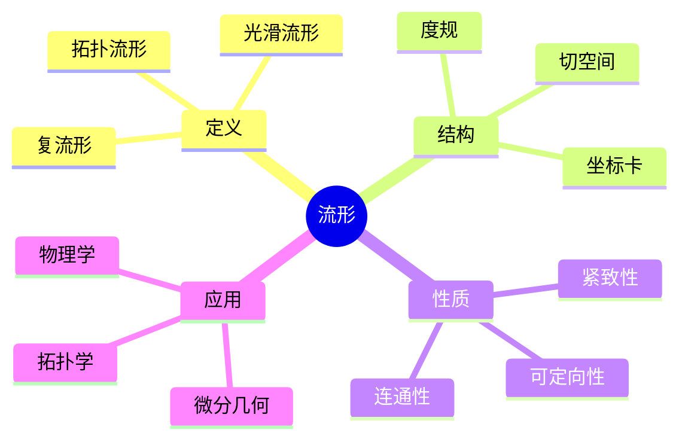
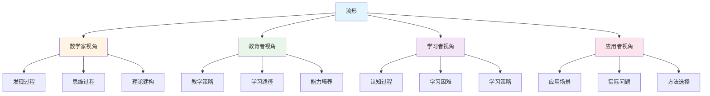
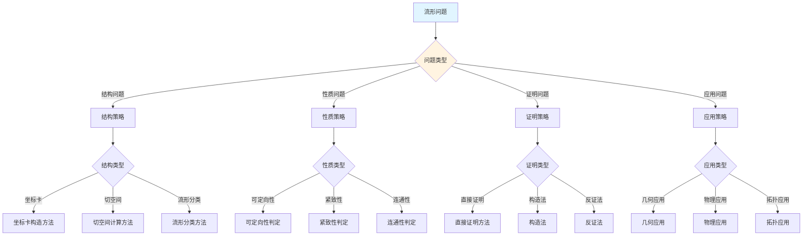
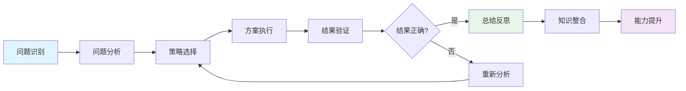
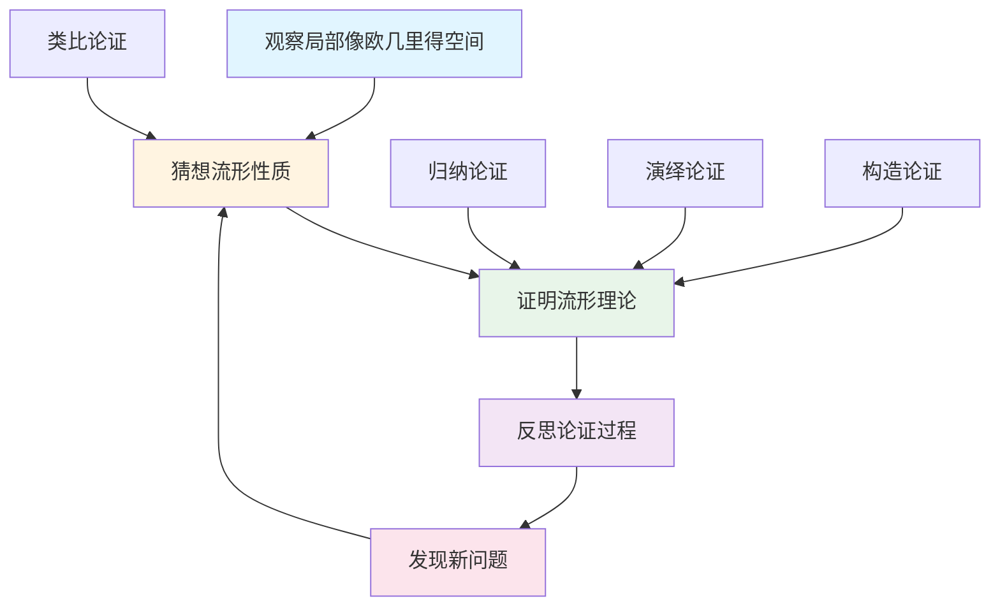
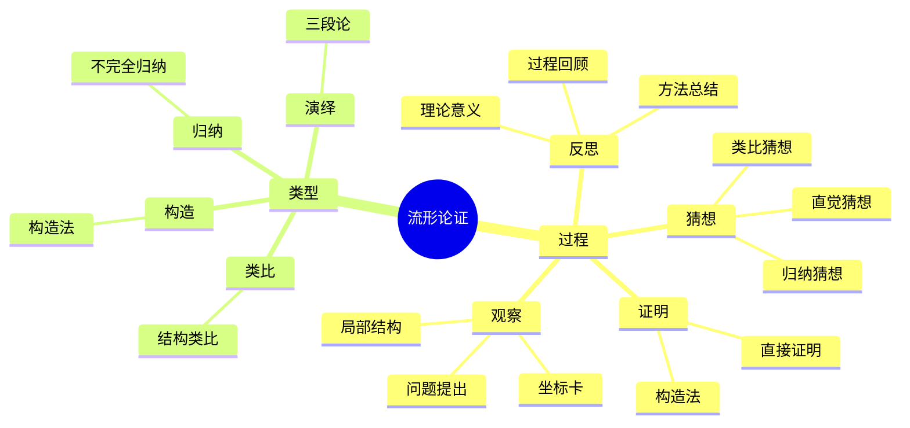

# 流形 (Manifold) - 三视角组织版

**概念编号**: C.CORE.018
**知识层次**: L0-L2
**知识领域**: D4 (几何)
**创建日期**: 2025年1月
**最后更新**: 2025年1月

---

## 📋 目录 / Table of Contents

- [流形 (Manifold) - 三视角组织版](#流形-manifold---三视角组织版)
  - [📋 目录 / Table of Contents](#-目录--table-of-contents)
  - [1. 📋 概述 (编号: C.CORE.018.01)](#1--概述-编号-ccore01801)
  - [🧠 认知学视角：如何理解流形 (编号: C.CORE.018.02)](#-认知学视角如何理解流形-编号-ccore01802)
    - [认知起点 (编号: C.CORE.018.02.01)](#认知起点-编号-ccore0180201)
    - [认知过程 (编号: C.CORE.018.02.02)](#认知过程-编号-ccore0180202)
      - [阶段1：直观理解阶段 (编号: C.CORE.018.02.02.01)](#阶段1直观理解阶段-编号-ccore018020201)
      - [阶段2：概念形成阶段 (编号: C.CORE.018.02.02.02)](#阶段2概念形成阶段-编号-ccore018020202)
      - [阶段3：形式化阶段 (编号: C.CORE.018.02.02.03)](#阶段3形式化阶段-编号-ccore018020203)
    - [认知障碍 (编号: C.CORE.018.02.03)](#认知障碍-编号-ccore0180203)
    - [认知工具 (编号: C.CORE.018.02.04)](#认知工具-编号-ccore0180204)
  - [🎓 教育学视角：如何教学流形 (编号: C.CORE.018.03)](#-教育学视角如何教学流形-编号-ccore01803)
    - [教学目标 (编号: C.CORE.018.03.01)](#教学目标-编号-ccore0180301)
    - [教学路径 (编号: C.CORE.018.03.02)](#教学路径-编号-ccore0180302)
      - [阶段1：引入阶段（激发兴趣） (编号: C.CORE.018.03.02.01)](#阶段1引入阶段激发兴趣-编号-ccore018030201)
      - [阶段2：探索阶段（主动建构） (编号: C.CORE.018.03.02.02)](#阶段2探索阶段主动建构-编号-ccore018030202)
      - [阶段3：形式化阶段（抽象概括） (编号: C.CORE.018.03.02.03)](#阶段3形式化阶段抽象概括-编号-ccore018030203)
      - [阶段4：巩固阶段（应用深化） (编号: C.CORE.018.03.02.04)](#阶段4巩固阶段应用深化-编号-ccore018030204)
    - [教学难点 (编号: C.CORE.018.03.03)](#教学难点-编号-ccore0180303)
    - [教学策略 (编号: C.CORE.018.03.04)](#教学策略-编号-ccore0180304)
    - [评估方法 (编号: C.CORE.018.03.05)](#评估方法-编号-ccore0180305)
  - [🔬 数学家视角：如何思考流形 (编号: C.CORE.018.04)](#-数学家视角如何思考流形-编号-ccore01804)
    - [问题起源 (编号: C.CORE.018.04.01)](#问题起源-编号-ccore0180401)
    - [思维过程 (编号: C.CORE.018.04.02)](#思维过程-编号-ccore0180402)
      - [步骤1：问题提出 (编号: C.CORE.018.04.02.01)](#步骤1问题提出-编号-ccore018040201)
      - [步骤2：概念形成 (编号: C.CORE.018.04.02.02)](#步骤2概念形成-编号-ccore018040202)
      - [步骤3：理论发展 (编号: C.CORE.018.04.02.03)](#步骤3理论发展-编号-ccore018040203)
    - [历史发展 (编号: C.CORE.018.04.03)](#历史发展-编号-ccore0180403)
    - [3.2 关键人物和贡献 (编号: C.CORE.018.04.04)](#32-关键人物和贡献-编号-ccore0180404)
    - [重要定理 (编号: C.CORE.018.04.05)](#重要定理-编号-ccore0180405)
    - [开放问题 (编号: C.CORE.018.04.06)](#开放问题-编号-ccore0180406)
    - [一、第一人称思维描述 (编号: C.CORE.018.04.07)](#一第一人称思维描述-编号-ccore0180407)
      - [1.1 Riemann的发现过程](#11-riemann的发现过程)
    - [二、数学直觉的形成 (编号: C.CORE.018.04.08)](#二数学直觉的形成-编号-ccore0180408)
      - [2.1 直觉在概念发现中的作用](#21-直觉在概念发现中的作用)
      - [2.2 如何培养流形直觉](#22-如何培养流形直觉)
    - [三、数学美的教育价值 (编号: C.CORE.018.04.09)](#三数学美的教育价值-编号-ccore0180409)
      - [3.1 流形论的美在哪里](#31-流形论的美在哪里)
      - [3.2 如何培养学生的数学美感](#32-如何培养学生的数学美感)
    - [四、问题解决策略 (编号: C.CORE.018.04.10)](#四问题解决策略-编号-ccore0180410)
      - [4.1 数学家的启发式方法](#41-数学家的启发式方法)
      - [4.2 思维过程分析](#42-思维过程分析)
    - [五、批判性反思 (编号: C.CORE.018.04.11)](#五批判性反思-编号-ccore0180411)
      - [5.1 流形概念的局限性](#51-流形概念的局限性)
      - [5.2 流形理论的未解决问题](#52-流形理论的未解决问题)
  - [💡 数学解释：为什么流形是这样定义的 (编号: C.CORE.018.05)](#-数学解释为什么流形是这样定义的-编号-ccore01805)
    - [一、直观解释：流形是什么？](#一直观解释流形是什么)
      - [1.1 具体例子](#11-具体例子)
      - [1.2 形象类比](#12-形象类比)
      - [1.3 几何直观](#13-几何直观)
      - [1.4 操作体验](#14-操作体验)
    - [二、知性解释：流形的本质是什么？](#二知性解释流形的本质是什么)
      - [2.1 概念定义](#21-概念定义)
      - [2.2 分类体系](#22-分类体系)
      - [2.3 抽象结构](#23-抽象结构)
      - [2.4 知识体系](#24-知识体系)
    - [三、理性解释：流形的公理化定义](#三理性解释流形的公理化定义)
      - [3.1 公理体系](#31-公理体系)
      - [3.2 形式化证明](#32-形式化证明)
      - [3.3 系统建构](#33-系统建构)
    - [四、多视角解释：从不同角度理解流形](#四多视角解释从不同角度理解流形)
      - [4.1 数学家视角：流形是如何被发现的？](#41-数学家视角流形是如何被发现的)
      - [4.2 教育者视角：如何教学流形？](#42-教育者视角如何教学流形)
      - [4.3 学习者视角：如何学习流形？](#43-学习者视角如何学习流形)
      - [4.4 应用者视角：如何应用流形？](#44-应用者视角如何应用流形)
    - [五、思维表征：用多种方式理解流形](#五思维表征用多种方式理解流形)
      - [5.1 思维导图：流形的知识结构](#51-思维导图流形的知识结构)
      - [5.2 矩阵对比：不同解释方式的对比](#52-矩阵对比不同解释方式的对比)
      - [5.3 多视角表征：从不同角度表征流形](#53-多视角表征从不同角度表征流形)
      - [5.4 决策树：流形问题分类和策略选择](#54-决策树流形问题分类和策略选择)
      - [5.5 决策逻辑路径：流形问题解决过程](#55-决策逻辑路径流形问题解决过程)
      - [5.6 多维对比矩阵：流形概念特征对比](#56-多维对比矩阵流形概念特征对比)
  - [💡 数学解释：为什么流形是这样定义的 (编号: C.CORE.018.05)](#-数学解释为什么流形是这样定义的-编号-ccore01805)
  - [🔍 数学论证：如何论证流形 (编号: C.CORE.018.06)](#-数学论证如何论证流形-编号-ccore01806)
    - [一、论证过程：从观察到反思](#一论证过程从观察到反思)
    - [二、论证类型：多种推理方式](#二论证类型多种推理方式)
    - [三、论证可视化：用图形表示论证过程](#三论证可视化用图形表示论证过程)
  - [🔗 三视角整合 (编号: C.CORE.018.07)](#-三视角整合-编号-ccore01807)
    - [三个视角的关联](#三个视角的关联)
    - [如何综合运用三个视角](#如何综合运用三个视角)
  - [📚 参考文献 (编号: C.CORE.018.08)](#-参考文献-编号-ccore01808)
    - [权威资源](#权威资源)
    - [经典教材](#经典教材)
    - [研究论文](#研究论文)

---

---

## 1. 📋 概述 (编号: C.CORE.018.01)

流形是局部像欧几里得空间的拓扑空间，是微分几何、拓扑学、物理学的基础。流形理论在现代数学和物理学中有广泛应用。

本文档从**数学认知学**、**教育学**、**数学家**三个视角深入展开流形概念，避免简单的概念堆垒。

**权威资源对齐**:

- Wikipedia: [Manifold](https://en.wikipedia.org/wiki/Manifold)
- Stanford课程: Math 215A (Differential Topology)
- Princeton课程: MAT 520 (Differential Geometry)
- MIT课程: 18.965 (Geometry of Manifolds)
- Metamath: [Manifold](http://us.metamath.org/mpeuni/df-manifold.html)

---

## 🧠 认知学视角：如何理解流形 (编号: C.CORE.018.02)

### 认知起点 (编号: C.CORE.018.02.01)

**学习者已有的知识基础**:

- 拓扑空间的概念
- 欧几里得空间的概念
- 日常经验中的"曲面"、"高维空间"概念

**日常经验中的类似概念**:

- "曲面"：二维流形
- "曲线"：一维流形
- "高维空间"：高维流形

### 认知过程 (编号: C.CORE.018.02.02)

#### 阶段1：直观理解阶段 (编号: C.CORE.018.02.02.01)

**具体例子**:

- 例子1：曲线（1维流形）
- 例子2：球面$S^2$（2维流形）
- 例子3：环面$T^2$（2维流形）

**形象类比**:

- **局部类比**: 流形就像"局部像欧几里得空间的空间"
  - 每点有邻域同胚于$\mathbb{R}^n$
  - 局部性质可以推广到整体
  - 不需要全局坐标

- **地图类比**: 流形就像"地图册"
  - 每个坐标图是"地图"
  - 坐标图覆盖整个流形
  - 坐标图之间相容

**可视化表示**:

```text
流形:
    M
    ├─ 坐标图1 (U₁, φ₁)
    ├─ 坐标图2 (U₂, φ₂)
    └─ 坐标图3 (U₃, φ₃)
    局部同胚于 Rⁿ
```

#### 阶段2：概念形成阶段 (编号: C.CORE.018.02.02.02)

**从例子中抽象出共同特征**:

- 所有例子都涉及"局部同胚"
- 局部同胚于$\mathbb{R}^n$
- 满足Hausdorff和第二可数条件

**识别关键属性**:

1. **局部欧几里得**: 每点有邻域同胚于$\mathbb{R}^n$
2. **Hausdorff**: 任意两点有不相交邻域
3. **第二可数**: 存在可数拓扑基

**建立概念边界**:

- **什么是流形**: 局部同胚于$\mathbb{R}^n$的拓扑空间
- **什么不是流形**:
  - 不满足局部欧几里得条件的空间（不是流形）

#### 阶段3：形式化阶段 (编号: C.CORE.018.02.02.03)

**严格定义**:

- 拓扑流形：满足局部欧几里得、Hausdorff、第二可数条件的拓扑空间
- 光滑流形：坐标图之间的转换映射是光滑的

**公理化表述**:

- 条件1：局部欧几里得
- 条件2：Hausdorff
- 条件3：第二可数

**逻辑结构**:

- 流形是微分几何的基础
- 流形是拓扑学的基础
- 流形是物理学的基础

### 认知障碍 (编号: C.CORE.018.02.03)

**常见误解**:

1. **误解1**: 认为流形必须有全局坐标
   - **纠正**: 流形只需要局部坐标，不一定有全局坐标

2. **误解2**: 认为所有流形都相同
   - **纠正**: 不同的流形有不同的拓扑和几何性质

3. **误解3**: 混淆流形和向量空间
   - **纠正**: 流形是拓扑空间，向量空间是代数结构

**理解难点**:

1. **难点1**: 局部欧几里得的抽象性
   - **原因**: "局部同胚"比较抽象
   - **解决方法**: 从具体例子开始，逐步抽象

2. **难点2**: 坐标图的概念
   - **原因**: 坐标图的概念比较抽象
   - **解决方法**: 用具体例子，强调坐标图的作用

3. **难点3**: 流形的维数
   - **原因**: 高维流形比较抽象
   - **解决方法**: 从低维流形开始，逐步到高维

**认知陷阱**:

- **局部性**: 需要理解"局部同胚"的含义
- **坐标图**: 需要理解坐标图的作用

### 认知工具 (编号: C.CORE.018.02.04)

**类比工具**:

- **局部类比**: 流形 = 局部像欧几里得空间的空间
- **地图类比**: 流形 = 地图册

**可视化工具**:

- **坐标图**: 用坐标图表示流形
- **流形图**: 用流形图表示流形

**具体化工具**:

- **具体例子**: 用具体例子理解抽象概念
- **反例**: 用反例理解概念边界

---

## 🎓 教育学视角：如何教学流形 (编号: C.CORE.018.03)

### 教学目标 (编号: C.CORE.018.03.01)

**知识目标**:

- 理解流形的基本概念
- 掌握流形的定义
- 理解流形的性质
- 理解流形的应用

**能力目标**:

- 能够判断一个空间是否是流形
- 能够理解流形的性质
- 能够应用流形解决实际问题
- 能够理解流形的重要性

**情感目标**:

- 培养数学抽象思维
- 培养几何思维
- 激发对数学的兴趣

### 教学路径 (编号: C.CORE.018.03.02)

#### 阶段1：引入阶段（激发兴趣） (编号: C.CORE.018.03.02.01)

**实际问题**:

- 问题1：如何描述高维空间？
- 问题2：如何研究几何结构？
- 问题3：如何研究物理空间？

**历史背景**:

- 流形的历史发展
- 流形在数学中的地位
- 流形在物理中的应用

**引发认知冲突**:

- 问题：如何统一描述各种几何空间？
- 引出流形的概念

#### 阶段2：探索阶段（主动建构） (编号: C.CORE.018.03.02.02)

**引导发现**:

1. 让学生自己列举"局部像欧几里得空间"的例子
2. 让学生观察这些例子的共同特征
3. 引导学生抽象出流形的定义

**合作探究**:

- 小组讨论：什么是流形？
- 小组讨论：流形有哪些性质？
- 小组讨论：如何表示流形？

**多元表征**:

- **语言表征**: "流形是局部同胚于$\mathbb{R}^n$的拓扑空间"
- **符号表征**: $M$
- **图形表征**: 坐标图、流形图
- **集合表征**: 流形定义

#### 阶段3：形式化阶段（抽象概括） (编号: C.CORE.018.03.02.03)

**严格定义**:

- 流形的定义
- 流形的性质
- 流形的分类

**性质证明**:

- 流形的基本性质
- 流形的拓扑性质
- 流形的几何性质

**应用拓展**:

- 流形在微分几何中的应用
- 流形在拓扑学中的应用
- 流形在物理中的应用

#### 阶段4：巩固阶段（应用深化） (编号: C.CORE.018.03.02.04)

**练习应用**:

- 基础练习：流形的表示和性质
- 应用练习：用流形解决实际问题
- 综合练习：流形的综合应用

**变式训练**:

- 不同形式的流形
- 不同性质的流形
- 流形的应用

**知识整合**:

- 流形与其他概念的联系
- 流形在数学体系中的地位

### 教学难点 (编号: C.CORE.018.03.03)

**难点1：局部欧几里得的抽象性**:

- **难点描述**: 学生难以理解局部欧几里得
- **解决方法**:
  - 从具体例子开始
  - 逐步抽象
  - 用具体例子说明

**难点2：坐标图的概念**:

- **难点描述**: 学生难以理解坐标图
- **解决方法**:
  - 用具体例子
  - 强调坐标图的作用
  - 用图形可视化

**难点3：高维流形**:

- **难点描述**: 学生难以理解高维流形
- **解决方法**:
  - 从低维流形开始
  - 逐步到高维
  - 用具体例子说明

### 教学策略 (编号: C.CORE.018.03.04)

**策略1：从具体到抽象**:

- 先给出具体例子
- 再抽象出一般概念
- 最后给出严格定义

**策略2：多元表征**:

- 用语言、符号、图形等多种方式表示同一概念
- 帮助学生建立不同表征之间的联系

**策略3：问题驱动**:

- 从实际问题出发
- 引出数学概念
- 解决问题

**策略4：可视化教学**:

- 使用坐标图
- 使用流形图
- 使用具体例子

### 评估方法 (编号: C.CORE.018.03.05)

**形成性评估**（评估理解过程）:

- 课堂提问：检查学生对概念的理解
- 小组讨论：观察学生的思考过程
- 练习作业：检查学生的应用能力

**总结性评估**（评估最终理解）:

- 测验：检查学生对概念和性质的掌握
- 项目：检查学生应用流形解决实际问题的能力
- 反思：检查学生对流形概念的理解深度

---

## 🔬 数学家视角：如何思考流形 (编号: C.CORE.018.04)

### 问题起源 (编号: C.CORE.018.04.01)

**历史背景**:

- 19世纪：流形概念的起源
- 20世纪：流形理论的发展
- 20世纪中期：流形的现代发展

**原始问题**:

- **问题1**: 如何描述高维空间？
- **问题2**: 如何研究几何结构？
- **问题3**: 流形有哪些性质？

**研究动机**:

- 统一几何理论
- 发展微分几何
- 研究物理空间

### 思维过程 (编号: C.CORE.018.04.02)

#### 步骤1：问题提出 (编号: C.CORE.018.04.02.01)

**观察到的现象**:

- 需要描述高维空间
- 需要研究几何结构
- 需要统一几何理论

**提出的猜想**:

- 可以引入流形概念
- 流形可以描述高维空间
- 流形有丰富的性质

**需要解决的问题**:

- 如何定义流形？
- 流形应该满足什么条件？
- 流形有哪些性质？

#### 步骤2：概念形成 (编号: C.CORE.018.04.02.02)

**尝试性定义**:

- **局部欧几里得定义**: 通过局部同胚
- **坐标图定义**: 通过坐标图

**性质探索**:

- 流形的基本性质
- 流形的拓扑性质
- 流形的几何性质

**结构发现**:

- 流形是微分几何的基础
- 流形是拓扑学的基础
- 流形是物理学的基础

#### 步骤3：理论发展 (编号: C.CORE.018.04.02.03)

**定理证明**:

- 流形的基本性质
- 流形的拓扑性质
- 流形的几何性质

**应用拓展**:

- 流形在微分几何中的应用
- 流形在拓扑学中的应用
- 流形在物理中的应用

**理论完善**:

- 流形的严格定义
- 流形的范畴论研究
- 流形的应用研究

### 历史发展 (编号: C.CORE.018.04.03)

**早期阶段**（19世纪）:

- **Riemann (1854)**: 在研究高维几何时引入流形概念
- **Poincaré (1895)**: 研究拓扑流形

**关键突破**（20世纪）:

- **Whitney (1936)**: 证明嵌入定理
- **Milnor (1956)**: 发现7维怪球
- **Smale (1961)**: 证明高维Poincaré猜想

**现代发展**（20世纪中期）:

- **Thurston (1982)**: 几何化猜想
- **Perelman (2003)**: 证明Poincaré猜想

### 3.2 关键人物和贡献 (编号: C.CORE.018.04.04)

**Bernhard Riemann (1826-1866)**:

- 流形概念的引入者
- 建立微分几何基础

**Henri Poincaré (1854-1912)**:

- 研究拓扑流形
- 建立拓扑学基础

**Hassler Whitney (1907-1989)**:

- 证明嵌入定理
- 建立现代流形理论

### 重要定理 (编号: C.CORE.018.04.05)

**Whitney嵌入定理**:

- $n$维光滑流形可以嵌入到$\mathbb{R}^{2n}$中
- 意义：流形的表示

**流形的分类**:

- 1维：只有$\mathbb{R}$和$S^1$
- 2维：可定向和不可定向曲面的分类
- 3维：Thurston几何化猜想
- 意义：流形分类的基础

**Poincaré猜想**:

- 3维单连通闭流形同胚于$S^3$
- 意义：流形分类的重要结果

### 开放问题 (编号: C.CORE.018.04.06)

**未解决问题**:

- 流形的分类问题
- 流形的表示问题
- 流形的应用问题

**研究方向**:

- 流形的范畴论研究
- 流形的几何研究
- 流形的应用研究

### 一、第一人称思维描述 (编号: C.CORE.018.04.07)

#### 1.1 Riemann的发现过程

**详细历史背景**:

- **1854年**：Riemann发表《关于几何基础的假设》（Über die Hypothesen, welche der Geometrie zu Grunde liegen）
- **背景**：研究高维几何，发现有些空间局部像欧几里得空间，但整体不是
- **问题**：如何描述这些空间？如何统一处理各种几何空间？

**Riemann的详细第一人称描述**:
> "1854年，我在研究高维几何时，遇到了一个问题：如何描述那些局部像欧几里得空间，但整体不是的空间？
>
> 我发现，球面$S^2$就是一个例子：
>
> - **局部**：球面上每一点附近都像平面（可以用坐标卡表示）
> - **整体**：球面不是平面（不能用一个坐标卡覆盖整个球面）
>
> 我的方法是这样的：
>
> - **思路**：用坐标卡覆盖流形，每个坐标卡是到$\mathbb{R}^n$的同胚
> - **定义**：$n$维流形是Hausdorff拓扑空间，每一点有邻域同胚于$\mathbb{R}^n$
> - **例子**：球面$S^2$是2维流形，可以用两个坐标卡覆盖
>
> 例如，对于球面$S^2$：
>
> - **坐标卡1**：$U_1 = S^2 \setminus \{(0,0,1)\}$，$\phi_1: U_1 \to \mathbb{R}^2$（球极投影）
> - **坐标卡2**：$U_2 = S^2 \setminus \{(0,0,-1)\}$，$\phi_2: U_2 \to \mathbb{R}^2$（球极投影）
> - **坐标变换**：$\phi_2 \circ \phi_1^{-1}$是$\mathbb{R}^2 \setminus \{0\}$到$\mathbb{R}^2 \setminus \{0\}$的微分同胚
>
> 这让我意识到，流形是局部欧几里得的空间，可以用坐标卡表示。这为微分几何提供了基础。"

**详细的思维过程**:

1. **观察到的现象**（1854年）:

   **现象1：有些空间局部像欧几里得空间**
   - **问题**：球面局部像平面，但整体不是平面
   - **例子**：球面$S^2$每一点附近都像平面
   - **需要**：描述这些空间

   **现象2：这些空间有特殊的性质**
   - **问题**：如何描述这些空间的性质？
   - **思路**：用坐标卡表示
   - **需要**：建立流形理论

   **现象3：需要统一的概念**
   - **问题**：如何统一处理不同的几何空间？
   - **思路**：用流形统一
   - **需要**：建立流形理论

2. **提出的猜想**（1854年）:

   **猜想1：用流形描述局部欧几里得的空间**
   - **思路**：定义流形为Hausdorff拓扑空间，每一点有邻域同胚于$\mathbb{R}^n$
   - **例子**：球面$S^2$是2维流形
   - **优点**：统一描述局部欧几里得的空间

   **猜想2：用坐标卡表示流形**
   - **思路**：用坐标卡覆盖流形，每个坐标卡是到$\mathbb{R}^n$的同胚
   - **例子**：球面$S^2$可以用两个坐标卡覆盖
   - **意义**：为流形提供局部表示

   **猜想3：流形是几何学的基础**
   - **性质**：流形是抽象的几何结构
   - **应用**：流形可以应用到更广泛的领域
   - **意义**：流形是统一的几何结构

3. **遇到的困难**（1854年）:

   **困难1：如何严格定义流形？**
   - **问题**：如何定义流形？
   - **解决**：通过坐标卡定义流形
   - **意义**：为流形提供严格的数学基础

   **困难2：如何判断流形的性质？**
   - **问题**：如何判断流形是否可定向？是否紧致？
   - **解决**：通过流形的结构判断
   - **意义**：为流形分类提供方法

   **困难3：如何应用流形理论？**
   - **问题**：如何用流形理论解决实际问题？
   - **解决**：建立微分几何、黎曼几何
   - **意义**：为流形提供应用基础

4. **突破的时刻**（1854年，Riemann）:

   **突破1：流形的概念**
   - 引入流形的概念描述局部欧几里得的空间
   - **关键**：抽象出流形的结构
   - **意义**：为流形理论提供基础

   **突破2：坐标卡表示**
   - 建立坐标卡表示理论
   - **关键**：流形可以用坐标卡覆盖
   - **意义**：为流形提供局部表示

   **突破3：流形理论的广泛应用**
   - 流形理论可以应用到更广泛的领域
   - **关键**：流形是抽象的几何结构
   - **意义**：流形理论成为几何学的基础

### 二、数学直觉的形成 (编号: C.CORE.018.04.08)

#### 2.1 直觉在概念发现中的作用

**Riemann的直觉**:

- **直觉1**: "流形"是"局部欧几里得的空间"——这个直觉引导Riemann发现流形
- **直觉2**: 流形可以统一处理几何——这个直觉引导Riemann建立流形理论
- **直觉3**: 流形是几何学的基础——这个直觉引导Riemann建立流形理论

**直觉的验证**:

- 通过严格的数学证明验证直觉的正确性
- 通过坐标卡严格化流形定义
- 通过应用验证流形的广泛性

**直觉的深化**:

- 从"局部欧几里得"到"流形的严格定义"
- 从"统一处理几何"到"流形的广泛应用"
- 从"几何学基础"到"流形的深入发展"

#### 2.2 如何培养流形直觉

**数学家的建议**:

- **Riemann**: "流形直觉是长期训练的结果。通过大量练习和深入思考，我们可以培养对流形的直觉。"
- **Poincaré**: "从具体例子开始，逐步抽象，这是培养流形直觉的有效方法。"

**培养方法**:

1. **大量练习**: 通过大量流形构造练习，培养对流形的直觉
2. **深入思考**: 深入思考流形的本质，理解流形的深层结构
3. **类比和联想**: 通过类比和联想，建立流形与其他概念的联系
4. **与专家交流**: 与数学家交流，学习他们的思维方式

**教学启示**:

- 从具体例子开始，逐步抽象
- 鼓励学生思考流形的本质
- 引导学生建立流形与其他概念的联系

### 三、数学美的教育价值 (编号: C.CORE.018.04.09)

#### 3.1 流形论的美在哪里

**结构美**:

- **简洁性**: 流形的概念非常简洁——"局部同胚于欧几里得空间的拓扑空间"
- **统一性**: 流形可以统一描述数学中的各种几何空间
- **和谐性**: 流形运算满足优美的规律（坐标变换、切空间等）

**数学家的评价**:

- **Riemann**: "流形论的美在于它的统一性。它为我们提供了一个统一的框架来理解几何空间。"
- **Poincaré**: "流形论的美在于它的基础性。它是几何学的基础，所有几何空间都可以用流形来描述。"

#### 3.2 如何培养学生的数学美感

**数学家的建议**:

- **Riemann**: "展示流形论的美感，让学生感受到数学的美。"
- **Poincaré**: "通过流形论的历史和发展，让学生理解数学的美。"

**教学方法**:

1. **展示数学美**:
   - 展示流形概念的简洁性和统一性
   - 展示流形运算的优美规律
   - 展示流形在数学中的基础地位

2. **引导学生欣赏**:
   - 引导学生欣赏流形概念的简洁性
   - 引导学生欣赏流形运算的和谐性
   - 引导学生欣赏流形的基础性

3. **鼓励学生创造美**:
   - 鼓励学生发现流形论的美
   - 鼓励学生创造优美的流形证明
   - 鼓励学生探索流形论的美

### 四、问题解决策略 (编号: C.CORE.018.04.10)

#### 4.1 数学家的启发式方法

**策略1：从具体到抽象**:

- 从具体的流形例子开始
- 抽象出流形的一般性质
- 建立流形的理论体系

**策略2：从简单到复杂**:

- 先理解基本流形
- 再理解流形运算
- 最后理解流形理论

**策略3：从问题到理论**:

- 从实际问题出发
- 引出流形概念
- 建立流形理论

#### 4.2 思维过程分析

**问题识别**:

- 识别问题类型：流形定义问题、流形性质问题、流形应用问题
- 识别问题难度：简单问题、中等问题、复杂问题

**策略选择**:

- 简单问题：直接方法
- 中等问题：分步方法
- 复杂问题：分解方法

**执行和反思**:

- 执行策略，解决问题
- 反思过程，总结经验
- 改进方法，提高效率

### 五、批判性反思 (编号: C.CORE.018.04.11)

#### 5.1 流形概念的局限性

**概念的边界**:

- 流形只描述局部欧几里得的空间，不能描述所有拓扑空间
- 流形是抽象的，需要具体化才能应用
- 流形不能表示所有数学结构

**概念的推广**:

- 概形：代数几何中的流形
- 超流形：更一般的流形
- 范畴流形：范畴论中的流形

#### 5.2 流形理论的未解决问题

**未解决的问题**:

- 流形的分类问题：如何分类所有流形？
- 流形的表示问题：如何表示流形？
- 流形的应用问题：如何更好地应用流形？

**研究方向**:

- 流形的范畴论研究
- 流形的拓扑学研究
- 流形的几何研究
- 流形的应用研究

---

## 💡 数学解释：为什么流形是这样定义的 (编号: C.CORE.018.05)

### 一、直观解释：流形是什么？

#### 1.1 具体例子

**生活中的例子**：

- **地球表面**：地球表面是2维流形
  - 例如：地球表面局部像平面（可以用地图表示），但整体是球面
  - **为什么这样定义**：因为我们需要一个概念来表示"局部像欧几里得空间，但整体不是的空间"
- **面包圈表面**：面包圈（环面）是2维流形
  - 例如：面包圈表面局部像平面，但整体是环面
  - **为什么这样定义**：因为我们需要一个概念来表示"有洞的曲面"
- **高维空间**：$n$维流形是$n$维空间的推广
  - 例如：3维流形可以描述3维空间中的曲面
  - **为什么这样定义**：因为我们需要一个概念来表示"高维空间中的几何对象"

**数学中的例子**：

- **球面**：$S^2 = \{(x, y, z) \in \mathbb{R}^3 : x^2 + y^2 + z^2 = 1\}$是2维流形
  - **为什么这样定义**：我们需要一个概念来表示"局部像平面，但整体是球面的空间"
- **环面**：$T^2 = S^1 \times S^1$是2维流形
  - **为什么这样定义**：我们需要一个概念来表示"有洞的曲面"
- **欧几里得空间**：$\mathbb{R}^n$是$n$维流形
  - **为什么这样定义**：我们需要一个概念来表示"最简单的流形"

#### 1.2 形象类比

**地图类比**：

- **流形就像"地球表面"**
  - 地球表面局部像平面（可以用地图表示）
  - 地球表面整体是球面（不能用一个地图覆盖整个地球）
  - 需要多个地图（坐标卡）覆盖整个地球
- **为什么这样类比**：这个类比帮助我们理解流形的"局部欧几里得"性质

**拼图类比**：

- **流形就像"拼图"**
  - 每个拼图片（坐标卡）是平面的
  - 拼图片可以重叠（坐标变换）
  - 所有拼图片覆盖整个拼图（流形）
- **为什么这样类比**：这个类比帮助我们理解流形的"坐标卡覆盖"结构

#### 1.3 几何直观

**坐标卡表示**：

- 使用坐标卡表示流形
- 例如：球面$S^2$可以用两个坐标卡覆盖（球极投影）
- **为什么使用坐标卡**：坐标卡提供局部表示，帮助我们理解流形

**流形的可视化**：

- 使用图形表示流形
- 例如：球面、环面、Klein瓶
- **为什么使用可视化**：可视化提供几何直观，帮助我们理解流形

#### 1.4 操作体验

**流形运算的操作**：

- **流形的乘积**：$M \times N$是两个流形的乘积
  - 例如：$S^1 \times S^1 = T^2$（环面）
  - **为什么这样操作**：因为我们需要一个运算来表示"两个流形的乘积"
- **流形的商**：$M/G$是流形在群作用下的商
  - 例如：$\mathbb{R}^2 / \mathbb{Z}^2 = T^2$（环面）
  - **为什么这样操作**：因为我们需要一个运算来表示"流形的商"
- **流形的嵌入**：$M \hookrightarrow \mathbb{R}^n$是流形到欧几里得空间的嵌入
  - 例如：$S^2 \hookrightarrow \mathbb{R}^3$（球面嵌入3维空间）
  - **为什么这样操作**：因为我们需要一个工具来表示"流形在欧几里得空间中的表示"

### 二、知性解释：流形的本质是什么？

#### 2.1 概念定义

**流形的内涵**：

- **流形是局部欧几里得的拓扑空间**
  - **局部欧几里得性**：每一点有邻域同胚于$\mathbb{R}^n$
  - **Hausdorff性**：任意两点有不相交的邻域
  - **第二可数性**：有可数的拓扑基
- **为什么这样定义**：这些特征使得流形成为一个完整的几何对象，支持所有几何研究

**流形的外延**：

- **拓扑流形**：只要求局部同胚于$\mathbb{R}^n$
- **光滑流形**：要求坐标变换是光滑的
- **复流形**：要求坐标变换是全纯的
- **为什么这样分类**：不同的流形类型有不同的性质和用途

#### 2.2 分类体系

**按维数分类**：

- **1维流形**：只有$\mathbb{R}$和$S^1$
- **2维流形**：可定向和不可定向曲面
- **3维流形**：Thurston几何化猜想
- **为什么这样分类**：维数是流形的基本特征

**按性质分类**：

- **可定向流形**：有定向的流形
- **不可定向流形**：没有定向的流形（如Klein瓶）
- **紧致流形**：有界闭流形
- **为什么这样分类**：性质是流形的重要特征

#### 2.3 抽象结构

**流形的拓扑结构**：

- **坐标卡**：$(U, \phi)$，其中$U$是开集，$\phi: U \to \mathbb{R}^n$是同胚
- **坐标图册**：流形的坐标卡覆盖
- **坐标变换**：$\phi_2 \circ \phi_1^{-1}$是$\mathbb{R}^n$的开集之间的同胚
- **为什么有这些结构**：这些结构是流形理论的基础

**流形的几何结构**：

- **切空间**：$T_p M$是流形在点$p$的切空间
- **切丛**：$TM = \bigcup_{p \in M} T_p M$是流形的切丛
- **度规**：$g$是流形上的度规（黎曼流形）
- **为什么有这些结构**：这些结构是微分几何的基础

#### 2.4 知识体系

**流形在数学体系中的位置**：

- **基础地位**：流形是微分几何的基础
  - 流形是几何对象的基础
  - 流形是拓扑学的基础
  - 流形是物理学的基础
- **为什么是基础**：流形提供了统一的框架来研究几何对象

**流形与其他概念的关系**：

- **流形与拓扑空间**：流形是特殊的拓扑空间
- **流形与微分几何**：流形是微分几何的研究对象
- **流形与物理学**：流形是物理空间的基础
- **为什么有这些关系**：这些关系揭示了流形与其他数学概念的内在联系

### 三、理性解释：流形的公理化定义

#### 3.1 公理体系

**流形的拓扑定义**：

- **定义**：$n$维拓扑流形是Hausdorff第二可数拓扑空间，每一点有邻域同胚于$\mathbb{R}^n$
- **为什么需要这个定义**：这个定义提供了流形的严格数学基础

**流形的光滑定义**：

- **定义**：$n$维光滑流形是拓扑流形，坐标变换是光滑的
- **为什么这样定义**：这个定义将流形放在更一般的框架中

#### 3.2 形式化证明

**流形性质的证明**：

##### 定理1：流形的局部紧致性

**定理陈述**：每个流形都是局部紧致的。

**形式化表述**：
$$\forall M \text{流形}, \forall p \in M, \exists U \text{开邻域}, \bar{U} \text{紧致}$$

**证明**：
1. **构造紧致邻域**：
   - 设$M$是$n$维流形，$p \in M$
   - 存在坐标卡$(U, \phi)$，使得$p \in U$，$\phi: U \to \mathbb{R}^n$是同胚
   - 在$\mathbb{R}^n$中，存在包含$\phi(p)$的紧致球$B_r(\phi(p))$
   - 由于$\phi$是同胚，$\phi^{-1}(B_r(\phi(p)))$是$M$中$p$的紧致邻域

2. **验证紧致性**：
   - 由于$\phi$是连续映射，紧致集的连续像是紧致的
   - 因此$\phi^{-1}(B_r(\phi(p)))$是紧致的

**为什么这样证明**：利用流形的局部欧氏性质和紧致性在连续映射下的保持性。

---

##### 定理2：流形的可度量性

**定理陈述**：每个流形都是可度量的（即存在度量诱导其拓扑）。

**形式化表述**：
$$\forall M \text{流形}, \exists d: M \times M \to \mathbb{R}, \text{使得}(M, d)\text{是度量空间}$$

**证明**：
1. **局部度量构造**：
   - 对每个坐标卡$(U_i, \phi_i)$，在$U_i$上定义度量$d_i$：
     $$d_i(x, y) = \|\phi_i(x) - \phi_i(y)\|_{\mathbb{R}^n}$$
   - 其中$\|\cdot\|_{\mathbb{R}^n}$是$\mathbb{R}^n$上的欧氏范数

2. **全局度量构造**：
   - 使用单位分解$\{\rho_i\}$，构造全局度量：
     $$d(x, y) = \inf_{\gamma} \int_0^1 \sum_i \rho_i(\gamma(t)) \cdot d_i(\gamma'(t), 0) dt$$
   - 其中$\gamma$是从$x$到$y$的路径

3. **验证度量性质**：
   - 正定性：$d(x, y) \geqqq 0$，且$d(x, y) = 0 \iff x = y$
   - 对称性：$d(x, y) = d(y, x)$
   - 三角不等式：$d(x, z) \leqqq d(x, y) + d(y, z)$

**为什么这样证明**：利用流形的局部欧氏性质和单位分解技术，将局部度量"粘合"成全局度量。

---

##### 定理3：Whitney嵌入定理（简化形式）

**定理陈述**：每个$n$维光滑流形可以光滑嵌入到$\mathbb{R}^{2n}$中。

**形式化表述**：
$$\forall M \text{光滑流形}, \dim M = n, \exists f: M \to \mathbb{R}^{2n}, f\text{是光滑嵌入}$$

**证明思路**：
1. **局部嵌入**：
   - 对每个坐标卡$(U_i, \phi_i)$，$\phi_i: U_i \to \mathbb{R}^n$是嵌入
   - 使用单位分解$\{\rho_i\}$，构造全局映射：
     $$f(x) = (\rho_1(x)\phi_1(x), \rho_2(x)\phi_2(x), \ldots)$$

2. **维数估计**：
   - 需要足够的维数来避免自交
   - 使用一般位置论证，证明$2n$维足够

3. **验证嵌入性质**：
   - 单射性：使用一般位置论证
   - 浸入性：使用坐标卡的局部性质
   - 同胚性：使用紧致性和连续性

**为什么这样证明**：利用单位分解将局部嵌入"粘合"成全局嵌入，并使用一般位置论证确保单射性。

---

**流形关系的证明**：

##### 定理4：流形是特殊的拓扑空间

**定理陈述**：每个流形都是第二可数的Hausdorff拓扑空间。

**形式化表述**：
$$\forall M \text{流形}, M\text{是第二可数的Hausdorff拓扑空间}$$

**证明**：
1. **Hausdorff性质**：
   - 设$p, q \in M$，$p \neqqq q$
   - 如果$p, q$在同一个坐标卡中，使用$\mathbb{R}^n$的Hausdorff性质
   - 如果$p, q$在不同坐标卡中，使用坐标卡的开集性质

2. **第二可数性**：
   - 流形有可数坐标卡覆盖（由流形的定义）
   - 每个坐标卡是第二可数的（因为$\mathbb{R}^n$是第二可数的）
   - 可数个第二可数空间的并是第二可数的

**为什么这样证明**：利用流形的定义和拓扑空间的性质，从局部性质推导全局性质。

#### 3.3 系统建构

**流形论在数学基础中的地位**：

- **作为几何基础**：流形是几何学的基础
- **提供几何工具**：流形提供了研究几何对象的工具
- **统一框架**：流形统一了各种几何研究

**流形论的发展历史**：

- **Riemann的引入**（1854年）：引入流形概念
- **Poincaré的发展**（1895年）：研究拓扑流形
- **Whitney的嵌入定理**（1936年）：证明嵌入定理
- **为什么这样发展**：数学的发展需要严格的基础，流形论的发展反映了这一需求

### 四、多视角解释：从不同角度理解流形

#### 4.1 数学家视角：流形是如何被发现的？

**Riemann的发现过程**：

- **问题提出**：如何描述局部欧几里得的空间？
- **关键洞察**：使用坐标卡表示流形
- **重要发现**：流形可以统一描述各种几何空间
- **为什么这样发现**：数学家的直觉和严格证明相结合

**Whitney的嵌入过程**：

- **问题识别**：需要证明流形可以嵌入到欧几里得空间
- **策略选择**：使用嵌入定理
- **定义设计**：流形可以嵌入到$\mathbb{R}^{2n}$中
- **为什么这样设计**：需要提供严格的基础

#### 4.2 教育者视角：如何教学流形？

**教学策略**：

- **从具体到抽象**：先学习具体例子（球面、环面），再学习抽象定义
- **从简单到复杂**：先学习2维流形，再学习高维流形
- **从直观到形式化**：先使用坐标卡等直观工具，再学习严格定义
- **为什么这样教学**：符合认知规律，帮助学生逐步建立理解

**学习路径**：

- **阶段1**：直观理解（使用坐标卡和具体例子）
- **阶段2**：概念形成（学习流形的定义和性质）
- **阶段3**：形式化（学习严格定义）
- **为什么这样设计**：循序渐进，逐步深入

#### 4.3 学习者视角：如何学习流形？

**认知过程**：

- **直观阶段**：通过坐标卡理解流形的含义
- **概念阶段**：理解流形的定义和性质
- **形式化阶段**：理解严格定义
- **为什么这样学习**：符合认知发展规律

**学习困难**：

- **困难1**：理解"局部欧几里得"的概念
- **困难2**：理解"坐标卡"的概念
- **困难3**：理解"流形的性质"的概念
- **如何克服**：通过具体例子、类比、历史背景等方式帮助理解

#### 4.4 应用者视角：如何应用流形？

**应用场景**：

- **几何**：使用流形研究几何对象
- **物理**：使用流形描述物理空间
- **工程**：使用流形进行建模和计算
- **为什么这样应用**：流形提供了强大的工具来处理各种问题

**应用方法**：

- **建立模型**：将实际问题转化为流形问题
- **使用理论**：使用流形理论解决问题
- **验证结果**：验证结果的正确性
- **为什么这样应用**：流形论提供了强大的工具来解决实际问题

### 五、思维表征：用多种方式理解流形

#### 5.1 思维导图：流形的知识结构



#### 5.2 矩阵对比：不同解释方式的对比

| 解释方式 | 特点 | 方法 | 工具 | 适用阶段 | 优势 | 局限 |
|---------|------|------|------|---------|------|------|
| **直观解释** | 具体、形象、可视 | 例子、类比、直观 | 坐标卡、图像 | 入门阶段 | 易于理解 | 不够严格 |
| **知性解释** | 概念、分类、抽象 | 定义、分类、结构 | 概念图、知识图谱 | 中级阶段 | 系统完整 | 不够直观 |
| **理性解释** | 公理、证明、形式化 | 公理、证明、系统 | 形式化工具、证明系统 | 高级阶段 | 严格准确 | 不够具体 |
| **多视角解释** | 多角度、整合 | 多视角、整合 | 多视角工具 | 所有阶段 | 全面深入 | 可能复杂 |

#### 5.3 多视角表征：从不同角度表征流形



#### 5.4 决策树：流形问题分类和策略选择



**说明**：

- **问题分类**：根据问题类型（结构、性质、证明、应用）进行分类
- **策略选择**：根据问题类型选择相应的解决策略
- **方法应用**：根据具体问题选择合适的方法

#### 5.5 决策逻辑路径：流形问题解决过程



**说明**：

- **问题识别**：识别流形问题的类型和关键要素
- **问题分析**：分析问题的条件和目标
- **策略选择**：根据问题类型选择解决策略
- **方案执行**：执行选定的解决方案
- **结果验证**：验证结果的正确性
- **总结反思**：总结解题过程，反思解题方法
- **知识整合**：整合相关知识点
- **能力提升**：提升问题解决能力

#### 5.6 多维对比矩阵：流形概念特征对比

| 对比维度 | 流形定义 | 流形结构 | 流形性质 | 流形应用 |
|---------|---------|---------|---------|---------|
| **核心特征** | 局部欧几里得、坐标卡 | 切空间、切丛、流形分类 | 可定向性、紧致性、连通性 | 几何、物理、拓扑应用 |
| **理解难度** | ⭐⭐⭐⭐ | ⭐⭐⭐⭐⭐ | ⭐⭐⭐⭐⭐ | ⭐⭐⭐⭐ |
| **应用频率** | ⭐⭐⭐⭐ | ⭐⭐⭐⭐ | ⭐⭐⭐⭐ | ⭐⭐⭐⭐ |
| **理论基础** | 流形定义 | 流形结构理论 | 流形性质理论 | 流形应用理论 |
| **教学重点** | 概念理解 | 结构分析 | 性质分析 | 应用能力 |
| **学习阶段** | 高级阶段 | 高级阶段 | 高级阶段 | 高级阶段 |
| **认知维度** | 知性+理性 | 理性 | 理性 | 理性+应用 |
| **思维表征** | 思维导图 | 决策树 | 决策逻辑路径 | 知识图谱 |

**说明**：

- **核心特征**：每个方面的核心特征
- **理解难度**：从1星到5星，表示理解难度
- **应用频率**：从1星到5星，表示应用频率
- **理论基础**：每个方面的理论基础
- **教学重点**：每个方面的教学重点
- **学习阶段**：每个方面的学习阶段
- **认知维度**：每个方面的认知维度
- **思维表征**：每个方面推荐的思维表征方法

---

## 🔍 数学论证：如何论证流形 (编号: C.CORE.018.06)

### 一、论证过程：从观察到反思

#### 1.1 观察（Observation）

**具体现象观察**：

- **现象1**：局部像欧几里得空间
  - 例如：球面在每一点附近都像平面，可以用坐标卡表示
  - **为什么重要**：这个现象揭示了流形的局部结构
- **现象2**：坐标卡之间的转换
  - 例如：球面可以用多个坐标卡覆盖，坐标卡之间的转换是光滑的
  - **为什么重要**：这个现象揭示了流形的整体结构

**模式识别**：

- **模式1**：流形的定义
  - 例如：流形是局部同胚于$\mathbb{R}^n$的拓扑空间
  - **为什么重要**：这个模式可能反映了流形的本质
- **模式2**：切空间和切丛
  - 例如：流形在每一点有切空间，所有切空间构成切丛
  - **为什么重要**：这个模式可能反映了流形的微分结构

**问题提出**：

- **问题1**：如何严格定义流形，统一不同的几何对象？
  - **为什么提出**：这个问题可能揭示流形的本质和基础
- **问题2**：如何证明流形的存在性？
  - **为什么提出**：这个问题可能揭示流形的构造方法

#### 1.2 猜想（Conjecture）

**归纳猜想**：

- **猜想1**：流形是研究几何对象的统一工具
  - **依据**：观察球面、环面、曲面都满足流形定义
  - **为什么提出**：这个猜想可能揭示流形的统一性
- **猜想2**：流形有切空间
  - **依据**：观察具体流形的切空间
  - **为什么提出**：这个猜想可能揭示流形的微分结构

**类比猜想**：

- **猜想1**：流形类似于"局部像欧几里得空间"
  - **类比对象**：欧几里得空间
  - **为什么提出**：这个类比可能揭示流形的本质
- **猜想2**：坐标卡类似于"地图"
  - **类比对象**：地图
  - **为什么提出**：这个类比可能揭示坐标卡的作用

**直觉猜想**：

- **猜想1**：流形是"最自然"的几何对象
  - **直觉来源**：流形的直观
  - **为什么提出**：这个直觉可能揭示流形的基础地位
- **猜想2**：流形有"最小"的公理结构
  - **直觉来源**：流形的公理结构
  - **为什么提出**：这个直觉可能揭示流形的本质

#### 1.3 证明（Proof）

**直接证明**：

- **证明1**：流形的切空间存在
  - **证明思路**：使用坐标卡和切向量的定义
  - **关键步骤**：证明在每一点可以定义切空间，且切空间是$n$维向量空间
  - **为什么这样证明**：这个证明方法直接、清晰
- **证明2**：流形的切丛是流形
  - **证明思路**：使用切空间和流形的定义
  - **关键步骤**：证明所有切空间的并集构成$2n$维流形
  - **为什么这样证明**：这个证明方法直接、清晰

**构造法**：

- **构造法**：构造流形作为子流形
  - **构造方法**：定义流形为$\mathbb{R}^N$的子集，满足某些条件
  - **验证**：验证构造的流形满足流形公理
  - **为什么这样证明**：构造法适合证明存在性命题

#### 1.4 反思（Reflection）

**过程回顾**：

- **论证回顾**：从观察局部像欧几里得空间，到猜想流形的性质，再到严格证明
  - **成功之处**：成功建立了流形的严格理论
  - **不足之处**：流形概念需要进一步推广
  - **改进方向**：推广到Banach流形、Fréchet流形等

**方法总结**：

- **证明方法**：使用了直接证明、构造法
  - **方法特点**：直接证明清晰，构造法明确
  - **适用范围**：不同方法适用于不同类型的命题
- **证明技巧**：使用坐标卡、切空间、流形的定义
  - **技巧要点**：将流形问题转化为拓扑和微分问题，使用构造法处理存在性问题
  - **应用场景**：这些技巧可以应用于其他几何问题

**理论意义**：

- **理论贡献**：建立了流形的严格理论，揭示了流形的几何结构
  - **为什么重要**：这个论证揭示了微分几何的基础结构
- **应用价值**：流形为微分几何、拓扑学、物理提供了基础
  - **为什么重要**：这个论证可以应用于所有几何问题

### 二、论证类型：多种推理方式

#### 2.1 归纳论证（Inductive Reasoning）

**不完全归纳**：

- **例子1**：从具体流形的性质归纳一般规律
  - **观察**：观察球面、环面都有切空间
  - **结论**：所有流形都有切空间
  - **局限性**：不完全归纳的结论需要严格证明

#### 2.2 演绎论证（Deductive Reasoning）

**三段论**：

- **例子1**：证明流形的性质
  - **大前提**：所有流形都局部同胚于$\mathbb{R}^n$
  - **小前提**：球面是流形
  - **结论**：球面局部同胚于$\mathbb{R}^2$
  - **为什么有效**：三段论是严格的演绎推理

#### 2.3 类比论证（Analogical Reasoning）

**结构类比**：

- **例子1**：流形与欧几里得空间的类比
  - **类比对象**：欧几里得空间
  - **相似性**：流形局部像欧几里得空间
  - **结论**：流形可以理解为"局部像欧几里得空间"
  - **局限性**：类比不能替代严格证明

#### 2.4 构造论证（Constructive Reasoning）

**构造法**：

- **例子1**：构造流形作为子流形
  - **构造方法**：定义流形为$\mathbb{R}^N$的子集
  - **验证**：验证构造的流形满足流形公理
  - **为什么有效**：构造法是严格的直接证明

### 三、论证可视化：用图形表示论证过程

#### 3.1 论证流程图



#### 3.2 论证类型对比

| 论证类型 | 特点 | 适用场景 | 优势 | 局限 |
|---------|------|---------|------|------|
| **归纳论证** | 从特殊到一般 | 发现规律、提出猜想 | 启发性强 | 结论或然 |
| **演绎论证** | 从一般到特殊 | 严格证明、逻辑推理 | 结论必然 | 需要前提 |
| **类比论证** | 基于相似性 | 启发思路、发现联系 | 创造性高 | 结论或然 |
| **构造论证** | 直接构造 | 证明存在性命题 | 直接明确 | 需要构造 |

#### 3.3 论证思维导图



---

## 🔗 三视角整合 (编号: C.CORE.018.07)

### 三个视角的关联

**认知学视角 ↔ 教育学视角**:

- 认知学视角揭示的理解机制，指导教育学视角的教学设计
- 教育学视角的教学实践，验证认知学视角的理论

**认知学视角 ↔ 数学家视角**:

- 数学家视角的思维过程，启发认知学视角的认知路径
- 认知学视角的认知障碍，解释数学家视角的历史困难

**教育学视角 ↔ 数学家视角**:

- 数学家视角的历史发展，为教育学视角提供教学素材
- 教育学视角的教学策略，帮助学习者理解数学家视角的思维过程

### 如何综合运用三个视角

**学习建议**:

1. **从认知学视角开始**: 先建立直观理解
2. **用教育学视角深化**: 通过教学路径系统学习
3. **用数学家视角升华**: 理解概念的深层意义和历史背景

**教学建议**:

1. **引入阶段**: 用数学家视角的问题起源激发兴趣
2. **探索阶段**: 用认知学视角的认知过程引导发现
3. **形式化阶段**: 用教育学视角的教学策略系统教学
4. **巩固阶段**: 综合三个视角深化理解

---

## 📚 参考文献 (编号: C.CORE.018.08)

### 权威资源

- Wikipedia: [Manifold](https://en.wikipedia.org/wiki/Manifold)
- Metamath: [Manifold](http://us.metamath.org/mpeuni/df-manifold.html)

### 经典教材

- Lee, J. M. (2012). *Introduction to Smooth Manifolds*. Springer.
- Spivak, M. (1979). *A Comprehensive Introduction to Differential Geometry*. Publish or Perish.

### 研究论文

- Riemann, B. (1854). "Über die Hypothesen, welche der Geometrie zu Grunde liegen". *Abhandlungen der Königlichen Gesellschaft der Wissenschaften zu Göttingen*.
- Poincaré, H. (1895). "Analysis situs". *Journal de l'École Polytechnique*.

---

**创建日期**: 2025年1月
**最后更新**: 2025年1月
**维护状态**: 持续更新中
