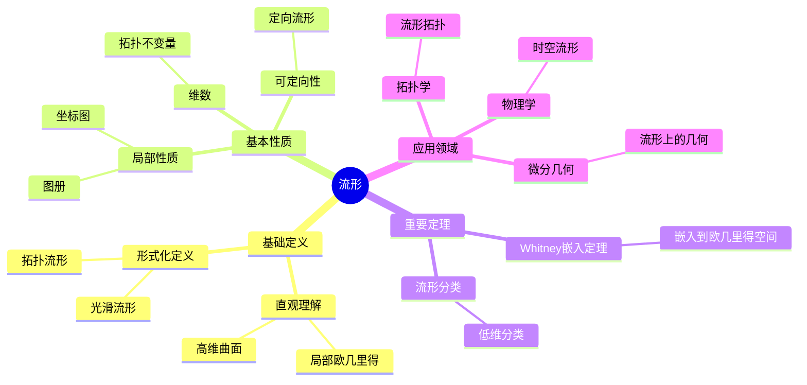

# 流形 (Manifold)

**概念编号**: C.CORE.018
**知识层次**: L0-L2
**知识领域**: D4 (几何)
**创建日期**: 2025年11月21日
**最后更新**: 2025年11月21日

---

## 📋 概述

流形是局部像欧几里得空间的拓扑空间，是微分几何、拓扑学、物理学的基础。流形理论在现代数学和物理学中有广泛应用。

**权威资源对齐**:

- Wikipedia: [Manifold](https://en.wikipedia.org/wiki/Manifold)
- Stanford课程: Math 215A (Differential Topology)
- Princeton课程: MAT 520 (Differential Geometry)
- MIT课程: 18.965 (Geometry of Manifolds)
- Metamath: [Manifold](http://us.metamath.org/mpeuni/df-manifold.html)

---

## 🎯 严格定义

### 基础定义 (L0)

**直观理解**: 流形是局部像欧几里得空间的拓扑空间，例如曲线、曲面、高维曲面。

**基本定义**: $n$ 维流形 $M$ 是满足以下条件的拓扑空间：

- 局部同胚于 $\mathbb{R}^n$
- Hausdorff（任意两点有不相交邻域）
- 第二可数（有可数基）

**简单例子**:

- 曲线（1维流形）
- 球面 $S^2$（2维流形）
- 环面 $T^2$（2维流形）
- $\mathbb{R}^n$（$n$ 维流形）

### 形式化定义 (L1)

**拓扑流形**: $n$ 维拓扑流形 $M$ 是满足以下条件的拓扑空间：

1. **局部欧几里得**: $\forall p \in M, \exists$ 开邻域 $U$ 和同胚 $\phi: U \to \mathbb{R}^n$
2. **Hausdorff**: $\forall p, q \in M, p \neq q, \exists$ 不相交开邻域 $U_p, U_q$
3. **第二可数**: 存在可数拓扑基

**光滑流形**: 若坐标图之间的转换映射是光滑的，则称为光滑流形。

**记号**:

- $M$: 流形
- $(U, \phi)$: 坐标图（chart）
- $\{(U_\alpha, \phi_\alpha)\}$: 图册（atlas）
- $\dim M$: 流形的维数

---

## 📚 历史背景

### 发展脉络

**19世纪**: 流形概念的起源

- **Riemann (1854)**: 在研究高维几何时引入流形概念
- **Poincaré (1895)**: 研究拓扑流形

**20世纪**: 流形理论的发展

- **Whitney (1936)**: 证明嵌入定理
- **Milnor (1956)**: 发现7维怪球
- **Smale (1961)**: 证明高维Poincaré猜想

### 关键人物

- **Bernhard Riemann (1826-1866)**: 流形概念的引入者
- **Henri Poincaré (1854-1912)**: 研究拓扑流形
- **Hassler Whitney (1907-1989)**: 证明嵌入定理

---

## 🔍 性质与定理

### 基本性质 (L1)

**性质1: 局部性质**:

- 流形在每点局部同胚于 $\mathbb{R}^n$
- 局部性质可以推广到整体

**性质2: 维数**:

- 流形的维数在每点相同
- 维数是拓扑不变量

**性质3: 可定向性**:

- 流形可以是可定向或不可定向的
- 可定向流形有全局定向

### 重要定理 (L2)

**定理1: Whitney嵌入定理**:

- **陈述**: $n$ 维光滑流形可以嵌入到 $\mathbb{R}^{2n}$ 中
- **应用**: 流形的表示

**定理2: 流形的分类**:

- **1维**: 只有 $\mathbb{R}$ 和 $S^1$
- **2维**: 可定向和不可定向曲面的分类
- **3维**: Thurston几何化猜想

---

## 💡 应用实例

### 理论应用

- 微分几何（流形上的几何）
- 拓扑学（流形的拓扑分类）
- 物理学（时空流形）

### 实际应用

- 广义相对论（时空是4维流形）
- 机器学习（数据流形）
- 计算机图形学（曲面建模）

---

## 🔗 关联概念

### 依赖关系

- 拓扑空间（流形是特殊的拓扑空间）
- 实数（流形局部同胚于 $\mathbb{R}^n$）

### 推广关系

- 拓扑流形（一般流形）
- 光滑流形（配备微分结构）
- 复流形（配备复结构）

---

## 📖 参考文献

- Wikipedia: [Manifold](https://en.wikipedia.org/wiki/Manifold)
- Lee, J. M. (2012). *Introduction to Smooth Manifolds*. Springer.
- do Carmo, M. P. (1992). *Riemannian Geometry*. Birkhäuser.

---

## 🗺️ 思维导图 (编号: C.CORE.018.MIND)

### 流形概念思维导图

---

## 📊 知识多维关系矩阵 (编号: C.CORE.018.MATRIX)

### 流形的多维关系矩阵

| 维度 | 指标 | 流形 |
|------|------|------|
| **知识层次** | L0基础 | ⭐⭐⭐ |
| | L1中级 | ⭐⭐⭐⭐ |
| | L2高级 | ⭐⭐⭐⭐⭐ |
| | L3研究 | ⭐⭐⭐ |
| **知识领域** | D1基础数学 | ⭐⭐ |
| | D4几何 | ⭐⭐⭐⭐⭐ |
| | D5拓扑 | ⭐⭐⭐⭐⭐ |
| | D8交叉领域 | ⭐⭐⭐ |
| **依赖关系** | 前置概念 | 拓扑空间、实数 |
| | 后续概念 | 黎曼流形、曲率 |
| **应用关系** | 理论应用 | ⭐⭐⭐⭐ |
| | 实际应用 | ⭐⭐⭐ |
| | 交叉应用 | ⭐⭐⭐ |
| **学习难度** | 直观理解 | ⭐⭐⭐⭐ |
| | 形式化理解 | ⭐⭐⭐⭐⭐ |
| | 深入应用 | ⭐⭐⭐⭐⭐ |

---

## 💭 形象化解释与论证 (编号: C.CORE.018.VISUAL)

### 形象化解释

**1. 流形的直观理解**

- **类比**: 流形就像"高维曲面"或"局部像欧几里得空间的形状"
- **例子**:
  - 球面：局部像平面，但整体是弯曲的
  - 环面：局部像平面，但整体是环形的
  - 地球表面：局部像平面地图，但整体是球面

**2. 坐标图的直观理解**

- **类比**: 坐标图就像"地图"或"局部坐标系"
- **解释**:
  - 每个坐标图给出流形的一个局部坐标系
  - 多个坐标图覆盖整个流形（像地图册）
  - 坐标图之间的转换是光滑的

**3. 局部-整体原理的直观理解**

- **类比**: 局部-整体原理就像"从局部信息推断整体性质"
- **例子**:
  - 如果流形在每点局部像$\mathbb{R}^n$，则整体是$n$维流形
  - 如果流形在每点可定向，则整体可定向

### 认知科学视角

**1. 数学教育家Dienes的观点**

- **多表征原则**: 通过几何（曲面）、拓扑（坐标图）、代数（图册）等多种方式理解流形
- **变化性原则**: 通过不同的流形例子理解流形的本质
- **教学启示**: 使用具体曲面、坐标图、图册等多种教学工具

**2. 数学认知学家Tall的观点**

- **过程-对象对偶**: 理解"流形构造过程"（如何用坐标图构造）和"流形"（对象）
- **认知层次**: 从直观理解（"高维曲面"）到形式化理解（拓扑流形定义）

---

## 👨‍🏫 专家观点与论证 (编号: C.CORE.018.EXPERT)

### 数学家的观点

**1. Bernhard Riemann (1826-1866) - 流形概念的引入者**
> "流形是研究高维几何的基础，局部欧几里得性质使我们可以用坐标研究流形。"
>
> **意义**: Riemann引入了流形概念，开创了现代微分几何。

**2. Henri Poincaré (1854-1912) - 拓扑学的奠基者**
> "流形的拓扑分类是拓扑学的核心问题，Poincaré猜想揭示了流形的深刻性质。"
>
> **意义**: Poincaré开创了流形的拓扑研究，提出了Poincaré猜想。

**3. Hassler Whitney (1907-1989) - 嵌入定理的证明者**
> "Whitney嵌入定理表明流形可以嵌入到欧几里得空间中，这使流形的研究更加直观。"
>
> **意义**: Whitney的嵌入定理为流形研究提供了重要工具。

### 数学教育家的观点

**1. Zoltan Dienes (1916-2014) - 数学教育家**
> "流形概念应该通过具体曲面、坐标图、图册等多种方式学习。"
>
> **教学启示**:
>
> - 从球面、环面等具体曲面开始
> - 使用坐标图理解局部结构
> - 逐步抽象到一般流形概念

**2. Hans Freudenthal (1905-1990) - 数学教育家**
> "流形概念的学习需要从'具体曲面'发展到'抽象流形结构'。"
>
> **认知发展**:
>
> - **曲面阶段**: 理解流形作为高维曲面
> - **结构阶段**: 理解流形作为拓扑空间配备坐标图

### 数学认知学家的观点

**1. David Tall - 数学认知学家**
> "流形概念的理解需要从'过程'（如何构造）发展到'对象'（流形本身）。"
>
> **认知层次**:
>
> - **过程层次**: 理解"如何用坐标图构造流形"
> - **对象层次**: 理解"流形"（如$M$是一个流形）

---

**创建日期**: 2025年11月21日
**最后更新**: 2025年11月21日
**维护状态**: 持续更新中
