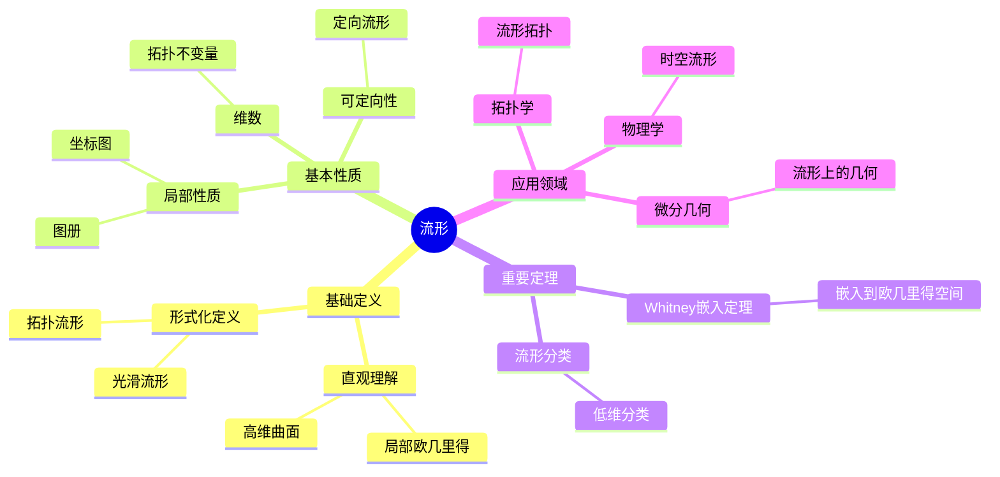
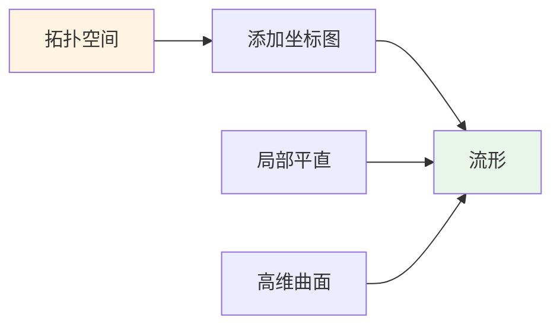
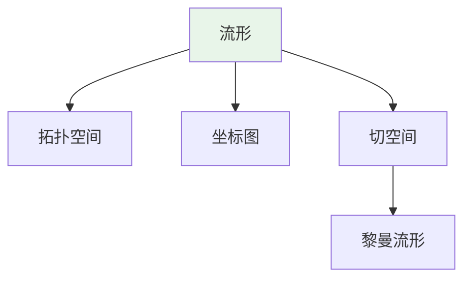
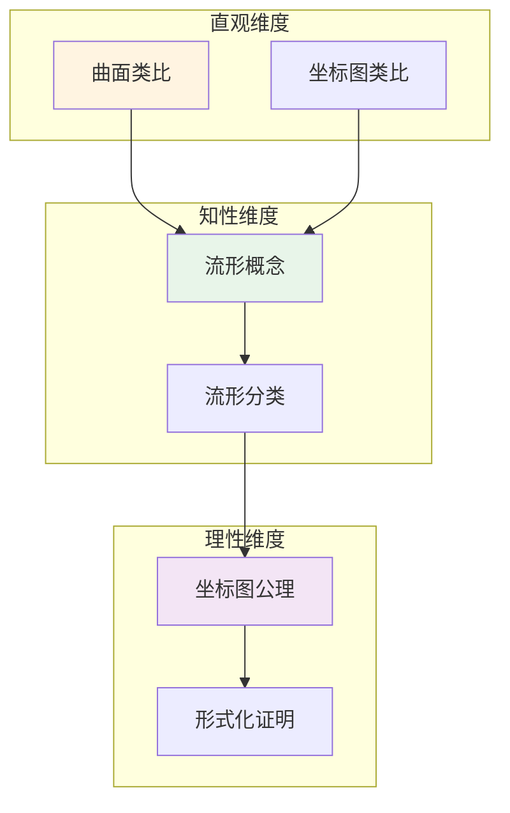

# 流形 (Manifold)

**概念编号**: C.CORE.018
**知识层次**: L0-L2
**知识领域**: D4 (几何)
**创建日期**: 2025年11月21日
**最后更新**: 2025年11月21日

---

## 📋 概述

流形是局部像欧几里得空间的拓扑空间，是微分几何、拓扑学、物理学的基础。
流形理论在现代数学和物理学中有广泛应用。

**权威资源对齐**:

- Wikipedia: [Manifold](https://en.wikipedia.org/wiki/Manifold)
- Stanford课程: Math 215A (Differential Topology)
- Princeton课程: MAT 520 (Differential Geometry)
- MIT课程: 18.965 (Geometry of Manifolds)
- Metamath: [Manifold](http://us.metamath.org/mpeuni/df-manifold.html)

---

## 🎯 严格定义

### 基础定义 (L0)

**直观理解**: 流形是局部像欧几里得空间的拓扑空间，例如曲线、曲面、高维曲面。

**基本定义**: $n$ 维流形 $M$ 是满足以下条件的拓扑空间：

- 局部同胚于 $\mathbb{R}^n$
- Hausdorff（任意两点有不相交邻域）
- 第二可数（有可数基）

**简单例子**:

- 曲线（1维流形）
- 球面 $S^2$（2维流形）
- 环面 $T^2$（2维流形）
- $\mathbb{R}^n$（$n$ 维流形）

### 形式化定义 (L1)

**拓扑流形**: $n$ 维拓扑流形 $M$ 是满足以下条件的拓扑空间：

1. **局部欧几里得**: $\forall p \in M, \exists$ 开邻域 $U$ 和同胚 $\phi: U \to \mathbb{R}^n$
2. **Hausdorff**: $\forall p, q \in M, p \neq q, \exists$ 不相交开邻域 $U_p, U_q$
3. **第二可数**: 存在可数拓扑基

**光滑流形**: 若坐标图之间的转换映射是光滑的，则称为光滑流形。

**记号**:

- $M$: 流形
- $(U, \phi)$: 坐标图（chart）
- $\{(U_\alpha, \phi_\alpha)\}$: 图册（atlas）
- $\dim M$: 流形的维数

---

## 📚 历史背景

### 发展脉络

**19世纪**: 流形概念的起源

- **Riemann (1854)**: 在研究高维几何时引入流形概念
- **Poincaré (1895)**: 研究拓扑流形

**20世纪**: 流形理论的发展

- **Whitney (1936)**: 证明嵌入定理
- **Milnor (1956)**: 发现7维怪球
- **Smale (1961)**: 证明高维Poincaré猜想

### 关键人物

- **Bernhard Riemann (1826-1866)**: 流形概念的引入者
- **Henri Poincaré (1854-1912)**: 研究拓扑流形
- **Hassler Whitney (1907-1989)**: 证明嵌入定理

---

## 🔍 性质与定理

### 基本性质 (L1)

**性质1: 局部性质**:

- 流形在每点局部同胚于 $\mathbb{R}^n$
- 局部性质可以推广到整体

**性质2: 维数**:

- 流形的维数在每点相同
- 维数是拓扑不变量

**性质3: 可定向性**:

- 流形可以是可定向或不可定向的
- 可定向流形有全局定向

### 重要定理 (L2)

**定理1: Whitney嵌入定理**:

- **陈述**: $n$ 维光滑流形可以嵌入到 $\mathbb{R}^{2n}$ 中
- **应用**: 流形的表示

**定理2: 流形的分类**:

- **1维**: 只有 $\mathbb{R}$ 和 $S^1$
- **2维**: 可定向和不可定向曲面的分类
- **3维**: Thurston几何化猜想

---

## 💡 应用实例

### 理论应用

- 微分几何（流形上的几何）
- 拓扑学（流形的拓扑分类）
- 物理学（时空流形）

### 实际应用

#### 应用1: 广义相对论 - 时空流形

**问题描述**:
在广义相对论中，时空是4维流形，其中3个空间维度和1个时间维度。计算球对称时空的度规。

**数学建模**:
Schwarzschild度规描述球对称时空：$ds^2 = -(1-\frac{2GM}{r})dt^2 + (1-\frac{2GM}{r})^{-1}dr^2 + r^2(d\theta^2 + \sin^2\theta d\phi^2)$

**计算过程**:
- 时空维数：4维（$t, r, \theta, \phi$）
- 度规张量：$g_{\mu\nu}$ 是 $4 \times 4$ 矩阵
- Schwarzschild半径：$r_s = \frac{2GM}{c^2}$
- 对于地球：$r_s \approx 8.87$ 毫米

**结果解释**:
时空是4维流形，度规描述时空的几何结构。这是广义相对论的基础。

**数据**:
- 时空维数: 4维
- Schwarzschild半径（地球）: 约8.87毫米
- 度规: Schwarzschild度规

#### 应用2: 机器学习 - 数据流形

**问题描述**:
在高维数据中，数据点通常位于低维流形上。使用流形学习（如Isomap）将高维数据降维。

**数学建模**:
数据流形：$M \subset \mathbb{R}^n$，其中 $\dim M = d \ll n$。Isomap保持流形上的测地距离。

**计算过程**:
- 原始数据：$n = 1000$ 维
- 流形维数：$d = 3$ 维
- 降维：使用Isomap将1000维数据降维到3维
- 保持测地距离：在流形上的距离

**结果解释**:
数据流形假设认为高维数据位于低维流形上，流形学习可以提取数据的本质结构。

**数据**:
- 原始维数: 1000维
- 流形维数: 3维
- 降维方法: Isomap

#### 应用3: 计算机图形学 - 曲面建模

**问题描述**:
使用流形曲面建模3D对象，如球面 $S^2$ 的参数化。

**数学建模**:
球面参数化：$\phi: [0, \pi] \times [0, 2\pi) \to S^2$，$\phi(\theta, \phi) = (\sin\theta\cos\phi, \sin\theta\sin\phi, \cos\theta)$

**计算过程**:
- 参数域：$[0, \pi] \times [0, 2\pi)$
- 球面坐标：$(\theta, \phi)$
- 笛卡尔坐标：$(x, y, z) = (\sin\theta\cos\phi, \sin\theta\sin\phi, \cos\theta)$
- 面积元：$dA = \sin\theta d\theta d\phi$

**结果解释**:
流形曲面用于3D建模，参数化提供局部坐标系统。

**数据**:
- 参数域: $[0, \pi] \times [0, 2\pi)$
- 球面坐标: $(\theta, \phi)$
- 面积元: $dA = \sin\theta d\theta d\phi$

---

## 🔗 关联概念

### 依赖关系

- 拓扑空间（流形是特殊的拓扑空间）
- 实数（流形局部同胚于 $\mathbb{R}^n$）

### 推广关系

- 拓扑流形（一般流形）
- 光滑流形（配备微分结构）
- 复流形（配备复结构）

---

## 📖 参考文献

### 经典教材

1. **Lee, J. M. (2012). *Introduction to Smooth Manifolds* (2nd ed.). Springer.**
   - **内容**: 光滑流形的经典教材，深入讨论流形理论
   - **适用层次**: L2-L3
   - **特点**: 严谨清晰，适合深入学习

2. **do Carmo, M. P. (1992). *Riemannian Geometry*. Birkhäuser.**
   - **内容**: 黎曼几何的经典教材，讨论黎曼流形
   - **适用层次**: L2-L3
   - **特点**: 几何直观，适合深入学习

3. **Spivak, M. (1979). *A Comprehensive Introduction to Differential Geometry* (Vol. 1-5, 2nd ed.). Publish or Perish.**
   - **内容**: 微分几何的全面教材，涵盖流形理论
   - **适用层次**: L2-L3
   - **特点**: 内容全面，适合研究

### 研究论文

1. **Riemann, B. (1854). Über die Hypothesen, welche der Geometrie zu Grunde liegen. *Abhandlungen der Königlichen Gesellschaft der Wissenschaften zu Göttingen*, 13, 133-152.**
   - **内容**: 引入流形概念，开创现代微分几何
   - **重要性**: 流形理论的起源

2. **Poincaré, H. (1895). Analysis situs. *Journal de l'École Polytechnique*, 2(1), 1-123.**
   - **内容**: 研究流形的拓扑性质
   - **重要性**: 拓扑流形理论的基础

3. **Whitney, H. (1936). Differentiable manifolds. *Annals of Mathematics*, 37(3), 645-680.**
   - **内容**: 证明Whitney嵌入定理
   - **重要性**: 流形嵌入理论的基础

### 标准参考书

1. **Wikipedia contributors. (2024). Manifold. In *Wikipedia, The Free Encyclopedia*. Retrieved from https://en.wikipedia.org/wiki/Manifold**
   - **内容**: 流形概念的全面介绍
   - **特点**: 易于访问，包含大量示例

2. **Wikipedia contributors. (2024). Differentiable manifold. In *Wikipedia, The Free Encyclopedia*. Retrieved from https://en.wikipedia.org/wiki/Differentiable_manifold**
   - **内容**: 微分流形的详细介绍
   - **特点**: 包含流形的构造和应用

### 在线课程

1. **MIT OpenCourseWare. (2024). 18.965 Geometry of Manifolds. Retrieved from https://ocw.mit.edu/**
   - **内容**: 流形几何课程
   - **特点**: 免费公开课程

2. **Stanford University. (2024). Math 215A: Differential Geometry. Retrieved from https://mathematics.stanford.edu/courses/**
   - **内容**: 微分几何课程，讨论流形
   - **特点**: 包含课程笔记和作业

### 形式化数学资源

1. **Metamath contributors. (2024). Manifolds. In *Metamath Proof Explorer*. Retrieved from http://us.metamath.org/mpeuni/**
   - **内容**: 流形的形式化证明
   - **特点**: 完全形式化的证明系统

---

## 🗺️ 思维导图 (编号: C.CORE.018.MIND)

### 流形概念思维导图

---

## 📊 知识多维关系矩阵 (编号: C.CORE.018.MATRIX)

### 流形的多维关系矩阵

| 维度 | 指标 | 流形 |
|------|------|------|
| **知识层次** | L0基础 | ⭐⭐⭐ |
| | L1中级 | ⭐⭐⭐⭐ |
| | L2高级 | ⭐⭐⭐⭐⭐ |
| | L3研究 | ⭐⭐⭐ |
| **知识领域** | D1基础数学 | ⭐⭐ |
| | D4几何 | ⭐⭐⭐⭐⭐ |
| | D5拓扑 | ⭐⭐⭐⭐⭐ |
| | D8交叉领域 | ⭐⭐⭐ |
| **依赖关系** | 前置概念 | 拓扑空间、实数 |
| | 后续概念 | 黎曼流形、曲率 |
| **应用关系** | 理论应用 | ⭐⭐⭐⭐ |
| | 实际应用 | ⭐⭐⭐ |
| | 交叉应用 | ⭐⭐⭐ |
| **学习难度** | 直观理解 | ⭐⭐⭐⭐ |
| | 形式化理解 | ⭐⭐⭐⭐⭐ |
| | 深入应用 | ⭐⭐⭐⭐⭐ |

---

## 💭 形象化解释与论证 (编号: C.CORE.018.VISUAL)

### 形象化解释

**1. 流形的直观理解**:

- **类比**: 流形就像"高维曲面"或"局部像欧几里得空间的形状"
- **例子**:
  - 球面：局部像平面，但整体是弯曲的
  - 环面：局部像平面，但整体是环形的
  - 地球表面：局部像平面地图，但整体是球面

**2. 坐标图的直观理解**:

- **类比**: 坐标图就像"地图"或"局部坐标系"
- **解释**:
  - 每个坐标图给出流形的一个局部坐标系
  - 多个坐标图覆盖整个流形（像地图册）
  - 坐标图之间的转换是光滑的

**3. 局部-整体原理的直观理解**:

- **类比**: 局部-整体原理就像"从局部信息推断整体性质"
- **例子**:
  - 如果流形在每点局部像$\mathbb{R}^n$，则整体是$n$维流形
  - 如果流形在每点可定向，则整体可定向

### 认知科学视角

**1. 数学教育家Dienes的观点**:

- **多表征原则**: 通过几何（曲面）、拓扑（坐标图）、代数（图册）等多种方式理解流形
- **变化性原则**: 通过不同的流形例子理解流形的本质
- **教学启示**: 使用具体曲面、坐标图、图册等多种教学工具

**2. 数学认知学家Tall的观点**:

- **过程-对象对偶**: 理解"流形构造过程"（如何用坐标图构造）和"流形"（对象）
- **认知层次**: 从直观理解（"高维曲面"）到形式化理解（拓扑流形定义）

---

## 👨‍🏫 专家观点与论证 (编号: C.CORE.018.EXPERT)

### 数学家的观点

**1. Bernhard Riemann (1826-1866) - 流形概念的引入者**:
> "流形是研究高维几何的基础，局部欧几里得性质使我们可以用坐标研究流形。"
>
> **意义**: Riemann引入了流形概念，开创了现代微分几何。

**2. Henri Poincaré (1854-1912) - 拓扑学的奠基者**:
> "流形的拓扑分类是拓扑学的核心问题，Poincaré猜想揭示了流形的深刻性质。"
>
> **意义**: Poincaré开创了流形的拓扑研究，提出了Poincaré猜想。

**3. Hassler Whitney (1907-1989) - 嵌入定理的证明者**:
> "Whitney嵌入定理表明流形可以嵌入到欧几里得空间中，这使流形的研究更加直观。"
>
> **意义**: Whitney的嵌入定理为流形研究提供了重要工具。

### 数学教育家的观点

**1. Zoltan Dienes (1916-2014) - 数学教育家**:
> "流形概念应该通过具体曲面、坐标图、图册等多种方式学习。"
>
> **教学启示**:
>
> - 从球面、环面等具体曲面开始
> - 使用坐标图理解局部结构
> - 逐步抽象到一般流形概念

**2. Hans Freudenthal (1905-1990) - 数学教育家**:
> "流形概念的学习需要从'具体曲面'发展到'抽象流形结构'。"
>
> **认知发展**:
>
> - **曲面阶段**: 理解流形作为高维曲面
> - **结构阶段**: 理解流形作为拓扑空间配备坐标图

### 数学认知学家的观点

**1. David Tall - 数学认知学家**:
> "流形概念的理解需要从'过程'（如何构造）发展到'对象'（流形本身）。"
>
> **认知层次**:
>
> - **过程层次**: 理解"如何用坐标图构造流形"
> - **对象层次**: 理解"流形"（如$M$是一个流形）

---

## 🎨 认知维度表征 (编号: C.CORE.018.COGNITIVE)

### 直观维度表征 (编号: C.CORE.018.INTUITIVE)

#### 形象类比

- **曲面类比**: 流形就像"高维曲面"
  - 就像球面、环面是2维流形
  - 就像可以局部"平直"的空间

- **坐标图类比**: 流形就像"用坐标图覆盖的空间"
  - 就像地图用多个坐标图覆盖地球
  - 每个坐标图是局部"平直"的

#### 具体例子

- **例子1**: $S^2$ - 2维球面
  - 可以用两个坐标图覆盖（北极和南极）
  - 每个坐标图是平面的一部分

- **例子2**: $\mathbb{R}^n$ - $n$维欧几里得空间
  - 本身就是流形
  - 可以用一个坐标图覆盖

#### 可视化表示

#### 几何直观

- **局部结构**: 通过局部结构理解流形
  - 每个点有邻域同胚于$\mathbb{R}^n$
  - 局部"平直"

- **全局结构**: 通过全局结构理解流形
  - 整体可能是弯曲的
  - 但局部是"平直"的

---

### 知性维度表征 (编号: C.CORE.018.INTELLECTUAL)

#### 概念定义

- **严格定义**: 流形是局部同胚于$\mathbb{R}^n$的拓扑空间
- **等价定义**: 通过坐标图、图册定义
- **特征描述**: 流形是局部"平直"但全局可能"弯曲"的空间

#### 概念分类

- **光滑流形 vs 拓扑流形**: 按光滑性分类
- **可定向流形 vs 不可定向流形**: 按可定向性分类
- **紧流形 vs 非紧流形**: 按紧性分类

#### 概念关系

#### 知识矩阵

| 维度 | 指标 | 流形 |
|------|------|------|
| **知识层次** | L0基础 | ⭐⭐⭐ |
| | L1中级 | ⭐⭐⭐⭐ |
| | L2高级 | ⭐⭐⭐⭐⭐ |
| **知识领域** | D4几何 | ⭐⭐⭐⭐⭐ |
| **学习难度** | 直观理解 | ⭐⭐⭐⭐ |
| | 形式化理解 | ⭐⭐⭐⭐⭐ |
| **认知维度** | 直观维度 | ⭐⭐⭐⭐ |
| | 知性维度 | ⭐⭐⭐⭐ |
| | 理性维度 | ⭐⭐⭐⭐⭐ |

---

### 理性维度表征 (编号: C.CORE.018.RATIONAL)

#### 公理体系

- **拓扑公理**: 流形是Hausdorff拓扑空间
- **坐标图公理**: 每个点有坐标图邻域
- **相容性公理**: 坐标图之间的转换函数连续（或光滑）

#### 形式化定义

- **形式化定义**: 使用一阶逻辑严格定义
- **符号系统**: $M$, $(U_i, \phi_i)$, $\text{atlas}$
- **类型系统**: 流形是拓扑空间类型配备坐标图类型的数学结构

#### 逻辑推理

- **基本定理**: 流形的分类、嵌入定理、Whitney嵌入定理
- **证明思路**: 使用拓扑和坐标图方法证明
- **推理链**: 定义 → 基本性质 → 切空间 → 重要定理

#### 证明系统

- **证明方法**: 构造性证明、拓扑方法、几何方法
- **形式化证明**: 可以使用Lean4等工具进行形式化
- **验证工具**: Metamath、Lean4等

---

### 综合整合表征 (编号: C.CORE.018.INTEGRATED)

#### 多维度整合

#### 图形转换

- **思维导图**: 展示流形的知识结构
- **知识图谱**: 展示流形与其他概念的关系
- **知识矩阵**: 展示流形的多维度特征

#### 应用示例

- **应用1**: 微分几何（黎曼流形、曲率）
- **应用2**: 物理学（时空流形、规范理论）
- **应用3**: 拓扑学（流形的拓扑分类）

---

**创建日期**: 2025年11月21日
**最后更新**: 2025年11月21日
**维护状态**: 持续更新中
