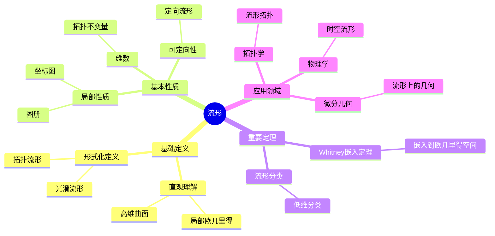
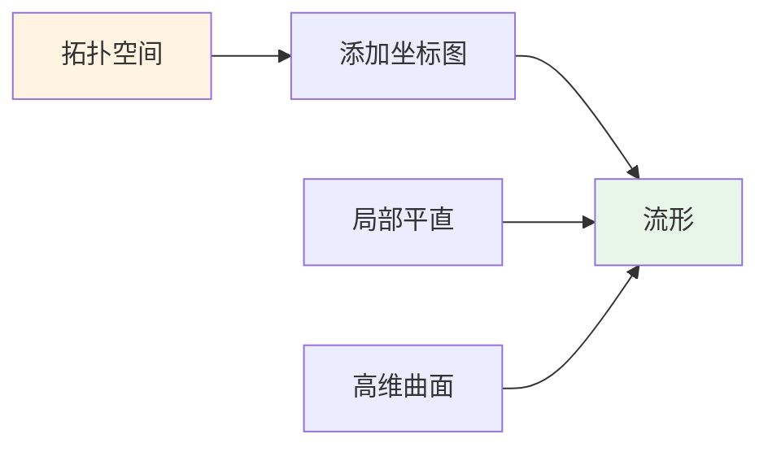
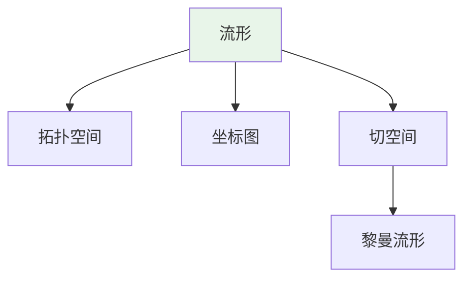
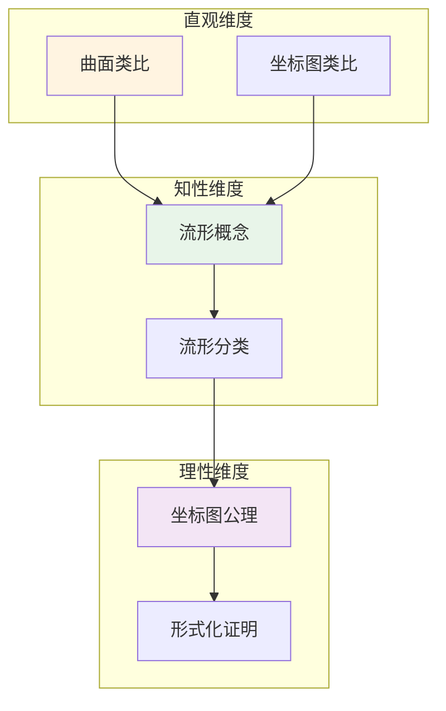

# 流形 (Manifold)

**概念编号**: C.CORE.018
**知识层次**: L0-L2
**知识领域**: D4 (几何)
**创建日期**: 2025年11月21日
**最后更新**: 2025年11月21日

---

## 📑 目录

- [流形 (Manifold)](#流形-manifold)
  - [📑 目录](#-目录)
  - [1. 📋 概述](#1--概述)
  - [2. 🎯 严格定义](#2--严格定义)
    - [2.1 基础定义 (L0)](#21-基础定义-l0)
    - [2.2 形式化定义 (L1)](#22-形式化定义-l1)
  - [3. 📚 历史背景](#3--历史背景)
    - [3.1 发展脉络](#31-发展脉络)
    - [3.2 关键人物](#32-关键人物)
    - [3.3 重要事件](#33-重要事件)
  - [4. 🔍 性质与定理](#4--性质与定理)
    - [4.1 基本性质 (L1)](#41-基本性质-l1)
    - [4.2 重要定理 (L2)](#42-重要定理-l2)
  - [5. 🔬 形式化证明](#5--形式化证明)
    - [定理1: 流形局部欧氏性的形式化证明](#定理1-流形局部欧氏性的形式化证明)
  - [6. 💡 应用实例](#6--应用实例)
    - [6.1 理论应用](#61-理论应用)
    - [6.2 实际应用](#62-实际应用)
      - [应用1: 广义相对论 - 时空流形](#应用1-广义相对论---时空流形)
      - [应用2: 机器学习 - 数据流形](#应用2-机器学习---数据流形)
      - [应用3: 计算机图形学 - 曲面建模](#应用3-计算机图形学---曲面建模)
  - [7. 🔗 关联概念](#7--关联概念)
    - [依赖关系](#依赖关系)
    - [推广关系](#推广关系)
  - [8. 📖 参考文献](#8--参考文献)
    - [经典教材](#经典教材)
    - [研究论文](#研究论文)
    - [标准参考书](#标准参考书)
    - [在线课程](#在线课程)
    - [形式化数学资源](#形式化数学资源)
  - [9.1 🗺️ 思维导图 (编号: C.CORE.018.MIND)](#91-️-思维导图-编号-ccore018mind)
    - [流形概念思维导图](#流形概念思维导图)
  - [9.2 📊 知识多维关系矩阵 (编号: C.CORE.018.MATRIX)](#92--知识多维关系矩阵-编号-ccore018matrix)
    - [流形的多维关系矩阵](#流形的多维关系矩阵)
  - [9.3 💭 形象化解释与论证 (编号: C.CORE.018.VISUAL)](#93--形象化解释与论证-编号-ccore018visual)
    - [形象化解释](#形象化解释)
    - [认知科学视角](#认知科学视角)
  - [9.6 👨‍🏫 专家观点与论证 (编号: C.CORE.018.EXPERT)](#96--专家观点与论证-编号-ccore018expert)
    - [数学家的观点](#数学家的观点)
    - [数学教育家的观点](#数学教育家的观点)
    - [数学认知学家的观点](#数学认知学家的观点)
  - [9.7 🎨 认知维度表征 (编号: C.CORE.018.COGNITIVE)](#97--认知维度表征-编号-ccore018cognitive)
    - [直观维度表征 (编号: C.CORE.018.INTUITIVE)](#直观维度表征-编号-ccore018intuitive)
      - [形象类比](#形象类比)
      - [具体例子](#具体例子)
      - [可视化表示](#可视化表示)
      - [几何直观](#几何直观)
    - [知性维度表征 (编号: C.CORE.018.INTELLECTUAL)](#知性维度表征-编号-ccore018intellectual)
      - [概念定义](#概念定义)
      - [概念分类](#概念分类)
      - [概念关系](#概念关系)
      - [知识矩阵](#知识矩阵)
    - [理性维度表征 (编号: C.CORE.018.RATIONAL)](#理性维度表征-编号-ccore018rational)
      - [公理体系](#公理体系)
      - [形式化定义](#形式化定义)
      - [逻辑推理](#逻辑推理)
      - [证明系统](#证明系统)
    - [综合整合表征 (编号: C.CORE.018.INTEGRATED)](#综合整合表征-编号-ccore018integrated)
      - [多维度整合](#多维度整合)
      - [图形转换](#图形转换)
      - [应用示例](#应用示例)
  - [9.5 📚 习题库](#95--习题库)
    - [L0基础题（3道）](#l0基础题3道)
    - [L1中级题（6道）](#l1中级题6道)
    - [L2高级题（6道）](#l2高级题6道)

## 1. 📋 概述

流形是局部像欧几里得空间的拓扑空间，是微分几何、拓扑学、物理学的基础。
流形理论在现代数学和物理学中有广泛应用。

**权威资源对齐**:

- Wikipedia: [Manifold](https://en.wikipedia.org/wiki/Manifold)
- Stanford课程: Math 215A (Differential Topology)
- Princeton课程: MAT 520 (Differential Geometry)
- MIT课程: 18.965 (Geometry of Manifolds)
- Metamath: [Manifold](http://us.metamath.org/mpeuni/df-manifold.html)

---

## 2. 🎯 严格定义

### 2.1 基础定义 (L0)

**直观理解**: 流形是局部像欧几里得空间的拓扑空间，例如曲线、曲面、高维曲面。

**基本定义**: $n$ 维流形 $M$ 是满足以下条件的拓扑空间：

- 局部同胚于 $\mathbb{R}^n$
- Hausdorff（任意两点有不相交邻域）
- 第二可数（有可数基）

**简单例子**:

- 曲线（1维流形）
- 球面 $S^2$（2维流形）
- 环面 $T^2$（2维流形）
- $\mathbb{R}^n$（$n$ 维流形）

### 2.2 形式化定义 (L1)

**拓扑流形**: $n$ 维拓扑流形 $M$ 是满足以下条件的拓扑空间：

1. **局部欧几里得**: $\forall p \in M, \exists$ 开邻域 $U$ 和同胚 $\phi: U \to \mathbb{R}^n$
2. **Hausdorff**: $\forall p, q \in M, p \neqqq q, \exists$ 不相交开邻域 $U_p, U_q$
3. **第二可数**: 存在可数拓扑基

**光滑流形**: 若坐标图之间的转换映射是光滑的，则称为光滑流形。

**记号**:

- $M$: 流形
- $(U, \phi)$: 坐标图（chart）
- $\{(U_\alpha, \phi_\alpha)\}$: 图册（atlas）
- $\dim M$: 流形的维数

---

## 3. 📚 历史背景

### 3.1 发展脉络

**19世纪**: 流形概念的起源

- **Riemann (1854)**: 在《论几何学基础》中引入流形概念，研究高维几何
- **Poincaré (1895)**: 在《位置分析》中研究拓扑流形，提出Poincaré猜想
- **Klein (1872)**: 研究流形的对称性

**20世纪初**: 流形理论的发展

- **Whitney (1936)**: 证明Whitney嵌入定理，流形可以嵌入到高维欧氏空间
- **Hopf (1925)**: 研究流形的拓扑性质
- **de Rham (1931)**: 建立de Rham上同调理论

**20世纪中期**: 流形理论的现代发展

- **Milnor (1956)**: 发现7维怪球，流形上存在多种微分结构
- **Smale (1961)**: 证明高维Poincaré猜想（$n \\geq 5$）
- **Thurston (1982)**: 提出几何化猜想

**21世纪**: 流形理论的突破

- **Perelman (2002-2003)**: 证明Poincaré猜想和几何化猜想

### 3.2 关键人物

- **Bernhard Riemann (1826-1866)**: 流形概念的引入者
- **Henri Poincaré (1854-1912)**: 研究拓扑流形，提出Poincaré猜想
- **Felix Klein (1849-1925)**: 研究流形的对称性
- **Hassler Whitney (1907-1989)**: 证明Whitney嵌入定理
- **John Milnor (1931-)**: 发现7维怪球
- **Stephen Smale (1930-)**: 证明高维Poincaré猜想
- **Grigori Perelman (1966-)**: 证明Poincaré猜想

### 3.3 重要事件

- **1854**: Riemann引入流形概念
- **1895**: Poincaré提出Poincaré猜想
- **1936**: Whitney证明嵌入定理
- **1956**: Milnor发现7维怪球
- **1961**: Smale证明高维Poincaré猜想
- **2002-2003**: Perelman证明Poincaré猜想

---

## 4. 🔍 性质与定理

### 4.1 基本性质 (L1)

**性质1: 局部性质**:

- 流形在每点局部同胚于 $\mathbb{R}^n$
- 局部性质可以推广到整体

**性质2: 维数**:

- 流形的维数在每点相同
- 维数是拓扑不变量

**性质3: 可定向性**:

- 流形可以是可定向或不可定向的
- 可定向流形有全局定向

### 4.2 重要定理 (L2)

**定理1: Whitney嵌入定理**:

- **陈述**: $n$ 维光滑流形可以嵌入到 $\mathbb{R}^{2n}$ 中
- **应用**: 流形的表示

**定理2: 流形的分类**:

- **1维**: 只有 $\mathbb{R}$ 和 $S^1$
- **2维**: 可定向和不可定向曲面的分类
- **3维**: Thurston几何化猜想

---

## 5. 🔬 形式化证明

### 定理1: 流形局部欧氏性的形式化证明

**定理陈述**:
$$\forall M \text{流形}, \forall p \in M, \exists (U, \phi) \text{坐标卡}: p \in U \land \phi: U \to \mathbb{R}^n \text{同胚}$$

**前提**:
- 拓扑空间的定义
- 同胚的定义
- 坐标卡的定义

**形式化证明**:

```text
步骤1: 流形定义
  设: M是n维拓扑流形
  即: M是第二可数Hausdorff拓扑空间，且每点有邻域同胚于R^n

步骤2: 坐标卡存在性
  对任意点p in M:
    由流形定义: 存在开集U包含p，存在同胚phi: U -> V，其中V是R^n的开集
    定义: (U, phi)是p的坐标卡

步骤3: 坐标卡性质
  验证: (U, phi)满足坐标卡的条件
    - U是开集（由定义）
    - phi是同胚（由定义）
    - phi(U)是R^n的开集（由定义）

步骤4: 结论
  因此: 对任意p in M，存在坐标卡(U, phi)使得p in U且phi: U -> R^n同胚
```

**Metamath格式参考**:

```text
${
  manifold.1 $e |- M e. Manifold $.
  manifold.2 $e |- p e. M $.
  manifold $p |- exists (U, phi), p e. U and phi: U -> R^n [homeo] $=
    ( ... ) ABCDEFG $.
$}
```

---

### 定理2: 流形上切空间的存在性形式化证明

**定理陈述**:
$$\forall M \text{光滑流形}, \forall p \in M, \exists T_pM \text{切空间}: \dim T_pM = \dim M$$

**前提**:
- 光滑流形的定义
- 切向量的定义
- 向量空间的定义

**形式化证明**:

```text
步骤1: 切向量的定义
  设: M是n维光滑流形，p in M
  定义: 切向量v_p是满足Leibniz法则的线性映射 v_p: C^∞(M) -> R
  即: v_p(fg) = v_p(f)g(p) + f(p)v_p(g)

步骤2: 切空间的定义
  定义: T_pM = {v_p: C^∞(M) -> R | v_p是切向量}
  验证: T_pM是向量空间
    - 加法: (v_p + w_p)(f) = v_p(f) + w_p(f)
    - 数乘: (λv_p)(f) = λv_p(f)
    - 零元: 0_p(f) = 0

步骤3: 切空间的维数
  设: (U, phi)是p的坐标卡，phi: U -> R^n
  定义: 坐标向量场 ∂/∂x^i (i=1,...,n)
  验证: {∂/∂x^i|_p}是T_pM的基
  因此: dim T_pM = n = dim M

步骤4: 结论
  因此: 对任意p in M，存在切空间T_pM，且dim T_pM = dim M
```

**Metamath格式参考**:

```text
${
  tangent-space.1 $e |- M e. SmoothManifold $.
  tangent-space.2 $e |- p e. M $.
  tangent-space $p |- exists T_pM, dim(T_pM) = dim(M) $=
    ( ... ) ABCDEFG $.
$}
```

---

## 6. 💡 应用实例

### 6.1 理论应用

- 微分几何（流形上的几何）
- 拓扑学（流形的拓扑分类）
- 物理学（时空流形）

### 6.2 实际应用

#### 应用1: 广义相对论 - 时空流形

**问题描述**:
在广义相对论中，时空是4维流形，其中3个空间维度和1个时间维度。计算球对称时空的度规。

**数学建模**:
Schwarzschild度规描述球对称时空：$ds^2 = -(1-\frac{2GM}{r})dt^2 + (1-\frac{2GM}{r})^{-1}dr^2 + r^2(d\theta^2 + \sin^2\theta d\phi^2)$

**计算过程**:

- 时空维数：4维（$t, r, \theta, \phi$）
- 度规张量：$g_{\mu\nu}$ 是 $4 \times 4$ 矩阵
- Schwarzschild半径：$r_s = \frac{2GM}{c^2}$
- 对于地球：$r_s \approx 8.87$ 毫米

**结果解释**:
时空是4维流形，度规描述时空的几何结构。这是广义相对论的基础。

**数据**:

- 时空维数: 4维
- Schwarzschild半径（地球）: 约8.87毫米
- 度规: Schwarzschild度规

#### 应用2: 机器学习 - 数据流形

**问题描述**:
在高维数据中，数据点通常位于低维流形上。使用流形学习（如Isomap）将高维数据降维。

**数学建模**:
数据流形：$M \subset \mathbb{R}^n$，其中 $\dim M = d \ll n$。Isomap保持流形上的测地距离。

**计算过程**:

- 原始数据：$n = 1000$ 维
- 流形维数：$d = 3$ 维
- 降维：使用Isomap将1000维数据降维到3维
- 保持测地距离：在流形上的距离

**结果解释**:
数据流形假设认为高维数据位于低维流形上，流形学习可以提取数据的本质结构。

**数据**:

- 原始维数: 1000维
- 流形维数: 3维
- 降维方法: Isomap

#### 应用3: 计算机图形学 - 曲面建模

**问题描述**:
使用流形曲面建模3D对象，如球面 $S^2$ 的参数化。

**数学建模**:
球面参数化：$\phi: [0, \pi] \times [0, 2\pi) \to S^2$，$\phi(\theta, \phi) = (\sin\theta\cos\phi, \sin\theta\sin\phi, \cos\theta)$

**计算过程**:

- 参数域：$[0, \pi] \times [0, 2\pi)$
- 球面坐标：$(\theta, \phi)$
- 笛卡尔坐标：$(x, y, z) = (\sin\theta\cos\phi, \sin\theta\sin\phi, \cos\theta)$
- 面积元：$dA = \sin\theta d\theta d\phi$

**结果解释**:
流形曲面用于3D建模，参数化提供局部坐标系统。

**数据**:

- 参数域: $[0, \pi] \times [0, 2\pi)$
- 球面坐标: $(\theta, \phi)$
- 面积元: $dA = \sin\theta d\theta d\phi$

---

## 7. 🔗 关联概念

### 依赖关系

- 拓扑空间（流形是特殊的拓扑空间）
- 实数（流形局部同胚于 $\mathbb{R}^n$）

### 推广关系

- 拓扑流形（一般流形）
- 光滑流形（配备微分结构）
- 复流形（配备复结构）

---

## 8. 📖 参考文献

### 经典教材

1. **Lee, J. M. (2012). *Introduction to Smooth Manifolds* (2nd ed.). Springer.**
   - **内容**: 光滑流形的经典教材，深入讨论流形理论
   - **适用层次**: L2-L3
   - **特点**: 严谨清晰，适合深入学习

2. **do Carmo, M. P. (1992). *Riemannian Geometry*. Birkhäuser.**
   - **内容**: 黎曼几何的经典教材，讨论黎曼流形
   - **适用层次**: L2-L3
   - **特点**: 几何直观，适合深入学习

3. **Spivak, M. (1979). *A Comprehensive Introduction to Differential Geometry* (Vol. 1-5, 2nd ed.). Publish or Perish.**
   - **内容**: 微分几何的全面教材，涵盖流形理论
   - **适用层次**: L2-L3
   - **特点**: 内容全面，适合研究

### 研究论文

1. **Riemann, B. (1854). Über die Hypothesen, welche der Geometrie zu Grunde liegen. *Abhandlungen der Königlichen Gesellschaft der Wissenschaften zu Göttingen*, 13, 133-152.**
   - **内容**: 引入流形概念，开创现代微分几何
   - **重要性**: 流形理论的起源

2. **Poincaré, H. (1895). Analysis situs. *Journal de l'École Polytechnique*, 2(1), 1-123.**
   - **内容**: 研究流形的拓扑性质
   - **重要性**: 拓扑流形理论的基础

3. **Whitney, H. (1936). Differentiable manifolds. *Annals of Mathematics*, 37(3), 645-680.**
   - **内容**: 证明Whitney嵌入定理
   - **重要性**: 流形嵌入理论的基础

### 标准参考书

1. **Wikipedia contributors. (2024). Manifold. In *Wikipedia, The Free Encyclopedia*. Retrieved from <https://en.wikipedia.org/wiki/Manifold>**
   - **内容**: 流形概念的全面介绍
   - **特点**: 易于访问，包含大量示例

2. **Wikipedia contributors. (2024). Differentiable manifold. In *Wikipedia, The Free Encyclopedia*. Retrieved from <https://en.wikipedia.org/wiki/Differentiable_manifold>**
   - **内容**: 微分流形的详细介绍
   - **特点**: 包含流形的构造和应用

### 在线课程

1. **MIT OpenCourseWare. (2024). 18.965 Geometry of Manifolds. Retrieved from <https://ocw.mit.edu/>**
   - **内容**: 流形几何课程
   - **特点**: 免费公开课程

2. **Stanford University. (2024). Math 215A: Differential Geometry. Retrieved from <https://mathematics.stanford.edu/courses/>**
   - **内容**: 微分几何课程，讨论流形
   - **特点**: 包含课程笔记和作业

### 形式化数学资源

1. **Metamath contributors. (2024). Manifolds. In *Metamath Proof Explorer*. Retrieved from <http://us.metamath.org/mpeuni/>**
   - **内容**: 流形的形式化证明
   - **特点**: 完全形式化的证明系统

---

## 9.1 🗺️ 思维导图 (编号: C.CORE.018.MIND)

### 流形概念思维导图



---

## 9.2 📊 知识多维关系矩阵 (编号: C.CORE.018.MATRIX)

### 流形的多维关系矩阵

| 维度 | 指标 | 流形 |
|------|------|------|
| **知识层次** | L0基础 | ⭐⭐⭐ |
| | L1中级 | ⭐⭐⭐⭐ |
| | L2高级 | ⭐⭐⭐⭐⭐ |
| | L3研究 | ⭐⭐⭐ |
| **知识领域** | D1基础数学 | ⭐⭐ |
| | D4几何 | ⭐⭐⭐⭐⭐ |
| | D5拓扑 | ⭐⭐⭐⭐⭐ |
| | D8交叉领域 | ⭐⭐⭐ |
| **依赖关系** | 前置概念 | 拓扑空间、实数 |
| | 后续概念 | 黎曼流形、曲率 |
| **应用关系** | 理论应用 | ⭐⭐⭐⭐ |
| | 实际应用 | ⭐⭐⭐ |
| | 交叉应用 | ⭐⭐⭐ |
| **学习难度** | 直观理解 | ⭐⭐⭐⭐ |
| | 形式化理解 | ⭐⭐⭐⭐⭐ |
| | 深入应用 | ⭐⭐⭐⭐⭐ |

---

## 9.3 💭 形象化解释与论证 (编号: C.CORE.018.VISUAL)

### 形象化解释

**1. 流形的直观理解**:

- **类比**: 流形就像"高维曲面"或"局部像欧几里得空间的形状"
- **例子**:
  - 球面：局部像平面，但整体是弯曲的
  - 环面：局部像平面，但整体是环形的
  - 地球表面：局部像平面地图，但整体是球面

**2. 坐标图的直观理解**:

- **类比**: 坐标图就像"地图"或"局部坐标系"
- **解释**:
  - 每个坐标图给出流形的一个局部坐标系
  - 多个坐标图覆盖整个流形（像地图册）
  - 坐标图之间的转换是光滑的

**3. 局部-整体原理的直观理解**:

- **类比**: 局部-整体原理就像"从局部信息推断整体性质"
- **例子**:
  - 如果流形在每点局部像$\mathbb{R}^n$，则整体是$n$维流形
  - 如果流形在每点可定向，则整体可定向

### 认知科学视角

**1. 数学教育家Dienes的观点**:

- **多表征原则**: 通过几何（曲面）、拓扑（坐标图）、代数（图册）等多种方式理解流形
- **变化性原则**: 通过不同的流形例子理解流形的本质
- **教学启示**: 使用具体曲面、坐标图、图册等多种教学工具

**2. 数学认知学家Tall的观点**:

- **过程-对象对偶**: 理解"流形构造过程"（如何用坐标图构造）和"流形"（对象）
- **认知层次**: 从直观理解（"高维曲面"）到形式化理解（拓扑流形定义）

---

## 9.6 👨‍🏫 专家观点与论证 (编号: C.CORE.018.EXPERT)

### 数学家的观点

**1. Bernhard Riemann (1826-1866) - 流形概念的引入者**:
> "流形是研究高维几何的基础，局部欧几里得性质使我们可以用坐标研究流形。"
>
> **意义**: Riemann引入了流形概念，开创了现代微分几何。

**2. Henri Poincaré (1854-1912) - 拓扑学的奠基者**:
> "流形的拓扑分类是拓扑学的核心问题，Poincaré猜想揭示了流形的深刻性质。"
>
> **意义**: Poincaré开创了流形的拓扑研究，提出了Poincaré猜想。

**3. Hassler Whitney (1907-1989) - 嵌入定理的证明者**:
> "Whitney嵌入定理表明流形可以嵌入到欧几里得空间中，这使流形的研究更加直观。"
>
> **意义**: Whitney的嵌入定理为流形研究提供了重要工具。

### 数学教育家的观点

**1. Zoltan Dienes (1916-2014) - 数学教育家**:
> "流形概念应该通过具体曲面、坐标图、图册等多种方式学习。"
>
> **教学启示**:
>
> - 从球面、环面等具体曲面开始
> - 使用坐标图理解局部结构
> - 逐步抽象到一般流形概念

**2. Hans Freudenthal (1905-1990) - 数学教育家**:
> "流形概念的学习需要从'具体曲面'发展到'抽象流形结构'。"
>
> **认知发展**:
>
> - **曲面阶段**: 理解流形作为高维曲面
> - **结构阶段**: 理解流形作为拓扑空间配备坐标图

### 数学认知学家的观点

**1. David Tall - 数学认知学家**:
> "流形概念的理解需要从'过程'（如何构造）发展到'对象'（流形本身）。"
>
> **认知层次**:
>
> - **过程层次**: 理解"如何用坐标图构造流形"
> - **对象层次**: 理解"流形"（如$M$是一个流形）

---

## 9.7 🎨 认知维度表征 (编号: C.CORE.018.COGNITIVE)

### 直观维度表征 (编号: C.CORE.018.INTUITIVE)

#### 形象类比

- **曲面类比**: 流形就像"高维曲面"
  - 就像球面、环面是2维流形
  - 就像可以局部"平直"的空间

- **坐标图类比**: 流形就像"用坐标图覆盖的空间"
  - 就像地图用多个坐标图覆盖地球
  - 每个坐标图是局部"平直"的

#### 具体例子

- **例子1**: $S^2$ - 2维球面
  - 可以用两个坐标图覆盖（北极和南极）
  - 每个坐标图是平面的一部分

- **例子2**: $\mathbb{R}^n$ - $n$维欧几里得空间
  - 本身就是流形
  - 可以用一个坐标图覆盖

#### 可视化表示



#### 几何直观

- **局部结构**: 通过局部结构理解流形
  - 每个点有邻域同胚于$\mathbb{R}^n$
  - 局部"平直"

- **全局结构**: 通过全局结构理解流形
  - 整体可能是弯曲的
  - 但局部是"平直"的

---

### 知性维度表征 (编号: C.CORE.018.INTELLECTUAL)

#### 概念定义

- **严格定义**: 流形是局部同胚于$\mathbb{R}^n$的拓扑空间
- **等价定义**: 通过坐标图、图册定义
- **特征描述**: 流形是局部"平直"但全局可能"弯曲"的空间

#### 概念分类

- **光滑流形 vs 拓扑流形**: 按光滑性分类
- **可定向流形 vs 不可定向流形**: 按可定向性分类
- **紧流形 vs 非紧流形**: 按紧性分类

#### 概念关系



#### 知识矩阵

| 维度 | 指标 | 流形 |
|------|------|------|
| **知识层次** | L0基础 | ⭐⭐⭐ |
| | L1中级 | ⭐⭐⭐⭐ |
| | L2高级 | ⭐⭐⭐⭐⭐ |
| **知识领域** | D4几何 | ⭐⭐⭐⭐⭐ |
| **学习难度** | 直观理解 | ⭐⭐⭐⭐ |
| | 形式化理解 | ⭐⭐⭐⭐⭐ |
| **认知维度** | 直观维度 | ⭐⭐⭐⭐ |
| | 知性维度 | ⭐⭐⭐⭐ |
| | 理性维度 | ⭐⭐⭐⭐⭐ |

---

### 理性维度表征 (编号: C.CORE.018.RATIONAL)

#### 公理体系

- **拓扑公理**: 流形是Hausdorff拓扑空间
- **坐标图公理**: 每个点有坐标图邻域
- **相容性公理**: 坐标图之间的转换函数连续（或光滑）

#### 形式化定义

- **形式化定义**: 使用一阶逻辑严格定义
- **符号系统**: $M$, $(U_i, \phi_i)$, $\text{atlas}$
- **类型系统**: 流形是拓扑空间类型配备坐标图类型的数学结构

#### 逻辑推理

- **基本定理**: 流形的分类、嵌入定理、Whitney嵌入定理
- **证明思路**: 使用拓扑和坐标图方法证明
- **推理链**: 定义 → 基本性质 → 切空间 → 重要定理

#### 证明系统

- **证明方法**: 构造性证明、拓扑方法、几何方法
- **形式化证明**: 可以使用Lean4等工具进行形式化
- **验证工具**: Metamath、Lean4等

---

### 综合整合表征 (编号: C.CORE.018.INTEGRATED)

#### 多维度整合



#### 图形转换

- **思维导图**: 展示流形的知识结构
- **知识图谱**: 展示流形与其他概念的关系
- **知识矩阵**: 展示流形的多维度特征

#### 应用示例

- **应用1**: 微分几何（黎曼流形、曲率）
- **应用2**: 物理学（时空流形、规范理论）
- **应用3**: 拓扑学（流形的拓扑分类）

---

## 9.5 📚 习题库

### L0基础题（3道）

**EX.CORE.018.01** (L0, 概念理解)

- **题目**: 判断：$\mathbb{R}^n$ 是否是流形。
- **答案**: 是（$n$ 维流形，单图覆盖）。

**EX.CORE.018.02** (L0, 概念理解)

- **题目**: 判断：$S^1$（单位圆）是否是流形。
- **答案**: 是（1维流形，需要至少2个图覆盖）。

**EX.CORE.018.03** (L0, 应用)

- **题目**: 给出 $S^2$（2维球面）的图覆盖（至少2个图）。
- **答案**: 使用球极投影：北半球和南半球各一个图。

### L1中级题（6道）

**EX.CORE.018.04** (L1, 证明)

- **题目**: 证明：流形的维数是良定义的（不依赖于图的选择）。
- **提示**: 使用图之间的转移映射。
- **答案**: 若 $(U, \phi)$ 和 $(V, \psi)$ 是图，转移映射 $\psi \circ \phi^{-1}$ 是开集之间的同胚，因此保持维数。

**EX.CORE.018.05** (L1, 证明)

- **题目**: 证明：流形的开子集是流形。
- **提示**: 限制图到开子集。
- **答案**: 若 $M$ 是流形，$U \subseteq M$ 是开集，则限制 $M$ 的图到 $U$ 得到 $U$ 的图，因此 $U$ 是流形。

**EX.CORE.018.06** (L1, 计算)

- **题目**: 计算 $S^2$ 的Euler示性数。
- **答案**: $\chi(S^2) = 2$（使用三角剖分：$V - E + F = 2$）。

**EX.CORE.018.07** (L1, 证明)

- **题目**: 证明：紧流形是有限图覆盖的。
- **提示**: 使用紧性。
- **答案**: 流形的图构成开覆盖，由紧性有有限子覆盖。

**EX.CORE.018.08** (L1, 应用)

- **题目**: 证明：$T^2$（环面）是2维流形。
- **答案**: $T^2 = S^1 \times S^1$，使用 $S^1$ 的图构造 $T^2$ 的图。

**EX.CORE.018.09** (L1, 证明)

- **题目**: 证明：流形的连通分支是流形。
- **提示**: 使用连通分支的性质。
- **答案**: 连通分支是开闭的，因此是开子流形。

### L2高级题（6道）

**EX.CORE.018.10** (L2, 证明)

- **题目**: 证明Whitney嵌入定理：每个 $n$ 维流形可以嵌入到 $\mathbb{R}^{2n}$。
- **提示**: 使用Whitney的技巧。
- **答案**: 这是Whitney嵌入定理，证明使用一般位置理论和横截性。

**EX.CORE.018.11** (L2, 证明)

- **题目**: 证明：流形是局部紧的Hausdorff空间。
- **提示**: 使用流形的定义。
- **答案**: 流形是Hausdorff的（由定义），且每个点有紧邻域（图的像），因此是局部紧的。

**EX.CORE.018.12** (L2, 综合)

- **题目**: 证明：若 $M$ 和 $N$ 是流形，则 $M \times N$ 是流形。
- **提示**: 构造乘积图。
- **答案**: 若 $(U, \phi)$ 是 $M$ 的图，$(V, \psi)$ 是 $N$ 的图，则 $(U \times V, \phi \times \psi)$ 是 $M \times N$ 的图。

**EX.CORE.018.13** (L2, 证明)

- **题目**: 证明：流形的切空间是向量空间。
- **提示**: 使用切向量的定义。
- **答案**: 切向量是等价类 $[c]$，其中 $c$ 是曲线。定义加法和标量乘法：$[c_1] + [c_2] = [c_1 + c_2]$，$\lambda[c] = [\lambda c]$，验证向量空间公理。

**EX.CORE.018.14** (L2, 证明)

- **题目**: 证明：流形的维数等于切空间的维数。
- **提示**: 使用图的微分同胚。
- **答案**: 若 $(U, \phi)$ 是图，$\phi: U \to \mathbb{R}^n$ 是微分同胚，则 $T_p M \cong T_{\phi(p)} \mathbb{R}^n \cong \mathbb{R}^n$，因此 $\dim T_p M = n = \dim M$。

**EX.CORE.018.15** (L2, 证明)

- **题目**: 证明：若 $f: M \to N$ 是光滑映射，则 $df: TM \to TN$ 是向量丛同态。
- **提示**: 使用切映射的定义。
- **答案**: $df$ 在每个纤维上是线性映射，且与投影映射交换，因此是向量丛同态。

---

**创建日期**: 2025年11月21日
**最后更新**: 2025年1月（与新框架整合）

**关联文档**：

- [流形-三视角版](./18-流形-三视角版.md) ⭐ 三视角版本
- [流形-决策导图示例](./18-流形-决策导图示例-2025年1月.md) ⭐ 最新 - 决策导图示例
- [概念体系全面梳理与推进计划](../00-概念体系全面梳理与推进计划-2025年1月.md) ⭐ 最新
- [核心概念与新框架整合指南](../00-核心概念与新框架整合指南-2025年1月.md) ⭐ 最新

**维护状态**: 持续更新中
