---
msc_primary: "00A99"
---

# 流形 (Manifold) - 三视角组织版

**概念编号**: C.CORE.018
**知识层次**: L0-L2
**知识领域**: D4 (几何)
**创建日期**: 2025年1月
**最后更新**: 2026-04-05

---

## 📋 目录 / Table of Contents

- [流形 (Manifold) - 三视角组织版](#流形-manifold---三视角组织版)
  - 📋 目录 / Table of Contents
  - 1. 📋 概述 (编号: C.CORE.018.01)
  - [🧠 认知学视角：如何理解流形 (编号: C.CORE.018.02)](#认知学视角如何理解流形-编号-ccore01802)
    - [认知起点 (编号: C.CORE.018.02.01)](#认知起点-编号-ccore0180201)
    - [认知过程 (编号: C.CORE.018.02.02)](#认知过程-编号-ccore0180202)
      - [阶段1：直观理解阶段 (编号: C.CORE.018.02.02.01)](#阶段1直观理解阶段-编号-ccore018020201)
      - [阶段2：概念形成阶段 (编号: C.CORE.018.02.02.02)](#阶段2概念形成阶段-编号-ccore018020202)
      - [阶段3：形式化阶段 (编号: C.CORE.018.02.02.03)](#阶段3形式化阶段-编号-ccore018020203)

## 形式化定义

**定义（拓扑流形）**：$n$ 维**拓扑流形** $M$ 是满足以下条件的Hausdorff拓扑空间：
1. $M$ 是第二可数的
2. 每点 $p \in M$ 有开邻域同胚于 $\mathbb{R}^n$ 的开子集

**定义（微分流形）**：$n$ 维**$C^k$微分流形**是在拓扑流形上配备**光滑结构**（极大相容的 $C^k$ 图册）

**符号说明**：
- $M, N$：流形
- $T_pM$：点 $p$ 处的切空间
- $TM = \bigcup_{p \in M} T_pM$：切丛
- $\varphi: U \to \mathbb{R}^n$：局部坐标卡
- $(U, \varphi)$：坐标图

    - [认知障碍 (编号: C.CORE.018.02.03)](#认知障碍-编号-ccore0180203)
    - [认知工具 (编号: C.CORE.018.02.04)](#认知工具-编号-ccore0180204)
  - [🎓 教育学视角：如何教学流形 (编号: C.CORE.018.03)](#教育学视角如何教学流形-编号-ccore01803)
    - [教学目标 (编号: C.CORE.018.03.01)](#教学目标-编号-ccore0180301)
    - [教学路径 (编号: C.CORE.018.03.02)](#教学路径-编号-ccore0180302)
      - [阶段1：引入阶段（激发兴趣） (编号: C.CORE.018.03.02.01)](#阶段1引入阶段激发兴趣-编号-ccore018030201)
      - [阶段2：探索阶段（主动建构） (编号: C.CORE.018.03.02.02)](#阶段2探索阶段主动建构-编号-ccore018030202)
      - [阶段3：形式化阶段（抽象概括） (编号: C.CORE.018.03.02.03)](#阶段3形式化阶段抽象概括-编号-ccore018030203)
      - [阶段4：巩固阶段（应用深化） (编号: C.CORE.018.03.02.04)](#阶段4巩固阶段应用深化-编号-ccore018030204)
    - [教学难点 (编号: C.CORE.018.03.03)](#教学难点-编号-ccore0180303)
    - [教学策略 (编号: C.CORE.018.03.04)](#教学策略-编号-ccore0180304)
    - [评估方法 (编号: C.CORE.018.03.05)](#评估方法-编号-ccore0180305)
  - [🔬 数学家视角：如何思考流形 (编号: C.CORE.018.04)](#数学家视角如何思考流形-编号-ccore01804)
    - [问题起源 (编号: C.CORE.018.04.01)](#问题起源-编号-ccore0180401)
    - [思维过程 (编号: C.CORE.018.04.02)](#思维过程-编号-ccore0180402)
      - [步骤1：问题提出 (编号: C.CORE.018.04.02.01)](#步骤1问题提出-编号-ccore018040201)
      - [步骤2：概念形成 (编号: C.CORE.018.04.02.02)](#步骤2概念形成-编号-ccore018040202)
      - [步骤3：理论发展 (编号: C.CORE.018.04.02.03)](#步骤3理论发展-编号-ccore018040203)
    - [历史发展 (编号: C.CORE.018.04.03)](#历史发展-编号-ccore0180403)
    - [3.2 关键人物和贡献 (编号: C.CORE.018.04.04)](#32-关键人物和贡献-编号-ccore0180404)
    - [重要定理 (编号: C.CORE.018.04.05)](#重要定理-编号-ccore0180405)
    - [开放问题 (编号: C.CORE.018.04.06)](#开放问题-编号-ccore0180406)
    - [一、第一人称思维描述 (编号: C.CORE.018.04.07)](#一第一人称思维描述-编号-ccore0180407)
      - [1.1 Riemann的发现过程](#11-riemann的发现过程)
    - [二、数学直觉的形成 (编号: C.CORE.018.04.08)](#二数学直觉的形成-编号-ccore0180408)
      - [2.1 直觉在概念发现中的作用](#21-直觉在概念发现中的作用)
      - [2.2 如何培养流形直觉](#22-如何培养流形直觉)
    - [三、数学美的教育价值 (编号: C.CORE.018.04.09)](#三数学美的教育价值-编号-ccore0180409)
      - [3.1 流形论的美在哪里](#31-流形论的美在哪里)
      - [3.2 如何培养学生的数学美感](#32-如何培养学生的数学美感)
    - [四、问题解决策略 (编号: C.CORE.018.04.10)](#四问题解决策略-编号-ccore0180410)
      - [4.1 数学家的启发式方法](#41-数学家的启发式方法)
      - [4.2 思维过程分析](#42-思维过程分析)
    - [五、批判性反思 (编号: C.CORE.018.04.11)](#五批判性反思-编号-ccore0180411)
      - [5.1 流形概念的局限性](#51-流形概念的局限性)
      - [5.2 流形理论的未解决问题](#52-流形理论的未解决问题)
  - [💡 数学解释：为什么流形是这样定义的 (编号: C.CORE.018.05)](#数学解释为什么流形是这样定义的-编号-ccore01805)
    - [一、直观解释：流形是什么？](#一直观解释流形是什么)
      - [1.1 具体例子](#11-具体例子)
      - [1.2 形象类比](#12-形象类比)
      - [1.3 几何直观](#13-几何直观)
      - [1.4 操作体验](#14-操作体验)
    - [二、知性解释：流形的本质是什么？](#二知性解释流形的本质是什么)
      - [2.1 概念定义](#21-概念定义)
      - [2.2 分类体系](#22-分类体系)
      - [2.3 抽象结构](#23-抽象结构)
      - [2.4 知识体系](#24-知识体系)
    - [三、理性解释：流形的公理化定义](#三理性解释流形的公理化定义)
      - [3.1 公理体系](#31-公理体系)
      - [3.2 形式化证明](#32-形式化证明)
      - [3.3 系统建构](#33-系统建构)
    - [四、多视角解释：从不同角度理解流形](#四多视角解释从不同角度理解流形)
      - [4.1 数学家视角：流形是如何被发现的？](#41-数学家视角流形是如何被发现的)
      - [4.2 教育者视角：如何教学流形？](#42-教育者视角如何教学流形)
      - [4.3 学习者视角：如何学习流形？](#43-学习者视角如何学习流形)
      - [4.4 应用者视角：如何应用流形？](#44-应用者视角如何应用流形)
    - [五、思维表征：用多种方式理解流形](#五思维表征用多种方式理解流形)
      - [5.1 思维导图：流形的知识结构](#51-思维导图流形的知识结构)
      - [5.2 矩阵对比：不同解释方式的对比](#52-矩阵对比不同解释方式的对比)
      - [5.3 多视角表征：从不同角度表征流形](#53-多视角表征从不同角度表征流形)
      - [5.4 决策树：流形问题分类和策略选择](#54-决策树流形问题分类和策略选择)
      - [5.5 决策逻辑路径：流形问题解决过程](#55-决策逻辑路径流形问题解决过程)
      - [5.6 多维对比矩阵：流形概念特征对比](#56-多维对比矩阵流形概念特征对比)
  - [💡 数学解释：为什么流形是这样定义的 (编号: C.CORE.018.05)](#数学解释为什么流形是这样定义的-编号-ccore01805)
  - [🔍 数学论证：如何论证流形 (编号: C.CORE.018.06)](#数学论证如何论证流形-编号-ccore01806)
    - [一、论证过程：从观察到反思](#一论证过程从观察到反思)
    - [二、论证类型：多种推理方式](#二论证类型多种推理方式)
    - [三、论证可视化：用图形表示论证过程](#三论证可视化用图形表示论证过程)
  - [🔗 三视角整合 (编号: C.CORE.018.07)](#三视角整合-编号-ccore01807)
    - [三个视角的关联](#三个视角的关联)
    - [如何综合运用三个视角](#如何综合运用三个视角)
  - [📚 参考文献 (编号: C.CORE.018.08)](#参考文献-编号-ccore01808)
    - [权威资源](#权威资源)
    - [经典教材](#经典教材)
    - [研究论文](#研究论文)

---

---

## 1. 📋 概述 (编号: C.CORE.018.01)

流形是局部像欧几里得空间的拓扑空间，是微分几何、拓扑学、物理学的基础。流形理论在现代数学和物理学中有广泛应用。

本文档从**数学认知学**、**教育学**、**数学家**三个视角深入展开流形概念，避免简单的概念堆垒。

**权威资源对齐**:

- Wikipedia: [Manifold](https://en.wikipedia.org/wiki/Manifold)
- Stanford课程: Math 215A (Differential Topology)
- Princeton课程: MAT 520 (Differential Geometry)
- MIT课程: 18.965 (Geometry of Manifolds)
- Metamath: [Manifold](http://us.metamath.org/mpeuni/df-manifold.html)[需更新][需更新]

---

## 🧠 认知学视角：如何理解流形 (编号: C.CORE.018.02)

### 认知起点 (编号: C.CORE.018.02.01)

**学习者已有的知识基础**:

- 拓扑空间的概念
- 欧几里得空间的概念
- 日常经验中的"曲面"、"高维空间"概念

**日常经验中的类似概念**:

- "曲面"：二维流形
- "曲线"：一维流形
- "高维空间"：高维流形

### 认知过程 (编号: C.CORE.018.02.02)

#### 阶段1：直观理解阶段 (编号: C.CORE.018.02.02.01)

**具体例子**:

- 例子1：曲线（1维流形）
- 例子2：球面$S^2$（2维流形）
- 例子3：环面$T^2$（2维流形）

**形象类比**:

- **局部类比**: 流形就像"局部像欧几里得空间的空间"
  - 每点有邻域同胚于$\mathbb{R}^n$
  - 局部性质可以推广到整体
  - 不需要全局坐标

- **地图类比**: 流形就像"地图册"
  - 每个坐标图是"地图"
  - 坐标图覆盖整个流形
  - 坐标图之间相容

**可视化表示**:

```text
流形:
    M
    ├─ 坐标图1 (U₁, φ₁)
    ├─ 坐标图2 (U₂, φ₂)
    └─ 坐标图3 (U₃, φ₃)
    局部同胚于 Rⁿ
```

#### 阶段2：概念形成阶段 (编号: C.CORE.018.02.02.02)

**从例子中抽象出共同特征**:

- 所有例子都涉及"局部同胚"
- 局部同胚于$\mathbb{R}^n$
- 满足Hausdorff和第二可数条件

**识别关键属性**:

1. **局部欧几里得**: 每点有邻域同胚于$\mathbb{R}^n$
2. **Hausdorff**: 任意两点有不相交邻域
3. **第二可数**: 存在可数拓扑基

**建立概念边界**:

- **什么是流形**: 局部同胚于$\mathbb{R}^n$的拓扑空间
- **什么不是流形**:
  - 不满足局部欧几里得条件的空间（不是流形）

#### 阶段3：形式化阶段 (编号: C.CORE.018.02.02.03)

**严格定义**:

- 拓扑流形：满足局部欧几里得、Hausdorff、第二可数条件的拓扑空间
- 光滑流形：坐标图之间的转换映射是光滑的

**公理化表述**:

- 条件1：局部欧几里得
- 条件2：Hausdorff
- 条件3：第二可数

**逻辑结构**:

- 流形是微分几何的基础
- 流形是拓扑学的基础
- 流形是物理学的基础

### 认知障碍 (编号: C.CORE.018.02.03)

**常见误解**:

1. **误解1**: 认为流形必须有全局坐标
   - **纠正**: 流形只需要局部坐标，不一定有全局坐标

2. **误解2**: 认为所有流形都相同
   - **纠正**: 不同的流形有不同的拓扑和几何性质

3. **误解3**: 混淆流形和向量空间
   - **纠正**: 流形是拓扑空间，向量空间是代数结构

**理解难点**:

1. **难点1**: 局部欧几里得的抽象性
   - **原因**: "局部同胚"比较抽象
   - **解决方法**: 从具体例子开始，逐步抽象

2. **难点2**: 坐标图的概念
   - **原因**: 坐标图的概念比较抽象
   - **解决方法**: 用具体例子，强调坐标图的作用

3. **难点3**: 流形的维数
   - **原因**: 高维流形比较抽象
   - **解决方法**: 从低维流形开始，逐步到高维

**认知陷阱**:

- **局部性**: 需要理解"局部同胚"的含义
- **坐标图**: 需要理解坐标图的作用

### 认知工具 (编号: C.CORE.018.02.04)

**类比工具**:

- **局部类比**: 流形 = 局部像欧几里得空间的空间
- **地图类比**: 流形 = 地图册

**可视化工具**:

- **坐标图**: 用坐标图表示流形
- **流形图**: 用流形图表示流形

**具体化工具**:

- **具体例子**: 用具体例子理解抽象概念
- **反例**: 用反例理解概念边界

---

## 🎓 教育学视角：如何教学流形 (编号: C.CORE.018.03)

### 教学目标 (编号: C.CORE.018.03.01)

**知识目标**:

- 理解流形的基本概念
- 掌握流形的定义
- 理解流形的性质
- 理解流形的应用

**能力目标**:

- 能够判断一个空间是否是流形
- 能够理解流形的性质
- 能够应用流形解决实际问题
- 能够理解流形的重要性

**情感目标**:

- 培养数学抽象思维
- 培养几何思维
- 激发对数学的兴趣

### 教学路径 (编号: C.CORE.018.03.02)

#### 阶段1：引入阶段（激发兴趣） (编号: C.CORE.018.03.02.01)

**实际问题**:

- 问题1：如何描述高维空间？
- 问题2：如何研究几何结构？
- 问题3：如何研究物理空间？

**历史背景**:

- 流形的历史发展
- 流形在数学中的地位
- 流形在物理中的应用

**引发认知冲突**:

- 问题：如何统一描述各种几何空间？
- 引出流形的概念

#### 阶段2：探索阶段（主动建构） (编号: C.CORE.018.03.02.02)

**引导发现**:

1. 让学生自己列举"局部像欧几里得空间"的例子
2. 让学生观察这些例子的共同特征
3. 引导学生抽象出流形的定义

**合作探究**:

- 小组讨论：什么是流形？
- 小组讨论：流形有哪些性质？
- 小组讨论：如何表示流形？

**多元表征**:

- **语言表征**: "流形是局部同胚于$\mathbb{R}^n$的拓扑空间"
- **符号表征**: $M$
- **图形表征**: 坐标图、流形图
- **集合表征**: 流形定义

#### 阶段3：形式化阶段（抽象概括） (编号: C.CORE.018.03.02.03)

**严格定义**:

- 流形的定义
- 流形的性质
- 流形的分类

**性质证明**:

- 流形的基本性质
- 流形的拓扑性质
- 流形的几何性质

**应用拓展**:

- 流形在微分几何中的应用
- 流形在拓扑学中的应用
- 流形在物理中的应用

#### 阶段4：巩固阶段（应用深化） (编号: C.CORE.018.03.02.04)

**练习应用**:

- 基础练习：流形的表示和性质
- 应用练习：用流形解决实际问题
- 综合练习：流形的综合应用

**变式训练**:

- 不同形式的流形
- 不同性质的流形
- 流形的应用

**知识整合**:

- 流形与其他概念的联系
- 流形在数学体系中的地位

### 教学难点 (编号: C.CORE.018.03.03)

**难点1：局部欧几里得的抽象性**:

- **难点描述**: 学生难以理解局部欧几里得
- **解决方法**:
  - 从具体例子开始
  - 逐步抽象
  - 用具体例子说明

**难点2：坐标图的概念**:

- **难点描述**: 学生难以理解坐标图
- **解决方法**:
  - 用具体例子
  - 强调坐标图的作用
  - 用图形可视化

**难点3：高维流形**:

- **难点描述**: 学生难以理解高维流形
- **解决方法**:
  - 从低维流形开始
  - 逐步到高维
  - 用具体例子说明

### 教学策略 (编号: C.CORE.018.03.04)

**策略1：从具体到抽象**:

- 先给出具体例子
- 再抽象出一般概念
- 最后给出严格定义

**策略2：多元表征**:

- 用语言、符号、图形等多种方式表示同一概念
- 帮助学生建立不同表征之间的联系

**策略3：问题驱动**:

- 从实际问题出发
- 引出数学概念
- 解决问题

**策略4：可视化教学**:

- 使用坐标图
- 使用流形图
- 使用具体例子

### 评估方法 (编号: C.CORE.018.03.05)

**形成性评估**（评估理解过程）:

- 课堂提问：检查学生对概念的理解
- 小组讨论：观察学生的思考过程
- 练习作业：检查学生的应用能力

**总结性评估**（评估最终理解）:

- 测验：检查学生对概念和性质的掌握
- 项目：检查学生应用流形解决实际问题的能力
- 反思：检查学生对流形概念的理解深度

---

## 🔬 数学家视角：如何思考流形 (编号: C.CORE.018.04)

### 问题起源 (编号: C.CORE.018.04.01)

**历史背景**:

- 19世纪：流形概念的起源
- 20世纪：流形理论的发展
- 20世纪中期：流形的现代发展

**原始问题**:

- **问题1**: 如何描述高维空间？
- **问题2**: 如何研究几何结构？
- **问题3**: 流形有哪些性质？

**研究动机**:

- 统一几何理论
- 发展微分几何
- 研究物理空间

### 思维过程 (编号: C.CORE.018.04.02)

#### 步骤1：问题提出 (编号: C.CORE.018.04.02.01)

**观察到的现象**:

- 需要描述高维空间
- 需要研究几何结构
- 需要统一几何理论

**提出的猜想**:

- 可以引入流形概念
- 流形可以描述高维空间
- 流形有丰富的性质

**需要解决的问题**:

- 如何定义流形？
- 流形应该满足什么条件？
- 流形有哪些性质？

#### 步骤2：概念形成 (编号: C.CORE.018.04.02.02)

**尝试性定义**:

- **局部欧几里得定义**: 通过局部同胚
- **坐标图定义**: 通过坐标图

**性质探索**:

- 流形的基本性质
- 流形的拓扑性质
- 流形的几何性质

**结构发现**:

- 流形是微分几何的基础
- 流形是拓扑学的基础
- 流形是物理学的基础

#### 步骤3：理论发展 (编号: C.CORE.018.04.02.03)

**定理证明**:

- 流形的基本性质
- 流形的拓扑性质
- 流形的几何性质

**应用拓展**:

- 流形在微分几何中的应用
- 流形在拓扑学中的应用
- 流形在物理中的应用

**理论完善**:

- 流形的严格定义
- 流形的范畴论研究
- 流形的应用研究

### 历史发展 (编号: C.CORE.018.04.03)

**早期阶段**（19世纪）:

- **Riemann (1854)**: 在研究高维几何时引入流形概念
- **Poincaré (1895)**: 研究拓扑流形

**关键突破**（20世纪）:

- **Whitney (1936)**: 证明嵌入定理
- **Milnor (1956)**: 发现7维怪球
- **Smale (1961)**: 证明高维Poincaré猜想

**现代发展**（20世纪中期）:

- **Thurston (1982)**: 几何化猜想
- **Perelman (2003)**: 证明Poincaré猜想

### 3.2 关键人物和贡献 (编号: C.CORE.018.04.04)

**Bernhard Riemann (1826-1866)**:

- 流形概念的引入者
- 建立微分几何基础

**Henri Poincaré (1854-1912)**:

- 研究拓扑流形
- 建立拓扑学基础

**Hassler Whitney (1907-1989)**:

- 证明嵌入定理
- 建立现代流形理论

### 重要定理 (编号: C.CORE.018.04.05)

**Whitney嵌入定理**:

- $n$维光滑流形可以嵌入到$\mathbb{R}^{2n}$中
- 意义：流形的表示

**流形的分类**:

- 1维：只有$\mathbb{R}$和$S^1$
- 2维：可定向和不可定向曲面的分类
- 3维：Thurston几何化猜想
- 意义：流形分类的基础

**Poincaré猜想**:

- 3维单连通闭流形同胚于$S^3$
- 意义：流形分类的重要结果

### 开放问题 (编号: C.CORE.018.04.06)

**未解决问题**:

- 流形的分类问题
- 流形的表示问题
- 流形的应用问题

**研究方向**:

- 流形的范畴论研究
- 流形的几何研究
- 流形的应用研究

### 一、第一人称思维描述 (编号: C.CORE.018.04.07)

#### 1.1 Riemann的发现过程

**详细历史背景**:

- **1854年**：Riemann发表《关于几何基础的假设》（Über die Hypothesen, welche der Geometrie zu Grunde liegen）
- **背景**：研究高维几何，发现有些空间局部像欧几里得空间，但整体不是
- **问题**：如何描述这些空间？如何统一处理各种几何空间？

**Riemann的详细第一人称描述**:
> "1854年，我在研究高维几何时，遇到了一个问题：如何描述那些局部像欧几里得空间，但整体不是的空间？
>
> 我发现，球面$S^2$就是一个例子：
>
> - **局部**：球面上每一点附近都像平面（可以用坐标卡表示）
> - **整体**：球面不是平面（不能用一个坐标卡覆盖整个球面）
>
> 我的方法是这样的：
>
> - **思路**：用坐标卡覆盖流形，每个坐标卡是到$\mathbb{R}^n$的同胚
> - **定义**：$n$维流形是Hausdorff拓扑空间，每一点有邻域同胚于$\mathbb{R}^n$
> - **例子**：球面$S^2$是2维流形，可以用两个坐标卡覆盖
>
> 例如，对于球面$S^2$：
>
> - **坐标卡1**：$U_1 = S^2 \setminus \{(0,0,1)\}$，$\phi_1: U_1 \to \mathbb{R}^2$（球极投影）
> - **坐标卡2**：$U_2 = S^2 \setminus \{(0,0,-1)\}$，$\phi_2: U_2 \to \mathbb{R}^2$（球极投影）
> - **坐标变换**：$\phi_2 \circ \phi_1^{-1}$是$\mathbb{R}^2 \setminus \{0\}$到$\mathbb{R}^2 \setminus \{0\}$的微分同胚
>
> 这让我意识到，流形是局部欧几里得的空间，可以用坐标卡表示。这为微分几何提供了基础。"

**详细的思维过程**:

1. **观察到的现象**（1854年）:

   **现象1：有些空间局部像欧几里得空间**
   - **问题**：球面局部像平面，但整体不是平面
   - **例子**：球面$S^2$每一点附近都像平面
   - **需要**：描述这些空间

   **现象2：这些空间有特殊的性质**
   - **问题**：如何描述这些空间的性质？
   - **思路**：用坐标卡表示
   - **需要**：建立流形理论

   **现象3：需要统一的概念**
   - **问题**：如何统一处理不同的几何空间？
   - **思路**：用流形统一
   - **需要**：建立流形理论

2. **提出的猜想**（1854年）:

   **猜想1：用流形描述局部欧几里得的空间**
   - **思路**：定义流形为Hausdorff拓扑空间，每一点有邻域同胚于$\mathbb{R}^n$
   - **例子**：球面$S^2$是2维流形
   - **优点**：统一描述局部欧几里得的空间

   **猜想2：用坐标卡表示流形**
   - **思路**：用坐标卡覆盖流形，每个坐标卡是到$\mathbb{R}^n$的同胚
   - **例子**：球面$S^2$可以用两个坐标卡覆盖
   - **意义**：为流形提供局部表示

   **猜想3：流形是几何学的基础**
   - **性质**：流形是抽象的几何结构
   - **应用**：流形可以应用到更广泛的领域
   - **意义**：流形是统一的几何结构

3. **遇到的困难**（1854年）:

   **困难1：如何严格定义流形？**
   - **问题**：如何定义流形？
   - **解决**：通过坐标卡定义流形
   - **意义**：为流形提供严格的数学基础

   **困难2：如何判断流形的性质？**
   - **问题**：如何判断流形是否可定向？是否紧致？
   - **解决**：通过流形的结构判断
   - **意义**：为流形分类提供方法

   **困难3：如何应用流形理论？**
   - **问题**：如何用流形理论解决实际问题？
   - **解决**：建立微分几何、黎曼几何
   - **意义**：为流形提供应用基础

4. **突破的时刻**（1854年，Riemann）:

   **突破1：流形的概念**
   - 引入流形的概念描述局部欧几里得的空间
   - **关键**：抽象出流形的结构
   - **意义**：为流形理论提供基础

   **突破2：坐标卡表示**
   - 建立坐标卡表示理论
   - **关键**：流形可以用坐标卡覆盖
   - **意义**：为流形提供局部表示

   **突破3：流形理论的广泛应用**
   - 流形理论可以应用到更广泛的领域
   - **关键**：流形是抽象的几何结构
   - **意义**：流形理论成为几何学的基础

### 二、数学直觉的形成 (编号: C.CORE.018.04.08)

#### 2.1 直觉在概念发现中的作用

**Riemann的直觉**:

- **直觉1**: "流形"是"局部欧几里得的空间"——这个直觉引导Riemann发现流形
- **直觉2**: 流形可以统一处理几何——这个直觉引导Riemann建立流形理论
- **直觉3**: 流形是几何学的基础——这个直觉引导Riemann建立流形理论

**直觉的验证**:

- 通过严格的数学证明验证直觉的正确性
- 通过坐标卡严格化流形定义
- 通过应用验证流形的广泛性

**直觉的深化**:

- 从"局部欧几里得"到"流形的严格定义"
- 从"统一处理几何"到"流形的广泛应用"
- 从"几何学基础"到"流形的深入发展"

#### 2.2 如何培养流形直觉

**数学家的建议**:

- **Riemann**: "流形直觉是长期训练的结果。通过大量练习和深入思考，我们可以培养对流形的直觉。"
- **Poincaré**: "从具体例子开始，逐步抽象，这是培养流形直觉的有效方法。"

**培养方法**:

1. **大量练习**: 通过大量流形构造练习，培养对流形的直觉
2. **深入思考**: 深入思考流形的本质，理解流形的深层结构
3. **类比和联想**: 通过类比和联想，建立流形与其他概念的联系
4. **与专家交流**: 与数学家交流，学习他们的思维方式

**教学启示**:

- 从具体例子开始，逐步抽象
- 鼓励学生思考流形的本质
- 引导学生建立流形与其他概念的联系

### 三、数学美的教育价值 (编号: C.CORE.018.04.09)

#### 3.1 流形论的美在哪里

**结构美**:

- **简洁性**: 流形的概念非常简洁——"局部同胚于欧几里得空间的拓扑空间"
- **统一性**: 流形可以统一描述数学中的各种几何空间
- **和谐性**: 流形运算满足优美的规律（坐标变换、切空间等）

**数学家的评价**:

- **Riemann**: "流形论的美在于它的统一性。它为我们提供了一个统一的框架来理解几何空间。"
- **Poincaré**: "流形论的美在于它的基础性。它是几何学的基础，所有几何空间都可以用流形来描述。"

#### 3.2 如何培养学生的数学美感

**数学家的建议**:

- **Riemann**: "展示流形论的美感，让学生感受到数学的美。"
- **Poincaré**: "通过流形论的历史和发展，让学生理解数学的美。"

**教学方法**:

1. **展示数学美**:
   - 展示流形概念的简洁性和统一性
   - 展示流形运算的优美规律
   - 展示流形在数学中的基础地位

2. **引导学生欣赏**:
   - 引导学生欣赏流形概念的简洁性
   - 引导学生欣赏流形运算的和谐性
   - 引导学生欣赏流形的基础性

3. **鼓励学生创造美**:
   - 鼓励学生发现流形论的美
   - 鼓励学生创造优美的流形证明
   - 鼓励学生探索流形论的美

### 四、问题解决策略 (编号: C.CORE.018.04.10)

#### 4.1 数学家的启发式方法

**策略1：从具体到抽象**:

- 从具体的流形例子开始
- 抽象出流形的一般性质
- 建立流形的理论体系

**策略2：从简单到复杂**:

- 先理解基本流形
- 再理解流形运算
- 最后理解流形理论

**策略3：从问题到理论**:

- 从实际问题出发
- 引出流形概念
- 建立流形理论

#### 4.2 思维过程分析

**问题识别**:

- 识别问题类型：流形定义问题、流形性质问题、流形应用问题
- 识别问题难度：简单问题、中等问题、复杂问题

**策略选择**:

- 简单问题：直接方法
- 中等问题：分步方法
- 复杂问题：分解方法

**执行和反思**:

- 执行策略，解决问题
- 反思过程，总结经验
- 改进方法，提高效率

### 五、批判性反思 (编号: C.CORE.018.04.11)

#### 5.1 流形概念的局限性

**概念的边界**:

- 流形只描述局部欧几里得的空间，不能描述所有拓扑空间
- 流形是抽象的，需要具体化才能应用
- 流形不能表示所有数学结构

**概念的推广**:

- 概形：代数几何中的流形
- 超流形：更一般的流形
- 范畴流形：范畴论中的流形

#### 5.2 流形理论的未解决问题

**未解决的问题**:

- 流形的分类问题：如何分类所有流形？
- 流形的表示问题：如何表示流形？
- 流形的应用问题：如何更好地应用流形？

**研究方向**:

- 流形的范畴论研究
- 流形的拓扑学研究
- 流形的几何研究
- 流形的应用研究

---

## 💡 数学解释：为什么流形是这样定义的 (编号: C.CORE.018.05)

### 一、直观解释：流形是什么？

#### 1.1 具体例子

**生活中的例子**：

- **地球表面**：地球表面是2维流形
  - 例如：地球表面局部像平面（可以用地图表示），但整体是球面
  - **为什么这样定义**：因为我们需要一个概念来表示"局部像欧几里得空间，但整体不是的空间"
- **面包圈表面**：面包圈（环面）是2维流形
  - 例如：面包圈表面局部像平面，但整体是环面
  - **为什么这样定义**：因为我们需要一个概念来表示"有洞的曲面"
- **高维空间**：$n$维流形是$n$维空间的推广
  - 例如：3维流形可以描述3维空间中的曲面
  - **为什么这样定义**：因为我们需要一个概念来表示"高维空间中的几何对象"

**数学中的例子**：

- **球面**：$S^2 = \{(x, y, z) \in \mathbb{R}^3 : x^2 + y^2 + z^2 = 1\}$是2维流形
  - **为什么这样定义**：我们需要一个概念来表示"局部像平面，但整体是球面的空间"
- **环面**：$T^2 = S^1 \times S^1$是2维流形
  - **为什么这样定义**：我们需要一个概念来表示"有洞的曲面"
- **欧几里得空间**：$\mathbb{R}^n$是$n$维流形
  - **为什么这样定义**：我们需要一个概念来表示"最简单的流形"

#### 1.2 形象类比

**地图类比**：

- **流形就像"地球表面"**
  - 地球表面局部像平面（可以用地图表示）
  - 地球表面整体是球面（不能用一个地图覆盖整个地球）
  - 需要多个地图（坐标卡）覆盖整个地球
- **为什么这样类比**：这个类比帮助我们理解流形的"局部欧几里得"性质

**拼图类比**：

- **流形就像"拼图"**
  - 每个拼图片（坐标卡）是平面的
  - 拼图片可以重叠（坐标变换）
  - 所有拼图片覆盖整个拼图（流形）
- **为什么这样类比**：这个类比帮助我们理解流形的"坐标卡覆盖"结构

#### 1.3 几何直观

**坐标卡表示**：

- 使用坐标卡表示流形
- 例如：球面$S^2$可以用两个坐标卡覆盖（球极投影）
- **为什么使用坐标卡**：坐标卡提供局部表示，帮助我们理解流形

**流形的可视化**：

- 使用图形表示流形
- 例如：球面、环面、Klein瓶
- **为什么使用可视化**：可视化提供几何直观，帮助我们理解流形

#### 1.4 操作体验

**流形运算的操作**：

- **流形的乘积**：$M \times N$是两个流形的乘积
  - 例如：$S^1 \times S^1 = T^2$（环面）
  - **为什么这样操作**：因为我们需要一个运算来表示"两个流形的乘积"
- **流形的商**：$M/G$是流形在群作用下的商
  - 例如：$\mathbb{R}^2 / \mathbb{Z}^2 = T^2$（环面）
  - **为什么这样操作**：因为我们需要一个运算来表示"流形的商"
- **流形的嵌入**：$M \hookrightarrow \mathbb{R}^n$是流形到欧几里得空间的嵌入
  - 例如：$S^2 \hookrightarrow \mathbb{R}^3$（球面嵌入3维空间）
  - **为什么这样操作**：因为我们需要一个工具来表示"流形在欧几里得空间中的表示"

### 二、知性解释：流形的本质是什么？

#### 2.1 概念定义

**流形的内涵**：

- **流形是局部欧几里得的拓扑空间**
  - **局部欧几里得性**：每一点有邻域同胚于$\mathbb{R}^n$
  - **Hausdorff性**：任意两点有不相交的邻域
  - **第二可数性**：有可数的拓扑基
- **为什么这样定义**：这些特征使得流形成为一个完整的几何对象，支持所有几何研究

**流形的外延**：

- **拓扑流形**：只要求局部同胚于$\mathbb{R}^n$
- **光滑流形**：要求坐标变换是光滑的
- **复流形**：要求坐标变换是全纯的
- **为什么这样分类**：不同的流形类型有不同的性质和用途

#### 2.2 分类体系

**按维数分类**：

- **1维流形**：只有$\mathbb{R}$和$S^1$
- **2维流形**：可定向和不可定向曲面
- **3维流形**：Thurston几何化猜想
- **为什么这样分类**：维数是流形的基本特征

**按性质分类**：

- **可定向流形**：有定向的流形
- **不可定向流形**：没有定向的流形（如Klein瓶）
- **紧致流形**：有界闭流形
- **为什么这样分类**：性质是流形的重要特征

#### 2.3 抽象结构

**流形的拓扑结构**：

- **坐标卡**：$(U, \phi)$，其中$U$是开集，$\phi: U \to \mathbb{R}^n$是同胚
- **坐标图册**：流形的坐标卡覆盖
- **坐标变换**：$\phi_2 \circ \phi_1^{-1}$是$\mathbb{R}^n$的开集之间的同胚
- **为什么有这些结构**：这些结构是流形理论的基础

**流形的几何结构**：

- **切空间**：$T_p M$是流形在点$p$的切空间
- **切丛**：$TM = \bigcup_{p \in M} T_p M$是流形的切丛
- **度规**：$g$是流形上的度规（黎曼流形）
- **为什么有这些结构**：这些结构是微分几何的基础

#### 2.4 知识体系

**流形在数学体系中的位置**：

- **基础地位**：流形是微分几何的基础
  - 流形是几何对象的基础
  - 流形是拓扑学的基础
  - 流形是物理学的基础
- **为什么是基础**：流形提供了统一的框架来研究几何对象

**流形与其他概念的关系**：

- **流形与拓扑空间**：流形是特殊的拓扑空间
- **流形与微分几何**：流形是微分几何的研究对象
- **流形与物理学**：流形是物理空间的基础
- **为什么有这些关系**：这些关系揭示了流形与其他数学概念的内在联系

### 三、理性解释：流形的公理化定义

#### 3.1 公理体系

**流形的拓扑定义**：

- **定义**：$n$维拓扑流形是Hausdorff第二可数拓扑空间，每一点有邻域同胚于$\mathbb{R}^n$
- **为什么需要这个定义**：这个定义提供了流形的严格数学基础

**流形的光滑定义**：

- **定义**：$n$维光滑流形是拓扑流形，坐标变换是光滑的
- **为什么这样定义**：这个定义将流形放在更一般的框架中

#### 3.2 形式化证明

**流形性质的证明**：

##### 定理1：流形的局部紧致性

**定理陈述**：每个流形都是局部紧致的。

**形式化表述**：
$$\forall M \text{流形}, \forall p \in M, \exists U \text{开邻域}, \bar{U} \text{紧致}$$

**证明**：
1. **构造紧致邻域**：
   - 设$M$是$n$维流形，$p \in M$
   - 存在坐标卡$(U, \phi)$，使得$p \in U$，$\phi: U \to \mathbb{R}^n$是同胚
   - 在$\mathbb{R}^n$中，存在包含$\phi(p)$的紧致球$B_r(\phi(p))$
   - 由于$\phi$是同胚，$\phi^{-1}(B_r(\phi(p)))$是$M$中$p$的紧致邻域

2. **验证紧致性**：
   - 由于$\phi$是连续映射，紧致集的连续像是紧致的
   - 因此$\phi^{-1}(B_r(\phi(p)))$是紧致的

**为什么这样证明**：利用流形的局部欧氏性质和紧致性在连续映射下的保持性。

---

##### 定理2：流形的可度量性

**定理陈述**：每个流形都是可度量的（即存在度量诱导其拓扑）。

**形式化表述**：
$$\forall M \text{流形}, \exists d: M \times M \to \mathbb{R}, \text{使得}(M, d)\text{是度量空间}$$

**证明**：
1. **局部度量构造**：
   - 对每个坐标卡$(U_i, \phi_i)$，在$U_i$上定义度量$d_i$：
     $$d_i(x, y) = \|\phi_i(x) - \phi_i(y)\|_{\mathbb{R}^n}$$
   - 其中$\|\cdot\|_{\mathbb{R}^n}$是$\mathbb{R}^n$上的欧氏范数

2. **全局度量构造**：
   - 使用单位分解$\{\rho_i\}$，构造全局度量：
     $$d(x, y) = \inf_{\gamma} \int_0^1 \sum_i \rho_i(\gamma(t)) \cdot d_i(\gamma'(t), 0) dt$$
   - 其中$\gamma$是从$x$到$y$的路径

3. **验证度量性质**：
   - 正定性：$d(x, y) \geq 0$，且$d(x, y) = 0 \iff x = y$
   - 对称性：$d(x, y) = d(y, x)$
   - 三角不等式：$d(x, z) \leq d(x, y) + d(y, z)$

**为什么这样证明**：利用流形的局部欧氏性质和单位分解技术，将局部度量"粘合"成全局度量。

---

##### 定理3：Whitney嵌入定理（简化形式）

**定理陈述**：每个$n$维光滑流形可以光滑嵌入到$\mathbb{R}^{2n}$中。

**形式化表述**：
$$\forall M \text{光滑流形}, \dim M = n, \exists f: M \to \mathbb{R}^{2n}, f\text{是光滑嵌入}$$

**证明思路**：
1. **局部嵌入**：
   - 对每个坐标卡$(U_i, \phi_i)$，$\phi_i: U_i \to \mathbb{R}^n$是嵌入
   - 使用单位分解$\{\rho_i\}$，构造全局映射：
     $$f(x) = (\rho_1(x)\phi_1(x), \rho_2(x)\phi_2(x), \ldots)$$

2. **维数估计**：
   - 需要足够的维数来避免自交
   - 使用一般位置论证，证明$2n$维足够

3. **验证嵌入性质**：
   - 单射性：使用一般位置论证
   - 浸入性：使用坐标卡的局部性质
   - 同胚性：使用紧致性和连续性

**为什么这样证明**：利用单位分解将局部嵌入"粘合"成全局嵌入，并使用一般位置论证确保单射性。

---

**流形关系的证明**：

##### 定理4：流形是特殊的拓扑空间

**定理陈述**：每个流形都是第二可数的Hausdorff拓扑空间。

**形式化表述**：
$$\forall M \text{流形}, M\text{是第二可数的Hausdorff拓扑空间}$$

**证明**：
1. **Hausdorff性质**：
   - 设$p, q \in M$，$p \neq q$
   - 如果$p, q$在同一个坐标卡中，使用$\mathbb{R}^n$的Hausdorff性质
   - 如果$p, q$在不同坐标卡中，使用坐标卡的开集性质

2. **第二可数性**：
   - 流形有可数坐标卡覆盖（由流形的定义）
   - 每个坐标卡是第二可数的（因为$\mathbb{R}^n$是第二可数的）
   - 可数个第二可数空间的并是第二可数的

**为什么这样证明**：利用流形的定义和拓扑空间的性质，从局部性质推导全局性质。

#### 3.3 系统建构

**流形论在数学基础中的地位**：

- **作为几何基础**：流形是几何学的基础
- **提供几何工具**：流形提供了研究几何对象的工具
- **统一框架**：流形统一了各种几何研究

**流形论的发展历史**：

- **Riemann的引入**（1854年）：引入流形概念
- **Poincaré的发展**（1895年）：研究拓扑流形
- **Whitney的嵌入定理**（1936年）：证明嵌入定理
- **为什么这样发展**：数学的发展需要严格的基础，流形论的发展反映了这一需求

### 四、多视角解释：从不同角度理解流形

#### 4.1 数学家视角：流形是如何被发现的？

**Riemann的发现过程**：

- **问题提出**：如何描述局部欧几里得的空间？
- **关键洞察**：使用坐标卡表示流形
- **重要发现**：流形可以统一描述各种几何空间
- **为什么这样发现**：数学家的直觉和严格证明相结合

**Whitney的嵌入过程**：

- **问题识别**：需要证明流形可以嵌入到欧几里得空间
- **策略选择**：使用嵌入定理
- **定义设计**：流形可以嵌入到$\mathbb{R}^{2n}$中
- **为什么这样设计**：需要提供严格的基础

#### 4.2 教育者视角：如何教学流形？

**教学策略**：

- **从具体到抽象**：先学习具体例子（球面、环面），再学习抽象定义
- **从简单到复杂**：先学习2维流形，再学习高维流形
- **从直观到形式化**：先使用坐标卡等直观工具，再学习严格定义
- **为什么这样教学**：符合认知规律，帮助学生逐步建立理解

**学习路径**：

- **阶段1**：直观理解（使用坐标卡和具体例子）
- **阶段2**：概念形成（学习流形的定义和性质）
- **阶段3**：形式化（学习严格定义）
- **为什么这样设计**：循序渐进，逐步深入

#### 4.3 学习者视角：如何学习流形？

**认知过程**：

- **直观阶段**：通过坐标卡理解流形的含义
- **概念阶段**：理解流形的定义和性质
- **形式化阶段**：理解严格定义
- **为什么这样学习**：符合认知发展规律

**学习困难**：

- **困难1**：理解"局部欧几里得"的概念
- **困难2**：理解"坐标卡"的概念
- **困难3**：理解"流形的性质"的概念
- **如何克服**：通过具体例子、类比、历史背景等方式帮助理解

#### 4.4 应用者视角：如何应用流形？

**应用场景**：

- **几何**：使用流形研究几何对象
- **物理**：使用流形描述物理空间
- **工程**：使用流形进行建模和计算
- **为什么这样应用**：流形提供了强大的工具来处理各种问题

**应用方法**：

- **建立模型**：将实际问题转化为流形问题
- **使用理论**：使用流形理论解决问题
- **验证结果**：验证结果的正确性
- **为什么这样应用**：流形论提供了强大的工具来解决实际问题

### 五、思维表征：用多种方式理解流形

#### 5.1 思维导图：流形的知识结构

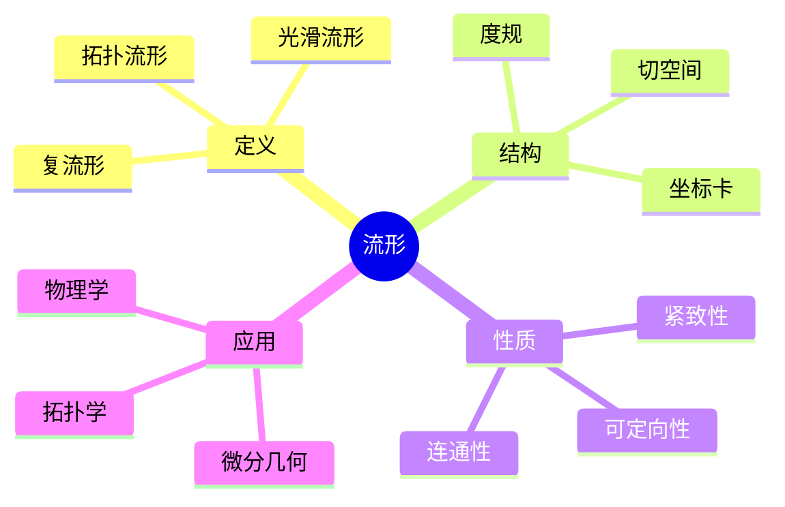
```mermaid
mindmap
  root((流形))
    定义
      拓扑流形
      光滑流形
      复流形
    结构
      坐标卡
      切空间
      度规
    性质
      可定向性
      紧致性
      连通性
    应用
      微分几何
      拓扑学
      物理学
```

#### 5.2 矩阵对比：不同解释方式的对比

| 解释方式 | 特点 | 方法 | 工具 | 适用阶段 | 优势 | 局限 |
|---------|------|------|------|---------|------|------|
| **直观解释** | 具体、形象、可视 | 例子、类比、直观 | 坐标卡、图像 | 入门阶段 | 易于理解 | 不够严格 |
| **知性解释** | 概念、分类、抽象 | 定义、分类、结构 | 概念图、知识图谱 | 中级阶段 | 系统完整 | 不够直观 |
| **理性解释** | 公理、证明、形式化 | 公理、证明、系统 | 形式化工具、证明系统 | 高级阶段 | 严格准确 | 不够具体 |
| **多视角解释** | 多角度、整合 | 多视角、整合 | 多视角工具 | 所有阶段 | 全面深入 | 可能复杂 |

#### 5.3 多视角表征：从不同角度表征流形

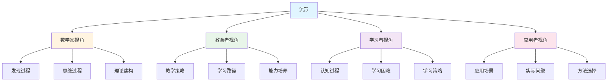
```mermaid
graph TD
    A[流形] --> B[数学家视角]
    A --> C[教育者视角]
    A --> D[学习者视角]
    A --> E[应用者视角]

    B --> B1[发现过程]
    B --> B2[思维过程]
    B --> B3[理论建构]

    C --> C1[教学策略]
    C --> C2[学习路径]
    C --> C3[能力培养]

    D --> D1[认知过程]
    D --> D2[学习困难]
    D --> D3[学习策略]

    E --> E1[应用场景]
    E --> E2[实际问题]
    E --> E3[方法选择]

    style A fill:#e1f5ff
    style B fill:#fff4e1
    style C fill:#e8f5e9
    style D fill:#f3e5f5
    style E fill:#fce4ec
```

#### 5.4 决策树：流形问题分类和策略选择

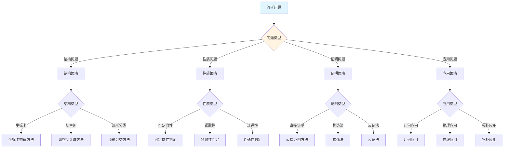
```mermaid
graph TD
    A[流形问题] --> B{问题类型}
    B -->|结构问题| C[结构策略]
    B -->|性质问题| D[性质策略]
    B -->|证明问题| E[证明策略]
    B -->|应用问题| F[应用策略]

    C --> C1{结构类型}
    C1 -->|坐标卡| C2[坐标卡构造方法]
    C1 -->|切空间| C3[切空间计算方法]
    C1 -->|流形分类| C4[流形分类方法]

    D --> D1{性质类型}
    D1 -->|可定向性| D2[可定向性判定]
    D1 -->|紧致性| D3[紧致性判定]
    D1 -->|连通性| D4[连通性判定]

    E --> E1{证明类型}
    E1 -->|直接证明| E2[直接证明方法]
    E1 -->|构造法| E3[构造法]
    E1 -->|反证法| E4[反证法]

    F --> F1{应用类型}
    F1 -->|几何应用| F2[几何应用]
    F1 -->|物理应用| F3[物理应用]
    F1 -->|拓扑应用| F4[拓扑应用]

    style A fill:#e1f5ff
    style B fill:#fff4e1
```

**说明**：

- **问题分类**：根据问题类型（结构、性质、证明、应用）进行分类
- **策略选择**：根据问题类型选择相应的解决策略
- **方法应用**：根据具体问题选择合适的方法

#### 5.5 决策逻辑路径：流形问题解决过程

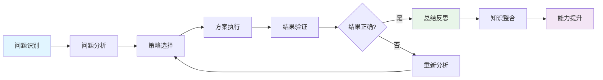
```mermaid
graph LR
    A[问题识别] --> B[问题分析]
    B --> C[策略选择]
    C --> D[方案执行]
    D --> E[结果验证]
    E --> F{结果正确?}
    F -->|是| G[总结反思]
    F -->|否| H[重新分析]
    H --> C

    G --> I[知识整合]
    I --> J[能力提升]

    style A fill:#e1f5ff
    style G fill:#e8f5e9
    style J fill:#f3e5f5
```

**说明**：

- **问题识别**：识别流形问题的类型和关键要素
- **问题分析**：分析问题的条件和目标
- **策略选择**：根据问题类型选择解决策略
- **方案执行**：执行选定的解决方案
- **结果验证**：验证结果的正确性
- **总结反思**：总结解题过程，反思解题方法
- **知识整合**：整合相关知识点
- **能力提升**：提升问题解决能力

#### 5.6 多维对比矩阵：流形概念特征对比

| 对比维度 | 流形定义 | 流形结构 | 流形性质 | 流形应用 |
|---------|---------|---------|---------|---------|
| **核心特征** | 局部欧几里得、坐标卡 | 切空间、切丛、流形分类 | 可定向性、紧致性、连通性 | 几何、物理、拓扑应用 |
| **理解难度** | ⭐⭐⭐⭐ | ⭐⭐⭐⭐⭐ | ⭐⭐⭐⭐⭐ | ⭐⭐⭐⭐ |
| **应用频率** | ⭐⭐⭐⭐ | ⭐⭐⭐⭐ | ⭐⭐⭐⭐ | ⭐⭐⭐⭐ |
| **理论基础** | 流形定义 | 流形结构理论 | 流形性质理论 | 流形应用理论 |
| **教学重点** | 概念理解 | 结构分析 | 性质分析 | 应用能力 |
| **学习阶段** | 高级阶段 | 高级阶段 | 高级阶段 | 高级阶段 |
| **认知维度** | 知性+理性 | 理性 | 理性 | 理性+应用 |
| **思维表征** | 思维导图 | 决策树 | 决策逻辑路径 | 知识图谱 |

**说明**：

- **核心特征**：每个方面的核心特征
- **理解难度**：从1星到5星，表示理解难度
- **应用频率**：从1星到5星，表示应用频率
- **理论基础**：每个方面的理论基础
- **教学重点**：每个方面的教学重点
- **学习阶段**：每个方面的学习阶段
- **认知维度**：每个方面的认知维度
- **思维表征**：每个方面推荐的思维表征方法

---

## 🔍 数学论证：如何论证流形 (编号: C.CORE.018.06)

### 一、论证过程：从观察到反思

#### 1.1 观察（Observation）

**具体现象观察**：

- **现象1**：局部像欧几里得空间
  - 例如：球面在每一点附近都像平面，可以用坐标卡表示
  - **为什么重要**：这个现象揭示了流形的局部结构
- **现象2**：坐标卡之间的转换
  - 例如：球面可以用多个坐标卡覆盖，坐标卡之间的转换是光滑的
  - **为什么重要**：这个现象揭示了流形的整体结构

**模式识别**：

- **模式1**：流形的定义
  - 例如：流形是局部同胚于$\mathbb{R}^n$的拓扑空间
  - **为什么重要**：这个模式可能反映了流形的本质
- **模式2**：切空间和切丛
  - 例如：流形在每一点有切空间，所有切空间构成切丛
  - **为什么重要**：这个模式可能反映了流形的微分结构

**问题提出**：

- **问题1**：如何严格定义流形，统一不同的几何对象？
  - **为什么提出**：这个问题可能揭示流形的本质和基础
- **问题2**：如何证明流形的存在性？
  - **为什么提出**：这个问题可能揭示流形的构造方法

#### 1.2 猜想（Conjecture）

**归纳猜想**：

- **猜想1**：流形是研究几何对象的统一工具
  - **依据**：观察球面、环面、曲面都满足流形定义
  - **为什么提出**：这个猜想可能揭示流形的统一性
- **猜想2**：流形有切空间
  - **依据**：观察具体流形的切空间
  - **为什么提出**：这个猜想可能揭示流形的微分结构

**类比猜想**：

- **猜想1**：流形类似于"局部像欧几里得空间"
  - **类比对象**：欧几里得空间
  - **为什么提出**：这个类比可能揭示流形的本质
- **猜想2**：坐标卡类似于"地图"
  - **类比对象**：地图
  - **为什么提出**：这个类比可能揭示坐标卡的作用

**直觉猜想**：

- **猜想1**：流形是"最自然"的几何对象
  - **直觉来源**：流形的直观
  - **为什么提出**：这个直觉可能揭示流形的基础地位
- **猜想2**：流形有"最小"的公理结构
  - **直觉来源**：流形的公理结构
  - **为什么提出**：这个直觉可能揭示流形的本质

#### 1.3 证明（Proof）

**直接证明**：

- **证明1**：流形的切空间存在
  - **证明思路**：使用坐标卡和切向量的定义
  - **关键步骤**：证明在每一点可以定义切空间，且切空间是$n$维向量空间
  - **为什么这样证明**：这个证明方法直接、清晰
- **证明2**：流形的切丛是流形
  - **证明思路**：使用切空间和流形的定义
  - **关键步骤**：证明所有切空间的并集构成$2n$维流形
  - **为什么这样证明**：这个证明方法直接、清晰

**构造法**：

- **构造法**：构造流形作为子流形
  - **构造方法**：定义流形为$\mathbb{R}^N$的子集，满足某些条件
  - **验证**：验证构造的流形满足流形公理
  - **为什么这样证明**：构造法适合证明存在性命题

#### 1.4 反思（Reflection）

**过程回顾**：

- **论证回顾**：从观察局部像欧几里得空间，到猜想流形的性质，再到严格证明
  - **成功之处**：成功建立了流形的严格理论
  - **不足之处**：流形概念需要进一步推广
  - **改进方向**：推广到Banach流形、Fréchet流形等

**方法总结**：

- **证明方法**：使用了直接证明、构造法
  - **方法特点**：直接证明清晰，构造法明确
  - **适用范围**：不同方法适用于不同类型的命题
- **证明技巧**：使用坐标卡、切空间、流形的定义
  - **技巧要点**：将流形问题转化为拓扑和微分问题，使用构造法处理存在性问题
  - **应用场景**：这些技巧可以应用于其他几何问题

**理论意义**：

- **理论贡献**：建立了流形的严格理论，揭示了流形的几何结构
  - **为什么重要**：这个论证揭示了微分几何的基础结构
- **应用价值**：流形为微分几何、拓扑学、物理提供了基础
  - **为什么重要**：这个论证可以应用于所有几何问题

### 二、论证类型：多种推理方式

#### 2.1 归纳论证（Inductive Reasoning）

**不完全归纳**：

- **例子1**：从具体流形的性质归纳一般规律
  - **观察**：观察球面、环面都有切空间
  - **结论**：所有流形都有切空间
  - **局限性**：不完全归纳的结论需要严格证明

#### 2.2 演绎论证（Deductive Reasoning）

**三段论**：

- **例子1**：证明流形的性质
  - **大前提**：所有流形都局部同胚于$\mathbb{R}^n$
  - **小前提**：球面是流形
  - **结论**：球面局部同胚于$\mathbb{R}^2$
  - **为什么有效**：三段论是严格的演绎推理

#### 2.3 类比论证（Analogical Reasoning）

**结构类比**：

- **例子1**：流形与欧几里得空间的类比
  - **类比对象**：欧几里得空间
  - **相似性**：流形局部像欧几里得空间
  - **结论**：流形可以理解为"局部像欧几里得空间"
  - **局限性**：类比不能替代严格证明

#### 2.4 构造论证（Constructive Reasoning）

**构造法**：

- **例子1**：构造流形作为子流形
  - **构造方法**：定义流形为$\mathbb{R}^N$的子集
  - **验证**：验证构造的流形满足流形公理
  - **为什么有效**：构造法是严格的直接证明

### 三、论证可视化：用图形表示论证过程

#### 3.1 论证流程图

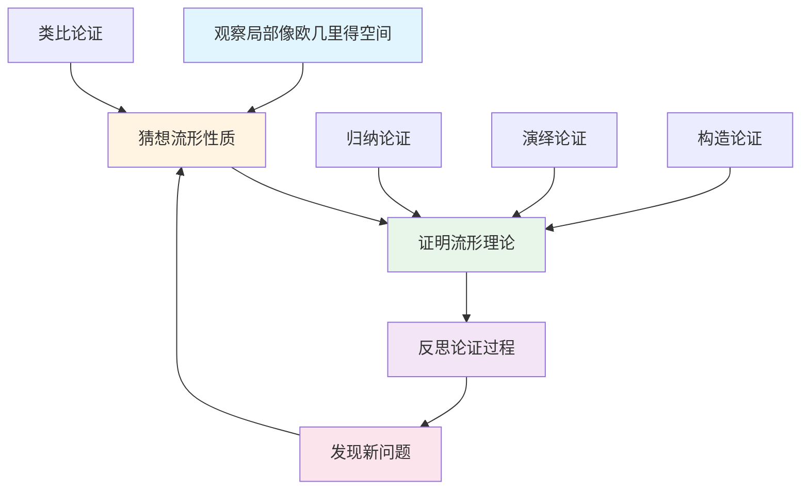
```mermaid
graph TD
    A[观察局部像欧几里得空间] --> B[猜想流形性质]
    B --> C[证明流形理论]
    C --> D[反思论证过程]
    D --> E[发现新问题]
    E --> B

    F[归纳论证] --> C
    G[演绎论证] --> C
    H[类比论证] --> B
    I[构造论证] --> C

    style A fill:#e1f5ff
    style B fill:#fff4e1
    style C fill:#e8f5e9
    style D fill:#f3e5f5
    style E fill:#fce4ec
```

#### 3.2 论证类型对比

| 论证类型 | 特点 | 适用场景 | 优势 | 局限 |
|---------|------|---------|------|------|
| **归纳论证** | 从特殊到一般 | 发现规律、提出猜想 | 启发性强 | 结论或然 |
| **演绎论证** | 从一般到特殊 | 严格证明、逻辑推理 | 结论必然 | 需要前提 |
| **类比论证** | 基于相似性 | 启发思路、发现联系 | 创造性高 | 结论或然 |
| **构造论证** | 直接构造 | 证明存在性命题 | 直接明确 | 需要构造 |

#### 3.3 论证思维导图

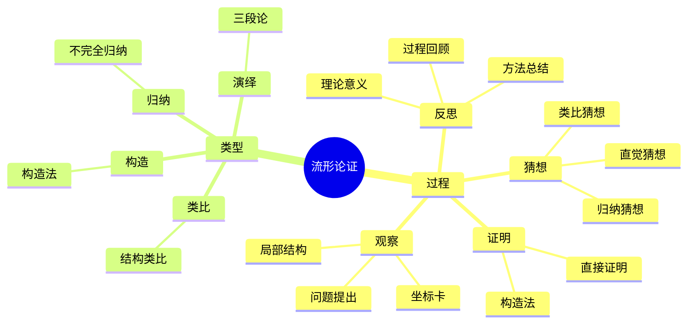
```mermaid
mindmap
  root((流形论证))
    过程
      观察
        局部结构
        坐标卡
        问题提出
      猜想
        归纳猜想
        类比猜想
        直觉猜想
      证明
        直接证明
        构造法
      反思
        过程回顾
        方法总结
        理论意义
    类型
      归纳
        不完全归纳
      演绎
        三段论
      类比
        结构类比
      构造
        构造法
```

---

## 🔗 三视角整合 (编号: C.CORE.018.07)

### 三个视角的关联

**认知学视角 ↔ 教育学视角**:

- 认知学视角揭示的理解机制，指导教育学视角的教学设计
- 教育学视角的教学实践，验证认知学视角的理论

**认知学视角 ↔ 数学家视角**:

- 数学家视角的思维过程，启发认知学视角的认知路径
- 认知学视角的认知障碍，解释数学家视角的历史困难

**教育学视角 ↔ 数学家视角**:

- 数学家视角的历史发展，为教育学视角提供教学素材
- 教育学视角的教学策略，帮助学习者理解数学家视角的思维过程

### 如何综合运用三个视角

**学习建议**:

1. **从认知学视角开始**: 先建立直观理解
2. **用教育学视角深化**: 通过教学路径系统学习
3. **用数学家视角升华**: 理解概念的深层意义和历史背景

**教学建议**:

1. **引入阶段**: 用数学家视角的问题起源激发兴趣
2. **探索阶段**: 用认知学视角的认知过程引导发现
3. **形式化阶段**: 用教育学视角的教学策略系统教学
4. **巩固阶段**: 综合三个视角深化理解

---

## 📚 参考文献 (编号: C.CORE.018.08)

### 权威资源

- Wikipedia: [Manifold](https://en.wikipedia.org/wiki/Manifold)
- Metamath: [Manifold](http://us.metamath.org/mpeuni/df-manifold.html)[需更新][需更新]

### 经典教材

- Lee, J. M. (2012). *Introduction to Smooth Manifolds*. Springer.
- Spivak, M. (1979). *A Comprehensive Introduction to Differential Geometry*. Publish or Perish.

### 研究论文

- Riemann, B. (1854). "Über die Hypothesen, welche der Geometrie zu Grunde liegen". *Abhandlungen der Königlichen Gesellschaft der Wissenschaften zu Göttingen*.
- Poincaré, H. (1895). "Analysis situs". *Journal de l'École Polytechnique*.

---

**创建日期**: 2025年1月
**最后更新**: 2026-04-05
**维护状态**: 持续更新中

---

## 📚 附录: 扩展分析


### 1. 多理论分析

---
msc_primary: "00A99"
---

# 流形概念的多理论分析示例 / Multi-Theory Analysis Example: Manifold Concept


---


## 🎯 一、Tall三个世界理论分析 / Tall's Three Worlds Theory Analysis (编号: C.CORE.018.MULTI.01)

### 1.1 感知-操作世界（Embodied World）

**流形在感知-操作世界中的理解 / Understanding Manifolds in the Embodied World**：

- **具体经验 / Concrete Experience**：
  - 通过观察曲线、曲面理解流形：曲线是1维流形，球面是2维流形 / Understanding manifolds through observing curves and surfaces: curves are 1-dimensional manifolds, spheres are 2-dimensional manifolds
  - 例如：地球表面（球面）、轮胎表面（环面） / Examples: Earth's surface (sphere), tire surface (torus)
  - 通过"局部像欧几里得空间"理解流形：在小范围内，流形看起来像平面 / Understanding manifolds through "locally like Euclidean space": in small regions, manifolds look like planes

- **身体动作 / Bodily Actions**：
  - 通过"局部观察"的动作理解流形 / Understanding manifolds through the action of "local observation"
  - 通过"坐标变换"理解流形的局部结构 / Understanding local structure of manifolds through "coordinate transformations"
  - 通过操作图形理解流形的切空间、法向量 / Understanding tangent spaces and normal vectors of manifolds through manipulating figures

- **直观理解 / Intuitive Understanding**：
  - 流形是"局部像欧几里得空间的拓扑空间" / A manifold is a "topological space that is locally like Euclidean space"
  - 流形描述"弯曲空间"的结构 / Manifolds describe the structure of "curved spaces"
  - 流形是微分几何的基础 / Manifolds are the foundation of differential geometry

**教学建议 / Teaching Suggestions**：

- 使用具体例子（球面、环面、平面） / Use concrete examples (spheres, tori, planes)
- 通过局部观察理解流形 / Understand manifolds through local observation
- 使用图形可视化流形结构 / Use graphics to visualize manifold structure

### 1.2 概念-符号世界（Symbolic World）

**流形在概念-符号世界的理解 / Understanding Manifolds in the Symbolic World**：

- **符号表示 / Symbolic Representation**：
  - 使用流形符号：$M$、$N$ 表示流形 / Using manifold notation: $M$, $N$ to denote manifolds
  - 使用坐标卡符号：$(U, \phi)$、$(V, \psi)$ / Using chart notation: $(U, \phi)$, $(V, \psi)$
  - 使用切空间符号：$T_p M$、$TM$ / Using tangent space notation: $T_p M$, $TM$

- **概念理解 / Conceptual Understanding**：
  - 流形是局部同胚于$\mathbb{R}^n$的拓扑空间 / A manifold is a topological space locally homeomorphic to $\mathbb{R}^n$
  - 流形通过坐标卡覆盖 / Manifolds are covered by coordinate charts
  - 流形是微分几何的研究对象 / Manifolds are objects of study in differential geometry

- **抽象操作 / Abstract Operations**：
  - 通过坐标变换研究流形 / Studying manifolds through coordinate transformations
  - 通过切空间研究流形的局部结构 / Studying local structure of manifolds through tangent spaces
  - 通过微分形式研究流形的全局性质 / Studying global properties of manifolds through differential forms

**教学建议 / Teaching Suggestions**：

- 逐步引入流形符号 / Gradually introduce manifold notation
- 通过坐标卡练习理解流形 / Understand manifolds through chart exercises
- 使用流形性质研究几何结构 / Use manifold properties to study geometric structures

### 1.3 形式-公理世界（Formal World）

**流形在形式-公理世界的理解 / Understanding Manifolds in the Formal World**：

- **公理系统 / Axiomatic System**：
  - 流形的严格定义：$n$维流形$M$是满足条件的拓扑空间 / Strict definition of manifold: $n$-dimensional manifold $M$ is a topological space satisfying conditions
  - 通过坐标卡严格定义流形 / Strictly defining manifolds through coordinate charts
  - 通过公理推导演分性质 / Deriving differential properties through axioms

- **形式化定义 / Formal Definition**：
  - 流形的形式化定义 / Formal definition of manifold
  - 光滑流形的形式化定义 / Formal definition of smooth manifold
  - 流形性质的形式化证明 / Formal proof of manifold properties

- **逻辑推理 / Logical Reasoning**：
  - 通过逻辑推理证明流形性质 / Proving manifold properties through logical reasoning
  - 通过形式化方法研究微分几何 / Studying differential geometry through formal methods
  - 通过范畴论研究流形的一般性质 / Studying general properties of manifolds through category theory

**教学建议 / Teaching Suggestions**：

- 介绍流形定义 / Introduce manifold definition
- 通过形式化证明理解流形性质 / Understand manifold properties through formal proofs
- 研究流形在微分几何中的作用 / Study the role of manifolds in differential geometry

### 1.4 三个世界的转换 / Transitions Between Worlds

**转换路径 / Transition Paths**：

1. **从感知-操作到概念-符号 / From Embodied to Symbolic**：
   - 将具体曲面结构抽象为流形符号 / Abstracting concrete surface structures into manifold symbols
   - 从操作中提取流形概念 / Extracting manifold concepts from operations
   - 例如：从"光滑曲面"到"流形$M$" / Example: from "smooth surface" to "manifold $M$"

2. **从概念-符号到形式-公理 / From Symbolic to Formal**：
   - 将流形概念形式化为坐标卡定义 / Formalizing manifold concepts into coordinate chart definition
   - 从符号运算到逻辑推理 / From symbolic operations to logical reasoning
   - 例如：从"流形$M$"到"坐标卡$(U, \phi)$" / Example: from "manifold $M$" to "coordinate chart $(U, \phi)$"

**转换支持 / Transition Support**：

- **识别转换困难 / Identifying Transition Difficulties**：
  - 识别从具体曲面到抽象流形的困难 / Identifying difficulties in transitioning from concrete surfaces to abstract manifolds
  - 识别从符号运算到形式化定义的困难 / Identifying difficulties in transitioning from symbolic operations to formal definitions

- **设计转换活动 / Designing Transition Activities**：
  - 设计过渡活动支持转换 / Designing transition activities to support transitions
  - 提供渐进式支持 / Providing progressive support

- **评估转换效果 / Assessing Transition Effectiveness**：
  - 评估转换成功 / Assessing transition success
  - 提供反馈支持 / Providing feedback support

---

## 🔬 二、Dubinsky APOS理论分析 (编号: C.CORE.018.MULTI.02)

### 2.1 Action（动作）

**流形的Action阶段 / Action Stage of Manifold**：

- **具体操作 / Concrete Operations**：
  - 判断流形：给定拓扑空间，判断是否为流形 / Determining manifold: given a topological space, determine if it is a manifold
  - 使用坐标卡：给定流形，构造坐标卡 / Using coordinate charts: given a manifold, construct coordinate charts
  - 构造流形：给定拓扑空间，构造流形结构 / Constructing manifolds: given a topological space, construct manifold structure

- **操作特点 / Operation Characteristics**：
  - 需要外部指导（教师、教材） / Requires external guidance (teacher, textbook)
  - 操作是具体的、机械的 / Operations are concrete and mechanical
  - 需要逐步执行 / Requires step-by-step execution

- **学习活动 / Learning Activities**：
  - 练习判断流形 / Practice determining manifolds
  - 练习使用坐标卡 / Practice using coordinate charts
  - 练习构造流形 / Practice constructing manifolds

**教学建议 / Teaching Suggestions**：

- 提供大量练习机会 / Provide ample practice opportunities
- 给予及时反馈 / Give timely feedback
- 逐步增加操作复杂度 / Gradually increase operation complexity

### 2.2 Process（过程）

**流形的Process阶段 / Process Stage of Manifold**：

- **内化过程 / Internalization Process**：
  - 将流形判断内化为心理过程 / Internalizing manifold determination as a mental process
  - 理解流形构造的内在逻辑 / Understanding the internal logic of manifold construction
  - 能够独立完成流形操作 / Being able to perform manifold operations independently

- **过程理解 / Process Understanding**：
  - 理解"流形"是"局部像欧几里得空间的拓扑空间的过程" / Understanding that "manifold" is "the process of topological spaces locally like Euclidean space"
  - 理解"坐标卡"是"局部坐标化的过程" / Understanding that "coordinate charts" are "the process of local coordinatization"
  - 理解"切空间"是"局部线性化的过程" / Understanding that "tangent spaces" are "the process of local linearization"

- **灵活应用 / Flexible Application**：
  - 能够灵活应用流形概念 / Being able to flexibly apply manifold concepts
  - 能够处理复杂的流形问题 / Being able to handle complex manifold problems
  - 能够理解流形的各种性质 / Being able to understand various properties of manifolds

**教学建议 / Teaching Suggestions**：

- 引导学生内化操作过程 / Guide students to internalize operation processes
- 通过变式练习加深理解 / Deepen understanding through variant exercises
- 鼓励学生探索流形应用 / Encourage students to explore manifold applications

### 2.3 Object（对象）

**流形的Object阶段 / Object Stage of Manifold**：

- **对象化理解 / Objectification Understanding**：
  - 将流形视为独立的对象 / Viewing manifolds as independent objects
  - 理解流形作为数学对象的结构 / Understanding the structure of manifolds as mathematical objects
  - 能够对流形进行运算和操作 / Being able to perform operations on manifolds

- **对象操作 / Object Operations**：
  - 能够比较不同的流形 / Being able to compare different manifolds
  - 能够构造流形的积流形 / Being able to construct product manifolds
  - 能够研究流形的性质 / Being able to study properties of manifolds

- **概念整合 / Conceptual Integration**：
  - 理解流形与拓扑空间、微分几何的关系 / Understanding the relationship between manifolds, topological spaces, and differential geometry
  - 理解流形在几何学中的作用 / Understanding the role of manifolds in geometry
  - 理解流形在数学中的作用 / Understanding the role of manifolds in mathematics

**教学建议 / Teaching Suggestions**：

- 引导学生将流形对象化 / Guide students to objectify manifolds
- 通过对象操作加深理解 / Deepen understanding through object operations
- 整合流形与其他概念 / Integrate manifolds with other concepts

### 2.4 Schema（图式）

**流形的Schema阶段 / Schema Stage of Manifold**：

- **图式构建 / Schema Construction**：
  - 构建完整的流形图式 / Constructing a complete manifold schema
  - 整合流形的各种理解 / Integrating various understandings of manifolds
  - 建立流形与其他概念的联系 / Establishing connections between manifolds and other concepts

- **图式应用 / Schema Application**：
  - 能够灵活应用流形图式 / Being able to flexibly apply manifold schemas
  - 能够解决复杂的流形问题 / Being able to solve complex manifold problems
  - 能够研究微分几何理论 / Being able to study differential geometry theory

- **图式发展 / Schema Development**：
  - 不断发展流形图式 / Continuously developing manifold schemas
  - 探索流形的新应用 / Exploring new applications of manifolds
  - 研究微分几何理论的发展 / Studying the development of differential geometry theory

**教学建议 / Teaching Suggestions**：

- 帮助学生构建流形图式 / Help students construct manifold schemas
- 通过应用发展图式 / Develop schemas through application
- 鼓励学生探索微分几何理论 / Encourage students to explore differential geometry theory

### 2.5 APOS发展路径 / APOS Development Path

**发展过程 / Development Process**：

1. **Action → Process / 动作到过程**：
   - 将外部流形操作内化为心理过程 / Internalizing external manifold operations as mental processes
   - 从需要指导到独立完成 / From needing guidance to independent completion
   - 例如：从"构造坐标卡"到"理解流形过程" / Example: from "constructing coordinate charts" to "understanding the manifold process"

2. **Process → Object / 过程到对象**：
   - 将流形过程对象化 / Objectifying manifold processes
   - 从过程理解到对象理解 / From process understanding to object understanding
   - 例如：从"理解流形过程"到"将流形视为对象" / Example: from "understanding the manifold process" to "treating manifolds as objects"

3. **Object → Schema / 对象到图式**：
   - 整合流形的所有方面形成完整图式 / Integrating all aspects of manifolds to form a complete schema
   - 从对象理解到系统理解 / From object understanding to systematic understanding
   - 例如：从"理解流形对象"到"形成微分几何图式" / Example: from "understanding manifold objects" to "forming a differential geometry schema"

**发展支持 / Development Support**：

- **识别发展困难 / Identifying Development Difficulties**：
  - 识别内化困难 / Identifying internalization difficulties
  - 识别对象化困难 / Identifying objectification difficulties
  - 识别图式化困难 / Identifying schematization difficulties

- **设计发展活动 / Designing Development Activities**：
  - 设计支持内化的活动 / Designing activities to support internalization
  - 设计支持对象化的活动 / Designing activities to support objectification
  - 设计支持图式化的活动 / Designing activities to support schematization

- **评估发展效果 / Assessing Development Effectiveness**：
  - 评估各阶段发展 / Assessing development at each stage
  - 提供反馈支持 / Providing feedback support

---

## 💬 三、Sfard交流理论分析 / Sfard's Commognitive Theory Analysis (编号: C.CORE.018.MULTI.03)

### 3.1 流形作为交流工具 / Manifold as a Communication Tool

**流形的交流功能 / Communicative Function of Manifolds**：

- **数学交流 / Mathematical Communication**：
  - 流形用于表达"弯曲空间"：$M$ / Manifolds are used to express "curved spaces": $M$
  - 流形用于描述"局部结构" / Manifolds are used to describe "local structure"
  - 流形用于表达数学关系：微分同胚、同伦等价 / Manifolds are used to express mathematical relationships: diffeomorphisms, homotopy equivalence

- **概念表达 / Conceptual Expression**：
  - 通过流形表达"局部像欧几里得空间"的概念 / Expressing the concept of "locally like Euclidean space" through manifolds
  - 通过流形符号表达"几何结构"的概念 / Expressing the concept of "geometric structure" through manifold notation
  - 通过流形表达"微分结构"的概念 / Expressing the concept of "differential structure" through manifolds

- **问题解决 / Problem Solving**：
  - 使用流形语言表达问题 / Using manifold language to express problems
  - 使用流形方法解决问题 / Using manifold methods to solve problems
  - 使用微分几何方法证明定理 / Using differential geometry methods to prove theorems

### 3.2 流形学习的实践参与 / Practice Participation in Manifold Learning

**通过参与数学实践学习流形 / Learning Manifolds through Participation in Mathematical Practice**：

- **实践场景 / Practice Scenarios**：
  - 通过几何问题学习流形 / Learning manifolds through geometry problems
  - 通过物理应用学习流形 / Learning manifolds through physics applications
  - 通过机器学习应用学习流形 / Learning manifolds through machine learning applications
  - 通过微分几何研究学习流形理论 / Learning manifold theory through differential geometry research

- **实践方式 / Practice Methods**：
  - 参与数学讨论，使用流形语言 / Participating in mathematical discussions, using manifold language
  - 解决数学问题，应用流形方法 / Solving mathematical problems, applying manifold methods
  - 研究数学理论，理解流形作用 / Studying mathematical theory, understanding the role of manifolds

- **学习效果 / Learning Outcomes**：
  - 通过实践理解流形概念 / Understanding manifold concepts through practice
  - 通过应用掌握流形方法 / Mastering manifold methods through application
  - 通过参与形成数学思维 / Forming mathematical thinking through participation

**教学建议 / Teaching Suggestions**：

- 设计数学实践活动 / Design mathematical practice activities
- 鼓励学生参与数学讨论 / Encourage students to participate in mathematical discussions
- 提供实际问题解决机会 / Provide opportunities for solving real-world problems

---

## 🧠 四、Piaget认知发展理论分析 / Piaget's Cognitive Development Theory Analysis (编号: C.CORE.018.MULTI.04)

### 4.1 具体运算阶段（7-12岁）/ Concrete Operational Stage (7-12 years)

**流形在具体运算阶段的理解 / Understanding Manifolds in the Concrete Operational Stage**：

- **具体对象 / Concrete Objects**：
  - 通过具体流形理解流形 / Understanding manifolds through concrete manifolds
  - 例如：球面、环面、平面 / Examples: spheres, tori, planes
  - 需要具体例子支持理解 / Requires concrete examples to support understanding

- **逻辑思维 / Logical Thinking**：
  - 能够理解流形的基本概念 / Being able to understand basic manifold concepts
  - 能够进行简单的流形操作 / Being able to perform simple manifold operations
  - 但需要具体对象支持 / But requires concrete object support

- **教学建议 / Teaching Suggestions**：
  - 使用具体流形 / Use concrete manifolds
  - 通过图形验证流形性质 / Verify manifold properties through graphics
  - 逐步引入抽象概念 / Gradually introduce abstract concepts

### 4.2 形式运算阶段（12+岁）/ Formal Operational Stage (12+ years)

**流形在形式运算阶段的理解 / Understanding Manifolds in the Formal Operational Stage**：

- **抽象思维 / Abstract Thinking**：
  - 能够理解抽象的流形概念 / Being able to understand abstract manifold concepts
  - 能够进行符号操作 / Being able to perform symbolic operations
  - 能够进行逻辑推理 / Being able to perform logical reasoning

- **形式推理 / Formal Reasoning**：
  - 能够证明流形性质 / Being able to prove manifold properties
  - 能够理解流形定义 / Being able to understand manifold definition
  - 能够研究微分几何 / Being able to study differential geometry

- **教学建议 / Teaching Suggestions**：
  - 引入抽象概念和符号 / Introduce abstract concepts and symbols
  - 进行逻辑推理训练 / Conduct logical reasoning training
  - 研究微分几何理论 / Study differential geometry theory

---

## 🌍 五、Vygotsky社会文化理论分析 / Vygotsky's Sociocultural Theory Analysis (编号: C.CORE.018.MULTI.05)

### 5.1 最近发展区（ZPD）/ Zone of Proximal Development (ZPD)

**流形学习的最近发展区 / Zone of Proximal Development in Manifold Learning**：

- **独立能力 / Independent Ability**：
  - 能够理解流形的基本概念 / Being able to understand basic manifold concepts
  - 能够进行简单的流形操作 / Being able to perform simple manifold operations
  - 能够理解坐标卡 / Being able to understand coordinate charts

- **潜在能力 / Potential Ability**：
  - 能够理解流形定义 / Being able to understand manifold definition
  - 能够证明流形性质 / Being able to prove manifold properties
  - 能够研究微分几何理论 / Being able to study differential geometry theory

- **教学建议 / Teaching Suggestions**：
  - 识别学生的最近发展区 / Identify students' zone of proximal development
  - 提供适当的支持和指导 / Provide appropriate support and guidance
  - 逐步提高学习要求 / Gradually increase learning requirements

### 5.2 社会文化工具 / Sociocultural Tools

**流形作为社会文化工具 / Manifolds as Sociocultural Tools**：

- **数学工具 / Mathematical Tools**：
  - 流形是数学研究的重要工具 / Manifolds are important tools for mathematical research
  - 流形用于解决实际问题 / Manifolds are used to solve real-world problems
  - 流形用于研究数学理论 / Manifolds are used to study mathematical theory

- **文化意义 / Cultural Significance**：
  - 流形是数学文化的重要组成部分 / Manifolds are an important part of mathematical culture
  - 流形反映了数学思维的发展 / Manifolds reflect the development of mathematical thinking
  - 流形体现了数学的美感 / Manifolds embody the beauty of mathematics

- **教学建议 / Teaching Suggestions**：
  - 介绍流形的历史和文化意义 / Introduce the history and cultural significance of manifolds
  - 展示流形在数学中的作用 / Demonstrate the role of manifolds in mathematics
  - 培养学生对数学文化的理解 / Cultivate students' understanding of mathematical culture

---

## 🔄 六、多理论整合分析 / Multi-Theory Integration Analysis (编号: C.CORE.018.MULTI.06)

### 6.1 理论共同点 / Theoretical Commonalities

**各理论在流形概念分析中的共同点 / Commonalities of Theories in Manifold Concept Analysis**：

1. **多层次理解 / Multi-Level Understanding**：
   - 都强调从具体到抽象的发展 / All emphasize development from concrete to abstract
   - Tall的三个世界、APOS的四个阶段、Piaget的发展阶段都体现这一点 / Tall's three worlds, APOS's four stages, and Piaget's developmental stages all reflect this

2. **实践重要性 / Importance of Practice**：
   - 都强调实践在学习中的作用 / All emphasize the role of practice in learning
   - Sfard的交流理论、Vygotsky的社会文化理论都强调这一点 / Sfard's communication theory and Vygotsky's sociocultural theory both emphasize this

3. **认知发展 / Cognitive Development**：
   - 都关注认知发展的过程 / All focus on the process of cognitive development
   - 各理论都描述了从简单到复杂的发展 / Each theory describes development from simple to complex

### 6.2 理论互补性 / Theoretical Complementarity

**各理论在流形概念分析中的互补性 / Complementarity of Theories in Manifold Concept Analysis**：

1. **Tall三个世界 / Tall's Three Worlds**：
   - 适用于理解流形概念的不同层次 / Applicable to understanding different levels of manifold concepts
   - 从感知操作到形式公理的发展 / Development from embodied operations to formal axioms

2. **APOS理论 / APOS Theory**：
   - 适用于分析流形概念的学习过程 / Applicable to analyzing the learning process of manifold concepts
   - 从动作到图式的发展 / Development from action to schema

3. **Sfard交流理论 / Sfard's Communication Theory**：
   - 适用于设计流形概念的实践活动 / Applicable to designing practice activities for manifold concepts
   - 通过数学实践学习流形 / Learning manifolds through mathematical practice

4. **Piaget理论 / Piaget's Theory**：
   - 适用于理解流形概念的认知发展阶段 / Applicable to understanding cognitive development stages of manifold concepts
   - 从具体运算到形式运算的发展 / Development from concrete operations to formal operations

5. **Vygotsky理论 / Vygotsky's Theory**：
   - 适用于设计流形概念的学习支持 / Applicable to designing learning support for manifold concepts
   - 通过最近发展区促进学习 / Promoting learning through the zone of proximal development

### 6.3 整合应用框架

**多理论整合应用**：

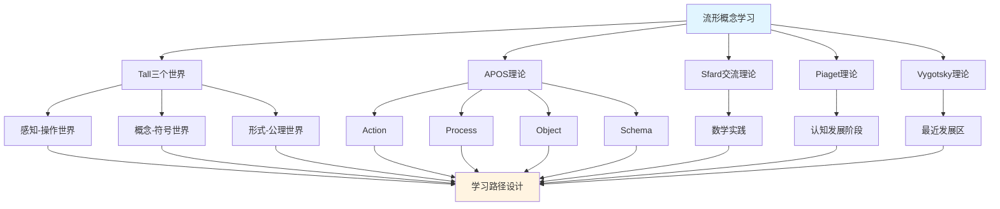
```mermaid
graph TB
    A[流形概念学习] --> B[Tall三个世界]
    A --> C[APOS理论]
    A --> D[Sfard交流理论]
    A --> E[Piaget理论]
    A --> F[Vygotsky理论]

    B --> G[感知-操作世界]
    B --> H[概念-符号世界]
    B --> I[形式-公理世界]

    C --> J[Action]
    C --> K[Process]
    C --> L[Object]
    C --> M[Schema]

    D --> N[数学实践]
    E --> O[认知发展阶段]
    F --> P[最近发展区]

    G --> Q[学习路径设计]
    H --> Q
    I --> Q
    J --> Q
    K --> Q
    L --> Q
    M --> Q
    N --> Q
    O --> Q
    P --> Q

    style A fill:#e1f5ff
    style Q fill:#fff4e1
```

---

## 📊 七、流形概念的多理论学习路径 / Multi-Theory Learning Path for Manifold Concept (编号: C.CORE.018.MULTI.07)

### 7.1 入门阶段（Tall感知-操作世界 + APOS Action）/ Entry Stage (Tall Embodied World + APOS Action)

**学习目标 / Learning Objectives**：

- 通过具体流形理解流形概念 / Understanding manifold concepts through concrete manifolds
- 掌握基本流形操作 / Mastering basic manifold operations

**学习活动 / Learning Activities**：

- 使用具体流形（球面、环面）进行观察 / Using concrete manifolds (spheres, tori) for observation
- 练习判断流形 / Practicing determining manifolds
- 练习使用坐标卡 / Practicing using coordinate charts
- 练习基本流形操作 / Practicing basic manifold operations

**评估标准 / Assessment Criteria**：

- 能够独立完成基本流形操作 / Being able to independently complete basic manifold operations
- 能够理解流形的基本概念 / Being able to understand basic manifold concepts

### 7.2 中级阶段（Tall概念-符号世界 + APOS Process/Object）/ Intermediate Stage (Tall Symbolic World + APOS Process/Object)

**学习目标 / Learning Objectives**：

- 理解流形的符号表示 / Understanding symbolic representation of manifolds
- 掌握流形运算的内在逻辑 / Mastering the internal logic of manifold operations
- 将流形视为对象 / Viewing manifolds as objects

**学习活动 / Learning Activities**：

- 学习流形符号和坐标卡符号 / Learning manifold notation and chart notation
- 通过符号操作进行流形运算 / Performing manifold operations through symbolic operations
- 理解流形的性质 / Understanding properties of manifolds
- 研究流形的积流形 / Studying product manifolds

**评估标准 / Assessment Criteria**：

- 能够灵活应用流形符号 / Being able to flexibly apply manifold notation
- 能够理解流形运算的内在逻辑 / Being able to understand the internal logic of manifold operations
- 能够将流形视为对象进行操作 / Being able to operate on manifolds as objects

### 7.3 高级阶段（Tall形式-公理世界 + APOS Schema + Sfard实践）/ Advanced Stage (Tall Formal World + APOS Schema + Sfard Practice)

**学习目标 / Learning Objectives**：

- 理解流形定义 / Understanding manifold definition
- 形成完整的流形概念图式 / Forming a complete manifold concept schema
- 通过数学实践应用流形 / Applying manifolds through mathematical practice

**学习活动 / Learning Activities**：

- 学习流形定义 / Learning manifold definition
- 通过形式化证明理解流形性质 / Understanding manifold properties through formal proofs
- 研究流形在微分几何中的作用 / Studying the role of manifolds in differential geometry
- 参与数学实践，应用流形方法 / Participating in mathematical practice, applying manifold methods

**评估标准 / Assessment Criteria**：

- 能够理解流形定义 / Being able to understand manifold definition
- 能够形成完整的流形概念图式 / Being able to form a complete manifold concept schema
- 能够通过数学实践应用流形 / Being able to apply manifolds through mathematical practice

---

## 🧠 七、元认知理论分析 / Metacognitive Theory Analysis (编号: C.CORE.018.MULTI.07.5)

### 7.1 元认知知识（Metacognitive Knowledge）

**关于流形概念的知识 / Knowledge About the Manifold Concept**：

- **概念知识 / Conceptual Knowledge**：
  - 流形的定义：局部同胚于欧几里得空间的拓扑空间 / Manifolds are topological spaces locally homeomorphic to Euclidean spaces
  - 流形的性质：局部性、可定向性、紧致性 / Properties: locality, orientability, compactness
  - 流形的表示方法：坐标卡、图册、切空间 / Representation methods: coordinate charts, atlases, tangent spaces
  - 流形与其他概念的关系：流形是微分几何的基础，是研究几何结构的工具 / Relationship: manifolds are foundations of differential geometry and tools for studying geometric structures

- **策略知识 / Strategy Knowledge**：
  - 学习策略：从具体例子（球面、环面）到抽象定义，通过坐标卡掌握流形 / Learning strategies: from concrete examples (spheres, tori) to abstract definitions, master manifolds through coordinate charts
  - 理解策略：从局部到整体，从低维到高维 / Understanding strategies: from local to global, from low-dimensional to high-dimensional
  - 应用策略：将流形方法应用到实际问题中 / Application strategies: apply manifold methods to real-world problems

- **任务知识 / Task Knowledge**：
  - 典型任务：流形构造、坐标卡选择、切空间计算 / Typical tasks: manifold construction, coordinate chart selection, tangent space computation
  - 任务难度：基础任务（流形构造）→ 中级任务（坐标卡选择）→ 高级任务（切空间计算） / Task difficulty: basic (manifold construction) → intermediate (coordinate chart selection) → advanced (tangent space computation)
  - 任务要求：理解流形概念，掌握流形构造，能够进行流形推理 / Task requirements: understand manifold concepts, master manifold construction, be able to reason about manifolds

### 7.2 元认知监控（Metacognitive Monitoring）

**理解监控 / Comprehension Monitoring**：

- **自我提问 / Self-Questioning**：
  - "我理解流形的基本概念了吗？" / "Do I understand the basic concept of manifolds?"
  - "我能区分流形和其他几何结构吗？" / "Can I distinguish between manifolds and other geometric structures?"
  - "我理解坐标卡的概念吗？" / "Do I understand the concept of coordinate charts?"

- **理解检查 / Comprehension Checking**：
  - 能否用自己的话解释流形概念？ / Can I explain the concept of manifolds in my own words?
  - 能否识别流形构造的错误？ / Can I identify errors in manifold construction?
  - 能否判断空间的流形性？ / Can I determine whether a space is a manifold?

- **困难识别 / Difficulty Identification**：
  - 识别理解困难：抽象性、坐标卡、图册、切空间 / Identify comprehension difficulties: abstraction, coordinate charts, atlases, tangent spaces
  - 识别运算困难：流形构造、坐标卡选择、切空间计算 / Identify operation difficulties: manifold construction, coordinate chart selection, tangent space computation

**过程监控 / Process Monitoring**：

- **学习过程监控 / Learning Process Monitoring**：
  - 监控学习进度：是否按计划学习？ / Monitor learning progress: Am I learning according to plan?
  - 监控学习效果：是否掌握了流形概念？ / Monitor learning effectiveness: Have I mastered the concept of manifolds?
  - 监控学习困难：遇到了哪些困难？ / Monitor learning difficulties: What difficulties have I encountered?

- **策略使用监控 / Strategy Use Monitoring**：
  - 使用的策略是否有效？ / Is the strategy I'm using effective?
  - 是否需要调整策略？ / Do I need to adjust my strategy?
  - 策略使用是否正确？ / Am I using the strategy correctly?

### 7.3 元认知调节（Metacognitive Regulation）

**计划调节 / Planning Regulation**：

- **学习计划制定 / Learning Plan Development**：
  - 制定学习计划：先学流形基本概念，再学流形构造，最后学流形应用 / Develop learning plan: first learn basic manifold concepts, then learn manifold construction, finally learn manifold applications
  - 调整学习计划：根据学习情况调整计划 / Adjust learning plan: adjust plan based on learning situation
  - 优化学习路径：选择最适合自己的学习路径 / Optimize learning path: choose the learning path that best suits oneself

**策略调节 / Strategy Regulation**：

- **策略选择 / Strategy Selection**：
  - 根据任务类型选择策略：简单任务用直接方法，复杂任务用分步方法 / Select strategies based on task type: use direct methods for simple tasks, step-by-step methods for complex tasks
  - 根据学习阶段选择策略：入门阶段用具体例子，高级阶段用抽象方法 / Select strategies based on learning stage: use concrete examples in entry stage, abstract methods in advanced stage

- **策略调整 / Strategy Adjustment**：
  - 如果遇到困难，尝试不同的策略 / If encountering difficulties, try different strategies
  - 如果策略无效，调整策略 / If strategy is ineffective, adjust strategy
  - 如果策略有效，继续使用并优化 / If strategy is effective, continue using and optimize

**反思调节 / Reflection Regulation**：

- **学习反思 / Learning Reflection**：
  - 反思学习过程：从流形学习中获得了什么？ / Reflect on learning process: What have I gained from learning manifolds?
  - 反思学习困难：遇到了哪些困难？如何克服？ / Reflect on learning difficulties: What difficulties did I encounter? How did I overcome them?
  - 反思学习策略：使用的策略是否有效？如何改进？ / Reflect on learning strategies: Were the strategies I used effective? How can I improve?

- **错误反思 / Error Reflection**：
  - 从错误中学习：分析错误原因，避免类似错误 / Learn from errors: analyze error causes, avoid similar errors
  - 改进学习方法：根据错误调整学习方法 / Improve learning methods: adjust learning methods based on errors

**教学建议 / Teaching Suggestions**：

- 教授元认知知识：帮助学生建立关于流形的元认知知识 / Teach metacognitive knowledge: help students build metacognitive knowledge about manifolds
- 培养监控能力：引导学生自我监控理解过程 / Develop monitoring ability: guide students to self-monitor their comprehension process
- 训练调节能力：教授学生如何调节学习策略 / Train regulation ability: teach students how to regulate learning strategies
- 使用元认知提示语：在学习过程中使用提示语引导学生 / Use metacognitive prompts: use prompts to guide students during learning

---

## 🎓 八、教学建议 / Teaching Suggestions (编号: C.CORE.018.MULTI.08)

### 8.1 基于多理论的教学设计 / Multi-Theory Based Teaching Design

**教学设计原则 / Teaching Design Principles**：

1. **多层次设计 / Multi-Level Design**：
   - 从感知操作到形式公理 / From embodied operations to formal axioms
   - 从动作到图式 / From action to schema
   - 从具体运算到形式运算 / From concrete operations to formal operations

2. **实践导向 / Practice-Oriented**：
   - 设计数学实践活动 / Design mathematical practice activities
   - 鼓励学生参与数学交流 / Encourage students to participate in mathematical communication
   - 提供实际问题解决机会 / Provide opportunities for solving real-world problems

3. **学习支持 / Learning Support**：
   - 提供适当的学习支持 / Provide appropriate learning support
   - 设计最近发展区的学习活动 / Design learning activities in the zone of proximal development
   - 给予及时反馈 / Give timely feedback

4. **情感因素考虑 / Affective Considerations**：
   - **减少数学焦虑 / Reducing Math Anxiety**：
     - 从具体例子（球面、环面、平面）开始，降低流形概念的抽象难度 / Start with concrete examples (spheres, tori, planes) to reduce the abstract difficulty of manifold concepts
     - 通过局部观察理解流形 / Understand manifolds through local observation
     - 允许学生犯错，营造安全的学习环境 / Allow students to make mistakes and create a safe learning environment
     - 提供逐步支持，帮助学生建立信心 / Provide progressive support to help students build confidence

   - **激发学习动机 / Motivating Learning**：
     - 展示流形在现实中的应用（物理、几何等） / Show applications of manifolds in real life (physics, geometry, etc.)
     - 设计有趣的流形问题 / Design interesting manifold problems
     - 介绍流形的历史和数学家的故事（Riemann、Poincaré） / Introduce the history of manifolds and mathematician stories (Riemann, Poincaré)
     - 展示流形的结构美感 / Show the structural beauty of manifolds

   - **培养数学兴趣 / Cultivating Math Interest**：
     - 展示流形的美感 / Show the beauty of manifolds
     - 介绍Riemann、Poincaré等数学家的故事 / Introduce stories of mathematicians like Riemann and Poincaré
     - 探索流形在微分几何中的基础地位 / Explore the foundational role of manifolds in differential geometry

### 8.2 具体教学策略 / Specific Teaching Strategies

**入门阶段策略 / Entry Stage Strategies**：

- 使用具体流形和图形 / Use concrete manifolds and graphics
- 通过游戏和活动学习 / Learn through games and activities
- 提供大量练习机会 / Provide ample practice opportunities

**中级阶段策略 / Intermediate Stage Strategies**：

- 逐步引入抽象概念和符号 / Gradually introduce abstract concepts and symbols
- 通过变式练习加深理解 / Deepen understanding through variant exercises
- 鼓励学生独立思考和解决问题 / Encourage students to think independently and solve problems

**高级阶段策略 / Advanced Stage Strategies**：

- 引入定义和形式化方法 / Introduce definitions and formal methods
- 研究微分几何理论 / Study differential geometry theory
- 参与数学实践和研究 / Participate in mathematical practice and research

---

## 🔗 九、关联文档 / Related Documents (编号: C.CORE.018.MULTI.09)

### 9.1 核心概念文档 / Core Concept Documents

- [流形](./18-流形.md) / [Manifold](./18-流形.md)
- [流形-三视角版](./18-流形.md) / [Manifold-Three Perspectives Version](./18-流形.md)
- [拓扑空间-多理论分析示例](./23-拓扑空间.md) / [Topological Space-Multi-Theory Analysis Example](./23-拓扑空间.md)

### 9.2 理论框架文档 / Theoretical Framework Documents

- [国际主流数学认知理论整合框架](../00-国际主流数学认知理论整合框架-2025年1月.md) / [International Mainstream Mathematical Cognitive Theories Integration Framework](../00-国际主流数学认知理论整合框架-2025年1月.md)
- [概念体系深度改进计划](./../00-概念体系全面梳理与推进计划-2025年1月.md) / [Concept System Deep Improvement Plan](./../00-概念体系全面梳理与推进计划-2025年1月.md)

---

## ✅ 十、总结 / Summary (编号: C.CORE.018.MULTI.10)

### 10.1 多理论分析的价值 / Value of Multi-Theory Analysis

**多理论分析的优势 / Advantages of Multi-Theory Analysis**：

1. **全面理解 / Comprehensive Understanding**：
   - 从多个角度理解流形概念 / Understanding manifold concepts from multiple perspectives
   - 理解流形概念的不同层次 / Understanding different levels of manifold concepts
   - 理解流形概念的学习过程 / Understanding the learning process of manifold concepts

2. **教学设计 / Teaching Design**：
   - 基于多理论设计教学 / Designing teaching based on multiple theories
   - 提供多层次学习支持 / Providing multi-level learning support
   - 设计实践活动 / Designing practice activities

3. **学习路径 / Learning Path**：
   - 设计基于多理论的学习路径 / Designing learning paths based on multiple theories
   - 支持不同认知发展阶段的学习 / Supporting learning at different cognitive development stages
   - 促进概念理解的发展 / Promoting the development of conceptual understanding

### 10.2 应用推广 / Application and Extension

**为其他核心概念建立多理论分析 / Establishing Multi-Theory Analysis for Other Core Concepts**：

- 使用本文档作为模板 / Using this document as a template
- 为每个概念建立多理论分析 / Establishing multi-theory analysis for each concept
- 建立33个核心概念的多理论分析体系 / Establishing a multi-theory analysis system for 33 core concepts

---

**维护状态**: 持续更新中
**状态**: ✅ 已完成


### 2. 决策导图

---
msc_primary: "00A99"
---

# 流形概念决策导图示例


---


## 🎓 一、学习决策导图 (编号: C.CORE.018.DECISION.01)

### 1.1 学习路径决策

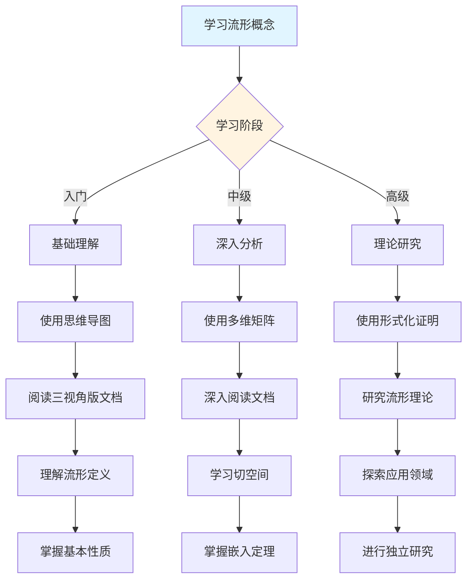
```mermaid
graph TD
    A[学习流形概念] --> B{学习阶段}
    B -->|入门| C[基础理解]
    B -->|中级| D[深入分析]
    B -->|高级| E[理论研究]

    C --> C1[使用思维导图]
    C1 --> C2[阅读三视角版文档]
    C2 --> C3[理解流形定义]
    C3 --> C4[掌握基本性质]

    D --> D1[使用多维矩阵]
    D1 --> D2[深入阅读文档]
    D2 --> D3[学习切空间]
    D3 --> D4[掌握嵌入定理]

    E --> E1[使用形式化证明]
    E1 --> E2[研究流形理论]
    E2 --> E3[探索应用领域]
    E3 --> E4[进行独立研究]

    style A fill:#e1f5ff
    style B fill:#fff4e1
```

### 1.2 学习重点决策

**基于知识矩阵的学习重点**：

| 学习阶段 | 知识层次 | 学习重点 | 推荐资源 |
|---------|---------|---------|---------|
| **入门** | L0基础 | 流形的定义、基本例子 | 思维导图、三视角版文档 |
| **入门** | L0基础 | 流形的直观理解（曲面、坐标图） | 三视角版文档、应用实例 |
| **中级** | L1中级 | 切空间和切丛 | 多维矩阵、形式化证明 |
| **中级** | L1中级 | Whitney嵌入定理 | 三视角版文档、习题库 |
| **高级** | L2高级 | 流形分类理论 | 形式化证明系统 |
| **高级** | L2高级 | 微分几何 | 形式化证明系统 |

### 1.3 学习方法决策

**基于认知维度的学习方法**：

1. **直观维度**（入门阶段）
   - 使用思维导图建立总体框架
   - 使用具体例子理解概念（球面、环面、平面）
   - 使用几何直观理解流形

2. **知性维度**（中级阶段）
   - 使用多维矩阵分析概念特征
   - 使用概念分类系统理解（光滑流形vs拓扑流形、可定向流形vs不可定向流形）
   - 使用关系分析建立联系（与拓扑空间、向量空间、微分几何的关系）

3. **理性维度**（高级阶段）
   - 使用形式化证明严格理解
   - 使用逻辑推理深入分析
   - 使用系统建构整体把握

---

## 🔬 二、研究决策导图 (编号: C.CORE.018.DECISION.02)

### 2.1 研究方向决策

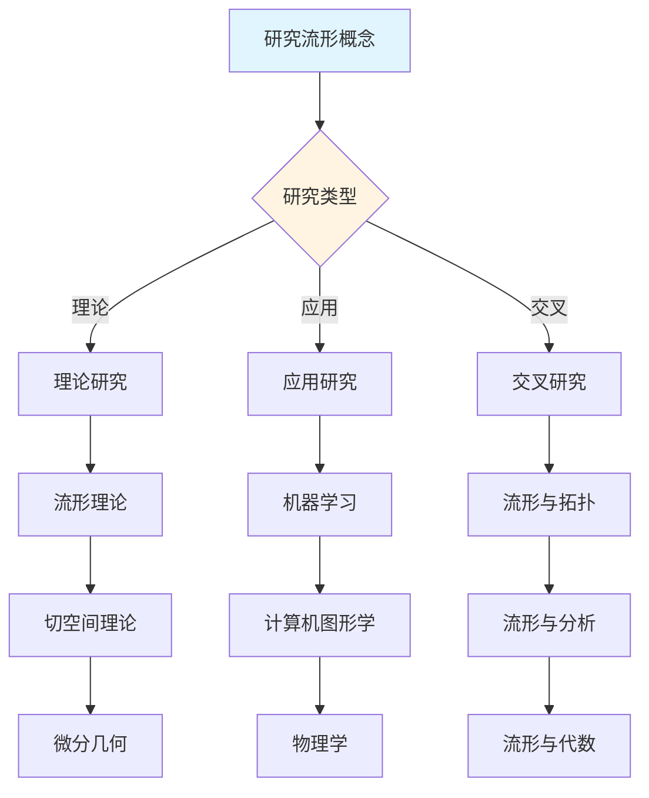
```mermaid
graph TD
    A[研究流形概念] --> B{研究类型}
    B -->|理论| C[理论研究]
    B -->|应用| D[应用研究]
    B -->|交叉| E[交叉研究]

    C --> C1[流形理论]
    C1 --> C2[切空间理论]
    C2 --> C3[微分几何]

    D --> D1[机器学习]
    D1 --> D2[计算机图形学]
    D2 --> D3[物理学]

    E --> E1[流形与拓扑]
    E1 --> E2[流形与分析]
    E2 --> E3[流形与代数]

    style A fill:#e1f5ff
    style B fill:#fff4e1
```

### 2.2 研究问题决策

**基于知识矩阵的研究问题**：

1. **理论研究问题**
   - 流形理论：流形的分类和性质
   - 切空间理论：切空间的结构和性质
   - 微分几何：流形的微分几何性质

2. **应用研究问题**
   - 机器学习：流形在机器学习中的应用（数据流形）
   - 计算机图形学：流形在计算机图形学中的应用（曲面建模）
   - 物理学：流形在物理中的应用（时空流形）

3. **交叉研究问题**
   - 流形与拓扑：流形的拓扑性质
   - 流形与分析：流形的分析性质
   - 流形与代数：流形的代数结构

### 2.3 研究方法决策

**基于形式化证明的研究方法**：

1. **构造性证明** → 流形的构造
   - 直接构造流形
   - 适用于具体流形

2. **坐标图方法** → 坐标图系统
   - 使用坐标图方法
   - 适用于流形的局部结构

3. **嵌入方法** → Whitney嵌入定理
   - 使用嵌入方法
   - 适用于流形的嵌入

---

## 💼 三、应用决策导图 (编号: C.CORE.018.DECISION.03)

### 3.1 应用场景决策

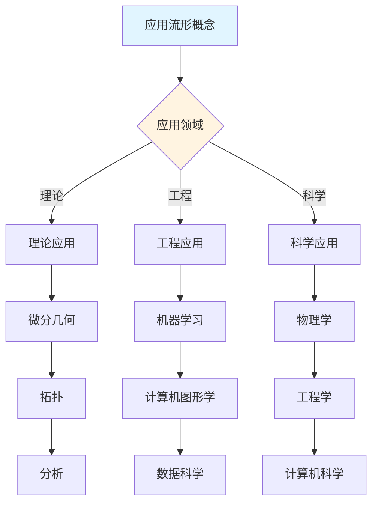
```mermaid
graph TD
    A[应用流形概念] --> B{应用领域}
    B -->|理论| C[理论应用]
    B -->|工程| D[工程应用]
    B -->|科学| E[科学应用]

    C --> C1[微分几何]
    C1 --> C2[拓扑]
    C2 --> C3[分析]

    D --> D1[机器学习]
    D1 --> D2[计算机图形学]
    D2 --> D3[数据科学]

    E --> E1[物理学]
    E1 --> E2[工程学]
    E2 --> E3[计算机科学]

    style A fill:#e1f5ff
    style B fill:#fff4e1
```

### 3.2 应用方法决策

**基于应用场景的应用方法**：

1. **理论应用** → 使用形式化证明
   - 微分几何：流形是微分几何的基础
   - 拓扑：流形的拓扑性质
   - 分析：流形的分析性质

2. **工程应用** → 使用论证过程
   - 机器学习：流形在机器学习中的应用（数据流形）
   - 计算机图形学：流形在计算机图形学中的应用（曲面建模）
   - 数据科学：流形在数据科学中的应用

3. **科学应用** → 使用综合方法
   - 物理学：流形在物理中的应用（广义相对论-时空流形）
   - 工程学：流形在工程中的应用
   - 计算机科学：流形在计算机科学中的应用

---

## 🎓 四、教学决策导图 (编号: C.CORE.018.DECISION.04)

### 4.1 教学内容决策

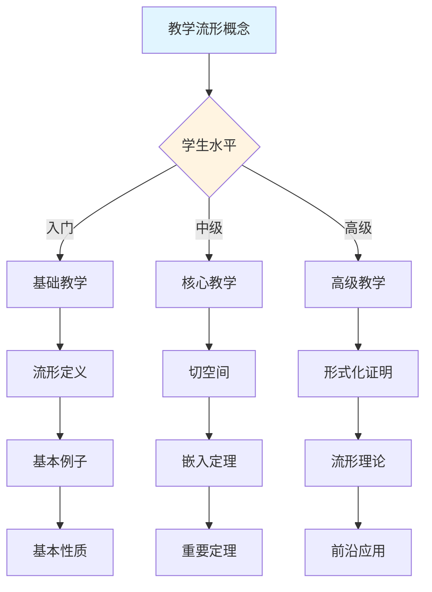
```mermaid
graph TD
    A[教学流形概念] --> B{学生水平}
    B -->|入门| C[基础教学]
    B -->|中级| D[核心教学]
    B -->|高级| E[高级教学]

    C --> C1[流形定义]
    C1 --> C2[基本例子]
    C2 --> C3[基本性质]

    D --> D1[切空间]
    D1 --> D2[嵌入定理]
    D2 --> D3[重要定理]

    E --> E1[形式化证明]
    E1 --> E2[流形理论]
    E2 --> E3[前沿应用]

    style A fill:#e1f5ff
    style B fill:#fff4e1
```

### 4.2 教学方法决策

**基于认知维度的教学方法**：

1. **直观维度**（入门教学）
   - 使用思维导图建立框架
   - 使用具体例子（球面、环面、平面）
   - 使用几何直观理解

2. **知性维度**（中级教学）
   - 使用多维矩阵深入分析
   - 使用概念分类系统
   - 使用关系分析建立联系

3. **理性维度**（高级教学）
   - 使用形式化证明严格理解
   - 使用逻辑推理深入分析
   - 使用系统建构整体把握

---

## 🔄 五、整合应用示例 (编号: C.CORE.018.DECISION.05)

### 5.1 完整学习流程示例

**阶段1：入门理解**:

1. 使用学习决策导图 → 确定学习路径：基础概念 → 流形定义 → 基本性质 → 基本应用
2. 使用总体思维导图 → 了解流形在几何学中的位置
3. 阅读[流形-三视角版](./18-流形.md) → 理解流形的定义和基本性质
4. 使用论证过程 → 理解流形的直观意义（曲面、坐标图、局部欧几里得）

**阶段2：深入分析**:

1. 使用多维矩阵 → 分析流形的多维度特征（知识层次L1中级层、知识领域D4几何、学习难度中等偏难）
2. 阅读[流形-三视角版](./18-流形.md) → 深入理解切空间和嵌入定理
3. 使用形式化证明 → 学习流形相关定理的形式化证明
4. 使用分支关联思维导图 → 了解流形与拓扑空间、向量空间、微分几何的关系

**阶段3：应用研究**:

1. 使用研究决策导图 → 确定研究方向：流形理论
2. 使用知识关联网络 → 发现流形与拓扑、分析、代数的关系
3. 使用形式化证明系统 → 构建流形理论体系
4. 阅读[流形-三视角版](./18-流形.md) → 了解流形的历史发展和开放问题

---

## 🔗 六、关联文档 (编号: C.CORE.018.DECISION.06)

### 6.1 核心概念文档

- [流形-三视角版](./18-流形.md)
- [流形](./18-流形.md)

### 6.2 框架文档

- [决策思维导图体系](../01-总体思维导图/05-决策思维导图体系.md)
- [概念体系全面梳理与推进计划](../00-概念体系全面梳理与推进计划-2025年1月.md)
- [核心概念与新框架整合指南](../00-核心概念与新框架整合指南-2025年1月.md)

### 6.3 相关文档

- [核心概念索引](./00-核心概念索引.md)
- [知识矩阵总览](../02-知识矩阵/00-知识矩阵总览.md)
- [形式化证明系统](../00-形式化证明系统-2025年11月.md)

---

**维护状态**: 持续更新中

