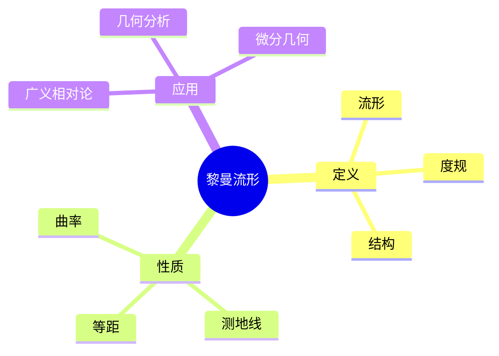
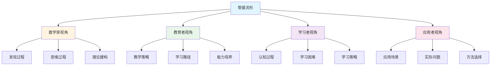
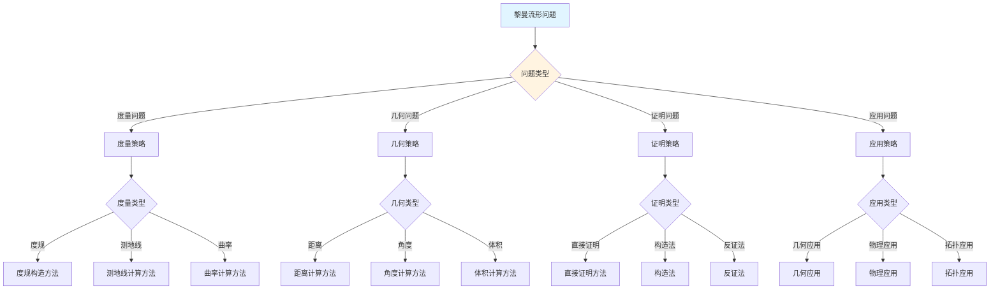
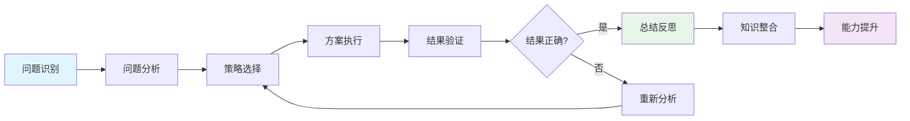
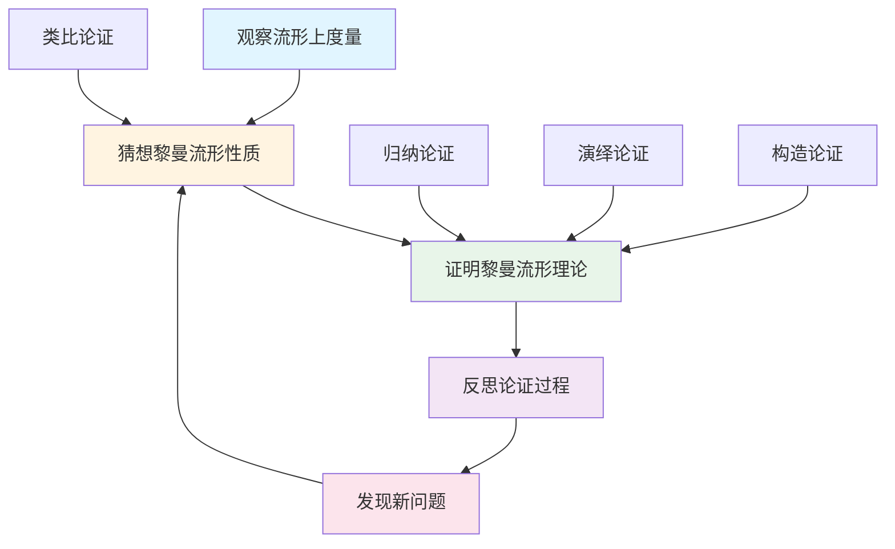
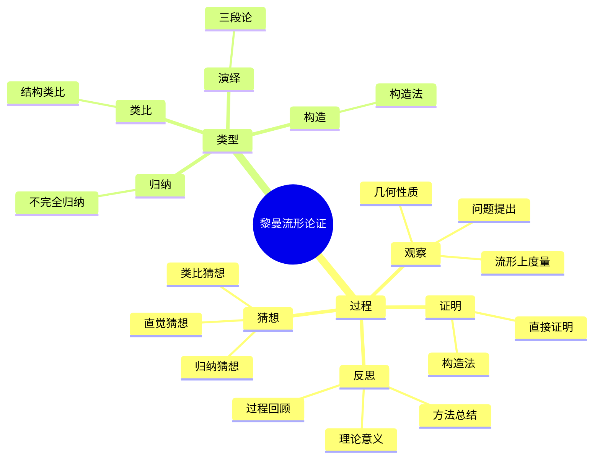

# 黎曼流形 (Riemannian Manifold) - 三视角组织版

**概念编号**: C.CORE.019
**知识层次**: L0-L2
**知识领域**: D4 (几何)
**创建日期**: 2025年1月
**最后更新**: 2025年1月

---

## 📋 目录 / Table of Contents

- [黎曼流形 (Riemannian Manifold) - 三视角组织版](#黎曼流形-riemannian-manifold---三视角组织版)
  - [📋 目录 / Table of Contents](#-目录--table-of-contents)
  - [1. 📋 概述 (编号: C.CORE.019.01)](#1--概述-编号-ccore01901)
  - [🧠 认知学视角：如何理解黎曼流形 (编号: C.CORE.019.02)](#-认知学视角如何理解黎曼流形-编号-ccore01902)
    - [认知起点 (编号: C.CORE.019.02.01)](#认知起点-编号-ccore0190201)
    - [认知过程 (编号: C.CORE.019.02.02)](#认知过程-编号-ccore0190202)
      - [阶段1：直观理解阶段 (编号: C.CORE.019.02.02.01)](#阶段1直观理解阶段-编号-ccore019020201)
      - [阶段2：概念形成阶段 (编号: C.CORE.019.02.02.02)](#阶段2概念形成阶段-编号-ccore019020202)
      - [阶段3：形式化阶段 (编号: C.CORE.019.02.02.03)](#阶段3形式化阶段-编号-ccore019020203)
    - [认知障碍 (编号: C.CORE.019.02.03)](#认知障碍-编号-ccore0190203)
    - [认知工具 (编号: C.CORE.019.02.04)](#认知工具-编号-ccore0190204)
  - [🎓 教育学视角：如何教学黎曼流形 (编号: C.CORE.019.03)](#-教育学视角如何教学黎曼流形-编号-ccore01903)
    - [教学目标 (编号: C.CORE.019.03.01)](#教学目标-编号-ccore0190301)
    - [教学路径 (编号: C.CORE.019.03.02)](#教学路径-编号-ccore0190302)
      - [阶段1：引入阶段（激发兴趣） (编号: C.CORE.019.03.02.01)](#阶段1引入阶段激发兴趣-编号-ccore019030201)
      - [阶段2：探索阶段（主动建构） (编号: C.CORE.019.03.02.02)](#阶段2探索阶段主动建构-编号-ccore019030202)
      - [阶段3：形式化阶段（抽象概括） (编号: C.CORE.019.03.02.03)](#阶段3形式化阶段抽象概括-编号-ccore019030203)
      - [阶段4：巩固阶段（应用深化） (编号: C.CORE.019.03.02.04)](#阶段4巩固阶段应用深化-编号-ccore019030204)
    - [教学难点 (编号: C.CORE.019.03.03)](#教学难点-编号-ccore0190303)
    - [教学策略 (编号: C.CORE.019.03.04)](#教学策略-编号-ccore0190304)
    - [评估方法 (编号: C.CORE.019.03.05)](#评估方法-编号-ccore0190305)
  - [🔬 数学家视角：如何思考黎曼流形 (编号: C.CORE.019.04)](#-数学家视角如何思考黎曼流形-编号-ccore01904)
    - [问题起源 (编号: C.CORE.019.04.01)](#问题起源-编号-ccore0190401)
    - [思维过程 (编号: C.CORE.019.04.02)](#思维过程-编号-ccore0190402)
      - [步骤1：问题提出 (编号: C.CORE.019.04.02.01)](#步骤1问题提出-编号-ccore019040201)
      - [步骤2：概念形成 (编号: C.CORE.019.04.02.02)](#步骤2概念形成-编号-ccore019040202)
      - [步骤3：理论发展 (编号: C.CORE.019.04.02.03)](#步骤3理论发展-编号-ccore019040203)
    - [历史发展 (编号: C.CORE.019.04.03)](#历史发展-编号-ccore0190403)
    - [3.2 关键人物和贡献 (编号: C.CORE.019.04.04)](#32-关键人物和贡献-编号-ccore0190404)
    - [重要定理 (编号: C.CORE.019.04.05)](#重要定理-编号-ccore0190405)
    - [开放问题 (编号: C.CORE.019.04.06)](#开放问题-编号-ccore0190406)
    - [一、第一人称思维描述 (编号: C.CORE.019.04.07)](#一第一人称思维描述-编号-ccore0190407)
      - [1.1 Riemann的发现过程](#11-riemann的发现过程)
    - [二、数学直觉的形成 (编号: C.CORE.019.04.08)](#二数学直觉的形成-编号-ccore0190408)
      - [2.1 直觉在概念发现中的作用](#21-直觉在概念发现中的作用)
      - [2.2 如何培养黎曼流形直觉](#22-如何培养黎曼流形直觉)
    - [三、数学美的教育价值 (编号: C.CORE.019.04.09)](#三数学美的教育价值-编号-ccore0190409)
      - [3.1 黎曼流形论的美在哪里](#31-黎曼流形论的美在哪里)
      - [3.2 如何培养学生的数学美感](#32-如何培养学生的数学美感)
    - [四、问题解决策略 (编号: C.CORE.019.04.10)](#四问题解决策略-编号-ccore0190410)
      - [4.1 数学家的启发式方法](#41-数学家的启发式方法)
      - [4.2 思维过程分析](#42-思维过程分析)
    - [五、批判性反思 (编号: C.CORE.019.04.11)](#五批判性反思-编号-ccore0190411)
      - [5.1 黎曼流形概念的局限性](#51-黎曼流形概念的局限性)
      - [5.2 黎曼流形理论的未解决问题](#52-黎曼流形理论的未解决问题)
  - [💡 数学解释：为什么黎曼流形是这样定义的 (编号: C.CORE.019.05)](#-数学解释为什么黎曼流形是这样定义的-编号-ccore01905)
    - [一、直观解释：黎曼流形是什么？](#一直观解释黎曼流形是什么)
      - [1.1 具体例子](#11-具体例子)
      - [1.2 形象类比](#12-形象类比)
      - [1.3 几何直观](#13-几何直观)
      - [1.4 操作体验](#14-操作体验)
    - [二、知性解释：黎曼流形的本质是什么？](#二知性解释黎曼流形的本质是什么)
      - [2.1 概念定义](#21-概念定义)
      - [2.2 分类体系](#22-分类体系)
      - [2.3 抽象结构](#23-抽象结构)
      - [2.4 知识体系](#24-知识体系)
    - [三、理性解释：黎曼流形的公理化定义](#三理性解释黎曼流形的公理化定义)
      - [3.1 公理体系](#31-公理体系)
      - [3.2 形式化证明](#32-形式化证明)
      - [3.3 系统建构](#33-系统建构)
    - [四、多视角解释：从不同角度理解黎曼流形](#四多视角解释从不同角度理解黎曼流形)
      - [4.1 数学家视角：黎曼流形是如何被发现的？](#41-数学家视角黎曼流形是如何被发现的)
      - [4.2 教育者视角：如何教学黎曼流形？](#42-教育者视角如何教学黎曼流形)
      - [4.3 学习者视角：如何学习黎曼流形？](#43-学习者视角如何学习黎曼流形)
      - [4.4 应用者视角：如何应用黎曼流形？](#44-应用者视角如何应用黎曼流形)
    - [五、思维表征：用多种方式理解黎曼流形](#五思维表征用多种方式理解黎曼流形)
      - [5.1 思维导图：黎曼流形的知识结构](#51-思维导图黎曼流形的知识结构)
      - [5.2 矩阵对比：不同解释方式的对比](#52-矩阵对比不同解释方式的对比)
      - [5.3 多视角表征：从不同角度表征黎曼流形](#53-多视角表征从不同角度表征黎曼流形)
      - [5.4 决策树：黎曼流形问题分类和策略选择](#54-决策树黎曼流形问题分类和策略选择)
      - [5.5 决策逻辑路径：黎曼流形问题解决过程](#55-决策逻辑路径黎曼流形问题解决过程)
      - [5.6 多维对比矩阵：黎曼流形概念特征对比](#56-多维对比矩阵黎曼流形概念特征对比)
  - [🔍 数学论证：如何论证黎曼流形 (编号: C.CORE.019.06)](#-数学论证如何论证黎曼流形-编号-ccore01906)
    - [一、论证过程：从观察到反思](#一论证过程从观察到反思)
      - [1.1 观察（Observation）](#11-观察observation)
      - [1.2 猜想（Conjecture）](#12-猜想conjecture)
      - [1.3 证明（Proof）](#13-证明proof)
      - [1.4 反思（Reflection）](#14-反思reflection)
    - [二、论证类型：多种推理方式](#二论证类型多种推理方式)
      - [2.1 归纳论证（Inductive Reasoning）](#21-归纳论证inductive-reasoning)
      - [2.2 演绎论证（Deductive Reasoning）](#22-演绎论证deductive-reasoning)
      - [2.3 类比论证（Analogical Reasoning）](#23-类比论证analogical-reasoning)
      - [2.4 构造论证（Constructive Reasoning）](#24-构造论证constructive-reasoning)
    - [三、论证可视化：用图形表示论证过程](#三论证可视化用图形表示论证过程)
      - [3.1 论证流程图](#31-论证流程图)
      - [3.2 论证类型对比](#32-论证类型对比)
      - [3.3 论证思维导图](#33-论证思维导图)
  - [🔗 三视角整合 (编号: C.CORE.019.07)](#-三视角整合-编号-ccore01907)
    - [三个视角的关联](#三个视角的关联)
    - [如何综合运用三个视角](#如何综合运用三个视角)
  - [📚 参考文献 (编号: C.CORE.019.08)](#-参考文献-编号-ccore01908)
    - [权威资源](#权威资源)
    - [经典教材](#经典教材)
    - [研究论文](#研究论文)


---

## 1. 📋 概述 (编号: C.CORE.019.01)

黎曼流形是配备度规的微分流形，可以定义长度、角度、体积和曲率。黎曼流形是微分几何的核心，在广义相对论、几何分析等领域有重要应用。

本文档从**数学认知学**、**教育学**、**数学家**三个视角深入展开黎曼流形概念，避免简单的概念堆垒。

**权威资源对齐**:

- Wikipedia: [Riemannian Manifold](https://en.wikipedia.org/wiki/Riemannian_manifold)
- Stanford课程: Math 215A (Differential Topology)
- Princeton课程: MAT 520 (Differential Geometry)
- MIT课程: 18.965 (Geometry of Manifolds)
- Metamath: [Riemannian Geometry](http://us.metamath.org/mpeuni/df-riemann.html)

---

## 🧠 认知学视角：如何理解黎曼流形 (编号: C.CORE.019.02)

### 认知起点 (编号: C.CORE.019.02.01)

**学习者已有的知识基础**:

- 流形的概念
- 内积的概念
- 日常经验中的"距离"、"角度"概念

**日常经验中的类似概念**:

- "距离"：两点之间的距离
- "角度"：两条线之间的角度
- "面积"：区域的面积

### 认知过程 (编号: C.CORE.019.02.02)

#### 阶段1：直观理解阶段 (编号: C.CORE.019.02.02.01)

**具体例子**:

- 例子1：欧几里得空间$\mathbb{R}^n$（配备标准度规）
- 例子2：球面$S^2$（配备诱导度规）
- 例子3：环面$T^2$（配备平坦度规）

**形象类比**:

- **度量类比**: 黎曼流形就像"可以测量距离和角度的流形"
  - 度规定义内积
  - 内积定义长度和角度
  - 可以测量几何量

- **结构类比**: 黎曼流形就像"配备度规的流形"
  - 流形提供拓扑结构
  - 度规提供几何结构
  - 两者结合形成黎曼流形

**可视化表示**:

```text
黎曼流形:
    M (流形)
         ↓
    g (度规)
         ↓
    长度、角度、曲率
```

#### 阶段2：概念形成阶段 (编号: C.CORE.019.02.02.02)

**从例子中抽象出共同特征**:

- 所有例子都涉及"度规"
- 度规定义内积
- 内积定义长度和角度

**识别关键属性**:

1. **对称性**: $g_p(X, Y) = g_p(Y, X)$
2. **正定性**: $g_p(X, X) \\geq 0$，等号当且仅当$X = 0$
3. **光滑性**: $g$是光滑的

**建立概念边界**:

- **什么是黎曼流形**: 配备黎曼度规的光滑流形
- **什么不是黎曼流形**:
  - 没有度规的流形（不是黎曼流形）

#### 阶段3：形式化阶段 (编号: C.CORE.019.02.02.03)

**严格定义**:

- 黎曼度规：满足对称性、正定性、光滑性的$(0,2)$型张量场
- 黎曼流形：配备黎曼度规的光滑流形

**公理化表述**:

- 条件1：对称性
- 条件2：正定性
- 条件3：光滑性

**逻辑结构**:

- 黎曼流形是微分几何的核心
- 黎曼流形可以定义长度、角度、曲率
- 黎曼流形是物理学的基础

### 认知障碍 (编号: C.CORE.019.02.03)

**常见误解**:

1. **误解1**: 认为所有流形都是黎曼流形
   - **纠正**: 不是所有流形都是黎曼流形，需要配备度规

2. **误解2**: 认为度规就是距离
   - **纠正**: 度规定义内积，内积定义距离

3. **误解3**: 混淆黎曼流形和伪黎曼流形
   - **纠正**: 黎曼流形度规正定，伪黎曼流形度规不定

**理解难点**:

1. **难点1**: 度规的抽象性
   - **原因**: 度规比较抽象
   - **解决方法**: 从具体例子开始，逐步抽象

2. **难点2**: 张量场的概念
   - **原因**: 张量场比较抽象
   - **解决方法**: 用具体例子，强调张量场的作用

3. **难点3**: 度规的计算
   - **原因**: 度规计算比较复杂
   - **解决方法**: 用具体例子，逐步掌握计算方法

**认知陷阱**:

- **度规**: 需要理解度规的作用
- **内积**: 需要理解内积的定义

### 认知工具 (编号: C.CORE.019.02.04)

**类比工具**:

- **度量类比**: 黎曼流形 = 可以测量距离和角度的流形
- **结构类比**: 黎曼流形 = 配备度规的流形

**可视化工具**:

- **度规图**: 用度规图表示黎曼流形
- **几何图**: 用几何图表示长度和角度

**具体化工具**:

- **具体例子**: 用具体例子理解抽象概念
- **反例**: 用反例理解概念边界

---

## 🎓 教育学视角：如何教学黎曼流形 (编号: C.CORE.019.03)

### 教学目标 (编号: C.CORE.019.03.01)

**知识目标**:

- 理解黎曼流形的基本概念
- 掌握度规的定义
- 理解黎曼流形的性质
- 理解黎曼流形的应用

**能力目标**:

- 能够计算度规
- 能够理解黎曼流形的性质
- 能够应用黎曼流形解决实际问题
- 能够理解黎曼流形的重要性

**情感目标**:

- 培养数学抽象思维
- 培养几何思维
- 激发对数学的兴趣

### 教学路径 (编号: C.CORE.019.03.02)

#### 阶段1：引入阶段（激发兴趣） (编号: C.CORE.019.03.02.01)

**实际问题**:

- 问题1：如何在流形上测量距离？
- 问题2：如何研究几何结构？
- 问题3：如何研究物理空间？

**历史背景**:

- 黎曼流形的历史发展
- 黎曼流形在数学中的地位
- 黎曼流形在物理中的应用

**引发认知冲突**:

- 问题：如何统一描述各种几何空间？
- 引出黎曼流形的概念

#### 阶段2：探索阶段（主动建构） (编号: C.CORE.019.03.02.02)

**引导发现**:

1. 让学生自己列举"可以测量距离"的例子
2. 让学生观察这些例子的共同特征
3. 引导学生抽象出黎曼流形的定义

**合作探究**:

- 小组讨论：什么是黎曼流形？
- 小组讨论：黎曼流形有哪些性质？
- 小组讨论：如何表示黎曼流形？

**多元表征**:

- **语言表征**: "黎曼流形是配备度规的光滑流形"
- **符号表征**: $(M, g)$
- **图形表征**: 度规图、几何图
- **集合表征**: 度规定义

#### 阶段3：形式化阶段（抽象概括） (编号: C.CORE.019.03.02.03)

**严格定义**:

- 度规的定义
- 黎曼流形的定义
- 黎曼流形的性质

**性质证明**:

- 度规的基本性质
- 黎曼流形的几何性质
- 曲率的定义

**应用拓展**:

- 黎曼流形在微分几何中的应用
- 黎曼流形在物理中的应用
- 黎曼流形在工程中的应用

#### 阶段4：巩固阶段（应用深化） (编号: C.CORE.019.03.02.04)

**练习应用**:

- 基础练习：度规的计算和性质
- 应用练习：用黎曼流形解决实际问题
- 综合练习：黎曼流形的综合应用

**变式训练**:

- 不同形式的度规
- 不同性质的黎曼流形
- 黎曼流形的应用

**知识整合**:

- 黎曼流形与其他概念的联系
- 黎曼流形在数学体系中的地位

### 教学难点 (编号: C.CORE.019.03.03)

**难点1：度规的抽象性**:

- **难点描述**: 学生难以理解度规
- **解决方法**:
  - 从具体例子开始
  - 逐步抽象
  - 用具体例子说明

**难点2：张量场的概念**:

- **难点描述**: 学生难以理解张量场
- **解决方法**:
  - 用具体例子
  - 强调张量场的作用
  - 用图形可视化

**难点3：度规的计算**:

- **难点描述**: 学生难以计算度规
- **解决方法**:
  - 用具体例子
  - 逐步掌握计算方法
  - 用练习巩固

### 教学策略 (编号: C.CORE.019.03.04)

**策略1：从具体到抽象**:

- 先给出具体例子
- 再抽象出一般概念
- 最后给出严格定义

**策略2：多元表征**:

- 用语言、符号、图形等多种方式表示同一概念
- 帮助学生建立不同表征之间的联系

**策略3：问题驱动**:

- 从实际问题出发
- 引出数学概念
- 解决问题

**策略4：可视化教学**:

- 使用度规图
- 使用几何图
- 使用具体例子

### 评估方法 (编号: C.CORE.019.03.05)

**形成性评估**（评估理解过程）:

- 课堂提问：检查学生对概念的理解
- 小组讨论：观察学生的思考过程
- 练习作业：检查学生的应用能力

**总结性评估**（评估最终理解）:

- 测验：检查学生对概念和计算的掌握
- 项目：检查学生应用黎曼流形解决实际问题的能力
- 反思：检查学生对黎曼流形概念的理解深度

---

## 🔬 数学家视角：如何思考黎曼流形 (编号: C.CORE.019.04)

### 问题起源 (编号: C.CORE.019.04.01)

**历史背景**:

- 19世纪：黎曼流形的起源
- 20世纪：黎曼流形的发展
- 20世纪中期：黎曼流形的现代发展

**原始问题**:

- **问题1**: 如何在流形上测量距离？
- **问题2**: 如何研究几何结构？
- **问题3**: 黎曼流形有哪些性质？

**研究动机**:

- 统一几何理论
- 发展微分几何
- 研究物理空间

### 思维过程 (编号: C.CORE.019.04.02)

#### 步骤1：问题提出 (编号: C.CORE.019.04.02.01)

**观察到的现象**:

- 需要在流形上测量距离
- 需要研究几何结构
- 需要统一几何理论

**提出的猜想**:

- 可以引入度规概念
- 度规可以定义距离和角度
- 黎曼流形有丰富的性质

**需要解决的问题**:

- 如何定义度规？
- 度规应该满足什么条件？
- 黎曼流形有哪些性质？

#### 步骤2：概念形成 (编号: C.CORE.019.04.02.02)

**尝试性定义**:

- **度规定义**: 通过对称性、正定性、光滑性
- **黎曼流形定义**: 配备度规的光滑流形

**性质探索**:

- 度规的基本性质
- 黎曼流形的几何性质
- 曲率的定义

**结构发现**:

- 黎曼流形是微分几何的核心
- 黎曼流形可以定义长度、角度、曲率
- 黎曼流形是物理学的基础

#### 步骤3：理论发展 (编号: C.CORE.019.04.02.03)

**定理证明**:

- 度规的基本性质
- 黎曼流形的几何性质
- 曲率的性质

**应用拓展**:

- 黎曼流形在微分几何中的应用
- 黎曼流形在物理中的应用
- 黎曼流形在工程中的应用

**理论完善**:

- 度规的严格定义
- 黎曼流形的范畴论研究
- 黎曼流形的应用研究

### 历史发展 (编号: C.CORE.019.04.03)

**早期阶段**（19世纪）:

- **Riemann (1854)**: 引入黎曼几何
- **Gauss (1827)**: 研究曲面理论

**关键突破**（20世纪）:

- **Levi-Civita (1917)**: 发展平行移动理论
- **Cartan (1923)**: 发展活动标架法

**现代发展**（20世纪中期）:

- **Chern (1944)**: 发展Chern类理论
- **Yau (1978)**: 证明Calabi猜想

### 3.2 关键人物和贡献 (编号: C.CORE.019.04.04)

**Bernhard Riemann (1826-1866)**:

- 引入黎曼几何
- 建立微分几何基础

**Tullio Levi-Civita (1873-1941)**:

- 发展平行移动理论
- 建立现代黎曼几何

**Shing-Shen Chern (1911-2004)**:

- 发展Chern类理论
- 建立现代微分几何

### 重要定理 (编号: C.CORE.019.04.05)

**Gauss-Bonnet定理**:

- 曲面的Gauss曲率积分等于Euler特征数
- 意义：连接几何和拓扑

**Hopf-Rinow定理**:

- 完备黎曼流形的等价条件
- 意义：完备性的刻画

**Myers定理**:

- 正Ricci曲率流形的直径估计
- 意义：曲率对几何的影响

### 开放问题 (编号: C.CORE.019.04.06)

**未解决问题**:

- 黎曼流形的分类问题
- 黎曼流形的表示问题
- 黎曼流形的应用问题

**研究方向**:

- 黎曼流形的范畴论研究
- 黎曼流形的几何研究
- 黎曼流形的应用研究

### 一、第一人称思维描述 (编号: C.CORE.019.04.07)

#### 1.1 Riemann的发现过程

**详细历史背景**:

- **1854年**：Riemann发表《关于几何基础的假设》（Über die Hypothesen, welche der Geometrie zu Grunde liegen）
- **背景**：研究弯曲空间，发现需要在流形上定义距离
- **问题**：如何定义流形上的距离？如何研究弯曲空间的几何？

**Riemann的详细第一人称描述**:
> "1854年，我在研究弯曲空间时，遇到了一个问题：如何在流形上定义距离？
>
> 我发现，在$\mathbb{R}^n$中，距离可以通过内积定义：$d(x,y) = \sqrt{\langle x-y, x-y \rangle}$。但在流形上，每一点的切空间不同，需要定义每一点的内积。
>
> 我的方法是这样的：
>
> - **思路**：在流形上每一点的切空间定义内积（度规）
> - **定义**：度规$g$是流形上每一点切空间的正定对称双线性形式
> - **距离**：流形上两点之间的距离是连接它们的曲线长度的下确界
>
> 例如，对于球面$S^2$：
>
> - **度规**：在每一点$(x,y,z)$，切空间的内积是$\mathbb{R}^3$的标准内积
> - **距离**：两点之间的最短距离是大圆弧的长度
> - **曲率**：球面的Gauss曲率是$\frac{1}{R^2}$，其中$R$是半径
>
> 对于双曲面（负曲率）：
>
> - **度规**：双曲面的度规与球面不同
> - **距离**：两点之间的最短距离是双曲直线
> - **曲率**：双曲面的Gauss曲率是负的
>
> 这让我意识到，度规是定义流形上距离的工具，度规的性质决定了流形的几何。这为黎曼几何提供了基础。"

**详细的思维过程**:

1. **观察到的现象**（1854年）:

   **现象1：流形上需要定义距离**
   - **问题**：如何在流形上定义距离？
   - **例子**：球面上两点之间的距离
   - **需要**：统一的方法

   **现象2：距离可以通过度规定义**
   - **问题**：如何定义度规？
   - **思路**：在每一点的切空间定义内积
   - **需要**：建立度规理论

   **现象3：需要统一的概念**
   - **问题**：如何统一处理不同的流形？
   - **思路**：用度规统一
   - **需要**：建立黎曼几何理论

2. **提出的猜想**（1854年）:

   **猜想1：用度规定义流形上的距离**
   - **思路**：在流形上每一点的切空间定义内积（度规）
   - **例子**：球面的度规
   - **优点**：统一定义流形上的距离

   **猜想2：度规与几何相关**
   - **关系**：度规的性质决定了流形的几何
   - **例子**：正曲率、负曲率、零曲率
   - **意义**：用度规研究几何

   **猜想3：黎曼流形是几何学的基础**
   - **性质**：黎曼流形是抽象的几何结构
   - **应用**：黎曼流形可以应用到更广泛的领域
   - **意义**：黎曼流形是统一的几何结构

3. **遇到的困难**（1854年）:

   **困难1：如何严格定义度规？**
   - **问题**：如何定义度规？
   - **解决**：定义度规为流形上每一点切空间的正定对称双线性形式
   - **意义**：为度规提供严格的数学基础

   **困难2：如何判断度规的性质？**
   - **问题**：如何判断流形的曲率？
   - **解决**：通过度规计算曲率张量
   - **意义**：为流形分类提供方法

   **困难3：如何应用黎曼流形理论？**
   - **问题**：如何用黎曼流形理论解决实际问题？
   - **解决**：建立测地线理论、曲率理论
   - **意义**：为黎曼流形提供应用基础

4. **突破的时刻**（1854年，Riemann）:

   **突破1：度规的概念**
   - 引入度规的概念定义流形上的距离
   - **关键**：在每一点的切空间定义内积
   - **意义**：为黎曼几何提供基础

   **突破2：曲率理论**
   - 建立曲率理论
   - **关键**：度规的性质决定了曲率
   - **意义**：为黎曼几何提供基础

   **突破3：黎曼几何的广泛应用**
   - 黎曼几何可以应用到更广泛的领域
   - **关键**：黎曼流形是抽象的几何结构
   - **意义**：黎曼几何成为几何学的基础

### 二、数学直觉的形成 (编号: C.CORE.019.04.08)

#### 2.1 直觉在概念发现中的作用

**Riemann的直觉**:

- **直觉1**: "度规"是"距离的定义"——这个直觉引导Riemann发现黎曼流形
- **直觉2**: 度规可以研究弯曲空间——这个直觉引导Riemann建立黎曼几何
- **直觉3**: 黎曼流形是几何学的基础——这个直觉引导Riemann建立黎曼流形理论

**直觉的验证**:

- 通过严格的数学证明验证直觉的正确性
- 通过度规严格化黎曼流形定义
- 通过应用验证黎曼流形的广泛性

**直觉的深化**:

- 从"距离的定义"到"黎曼流形的严格定义"
- 从"研究弯曲空间"到"黎曼几何的广泛应用"
- 从"几何学基础"到"黎曼流形的深入发展"

#### 2.2 如何培养黎曼流形直觉

**数学家的建议**:

- **Riemann**: "黎曼流形直觉是长期训练的结果。通过大量练习和深入思考，我们可以培养对黎曼流形的直觉。"
- **Einstein**: "从具体例子开始，逐步抽象，这是培养黎曼流形直觉的有效方法。"

**培养方法**:

1. **大量练习**: 通过大量黎曼流形构造练习，培养对黎曼流形的直觉
2. **深入思考**: 深入思考黎曼流形的本质，理解黎曼流形的深层结构
3. **类比和联想**: 通过类比和联想，建立黎曼流形与其他概念的联系
4. **与专家交流**: 与数学家交流，学习他们的思维方式

**教学启示**:

- 从具体例子开始，逐步抽象
- 鼓励学生思考黎曼流形的本质
- 引导学生建立黎曼流形与其他概念的联系

### 三、数学美的教育价值 (编号: C.CORE.019.04.09)

#### 3.1 黎曼流形论的美在哪里

**结构美**:

- **简洁性**: 黎曼流形的概念非常简洁——"具有度规的流形"
- **统一性**: 黎曼流形可以统一描述数学中的各种弯曲空间
- **和谐性**: 黎曼流形运算满足优美的规律（测地线、曲率等）

**数学家的评价**:

- **Riemann**: "黎曼流形论的美在于它的统一性。它为我们提供了一个统一的框架来理解弯曲空间。"
- **Einstein**: "黎曼流形论的美在于它的基础性。它是几何学的基础，所有弯曲空间都可以用黎曼流形来描述。"

#### 3.2 如何培养学生的数学美感

**数学家的建议**:

- **Riemann**: "展示黎曼流形论的美感，让学生感受到数学的美。"
- **Einstein**: "通过黎曼流形论的历史和发展，让学生理解数学的美。"

**教学方法**:

1. **展示数学美**:
   - 展示黎曼流形概念的简洁性和统一性
   - 展示黎曼流形运算的优美规律
   - 展示黎曼流形在数学中的基础地位

2. **引导学生欣赏**:
   - 引导学生欣赏黎曼流形概念的简洁性
   - 引导学生欣赏黎曼流形运算的和谐性
   - 引导学生欣赏黎曼流形的基础性

3. **鼓励学生创造美**:
   - 鼓励学生发现黎曼流形论的美
   - 鼓励学生创造优美的黎曼流形证明
   - 鼓励学生探索黎曼流形论的美

### 四、问题解决策略 (编号: C.CORE.019.04.10)

#### 4.1 数学家的启发式方法

**策略1：从具体到抽象**:

- 从具体的黎曼流形例子开始
- 抽象出黎曼流形的一般性质
- 建立黎曼流形的理论体系

**策略2：从简单到复杂**:

- 先理解基本黎曼流形
- 再理解黎曼流形运算
- 最后理解黎曼流形理论

**策略3：从问题到理论**:

- 从实际问题出发
- 引出黎曼流形概念
- 建立黎曼流形理论

#### 4.2 思维过程分析

**问题识别**:

- 识别问题类型：黎曼流形定义问题、黎曼流形性质问题、黎曼流形应用问题
- 识别问题难度：简单问题、中等问题、复杂问题

**策略选择**:

- 简单问题：直接方法
- 中等问题：分步方法
- 复杂问题：分解方法

**执行和反思**:

- 执行策略，解决问题
- 反思过程，总结经验
- 改进方法，提高效率

### 五、批判性反思 (编号: C.CORE.019.04.11)

#### 5.1 黎曼流形概念的局限性

**概念的边界**:

- 黎曼流形只描述具有度规的流形，不能描述所有流形
- 黎曼流形是抽象的，需要具体化才能应用
- 黎曼流形不能表示所有数学结构

**概念的推广**:

- 伪黎曼流形：更一般的度规
- Finsler流形：更一般的距离
- 复流形：复几何中的流形

#### 5.2 黎曼流形理论的未解决问题

**未解决的问题**:

- 黎曼流形的分类问题：如何分类所有黎曼流形？
- 黎曼流形的表示问题：如何表示黎曼流形？
- 黎曼流形的应用问题：如何更好地应用黎曼流形？

**研究方向**:

- 黎曼流形的范畴论研究
- 黎曼流形的几何研究
- 黎曼流形的应用研究

---

## 💡 数学解释：为什么黎曼流形是这样定义的 (编号: C.CORE.019.05)

### 一、直观解释：黎曼流形是什么？

#### 1.1 具体例子

**生活中的例子**：

- **地球表面**：地球表面是黎曼流形
  - 例如：地球表面有距离和角度（度规）
  - **为什么这样定义**：因为我们需要一个概念来表示"有度规的流形"
- **弯曲空间**：弯曲的空间可以用黎曼流形描述
  - 例如：广义相对论中的时空是黎曼流形
  - **为什么这样定义**：因为我们需要一个概念来表示"弯曲的几何空间"
- **曲面**：曲面是2维黎曼流形
  - 例如：球面、环面都有度规
  - **为什么这样定义**：因为我们需要一个概念来表示"有度规的曲面"

**数学中的例子**：

- **欧几里得空间**：$\mathbb{R}^n$配备标准度规是黎曼流形
  - **为什么这样定义**：我们需要一个简单的方式来表示"有度规的流形"
- **球面**：$S^2$配备诱导度规是黎曼流形
  - **为什么这样定义**：我们需要一个概念来表示"有度规的球面"
- **双曲平面**：双曲平面配备双曲度规是黎曼流形
  - **为什么这样定义**：我们需要一个概念来表示"有度规的双曲平面"

#### 1.2 形象类比

**地图类比**：

- **黎曼流形就像"有距离的地图"**
  - 地图有地点（流形）
  - 地图有距离（度规）
- **为什么这样类比**：这个类比帮助我们理解黎曼流形的"度规"性质

**弯曲表面类比**：

- **黎曼流形就像"弯曲的表面"**
  - 表面可以弯曲（曲率）
  - 表面有距离和角度（度规）
- **为什么这样类比**：这个类比帮助我们理解黎曼流形的"弯曲"性质

#### 1.3 几何直观

**度规张量表示**：

- 使用度规张量表示黎曼流形
- 例如：$g_{ij}$是度规张量的分量
- **为什么使用度规张量**：度规张量提供几何直观，帮助我们理解黎曼流形

**测地线表示**：

- 使用测地线表示黎曼流形
- 例如：测地线是黎曼流形上的"直线"
- **为什么使用测地线**：测地线提供几何直观，帮助我们理解黎曼流形的几何

#### 1.4 操作体验

**黎曼流形运算的操作**：

- **度规的计算**：$ds^2 = g_{ij} dx^i dx^j$
  - **为什么这样操作**：因为我们需要一个运算来表示"度规"
- **曲率的计算**：使用Riemann曲率张量
  - **为什么这样操作**：因为我们需要一个运算来表示"曲率"
- **测地线的计算**：使用测地线方程
  - **为什么这样操作**：因为我们需要一个工具来计算测地线

### 二、知性解释：黎曼流形的本质是什么？

#### 2.1 概念定义

**黎曼流形的内涵**：

- **黎曼流形是配备度规的微分流形**
  - **流形**：局部欧几里得的拓扑空间
  - **度规**：$g$是流形上的对称正定双线性形式
  - **结构**：$(M, g)$是黎曼流形
- **为什么这样定义**：这些特征使得黎曼流形成为一个完整的几何工具，支持所有几何研究

**黎曼流形的外延**：

- **紧致黎曼流形**：紧致的黎曼流形
- **完备黎曼流形**：测地线完备的黎曼流形
- **为什么这样分类**：不同的黎曼流形类型有不同的性质和用途

#### 2.2 分类体系

**按曲率分类**：

- **正曲率流形**：曲率处处为正
- **负曲率流形**：曲率处处为负
- **零曲率流形**：曲率处处为零（平坦）
- **为什么这样分类**：曲率是黎曼流形的基本特征

**按维数分类**：

- **2维黎曼流形**：曲面
- **3维黎曼流形**：3维空间
- **高维黎曼流形**：高维空间
- **为什么这样分类**：维数是黎曼流形的重要特征

#### 2.3 抽象结构

**黎曼流形的运算结构**：

- **度规的运算**：度规张量的运算
- **曲率的运算**：Riemann曲率张量的运算
- **为什么有这些运算**：这些运算使得黎曼流形具有几何结构

**黎曼流形的关系结构**：

- **等距**：两个黎曼流形如果度规相同，则等距
- **共形**：两个黎曼流形如果度规成比例，则共形
- **为什么有这个关系**：这个关系帮助我们研究黎曼流形的结构

#### 2.4 知识体系

**黎曼流形在数学体系中的位置**：

- **基础地位**：黎曼流形是微分几何的基础
  - 黎曼流形可以定义长度、角度、体积
  - 黎曼流形可以定义曲率
- **为什么是基础**：黎曼流形提供了统一的框架来研究几何

**黎曼流形与其他概念的关系**：

- **黎曼流形与流形**：黎曼流形是配备度规的流形
- **黎曼流形与曲率**：黎曼流形可以定义曲率
- **黎曼流形与物理**：黎曼流形在广义相对论中有重要应用
- **为什么有这些关系**：这些关系揭示了黎曼流形与其他数学概念的内在联系

### 三、理性解释：黎曼流形的公理化定义

#### 3.1 公理体系

**黎曼流形的定义**：

- **定义**：$(M, g)$是黎曼流形，其中$M$是微分流形，$g$是度规张量
- **为什么需要这个定义**：这个定义提供了黎曼流形的严格数学基础

**度规的公理**：

- **对称性**：$g(X, Y) = g(Y, X)$
- **正定性**：$g(X, X) \\geq 0$，等号当且仅当$X = 0$
- **双线性**：$g$是双线性的
- **为什么这样定义**：这些公理将黎曼流形放在更一般的框架中

#### 3.2 形式化证明

**黎曼流形性质的证明**：

##### 定理1：黎曼度量的存在性

**定理陈述**：每个流形上都存在黎曼度量。

**形式化表述**：
$$\forall M \text{流形}, \exists g: TM \times_M TM \to \mathbb{R}, \text{使得}(M, g)\text{是黎曼流形}$$

**证明**：
1. **局部度量构造**：对每个坐标卡$(U_i, \phi_i)$，在$U_i$上定义度量$g_i = \sum_{j,k} \delta_{jk} dx^j \otimes dx^k$
2. **全局度量构造**：使用单位分解$\{\rho_i\}$，构造全局度量$g = \sum_i \rho_i \cdot g_i$
3. **验证度量性质**：对称性、双线性、正定性

**为什么这样证明**：利用单位分解将局部度量"粘合"成全局度量。

---

##### 定理2：测地线的存在性和唯一性

**定理陈述**：在黎曼流形上，给定点和方向，存在唯一的测地线。

**形式化表述**：
$$\forall (M, g) \text{黎曼流形}, \forall p \in M, \forall v \in T_pM, \exists! \gamma: I \to M,$$
$$\gamma(0) = p, \dot{\gamma}(0) = v, \nabla_{\dot{\gamma}}\dot{\gamma} = 0$$

**证明**：
1. **局部存在性**：测地线方程是二阶ODE，由ODE存在唯一性定理，存在局部解
2. **唯一性**：由ODE唯一性保证
3. **全局延拓**：使用测地线的完备性，将局部解延拓到最大区间

**为什么这样证明**：利用ODE理论和测地线方程，从局部存在性推导全局存在性。

---

##### 定理3：Gauss-Bonnet定理（2维情况）

**定理陈述**：对于2维紧致黎曼流形$M$，有$\int_M K \, dA = 2\pi\chi(M)$。

**证明思路**：
1. **三角剖分**：将$M$三角剖分为三角形$\{T_i\}$
2. **局部公式**：对每个三角形$T$，$\int_T K \, dA + \sum \text{外角} = 2\pi$
3. **求和**：对所有三角形求和，边界项抵消，得到全局公式

**为什么这样证明**：利用局部-整体原理，从局部公式推导全局公式。

#### 3.3 系统建构

**黎曼流形论在数学基础中的地位**：

- **作为微分几何基础**：黎曼流形是微分几何的基础
- **提供几何工具**：黎曼流形提供了研究几何的工具
- **统一框架**：黎曼流形统一了各种几何研究

**黎曼流形论的发展历史**：

- **Riemann的引入**（1854年）：引入黎曼几何
- **Einstein的应用**（1915年）：在广义相对论中应用黎曼流形
- **为什么这样发展**：数学的发展需要严格的基础，黎曼流形论的发展反映了这一需求

### 四、多视角解释：从不同角度理解黎曼流形

#### 4.1 数学家视角：黎曼流形是如何被发现的？

**Riemann的发现过程**：

- **问题提出**：如何在流形上定义距离和角度？
- **关键洞察**：使用度规张量，发现黎曼流形的几何结构
- **重要发现**：黎曼流形可以用于描述弯曲空间
- **为什么这样发现**：数学家的直觉和严格证明相结合

#### 4.2 教育者视角：如何教学黎曼流形？

**教学策略**：

- **从具体到抽象**：先学习具体例子（球面、环面），再学习抽象定义
- **从简单到复杂**：先学习2维黎曼流形，再学习高维黎曼流形
- **从直观到形式化**：先使用度规等直观工具，再学习严格定义
- **为什么这样教学**：符合认知规律，帮助学生逐步建立理解

#### 4.3 学习者视角：如何学习黎曼流形？

**认知过程**：

- **直观阶段**：通过具体例子理解黎曼流形的含义
- **概念阶段**：理解黎曼流形的定义和性质
- **形式化阶段**：理解严格定义和证明
- **为什么这样学习**：符合认知发展规律

#### 4.4 应用者视角：如何应用黎曼流形？

**应用场景**：

- **物理**：使用黎曼流形描述广义相对论中的时空
- **几何**：使用黎曼流形研究几何结构
- **工程**：使用黎曼流形进行建模和计算
- **为什么这样应用**：黎曼流形提供了强大的工具来处理各种问题

### 五、思维表征：用多种方式理解黎曼流形

#### 5.1 思维导图：黎曼流形的知识结构



#### 5.2 矩阵对比：不同解释方式的对比

| 解释方式 | 特点 | 方法 | 工具 | 适用阶段 | 优势 | 局限 |
|---------|------|------|------|---------|------|------|
| **直观解释** | 具体、形象、可视 | 例子、类比、直观 | 度规、测地线 | 入门阶段 | 易于理解 | 不够严格 |
| **知性解释** | 概念、分类、抽象 | 定义、分类、结构 | 概念图、知识图谱 | 中级阶段 | 系统完整 | 不够直观 |
| **理性解释** | 公理、证明、形式化 | 公理、证明、系统 | 形式化工具、证明系统 | 高级阶段 | 严格准确 | 不够具体 |
| **多视角解释** | 多角度、整合 | 多视角、整合 | 多视角工具 | 所有阶段 | 全面深入 | 可能复杂 |

#### 5.3 多视角表征：从不同角度表征黎曼流形



#### 5.4 决策树：黎曼流形问题分类和策略选择



**说明**：

- **问题分类**：根据问题类型（度量、几何、证明、应用）进行分类
- **策略选择**：根据问题类型选择相应的解决策略
- **方法应用**：根据具体问题选择合适的方法

#### 5.5 决策逻辑路径：黎曼流形问题解决过程



**说明**：

- **问题识别**：识别黎曼流形问题的类型和关键要素
- **问题分析**：分析问题的条件和目标
- **策略选择**：根据问题类型选择解决策略
- **方案执行**：执行选定的解决方案
- **结果验证**：验证结果的正确性
- **总结反思**：总结解题过程，反思解题方法
- **知识整合**：整合相关知识点
- **能力提升**：提升问题解决能力

#### 5.6 多维对比矩阵：黎曼流形概念特征对比

| 对比维度 | 黎曼流形定义 | 黎曼流形度量 | 黎曼流形几何 | 黎曼流形应用 |
|---------|---------|---------|---------|---------|
| **核心特征** | 流形、度规 | 距离、角度、体积 | 测地线、曲率 | 几何、物理、拓扑应用 |
| **理解难度** | ⭐⭐⭐⭐⭐ | ⭐⭐⭐⭐⭐ | ⭐⭐⭐⭐⭐ | ⭐⭐⭐⭐ |
| **应用频率** | ⭐⭐⭐⭐ | ⭐⭐⭐⭐ | ⭐⭐⭐⭐ | ⭐⭐⭐⭐ |
| **理论基础** | 黎曼流形定义 | 度规理论 | 几何理论 | 黎曼流形应用理论 |
| **教学重点** | 概念理解 | 度量分析 | 几何分析 | 应用能力 |
| **学习阶段** | 高级阶段 | 高级阶段 | 高级阶段 | 高级阶段 |
| **认知维度** | 知性+理性 | 理性 | 理性 | 理性+应用 |
| **思维表征** | 思维导图 | 决策树 | 决策逻辑路径 | 知识图谱 |

**说明**：

- **核心特征**：每个方面的核心特征
- **理解难度**：从1星到5星，表示理解难度
- **应用频率**：从1星到5星，表示应用频率
- **理论基础**：每个方面的理论基础
- **教学重点**：每个方面的教学重点
- **学习阶段**：每个方面的学习阶段
- **认知维度**：每个方面的认知维度
- **思维表征**：每个方面推荐的思维表征方法

---

## 🔍 数学论证：如何论证黎曼流形 (编号: C.CORE.019.06)

### 一、论证过程：从观察到反思

#### 1.1 观察（Observation）

**具体现象观察**：

- **现象1**：流形上可以定义度量
  - 例如：在流形上每一点可以定义内积，得到黎曼度量
  - **为什么重要**：这个现象揭示了黎曼流形的本质
- **现象2**：黎曼度量的几何性质
  - 例如：黎曼度量定义了距离、角度、曲率等几何量
  - **为什么重要**：这个现象揭示了黎曼流形的几何结构

**模式识别**：

- **模式1**：黎曼度量的定义
  - 例如：黎曼度量是流形上每一点的正定对称双线性形式
  - **为什么重要**：这个模式可能反映了黎曼流形的本质
- **模式2**：曲率与度量的关系
  - 例如：曲率由黎曼度量的导数决定
  - **为什么重要**：这个模式可能反映了黎曼流形的几何性质

**问题提出**：

- **问题1**：如何严格定义黎曼流形，统一不同的几何对象？
  - **为什么提出**：这个问题可能揭示黎曼流形的本质和基础
- **问题2**：如何证明曲率与度量的关系？
  - **为什么提出**：这个问题可能揭示黎曼流形的几何性质

#### 1.2 猜想（Conjecture）

**归纳猜想**：

- **猜想1**：黎曼流形是研究几何的统一工具
  - **依据**：观察不同几何对象都满足黎曼流形定义
  - **为什么提出**：这个猜想可能揭示黎曼流形的统一性
- **猜想2**：曲率与度量的关系
  - **依据**：观察具体黎曼流形的曲率
  - **为什么提出**：这个猜想可能揭示黎曼流形的几何性质

**类比猜想**：

- **猜想1**：黎曼流形类似于"有度量的流形"
  - **类比对象**：流形（无度量）
  - **为什么提出**：这个类比可能揭示黎曼流形的本质
- **猜想2**：黎曼度量类似于"内积"
  - **类比对象**：内积
  - **为什么提出**：这个类比可能揭示黎曼度量的作用

**直觉猜想**：

- **猜想1**：黎曼流形是"最自然"的几何对象
  - **直觉来源**：黎曼流形的直观
  - **为什么提出**：这个直觉可能揭示黎曼流形的基础地位
- **猜想2**：黎曼流形有"最小"的公理结构
  - **直觉来源**：黎曼流形的公理结构
  - **为什么提出**：这个直觉可能揭示黎曼流形的本质

#### 1.3 证明（Proof）

**直接证明**：

- **证明1**：曲率与度量的关系
  - **证明思路**：使用黎曼度量的定义和曲率的定义
  - **关键步骤**：证明曲率张量由黎曼度量的Christoffel符号决定
  - **为什么这样证明**：这个证明方法直接、清晰
- **证明2**：黎曼流形的存在性
  - **证明思路**：使用流形的定义和度量的构造
  - **关键步骤**：在流形上构造黎曼度量
  - **为什么这样证明**：这个证明方法直接、清晰

**构造法**：

- **构造法**：构造黎曼流形作为子流形
  - **构造方法**：定义流形为$\mathbb{R}^N$的子集，诱导黎曼度量
  - **验证**：验证构造的黎曼流形满足黎曼流形公理
  - **为什么这样证明**：构造法适合证明存在性命题

#### 1.4 反思（Reflection）

**过程回顾**：

- **论证回顾**：从观察流形上可以定义度量，到猜想黎曼流形的性质，再到严格证明
  - **成功之处**：成功建立了黎曼流形的严格理论
  - **不足之处**：黎曼流形概念需要进一步推广
  - **改进方向**：推广到伪黎曼流形、Finsler流形等

**方法总结**：

- **证明方法**：使用了直接证明、构造法
  - **方法特点**：直接证明清晰，构造法明确
  - **适用范围**：不同方法适用于不同类型的命题
- **证明技巧**：使用黎曼度量的定义、曲率的定义、构造法
  - **技巧要点**：将黎曼流形问题转化为微分几何问题，使用构造法处理存在性问题
  - **应用场景**：这些技巧可以应用于其他几何问题

**理论意义**：

- **理论贡献**：建立了黎曼流形的严格理论，揭示了黎曼流形的几何结构
  - **为什么重要**：这个论证揭示了微分几何的基础结构
- **应用价值**：黎曼流形为微分几何、广义相对论、物理提供了基础
  - **为什么重要**：这个论证可以应用于所有几何问题

### 二、论证类型：多种推理方式

#### 2.1 归纳论证（Inductive Reasoning）

**不完全归纳**：

- **例子1**：从具体黎曼流形的性质归纳一般规律
  - **观察**：观察$\mathbb{R}^n$、球面、环面都有黎曼度量
  - **结论**：所有流形都可以配备黎曼度量
  - **局限性**：不完全归纳的结论需要严格证明

#### 2.2 演绎论证（Deductive Reasoning）

**三段论**：

- **例子1**：证明黎曼流形的性质
  - **大前提**：所有黎曼流形都有曲率
  - **小前提**：球面是黎曼流形
  - **结论**：球面有曲率
  - **为什么有效**：三段论是严格的演绎推理

#### 2.3 类比论证（Analogical Reasoning）

**结构类比**：

- **例子1**：黎曼流形与流形的类比
  - **类比对象**：流形
  - **相似性**：黎曼流形是配备度量的流形
  - **结论**：黎曼流形可以理解为"有度量的流形"
  - **局限性**：类比不能替代严格证明

#### 2.4 构造论证（Constructive Reasoning）

**构造法**：

- **例子1**：构造黎曼流形作为子流形
  - **构造方法**：定义流形为$\mathbb{R}^N$的子集，诱导黎曼度量
  - **验证**：验证构造的黎曼流形满足黎曼流形公理
  - **为什么有效**：构造法是严格的直接证明

### 三、论证可视化：用图形表示论证过程

#### 3.1 论证流程图



#### 3.2 论证类型对比

| 论证类型 | 特点 | 适用场景 | 优势 | 局限 |
|---------|------|---------|------|------|
| **归纳论证** | 从特殊到一般 | 发现规律、提出猜想 | 启发性强 | 结论或然 |
| **演绎论证** | 从一般到特殊 | 严格证明、逻辑推理 | 结论必然 | 需要前提 |
| **类比论证** | 基于相似性 | 启发思路、发现联系 | 创造性高 | 结论或然 |
| **构造论证** | 直接构造 | 证明存在性命题 | 直接明确 | 需要构造 |

#### 3.3 论证思维导图



---

## 🔗 三视角整合 (编号: C.CORE.019.07)

### 三个视角的关联

**认知学视角 ↔ 教育学视角**:

- 认知学视角揭示的理解机制，指导教育学视角的教学设计
- 教育学视角的教学实践，验证认知学视角的理论

**认知学视角 ↔ 数学家视角**:

- 数学家视角的思维过程，启发认知学视角的认知路径
- 认知学视角的认知障碍，解释数学家视角的历史困难

**教育学视角 ↔ 数学家视角**:

- 数学家视角的历史发展，为教育学视角提供教学素材
- 教育学视角的教学策略，帮助学习者理解数学家视角的思维过程

### 如何综合运用三个视角

**学习建议**:

1. **从认知学视角开始**: 先建立直观理解
2. **用教育学视角深化**: 通过教学路径系统学习
3. **用数学家视角升华**: 理解概念的深层意义和历史背景

**教学建议**:

1. **引入阶段**: 用数学家视角的问题起源激发兴趣
2. **探索阶段**: 用认知学视角的认知过程引导发现
3. **形式化阶段**: 用教育学视角的教学策略系统教学
4. **巩固阶段**: 综合三个视角深化理解

---

## 📚 参考文献 (编号: C.CORE.019.08)

### 权威资源

- Wikipedia: [Riemannian Manifold](https://en.wikipedia.org/wiki/Riemannian_manifold)
- Metamath: [Riemannian Geometry](http://us.metamath.org/mpeuni/df-riemann.html)

### 经典教材

- Lee, J. M. (2018). *Introduction to Riemannian Manifolds*. Springer.
- Do Carmo, M. P. (1992). *Riemannian Geometry*. Birkhäuser.

### 研究论文

- Riemann, B. (1854). "Über die Hypothesen, welche der Geometrie zu Grunde liegen". *Abhandlungen der Königlichen Gesellschaft der Wissenschaften zu Göttingen*.
- Levi-Civita, T. (1917). "Nozione di parallelismo in una varietà qualunque". *Rendiconti del Circolo Matematico di Palermo*.

---

**创建日期**: 2025年1月
**最后更新**: 2025年1月
**维护状态**: 持续更新中
