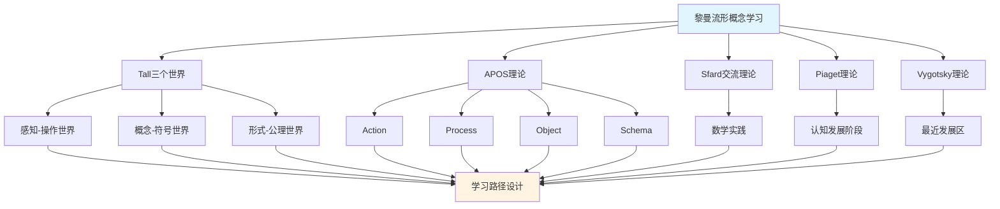

# 黎曼流形概念的多理论分析示例 / Multi-Theory Analysis Example: Riemannian Manifold Concept

**主题编号 / Topic ID**: C.CORE.019.MULTI
**创建日期 / Created**: 2025年1月 / January 2025
**最后更新 / Last Updated**: 2025年1月 / January 2025
**关联概念 / Related Concepts**: [黎曼流形 / Riemannian Manifold](./19-黎曼流形.md) | [黎曼流形-三视角版 / Riemannian Manifold-Three Perspectives](./19-黎曼流形-三视角版.md)

---

## 📋 概述 / Overview

本文档为"黎曼流形"概念提供多理论分析示例，展示如何运用国际主流数学认知理论来分析几何学核心概念。

This document provides a multi-theory analysis example for the "Riemannian Manifold" concept, demonstrating how to apply international mainstream mathematical cognitive theories to analyze core concepts in geometry.

**分析目标 / Analysis Objectives**：

- 展示黎曼流形概念的多理论分析方法 / Demonstrate multi-theory analysis methods for Riemannian manifold concepts
- 为其他几何学概念提供分析参考 / Provide analysis reference for other geometry concepts
- 建立理论整合的应用示例 / Establish application examples of theoretical integration
- 强调黎曼流形与流形、度规、曲率的关系 / Emphasize the relationship between Riemannian manifolds, manifolds, metrics, and curvature

---

## 📑 目录 / Table of Contents

- [黎曼流形概念的多理论分析示例 / Multi-Theory Analysis Example: Riemannian Manifold Concept](#黎曼流形概念的多理论分析示例--multi-theory-analysis-example-riemannian-manifold-concept)
  - [📋 概述 / Overview](#-概述--overview)
  - [📑 目录 / Table of Contents](#-目录--table-of-contents)
  - [🎯 一、Tall三个世界理论分析 / Tall's Three Worlds Theory Analysis (编号: C.CORE.019.MULTI.01)](#-一tall三个世界理论分析--talls-three-worlds-theory-analysis-编号-ccore019multi01)
    - [1.1 感知-操作世界（Embodied World）](#11-感知-操作世界embodied-world)
    - [1.2 概念-符号世界（Symbolic World）](#12-概念-符号世界symbolic-world)
    - [1.3 形式-公理世界（Formal World）](#13-形式-公理世界formal-world)
    - [1.4 三个世界的转换 / Transitions Between Worlds](#14-三个世界的转换--transitions-between-worlds)
  - [🔬 二、Dubinsky APOS理论分析 (编号: C.CORE.018.MULTI.02)](#-二dubinsky-apos理论分析-编号-ccore018multi02)
    - [2.1 Action（动作）](#21-action动作)
    - [2.2 Process（过程）](#22-process过程)
    - [2.3 Object（对象）](#23-object对象)
    - [2.4 Schema（图式）](#24-schema图式)
    - [2.5 APOS发展路径 / APOS Development Path](#25-apos发展路径--apos-development-path)
  - [💬 三、Sfard交流理论分析 / Sfard's Commognitive Theory Analysis (编号: C.CORE.018.MULTI.03)](#-三sfard交流理论分析--sfards-commognitive-theory-analysis-编号-ccore018multi03)
    - [3.1 黎曼流形作为交流工具 / Riemannian Manifold as a Communication Tool](#31-黎曼流形作为交流工具--riemannian-manifold-as-a-communication-tool)
    - [3.2 黎曼流形学习的实践参与 / Practice Participation in Riemannian Manifold Learning](#32-黎曼流形学习的实践参与--practice-participation-in-riemannian-manifold-learning)
  - [🧠 四、Piaget认知发展理论分析 / Piaget's Cognitive Development Theory Analysis (编号: C.CORE.018.MULTI.04)](#-四piaget认知发展理论分析--piagets-cognitive-development-theory-analysis-编号-ccore018multi04)
    - [4.1 具体运算阶段（7-12岁）/ Concrete Operational Stage (7-12 years)](#41-具体运算阶段7-12岁-concrete-operational-stage-7-12-years)
    - [4.2 形式运算阶段（12+岁）/ Formal Operational Stage (12+ years)](#42-形式运算阶段12岁-formal-operational-stage-12-years)
  - [🌍 五、Vygotsky社会文化理论分析 / Vygotsky's Sociocultural Theory Analysis (编号: C.CORE.018.MULTI.05)](#-五vygotsky社会文化理论分析--vygotskys-sociocultural-theory-analysis-编号-ccore018multi05)
    - [5.1 最近发展区（ZPD）/ Zone of Proximal Development (ZPD)](#51-最近发展区zpd-zone-of-proximal-development-zpd)
    - [5.2 社会文化工具 / Sociocultural Tools](#52-社会文化工具--sociocultural-tools)
  - [🔄 六、多理论整合分析 / Multi-Theory Integration Analysis (编号: C.CORE.018.MULTI.06)](#-六多理论整合分析--multi-theory-integration-analysis-编号-ccore018multi06)
    - [6.1 理论共同点 / Theoretical Commonalities](#61-理论共同点--theoretical-commonalities)
    - [6.2 理论互补性 / Theoretical Complementarity](#62-理论互补性--theoretical-complementarity)
    - [6.3 整合应用框架](#63-整合应用框架)
  - [📊 七、流形概念的多理论学习路径 / Multi-Theory Learning Path for Manifold Concept (编号: C.CORE.018.MULTI.07)](#-七流形概念的多理论学习路径--multi-theory-learning-path-for-manifold-concept-编号-ccore018multi07)
    - [7.1 入门阶段（Tall感知-操作世界 + APOS Action）/ Entry Stage (Tall Embodied World + APOS Action)](#71-入门阶段tall感知-操作世界--apos-action-entry-stage-tall-embodied-world--apos-action)
    - [7.2 中级阶段（Tall概念-符号世界 + APOS Process/Object）/ Intermediate Stage (Tall Symbolic World + APOS Process/Object)](#72-中级阶段tall概念-符号世界--apos-processobject-intermediate-stage-tall-symbolic-world--apos-processobject)
    - [7.3 高级阶段（Tall形式-公理世界 + APOS Schema + Sfard实践）/ Advanced Stage (Tall Formal World + APOS Schema + Sfard Practice)](#73-高级阶段tall形式-公理世界--apos-schema--sfard实践-advanced-stage-tall-formal-world--apos-schema--sfard-practice)
  - [🎓 八、教学建议 / Teaching Suggestions (编号: C.CORE.018.MULTI.08)](#-八教学建议--teaching-suggestions-编号-ccore018multi08)
    - [8.1 基于多理论的教学设计 / Multi-Theory Based Teaching Design](#81-基于多理论的教学设计--multi-theory-based-teaching-design)
    - [8.2 具体教学策略 / Specific Teaching Strategies](#82-具体教学策略--specific-teaching-strategies)
  - [🔗 九、关联文档 / Related Documents (编号: C.CORE.018.MULTI.09)](#-九关联文档--related-documents-编号-ccore018multi09)
    - [9.1 核心概念文档 / Core Concept Documents](#91-核心概念文档--core-concept-documents)
    - [9.2 理论框架文档 / Theoretical Framework Documents](#92-理论框架文档--theoretical-framework-documents)
  - [✅ 十、总结 / Summary (编号: C.CORE.018.MULTI.10)](#-十总结--summary-编号-ccore018multi10)
    - [10.1 多理论分析的价值 / Value of Multi-Theory Analysis](#101-多理论分析的价值--value-of-multi-theory-analysis)
    - [10.2 应用推广 / Application and Extension](#102-应用推广--application-and-extension)

---

## 🎯 一、Tall三个世界理论分析 / Tall's Three Worlds Theory Analysis (编号: C.CORE.019.MULTI.01)

### 1.1 感知-操作世界（Embodied World）

**黎曼流形在感知-操作世界中的理解 / Understanding Riemannian Manifolds in the Embodied World**：

- **具体经验 / Concrete Experience**：
  - 通过观察带度量的曲面理解黎曼流形：球面配备标准度规、平面配备欧几里得度规 / Understanding Riemannian manifolds through observing surfaces with metrics: spheres with standard metrics, planes with Euclidean metrics
  - 例如：地球表面（球面度规）、弯曲的橡胶板（非欧度规） / Examples: Earth's surface (spherical metric), curved rubber sheet (non-Euclidean metric)
  - 通过"测量长度和角度"理解黎曼度规：在曲面上测量距离和角度 / Understanding Riemannian metrics through "measuring lengths and angles": measuring distances and angles on surfaces

- **身体动作 / Bodily Actions**：
  - 通过"测量"的动作理解黎曼度规 / Understanding Riemannian metrics through the action of "measuring"
  - 通过"计算距离"理解测地线 / Understanding geodesics through "calculating distances"
  - 通过操作图形理解曲率、体积 / Understanding curvature and volume through manipulating figures

- **直观理解 / Intuitive Understanding**：
  - 黎曼流形是"配备度规的流形" / A Riemannian manifold is a "manifold equipped with a metric"
  - 黎曼流形可以测量长度、角度、体积 / Riemannian manifolds can measure lengths, angles, and volumes
  - 黎曼流形是微分几何的核心 / Riemannian manifolds are the core of differential geometry

**教学建议 / Teaching Suggestions**：

- 使用具体例子（球面、平面、双曲面） / Use concrete examples (spheres, planes, hyperboloids)
- 通过测量活动理解度规 / Understand metrics through measurement activities
- 使用图形可视化曲率和测地线 / Use graphics to visualize curvature and geodesics

### 1.2 概念-符号世界（Symbolic World）

**黎曼流形在概念-符号世界的理解 / Understanding Riemannian Manifolds in the Symbolic World**：

- **符号表示 / Symbolic Representation**：
  - 使用黎曼流形符号：$(M, g)$、$(N, h)$ 表示黎曼流形 / Using Riemannian manifold notation: $(M, g)$, $(N, h)$ to denote Riemannian manifolds
  - 使用度规符号：$g_{ij}$、$g$ / Using metric notation: $g_{ij}$, $g$
  - 使用曲率符号：$R$、$K$ / Using curvature notation: $R$, $K$

- **概念理解 / Conceptual Understanding**：
  - 黎曼流形是配备黎曼度规的光滑流形 / A Riemannian manifold is a smooth manifold equipped with a Riemannian metric
  - 度规在每点定义内积 / The metric defines an inner product at each point
  - 黎曼流形可以定义长度、角度、体积、曲率 / Riemannian manifolds can define lengths, angles, volumes, and curvature

- **抽象操作 / Abstract Operations**：
  - 通过度规研究黎曼流形 / Studying Riemannian manifolds through metrics
  - 通过曲率研究黎曼流形的几何性质 / Studying geometric properties of Riemannian manifolds through curvature
  - 通过测地线研究黎曼流形的全局结构 / Studying global structure of Riemannian manifolds through geodesics

**教学建议 / Teaching Suggestions**：

- 逐步引入黎曼流形符号 / Gradually introduce Riemannian manifold notation
- 通过度规练习理解黎曼流形 / Understand Riemannian manifolds through metric exercises
- 使用曲率研究几何结构 / Use curvature to study geometric structures

### 1.3 形式-公理世界（Formal World）

**黎曼流形在形式-公理世界的理解 / Understanding Riemannian Manifolds in the Formal World**：

- **公理系统 / Axiomatic System**：
  - 黎曼流形的严格定义：$(M, g)$是光滑流形$M$配备黎曼度规$g$ / Strict definition of Riemannian manifold: $(M, g)$ is a smooth manifold $M$ equipped with Riemannian metric $g$
  - 通过度规严格定义黎曼流形 / Strictly defining Riemannian manifolds through metrics
  - 通过公理推导曲率性质 / Deriving curvature properties through axioms

- **形式化定义 / Formal Definition**：
  - 黎曼流形的形式化定义 / Formal definition of Riemannian manifold
  - 黎曼度规的形式化定义 / Formal definition of Riemannian metric
  - 曲率的形式化定义和证明 / Formal definition and proof of curvature

- **逻辑推理 / Logical Reasoning**：
  - 通过逻辑推理证明黎曼流形性质 / Proving Riemannian manifold properties through logical reasoning
  - 通过形式化方法研究微分几何 / Studying differential geometry through formal methods
  - 通过几何分析研究黎曼流形 / Studying Riemannian manifolds through geometric analysis

**教学建议 / Teaching Suggestions**：

- 介绍黎曼流形定义 / Introduce Riemannian manifold definition
- 通过形式化证明理解曲率性质 / Understand curvature properties through formal proofs
- 研究黎曼流形在微分几何中的作用 / Study the role of Riemannian manifolds in differential geometry

### 1.4 三个世界的转换 / Transitions Between Worlds

**转换路径 / Transition Paths**：

1. **从感知-操作到概念-符号 / From Embodied to Symbolic**：
   - 将具体度规结构抽象为黎曼流形符号 / Abstracting concrete metric structures into Riemannian manifold symbols
   - 从操作中提取黎曼流形概念 / Extracting Riemannian manifold concepts from operations
   - 例如：从"内积结构"到"黎曼流形$(M, g)$" / Example: from "inner product structure" to "Riemannian manifold $(M, g)$"

2. **从概念-符号到形式-公理 / From Symbolic to Formal**：
   - 将黎曼流形概念形式化为度规定义 / Formalizing Riemannian manifold concepts into metric definition
   - 从符号运算到逻辑推理 / From symbolic operations to logical reasoning
   - 例如：从"$(M, g)$"到"度规$g$的公理" / Example: from "$(M, g)$" to "axioms of metric $g$"

**转换支持 / Transition Support**：

- **识别转换困难 / Identifying Transition Difficulties**：
  - 识别从具体度规到抽象黎曼流形的困难 / Identifying difficulties in transitioning from concrete metrics to abstract Riemannian manifolds
  - 识别从符号运算到形式化定义的困难 / Identifying difficulties in transitioning from symbolic operations to formal definitions

- **设计转换活动 / Designing Transition Activities**：
  - 设计过渡活动支持转换 / Designing transition activities to support transitions
  - 提供渐进式支持 / Providing progressive support

- **评估转换效果 / Assessing Transition Effectiveness**：
  - 评估转换成功 / Assessing transition success
  - 提供反馈支持 / Providing feedback support

---

## 🔬 二、Dubinsky APOS理论分析 (编号: C.CORE.018.MULTI.02)

### 2.1 Action（动作）

**黎曼流形的Action阶段 / Action Stage of Riemannian Manifold**：

- **具体操作 / Concrete Operations**：
  - 判断黎曼流形：给定流形和度规，判断是否为黎曼流形 / Determining Riemannian manifold: given a manifold and metric, determine if it is a Riemannian manifold
  - 使用度规：给定黎曼流形，计算度规 / Using metrics: given a Riemannian manifold, calculate metrics
  - 构造黎曼流形：给定流形，构造度规 / Constructing Riemannian manifolds: given a manifold, construct a metric

- **操作特点 / Operation Characteristics**：
  - 需要外部指导（教师、教材） / Requires external guidance (teacher, textbook)
  - 操作是具体的、机械的 / Operations are concrete and mechanical
  - 需要逐步执行 / Requires step-by-step execution

- **学习活动 / Learning Activities**：
  - 练习判断黎曼流形 / Practice determining Riemannian manifolds
  - 练习使用度规 / Practice using metrics
  - 练习构造度规 / Practice constructing metrics

**教学建议 / Teaching Suggestions**：

- 提供大量练习机会 / Provide ample practice opportunities
- 给予及时反馈 / Give timely feedback
- 逐步增加操作复杂度 / Gradually increase operation complexity

### 2.2 Process（过程）

**黎曼流形的Process阶段 / Process Stage of Riemannian Manifold**：

- **内化过程 / Internalization Process**：
  - 将黎曼流形判断内化为心理过程 / Internalizing Riemannian manifold determination as a mental process
  - 理解度规构造的内在逻辑 / Understanding the internal logic of metric construction
  - 能够独立完成黎曼流形操作 / Being able to perform Riemannian manifold operations independently

- **过程理解 / Process Understanding**：
  - 理解"黎曼流形"是"配备度规的流形的过程" / Understanding that "Riemannian manifold" is "the process of manifolds equipped with metrics"
  - 理解"度规"是"定义内积的过程" / Understanding that "metrics" are "the process of defining inner products"
  - 理解"曲率"是"度量弯曲的过程" / Understanding that "curvature" is "the process of measuring bending"

- **灵活应用 / Flexible Application**：
  - 能够灵活应用黎曼流形概念 / Being able to flexibly apply Riemannian manifold concepts
  - 能够处理复杂的黎曼流形问题 / Being able to handle complex Riemannian manifold problems
  - 能够理解黎曼流形的各种性质 / Being able to understand various properties of Riemannian manifolds

**教学建议 / Teaching Suggestions**：

- 引导学生内化操作过程 / Guide students to internalize operation processes
- 通过变式练习加深理解 / Deepen understanding through variant exercises
- 鼓励学生探索黎曼流形应用 / Encourage students to explore Riemannian manifold applications

### 2.3 Object（对象）

**黎曼流形的Object阶段 / Object Stage of Riemannian Manifold**：

- **对象化理解 / Objectification Understanding**：
  - 将黎曼流形视为独立的对象 / Viewing Riemannian manifolds as independent objects
  - 理解黎曼流形作为数学对象的结构 / Understanding the structure of Riemannian manifolds as mathematical objects
  - 能够对黎曼流形进行运算和操作 / Being able to perform operations on Riemannian manifolds

- **对象操作 / Object Operations**：
  - 能够比较不同的黎曼流形 / Being able to compare different Riemannian manifolds
  - 能够构造黎曼流形的积流形 / Being able to construct product Riemannian manifolds
  - 能够研究黎曼流形的性质 / Being able to study properties of Riemannian manifolds

- **概念整合 / Conceptual Integration**：
  - 理解黎曼流形与流形、度规、曲率的关系 / Understanding the relationship between Riemannian manifolds, manifolds, metrics, and curvature
  - 理解黎曼流形在几何学中的作用 / Understanding the role of Riemannian manifolds in geometry
  - 理解黎曼流形在数学中的作用 / Understanding the role of Riemannian manifolds in mathematics

**教学建议 / Teaching Suggestions**：

- 引导学生将流形对象化 / Guide students to objectify manifolds
- 通过对象操作加深理解 / Deepen understanding through object operations
- 整合黎曼流形与其他概念 / Integrate Riemannian manifolds with other concepts

### 2.4 Schema（图式）

**黎曼流形的Schema阶段 / Schema Stage of Riemannian Manifold**：

- **图式构建 / Schema Construction**：
  - 构建完整的黎曼流形图式 / Constructing a complete Riemannian manifold schema
  - 整合黎曼流形的各种理解 / Integrating various understandings of Riemannian manifolds
  - 建立黎曼流形与其他概念的联系 / Establishing connections between Riemannian manifolds and other concepts

- **图式应用 / Schema Application**：
  - 能够灵活应用黎曼流形图式 / Being able to flexibly apply Riemannian manifold schemas
  - 能够解决复杂的黎曼流形问题 / Being able to solve complex Riemannian manifold problems
  - 能够研究微分几何理论 / Being able to study differential geometry theory

- **图式发展 / Schema Development**：
  - 不断发展黎曼流形图式 / Continuously developing Riemannian manifold schemas
  - 探索黎曼流形的新应用 / Exploring new applications of Riemannian manifolds
  - 研究微分几何理论的发展 / Studying the development of differential geometry theory

**教学建议 / Teaching Suggestions**：

- 帮助学生构建流形图式 / Help students construct manifold schemas
- 通过应用发展图式 / Develop schemas through application
- 鼓励学生探索微分几何理论 / Encourage students to explore differential geometry theory

### 2.5 APOS发展路径 / APOS Development Path

**发展过程 / Development Process**：

1. **Action → Process / 动作到过程**：
   - 将外部黎曼流形操作内化为心理过程 / Internalizing external Riemannian manifold operations as mental processes
   - 从需要指导到独立完成 / From needing guidance to independent completion
   - 例如：从"计算度规"到"理解黎曼流形过程" / Example: from "computing metrics" to "understanding the Riemannian manifold process"

2. **Process → Object / 过程到对象**：
   - 将黎曼流形过程对象化 / Objectifying Riemannian manifold processes
   - 从过程理解到对象理解 / From process understanding to object understanding
   - 例如：从"理解黎曼流形过程"到"将黎曼流形视为对象" / Example: from "understanding the Riemannian manifold process" to "treating Riemannian manifolds as objects"

3. **Object → Schema / 对象到图式**：
   - 整合黎曼流形的所有方面形成完整图式 / Integrating all aspects of Riemannian manifolds to form a complete schema
   - 从对象理解到系统理解 / From object understanding to systematic understanding
   - 例如：从"理解黎曼流形对象"到"形成微分几何图式" / Example: from "understanding Riemannian manifold objects" to "forming a differential geometry schema"

**发展支持 / Development Support**：

- **识别发展困难 / Identifying Development Difficulties**：
  - 识别内化困难 / Identifying internalization difficulties
  - 识别对象化困难 / Identifying objectification difficulties
  - 识别图式化困难 / Identifying schematization difficulties

- **设计发展活动 / Designing Development Activities**：
  - 设计支持内化的活动 / Designing activities to support internalization
  - 设计支持对象化的活动 / Designing activities to support objectification
  - 设计支持图式化的活动 / Designing activities to support schematization

- **评估发展效果 / Assessing Development Effectiveness**：
  - 评估各阶段发展 / Assessing development at each stage
  - 提供反馈支持 / Providing feedback support

---

## 💬 三、Sfard交流理论分析 / Sfard's Commognitive Theory Analysis (编号: C.CORE.018.MULTI.03)

### 3.1 黎曼流形作为交流工具 / Riemannian Manifold as a Communication Tool

**黎曼流形的交流功能 / Communicative Function of Riemannian Manifolds**：

- **数学交流 / Mathematical Communication**：
  - 黎曼流形用于表达"带度量的弯曲空间"：$(M, g)$ / Riemannian manifolds are used to express "curved spaces with metrics": $(M, g)$
  - 黎曼流形用于描述"几何结构" / Riemannian manifolds are used to describe "geometric structure"
  - 黎曼流形用于表达数学关系：等距、共形等价 / Riemannian manifolds are used to express mathematical relationships: isometry, conformal equivalence

- **概念表达 / Conceptual Expression**：
  - 通过黎曼流形表达"度规"的概念 / Expressing the concept of "metric" through Riemannian manifolds
  - 通过黎曼流形符号表达"曲率"的概念 / Expressing the concept of "curvature" through Riemannian manifold notation
  - 通过黎曼流形表达"测地线"的概念 / Expressing the concept of "geodesic" through Riemannian manifolds

- **问题解决 / Problem Solving**：
  - 使用黎曼流形语言表达问题 / Using Riemannian manifold language to express problems
  - 使用黎曼流形方法解决问题 / Using Riemannian manifold methods to solve problems
  - 使用微分几何方法证明定理 / Using differential geometry methods to prove theorems

### 3.2 黎曼流形学习的实践参与 / Practice Participation in Riemannian Manifold Learning

**通过参与数学实践学习黎曼流形 / Learning Riemannian Manifolds through Participation in Mathematical Practice**：

- **实践场景 / Practice Scenarios**：
  - 通过几何问题学习黎曼流形 / Learning Riemannian manifolds through geometry problems
  - 通过物理应用学习黎曼流形（广义相对论） / Learning Riemannian manifolds through physics applications (general relativity)
  - 通过机器学习应用学习黎曼流形 / Learning Riemannian manifolds through machine learning applications
  - 通过微分几何研究学习黎曼流形理论 / Learning Riemannian manifold theory through differential geometry research

- **实践方式 / Practice Methods**：
  - 参与数学讨论，使用黎曼流形语言 / Participating in mathematical discussions, using Riemannian manifold language
  - 解决数学问题，应用黎曼流形方法 / Solving mathematical problems, applying Riemannian manifold methods
  - 研究数学理论，理解黎曼流形作用 / Studying mathematical theory, understanding the role of Riemannian manifolds

- **学习效果 / Learning Outcomes**：
  - 通过实践理解黎曼流形概念 / Understanding Riemannian manifold concepts through practice
  - 通过应用掌握黎曼流形方法 / Mastering Riemannian manifold methods through application
  - 通过参与形成数学思维 / Forming mathematical thinking through participation

**教学建议 / Teaching Suggestions**：

- 设计数学实践活动 / Design mathematical practice activities
- 鼓励学生参与数学讨论 / Encourage students to participate in mathematical discussions
- 提供实际问题解决机会 / Provide opportunities for solving real-world problems

---

## 🧠 四、Piaget认知发展理论分析 / Piaget's Cognitive Development Theory Analysis (编号: C.CORE.018.MULTI.04)

### 4.1 具体运算阶段（7-12岁）/ Concrete Operational Stage (7-12 years)

**黎曼流形在具体运算阶段的理解 / Understanding Riemannian Manifolds in the Concrete Operational Stage**：

- **具体对象 / Concrete Objects**：
  - 通过具体黎曼流形理解黎曼流形 / Understanding Riemannian manifolds through concrete Riemannian manifolds
  - 例如：球面（标准度规）、平面（欧几里得度规） / Examples: spheres (standard metric), planes (Euclidean metric)
  - 需要具体例子支持理解 / Requires concrete examples to support understanding

- **逻辑思维 / Logical Thinking**：
  - 能够理解黎曼流形的基本概念 / Being able to understand basic Riemannian manifold concepts
  - 能够进行简单的度规操作 / Being able to perform simple metric operations
  - 但需要具体对象支持 / But requires concrete object support

- **教学建议 / Teaching Suggestions**：
  - 使用具体黎曼流形 / Use concrete Riemannian manifolds
  - 通过图形验证曲率性质 / Verify curvature properties through graphics
  - 逐步引入抽象概念 / Gradually introduce abstract concepts

### 4.2 形式运算阶段（12+岁）/ Formal Operational Stage (12+ years)

**黎曼流形在形式运算阶段的理解 / Understanding Riemannian Manifolds in the Formal Operational Stage**：

- **抽象思维 / Abstract Thinking**：
  - 能够理解抽象的黎曼流形概念 / Being able to understand abstract Riemannian manifold concepts
  - 能够进行符号操作 / Being able to perform symbolic operations
  - 能够进行逻辑推理 / Being able to perform logical reasoning

- **形式推理 / Formal Reasoning**：
  - 能够证明黎曼流形性质 / Being able to prove Riemannian manifold properties
  - 能够理解黎曼流形定义 / Being able to understand Riemannian manifold definition
  - 能够研究微分几何 / Being able to study differential geometry

- **教学建议 / Teaching Suggestions**：
  - 引入抽象概念和符号 / Introduce abstract concepts and symbols
  - 进行逻辑推理训练 / Conduct logical reasoning training
  - 研究微分几何理论 / Study differential geometry theory

---

## 🌍 五、Vygotsky社会文化理论分析 / Vygotsky's Sociocultural Theory Analysis (编号: C.CORE.018.MULTI.05)

### 5.1 最近发展区（ZPD）/ Zone of Proximal Development (ZPD)

**黎曼流形学习的最近发展区 / Zone of Proximal Development in Riemannian Manifold Learning**：

- **独立能力 / Independent Ability**：
  - 能够理解黎曼流形的基本概念 / Being able to understand basic Riemannian manifold concepts
  - 能够进行简单的度规操作 / Being able to perform simple metric operations
  - 能够理解度规 / Being able to understand metrics

- **潜在能力 / Potential Ability**：
  - 能够理解黎曼流形定义 / Being able to understand Riemannian manifold definition
  - 能够证明曲率性质 / Being able to prove curvature properties
  - 能够研究微分几何理论 / Being able to study differential geometry theory

- **教学建议 / Teaching Suggestions**：
  - 识别学生的最近发展区 / Identify students' zone of proximal development
  - 提供适当的支持和指导 / Provide appropriate support and guidance
  - 逐步提高学习要求 / Gradually increase learning requirements

### 5.2 社会文化工具 / Sociocultural Tools

**黎曼流形作为社会文化工具 / Riemannian Manifolds as Sociocultural Tools**：

- **数学工具 / Mathematical Tools**：
  - 黎曼流形是数学研究的重要工具 / Riemannian manifolds are important tools for mathematical research
  - 黎曼流形用于解决实际问题（广义相对论） / Riemannian manifolds are used to solve real-world problems (general relativity)
  - 黎曼流形用于研究数学理论 / Riemannian manifolds are used to study mathematical theory

- **文化意义 / Cultural Significance**：
  - 黎曼流形是数学文化的重要组成部分 / Riemannian manifolds are an important part of mathematical culture
  - 黎曼流形反映了数学思维的发展 / Riemannian manifolds reflect the development of mathematical thinking
  - 黎曼流形体现了数学的美感 / Riemannian manifolds embody the beauty of mathematics

- **教学建议 / Teaching Suggestions**：
  - 介绍黎曼流形的历史和文化意义 / Introduce the history and cultural significance of Riemannian manifolds
  - 展示黎曼流形在数学中的作用 / Demonstrate the role of Riemannian manifolds in mathematics
  - 培养学生对数学文化的理解 / Cultivate students' understanding of mathematical culture

---

## 🔄 六、多理论整合分析 / Multi-Theory Integration Analysis (编号: C.CORE.018.MULTI.06)

### 6.1 理论共同点 / Theoretical Commonalities

**各理论在黎曼流形概念分析中的共同点 / Commonalities of Theories in Riemannian Manifold Concept Analysis**：

1. **多层次理解 / Multi-Level Understanding**：
   - 都强调从具体到抽象的发展 / All emphasize development from concrete to abstract
   - Tall的三个世界、APOS的四个阶段、Piaget的发展阶段都体现这一点 / Tall's three worlds, APOS's four stages, and Piaget's developmental stages all reflect this

2. **实践重要性 / Importance of Practice**：
   - 都强调实践在学习中的作用 / All emphasize the role of practice in learning
   - Sfard的交流理论、Vygotsky的社会文化理论都强调这一点 / Sfard's communication theory and Vygotsky's sociocultural theory both emphasize this

3. **认知发展 / Cognitive Development**：
   - 都关注认知发展的过程 / All focus on the process of cognitive development
   - 各理论都描述了从简单到复杂的发展 / Each theory describes development from simple to complex

### 6.2 理论互补性 / Theoretical Complementarity

**各理论在黎曼流形概念分析中的互补性 / Complementarity of Theories in Riemannian Manifold Concept Analysis**：

1. **Tall三个世界 / Tall's Three Worlds**：
   - 适用于理解黎曼流形概念的不同层次 / Applicable to understanding different levels of Riemannian manifold concepts
   - 从感知操作到形式公理的发展 / Development from embodied operations to formal axioms

2. **APOS理论 / APOS Theory**：
   - 适用于分析黎曼流形概念的学习过程 / Applicable to analyzing the learning process of Riemannian manifold concepts
   - 从动作到图式的发展 / Development from action to schema

3. **Sfard交流理论 / Sfard's Communication Theory**：
   - 适用于设计黎曼流形概念的实践活动 / Applicable to designing practice activities for Riemannian manifold concepts
   - 通过数学实践学习黎曼流形 / Learning Riemannian manifolds through mathematical practice

4. **Piaget理论 / Piaget's Theory**：
   - 适用于理解黎曼流形概念的认知发展阶段 / Applicable to understanding cognitive development stages of Riemannian manifold concepts
   - 从具体运算到形式运算的发展 / Development from concrete operations to formal operations

5. **Vygotsky理论 / Vygotsky's Theory**：
   - 适用于设计黎曼流形概念的学习支持 / Applicable to designing learning support for Riemannian manifold concepts
   - 通过最近发展区促进学习 / Promoting learning through the zone of proximal development

### 6.3 整合应用框架

**多理论整合应用**：

---

## 📊 七、流形概念的多理论学习路径 / Multi-Theory Learning Path for Manifold Concept (编号: C.CORE.018.MULTI.07)

### 7.1 入门阶段（Tall感知-操作世界 + APOS Action）/ Entry Stage (Tall Embodied World + APOS Action)

**学习目标 / Learning Objectives**：

- 通过具体黎曼流形理解黎曼流形概念 / Understanding Riemannian manifold concepts through concrete Riemannian manifolds
- 掌握基本度规操作 / Mastering basic metric operations

**学习活动 / Learning Activities**：

- 使用具体黎曼流形（球面、平面）进行观察 / Using concrete Riemannian manifolds (spheres, planes) for observation
- 练习判断黎曼流形 / Practicing determining Riemannian manifolds
- 练习使用度规 / Practicing using metrics
- 练习基本度规操作 / Practicing basic metric operations

**评估标准 / Assessment Criteria**：

- 能够独立完成基本度规操作 / Being able to independently complete basic metric operations
- 能够理解黎曼流形的基本概念 / Being able to understand basic Riemannian manifold concepts

### 7.2 中级阶段（Tall概念-符号世界 + APOS Process/Object）/ Intermediate Stage (Tall Symbolic World + APOS Process/Object)

**学习目标 / Learning Objectives**：

- 理解黎曼流形的符号表示 / Understanding symbolic representation of Riemannian manifolds
- 掌握度规运算的内在逻辑 / Mastering the internal logic of metric operations
- 将黎曼流形视为对象 / Viewing Riemannian manifolds as objects

**学习活动 / Learning Activities**：

- 学习黎曼流形符号和度规符号 / Learning Riemannian manifold notation and metric notation
- 通过符号操作进行度规运算 / Performing metric operations through symbolic operations
- 理解曲率的性质 / Understanding properties of curvature
- 研究黎曼流形的积流形 / Studying product Riemannian manifolds

**评估标准 / Assessment Criteria**：

- 能够灵活应用黎曼流形符号 / Being able to flexibly apply Riemannian manifold notation
- 能够理解度规运算的内在逻辑 / Being able to understand the internal logic of metric operations
- 能够将黎曼流形视为对象进行操作 / Being able to operate on Riemannian manifolds as objects

### 7.3 高级阶段（Tall形式-公理世界 + APOS Schema + Sfard实践）/ Advanced Stage (Tall Formal World + APOS Schema + Sfard Practice)

**学习目标 / Learning Objectives**：

- 理解黎曼流形定义 / Understanding Riemannian manifold definition
- 形成完整的黎曼流形概念图式 / Forming a complete Riemannian manifold concept schema
- 通过数学实践应用黎曼流形 / Applying Riemannian manifolds through mathematical practice

**学习活动 / Learning Activities**：

- 学习黎曼流形定义 / Learning Riemannian manifold definition
- 通过形式化证明理解曲率性质 / Understanding curvature properties through formal proofs
- 研究黎曼流形在微分几何中的作用 / Studying the role of Riemannian manifolds in differential geometry
- 参与数学实践，应用黎曼流形方法 / Participating in mathematical practice, applying Riemannian manifold methods

**评估标准 / Assessment Criteria**：

- 能够理解黎曼流形定义 / Being able to understand Riemannian manifold definition
- 能够形成完整的黎曼流形概念图式 / Being able to form a complete Riemannian manifold concept schema
- 能够通过数学实践应用黎曼流形 / Being able to apply Riemannian manifolds through mathematical practice

---

## 🧠 七、元认知理论分析 / Metacognitive Theory Analysis (编号: C.CORE.019.MULTI.07.5)

### 7.1 元认知知识（Metacognitive Knowledge）

**关于黎曼流形概念的知识 / Knowledge About the Riemannian Manifold Concept**：

- **概念知识 / Conceptual Knowledge**：
  - 黎曼流形的定义：具有黎曼度规的流形 / Riemannian manifolds are manifolds with Riemannian metrics
  - 黎曼流形的性质：度规、距离、测地线 / Properties: metric, distance, geodesics
  - 黎曼流形的表示方法：度规张量、Christoffel符号、曲率张量 / Representation methods: metric tensor, Christoffel symbols, curvature tensor
  - 黎曼流形与其他概念的关系：黎曼流形是微分几何的核心，是研究弯曲空间的工具 / Relationship: Riemannian manifolds are core concepts of differential geometry and tools for studying curved spaces

- **策略知识 / Strategy Knowledge**：
  - 学习策略：从流形到黎曼流形，通过度规掌握黎曼流形 / Learning strategies: from manifolds to Riemannian manifolds, master Riemannian manifolds through metrics
  - 理解策略：从平直空间到弯曲空间，从局部到整体 / Understanding strategies: from flat spaces to curved spaces, from local to global
  - 应用策略：将黎曼流形方法应用到实际问题中 / Application strategies: apply Riemannian manifold methods to real-world problems

- **任务知识 / Task Knowledge**：
  - 典型任务：度规确定、测地线计算、曲率计算 / Typical tasks: metric determination, geodesic computation, curvature computation
  - 任务难度：基础任务（度规确定）→ 中级任务（测地线计算）→ 高级任务（曲率计算） / Task difficulty: basic (metric determination) → intermediate (geodesic computation) → advanced (curvature computation)
  - 任务要求：理解黎曼流形概念，掌握度规方法，能够进行黎曼流形推理 / Task requirements: understand Riemannian manifold concepts, master metric methods, be able to reason about Riemannian manifolds

### 7.2 元认知监控（Metacognitive Monitoring）

**理解监控 / Comprehension Monitoring**：

- **自我提问 / Self-Questioning**：
  - "我理解黎曼流形的基本概念了吗？" / "Do I understand the basic concept of Riemannian manifolds?"
  - "我能区分黎曼流形和一般流形吗？" / "Can I distinguish between Riemannian manifolds and general manifolds?"
  - "我理解度规的概念吗？" / "Do I understand the concept of metrics?"

- **理解检查 / Comprehension Checking**：
  - 能否用自己的话解释黎曼流形概念？ / Can I explain the concept of Riemannian manifolds in my own words?
  - 能否识别度规确定的错误？ / Can I identify errors in metric determination?
  - 能否判断空间的黎曼流形性？ / Can I determine whether a space is a Riemannian manifold?

- **困难识别 / Difficulty Identification**：
  - 识别理解困难：抽象性、度规、测地线、曲率 / Identify comprehension difficulties: abstraction, metrics, geodesics, curvature
  - 识别运算困难：度规确定、测地线计算、曲率计算 / Identify operation difficulties: metric determination, geodesic computation, curvature computation

**过程监控 / Process Monitoring**：

- **学习过程监控 / Learning Process Monitoring**：
  - 监控学习进度：是否按计划学习？ / Monitor learning progress: Am I learning according to plan?
  - 监控学习效果：是否掌握了黎曼流形概念？ / Monitor learning effectiveness: Have I mastered the concept of Riemannian manifolds?
  - 监控学习困难：遇到了哪些困难？ / Monitor learning difficulties: What difficulties have I encountered?

- **策略使用监控 / Strategy Use Monitoring**：
  - 使用的策略是否有效？ / Is the strategy I'm using effective?
  - 是否需要调整策略？ / Do I need to adjust my strategy?
  - 策略使用是否正确？ / Am I using the strategy correctly?

### 7.3 元认知调节（Metacognitive Regulation）

**计划调节 / Planning Regulation**：

- **学习计划制定 / Learning Plan Development**：
  - 制定学习计划：先学黎曼流形基本概念，再学度规方法，最后学黎曼流形应用 / Develop learning plan: first learn basic Riemannian manifold concepts, then learn metric methods, finally learn Riemannian manifold applications
  - 调整学习计划：根据学习情况调整计划 / Adjust learning plan: adjust plan based on learning situation
  - 优化学习路径：选择最适合自己的学习路径 / Optimize learning path: choose the learning path that best suits oneself

**策略调节 / Strategy Regulation**：

- **策略选择 / Strategy Selection**：
  - 根据任务类型选择策略：简单任务用直接方法，复杂任务用分步方法 / Select strategies based on task type: use direct methods for simple tasks, step-by-step methods for complex tasks
  - 根据学习阶段选择策略：入门阶段用具体例子，高级阶段用抽象方法 / Select strategies based on learning stage: use concrete examples in entry stage, abstract methods in advanced stage

- **策略调整 / Strategy Adjustment**：
  - 如果遇到困难，尝试不同的策略 / If encountering difficulties, try different strategies
  - 如果策略无效，调整策略 / If strategy is ineffective, adjust strategy
  - 如果策略有效，继续使用并优化 / If strategy is effective, continue using and optimize

**反思调节 / Reflection Regulation**：

- **学习反思 / Learning Reflection**：
  - 反思学习过程：从黎曼流形学习中获得了什么？ / Reflect on learning process: What have I gained from learning Riemannian manifolds?
  - 反思学习困难：遇到了哪些困难？如何克服？ / Reflect on learning difficulties: What difficulties did I encounter? How did I overcome them?
  - 反思学习策略：使用的策略是否有效？如何改进？ / Reflect on learning strategies: Were the strategies I used effective? How can I improve?

- **错误反思 / Error Reflection**：
  - 从错误中学习：分析错误原因，避免类似错误 / Learn from errors: analyze error causes, avoid similar errors
  - 改进学习方法：根据错误调整学习方法 / Improve learning methods: adjust learning methods based on errors

**教学建议 / Teaching Suggestions**：

- 教授元认知知识：帮助学生建立关于黎曼流形的元认知知识 / Teach metacognitive knowledge: help students build metacognitive knowledge about Riemannian manifolds
- 培养监控能力：引导学生自我监控理解过程 / Develop monitoring ability: guide students to self-monitor their comprehension process
- 训练调节能力：教授学生如何调节学习策略 / Train regulation ability: teach students how to regulate learning strategies
- 使用元认知提示语：在学习过程中使用提示语引导学生 / Use metacognitive prompts: use prompts to guide students during learning

---

## 🎓 八、教学建议 / Teaching Suggestions (编号: C.CORE.018.MULTI.08)

### 8.1 基于多理论的教学设计 / Multi-Theory Based Teaching Design

**教学设计原则 / Teaching Design Principles**：

1. **多层次设计 / Multi-Level Design**：
   - 从感知操作到形式公理 / From embodied operations to formal axioms
   - 从动作到图式 / From action to schema
   - 从具体运算到形式运算 / From concrete operations to formal operations

2. **实践导向 / Practice-Oriented**：
   - 设计数学实践活动 / Design mathematical practice activities
   - 鼓励学生参与数学交流 / Encourage students to participate in mathematical communication
   - 提供实际问题解决机会 / Provide opportunities for solving real-world problems

3. **学习支持 / Learning Support**：
   - 提供适当的学习支持 / Provide appropriate learning support
   - 设计最近发展区的学习活动 / Design learning activities in the zone of proximal development
   - 给予及时反馈 / Give timely feedback

4. **情感因素考虑 / Affective Considerations**：
   - **减少数学焦虑 / Reducing Math Anxiety**：
     - 从具体例子（球面、平面、双曲面）开始，降低黎曼流形概念的抽象难度 / Start with concrete examples (spheres, planes, hyperboloids) to reduce the abstract difficulty of Riemannian manifold concepts
     - 通过测量活动理解度规 / Understand metrics through measurement activities
     - 允许学生犯错，营造安全的学习环境 / Allow students to make mistakes and create a safe learning environment
     - 提供逐步支持，帮助学生建立信心 / Provide progressive support to help students build confidence

   - **激发学习动机 / Motivating Learning**：
     - 展示黎曼流形在现实中的应用（广义相对论、几何等） / Show applications of Riemannian manifolds in real life (general relativity, geometry, etc.)
     - 设计有趣的黎曼流形问题 / Design interesting Riemannian manifold problems
     - 介绍黎曼流形的历史和数学家的故事（Riemann、Einstein） / Introduce the history of Riemannian manifolds and mathematician stories (Riemann, Einstein)
     - 展示黎曼流形的结构美感 / Show the structural beauty of Riemannian manifolds

   - **培养数学兴趣 / Cultivating Math Interest**：
     - 展示黎曼流形的美感 / Show the beauty of Riemannian manifolds
     - 介绍Riemann、Einstein等数学家的故事 / Introduce stories of mathematicians like Riemann and Einstein
     - 探索黎曼流形在微分几何中的核心地位 / Explore the central role of Riemannian manifolds in differential geometry

### 8.2 具体教学策略 / Specific Teaching Strategies

**入门阶段策略 / Entry Stage Strategies**：

- 使用具体黎曼流形和图形 / Use concrete Riemannian manifolds and graphics
- 通过游戏和活动学习 / Learn through games and activities
- 提供大量练习机会 / Provide ample practice opportunities

**中级阶段策略 / Intermediate Stage Strategies**：

- 逐步引入抽象概念和符号 / Gradually introduce abstract concepts and symbols
- 通过变式练习加深理解 / Deepen understanding through variant exercises
- 鼓励学生独立思考和解决问题 / Encourage students to think independently and solve problems

**高级阶段策略 / Advanced Stage Strategies**：

- 引入定义和形式化方法 / Introduce definitions and formal methods
- 研究黎曼几何理论 / Study Riemannian geometry theory
- 参与数学实践和研究 / Participate in mathematical practice and research

---

## 🔗 九、关联文档 / Related Documents (编号: C.CORE.018.MULTI.09)

### 9.1 核心概念文档 / Core Concept Documents

- [黎曼流形](./19-黎曼流形.md) / [Riemannian Manifold](./19-黎曼流形.md)
- [黎曼流形-三视角版](./19-黎曼流形-三视角版.md) / [Riemannian Manifold-Three Perspectives Version](./19-黎曼流形-三视角版.md)
- [流形-多理论分析示例](./18-流形-多理论分析示例-2025年1月.md) / [Manifold-Multi-Theory Analysis Example](./18-流形-多理论分析示例-2025年1月.md)

### 9.2 理论框架文档 / Theoretical Framework Documents

- [国际主流数学认知理论整合框架](../00-国际主流数学认知理论整合框架-2025年1月.md) / [International Mainstream Mathematical Cognitive Theories Integration Framework](../00-国际主流数学认知理论整合框架-2025年1月.md)
- [概念体系深度改进计划](../00-概念体系深度改进计划-2025年1月.md) / [Concept System Deep Improvement Plan](../00-概念体系深度改进计划-2025年1月.md)

---

## ✅ 十、总结 / Summary (编号: C.CORE.018.MULTI.10)

### 10.1 多理论分析的价值 / Value of Multi-Theory Analysis

**多理论分析的优势 / Advantages of Multi-Theory Analysis**：

1. **全面理解 / Comprehensive Understanding**：
   - 从多个角度理解黎曼流形概念 / Understanding Riemannian manifold concepts from multiple perspectives
   - 理解黎曼流形概念的不同层次 / Understanding different levels of Riemannian manifold concepts
   - 理解黎曼流形概念的学习过程 / Understanding the learning process of Riemannian manifold concepts

2. **教学设计 / Teaching Design**：
   - 基于多理论设计教学 / Designing teaching based on multiple theories
   - 提供多层次学习支持 / Providing multi-level learning support
   - 设计实践活动 / Designing practice activities

3. **学习路径 / Learning Path**：
   - 设计基于多理论的学习路径 / Designing learning paths based on multiple theories
   - 支持不同认知发展阶段的学习 / Supporting learning at different cognitive development stages
   - 促进概念理解的发展 / Promoting the development of conceptual understanding

### 10.2 应用推广 / Application and Extension

**为其他核心概念建立多理论分析 / Establishing Multi-Theory Analysis for Other Core Concepts**：

- 使用本文档作为模板 / Using this document as a template
- 为每个概念建立多理论分析 / Establishing multi-theory analysis for each concept
- 建立33个核心概念的多理论分析体系 / Establishing a multi-theory analysis system for 33 core concepts

---

**创建日期**: 2025年1月
**最后更新**: 2025年1月
**维护状态**: 持续更新中
**状态**: ✅ 已完成
