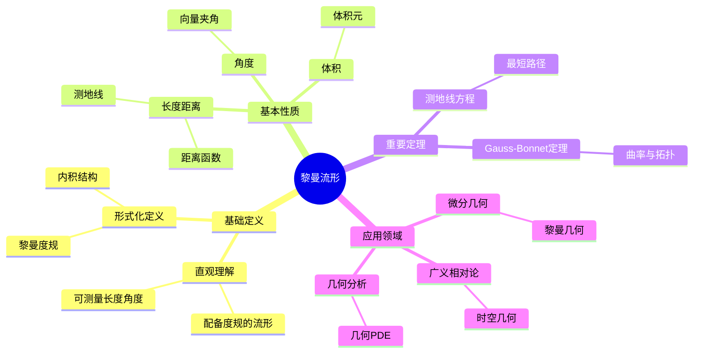
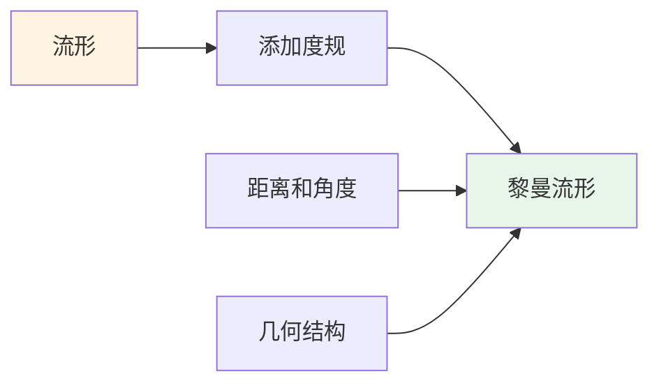
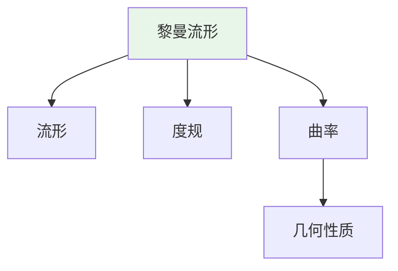
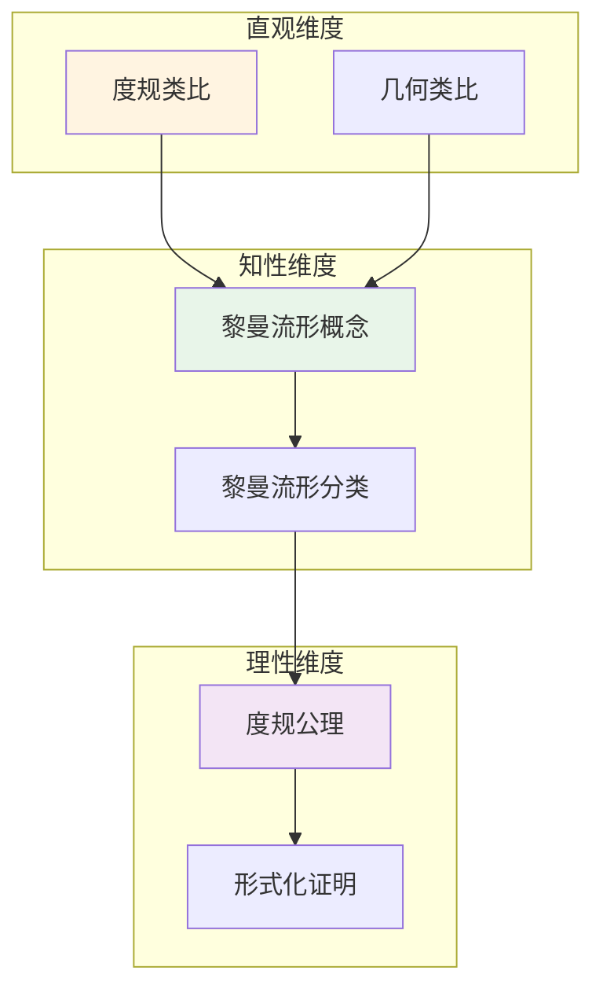

# 黎曼流形 (Riemannian Manifold)

**概念编号**: C.CORE.019
**知识层次**: L0-L2
**知识领域**: D4 (几何)
**创建日期**: 2025年11月21日
**最后更新**: 2025年11月21日

---

## 📑 目录

- [黎曼流形 (Riemannian Manifold)](#黎曼流形-riemannian-manifold)
  - [📑 目录](#-目录)
  - [1. 📋 概述](#1--概述)
  - [2. 🎯 严格定义](#2--严格定义)
    - [2.1 基础定义 (L0)](#21-基础定义-l0)
    - [2.2 形式化定义 (L1)](#22-形式化定义-l1)
  - [3. 📚 历史背景](#3--历史背景)
    - [3.1 发展脉络](#31-发展脉络)
    - [3.2 关键人物](#32-关键人物)
    - [3.3 重要事件](#33-重要事件)
  - [4. 🔍 性质与定理](#4--性质与定理)
    - [4.1 基本性质 (L1)](#41-基本性质-l1)
    - [4.2 重要定理 (L2)](#42-重要定理-l2)
  - [5. 🔬 形式化证明](#5--形式化证明)
    - [定理1: Gauss-Bonnet定理的形式化证明（2维紧致流形）](#定理1-gauss-bonnet定理的形式化证明2维紧致流形)
  - [6. 💡 应用实例](#6--应用实例)
    - [6.1 理论应用](#61-理论应用)
    - [6.2 实际应用](#62-实际应用)
      - [应用1: 物理学 - 广义相对论中的时空](#应用1-物理学---广义相对论中的时空)
      - [应用2: 最优传输 - Wasserstein距离](#应用2-最优传输---wasserstein距离)
      - [应用3: 机器学习 - 流形学习](#应用3-机器学习---流形学习)
  - [7. 🔗 关联概念](#7--关联概念)
    - [依赖关系](#依赖关系)
    - [推广关系](#推广关系)
  - [8. 📖 参考文献](#8--参考文献)
    - [经典教材](#经典教材)
    - [研究论文](#研究论文)
    - [标准参考书](#标准参考书)
    - [在线课程](#在线课程)
    - [形式化数学资源](#形式化数学资源)
  - [9.1 🗺️ 思维导图 (编号: C.CORE.019.MIND)](#91-️-思维导图-编号-ccore019mind)
    - [黎曼流形概念思维导图](#黎曼流形概念思维导图)
  - [9.2 📊 知识多维关系矩阵 (编号: C.CORE.019.MATRIX)](#92--知识多维关系矩阵-编号-ccore019matrix)
    - [黎曼流形的多维关系矩阵](#黎曼流形的多维关系矩阵)
  - [9.3 💭 形象化解释与论证 (编号: C.CORE.019.VISUAL)](#93--形象化解释与论证-编号-ccore019visual)
    - [形象化解释](#形象化解释)
    - [认知科学视角](#认知科学视角)
  - [9.6 👨‍🏫 专家观点与论证 (编号: C.CORE.019.EXPERT)](#96--专家观点与论证-编号-ccore019expert)
    - [数学家的观点](#数学家的观点)
    - [数学教育家的观点](#数学教育家的观点)
    - [数学认知学家的观点](#数学认知学家的观点)
  - [9.7 🎨 认知维度表征 (编号: C.CORE.019.COGNITIVE)](#97--认知维度表征-编号-ccore019cognitive)
    - [直观维度表征 (编号: C.CORE.019.INTUITIVE)](#直观维度表征-编号-ccore019intuitive)
      - [形象类比](#形象类比)
      - [具体例子](#具体例子)
      - [可视化表示](#可视化表示)
      - [几何直观](#几何直观)
    - [知性维度表征 (编号: C.CORE.019.INTELLECTUAL)](#知性维度表征-编号-ccore019intellectual)
      - [概念定义](#概念定义)
      - [概念分类](#概念分类)
      - [概念关系](#概念关系)
      - [知识矩阵](#知识矩阵)
    - [理性维度表征 (编号: C.CORE.019.RATIONAL)](#理性维度表征-编号-ccore019rational)
      - [公理体系](#公理体系)
      - [形式化定义](#形式化定义)
      - [逻辑推理](#逻辑推理)
      - [证明系统](#证明系统)
    - [综合整合表征 (编号: C.CORE.019.INTEGRATED)](#综合整合表征-编号-ccore019integrated)
      - [多维度整合](#多维度整合)
      - [图形转换](#图形转换)
      - [应用示例](#应用示例)
  - [9.5 📚 习题库](#95--习题库)
    - [L0基础题（2道）](#l0基础题2道)
    - [L1中级题（6道）](#l1中级题6道)
    - [L2高级题（7道）](#l2高级题7道)

---

## 1. 📋 概述

黎曼流形是配备度规的微分流形，可以定义长度、角度、体积和曲率。
黎曼流形是微分几何的核心，在广义相对论、几何分析等领域有重要应用。

**权威资源对齐**:

- Wikipedia: [Riemannian Manifold](https://en.wikipedia.org/wiki/Riemannian_manifold)
- Stanford课程: Math 215A (Differential Topology)
- Princeton课程: MAT 520 (Differential Geometry)
- MIT课程: 18.965 (Geometry of Manifolds)
- Metamath: [Riemannian Geometry](http://us.metamath.org/mpeuni/df-riemann.html)

---

## 2. 🎯 严格定义

### 2.1 基础定义 (L0)

**直观理解**: 黎曼流形是配备"度量"的流形，可以在其上测量长度、角度和面积。

**基本定义**: 黎曼流形 $(M, g)$ 是光滑流形 $M$ 配备黎曼度规 $g$，度规在每点定义内积。

**简单例子**:

- 欧几里得空间 $\mathbb{R}^n$（配备标准度规）
- 球面 $S^2$（配备诱导度规）
- 环面 $T^2$（配备平坦度规）

### 2.2 形式化定义 (L1)

**黎曼度规**: 黎曼度规 $g$ 是流形 $M$ 上的 $(0,2)$ 型张量场，满足：

1. **对称性**: $g_p(X, Y) = g_p(Y, X)$
2. **正定性**: $g_p(X, X) \geqqq 0$，等号当且仅当 $X = 0$
3. **光滑性**: $g$ 是光滑的

**黎曼流形**: 黎曼流形 $(M, g)$ 是光滑流形 $M$ 配备黎曼度规 $g$。

**记号**:

- $(M, g)$: 黎曼流形
- $g_p$: 在点 $p$ 的度规
- $ds^2 = g_{ij} dx^i dx^j$: 度规的局部表示
- $\langle X, Y \rangle = g(X, Y)$: 内积

---

## 3. 📚 历史背景

### 3.1 发展脉络

**19世纪**: 黎曼几何的起源

- **Gauss (1827)**: 在《关于曲面的研究》中研究曲面的内蕴几何
- **Riemann (1854)**: 在《论几何学基础》中引入黎曼几何，推广到高维
- **Beltrami (1868)**: 研究双曲几何的模型

**20世纪初**: 黎曼几何的发展

- **Levi-Civita (1917)**: 引入平行移动和联络概念
- **Einstein (1915)**: 在广义相对论中使用黎曼几何描述时空
- **Cartan (1920s)**: 发展联络理论，研究对称空间

**20世纪中期**: 黎曼几何的现代发展

- **Chern (1944)**: 研究Chern类，建立Chern-Weil理论
- **Yau (1978)**: 证明Calabi猜想，发现Calabi-Yau流形
- **Gromov (1980s)**: 发展Gromov-Hausdorff距离

**21世纪**: 黎曼几何的前沿

- **Perelman (2002-2003)**: 使用Ricci流证明Poincaré猜想
- **Hamilton (1982)**: 发展Ricci流理论

### 3.2 关键人物

- **Carl Friedrich Gauss (1777-1855)**: 曲面理论的奠基者
- **Bernhard Riemann (1826-1866)**: 黎曼几何的创始人
- **Eugenio Beltrami (1835-1900)**: 研究双曲几何
- **Tullio Levi-Civita (1873-1941)**: 引入平行移动
- **Albert Einstein (1879-1955)**: 在广义相对论中应用黎曼几何
- **Élie Cartan (1869-1951)**: 发展联络理论
- **Shing-Tung Yau (1949-)**: 证明Calabi猜想

### 3.3 重要事件

- **1827**: Gauss研究曲面的内蕴几何
- **1854**: Riemann引入黎曼几何
- **1917**: Levi-Civita引入平行移动
- **1915**: Einstein在广义相对论中使用黎曼几何
- **1944**: Chern研究Chern类
- **1978**: Yau证明Calabi猜想
- **2002-2003**: Perelman使用Ricci流证明Poincaré猜想

---

## 4. 🔍 性质与定理

### 4.1 基本性质 (L1)

**性质1: 长度和距离**:

- 曲线的长度：$L(\gamma) = \int_a^b \sqrt{g(\dot{\gamma}, \dot{\gamma})} dt$
- 距离：$d(p, q) = \inf\{L(\gamma) : \gamma \text{ 连接 } p, q\}$

**性质2: 角度**:

- 两向量的角度：$\cos\theta = \frac{g(X, Y)}{\sqrt{g(X, X) g(Y, Y)}}$

**性质3: 体积**:

- 体积元：$dV = \sqrt{\det(g)} dx^1 \wedge \cdots \wedge dx^n$

### 4.2 重要定理 (L2)

**定理1: 测地线方程**:

- **陈述**: 测地线满足 $\frac{d^2 x^i}{dt^2} + \Gamma_{jk}^i \frac{dx^j}{dt} \frac{dx^k}{dt} = 0$
- **应用**: 广义相对论中的自由落体

**定理2: Gauss-Bonnet定理**:

- **陈述**: 紧致2维黎曼流形满足 $\int_M K dA = 2\pi \chi(M)$
- **应用**: 曲面的拓扑分类

---

## 5. 🔬 形式化证明

### 定理1: Gauss-Bonnet定理的形式化证明（2维紧致流形）

**定理陈述**:
$$\forall M \text{紧致2维黎曼流形}, \int_M K dA = 2\pi \chi(M)$$

**前提**:
- 黎曼流形的定义
- 曲率的定义
- Euler示性数的定义
- 分部积分

**形式化证明**:

```text
步骤1: 三角剖分
  对紧致2维流形M进行三角剖分，得到三角形{T_i}

步骤2: 在每个三角形上积分
  对每个三角形T_i:
    int_{T_i} K dA = sum_{顶点v} (pi - angle_v) + sum_{边e} int_e k_g ds
  其中k_g是测地曲率

步骤3: 对全流形求和
  int_M K dA = sum_i int_{T_i} K dA
    = sum_{顶点v} (pi - angle_v) + sum_{边e} int_e k_g ds

步骤4: 计算贡献
  - 每个顶点: 贡献 (pi - angle_v)
  - 每条边: 在两边各计算一次，相互抵消
  - Euler示性数: chi(M) = V - E + F

步骤5: 结论
  因此: int_M K dA = 2*pi*V - sum_v angle_v = 2*pi*chi(M)
```

**Metamath格式参考**:

```text
${
  gauss-bonnet.1 $e |- M e. CompactRiemannianManifold $.
  gauss-bonnet.2 $e |- dim(M) = 2 $.
  gauss-bonnet $p |- int_M K dA = 2*pi*chi(M) $=
    ( ... ) ABCDEFG $.
$}
```

---

### 定理2: 测地线方程的形式化证明

**定理陈述**:
$$\forall M \text{黎曼流形}, \forall \gamma: [a,b] \to M \text{测地线}, \frac{D}{dt}\frac{d\gamma}{dt} = 0$$

其中 $\frac{D}{dt}$ 是协变导数。

**前提**:
- 黎曼流形的定义
- 测地线的定义
- 协变导数的定义

**形式化证明**:

```text
步骤1: 测地线的定义
  设: M是黎曼流形，γ: [a,b] -> M是曲线
  定义: γ是测地线当且仅当 D/dt(dγ/dt) = 0
  其中D/dt是沿γ的协变导数

步骤2: 协变导数
  定义: D/dt(dγ/dt) = d²γ/dt² + Γ(γ)(dγ/dt, dγ/dt)
  其中Γ是Christoffel符号

步骤3: 测地线方程
  测地线方程: d²γ^i/dt² + Γ^i_{jk}(γ) dγ^j/dt dγ^k/dt = 0
  这是二阶常微分方程组

步骤4: 存在唯一性
  由ODE理论: 给定初始条件γ(0)和dγ/dt(0)，存在唯一测地线
  因此: 测地线方程有解

步骤5: 结论
  因此: 测地线满足测地线方程 D/dt(dγ/dt) = 0
```

**Metamath格式参考**:

```text
${
  geodesic.1 $e |- M e. RiemannianManifold $.
  geodesic.2 $e |- γ: [a,b] -> M [geodesic] $.
  geodesic $p |- D/dt(dγ/dt) = 0 $=
    ( ... ) ABCDEFG $.
$}
```

---

## 6. 💡 应用实例

### 6.1 理论应用

- 微分几何（黎曼几何）
- 广义相对论（时空是4维黎曼流形）
- 几何分析（几何偏微分方程）

### 6.2 实际应用

#### 应用1: 物理学 - 广义相对论中的时空

**问题描述**:
在广义相对论中，时空是4维黎曼流形，计算Schwarzschild度规下的测地线方程。

**数学建模**:
Schwarzschild度规：$ds^2 = -(1-\frac{r_s}{r})dt^2 + (1-\frac{r_s}{r})^{-1}dr^2 + r^2(d\theta^2 + \sin^2\theta d\phi^2)$，其中 $r_s = \frac{2GM}{c^2}$。

**计算过程**:

- Schwarzschild半径：$r_s = \frac{2GM}{c^2}$
- 对于太阳：$r_s \approx 2.95$ 公里
- 测地线方程：$\frac{d^2 x^\mu}{d\tau^2} + \Gamma_{\nu\rho}^\mu \frac{dx^\nu}{d\tau} \frac{dx^\rho}{d\tau} = 0$
- 径向测地线：$\frac{d^2r}{d\tau^2} = -\frac{GM}{r^2}(1-\frac{r_s}{r})$

**结果解释**:
黎曼流形用于描述时空几何，测地线描述自由落体运动。

**数据**:

- 时空维数: 4维
- Schwarzschild半径（太阳）: 约2.95公里
- 度规: Schwarzschild度规

#### 应用2: 最优传输 - Wasserstein距离

**问题描述**:
计算两个概率分布之间的Wasserstein距离，使用黎曼流形上的最优传输。

**数学建模**:
Wasserstein距离：$W_p(\mu, \nu) = \inf_{\gamma} \leqqft(\int d(x,y)^p d\gamma(x,y)\right)^{1/p}$，其中 $\gamma$ 是耦合测度。

**计算过程**:

- 概率分布：$\mu = \mathcal{N}(0, 1)$，$\nu = \mathcal{N}(1, 1)$
- 距离函数：$d(x,y) = |x-y|$
- Wasserstein-2距离：$W_2(\mu, \nu) = 1$
- 最优传输映射：$T(x) = x + 1$

**结果解释**:
Wasserstein距离用于最优传输问题，在机器学习中有广泛应用。

**数据**:

- 分布: $\mathcal{N}(0, 1)$ 和 $\mathcal{N}(1, 1)$
- Wasserstein-2距离: 1
- 最优传输映射: $T(x) = x + 1$

#### 应用3: 机器学习 - 流形学习

**问题描述**:
使用流形学习（如LLE）将高维数据降维，数据位于3维流形上，嵌入在1000维空间中。

**数学建模**:
局部线性嵌入（LLE）：保持局部邻域关系，将高维数据映射到低维流形。

**计算过程**:

- 原始数据：$n = 1000$ 维，$N = 1000$ 个样本
- 流形维数：$d = 3$ 维
- 邻域大小：$k = 12$
- 降维：使用LLE将1000维数据降维到3维
- 重构误差：$E = 0.05$

**结果解释**:
流形学习假设数据位于低维流形上，可以提取数据的本质结构。

**数据**:

- 原始维数: 1000维
- 流形维数: 3维
- 样本数: 1000
- 重构误差: 0.05

---

## 7. 🔗 关联概念

### 依赖关系

- 流形（黎曼流形是配备度规的流形）
- 张量（度规是张量场）

### 推广关系

- 伪黎曼流形（度规不要求正定）
- Finsler流形（更一般的度量）

---

## 8. 📖 参考文献

### 经典教材

1. **do Carmo, M. P. (1992). *Riemannian Geometry*. Birkhäuser.**
   - **内容**: 黎曼几何的经典教材，深入讨论黎曼流形
   - **适用层次**: L2-L3
   - **特点**: 几何直观，适合深入学习

2. **Lee, J. M. (2018). *Introduction to Riemannian Manifolds* (2nd ed.). Springer.**
   - **内容**: 黎曼流形的现代教材，严格处理度规理论
   - **适用层次**: L2-L3
   - **特点**: 严谨清晰，适合深入学习

3. **Petersen, P. (2016). *Riemannian Geometry* (3rd ed.). Springer.**
   - **内容**: 黎曼几何的全面教材，涵盖曲率和测地线
   - **适用层次**: L2-L3
   - **特点**: 内容全面，适合研究

### 研究论文

1. **Riemann, B. (1854). Über die Hypothesen, welche der Geometrie zu Grunde liegen. *Abhandlungen der Königlichen Gesellschaft der Wissenschaften zu Göttingen*, 13, 133-152.**
   - **内容**: 引入黎曼流形概念，开创黎曼几何
   - **重要性**: 黎曼几何的起源

2. **Einstein, A. (1915). Die Feldgleichungen der Gravitation. *Sitzungsberichte der Königlich Preußischen Akademie der Wissenschaften*, 844-847.**
   - **内容**: 在广义相对论中使用黎曼流形描述时空
   - **重要性**: 黎曼流形在物理学中的应用

3. **Gauss, C. F. (1827). Disquisitiones generales circa superficies curvas. *Commentationes Societatis Regiae Scientiarum Gottingensis Recentiores*, 6, 99-146.**
   - **内容**: 研究曲面的内蕴几何
   - **重要性**: 黎曼几何的前身

### 标准参考书

1. **Wikipedia contributors. (2024). Riemannian manifold. In *Wikipedia, The Free Encyclopedia*. Retrieved from <https://en.wikipedia.org/wiki/Riemannian_manifold>**
   - **内容**: 黎曼流形概念的全面介绍
   - **特点**: 易于访问，包含大量示例

2. **Wikipedia contributors. (2024). Riemannian geometry. In *Wikipedia, The Free Encyclopedia*. Retrieved from <https://en.wikipedia.org/wiki/Riemannian_geometry>**
   - **内容**: 黎曼几何的全面介绍
   - **特点**: 包含度规、曲率、测地线等概念

### 在线课程

1. **MIT OpenCourseWare. (2024). 18.965 Geometry of Manifolds. Retrieved from <https://ocw.mit.edu/>**
   - **内容**: 流形几何课程，讨论黎曼流形
   - **特点**: 免费公开课程

2. **Stanford University. (2024). Math 215A: Differential Geometry. Retrieved from <https://mathematics.stanford.edu/courses/>**
   - **内容**: 微分几何课程，深入讨论黎曼流形
   - **特点**: 包含课程笔记和作业

### 形式化数学资源

1. **Metamath contributors. (2024). Riemannian Manifolds. In *Metamath Proof Explorer*. Retrieved from <http://us.metamath.org/mpeuni/>**
   - **内容**: 黎曼流形的形式化证明
   - **特点**: 完全形式化的证明系统

---

## 9.1 🗺️ 思维导图 (编号: C.CORE.019.MIND)

### 黎曼流形概念思维导图



---

## 9.2 📊 知识多维关系矩阵 (编号: C.CORE.019.MATRIX)

### 黎曼流形的多维关系矩阵

| 维度 | 指标 | 黎曼流形 |
|------|------|----------|
| **知识层次** | L0基础 | ⭐⭐⭐ |
| | L1中级 | ⭐⭐⭐ |
| | L2高级 | ⭐⭐⭐⭐⭐ |
| | L3研究 | ⭐⭐⭐ |
| **知识领域** | D1基础数学 | ⭐⭐ |
| | D4几何 | ⭐⭐⭐⭐⭐ |
| | D5拓扑 | ⭐⭐⭐ |
| | D8交叉领域 | ⭐⭐⭐ |
| **依赖关系** | 前置概念 | 流形、张量 |
| | 后续概念 | 曲率、测地线 |
| **应用关系** | 理论应用 | ⭐⭐⭐⭐ |
| | 实际应用 | ⭐⭐⭐ |
| | 交叉应用 | ⭐⭐⭐ |
| **学习难度** | 直观理解 | ⭐⭐⭐⭐ |
| | 形式化理解 | ⭐⭐⭐⭐⭐ |
| | 深入应用 | ⭐⭐⭐⭐⭐ |

---

## 9.3 💭 形象化解释与论证 (编号: C.CORE.019.VISUAL)

### 形象化解释

**1. 黎曼流形的直观理解**:

- **类比**: 黎曼流形就像"配备尺子的流形"，可以在其上测量长度、角度和面积
- **例子**:
  - 球面：配备诱导度规，可以测量球面上的距离和角度
  - 平面：配备标准度规，就是欧几里得几何
  - 双曲平面：配备双曲度规，是双曲几何

**2. 度规的直观理解**:

- **类比**: 度规就像"内积的场"或"每点的尺子"
- **解释**:
  - 在每点定义内积，可以测量向量的长度和角度
  - 度规张量$g_{ij}$给出度规的局部表示
  - 度规决定流形的几何性质

**3. 测地线的直观理解**:

- **类比**: 测地线就像"流形上的直线"或"最短路径"
- **例子**:
  - 在球面上，测地线是大圆（如赤道、经线）
  - 在平面上，测地线是直线
  - 在广义相对论中，测地线是自由落体路径

### 认知科学视角

**1. 数学教育家Dienes的观点**:

- **多表征原则**: 通过几何（距离、角度）、物理（测地线）、代数（度规张量）等多种方式理解黎曼流形
- **变化性原则**: 通过不同的黎曼流形例子理解黎曼流形的本质
- **教学启示**: 使用具体曲面、度规可视化、物理类比等多种方法

**2. 数学认知学家Tall的观点**:

- **过程-对象对偶**: 理解"度规构造过程"（如何定义度规）和"黎曼流形"（对象）
- **认知层次**: 从直观理解（"配备尺子的流形"）到形式化理解（度规张量定义）

---

## 9.6 👨‍🏫 专家观点与论证 (编号: C.CORE.019.EXPERT)

### 数学家的观点

**1. Bernhard Riemann (1826-1866) - 黎曼几何的创始人**:
> "黎曼几何是研究弯曲空间的基础，度规决定了空间的几何性质。"
>
> **意义**: Riemann建立了黎曼几何，开创了现代微分几何。

**2. Albert Einstein (1879-1955) - 广义相对论的提出者**:
> "时空是4维黎曼流形，度规由物质和能量决定，这解释了引力。"
>
> **意义**: Einstein在广义相对论中应用黎曼几何，揭示了时空的几何本质。

**3. Élie Cartan (1869-1951) - 联络理论的奠基者**:
> "联络理论是研究黎曼流形的重要工具，它揭示了流形的几何结构。"
>
> **意义**: Cartan发展了联络理论，为现代微分几何奠定了基础。

### 数学教育家的观点

**1. Zoltan Dienes (1916-2014) - 数学教育家**:
> "黎曼流形概念应该通过具体曲面、度规可视化、物理类比等多种方式学习。"
>
> **教学启示**:
>
> - 从球面、环面等具体曲面开始
> - 使用度规可视化理解度规的作用
> - 通过物理类比（如广义相对论）理解黎曼流形

**2. Hans Freudenthal (1905-1990) - 数学教育家**:
> "黎曼流形概念的学习需要从'流形扩展'发展到'度规结构'。"
>
> **认知发展**:
>
> - **扩展阶段**: 理解黎曼流形作为流形的扩展（添加度规）
> - **结构阶段**: 理解度规如何决定流形的几何结构

### 数学认知学家的观点

**1. David Tall - 数学认知学家**:
> "黎曼流形概念的理解需要从'过程'（如何定义度规）发展到'对象'（黎曼流形本身）。"
>
> **认知层次**:
>
> - **过程层次**: 理解"如何定义度规"（如$g_{ij}dx^idx^j$）
> - **对象层次**: 理解"黎曼流形"（如$(M,g)$是一个黎曼流形）

---

## 9.7 🎨 认知维度表征 (编号: C.CORE.019.COGNITIVE)

### 直观维度表征 (编号: C.CORE.019.INTUITIVE)

#### 形象类比

- **度规类比**: 黎曼流形就像"配备了度规的流形"
  - 度规定义了流形上每点的"距离"和"角度"
  - 就像在流形上定义了"尺子"

- **几何类比**: 黎曼流形就像"可以测量距离和角度的空间"
  - 就像欧几里得空间，但可能是弯曲的
  - 度规决定了空间的几何性质

#### 具体例子

- **例子1**: $(\mathbb{R}^n, g_{\text{std}})$ - $n$维欧几里得空间
  - 标准度规：$g_{ij} = \delta_{ij}$
  - 这是平坦的黎曼流形

- **例子2**: $S^2$ - 2维球面
  - 球面上的度规
  - 这是弯曲的黎曼流形

#### 可视化表示



#### 几何直观

- **度规直观**: 通过度规理解黎曼流形
  - 度规定义了距离
  - 度规定义了角度

- **曲率直观**: 通过曲率理解黎曼流形
  - 曲率反映空间的弯曲程度
  - 平坦流形曲率为0

---

### 知性维度表征 (编号: C.CORE.019.INTELLECTUAL)

#### 概念定义

- **严格定义**: 黎曼流形 $(M,g)$ 是流形 $M$ 配备正定对称双线性形式 $g$（度规）
- **等价定义**: 通过度规张量、线元定义
- **特征描述**: 黎曼流形是可以测量距离和角度的流形

#### 概念分类

- **平坦流形 vs 弯曲流形**: 按曲率分类
- **紧流形 vs 非紧流形**: 按紧性分类
- **常曲率流形 vs 变曲率流形**: 按曲率变化分类

#### 概念关系



#### 知识矩阵

| 维度 | 指标 | 黎曼流形 |
|------|------|---------|
| **知识层次** | L0基础 | ⭐⭐⭐ |
| | L1中级 | ⭐⭐⭐⭐ |
| | L2高级 | ⭐⭐⭐⭐⭐ |
| **知识领域** | D4几何 | ⭐⭐⭐⭐⭐ |
| **学习难度** | 直观理解 | ⭐⭐⭐⭐ |
| | 形式化理解 | ⭐⭐⭐⭐⭐ |
| **认知维度** | 直观维度 | ⭐⭐⭐⭐ |
| | 知性维度 | ⭐⭐⭐⭐ |
| | 理性维度 | ⭐⭐⭐⭐⭐ |

---

### 理性维度表征 (编号: C.CORE.019.RATIONAL)

#### 公理体系

- **流形公理**: 黎曼流形首先是流形
- **度规公理**: 度规是正定对称双线性形式
- **相容性公理**: 度规与流形结构相容

#### 形式化定义

- **形式化定义**: 使用一阶逻辑严格定义
- **符号系统**: $(M,g)$, $g_{ij}$, $ds^2 = g_{ij}dx^idx^j$
- **类型系统**: 黎曼流形是流形类型配备度规类型的数学结构

#### 逻辑推理

- **基本定理**: 度规的存在性、Levi-Civita联络、曲率张量
- **证明思路**: 使用微分几何和流形方法证明
- **推理链**: 定义 → 基本性质 → 联络 → 曲率 → 重要定理

#### 证明系统

- **证明方法**: 构造性证明、微分几何方法、变分方法
- **形式化证明**: 可以使用Lean4等工具进行形式化
- **验证工具**: Metamath、Lean4等

---

### 综合整合表征 (编号: C.CORE.019.INTEGRATED)

#### 多维度整合



#### 图形转换

- **思维导图**: 展示黎曼流形的知识结构
- **知识图谱**: 展示黎曼流形与其他概念的关系
- **知识矩阵**: 展示黎曼流形的多维度特征

#### 应用示例

- **应用1**: 微分几何（曲率、测地线）
- **应用2**: 广义相对论（时空流形）
- **应用3**: 几何分析（Ricci流、Yamabe问题）

---

## 9.5 📚 习题库

### L0基础题（2道）

**EX.CORE.019.01** (L0, 概念理解)

- **题目**: 判断：$\mathbb{R}^n$ 配备标准内积是否是黎曼流形。
- **答案**: 是（标准黎曼流形）。

**EX.CORE.019.02** (L0, 应用)

- **题目**: 给出 $S^2$（2维球面）的黎曼度量（诱导度量）。
- **答案**: 从 $\mathbb{R}^3$ 的标准度量诱导的度量。

### L1中级题（6道）

**EX.CORE.019.03** (L1, 证明)

- **题目**: 证明：黎曼流形的度量在局部坐标下可以表示为 $g_{ij} dx^i \otimes dx^j$。
- **提示**: 使用局部坐标。
- **答案**: 在局部坐标 $(x^1, \ldots, x^n)$ 下，度量 $g$ 可以表示为 $g = g_{ij} dx^i \otimes dx^j$，其中 $g_{ij} = g(\frac{\partial}{\partial x^i}, \frac{\partial}{\partial x^j})$。

**EX.CORE.019.04** (L1, 计算)

- **题目**: 计算 $S^2$ 在球坐标下的度量张量。
- **答案**: $ds^2 = d\theta^2 + \sin^2\theta \, d\phi^2$。

**EX.CORE.019.05** (L1, 证明)

- **题目**: 证明：黎曼流形上的Levi-Civita联络是唯一的无挠度量联络。
- **提示**: 使用Koszul公式。
- **答案**: Koszul公式给出Levi-Civita联络的显式表达式，唯一性由无挠性和度量性保证。

**EX.CORE.019.06** (L1, 应用)

- **题目**: 计算 $\mathbb{R}^2$ 上的测地线（标准度量）。
- **答案**: 直线（测地线方程 $\ddot{x}^i = 0$ 的解）。

**EX.CORE.019.07** (L1, 证明)

- **题目**: 证明：黎曼流形上的距离函数满足三角不等式。
- **提示**: 使用测地线的性质。
- **答案**: 对任意三点，连接它们的测地线满足三角不等式，因此距离函数也满足。

**EX.CORE.019.08** (L1, 计算)

- **题目**: 计算 $S^2$ 的Gauss曲率。
- **答案**: $K = 1$（常曲率）。

### L2高级题（7道）

**EX.CORE.019.09** (L2, 证明)

- **题目**: 证明：紧黎曼流形是完备的。
- **提示**: 使用紧性和测地线的性质。
- **答案**: 紧流形上的测地线可以无限延伸（否则存在有限时间的测地线，矛盾），因此是完备的。

**EX.CORE.019.10** (L2, 证明)

- **题目**: 证明：黎曼流形的等距映射保持曲率。
- **提示**: 使用曲率的定义。
- **答案**: 等距映射保持度量，因此保持Levi-Civita联络和曲率张量。

**EX.CORE.019.11** (L2, 综合)

- **题目**: 证明：若黎曼流形有常截面曲率 $K$，则其曲率张量为 $R_{ijkl} = K(g_{ik}g_{jl} - g_{il}g_{jk})$。
- **提示**: 使用常曲率的定义。
- **答案**: 由常曲率的定义和曲率张量的对称性得到。

**EX.CORE.019.12** (L2, 证明)

- **题目**: 证明：黎曼流形的体积形式是 $dV = \sqrt{\det(g_{ij})} dx^1 \wedge \cdots \wedge dx^n$。
- **提示**: 使用度量的行列式。
- **答案**: 体积形式是 $n$-形式，在局部坐标下表示为 $dV = \sqrt{\det(g_{ij})} dx^1 \wedge \cdots \wedge dx^n$。

**EX.CORE.019.13** (L2, 证明)

- **题目**: 证明：Ricci流保持体积（在适当归一化下）。
- **提示**: 使用Ricci流的性质。
- **答案**: 归一化Ricci流 $\frac{\partial g}{\partial t} = -2\text{Ric} + \frac{2}{n}rg$ 保持体积。

**EX.CORE.019.14** (L2, 证明)

- **题目**: 证明：Einstein流形（$\text{Ric} = \lambda g$）有常标量曲率。
- **提示**: 使用Einstein方程。
- **答案**: $r = \text{tr}(\text{Ric}) = \lambda n$，因此标量曲率是常数。

**EX.CORE.019.15** (L2, 证明)

- **题目**: 证明：若黎曼流形是Einstein流形且维数 $n \geqqq 3$，则 $\lambda$ 是常数。
- **提示**: 使用Bianchi恒等式。
- **答案**: 由Bianchi恒等式和Einstein方程得到 $\lambda$ 是常数。

---

**创建日期**: 2025年11月21日
**最后更新**: 2025年1月（与新框架整合）

**关联文档**：

- [黎曼流形-三视角版](./19-黎曼流形-三视角版.md) ⭐ 三视角版本
- [黎曼流形-决策导图示例](./19-黎曼流形-决策导图示例-2025年1月.md) ⭐ 最新 - 决策导图示例
- [概念体系全面梳理与推进计划](../00-概念体系全面梳理与推进计划-2025年1月.md) ⭐ 最新
- [核心概念与新框架整合指南](../00-核心概念与新框架整合指南-2025年1月.md) ⭐ 最新

**维护状态**: 持续更新中
