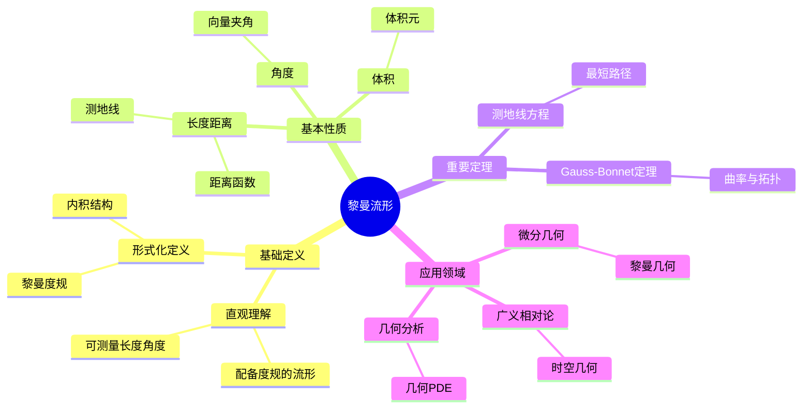
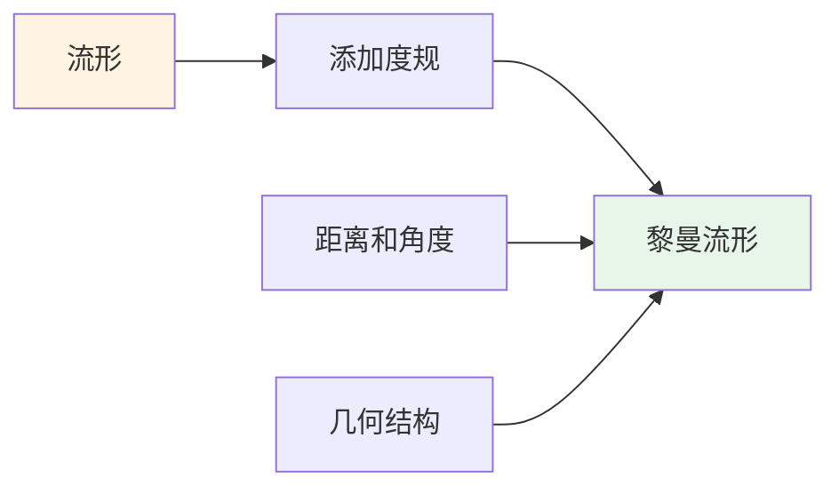
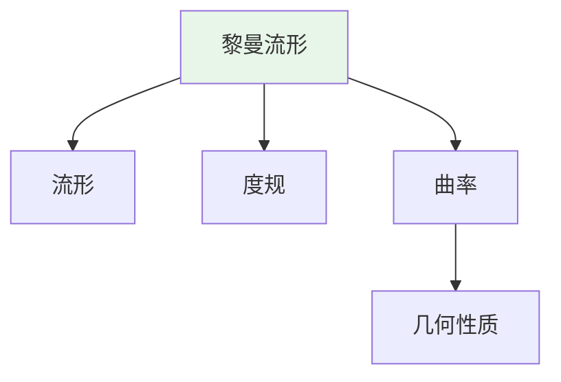
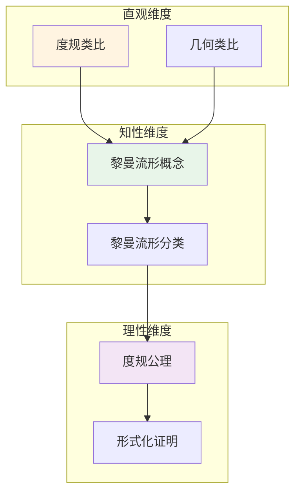

# 黎曼流形 (Riemannian Manifold)

**概念编号**: C.CORE.019
**知识层次**: L0-L2
**知识领域**: D4 (几何)
**创建日期**: 2025年11月21日
**最后更新**: 2025年11月21日

---

## 📋 概述

黎曼流形是配备度规的微分流形，可以定义长度、角度、体积和曲率。
黎曼流形是微分几何的核心，在广义相对论、几何分析等领域有重要应用。

**权威资源对齐**:

- Wikipedia: [Riemannian Manifold](https://en.wikipedia.org/wiki/Riemannian_manifold)
- Stanford课程: Math 215A (Differential Topology)
- Princeton课程: MAT 520 (Differential Geometry)
- MIT课程: 18.965 (Geometry of Manifolds)
- Metamath: [Riemannian Geometry](http://us.metamath.org/mpeuni/df-riemann.html)

---

## 🎯 严格定义

### 基础定义 (L0)

**直观理解**: 黎曼流形是配备"度量"的流形，可以在其上测量长度、角度和面积。

**基本定义**: 黎曼流形 $(M, g)$ 是光滑流形 $M$ 配备黎曼度规 $g$，度规在每点定义内积。

**简单例子**:

- 欧几里得空间 $\mathbb{R}^n$（配备标准度规）
- 球面 $S^2$（配备诱导度规）
- 环面 $T^2$（配备平坦度规）

### 形式化定义 (L1)

**黎曼度规**: 黎曼度规 $g$ 是流形 $M$ 上的 $(0,2)$ 型张量场，满足：

1. **对称性**: $g_p(X, Y) = g_p(Y, X)$
2. **正定性**: $g_p(X, X) \geq 0$，等号当且仅当 $X = 0$
3. **光滑性**: $g$ 是光滑的

**黎曼流形**: 黎曼流形 $(M, g)$ 是光滑流形 $M$ 配备黎曼度规 $g$。

**记号**:

- $(M, g)$: 黎曼流形
- $g_p$: 在点 $p$ 的度规
- $ds^2 = g_{ij} dx^i dx^j$: 度规的局部表示
- $\langle X, Y \rangle = g(X, Y)$: 内积

---

## 📚 历史背景

### 发展脉络

**19世纪**: 黎曼几何的起源

- **Riemann (1854)**: 在《论几何学基础》中引入黎曼几何
- **Gauss (1827)**: 研究曲面理论

**20世纪**: 黎曼几何的发展

- **Einstein (1915)**: 在广义相对论中使用黎曼几何
- **Cartan (1920s)**: 发展联络理论

### 关键人物

- **Bernhard Riemann (1826-1866)**: 黎曼几何的创始人
- **Carl Friedrich Gauss (1777-1855)**: 曲面理论的奠基者
- **Albert Einstein (1879-1955)**: 在广义相对论中应用黎曼几何

---

## 🔍 性质与定理

### 基本性质 (L1)

**性质1: 长度和距离**:

- 曲线的长度：$L(\gamma) = \int_a^b \sqrt{g(\dot{\gamma}, \dot{\gamma})} dt$
- 距离：$d(p, q) = \inf\{L(\gamma) : \gamma \text{ 连接 } p, q\}$

**性质2: 角度**:

- 两向量的角度：$\cos\theta = \frac{g(X, Y)}{\sqrt{g(X, X) g(Y, Y)}}$

**性质3: 体积**:

- 体积元：$dV = \sqrt{\det(g)} dx^1 \wedge \cdots \wedge dx^n$

### 重要定理 (L2)

**定理1: 测地线方程**:

- **陈述**: 测地线满足 $\frac{d^2 x^i}{dt^2} + \Gamma_{jk}^i \frac{dx^j}{dt} \frac{dx^k}{dt} = 0$
- **应用**: 广义相对论中的自由落体

**定理2: Gauss-Bonnet定理**:

- **陈述**: 紧致2维黎曼流形满足 $\int_M K dA = 2\pi \chi(M)$
- **应用**: 曲面的拓扑分类

---

## 💡 应用实例

### 理论应用

- 微分几何（黎曼几何）
- 广义相对论（时空是4维黎曼流形）
- 几何分析（几何偏微分方程）

### 实际应用

- 物理学（广义相对论）
- 最优传输（Wasserstein距离）
- 机器学习（流形学习）

---

## 🔗 关联概念

### 依赖关系

- 流形（黎曼流形是配备度规的流形）
- 张量（度规是张量场）

### 推广关系

- 伪黎曼流形（度规不要求正定）
- Finsler流形（更一般的度量）

---

## 📖 参考文献

- Wikipedia: [Riemannian Manifold](https://en.wikipedia.org/wiki/Riemannian_manifold)
- do Carmo, M. P. (1992). *Riemannian Geometry*. Birkhäuser.
- Lee, J. M. (2018). *Introduction to Riemannian Manifolds*. Springer.

---

## 🗺️ 思维导图 (编号: C.CORE.019.MIND)

### 黎曼流形概念思维导图

---

## 📊 知识多维关系矩阵 (编号: C.CORE.019.MATRIX)

### 黎曼流形的多维关系矩阵

| 维度 | 指标 | 黎曼流形 |
|------|------|----------|
| **知识层次** | L0基础 | ⭐⭐⭐ |
| | L1中级 | ⭐⭐⭐ |
| | L2高级 | ⭐⭐⭐⭐⭐ |
| | L3研究 | ⭐⭐⭐ |
| **知识领域** | D1基础数学 | ⭐⭐ |
| | D4几何 | ⭐⭐⭐⭐⭐ |
| | D5拓扑 | ⭐⭐⭐ |
| | D8交叉领域 | ⭐⭐⭐ |
| **依赖关系** | 前置概念 | 流形、张量 |
| | 后续概念 | 曲率、测地线 |
| **应用关系** | 理论应用 | ⭐⭐⭐⭐ |
| | 实际应用 | ⭐⭐⭐ |
| | 交叉应用 | ⭐⭐⭐ |
| **学习难度** | 直观理解 | ⭐⭐⭐⭐ |
| | 形式化理解 | ⭐⭐⭐⭐⭐ |
| | 深入应用 | ⭐⭐⭐⭐⭐ |

---

## 💭 形象化解释与论证 (编号: C.CORE.019.VISUAL)

### 形象化解释

**1. 黎曼流形的直观理解**:

- **类比**: 黎曼流形就像"配备尺子的流形"，可以在其上测量长度、角度和面积
- **例子**:
  - 球面：配备诱导度规，可以测量球面上的距离和角度
  - 平面：配备标准度规，就是欧几里得几何
  - 双曲平面：配备双曲度规，是双曲几何

**2. 度规的直观理解**:

- **类比**: 度规就像"内积的场"或"每点的尺子"
- **解释**:
  - 在每点定义内积，可以测量向量的长度和角度
  - 度规张量$g_{ij}$给出度规的局部表示
  - 度规决定流形的几何性质

**3. 测地线的直观理解**:

- **类比**: 测地线就像"流形上的直线"或"最短路径"
- **例子**:
  - 在球面上，测地线是大圆（如赤道、经线）
  - 在平面上，测地线是直线
  - 在广义相对论中，测地线是自由落体路径

### 认知科学视角

**1. 数学教育家Dienes的观点**:

- **多表征原则**: 通过几何（距离、角度）、物理（测地线）、代数（度规张量）等多种方式理解黎曼流形
- **变化性原则**: 通过不同的黎曼流形例子理解黎曼流形的本质
- **教学启示**: 使用具体曲面、度规可视化、物理类比等多种方法

**2. 数学认知学家Tall的观点**:

- **过程-对象对偶**: 理解"度规构造过程"（如何定义度规）和"黎曼流形"（对象）
- **认知层次**: 从直观理解（"配备尺子的流形"）到形式化理解（度规张量定义）

---

## 👨‍🏫 专家观点与论证 (编号: C.CORE.019.EXPERT)

### 数学家的观点

**1. Bernhard Riemann (1826-1866) - 黎曼几何的创始人**:
> "黎曼几何是研究弯曲空间的基础，度规决定了空间的几何性质。"
>
> **意义**: Riemann建立了黎曼几何，开创了现代微分几何。

**2. Albert Einstein (1879-1955) - 广义相对论的提出者**:
> "时空是4维黎曼流形，度规由物质和能量决定，这解释了引力。"
>
> **意义**: Einstein在广义相对论中应用黎曼几何，揭示了时空的几何本质。

**3. Élie Cartan (1869-1951) - 联络理论的奠基者**:
> "联络理论是研究黎曼流形的重要工具，它揭示了流形的几何结构。"
>
> **意义**: Cartan发展了联络理论，为现代微分几何奠定了基础。

### 数学教育家的观点

**1. Zoltan Dienes (1916-2014) - 数学教育家**:
> "黎曼流形概念应该通过具体曲面、度规可视化、物理类比等多种方式学习。"
>
> **教学启示**:
>
> - 从球面、环面等具体曲面开始
> - 使用度规可视化理解度规的作用
> - 通过物理类比（如广义相对论）理解黎曼流形

**2. Hans Freudenthal (1905-1990) - 数学教育家**:
> "黎曼流形概念的学习需要从'流形扩展'发展到'度规结构'。"
>
> **认知发展**:
>
> - **扩展阶段**: 理解黎曼流形作为流形的扩展（添加度规）
> - **结构阶段**: 理解度规如何决定流形的几何结构

### 数学认知学家的观点

**1. David Tall - 数学认知学家**:
> "黎曼流形概念的理解需要从'过程'（如何定义度规）发展到'对象'（黎曼流形本身）。"
>
> **认知层次**:
>
> - **过程层次**: 理解"如何定义度规"（如$g_{ij}dx^idx^j$）
> - **对象层次**: 理解"黎曼流形"（如$(M,g)$是一个黎曼流形）

---

## 🎨 认知维度表征 (编号: C.CORE.019.COGNITIVE)

### 直观维度表征 (编号: C.CORE.019.INTUITIVE)

#### 形象类比

- **度规类比**: 黎曼流形就像"配备了度规的流形"
  - 度规定义了流形上每点的"距离"和"角度"
  - 就像在流形上定义了"尺子"

- **几何类比**: 黎曼流形就像"可以测量距离和角度的空间"
  - 就像欧几里得空间，但可能是弯曲的
  - 度规决定了空间的几何性质

#### 具体例子

- **例子1**: $(\mathbb{R}^n, g_{\text{std}})$ - $n$维欧几里得空间
  - 标准度规：$g_{ij} = \delta_{ij}$
  - 这是平坦的黎曼流形

- **例子2**: $S^2$ - 2维球面
  - 球面上的度规
  - 这是弯曲的黎曼流形

#### 可视化表示

#### 几何直观

- **度规直观**: 通过度规理解黎曼流形
  - 度规定义了距离
  - 度规定义了角度

- **曲率直观**: 通过曲率理解黎曼流形
  - 曲率反映空间的弯曲程度
  - 平坦流形曲率为0

---

### 知性维度表征 (编号: C.CORE.019.INTELLECTUAL)

#### 概念定义

- **严格定义**: 黎曼流形 $(M,g)$ 是流形 $M$ 配备正定对称双线性形式 $g$（度规）
- **等价定义**: 通过度规张量、线元定义
- **特征描述**: 黎曼流形是可以测量距离和角度的流形

#### 概念分类

- **平坦流形 vs 弯曲流形**: 按曲率分类
- **紧流形 vs 非紧流形**: 按紧性分类
- **常曲率流形 vs 变曲率流形**: 按曲率变化分类

#### 概念关系

#### 知识矩阵

| 维度 | 指标 | 黎曼流形 |
|------|------|---------|
| **知识层次** | L0基础 | ⭐⭐⭐ |
| | L1中级 | ⭐⭐⭐⭐ |
| | L2高级 | ⭐⭐⭐⭐⭐ |
| **知识领域** | D4几何 | ⭐⭐⭐⭐⭐ |
| **学习难度** | 直观理解 | ⭐⭐⭐⭐ |
| | 形式化理解 | ⭐⭐⭐⭐⭐ |
| **认知维度** | 直观维度 | ⭐⭐⭐⭐ |
| | 知性维度 | ⭐⭐⭐⭐ |
| | 理性维度 | ⭐⭐⭐⭐⭐ |

---

### 理性维度表征 (编号: C.CORE.019.RATIONAL)

#### 公理体系

- **流形公理**: 黎曼流形首先是流形
- **度规公理**: 度规是正定对称双线性形式
- **相容性公理**: 度规与流形结构相容

#### 形式化定义

- **形式化定义**: 使用一阶逻辑严格定义
- **符号系统**: $(M,g)$, $g_{ij}$, $ds^2 = g_{ij}dx^idx^j$
- **类型系统**: 黎曼流形是流形类型配备度规类型的数学结构

#### 逻辑推理

- **基本定理**: 度规的存在性、Levi-Civita联络、曲率张量
- **证明思路**: 使用微分几何和流形方法证明
- **推理链**: 定义 → 基本性质 → 联络 → 曲率 → 重要定理

#### 证明系统

- **证明方法**: 构造性证明、微分几何方法、变分方法
- **形式化证明**: 可以使用Lean4等工具进行形式化
- **验证工具**: Metamath、Lean4等

---

### 综合整合表征 (编号: C.CORE.019.INTEGRATED)

#### 多维度整合

#### 图形转换

- **思维导图**: 展示黎曼流形的知识结构
- **知识图谱**: 展示黎曼流形与其他概念的关系
- **知识矩阵**: 展示黎曼流形的多维度特征

#### 应用示例

- **应用1**: 微分几何（曲率、测地线）
- **应用2**: 广义相对论（时空流形）
- **应用3**: 几何分析（Ricci流、Yamabe问题）

---

**创建日期**: 2025年11月21日
**最后更新**: 2025年11月21日
**维护状态**: 持续更新中
