---
msc_primary: "00A99"
---

# 黎曼流形 (Riemannian Manifold) - 三视角组织版

**概念编号**: C.CORE.019
**知识层次**: L0-L2
**知识领域**: D4 (几何)
**创建日期**: 2025年1月
**最后更新**: 2026-04-05

---

## 📋 目录 / Table of Contents

- [黎曼流形 (Riemannian Manifold) - 三视角组织版](#黎曼流形-riemannian-manifold---三视角组织版)
  - 📋 目录 / Table of Contents
  - 1. 📋 概述 (编号: C.CORE.019.01)
  - [🧠 认知学视角：如何理解黎曼流形 (编号: C.CORE.019.02)](#认知学视角如何理解黎曼流形-编号-ccore01902)
    - [认知起点 (编号: C.CORE.019.02.01)](#认知起点-编号-ccore0190201)
    - [认知过程 (编号: C.CORE.019.02.02)](#认知过程-编号-ccore0190202)
      - [阶段1：直观理解阶段 (编号: C.CORE.019.02.02.01)](#阶段1直观理解阶段-编号-ccore019020201)
      - [阶段2：概念形成阶段 (编号: C.CORE.019.02.02.02)](#阶段2概念形成阶段-编号-ccore019020202)
      - [阶段3：形式化阶段 (编号: C.CORE.019.02.02.03)](#阶段3形式化阶段-编号-ccore019020203)

## 形式化定义

**定义（黎曼度量）**：流形 $M$ 上的**黎曼度量** $g$ 是光滑地指定每点 $p \in M$ 处切空间上的内积：
$$g_p: T_pM \times T_pM \to \mathbb{R}$$
对称、正定、双线性

**定义（黎曼流形）**：**黎曼流形**是有序对 $(M, g)$，其中 $M$ 是光滑流形，$g$ 是黎曼度量

**局部表示**：在坐标 $(x^1, \ldots, x^n)$ 下：
$$g = \sum_{i,j} g_{ij}\,dx^i \otimes dx^j, \quad g_{ij} = g\left(\frac{\partial}{\partial x^i}, \frac{\partial}{\partial x^j}\right)$$

**符号说明**：
- $(M, g)$：黎曼流形
- $g_{ij}$：度量张量的分量
- $g^{ij}$：逆度量张量
- $\langle v, w \rangle_g = g(v, w)$：内积
- $\|v\|_g = \sqrt{g(v, v)}$：范数

    - [认知障碍 (编号: C.CORE.019.02.03)](#认知障碍-编号-ccore0190203)
    - [认知工具 (编号: C.CORE.019.02.04)](#认知工具-编号-ccore0190204)
  - [🎓 教育学视角：如何教学黎曼流形 (编号: C.CORE.019.03)](#教育学视角如何教学黎曼流形-编号-ccore01903)
    - [教学目标 (编号: C.CORE.019.03.01)](#教学目标-编号-ccore0190301)
    - [教学路径 (编号: C.CORE.019.03.02)](#教学路径-编号-ccore0190302)
      - [阶段1：引入阶段（激发兴趣） (编号: C.CORE.019.03.02.01)](#阶段1引入阶段激发兴趣-编号-ccore019030201)
      - [阶段2：探索阶段（主动建构） (编号: C.CORE.019.03.02.02)](#阶段2探索阶段主动建构-编号-ccore019030202)
      - [阶段3：形式化阶段（抽象概括） (编号: C.CORE.019.03.02.03)](#阶段3形式化阶段抽象概括-编号-ccore019030203)
      - [阶段4：巩固阶段（应用深化） (编号: C.CORE.019.03.02.04)](#阶段4巩固阶段应用深化-编号-ccore019030204)
    - [教学难点 (编号: C.CORE.019.03.03)](#教学难点-编号-ccore0190303)
    - [教学策略 (编号: C.CORE.019.03.04)](#教学策略-编号-ccore0190304)
    - [评估方法 (编号: C.CORE.019.03.05)](#评估方法-编号-ccore0190305)
  - [🔬 数学家视角：如何思考黎曼流形 (编号: C.CORE.019.04)](#数学家视角如何思考黎曼流形-编号-ccore01904)
    - [问题起源 (编号: C.CORE.019.04.01)](#问题起源-编号-ccore0190401)
    - [思维过程 (编号: C.CORE.019.04.02)](#思维过程-编号-ccore0190402)
      - [步骤1：问题提出 (编号: C.CORE.019.04.02.01)](#步骤1问题提出-编号-ccore019040201)
      - [步骤2：概念形成 (编号: C.CORE.019.04.02.02)](#步骤2概念形成-编号-ccore019040202)
      - [步骤3：理论发展 (编号: C.CORE.019.04.02.03)](#步骤3理论发展-编号-ccore019040203)
    - [历史发展 (编号: C.CORE.019.04.03)](#历史发展-编号-ccore0190403)
    - [3.2 关键人物和贡献 (编号: C.CORE.019.04.04)](#32-关键人物和贡献-编号-ccore0190404)
    - [重要定理 (编号: C.CORE.019.04.05)](#重要定理-编号-ccore0190405)
    - [开放问题 (编号: C.CORE.019.04.06)](#开放问题-编号-ccore0190406)
    - [一、第一人称思维描述 (编号: C.CORE.019.04.07)](#一第一人称思维描述-编号-ccore0190407)
      - [1.1 Riemann的发现过程](#11-riemann的发现过程)
    - [二、数学直觉的形成 (编号: C.CORE.019.04.08)](#二数学直觉的形成-编号-ccore0190408)
      - [2.1 直觉在概念发现中的作用](#21-直觉在概念发现中的作用)
      - [2.2 如何培养黎曼流形直觉](#22-如何培养黎曼流形直觉)
    - [三、数学美的教育价值 (编号: C.CORE.019.04.09)](#三数学美的教育价值-编号-ccore0190409)
      - [3.1 黎曼流形论的美在哪里](#31-黎曼流形论的美在哪里)
      - [3.2 如何培养学生的数学美感](#32-如何培养学生的数学美感)
    - [四、问题解决策略 (编号: C.CORE.019.04.10)](#四问题解决策略-编号-ccore0190410)
      - [4.1 数学家的启发式方法](#41-数学家的启发式方法)
      - [4.2 思维过程分析](#42-思维过程分析)
    - [五、批判性反思 (编号: C.CORE.019.04.11)](#五批判性反思-编号-ccore0190411)
      - [5.1 黎曼流形概念的局限性](#51-黎曼流形概念的局限性)
      - [5.2 黎曼流形理论的未解决问题](#52-黎曼流形理论的未解决问题)
  - [💡 数学解释：为什么黎曼流形是这样定义的 (编号: C.CORE.019.05)](#数学解释为什么黎曼流形是这样定义的-编号-ccore01905)
    - [一、直观解释：黎曼流形是什么？](#一直观解释黎曼流形是什么)
      - [1.1 具体例子](#11-具体例子)
      - [1.2 形象类比](#12-形象类比)
      - [1.3 几何直观](#13-几何直观)
      - [1.4 操作体验](#14-操作体验)
    - [二、知性解释：黎曼流形的本质是什么？](#二知性解释黎曼流形的本质是什么)
      - [2.1 概念定义](#21-概念定义)
      - [2.2 分类体系](#22-分类体系)
      - [2.3 抽象结构](#23-抽象结构)
      - [2.4 知识体系](#24-知识体系)
    - [三、理性解释：黎曼流形的公理化定义](#三理性解释黎曼流形的公理化定义)
      - [3.1 公理体系](#31-公理体系)
      - [3.2 形式化证明](#32-形式化证明)
      - [3.3 系统建构](#33-系统建构)
    - [四、多视角解释：从不同角度理解黎曼流形](#四多视角解释从不同角度理解黎曼流形)
      - [4.1 数学家视角：黎曼流形是如何被发现的？](#41-数学家视角黎曼流形是如何被发现的)
      - [4.2 教育者视角：如何教学黎曼流形？](#42-教育者视角如何教学黎曼流形)
      - [4.3 学习者视角：如何学习黎曼流形？](#43-学习者视角如何学习黎曼流形)
      - [4.4 应用者视角：如何应用黎曼流形？](#44-应用者视角如何应用黎曼流形)
    - [五、思维表征：用多种方式理解黎曼流形](#五思维表征用多种方式理解黎曼流形)
      - [5.1 思维导图：黎曼流形的知识结构](#51-思维导图黎曼流形的知识结构)
      - [5.2 矩阵对比：不同解释方式的对比](#52-矩阵对比不同解释方式的对比)
      - [5.3 多视角表征：从不同角度表征黎曼流形](#53-多视角表征从不同角度表征黎曼流形)
      - [5.4 决策树：黎曼流形问题分类和策略选择](#54-决策树黎曼流形问题分类和策略选择)
      - [5.5 决策逻辑路径：黎曼流形问题解决过程](#55-决策逻辑路径黎曼流形问题解决过程)
      - [5.6 多维对比矩阵：黎曼流形概念特征对比](#56-多维对比矩阵黎曼流形概念特征对比)
  - [🔍 数学论证：如何论证黎曼流形 (编号: C.CORE.019.06)](#数学论证如何论证黎曼流形-编号-ccore01906)
    - [一、论证过程：从观察到反思](#一论证过程从观察到反思)
      - [1.1 观察（Observation）](#11-观察observation)
      - [1.2 猜想（Conjecture）](#12-猜想conjecture)
      - [1.3 证明（Proof）](#13-证明proof)
      - [1.4 反思（Reflection）](#14-反思reflection)
    - [二、论证类型：多种推理方式](#二论证类型多种推理方式)
      - [2.1 归纳论证（Inductive Reasoning）](#21-归纳论证inductive-reasoning)
      - [2.2 演绎论证（Deductive Reasoning）](#22-演绎论证deductive-reasoning)
      - [2.3 类比论证（Analogical Reasoning）](#23-类比论证analogical-reasoning)
      - [2.4 构造论证（Constructive Reasoning）](#24-构造论证constructive-reasoning)
    - [三、论证可视化：用图形表示论证过程](#三论证可视化用图形表示论证过程)
      - [3.1 论证流程图](#31-论证流程图)
      - [3.2 论证类型对比](#32-论证类型对比)
      - [3.3 论证思维导图](#33-论证思维导图)
  - [🔗 三视角整合 (编号: C.CORE.019.07)](#三视角整合-编号-ccore01907)
    - [三个视角的关联](#三个视角的关联)
    - [如何综合运用三个视角](#如何综合运用三个视角)
  - [📚 参考文献 (编号: C.CORE.019.08)](#参考文献-编号-ccore01908)
    - [权威资源](#权威资源)
    - [经典教材](#经典教材)
    - [研究论文](#研究论文)


---

## 1. 📋 概述 (编号: C.CORE.019.01)

黎曼流形是配备度规的微分流形，可以定义长度、角度、体积和曲率。黎曼流形是微分几何的核心，在广义相对论、几何分析等领域有重要应用。

本文档从**数学认知学**、**教育学**、**数学家**三个视角深入展开黎曼流形概念，避免简单的概念堆垒。

**权威资源对齐**:

- Wikipedia: [Riemannian Manifold](https://en.wikipedia.org/wiki/Riemannian_manifold)
- Stanford课程: Math 215A (Differential Topology)
- Princeton课程: MAT 520 (Differential Geometry)
- MIT课程: 18.965 (Geometry of Manifolds)
- Metamath: [Riemannian Geometry](http://us.metamath.org/mpeuni/df-riemann.html)[需更新][需更新]

---

## 🧠 认知学视角：如何理解黎曼流形 (编号: C.CORE.019.02)

### 认知起点 (编号: C.CORE.019.02.01)

**学习者已有的知识基础**:

- 流形的概念
- 内积的概念
- 日常经验中的"距离"、"角度"概念

**日常经验中的类似概念**:

- "距离"：两点之间的距离
- "角度"：两条线之间的角度
- "面积"：区域的面积

### 认知过程 (编号: C.CORE.019.02.02)

#### 阶段1：直观理解阶段 (编号: C.CORE.019.02.02.01)

**具体例子**:

- 例子1：欧几里得空间$\mathbb{R}^n$（配备标准度规）
- 例子2：球面$S^2$（配备诱导度规）
- 例子3：环面$T^2$（配备平坦度规）

**形象类比**:

- **度量类比**: 黎曼流形就像"可以测量距离和角度的流形"
  - 度规定义内积
  - 内积定义长度和角度
  - 可以测量几何量

- **结构类比**: 黎曼流形就像"配备度规的流形"
  - 流形提供拓扑结构
  - 度规提供几何结构
  - 两者结合形成黎曼流形

**可视化表示**:

```text
黎曼流形:
    M (流形)
         ↓
    g (度规)
         ↓
    长度、角度、曲率
```

#### 阶段2：概念形成阶段 (编号: C.CORE.019.02.02.02)

**从例子中抽象出共同特征**:

- 所有例子都涉及"度规"
- 度规定义内积
- 内积定义长度和角度

**识别关键属性**:

1. **对称性**: $g_p(X, Y) = g_p(Y, X)$
2. **正定性**: $g_p(X, X) \geq 0$，等号当且仅当$X = 0$
3. **光滑性**: $g$是光滑的

**建立概念边界**:

- **什么是黎曼流形**: 配备黎曼度规的光滑流形
- **什么不是黎曼流形**:
  - 没有度规的流形（不是黎曼流形）

#### 阶段3：形式化阶段 (编号: C.CORE.019.02.02.03)

**严格定义**:

- 黎曼度规：满足对称性、正定性、光滑性的$(0,2)$型张量场
- 黎曼流形：配备黎曼度规的光滑流形

**公理化表述**:

- 条件1：对称性
- 条件2：正定性
- 条件3：光滑性

**逻辑结构**:

- 黎曼流形是微分几何的核心
- 黎曼流形可以定义长度、角度、曲率
- 黎曼流形是物理学的基础

### 认知障碍 (编号: C.CORE.019.02.03)

**常见误解**:

1. **误解1**: 认为所有流形都是黎曼流形
   - **纠正**: 不是所有流形都是黎曼流形，需要配备度规

2. **误解2**: 认为度规就是距离
   - **纠正**: 度规定义内积，内积定义距离

3. **误解3**: 混淆黎曼流形和伪黎曼流形
   - **纠正**: 黎曼流形度规正定，伪黎曼流形度规不定

**理解难点**:

1. **难点1**: 度规的抽象性
   - **原因**: 度规比较抽象
   - **解决方法**: 从具体例子开始，逐步抽象

2. **难点2**: 张量场的概念
   - **原因**: 张量场比较抽象
   - **解决方法**: 用具体例子，强调张量场的作用

3. **难点3**: 度规的计算
   - **原因**: 度规计算比较复杂
   - **解决方法**: 用具体例子，逐步掌握计算方法

**认知陷阱**:

- **度规**: 需要理解度规的作用
- **内积**: 需要理解内积的定义

### 认知工具 (编号: C.CORE.019.02.04)

**类比工具**:

- **度量类比**: 黎曼流形 = 可以测量距离和角度的流形
- **结构类比**: 黎曼流形 = 配备度规的流形

**可视化工具**:

- **度规图**: 用度规图表示黎曼流形
- **几何图**: 用几何图表示长度和角度

**具体化工具**:

- **具体例子**: 用具体例子理解抽象概念
- **反例**: 用反例理解概念边界

---

## 🎓 教育学视角：如何教学黎曼流形 (编号: C.CORE.019.03)

### 教学目标 (编号: C.CORE.019.03.01)

**知识目标**:

- 理解黎曼流形的基本概念
- 掌握度规的定义
- 理解黎曼流形的性质
- 理解黎曼流形的应用

**能力目标**:

- 能够计算度规
- 能够理解黎曼流形的性质
- 能够应用黎曼流形解决实际问题
- 能够理解黎曼流形的重要性

**情感目标**:

- 培养数学抽象思维
- 培养几何思维
- 激发对数学的兴趣

### 教学路径 (编号: C.CORE.019.03.02)

#### 阶段1：引入阶段（激发兴趣） (编号: C.CORE.019.03.02.01)

**实际问题**:

- 问题1：如何在流形上测量距离？
- 问题2：如何研究几何结构？
- 问题3：如何研究物理空间？

**历史背景**:

- 黎曼流形的历史发展
- 黎曼流形在数学中的地位
- 黎曼流形在物理中的应用

**引发认知冲突**:

- 问题：如何统一描述各种几何空间？
- 引出黎曼流形的概念

#### 阶段2：探索阶段（主动建构） (编号: C.CORE.019.03.02.02)

**引导发现**:

1. 让学生自己列举"可以测量距离"的例子
2. 让学生观察这些例子的共同特征
3. 引导学生抽象出黎曼流形的定义

**合作探究**:

- 小组讨论：什么是黎曼流形？
- 小组讨论：黎曼流形有哪些性质？
- 小组讨论：如何表示黎曼流形？

**多元表征**:

- **语言表征**: "黎曼流形是配备度规的光滑流形"
- **符号表征**: $(M, g)$
- **图形表征**: 度规图、几何图
- **集合表征**: 度规定义

#### 阶段3：形式化阶段（抽象概括） (编号: C.CORE.019.03.02.03)

**严格定义**:

- 度规的定义
- 黎曼流形的定义
- 黎曼流形的性质

**性质证明**:

- 度规的基本性质
- 黎曼流形的几何性质
- 曲率的定义

**应用拓展**:

- 黎曼流形在微分几何中的应用
- 黎曼流形在物理中的应用
- 黎曼流形在工程中的应用

#### 阶段4：巩固阶段（应用深化） (编号: C.CORE.019.03.02.04)

**练习应用**:

- 基础练习：度规的计算和性质
- 应用练习：用黎曼流形解决实际问题
- 综合练习：黎曼流形的综合应用

**变式训练**:

- 不同形式的度规
- 不同性质的黎曼流形
- 黎曼流形的应用

**知识整合**:

- 黎曼流形与其他概念的联系
- 黎曼流形在数学体系中的地位

### 教学难点 (编号: C.CORE.019.03.03)

**难点1：度规的抽象性**:

- **难点描述**: 学生难以理解度规
- **解决方法**:
  - 从具体例子开始
  - 逐步抽象
  - 用具体例子说明

**难点2：张量场的概念**:

- **难点描述**: 学生难以理解张量场
- **解决方法**:
  - 用具体例子
  - 强调张量场的作用
  - 用图形可视化

**难点3：度规的计算**:

- **难点描述**: 学生难以计算度规
- **解决方法**:
  - 用具体例子
  - 逐步掌握计算方法
  - 用练习巩固

### 教学策略 (编号: C.CORE.019.03.04)

**策略1：从具体到抽象**:

- 先给出具体例子
- 再抽象出一般概念
- 最后给出严格定义

**策略2：多元表征**:

- 用语言、符号、图形等多种方式表示同一概念
- 帮助学生建立不同表征之间的联系

**策略3：问题驱动**:

- 从实际问题出发
- 引出数学概念
- 解决问题

**策略4：可视化教学**:

- 使用度规图
- 使用几何图
- 使用具体例子

### 评估方法 (编号: C.CORE.019.03.05)

**形成性评估**（评估理解过程）:

- 课堂提问：检查学生对概念的理解
- 小组讨论：观察学生的思考过程
- 练习作业：检查学生的应用能力

**总结性评估**（评估最终理解）:

- 测验：检查学生对概念和计算的掌握
- 项目：检查学生应用黎曼流形解决实际问题的能力
- 反思：检查学生对黎曼流形概念的理解深度

---

## 🔬 数学家视角：如何思考黎曼流形 (编号: C.CORE.019.04)

### 问题起源 (编号: C.CORE.019.04.01)

**历史背景**:

- 19世纪：黎曼流形的起源
- 20世纪：黎曼流形的发展
- 20世纪中期：黎曼流形的现代发展

**原始问题**:

- **问题1**: 如何在流形上测量距离？
- **问题2**: 如何研究几何结构？
- **问题3**: 黎曼流形有哪些性质？

**研究动机**:

- 统一几何理论
- 发展微分几何
- 研究物理空间

### 思维过程 (编号: C.CORE.019.04.02)

#### 步骤1：问题提出 (编号: C.CORE.019.04.02.01)

**观察到的现象**:

- 需要在流形上测量距离
- 需要研究几何结构
- 需要统一几何理论

**提出的猜想**:

- 可以引入度规概念
- 度规可以定义距离和角度
- 黎曼流形有丰富的性质

**需要解决的问题**:

- 如何定义度规？
- 度规应该满足什么条件？
- 黎曼流形有哪些性质？

#### 步骤2：概念形成 (编号: C.CORE.019.04.02.02)

**尝试性定义**:

- **度规定义**: 通过对称性、正定性、光滑性
- **黎曼流形定义**: 配备度规的光滑流形

**性质探索**:

- 度规的基本性质
- 黎曼流形的几何性质
- 曲率的定义

**结构发现**:

- 黎曼流形是微分几何的核心
- 黎曼流形可以定义长度、角度、曲率
- 黎曼流形是物理学的基础

#### 步骤3：理论发展 (编号: C.CORE.019.04.02.03)

**定理证明**:

- 度规的基本性质
- 黎曼流形的几何性质
- 曲率的性质

**应用拓展**:

- 黎曼流形在微分几何中的应用
- 黎曼流形在物理中的应用
- 黎曼流形在工程中的应用

**理论完善**:

- 度规的严格定义
- 黎曼流形的范畴论研究
- 黎曼流形的应用研究

### 历史发展 (编号: C.CORE.019.04.03)

**早期阶段**（19世纪）:

- **Riemann (1854)**: 引入黎曼几何
- **Gauss (1827)**: 研究曲面理论

**关键突破**（20世纪）:

- **Levi-Civita (1917)**: 发展平行移动理论
- **Cartan (1923)**: 发展活动标架法

**现代发展**（20世纪中期）:

- **Chern (1944)**: 发展Chern类理论
- **Yau (1978)**: 证明Calabi猜想

### 3.2 关键人物和贡献 (编号: C.CORE.019.04.04)

**Bernhard Riemann (1826-1866)**:

- 引入黎曼几何
- 建立微分几何基础

**Tullio Levi-Civita (1873-1941)**:

- 发展平行移动理论
- 建立现代黎曼几何

**Shing-Shen Chern (1911-2004)**:

- 发展Chern类理论
- 建立现代微分几何

### 重要定理 (编号: C.CORE.019.04.05)

**Gauss-Bonnet定理**:

- 曲面的Gauss曲率积分等于Euler特征数
- 意义：连接几何和拓扑

**Hopf-Rinow定理**:

- 完备黎曼流形的等价条件
- 意义：完备性的刻画

**Myers定理**:

- 正Ricci曲率流形的直径估计
- 意义：曲率对几何的影响

### 开放问题 (编号: C.CORE.019.04.06)

**未解决问题**:

- 黎曼流形的分类问题
- 黎曼流形的表示问题
- 黎曼流形的应用问题

**研究方向**:

- 黎曼流形的范畴论研究
- 黎曼流形的几何研究
- 黎曼流形的应用研究

### 一、第一人称思维描述 (编号: C.CORE.019.04.07)

#### 1.1 Riemann的发现过程

**详细历史背景**:

- **1854年**：Riemann发表《关于几何基础的假设》（Über die Hypothesen, welche der Geometrie zu Grunde liegen）
- **背景**：研究弯曲空间，发现需要在流形上定义距离
- **问题**：如何定义流形上的距离？如何研究弯曲空间的几何？

**Riemann的详细第一人称描述**:
> "1854年，我在研究弯曲空间时，遇到了一个问题：如何在流形上定义距离？
>
> 我发现，在$\mathbb{R}^n$中，距离可以通过内积定义：$d(x,y) = \sqrt{\langle x-y, x-y \rangle}$。但在流形上，每一点的切空间不同，需要定义每一点的内积。
>
> 我的方法是这样的：
>
> - **思路**：在流形上每一点的切空间定义内积（度规）
> - **定义**：度规$g$是流形上每一点切空间的正定对称双线性形式
> - **距离**：流形上两点之间的距离是连接它们的曲线长度的下确界
>
> 例如，对于球面$S^2$：
>
> - **度规**：在每一点$(x,y,z)$，切空间的内积是$\mathbb{R}^3$的标准内积
> - **距离**：两点之间的最短距离是大圆弧的长度
> - **曲率**：球面的Gauss曲率是$\frac{1}{R^2}$，其中$R$是半径
>
> 对于双曲面（负曲率）：
>
> - **度规**：双曲面的度规与球面不同
> - **距离**：两点之间的最短距离是双曲直线
> - **曲率**：双曲面的Gauss曲率是负的
>
> 这让我意识到，度规是定义流形上距离的工具，度规的性质决定了流形的几何。这为黎曼几何提供了基础。"

**详细的思维过程**:

1. **观察到的现象**（1854年）:

   **现象1：流形上需要定义距离**
   - **问题**：如何在流形上定义距离？
   - **例子**：球面上两点之间的距离
   - **需要**：统一的方法

   **现象2：距离可以通过度规定义**
   - **问题**：如何定义度规？
   - **思路**：在每一点的切空间定义内积
   - **需要**：建立度规理论

   **现象3：需要统一的概念**
   - **问题**：如何统一处理不同的流形？
   - **思路**：用度规统一
   - **需要**：建立黎曼几何理论

2. **提出的猜想**（1854年）:

   **猜想1：用度规定义流形上的距离**
   - **思路**：在流形上每一点的切空间定义内积（度规）
   - **例子**：球面的度规
   - **优点**：统一定义流形上的距离

   **猜想2：度规与几何相关**
   - **关系**：度规的性质决定了流形的几何
   - **例子**：正曲率、负曲率、零曲率
   - **意义**：用度规研究几何

   **猜想3：黎曼流形是几何学的基础**
   - **性质**：黎曼流形是抽象的几何结构
   - **应用**：黎曼流形可以应用到更广泛的领域
   - **意义**：黎曼流形是统一的几何结构

3. **遇到的困难**（1854年）:

   **困难1：如何严格定义度规？**
   - **问题**：如何定义度规？
   - **解决**：定义度规为流形上每一点切空间的正定对称双线性形式
   - **意义**：为度规提供严格的数学基础

   **困难2：如何判断度规的性质？**
   - **问题**：如何判断流形的曲率？
   - **解决**：通过度规计算曲率张量
   - **意义**：为流形分类提供方法

   **困难3：如何应用黎曼流形理论？**
   - **问题**：如何用黎曼流形理论解决实际问题？
   - **解决**：建立测地线理论、曲率理论
   - **意义**：为黎曼流形提供应用基础

4. **突破的时刻**（1854年，Riemann）:

   **突破1：度规的概念**
   - 引入度规的概念定义流形上的距离
   - **关键**：在每一点的切空间定义内积
   - **意义**：为黎曼几何提供基础

   **突破2：曲率理论**
   - 建立曲率理论
   - **关键**：度规的性质决定了曲率
   - **意义**：为黎曼几何提供基础

   **突破3：黎曼几何的广泛应用**
   - 黎曼几何可以应用到更广泛的领域
   - **关键**：黎曼流形是抽象的几何结构
   - **意义**：黎曼几何成为几何学的基础

### 二、数学直觉的形成 (编号: C.CORE.019.04.08)

#### 2.1 直觉在概念发现中的作用

**Riemann的直觉**:

- **直觉1**: "度规"是"距离的定义"——这个直觉引导Riemann发现黎曼流形
- **直觉2**: 度规可以研究弯曲空间——这个直觉引导Riemann建立黎曼几何
- **直觉3**: 黎曼流形是几何学的基础——这个直觉引导Riemann建立黎曼流形理论

**直觉的验证**:

- 通过严格的数学证明验证直觉的正确性
- 通过度规严格化黎曼流形定义
- 通过应用验证黎曼流形的广泛性

**直觉的深化**:

- 从"距离的定义"到"黎曼流形的严格定义"
- 从"研究弯曲空间"到"黎曼几何的广泛应用"
- 从"几何学基础"到"黎曼流形的深入发展"

#### 2.2 如何培养黎曼流形直觉

**数学家的建议**:

- **Riemann**: "黎曼流形直觉是长期训练的结果。通过大量练习和深入思考，我们可以培养对黎曼流形的直觉。"
- **Einstein**: "从具体例子开始，逐步抽象，这是培养黎曼流形直觉的有效方法。"

**培养方法**:

1. **大量练习**: 通过大量黎曼流形构造练习，培养对黎曼流形的直觉
2. **深入思考**: 深入思考黎曼流形的本质，理解黎曼流形的深层结构
3. **类比和联想**: 通过类比和联想，建立黎曼流形与其他概念的联系
4. **与专家交流**: 与数学家交流，学习他们的思维方式

**教学启示**:

- 从具体例子开始，逐步抽象
- 鼓励学生思考黎曼流形的本质
- 引导学生建立黎曼流形与其他概念的联系

### 三、数学美的教育价值 (编号: C.CORE.019.04.09)

#### 3.1 黎曼流形论的美在哪里

**结构美**:

- **简洁性**: 黎曼流形的概念非常简洁——"具有度规的流形"
- **统一性**: 黎曼流形可以统一描述数学中的各种弯曲空间
- **和谐性**: 黎曼流形运算满足优美的规律（测地线、曲率等）

**数学家的评价**:

- **Riemann**: "黎曼流形论的美在于它的统一性。它为我们提供了一个统一的框架来理解弯曲空间。"
- **Einstein**: "黎曼流形论的美在于它的基础性。它是几何学的基础，所有弯曲空间都可以用黎曼流形来描述。"

#### 3.2 如何培养学生的数学美感

**数学家的建议**:

- **Riemann**: "展示黎曼流形论的美感，让学生感受到数学的美。"
- **Einstein**: "通过黎曼流形论的历史和发展，让学生理解数学的美。"

**教学方法**:

1. **展示数学美**:
   - 展示黎曼流形概念的简洁性和统一性
   - 展示黎曼流形运算的优美规律
   - 展示黎曼流形在数学中的基础地位

2. **引导学生欣赏**:
   - 引导学生欣赏黎曼流形概念的简洁性
   - 引导学生欣赏黎曼流形运算的和谐性
   - 引导学生欣赏黎曼流形的基础性

3. **鼓励学生创造美**:
   - 鼓励学生发现黎曼流形论的美
   - 鼓励学生创造优美的黎曼流形证明
   - 鼓励学生探索黎曼流形论的美

### 四、问题解决策略 (编号: C.CORE.019.04.10)

#### 4.1 数学家的启发式方法

**策略1：从具体到抽象**:

- 从具体的黎曼流形例子开始
- 抽象出黎曼流形的一般性质
- 建立黎曼流形的理论体系

**策略2：从简单到复杂**:

- 先理解基本黎曼流形
- 再理解黎曼流形运算
- 最后理解黎曼流形理论

**策略3：从问题到理论**:

- 从实际问题出发
- 引出黎曼流形概念
- 建立黎曼流形理论

#### 4.2 思维过程分析

**问题识别**:

- 识别问题类型：黎曼流形定义问题、黎曼流形性质问题、黎曼流形应用问题
- 识别问题难度：简单问题、中等问题、复杂问题

**策略选择**:

- 简单问题：直接方法
- 中等问题：分步方法
- 复杂问题：分解方法

**执行和反思**:

- 执行策略，解决问题
- 反思过程，总结经验
- 改进方法，提高效率

### 五、批判性反思 (编号: C.CORE.019.04.11)

#### 5.1 黎曼流形概念的局限性

**概念的边界**:

- 黎曼流形只描述具有度规的流形，不能描述所有流形
- 黎曼流形是抽象的，需要具体化才能应用
- 黎曼流形不能表示所有数学结构

**概念的推广**:

- 伪黎曼流形：更一般的度规
- Finsler流形：更一般的距离
- 复流形：复几何中的流形

#### 5.2 黎曼流形理论的未解决问题

**未解决的问题**:

- 黎曼流形的分类问题：如何分类所有黎曼流形？
- 黎曼流形的表示问题：如何表示黎曼流形？
- 黎曼流形的应用问题：如何更好地应用黎曼流形？

**研究方向**:

- 黎曼流形的范畴论研究
- 黎曼流形的几何研究
- 黎曼流形的应用研究

---

## 💡 数学解释：为什么黎曼流形是这样定义的 (编号: C.CORE.019.05)

### 一、直观解释：黎曼流形是什么？

#### 1.1 具体例子

**生活中的例子**：

- **地球表面**：地球表面是黎曼流形
  - 例如：地球表面有距离和角度（度规）
  - **为什么这样定义**：因为我们需要一个概念来表示"有度规的流形"
- **弯曲空间**：弯曲的空间可以用黎曼流形描述
  - 例如：广义相对论中的时空是黎曼流形
  - **为什么这样定义**：因为我们需要一个概念来表示"弯曲的几何空间"
- **曲面**：曲面是2维黎曼流形
  - 例如：球面、环面都有度规
  - **为什么这样定义**：因为我们需要一个概念来表示"有度规的曲面"

**数学中的例子**：

- **欧几里得空间**：$\mathbb{R}^n$配备标准度规是黎曼流形
  - **为什么这样定义**：我们需要一个简单的方式来表示"有度规的流形"
- **球面**：$S^2$配备诱导度规是黎曼流形
  - **为什么这样定义**：我们需要一个概念来表示"有度规的球面"
- **双曲平面**：双曲平面配备双曲度规是黎曼流形
  - **为什么这样定义**：我们需要一个概念来表示"有度规的双曲平面"

#### 1.2 形象类比

**地图类比**：

- **黎曼流形就像"有距离的地图"**
  - 地图有地点（流形）
  - 地图有距离（度规）
- **为什么这样类比**：这个类比帮助我们理解黎曼流形的"度规"性质

**弯曲表面类比**：

- **黎曼流形就像"弯曲的表面"**
  - 表面可以弯曲（曲率）
  - 表面有距离和角度（度规）
- **为什么这样类比**：这个类比帮助我们理解黎曼流形的"弯曲"性质

#### 1.3 几何直观

**度规张量表示**：

- 使用度规张量表示黎曼流形
- 例如：$g_{ij}$是度规张量的分量
- **为什么使用度规张量**：度规张量提供几何直观，帮助我们理解黎曼流形

**测地线表示**：

- 使用测地线表示黎曼流形
- 例如：测地线是黎曼流形上的"直线"
- **为什么使用测地线**：测地线提供几何直观，帮助我们理解黎曼流形的几何

#### 1.4 操作体验

**黎曼流形运算的操作**：

- **度规的计算**：$ds^2 = g_{ij} dx^i dx^j$
  - **为什么这样操作**：因为我们需要一个运算来表示"度规"
- **曲率的计算**：使用Riemann曲率张量
  - **为什么这样操作**：因为我们需要一个运算来表示"曲率"
- **测地线的计算**：使用测地线方程
  - **为什么这样操作**：因为我们需要一个工具来计算测地线

### 二、知性解释：黎曼流形的本质是什么？

#### 2.1 概念定义

**黎曼流形的内涵**：

- **黎曼流形是配备度规的微分流形**
  - **流形**：局部欧几里得的拓扑空间
  - **度规**：$g$是流形上的对称正定双线性形式
  - **结构**：$(M, g)$是黎曼流形
- **为什么这样定义**：这些特征使得黎曼流形成为一个完整的几何工具，支持所有几何研究

**黎曼流形的外延**：

- **紧致黎曼流形**：紧致的黎曼流形
- **完备黎曼流形**：测地线完备的黎曼流形
- **为什么这样分类**：不同的黎曼流形类型有不同的性质和用途

#### 2.2 分类体系

**按曲率分类**：

- **正曲率流形**：曲率处处为正
- **负曲率流形**：曲率处处为负
- **零曲率流形**：曲率处处为零（平坦）
- **为什么这样分类**：曲率是黎曼流形的基本特征

**按维数分类**：

- **2维黎曼流形**：曲面
- **3维黎曼流形**：3维空间
- **高维黎曼流形**：高维空间
- **为什么这样分类**：维数是黎曼流形的重要特征

#### 2.3 抽象结构

**黎曼流形的运算结构**：

- **度规的运算**：度规张量的运算
- **曲率的运算**：Riemann曲率张量的运算
- **为什么有这些运算**：这些运算使得黎曼流形具有几何结构

**黎曼流形的关系结构**：

- **等距**：两个黎曼流形如果度规相同，则等距
- **共形**：两个黎曼流形如果度规成比例，则共形
- **为什么有这个关系**：这个关系帮助我们研究黎曼流形的结构

#### 2.4 知识体系

**黎曼流形在数学体系中的位置**：

- **基础地位**：黎曼流形是微分几何的基础
  - 黎曼流形可以定义长度、角度、体积
  - 黎曼流形可以定义曲率
- **为什么是基础**：黎曼流形提供了统一的框架来研究几何

**黎曼流形与其他概念的关系**：

- **黎曼流形与流形**：黎曼流形是配备度规的流形
- **黎曼流形与曲率**：黎曼流形可以定义曲率
- **黎曼流形与物理**：黎曼流形在广义相对论中有重要应用
- **为什么有这些关系**：这些关系揭示了黎曼流形与其他数学概念的内在联系

### 三、理性解释：黎曼流形的公理化定义

#### 3.1 公理体系

**黎曼流形的定义**：

- **定义**：$(M, g)$是黎曼流形，其中$M$是微分流形，$g$是度规张量
- **为什么需要这个定义**：这个定义提供了黎曼流形的严格数学基础

**度规的公理**：

- **对称性**：$g(X, Y) = g(Y, X)$
- **正定性**：$g(X, X) \geq 0$，等号当且仅当$X = 0$
- **双线性**：$g$是双线性的
- **为什么这样定义**：这些公理将黎曼流形放在更一般的框架中

#### 3.2 形式化证明

**黎曼流形性质的证明**：

##### 定理1：黎曼度量的存在性

**定理陈述**：每个流形上都存在黎曼度量。

**形式化表述**：
$$\forall M \text{流形}, \exists g: TM \times_M TM \to \mathbb{R}, \text{使得}(M, g)\text{是黎曼流形}$$

**证明**：
1. **局部度量构造**：对每个坐标卡$(U_i, \phi_i)$，在$U_i$上定义度量$g_i = \sum_{j,k} \delta_{jk} dx^j \otimes dx^k$
2. **全局度量构造**：使用单位分解$\{\rho_i\}$，构造全局度量$g = \sum_i \rho_i \cdot g_i$
3. **验证度量性质**：对称性、双线性、正定性

**为什么这样证明**：利用单位分解将局部度量"粘合"成全局度量。

---

##### 定理2：测地线的存在性和唯一性

**定理陈述**：在黎曼流形上，给定点和方向，存在唯一的测地线。

**形式化表述**：
$$\forall (M, g) \text{黎曼流形}, \forall p \in M, \forall v \in T_pM, \exists! \gamma: I \to M,$$
$$\gamma(0) = p, \dot{\gamma}(0) = v, \nabla_{\dot{\gamma}}\dot{\gamma} = 0$$

**证明**：
1. **局部存在性**：测地线方程是二阶ODE，由ODE存在唯一性定理，存在局部解
2. **唯一性**：由ODE唯一性保证
3. **全局延拓**：使用测地线的完备性，将局部解延拓到最大区间

**为什么这样证明**：利用ODE理论和测地线方程，从局部存在性推导全局存在性。

---

##### 定理3：Gauss-Bonnet定理（2维情况）

**定理陈述**：对于2维紧致黎曼流形$M$，有$\int_M K \, dA = 2\pi\chi(M)$。

**证明思路**：
1. **三角剖分**：将$M$三角剖分为三角形$\{T_i\}$
2. **局部公式**：对每个三角形$T$，$\int_T K \, dA + \sum \text{外角} = 2\pi$
3. **求和**：对所有三角形求和，边界项抵消，得到全局公式

**为什么这样证明**：利用局部-整体原理，从局部公式推导全局公式。

#### 3.3 系统建构

**黎曼流形论在数学基础中的地位**：

- **作为微分几何基础**：黎曼流形是微分几何的基础
- **提供几何工具**：黎曼流形提供了研究几何的工具
- **统一框架**：黎曼流形统一了各种几何研究

**黎曼流形论的发展历史**：

- **Riemann的引入**（1854年）：引入黎曼几何
- **Einstein的应用**（1915年）：在广义相对论中应用黎曼流形
- **为什么这样发展**：数学的发展需要严格的基础，黎曼流形论的发展反映了这一需求

### 四、多视角解释：从不同角度理解黎曼流形

#### 4.1 数学家视角：黎曼流形是如何被发现的？

**Riemann的发现过程**：

- **问题提出**：如何在流形上定义距离和角度？
- **关键洞察**：使用度规张量，发现黎曼流形的几何结构
- **重要发现**：黎曼流形可以用于描述弯曲空间
- **为什么这样发现**：数学家的直觉和严格证明相结合

#### 4.2 教育者视角：如何教学黎曼流形？

**教学策略**：

- **从具体到抽象**：先学习具体例子（球面、环面），再学习抽象定义
- **从简单到复杂**：先学习2维黎曼流形，再学习高维黎曼流形
- **从直观到形式化**：先使用度规等直观工具，再学习严格定义
- **为什么这样教学**：符合认知规律，帮助学生逐步建立理解

#### 4.3 学习者视角：如何学习黎曼流形？

**认知过程**：

- **直观阶段**：通过具体例子理解黎曼流形的含义
- **概念阶段**：理解黎曼流形的定义和性质
- **形式化阶段**：理解严格定义和证明
- **为什么这样学习**：符合认知发展规律

#### 4.4 应用者视角：如何应用黎曼流形？

**应用场景**：

- **物理**：使用黎曼流形描述广义相对论中的时空
- **几何**：使用黎曼流形研究几何结构
- **工程**：使用黎曼流形进行建模和计算
- **为什么这样应用**：黎曼流形提供了强大的工具来处理各种问题

### 五、思维表征：用多种方式理解黎曼流形

#### 5.1 思维导图：黎曼流形的知识结构

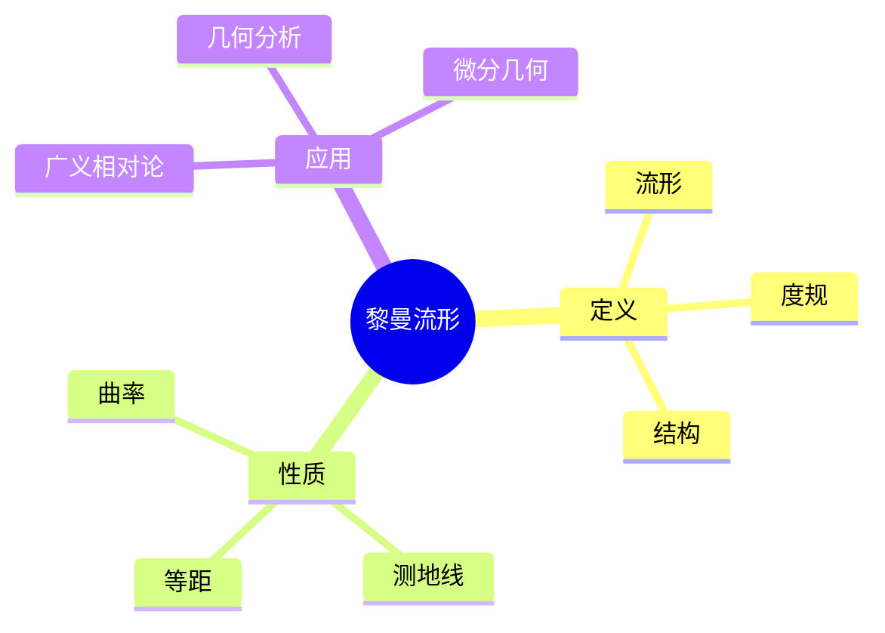
```mermaid
mindmap
  root((黎曼流形))
    定义
      流形
      度规
      结构
    性质
      曲率
      测地线
      等距
    应用
      广义相对论
      几何分析
      微分几何
```

#### 5.2 矩阵对比：不同解释方式的对比

| 解释方式 | 特点 | 方法 | 工具 | 适用阶段 | 优势 | 局限 |
|---------|------|------|------|---------|------|------|
| **直观解释** | 具体、形象、可视 | 例子、类比、直观 | 度规、测地线 | 入门阶段 | 易于理解 | 不够严格 |
| **知性解释** | 概念、分类、抽象 | 定义、分类、结构 | 概念图、知识图谱 | 中级阶段 | 系统完整 | 不够直观 |
| **理性解释** | 公理、证明、形式化 | 公理、证明、系统 | 形式化工具、证明系统 | 高级阶段 | 严格准确 | 不够具体 |
| **多视角解释** | 多角度、整合 | 多视角、整合 | 多视角工具 | 所有阶段 | 全面深入 | 可能复杂 |

#### 5.3 多视角表征：从不同角度表征黎曼流形

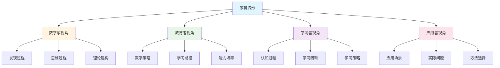
```mermaid
graph TD
    A[黎曼流形] --> B[数学家视角]
    A --> C[教育者视角]
    A --> D[学习者视角]
    A --> E[应用者视角]

    B --> B1[发现过程]
    B --> B2[思维过程]
    B --> B3[理论建构]

    C --> C1[教学策略]
    C --> C2[学习路径]
    C --> C3[能力培养]

    D --> D1[认知过程]
    D --> D2[学习困难]
    D --> D3[学习策略]

    E --> E1[应用场景]
    E --> E2[实际问题]
    E --> E3[方法选择]

    style A fill:#e1f5ff
    style B fill:#fff4e1
    style C fill:#e8f5e9
    style D fill:#f3e5f5
    style E fill:#fce4ec
```

#### 5.4 决策树：黎曼流形问题分类和策略选择

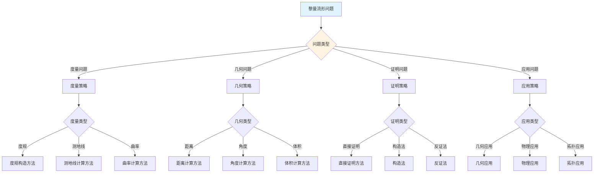
```mermaid
graph TD
    A[黎曼流形问题] --> B{问题类型}
    B -->|度量问题| C[度量策略]
    B -->|几何问题| D[几何策略]
    B -->|证明问题| E[证明策略]
    B -->|应用问题| F[应用策略]

    C --> C1{度量类型}
    C1 -->|度规| C2[度规构造方法]
    C1 -->|测地线| C3[测地线计算方法]
    C1 -->|曲率| C4[曲率计算方法]

    D --> D1{几何类型}
    D1 -->|距离| D2[距离计算方法]
    D1 -->|角度| D3[角度计算方法]
    D1 -->|体积| D4[体积计算方法]

    E --> E1{证明类型}
    E1 -->|直接证明| E2[直接证明方法]
    E1 -->|构造法| E3[构造法]
    E1 -->|反证法| E4[反证法]

    F --> F1{应用类型}
    F1 -->|几何应用| F2[几何应用]
    F1 -->|物理应用| F3[物理应用]
    F1 -->|拓扑应用| F4[拓扑应用]

    style A fill:#e1f5ff
    style B fill:#fff4e1
```

**说明**：

- **问题分类**：根据问题类型（度量、几何、证明、应用）进行分类
- **策略选择**：根据问题类型选择相应的解决策略
- **方法应用**：根据具体问题选择合适的方法

#### 5.5 决策逻辑路径：黎曼流形问题解决过程

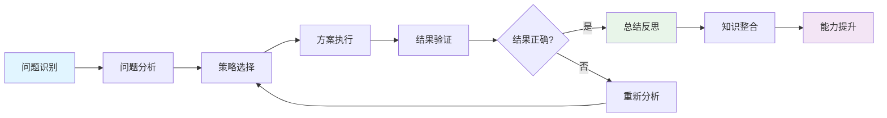
```mermaid
graph LR
    A[问题识别] --> B[问题分析]
    B --> C[策略选择]
    C --> D[方案执行]
    D --> E[结果验证]
    E --> F{结果正确?}
    F -->|是| G[总结反思]
    F -->|否| H[重新分析]
    H --> C

    G --> I[知识整合]
    I --> J[能力提升]

    style A fill:#e1f5ff
    style G fill:#e8f5e9
    style J fill:#f3e5f5
```

**说明**：

- **问题识别**：识别黎曼流形问题的类型和关键要素
- **问题分析**：分析问题的条件和目标
- **策略选择**：根据问题类型选择解决策略
- **方案执行**：执行选定的解决方案
- **结果验证**：验证结果的正确性
- **总结反思**：总结解题过程，反思解题方法
- **知识整合**：整合相关知识点
- **能力提升**：提升问题解决能力

#### 5.6 多维对比矩阵：黎曼流形概念特征对比

| 对比维度 | 黎曼流形定义 | 黎曼流形度量 | 黎曼流形几何 | 黎曼流形应用 |
|---------|---------|---------|---------|---------|
| **核心特征** | 流形、度规 | 距离、角度、体积 | 测地线、曲率 | 几何、物理、拓扑应用 |
| **理解难度** | ⭐⭐⭐⭐⭐ | ⭐⭐⭐⭐⭐ | ⭐⭐⭐⭐⭐ | ⭐⭐⭐⭐ |
| **应用频率** | ⭐⭐⭐⭐ | ⭐⭐⭐⭐ | ⭐⭐⭐⭐ | ⭐⭐⭐⭐ |
| **理论基础** | 黎曼流形定义 | 度规理论 | 几何理论 | 黎曼流形应用理论 |
| **教学重点** | 概念理解 | 度量分析 | 几何分析 | 应用能力 |
| **学习阶段** | 高级阶段 | 高级阶段 | 高级阶段 | 高级阶段 |
| **认知维度** | 知性+理性 | 理性 | 理性 | 理性+应用 |
| **思维表征** | 思维导图 | 决策树 | 决策逻辑路径 | 知识图谱 |

**说明**：

- **核心特征**：每个方面的核心特征
- **理解难度**：从1星到5星，表示理解难度
- **应用频率**：从1星到5星，表示应用频率
- **理论基础**：每个方面的理论基础
- **教学重点**：每个方面的教学重点
- **学习阶段**：每个方面的学习阶段
- **认知维度**：每个方面的认知维度
- **思维表征**：每个方面推荐的思维表征方法

---

## 🔍 数学论证：如何论证黎曼流形 (编号: C.CORE.019.06)

### 一、论证过程：从观察到反思

#### 1.1 观察（Observation）

**具体现象观察**：

- **现象1**：流形上可以定义度量
  - 例如：在流形上每一点可以定义内积，得到黎曼度量
  - **为什么重要**：这个现象揭示了黎曼流形的本质
- **现象2**：黎曼度量的几何性质
  - 例如：黎曼度量定义了距离、角度、曲率等几何量
  - **为什么重要**：这个现象揭示了黎曼流形的几何结构

**模式识别**：

- **模式1**：黎曼度量的定义
  - 例如：黎曼度量是流形上每一点的正定对称双线性形式
  - **为什么重要**：这个模式可能反映了黎曼流形的本质
- **模式2**：曲率与度量的关系
  - 例如：曲率由黎曼度量的导数决定
  - **为什么重要**：这个模式可能反映了黎曼流形的几何性质

**问题提出**：

- **问题1**：如何严格定义黎曼流形，统一不同的几何对象？
  - **为什么提出**：这个问题可能揭示黎曼流形的本质和基础
- **问题2**：如何证明曲率与度量的关系？
  - **为什么提出**：这个问题可能揭示黎曼流形的几何性质

#### 1.2 猜想（Conjecture）

**归纳猜想**：

- **猜想1**：黎曼流形是研究几何的统一工具
  - **依据**：观察不同几何对象都满足黎曼流形定义
  - **为什么提出**：这个猜想可能揭示黎曼流形的统一性
- **猜想2**：曲率与度量的关系
  - **依据**：观察具体黎曼流形的曲率
  - **为什么提出**：这个猜想可能揭示黎曼流形的几何性质

**类比猜想**：

- **猜想1**：黎曼流形类似于"有度量的流形"
  - **类比对象**：流形（无度量）
  - **为什么提出**：这个类比可能揭示黎曼流形的本质
- **猜想2**：黎曼度量类似于"内积"
  - **类比对象**：内积
  - **为什么提出**：这个类比可能揭示黎曼度量的作用

**直觉猜想**：

- **猜想1**：黎曼流形是"最自然"的几何对象
  - **直觉来源**：黎曼流形的直观
  - **为什么提出**：这个直觉可能揭示黎曼流形的基础地位
- **猜想2**：黎曼流形有"最小"的公理结构
  - **直觉来源**：黎曼流形的公理结构
  - **为什么提出**：这个直觉可能揭示黎曼流形的本质

#### 1.3 证明（Proof）

**直接证明**：

- **证明1**：曲率与度量的关系
  - **证明思路**：使用黎曼度量的定义和曲率的定义
  - **关键步骤**：证明曲率张量由黎曼度量的Christoffel符号决定
  - **为什么这样证明**：这个证明方法直接、清晰
- **证明2**：黎曼流形的存在性
  - **证明思路**：使用流形的定义和度量的构造
  - **关键步骤**：在流形上构造黎曼度量
  - **为什么这样证明**：这个证明方法直接、清晰

**构造法**：

- **构造法**：构造黎曼流形作为子流形
  - **构造方法**：定义流形为$\mathbb{R}^N$的子集，诱导黎曼度量
  - **验证**：验证构造的黎曼流形满足黎曼流形公理
  - **为什么这样证明**：构造法适合证明存在性命题

#### 1.4 反思（Reflection）

**过程回顾**：

- **论证回顾**：从观察流形上可以定义度量，到猜想黎曼流形的性质，再到严格证明
  - **成功之处**：成功建立了黎曼流形的严格理论
  - **不足之处**：黎曼流形概念需要进一步推广
  - **改进方向**：推广到伪黎曼流形、Finsler流形等

**方法总结**：

- **证明方法**：使用了直接证明、构造法
  - **方法特点**：直接证明清晰，构造法明确
  - **适用范围**：不同方法适用于不同类型的命题
- **证明技巧**：使用黎曼度量的定义、曲率的定义、构造法
  - **技巧要点**：将黎曼流形问题转化为微分几何问题，使用构造法处理存在性问题
  - **应用场景**：这些技巧可以应用于其他几何问题

**理论意义**：

- **理论贡献**：建立了黎曼流形的严格理论，揭示了黎曼流形的几何结构
  - **为什么重要**：这个论证揭示了微分几何的基础结构
- **应用价值**：黎曼流形为微分几何、广义相对论、物理提供了基础
  - **为什么重要**：这个论证可以应用于所有几何问题

### 二、论证类型：多种推理方式

#### 2.1 归纳论证（Inductive Reasoning）

**不完全归纳**：

- **例子1**：从具体黎曼流形的性质归纳一般规律
  - **观察**：观察$\mathbb{R}^n$、球面、环面都有黎曼度量
  - **结论**：所有流形都可以配备黎曼度量
  - **局限性**：不完全归纳的结论需要严格证明

#### 2.2 演绎论证（Deductive Reasoning）

**三段论**：

- **例子1**：证明黎曼流形的性质
  - **大前提**：所有黎曼流形都有曲率
  - **小前提**：球面是黎曼流形
  - **结论**：球面有曲率
  - **为什么有效**：三段论是严格的演绎推理

#### 2.3 类比论证（Analogical Reasoning）

**结构类比**：

- **例子1**：黎曼流形与流形的类比
  - **类比对象**：流形
  - **相似性**：黎曼流形是配备度量的流形
  - **结论**：黎曼流形可以理解为"有度量的流形"
  - **局限性**：类比不能替代严格证明

#### 2.4 构造论证（Constructive Reasoning）

**构造法**：

- **例子1**：构造黎曼流形作为子流形
  - **构造方法**：定义流形为$\mathbb{R}^N$的子集，诱导黎曼度量
  - **验证**：验证构造的黎曼流形满足黎曼流形公理
  - **为什么有效**：构造法是严格的直接证明

### 三、论证可视化：用图形表示论证过程

#### 3.1 论证流程图

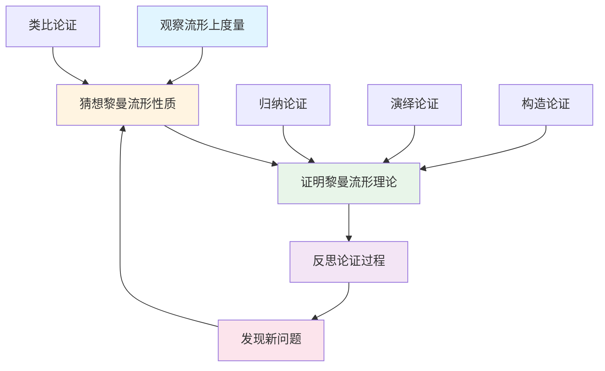
```mermaid
graph TD
    A[观察流形上度量] --> B[猜想黎曼流形性质]
    B --> C[证明黎曼流形理论]
    C --> D[反思论证过程]
    D --> E[发现新问题]
    E --> B

    F[归纳论证] --> C
    G[演绎论证] --> C
    H[类比论证] --> B
    I[构造论证] --> C

    style A fill:#e1f5ff
    style B fill:#fff4e1
    style C fill:#e8f5e9
    style D fill:#f3e5f5
    style E fill:#fce4ec
```

#### 3.2 论证类型对比

| 论证类型 | 特点 | 适用场景 | 优势 | 局限 |
|---------|------|---------|------|------|
| **归纳论证** | 从特殊到一般 | 发现规律、提出猜想 | 启发性强 | 结论或然 |
| **演绎论证** | 从一般到特殊 | 严格证明、逻辑推理 | 结论必然 | 需要前提 |
| **类比论证** | 基于相似性 | 启发思路、发现联系 | 创造性高 | 结论或然 |
| **构造论证** | 直接构造 | 证明存在性命题 | 直接明确 | 需要构造 |

#### 3.3 论证思维导图

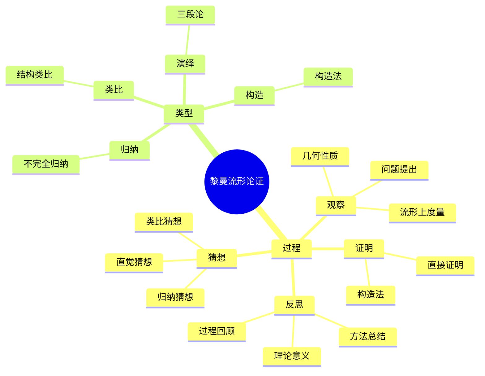
```mermaid
mindmap
  root((黎曼流形论证))
    过程
      观察
        流形上度量
        几何性质
        问题提出
      猜想
        归纳猜想
        类比猜想
        直觉猜想
      证明
        直接证明
        构造法
      反思
        过程回顾
        方法总结
        理论意义
    类型
      归纳
        不完全归纳
      演绎
        三段论
      类比
        结构类比
      构造
        构造法
```

---

## 🔗 三视角整合 (编号: C.CORE.019.07)

### 三个视角的关联

**认知学视角 ↔ 教育学视角**:

- 认知学视角揭示的理解机制，指导教育学视角的教学设计
- 教育学视角的教学实践，验证认知学视角的理论

**认知学视角 ↔ 数学家视角**:

- 数学家视角的思维过程，启发认知学视角的认知路径
- 认知学视角的认知障碍，解释数学家视角的历史困难

**教育学视角 ↔ 数学家视角**:

- 数学家视角的历史发展，为教育学视角提供教学素材
- 教育学视角的教学策略，帮助学习者理解数学家视角的思维过程

### 如何综合运用三个视角

**学习建议**:

1. **从认知学视角开始**: 先建立直观理解
2. **用教育学视角深化**: 通过教学路径系统学习
3. **用数学家视角升华**: 理解概念的深层意义和历史背景

**教学建议**:

1. **引入阶段**: 用数学家视角的问题起源激发兴趣
2. **探索阶段**: 用认知学视角的认知过程引导发现
3. **形式化阶段**: 用教育学视角的教学策略系统教学
4. **巩固阶段**: 综合三个视角深化理解

---

## 📚 参考文献 (编号: C.CORE.019.08)

### 权威资源

- Wikipedia: [Riemannian Manifold](https://en.wikipedia.org/wiki/Riemannian_manifold)
- Metamath: [Riemannian Geometry](http://us.metamath.org/mpeuni/df-riemann.html)[需更新][需更新]

### 经典教材

- Lee, J. M. (2018). *Introduction to Riemannian Manifolds*. Springer.
- Do Carmo, M. P. (1992). *Riemannian Geometry*. Birkhäuser.

### 研究论文

- Riemann, B. (1854). "Über die Hypothesen, welche der Geometrie zu Grunde liegen". *Abhandlungen der Königlichen Gesellschaft der Wissenschaften zu Göttingen*.
- Levi-Civita, T. (1917). "Nozione di parallelismo in una varietà qualunque". *Rendiconti del Circolo Matematico di Palermo*.

---

**创建日期**: 2025年1月
**最后更新**: 2026-04-05
**维护状态**: 持续更新中

---

## 📚 附录: 扩展分析


### 1. 多理论分析

---
msc_primary: "00A99"
---

# 黎曼流形概念的多理论分析示例 / Multi-Theory Analysis Example: Riemannian Manifold Concept


---


## 🎯 一、Tall三个世界理论分析 / Tall's Three Worlds Theory Analysis (编号: C.CORE.019.MULTI.01)

### 1.1 感知-操作世界（Embodied World）

**黎曼流形在感知-操作世界中的理解 / Understanding Riemannian Manifolds in the Embodied World**：

- **具体经验 / Concrete Experience**：
  - 通过观察带度量的曲面理解黎曼流形：球面配备标准度规、平面配备欧几里得度规 / Understanding Riemannian manifolds through observing surfaces with metrics: spheres with standard metrics, planes with Euclidean metrics
  - 例如：地球表面（球面度规）、弯曲的橡胶板（非欧度规） / Examples: Earth's surface (spherical metric), curved rubber sheet (non-Euclidean metric)
  - 通过"测量长度和角度"理解黎曼度规：在曲面上测量距离和角度 / Understanding Riemannian metrics through "measuring lengths and angles": measuring distances and angles on surfaces

- **身体动作 / Bodily Actions**：
  - 通过"测量"的动作理解黎曼度规 / Understanding Riemannian metrics through the action of "measuring"
  - 通过"计算距离"理解测地线 / Understanding geodesics through "calculating distances"
  - 通过操作图形理解曲率、体积 / Understanding curvature and volume through manipulating figures

- **直观理解 / Intuitive Understanding**：
  - 黎曼流形是"配备度规的流形" / A Riemannian manifold is a "manifold equipped with a metric"
  - 黎曼流形可以测量长度、角度、体积 / Riemannian manifolds can measure lengths, angles, and volumes
  - 黎曼流形是微分几何的核心 / Riemannian manifolds are the core of differential geometry

**教学建议 / Teaching Suggestions**：

- 使用具体例子（球面、平面、双曲面） / Use concrete examples (spheres, planes, hyperboloids)
- 通过测量活动理解度规 / Understand metrics through measurement activities
- 使用图形可视化曲率和测地线 / Use graphics to visualize curvature and geodesics

### 1.2 概念-符号世界（Symbolic World）

**黎曼流形在概念-符号世界的理解 / Understanding Riemannian Manifolds in the Symbolic World**：

- **符号表示 / Symbolic Representation**：
  - 使用黎曼流形符号：$(M, g)$、$(N, h)$ 表示黎曼流形 / Using Riemannian manifold notation: $(M, g)$, $(N, h)$ to denote Riemannian manifolds
  - 使用度规符号：$g_{ij}$、$g$ / Using metric notation: $g_{ij}$, $g$
  - 使用曲率符号：$R$、$K$ / Using curvature notation: $R$, $K$

- **概念理解 / Conceptual Understanding**：
  - 黎曼流形是配备黎曼度规的光滑流形 / A Riemannian manifold is a smooth manifold equipped with a Riemannian metric
  - 度规在每点定义内积 / The metric defines an inner product at each point
  - 黎曼流形可以定义长度、角度、体积、曲率 / Riemannian manifolds can define lengths, angles, volumes, and curvature

- **抽象操作 / Abstract Operations**：
  - 通过度规研究黎曼流形 / Studying Riemannian manifolds through metrics
  - 通过曲率研究黎曼流形的几何性质 / Studying geometric properties of Riemannian manifolds through curvature
  - 通过测地线研究黎曼流形的全局结构 / Studying global structure of Riemannian manifolds through geodesics

**教学建议 / Teaching Suggestions**：

- 逐步引入黎曼流形符号 / Gradually introduce Riemannian manifold notation
- 通过度规练习理解黎曼流形 / Understand Riemannian manifolds through metric exercises
- 使用曲率研究几何结构 / Use curvature to study geometric structures

### 1.3 形式-公理世界（Formal World）

**黎曼流形在形式-公理世界的理解 / Understanding Riemannian Manifolds in the Formal World**：

- **公理系统 / Axiomatic System**：
  - 黎曼流形的严格定义：$(M, g)$是光滑流形$M$配备黎曼度规$g$ / Strict definition of Riemannian manifold: $(M, g)$ is a smooth manifold $M$ equipped with Riemannian metric $g$
  - 通过度规严格定义黎曼流形 / Strictly defining Riemannian manifolds through metrics
  - 通过公理推导曲率性质 / Deriving curvature properties through axioms

- **形式化定义 / Formal Definition**：
  - 黎曼流形的形式化定义 / Formal definition of Riemannian manifold
  - 黎曼度规的形式化定义 / Formal definition of Riemannian metric
  - 曲率的形式化定义和证明 / Formal definition and proof of curvature

- **逻辑推理 / Logical Reasoning**：
  - 通过逻辑推理证明黎曼流形性质 / Proving Riemannian manifold properties through logical reasoning
  - 通过形式化方法研究微分几何 / Studying differential geometry through formal methods
  - 通过几何分析研究黎曼流形 / Studying Riemannian manifolds through geometric analysis

**教学建议 / Teaching Suggestions**：

- 介绍黎曼流形定义 / Introduce Riemannian manifold definition
- 通过形式化证明理解曲率性质 / Understand curvature properties through formal proofs
- 研究黎曼流形在微分几何中的作用 / Study the role of Riemannian manifolds in differential geometry

### 1.4 三个世界的转换 / Transitions Between Worlds

**转换路径 / Transition Paths**：

1. **从感知-操作到概念-符号 / From Embodied to Symbolic**：
   - 将具体度规结构抽象为黎曼流形符号 / Abstracting concrete metric structures into Riemannian manifold symbols
   - 从操作中提取黎曼流形概念 / Extracting Riemannian manifold concepts from operations
   - 例如：从"内积结构"到"黎曼流形$(M, g)$" / Example: from "inner product structure" to "Riemannian manifold $(M, g)$"

2. **从概念-符号到形式-公理 / From Symbolic to Formal**：
   - 将黎曼流形概念形式化为度规定义 / Formalizing Riemannian manifold concepts into metric definition
   - 从符号运算到逻辑推理 / From symbolic operations to logical reasoning
   - 例如：从"$(M, g)$"到"度规$g$的公理" / Example: from "$(M, g)$" to "axioms of metric $g$"

**转换支持 / Transition Support**：

- **识别转换困难 / Identifying Transition Difficulties**：
  - 识别从具体度规到抽象黎曼流形的困难 / Identifying difficulties in transitioning from concrete metrics to abstract Riemannian manifolds
  - 识别从符号运算到形式化定义的困难 / Identifying difficulties in transitioning from symbolic operations to formal definitions

- **设计转换活动 / Designing Transition Activities**：
  - 设计过渡活动支持转换 / Designing transition activities to support transitions
  - 提供渐进式支持 / Providing progressive support

- **评估转换效果 / Assessing Transition Effectiveness**：
  - 评估转换成功 / Assessing transition success
  - 提供反馈支持 / Providing feedback support

---

## 🔬 二、Dubinsky APOS理论分析 (编号: C.CORE.018.MULTI.02)

### 2.1 Action（动作）

**黎曼流形的Action阶段 / Action Stage of Riemannian Manifold**：

- **具体操作 / Concrete Operations**：
  - 判断黎曼流形：给定流形和度规，判断是否为黎曼流形 / Determining Riemannian manifold: given a manifold and metric, determine if it is a Riemannian manifold
  - 使用度规：给定黎曼流形，计算度规 / Using metrics: given a Riemannian manifold, calculate metrics
  - 构造黎曼流形：给定流形，构造度规 / Constructing Riemannian manifolds: given a manifold, construct a metric

- **操作特点 / Operation Characteristics**：
  - 需要外部指导（教师、教材） / Requires external guidance (teacher, textbook)
  - 操作是具体的、机械的 / Operations are concrete and mechanical
  - 需要逐步执行 / Requires step-by-step execution

- **学习活动 / Learning Activities**：
  - 练习判断黎曼流形 / Practice determining Riemannian manifolds
  - 练习使用度规 / Practice using metrics
  - 练习构造度规 / Practice constructing metrics

**教学建议 / Teaching Suggestions**：

- 提供大量练习机会 / Provide ample practice opportunities
- 给予及时反馈 / Give timely feedback
- 逐步增加操作复杂度 / Gradually increase operation complexity

### 2.2 Process（过程）

**黎曼流形的Process阶段 / Process Stage of Riemannian Manifold**：

- **内化过程 / Internalization Process**：
  - 将黎曼流形判断内化为心理过程 / Internalizing Riemannian manifold determination as a mental process
  - 理解度规构造的内在逻辑 / Understanding the internal logic of metric construction
  - 能够独立完成黎曼流形操作 / Being able to perform Riemannian manifold operations independently

- **过程理解 / Process Understanding**：
  - 理解"黎曼流形"是"配备度规的流形的过程" / Understanding that "Riemannian manifold" is "the process of manifolds equipped with metrics"
  - 理解"度规"是"定义内积的过程" / Understanding that "metrics" are "the process of defining inner products"
  - 理解"曲率"是"度量弯曲的过程" / Understanding that "curvature" is "the process of measuring bending"

- **灵活应用 / Flexible Application**：
  - 能够灵活应用黎曼流形概念 / Being able to flexibly apply Riemannian manifold concepts
  - 能够处理复杂的黎曼流形问题 / Being able to handle complex Riemannian manifold problems
  - 能够理解黎曼流形的各种性质 / Being able to understand various properties of Riemannian manifolds

**教学建议 / Teaching Suggestions**：

- 引导学生内化操作过程 / Guide students to internalize operation processes
- 通过变式练习加深理解 / Deepen understanding through variant exercises
- 鼓励学生探索黎曼流形应用 / Encourage students to explore Riemannian manifold applications

### 2.3 Object（对象）

**黎曼流形的Object阶段 / Object Stage of Riemannian Manifold**：

- **对象化理解 / Objectification Understanding**：
  - 将黎曼流形视为独立的对象 / Viewing Riemannian manifolds as independent objects
  - 理解黎曼流形作为数学对象的结构 / Understanding the structure of Riemannian manifolds as mathematical objects
  - 能够对黎曼流形进行运算和操作 / Being able to perform operations on Riemannian manifolds

- **对象操作 / Object Operations**：
  - 能够比较不同的黎曼流形 / Being able to compare different Riemannian manifolds
  - 能够构造黎曼流形的积流形 / Being able to construct product Riemannian manifolds
  - 能够研究黎曼流形的性质 / Being able to study properties of Riemannian manifolds

- **概念整合 / Conceptual Integration**：
  - 理解黎曼流形与流形、度规、曲率的关系 / Understanding the relationship between Riemannian manifolds, manifolds, metrics, and curvature
  - 理解黎曼流形在几何学中的作用 / Understanding the role of Riemannian manifolds in geometry
  - 理解黎曼流形在数学中的作用 / Understanding the role of Riemannian manifolds in mathematics

**教学建议 / Teaching Suggestions**：

- 引导学生将流形对象化 / Guide students to objectify manifolds
- 通过对象操作加深理解 / Deepen understanding through object operations
- 整合黎曼流形与其他概念 / Integrate Riemannian manifolds with other concepts

### 2.4 Schema（图式）

**黎曼流形的Schema阶段 / Schema Stage of Riemannian Manifold**：

- **图式构建 / Schema Construction**：
  - 构建完整的黎曼流形图式 / Constructing a complete Riemannian manifold schema
  - 整合黎曼流形的各种理解 / Integrating various understandings of Riemannian manifolds
  - 建立黎曼流形与其他概念的联系 / Establishing connections between Riemannian manifolds and other concepts

- **图式应用 / Schema Application**：
  - 能够灵活应用黎曼流形图式 / Being able to flexibly apply Riemannian manifold schemas
  - 能够解决复杂的黎曼流形问题 / Being able to solve complex Riemannian manifold problems
  - 能够研究微分几何理论 / Being able to study differential geometry theory

- **图式发展 / Schema Development**：
  - 不断发展黎曼流形图式 / Continuously developing Riemannian manifold schemas
  - 探索黎曼流形的新应用 / Exploring new applications of Riemannian manifolds
  - 研究微分几何理论的发展 / Studying the development of differential geometry theory

**教学建议 / Teaching Suggestions**：

- 帮助学生构建流形图式 / Help students construct manifold schemas
- 通过应用发展图式 / Develop schemas through application
- 鼓励学生探索微分几何理论 / Encourage students to explore differential geometry theory

### 2.5 APOS发展路径 / APOS Development Path

**发展过程 / Development Process**：

1. **Action → Process / 动作到过程**：
   - 将外部黎曼流形操作内化为心理过程 / Internalizing external Riemannian manifold operations as mental processes
   - 从需要指导到独立完成 / From needing guidance to independent completion
   - 例如：从"计算度规"到"理解黎曼流形过程" / Example: from "computing metrics" to "understanding the Riemannian manifold process"

2. **Process → Object / 过程到对象**：
   - 将黎曼流形过程对象化 / Objectifying Riemannian manifold processes
   - 从过程理解到对象理解 / From process understanding to object understanding
   - 例如：从"理解黎曼流形过程"到"将黎曼流形视为对象" / Example: from "understanding the Riemannian manifold process" to "treating Riemannian manifolds as objects"

3. **Object → Schema / 对象到图式**：
   - 整合黎曼流形的所有方面形成完整图式 / Integrating all aspects of Riemannian manifolds to form a complete schema
   - 从对象理解到系统理解 / From object understanding to systematic understanding
   - 例如：从"理解黎曼流形对象"到"形成微分几何图式" / Example: from "understanding Riemannian manifold objects" to "forming a differential geometry schema"

**发展支持 / Development Support**：

- **识别发展困难 / Identifying Development Difficulties**：
  - 识别内化困难 / Identifying internalization difficulties
  - 识别对象化困难 / Identifying objectification difficulties
  - 识别图式化困难 / Identifying schematization difficulties

- **设计发展活动 / Designing Development Activities**：
  - 设计支持内化的活动 / Designing activities to support internalization
  - 设计支持对象化的活动 / Designing activities to support objectification
  - 设计支持图式化的活动 / Designing activities to support schematization

- **评估发展效果 / Assessing Development Effectiveness**：
  - 评估各阶段发展 / Assessing development at each stage
  - 提供反馈支持 / Providing feedback support

---

## 💬 三、Sfard交流理论分析 / Sfard's Commognitive Theory Analysis (编号: C.CORE.018.MULTI.03)

### 3.1 黎曼流形作为交流工具 / Riemannian Manifold as a Communication Tool

**黎曼流形的交流功能 / Communicative Function of Riemannian Manifolds**：

- **数学交流 / Mathematical Communication**：
  - 黎曼流形用于表达"带度量的弯曲空间"：$(M, g)$ / Riemannian manifolds are used to express "curved spaces with metrics": $(M, g)$
  - 黎曼流形用于描述"几何结构" / Riemannian manifolds are used to describe "geometric structure"
  - 黎曼流形用于表达数学关系：等距、共形等价 / Riemannian manifolds are used to express mathematical relationships: isometry, conformal equivalence

- **概念表达 / Conceptual Expression**：
  - 通过黎曼流形表达"度规"的概念 / Expressing the concept of "metric" through Riemannian manifolds
  - 通过黎曼流形符号表达"曲率"的概念 / Expressing the concept of "curvature" through Riemannian manifold notation
  - 通过黎曼流形表达"测地线"的概念 / Expressing the concept of "geodesic" through Riemannian manifolds

- **问题解决 / Problem Solving**：
  - 使用黎曼流形语言表达问题 / Using Riemannian manifold language to express problems
  - 使用黎曼流形方法解决问题 / Using Riemannian manifold methods to solve problems
  - 使用微分几何方法证明定理 / Using differential geometry methods to prove theorems

### 3.2 黎曼流形学习的实践参与 / Practice Participation in Riemannian Manifold Learning

**通过参与数学实践学习黎曼流形 / Learning Riemannian Manifolds through Participation in Mathematical Practice**：

- **实践场景 / Practice Scenarios**：
  - 通过几何问题学习黎曼流形 / Learning Riemannian manifolds through geometry problems
  - 通过物理应用学习黎曼流形（广义相对论） / Learning Riemannian manifolds through physics applications (general relativity)
  - 通过机器学习应用学习黎曼流形 / Learning Riemannian manifolds through machine learning applications
  - 通过微分几何研究学习黎曼流形理论 / Learning Riemannian manifold theory through differential geometry research

- **实践方式 / Practice Methods**：
  - 参与数学讨论，使用黎曼流形语言 / Participating in mathematical discussions, using Riemannian manifold language
  - 解决数学问题，应用黎曼流形方法 / Solving mathematical problems, applying Riemannian manifold methods
  - 研究数学理论，理解黎曼流形作用 / Studying mathematical theory, understanding the role of Riemannian manifolds

- **学习效果 / Learning Outcomes**：
  - 通过实践理解黎曼流形概念 / Understanding Riemannian manifold concepts through practice
  - 通过应用掌握黎曼流形方法 / Mastering Riemannian manifold methods through application
  - 通过参与形成数学思维 / Forming mathematical thinking through participation

**教学建议 / Teaching Suggestions**：

- 设计数学实践活动 / Design mathematical practice activities
- 鼓励学生参与数学讨论 / Encourage students to participate in mathematical discussions
- 提供实际问题解决机会 / Provide opportunities for solving real-world problems

---

## 🧠 四、Piaget认知发展理论分析 / Piaget's Cognitive Development Theory Analysis (编号: C.CORE.018.MULTI.04)

### 4.1 具体运算阶段（7-12岁）/ Concrete Operational Stage (7-12 years)

**黎曼流形在具体运算阶段的理解 / Understanding Riemannian Manifolds in the Concrete Operational Stage**：

- **具体对象 / Concrete Objects**：
  - 通过具体黎曼流形理解黎曼流形 / Understanding Riemannian manifolds through concrete Riemannian manifolds
  - 例如：球面（标准度规）、平面（欧几里得度规） / Examples: spheres (standard metric), planes (Euclidean metric)
  - 需要具体例子支持理解 / Requires concrete examples to support understanding

- **逻辑思维 / Logical Thinking**：
  - 能够理解黎曼流形的基本概念 / Being able to understand basic Riemannian manifold concepts
  - 能够进行简单的度规操作 / Being able to perform simple metric operations
  - 但需要具体对象支持 / But requires concrete object support

- **教学建议 / Teaching Suggestions**：
  - 使用具体黎曼流形 / Use concrete Riemannian manifolds
  - 通过图形验证曲率性质 / Verify curvature properties through graphics
  - 逐步引入抽象概念 / Gradually introduce abstract concepts

### 4.2 形式运算阶段（12+岁）/ Formal Operational Stage (12+ years)

**黎曼流形在形式运算阶段的理解 / Understanding Riemannian Manifolds in the Formal Operational Stage**：

- **抽象思维 / Abstract Thinking**：
  - 能够理解抽象的黎曼流形概念 / Being able to understand abstract Riemannian manifold concepts
  - 能够进行符号操作 / Being able to perform symbolic operations
  - 能够进行逻辑推理 / Being able to perform logical reasoning

- **形式推理 / Formal Reasoning**：
  - 能够证明黎曼流形性质 / Being able to prove Riemannian manifold properties
  - 能够理解黎曼流形定义 / Being able to understand Riemannian manifold definition
  - 能够研究微分几何 / Being able to study differential geometry

- **教学建议 / Teaching Suggestions**：
  - 引入抽象概念和符号 / Introduce abstract concepts and symbols
  - 进行逻辑推理训练 / Conduct logical reasoning training
  - 研究微分几何理论 / Study differential geometry theory

---

## 🌍 五、Vygotsky社会文化理论分析 / Vygotsky's Sociocultural Theory Analysis (编号: C.CORE.018.MULTI.05)

### 5.1 最近发展区（ZPD）/ Zone of Proximal Development (ZPD)

**黎曼流形学习的最近发展区 / Zone of Proximal Development in Riemannian Manifold Learning**：

- **独立能力 / Independent Ability**：
  - 能够理解黎曼流形的基本概念 / Being able to understand basic Riemannian manifold concepts
  - 能够进行简单的度规操作 / Being able to perform simple metric operations
  - 能够理解度规 / Being able to understand metrics

- **潜在能力 / Potential Ability**：
  - 能够理解黎曼流形定义 / Being able to understand Riemannian manifold definition
  - 能够证明曲率性质 / Being able to prove curvature properties
  - 能够研究微分几何理论 / Being able to study differential geometry theory

- **教学建议 / Teaching Suggestions**：
  - 识别学生的最近发展区 / Identify students' zone of proximal development
  - 提供适当的支持和指导 / Provide appropriate support and guidance
  - 逐步提高学习要求 / Gradually increase learning requirements

### 5.2 社会文化工具 / Sociocultural Tools

**黎曼流形作为社会文化工具 / Riemannian Manifolds as Sociocultural Tools**：

- **数学工具 / Mathematical Tools**：
  - 黎曼流形是数学研究的重要工具 / Riemannian manifolds are important tools for mathematical research
  - 黎曼流形用于解决实际问题（广义相对论） / Riemannian manifolds are used to solve real-world problems (general relativity)
  - 黎曼流形用于研究数学理论 / Riemannian manifolds are used to study mathematical theory

- **文化意义 / Cultural Significance**：
  - 黎曼流形是数学文化的重要组成部分 / Riemannian manifolds are an important part of mathematical culture
  - 黎曼流形反映了数学思维的发展 / Riemannian manifolds reflect the development of mathematical thinking
  - 黎曼流形体现了数学的美感 / Riemannian manifolds embody the beauty of mathematics

- **教学建议 / Teaching Suggestions**：
  - 介绍黎曼流形的历史和文化意义 / Introduce the history and cultural significance of Riemannian manifolds
  - 展示黎曼流形在数学中的作用 / Demonstrate the role of Riemannian manifolds in mathematics
  - 培养学生对数学文化的理解 / Cultivate students' understanding of mathematical culture

---

## 🔄 六、多理论整合分析 / Multi-Theory Integration Analysis (编号: C.CORE.018.MULTI.06)

### 6.1 理论共同点 / Theoretical Commonalities

**各理论在黎曼流形概念分析中的共同点 / Commonalities of Theories in Riemannian Manifold Concept Analysis**：

1. **多层次理解 / Multi-Level Understanding**：
   - 都强调从具体到抽象的发展 / All emphasize development from concrete to abstract
   - Tall的三个世界、APOS的四个阶段、Piaget的发展阶段都体现这一点 / Tall's three worlds, APOS's four stages, and Piaget's developmental stages all reflect this

2. **实践重要性 / Importance of Practice**：
   - 都强调实践在学习中的作用 / All emphasize the role of practice in learning
   - Sfard的交流理论、Vygotsky的社会文化理论都强调这一点 / Sfard's communication theory and Vygotsky's sociocultural theory both emphasize this

3. **认知发展 / Cognitive Development**：
   - 都关注认知发展的过程 / All focus on the process of cognitive development
   - 各理论都描述了从简单到复杂的发展 / Each theory describes development from simple to complex

### 6.2 理论互补性 / Theoretical Complementarity

**各理论在黎曼流形概念分析中的互补性 / Complementarity of Theories in Riemannian Manifold Concept Analysis**：

1. **Tall三个世界 / Tall's Three Worlds**：
   - 适用于理解黎曼流形概念的不同层次 / Applicable to understanding different levels of Riemannian manifold concepts
   - 从感知操作到形式公理的发展 / Development from embodied operations to formal axioms

2. **APOS理论 / APOS Theory**：
   - 适用于分析黎曼流形概念的学习过程 / Applicable to analyzing the learning process of Riemannian manifold concepts
   - 从动作到图式的发展 / Development from action to schema

3. **Sfard交流理论 / Sfard's Communication Theory**：
   - 适用于设计黎曼流形概念的实践活动 / Applicable to designing practice activities for Riemannian manifold concepts
   - 通过数学实践学习黎曼流形 / Learning Riemannian manifolds through mathematical practice

4. **Piaget理论 / Piaget's Theory**：
   - 适用于理解黎曼流形概念的认知发展阶段 / Applicable to understanding cognitive development stages of Riemannian manifold concepts
   - 从具体运算到形式运算的发展 / Development from concrete operations to formal operations

5. **Vygotsky理论 / Vygotsky's Theory**：
   - 适用于设计黎曼流形概念的学习支持 / Applicable to designing learning support for Riemannian manifold concepts
   - 通过最近发展区促进学习 / Promoting learning through the zone of proximal development

### 6.3 整合应用框架

**多理论整合应用**：

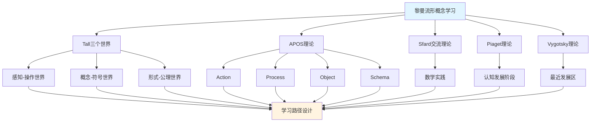
```mermaid
graph TB
    A[黎曼流形概念学习] --> B[Tall三个世界]
    A --> C[APOS理论]
    A --> D[Sfard交流理论]
    A --> E[Piaget理论]
    A --> F[Vygotsky理论]

    B --> G[感知-操作世界]
    B --> H[概念-符号世界]
    B --> I[形式-公理世界]

    C --> J[Action]
    C --> K[Process]
    C --> L[Object]
    C --> M[Schema]

    D --> N[数学实践]
    E --> O[认知发展阶段]
    F --> P[最近发展区]

    G --> Q[学习路径设计]
    H --> Q
    I --> Q
    J --> Q
    K --> Q
    L --> Q
    M --> Q
    N --> Q
    O --> Q
    P --> Q

    style A fill:#e1f5ff
    style Q fill:#fff4e1
```

---

## 📊 七、流形概念的多理论学习路径 / Multi-Theory Learning Path for Manifold Concept (编号: C.CORE.018.MULTI.07)

### 7.1 入门阶段（Tall感知-操作世界 + APOS Action）/ Entry Stage (Tall Embodied World + APOS Action)

**学习目标 / Learning Objectives**：

- 通过具体黎曼流形理解黎曼流形概念 / Understanding Riemannian manifold concepts through concrete Riemannian manifolds
- 掌握基本度规操作 / Mastering basic metric operations

**学习活动 / Learning Activities**：

- 使用具体黎曼流形（球面、平面）进行观察 / Using concrete Riemannian manifolds (spheres, planes) for observation
- 练习判断黎曼流形 / Practicing determining Riemannian manifolds
- 练习使用度规 / Practicing using metrics
- 练习基本度规操作 / Practicing basic metric operations

**评估标准 / Assessment Criteria**：

- 能够独立完成基本度规操作 / Being able to independently complete basic metric operations
- 能够理解黎曼流形的基本概念 / Being able to understand basic Riemannian manifold concepts

### 7.2 中级阶段（Tall概念-符号世界 + APOS Process/Object）/ Intermediate Stage (Tall Symbolic World + APOS Process/Object)

**学习目标 / Learning Objectives**：

- 理解黎曼流形的符号表示 / Understanding symbolic representation of Riemannian manifolds
- 掌握度规运算的内在逻辑 / Mastering the internal logic of metric operations
- 将黎曼流形视为对象 / Viewing Riemannian manifolds as objects

**学习活动 / Learning Activities**：

- 学习黎曼流形符号和度规符号 / Learning Riemannian manifold notation and metric notation
- 通过符号操作进行度规运算 / Performing metric operations through symbolic operations
- 理解曲率的性质 / Understanding properties of curvature
- 研究黎曼流形的积流形 / Studying product Riemannian manifolds

**评估标准 / Assessment Criteria**：

- 能够灵活应用黎曼流形符号 / Being able to flexibly apply Riemannian manifold notation
- 能够理解度规运算的内在逻辑 / Being able to understand the internal logic of metric operations
- 能够将黎曼流形视为对象进行操作 / Being able to operate on Riemannian manifolds as objects

### 7.3 高级阶段（Tall形式-公理世界 + APOS Schema + Sfard实践）/ Advanced Stage (Tall Formal World + APOS Schema + Sfard Practice)

**学习目标 / Learning Objectives**：

- 理解黎曼流形定义 / Understanding Riemannian manifold definition
- 形成完整的黎曼流形概念图式 / Forming a complete Riemannian manifold concept schema
- 通过数学实践应用黎曼流形 / Applying Riemannian manifolds through mathematical practice

**学习活动 / Learning Activities**：

- 学习黎曼流形定义 / Learning Riemannian manifold definition
- 通过形式化证明理解曲率性质 / Understanding curvature properties through formal proofs
- 研究黎曼流形在微分几何中的作用 / Studying the role of Riemannian manifolds in differential geometry
- 参与数学实践，应用黎曼流形方法 / Participating in mathematical practice, applying Riemannian manifold methods

**评估标准 / Assessment Criteria**：

- 能够理解黎曼流形定义 / Being able to understand Riemannian manifold definition
- 能够形成完整的黎曼流形概念图式 / Being able to form a complete Riemannian manifold concept schema
- 能够通过数学实践应用黎曼流形 / Being able to apply Riemannian manifolds through mathematical practice

---

## 🧠 七、元认知理论分析 / Metacognitive Theory Analysis (编号: C.CORE.019.MULTI.07.5)

### 7.1 元认知知识（Metacognitive Knowledge）

**关于黎曼流形概念的知识 / Knowledge About the Riemannian Manifold Concept**：

- **概念知识 / Conceptual Knowledge**：
  - 黎曼流形的定义：具有黎曼度规的流形 / Riemannian manifolds are manifolds with Riemannian metrics
  - 黎曼流形的性质：度规、距离、测地线 / Properties: metric, distance, geodesics
  - 黎曼流形的表示方法：度规张量、Christoffel符号、曲率张量 / Representation methods: metric tensor, Christoffel symbols, curvature tensor
  - 黎曼流形与其他概念的关系：黎曼流形是微分几何的核心，是研究弯曲空间的工具 / Relationship: Riemannian manifolds are core concepts of differential geometry and tools for studying curved spaces

- **策略知识 / Strategy Knowledge**：
  - 学习策略：从流形到黎曼流形，通过度规掌握黎曼流形 / Learning strategies: from manifolds to Riemannian manifolds, master Riemannian manifolds through metrics
  - 理解策略：从平直空间到弯曲空间，从局部到整体 / Understanding strategies: from flat spaces to curved spaces, from local to global
  - 应用策略：将黎曼流形方法应用到实际问题中 / Application strategies: apply Riemannian manifold methods to real-world problems

- **任务知识 / Task Knowledge**：
  - 典型任务：度规确定、测地线计算、曲率计算 / Typical tasks: metric determination, geodesic computation, curvature computation
  - 任务难度：基础任务（度规确定）→ 中级任务（测地线计算）→ 高级任务（曲率计算） / Task difficulty: basic (metric determination) → intermediate (geodesic computation) → advanced (curvature computation)
  - 任务要求：理解黎曼流形概念，掌握度规方法，能够进行黎曼流形推理 / Task requirements: understand Riemannian manifold concepts, master metric methods, be able to reason about Riemannian manifolds

### 7.2 元认知监控（Metacognitive Monitoring）

**理解监控 / Comprehension Monitoring**：

- **自我提问 / Self-Questioning**：
  - "我理解黎曼流形的基本概念了吗？" / "Do I understand the basic concept of Riemannian manifolds?"
  - "我能区分黎曼流形和一般流形吗？" / "Can I distinguish between Riemannian manifolds and general manifolds?"
  - "我理解度规的概念吗？" / "Do I understand the concept of metrics?"

- **理解检查 / Comprehension Checking**：
  - 能否用自己的话解释黎曼流形概念？ / Can I explain the concept of Riemannian manifolds in my own words?
  - 能否识别度规确定的错误？ / Can I identify errors in metric determination?
  - 能否判断空间的黎曼流形性？ / Can I determine whether a space is a Riemannian manifold?

- **困难识别 / Difficulty Identification**：
  - 识别理解困难：抽象性、度规、测地线、曲率 / Identify comprehension difficulties: abstraction, metrics, geodesics, curvature
  - 识别运算困难：度规确定、测地线计算、曲率计算 / Identify operation difficulties: metric determination, geodesic computation, curvature computation

**过程监控 / Process Monitoring**：

- **学习过程监控 / Learning Process Monitoring**：
  - 监控学习进度：是否按计划学习？ / Monitor learning progress: Am I learning according to plan?
  - 监控学习效果：是否掌握了黎曼流形概念？ / Monitor learning effectiveness: Have I mastered the concept of Riemannian manifolds?
  - 监控学习困难：遇到了哪些困难？ / Monitor learning difficulties: What difficulties have I encountered?

- **策略使用监控 / Strategy Use Monitoring**：
  - 使用的策略是否有效？ / Is the strategy I'm using effective?
  - 是否需要调整策略？ / Do I need to adjust my strategy?
  - 策略使用是否正确？ / Am I using the strategy correctly?

### 7.3 元认知调节（Metacognitive Regulation）

**计划调节 / Planning Regulation**：

- **学习计划制定 / Learning Plan Development**：
  - 制定学习计划：先学黎曼流形基本概念，再学度规方法，最后学黎曼流形应用 / Develop learning plan: first learn basic Riemannian manifold concepts, then learn metric methods, finally learn Riemannian manifold applications
  - 调整学习计划：根据学习情况调整计划 / Adjust learning plan: adjust plan based on learning situation
  - 优化学习路径：选择最适合自己的学习路径 / Optimize learning path: choose the learning path that best suits oneself

**策略调节 / Strategy Regulation**：

- **策略选择 / Strategy Selection**：
  - 根据任务类型选择策略：简单任务用直接方法，复杂任务用分步方法 / Select strategies based on task type: use direct methods for simple tasks, step-by-step methods for complex tasks
  - 根据学习阶段选择策略：入门阶段用具体例子，高级阶段用抽象方法 / Select strategies based on learning stage: use concrete examples in entry stage, abstract methods in advanced stage

- **策略调整 / Strategy Adjustment**：
  - 如果遇到困难，尝试不同的策略 / If encountering difficulties, try different strategies
  - 如果策略无效，调整策略 / If strategy is ineffective, adjust strategy
  - 如果策略有效，继续使用并优化 / If strategy is effective, continue using and optimize

**反思调节 / Reflection Regulation**：

- **学习反思 / Learning Reflection**：
  - 反思学习过程：从黎曼流形学习中获得了什么？ / Reflect on learning process: What have I gained from learning Riemannian manifolds?
  - 反思学习困难：遇到了哪些困难？如何克服？ / Reflect on learning difficulties: What difficulties did I encounter? How did I overcome them?
  - 反思学习策略：使用的策略是否有效？如何改进？ / Reflect on learning strategies: Were the strategies I used effective? How can I improve?

- **错误反思 / Error Reflection**：
  - 从错误中学习：分析错误原因，避免类似错误 / Learn from errors: analyze error causes, avoid similar errors
  - 改进学习方法：根据错误调整学习方法 / Improve learning methods: adjust learning methods based on errors

**教学建议 / Teaching Suggestions**：

- 教授元认知知识：帮助学生建立关于黎曼流形的元认知知识 / Teach metacognitive knowledge: help students build metacognitive knowledge about Riemannian manifolds
- 培养监控能力：引导学生自我监控理解过程 / Develop monitoring ability: guide students to self-monitor their comprehension process
- 训练调节能力：教授学生如何调节学习策略 / Train regulation ability: teach students how to regulate learning strategies
- 使用元认知提示语：在学习过程中使用提示语引导学生 / Use metacognitive prompts: use prompts to guide students during learning

---

## 🎓 八、教学建议 / Teaching Suggestions (编号: C.CORE.018.MULTI.08)

### 8.1 基于多理论的教学设计 / Multi-Theory Based Teaching Design

**教学设计原则 / Teaching Design Principles**：

1. **多层次设计 / Multi-Level Design**：
   - 从感知操作到形式公理 / From embodied operations to formal axioms
   - 从动作到图式 / From action to schema
   - 从具体运算到形式运算 / From concrete operations to formal operations

2. **实践导向 / Practice-Oriented**：
   - 设计数学实践活动 / Design mathematical practice activities
   - 鼓励学生参与数学交流 / Encourage students to participate in mathematical communication
   - 提供实际问题解决机会 / Provide opportunities for solving real-world problems

3. **学习支持 / Learning Support**：
   - 提供适当的学习支持 / Provide appropriate learning support
   - 设计最近发展区的学习活动 / Design learning activities in the zone of proximal development
   - 给予及时反馈 / Give timely feedback

4. **情感因素考虑 / Affective Considerations**：
   - **减少数学焦虑 / Reducing Math Anxiety**：
     - 从具体例子（球面、平面、双曲面）开始，降低黎曼流形概念的抽象难度 / Start with concrete examples (spheres, planes, hyperboloids) to reduce the abstract difficulty of Riemannian manifold concepts
     - 通过测量活动理解度规 / Understand metrics through measurement activities
     - 允许学生犯错，营造安全的学习环境 / Allow students to make mistakes and create a safe learning environment
     - 提供逐步支持，帮助学生建立信心 / Provide progressive support to help students build confidence

   - **激发学习动机 / Motivating Learning**：
     - 展示黎曼流形在现实中的应用（广义相对论、几何等） / Show applications of Riemannian manifolds in real life (general relativity, geometry, etc.)
     - 设计有趣的黎曼流形问题 / Design interesting Riemannian manifold problems
     - 介绍黎曼流形的历史和数学家的故事（Riemann、Einstein） / Introduce the history of Riemannian manifolds and mathematician stories (Riemann, Einstein)
     - 展示黎曼流形的结构美感 / Show the structural beauty of Riemannian manifolds

   - **培养数学兴趣 / Cultivating Math Interest**：
     - 展示黎曼流形的美感 / Show the beauty of Riemannian manifolds
     - 介绍Riemann、Einstein等数学家的故事 / Introduce stories of mathematicians like Riemann and Einstein
     - 探索黎曼流形在微分几何中的核心地位 / Explore the central role of Riemannian manifolds in differential geometry

### 8.2 具体教学策略 / Specific Teaching Strategies

**入门阶段策略 / Entry Stage Strategies**：

- 使用具体黎曼流形和图形 / Use concrete Riemannian manifolds and graphics
- 通过游戏和活动学习 / Learn through games and activities
- 提供大量练习机会 / Provide ample practice opportunities

**中级阶段策略 / Intermediate Stage Strategies**：

- 逐步引入抽象概念和符号 / Gradually introduce abstract concepts and symbols
- 通过变式练习加深理解 / Deepen understanding through variant exercises
- 鼓励学生独立思考和解决问题 / Encourage students to think independently and solve problems

**高级阶段策略 / Advanced Stage Strategies**：

- 引入定义和形式化方法 / Introduce definitions and formal methods
- 研究黎曼几何理论 / Study Riemannian geometry theory
- 参与数学实践和研究 / Participate in mathematical practice and research

---

## 🔗 九、关联文档 / Related Documents (编号: C.CORE.018.MULTI.09)

### 9.1 核心概念文档 / Core Concept Documents

- [黎曼流形](./19-黎曼流形.md) / [Riemannian Manifold](./19-黎曼流形.md)
- [黎曼流形-三视角版](./19-黎曼流形.md) / [Riemannian Manifold-Three Perspectives Version](./19-黎曼流形.md)
- [流形-多理论分析示例](./18-流形.md) / [Manifold-Multi-Theory Analysis Example](./18-流形.md)

### 9.2 理论框架文档 / Theoretical Framework Documents

- [国际主流数学认知理论整合框架](../00-国际主流数学认知理论整合框架-2025年1月.md) / [International Mainstream Mathematical Cognitive Theories Integration Framework](../00-国际主流数学认知理论整合框架-2025年1月.md)
- [概念体系深度改进计划](./../00-概念体系全面梳理与推进计划-2025年1月.md) / [Concept System Deep Improvement Plan](./../00-概念体系全面梳理与推进计划-2025年1月.md)

---

## ✅ 十、总结 / Summary (编号: C.CORE.018.MULTI.10)

### 10.1 多理论分析的价值 / Value of Multi-Theory Analysis

**多理论分析的优势 / Advantages of Multi-Theory Analysis**：

1. **全面理解 / Comprehensive Understanding**：
   - 从多个角度理解黎曼流形概念 / Understanding Riemannian manifold concepts from multiple perspectives
   - 理解黎曼流形概念的不同层次 / Understanding different levels of Riemannian manifold concepts
   - 理解黎曼流形概念的学习过程 / Understanding the learning process of Riemannian manifold concepts

2. **教学设计 / Teaching Design**：
   - 基于多理论设计教学 / Designing teaching based on multiple theories
   - 提供多层次学习支持 / Providing multi-level learning support
   - 设计实践活动 / Designing practice activities

3. **学习路径 / Learning Path**：
   - 设计基于多理论的学习路径 / Designing learning paths based on multiple theories
   - 支持不同认知发展阶段的学习 / Supporting learning at different cognitive development stages
   - 促进概念理解的发展 / Promoting the development of conceptual understanding

### 10.2 应用推广 / Application and Extension

**为其他核心概念建立多理论分析 / Establishing Multi-Theory Analysis for Other Core Concepts**：

- 使用本文档作为模板 / Using this document as a template
- 为每个概念建立多理论分析 / Establishing multi-theory analysis for each concept
- 建立33个核心概念的多理论分析体系 / Establishing a multi-theory analysis system for 33 core concepts

---

**维护状态**: 持续更新中
**状态**: ✅ 已完成


### 2. 决策导图

---
msc_primary: "00A99"
---

# 黎曼流形概念决策导图示例


---


## 🎓 一、学习决策导图 (编号: C.CORE.019.DECISION.01)

### 1.1 学习路径决策

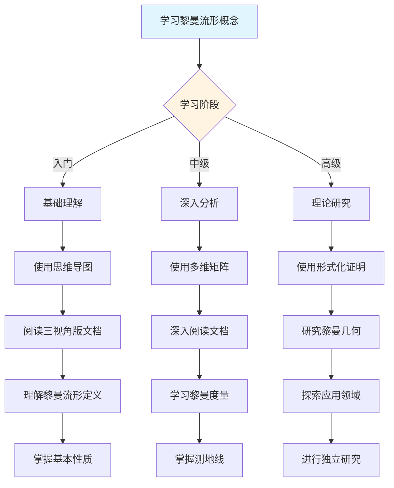
```mermaid
graph TD
    A[学习黎曼流形概念] --> B{学习阶段}
    B -->|入门| C[基础理解]
    B -->|中级| D[深入分析]
    B -->|高级| E[理论研究]

    C --> C1[使用思维导图]
    C1 --> C2[阅读三视角版文档]
    C2 --> C3[理解黎曼流形定义]
    C3 --> C4[掌握基本性质]

    D --> D1[使用多维矩阵]
    D1 --> D2[深入阅读文档]
    D2 --> D3[学习黎曼度量]
    D3 --> D4[掌握测地线]

    E --> E1[使用形式化证明]
    E1 --> E2[研究黎曼几何]
    E2 --> E3[探索应用领域]
    E3 --> E4[进行独立研究]

    style A fill:#e1f5ff
    style B fill:#fff4e1
```

### 1.2 学习重点决策

**基于知识矩阵的学习重点**：

| 学习阶段 | 知识层次 | 学习重点 | 推荐资源 |
|---------|---------|---------|---------|
| **入门** | L0基础 | 黎曼流形的定义、基本例子 | 思维导图、三视角版文档 |
| **入门** | L0基础 | 黎曼流形的直观理解（度量、距离、曲率） | 三视角版文档、应用实例 |
| **中级** | L1中级 | 黎曼度量 | 多维矩阵、形式化证明 |
| **中级** | L1中级 | 测地线 | 三视角版文档、习题库 |
| **高级** | L2高级 | 黎曼几何 | 形式化证明系统 |
| **高级** | L2高级 | 曲率理论 | 形式化证明系统 |

### 1.3 学习方法决策

**基于认知维度的学习方法**：

1. **直观维度**（入门阶段）
   - 使用思维导图建立总体框架
   - 使用具体例子理解概念（球面、双曲面、欧几里得空间）
   - 使用几何直观理解黎曼流形

2. **知性维度**（中级阶段）
   - 使用多维矩阵分析概念特征
   - 使用概念分类系统理解（正曲率、负曲率、零曲率）
   - 使用关系分析建立联系（与流形、曲率、几何的关系）

3. **理性维度**（高级阶段）
   - 使用形式化证明严格理解
   - 使用逻辑推理深入分析
   - 使用系统建构整体把握

---

## 🔬 二、研究决策导图 (编号: C.CORE.019.DECISION.02)

### 2.1 研究方向决策

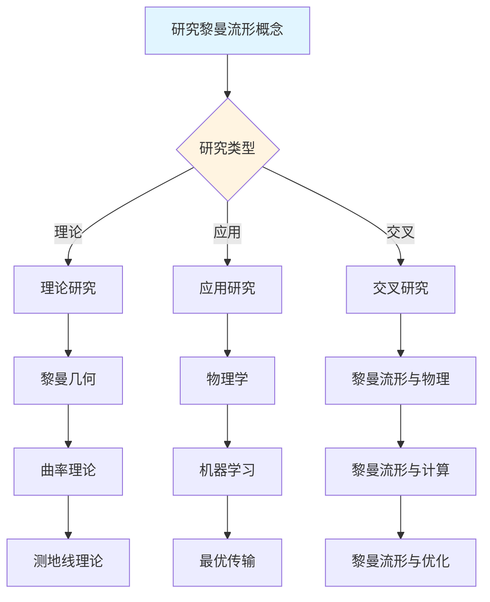
```mermaid
graph TD
    A[研究黎曼流形概念] --> B{研究类型}
    B -->|理论| C[理论研究]
    B -->|应用| D[应用研究]
    B -->|交叉| E[交叉研究]

    C --> C1[黎曼几何]
    C1 --> C2[曲率理论]
    C2 --> C3[测地线理论]

    D --> D1[物理学]
    D1 --> D2[机器学习]
    D2 --> D3[最优传输]

    E --> E1[黎曼流形与物理]
    E1 --> E2[黎曼流形与计算]
    E2 --> E3[黎曼流形与优化]

    style A fill:#e1f5ff
    style B fill:#fff4e1
```

### 2.2 研究问题决策

**基于知识矩阵的研究问题**：

1. **理论研究问题**
   - 黎曼几何：黎曼流形的分类和性质
   - 曲率理论：曲率的计算和性质
   - 测地线理论：测地线的存在性和唯一性

2. **应用研究问题**
   - 物理学：黎曼流形在物理学中的应用（广义相对论中的时空）
   - 机器学习：黎曼流形在机器学习中的应用（流形学习）
   - 最优传输：黎曼流形在最优传输中的应用（Wasserstein距离）

3. **交叉研究问题**
   - 黎曼流形与物理：黎曼流形在物理中的应用
   - 黎曼流形与计算：黎曼流形在计算中的应用
   - 黎曼流形与优化：黎曼流形在优化中的应用

### 2.3 研究方法决策

**基于形式化证明的研究方法**：

1. **构造性证明** → 黎曼流形的构造
   - 直接构造黎曼流形
   - 适用于具体黎曼流形

2. **几何方法** → 曲率理论
   - 使用几何方法
   - 适用于曲率计算

3. **分析方法** → 测地线理论
   - 使用分析方法
   - 适用于测地线理论

---

## 💼 三、应用决策导图 (编号: C.CORE.019.DECISION.03)

### 3.1 应用场景决策

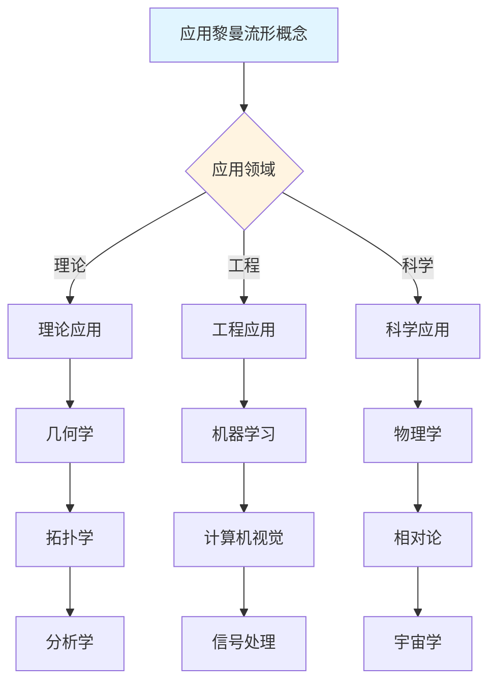
```mermaid
graph TD
    A[应用黎曼流形概念] --> B{应用领域}
    B -->|理论| C[理论应用]
    B -->|工程| D[工程应用]
    B -->|科学| E[科学应用]

    C --> C1[几何学]
    C1 --> C2[拓扑学]
    C2 --> C3[分析学]

    D --> D1[机器学习]
    D1 --> D2[计算机视觉]
    D2 --> D3[信号处理]

    E --> E1[物理学]
    E1 --> E2[相对论]
    E2 --> E3[宇宙学]

    style A fill:#e1f5ff
    style B fill:#fff4e1
```

### 3.2 应用方法决策

**基于应用场景的应用方法**：

1. **理论应用** → 使用形式化证明
   - 几何学：黎曼流形是几何学的基础
   - 拓扑学：黎曼流形在拓扑中的应用
   - 分析学：黎曼流形在分析中的应用

2. **工程应用** → 使用论证过程
   - 机器学习：黎曼流形在机器学习中的应用（流形学习）
   - 计算机视觉：黎曼流形在计算机视觉中的应用
   - 信号处理：黎曼流形在信号处理中的应用

3. **科学应用** → 使用综合方法
   - 物理学：黎曼流形在物理学中的应用（广义相对论中的时空）
   - 相对论：黎曼流形在相对论中的应用
   - 宇宙学：黎曼流形在宇宙学中的应用

---

## 🎓 四、教学决策导图 (编号: C.CORE.019.DECISION.04)

### 4.1 教学内容决策

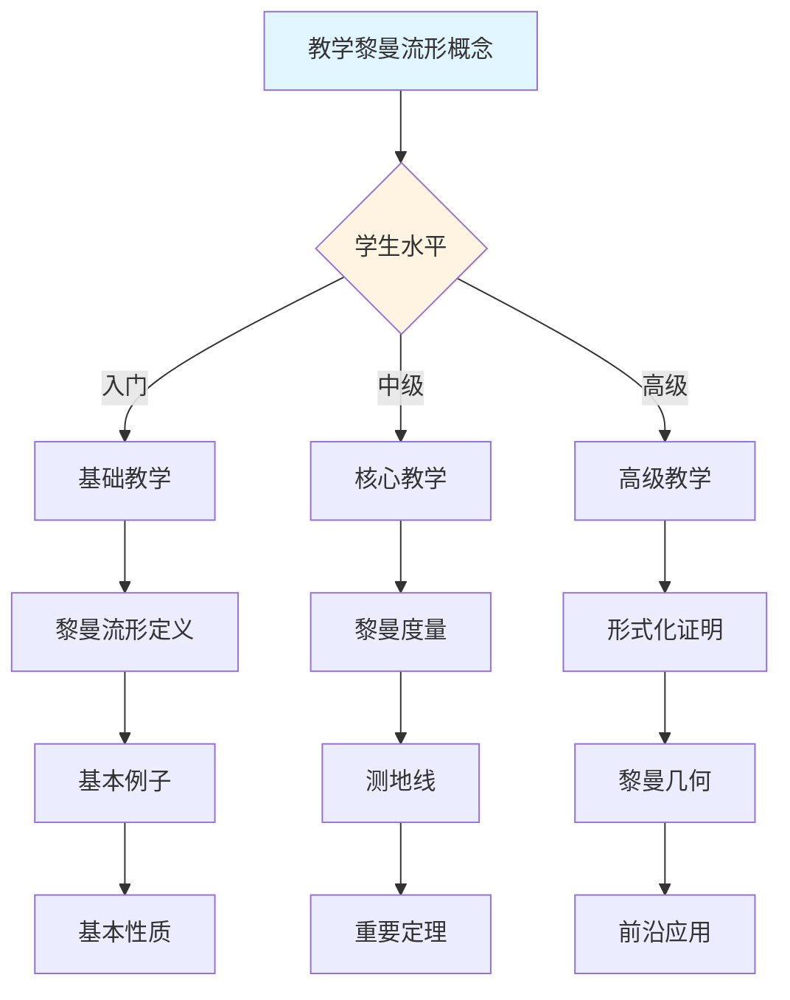
```mermaid
graph TD
    A[教学黎曼流形概念] --> B{学生水平}
    B -->|入门| C[基础教学]
    B -->|中级| D[核心教学]
    B -->|高级| E[高级教学]

    C --> C1[黎曼流形定义]
    C1 --> C2[基本例子]
    C2 --> C3[基本性质]

    D --> D1[黎曼度量]
    D1 --> D2[测地线]
    D2 --> D3[重要定理]

    E --> E1[形式化证明]
    E1 --> E2[黎曼几何]
    E2 --> E3[前沿应用]

    style A fill:#e1f5ff
    style B fill:#fff4e1
```

### 4.2 教学方法决策

**基于认知维度的教学方法**：

1. **直观维度**（入门教学）
   - 使用思维导图建立框架
   - 使用具体例子（球面、双曲面、欧几里得空间）
   - 使用几何直观理解

2. **知性维度**（中级教学）
   - 使用多维矩阵深入分析
   - 使用概念分类系统
   - 使用关系分析建立联系

3. **理性维度**（高级教学）
   - 使用形式化证明严格理解
   - 使用逻辑推理深入分析
   - 使用系统建构整体把握

---

## 🔄 五、整合应用示例 (编号: C.CORE.019.DECISION.05)

### 5.1 完整学习流程示例

**阶段1：入门理解**:

1. 使用学习决策导图 → 确定学习路径：基础概念 → 黎曼流形定义 → 基本性质 → 基本应用
2. 使用总体思维导图 → 了解黎曼流形在几何学中的位置
3. 阅读[黎曼流形-三视角版](./19-黎曼流形.md) → 理解黎曼流形的定义和基本性质
4. 使用论证过程 → 理解黎曼流形的直观意义（度量、距离、曲率、测地线）

**阶段2：深入分析**:

1. 使用多维矩阵 → 分析黎曼流形的多维度特征（知识层次L0基础层、知识领域D4几何、学习难度较高）
2. 阅读[黎曼流形-三视角版](./19-黎曼流形.md) → 深入理解黎曼度量和测地线
3. 使用形式化证明 → 学习黎曼流形相关定理的形式化证明
4. 使用分支关联思维导图 → 了解黎曼流形与流形、曲率、几何的关系

**阶段3：应用研究**:

1. 使用研究决策导图 → 确定研究方向：黎曼几何
2. 使用知识关联网络 → 发现黎曼流形与物理、计算、优化的关系
3. 使用形式化证明系统 → 构建黎曼几何理论体系
4. 阅读[黎曼流形-三视角版](./19-黎曼流形.md) → 了解黎曼流形的历史发展和开放问题

---

## 🔗 六、关联文档 (编号: C.CORE.019.DECISION.06)

### 6.1 核心概念文档

- [黎曼流形-三视角版](./19-黎曼流形.md)
- [黎曼流形](./19-黎曼流形.md)

### 6.2 框架文档

- [决策思维导图体系](../01-总体思维导图/05-决策思维导图体系.md)
- [概念体系全面梳理与推进计划](../00-概念体系全面梳理与推进计划-2025年1月.md)
- [核心概念与新框架整合指南](../00-核心概念与新框架整合指南-2025年1月.md)

### 6.3 相关文档

- [核心概念索引](./00-核心概念索引.md)
- [知识矩阵总览](../02-知识矩阵/00-知识矩阵总览.md)
- [形式化证明系统](../00-形式化证明系统-2025年11月.md)

---

**维护状态**: 持续更新中

