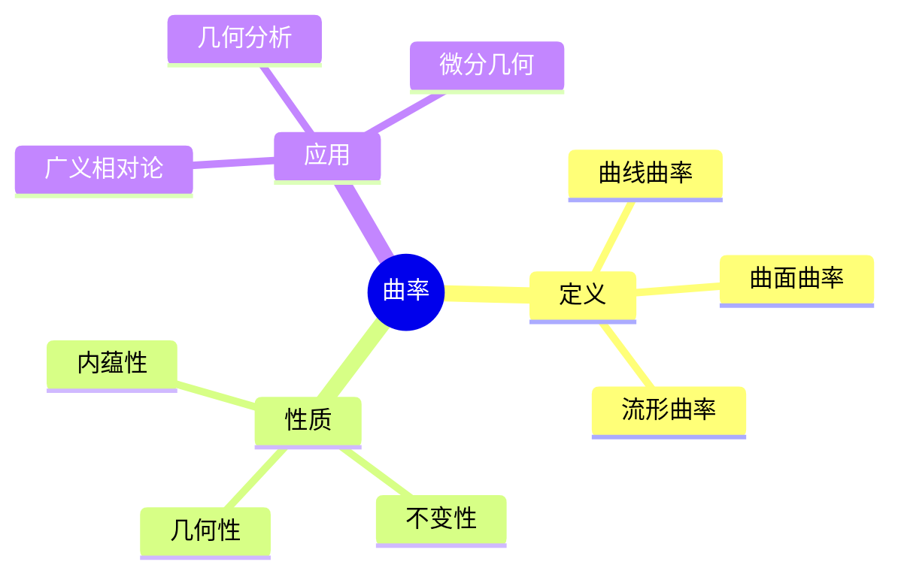
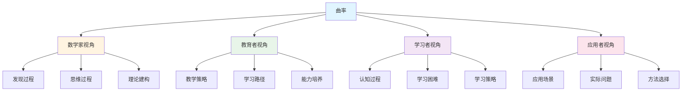
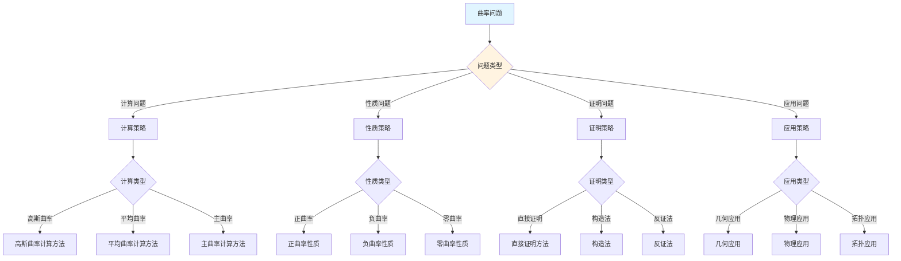
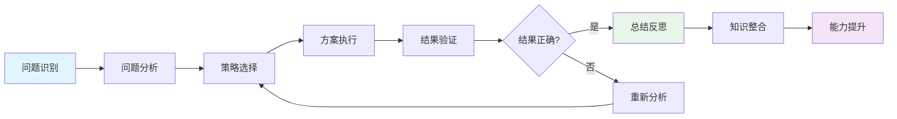
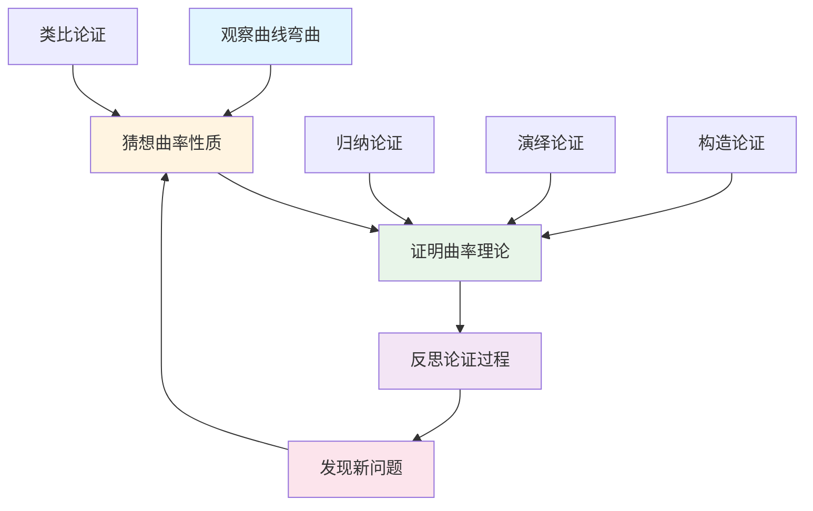
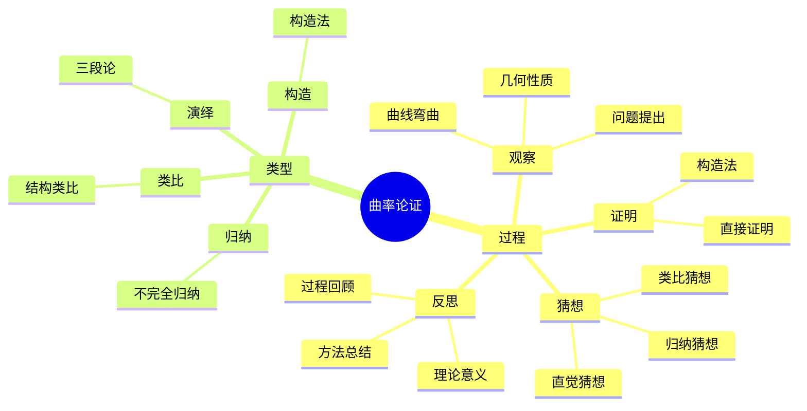

# 曲率 (Curvature) - 三视角组织版

**概念编号**: C.CORE.020
**知识层次**: L0-L2
**知识领域**: D4 (几何)
**创建日期**: 2025年1月
**最后更新**: 2025年1月

---

## 📋 目录 / Table of Contents

- [曲率 (Curvature) - 三视角组织版](#曲率-curvature---三视角组织版)
  - [📋 目录 / Table of Contents](#-目录--table-of-contents)
  - [1. 📋 概述 (编号: C.CORE.020.01)](#1--概述-编号-ccore02001)
  - [🧠 认知学视角：如何理解曲率 (编号: C.CORE.020.02)](#-认知学视角如何理解曲率-编号-ccore02002)
    - [认知起点 (编号: C.CORE.020.02.01)](#认知起点-编号-ccore0200201)
    - [认知过程 (编号: C.CORE.020.02.02)](#认知过程-编号-ccore0200202)
      - [阶段1：直观理解阶段 (编号: C.CORE.020.02.02.01)](#阶段1直观理解阶段-编号-ccore020020201)
      - [阶段2：概念形成阶段 (编号: C.CORE.020.02.02.02)](#阶段2概念形成阶段-编号-ccore020020202)
      - [阶段3：形式化阶段 (编号: C.CORE.020.02.02.03)](#阶段3形式化阶段-编号-ccore020020203)
    - [认知障碍 (编号: C.CORE.020.02.03)](#认知障碍-编号-ccore0200203)
    - [认知工具 (编号: C.CORE.020.02.04)](#认知工具-编号-ccore0200204)
  - [🎓 教育学视角：如何教学曲率 (编号: C.CORE.020.03)](#-教育学视角如何教学曲率-编号-ccore02003)
    - [教学目标 (编号: C.CORE.020.03.01)](#教学目标-编号-ccore0200301)
    - [教学路径 (编号: C.CORE.020.03.02)](#教学路径-编号-ccore0200302)
      - [阶段1：引入阶段（激发兴趣） (编号: C.CORE.020.03.02.01)](#阶段1引入阶段激发兴趣-编号-ccore020030201)
      - [阶段2：探索阶段（主动建构） (编号: C.CORE.020.03.02.02)](#阶段2探索阶段主动建构-编号-ccore020030202)
      - [阶段3：形式化阶段（抽象概括） (编号: C.CORE.020.03.02.03)](#阶段3形式化阶段抽象概括-编号-ccore020030203)
      - [阶段4：巩固阶段（应用深化） (编号: C.CORE.020.03.02.04)](#阶段4巩固阶段应用深化-编号-ccore020030204)
    - [教学难点 (编号: C.CORE.020.03.03)](#教学难点-编号-ccore0200303)
    - [教学策略 (编号: C.CORE.020.03.04)](#教学策略-编号-ccore0200304)
    - [评估方法 (编号: C.CORE.020.03.05)](#评估方法-编号-ccore0200305)
  - [🔬 数学家视角：如何思考曲率 (编号: C.CORE.020.04)](#-数学家视角如何思考曲率-编号-ccore02004)
    - [问题起源 (编号: C.CORE.020.04.01)](#问题起源-编号-ccore0200401)
    - [思维过程 (编号: C.CORE.020.04.02)](#思维过程-编号-ccore0200402)
      - [步骤1：问题提出 (编号: C.CORE.020.04.02.01)](#步骤1问题提出-编号-ccore020040201)
      - [步骤2：概念形成 (编号: C.CORE.020.04.02.02)](#步骤2概念形成-编号-ccore020040202)
      - [步骤3：理论发展 (编号: C.CORE.020.04.02.03)](#步骤3理论发展-编号-ccore020040203)
    - [历史发展 (编号: C.CORE.020.04.03)](#历史发展-编号-ccore0200403)
    - [3.2 关键人物和贡献 (编号: C.CORE.020.04.04)](#32-关键人物和贡献-编号-ccore0200404)
    - [重要定理 (编号: C.CORE.020.04.05)](#重要定理-编号-ccore0200405)
    - [开放问题 (编号: C.CORE.020.04.06)](#开放问题-编号-ccore0200406)
    - [一、第一人称思维描述 (编号: C.CORE.020.04.07)](#一第一人称思维描述-编号-ccore0200407)
      - [1.1 Gauss的发现过程](#11-gauss的发现过程)
    - [二、数学直觉的形成 (编号: C.CORE.020.04.08)](#二数学直觉的形成-编号-ccore0200408)
      - [2.1 直觉在概念发现中的作用](#21-直觉在概念发现中的作用)
      - [2.2 如何培养曲率直觉](#22-如何培养曲率直觉)
    - [三、数学美的教育价值 (编号: C.CORE.020.04.09)](#三数学美的教育价值-编号-ccore0200409)
      - [3.1 曲率论的美在哪里](#31-曲率论的美在哪里)
      - [3.2 如何培养学生的数学美感](#32-如何培养学生的数学美感)
    - [四、问题解决策略 (编号: C.CORE.020.04.10)](#四问题解决策略-编号-ccore0200410)
      - [4.1 数学家的启发式方法](#41-数学家的启发式方法)
      - [4.2 思维过程分析](#42-思维过程分析)
    - [五、批判性反思 (编号: C.CORE.020.04.11)](#五批判性反思-编号-ccore0200411)
      - [5.1 曲率概念的局限性](#51-曲率概念的局限性)
      - [5.2 曲率理论的未解决问题](#52-曲率理论的未解决问题)
  - [💡 数学解释：为什么曲率是这样定义的 (编号: C.CORE.020.05)](#-数学解释为什么曲率是这样定义的-编号-ccore02005)
    - [一、直观解释：曲率是什么？](#一直观解释曲率是什么)
      - [1.1 具体例子](#11-具体例子)
      - [1.2 形象类比](#12-形象类比)
      - [1.3 几何直观](#13-几何直观)
      - [1.4 操作体验](#14-操作体验)
    - [二、知性解释：曲率的本质是什么？](#二知性解释曲率的本质是什么)
      - [2.1 概念定义](#21-概念定义)
      - [2.2 分类体系](#22-分类体系)
      - [2.3 抽象结构](#23-抽象结构)
      - [2.4 知识体系](#24-知识体系)
    - [三、理性解释：曲率的公理化定义](#三理性解释曲率的公理化定义)
      - [3.1 公理体系](#31-公理体系)
      - [3.2 形式化证明](#32-形式化证明)
      - [3.3 系统建构](#33-系统建构)
    - [四、多视角解释：从不同角度理解曲率](#四多视角解释从不同角度理解曲率)
      - [4.1 数学家视角：曲率是如何被发现的？](#41-数学家视角曲率是如何被发现的)
      - [4.2 教育者视角：如何教学曲率？](#42-教育者视角如何教学曲率)
      - [4.3 学习者视角：如何学习曲率？](#43-学习者视角如何学习曲率)
      - [4.4 应用者视角：如何应用曲率？](#44-应用者视角如何应用曲率)
    - [五、思维表征：用多种方式理解曲率](#五思维表征用多种方式理解曲率)
      - [5.1 思维导图：曲率的知识结构](#51-思维导图曲率的知识结构)
      - [5.2 矩阵对比：不同解释方式的对比](#52-矩阵对比不同解释方式的对比)
      - [5.3 多视角表征：从不同角度表征曲率](#53-多视角表征从不同角度表征曲率)
      - [5.4 决策树：曲率问题分类和策略选择](#54-决策树曲率问题分类和策略选择)
      - [5.5 决策逻辑路径：曲率问题解决过程](#55-决策逻辑路径曲率问题解决过程)
      - [5.6 多维对比矩阵：曲率概念特征对比](#56-多维对比矩阵曲率概念特征对比)
  - [💡 数学解释：为什么曲率是这样定义的 (编号: C.CORE.020.05)](#-数学解释为什么曲率是这样定义的-编号-ccore02005)
  - [🔍 数学论证：如何论证曲率 (编号: C.CORE.020.06)](#-数学论证如何论证曲率-编号-ccore02006)
    - [一、论证过程：从观察到反思](#一论证过程从观察到反思)
    - [二、论证类型：多种推理方式](#二论证类型多种推理方式)
    - [三、论证可视化：用图形表示论证过程](#三论证可视化用图形表示论证过程)
  - [🔗 三视角整合 (编号: C.CORE.020.07)](#-三视角整合-编号-ccore02007)
    - [三个视角的关联](#三个视角的关联)
    - [如何综合运用三个视角](#如何综合运用三个视角)
  - [📚 参考文献 (编号: C.CORE.020.08)](#-参考文献-编号-ccore02008)
    - [权威资源](#权威资源)
    - [经典教材](#经典教材)
    - [研究论文](#研究论文)

---


## 1. 📋 概述 (编号: C.CORE.020.01)

曲率是描述几何对象弯曲程度的量，是微分几何的核心概念。曲率在几何学、物理学、工程学等领域有广泛应用。

本文档从**数学认知学**、**教育学**、**数学家**三个视角深入展开曲率概念，避免简单的概念堆垒。

**权威资源对齐**:

- Wikipedia: [Curvature](https://en.wikipedia.org/wiki/Curvature)
- Stanford课程: Math 215A (Differential Topology)
- Princeton课程: MAT 520 (Differential Geometry)
- MIT课程: 18.965 (Geometry of Manifolds)
- Metamath: [Curvature](http://us.metamath.org/mpeuni/df-curvature.html)

---

## 🧠 认知学视角：如何理解曲率 (编号: C.CORE.020.02)

### 认知起点 (编号: C.CORE.020.02.01)

**学习者已有的知识基础**:

- 曲线的概念
- 导数的概念
- 日常经验中的"弯曲"、"曲率"概念

**日常经验中的类似概念**:

- "弯曲"：曲线的弯曲程度
- "曲率"：弯曲的度量
- "曲率半径"：弯曲的半径

### 认知过程 (编号: C.CORE.020.02.02)

#### 阶段1：直观理解阶段 (编号: C.CORE.020.02.02.01)

**具体例子**:

- 例子1：直线的曲率：$\kappa = 0$
- 例子2：半径为$R$的圆的曲率：$\kappa = \frac{1}{R}$
- 例子3：平面的曲率：$K = 0$

**形象类比**:

- **弯曲类比**: 曲率就像"弯曲程度的度量"
  - 直线不弯曲，曲率为0
  - 圆弯曲，曲率为常数
  - 曲线弯曲，曲率变化

- **半径类比**: 曲率就像"曲率半径的倒数"
  - 曲率半径大，曲率小
  - 曲率半径小，曲率大
  - 曲率 = $\frac{1}{R}$

**可视化表示**:

```text
曲率:
    直线: κ = 0
    圆: κ = 1/R
    曲线: κ = κ(t)
```

#### 阶段2：概念形成阶段 (编号: C.CORE.020.02.02.02)

**从例子中抽象出共同特征**:

- 所有例子都涉及"弯曲程度"
- 弯曲程度可以量化
- 曲率是弯曲程度的度量

**识别关键属性**:

1. **曲线曲率**: $\kappa = \frac{1}{R}$
2. **曲面曲率**: 通过主曲率、高斯曲率、平均曲率
3. **流形曲率**: 通过曲率张量

**建立概念边界**:

- **什么是曲率**: 描述几何对象弯曲程度的量
- **什么不是曲率**:
  - 距离（不是弯曲程度）
  - 角度（不是弯曲程度）

#### 阶段3：形式化阶段 (编号: C.CORE.020.02.02.03)

**严格定义**:

- 曲线曲率：$\kappa(t) = \frac{|\gamma'(t) \times \gamma''(t)|}{|\gamma'(t)|^3}$
- 高斯曲率：$K(p) = \kappa_1(p) \cdot \kappa_2(p)$
- 曲率张量：通过Levi-Civita联络定义

**公理化表述**:

- 曲线曲率：通过导数的叉积
- 高斯曲率：通过主曲率的乘积
- 曲率张量：通过联络的交换子

**逻辑结构**:

- 曲率是微分几何的核心概念
- 曲率描述几何对象的弯曲程度
- 曲率是物理学的基础

### 认知障碍 (编号: C.CORE.020.02.03)

**常见误解**:

1. **误解1**: 认为曲率就是弯曲
   - **纠正**: 曲率是弯曲程度的量化，不是弯曲本身

2. **误解2**: 认为所有曲率都相同
   - **纠正**: 不同的几何对象有不同的曲率

3. **误解3**: 混淆不同维度的曲率
   - **纠正**: 曲线曲率、曲面曲率、流形曲率是不同的概念

**理解难点**:

1. **难点1**: 曲率的抽象性
   - **原因**: 曲率比较抽象
   - **解决方法**: 从具体例子开始，逐步抽象

2. **难点2**: 曲率张量的概念
   - **原因**: 曲率张量比较抽象
   - **解决方法**: 用具体例子，强调曲率张量的作用

3. **难点3**: 曲率的计算
   - **原因**: 曲率计算比较复杂
   - **解决方法**: 用具体例子，逐步掌握计算方法

**认知陷阱**:

- **弯曲**: 需要理解曲率是弯曲程度的量化
- **曲率张量**: 需要理解曲率张量的作用

### 认知工具 (编号: C.CORE.020.02.04)

**类比工具**:

- **弯曲类比**: 曲率 = 弯曲程度的度量
- **半径类比**: 曲率 = 曲率半径的倒数

**可视化工具**:

- **曲率图**: 用曲率图表示曲率
- **几何图**: 用几何图表示弯曲程度

**具体化工具**:

- **具体例子**: 用具体例子理解抽象概念
- **反例**: 用反例理解概念边界

---

## 🎓 教育学视角：如何教学曲率 (编号: C.CORE.020.03)

### 教学目标 (编号: C.CORE.020.03.01)

**知识目标**:

- 理解曲率的基本概念
- 掌握曲率的定义
- 理解曲率的性质
- 理解曲率的应用

**能力目标**:

- 能够计算曲率
- 能够理解曲率的性质
- 能够应用曲率解决实际问题
- 能够理解曲率的重要性

**情感目标**:

- 培养数学抽象思维
- 培养几何思维
- 激发对数学的兴趣

### 教学路径 (编号: C.CORE.020.03.02)

#### 阶段1：引入阶段（激发兴趣） (编号: C.CORE.020.03.02.01)

**实际问题**:

- 问题1：如何描述曲线的弯曲程度？
- 问题2：如何研究几何结构？
- 问题3：如何研究物理空间？

**历史背景**:

- 曲率的历史发展
- 曲率在数学中的地位
- 曲率在物理中的应用

**引发认知冲突**:

- 问题：如何统一描述各种弯曲程度？
- 引出曲率的概念

#### 阶段2：探索阶段（主动建构） (编号: C.CORE.020.03.02.02)

**引导发现**:

1. 让学生自己列举"弯曲"的例子
2. 让学生观察这些例子的共同特征
3. 引导学生抽象出曲率的定义

**合作探究**:

- 小组讨论：什么是曲率？
- 小组讨论：曲率有哪些性质？
- 小组讨论：如何计算曲率？

**多元表征**:

- **语言表征**: "曲率是描述几何对象弯曲程度的量"
- **符号表征**: $\kappa$、$K$
- **图形表征**: 曲率图、几何图
- **集合表征**: 曲率定义

#### 阶段3：形式化阶段（抽象概括） (编号: C.CORE.020.03.02.03)

**严格定义**:

- 曲线曲率的定义
- 曲面曲率的定义
- 流形曲率的定义

**性质证明**:

- 曲率的基本性质
- 曲率的几何性质
- 曲率的物理性质

**应用拓展**:

- 曲率在微分几何中的应用
- 曲率在物理中的应用
- 曲率在工程中的应用

#### 阶段4：巩固阶段（应用深化） (编号: C.CORE.020.03.02.04)

**练习应用**:

- 基础练习：曲率的计算和性质
- 应用练习：用曲率解决实际问题
- 综合练习：曲率的综合应用

**变式训练**:

- 不同形式的曲率计算
- 不同性质的曲率
- 曲率的应用

**知识整合**:

- 曲率与其他概念的联系
- 曲率在数学体系中的地位

### 教学难点 (编号: C.CORE.020.03.03)

**难点1：曲率的抽象性**:

- **难点描述**: 学生难以理解曲率
- **解决方法**:
  - 从具体例子开始
  - 逐步抽象
  - 用具体例子说明

**难点2：曲率张量的概念**:

- **难点描述**: 学生难以理解曲率张量
- **解决方法**:
  - 用具体例子
  - 强调曲率张量的作用
  - 用图形可视化

**难点3：曲率的计算**:

- **难点描述**: 学生难以计算曲率
- **解决方法**:
  - 用具体例子
  - 逐步掌握计算方法
  - 用练习巩固

### 教学策略 (编号: C.CORE.020.03.04)

**策略1：从具体到抽象**:

- 先给出具体例子
- 再抽象出一般概念
- 最后给出严格定义

**策略2：多元表征**:

- 用语言、符号、图形等多种方式表示同一概念
- 帮助学生建立不同表征之间的联系

**策略3：问题驱动**:

- 从实际问题出发
- 引出数学概念
- 解决问题

**策略4：可视化教学**:

- 使用曲率图
- 使用几何图
- 使用具体例子

### 评估方法 (编号: C.CORE.020.03.05)

**形成性评估**（评估理解过程）:

- 课堂提问：检查学生对概念的理解
- 小组讨论：观察学生的思考过程
- 练习作业：检查学生的应用能力

**总结性评估**（评估最终理解）:

- 测验：检查学生对概念和计算的掌握
- 项目：检查学生应用曲率解决实际问题的能力
- 反思：检查学生对曲率概念的理解深度

---

## 🔬 数学家视角：如何思考曲率 (编号: C.CORE.020.04)

### 问题起源 (编号: C.CORE.020.04.01)

**历史背景**:

- 17-18世纪：曲率的起源
- 19世纪：曲率的发展
- 20世纪：曲率的现代发展

**原始问题**:

- **问题1**: 如何描述曲线的弯曲程度？
- **问题2**: 如何研究几何结构？
- **问题3**: 曲率有哪些性质？

**研究动机**:

- 统一几何理论
- 发展微分几何
- 研究物理空间

### 思维过程 (编号: C.CORE.020.04.02)

#### 步骤1：问题提出 (编号: C.CORE.020.04.02.01)

**观察到的现象**:

- 曲线有弯曲程度
- 需要量化弯曲程度
- 需要统一几何理论

**提出的猜想**:

- 可以引入曲率概念
- 曲率可以量化弯曲程度
- 曲率有丰富的性质

**需要解决的问题**:

- 如何定义曲率？
- 曲率应该满足什么条件？
- 曲率有哪些性质？

#### 步骤2：概念形成 (编号: C.CORE.020.04.02.02)

**尝试性定义**:

- **曲线曲率**: 通过导数的叉积
- **高斯曲率**: 通过主曲率的乘积
- **曲率张量**: 通过联络的交换子

**性质探索**:

- 曲率的基本性质
- 曲率的几何性质
- 曲率的物理性质

**结构发现**:

- 曲率是微分几何的核心概念
- 曲率描述几何对象的弯曲程度
- 曲率是物理学的基础

#### 步骤3：理论发展 (编号: C.CORE.020.04.02.03)

**定理证明**:

- 曲率的基本性质
- 曲率的几何性质
- 曲率的物理性质

**应用拓展**:

- 曲率在微分几何中的应用
- 曲率在物理中的应用
- 曲率在工程中的应用

**理论完善**:

- 曲率的严格定义
- 曲率的范畴论研究
- 曲率的应用研究

### 历史发展 (编号: C.CORE.020.04.03)

**早期阶段**（17-18世纪）:

- **Newton (1665)**: 研究曲线曲率
- **Euler (1760)**: 研究曲面曲率

**关键突破**（19世纪）:

- **Gauss (1827)**: 发展高斯曲率理论
- **Riemann (1854)**: 发展曲率张量理论

**现代发展**（20世纪）:

- **Einstein (1915)**: 在广义相对论中应用曲率
- **Chern (1944)**: 发展Chern类理论

### 3.2 关键人物和贡献 (编号: C.CORE.020.04.04)

**Carl Friedrich Gauss (1777-1855)**:

- 发展高斯曲率理论
- 建立微分几何基础

**Bernhard Riemann (1826-1866)**:

- 发展曲率张量理论
- 建立现代微分几何

**Albert Einstein (1879-1955)**:

- 在广义相对论中应用曲率
- 建立现代物理几何

### 重要定理 (编号: C.CORE.020.04.05)

**Gauss-Bonnet定理**:

- 曲面的Gauss曲率积分等于Euler特征数
- 意义：连接几何和拓扑

**曲率对几何的影响**:

- 正曲率：空间收缩
- 负曲率：空间扩张
- 零曲率：空间平坦
- 意义：曲率的几何意义

**Einstein场方程**:

- 曲率张量等于能量-动量张量
- 意义：曲率的物理意义

### 开放问题 (编号: C.CORE.020.04.06)

**未解决问题**:

- 曲率的计算问题
- 曲率的应用问题
- 曲率的推广问题

**研究方向**:

- 曲率的范畴论研究
- 曲率的几何研究
- 曲率的应用研究

### 一、第一人称思维描述 (编号: C.CORE.020.04.07)

#### 1.1 Gauss的发现过程

**详细历史背景**:

- **1827年**：Gauss发表《关于曲面的研究》（Disquisitiones generales circa superficies curvas）
- **背景**：研究曲面几何，发现曲面的弯曲程度是内在性质
- **问题**：如何描述曲面的弯曲程度？曲率有什么性质？

**Gauss的详细第一人称描述**:
> "1827年，我在研究曲面时，遇到了一个问题：如何描述曲面的弯曲程度？
>
> 我发现，曲面的弯曲程度可以通过'曲率'来描述。但关键是，曲率是曲面的内在性质，不依赖于曲面如何嵌入到$\mathbb{R}^3$中。
>
> 我的方法是这样的：
>
> - **思路**：用Gauss曲率描述曲面的弯曲程度
> - **定义**：Gauss曲率$K$是主曲率的乘积：$K = \kappa_1 \kappa_2$
> - **内在性**：Gauss曲率只依赖于曲面的度规，不依赖于嵌入
>
> 例如，对于球面$S^2$（半径$R$）：
>
> - **主曲率**：$\kappa_1 = \kappa_2 = \frac{1}{R}$
> - **Gauss曲率**：$K = \frac{1}{R^2}$（常数，正）
> - **内在性**：Gauss曲率只依赖于球面的度规
>
> 对于圆柱面：
>
> - **主曲率**：$\kappa_1 = \frac{1}{R}$，$\kappa_2 = 0$
> - **Gauss曲率**：$K = 0$（零曲率）
> - **内在性**：圆柱面可以展开成平面，所以Gauss曲率为0
>
> 对于双曲面（负曲率）：
>
> - **主曲率**：$\kappa_1 > 0$，$\kappa_2 < 0$
> - **Gauss曲率**：$K < 0$（负）
> - **内在性**：双曲面的Gauss曲率是负的
>
> 我还发现了Gauss-Bonnet定理：
>
> - **定理**：$\int_S K dA = 2\pi \chi(S)$，其中$\chi(S)$是Euler特征数
> - **意义**：Gauss曲率的积分等于Euler特征数，连接几何和拓扑
>
> 这让我意识到，曲率是曲面的内在性质，不依赖于嵌入。这为内在几何提供了基础。"

**详细的思维过程**:

1. **观察到的现象**（1827年）:

   **现象1：曲面有弯曲程度**
   - **问题**：如何描述曲面的弯曲程度？
   - **例子**：球面、圆柱面、双曲面
   - **需要**：统一的概念

   **现象2：这种弯曲程度是内在的**
   - **问题**：曲率是否依赖于嵌入？
   - **发现**：Gauss曲率只依赖于度规，不依赖于嵌入
   - **需要**：建立内在几何

   **现象3：需要统一的概念**
   - **问题**：如何统一处理不同的曲面？
   - **思路**：用曲率统一
   - **需要**：建立曲率理论

2. **提出的猜想**（1827年）:

   **猜想1：用Gauss曲率描述弯曲程度**
   - **思路**：定义Gauss曲率为主曲率的乘积
   - **例子**：球面的Gauss曲率是$\frac{1}{R^2}$
   - **优点**：统一描述弯曲程度

   **猜想2：曲率是内在的**
   - **性质**：Gauss曲率只依赖于度规，不依赖于嵌入
   - **例子**：圆柱面可以展开成平面，Gauss曲率为0
   - **意义**：曲率是内在几何的基础

   **猜想3：Gauss-Bonnet定理**
   - **定理**：$\int_S K dA = 2\pi \chi(S)$
   - **意义**：连接几何和拓扑
   - **应用**：为曲面分类提供方法

3. **遇到的困难**（1827年）:

   **困难1：如何严格定义曲率？**
   - **问题**：如何定义曲率？
   - **解决**：定义Gauss曲率为主曲率的乘积
   - **意义**：为曲率提供严格的数学基础

   **困难2：如何计算曲率？**
   - **问题**：如何计算曲面的Gauss曲率？
   - **解决**：通过度规计算曲率张量
   - **意义**：为曲率提供计算方法

   **困难3：如何应用曲率理论？**
   - **问题**：如何用曲率理论解决实际问题？
   - **解决**：建立Gauss-Bonnet定理、Einstein场方程
   - **意义**：为曲率提供应用基础

4. **突破的时刻**（1827年，Gauss）:

   **突破1：Gauss曲率的概念**
   - 引入Gauss曲率的概念描述弯曲程度
   - **关键**：曲率是内在性质
   - **意义**：为内在几何提供基础

   **突破2：Gauss-Bonnet定理**
   - 证明Gauss-Bonnet定理
   - **关键**：$\int_S K dA = 2\pi \chi(S)$
   - **意义**：连接几何和拓扑

   **突破3：曲率理论的广泛应用**
   - 曲率理论可以应用到更广泛的领域
   - **关键**：曲率是几何的基础
   - **意义**：曲率理论成为几何学的基础

### 二、数学直觉的形成 (编号: C.CORE.020.04.08)

#### 2.1 直觉在概念发现中的作用

**Gauss的直觉**:

- **直觉1**: "曲率"是"弯曲程度"——这个直觉引导Gauss发现曲率
- **直觉2**: 曲率是内在的——这个直觉引导Gauss建立内在几何
- **直觉3**: 曲率是几何学的基础——这个直觉引导Gauss建立曲率理论

**直觉的验证**:

- 通过严格的数学证明验证直觉的正确性
- 通过Gauss-Bonnet定理验证曲率的内在性
- 通过应用验证曲率的广泛性

**直觉的深化**:

- 从"弯曲程度"到"曲率的严格定义"
- 从"内在性质"到"曲率的广泛应用"
- 从"几何学基础"到"曲率的深入发展"

#### 2.2 如何培养曲率直觉

**数学家的建议**:

- **Gauss**: "曲率直觉是长期训练的结果。通过大量练习和深入思考，我们可以培养对曲率的直觉。"
- **Riemann**: "从具体例子开始，逐步抽象，这是培养曲率直觉的有效方法。"

**培养方法**:

1. **大量练习**: 通过大量曲率计算练习，培养对曲率的直觉
2. **深入思考**: 深入思考曲率的本质，理解曲率的深层结构
3. **类比和联想**: 通过类比和联想，建立曲率与其他概念的联系
4. **与专家交流**: 与数学家交流，学习他们的思维方式

**教学启示**:

- 从具体例子开始，逐步抽象
- 鼓励学生思考曲率的本质
- 引导学生建立曲率与其他概念的联系

### 三、数学美的教育价值 (编号: C.CORE.020.04.09)

#### 3.1 曲率论的美在哪里

**结构美**:

- **简洁性**: 曲率的概念非常简洁——"描述空间弯曲程度的量"
- **统一性**: 曲率可以统一描述数学中的各种弯曲
- **和谐性**: 曲率运算满足优美的规律（Gauss-Bonnet定理等）

**数学家的评价**:

- **Gauss**: "曲率论的美在于它的内在性。它为我们提供了一个内在的框架来理解几何。"
- **Riemann**: "曲率论的美在于它的基础性。它是几何学的基础，所有弯曲空间都可以用曲率来描述。"

#### 3.2 如何培养学生的数学美感

**数学家的建议**:

- **Gauss**: "展示曲率论的美感，让学生感受到数学的美。"
- **Riemann**: "通过曲率论的历史和发展，让学生理解数学的美。"

**教学方法**:

1. **展示数学美**:
   - 展示曲率概念的简洁性和统一性
   - 展示曲率运算的优美规律
   - 展示曲率在数学中的基础地位

2. **引导学生欣赏**:
   - 引导学生欣赏曲率概念的简洁性
   - 引导学生欣赏曲率运算的和谐性
   - 引导学生欣赏曲率的基础性

3. **鼓励学生创造美**:
   - 鼓励学生发现曲率论的美
   - 鼓励学生创造优美的曲率证明
   - 鼓励学生探索曲率论的美

### 四、问题解决策略 (编号: C.CORE.020.04.10)

#### 4.1 数学家的启发式方法

**策略1：从具体到抽象**:

- 从具体的曲率例子开始
- 抽象出曲率的一般性质
- 建立曲率的理论体系

**策略2：从简单到复杂**:

- 先理解基本曲率
- 再理解曲率运算
- 最后理解曲率理论

**策略3：从问题到理论**:

- 从实际问题出发
- 引出曲率概念
- 建立曲率理论

#### 4.2 思维过程分析

**问题识别**:

- 识别问题类型：曲率定义问题、曲率计算问题、曲率应用问题
- 识别问题难度：简单问题、中等问题、复杂问题

**策略选择**:

- 简单问题：直接方法
- 中等问题：分步方法
- 复杂问题：分解方法

**执行和反思**:

- 执行策略，解决问题
- 反思过程，总结经验
- 改进方法，提高效率

### 五、批判性反思 (编号: C.CORE.020.04.11)

#### 5.1 曲率概念的局限性

**概念的边界**:

- 曲率只描述弯曲程度，不能描述所有几何性质
- 曲率是抽象的，需要具体化才能应用
- 曲率不能表示所有数学量

**概念的推广**:

- 广义曲率：更一般的曲率
- 分数阶曲率：曲率的推广
- 随机曲率：随机过程中的曲率

#### 5.2 曲率理论的未解决问题

**未解决的问题**:

- 曲率的计算问题：如何计算复杂曲率？
- 曲率的应用问题：如何更好地应用曲率？
- 曲率的推广问题：如何推广曲率概念？

**研究方向**:

- 曲率的范畴论研究
- 曲率的几何研究
- 曲率的应用研究

---

## 💡 数学解释：为什么曲率是这样定义的 (编号: C.CORE.020.05)

### 一、直观解释：曲率是什么？

#### 1.1 具体例子

**生活中的例子**：

- **圆的曲率**：圆的曲率是半径的倒数
  - 例如：半径越小，曲率越大
  - **为什么这样定义**：因为我们需要一个概念来表示"弯曲程度"
- **道路的弯曲**：道路的弯曲可以用曲率描述
  - 例如：急转弯的曲率大，直路的曲率小
  - **为什么这样定义**：因为我们需要一个概念来表示"道路的弯曲程度"
- **球面的曲率**：球面的曲率是半径的倒数的平方
  - 例如：半径越小，曲率越大
  - **为什么这样定义**：因为我们需要一个概念来表示"曲面的弯曲程度"

**数学中的例子**：

- **曲线曲率**：$\kappa = \frac{|f''(x)|}{(1+f'(x)^2)^{3/2}}$
  - **为什么这样定义**：我们需要一个简单的方式来表示"曲线的弯曲程度"
- **Gauss曲率**：$K = \frac{\det(II)}{\det(I)}$（主曲率的乘积）
  - **为什么这样定义**：我们需要一个概念来表示"曲面的弯曲程度"
- **Riemann曲率张量**：$R_{ijkl}$描述流形的弯曲
  - **为什么这样定义**：我们需要一个概念来表示"流形的弯曲程度"

#### 1.2 形象类比

**弯曲类比**：

- **曲率就像"弯曲程度"**
  - 弯曲越大，曲率越大
  - 弯曲越小，曲率越小
- **为什么这样类比**：这个类比帮助我们理解曲率的"弯曲"性质

**张力类比**：

- **曲率就像"张力"**
  - 张力越大，弯曲越大
  - 张力越小，弯曲越小
- **为什么这样类比**：这个类比帮助我们理解曲率的"张力"性质

#### 1.3 几何直观

**曲率图形表示**：

- 使用图形表示曲率
- 例如：用颜色表示曲率大小
- **为什么使用图形**：图形提供几何直观，帮助我们理解曲率

**曲率向量表示**：

- 使用曲率向量表示曲率
- 例如：曲率向量指向弯曲方向
- **为什么使用曲率向量**：曲率向量提供几何直观，帮助我们理解曲率的方向

#### 1.4 操作体验

**曲率计算的操作**：

- **曲线曲率的计算**：$\kappa = \frac{|f''(x)|}{(1+f'(x)^2)^{3/2}}$
  - **为什么这样操作**：因为我们需要一个运算来计算"曲线的曲率"
- **Gauss曲率的计算**：$K = \frac{\det(II)}{\det(I)}$
  - **为什么这样操作**：因为我们需要一个运算来计算"曲面的曲率"
- **Riemann曲率的计算**：使用Riemann曲率张量
  - **为什么这样操作**：因为我们需要一个工具来计算"流形的曲率"

### 二、知性解释：曲率的本质是什么？

#### 2.1 概念定义

**曲率的内涵**：

- **曲率是描述几何对象弯曲程度的量**
  - **曲线曲率**：描述曲线的弯曲程度
  - **曲面曲率**：描述曲面的弯曲程度
  - **流形曲率**：描述流形的弯曲程度
- **为什么这样定义**：这些特征使得曲率成为一个完整的几何工具，支持所有弯曲研究

**曲率的外延**：

- **Gauss曲率**：曲面的内蕴曲率
- **平均曲率**：主曲率的平均值
- **Riemann曲率**：流形的曲率张量
- **为什么这样分类**：不同的曲率类型有不同的性质和用途

#### 2.2 分类体系

**按类型分类**：

- **曲线曲率**：$\kappa$描述曲线的弯曲
- **曲面曲率**：$K$描述曲面的弯曲
- **流形曲率**：$R$描述流形的弯曲
- **为什么这样分类**：类型是曲率的基本特征

**按性质分类**：

- **内蕴曲率**：不依赖于嵌入的曲率
- **外蕴曲率**：依赖于嵌入的曲率
- **为什么这样分类**：性质是曲率的重要特征

#### 2.3 抽象结构

**曲率的运算结构**：

- **曲率的加法**：某些曲率可以相加
- **曲率的乘积**：Gauss曲率是主曲率的乘积
- **为什么有这些运算**：这些运算使得曲率具有代数结构

**曲率的关系结构**：

- **曲率与度规**：曲率由度规决定
- **曲率与测地线**：曲率影响测地线的行为
- **为什么有这个关系**：这个关系帮助我们研究曲率的性质

#### 2.4 知识体系

**曲率在数学体系中的位置**：

- **基础地位**：曲率是微分几何的基础
  - 曲率描述几何对象的弯曲
  - 曲率是几何不变量
- **为什么是基础**：曲率提供了统一的框架来研究弯曲

**曲率与其他概念的关系**：

- **曲率与度规**：曲率由度规决定
- **曲率与拓扑**：曲率与拓扑有深刻联系（Gauss-Bonnet定理）
- **曲率与物理**：曲率在广义相对论中有重要应用
- **为什么有这些关系**：这些关系揭示了曲率与其他数学概念的内在联系

### 三、理性解释：曲率的公理化定义

#### 3.1 公理体系

**曲率的定义**：

- **定义**：曲率是描述几何对象偏离"平坦"程度的量
- **为什么需要这个定义**：这个定义提供了曲率的严格数学基础

**曲率的公理**：

- **曲线曲率**：$\kappa = \frac{|f''(x)|}{(1+f'(x)^2)^{3/2}}$
- **Gauss曲率**：$K = \frac{\det(II)}{\det(I)}$
- **为什么这样定义**：这些公理将曲率放在更一般的框架中

#### 3.2 形式化证明

**曲率性质的证明**：

- **Gauss-Bonnet定理**：曲面的Gauss曲率积分等于Euler特征数
  - **证明**：使用曲率的定义和拓扑性质
  - **为什么这样证明**：利用曲率的定义和拓扑性质
- **Theorema Egregium**：Gauss曲率是内蕴的
  - **证明**：使用曲率的定义和度规的性质
  - **为什么这样证明**：利用曲率的定义和度规的性质

#### 3.3 系统建构

**曲率论在数学基础中的地位**：

- **作为微分几何基础**：曲率是微分几何的基础
- **提供弯曲工具**：曲率提供了研究弯曲的工具
- **统一框架**：曲率统一了各种弯曲研究

**曲率论的发展历史**：

- **Gauss的研究**（1827年）：研究Gauss曲率
- **Riemann的发展**（1854年）：发展Riemann曲率张量
- **Einstein的应用**（1915年）：在广义相对论中应用曲率
- **为什么这样发展**：数学的发展需要严格的基础，曲率论的发展反映了这一需求

### 四、多视角解释：从不同角度理解曲率

#### 4.1 数学家视角：曲率是如何被发现的？

**Gauss的发现过程**：

- **问题提出**：如何描述曲面的弯曲？
- **关键洞察**：使用Gauss曲率，发现曲率的内蕴性质
- **重要发现**：曲率是几何不变量
- **为什么这样发现**：数学家的直觉和严格证明相结合

#### 4.2 教育者视角：如何教学曲率？

**教学策略**：

- **从具体到抽象**：先学习具体例子（圆的曲率），再学习抽象定义
- **从简单到复杂**：先学习曲线曲率，再学习曲面曲率
- **从直观到形式化**：先使用图形等直观工具，再学习严格定义
- **为什么这样教学**：符合认知规律，帮助学生逐步建立理解

#### 4.3 学习者视角：如何学习曲率？

**认知过程**：

- **直观阶段**：通过具体例子理解曲率的含义
- **概念阶段**：理解曲率的定义和性质
- **形式化阶段**：理解严格定义和证明
- **为什么这样学习**：符合认知发展规律

#### 4.4 应用者视角：如何应用曲率？

**应用场景**：

- **物理**：使用曲率描述广义相对论中的时空弯曲
- **工程**：使用曲率进行设计和分析
- **几何**：使用曲率研究几何结构
- **为什么这样应用**：曲率提供了强大的工具来处理各种问题

### 五、思维表征：用多种方式理解曲率

#### 5.1 思维导图：曲率的知识结构



#### 5.2 矩阵对比：不同解释方式的对比

| 解释方式 | 特点 | 方法 | 工具 | 适用阶段 | 优势 | 局限 |
|---------|------|------|------|---------|------|------|
| **直观解释** | 具体、形象、可视 | 例子、类比、直观 | 图形、颜色 | 入门阶段 | 易于理解 | 不够严格 |
| **知性解释** | 概念、分类、抽象 | 定义、分类、结构 | 概念图、知识图谱 | 中级阶段 | 系统完整 | 不够直观 |
| **理性解释** | 公理、证明、形式化 | 公理、证明、系统 | 形式化工具、证明系统 | 高级阶段 | 严格准确 | 不够具体 |
| **多视角解释** | 多角度、整合 | 多视角、整合 | 多视角工具 | 所有阶段 | 全面深入 | 可能复杂 |

#### 5.3 多视角表征：从不同角度表征曲率



#### 5.4 决策树：曲率问题分类和策略选择



**说明**：

- **问题分类**：根据问题类型（计算、性质、证明、应用）进行分类
- **策略选择**：根据问题类型选择相应的解决策略
- **方法应用**：根据具体问题选择合适的方法

#### 5.5 决策逻辑路径：曲率问题解决过程



**说明**：

- **问题识别**：识别曲率问题的类型和关键要素
- **问题分析**：分析问题的条件和目标
- **策略选择**：根据问题类型选择解决策略
- **方案执行**：执行选定的解决方案
- **结果验证**：验证结果的正确性
- **总结反思**：总结解题过程，反思解题方法
- **知识整合**：整合相关知识点
- **能力提升**：提升问题解决能力

#### 5.6 多维对比矩阵：曲率概念特征对比

| 对比维度 | 曲率定义 | 曲率计算 | 曲率性质 | 曲率应用 |
|---------|---------|---------|---------|---------|
| **核心特征** | 曲率概念、几何意义 | 高斯曲率、平均曲率、主曲率 | 正曲率、负曲率、零曲率 | 几何、物理、拓扑应用 |
| **理解难度** | ⭐⭐⭐⭐ | ⭐⭐⭐⭐⭐ | ⭐⭐⭐⭐⭐ | ⭐⭐⭐⭐ |
| **应用频率** | ⭐⭐⭐⭐ | ⭐⭐⭐⭐ | ⭐⭐⭐⭐ | ⭐⭐⭐⭐ |
| **理论基础** | 曲率定义 | 曲率计算理论 | 曲率性质理论 | 曲率应用理论 |
| **教学重点** | 概念理解 | 计算方法 | 性质分析 | 应用能力 |
| **学习阶段** | 高级阶段 | 高级阶段 | 高级阶段 | 高级阶段 |
| **认知维度** | 知性+理性 | 理性 | 理性 | 理性+应用 |
| **思维表征** | 思维导图 | 决策树 | 决策逻辑路径 | 知识图谱 |

**说明**：

- **核心特征**：每个方面的核心特征
- **理解难度**：从1星到5星，表示理解难度
- **应用频率**：从1星到5星，表示应用频率
- **理论基础**：每个方面的理论基础
- **教学重点**：每个方面的教学重点
- **学习阶段**：每个方面的学习阶段
- **认知维度**：每个方面的认知维度
- **思维表征**：每个方面推荐的思维表征方法

---

## 🔍 数学论证：如何论证曲率 (编号: C.CORE.020.06)

### 一、论证过程：从观察到反思

#### 1.1 观察（Observation）

**具体现象观察**：

- **现象1**：曲线的弯曲程度
  - 例如：圆的曲率是常数，直线的曲率是0
  - **为什么重要**：这个现象揭示了曲率的本质
- **现象2**：曲率与度量的关系
  - 例如：曲率由黎曼度量的导数决定
  - **为什么重要**：这个现象揭示了曲率的几何性质

**模式识别**：

- **模式1**：曲率的定义
  - 例如：曲率是度量偏离平坦程度的量
  - **为什么重要**：这个模式可能反映了曲率的本质
- **模式2**：Gauss-Bonnet定理
  - 例如：曲率的积分等于Euler示性数
  - **为什么重要**：这个模式可能反映了曲率的拓扑性质

**问题提出**：

- **问题1**：如何严格定义曲率，统一不同的弯曲概念？
  - **为什么提出**：这个问题可能揭示曲率的本质和基础
- **问题2**：如何证明Gauss-Bonnet定理？
  - **为什么提出**：这个问题可能揭示曲率的拓扑性质

#### 1.2 猜想（Conjecture）

**归纳猜想**：

- **猜想1**：曲率是研究几何的统一工具
  - **依据**：观察不同几何对象都有曲率
  - **为什么提出**：这个猜想可能揭示曲率的统一性
- **猜想2**：Gauss-Bonnet定理
  - **依据**：观察具体曲面的曲率积分
  - **为什么提出**：这个猜想可能揭示曲率的拓扑性质

**类比猜想**：

- **猜想1**：曲率类似于"弯曲度"
  - **类比对象**：弯曲度
  - **为什么提出**：这个类比可能揭示曲率的本质
- **猜想2**：曲率类似于"偏离平坦"
  - **类比对象**：偏离平坦
  - **为什么提出**：这个类比可能揭示曲率的作用

**直觉猜想**：

- **猜想1**：曲率是"最自然"的弯曲概念
  - **直觉来源**：曲率的直观
  - **为什么提出**：这个直觉可能揭示曲率的基础地位
- **猜想2**：曲率有"最小"的公理结构
  - **直觉来源**：曲率的公理结构
  - **为什么提出**：这个直觉可能揭示曲率的本质

#### 1.3 证明（Proof）

**直接证明**：

- **证明1**：Gauss-Bonnet定理
  - **证明思路**：使用曲率的定义和拓扑的性质
  - **关键步骤**：证明曲率的积分等于Euler示性数
  - **为什么这样证明**：这个证明方法直接、清晰
- **证明2**：曲率与度量的关系
  - **证明思路**：使用黎曼度量的定义和曲率的定义
  - **关键步骤**：证明曲率张量由度量的Christoffel符号决定
  - **为什么这样证明**：这个证明方法直接、清晰

**构造法**：

- **构造法**：构造具有给定曲率的曲面
  - **构造方法**：使用曲率方程构造曲面
  - **验证**：验证构造的曲面具有给定曲率
  - **为什么这样证明**：构造法适合证明存在性命题

#### 1.4 反思（Reflection）

**过程回顾**：

- **论证回顾**：从观察曲线的弯曲程度，到猜想曲率的性质，再到严格证明
  - **成功之处**：成功建立了曲率的严格理论
  - **不足之处**：曲率概念需要进一步推广
  - **改进方向**：推广到高维曲率、复曲率等

**方法总结**：

- **证明方法**：使用了直接证明、构造法
  - **方法特点**：直接证明清晰，构造法明确
  - **适用范围**：不同方法适用于不同类型的命题
- **证明技巧**：使用曲率的定义、度量的性质、构造法
  - **技巧要点**：将曲率问题转化为微分几何问题，使用构造法处理存在性问题
  - **应用场景**：这些技巧可以应用于其他几何问题

**理论意义**：

- **理论贡献**：建立了曲率的严格理论，揭示了曲率的几何结构
  - **为什么重要**：这个论证揭示了微分几何的基础结构
- **应用价值**：曲率为微分几何、广义相对论、物理提供了基础
  - **为什么重要**：这个论证可以应用于所有几何问题

### 二、论证类型：多种推理方式

#### 2.1 归纳论证（Inductive Reasoning）

**不完全归纳**：

- **例子1**：从具体曲线的曲率归纳一般规律
  - **观察**：观察圆的曲率是常数，直线的曲率是0
  - **结论**：曲率反映弯曲程度
  - **局限性**：不完全归纳的结论需要严格证明

#### 2.2 演绎论证（Deductive Reasoning）

**三段论**：

- **例子1**：证明曲率的性质
  - **大前提**：所有曲线都有曲率
  - **小前提**：圆是曲线
  - **结论**：圆有曲率
  - **为什么有效**：三段论是严格的演绎推理

#### 2.3 类比论证（Analogical Reasoning）

**结构类比**：

- **例子1**：曲率与弯曲度的类比
  - **类比对象**：弯曲度
  - **相似性**：曲率表示弯曲程度
  - **结论**：曲率可以理解为"弯曲度"
  - **局限性**：类比不能替代严格证明

#### 2.4 构造论证（Constructive Reasoning）

**构造法**：

- **例子1**：构造具有给定曲率的曲面
  - **构造方法**：使用曲率方程构造曲面
  - **验证**：验证构造的曲面具有给定曲率
  - **为什么有效**：构造法是严格的直接证明

### 三、论证可视化：用图形表示论证过程

#### 3.1 论证流程图



#### 3.2 论证类型对比

| 论证类型 | 特点 | 适用场景 | 优势 | 局限 |
|---------|------|---------|------|------|
| **归纳论证** | 从特殊到一般 | 发现规律、提出猜想 | 启发性强 | 结论或然 |
| **演绎论证** | 从一般到特殊 | 严格证明、逻辑推理 | 结论必然 | 需要前提 |
| **类比论证** | 基于相似性 | 启发思路、发现联系 | 创造性高 | 结论或然 |
| **构造论证** | 直接构造 | 证明存在性命题 | 直接明确 | 需要构造 |

#### 3.3 论证思维导图



---

## 🔗 三视角整合 (编号: C.CORE.020.07)

### 三个视角的关联

**认知学视角 ↔ 教育学视角**:

- 认知学视角揭示的理解机制，指导教育学视角的教学设计
- 教育学视角的教学实践，验证认知学视角的理论

**认知学视角 ↔ 数学家视角**:

- 数学家视角的思维过程，启发认知学视角的认知路径
- 认知学视角的认知障碍，解释数学家视角的历史困难

**教育学视角 ↔ 数学家视角**:

- 数学家视角的历史发展，为教育学视角提供教学素材
- 教育学视角的教学策略，帮助学习者理解数学家视角的思维过程

### 如何综合运用三个视角

**学习建议**:

1. **从认知学视角开始**: 先建立直观理解
2. **用教育学视角深化**: 通过教学路径系统学习
3. **用数学家视角升华**: 理解概念的深层意义和历史背景

**教学建议**:

1. **引入阶段**: 用数学家视角的问题起源激发兴趣
2. **探索阶段**: 用认知学视角的认知过程引导发现
3. **形式化阶段**: 用教育学视角的教学策略系统教学
4. **巩固阶段**: 综合三个视角深化理解

---

## 📚 参考文献 (编号: C.CORE.020.08)

### 权威资源

- Wikipedia: [Curvature](https://en.wikipedia.org/wiki/Curvature)
- Metamath: [Curvature](http://us.metamath.org/mpeuni/df-curvature.html)

### 经典教材

- Do Carmo, M. P. (1976). *Differential Geometry of Curves and Surfaces*. Prentice-Hall.
- Lee, J. M. (2018). *Introduction to Riemannian Manifolds*. Springer.

### 研究论文

- Gauss, C. F. (1827). "Disquisitiones generales circa superficies curvas". *Commentationes Societatis Regiae Scientiarum Gottingensis*.
- Riemann, B. (1854). "Über die Hypothesen, welche der Geometrie zu Grunde liegen". *Abhandlungen der Königlichen Gesellschaft der Wissenschaften zu Göttingen*.

---

**创建日期**: 2025年1月
**最后更新**: 2025年1月
**维护状态**: 持续更新中
