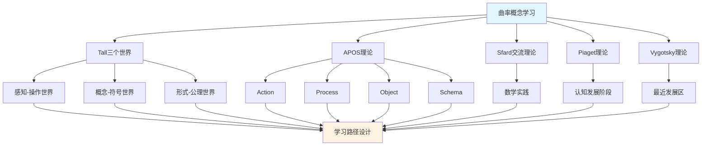

# 曲率概念的多理论分析示例 / Multi-Theory Analysis Example: Curvature Concept

**主题编号 / Topic ID**: C.CORE.020.MULTI
**创建日期 / Created**: 2025年1月 / January 2025
**最后更新 / Last Updated**: 2025年1月 / January 2025
**关联概念 / Related Concepts**: [曲率 / Curvature](./20-曲率.md) | [曲率-三视角版 / Curvature-Three Perspectives](./20-曲率-三视角版.md)

---

## 📋 概述 / Overview

本文档为"曲率"概念提供多理论分析示例，展示如何运用国际主流数学认知理论来分析几何学核心概念。

This document provides a multi-theory analysis example for the "Curvature" concept, demonstrating how to apply international mainstream mathematical cognitive theories to analyze core concepts in geometry.

**分析目标 / Analysis Objectives**：

- 展示曲率概念的多理论分析方法 / Demonstrate multi-theory analysis methods for curvature concepts
- 为其他几何学概念提供分析参考 / Provide analysis reference for other geometry concepts
- 建立理论整合的应用示例 / Establish application examples of theoretical integration
- 强调曲率与拓扑空间、微分几何的关系 / Emphasize the relationship between curvatures, topological spaces, and differential geometry

---

## 📑 目录 / Table of Contents

- [曲率概念的多理论分析示例 / Multi-Theory Analysis Example: Curvature Concept](#曲率概念的多理论分析示例--multi-theory-analysis-example-curvature-concept)
  - [📋 概述 / Overview](#-概述--overview)
  - [📑 目录 / Table of Contents](#-目录--table-of-contents)
  - [🎯 一、Tall三个世界理论分析 / Tall's Three Worlds Theory Analysis (编号: C.CORE.018.MULTI.01)](#-一tall三个世界理论分析--talls-three-worlds-theory-analysis-编号-ccore018multi01)
    - [1.1 感知-操作世界（Embodied World）](#11-感知-操作世界embodied-world)
    - [1.2 概念-符号世界（Symbolic World）](#12-概念-符号世界symbolic-world)
    - [1.3 形式-公理世界（Formal World）](#13-形式-公理世界formal-world)
  - [🔬 二、Dubinsky APOS理论分析 (编号: C.CORE.018.MULTI.02)](#-二dubinsky-apos理论分析-编号-ccore018multi02)
    - [2.1 Action（动作）](#21-action动作)
    - [2.2 Process（过程）](#22-process过程)
    - [2.3 Object（对象）](#23-object对象)
    - [2.4 Schema（图式）](#24-schema图式)
  - [💬 三、Sfard交流理论分析 / Sfard's Commognitive Theory Analysis (编号: C.CORE.018.MULTI.03)](#-三sfard交流理论分析--sfards-commognitive-theory-analysis-编号-ccore018multi03)
    - [3.1 曲率作为交流工具 / Curvature as a Communication Tool](#31-曲率作为交流工具--curvature-as-a-communication-tool)
    - [3.2 曲率学习的实践参与 / Practice Participation in Curvature Learning](#32-曲率学习的实践参与--practice-participation-in-curvature-learning)
  - [🧠 四、Piaget认知发展理论分析 / Piaget's Cognitive Development Theory Analysis (编号: C.CORE.018.MULTI.04)](#-四piaget认知发展理论分析--piagets-cognitive-development-theory-analysis-编号-ccore018multi04)
    - [4.1 具体运算阶段（7-12岁）/ Concrete Operational Stage (7-12 years)](#41-具体运算阶段7-12岁-concrete-operational-stage-7-12-years)
    - [4.2 形式运算阶段（12+岁）/ Formal Operational Stage (12+ years)](#42-形式运算阶段12岁-formal-operational-stage-12-years)
  - [🌍 五、Vygotsky社会文化理论分析 / Vygotsky's Sociocultural Theory Analysis (编号: C.CORE.018.MULTI.05)](#-五vygotsky社会文化理论分析--vygotskys-sociocultural-theory-analysis-编号-ccore018multi05)
    - [5.1 最近发展区（ZPD）/ Zone of Proximal Development (ZPD)](#51-最近发展区zpd-zone-of-proximal-development-zpd)
    - [5.2 社会文化工具 / Sociocultural Tools](#52-社会文化工具--sociocultural-tools)
  - [🔄 六、多理论整合分析 / Multi-Theory Integration Analysis (编号: C.CORE.018.MULTI.06)](#-六多理论整合分析--multi-theory-integration-analysis-编号-ccore018multi06)
    - [6.1 理论共同点 / Theoretical Commonalities](#61-理论共同点--theoretical-commonalities)
    - [6.2 理论互补性 / Theoretical Complementarity](#62-理论互补性--theoretical-complementarity)
    - [6.3 整合应用框架](#63-整合应用框架)
  - [📊 七、曲率概念的多理论学习路径 / Multi-Theory Learning Path for Curvature Concept (编号: C.CORE.018.MULTI.07)](#-七曲率概念的多理论学习路径--multi-theory-learning-path-for-curvature-concept-编号-ccore018multi07)
    - [7.1 入门阶段（Tall感知-操作世界 + APOS Action）/ Entry Stage (Tall Embodied World + APOS Action)](#71-入门阶段tall感知-操作世界--apos-action-entry-stage-tall-embodied-world--apos-action)
    - [7.2 中级阶段（Tall概念-符号世界 + APOS Process/Object）/ Intermediate Stage (Tall Symbolic World + APOS Process/Object)](#72-中级阶段tall概念-符号世界--apos-processobject-intermediate-stage-tall-symbolic-world--apos-processobject)
    - [7.3 高级阶段（Tall形式-公理世界 + APOS Schema + Sfard实践）/ Advanced Stage (Tall Formal World + APOS Schema + Sfard Practice)](#73-高级阶段tall形式-公理世界--apos-schema--sfard实践-advanced-stage-tall-formal-world--apos-schema--sfard-practice)
  - [🎓 八、教学建议 / Teaching Suggestions (编号: C.CORE.018.MULTI.08)](#-八教学建议--teaching-suggestions-编号-ccore018multi08)
    - [8.1 基于多理论的教学设计 / Multi-Theory Based Teaching Design](#81-基于多理论的教学设计--multi-theory-based-teaching-design)
    - [8.2 具体教学策略 / Specific Teaching Strategies](#82-具体教学策略--specific-teaching-strategies)
  - [🔗 九、关联文档 / Related Documents (编号: C.CORE.018.MULTI.09)](#-九关联文档--related-documents-编号-ccore018multi09)
    - [9.1 核心概念文档 / Core Concept Documents](#91-核心概念文档--core-concept-documents)
    - [9.2 理论框架文档 / Theoretical Framework Documents](#92-理论框架文档--theoretical-framework-documents)
  - [✅ 十、总结 / Summary (编号: C.CORE.018.MULTI.10)](#-十总结--summary-编号-ccore018multi10)
    - [10.1 多理论分析的价值 / Value of Multi-Theory Analysis](#101-多理论分析的价值--value-of-multi-theory-analysis)
    - [10.2 应用推广 / Application and Extension](#102-应用推广--application-and-extension)

---

## 🎯 一、Tall三个世界理论分析 / Tall's Three Worlds Theory Analysis (编号: C.CORE.018.MULTI.01)

### 1.1 感知-操作世界（Embodied World）

**曲率在感知-操作世界中的理解 / Understanding Curvatures in the Embodied World**：

- **具体经验 / Concrete Experience**：
  - 通过观察曲线、曲面理解曲率：曲线是1维曲率，球面是2维曲率 / Understanding curvatures through observing curves and surfaces: curves are 1-dimensional curvatures, spheres are 2-dimensional curvatures
  - 例如：地球表面（球面）、轮胎表面（环面） / Examples: Earth's surface (sphere), tire surface (torus)
  - 通过"局部像欧几里得空间"理解曲率：在小范围内，曲率看起来像平面 / Understanding curvatures through "locally like Euclidean space": in small regions, curvatures look like planes

- **身体动作 / Bodily Actions**：
  - 通过"局部观察"的动作理解曲率 / Understanding curvatures through the action of "local observation"
  - 通过"坐标变换"理解曲率的局部结构 / Understanding local structure of curvatures through "coordinate transformations"
  - 通过操作图形理解曲率的切空间、法向量 / Understanding tangent spaces and normal vectors of curvatures through manipulating figures

- **直观理解 / Intuitive Understanding**：
  - 曲率是"局部像欧几里得空间的拓扑空间" / A curvature is a "topological space that is locally like Euclidean space"
  - 曲率描述"弯曲空间"的结构 / Curvatures describe the structure of "curved spaces"
  - 曲率是微分几何的基础 / Curvatures are the foundation of differential geometry

**教学建议 / Teaching Suggestions**：

- 使用具体例子（球面、环面、平面） / Use concrete examples (spheres, tori, planes)
- 通过局部观察理解曲率 / Understand curvatures through local observation
- 使用图形可视化曲率结构 / Use graphics to visualize curvature structure

### 1.2 概念-符号世界（Symbolic World）

**曲率在概念-符号世界的理解 / Understanding Curvatures in the Symbolic World**：

- **符号表示 / Symbolic Representation**：
  - 使用曲率符号：$M$、$N$ 表示曲率 / Using curvature notation: $M$, $N$ to denote curvatures
  - 使用坐标卡符号：$(U, \phi)$、$(V, \psi)$ / Using chart notation: $(U, \phi)$, $(V, \psi)$
  - 使用切空间符号：$T_p M$、$TM$ / Using tangent space notation: $T_p M$, $TM$

- **概念理解 / Conceptual Understanding**：
  - 曲率是局部同胚于$\mathbb{R}^n$的拓扑空间 / A curvature is a topological space locally homeomorphic to $\mathbb{R}^n$
  - 曲率通过坐标卡覆盖 / Curvatures are covered by coordinate charts
  - 曲率是微分几何的研究对象 / Curvatures are objects of study in differential geometry

- **抽象操作 / Abstract Operations**：
  - 通过坐标变换研究曲率 / Studying curvatures through coordinate transformations
  - 通过切空间研究曲率的局部结构 / Studying local structure of curvatures through tangent spaces
  - 通过微分形式研究曲率的全局性质 / Studying global properties of curvatures through differential forms

**教学建议 / Teaching Suggestions**：

- 逐步引入曲率符号 / Gradually introduce curvature notation
- 通过坐标卡练习理解曲率 / Understand curvatures through chart exercises
- 使用曲率性质研究几何结构 / Use curvature properties to study geometric structures

### 1.3 形式-公理世界（Formal World）

**曲率在形式-公理世界的理解 / Understanding Curvatures in the Formal World**：

- **公理系统 / Axiomatic System**：
  - 曲率的严格定义：$n$维曲率$M$是满足条件的拓扑空间 / Strict definition of curvature: $n$-dimensional curvature $M$ is a topological space satisfying conditions
  - 通过坐标卡严格定义曲率 / Strictly defining curvatures through coordinate charts
  - 通过公理推导演分性质 / Deriving differential properties through axioms

- **形式化定义 / Formal Definition**：
  - 曲率的形式化定义 / Formal definition of curvature
  - 光滑曲率的形式化定义 / Formal definition of smooth curvature
  - 曲率性质的形式化证明 / Formal proof of curvature properties

- **逻辑推理 / Logical Reasoning**：
  - 通过逻辑推理证明曲率性质 / Proving curvature properties through logical reasoning
  - 通过形式化方法研究微分几何 / Studying differential geometry through formal methods
  - 通过范畴论研究曲率的一般性质 / Studying general properties of curvatures through category theory

**教学建议 / Teaching Suggestions**：

- 介绍曲率定义 / Introduce curvature definition
- 通过形式化证明理解曲率性质 / Understand curvature properties through formal proofs
- 研究曲率在微分几何中的作用 / Study the role of curvatures in differential geometry

---

## 🔬 二、Dubinsky APOS理论分析 (编号: C.CORE.018.MULTI.02)

### 2.1 Action（动作）

**曲率的Action阶段 / Action Stage of Curvature**：

- **具体操作 / Concrete Operations**：
  - 判断曲率：给定拓扑空间，判断是否为曲率 / Determining curvature: given a topological space, determine if it is a curvature
  - 使用坐标卡：给定曲率，构造坐标卡 / Using coordinate charts: given a curvature, construct coordinate charts
  - 构造曲率：给定拓扑空间，构造曲率结构 / Constructing curvatures: given a topological space, construct curvature structure

- **操作特点 / Operation Characteristics**：
  - 需要外部指导（教师、教材） / Requires external guidance (teacher, textbook)
  - 操作是具体的、机械的 / Operations are concrete and mechanical
  - 需要逐步执行 / Requires step-by-step execution

- **学习活动 / Learning Activities**：
  - 练习判断曲率 / Practice determining curvatures
  - 练习使用坐标卡 / Practice using coordinate charts
  - 练习构造曲率 / Practice constructing curvatures

**教学建议 / Teaching Suggestions**：

- 提供大量练习机会 / Provide ample practice opportunities
- 给予及时反馈 / Give timely feedback
- 逐步增加操作复杂度 / Gradually increase operation complexity

### 2.2 Process（过程）

**曲率的Process阶段 / Process Stage of Curvature**：

- **内化过程 / Internalization Process**：
  - 将曲率判断内化为心理过程 / Internalizing curvature determination as a mental process
  - 理解曲率构造的内在逻辑 / Understanding the internal logic of curvature construction
  - 能够独立完成曲率操作 / Being able to perform curvature operations independently

- **过程理解 / Process Understanding**：
  - 理解"曲率"是"局部像欧几里得空间的拓扑空间的过程" / Understanding that "curvature" is "the process of topological spaces locally like Euclidean space"
  - 理解"坐标卡"是"局部坐标化的过程" / Understanding that "coordinate charts" are "the process of local coordinatization"
  - 理解"切空间"是"局部线性化的过程" / Understanding that "tangent spaces" are "the process of local linearization"

- **灵活应用 / Flexible Application**：
  - 能够灵活应用曲率概念 / Being able to flexibly apply curvature concepts
  - 能够处理复杂的曲率问题 / Being able to handle complex curvature problems
  - 能够理解曲率的各种性质 / Being able to understand various properties of curvatures

**教学建议 / Teaching Suggestions**：

- 引导学生内化操作过程 / Guide students to internalize operation processes
- 通过变式练习加深理解 / Deepen understanding through variant exercises
- 鼓励学生探索曲率应用 / Encourage students to explore curvature applications

### 2.3 Object（对象）

**曲率的Object阶段 / Object Stage of Curvature**：

- **对象化理解 / Objectification Understanding**：
  - 将曲率视为独立的对象 / Viewing curvatures as independent objects
  - 理解曲率作为数学对象的结构 / Understanding the structure of curvatures as mathematical objects
  - 能够对曲率进行运算和操作 / Being able to perform operations on curvatures

- **对象操作 / Object Operations**：
  - 能够比较不同的曲率 / Being able to compare different curvatures
  - 能够构造曲率的积曲率 / Being able to construct product curvatures
  - 能够研究曲率的性质 / Being able to study properties of curvatures

- **概念整合 / Conceptual Integration**：
  - 理解曲率与拓扑空间、微分几何的关系 / Understanding the relationship between curvatures, topological spaces, and differential geometry
  - 理解曲率在几何学中的作用 / Understanding the role of curvatures in geometry
  - 理解曲率在数学中的作用 / Understanding the role of curvatures in mathematics

**教学建议 / Teaching Suggestions**：

- 引导学生将曲率对象化 / Guide students to objectify curvatures
- 通过对象操作加深理解 / Deepen understanding through object operations
- 整合曲率与其他概念 / Integrate curvatures with other concepts

### 2.4 Schema（图式）

**曲率的Schema阶段 / Schema Stage of Curvature**：

- **图式构建 / Schema Construction**：
  - 构建完整的曲率图式 / Constructing a complete curvature schema
  - 整合曲率的各种理解 / Integrating various understandings of curvatures
  - 建立曲率与其他概念的联系 / Establishing connections between curvatures and other concepts

- **图式应用 / Schema Application**：
  - 能够灵活应用曲率图式 / Being able to flexibly apply curvature schemas
  - 能够解决复杂的曲率问题 / Being able to solve complex curvature problems
  - 能够研究微分几何理论 / Being able to study differential geometry theory

- **图式发展 / Schema Development**：
  - 不断发展曲率图式 / Continuously developing curvature schemas
  - 探索曲率的新应用 / Exploring new applications of curvatures
  - 研究微分几何理论的发展 / Studying the development of differential geometry theory

**教学建议 / Teaching Suggestions**：

- 帮助学生构建曲率图式 / Help students construct curvature schemas
- 通过应用发展图式 / Develop schemas through application
- 鼓励学生探索微分几何理论 / Encourage students to explore differential geometry theory

---

## 💬 三、Sfard交流理论分析 / Sfard's Commognitive Theory Analysis (编号: C.CORE.018.MULTI.03)

### 3.1 曲率作为交流工具 / Curvature as a Communication Tool

**曲率的交流功能 / Communicative Function of Curvatures**：

- **数学交流 / Mathematical Communication**：
  - 曲率用于表达"弯曲空间"：$M$ / Curvatures are used to express "curved spaces": $M$
  - 曲率用于描述"局部结构" / Curvatures are used to describe "local structure"
  - 曲率用于表达数学关系：微分同胚、同伦等价 / Curvatures are used to express mathematical relationships: diffeomorphisms, homotopy equivalence

- **概念表达 / Conceptual Expression**：
  - 通过曲率表达"局部像欧几里得空间"的概念 / Expressing the concept of "locally like Euclidean space" through curvatures
  - 通过曲率符号表达"几何结构"的概念 / Expressing the concept of "geometric structure" through curvature notation
  - 通过曲率表达"微分结构"的概念 / Expressing the concept of "differential structure" through curvatures

- **问题解决 / Problem Solving**：
  - 使用曲率语言表达问题 / Using curvature language to express problems
  - 使用曲率方法解决问题 / Using curvature methods to solve problems
  - 使用微分几何方法证明定理 / Using differential geometry methods to prove theorems

### 3.2 曲率学习的实践参与 / Practice Participation in Curvature Learning

**通过参与数学实践学习曲率 / Learning Curvatures through Participation in Mathematical Practice**：

- **实践场景 / Practice Scenarios**：
  - 通过几何问题学习曲率 / Learning curvatures through geometry problems
  - 通过物理应用学习曲率 / Learning curvatures through physics applications
  - 通过机器学习应用学习曲率 / Learning curvatures through machine learning applications
  - 通过微分几何研究学习曲率理论 / Learning curvature theory through differential geometry research

- **实践方式 / Practice Methods**：
  - 参与数学讨论，使用曲率语言 / Participating in mathematical discussions, using curvature language
  - 解决数学问题，应用曲率方法 / Solving mathematical problems, applying curvature methods
  - 研究数学理论，理解曲率作用 / Studying mathematical theory, understanding the role of curvatures

- **学习效果 / Learning Outcomes**：
  - 通过实践理解曲率概念 / Understanding curvature concepts through practice
  - 通过应用掌握曲率方法 / Mastering curvature methods through application
  - 通过参与形成数学思维 / Forming mathematical thinking through participation

**教学建议 / Teaching Suggestions**：

- 设计数学实践活动 / Design mathematical practice activities
- 鼓励学生参与数学讨论 / Encourage students to participate in mathematical discussions
- 提供实际问题解决机会 / Provide opportunities for solving real-world problems

---

## 🧠 四、Piaget认知发展理论分析 / Piaget's Cognitive Development Theory Analysis (编号: C.CORE.018.MULTI.04)

### 4.1 具体运算阶段（7-12岁）/ Concrete Operational Stage (7-12 years)

**曲率在具体运算阶段的理解 / Understanding Curvatures in the Concrete Operational Stage**：

- **具体对象 / Concrete Objects**：
  - 通过具体曲率理解曲率 / Understanding curvatures through concrete curvatures
  - 例如：球面、环面、平面 / Examples: spheres, tori, planes
  - 需要具体例子支持理解 / Requires concrete examples to support understanding

- **逻辑思维 / Logical Thinking**：
  - 能够理解曲率的基本概念 / Being able to understand basic curvature concepts
  - 能够进行简单的曲率操作 / Being able to perform simple curvature operations
  - 但需要具体对象支持 / But requires concrete object support

- **教学建议 / Teaching Suggestions**：
  - 使用具体曲率 / Use concrete curvatures
  - 通过图形验证曲率性质 / Verify curvature properties through graphics
  - 逐步引入抽象概念 / Gradually introduce abstract concepts

### 4.2 形式运算阶段（12+岁）/ Formal Operational Stage (12+ years)

**曲率在形式运算阶段的理解 / Understanding Curvatures in the Formal Operational Stage**：

- **抽象思维 / Abstract Thinking**：
  - 能够理解抽象的曲率概念 / Being able to understand abstract curvature concepts
  - 能够进行符号操作 / Being able to perform symbolic operations
  - 能够进行逻辑推理 / Being able to perform logical reasoning

- **形式推理 / Formal Reasoning**：
  - 能够证明曲率性质 / Being able to prove curvature properties
  - 能够理解曲率定义 / Being able to understand curvature definition
  - 能够研究微分几何 / Being able to study differential geometry

- **教学建议 / Teaching Suggestions**：
  - 引入抽象概念和符号 / Introduce abstract concepts and symbols
  - 进行逻辑推理训练 / Conduct logical reasoning training
  - 研究微分几何理论 / Study differential geometry theory

---

## 🌍 五、Vygotsky社会文化理论分析 / Vygotsky's Sociocultural Theory Analysis (编号: C.CORE.018.MULTI.05)

### 5.1 最近发展区（ZPD）/ Zone of Proximal Development (ZPD)

**曲率学习的最近发展区 / Zone of Proximal Development in Curvature Learning**：

- **独立能力 / Independent Ability**：
  - 能够理解曲率的基本概念 / Being able to understand basic curvature concepts
  - 能够进行简单的曲率操作 / Being able to perform simple curvature operations
  - 能够理解坐标卡 / Being able to understand coordinate charts

- **潜在能力 / Potential Ability**：
  - 能够理解曲率定义 / Being able to understand curvature definition
  - 能够证明曲率性质 / Being able to prove curvature properties
  - 能够研究微分几何理论 / Being able to study differential geometry theory

- **教学建议 / Teaching Suggestions**：
  - 识别学生的最近发展区 / Identify students' zone of proximal development
  - 提供适当的支持和指导 / Provide appropriate support and guidance
  - 逐步提高学习要求 / Gradually increase learning requirements

### 5.2 社会文化工具 / Sociocultural Tools

**曲率作为社会文化工具 / Curvatures as Sociocultural Tools**：

- **数学工具 / Mathematical Tools**：
  - 曲率是数学研究的重要工具 / Curvatures are important tools for mathematical research
  - 曲率用于解决实际问题 / Curvatures are used to solve real-world problems
  - 曲率用于研究数学理论 / Curvatures are used to study mathematical theory

- **文化意义 / Cultural Significance**：
  - 曲率是数学文化的重要组成部分 / Curvatures are an important part of mathematical culture
  - 曲率反映了数学思维的发展 / Curvatures reflect the development of mathematical thinking
  - 曲率体现了数学的美感 / Curvatures embody the beauty of mathematics

- **教学建议 / Teaching Suggestions**：
  - 介绍曲率的历史和文化意义 / Introduce the history and cultural significance of curvatures
  - 展示曲率在数学中的作用 / Demonstrate the role of curvatures in mathematics
  - 培养学生对数学文化的理解 / Cultivate students' understanding of mathematical culture

---

## 🔄 六、多理论整合分析 / Multi-Theory Integration Analysis (编号: C.CORE.018.MULTI.06)

### 6.1 理论共同点 / Theoretical Commonalities

**各理论在曲率概念分析中的共同点 / Commonalities of Theories in Curvature Concept Analysis**：

1. **多层次理解 / Multi-Level Understanding**：
   - 都强调从具体到抽象的发展 / All emphasize development from concrete to abstract
   - Tall的三个世界、APOS的四个阶段、Piaget的发展阶段都体现这一点 / Tall's three worlds, APOS's four stages, and Piaget's developmental stages all reflect this

2. **实践重要性 / Importance of Practice**：
   - 都强调实践在学习中的作用 / All emphasize the role of practice in learning
   - Sfard的交流理论、Vygotsky的社会文化理论都强调这一点 / Sfard's communication theory and Vygotsky's sociocultural theory both emphasize this

3. **认知发展 / Cognitive Development**：
   - 都关注认知发展的过程 / All focus on the process of cognitive development
   - 各理论都描述了从简单到复杂的发展 / Each theory describes development from simple to complex

### 6.2 理论互补性 / Theoretical Complementarity

**各理论在曲率概念分析中的互补性 / Complementarity of Theories in Curvature Concept Analysis**：

1. **Tall三个世界 / Tall's Three Worlds**：
   - 适用于理解曲率概念的不同层次 / Applicable to understanding different levels of curvature concepts
   - 从感知操作到形式公理的发展 / Development from embodied operations to formal axioms

2. **APOS理论 / APOS Theory**：
   - 适用于分析曲率概念的学习过程 / Applicable to analyzing the learning process of curvature concepts
   - 从动作到图式的发展 / Development from action to schema

3. **Sfard交流理论 / Sfard's Communication Theory**：
   - 适用于设计曲率概念的实践活动 / Applicable to designing practice activities for curvature concepts
   - 通过数学实践学习曲率 / Learning curvatures through mathematical practice

4. **Piaget理论 / Piaget's Theory**：
   - 适用于理解曲率概念的认知发展阶段 / Applicable to understanding cognitive development stages of curvature concepts
   - 从具体运算到形式运算的发展 / Development from concrete operations to formal operations

5. **Vygotsky理论 / Vygotsky's Theory**：
   - 适用于设计曲率概念的学习支持 / Applicable to designing learning support for curvature concepts
   - 通过最近发展区促进学习 / Promoting learning through the zone of proximal development

### 6.3 整合应用框架

**多理论整合应用**：

---

## 📊 七、曲率概念的多理论学习路径 / Multi-Theory Learning Path for Curvature Concept (编号: C.CORE.018.MULTI.07)

### 7.1 入门阶段（Tall感知-操作世界 + APOS Action）/ Entry Stage (Tall Embodied World + APOS Action)

**学习目标 / Learning Objectives**：

- 通过具体曲率理解曲率概念 / Understanding curvature concepts through concrete curvatures
- 掌握基本曲率操作 / Mastering basic curvature operations

**学习活动 / Learning Activities**：

- 使用具体曲率（球面、环面）进行观察 / Using concrete curvatures (spheres, tori) for observation
- 练习判断曲率 / Practicing determining curvatures
- 练习使用坐标卡 / Practicing using coordinate charts
- 练习基本曲率操作 / Practicing basic curvature operations

**评估标准 / Assessment Criteria**：

- 能够独立完成基本曲率操作 / Being able to independently complete basic curvature operations
- 能够理解曲率的基本概念 / Being able to understand basic curvature concepts

### 7.2 中级阶段（Tall概念-符号世界 + APOS Process/Object）/ Intermediate Stage (Tall Symbolic World + APOS Process/Object)

**学习目标 / Learning Objectives**：

- 理解曲率的符号表示 / Understanding symbolic representation of curvatures
- 掌握曲率运算的内在逻辑 / Mastering the internal logic of curvature operations
- 将曲率视为对象 / Viewing curvatures as objects

**学习活动 / Learning Activities**：

- 学习曲率符号和坐标卡符号 / Learning curvature notation and chart notation
- 通过符号操作进行曲率运算 / Performing curvature operations through symbolic operations
- 理解曲率的性质 / Understanding properties of curvatures
- 研究曲率的积曲率 / Studying product curvatures

**评估标准 / Assessment Criteria**：

- 能够灵活应用曲率符号 / Being able to flexibly apply curvature notation
- 能够理解曲率运算的内在逻辑 / Being able to understand the internal logic of curvature operations
- 能够将曲率视为对象进行操作 / Being able to operate on curvatures as objects

### 7.3 高级阶段（Tall形式-公理世界 + APOS Schema + Sfard实践）/ Advanced Stage (Tall Formal World + APOS Schema + Sfard Practice)

**学习目标 / Learning Objectives**：

- 理解曲率定义 / Understanding curvature definition
- 形成完整的曲率概念图式 / Forming a complete curvature concept schema
- 通过数学实践应用曲率 / Applying curvatures through mathematical practice

**学习活动 / Learning Activities**：

- 学习曲率定义 / Learning curvature definition
- 通过形式化证明理解曲率性质 / Understanding curvature properties through formal proofs
- 研究曲率在微分几何中的作用 / Studying the role of curvatures in differential geometry
- 参与数学实践，应用曲率方法 / Participating in mathematical practice, applying curvature methods

**评估标准 / Assessment Criteria**：

- 能够理解曲率定义 / Being able to understand curvature definition
- 能够形成完整的曲率概念图式 / Being able to form a complete curvature concept schema
- 能够通过数学实践应用曲率 / Being able to apply curvatures through mathematical practice

---

## 🎓 八、教学建议 / Teaching Suggestions (编号: C.CORE.018.MULTI.08)

### 8.1 基于多理论的教学设计 / Multi-Theory Based Teaching Design

**教学设计原则 / Teaching Design Principles**：

1. **多层次设计 / Multi-Level Design**：
   - 从感知操作到形式公理 / From embodied operations to formal axioms
   - 从动作到图式 / From action to schema
   - 从具体运算到形式运算 / From concrete operations to formal operations

2. **实践导向 / Practice-Oriented**：
   - 设计数学实践活动 / Design mathematical practice activities
   - 鼓励学生参与数学交流 / Encourage students to participate in mathematical communication
   - 提供实际问题解决机会 / Provide opportunities for solving real-world problems

3. **学习支持 / Learning Support**：
   - 提供适当的学习支持 / Provide appropriate learning support
   - 设计最近发展区的学习活动 / Design learning activities in the zone of proximal development
   - 给予及时反馈 / Give timely feedback

### 8.2 具体教学策略 / Specific Teaching Strategies

**入门阶段策略 / Entry Stage Strategies**：

- 使用具体曲率和图形 / Use concrete curvatures and graphics
- 通过游戏和活动学习 / Learn through games and activities
- 提供大量练习机会 / Provide ample practice opportunities

**中级阶段策略 / Intermediate Stage Strategies**：

- 逐步引入抽象概念和符号 / Gradually introduce abstract concepts and symbols
- 通过变式练习加深理解 / Deepen understanding through variant exercises
- 鼓励学生独立思考和解决问题 / Encourage students to think independently and solve problems

**高级阶段策略 / Advanced Stage Strategies**：

- 引入定义和形式化方法 / Introduce definitions and formal methods
- 研究微分几何理论 / Study differential geometry theory
- 参与数学实践和研究 / Participate in mathematical practice and research

---

## 🔗 九、关联文档 / Related Documents (编号: C.CORE.018.MULTI.09)

### 9.1 核心概念文档 / Core Concept Documents

- [曲率](./18-曲率.md) / [Curvature](./18-曲率.md)
- [曲率-三视角版](./18-曲率-三视角版.md) / [Curvature-Three Perspectives Version](./18-曲率-三视角版.md)
- [拓扑空间-多理论分析示例](./23-拓扑空间-多理论分析示例-2025年1月.md) / [Topological Space-Multi-Theory Analysis Example](./23-拓扑空间-多理论分析示例-2025年1月.md)

### 9.2 理论框架文档 / Theoretical Framework Documents

- [国际主流数学认知理论整合框架](../00-国际主流数学认知理论整合框架-2025年1月.md) / [International Mainstream Mathematical Cognitive Theories Integration Framework](../00-国际主流数学认知理论整合框架-2025年1月.md)
- [概念体系深度改进计划](../00-概念体系深度改进计划-2025年1月.md) / [Concept System Deep Improvement Plan](../00-概念体系深度改进计划-2025年1月.md)

---

## ✅ 十、总结 / Summary (编号: C.CORE.018.MULTI.10)

### 10.1 多理论分析的价值 / Value of Multi-Theory Analysis

**多理论分析的优势 / Advantages of Multi-Theory Analysis**：

1. **全面理解 / Comprehensive Understanding**：
   - 从多个角度理解曲率概念 / Understanding curvature concepts from multiple perspectives
   - 理解曲率概念的不同层次 / Understanding different levels of curvature concepts
   - 理解曲率概念的学习过程 / Understanding the learning process of curvature concepts

2. **教学设计 / Teaching Design**：
   - 基于多理论设计教学 / Designing teaching based on multiple theories
   - 提供多层次学习支持 / Providing multi-level learning support
   - 设计实践活动 / Designing practice activities

3. **学习路径 / Learning Path**：
   - 设计基于多理论的学习路径 / Designing learning paths based on multiple theories
   - 支持不同认知发展阶段的学习 / Supporting learning at different cognitive development stages
   - 促进概念理解的发展 / Promoting the development of conceptual understanding

### 10.2 应用推广 / Application and Extension

**为其他核心概念建立多理论分析 / Establishing Multi-Theory Analysis for Other Core Concepts**：

- 使用本文档作为模板 / Using this document as a template
- 为每个概念建立多理论分析 / Establishing multi-theory analysis for each concept
- 建立33个核心概念的多理论分析体系 / Establishing a multi-theory analysis system for 33 core concepts

---

**创建日期**: 2025年1月
**最后更新**: 2025年1月
**维护状态**: 持续更新中
**状态**: ✅ 已完成
