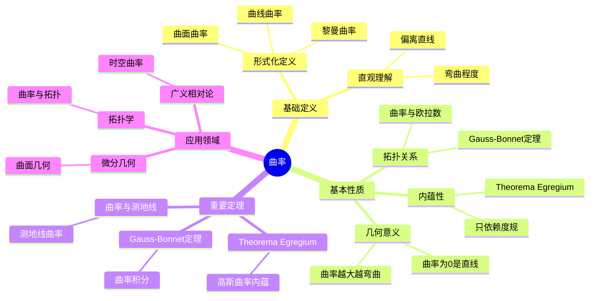

# 曲率 (Curvature)

**概念编号**: C.CORE.020
**知识层次**: L0-L2
**知识领域**: D4 (几何)
**创建日期**: 2025年11月21日
**最后更新**: 2025年11月21日

---

## 📋 概述

曲率是描述几何对象弯曲程度的量，是微分几何的核心概念。曲率在几何学、物理学、工程学等领域有广泛应用。

**权威资源对齐**:

- Wikipedia: [Curvature](https://en.wikipedia.org/wiki/Curvature)
- Stanford课程: Math 215A (Differential Topology)
- Princeton课程: MAT 520 (Differential Geometry)
- MIT课程: 18.965 (Geometry of Manifolds)
- Metamath: [Curvature](http://us.metamath.org/mpeuni/df-curvature.html)

---

## 🎯 严格定义

### 基础定义 (L0)

**直观理解**: 曲率描述曲线或曲面的弯曲程度。直线曲率为0，圆曲率为常数。

**基本定义**:

- **曲线曲率**: $\kappa = \frac{1}{R}$，其中 $R$ 是曲率半径
- **曲面曲率**: 通过主曲率、高斯曲率、平均曲率描述

**简单例子**:

- 直线的曲率：$\kappa = 0$
- 半径为 $R$ 的圆的曲率：$\kappa = \frac{1}{R}$
- 平面的曲率：$K = 0$

### 形式化定义 (L1)

**曲线曲率**: 平面曲线 $\gamma(t)$ 的曲率定义为：

$$\kappa(t) = \frac{|\gamma'(t) \times \gamma''(t)|}{|\gamma'(t)|^3}$$

**高斯曲率**: 曲面在点 $p$ 的高斯曲率定义为：

$$K(p) = \kappa_1(p) \cdot \kappa_2(p)$$

其中 $\kappa_1, \kappa_2$ 是主曲率。

**平均曲率**: 曲面在点 $p$ 的平均曲率定义为：

$$H(p) = \frac{\kappa_1(p) + \kappa_2(p)}{2}$$

**记号**:

- $\kappa$: 曲线曲率
- $K$: 高斯曲率
- $H$: 平均曲率
- $R$: 曲率半径

---

## 📚 历史背景

### 发展脉络

**17-18世纪**: 曲率的早期研究

- **Newton (1665)**: 研究曲线的曲率
- **Euler (1760)**: 研究曲面的主曲率

**19世纪**: 曲率理论的系统化

- **Gauss (1827)**: 提出高斯曲率，证明Theorema Egregium
- **Riemann (1854)**: 在黎曼几何中推广曲率

### 关键人物

- **Isaac Newton (1643-1727)**: 研究曲线曲率
- **Leonhard Euler (1707-1783)**: 研究曲面主曲率
- **Carl Friedrich Gauss (1777-1855)**: 提出高斯曲率

---

## 🔍 性质与定理

### 基本性质 (L1)

#### 性质1: 曲率的几何意义:

- 曲率越大，弯曲越厉害
- 曲率为0表示直线或平面

#### 性质2: 高斯曲率的内蕴性:

- **Theorema Egregium**: 高斯曲率是内蕴的，只依赖于度规
- 不依赖于嵌入方式

#### 性质3: 曲率与拓扑:

- 紧致曲面的总曲率与欧拉示性数相关
- Gauss-Bonnet定理：$\int_M K dA = 2\pi \chi(M)$

### 重要定理 (L2)

#### 定理1: Theorema Egregium:

- **陈述**: 高斯曲率是内蕴的，只依赖于第一基本形式
- **应用**: 曲面的内蕴几何

#### 定理2: Gauss-Bonnet定理:

- **陈述**: 紧致2维黎曼流形满足 $\int_M K dA = 2\pi \chi(M)$
- **应用**: 曲面的拓扑分类

#### 定理3: 曲率与测地线:

- **陈述**: 测地线的曲率向量为0
- **应用**: 广义相对论中的自由落体

---

## 💡 应用实例

### 理论应用

- 微分几何（曲面的几何性质）
- 广义相对论（时空曲率）
- 拓扑学（曲率与拓扑的关系）

### 实际应用

- 工程学（结构设计）
- 计算机图形学（曲面建模）
- 物理学（引力理论）

---

## 🔗 关联概念

### 依赖关系

- 流形（曲率在流形上定义）
- 黎曼流形（曲率需要度规）
- 导数（曲率的计算需要导数）

### 推广关系

- 曲线曲率（1维情况）
- 曲面曲率（2维情况）
- 黎曼曲率张量（高维情况）

---

## 📖 参考文献

- Wikipedia: [Curvature](https://en.wikipedia.org/wiki/Curvature)
- do Carmo, M. P. (1976). *Differential Geometry of Curves and Surfaces*. Prentice-Hall.
- do Carmo, M. P. (1992). *Riemannian Geometry*. Birkhäuser.

---

## 🗺️ 思维导图 (编号: C.CORE.020.MIND)

### 曲率概念思维导图

---

## 📊 知识多维关系矩阵 (编号: C.CORE.020.MATRIX)

### 曲率的多维关系矩阵

| 维度 | 指标 | 曲率 |
|------|------|------|
| **知识层次** | L0基础 | ⭐⭐⭐ |
| | L1中级 | ⭐⭐⭐ |
| | L2高级 | ⭐⭐⭐⭐⭐ |
| | L3研究 | ⭐⭐⭐ |
| **知识领域** | D1基础数学 | ⭐⭐ |
| | D4几何 | ⭐⭐⭐⭐⭐ |
| | D5拓扑 | ⭐⭐⭐ |
| | D8交叉领域 | ⭐⭐⭐ |
| **依赖关系** | 前置概念 | 流形、黎曼流形、导数 |
| | 后续概念 | 测地线、几何分析 |
| **应用关系** | 理论应用 | ⭐⭐⭐⭐ |
| | 实际应用 | ⭐⭐⭐ |
| | 交叉应用 | ⭐⭐⭐ |
| **学习难度** | 直观理解 | ⭐⭐⭐⭐ |
| | 形式化理解 | ⭐⭐⭐⭐⭐ |
| | 深入应用 | ⭐⭐⭐⭐⭐ |

---

## 💭 形象化解释与论证 (编号: C.CORE.020.VISUAL)

### 形象化解释

**1. 曲率的直观理解**

- **类比**: 曲率就像"弯曲程度"或"偏离直线的程度"
- **例子**:
  - 直线：曲率为0，不弯曲
  - 圆：曲率为常数$\frac{1}{R}$，$R$越大曲率越小
  - 球面：正曲率，像球一样弯曲
  - 双曲平面：负曲率，像马鞍一样弯曲

**2. 高斯曲率的直观理解**

- **类比**: 高斯曲率就像"曲面的弯曲程度"
- **解释**:
  - 正曲率：像球面，局部凸出
  - 负曲率：像马鞍，局部凹陷
  - 零曲率：像平面，不弯曲

**3. Theorema Egregium的直观理解**

- **类比**: Theorema Egregium就像"曲率是内蕴的，不依赖于嵌入"
- **解释**:
  - 高斯曲率只依赖于度规，不依赖于如何嵌入到高维空间
  - 这意味着曲率是流形本身的属性，不是嵌入的产物

### 认知科学视角

**1. 数学教育家Dienes的观点**

- **多表征原则**: 通过几何（弯曲程度）、物理（引力）、代数（曲率张量）等多种方式理解曲率
- **变化性原则**: 通过不同的曲率例子理解曲率的本质
- **教学启示**: 使用具体曲面、曲率可视化、物理类比等多种方法

**2. 数学认知学家Tall的观点**

- **过程-对象对偶**: 理解"曲率计算过程"（如何计算）和"曲率"（对象）
- **认知层次**: 从直观理解（"弯曲程度"）到形式化理解（曲率张量定义）

---

## 👨‍🏫 专家观点与论证 (编号: C.CORE.020.EXPERT)

### 数学家的观点

**1. Carl Friedrich Gauss (1777-1855) - 高斯曲率的提出者**
> "Theorema Egregium表明高斯曲率是内蕴的，这是几何学中最深刻的定理之一。"
>
> **意义**: Gauss发现了曲率的内蕴性质，开创了内蕴几何学。

**2. Bernhard Riemann (1826-1866) - 黎曼曲率的提出者**
> "黎曼曲率张量是研究高维流形几何的关键，它推广了高斯曲率。"
>
> **意义**: Riemann推广了曲率概念到高维，建立了现代微分几何。

**3. Albert Einstein (1879-1955) - 广义相对论的提出者**
> "时空曲率产生引力，物质和能量决定时空曲率，这解释了引力的本质。"
>
> **意义**: Einstein在广义相对论中应用曲率，揭示了引力的几何本质。

### 数学教育家的观点

**1. Zoltan Dienes (1916-2014) - 数学教育家**
> "曲率概念应该通过具体曲面、曲率可视化、物理类比等多种方式学习。"
>
> **教学启示**:
>
> - 从球面、马鞍面等具体曲面开始
> - 使用曲率可视化理解曲率的作用
> - 通过物理类比（如广义相对论）理解曲率

**2. Hans Freudenthal (1905-1990) - 数学教育家**
> "曲率概念的学习需要从'弯曲程度'发展到'曲率张量结构'。"
>
> **认知发展**:
>
> - **直观阶段**: 理解曲率作为弯曲程度
> - **结构阶段**: 理解曲率作为张量场

### 数学认知学家的观点

**1. David Tall - 数学认知学家**
> "曲率概念的理解需要从'过程'（如何计算）发展到'对象'（曲率本身）。"
>
> **认知层次**:
>
> - **过程层次**: 理解"如何计算曲率"（如$\kappa = \frac{1}{R}$）
> - **对象层次**: 理解"曲率"（如$K$是高斯曲率）

---

**创建日期**: 2025年11月21日
**最后更新**: 2025年11月21日
**维护状态**: 持续更新中
