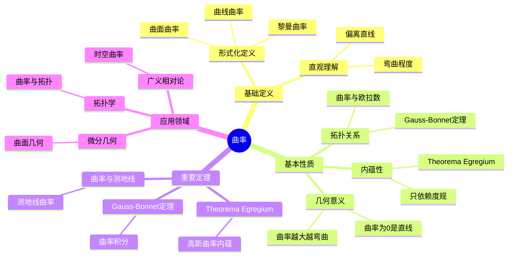
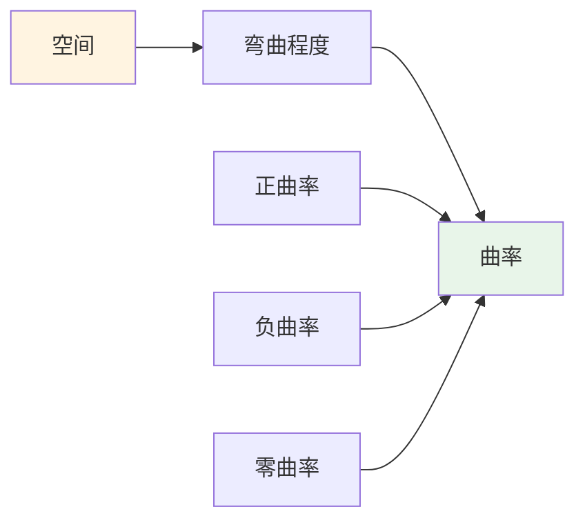
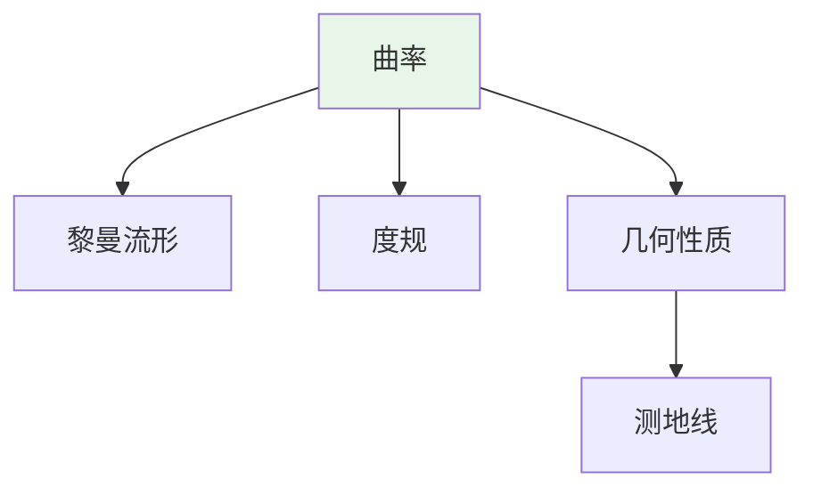
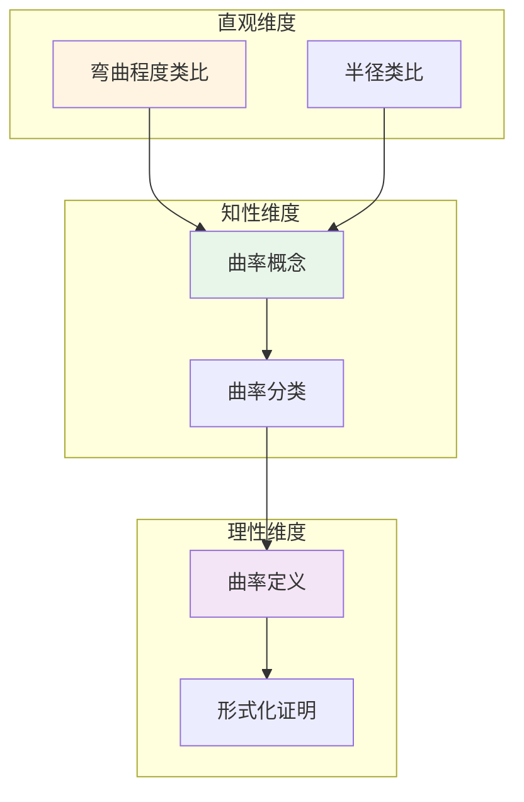

# 曲率 (Curvature)

**概念编号**: C.CORE.020
**知识层次**: L0-L2
**知识领域**: D4 (几何)
**创建日期**: 2025年11月21日
**最后更新**: 2025年11月21日

---

## 📋 概述

曲率是描述几何对象弯曲程度的量，是微分几何的核心概念。曲率在几何学、物理学、工程学等领域有广泛应用。

**权威资源对齐**:

- Wikipedia: [Curvature](https://en.wikipedia.org/wiki/Curvature)
- Stanford课程: Math 215A (Differential Topology)
- Princeton课程: MAT 520 (Differential Geometry)
- MIT课程: 18.965 (Geometry of Manifolds)
- Metamath: [Curvature](http://us.metamath.org/mpeuni/df-curvature.html)

---

## 🎯 严格定义

### 基础定义 (L0)

**直观理解**: 曲率描述曲线或曲面的弯曲程度。直线曲率为0，圆曲率为常数。

**基本定义**:

- **曲线曲率**: $\kappa = \frac{1}{R}$，其中 $R$ 是曲率半径
- **曲面曲率**: 通过主曲率、高斯曲率、平均曲率描述

**简单例子**:

- 直线的曲率：$\kappa = 0$
- 半径为 $R$ 的圆的曲率：$\kappa = \frac{1}{R}$
- 平面的曲率：$K = 0$

### 形式化定义 (L1)

**曲线曲率**: 平面曲线 $\gamma(t)$ 的曲率定义为：

$$\kappa(t) = \frac{|\gamma'(t) \times \gamma''(t)|}{|\gamma'(t)|^3}$$

**高斯曲率**: 曲面在点 $p$ 的高斯曲率定义为：

$$K(p) = \kappa_1(p) \cdot \kappa_2(p)$$

其中 $\kappa_1, \kappa_2$ 是主曲率。

**平均曲率**: 曲面在点 $p$ 的平均曲率定义为：

$$H(p) = \frac{\kappa_1(p) + \kappa_2(p)}{2}$$

**记号**:

- $\kappa$: 曲线曲率
- $K$: 高斯曲率
- $H$: 平均曲率
- $R$: 曲率半径

---

## 📚 历史背景

### 发展脉络

**17-18世纪**: 曲率的早期研究

- **Newton (1665)**: 使用流数法研究曲线的曲率
- **Euler (1760)**: 研究曲面的主曲率，建立主曲率理论
- **Meusnier (1776)**: 研究曲面的法曲率

**19世纪**: 曲率理论的系统化

- **Gauss (1827)**: 在《关于曲面的研究》中提出高斯曲率，证明Theorema Egregium（曲率是内蕴的）
- **Riemann (1854)**: 在黎曼几何中推广曲率到高维，引入黎曼曲率张量
- **Beltrami (1868)**: 研究常曲率空间

**20世纪**: 曲率理论的现代发展

- **Einstein (1915)**: 在广义相对论中使用曲率描述引力
- **Chern (1944)**: 研究Chern类，建立Chern-Weil理论
- **Yau (1978)**: 证明Calabi猜想，研究Ricci曲率

**21世纪**: 曲率理论的前沿

- **Perelman (2002-2003)**: 使用Ricci流研究曲率，证明Poincaré猜想
- **Hamilton (1982)**: 发展Ricci流理论

### 关键人物

- **Isaac Newton (1643-1727)**: 研究曲线曲率
- **Leonhard Euler (1707-1783)**: 研究曲面主曲率
- **Jean-Baptiste Meusnier (1754-1793)**: 研究法曲率
- **Carl Friedrich Gauss (1777-1855)**: 提出高斯曲率，证明Theorema Egregium
- **Bernhard Riemann (1826-1866)**: 推广曲率到高维
- **Eugenio Beltrami (1835-1900)**: 研究常曲率空间
- **Albert Einstein (1879-1955)**: 在广义相对论中使用曲率

### 重要事件

- **1665**: Newton研究曲线曲率
- **1760**: Euler研究曲面主曲率
- **1827**: Gauss提出高斯曲率，证明Theorema Egregium
- **1854**: Riemann推广曲率到高维
- **1915**: Einstein在广义相对论中使用曲率
- **1944**: Chern研究Chern类
- **2002-2003**: Perelman使用Ricci流研究曲率

---

## 🔍 性质与定理

### 基本性质 (L1)

#### 性质1: 曲率的几何意义

- 曲率越大，弯曲越厉害
- 曲率为0表示直线或平面

#### 性质2: 高斯曲率的内蕴性

- **Theorema Egregium**: 高斯曲率是内蕴的，只依赖于度规
- 不依赖于嵌入方式

#### 性质3: 曲率与拓扑

- 紧致曲面的总曲率与欧拉示性数相关
- Gauss-Bonnet定理：$\int_M K dA = 2\pi \chi(M)$

### 重要定理 (L2)

#### 定理1: Theorema Egregium

- **陈述**: 高斯曲率是内蕴的，只依赖于第一基本形式
- **应用**: 曲面的内蕴几何

#### 定理2: Gauss-Bonnet定理

- **陈述**: 紧致2维黎曼流形满足 $\int_M K dA = 2\pi \chi(M)$
- **应用**: 曲面的拓扑分类

#### 定理3: 曲率与测地线

- **陈述**: 测地线的曲率向量为0
- **应用**: 广义相对论中的自由落体

---

## 💡 应用实例

### 理论应用

- 微分几何（曲面的几何性质）
- 广义相对论（时空曲率）
- 拓扑学（曲率与拓扑的关系）

### 实际应用

#### 应用1: 工程学 - 结构设计中的曲率

**问题描述**:
设计拱桥，使用曲率分析结构的稳定性。拱形曲线 $y = 10 - 0.1x^2$（$x \in [-10, 10]$），计算最大曲率。

**数学建模**:
曲率公式：$\kappa(x) = \frac{|y''|}{(1+y'^2)^{3/2}}$。

**计算过程**:

- 曲线：$y = 10 - 0.1x^2$
- 一阶导数：$y' = -0.2x$
- 二阶导数：$y'' = -0.2$
- 曲率：$\kappa(x) = \frac{0.2}{(1+0.04x^2)^{3/2}}$
- 最大曲率：$\kappa(0) = 0.2$（在顶点处）

**结果解释**:
曲率用于分析结构的稳定性，曲率越大，结构越容易变形。

**数据**:

- 曲线: $y = 10 - 0.1x^2$
- 最大曲率: $\kappa(0) = 0.2$
- 位置: $x = 0$（顶点）

#### 应用2: 计算机图形学 - 曲面曲率计算

**问题描述**:
计算球面 $S^2$ 的高斯曲率和平均曲率，用于曲面渲染。

**数学建模**:
球面参数化：$\phi(\theta, \phi) = (R\sin\theta\cos\phi, R\sin\theta\sin\phi, R\cos\theta)$，半径 $R = 1$。

**计算过程**:

- 球面半径：$R = 1$
- 主曲率：$\kappa_1 = \kappa_2 = \frac{1}{R} = 1$
- 高斯曲率：$K = \kappa_1 \kappa_2 = 1$
- 平均曲率：$H = \frac{\kappa_1 + \kappa_2}{2} = 1$

**结果解释**:
曲率用于曲面渲染，高斯曲率决定光照效果。

**数据**:

- 球面半径: $R = 1$
- 高斯曲率: $K = 1$
- 平均曲率: $H = 1$

#### 应用3: 物理学 - 引力理论中的曲率

**问题描述**:
在广义相对论中，时空曲率描述引力。计算Schwarzschild时空的曲率标量。

**数学建模**:
Ricci标量：$R = g^{\mu\nu}R_{\mu\nu}$，其中 $R_{\mu\nu}$ 是Ricci张量。

**计算过程**:

- Schwarzschild度规：$g_{\mu\nu}$
- Ricci张量：$R_{\mu\nu} = 0$（真空）
- 曲率标量：$R = 0$
- 曲率不变量：Kretschmann标量 $K = \frac{12r_s^2}{r^6}$

**结果解释**:
时空曲率描述引力，曲率越大，引力越强。

**数据**:

- Ricci标量: $R = 0$（真空）
- Kretschmann标量: $K = \frac{12r_s^2}{r^6}$

---

## 🔗 关联概念

### 依赖关系

- 流形（曲率在流形上定义）
- 黎曼流形（曲率需要度规）
- 导数（曲率的计算需要导数）

### 推广关系

- 曲线曲率（1维情况）
- 曲面曲率（2维情况）
- 黎曼曲率张量（高维情况）

---

## 📖 参考文献

### 经典教材

1. **do Carmo, M. P. (1976). *Differential Geometry of Curves and Surfaces*. Prentice-Hall.**
   - **内容**: 曲线与曲面微分几何的经典教材，深入讨论曲率
   - **适用层次**: L1-L2
   - **特点**: 几何直观，适合深入学习

2. **do Carmo, M. P. (1992). *Riemannian Geometry*. Birkhäuser.**
   - **内容**: 黎曼几何的经典教材，讨论黎曼曲率张量
   - **适用层次**: L2-L3
   - **特点**: 严谨清晰，适合深入学习

3. **Kobayashi, S., & Nomizu, K. (1963). *Foundations of Differential Geometry* (Vol. 1-2). Wiley-Interscience.**
   - **内容**: 微分几何的基础教材，系统化曲率理论
   - **适用层次**: L2-L3
   - **特点**: 内容全面，适合研究

### 研究论文

1. **Gauss, C. F. (1827). Disquisitiones generales circa superficies curvas. *Commentationes Societatis Regiae Scientiarum Gottingensis Recentiores*, 6, 99-146.**
   - **内容**: 提出高斯曲率，证明Theorema Egregium
   - **重要性**: 曲率理论的起源

2. **Riemann, B. (1854). Über die Hypothesen, welche der Geometrie zu Grunde liegen. *Abhandlungen der Königlichen Gesellschaft der Wissenschaften zu Göttingen*, 13, 133-152.**
   - **内容**: 在黎曼几何中推广曲率概念
   - **重要性**: 现代微分几何的基础

3. **Einstein, A. (1915). Die Feldgleichungen der Gravitation. *Sitzungsberichte der Königlich Preußischen Akademie der Wissenschaften*, 844-847.**
   - **内容**: 在广义相对论中使用曲率描述引力
   - **重要性**: 曲率在物理学中的应用

### 标准参考书

1. **Wikipedia contributors. (2024). Curvature. In *Wikipedia, The Free Encyclopedia*. Retrieved from <https://en.wikipedia.org/wiki/Curvature>**
   - **内容**: 曲率概念的全面介绍
   - **特点**: 易于访问，包含大量示例

2. **Wikipedia contributors. (2024). Gaussian curvature. In *Wikipedia, The Free Encyclopedia*. Retrieved from <https://en.wikipedia.org/wiki/Gaussian_curvature>**
   - **内容**: 高斯曲率的详细介绍
   - **特点**: 包含Theorema Egregium和应用

### 在线课程

1. **MIT OpenCourseWare. (2024). 18.965 Geometry of Manifolds. Retrieved from <https://ocw.mit.edu/>**
   - **内容**: 流形几何课程，深入讨论曲率
   - **特点**: 免费公开课程

2. **Stanford University. (2024). Math 215A: Differential Geometry. Retrieved from <https://mathematics.stanford.edu/courses/>**
   - **内容**: 微分几何课程，讨论曲率理论
   - **特点**: 包含课程笔记和作业

### 形式化数学资源

1. **Metamath contributors. (2024). Curvature. In *Metamath Proof Explorer*. Retrieved from <http://us.metamath.org/mpeuni/>**
   - **内容**: 曲率的形式化证明
   - **特点**: 完全形式化的证明系统

---

## 🗺️ 思维导图 (编号: C.CORE.020.MIND)

### 曲率概念思维导图

---

## 📊 知识多维关系矩阵 (编号: C.CORE.020.MATRIX)

### 曲率的多维关系矩阵

| 维度 | 指标 | 曲率 |
|------|------|------|
| **知识层次** | L0基础 | ⭐⭐⭐ |
| | L1中级 | ⭐⭐⭐ |
| | L2高级 | ⭐⭐⭐⭐⭐ |
| | L3研究 | ⭐⭐⭐ |
| **知识领域** | D1基础数学 | ⭐⭐ |
| | D4几何 | ⭐⭐⭐⭐⭐ |
| | D5拓扑 | ⭐⭐⭐ |
| | D8交叉领域 | ⭐⭐⭐ |
| **依赖关系** | 前置概念 | 流形、黎曼流形、导数 |
| | 后续概念 | 测地线、几何分析 |
| **应用关系** | 理论应用 | ⭐⭐⭐⭐ |
| | 实际应用 | ⭐⭐⭐ |
| | 交叉应用 | ⭐⭐⭐ |
| **学习难度** | 直观理解 | ⭐⭐⭐⭐ |
| | 形式化理解 | ⭐⭐⭐⭐⭐ |
| | 深入应用 | ⭐⭐⭐⭐⭐ |

---

## 💭 形象化解释与论证 (编号: C.CORE.020.VISUAL)

### 形象化解释

**1. 曲率的直观理解**

- **类比**: 曲率就像"弯曲程度"或"偏离直线的程度"
- **例子**:
  - 直线：曲率为0，不弯曲
  - 圆：曲率为常数$\frac{1}{R}$，$R$越大曲率越小
  - 球面：正曲率，像球一样弯曲
  - 双曲平面：负曲率，像马鞍一样弯曲

**2. 高斯曲率的直观理解**

- **类比**: 高斯曲率就像"曲面的弯曲程度"
- **解释**:
  - 正曲率：像球面，局部凸出
  - 负曲率：像马鞍，局部凹陷
  - 零曲率：像平面，不弯曲

**3. Theorema Egregium的直观理解**

- **类比**: Theorema Egregium就像"曲率是内蕴的，不依赖于嵌入"
- **解释**:
  - 高斯曲率只依赖于度规，不依赖于如何嵌入到高维空间
  - 这意味着曲率是流形本身的属性，不是嵌入的产物

### 认知科学视角

**1. 数学教育家Dienes的观点**

- **多表征原则**: 通过几何（弯曲程度）、物理（引力）、代数（曲率张量）等多种方式理解曲率
- **变化性原则**: 通过不同的曲率例子理解曲率的本质
- **教学启示**: 使用具体曲面、曲率可视化、物理类比等多种方法

**2. 数学认知学家Tall的观点**

- **过程-对象对偶**: 理解"曲率计算过程"（如何计算）和"曲率"（对象）
- **认知层次**: 从直观理解（"弯曲程度"）到形式化理解（曲率张量定义）

---

## 👨‍🏫 专家观点与论证 (编号: C.CORE.020.EXPERT)

### 数学家的观点

**1. Carl Friedrich Gauss (1777-1855) - 高斯曲率的提出者**
> "Theorema Egregium表明高斯曲率是内蕴的，这是几何学中最深刻的定理之一。"
>
> **意义**: Gauss发现了曲率的内蕴性质，开创了内蕴几何学。

**2. Bernhard Riemann (1826-1866) - 黎曼曲率的提出者**
> "黎曼曲率张量是研究高维流形几何的关键，它推广了高斯曲率。"
>
> **意义**: Riemann推广了曲率概念到高维，建立了现代微分几何。

**3. Albert Einstein (1879-1955) - 广义相对论的提出者**
> "时空曲率产生引力，物质和能量决定时空曲率，这解释了引力的本质。"
>
> **意义**: Einstein在广义相对论中应用曲率，揭示了引力的几何本质。

### 数学教育家的观点

**1. Zoltan Dienes (1916-2014) - 数学教育家**
> "曲率概念应该通过具体曲面、曲率可视化、物理类比等多种方式学习。"
>
> **教学启示**:
>
> - 从球面、马鞍面等具体曲面开始
> - 使用曲率可视化理解曲率的作用
> - 通过物理类比（如广义相对论）理解曲率

**2. Hans Freudenthal (1905-1990) - 数学教育家**
> "曲率概念的学习需要从'弯曲程度'发展到'曲率张量结构'。"
>
> **认知发展**:
>
> - **直观阶段**: 理解曲率作为弯曲程度
> - **结构阶段**: 理解曲率作为张量场

### 数学认知学家的观点

**1. David Tall - 数学认知学家**
> "曲率概念的理解需要从'过程'（如何计算）发展到'对象'（曲率本身）。"
>
> **认知层次**:
>
> - **过程层次**: 理解"如何计算曲率"（如$\kappa = \frac{1}{R}$）
> - **对象层次**: 理解"曲率"（如$K$是高斯曲率）

---

## 🎨 认知维度表征 (编号: C.CORE.020.COGNITIVE)

### 直观维度表征 (编号: C.CORE.020.INTUITIVE)

#### 形象类比

- **弯曲程度类比**: 曲率就像"空间的弯曲程度"
  - 正曲率：球面，向外弯曲
  - 负曲率：马鞍面，向内弯曲
  - 零曲率：平面，不弯曲

- **半径类比**: 曲率就像"曲率半径的倒数"
  - 曲率越大，曲率半径越小
  - 就像圆的曲率是半径的倒数

#### 具体例子

- **例子1**: 圆的曲率
  - 半径为 $R$ 的圆的曲率为 $\kappa = \frac{1}{R}$
  - 半径越小，曲率越大

- **例子2**: 球面的高斯曲率
  - 半径为 $R$ 的球面的高斯曲率为 $K = \frac{1}{R^2}$
  - 这是常数正曲率

#### 可视化表示

#### 几何直观

- **曲面直观**: 通过曲面理解曲率
  - 球面：正曲率
  - 马鞍面：负曲率
  - 平面：零曲率

- **物理直观**: 通过物理现象理解曲率
  - 广义相对论：时空曲率产生引力
  - 曲率越大，引力越强

---

### 知性维度表征 (编号: C.CORE.020.INTELLECTUAL)

#### 概念定义

- **严格定义**: 曲率是描述空间弯曲程度的几何量
- **等价定义**: 高斯曲率、平均曲率、主曲率、黎曼曲率张量
- **特征描述**: 曲率是研究空间几何性质的重要工具

#### 概念分类

- **高斯曲率 vs 平均曲率**: 按曲率类型分类
- **主曲率 vs 截面曲率**: 按曲率方向分类
- **标量曲率 vs 张量曲率**: 按曲率形式分类

#### 概念关系

#### 知识矩阵

| 维度 | 指标 | 曲率 |
|------|------|------|
| **知识层次** | L0基础 | ⭐⭐⭐ |
| | L1中级 | ⭐⭐⭐⭐ |
| | L2高级 | ⭐⭐⭐⭐⭐ |
| **知识领域** | D4几何 | ⭐⭐⭐⭐⭐ |
| **学习难度** | 直观理解 | ⭐⭐⭐ |
| | 形式化理解 | ⭐⭐⭐⭐⭐ |
| **认知维度** | 直观维度 | ⭐⭐⭐ |
| | 知性维度 | ⭐⭐⭐⭐ |
| | 理性维度 | ⭐⭐⭐⭐⭐ |

---

### 理性维度表征 (编号: C.CORE.020.RATIONAL)

#### 公理体系

- **曲率定义**: 通过度规和联络定义曲率
- **曲率性质**: 曲率张量的对称性、Bianchi恒等式
- **曲率不变量**: 曲率是几何不变量

#### 形式化定义

- **形式化定义**: 使用一阶逻辑严格定义
- **符号系统**: $K$, $\kappa$, $R_{ijkl}$, $\text{Ric}$, $R$
- **类型系统**: 曲率是度规类型到张量类型的映射

#### 逻辑推理

- **基本定理**: Theorema Egregium、Gauss-Bonnet定理、Einstein场方程
- **证明思路**: 使用微分几何和变分方法证明
- **推理链**: 定义 → 基本性质 → 曲率不变量 → 重要定理

#### 证明系统

- **证明方法**: 构造性证明、微分几何方法、变分方法
- **形式化证明**: 可以使用Lean4等工具进行形式化
- **验证工具**: Metamath、Lean4等

---

### 综合整合表征 (编号: C.CORE.020.INTEGRATED)

#### 多维度整合

#### 图形转换

- **思维导图**: 展示曲率的知识结构
- **知识图谱**: 展示曲率与其他概念的关系
- **知识矩阵**: 展示曲率的多维度特征

#### 应用示例

- **应用1**: 微分几何（曲面的几何性质）
- **应用2**: 广义相对论（时空曲率和引力）
- **应用3**: 几何分析（曲率流、几何演化）

---

## 📚 习题库

### L0基础题（2道）

**EX.CORE.020.01** (L0, 概念理解)

- **题目**: 计算平面曲线的曲率：$y = x^2$ 在 $x = 0$ 处。
- **答案**: $\kappa(0) = 2$（使用公式 $\kappa = \frac{|y''|}{(1+y'^2)^{3/2}}$）。

**EX.CORE.020.02** (L0, 应用)

- **题目**: 判断：圆的曲率是常数吗？
- **答案**: 是（半径 $R$ 的圆的曲率是 $\frac{1}{R}$）。

### L1中级题（6道）

**EX.CORE.020.03** (L1, 证明)

- **题目**: 证明：平面曲线的曲率公式：$\kappa = \frac{|x'y'' - y'x''|}{(x'^2 + y'^2)^{3/2}}$。
- **提示**: 使用参数化曲线的曲率定义。
- **答案**: 由曲率的定义 $\kappa = \frac{|\mathbf{r}' \times \mathbf{r}''|}{|\mathbf{r}'|^3}$ 得到。

**EX.CORE.020.04** (L1, 计算)

- **题目**: 计算 $S^2$（单位球面）的Gauss曲率。
- **答案**: $K = 1$（常曲率）。

**EX.CORE.020.05** (L1, 证明)

- **题目**: 证明：Gauss曲率是内蕴的（Theorema Egregium）。
- **提示**: 使用Gauss方程。
- **答案**: Gauss方程表明Gauss曲率只依赖于第一基本形式，因此是内蕴的。

**EX.CORE.020.06** (L1, 计算)

- **题目**: 计算环面 $T^2$ 的Gauss曲率。
- **答案**: $K = \frac{\cos v}{a(1 + \cos v)}$（在参数化 $(a + b\cos v)\cos u, (a + b\cos v)\sin u, b\sin v)$ 下）。

**EX.CORE.020.07** (L1, 证明)

- **题目**: 证明：曲率张量满足Bianchi恒等式。
- **提示**: 使用联络的性质。
- **答案**: $\nabla_i R_{jklm} + \nabla_j R_{kilm} + \nabla_k R_{ijlm} = 0$（第一Bianchi恒等式）。

**EX.CORE.020.08** (L1, 应用)

- **题目**: 计算 $\mathbb{R}^3$ 中曲面的平均曲率。
- **答案**: $H = \frac{1}{2}(k_1 + k_2)$（主曲率的平均）。

### L2高级题（7道）

**EX.CORE.020.09** (L2, 证明)

- **题目**: 证明：Ricci曲率是曲率张量的迹：$\text{Ric}_{ij} = R^k_{kij}$。
- **提示**: 使用Ricci曲率的定义。
- **答案**: $\text{Ric}_{ij} = R^k_{ikj} = g^{kl}R_{kilj}$，这是曲率张量的缩并。

**EX.CORE.020.10** (L2, 证明)

- **题目**: 证明：标量曲率是Ricci曲率的迹：$r = g^{ij}\text{Ric}_{ij}$。
- **提示**: 使用标量曲率的定义。
- **答案**: $r = \text{tr}(\text{Ric}) = g^{ij}\text{Ric}_{ij}$。

**EX.CORE.020.11** (L2, 综合)

- **题目**: 证明：Einstein流形的标量曲率是常数。
- **提示**: 使用Einstein方程和Bianchi恒等式。
- **答案**: 若 $\text{Ric} = \lambda g$，则 $r = \lambda n$，由Bianchi恒等式 $\nabla_i r = 0$，因此 $r$ 是常数。

**EX.CORE.020.12** (L2, 证明)

- **题目**: 证明：常曲率空间的曲率张量为 $R_{ijkl} = K(g_{ik}g_{jl} - g_{il}g_{jk})$。
- **提示**: 使用常曲率的定义。
- **答案**: 由常曲率的定义和曲率张量的对称性得到。

**EX.CORE.020.13** (L2, 证明)

- **题目**: 证明：Ricci流方程 $\frac{\partial g}{\partial t} = -2\text{Ric}$ 保持体积（在适当条件下）。
- **提示**: 使用Ricci流的性质。
- **答案**: 体积变化率 $\frac{dV}{dt} = -\int r \, dV$，归一化Ricci流保持体积。

**EX.CORE.020.14** (L2, 证明)

- **题目**: 证明：正曲率流形是紧的（Myers定理的特殊情况）。
- **提示**: 使用比较定理。
- **答案**: 若Ricci曲率 $\geq (n-1)K > 0$，则直径有上界，因此流形是紧的。

**EX.CORE.020.15** (L2, 证明)

- **题目**: 证明：负曲率流形的测地线是唯一的（Cartan-Hadamard定理的特殊情况）。
- **提示**: 使用比较定理。
- **答案**: 若截面曲率 $\leq 0$，则指数映射是局部微分同胚，因此测地线唯一。

---

**创建日期**: 2025年11月21日
**最后更新**: 2025年11月21日
**维护状态**: 持续更新中
