---
msc_primary: "00A99"
---

# 曲率 (Curvature) - 三视角组织版

**概念编号**: C.CORE.020
**知识层次**: L0-L2
**知识领域**: D4 (几何)
**创建日期**: 2025年1月
**最后更新**: 2026-04-05

---

## 📋 目录 / Table of Contents

- [曲率 (Curvature) - 三视角组织版](#曲率-curvature---三视角组织版)
  - 📋 目录 / Table of Contents
  - 1. 📋 概述 (编号: C.CORE.020.01)
  - [🧠 认知学视角：如何理解曲率 (编号: C.CORE.020.02)](#认知学视角如何理解曲率-编号-ccore02002)
    - [认知起点 (编号: C.CORE.020.02.01)](#认知起点-编号-ccore0200201)
    - [认知过程 (编号: C.CORE.020.02.02)](#认知过程-编号-ccore0200202)
      - [阶段1：直观理解阶段 (编号: C.CORE.020.02.02.01)](#阶段1直观理解阶段-编号-ccore020020201)
      - [阶段2：概念形成阶段 (编号: C.CORE.020.02.02.02)](#阶段2概念形成阶段-编号-ccore020020202)
      - [阶段3：形式化阶段 (编号: C.CORE.020.02.02.03)](#阶段3形式化阶段-编号-ccore020020203)

## 形式化定义

**定义（黎曼曲率张量）**：对黎曼流形 $(M, g)$，曲率张量 $R$ 定义为：
$$R(X, Y)Z = \nabla_X \nabla_Y Z - \nabla_Y \nabla_X Z - \nabla_{[X, Y]} Z$$
或分量为：$R^l_{ijk} = \partial_i \Gamma^l_{jk} - \partial_j \Gamma^l_{ik} + \Gamma^l_{im}\Gamma^m_{jk} - \Gamma^l_{jm}\Gamma^m_{ik}$

**相关曲率**：
- **截面曲率**：$K(\sigma) = \frac{\langle R(u, v)v, u \rangle}{|u|^2|v|^2 - \langle u, v \rangle^2}$
- **Ricci曲率**：$\text{Ric}(X, Y) = \text{tr}(Z \mapsto R(Z, X)Y)$
- **数量曲率**：$R = \text{tr}_g(\text{Ric}) = g^{ij}R_{ij}$

**符号说明**：
- $R$：黎曼曲率张量
- $K$：截面曲率
- $\text{Ric}$：Ricci曲率张量
- $R$ 或 $S$：数量曲率

    - [认知障碍 (编号: C.CORE.020.02.03)](#认知障碍-编号-ccore0200203)
    - [认知工具 (编号: C.CORE.020.02.04)](#认知工具-编号-ccore0200204)
  - [🎓 教育学视角：如何教学曲率 (编号: C.CORE.020.03)](#教育学视角如何教学曲率-编号-ccore02003)
    - [教学目标 (编号: C.CORE.020.03.01)](#教学目标-编号-ccore0200301)
    - [教学路径 (编号: C.CORE.020.03.02)](#教学路径-编号-ccore0200302)
      - [阶段1：引入阶段（激发兴趣） (编号: C.CORE.020.03.02.01)](#阶段1引入阶段激发兴趣-编号-ccore020030201)
      - [阶段2：探索阶段（主动建构） (编号: C.CORE.020.03.02.02)](#阶段2探索阶段主动建构-编号-ccore020030202)
      - [阶段3：形式化阶段（抽象概括） (编号: C.CORE.020.03.02.03)](#阶段3形式化阶段抽象概括-编号-ccore020030203)
      - [阶段4：巩固阶段（应用深化） (编号: C.CORE.020.03.02.04)](#阶段4巩固阶段应用深化-编号-ccore020030204)
    - [教学难点 (编号: C.CORE.020.03.03)](#教学难点-编号-ccore0200303)
    - [教学策略 (编号: C.CORE.020.03.04)](#教学策略-编号-ccore0200304)
    - [评估方法 (编号: C.CORE.020.03.05)](#评估方法-编号-ccore0200305)
  - [🔬 数学家视角：如何思考曲率 (编号: C.CORE.020.04)](#数学家视角如何思考曲率-编号-ccore02004)
    - [问题起源 (编号: C.CORE.020.04.01)](#问题起源-编号-ccore0200401)
    - [思维过程 (编号: C.CORE.020.04.02)](#思维过程-编号-ccore0200402)
      - [步骤1：问题提出 (编号: C.CORE.020.04.02.01)](#步骤1问题提出-编号-ccore020040201)
      - [步骤2：概念形成 (编号: C.CORE.020.04.02.02)](#步骤2概念形成-编号-ccore020040202)
      - [步骤3：理论发展 (编号: C.CORE.020.04.02.03)](#步骤3理论发展-编号-ccore020040203)
    - [历史发展 (编号: C.CORE.020.04.03)](#历史发展-编号-ccore0200403)
    - [3.2 关键人物和贡献 (编号: C.CORE.020.04.04)](#32-关键人物和贡献-编号-ccore0200404)
    - [重要定理 (编号: C.CORE.020.04.05)](#重要定理-编号-ccore0200405)
    - [开放问题 (编号: C.CORE.020.04.06)](#开放问题-编号-ccore0200406)
    - [一、第一人称思维描述 (编号: C.CORE.020.04.07)](#一第一人称思维描述-编号-ccore0200407)
      - [1.1 Gauss的发现过程](#11-gauss的发现过程)
    - [二、数学直觉的形成 (编号: C.CORE.020.04.08)](#二数学直觉的形成-编号-ccore0200408)
      - [2.1 直觉在概念发现中的作用](#21-直觉在概念发现中的作用)
      - [2.2 如何培养曲率直觉](#22-如何培养曲率直觉)
    - [三、数学美的教育价值 (编号: C.CORE.020.04.09)](#三数学美的教育价值-编号-ccore0200409)
      - [3.1 曲率论的美在哪里](#31-曲率论的美在哪里)
      - [3.2 如何培养学生的数学美感](#32-如何培养学生的数学美感)
    - [四、问题解决策略 (编号: C.CORE.020.04.10)](#四问题解决策略-编号-ccore0200410)
      - [4.1 数学家的启发式方法](#41-数学家的启发式方法)
      - [4.2 思维过程分析](#42-思维过程分析)
    - [五、批判性反思 (编号: C.CORE.020.04.11)](#五批判性反思-编号-ccore0200411)
      - [5.1 曲率概念的局限性](#51-曲率概念的局限性)
      - [5.2 曲率理论的未解决问题](#52-曲率理论的未解决问题)
  - [💡 数学解释：为什么曲率是这样定义的 (编号: C.CORE.020.05)](#数学解释为什么曲率是这样定义的-编号-ccore02005)
    - [一、直观解释：曲率是什么？](#一直观解释曲率是什么)
      - [1.1 具体例子](#11-具体例子)
      - [1.2 形象类比](#12-形象类比)
      - [1.3 几何直观](#13-几何直观)
      - [1.4 操作体验](#14-操作体验)
    - [二、知性解释：曲率的本质是什么？](#二知性解释曲率的本质是什么)
      - [2.1 概念定义](#21-概念定义)
      - [2.2 分类体系](#22-分类体系)
      - [2.3 抽象结构](#23-抽象结构)
      - [2.4 知识体系](#24-知识体系)
    - [三、理性解释：曲率的公理化定义](#三理性解释曲率的公理化定义)
      - [3.1 公理体系](#31-公理体系)
      - [3.2 形式化证明](#32-形式化证明)
      - [3.3 系统建构](#33-系统建构)
    - [四、多视角解释：从不同角度理解曲率](#四多视角解释从不同角度理解曲率)
      - [4.1 数学家视角：曲率是如何被发现的？](#41-数学家视角曲率是如何被发现的)
      - [4.2 教育者视角：如何教学曲率？](#42-教育者视角如何教学曲率)
      - [4.3 学习者视角：如何学习曲率？](#43-学习者视角如何学习曲率)
      - [4.4 应用者视角：如何应用曲率？](#44-应用者视角如何应用曲率)
    - [五、思维表征：用多种方式理解曲率](#五思维表征用多种方式理解曲率)
      - [5.1 思维导图：曲率的知识结构](#51-思维导图曲率的知识结构)
      - [5.2 矩阵对比：不同解释方式的对比](#52-矩阵对比不同解释方式的对比)
      - [5.3 多视角表征：从不同角度表征曲率](#53-多视角表征从不同角度表征曲率)
      - [5.4 决策树：曲率问题分类和策略选择](#54-决策树曲率问题分类和策略选择)
      - [5.5 决策逻辑路径：曲率问题解决过程](#55-决策逻辑路径曲率问题解决过程)
      - [5.6 多维对比矩阵：曲率概念特征对比](#56-多维对比矩阵曲率概念特征对比)
  - [💡 数学解释：为什么曲率是这样定义的 (编号: C.CORE.020.05)](#数学解释为什么曲率是这样定义的-编号-ccore02005)
  - [🔍 数学论证：如何论证曲率 (编号: C.CORE.020.06)](#数学论证如何论证曲率-编号-ccore02006)
    - [一、论证过程：从观察到反思](#一论证过程从观察到反思)
    - [二、论证类型：多种推理方式](#二论证类型多种推理方式)
    - [三、论证可视化：用图形表示论证过程](#三论证可视化用图形表示论证过程)
  - [🔗 三视角整合 (编号: C.CORE.020.07)](#三视角整合-编号-ccore02007)
    - [三个视角的关联](#三个视角的关联)
    - [如何综合运用三个视角](#如何综合运用三个视角)
  - [📚 参考文献 (编号: C.CORE.020.08)](#参考文献-编号-ccore02008)
    - [权威资源](#权威资源)
    - [经典教材](#经典教材)
    - [研究论文](#研究论文)

---


## 1. 📋 概述 (编号: C.CORE.020.01)

曲率是描述几何对象弯曲程度的量，是微分几何的核心概念。曲率在几何学、物理学、工程学等领域有广泛应用。

本文档从**数学认知学**、**教育学**、**数学家**三个视角深入展开曲率概念，避免简单的概念堆垒。

**权威资源对齐**:

- Wikipedia: [Curvature](https://en.wikipedia.org/wiki/Curvature)
- Stanford课程: Math 215A (Differential Topology)
- Princeton课程: MAT 520 (Differential Geometry)
- MIT课程: 18.965 (Geometry of Manifolds)
- Metamath: [Curvature](http://us.metamath.org/mpeuni/df-curvature.html)[需更新][需更新]

---

## 🧠 认知学视角：如何理解曲率 (编号: C.CORE.020.02)

### 认知起点 (编号: C.CORE.020.02.01)

**学习者已有的知识基础**:

- 曲线的概念
- 导数的概念
- 日常经验中的"弯曲"、"曲率"概念

**日常经验中的类似概念**:

- "弯曲"：曲线的弯曲程度
- "曲率"：弯曲的度量
- "曲率半径"：弯曲的半径

### 认知过程 (编号: C.CORE.020.02.02)

#### 阶段1：直观理解阶段 (编号: C.CORE.020.02.02.01)

**具体例子**:

- 例子1：直线的曲率：$\kappa = 0$
- 例子2：半径为$R$的圆的曲率：$\kappa = \frac{1}{R}$
- 例子3：平面的曲率：$K = 0$

**形象类比**:

- **弯曲类比**: 曲率就像"弯曲程度的度量"
  - 直线不弯曲，曲率为0
  - 圆弯曲，曲率为常数
  - 曲线弯曲，曲率变化

- **半径类比**: 曲率就像"曲率半径的倒数"
  - 曲率半径大，曲率小
  - 曲率半径小，曲率大
  - 曲率 = $\frac{1}{R}$

**可视化表示**:

```text
曲率:
    直线: κ = 0
    圆: κ = 1/R
    曲线: κ = κ(t)
```

#### 阶段2：概念形成阶段 (编号: C.CORE.020.02.02.02)

**从例子中抽象出共同特征**:

- 所有例子都涉及"弯曲程度"
- 弯曲程度可以量化
- 曲率是弯曲程度的度量

**识别关键属性**:

1. **曲线曲率**: $\kappa = \frac{1}{R}$
2. **曲面曲率**: 通过主曲率、高斯曲率、平均曲率
3. **流形曲率**: 通过曲率张量

**建立概念边界**:

- **什么是曲率**: 描述几何对象弯曲程度的量
- **什么不是曲率**:
  - 距离（不是弯曲程度）
  - 角度（不是弯曲程度）

#### 阶段3：形式化阶段 (编号: C.CORE.020.02.02.03)

**严格定义**:

- 曲线曲率：$\kappa(t) = \frac{|\gamma'(t) \times \gamma''(t)|}{|\gamma'(t)|^3}$
- 高斯曲率：$K(p) = \kappa_1(p) \cdot \kappa_2(p)$
- 曲率张量：通过Levi-Civita联络定义

**公理化表述**:

- 曲线曲率：通过导数的叉积
- 高斯曲率：通过主曲率的乘积
- 曲率张量：通过联络的交换子

**逻辑结构**:

- 曲率是微分几何的核心概念
- 曲率描述几何对象的弯曲程度
- 曲率是物理学的基础

### 认知障碍 (编号: C.CORE.020.02.03)

**常见误解**:

1. **误解1**: 认为曲率就是弯曲
   - **纠正**: 曲率是弯曲程度的量化，不是弯曲本身

2. **误解2**: 认为所有曲率都相同
   - **纠正**: 不同的几何对象有不同的曲率

3. **误解3**: 混淆不同维度的曲率
   - **纠正**: 曲线曲率、曲面曲率、流形曲率是不同的概念

**理解难点**:

1. **难点1**: 曲率的抽象性
   - **原因**: 曲率比较抽象
   - **解决方法**: 从具体例子开始，逐步抽象

2. **难点2**: 曲率张量的概念
   - **原因**: 曲率张量比较抽象
   - **解决方法**: 用具体例子，强调曲率张量的作用

3. **难点3**: 曲率的计算
   - **原因**: 曲率计算比较复杂
   - **解决方法**: 用具体例子，逐步掌握计算方法

**认知陷阱**:

- **弯曲**: 需要理解曲率是弯曲程度的量化
- **曲率张量**: 需要理解曲率张量的作用

### 认知工具 (编号: C.CORE.020.02.04)

**类比工具**:

- **弯曲类比**: 曲率 = 弯曲程度的度量
- **半径类比**: 曲率 = 曲率半径的倒数

**可视化工具**:

- **曲率图**: 用曲率图表示曲率
- **几何图**: 用几何图表示弯曲程度

**具体化工具**:

- **具体例子**: 用具体例子理解抽象概念
- **反例**: 用反例理解概念边界

---

## 🎓 教育学视角：如何教学曲率 (编号: C.CORE.020.03)

### 教学目标 (编号: C.CORE.020.03.01)

**知识目标**:

- 理解曲率的基本概念
- 掌握曲率的定义
- 理解曲率的性质
- 理解曲率的应用

**能力目标**:

- 能够计算曲率
- 能够理解曲率的性质
- 能够应用曲率解决实际问题
- 能够理解曲率的重要性

**情感目标**:

- 培养数学抽象思维
- 培养几何思维
- 激发对数学的兴趣

### 教学路径 (编号: C.CORE.020.03.02)

#### 阶段1：引入阶段（激发兴趣） (编号: C.CORE.020.03.02.01)

**实际问题**:

- 问题1：如何描述曲线的弯曲程度？
- 问题2：如何研究几何结构？
- 问题3：如何研究物理空间？

**历史背景**:

- 曲率的历史发展
- 曲率在数学中的地位
- 曲率在物理中的应用

**引发认知冲突**:

- 问题：如何统一描述各种弯曲程度？
- 引出曲率的概念

#### 阶段2：探索阶段（主动建构） (编号: C.CORE.020.03.02.02)

**引导发现**:

1. 让学生自己列举"弯曲"的例子
2. 让学生观察这些例子的共同特征
3. 引导学生抽象出曲率的定义

**合作探究**:

- 小组讨论：什么是曲率？
- 小组讨论：曲率有哪些性质？
- 小组讨论：如何计算曲率？

**多元表征**:

- **语言表征**: "曲率是描述几何对象弯曲程度的量"
- **符号表征**: $\kappa$、$K$
- **图形表征**: 曲率图、几何图
- **集合表征**: 曲率定义

#### 阶段3：形式化阶段（抽象概括） (编号: C.CORE.020.03.02.03)

**严格定义**:

- 曲线曲率的定义
- 曲面曲率的定义
- 流形曲率的定义

**性质证明**:

- 曲率的基本性质
- 曲率的几何性质
- 曲率的物理性质

**应用拓展**:

- 曲率在微分几何中的应用
- 曲率在物理中的应用
- 曲率在工程中的应用

#### 阶段4：巩固阶段（应用深化） (编号: C.CORE.020.03.02.04)

**练习应用**:

- 基础练习：曲率的计算和性质
- 应用练习：用曲率解决实际问题
- 综合练习：曲率的综合应用

**变式训练**:

- 不同形式的曲率计算
- 不同性质的曲率
- 曲率的应用

**知识整合**:

- 曲率与其他概念的联系
- 曲率在数学体系中的地位

### 教学难点 (编号: C.CORE.020.03.03)

**难点1：曲率的抽象性**:

- **难点描述**: 学生难以理解曲率
- **解决方法**:
  - 从具体例子开始
  - 逐步抽象
  - 用具体例子说明

**难点2：曲率张量的概念**:

- **难点描述**: 学生难以理解曲率张量
- **解决方法**:
  - 用具体例子
  - 强调曲率张量的作用
  - 用图形可视化

**难点3：曲率的计算**:

- **难点描述**: 学生难以计算曲率
- **解决方法**:
  - 用具体例子
  - 逐步掌握计算方法
  - 用练习巩固

### 教学策略 (编号: C.CORE.020.03.04)

**策略1：从具体到抽象**:

- 先给出具体例子
- 再抽象出一般概念
- 最后给出严格定义

**策略2：多元表征**:

- 用语言、符号、图形等多种方式表示同一概念
- 帮助学生建立不同表征之间的联系

**策略3：问题驱动**:

- 从实际问题出发
- 引出数学概念
- 解决问题

**策略4：可视化教学**:

- 使用曲率图
- 使用几何图
- 使用具体例子

### 评估方法 (编号: C.CORE.020.03.05)

**形成性评估**（评估理解过程）:

- 课堂提问：检查学生对概念的理解
- 小组讨论：观察学生的思考过程
- 练习作业：检查学生的应用能力

**总结性评估**（评估最终理解）:

- 测验：检查学生对概念和计算的掌握
- 项目：检查学生应用曲率解决实际问题的能力
- 反思：检查学生对曲率概念的理解深度

---

## 🔬 数学家视角：如何思考曲率 (编号: C.CORE.020.04)

### 问题起源 (编号: C.CORE.020.04.01)

**历史背景**:

- 17-18世纪：曲率的起源
- 19世纪：曲率的发展
- 20世纪：曲率的现代发展

**原始问题**:

- **问题1**: 如何描述曲线的弯曲程度？
- **问题2**: 如何研究几何结构？
- **问题3**: 曲率有哪些性质？

**研究动机**:

- 统一几何理论
- 发展微分几何
- 研究物理空间

### 思维过程 (编号: C.CORE.020.04.02)

#### 步骤1：问题提出 (编号: C.CORE.020.04.02.01)

**观察到的现象**:

- 曲线有弯曲程度
- 需要量化弯曲程度
- 需要统一几何理论

**提出的猜想**:

- 可以引入曲率概念
- 曲率可以量化弯曲程度
- 曲率有丰富的性质

**需要解决的问题**:

- 如何定义曲率？
- 曲率应该满足什么条件？
- 曲率有哪些性质？

#### 步骤2：概念形成 (编号: C.CORE.020.04.02.02)

**尝试性定义**:

- **曲线曲率**: 通过导数的叉积
- **高斯曲率**: 通过主曲率的乘积
- **曲率张量**: 通过联络的交换子

**性质探索**:

- 曲率的基本性质
- 曲率的几何性质
- 曲率的物理性质

**结构发现**:

- 曲率是微分几何的核心概念
- 曲率描述几何对象的弯曲程度
- 曲率是物理学的基础

#### 步骤3：理论发展 (编号: C.CORE.020.04.02.03)

**定理证明**:

- 曲率的基本性质
- 曲率的几何性质
- 曲率的物理性质

**应用拓展**:

- 曲率在微分几何中的应用
- 曲率在物理中的应用
- 曲率在工程中的应用

**理论完善**:

- 曲率的严格定义
- 曲率的范畴论研究
- 曲率的应用研究

### 历史发展 (编号: C.CORE.020.04.03)

**早期阶段**（17-18世纪）:

- **Newton (1665)**: 研究曲线曲率
- **Euler (1760)**: 研究曲面曲率

**关键突破**（19世纪）:

- **Gauss (1827)**: 发展高斯曲率理论
- **Riemann (1854)**: 发展曲率张量理论

**现代发展**（20世纪）:

- **Einstein (1915)**: 在广义相对论中应用曲率
- **Chern (1944)**: 发展Chern类理论

### 3.2 关键人物和贡献 (编号: C.CORE.020.04.04)

**Carl Friedrich Gauss (1777-1855)**:

- 发展高斯曲率理论
- 建立微分几何基础

**Bernhard Riemann (1826-1866)**:

- 发展曲率张量理论
- 建立现代微分几何

**Albert Einstein (1879-1955)**:

- 在广义相对论中应用曲率
- 建立现代物理几何

### 重要定理 (编号: C.CORE.020.04.05)

**Gauss-Bonnet定理**:

- 曲面的Gauss曲率积分等于Euler特征数
- 意义：连接几何和拓扑

**曲率对几何的影响**:

- 正曲率：空间收缩
- 负曲率：空间扩张
- 零曲率：空间平坦
- 意义：曲率的几何意义

**Einstein场方程**:

- 曲率张量等于能量-动量张量
- 意义：曲率的物理意义

### 开放问题 (编号: C.CORE.020.04.06)

**未解决问题**:

- 曲率的计算问题
- 曲率的应用问题
- 曲率的推广问题

**研究方向**:

- 曲率的范畴论研究
- 曲率的几何研究
- 曲率的应用研究

### 一、第一人称思维描述 (编号: C.CORE.020.04.07)

#### 1.1 Gauss的发现过程

**详细历史背景**:

- **1827年**：Gauss发表《关于曲面的研究》（Disquisitiones generales circa superficies curvas）
- **背景**：研究曲面几何，发现曲面的弯曲程度是内在性质
- **问题**：如何描述曲面的弯曲程度？曲率有什么性质？

**Gauss的详细第一人称描述**:
> "1827年，我在研究曲面时，遇到了一个问题：如何描述曲面的弯曲程度？
>
> 我发现，曲面的弯曲程度可以通过'曲率'来描述。但关键是，曲率是曲面的内在性质，不依赖于曲面如何嵌入到$\mathbb{R}^3$中。
>
> 我的方法是这样的：
>
> - **思路**：用Gauss曲率描述曲面的弯曲程度
> - **定义**：Gauss曲率$K$是主曲率的乘积：$K = \kappa_1 \kappa_2$
> - **内在性**：Gauss曲率只依赖于曲面的度规，不依赖于嵌入
>
> 例如，对于球面$S^2$（半径$R$）：
>
> - **主曲率**：$\kappa_1 = \kappa_2 = \frac{1}{R}$
> - **Gauss曲率**：$K = \frac{1}{R^2}$（常数，正）
> - **内在性**：Gauss曲率只依赖于球面的度规
>
> 对于圆柱面：
>
> - **主曲率**：$\kappa_1 = \frac{1}{R}$，$\kappa_2 = 0$
> - **Gauss曲率**：$K = 0$（零曲率）
> - **内在性**：圆柱面可以展开成平面，所以Gauss曲率为0
>
> 对于双曲面（负曲率）：
>
> - **主曲率**：$\kappa_1 > 0$，$\kappa_2 < 0$
> - **Gauss曲率**：$K < 0$（负）
> - **内在性**：双曲面的Gauss曲率是负的
>
> 我还发现了Gauss-Bonnet定理：
>
> - **定理**：$\int_S K dA = 2\pi \chi(S)$，其中$\chi(S)$是Euler特征数
> - **意义**：Gauss曲率的积分等于Euler特征数，连接几何和拓扑
>
> 这让我意识到，曲率是曲面的内在性质，不依赖于嵌入。这为内在几何提供了基础。"

**详细的思维过程**:

1. **观察到的现象**（1827年）:

   **现象1：曲面有弯曲程度**
   - **问题**：如何描述曲面的弯曲程度？
   - **例子**：球面、圆柱面、双曲面
   - **需要**：统一的概念

   **现象2：这种弯曲程度是内在的**
   - **问题**：曲率是否依赖于嵌入？
   - **发现**：Gauss曲率只依赖于度规，不依赖于嵌入
   - **需要**：建立内在几何

   **现象3：需要统一的概念**
   - **问题**：如何统一处理不同的曲面？
   - **思路**：用曲率统一
   - **需要**：建立曲率理论

2. **提出的猜想**（1827年）:

   **猜想1：用Gauss曲率描述弯曲程度**
   - **思路**：定义Gauss曲率为主曲率的乘积
   - **例子**：球面的Gauss曲率是$\frac{1}{R^2}$
   - **优点**：统一描述弯曲程度

   **猜想2：曲率是内在的**
   - **性质**：Gauss曲率只依赖于度规，不依赖于嵌入
   - **例子**：圆柱面可以展开成平面，Gauss曲率为0
   - **意义**：曲率是内在几何的基础

   **猜想3：Gauss-Bonnet定理**
   - **定理**：$\int_S K dA = 2\pi \chi(S)$
   - **意义**：连接几何和拓扑
   - **应用**：为曲面分类提供方法

3. **遇到的困难**（1827年）:

   **困难1：如何严格定义曲率？**
   - **问题**：如何定义曲率？
   - **解决**：定义Gauss曲率为主曲率的乘积
   - **意义**：为曲率提供严格的数学基础

   **困难2：如何计算曲率？**
   - **问题**：如何计算曲面的Gauss曲率？
   - **解决**：通过度规计算曲率张量
   - **意义**：为曲率提供计算方法

   **困难3：如何应用曲率理论？**
   - **问题**：如何用曲率理论解决实际问题？
   - **解决**：建立Gauss-Bonnet定理、Einstein场方程
   - **意义**：为曲率提供应用基础

4. **突破的时刻**（1827年，Gauss）:

   **突破1：Gauss曲率的概念**
   - 引入Gauss曲率的概念描述弯曲程度
   - **关键**：曲率是内在性质
   - **意义**：为内在几何提供基础

   **突破2：Gauss-Bonnet定理**
   - 证明Gauss-Bonnet定理
   - **关键**：$\int_S K dA = 2\pi \chi(S)$
   - **意义**：连接几何和拓扑

   **突破3：曲率理论的广泛应用**
   - 曲率理论可以应用到更广泛的领域
   - **关键**：曲率是几何的基础
   - **意义**：曲率理论成为几何学的基础

### 二、数学直觉的形成 (编号: C.CORE.020.04.08)

#### 2.1 直觉在概念发现中的作用

**Gauss的直觉**:

- **直觉1**: "曲率"是"弯曲程度"——这个直觉引导Gauss发现曲率
- **直觉2**: 曲率是内在的——这个直觉引导Gauss建立内在几何
- **直觉3**: 曲率是几何学的基础——这个直觉引导Gauss建立曲率理论

**直觉的验证**:

- 通过严格的数学证明验证直觉的正确性
- 通过Gauss-Bonnet定理验证曲率的内在性
- 通过应用验证曲率的广泛性

**直觉的深化**:

- 从"弯曲程度"到"曲率的严格定义"
- 从"内在性质"到"曲率的广泛应用"
- 从"几何学基础"到"曲率的深入发展"

#### 2.2 如何培养曲率直觉

**数学家的建议**:

- **Gauss**: "曲率直觉是长期训练的结果。通过大量练习和深入思考，我们可以培养对曲率的直觉。"
- **Riemann**: "从具体例子开始，逐步抽象，这是培养曲率直觉的有效方法。"

**培养方法**:

1. **大量练习**: 通过大量曲率计算练习，培养对曲率的直觉
2. **深入思考**: 深入思考曲率的本质，理解曲率的深层结构
3. **类比和联想**: 通过类比和联想，建立曲率与其他概念的联系
4. **与专家交流**: 与数学家交流，学习他们的思维方式

**教学启示**:

- 从具体例子开始，逐步抽象
- 鼓励学生思考曲率的本质
- 引导学生建立曲率与其他概念的联系

### 三、数学美的教育价值 (编号: C.CORE.020.04.09)

#### 3.1 曲率论的美在哪里

**结构美**:

- **简洁性**: 曲率的概念非常简洁——"描述空间弯曲程度的量"
- **统一性**: 曲率可以统一描述数学中的各种弯曲
- **和谐性**: 曲率运算满足优美的规律（Gauss-Bonnet定理等）

**数学家的评价**:

- **Gauss**: "曲率论的美在于它的内在性。它为我们提供了一个内在的框架来理解几何。"
- **Riemann**: "曲率论的美在于它的基础性。它是几何学的基础，所有弯曲空间都可以用曲率来描述。"

#### 3.2 如何培养学生的数学美感

**数学家的建议**:

- **Gauss**: "展示曲率论的美感，让学生感受到数学的美。"
- **Riemann**: "通过曲率论的历史和发展，让学生理解数学的美。"

**教学方法**:

1. **展示数学美**:
   - 展示曲率概念的简洁性和统一性
   - 展示曲率运算的优美规律
   - 展示曲率在数学中的基础地位

2. **引导学生欣赏**:
   - 引导学生欣赏曲率概念的简洁性
   - 引导学生欣赏曲率运算的和谐性
   - 引导学生欣赏曲率的基础性

3. **鼓励学生创造美**:
   - 鼓励学生发现曲率论的美
   - 鼓励学生创造优美的曲率证明
   - 鼓励学生探索曲率论的美

### 四、问题解决策略 (编号: C.CORE.020.04.10)

#### 4.1 数学家的启发式方法

**策略1：从具体到抽象**:

- 从具体的曲率例子开始
- 抽象出曲率的一般性质
- 建立曲率的理论体系

**策略2：从简单到复杂**:

- 先理解基本曲率
- 再理解曲率运算
- 最后理解曲率理论

**策略3：从问题到理论**:

- 从实际问题出发
- 引出曲率概念
- 建立曲率理论

#### 4.2 思维过程分析

**问题识别**:

- 识别问题类型：曲率定义问题、曲率计算问题、曲率应用问题
- 识别问题难度：简单问题、中等问题、复杂问题

**策略选择**:

- 简单问题：直接方法
- 中等问题：分步方法
- 复杂问题：分解方法

**执行和反思**:

- 执行策略，解决问题
- 反思过程，总结经验
- 改进方法，提高效率

### 五、批判性反思 (编号: C.CORE.020.04.11)

#### 5.1 曲率概念的局限性

**概念的边界**:

- 曲率只描述弯曲程度，不能描述所有几何性质
- 曲率是抽象的，需要具体化才能应用
- 曲率不能表示所有数学量

**概念的推广**:

- 广义曲率：更一般的曲率
- 分数阶曲率：曲率的推广
- 随机曲率：随机过程中的曲率

#### 5.2 曲率理论的未解决问题

**未解决的问题**:

- 曲率的计算问题：如何计算复杂曲率？
- 曲率的应用问题：如何更好地应用曲率？
- 曲率的推广问题：如何推广曲率概念？

**研究方向**:

- 曲率的范畴论研究
- 曲率的几何研究
- 曲率的应用研究

---

## 💡 数学解释：为什么曲率是这样定义的 (编号: C.CORE.020.05)

### 一、直观解释：曲率是什么？

#### 1.1 具体例子

**生活中的例子**：

- **圆的曲率**：圆的曲率是半径的倒数
  - 例如：半径越小，曲率越大
  - **为什么这样定义**：因为我们需要一个概念来表示"弯曲程度"
- **道路的弯曲**：道路的弯曲可以用曲率描述
  - 例如：急转弯的曲率大，直路的曲率小
  - **为什么这样定义**：因为我们需要一个概念来表示"道路的弯曲程度"
- **球面的曲率**：球面的曲率是半径的倒数的平方
  - 例如：半径越小，曲率越大
  - **为什么这样定义**：因为我们需要一个概念来表示"曲面的弯曲程度"

**数学中的例子**：

- **曲线曲率**：$\kappa = \frac{|f''(x)|}{(1+f'(x)^2)^{3/2}}$
  - **为什么这样定义**：我们需要一个简单的方式来表示"曲线的弯曲程度"
- **Gauss曲率**：$K = \frac{\det(II)}{\det(I)}$（主曲率的乘积）
  - **为什么这样定义**：我们需要一个概念来表示"曲面的弯曲程度"
- **Riemann曲率张量**：$R_{ijkl}$描述流形的弯曲
  - **为什么这样定义**：我们需要一个概念来表示"流形的弯曲程度"

#### 1.2 形象类比

**弯曲类比**：

- **曲率就像"弯曲程度"**
  - 弯曲越大，曲率越大
  - 弯曲越小，曲率越小
- **为什么这样类比**：这个类比帮助我们理解曲率的"弯曲"性质

**张力类比**：

- **曲率就像"张力"**
  - 张力越大，弯曲越大
  - 张力越小，弯曲越小
- **为什么这样类比**：这个类比帮助我们理解曲率的"张力"性质

#### 1.3 几何直观

**曲率图形表示**：

- 使用图形表示曲率
- 例如：用颜色表示曲率大小
- **为什么使用图形**：图形提供几何直观，帮助我们理解曲率

**曲率向量表示**：

- 使用曲率向量表示曲率
- 例如：曲率向量指向弯曲方向
- **为什么使用曲率向量**：曲率向量提供几何直观，帮助我们理解曲率的方向

#### 1.4 操作体验

**曲率计算的操作**：

- **曲线曲率的计算**：$\kappa = \frac{|f''(x)|}{(1+f'(x)^2)^{3/2}}$
  - **为什么这样操作**：因为我们需要一个运算来计算"曲线的曲率"
- **Gauss曲率的计算**：$K = \frac{\det(II)}{\det(I)}$
  - **为什么这样操作**：因为我们需要一个运算来计算"曲面的曲率"
- **Riemann曲率的计算**：使用Riemann曲率张量
  - **为什么这样操作**：因为我们需要一个工具来计算"流形的曲率"

### 二、知性解释：曲率的本质是什么？

#### 2.1 概念定义

**曲率的内涵**：

- **曲率是描述几何对象弯曲程度的量**
  - **曲线曲率**：描述曲线的弯曲程度
  - **曲面曲率**：描述曲面的弯曲程度
  - **流形曲率**：描述流形的弯曲程度
- **为什么这样定义**：这些特征使得曲率成为一个完整的几何工具，支持所有弯曲研究

**曲率的外延**：

- **Gauss曲率**：曲面的内蕴曲率
- **平均曲率**：主曲率的平均值
- **Riemann曲率**：流形的曲率张量
- **为什么这样分类**：不同的曲率类型有不同的性质和用途

#### 2.2 分类体系

**按类型分类**：

- **曲线曲率**：$\kappa$描述曲线的弯曲
- **曲面曲率**：$K$描述曲面的弯曲
- **流形曲率**：$R$描述流形的弯曲
- **为什么这样分类**：类型是曲率的基本特征

**按性质分类**：

- **内蕴曲率**：不依赖于嵌入的曲率
- **外蕴曲率**：依赖于嵌入的曲率
- **为什么这样分类**：性质是曲率的重要特征

#### 2.3 抽象结构

**曲率的运算结构**：

- **曲率的加法**：某些曲率可以相加
- **曲率的乘积**：Gauss曲率是主曲率的乘积
- **为什么有这些运算**：这些运算使得曲率具有代数结构

**曲率的关系结构**：

- **曲率与度规**：曲率由度规决定
- **曲率与测地线**：曲率影响测地线的行为
- **为什么有这个关系**：这个关系帮助我们研究曲率的性质

#### 2.4 知识体系

**曲率在数学体系中的位置**：

- **基础地位**：曲率是微分几何的基础
  - 曲率描述几何对象的弯曲
  - 曲率是几何不变量
- **为什么是基础**：曲率提供了统一的框架来研究弯曲

**曲率与其他概念的关系**：

- **曲率与度规**：曲率由度规决定
- **曲率与拓扑**：曲率与拓扑有深刻联系（Gauss-Bonnet定理）
- **曲率与物理**：曲率在广义相对论中有重要应用
- **为什么有这些关系**：这些关系揭示了曲率与其他数学概念的内在联系

### 三、理性解释：曲率的公理化定义

#### 3.1 公理体系

**曲率的定义**：

- **定义**：曲率是描述几何对象偏离"平坦"程度的量
- **为什么需要这个定义**：这个定义提供了曲率的严格数学基础

**曲率的公理**：

- **曲线曲率**：$\kappa = \frac{|f''(x)|}{(1+f'(x)^2)^{3/2}}$
- **Gauss曲率**：$K = \frac{\det(II)}{\det(I)}$
- **为什么这样定义**：这些公理将曲率放在更一般的框架中

#### 3.2 形式化证明

**曲率性质的证明**：

##### 定理1：Gauss曲率的内蕴性（Theorema Egregium）

**定理陈述**：Gauss曲率是内蕴的，即只依赖于度量的第一基本形式。

**形式化表述**：
$$\forall (M, g) \text{2维黎曼流形}, K = K(g), \text{不依赖于嵌入}$$

**证明**：
1. **第一基本形式**：设$M$嵌入到$\mathbb{R}^3$中，第一基本形式为$I = E du^2 + 2F dudv + G dv^2$
2. **Gauss曲率公式**：$K$可以表示为只包含$E, F, G$及其导数的公式
3. **内蕴性验证**：公式中只出现第一基本形式的系数，因此$K$只依赖于度量

**为什么这样证明**：通过显式计算证明曲率公式只依赖于第一基本形式。

---

##### 定理2：曲率张量的对称性

**定理陈述**：Riemann曲率张量$R$满足对称性$R(X, Y, Z, W) = -R(Y, X, Z, W) = R(Z, W, X, Y)$。

**证明**：
1. **反对称性**：由定义直接计算$R(Y, X) = -R(X, Y)$
2. **第一Bianchi恒等式**：$R(X, Y)Z + R(Y, Z)X + R(Z, X)Y = 0$
3. **对称性**：结合反对称性和Bianchi恒等式，得到$R(X, Y, Z, W) = R(Z, W, X, Y)$

**为什么这样证明**：利用曲率张量的定义和Levi-Civita联络的性质。

---

##### 定理3：曲率与拓扑的关系（Gauss-Bonnet定理）

**定理陈述**：对于2维紧致流形$M$，$\int_M K \, dA = 2\pi\chi(M)$。

**证明思路**：
1. **三角剖分**：将$M$三角剖分为三角形$\{T_i\}$
2. **局部公式**：对每个三角形$T$，$\int_T K \, dA + \sum \text{外角} = 2\pi$
3. **求和**：对所有三角形求和，边界项抵消，得到$\int_M K \, dA = 2\pi\chi(M)$

**为什么这样证明**：利用局部-整体原理，连接几何（曲率）和拓扑（Euler示性数）。

#### 3.3 系统建构

**曲率论在数学基础中的地位**：

- **作为微分几何基础**：曲率是微分几何的基础
- **提供弯曲工具**：曲率提供了研究弯曲的工具
- **统一框架**：曲率统一了各种弯曲研究

**曲率论的发展历史**：

- **Gauss的研究**（1827年）：研究Gauss曲率
- **Riemann的发展**（1854年）：发展Riemann曲率张量
- **Einstein的应用**（1915年）：在广义相对论中应用曲率
- **为什么这样发展**：数学的发展需要严格的基础，曲率论的发展反映了这一需求

### 四、多视角解释：从不同角度理解曲率

#### 4.1 数学家视角：曲率是如何被发现的？

**Gauss的发现过程**：

- **问题提出**：如何描述曲面的弯曲？
- **关键洞察**：使用Gauss曲率，发现曲率的内蕴性质
- **重要发现**：曲率是几何不变量
- **为什么这样发现**：数学家的直觉和严格证明相结合

#### 4.2 教育者视角：如何教学曲率？

**教学策略**：

- **从具体到抽象**：先学习具体例子（圆的曲率），再学习抽象定义
- **从简单到复杂**：先学习曲线曲率，再学习曲面曲率
- **从直观到形式化**：先使用图形等直观工具，再学习严格定义
- **为什么这样教学**：符合认知规律，帮助学生逐步建立理解

#### 4.3 学习者视角：如何学习曲率？

**认知过程**：

- **直观阶段**：通过具体例子理解曲率的含义
- **概念阶段**：理解曲率的定义和性质
- **形式化阶段**：理解严格定义和证明
- **为什么这样学习**：符合认知发展规律

#### 4.4 应用者视角：如何应用曲率？

**应用场景**：

- **物理**：使用曲率描述广义相对论中的时空弯曲
- **工程**：使用曲率进行设计和分析
- **几何**：使用曲率研究几何结构
- **为什么这样应用**：曲率提供了强大的工具来处理各种问题

### 五、思维表征：用多种方式理解曲率

#### 5.1 思维导图：曲率的知识结构

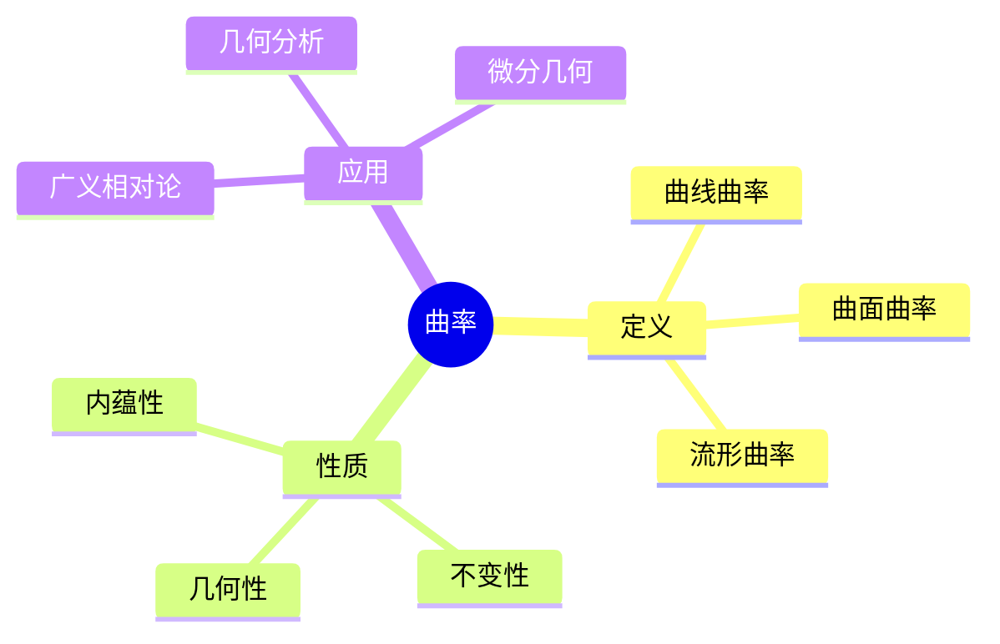
```mermaid
mindmap
  root((曲率))
    定义
      曲线曲率
      曲面曲率
      流形曲率
    性质
      内蕴性
      不变性
      几何性
    应用
      广义相对论
      几何分析
      微分几何
```

#### 5.2 矩阵对比：不同解释方式的对比

| 解释方式 | 特点 | 方法 | 工具 | 适用阶段 | 优势 | 局限 |
|---------|------|------|------|---------|------|------|
| **直观解释** | 具体、形象、可视 | 例子、类比、直观 | 图形、颜色 | 入门阶段 | 易于理解 | 不够严格 |
| **知性解释** | 概念、分类、抽象 | 定义、分类、结构 | 概念图、知识图谱 | 中级阶段 | 系统完整 | 不够直观 |
| **理性解释** | 公理、证明、形式化 | 公理、证明、系统 | 形式化工具、证明系统 | 高级阶段 | 严格准确 | 不够具体 |
| **多视角解释** | 多角度、整合 | 多视角、整合 | 多视角工具 | 所有阶段 | 全面深入 | 可能复杂 |

#### 5.3 多视角表征：从不同角度表征曲率

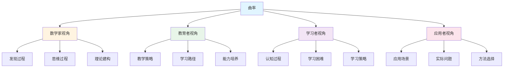
```mermaid
graph TD
    A[曲率] --> B[数学家视角]
    A --> C[教育者视角]
    A --> D[学习者视角]
    A --> E[应用者视角]

    B --> B1[发现过程]
    B --> B2[思维过程]
    B --> B3[理论建构]

    C --> C1[教学策略]
    C --> C2[学习路径]
    C --> C3[能力培养]

    D --> D1[认知过程]
    D --> D2[学习困难]
    D --> D3[学习策略]

    E --> E1[应用场景]
    E --> E2[实际问题]
    E --> E3[方法选择]

    style A fill:#e1f5ff
    style B fill:#fff4e1
    style C fill:#e8f5e9
    style D fill:#f3e5f5
    style E fill:#fce4ec
```

#### 5.4 决策树：曲率问题分类和策略选择

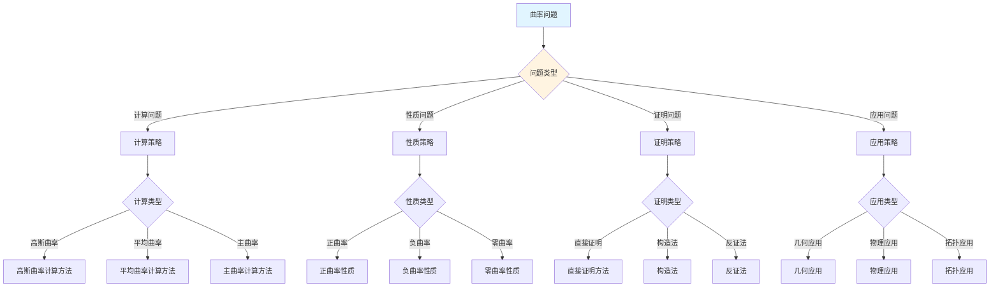
```mermaid
graph TD
    A[曲率问题] --> B{问题类型}
    B -->|计算问题| C[计算策略]
    B -->|性质问题| D[性质策略]
    B -->|证明问题| E[证明策略]
    B -->|应用问题| F[应用策略]

    C --> C1{计算类型}
    C1 -->|高斯曲率| C2[高斯曲率计算方法]
    C1 -->|平均曲率| C3[平均曲率计算方法]
    C1 -->|主曲率| C4[主曲率计算方法]

    D --> D1{性质类型}
    D1 -->|正曲率| D2[正曲率性质]
    D1 -->|负曲率| D3[负曲率性质]
    D1 -->|零曲率| D4[零曲率性质]

    E --> E1{证明类型}
    E1 -->|直接证明| E2[直接证明方法]
    E1 -->|构造法| E3[构造法]
    E1 -->|反证法| E4[反证法]

    F --> F1{应用类型}
    F1 -->|几何应用| F2[几何应用]
    F1 -->|物理应用| F3[物理应用]
    F1 -->|拓扑应用| F4[拓扑应用]

    style A fill:#e1f5ff
    style B fill:#fff4e1
```

**说明**：

- **问题分类**：根据问题类型（计算、性质、证明、应用）进行分类
- **策略选择**：根据问题类型选择相应的解决策略
- **方法应用**：根据具体问题选择合适的方法

#### 5.5 决策逻辑路径：曲率问题解决过程

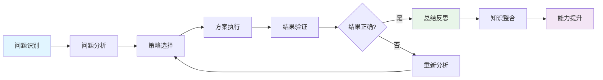
```mermaid
graph LR
    A[问题识别] --> B[问题分析]
    B --> C[策略选择]
    C --> D[方案执行]
    D --> E[结果验证]
    E --> F{结果正确?}
    F -->|是| G[总结反思]
    F -->|否| H[重新分析]
    H --> C

    G --> I[知识整合]
    I --> J[能力提升]

    style A fill:#e1f5ff
    style G fill:#e8f5e9
    style J fill:#f3e5f5
```

**说明**：

- **问题识别**：识别曲率问题的类型和关键要素
- **问题分析**：分析问题的条件和目标
- **策略选择**：根据问题类型选择解决策略
- **方案执行**：执行选定的解决方案
- **结果验证**：验证结果的正确性
- **总结反思**：总结解题过程，反思解题方法
- **知识整合**：整合相关知识点
- **能力提升**：提升问题解决能力

#### 5.6 多维对比矩阵：曲率概念特征对比

| 对比维度 | 曲率定义 | 曲率计算 | 曲率性质 | 曲率应用 |
|---------|---------|---------|---------|---------|
| **核心特征** | 曲率概念、几何意义 | 高斯曲率、平均曲率、主曲率 | 正曲率、负曲率、零曲率 | 几何、物理、拓扑应用 |
| **理解难度** | ⭐⭐⭐⭐ | ⭐⭐⭐⭐⭐ | ⭐⭐⭐⭐⭐ | ⭐⭐⭐⭐ |
| **应用频率** | ⭐⭐⭐⭐ | ⭐⭐⭐⭐ | ⭐⭐⭐⭐ | ⭐⭐⭐⭐ |
| **理论基础** | 曲率定义 | 曲率计算理论 | 曲率性质理论 | 曲率应用理论 |
| **教学重点** | 概念理解 | 计算方法 | 性质分析 | 应用能力 |
| **学习阶段** | 高级阶段 | 高级阶段 | 高级阶段 | 高级阶段 |
| **认知维度** | 知性+理性 | 理性 | 理性 | 理性+应用 |
| **思维表征** | 思维导图 | 决策树 | 决策逻辑路径 | 知识图谱 |

**说明**：

- **核心特征**：每个方面的核心特征
- **理解难度**：从1星到5星，表示理解难度
- **应用频率**：从1星到5星，表示应用频率
- **理论基础**：每个方面的理论基础
- **教学重点**：每个方面的教学重点
- **学习阶段**：每个方面的学习阶段
- **认知维度**：每个方面的认知维度
- **思维表征**：每个方面推荐的思维表征方法

---

## 🔍 数学论证：如何论证曲率 (编号: C.CORE.020.06)

### 一、论证过程：从观察到反思

#### 1.1 观察（Observation）

**具体现象观察**：

- **现象1**：曲线的弯曲程度
  - 例如：圆的曲率是常数，直线的曲率是0
  - **为什么重要**：这个现象揭示了曲率的本质
- **现象2**：曲率与度量的关系
  - 例如：曲率由黎曼度量的导数决定
  - **为什么重要**：这个现象揭示了曲率的几何性质

**模式识别**：

- **模式1**：曲率的定义
  - 例如：曲率是度量偏离平坦程度的量
  - **为什么重要**：这个模式可能反映了曲率的本质
- **模式2**：Gauss-Bonnet定理
  - 例如：曲率的积分等于Euler示性数
  - **为什么重要**：这个模式可能反映了曲率的拓扑性质

**问题提出**：

- **问题1**：如何严格定义曲率，统一不同的弯曲概念？
  - **为什么提出**：这个问题可能揭示曲率的本质和基础
- **问题2**：如何证明Gauss-Bonnet定理？
  - **为什么提出**：这个问题可能揭示曲率的拓扑性质

#### 1.2 猜想（Conjecture）

**归纳猜想**：

- **猜想1**：曲率是研究几何的统一工具
  - **依据**：观察不同几何对象都有曲率
  - **为什么提出**：这个猜想可能揭示曲率的统一性
- **猜想2**：Gauss-Bonnet定理
  - **依据**：观察具体曲面的曲率积分
  - **为什么提出**：这个猜想可能揭示曲率的拓扑性质

**类比猜想**：

- **猜想1**：曲率类似于"弯曲度"
  - **类比对象**：弯曲度
  - **为什么提出**：这个类比可能揭示曲率的本质
- **猜想2**：曲率类似于"偏离平坦"
  - **类比对象**：偏离平坦
  - **为什么提出**：这个类比可能揭示曲率的作用

**直觉猜想**：

- **猜想1**：曲率是"最自然"的弯曲概念
  - **直觉来源**：曲率的直观
  - **为什么提出**：这个直觉可能揭示曲率的基础地位
- **猜想2**：曲率有"最小"的公理结构
  - **直觉来源**：曲率的公理结构
  - **为什么提出**：这个直觉可能揭示曲率的本质

#### 1.3 证明（Proof）

**直接证明**：

- **证明1**：Gauss-Bonnet定理
  - **证明思路**：使用曲率的定义和拓扑的性质
  - **关键步骤**：证明曲率的积分等于Euler示性数
  - **为什么这样证明**：这个证明方法直接、清晰
- **证明2**：曲率与度量的关系
  - **证明思路**：使用黎曼度量的定义和曲率的定义
  - **关键步骤**：证明曲率张量由度量的Christoffel符号决定
  - **为什么这样证明**：这个证明方法直接、清晰

**构造法**：

- **构造法**：构造具有给定曲率的曲面
  - **构造方法**：使用曲率方程构造曲面
  - **验证**：验证构造的曲面具有给定曲率
  - **为什么这样证明**：构造法适合证明存在性命题

#### 1.4 反思（Reflection）

**过程回顾**：

- **论证回顾**：从观察曲线的弯曲程度，到猜想曲率的性质，再到严格证明
  - **成功之处**：成功建立了曲率的严格理论
  - **不足之处**：曲率概念需要进一步推广
  - **改进方向**：推广到高维曲率、复曲率等

**方法总结**：

- **证明方法**：使用了直接证明、构造法
  - **方法特点**：直接证明清晰，构造法明确
  - **适用范围**：不同方法适用于不同类型的命题
- **证明技巧**：使用曲率的定义、度量的性质、构造法
  - **技巧要点**：将曲率问题转化为微分几何问题，使用构造法处理存在性问题
  - **应用场景**：这些技巧可以应用于其他几何问题

**理论意义**：

- **理论贡献**：建立了曲率的严格理论，揭示了曲率的几何结构
  - **为什么重要**：这个论证揭示了微分几何的基础结构
- **应用价值**：曲率为微分几何、广义相对论、物理提供了基础
  - **为什么重要**：这个论证可以应用于所有几何问题

### 二、论证类型：多种推理方式

#### 2.1 归纳论证（Inductive Reasoning）

**不完全归纳**：

- **例子1**：从具体曲线的曲率归纳一般规律
  - **观察**：观察圆的曲率是常数，直线的曲率是0
  - **结论**：曲率反映弯曲程度
  - **局限性**：不完全归纳的结论需要严格证明

#### 2.2 演绎论证（Deductive Reasoning）

**三段论**：

- **例子1**：证明曲率的性质
  - **大前提**：所有曲线都有曲率
  - **小前提**：圆是曲线
  - **结论**：圆有曲率
  - **为什么有效**：三段论是严格的演绎推理

#### 2.3 类比论证（Analogical Reasoning）

**结构类比**：

- **例子1**：曲率与弯曲度的类比
  - **类比对象**：弯曲度
  - **相似性**：曲率表示弯曲程度
  - **结论**：曲率可以理解为"弯曲度"
  - **局限性**：类比不能替代严格证明

#### 2.4 构造论证（Constructive Reasoning）

**构造法**：

- **例子1**：构造具有给定曲率的曲面
  - **构造方法**：使用曲率方程构造曲面
  - **验证**：验证构造的曲面具有给定曲率
  - **为什么有效**：构造法是严格的直接证明

### 三、论证可视化：用图形表示论证过程

#### 3.1 论证流程图

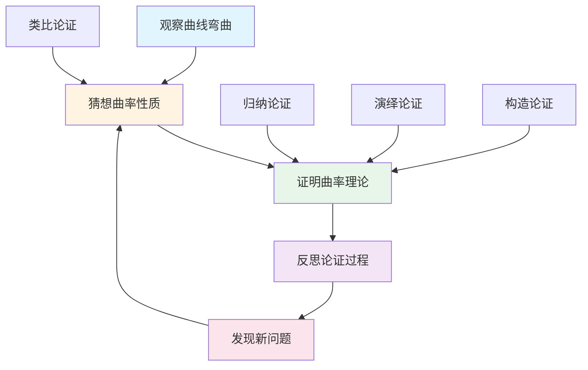
```mermaid
graph TD
    A[观察曲线弯曲] --> B[猜想曲率性质]
    B --> C[证明曲率理论]
    C --> D[反思论证过程]
    D --> E[发现新问题]
    E --> B

    F[归纳论证] --> C
    G[演绎论证] --> C
    H[类比论证] --> B
    I[构造论证] --> C

    style A fill:#e1f5ff
    style B fill:#fff4e1
    style C fill:#e8f5e9
    style D fill:#f3e5f5
    style E fill:#fce4ec
```

#### 3.2 论证类型对比

| 论证类型 | 特点 | 适用场景 | 优势 | 局限 |
|---------|------|---------|------|------|
| **归纳论证** | 从特殊到一般 | 发现规律、提出猜想 | 启发性强 | 结论或然 |
| **演绎论证** | 从一般到特殊 | 严格证明、逻辑推理 | 结论必然 | 需要前提 |
| **类比论证** | 基于相似性 | 启发思路、发现联系 | 创造性高 | 结论或然 |
| **构造论证** | 直接构造 | 证明存在性命题 | 直接明确 | 需要构造 |

#### 3.3 论证思维导图

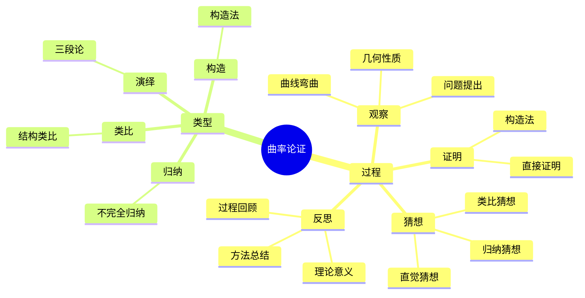
```mermaid
mindmap
  root((曲率论证))
    过程
      观察
        曲线弯曲
        几何性质
        问题提出
      猜想
        归纳猜想
        类比猜想
        直觉猜想
      证明
        直接证明
        构造法
      反思
        过程回顾
        方法总结
        理论意义
    类型
      归纳
        不完全归纳
      演绎
        三段论
      类比
        结构类比
      构造
        构造法
```

---

## 🔗 三视角整合 (编号: C.CORE.020.07)

### 三个视角的关联

**认知学视角 ↔ 教育学视角**:

- 认知学视角揭示的理解机制，指导教育学视角的教学设计
- 教育学视角的教学实践，验证认知学视角的理论

**认知学视角 ↔ 数学家视角**:

- 数学家视角的思维过程，启发认知学视角的认知路径
- 认知学视角的认知障碍，解释数学家视角的历史困难

**教育学视角 ↔ 数学家视角**:

- 数学家视角的历史发展，为教育学视角提供教学素材
- 教育学视角的教学策略，帮助学习者理解数学家视角的思维过程

### 如何综合运用三个视角

**学习建议**:

1. **从认知学视角开始**: 先建立直观理解
2. **用教育学视角深化**: 通过教学路径系统学习
3. **用数学家视角升华**: 理解概念的深层意义和历史背景

**教学建议**:

1. **引入阶段**: 用数学家视角的问题起源激发兴趣
2. **探索阶段**: 用认知学视角的认知过程引导发现
3. **形式化阶段**: 用教育学视角的教学策略系统教学
4. **巩固阶段**: 综合三个视角深化理解

---

## 📚 参考文献 (编号: C.CORE.020.08)

### 权威资源

- Wikipedia: [Curvature](https://en.wikipedia.org/wiki/Curvature)
- Metamath: [Curvature](http://us.metamath.org/mpeuni/df-curvature.html)[需更新][需更新]

### 经典教材

- Do Carmo, M. P. (1976). *Differential Geometry of Curves and Surfaces*. Prentice-Hall.
- Lee, J. M. (2018). *Introduction to Riemannian Manifolds*. Springer.

### 研究论文

- Gauss, C. F. (1827). "Disquisitiones generales circa superficies curvas". *Commentationes Societatis Regiae Scientiarum Gottingensis*.
- Riemann, B. (1854). "Über die Hypothesen, welche der Geometrie zu Grunde liegen". *Abhandlungen der Königlichen Gesellschaft der Wissenschaften zu Göttingen*.

---

**创建日期**: 2025年1月
**最后更新**: 2026-04-05
**维护状态**: 持续更新中

---

## 📚 附录: 扩展分析


### 1. 多理论分析

---
msc_primary: "00A99"
---

# 曲率概念的多理论分析示例 / Multi-Theory Analysis Example: Curvature Concept


---


## 🎯 一、Tall三个世界理论分析 / Tall's Three Worlds Theory Analysis (编号: C.CORE.018.MULTI.01)

### 1.1 感知-操作世界（Embodied World）

**曲率在感知-操作世界中的理解 / Understanding Curvatures in the Embodied World**：

- **具体经验 / Concrete Experience**：
  - 通过观察曲线、曲面理解曲率：曲线是1维曲率，球面是2维曲率 / Understanding curvatures through observing curves and surfaces: curves are 1-dimensional curvatures, spheres are 2-dimensional curvatures
  - 例如：地球表面（球面）、轮胎表面（环面） / Examples: Earth's surface (sphere), tire surface (torus)
  - 通过"局部像欧几里得空间"理解曲率：在小范围内，曲率看起来像平面 / Understanding curvatures through "locally like Euclidean space": in small regions, curvatures look like planes

- **身体动作 / Bodily Actions**：
  - 通过"局部观察"的动作理解曲率 / Understanding curvatures through the action of "local observation"
  - 通过"坐标变换"理解曲率的局部结构 / Understanding local structure of curvatures through "coordinate transformations"
  - 通过操作图形理解曲率的切空间、法向量 / Understanding tangent spaces and normal vectors of curvatures through manipulating figures

- **直观理解 / Intuitive Understanding**：
  - 曲率是"局部像欧几里得空间的拓扑空间" / A curvature is a "topological space that is locally like Euclidean space"
  - 曲率描述"弯曲空间"的结构 / Curvatures describe the structure of "curved spaces"
  - 曲率是微分几何的基础 / Curvatures are the foundation of differential geometry

**教学建议 / Teaching Suggestions**：

- 使用具体例子（球面、环面、平面） / Use concrete examples (spheres, tori, planes)
- 通过局部观察理解曲率 / Understand curvatures through local observation
- 使用图形可视化曲率结构 / Use graphics to visualize curvature structure

### 1.2 概念-符号世界（Symbolic World）

**曲率在概念-符号世界的理解 / Understanding Curvatures in the Symbolic World**：

- **符号表示 / Symbolic Representation**：
  - 使用曲率符号：$M$、$N$ 表示曲率 / Using curvature notation: $M$, $N$ to denote curvatures
  - 使用坐标卡符号：$(U, \phi)$、$(V, \psi)$ / Using chart notation: $(U, \phi)$, $(V, \psi)$
  - 使用切空间符号：$T_p M$、$TM$ / Using tangent space notation: $T_p M$, $TM$

- **概念理解 / Conceptual Understanding**：
  - 曲率是局部同胚于$\mathbb{R}^n$的拓扑空间 / A curvature is a topological space locally homeomorphic to $\mathbb{R}^n$
  - 曲率通过坐标卡覆盖 / Curvatures are covered by coordinate charts
  - 曲率是微分几何的研究对象 / Curvatures are objects of study in differential geometry

- **抽象操作 / Abstract Operations**：
  - 通过坐标变换研究曲率 / Studying curvatures through coordinate transformations
  - 通过切空间研究曲率的局部结构 / Studying local structure of curvatures through tangent spaces
  - 通过微分形式研究曲率的全局性质 / Studying global properties of curvatures through differential forms

**教学建议 / Teaching Suggestions**：

- 逐步引入曲率符号 / Gradually introduce curvature notation
- 通过坐标卡练习理解曲率 / Understand curvatures through chart exercises
- 使用曲率性质研究几何结构 / Use curvature properties to study geometric structures

### 1.3 形式-公理世界（Formal World）

**曲率在形式-公理世界的理解 / Understanding Curvatures in the Formal World**：

- **公理系统 / Axiomatic System**：
  - 曲率的严格定义：$n$维曲率$M$是满足条件的拓扑空间 / Strict definition of curvature: $n$-dimensional curvature $M$ is a topological space satisfying conditions
  - 通过坐标卡严格定义曲率 / Strictly defining curvatures through coordinate charts
  - 通过公理推导演分性质 / Deriving differential properties through axioms

- **形式化定义 / Formal Definition**：
  - 曲率的形式化定义 / Formal definition of curvature
  - 光滑曲率的形式化定义 / Formal definition of smooth curvature
  - 曲率性质的形式化证明 / Formal proof of curvature properties

- **逻辑推理 / Logical Reasoning**：
  - 通过逻辑推理证明曲率性质 / Proving curvature properties through logical reasoning
  - 通过形式化方法研究微分几何 / Studying differential geometry through formal methods
  - 通过范畴论研究曲率的一般性质 / Studying general properties of curvatures through category theory

**教学建议 / Teaching Suggestions**：

- 介绍曲率定义 / Introduce curvature definition
- 通过形式化证明理解曲率性质 / Understand curvature properties through formal proofs
- 研究曲率在微分几何中的作用 / Study the role of curvatures in differential geometry

### 1.4 三个世界的转换 / Transitions Between Worlds

**转换路径 / Transition Paths**：

1. **从感知-操作到概念-符号 / From Embodied to Symbolic**：
   - 将具体弯曲程度抽象为曲率符号 / Abstracting concrete bending degrees into curvature symbols
   - 从操作中提取曲率概念 / Extracting curvature concepts from operations
   - 例如：从"弯曲程度"到"曲率$K$" / Example: from "degree of bending" to "curvature $K$"

2. **从概念-符号到形式-公理 / From Symbolic to Formal**：
   - 将曲率概念形式化为曲率张量定义 / Formalizing curvature concepts into curvature tensor definition
   - 从符号运算到逻辑推理 / From symbolic operations to logical reasoning
   - 例如：从"$K$"到"曲率张量$R$" / Example: from "$K$" to "curvature tensor $R$"

**转换支持 / Transition Support**：

- **识别转换困难 / Identifying Transition Difficulties**：
  - 识别从具体弯曲到抽象曲率的困难 / Identifying difficulties in transitioning from concrete bending to abstract curvature
  - 识别从符号运算到形式化定义的困难 / Identifying difficulties in transitioning from symbolic operations to formal definitions

- **设计转换活动 / Designing Transition Activities**：
  - 设计过渡活动支持转换 / Designing transition activities to support transitions
  - 提供渐进式支持 / Providing progressive support

- **评估转换效果 / Assessing Transition Effectiveness**：
  - 评估转换成功 / Assessing transition success
  - 提供反馈支持 / Providing feedback support

---

## 🔬 二、Dubinsky APOS理论分析 (编号: C.CORE.018.MULTI.02)

### 2.1 Action（动作）

**曲率的Action阶段 / Action Stage of Curvature**：

- **具体操作 / Concrete Operations**：
  - 判断曲率：给定拓扑空间，判断是否为曲率 / Determining curvature: given a topological space, determine if it is a curvature
  - 使用坐标卡：给定曲率，构造坐标卡 / Using coordinate charts: given a curvature, construct coordinate charts
  - 构造曲率：给定拓扑空间，构造曲率结构 / Constructing curvatures: given a topological space, construct curvature structure

- **操作特点 / Operation Characteristics**：
  - 需要外部指导（教师、教材） / Requires external guidance (teacher, textbook)
  - 操作是具体的、机械的 / Operations are concrete and mechanical
  - 需要逐步执行 / Requires step-by-step execution

- **学习活动 / Learning Activities**：
  - 练习判断曲率 / Practice determining curvatures
  - 练习使用坐标卡 / Practice using coordinate charts
  - 练习构造曲率 / Practice constructing curvatures

**教学建议 / Teaching Suggestions**：

- 提供大量练习机会 / Provide ample practice opportunities
- 给予及时反馈 / Give timely feedback
- 逐步增加操作复杂度 / Gradually increase operation complexity

### 2.2 Process（过程）

**曲率的Process阶段 / Process Stage of Curvature**：

- **内化过程 / Internalization Process**：
  - 将曲率判断内化为心理过程 / Internalizing curvature determination as a mental process
  - 理解曲率构造的内在逻辑 / Understanding the internal logic of curvature construction
  - 能够独立完成曲率操作 / Being able to perform curvature operations independently

- **过程理解 / Process Understanding**：
  - 理解"曲率"是"局部像欧几里得空间的拓扑空间的过程" / Understanding that "curvature" is "the process of topological spaces locally like Euclidean space"
  - 理解"坐标卡"是"局部坐标化的过程" / Understanding that "coordinate charts" are "the process of local coordinatization"
  - 理解"切空间"是"局部线性化的过程" / Understanding that "tangent spaces" are "the process of local linearization"

- **灵活应用 / Flexible Application**：
  - 能够灵活应用曲率概念 / Being able to flexibly apply curvature concepts
  - 能够处理复杂的曲率问题 / Being able to handle complex curvature problems
  - 能够理解曲率的各种性质 / Being able to understand various properties of curvatures

**教学建议 / Teaching Suggestions**：

- 引导学生内化操作过程 / Guide students to internalize operation processes
- 通过变式练习加深理解 / Deepen understanding through variant exercises
- 鼓励学生探索曲率应用 / Encourage students to explore curvature applications

### 2.3 Object（对象）

**曲率的Object阶段 / Object Stage of Curvature**：

- **对象化理解 / Objectification Understanding**：
  - 将曲率视为独立的对象 / Viewing curvatures as independent objects
  - 理解曲率作为数学对象的结构 / Understanding the structure of curvatures as mathematical objects
  - 能够对曲率进行运算和操作 / Being able to perform operations on curvatures

- **对象操作 / Object Operations**：
  - 能够比较不同的曲率 / Being able to compare different curvatures
  - 能够构造曲率的积曲率 / Being able to construct product curvatures
  - 能够研究曲率的性质 / Being able to study properties of curvatures

- **概念整合 / Conceptual Integration**：
  - 理解曲率与拓扑空间、微分几何的关系 / Understanding the relationship between curvatures, topological spaces, and differential geometry
  - 理解曲率在几何学中的作用 / Understanding the role of curvatures in geometry
  - 理解曲率在数学中的作用 / Understanding the role of curvatures in mathematics

**教学建议 / Teaching Suggestions**：

- 引导学生将曲率对象化 / Guide students to objectify curvatures
- 通过对象操作加深理解 / Deepen understanding through object operations
- 整合曲率与其他概念 / Integrate curvatures with other concepts

### 2.4 Schema（图式）

**曲率的Schema阶段 / Schema Stage of Curvature**：

- **图式构建 / Schema Construction**：
  - 构建完整的曲率图式 / Constructing a complete curvature schema
  - 整合曲率的各种理解 / Integrating various understandings of curvatures
  - 建立曲率与其他概念的联系 / Establishing connections between curvatures and other concepts

- **图式应用 / Schema Application**：
  - 能够灵活应用曲率图式 / Being able to flexibly apply curvature schemas
  - 能够解决复杂的曲率问题 / Being able to solve complex curvature problems
  - 能够研究微分几何理论 / Being able to study differential geometry theory

- **图式发展 / Schema Development**：
  - 不断发展曲率图式 / Continuously developing curvature schemas
  - 探索曲率的新应用 / Exploring new applications of curvatures
  - 研究微分几何理论的发展 / Studying the development of differential geometry theory

**教学建议 / Teaching Suggestions**：

- 帮助学生构建曲率图式 / Help students construct curvature schemas
- 通过应用发展图式 / Develop schemas through application
- 鼓励学生探索微分几何理论 / Encourage students to explore differential geometry theory

### 2.5 APOS发展路径 / APOS Development Path

**发展过程 / Development Process**：

1. **Action → Process / 动作到过程**：
   - 将外部曲率计算操作内化为心理过程 / Internalizing external curvature computation operations as mental processes
   - 从需要指导到独立完成 / From needing guidance to independent completion
   - 例如：从"计算曲率"到"理解曲率计算过程" / Example: from "computing curvature" to "understanding the curvature computation process"

2. **Process → Object / 过程到对象**：
   - 将曲率计算过程对象化 / Objectifying curvature computation processes
   - 从过程理解到对象理解 / From process understanding to object understanding
   - 例如：从"理解曲率计算过程"到"将曲率视为对象" / Example: from "understanding the curvature computation process" to "treating curvature as objects"

3. **Object → Schema / 对象到图式**：
   - 整合曲率的所有方面形成完整图式 / Integrating all aspects of curvature to form a complete schema
   - 从对象理解到系统理解 / From object understanding to systematic understanding
   - 例如：从"理解曲率对象"到"形成微分几何图式" / Example: from "understanding curvature objects" to "forming a differential geometry schema"

**发展支持 / Development Support**：

- **识别发展困难 / Identifying Development Difficulties**：
  - 识别内化困难 / Identifying internalization difficulties
  - 识别对象化困难 / Identifying objectification difficulties
  - 识别图式化困难 / Identifying schematization difficulties

- **设计发展活动 / Designing Development Activities**：
  - 设计支持内化的活动 / Designing activities to support internalization
  - 设计支持对象化的活动 / Designing activities to support objectification
  - 设计支持图式化的活动 / Designing activities to support schematization

- **评估发展效果 / Assessing Development Effectiveness**：
  - 评估各阶段发展 / Assessing development at each stage
  - 提供反馈支持 / Providing feedback support

---

## 💬 三、Sfard交流理论分析 / Sfard's Commognitive Theory Analysis (编号: C.CORE.018.MULTI.03)

### 3.1 曲率作为交流工具 / Curvature as a Communication Tool

**曲率的交流功能 / Communicative Function of Curvatures**：

- **数学交流 / Mathematical Communication**：
  - 曲率用于表达"弯曲空间"：$M$ / Curvatures are used to express "curved spaces": $M$
  - 曲率用于描述"局部结构" / Curvatures are used to describe "local structure"
  - 曲率用于表达数学关系：微分同胚、同伦等价 / Curvatures are used to express mathematical relationships: diffeomorphisms, homotopy equivalence

- **概念表达 / Conceptual Expression**：
  - 通过曲率表达"局部像欧几里得空间"的概念 / Expressing the concept of "locally like Euclidean space" through curvatures
  - 通过曲率符号表达"几何结构"的概念 / Expressing the concept of "geometric structure" through curvature notation
  - 通过曲率表达"微分结构"的概念 / Expressing the concept of "differential structure" through curvatures

- **问题解决 / Problem Solving**：
  - 使用曲率语言表达问题 / Using curvature language to express problems
  - 使用曲率方法解决问题 / Using curvature methods to solve problems
  - 使用微分几何方法证明定理 / Using differential geometry methods to prove theorems

### 3.2 曲率学习的实践参与 / Practice Participation in Curvature Learning

**通过参与数学实践学习曲率 / Learning Curvatures through Participation in Mathematical Practice**：

- **实践场景 / Practice Scenarios**：
  - 通过几何问题学习曲率 / Learning curvatures through geometry problems
  - 通过物理应用学习曲率 / Learning curvatures through physics applications
  - 通过机器学习应用学习曲率 / Learning curvatures through machine learning applications
  - 通过微分几何研究学习曲率理论 / Learning curvature theory through differential geometry research

- **实践方式 / Practice Methods**：
  - 参与数学讨论，使用曲率语言 / Participating in mathematical discussions, using curvature language
  - 解决数学问题，应用曲率方法 / Solving mathematical problems, applying curvature methods
  - 研究数学理论，理解曲率作用 / Studying mathematical theory, understanding the role of curvatures

- **学习效果 / Learning Outcomes**：
  - 通过实践理解曲率概念 / Understanding curvature concepts through practice
  - 通过应用掌握曲率方法 / Mastering curvature methods through application
  - 通过参与形成数学思维 / Forming mathematical thinking through participation

**教学建议 / Teaching Suggestions**：

- 设计数学实践活动 / Design mathematical practice activities
- 鼓励学生参与数学讨论 / Encourage students to participate in mathematical discussions
- 提供实际问题解决机会 / Provide opportunities for solving real-world problems

---

## 🧠 四、Piaget认知发展理论分析 / Piaget's Cognitive Development Theory Analysis (编号: C.CORE.018.MULTI.04)

### 4.1 具体运算阶段（7-12岁）/ Concrete Operational Stage (7-12 years)

**曲率在具体运算阶段的理解 / Understanding Curvatures in the Concrete Operational Stage**：

- **具体对象 / Concrete Objects**：
  - 通过具体曲率理解曲率 / Understanding curvatures through concrete curvatures
  - 例如：球面、环面、平面 / Examples: spheres, tori, planes
  - 需要具体例子支持理解 / Requires concrete examples to support understanding

- **逻辑思维 / Logical Thinking**：
  - 能够理解曲率的基本概念 / Being able to understand basic curvature concepts
  - 能够进行简单的曲率操作 / Being able to perform simple curvature operations
  - 但需要具体对象支持 / But requires concrete object support

- **教学建议 / Teaching Suggestions**：
  - 使用具体曲率 / Use concrete curvatures
  - 通过图形验证曲率性质 / Verify curvature properties through graphics
  - 逐步引入抽象概念 / Gradually introduce abstract concepts

### 4.2 形式运算阶段（12+岁）/ Formal Operational Stage (12+ years)

**曲率在形式运算阶段的理解 / Understanding Curvatures in the Formal Operational Stage**：

- **抽象思维 / Abstract Thinking**：
  - 能够理解抽象的曲率概念 / Being able to understand abstract curvature concepts
  - 能够进行符号操作 / Being able to perform symbolic operations
  - 能够进行逻辑推理 / Being able to perform logical reasoning

- **形式推理 / Formal Reasoning**：
  - 能够证明曲率性质 / Being able to prove curvature properties
  - 能够理解曲率定义 / Being able to understand curvature definition
  - 能够研究微分几何 / Being able to study differential geometry

- **教学建议 / Teaching Suggestions**：
  - 引入抽象概念和符号 / Introduce abstract concepts and symbols
  - 进行逻辑推理训练 / Conduct logical reasoning training
  - 研究微分几何理论 / Study differential geometry theory

---

## 🌍 五、Vygotsky社会文化理论分析 / Vygotsky's Sociocultural Theory Analysis (编号: C.CORE.018.MULTI.05)

### 5.1 最近发展区（ZPD）/ Zone of Proximal Development (ZPD)

**曲率学习的最近发展区 / Zone of Proximal Development in Curvature Learning**：

- **独立能力 / Independent Ability**：
  - 能够理解曲率的基本概念 / Being able to understand basic curvature concepts
  - 能够进行简单的曲率操作 / Being able to perform simple curvature operations
  - 能够理解坐标卡 / Being able to understand coordinate charts

- **潜在能力 / Potential Ability**：
  - 能够理解曲率定义 / Being able to understand curvature definition
  - 能够证明曲率性质 / Being able to prove curvature properties
  - 能够研究微分几何理论 / Being able to study differential geometry theory

- **教学建议 / Teaching Suggestions**：
  - 识别学生的最近发展区 / Identify students' zone of proximal development
  - 提供适当的支持和指导 / Provide appropriate support and guidance
  - 逐步提高学习要求 / Gradually increase learning requirements

### 5.2 社会文化工具 / Sociocultural Tools

**曲率作为社会文化工具 / Curvatures as Sociocultural Tools**：

- **数学工具 / Mathematical Tools**：
  - 曲率是数学研究的重要工具 / Curvatures are important tools for mathematical research
  - 曲率用于解决实际问题 / Curvatures are used to solve real-world problems
  - 曲率用于研究数学理论 / Curvatures are used to study mathematical theory

- **文化意义 / Cultural Significance**：
  - 曲率是数学文化的重要组成部分 / Curvatures are an important part of mathematical culture
  - 曲率反映了数学思维的发展 / Curvatures reflect the development of mathematical thinking
  - 曲率体现了数学的美感 / Curvatures embody the beauty of mathematics

- **教学建议 / Teaching Suggestions**：
  - 介绍曲率的历史和文化意义 / Introduce the history and cultural significance of curvatures
  - 展示曲率在数学中的作用 / Demonstrate the role of curvatures in mathematics
  - 培养学生对数学文化的理解 / Cultivate students' understanding of mathematical culture

---

## 🔄 六、多理论整合分析 / Multi-Theory Integration Analysis (编号: C.CORE.018.MULTI.06)

### 6.1 理论共同点 / Theoretical Commonalities

**各理论在曲率概念分析中的共同点 / Commonalities of Theories in Curvature Concept Analysis**：

1. **多层次理解 / Multi-Level Understanding**：
   - 都强调从具体到抽象的发展 / All emphasize development from concrete to abstract
   - Tall的三个世界、APOS的四个阶段、Piaget的发展阶段都体现这一点 / Tall's three worlds, APOS's four stages, and Piaget's developmental stages all reflect this

2. **实践重要性 / Importance of Practice**：
   - 都强调实践在学习中的作用 / All emphasize the role of practice in learning
   - Sfard的交流理论、Vygotsky的社会文化理论都强调这一点 / Sfard's communication theory and Vygotsky's sociocultural theory both emphasize this

3. **认知发展 / Cognitive Development**：
   - 都关注认知发展的过程 / All focus on the process of cognitive development
   - 各理论都描述了从简单到复杂的发展 / Each theory describes development from simple to complex

### 6.2 理论互补性 / Theoretical Complementarity

**各理论在曲率概念分析中的互补性 / Complementarity of Theories in Curvature Concept Analysis**：

1. **Tall三个世界 / Tall's Three Worlds**：
   - 适用于理解曲率概念的不同层次 / Applicable to understanding different levels of curvature concepts
   - 从感知操作到形式公理的发展 / Development from embodied operations to formal axioms

2. **APOS理论 / APOS Theory**：
   - 适用于分析曲率概念的学习过程 / Applicable to analyzing the learning process of curvature concepts
   - 从动作到图式的发展 / Development from action to schema

3. **Sfard交流理论 / Sfard's Communication Theory**：
   - 适用于设计曲率概念的实践活动 / Applicable to designing practice activities for curvature concepts
   - 通过数学实践学习曲率 / Learning curvatures through mathematical practice

4. **Piaget理论 / Piaget's Theory**：
   - 适用于理解曲率概念的认知发展阶段 / Applicable to understanding cognitive development stages of curvature concepts
   - 从具体运算到形式运算的发展 / Development from concrete operations to formal operations

5. **Vygotsky理论 / Vygotsky's Theory**：
   - 适用于设计曲率概念的学习支持 / Applicable to designing learning support for curvature concepts
   - 通过最近发展区促进学习 / Promoting learning through the zone of proximal development

### 6.3 整合应用框架

**多理论整合应用**：

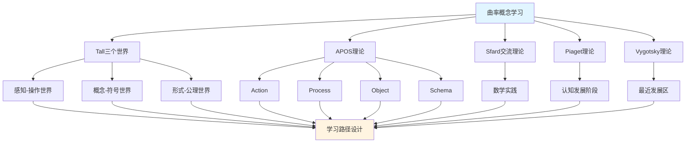
```mermaid
graph TB
    A[曲率概念学习] --> B[Tall三个世界]
    A --> C[APOS理论]
    A --> D[Sfard交流理论]
    A --> E[Piaget理论]
    A --> F[Vygotsky理论]

    B --> G[感知-操作世界]
    B --> H[概念-符号世界]
    B --> I[形式-公理世界]

    C --> J[Action]
    C --> K[Process]
    C --> L[Object]
    C --> M[Schema]

    D --> N[数学实践]
    E --> O[认知发展阶段]
    F --> P[最近发展区]

    G --> Q[学习路径设计]
    H --> Q
    I --> Q
    J --> Q
    K --> Q
    L --> Q
    M --> Q
    N --> Q
    O --> Q
    P --> Q

    style A fill:#e1f5ff
    style Q fill:#fff4e1
```

---

## 📊 七、曲率概念的多理论学习路径 / Multi-Theory Learning Path for Curvature Concept (编号: C.CORE.018.MULTI.07)

### 7.1 入门阶段（Tall感知-操作世界 + APOS Action）/ Entry Stage (Tall Embodied World + APOS Action)

**学习目标 / Learning Objectives**：

- 通过具体曲率理解曲率概念 / Understanding curvature concepts through concrete curvatures
- 掌握基本曲率操作 / Mastering basic curvature operations

**学习活动 / Learning Activities**：

- 使用具体曲率（球面、环面）进行观察 / Using concrete curvatures (spheres, tori) for observation
- 练习判断曲率 / Practicing determining curvatures
- 练习使用坐标卡 / Practicing using coordinate charts
- 练习基本曲率操作 / Practicing basic curvature operations

**评估标准 / Assessment Criteria**：

- 能够独立完成基本曲率操作 / Being able to independently complete basic curvature operations
- 能够理解曲率的基本概念 / Being able to understand basic curvature concepts

### 7.2 中级阶段（Tall概念-符号世界 + APOS Process/Object）/ Intermediate Stage (Tall Symbolic World + APOS Process/Object)

**学习目标 / Learning Objectives**：

- 理解曲率的符号表示 / Understanding symbolic representation of curvatures
- 掌握曲率运算的内在逻辑 / Mastering the internal logic of curvature operations
- 将曲率视为对象 / Viewing curvatures as objects

**学习活动 / Learning Activities**：

- 学习曲率符号和坐标卡符号 / Learning curvature notation and chart notation
- 通过符号操作进行曲率运算 / Performing curvature operations through symbolic operations
- 理解曲率的性质 / Understanding properties of curvatures
- 研究曲率的积曲率 / Studying product curvatures

**评估标准 / Assessment Criteria**：

- 能够灵活应用曲率符号 / Being able to flexibly apply curvature notation
- 能够理解曲率运算的内在逻辑 / Being able to understand the internal logic of curvature operations
- 能够将曲率视为对象进行操作 / Being able to operate on curvatures as objects

### 7.3 高级阶段（Tall形式-公理世界 + APOS Schema + Sfard实践）/ Advanced Stage (Tall Formal World + APOS Schema + Sfard Practice)

**学习目标 / Learning Objectives**：

- 理解曲率定义 / Understanding curvature definition
- 形成完整的曲率概念图式 / Forming a complete curvature concept schema
- 通过数学实践应用曲率 / Applying curvatures through mathematical practice

**学习活动 / Learning Activities**：

- 学习曲率定义 / Learning curvature definition
- 通过形式化证明理解曲率性质 / Understanding curvature properties through formal proofs
- 研究曲率在微分几何中的作用 / Studying the role of curvatures in differential geometry
- 参与数学实践，应用曲率方法 / Participating in mathematical practice, applying curvature methods

**评估标准 / Assessment Criteria**：

- 能够理解曲率定义 / Being able to understand curvature definition
- 能够形成完整的曲率概念图式 / Being able to form a complete curvature concept schema
- 能够通过数学实践应用曲率 / Being able to apply curvatures through mathematical practice

---

## 🧠 七、元认知理论分析 / Metacognitive Theory Analysis (编号: C.CORE.020.MULTI.07.5)

### 7.1 元认知知识（Metacognitive Knowledge）

**关于曲率概念的知识 / Knowledge About the Curvature Concept**：

- **概念知识 / Conceptual Knowledge**：
  - 曲率的定义：描述空间弯曲程度的量 / Curvature is a quantity describing the degree of space curvature
  - 曲率的性质：局部性、内蕴性、高斯曲率、平均曲率 / Properties: locality, intrinsicality, Gaussian curvature, mean curvature
  - 曲率的表示方法：曲率张量、曲率形式、曲率半径 / Representation methods: curvature tensor, curvature form, radius of curvature
  - 曲率与其他概念的关系：曲率是微分几何的核心，是研究空间弯曲的工具 / Relationship: curvature is a core concept of differential geometry and a tool for studying space curvature

- **策略知识 / Strategy Knowledge**：
  - 学习策略：从直观理解（弯曲程度）到严格定义，通过具体例子掌握曲率计算 / Learning strategies: from intuitive understanding (degree of curvature) to strict definition, master curvature computation through concrete examples
  - 理解策略：从二维到高维，从局部到整体 / Understanding strategies: from two-dimensional to high-dimensional, from local to global
  - 应用策略：将曲率方法应用到实际问题中 / Application strategies: apply curvature methods to real-world problems

- **任务知识 / Task Knowledge**：
  - 典型任务：曲率计算、曲率应用、几何问题 / Typical tasks: curvature computation, curvature applications, geometric problems
  - 任务难度：基础任务（曲率计算）→ 中级任务（曲率应用）→ 高级任务（几何问题） / Task difficulty: basic (curvature computation) → intermediate (curvature applications) → advanced (geometric problems)
  - 任务要求：理解曲率概念，掌握曲率计算，能够进行曲率推理 / Task requirements: understand curvature concepts, master curvature computation, be able to reason about curvature

### 7.2 元认知监控（Metacognitive Monitoring）

**理解监控 / Comprehension Monitoring**：

- **自我提问 / Self-Questioning**：
  - "我理解曲率的基本概念了吗？" / "Do I understand the basic concept of curvature?"
  - "我能区分不同类型的曲率吗？" / "Can I distinguish between different types of curvature?"
  - "我理解曲率的几何意义吗？" / "Do I understand the geometric meaning of curvature?"

- **理解检查 / Comprehension Checking**：
  - 能否用自己的话解释曲率概念？ / Can I explain the concept of curvature in my own words?
  - 能否识别曲率计算的错误？ / Can I identify errors in curvature computation?
  - 能否判断空间的曲率性质？ / Can I determine the curvature properties of spaces?

- **困难识别 / Difficulty Identification**：
  - 识别理解困难：抽象性、曲率张量、高斯曲率、平均曲率 / Identify comprehension difficulties: abstraction, curvature tensor, Gaussian curvature, mean curvature
  - 识别运算困难：曲率计算、曲率应用、几何问题 / Identify operation difficulties: curvature computation, curvature applications, geometric problems

**过程监控 / Process Monitoring**：

- **学习过程监控 / Learning Process Monitoring**：
  - 监控学习进度：是否按计划学习？ / Monitor learning progress: Am I learning according to plan?
  - 监控学习效果：是否掌握了曲率概念？ / Monitor learning effectiveness: Have I mastered the concept of curvature?
  - 监控学习困难：遇到了哪些困难？ / Monitor learning difficulties: What difficulties have I encountered?

- **策略使用监控 / Strategy Use Monitoring**：
  - 使用的策略是否有效？ / Is the strategy I'm using effective?
  - 是否需要调整策略？ / Do I need to adjust my strategy?
  - 策略使用是否正确？ / Am I using the strategy correctly?

### 7.3 元认知调节（Metacognitive Regulation）

**计划调节 / Planning Regulation**：

- **学习计划制定 / Learning Plan Development**：
  - 制定学习计划：先学曲率基本概念，再学曲率计算，最后学曲率应用 / Develop learning plan: first learn basic curvature concepts, then learn curvature computation, finally learn curvature applications
  - 调整学习计划：根据学习情况调整计划 / Adjust learning plan: adjust plan based on learning situation
  - 优化学习路径：选择最适合自己的学习路径 / Optimize learning path: choose the learning path that best suits oneself

**策略调节 / Strategy Regulation**：

- **策略选择 / Strategy Selection**：
  - 根据任务类型选择策略：简单任务用直接方法，复杂任务用分步方法 / Select strategies based on task type: use direct methods for simple tasks, step-by-step methods for complex tasks
  - 根据学习阶段选择策略：入门阶段用具体例子，高级阶段用抽象方法 / Select strategies based on learning stage: use concrete examples in entry stage, abstract methods in advanced stage

- **策略调整 / Strategy Adjustment**：
  - 如果遇到困难，尝试不同的策略 / If encountering difficulties, try different strategies
  - 如果策略无效，调整策略 / If strategy is ineffective, adjust strategy
  - 如果策略有效，继续使用并优化 / If strategy is effective, continue using and optimize

**反思调节 / Reflection Regulation**：

- **学习反思 / Learning Reflection**：
  - 反思学习过程：从曲率学习中获得了什么？ / Reflect on learning process: What have I gained from learning curvature?
  - 反思学习困难：遇到了哪些困难？如何克服？ / Reflect on learning difficulties: What difficulties did I encounter? How did I overcome them?
  - 反思学习策略：使用的策略是否有效？如何改进？ / Reflect on learning strategies: Were the strategies I used effective? How can I improve?

- **错误反思 / Error Reflection**：
  - 从错误中学习：分析错误原因，避免类似错误 / Learn from errors: analyze error causes, avoid similar errors
  - 改进学习方法：根据错误调整学习方法 / Improve learning methods: adjust learning methods based on errors

**教学建议 / Teaching Suggestions**：

- 教授元认知知识：帮助学生建立关于曲率的元认知知识 / Teach metacognitive knowledge: help students build metacognitive knowledge about curvature
- 培养监控能力：引导学生自我监控理解过程 / Develop monitoring ability: guide students to self-monitor their comprehension process
- 训练调节能力：教授学生如何调节学习策略 / Train regulation ability: teach students how to regulate learning strategies
- 使用元认知提示语：在学习过程中使用提示语引导学生 / Use metacognitive prompts: use prompts to guide students during learning

---

## 🎓 八、教学建议 / Teaching Suggestions (编号: C.CORE.018.MULTI.08)

### 8.1 基于多理论的教学设计 / Multi-Theory Based Teaching Design

**教学设计原则 / Teaching Design Principles**：

1. **多层次设计 / Multi-Level Design**：
   - 从感知操作到形式公理 / From embodied operations to formal axioms
   - 从动作到图式 / From action to schema
   - 从具体运算到形式运算 / From concrete operations to formal operations

2. **实践导向 / Practice-Oriented**：
   - 设计数学实践活动 / Design mathematical practice activities
   - 鼓励学生参与数学交流 / Encourage students to participate in mathematical communication
   - 提供实际问题解决机会 / Provide opportunities for solving real-world problems

3. **学习支持 / Learning Support**：
   - 提供适当的学习支持 / Provide appropriate learning support
   - 设计最近发展区的学习活动 / Design learning activities in the zone of proximal development
   - 给予及时反馈 / Give timely feedback

4. **情感因素考虑 / Affective Considerations**：
   - **减少数学焦虑 / Reducing Math Anxiety**：
     - 从具体例子（球面、环面、平面）开始，降低曲率概念的抽象难度 / Start with concrete examples (spheres, tori, planes) to reduce the abstract difficulty of curvature concepts
     - 通过局部观察理解曲率 / Understand curvatures through local observation
     - 允许学生犯错，营造安全的学习环境 / Allow students to make mistakes and create a safe learning environment
     - 提供逐步支持，帮助学生建立信心 / Provide progressive support to help students build confidence

   - **激发学习动机 / Motivating Learning**：
     - 展示曲率在现实中的应用（物理、几何等） / Show applications of curvatures in real life (physics, geometry, etc.)
     - 设计有趣的曲率问题 / Design interesting curvature problems
     - 介绍曲率的历史和数学家的故事（Gauss、Riemann） / Introduce the history of curvatures and mathematician stories (Gauss, Riemann)
     - 展示曲率的规律和美感 / Show the patterns and beauty of curvatures

   - **培养数学兴趣 / Cultivating Math Interest**：
     - 展示曲率的美感（Gauss-Bonnet定理等） / Show the beauty of curvatures (Gauss-Bonnet theorem, etc.)
     - 介绍Gauss、Riemann等数学家的故事 / Introduce stories of mathematicians like Gauss and Riemann
     - 探索曲率在微分几何中的核心地位 / Explore the central role of curvatures in differential geometry

### 8.2 具体教学策略 / Specific Teaching Strategies

**入门阶段策略 / Entry Stage Strategies**：

- 使用具体曲率和图形 / Use concrete curvatures and graphics
- 通过游戏和活动学习 / Learn through games and activities
- 提供大量练习机会 / Provide ample practice opportunities

**中级阶段策略 / Intermediate Stage Strategies**：

- 逐步引入抽象概念和符号 / Gradually introduce abstract concepts and symbols
- 通过变式练习加深理解 / Deepen understanding through variant exercises
- 鼓励学生独立思考和解决问题 / Encourage students to think independently and solve problems

**高级阶段策略 / Advanced Stage Strategies**：

- 引入定义和形式化方法 / Introduce definitions and formal methods
- 研究微分几何理论 / Study differential geometry theory
- 参与数学实践和研究 / Participate in mathematical practice and research

---

## 🔗 九、关联文档 / Related Documents (编号: C.CORE.018.MULTI.09)

### 9.1 核心概念文档 / Core Concept Documents

- [曲率](./18-流形.md) / [Curvature](./18-流形.md)
- [曲率-三视角版](./18-流形.md) / [Curvature-Three Perspectives Version](./18-流形.md)
- [拓扑空间-多理论分析示例](./23-拓扑空间.md) / [Topological Space-Multi-Theory Analysis Example](./23-拓扑空间.md)

### 9.2 理论框架文档 / Theoretical Framework Documents

- [国际主流数学认知理论整合框架](../00-国际主流数学认知理论整合框架-2025年1月.md) / [International Mainstream Mathematical Cognitive Theories Integration Framework](../00-国际主流数学认知理论整合框架-2025年1月.md)
- [概念体系深度改进计划](./../00-概念体系全面梳理与推进计划-2025年1月.md) / [Concept System Deep Improvement Plan](./../00-概念体系全面梳理与推进计划-2025年1月.md)

---

## ✅ 十、总结 / Summary (编号: C.CORE.018.MULTI.10)

### 10.1 多理论分析的价值 / Value of Multi-Theory Analysis

**多理论分析的优势 / Advantages of Multi-Theory Analysis**：

1. **全面理解 / Comprehensive Understanding**：
   - 从多个角度理解曲率概念 / Understanding curvature concepts from multiple perspectives
   - 理解曲率概念的不同层次 / Understanding different levels of curvature concepts
   - 理解曲率概念的学习过程 / Understanding the learning process of curvature concepts

2. **教学设计 / Teaching Design**：
   - 基于多理论设计教学 / Designing teaching based on multiple theories
   - 提供多层次学习支持 / Providing multi-level learning support
   - 设计实践活动 / Designing practice activities

3. **学习路径 / Learning Path**：
   - 设计基于多理论的学习路径 / Designing learning paths based on multiple theories
   - 支持不同认知发展阶段的学习 / Supporting learning at different cognitive development stages
   - 促进概念理解的发展 / Promoting the development of conceptual understanding

### 10.2 应用推广 / Application and Extension

**为其他核心概念建立多理论分析 / Establishing Multi-Theory Analysis for Other Core Concepts**：

- 使用本文档作为模板 / Using this document as a template
- 为每个概念建立多理论分析 / Establishing multi-theory analysis for each concept
- 建立33个核心概念的多理论分析体系 / Establishing a multi-theory analysis system for 33 core concepts

---

**维护状态**: 持续更新中
**状态**: ✅ 已完成


### 2. 决策导图

---
msc_primary: "00A99"
---

# 曲率概念决策导图示例


---


## 🎓 一、学习决策导图 (编号: C.CORE.020.DECISION.01)

### 1.1 学习路径决策

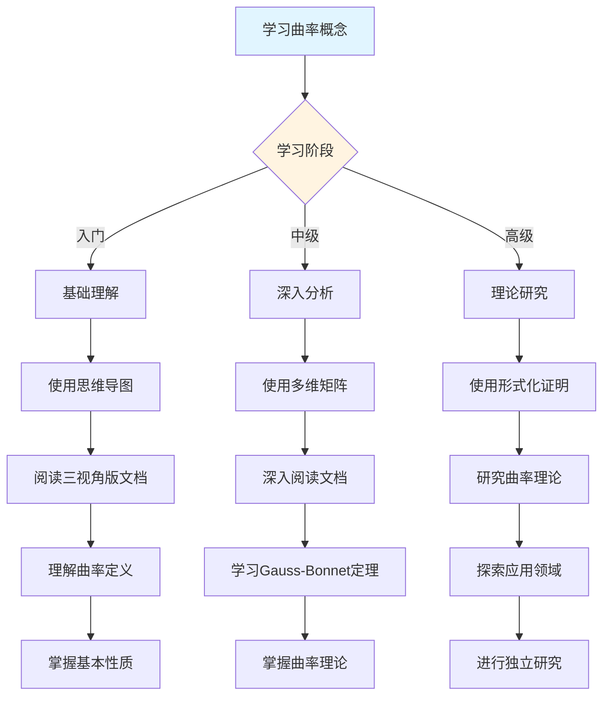
```mermaid
graph TD
    A[学习曲率概念] --> B{学习阶段}
    B -->|入门| C[基础理解]
    B -->|中级| D[深入分析]
    B -->|高级| E[理论研究]

    C --> C1[使用思维导图]
    C1 --> C2[阅读三视角版文档]
    C2 --> C3[理解曲率定义]
    C3 --> C4[掌握基本性质]

    D --> D1[使用多维矩阵]
    D1 --> D2[深入阅读文档]
    D2 --> D3[学习Gauss-Bonnet定理]
    D3 --> D4[掌握曲率理论]

    E --> E1[使用形式化证明]
    E1 --> E2[研究曲率理论]
    E2 --> E3[探索应用领域]
    E3 --> E4[进行独立研究]

    style A fill:#e1f5ff
    style B fill:#fff4e1
```

### 1.2 学习重点决策

**基于知识矩阵的学习重点**：

| 学习阶段 | 知识层次 | 学习重点 | 推荐资源 |
|---------|---------|---------|---------|
| **入门** | L0基础 | 曲率的定义、基本例子 | 思维导图、三视角版文档 |
| **入门** | L0基础 | 曲率的直观理解（弯曲程度、内蕴性） | 三视角版文档、应用实例 |
| **中级** | L1中级 | Gauss-Bonnet定理 | 多维矩阵、形式化证明 |
| **中级** | L1中级 | Theorema Egregium | 三视角版文档、习题库 |
| **高级** | L2高级 | 曲率理论 | 形式化证明系统 |
| **高级** | L2高级 | 曲率与拓扑 | 形式化证明系统 |

### 1.3 学习方法决策

**基于认知维度的学习方法**：

1. **直观维度**（入门阶段）
   - 使用思维导图建立总体框架
   - 使用具体例子理解概念（球面、双曲面、平面）
   - 使用几何直观理解曲率

2. **知性维度**（中级阶段）
   - 使用多维矩阵分析概念特征
   - 使用概念分类系统理解（高斯曲率、平均曲率、主曲率）
   - 使用关系分析建立联系（与黎曼流形、测地线、几何的关系）

3. **理性维度**（高级阶段）
   - 使用形式化证明严格理解
   - 使用逻辑推理深入分析
   - 使用系统建构整体把握

---

## 🔬 二、研究决策导图 (编号: C.CORE.020.DECISION.02)

### 2.1 研究方向决策

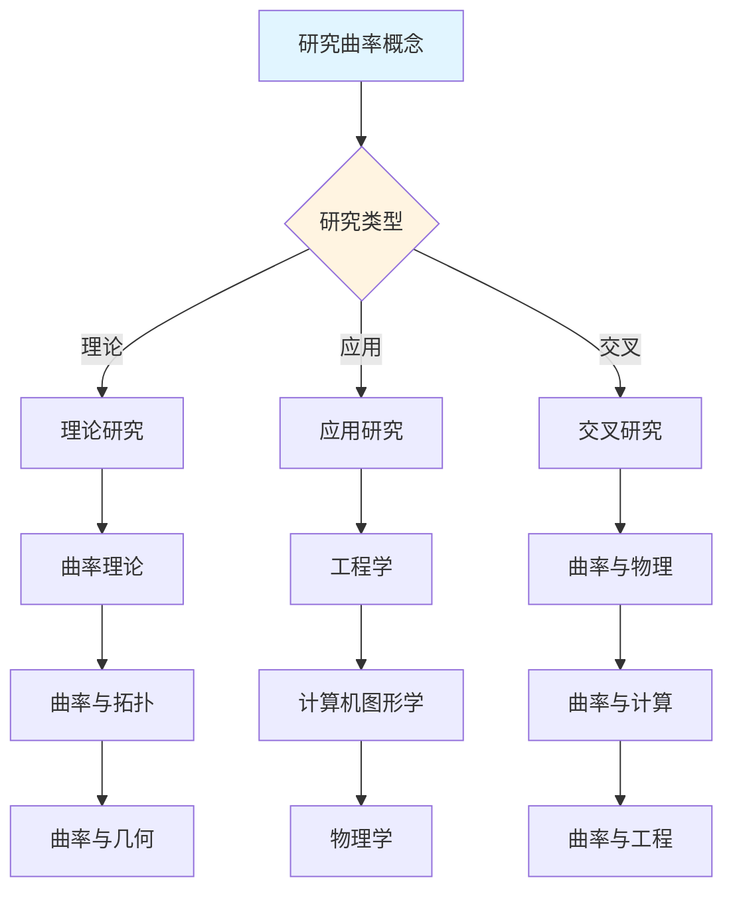
```mermaid
graph TD
    A[研究曲率概念] --> B{研究类型}
    B -->|理论| C[理论研究]
    B -->|应用| D[应用研究]
    B -->|交叉| E[交叉研究]

    C --> C1[曲率理论]
    C1 --> C2[曲率与拓扑]
    C2 --> C3[曲率与几何]

    D --> D1[工程学]
    D1 --> D2[计算机图形学]
    D2 --> D3[物理学]

    E --> E1[曲率与物理]
    E1 --> E2[曲率与计算]
    E2 --> E3[曲率与工程]

    style A fill:#e1f5ff
    style B fill:#fff4e1
```

### 2.2 研究问题决策

**基于知识矩阵的研究问题**：

1. **理论研究问题**
   - 曲率理论：曲率的分类和性质
   - 曲率与拓扑：曲率对拓扑的影响
   - 曲率与几何：曲率在几何中的应用

2. **应用研究问题**
   - 工程学：曲率在工程学中的应用（结构设计中的曲率）
   - 计算机图形学：曲率在计算机图形学中的应用（曲面曲率计算）
   - 物理学：曲率在物理学中的应用（引力理论中的曲率）

3. **交叉研究问题**
   - 曲率与物理：曲率在物理中的应用
   - 曲率与计算：曲率在计算中的应用
   - 曲率与工程：曲率在工程中的应用

### 2.3 研究方法决策

**基于形式化证明的研究方法**：

1. **构造性证明** → 曲率的构造
   - 直接构造曲率
   - 适用于具体曲率

2. **几何方法** → 曲率计算
   - 使用几何方法
   - 适用于曲率计算

3. **分析方法** → 曲率理论
   - 使用分析方法
   - 适用于曲率理论

---

## 💼 三、应用决策导图 (编号: C.CORE.020.DECISION.03)

### 3.1 应用场景决策

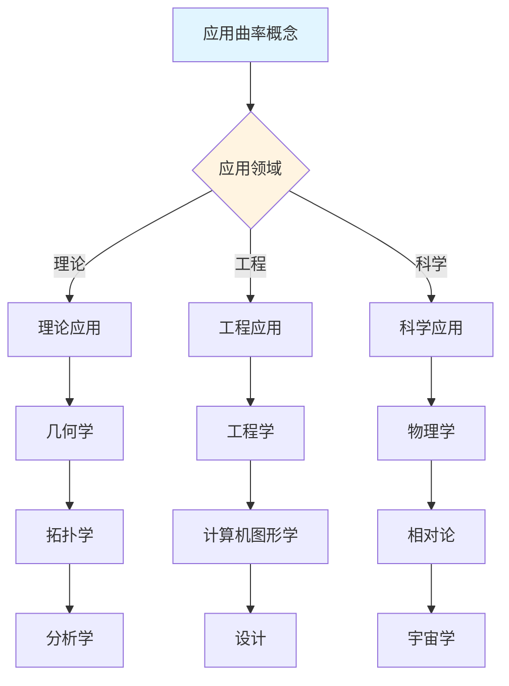
```mermaid
graph TD
    A[应用曲率概念] --> B{应用领域}
    B -->|理论| C[理论应用]
    B -->|工程| D[工程应用]
    B -->|科学| E[科学应用]

    C --> C1[几何学]
    C1 --> C2[拓扑学]
    C2 --> C3[分析学]

    D --> D1[工程学]
    D1 --> D2[计算机图形学]
    D2 --> D3[设计]

    E --> E1[物理学]
    E1 --> E2[相对论]
    E2 --> E3[宇宙学]

    style A fill:#e1f5ff
    style B fill:#fff4e1
```

### 3.2 应用方法决策

**基于应用场景的应用方法**：

1. **理论应用** → 使用形式化证明
   - 几何学：曲率是几何学的基础
   - 拓扑学：曲率在拓扑中的应用
   - 分析学：曲率在分析中的应用

2. **工程应用** → 使用论证过程
   - 工程学：曲率在工程学中的应用（结构设计中的曲率）
   - 计算机图形学：曲率在计算机图形学中的应用（曲面曲率计算）
   - 设计：曲率在设计中的应用

3. **科学应用** → 使用综合方法
   - 物理学：曲率在物理学中的应用（引力理论中的曲率）
   - 相对论：曲率在相对论中的应用
   - 宇宙学：曲率在宇宙学中的应用

---

## 🎓 四、教学决策导图 (编号: C.CORE.020.DECISION.04)

### 4.1 教学内容决策

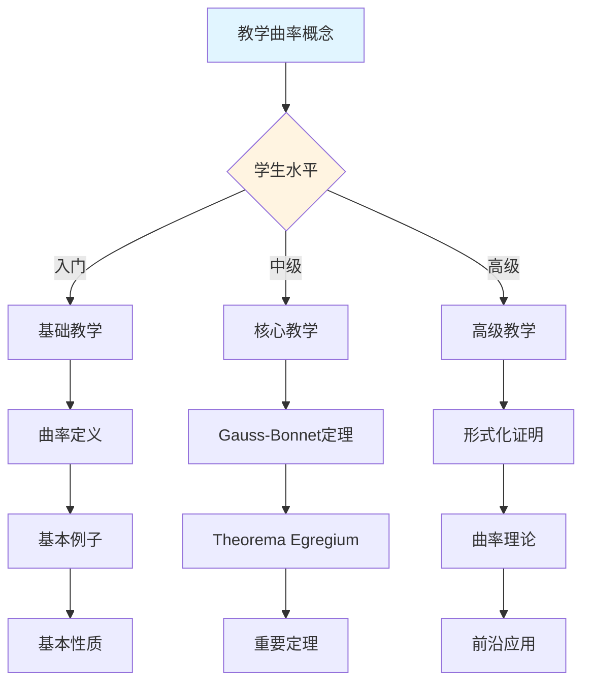
```mermaid
graph TD
    A[教学曲率概念] --> B{学生水平}
    B -->|入门| C[基础教学]
    B -->|中级| D[核心教学]
    B -->|高级| E[高级教学]

    C --> C1[曲率定义]
    C1 --> C2[基本例子]
    C2 --> C3[基本性质]

    D --> D1[Gauss-Bonnet定理]
    D1 --> D2[Theorema Egregium]
    D2 --> D3[重要定理]

    E --> E1[形式化证明]
    E1 --> E2[曲率理论]
    E2 --> E3[前沿应用]

    style A fill:#e1f5ff
    style B fill:#fff4e1
```

### 4.2 教学方法决策

**基于认知维度的教学方法**：

1. **直观维度**（入门教学）
   - 使用思维导图建立框架
   - 使用具体例子（球面、双曲面、平面）
   - 使用几何直观理解

2. **知性维度**（中级教学）
   - 使用多维矩阵深入分析
   - 使用概念分类系统
   - 使用关系分析建立联系

3. **理性维度**（高级教学）
   - 使用形式化证明严格理解
   - 使用逻辑推理深入分析
   - 使用系统建构整体把握

---

## 🔄 五、整合应用示例 (编号: C.CORE.020.DECISION.05)

### 5.1 完整学习流程示例

**阶段1：入门理解**:

1. 使用学习决策导图 → 确定学习路径：基础概念 → 曲率定义 → 基本性质 → 基本应用
2. 使用总体思维导图 → 了解曲率在几何学中的位置
3. 阅读[曲率-三视角版](./20-曲率.md) → 理解曲率的定义和基本性质
4. 使用论证过程 → 理解曲率的直观意义（弯曲程度、内蕴性、几何不变量）

**阶段2：深入分析**:

1. 使用多维矩阵 → 分析曲率的多维度特征（知识层次L0基础层、知识领域D4几何、学习难度较高）
2. 阅读[曲率-三视角版](./20-曲率.md) → 深入理解Gauss-Bonnet定理和Theorema Egregium
3. 使用形式化证明 → 学习曲率相关定理的形式化证明
4. 使用分支关联思维导图 → 了解曲率与黎曼流形、测地线、几何的关系

**阶段3：应用研究**:

1. 使用研究决策导图 → 确定研究方向：曲率理论
2. 使用知识关联网络 → 发现曲率与物理、计算、工程的关系
3. 使用形式化证明系统 → 构建曲率理论体系
4. 阅读[曲率-三视角版](./20-曲率.md) → 了解曲率的历史发展和开放问题

---

## 🔗 六、关联文档 (编号: C.CORE.020.DECISION.06)

### 6.1 核心概念文档

- [曲率-三视角版](./20-曲率.md)
- [曲率](./20-曲率.md)

### 6.2 框架文档

- [决策思维导图体系](../01-总体思维导图/05-决策思维导图体系.md)
- [概念体系全面梳理与推进计划](../00-概念体系全面梳理与推进计划-2025年1月.md)
- [核心概念与新框架整合指南](../00-核心概念与新框架整合指南-2025年1月.md)

### 6.3 相关文档

- [核心概念索引](./00-核心概念索引.md)
- [知识矩阵总览](../02-知识矩阵/00-知识矩阵总览.md)
- [形式化证明系统](../00-形式化证明系统-2025年11月.md)

---

**维护状态**: 持续更新中

