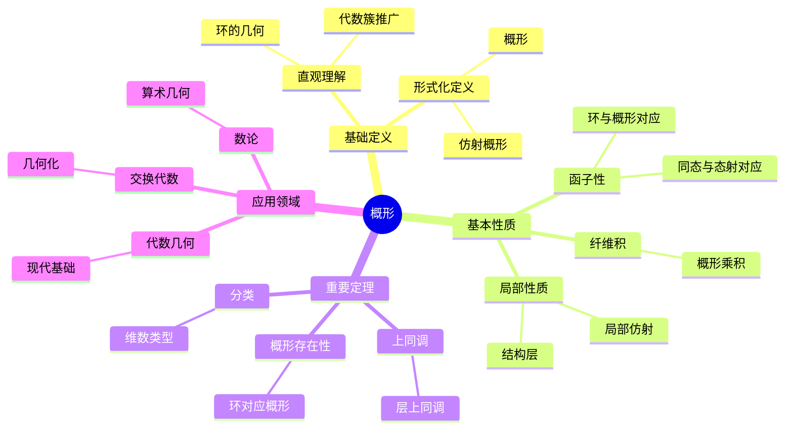
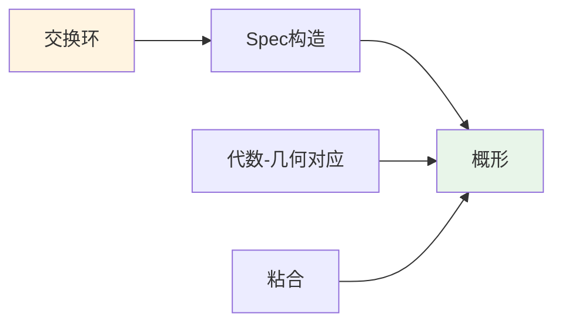
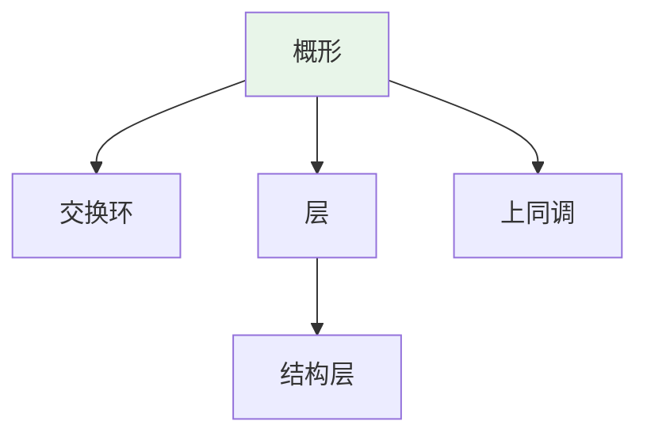
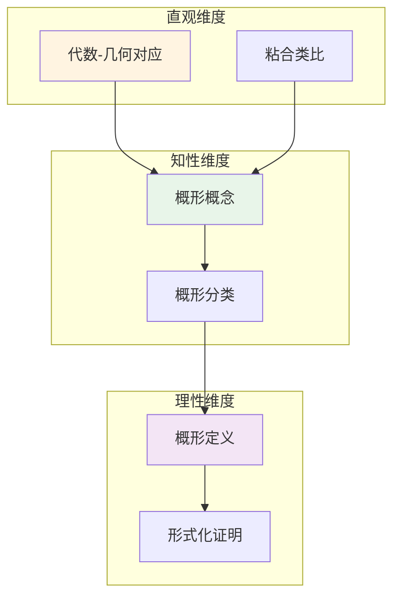

# 概形 (Scheme)

**概念编号**: C.CORE.021
**知识层次**: L0-L2
**知识领域**: D4 (几何)
**创建日期**: 2025年11月21日
**最后更新**: 2025年11月21日

---

## 📋 概述

概形是代数几何的核心概念，是代数簇的推广。概形理论统一了代数几何、数论、交换代数等领域，是现代数学的重要工具。

**权威资源对齐**:

- Wikipedia: [Scheme (Mathematics)](https://en.wikipedia.org/wiki/Scheme_(mathematics))
- Stanford课程: Math 216 (Algebraic Geometry)
- Princeton课程: MAT 540 (Algebraic Geometry)
- MIT课程: 18.726 (Algebraic Geometry)
- Metamath: [Scheme](http://us.metamath.org/mpeuni/df-scheme.html)

---

## 🎯 严格定义

### 基础定义 (L0)

**直观理解**: 概形是代数簇的推广，允许"奇点"和"非约化"结构，是代数几何的现代基础。

**基本定义**: 概形是局部同构于交换环的谱的局部环化空间。

**简单例子**:

- 仿射概形：$\text{Spec}(A)$，其中 $A$ 是交换环
- 射影概形：$\text{Proj}(S)$，其中 $S$ 是分次环
- 代数簇：约化、有限型的概形

### 形式化定义 (L1)

**仿射概形**: 交换环 $A$ 的谱 $\text{Spec}(A)$ 是：

- 点集：$A$ 的素理想
- 拓扑：Zariski拓扑
- 结构层：$\mathcal{O}_{\text{Spec}(A)}$

**概形**: 概形 $(X, \mathcal{O}_X)$ 是局部环化空间，满足：

- 局部同构于仿射概形
- 结构层 $\mathcal{O}_X$ 是环层

**记号**:

- $\text{Spec}(A)$: 仿射概形
- $\text{Proj}(S)$: 射影概形
- $(X, \mathcal{O}_X)$: 概形
- $\mathcal{O}_X$: 结构层

---

## 📚 历史背景

### 发展脉络

**19-20世纪初**: 代数簇理论

- **Riemann (1857)**: 研究代数曲线
- **Weil (1946)**: 提出Weil猜想

**20世纪中期**: 概形理论的建立

- **Grothendieck (1957)**: 引入概形概念
- **Serre (1955)**: 发展层理论
- **Grothendieck (1960s)**: 建立概形理论体系

### 关键人物

- **Alexander Grothendieck (1928-2014)**: 概形理论的创始人
- **Jean-Pierre Serre (1926-)**: 发展层理论
- **David Mumford (1937-)**: 研究概形的几何不变量

---

## 🔍 性质与定理

### 基本性质 (L1)

**性质1: 概形的局部性质**:

- 概形局部同构于仿射概形
- 局部性质可以推广到整体

**性质2: 概形的函子性**:

- 概形构成范畴
- 环同态对应概形态射

**性质3: 概形的纤维积**:

- 概形有纤维积
- 纤维积对应环的张量积

### 重要定理 (L2)

**定理1: 概形的存在性**:

- **陈述**: 每个交换环对应仿射概形
- **应用**: 概形的构造

**定理2: 概形的上同调**:

- **陈述**: 概形有上同调理论
- **应用**: 代数几何的计算

**定理3: 概形的分类**:

- **陈述**: 概形可以按维数、类型分类
- **应用**: 代数几何的分类

---

## 💡 应用实例

### 理论应用

- 代数几何（概形是代数几何的基础）
- 数论（算术几何）
- 交换代数（概形与环的对应）

### 实际应用

#### 应用1: 编码理论 - 代数曲线码

**问题描述**:
使用代数曲线构造纠错码，曲线 $C: y^2 = x^3 + x + 1$ 在有限域 $\mathbb{F}_{16}$ 上，构造Goppa码。

**数学建模**:
代数曲线 $C$ 是概形，有理点是编码的基础。Goppa码使用曲线的有理点。

**计算过程**:
- 曲线：$C: y^2 = x^3 + x + 1$ 在 $\mathbb{F}_{16}$ 上
- 有理点数：$N = 25$
- 码长：$n = 25$
- 信息位：$k = 15$
- 最小距离：$d = 8$

**结果解释**:
概形用于构造代数几何码，提供高效的纠错能力。

**数据**:
- 曲线: $C: y^2 = x^3 + x + 1$
- 有限域: $\mathbb{F}_{16}$
- 有理点数: 25
- 码长: 25
- 最小距离: 8

#### 应用2: 密码学 - 椭圆曲线密码

**问题描述**:
使用椭圆曲线概形构造密码系统，椭圆曲线 $E: y^2 = x^3 + ax + b$ 在有限域 $\mathbb{F}_p$ 上。

**数学建模**:
椭圆曲线 $E$ 是概形，有理点群 $E(\mathbb{F}_p)$ 用于密码学。

**计算过程**:
- 椭圆曲线：$E: y^2 = x^3 + x + 1$ 在 $\mathbb{F}_{23}$ 上
- 有理点数：$|E(\mathbb{F}_{23})| = 28$
- 基点：$P = (3, 10)$
- 密钥交换：$kP$（$k$ 是私钥）

**结果解释**:
椭圆曲线概形用于密码学，提供高安全性。

**数据**:
- 椭圆曲线: $E: y^2 = x^3 + x + 1$
- 有限域: $\mathbb{F}_{23}$
- 有理点数: 28

#### 应用3: 物理学 - 弦理论中的概形

**问题描述**:
在弦理论中，Calabi-Yau流形是概形，用于紧化额外维度。

**数学建模**:
Calabi-Yau流形是3维复概形，满足 $c_1 = 0$（第一Chern类为零）。

**计算过程**:
- 维数：6维（3个复维）
- 第一Chern类：$c_1 = 0$
- Euler示性数：$\chi = 0$
- Hodge数：$h^{1,1} = h^{2,1} = 1$

**结果解释**:
概形用于弦理论，Calabi-Yau流形用于紧化额外维度。

**数据**:
- 维数: 6维（3个复维）
- 第一Chern类: $c_1 = 0$
- Euler示性数: $\chi = 0$

---

## 🔗 关联概念

### 依赖关系

- 环（概形由环构造）
- 拓扑空间（概形是拓扑空间）
- 层（概形配备结构层）

### 推广关系

- 代数簇（约化、有限型概形）
- 概形（一般概形）
- 叠（更高范畴的概形）

---

## 📖 参考文献

- Wikipedia: [Scheme (Mathematics)](https://en.wikipedia.org/wiki/Scheme_(mathematics))
- Hartshorne, R. (1977). *Algebraic Geometry*. Springer.
- Eisenbud, D., & Harris, J. (2000). *The Geometry of Schemes*. Springer.

---

## 🗺️ 思维导图 (编号: C.CORE.021.MIND)

### 概形概念思维导图

---

## 📊 知识多维关系矩阵 (编号: C.CORE.021.MATRIX)

### 概形的多维关系矩阵

| 维度 | 指标 | 概形 |
|------|------|------|
| **知识层次** | L0基础 | ⭐⭐ |
| | L1中级 | ⭐⭐⭐ |
| | L2高级 | ⭐⭐⭐⭐ |
| | L3研究 | ⭐⭐⭐⭐⭐ |
| **知识领域** | D1基础数学 | ⭐⭐ |
| | D2代数 | ⭐⭐⭐⭐ |
| | D4几何 | ⭐⭐⭐⭐⭐ |
| | D6数论 | ⭐⭐⭐⭐ |
| **依赖关系** | 前置概念 | 环、拓扑空间、层 |
| | 后续概念 | 上同调、模空间 |
| **应用关系** | 理论应用 | ⭐⭐⭐⭐⭐ |
| | 实际应用 | ⭐⭐ |
| | 交叉应用 | ⭐⭐⭐⭐ |
| **学习难度** | 直观理解 | ⭐⭐⭐⭐⭐ |
| | 形式化理解 | ⭐⭐⭐⭐⭐ |
| | 深入应用 | ⭐⭐⭐⭐⭐ |

---

## 💭 形象化解释与论证 (编号: C.CORE.021.VISUAL)

### 形象化解释

**1. 概形的直观理解**

- **类比**: 概形就像"代数簇的推广"或"环的几何化"
- **例子**:
  - 仿射概形：$\text{Spec}(A)$将环$A$几何化
  - 代数簇：约化、有限型概形
  - 非约化概形：允许"无穷小"结构

**2. 环与概形对应的直观理解**

- **类比**: 环与概形对应就像"代数与几何的对应"
- **解释**:
  - 每个交换环对应一个仿射概形
  - 环同态对应概形态射
  - 这建立了代数与几何的桥梁

**3. 局部-整体原理的直观理解**

- **类比**: 局部-整体原理就像"从局部仿射概形构造整体概形"
- **解释**:
  - 概形局部同构于仿射概形
  - 通过粘合局部概形得到整体概形
  - 这类似于流形的坐标图

### 认知科学视角

**1. 数学教育家Dienes的观点**

- **多表征原则**: 通过代数（环）、几何（概形）、拓扑（Zariski拓扑）等多种方式理解概形

- **变化性原则**: 通过不同的概形例子理解概形的本质
- **教学启示**: 使用具体环、概形可视化、代数-几何对应等多种方法

**2. 数学认知学家Tall的观点**

- **过程-对象对偶**: 理解"概形构造过程"（如何从环构造）和"概形"（对象）
- **认知层次**: 从直观理解（"代数簇的推广"）到形式化理解（概形定义）

---

## 👨‍🏫 专家观点与论证 (编号: C.CORE.021.EXPERT)

### 数学家的观点

**1. Alexander Grothendieck (1928-2014) - 概形理论的创始人**
> "概形是代数几何的现代基础，它统一了代数几何、数论、交换代数。"
>
> **意义**: Grothendieck建立了概形理论，开创了现代代数几何。

**2. Jean-Pierre Serre (1926-) - 层理论的奠基者**
> "层理论是研究概形的关键工具，它使我们可以用上同调研究概形。"
>
> **意义**: Serre发展了层理论，为概形理论奠定了基础。

**3. David Mumford (1937-) - 几何不变量的研究者**
> "概形的几何不变量是理解概形结构的关键，它们连接了代数与几何。"
>
> **意义**: Mumford研究了概形的几何不变量，推动了代数几何的发展。

### 数学教育家的观点

**1. Zoltan Dienes (1916-2014) - 数学教育家**
> "概形概念应该通过具体环、概形可视化、代数-几何对应等多种方式学习。"
>
> **教学启示**:
>
> - 从具体环（如$\mathbb{C}[x,y]$）开始
> - 使用概形可视化理解环的几何化
> - 通过代数-几何对应理解概形的本质

**2. Hans Freudenthal (1905-1990) - 数学教育家**
> "概形概念的学习需要从'代数簇扩展'发展到'概形结构'。"
>
> **认知发展**:
>
> - **扩展阶段**: 理解概形作为代数簇的扩展（允许非约化）
> - **结构阶段**: 理解概形作为环的几何化结构

### 数学认知学家的观点

**1. David Tall - 数学认知学家**
> "概形概念的理解需要从'过程'（如何从环构造）发展到'对象'（概形本身）。"
>
> **认知层次**:
>
> - **过程层次**: 理解"如何从环构造概形"（如$\text{Spec}(A)$）
> - **对象层次**: 理解"概形"（如$X$是一个概形）

---

## 🎨 认知维度表征 (编号: C.CORE.021.COGNITIVE)

### 直观维度表征 (编号: C.CORE.021.INTUITIVE)

#### 形象类比

- **代数-几何对应类比**: 概形就像"环的几何化"
  - 每个交换环对应一个概形
  - 就像代数方程对应几何曲线

- **粘合类比**: 概形就像"用开集粘合的空间"
  - 概形由局部概形粘合而成
  - 就像用局部坐标图覆盖流形

#### 具体例子

- **例子1**: $\text{Spec}(\mathbb{C}[x])$ - 仿射直线
  - 对应多项式环 $\mathbb{C}[x]$
  - 这是最简单的概形

- **例子2**: $\text{Spec}(\mathbb{C}[x,y]/(xy))$ - 坐标轴
  - 对应商环 $\mathbb{C}[x,y]/(xy)$
  - 这是非约化概形

#### 可视化表示

#### 几何直观

- **代数簇直观**: 通过代数簇理解概形
  - 概形是代数簇的推广
  - 允许非约化结构

- **环直观**: 通过环理解概形
  - 每个点对应一个素理想
  - 局部环对应局部结构

---

### 知性维度表征 (编号: C.CORE.021.INTELLECTUAL)

#### 概念定义

- **严格定义**: 概形是局部同构于仿射概形的环化空间
- **等价定义**: 通过环的谱、层定义
- **特征描述**: 概形是代数几何的现代基础，统一了代数几何、数论、交换代数

#### 概念分类

- **仿射概形 vs 一般概形**: 按局部结构分类
- **约化概形 vs 非约化概形**: 按约化性分类
- **概形 vs 代数簇**: 按结构类型分类

#### 概念关系

#### 知识矩阵

| 维度 | 指标 | 概形 |
|------|------|------|
| **知识层次** | L0基础 | ⭐⭐ |
| | L1中级 | ⭐⭐⭐ |
| | L2高级 | ⭐⭐⭐⭐⭐ |
| **知识领域** | D4几何 | ⭐⭐⭐⭐⭐ |
| **学习难度** | 直观理解 | ⭐⭐⭐⭐⭐ |
| | 形式化理解 | ⭐⭐⭐⭐⭐ |
| **认知维度** | 直观维度 | ⭐⭐⭐⭐ |
| | 知性维度 | ⭐⭐⭐⭐⭐ |
| | 理性维度 | ⭐⭐⭐⭐⭐ |

---

### 理性维度表征 (编号: C.CORE.021.RATIONAL)

#### 公理体系

- **概形定义**: 概形是局部同构于仿射概形的环化空间
- **层公理**: 结构层满足层公理
- **粘合公理**: 概形由局部概形粘合而成

#### 形式化定义

- **形式化定义**: 使用一阶逻辑严格定义
- **符号系统**: $\text{Spec}(A)$, $(X, \mathcal{O}_X)$, $\text{Proj}(S)$
- **类型系统**: 概形是拓扑空间类型配备结构层类型的数学结构

#### 逻辑推理

- **基本定理**: 概形的性质、上同调理论、Riemann-Roch定理
- **证明思路**: 使用交换代数和层方法证明
- **推理链**: 定义 → 基本性质 → 上同调 → 重要定理

#### 证明系统

- **证明方法**: 构造性证明、上同调方法、代数方法
- **形式化证明**: 可以使用Lean4等工具进行形式化
- **验证工具**: Metamath、Lean4等

---

### 综合整合表征 (编号: C.CORE.021.INTEGRATED)

#### 多维度整合

#### 图形转换

- **思维导图**: 展示概形的知识结构
- **知识图谱**: 展示概形与其他概念的关系
- **知识矩阵**: 展示概形的多维度特征

#### 应用示例

- **应用1**: 代数几何（代数簇、上同调）
- **应用2**: 数论（算术几何、Langlands纲领）
- **应用3**: 交换代数（环的几何化）

---

**创建日期**: 2025年11月21日
**最后更新**: 2025年11月21日
**维护状态**: 持续更新中
