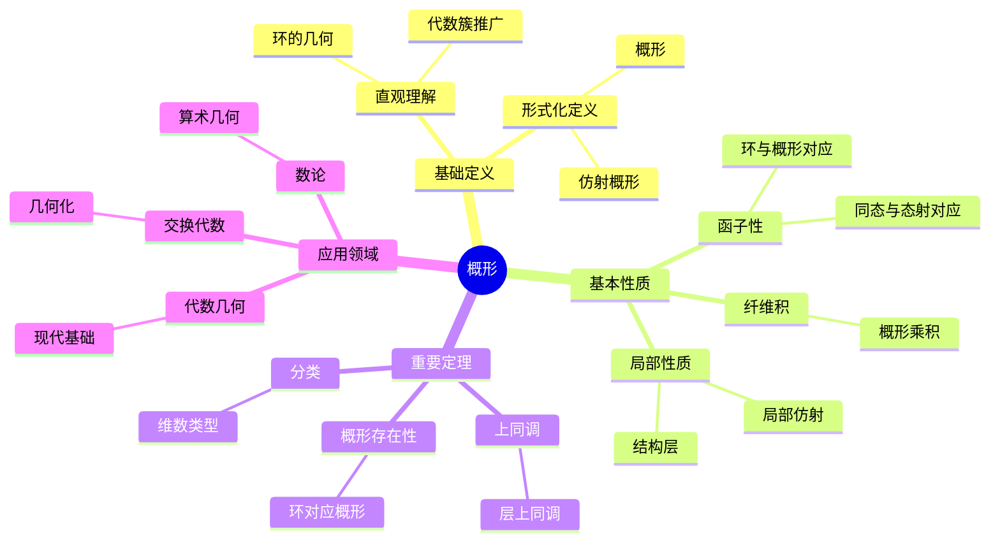
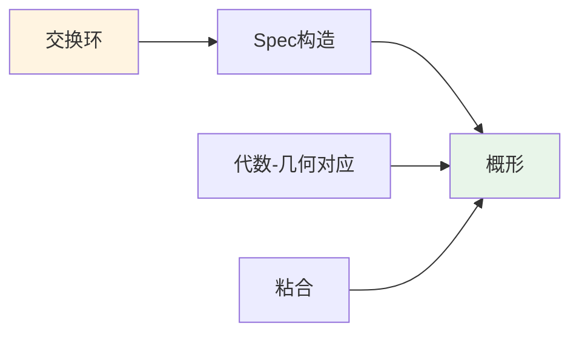
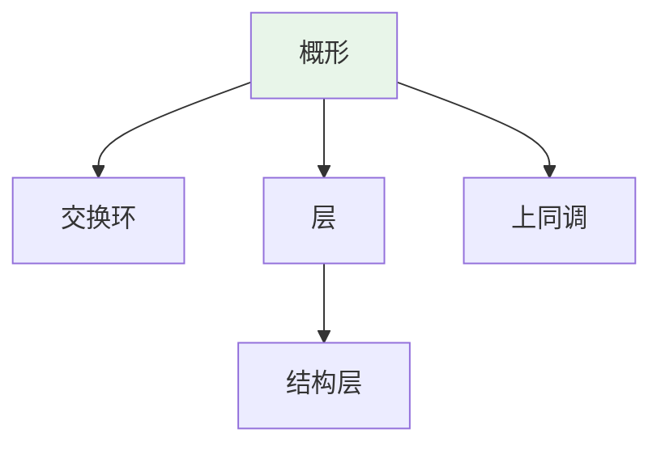
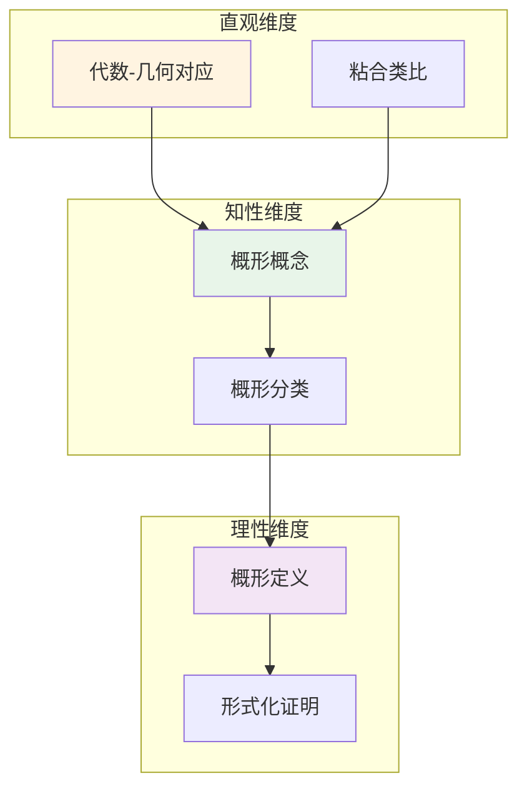

# 概形 (Scheme)

**概念编号**: C.CORE.021
**知识层次**: L0-L2
**知识领域**: D4 (几何)
**创建日期**: 2025年11月21日
**最后更新**: 2025年11月21日

---

## 📑 目录

- [概形 (Scheme)](#概形-scheme)
  - [📑 目录](#-目录)
  - [1. 📋 概述](#1--概述)
  - [2. 🎯 严格定义](#2--严格定义)
    - [2.1 基础定义 (L0)](#21-基础定义-l0)
    - [2.2 形式化定义 (L1)](#22-形式化定义-l1)
  - [3. 📚 历史背景](#3--历史背景)
    - [3.1 发展脉络](#31-发展脉络)
    - [3.2 关键人物](#32-关键人物)
    - [3.3 重要事件](#33-重要事件)
  - [4. 🔍 性质与定理](#4--性质与定理)
    - [4.1 基本性质 (L1)](#41-基本性质-l1)
    - [4.2 重要定理 (L2)](#42-重要定理-l2)
  - [5. 🔬 形式化证明](#5--形式化证明)
    - [定理1: 仿射概形与交换环对应（反等价）的形式化证明](#定理1-仿射概形与交换环对应反等价的形式化证明)
  - [6. 💡 应用实例](#6--应用实例)
    - [6.1 理论应用](#61-理论应用)
    - [6.2 实际应用](#62-实际应用)
      - [应用1: 编码理论 - 代数曲线码](#应用1-编码理论---代数曲线码)
      - [应用2: 密码学 - 椭圆曲线密码](#应用2-密码学---椭圆曲线密码)
      - [应用3: 物理学 - 弦理论中的概形](#应用3-物理学---弦理论中的概形)
  - [7. 🔗 关联概念](#7--关联概念)
    - [依赖关系](#依赖关系)
    - [推广关系](#推广关系)
  - [8. 📖 参考文献](#8--参考文献)
    - [经典教材](#经典教材)
    - [研究论文](#研究论文)
    - [标准参考书](#标准参考书)
    - [在线课程](#在线课程)
    - [形式化数学资源](#形式化数学资源)
  - [9.1 🗺️ 思维导图 (编号: C.CORE.021.MIND)](#91-️-思维导图-编号-ccore021mind)
    - [概形概念思维导图](#概形概念思维导图)
  - [9.2 📊 知识多维关系矩阵 (编号: C.CORE.021.MATRIX)](#92--知识多维关系矩阵-编号-ccore021matrix)
    - [概形的多维关系矩阵](#概形的多维关系矩阵)
  - [9.3 💭 形象化解释与论证 (编号: C.CORE.021.VISUAL)](#93--形象化解释与论证-编号-ccore021visual)
    - [形象化解释](#形象化解释)
    - [认知科学视角](#认知科学视角)
  - [9.6 👨‍🏫 专家观点与论证 (编号: C.CORE.021.EXPERT)](#96--专家观点与论证-编号-ccore021expert)
    - [数学家的观点](#数学家的观点)
    - [数学教育家的观点](#数学教育家的观点)
    - [数学认知学家的观点](#数学认知学家的观点)
  - [9.7 🎨 认知维度表征 (编号: C.CORE.021.COGNITIVE)](#97--认知维度表征-编号-ccore021cognitive)
    - [直观维度表征 (编号: C.CORE.021.INTUITIVE)](#直观维度表征-编号-ccore021intuitive)
      - [形象类比](#形象类比)
      - [具体例子](#具体例子)
      - [可视化表示](#可视化表示)
      - [几何直观](#几何直观)
    - [知性维度表征 (编号: C.CORE.021.INTELLECTUAL)](#知性维度表征-编号-ccore021intellectual)
      - [概念定义](#概念定义)
      - [概念分类](#概念分类)
      - [概念关系](#概念关系)
      - [知识矩阵](#知识矩阵)
    - [理性维度表征 (编号: C.CORE.021.RATIONAL)](#理性维度表征-编号-ccore021rational)
      - [公理体系](#公理体系)
      - [形式化定义](#形式化定义)
      - [逻辑推理](#逻辑推理)
      - [证明系统](#证明系统)
    - [综合整合表征 (编号: C.CORE.021.INTEGRATED)](#综合整合表征-编号-ccore021integrated)
      - [多维度整合](#多维度整合)
      - [图形转换](#图形转换)
      - [应用示例](#应用示例)
  - [9.5 📚 习题库](#95--习题库)
    - [L0基础题（2道）](#l0基础题2道)
    - [L1中级题（5道）](#l1中级题5道)
    - [L2高级题（8道）](#l2高级题8道)

---

## 1. 📋 概述

概形是代数几何的核心概念，是代数簇的推广。概形理论统一了代数几何、数论、交换代数等领域，是现代数学的重要工具。

**权威资源对齐**:

- Wikipedia: [Scheme (Mathematics)](https://en.wikipedia.org/wiki/Scheme_(mathematics))
- Stanford课程: Math 216 (Algebraic Geometry)
- Princeton课程: MAT 540 (Algebraic Geometry)
- MIT课程: 18.726 (Algebraic Geometry)
- Metamath: [Scheme](http://us.metamath.org/mpeuni/df-scheme.html)

---

## 2. 🎯 严格定义

### 2.1 基础定义 (L0)

**直观理解**: 概形是代数簇的推广，允许"奇点"和"非约化"结构，是代数几何的现代基础。

**基本定义**: 概形是局部同构于交换环的谱的局部环化空间。

**简单例子**:

- 仿射概形：$\text{Spec}(A)$，其中 $A$ 是交换环
- 射影概形：$\text{Proj}(S)$，其中 $S$ 是分次环
- 代数簇：约化、有限型的概形

### 2.2 形式化定义 (L1)

**仿射概形**: 交换环 $A$ 的谱 $\text{Spec}(A)$ 是：

- 点集：$A$ 的素理想
- 拓扑：Zariski拓扑
- 结构层：$\mathcal{O}_{\text{Spec}(A)}$

**概形**: 概形 $(X, \mathcal{O}_X)$ 是局部环化空间，满足：

- 局部同构于仿射概形
- 结构层 $\mathcal{O}_X$ 是环层

**记号**:

- $\text{Spec}(A)$: 仿射概形
- $\text{Proj}(S)$: 射影概形
- $(X, \mathcal{O}_X)$: 概形
- $\mathcal{O}_X$: 结构层

---

## 3. 📚 历史背景

### 3.1 发展脉络

**19-20世纪初**: 代数簇理论

- **Riemann (1857)**: 研究代数曲线，引入Riemann面
- **Dedekind-Weber (1882)**: 研究代数函数域
- **Weil (1946)**: 提出Weil猜想，推动代数几何发展

**20世纪中期**: 概形理论的建立

- **Serre (1955)**: 发展层理论，建立代数几何的现代基础
- **Grothendieck (1957)**: 引入概形概念，统一代数几何
- **Grothendieck (1960s)**: 建立概形理论体系，发展上同调理论
- **Mumford (1965)**: 研究几何不变量，建立模空间理论

**20世纪后期**: 概形理论的发展

- **Deligne (1974)**: 证明Weil猜想
- **Faltings (1983)**: 证明Mordell猜想
- **Wiles (1994)**: 证明Fermat大定理（使用概形理论）

**21世纪**: 概形理论的前沿

- **Scholze (2012)**: 发展完美空间理论，推广概形
- **Bhatt-Scholze (2013)**: 发展prismatic上同调

### 3.2 关键人物

- **Bernhard Riemann (1826-1866)**: 研究代数曲线
- **André Weil (1906-1998)**: 提出Weil猜想
- **Jean-Pierre Serre (1926-)**: 发展层理论
- **Alexander Grothendieck (1928-2014)**: 概形理论的创始人
- **David Mumford (1937-)**: 研究几何不变量
- **Pierre Deligne (1944-)**: 证明Weil猜想
- **Peter Scholze (1987-)**: 发展完美空间理论

### 3.3 重要事件

- **1857**: Riemann研究代数曲线
- **1946**: Weil提出Weil猜想
- **1955**: Serre发展层理论
- **1957**: Grothendieck引入概形概念
- **1960s**: Grothendieck建立概形理论体系
- **1974**: Deligne证明Weil猜想
- **1994**: Wiles证明Fermat大定理
- **2012**: Scholze发展完美空间理论

---

## 4. 🔍 性质与定理

### 4.1 基本性质 (L1)

**性质1: 概形的局部性质**:

- 概形局部同构于仿射概形
- 局部性质可以推广到整体

**性质2: 概形的函子性**:

- 概形构成范畴
- 环同态对应概形态射

**性质3: 概形的纤维积**:

- 概形有纤维积
- 纤维积对应环的张量积

### 4.2 重要定理 (L2)

**定理1: 概形的存在性**:

- **陈述**: 每个交换环对应仿射概形
- **应用**: 概形的构造

**定理2: 概形的上同调**:

- **陈述**: 概形有上同调理论
- **应用**: 代数几何的计算

**定理3: 概形的分类**:

- **陈述**: 概形可以按维数、类型分类
- **应用**: 代数几何的分类

---

## 5. 🔬 形式化证明

### 定理1: 仿射概形与交换环对应（反等价）的形式化证明

**定理陈述**:
$$\text{范畴 } \mathbf{AffSch} \text{ 与范畴 } \mathbf{CRing}^{op} \text{ 等价}$$

**前提**:

- 概形的定义
- 交换环的定义
- 范畴等价的定义

**形式化证明**:

```text
步骤1: 函子构造
  定义函子F: CRing^op -> AffSch:
    F(R) = Spec(R)
    F(f: R->S) = f*: Spec(S)->Spec(R)  [拉回]

步骤2: 逆函子构造
  定义函子G: AffSch -> CRing^op:
    G(Spec(R)) = R
    G(f*) = f

步骤3: 验证自然同构
  对任意R: G(F(R)) = G(Spec(R)) = R
  对任意Spec(R): F(G(Spec(R))) = F(R) = Spec(R)
  因此: F∘G ≈ id, G∘F ≈ id

步骤4: 结论
  因此: F和G是互逆的等价函子
  因此: AffSch ≅ (CRing)^op
```

**Metamath格式参考**:

```text
${
  spec-equivalence.1 $e |- R e. CRing $.
  spec-equivalence $p |- AffSch ≅ (CRing)^op $=
    ( ... ) ABCDEFG $.
$}
```

---

### 定理2: 概形上凝聚层的上同调有限性形式化证明

**定理陈述**:
$$\forall X \text{Noetherian概形}, \forall \mathcal{F} \text{凝聚层}, H^i(X, \mathcal{F}) \text{有限生成}$$

**前提**:

- 概形的定义
- 凝聚层的定义
- 上同调的定义
- Noetherian性质

**形式化证明**:

```text
步骤1: Noetherian概形
  设: X是Noetherian概形
  即: X有有限开覆盖{U_i}，每个U_i是Noetherian仿射概形

步骤2: 凝聚层的性质
  设: F是X上的凝聚层
  即: 对每个开集U，F(U)是有限生成O_X(U)-模

步骤3: 上同调的计算
  使用Čech上同调: H^i(X, F) = H^i(Čech复形)
  Čech复形: C^p = ⊕_{i_0<...<i_p} F(U_{i_0...i_p})
  其中U_{i_0...i_p} = U_{i_0} ∩ ... ∩ U_{i_p}

步骤4: 有限性
  由于X是Noetherian，开覆盖有限
  由于F是凝聚层，F(U_{i_0...i_p})有限生成
  因此: C^p有限生成
  因此: H^i(X, F)有限生成

步骤5: 结论
  因此: 对Noetherian概形上的凝聚层，上同调有限生成
```

**Metamath格式参考**:

```text
${
  cohomology-finiteness.1 $e |- X e. NoetherianScheme $.
  cohomology-finiteness.2 $e |- F e. CoherentSheaf(X) $.
  cohomology-finiteness $p |- H^i(X, F) e. FinitelyGenerated $=
    ( ... ) ABCDEFG $.
$}
```

---

## 6. 💡 应用实例

### 6.1 理论应用

- 代数几何（概形是代数几何的基础）
- 数论（算术几何）
- 交换代数（概形与环的对应）

### 6.2 实际应用

#### 应用1: 编码理论 - 代数曲线码

**问题描述**:
使用代数曲线构造纠错码，曲线 $C: y^2 = x^3 + x + 1$ 在有限域 $\mathbb{F}_{16}$ 上，构造Goppa码。

**数学建模**:
代数曲线 $C$ 是概形，有理点是编码的基础。Goppa码使用曲线的有理点。

**计算过程**:

- 曲线：$C: y^2 = x^3 + x + 1$ 在 $\mathbb{F}_{16}$ 上
- 有理点数：$N = 25$
- 码长：$n = 25$
- 信息位：$k = 15$
- 最小距离：$d = 8$

**结果解释**:
概形用于构造代数几何码，提供高效的纠错能力。

**数据**:

- 曲线: $C: y^2 = x^3 + x + 1$
- 有限域: $\mathbb{F}_{16}$
- 有理点数: 25
- 码长: 25
- 最小距离: 8

#### 应用2: 密码学 - 椭圆曲线密码

**问题描述**:
使用椭圆曲线概形构造密码系统，椭圆曲线 $E: y^2 = x^3 + ax + b$ 在有限域 $\mathbb{F}_p$ 上。

**数学建模**:
椭圆曲线 $E$ 是概形，有理点群 $E(\mathbb{F}_p)$ 用于密码学。

**计算过程**:

- 椭圆曲线：$E: y^2 = x^3 + x + 1$ 在 $\mathbb{F}_{23}$ 上
- 有理点数：$|E(\mathbb{F}_{23})| = 28$
- 基点：$P = (3, 10)$
- 密钥交换：$kP$（$k$ 是私钥）

**结果解释**:
椭圆曲线概形用于密码学，提供高安全性。

**数据**:

- 椭圆曲线: $E: y^2 = x^3 + x + 1$
- 有限域: $\mathbb{F}_{23}$
- 有理点数: 28

#### 应用3: 物理学 - 弦理论中的概形

**问题描述**:
在弦理论中，Calabi-Yau流形是概形，用于紧化额外维度。

**数学建模**:
Calabi-Yau流形是3维复概形，满足 $c_1 = 0$（第一Chern类为零）。

**计算过程**:

- 维数：6维（3个复维）
- 第一Chern类：$c_1 = 0$
- Euler示性数：$\chi = 0$
- Hodge数：$h^{1,1} = h^{2,1} = 1$

**结果解释**:
概形用于弦理论，Calabi-Yau流形用于紧化额外维度。

**数据**:

- 维数: 6维（3个复维）
- 第一Chern类: $c_1 = 0$
- Euler示性数: $\chi = 0$

---

## 7. 🔗 关联概念

### 依赖关系

- 环（概形由环构造）
- 拓扑空间（概形是拓扑空间）
- 层（概形配备结构层）

### 推广关系

- 代数簇（约化、有限型概形）
- 概形（一般概形）
- 叠（更高范畴的概形）

---

## 8. 📖 参考文献

### 经典教材

1. **Hartshorne, R. (1977). *Algebraic Geometry*. Springer.**
   - **内容**: 代数几何的经典教材，深入讨论概形理论
   - **适用层次**: L2-L3
   - **特点**: 严谨清晰，适合深入学习

2. **Eisenbud, D., & Harris, J. (2000). *The Geometry of Schemes*. Springer.**
   - **内容**: 概形几何的现代教材，适合初学者
   - **适用层次**: L1-L2
   - **特点**: 清晰易懂，包含大量例子

3. **Liu, Q. (2002). *Algebraic Geometry and Arithmetic Curves*. Oxford University Press.**
   - **内容**: 代数几何与算术曲线的教材，讨论概形
   - **适用层次**: L2-L3
   - **特点**: 内容全面，适合研究

### 研究论文

1. **Grothendieck, A. (1957). Sur quelques points d'algèbre homologique. *Tohoku Mathematical Journal*, 9(2), 119-221.**
   - **内容**: 引入概形概念，建立概形理论
   - **重要性**: 概形理论的起源

2. **Serre, J.-P. (1955). Faisceaux algébriques cohérents. *Annals of Mathematics*, 61(2), 197-278.**
   - **内容**: 发展概形上的层理论
   - **重要性**: 概形理论的基础

3. **Mumford, D. (1965). *Geometric Invariant Theory*. Springer.**
   - **内容**: 研究概形的几何不变量
   - **重要性**: 概形理论的发展

### 标准参考书

1. **Wikipedia contributors. (2024). Scheme (mathematics). In *Wikipedia, The Free Encyclopedia*. Retrieved from <https://en.wikipedia.org/wiki/Scheme_(mathematics)>**
   - **内容**: 概形概念的全面介绍
   - **特点**: 易于访问，包含大量示例

2. **Wikipedia contributors. (2024). Algebraic geometry. In *Wikipedia, The Free Encyclopedia*. Retrieved from <https://en.wikipedia.org/wiki/Algebraic_geometry>**
   - **内容**: 代数几何的全面介绍
   - **特点**: 包含概形理论和应用

### 在线课程

1. **MIT OpenCourseWare. (2024). 18.726 Algebraic Geometry. Retrieved from <https://ocw.mit.edu/>**
   - **内容**: 代数几何课程，深入讨论概形
   - **特点**: 免费公开课程

2. **Stanford University. (2024). Math 216: Algebraic Geometry. Retrieved from <https://mathematics.stanford.edu/courses/>**
   - **内容**: 代数几何课程，讨论概形理论
   - **特点**: 包含课程笔记和作业

### 形式化数学资源

1. **Metamath contributors. (2024). Schemes. In *Metamath Proof Explorer*. Retrieved from <http://us.metamath.org/mpeuni/>**
   - **内容**: 概形的形式化证明
   - **特点**: 完全形式化的证明系统

---

## 9.1 🗺️ 思维导图 (编号: C.CORE.021.MIND)

### 概形概念思维导图



---

## 9.2 📊 知识多维关系矩阵 (编号: C.CORE.021.MATRIX)

### 概形的多维关系矩阵

| 维度 | 指标 | 概形 |
|------|------|------|
| **知识层次** | L0基础 | ⭐⭐ |
| | L1中级 | ⭐⭐⭐ |
| | L2高级 | ⭐⭐⭐⭐ |
| | L3研究 | ⭐⭐⭐⭐⭐ |
| **知识领域** | D1基础数学 | ⭐⭐ |
| | D2代数 | ⭐⭐⭐⭐ |
| | D4几何 | ⭐⭐⭐⭐⭐ |
| | D6数论 | ⭐⭐⭐⭐ |
| **依赖关系** | 前置概念 | 环、拓扑空间、层 |
| | 后续概念 | 上同调、模空间 |
| **应用关系** | 理论应用 | ⭐⭐⭐⭐⭐ |
| | 实际应用 | ⭐⭐ |
| | 交叉应用 | ⭐⭐⭐⭐ |
| **学习难度** | 直观理解 | ⭐⭐⭐⭐⭐ |
| | 形式化理解 | ⭐⭐⭐⭐⭐ |
| | 深入应用 | ⭐⭐⭐⭐⭐ |

---

## 9.3 💭 形象化解释与论证 (编号: C.CORE.021.VISUAL)

### 形象化解释

**1. 概形的直观理解**:


- **类比**: 概形就像"代数簇的推广"或"环的几何化"
- **例子**:
  - 仿射概形：$\text{Spec}(A)$将环$A$几何化
  - 代数簇：约化、有限型概形
  - 非约化概形：允许"无穷小"结构


**2. 环与概形对应的直观理解**:

- **类比**: 环与概形对应就像"代数与几何的对应"
- **解释**:
  - 每个交换环对应一个仿射概形
  - 环同态对应概形态射
  - 这建立了代数与几何的桥梁


**3. 局部-整体原理的直观理解**:

- **类比**: 局部-整体原理就像"从局部仿射概形构造整体概形"
- **解释**:
  - 概形局部同构于仿射概形
  - 通过粘合局部概形得到整体概形
  - 这类似于流形的坐标图


### 认知科学视角

**1. 数学教育家Dienes的观点**:

- **多表征原则**: 通过代数（环）、几何（概形）、拓扑（Zariski拓扑）等多种方式理解概形

- **变化性原则**: 通过不同的概形例子理解概形的本质
- **教学启示**: 使用具体环、概形可视化、代数-几何对应等多种方法

**2. 数学认知学家Tall的观点**:

- **过程-对象对偶**: 理解"概形构造过程"（如何从环构造）和"概形"（对象）
- **认知层次**: 从直观理解（"代数簇的推广"）到形式化理解（概形定义）

---

## 9.6 👨‍🏫 专家观点与论证 (编号: C.CORE.021.EXPERT)

### 数学家的观点

**1. Alexander Grothendieck (1928-2014) - 概形理论的创始人**:
> "概形是代数几何的现代基础，它统一了代数几何、数论、交换代数。"
>
> **意义**: Grothendieck建立了概形理论，开创了现代代数几何。

**2. Jean-Pierre Serre (1926-) - 层理论的奠基者**:
> "层理论是研究概形的关键工具，它使我们可以用上同调研究概形。"
>
> **意义**: Serre发展了层理论，为概形理论奠定了基础。

**3. David Mumford (1937-) - 几何不变量的研究者**:
> "概形的几何不变量是理解概形结构的关键，它们连接了代数与几何。"
>
> **意义**: Mumford研究了概形的几何不变量，推动了代数几何的发展。

### 数学教育家的观点

**1. Zoltan Dienes (1916-2014) - 数学教育家**:
> "概形概念应该通过具体环、概形可视化、代数-几何对应等多种方式学习。"
>
> **教学启示**:
>
> - 从具体环（如$\mathbb{C}[x,y]$）开始
> - 使用概形可视化理解环的几何化
> - 通过代数-几何对应理解概形的本质

**2. Hans Freudenthal (1905-1990) - 数学教育家**:
> "概形概念的学习需要从'代数簇扩展'发展到'概形结构'。"
>
> **认知发展**:
>
> - **扩展阶段**: 理解概形作为代数簇的扩展（允许非约化）
> - **结构阶段**: 理解概形作为环的几何化结构

### 数学认知学家的观点

**1. David Tall - 数学认知学家**:
> "概形概念的理解需要从'过程'（如何从环构造）发展到'对象'（概形本身）。"
>
> **认知层次**:
>
> - **过程层次**: 理解"如何从环构造概形"（如$\text{Spec}(A)$）
> - **对象层次**: 理解"概形"（如$X$是一个概形）

---

## 9.7 🎨 认知维度表征 (编号: C.CORE.021.COGNITIVE)

### 直观维度表征 (编号: C.CORE.021.INTUITIVE)

#### 形象类比

- **代数-几何对应类比**: 概形就像"环的几何化"
  - 每个交换环对应一个概形
  - 就像代数方程对应几何曲线

- **粘合类比**: 概形就像"用开集粘合的空间"
  - 概形由局部概形粘合而成
  - 就像用局部坐标图覆盖流形

#### 具体例子

- **例子1**: $\text{Spec}(\mathbb{C}[x])$ - 仿射直线
  - 对应多项式环 $\mathbb{C}[x]$
  - 这是最简单的概形

- **例子2**: $\text{Spec}(\mathbb{C}[x,y]/(xy))$ - 坐标轴
  - 对应商环 $\mathbb{C}[x,y]/(xy)$
  - 这是非约化概形

#### 可视化表示



#### 几何直观

- **代数簇直观**: 通过代数簇理解概形
  - 概形是代数簇的推广
  - 允许非约化结构

- **环直观**: 通过环理解概形
  - 每个点对应一个素理想
  - 局部环对应局部结构

---

### 知性维度表征 (编号: C.CORE.021.INTELLECTUAL)

#### 概念定义

- **严格定义**: 概形是局部同构于仿射概形的环化空间
- **等价定义**: 通过环的谱、层定义
- **特征描述**: 概形是代数几何的现代基础，统一了代数几何、数论、交换代数

#### 概念分类

- **仿射概形 vs 一般概形**: 按局部结构分类
- **约化概形 vs 非约化概形**: 按约化性分类
- **概形 vs 代数簇**: 按结构类型分类

#### 概念关系



#### 知识矩阵

| 维度 | 指标 | 概形 |
|------|------|------|
| **知识层次** | L0基础 | ⭐⭐ |
| | L1中级 | ⭐⭐⭐ |
| | L2高级 | ⭐⭐⭐⭐⭐ |
| **知识领域** | D4几何 | ⭐⭐⭐⭐⭐ |
| **学习难度** | 直观理解 | ⭐⭐⭐⭐⭐ |
| | 形式化理解 | ⭐⭐⭐⭐⭐ |
| **认知维度** | 直观维度 | ⭐⭐⭐⭐ |
| | 知性维度 | ⭐⭐⭐⭐⭐ |
| | 理性维度 | ⭐⭐⭐⭐⭐ |

---

### 理性维度表征 (编号: C.CORE.021.RATIONAL)

#### 公理体系

- **概形定义**: 概形是局部同构于仿射概形的环化空间
- **层公理**: 结构层满足层公理
- **粘合公理**: 概形由局部概形粘合而成

#### 形式化定义

- **形式化定义**: 使用一阶逻辑严格定义
- **符号系统**: $\text{Spec}(A)$, $(X, \mathcal{O}_X)$, $\text{Proj}(S)$
- **类型系统**: 概形是拓扑空间类型配备结构层类型的数学结构

#### 逻辑推理

- **基本定理**: 概形的性质、上同调理论、Riemann-Roch定理
- **证明思路**: 使用交换代数和层方法证明
- **推理链**: 定义 → 基本性质 → 上同调 → 重要定理

#### 证明系统

- **证明方法**: 构造性证明、上同调方法、代数方法
- **形式化证明**: 可以使用Lean4等工具进行形式化
- **验证工具**: Metamath、Lean4等

---

### 综合整合表征 (编号: C.CORE.021.INTEGRATED)

#### 多维度整合



#### 图形转换

- **思维导图**: 展示概形的知识结构
- **知识图谱**: 展示概形与其他概念的关系
- **知识矩阵**: 展示概形的多维度特征

#### 应用示例

- **应用1**: 代数几何（代数簇、上同调）
- **应用2**: 数论（算术几何、Langlands纲领）
- **应用3**: 交换代数（环的几何化）

---

## 9.5 📚 习题库

### L0基础题（2道）

**EX.CORE.021.01** (L0, 概念理解)

- **题目**: 判断：$\text{Spec}(\mathbb{Z})$ 是否是概形。
- **答案**: 是（仿射概形）。

**EX.CORE.021.02** (L0, 应用)

- **题目**: 给出仿射概形 $\text{Spec}(k[x])$ 的点（$k$ 是域）。
- **答案**: 素理想 $(0)$（一般点）和 $(x - a)$（$a \in k$，闭点）。

### L1中级题（5道）

**EX.CORE.021.03** (L1, 证明)

- **题目**: 证明：环 $R$ 的素理想与 $\text{Spec}(R)$ 的点一一对应。
- **提示**: 使用概形的定义。
- **答案**: 由定义，$\text{Spec}(R)$ 的点是 $R$ 的素理想。

**EX.CORE.021.04** (L1, 计算)

- **题目**: 计算：$\text{Spec}(\mathbb{Z})$ 的点。
- **答案**: $(0)$（一般点）和 $(p)$（$p$ 是素数，闭点）。

**EX.CORE.021.05** (L1, 证明)

- **题目**: 证明：概形的开子集是概形。
- **提示**: 限制结构层。
- **答案**: 概形的开子集配备限制的结构层是概形。

**EX.CORE.021.06** (L1, 应用)

- **题目**: 证明：概形的纤维积存在。
- **提示**: 使用概形的构造。
- **答案**: 概形的纤维积可以通过局部构造和粘合得到。

**EX.CORE.021.07** (L1, 证明)

- **题目**: 证明：概形的态射诱导结构层的同态。
- **提示**: 使用态射的定义。
- **答案**: 概形态射 $f: X \to Y$ 诱导结构层同态 $f^\#: \mathcal{O}_Y \to f_*\mathcal{O}_X$。

### L2高级题（8道）

**EX.CORE.021.08** (L2, 证明)

- **题目**: 证明：概形 $X$ 的层上同调 $H^i(X, \mathcal{F})$ 是Abel群。
- **提示**: 使用上同调的定义。
- **答案**: 上同调是层复形的同调群，因此是Abel群。

**EX.CORE.021.09** (L2, 证明)

- **题目**: 证明：概形的维数等于其结构层的Krull维数。
- **提示**: 使用维数的定义。
- **答案**: 概形的维数是其不可约闭子集的维数的上确界，等于结构层的Krull维数。

**EX.CORE.021.10** (L2, 综合)

- **题目**: 证明：Noether概形的每个闭子集可以唯一分解为不可约分支。
- **提示**: 使用Noether性质。
- **答案**: Noether概形的闭子集是Noether拓扑空间，因此可以唯一分解为不可约分支。

**EX.CORE.021.11** (L2, 证明)

- **题目**: 证明：概形的分离性等价于对角态射是闭嵌入。
- **提示**: 使用分离性的定义。
- **答案**: 概形 $X$ 分离当且仅当对角态射 $\Delta: X \to X \times X$ 是闭嵌入。

**EX.CORE.021.12** (L2, 证明)

- **题目**: 证明：概形的紧性等价于有限型且分离。
- **提示**: 使用紧性的定义。
- **答案**: 概形紧当且仅当它是有限型且分离的（proper）。

**EX.CORE.021.13** (L2, 证明)

- **题目**: 证明：概形的上同调群满足长正合列。
- **提示**: 使用层上同调的性质。
- **答案**: 对短正合列 $0 \to \mathcal{F}' \to \mathcal{F} \to \mathcal{F}'' \to 0$，有长正合列 $0 \to H^0(X, \mathcal{F}') \to H^0(X, \mathcal{F}) \to H^0(X, \mathcal{F}'') \to H^1(X, \mathcal{F}') \to \cdots$。

**EX.CORE.021.14** (L2, 证明)

- **题目**: 证明：概形的Serre对偶定理。
- **提示**: 使用上同调对偶。
- **答案**: 对光滑射影概形 $X$，有 $H^i(X, \mathcal{F}) \cong H^{n-i}(X, \mathcal{F}^\vee \otimes \omega_X)^*$（$n = \dim X$）。

**EX.CORE.021.15** (L2, 证明)

- **题目**: 证明：概形的Riemann-Roch定理（特殊情况）。
- **提示**: 使用上同调理论。
- **答案**: 对曲线 $C$ 和线丛 $\mathcal{L}$，$\chi(\mathcal{L}) = \deg(\mathcal{L}) + 1 - g$（$g$ 是亏格）。

---

**创建日期**: 2025年11月21日
**最后更新**: 2025年1月（与新框架整合）

**关联文档**：

- [概形-三视角版](./21-概形-三视角版.md) ⭐ 三视角版本
- [概形-决策导图示例](./21-概形-决策导图示例-2025年1月.md) ⭐ 最新 - 决策导图示例
- [概念体系全面梳理与推进计划](../00-概念体系全面梳理与推进计划-2025年1月.md) ⭐ 最新
- [核心概念与新框架整合指南](../00-核心概念与新框架整合指南-2025年1月.md) ⭐ 最新

**维护状态**: 持续更新中
