---
msc_primary: "00A99"
---

# 概形 (Scheme) - 三视角组织版

**概念编号**: C.CORE.021
**知识层次**: L0-L2
**知识领域**: D4 (几何)
**创建日期**: 2025年1月
**最后更新**: 2026-04-05

---

## 📋 目录 / Table of Contents

- [概形 (Scheme) - 三视角组织版](#概形-scheme---三视角组织版)
  - 📋 目录 / Table of Contents
  - 1. 📋 概述 (编号: C.CORE.021.01)
  - [🧠 认知学视角：如何理解概形 (编号: C.CORE.021.02)](#认知学视角如何理解概形-编号-ccore02102)
    - [认知起点 (编号: C.CORE.021.02.01)](#认知起点-编号-ccore0210201)
    - [认知过程 (编号: C.CORE.021.02.02)](#认知过程-编号-ccore0210202)
      - [阶段1：直观理解阶段 (编号: C.CORE.021.02.02.01)](#阶段1直观理解阶段-编号-ccore021020201)
      - [阶段2：概念形成阶段 (编号: C.CORE.021.02.02.02)](#阶段2概念形成阶段-编号-ccore021020202)
      - [阶段3：形式化阶段 (编号: C.CORE.021.02.02.03)](#阶段3形式化阶段-编号-ccore021020203)

## 形式化定义

**定义（仿射概形）**：环 $A$ 的**谱** $\text{Spec}(A)$ 配备结构层 $\mathcal{O}_{\text{Spec}(A)}$ 构成**仿射概形**

**定义（概形）**：**概形**是局部环化空间 $(X, \mathcal{O}_X)$，使得每点有开邻域同构于仿射概形

**等价表述**：概形由仿射概形沿着开子集粘合而成

**符号说明**：
- $\text{Spec}(A)$：环 $A$ 的素理想谱
- $\mathcal{O}_X$：结构层
- $\mathcal{O}_{X, p}$：点 $p$ 处的茎
- $X(k) = \text{Hom}(\text{Spec}(k), X)$：$k$-值点

    - [认知障碍 (编号: C.CORE.021.02.03)](#认知障碍-编号-ccore0210203)
    - [认知工具 (编号: C.CORE.021.02.04)](#认知工具-编号-ccore0210204)
  - [🎓 教育学视角：如何教学概形 (编号: C.CORE.021.03)](#教育学视角如何教学概形-编号-ccore02103)
    - [教学目标 (编号: C.CORE.021.03.01)](#教学目标-编号-ccore0210301)
    - [教学路径 (编号: C.CORE.021.03.02)](#教学路径-编号-ccore0210302)
      - [阶段1：引入阶段（激发兴趣） (编号: C.CORE.021.03.02.01)](#阶段1引入阶段激发兴趣-编号-ccore021030201)
      - [阶段2：探索阶段（主动建构） (编号: C.CORE.021.03.02.02)](#阶段2探索阶段主动建构-编号-ccore021030202)
      - [阶段3：形式化阶段（抽象概括） (编号: C.CORE.021.03.02.03)](#阶段3形式化阶段抽象概括-编号-ccore021030203)
      - [阶段4：巩固阶段（应用深化） (编号: C.CORE.021.03.02.04)](#阶段4巩固阶段应用深化-编号-ccore021030204)
    - [教学难点 (编号: C.CORE.021.03.03)](#教学难点-编号-ccore0210303)
    - [教学策略 (编号: C.CORE.021.03.04)](#教学策略-编号-ccore0210304)
    - [评估方法 (编号: C.CORE.021.03.05)](#评估方法-编号-ccore0210305)
  - [🔬 数学家视角：如何思考概形 (编号: C.CORE.021.04)](#数学家视角如何思考概形-编号-ccore02104)
    - [问题起源 (编号: C.CORE.021.04.01)](#问题起源-编号-ccore0210401)
    - [思维过程 (编号: C.CORE.021.04.02)](#思维过程-编号-ccore0210402)
      - [步骤1：问题提出 (编号: C.CORE.021.04.02.01)](#步骤1问题提出-编号-ccore021040201)
      - [步骤2：概念形成 (编号: C.CORE.021.04.02.02)](#步骤2概念形成-编号-ccore021040202)
      - [步骤3：理论发展 (编号: C.CORE.021.04.02.03)](#步骤3理论发展-编号-ccore021040203)
    - [历史发展 (编号: C.CORE.021.04.03)](#历史发展-编号-ccore0210403)
    - [3.2 关键人物和贡献 (编号: C.CORE.021.04.04)](#32-关键人物和贡献-编号-ccore0210404)
    - [重要定理 (编号: C.CORE.021.04.05)](#重要定理-编号-ccore0210405)
    - [开放问题 (编号: C.CORE.021.04.06)](#开放问题-编号-ccore0210406)
    - [一、第一人称思维描述 (编号: C.CORE.021.04.07)](#一第一人称思维描述-编号-ccore0210407)
      - [1.1 Grothendieck的发现过程](#11-grothendieck的发现过程)
    - [二、数学直觉的形成 (编号: C.CORE.021.04.08)](#二数学直觉的形成-编号-ccore0210408)
      - [2.1 直觉在概念发现中的作用](#21-直觉在概念发现中的作用)
      - [2.2 如何培养概形直觉](#22-如何培养概形直觉)
    - [三、数学美的教育价值 (编号: C.CORE.021.04.09)](#三数学美的教育价值-编号-ccore0210409)
      - [3.1 概形论的美在哪里](#31-概形论的美在哪里)
      - [3.2 如何培养学生的数学美感](#32-如何培养学生的数学美感)
    - [四、问题解决策略 (编号: C.CORE.021.04.10)](#四问题解决策略-编号-ccore0210410)
      - [4.1 数学家的启发式方法](#41-数学家的启发式方法)
      - [4.2 思维过程分析](#42-思维过程分析)
    - [五、批判性反思 (编号: C.CORE.021.04.11)](#五批判性反思-编号-ccore0210411)
      - [5.1 概形概念的局限性](#51-概形概念的局限性)
      - [5.2 概形理论的未解决问题](#52-概形理论的未解决问题)
  - [💡 数学解释：为什么概形是这样定义的 (编号: C.CORE.021.05)](#数学解释为什么概形是这样定义的-编号-ccore02105)
    - [一、直观解释：概形是什么？](#一直观解释概形是什么)
      - [1.1 具体例子](#11-具体例子)
      - [1.2 形象类比](#12-形象类比)
      - [1.3 几何直观](#13-几何直观)
      - [1.4 操作体验](#14-操作体验)
    - [二、知性解释：概形的本质是什么？](#二知性解释概形的本质是什么)
      - [2.1 概念定义](#21-概念定义)
      - [2.2 分类体系](#22-分类体系)
      - [2.3 抽象结构](#23-抽象结构)
      - [2.4 知识体系](#24-知识体系)
    - [三、理性解释：概形的公理化定义](#三理性解释概形的公理化定义)
      - [3.1 公理体系](#31-公理体系)
      - [3.2 形式化证明](#32-形式化证明)
      - [3.3 系统建构](#33-系统建构)
    - [四、多视角解释：从不同角度理解概形](#四多视角解释从不同角度理解概形)
      - [4.1 数学家视角：概形是如何被发现的？](#41-数学家视角概形是如何被发现的)
      - [4.2 教育者视角：如何教学概形？](#42-教育者视角如何教学概形)
      - [4.3 学习者视角：如何学习概形？](#43-学习者视角如何学习概形)
      - [4.4 应用者视角：如何应用概形？](#44-应用者视角如何应用概形)
    - [五、思维表征：用多种方式理解概形](#五思维表征用多种方式理解概形)
      - [5.1 思维导图：概形的知识结构](#51-思维导图概形的知识结构)
      - [5.2 矩阵对比：不同解释方式的对比](#52-矩阵对比不同解释方式的对比)
      - [5.3 多视角表征：从不同角度表征概形](#53-多视角表征从不同角度表征概形)
      - [5.4 决策树：概形问题分类和策略选择](#54-决策树概形问题分类和策略选择)
      - [5.5 决策逻辑路径：概形问题解决过程](#55-决策逻辑路径概形问题解决过程)
      - [5.6 多维对比矩阵：概形概念特征对比](#56-多维对比矩阵概形概念特征对比)
  - [💡 数学解释：为什么概形是这样定义的 (编号: C.CORE.021.05)](#数学解释为什么概形是这样定义的-编号-ccore02105)
  - [🔍 数学论证：如何论证概形 (编号: C.CORE.021.06)](#数学论证如何论证概形-编号-ccore02106)
    - [一、论证过程：从观察到反思](#一论证过程从观察到反思)
    - [二、论证类型：多种推理方式](#二论证类型多种推理方式)
    - [三、论证可视化：用图形表示论证过程](#三论证可视化用图形表示论证过程)
  - [🔗 三视角整合 (编号: C.CORE.021.07)](#三视角整合-编号-ccore02107)
    - [三个视角的关联](#三个视角的关联)
    - [如何综合运用三个视角](#如何综合运用三个视角)
  - [📚 参考文献 (编号: C.CORE.021.08)](#参考文献-编号-ccore02108)
    - [权威资源](#权威资源)
    - [经典教材](#经典教材)
    - [研究论文](#研究论文)

---

## 1. 📋 概述 (编号: C.CORE.021.01)

概形是代数几何的核心概念，是代数簇的推广。概形理论统一了代数几何、数论、交换代数等领域，是现代数学的重要工具。

本文档从**数学认知学**、**教育学**、**数学家**三个视角深入展开概形概念，避免简单的概念堆垒。

**权威资源对齐**:

- Wikipedia: [Scheme (Mathematics)](https://en.wikipedia.org/wiki/Scheme_(mathematics))
- Stanford课程: Math 216 (Algebraic Geometry)
- Princeton课程: MAT 540 (Algebraic Geometry)
- MIT课程: 18.726 (Algebraic Geometry)
- Metamath: [Scheme](http://us.metamath.org/mpeuni/df-scheme.html)[需更新][需更新]

---

## 🧠 认知学视角：如何理解概形 (编号: C.CORE.021.02)

### 认知起点 (编号: C.CORE.021.02.01)

**学习者已有的知识基础**:

- 代数簇的概念
- 交换代数的概念
- 日常经验中的"几何对象"、"代数结构"概念

**日常经验中的类似概念**:

- "几何对象"：空间的几何结构
- "代数结构"：代数方程的解
- "推广"：从特殊到一般

### 认知过程 (编号: C.CORE.021.02.02)

#### 阶段1：直观理解阶段 (编号: C.CORE.021.02.02.01)

**具体例子**:

- 例子1：仿射概形 - $\text{Spec}(A)$，其中$A$是交换环
- 例子2：射影概形 - $\text{Proj}(S)$，其中$S$是分次环
- 例子3：代数簇 - 约化、有限型的概形

**形象类比**:

- **推广类比**: 概形就像"代数簇的推广"
  - 代数簇是特殊的概形
  - 概形允许"奇点"
  - 概形允许"非约化"结构

- **结构类比**: 概形就像"局部环化空间"
  - 局部同构于仿射概形
  - 有结构层
  - 描述几何结构

**可视化表示**:

```text
概形:
    X (局部环化空间)
         ↓
    局部同构于 Spec(A)
         ↓
    结构层 O_X
```

#### 阶段2：概念形成阶段 (编号: C.CORE.021.02.02.02)

**从例子中抽象出共同特征**:

- 所有例子都涉及"局部环化空间"
- 局部同构于仿射概形
- 有结构层

**识别关键属性**:

1. **局部性**: 局部同构于仿射概形
2. **结构层**: 有结构层$\mathcal{O}_X$
3. **环化空间**: 是局部环化空间

**建立概念边界**:

- **什么是概形**: 局部同构于仿射概形的局部环化空间
- **什么不是概形**:
  - 不满足局部条件的空间（不是概形）

#### 阶段3：形式化阶段 (编号: C.CORE.021.02.02.03)

**严格定义**:

- 仿射概形：$\text{Spec}(A)$是交换环$A$的谱
- 概形：局部同构于仿射概形的局部环化空间

**公理化表述**:

- 条件1：局部环化空间
- 条件2：局部同构于仿射概形
- 条件3：结构层是环层

**逻辑结构**:

- 概形是代数几何的核心
- 概形统一了代数几何和数论
- 概形是现代数学的重要工具

### 认知障碍 (编号: C.CORE.021.02.03)

**常见误解**:

1. **误解1**: 认为概形就是代数簇
   - **纠正**: 概形是代数簇的推广，代数簇是特殊的概形

2. **误解2**: 认为概形必须有几何意义
   - **纠正**: 概形是抽象的，不一定有几何意义

3. **误解3**: 混淆概形和流形
   - **纠正**: 概形是代数几何概念，流形是微分几何概念

**理解难点**:

1. **难点1**: 概形的抽象性
   - **原因**: 概形比较抽象
   - **解决方法**: 从代数簇开始，逐步抽象

2. **难点2**: 结构层的概念
   - **原因**: 结构层比较抽象
   - **解决方法**: 用具体例子，强调结构层的作用

3. **难点3**: 概形的构造
   - **原因**: 概形构造比较复杂
   - **解决方法**: 用具体例子，逐步掌握构造方法

**认知陷阱**:

- **代数簇**: 需要理解概形是代数簇的推广
- **结构层**: 需要理解结构层的作用

### 认知工具 (编号: C.CORE.021.02.04)

**类比工具**:

- **推广类比**: 概形 = 代数簇的推广
- **结构类比**: 概形 = 局部环化空间

**可视化工具**:

- **概形图**: 用概形图表示概形
- **结构层图**: 用结构层图表示结构层

**具体化工具**:

- **具体例子**: 用具体例子理解抽象概念
- **反例**: 用反例理解概念边界

---

## 🎓 教育学视角：如何教学概形 (编号: C.CORE.021.03)

### 教学目标 (编号: C.CORE.021.03.01)

**知识目标**:

- 理解概形的基本概念
- 掌握概形的定义
- 理解概形的性质
- 理解概形的应用

**能力目标**:

- 能够构造概形
- 能够理解概形的性质
- 能够应用概形研究代数几何问题
- 能够理解概形的重要性

**情感目标**:

- 培养数学抽象思维
- 培养几何思维
- 激发对数学的兴趣

### 教学路径 (编号: C.CORE.021.03.02)

#### 阶段1：引入阶段（激发兴趣） (编号: C.CORE.021.03.02.01)

**实际问题**:

- 问题1：如何推广代数簇？
- 问题2：如何统一代数几何和数论？
- 问题3：如何研究代数结构？

**历史背景**:

- 概形的历史发展
- 概形在数学中的地位
- 概形在代数几何中的应用

**引发认知冲突**:

- 问题：如何统一描述各种代数几何对象？
- 引出概形的概念

#### 阶段2：探索阶段（主动建构） (编号: C.CORE.021.03.02.02)

**引导发现**:

1. 让学生自己列举"代数几何对象"的例子
2. 让学生观察这些例子的共同特征
3. 引导学生抽象出概形的定义

**合作探究**:

- 小组讨论：什么是概形？
- 小组讨论：概形有哪些性质？
- 小组讨论：如何构造概形？

**多元表征**:

- **语言表征**: "概形是局部同构于仿射概形的局部环化空间"
- **符号表征**: $(X, \mathcal{O}_X)$
- **图形表征**: 概形图、结构层图
- **集合表征**: 概形定义

#### 阶段3：形式化阶段（抽象概括） (编号: C.CORE.021.03.02.03)

**严格定义**:

- 概形的定义
- 概形的性质
- 概形的构造

**性质证明**:

- 概形的基本性质
- 概形的几何性质
- 概形的代数性质

**应用拓展**:

- 概形在代数几何中的应用
- 概形在数论中的应用
- 概形在交换代数中的应用

#### 阶段4：巩固阶段（应用深化） (编号: C.CORE.021.03.02.04)

**练习应用**:

- 基础练习：概形的构造和性质
- 应用练习：用概形研究代数几何问题
- 综合练习：概形的综合应用

**变式训练**:

- 不同形式的概形
- 不同性质的概形
- 概形的应用

**知识整合**:

- 概形与其他概念的联系
- 概形在数学体系中的地位

### 教学难点 (编号: C.CORE.021.03.03)

**难点1：概形的抽象性**:

- **难点描述**: 学生难以理解概形的抽象概念
- **解决方法**:
  - 从代数簇开始
  - 逐步抽象
  - 用具体例子说明

**难点2：结构层的概念**:

- **难点描述**: 学生难以理解结构层
- **解决方法**:
  - 用具体例子
  - 强调结构层的作用
  - 用图形可视化

**难点3：概形的构造**:

- **难点描述**: 学生难以构造概形
- **解决方法**:
  - 用具体例子
  - 逐步掌握构造方法
  - 用练习巩固

### 教学策略 (编号: C.CORE.021.03.04)

**策略1：从具体到抽象**:

- 先给出具体例子
- 再抽象出一般概念
- 最后给出严格定义

**策略2：多元表征**:

- 用语言、符号、图形等多种方式表示同一概念
- 帮助学生建立不同表征之间的联系

**策略3：问题驱动**:

- 从实际问题出发
- 引出数学概念
- 解决问题

**策略4：可视化教学**:

- 使用概形图
- 使用结构层图
- 使用具体例子

### 评估方法 (编号: C.CORE.021.03.05)

**形成性评估**（评估理解过程）:

- 课堂提问：检查学生对概念的理解
- 小组讨论：观察学生的思考过程
- 练习作业：检查学生的应用能力

**总结性评估**（评估最终理解）:

- 测验：检查学生对概念和构造的掌握
- 项目：检查学生应用概形研究代数几何问题的能力
- 反思：检查学生对概形概念的理解深度

---

## 🔬 数学家视角：如何思考概形 (编号: C.CORE.021.04)

### 问题起源 (编号: C.CORE.021.04.01)

**历史背景**:

- 20世纪：概形的起源
- 20世纪中期：概形的发展
- 20世纪后期：概形的现代发展

**原始问题**:

- **问题1**: 如何推广代数簇？
- **问题2**: 如何统一代数几何和数论？
- **问题3**: 概形有哪些性质？

**研究动机**:

- 统一代数几何理论
- 发展现代代数几何
- 研究数论问题

### 思维过程 (编号: C.CORE.021.04.02)

#### 步骤1：问题提出 (编号: C.CORE.021.04.02.01)

**观察到的现象**:

- 需要推广代数簇
- 需要统一代数几何和数论
- 需要统一代数几何理论

**提出的猜想**:

- 可以引入概形概念
- 概形可以推广代数簇
- 概形有丰富的性质

**需要解决的问题**:

- 如何定义概形？
- 概形应该满足什么条件？
- 概形有哪些性质？

#### 步骤2：概念形成 (编号: C.CORE.021.04.02.02)

**尝试性定义**:

- **局部环化空间定义**: 通过局部环化空间
- **仿射概形定义**: 通过仿射概形

**性质探索**:

- 概形的基本性质
- 概形的几何性质
- 概形的代数性质

**结构发现**:

- 概形是代数几何的核心
- 概形统一了代数几何和数论
- 概形是现代数学的重要工具

#### 步骤3：理论发展 (编号: C.CORE.021.04.02.03)

**定理证明**:

- 概形的基本性质
- 概形的几何性质
- 概形的代数性质

**应用拓展**:

- 概形在代数几何中的应用
- 概形在数论中的应用
- 概形在交换代数中的应用

**理论完善**:

- 概形的严格定义
- 概形的范畴论研究
- 概形的应用研究

### 历史发展 (编号: C.CORE.021.04.03)

**早期阶段**（20世纪）:

- **Zariski (1940s)**: 研究代数几何
- **Serre (1955)**: 研究代数几何

**关键突破**（20世纪中期）:

- **Grothendieck (1960s)**: 发展概形理论
- **Deligne (1974)**: 证明Weil猜想

**现代发展**（20世纪后期）:

- **Faltings (1983)**: 证明Mordell猜想
- **Wiles (1994)**: 证明Fermat大定理

### 3.2 关键人物和贡献 (编号: C.CORE.021.04.04)

**Alexander Grothendieck (1928-2014)**:

- 发展概形理论
- 建立现代代数几何

**Jean-Pierre Serre (1926-)**:

- 研究代数几何
- 建立现代代数几何

**Pierre Deligne (1944-)**:

- 证明Weil猜想
- 建立现代代数几何

### 重要定理 (编号: C.CORE.021.04.05)

**Weil猜想**:

- 代数簇的zeta函数满足函数方程
- 意义：代数几何的基础

**Mordell猜想**:

- 亏格大于1的曲线只有有限个有理点
- 意义：数论的重要结果

**Fermat大定理**:

- $x^n + y^n = z^n$在$n > 2$时无整数解
- 意义：数论的重要结果

### 开放问题 (编号: C.CORE.021.04.06)

**未解决问题**:

- 概形的分类问题
- 概形的表示问题
- 概形的应用问题

**研究方向**:

- 概形的范畴论研究
- 概形的几何研究
- 概形的应用研究

### 一、第一人称思维描述 (编号: C.CORE.021.04.07)

#### 1.1 Grothendieck的发现过程

**详细历史背景**:

- **1960年**：Grothendieck发表《代数几何基础》（Éléments de géométrie algébrique）
- **背景**：研究代数几何，发现代数簇的概念需要推广
- **问题**：如何统一处理代数几何和数论？如何推广代数簇的概念？

**Grothendieck的详细第一人称描述**:
> "1960年，我在研究代数几何时，遇到了一个问题：如何统一处理代数几何和数论？
>
> 我发现，代数簇的概念需要推广：
>
> - **代数簇**：定义在代数闭域上的代数集合
> - **问题**：数论中的方程定义在数域上，不是代数闭域
> - **需要**：推广代数簇的概念
>
> 我的方法是这样的：
>
> - **思路**：用概形推广代数簇
> - **定义**：概形是局部同构于仿射概形的拓扑空间，配备结构层
> - **例子**：$\text{Spec}(\mathbb{Z})$是整数环的概形，$\text{Spec}(\mathbb{Q}[x])$是多项式环的概形
>
> 例如，对于$\text{Spec}(\mathbb{Z})$：
>
> - **点**：素理想$(p)$对应素数$p$，$(0)$对应泛点
> - **结构层**：$\mathcal{O}_{\text{Spec}(\mathbb{Z})}(D(f)) = \mathbb{Z}_f$（局部化）
> - **意义**：$\text{Spec}(\mathbb{Z})$统一了所有素数
>
> 对于$\text{Spec}(\mathbb{Q}[x])$：
>
> - **点**：素理想$(x-a)$对应有理数$a$，$(f(x))$对应不可约多项式
> - **结构层**：$\mathcal{O}_{\text{Spec}(\mathbb{Q}[x])}(D(f)) = \mathbb{Q}[x]_f$
> - **意义**：$\text{Spec}(\mathbb{Q}[x])$是仿射直线
>
> 我还发现了概形与数论的关系：
>
> - **数论**：研究$\text{Spec}(\mathbb{Z})$的性质
> - **几何**：研究$\text{Spec}(k[x_1, \ldots, x_n])$的性质
> - **统一**：概形统一了数论和几何
>
> 这让我意识到，概形是代数簇的推广，可以统一处理代数几何和数论。这为代数几何提供了新的视角。"

**详细的思维过程**:

1. **观察到的现象**（1960年）:

   **现象1：代数簇的概念需要推广**
   - **问题**：代数簇定义在代数闭域上，但数论中的方程定义在数域上
   - **例子**：$\text{Spec}(\mathbb{Z})$不是代数簇
   - **需要**：推广代数簇的概念

   **现象2：需要统一处理代数几何和数论**
   - **问题**：如何统一处理代数几何和数论？
   - **思路**：用概形统一
   - **需要**：建立概形理论

   **现象3：需要统一的概念**
   - **问题**：如何统一处理不同的几何对象？
   - **思路**：用概形统一
   - **需要**：建立概形理论

2. **提出的猜想**（1960年）:

   **猜想1：用概形推广代数簇**
   - **思路**：定义概形为局部同构于仿射概形的拓扑空间，配备结构层
   - **例子**：$\text{Spec}(\mathbb{Z})$和$\text{Spec}(\mathbb{Q}[x])$都是概形
   - **优点**：统一推广代数簇

   **猜想2：概形与数论相关**
   - **关系**：$\text{Spec}(\mathbb{Z})$统一了所有素数
   - **例子**：素理想$(p)$对应素数$p$
   - **意义**：用概形统一数论和几何

   **猜想3：概形是代数几何的基础**
   - **性质**：概形是抽象的几何结构
   - **应用**：概形可以应用到更广泛的领域
   - **意义**：概形是统一的几何结构

3. **遇到的困难**（1960年）:

   **困难1：如何严格定义概形？**
   - **问题**：如何定义概形？
   - **解决**：定义概形为局部同构于仿射概形的拓扑空间，配备结构层
   - **意义**：为概形提供严格的数学基础

   **困难2：如何判断概形的性质？**
   - **问题**：如何判断概形是否Noetherian？是否分离？
   - **解决**：通过概形的结构判断
   - **意义**：为概形分类提供方法

   **困难3：如何应用概形理论？**
   - **问题**：如何用概形理论解决实际问题？
   - **解决**：建立Weil猜想、Mordell猜想的证明
   - **意义**：为概形提供应用基础

4. **突破的时刻**（1960年，Grothendieck）:

   **突破1：概形的概念**
   - 引入概形的概念推广代数簇
   - **关键**：概形统一了数论和几何
   - **意义**：为代数几何提供基础

   **突破2：结构层理论**
   - 建立结构层理论
   - **关键**：概形配备结构层
   - **意义**：为概形提供结构基础

   **突破3：概形理论的广泛应用**
   - 概形理论可以应用到更广泛的领域
   - **关键**：概形是抽象的几何结构
   - **意义**：概形理论成为代数几何的基础

### 二、数学直觉的形成 (编号: C.CORE.021.04.08)

#### 2.1 直觉在概念发现中的作用

**Grothendieck的直觉**:

- **直觉1**: "概形"是"代数簇的推广"——这个直觉引导Grothendieck发现概形
- **直觉2**: 概形可以统一处理几何和数论——这个直觉引导Grothendieck建立概形理论
- **直觉3**: 概形是代数几何的基础——这个直觉引导Grothendieck建立概形理论

**直觉的验证**:

- 通过严格的数学证明验证直觉的正确性
- 通过结构层严格化概形定义
- 通过应用验证概形的广泛性

**直觉的深化**:

- 从"代数簇的推广"到"概形的严格定义"
- 从"统一处理几何和数论"到"概形的广泛应用"
- 从"代数几何基础"到"概形的深入发展"

#### 2.2 如何培养概形直觉

**数学家的建议**:

- **Grothendieck**: "概形直觉是长期训练的结果。通过大量练习和深入思考，我们可以培养对概形的直觉。"
- **Serre**: "从具体例子开始，逐步抽象，这是培养概形直觉的有效方法。"

**培养方法**:

1. **大量练习**: 通过大量概形构造练习，培养对概形的直觉
2. **深入思考**: 深入思考概形的本质，理解概形的深层结构
3. **类比和联想**: 通过类比和联想，建立概形与其他概念的联系
4. **与专家交流**: 与数学家交流，学习他们的思维方式

**教学启示**:

- 从具体例子开始，逐步抽象
- 鼓励学生思考概形的本质
- 引导学生建立概形与其他概念的联系

### 三、数学美的教育价值 (编号: C.CORE.021.04.09)

#### 3.1 概形论的美在哪里

**结构美**:

- **简洁性**: 概形的概念非常简洁——"具有结构层的局部环空间"
- **统一性**: 概形可以统一描述数学中的各种代数几何对象
- **和谐性**: 概形运算满足优美的规律（概形态射、纤维积等）

**数学家的评价**:

- **Grothendieck**: "概形论的美在于它的统一性。它为我们提供了一个统一的框架来理解代数几何。"
- **Serre**: "概形论的美在于它的基础性。它是代数几何的基础，所有代数几何对象都可以用概形来描述。"

#### 3.2 如何培养学生的数学美感

**数学家的建议**:

- **Grothendieck**: "展示概形论的美感，让学生感受到数学的美。"
- **Serre**: "通过概形论的历史和发展，让学生理解数学的美。"

**教学方法**:

1. **展示数学美**:
   - 展示概形概念的简洁性和统一性
   - 展示概形运算的优美规律
   - 展示概形在数学中的基础地位

2. **引导学生欣赏**:
   - 引导学生欣赏概形概念的简洁性
   - 引导学生欣赏概形运算的和谐性
   - 引导学生欣赏概形的基础性

3. **鼓励学生创造美**:
   - 鼓励学生发现概形论的美
   - 鼓励学生创造优美的概形证明
   - 鼓励学生探索概形论的美

### 四、问题解决策略 (编号: C.CORE.021.04.10)

#### 4.1 数学家的启发式方法

**策略1：从具体到抽象**:

- 从具体的概形例子开始
- 抽象出概形的一般性质
- 建立概形的理论体系

**策略2：从简单到复杂**:

- 先理解基本概形
- 再理解概形运算
- 最后理解概形理论

**策略3：从问题到理论**:

- 从实际问题出发
- 引出概形概念
- 建立概形理论

#### 4.2 思维过程分析

**问题识别**:

- 识别问题类型：概形定义问题、概形性质问题、概形应用问题
- 识别问题难度：简单问题、中等问题、复杂问题

**策略选择**:

- 简单问题：直接方法
- 中等问题：分步方法
- 复杂问题：分解方法

**执行和反思**:

- 执行策略，解决问题
- 反思过程，总结经验
- 改进方法，提高效率

### 五、批判性反思 (编号: C.CORE.021.04.11)

#### 5.1 概形概念的局限性

**概念的边界**:

- 概形只描述代数几何对象，不能描述所有数学结构
- 概形是抽象的，需要具体化才能应用
- 概形不能表示所有数学量

**概念的推广**:

- 叠：更一般的概形
- 导出概形：同调代数中的概形
- 范畴概形：范畴论中的概形

#### 5.2 概形理论的未解决问题

**未解决的问题**:

- 概形的分类问题：如何分类所有概形？
- 概形的表示问题：如何表示概形？
- 概形的应用问题：如何更好地应用概形？

**研究方向**:

- 概形的范畴论研究
- 概形的几何研究
- 概形的应用研究

---

## 💡 数学解释：为什么概形是这样定义的 (编号: C.CORE.021.05)

### 一、直观解释：概形是什么？

#### 1.1 具体例子

**生活中的例子**：

- **代数簇的推广**：概形是代数簇的推广
  - 例如：代数簇是概形的特例
  - **为什么这样定义**：因为我们需要一个概念来表示"代数几何对象的推广"
- **局部-整体结构**：概形描述局部-整体结构
  - 例如：概形可以"粘合"局部结构
  - **为什么这样定义**：因为我们需要一个概念来表示"局部-整体的统一"
- **几何与代数的统一**：概形统一几何与代数
  - 例如：概形可以同时用几何和代数方法研究
  - **为什么这样定义**：因为我们需要一个概念来表示"几何与代数的统一"

**数学中的例子**：

- **仿射概形**：$\operatorname{Spec} A$是环$A$的谱
  - **为什么这样定义**：我们需要一个简单的方式来表示"仿射概形"
- **射影概形**：$\operatorname{Proj} S$是分次环$S$的射影谱
  - **为什么这样定义**：我们需要一个概念来表示"射影概形"
- **概形的粘合**：概形可以通过粘合局部结构构造
  - **为什么这样定义**：我们需要一个概念来表示"概形的构造"

#### 1.2 形象类比

**拼图类比**：

- **概形就像"拼图"**
  - 拼图由小块组成
  - 概形由局部结构组成
- **为什么这样类比**：这个类比帮助我们理解概形的"局部-整体"性质

**地图类比**：

- **概形就像"地图册"**
  - 地图册由局部地图组成
  - 概形由局部概形组成
- **为什么这样类比**：这个类比帮助我们理解概形的"局部"性质

#### 1.3 几何直观

**Spec构造表示**：

- 使用Spec构造表示概形
- 例如：$\operatorname{Spec} A$是环$A$的谱
- **为什么使用Spec构造**：Spec构造提供几何直观，帮助我们理解概形

**层结构表示**：

- 使用层结构表示概形
- 例如：概形是局部环化空间
- **为什么使用层结构**：层结构提供几何直观，帮助我们理解概形

#### 1.4 操作体验

**概形运算的操作**：

- **概形的粘合**：粘合局部概形
  - **为什么这样操作**：因为我们需要一个运算来构造"概形"
- **概形的纤维积**：计算概形的纤维积
  - **为什么这样操作**：因为我们需要一个运算来计算"概形的纤维积"
- **概形的上同调**：计算概形的上同调
  - **为什么这样操作**：因为我们需要一个工具来计算"概形的上同调"

### 二、知性解释：概形的本质是什么？

#### 2.1 概念定义

**概形的内涵**：

- **概形是局部环化空间，局部同构于仿射概形**
  - **局部环化空间**：$(X, \mathcal{O}_X)$是局部环化空间
  - **仿射概形**：$\operatorname{Spec} A$是仿射概形
  - **结构**：概形是局部环化空间
- **为什么这样定义**：这些特征使得概形成为一个完整的代数几何工具，支持所有代数几何研究

**概形的外延**：

- **仿射概形**：$\operatorname{Spec} A$
- **射影概形**：$\operatorname{Proj} S$
- **概形的子概形**：概形的闭子概形、开子概形
- **为什么这样分类**：不同的概形类型有不同的性质和用途

#### 2.2 分类体系

**按类型分类**：

- **仿射概形**：$\operatorname{Spec} A$
- **射影概形**：$\operatorname{Proj} S$
- **概形的粘合**：通过粘合构造的概形
- **为什么这样分类**：类型是概形的基本特征

**按性质分类**：

- **Noether概形**：Noether的概形
- **分离概形**：分离的概形
- **概形的有限型**：有限型的概形
- **为什么这样分类**：性质是概形的重要特征

#### 2.3 抽象结构

**概形的运算结构**：

- **概形的纤维积**：概形有纤维积
- **概形的上同调**：概形有上同调群
- **为什么有这些运算**：这些运算使得概形具有代数结构

**概形的关系结构**：

- **概形的态射**：概形之间的态射
- **概形的等价**：两个概形如果同构，则等价
- **为什么有这个关系**：这个关系帮助我们研究概形的结构

#### 2.4 知识体系

**概形在数学体系中的位置**：

- **基础地位**：概形是代数几何的基础
  - 概形统一了代数几何
  - 概形连接了数论和几何
- **为什么是基础**：概形提供了统一的框架来研究代数几何

**概形与其他概念的关系**：

- **概形与代数簇**：代数簇是概形的特例
- **概形与数论**：概形在数论中有重要应用
- **概形与表示**：概形在表示论中有重要应用
- **为什么有这些关系**：这些关系揭示了概形与其他数学概念的内在联系

### 三、理性解释：概形的公理化定义

#### 3.1 公理体系

**概形的定义**：

- **定义**：概形是局部环化空间$(X, \mathcal{O}_X)$，局部同构于仿射概形$\operatorname{Spec} A$
- **为什么需要这个定义**：这个定义提供了概形的严格数学基础

**概形的公理**：

- **局部环化空间公理**：$(X, \mathcal{O}_X)$是局部环化空间
- **局部仿射公理**：概形局部同构于仿射概形
- **为什么这样定义**：这些公理将概形放在更一般的框架中

#### 3.2 形式化证明

**概形性质的证明**：

##### 定理1：概形的纤维积存在性

**定理陈述**：对于概形$X, Y, Z$和态射$f: X \to Z$，$g: Y \to Z$，存在纤维积$X \times_Z Y$。

**形式化表述**：
$$\forall X, Y, Z \text{概形}, \forall f: X \to Z, g: Y \to Z, \exists X \times_Z Y \text{概形},$$
$$X \times_Z Y \text{满足泛性质}$$

**证明思路**：
1. **局部构造**：对仿射概形$X = \text{Spec } A$，$Y = \text{Spec } B$，$Z = \text{Spec } C$，纤维积是$\text{Spec } (A \otimes_C B)$
2. **粘合**：对一般概形，使用仿射开覆盖，在每个仿射开集上构造纤维积，然后粘合
3. **泛性质验证**：验证构造的概形满足纤维积的泛性质

**为什么这样证明**：利用概形的局部性质和粘合技术，从仿射情况推广到一般情况。

---

##### 定理2：概形的上同调群存在性

**定理陈述**：对于概形$X$和层$\mathcal{F}$，存在上同调群$H^i(X, \mathcal{F})$。

**形式化表述**：
$$\forall X \text{概形}, \forall \mathcal{F} \text{层}, \exists H^i(X, \mathcal{F}) \text{Abel群}, \quad i \geq 0$$

**证明思路**：
1. **内射分解**：对层$\mathcal{F}$，存在内射分解$0 \to \mathcal{F} \to \mathcal{I}^0 \to \mathcal{I}^1 \to \cdots$
2. **全局截面函子**：应用全局截面函子$\Gamma(X, -)$，得到复形$0 \to \Gamma(X, \mathcal{I}^0) \to \Gamma(X, \mathcal{I}^1) \to \cdots$
3. **上同调定义**：$H^i(X, \mathcal{F}) = \ker(\Gamma(X, \mathcal{I}^i) \to \Gamma(X, \mathcal{I}^{i+1})) / \text{im}(\Gamma(X, \mathcal{I}^{i-1}) \to \Gamma(X, \mathcal{I}^i))$

**为什么这样证明**：利用同调代数的方法，通过内射分解计算上同调。

---

##### 定理3：概形的分离性

**定理陈述**：概形$X$是分离的当且仅当对角态射$\Delta: X \to X \times X$是闭嵌入。

**形式化表述**：
$$\forall X \text{概形}, \quad X \text{分离} \leftrightarrow \Delta: X \to X \times X \text{是闭嵌入}$$

**证明思路**：
1. **必要性**：如果$X$分离，则对角态射的像是闭的
2. **充分性**：如果对角态射是闭嵌入，则$X$是Hausdorff的（在概形意义下）
3. **验证**：通过检查对角态射的像和分离性的定义

**为什么这样证明**：利用拓扑性质和概形的定义，通过对角态射刻画分离性。

#### 3.3 系统建构

**概形论在数学基础中的地位**：

- **作为代数几何基础**：概形是代数几何的基础
- **提供几何工具**：概形提供了研究代数几何的工具
- **统一框架**：概形统一了各种代数几何研究

**概形论的发展历史**：

- **Grothendieck的引入**（1960年）：引入概形概念
- **EGA的发展**（1960-1967年）：发展概形理论
- **为什么这样发展**：数学的发展需要严格的基础，概形论的发展反映了这一需求

### 四、多视角解释：从不同角度理解概形

#### 4.1 数学家视角：概形是如何被发现的？

**Grothendieck的发现过程**：

- **问题提出**：如何统一代数几何？
- **关键洞察**：使用概形，发现概形的统一结构
- **重要发现**：概形可以用于统一代数几何
- **为什么这样发现**：数学家的直觉和严格证明相结合

#### 4.2 教育者视角：如何教学概形？

**教学策略**：

- **从具体到抽象**：先学习具体例子（仿射概形），再学习抽象定义
- **从简单到复杂**：先学习简单概形，再学习复杂概形
- **从直观到形式化**：先使用Spec构造等直观工具，再学习严格定义
- **为什么这样教学**：符合认知规律，帮助学生逐步建立理解

#### 4.3 学习者视角：如何学习概形？

**认知过程**：

- **直观阶段**：通过具体例子理解概形的含义
- **概念阶段**：理解概形的定义和性质
- **形式化阶段**：理解严格定义和证明
- **为什么这样学习**：符合认知发展规律

#### 4.4 应用者视角：如何应用概形？

**应用场景**：

- **数论**：使用概形研究数论问题
- **几何**：使用概形研究几何结构
- **表示**：使用概形研究表示论
- **为什么这样应用**：概形提供了强大的工具来处理各种问题

### 五、思维表征：用多种方式理解概形

#### 5.1 思维导图：概形的知识结构

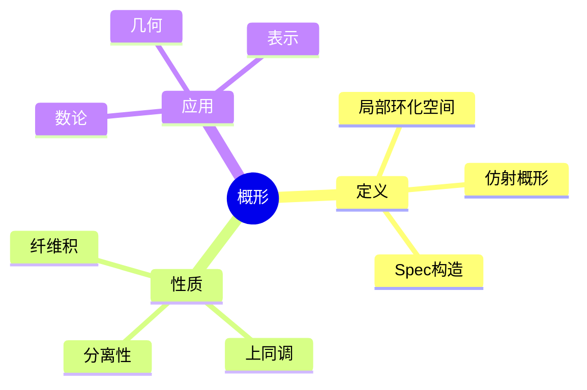
```mermaid
mindmap
  root((概形))
    定义
      局部环化空间
      仿射概形
      Spec构造
    性质
      纤维积
      上同调
      分离性
    应用
      数论
      几何
      表示
```

#### 5.2 矩阵对比：不同解释方式的对比

| 解释方式 | 特点 | 方法 | 工具 | 适用阶段 | 优势 | 局限 |
|---------|------|------|------|---------|------|------|
| **直观解释** | 具体、形象、可视 | 例子、类比、直观 | Spec构造、图形 | 入门阶段 | 易于理解 | 不够严格 |
| **知性解释** | 概念、分类、抽象 | 定义、分类、结构 | 概念图、知识图谱 | 中级阶段 | 系统完整 | 不够直观 |
| **理性解释** | 公理、证明、形式化 | 公理、证明、系统 | 形式化工具、证明系统 | 高级阶段 | 严格准确 | 不够具体 |
| **多视角解释** | 多角度、整合 | 多视角、整合 | 多视角工具 | 所有阶段 | 全面深入 | 可能复杂 |

#### 5.3 多视角表征：从不同角度表征概形

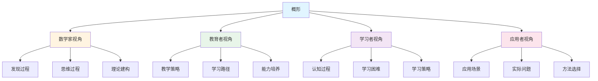
```mermaid
graph TD
    A[概形] --> B[数学家视角]
    A --> C[教育者视角]
    A --> D[学习者视角]
    A --> E[应用者视角]

    B --> B1[发现过程]
    B --> B2[思维过程]
    B --> B3[理论建构]

    C --> C1[教学策略]
    C --> C2[学习路径]
    C --> C3[能力培养]

    D --> D1[认知过程]
    D --> D2[学习困难]
    D --> D3[学习策略]

    E --> E1[应用场景]
    E --> E2[实际问题]
    E --> E3[方法选择]

    style A fill:#e1f5ff
    style B fill:#fff4e1
    style C fill:#e8f5e9
    style D fill:#f3e5f5
    style E fill:#fce4ec
```

#### 5.4 决策树：概形问题分类和策略选择

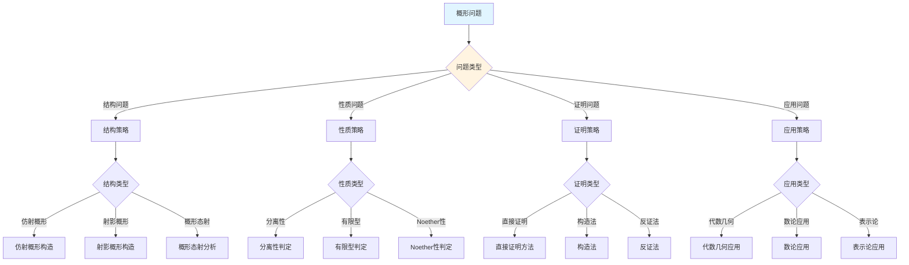
```mermaid
graph TD
    A[概形问题] --> B{问题类型}
    B -->|结构问题| C[结构策略]
    B -->|性质问题| D[性质策略]
    B -->|证明问题| E[证明策略]
    B -->|应用问题| F[应用策略]

    C --> C1{结构类型}
    C1 -->|仿射概形| C2[仿射概形构造]
    C1 -->|射影概形| C3[射影概形构造]
    C1 -->|概形态射| C4[概形态射分析]

    D --> D1{性质类型}
    D1 -->|分离性| D2[分离性判定]
    D1 -->|有限型| D3[有限型判定]
    D1 -->|Noether性| D4[Noether性判定]

    E --> E1{证明类型}
    E1 -->|直接证明| E2[直接证明方法]
    E1 -->|构造法| E3[构造法]
    E1 -->|反证法| E4[反证法]

    F --> F1{应用类型}
    F1 -->|代数几何| F2[代数几何应用]
    F1 -->|数论应用| F3[数论应用]
    F1 -->|表示论| F4[表示论应用]

    style A fill:#e1f5ff
    style B fill:#fff4e1
```

**说明**：

- **问题分类**：根据问题类型（结构、性质、证明、应用）进行分类
- **策略选择**：根据问题类型选择相应的解决策略
- **方法应用**：根据具体问题选择合适的方法

#### 5.5 决策逻辑路径：概形问题解决过程

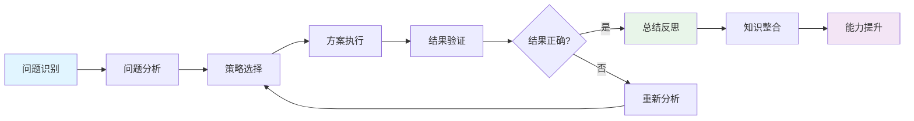
```mermaid
graph LR
    A[问题识别] --> B[问题分析]
    B --> C[策略选择]
    C --> D[方案执行]
    D --> E[结果验证]
    E --> F{结果正确?}
    F -->|是| G[总结反思]
    F -->|否| H[重新分析]
    H --> C

    G --> I[知识整合]
    I --> J[能力提升]

    style A fill:#e1f5ff
    style G fill:#e8f5e9
    style J fill:#f3e5f5
```

**说明**：

- **问题识别**：识别概形问题的类型和关键要素
- **问题分析**：分析问题的条件和目标
- **策略选择**：根据问题类型选择解决策略
- **方案执行**：执行选定的解决方案
- **结果验证**：验证结果的正确性
- **总结反思**：总结解题过程，反思解题方法
- **知识整合**：整合相关知识点
- **能力提升**：提升问题解决能力

#### 5.6 多维对比矩阵：概形概念特征对比

| 对比维度 | 概形定义 | 概形结构 | 概形性质 | 概形应用 |
|---------|---------|---------|---------|---------|
| **核心特征** | Spec构造、层结构 | 仿射概形、射影概形、态射 | 分离性、有限型、Noether性 | 代数几何、数论、表示论 |
| **理解难度** | ⭐⭐⭐⭐⭐ | ⭐⭐⭐⭐⭐ | ⭐⭐⭐⭐⭐ | ⭐⭐⭐⭐ |
| **应用频率** | ⭐⭐⭐⭐ | ⭐⭐⭐⭐ | ⭐⭐⭐⭐ | ⭐⭐⭐⭐ |
| **理论基础** | 概形定义 | 概形结构理论 | 概形性质理论 | 概形应用理论 |
| **教学重点** | 概念理解 | 结构分析 | 性质分析 | 应用能力 |
| **学习阶段** | 高级阶段 | 高级阶段 | 高级阶段 | 高级阶段 |
| **认知维度** | 知性+理性 | 理性 | 理性 | 理性+应用 |
| **思维表征** | 思维导图 | 决策树 | 决策逻辑路径 | 知识图谱 |

**说明**：

- **核心特征**：每个方面的核心特征
- **理解难度**：从1星到5星，表示理解难度
- **应用频率**：从1星到5星，表示应用频率
- **理论基础**：每个方面的理论基础
- **教学重点**：每个方面的教学重点
- **学习阶段**：每个方面的学习阶段
- **认知维度**：每个方面的认知维度
- **思维表征**：每个方面推荐的思维表征方法

---

## 🔍 数学论证：如何论证概形 (编号: C.CORE.021.06)

### 一、论证过程：从观察到反思

#### 1.1 观察（Observation）

**具体现象观察**：

- **现象1**：代数簇可以用环的谱表示
  - 例如：仿射代数簇对应交换环的素谱
  - **为什么重要**：这个现象揭示了概形的本质
- **现象2**：概形的局部结构
  - 例如：概形在每一点有局部环，可以定义函数
  - **为什么重要**：这个现象揭示了概形的代数结构

**模式识别**：

- **模式1**：概形的定义
  - 例如：概形是局部同构于仿射概形的拓扑空间
  - **为什么重要**：这个模式可能反映了概形的本质
- **模式2**：概形与代数簇的关系
  - 例如：概形推广了代数簇，允许更一般的结构
  - **为什么重要**：这个模式可能反映了概形的推广性

**问题提出**：

- **问题1**：如何严格定义概形，统一不同的代数几何对象？
  - **为什么提出**：这个问题可能揭示概形的本质和基础
- **问题2**：如何证明概形的存在性？
  - **为什么提出**：这个问题可能揭示概形的构造方法

#### 1.2 猜想（Conjecture）

**归纳猜想**：

- **猜想1**：概形是研究代数几何的统一工具
  - **依据**：观察不同代数几何对象都满足概形定义
  - **为什么提出**：这个猜想可能揭示概形的统一性
- **猜想2**：概形有局部环结构
  - **依据**：观察具体概形的局部结构
  - **为什么提出**：这个猜想可能揭示概形的代数性质

**类比猜想**：

- **猜想1**：概形类似于"代数流形"
  - **类比对象**：流形（拓扑流形）
  - **为什么提出**：这个类比可能揭示概形的本质
- **猜想2**：局部环类似于"函数环"
  - **类比对象**：函数环
  - **为什么提出**：这个类比可能揭示局部环的作用

**直觉猜想**：

- **猜想1**：概形是"最自然"的代数几何对象
  - **直觉来源**：概形的直观
  - **为什么提出**：这个直觉可能揭示概形的基础地位
- **猜想2**：概形有"最小"的公理结构
  - **直觉来源**：概形的公理结构
  - **为什么提出**：这个直觉可能揭示概形的本质

#### 1.3 证明（Proof）

**直接证明**：

- **证明1**：概形的存在性
  - **证明思路**：使用环的谱和粘合构造
  - **关键步骤**：构造仿射概形，通过粘合得到一般概形
  - **为什么这样证明**：这个证明方法直接、清晰
- **证明2**：概形的局部环结构
  - **证明思路**：使用概形的定义和局部环的性质
  - **关键步骤**：证明每一点有局部环
  - **为什么这样证明**：这个证明方法直接、清晰

**构造法**：

- **构造法**：构造概形作为环的谱
  - **构造方法**：定义概形为环的素谱，配备Zariski拓扑和结构层
  - **验证**：验证构造的概形满足概形公理
  - **为什么这样证明**：构造法适合证明存在性命题

#### 1.4 反思（Reflection）

**过程回顾**：

- **论证回顾**：从观察代数簇可以用环的谱表示，到猜想概形的性质，再到严格证明
  - **成功之处**：成功建立了概形的严格理论
  - **不足之处**：概形概念需要进一步推广
  - **改进方向**：推广到叠、导出概形等

**方法总结**：

- **证明方法**：使用了直接证明、构造法
  - **方法特点**：直接证明清晰，构造法明确
  - **适用范围**：不同方法适用于不同类型的命题
- **证明技巧**：使用环的谱、粘合构造、局部环的性质
  - **技巧要点**：将概形问题转化为代数问题，使用构造法处理存在性问题
  - **应用场景**：这些技巧可以应用于其他代数几何问题

**理论意义**：

- **理论贡献**：建立了概形的严格理论，揭示了概形的代数几何结构
  - **为什么重要**：这个论证揭示了代数几何的基础结构
- **应用价值**：概形为代数几何、数论、物理提供了基础
  - **为什么重要**：这个论证可以应用于所有代数几何问题

### 二、论证类型：多种推理方式

#### 2.1 归纳论证（Inductive Reasoning）

**不完全归纳**：

- **例子1**：从具体概形的性质归纳一般规律
  - **观察**：观察仿射概形、射影概形都有局部环结构
  - **结论**：所有概形都有局部环结构
  - **局限性**：不完全归纳的结论需要严格证明

#### 2.2 演绎论证（Deductive Reasoning）

**三段论**：

- **例子1**：证明概形的性质
  - **大前提**：所有概形都局部同构于仿射概形
  - **小前提**：射影概形是概形
  - **结论**：射影概形局部同构于仿射概形
  - **为什么有效**：三段论是严格的演绎推理

#### 2.3 类比论证（Analogical Reasoning）

**结构类比**：

- **例子1**：概形与流形的类比
  - **类比对象**：流形
  - **相似性**：概形局部像仿射概形，流形局部像欧几里得空间
  - **结论**：概形可以理解为"代数流形"
  - **局限性**：类比不能替代严格证明

#### 2.4 构造论证（Constructive Reasoning）

**构造法**：

- **例子1**：构造概形作为环的谱
  - **构造方法**：定义概形为环的素谱
  - **验证**：验证构造的概形满足概形公理
  - **为什么有效**：构造法是严格的直接证明

### 三、论证可视化：用图形表示论证过程

#### 3.1 论证流程图

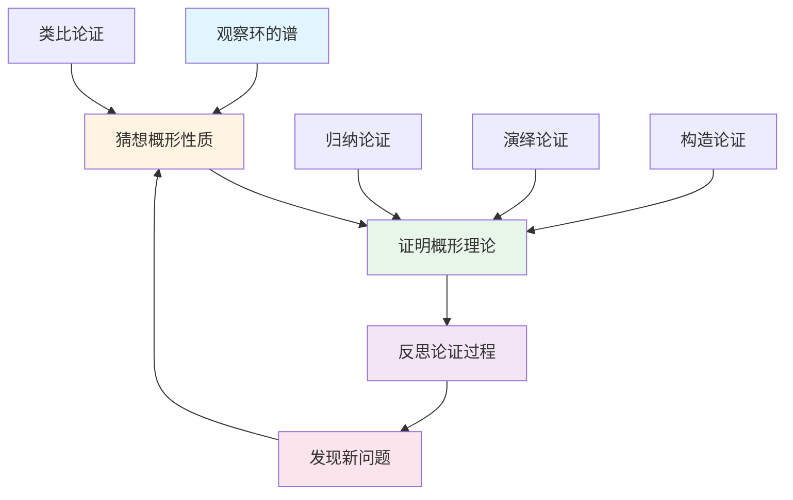
```mermaid
graph TD
    A[观察环的谱] --> B[猜想概形性质]
    B --> C[证明概形理论]
    C --> D[反思论证过程]
    D --> E[发现新问题]
    E --> B

    F[归纳论证] --> C
    G[演绎论证] --> C
    H[类比论证] --> B
    I[构造论证] --> C

    style A fill:#e1f5ff
    style B fill:#fff4e1
    style C fill:#e8f5e9
    style D fill:#f3e5f5
    style E fill:#fce4ec
```

#### 3.2 论证类型对比

| 论证类型 | 特点 | 适用场景 | 优势 | 局限 |
|---------|------|---------|------|------|
| **归纳论证** | 从特殊到一般 | 发现规律、提出猜想 | 启发性强 | 结论或然 |
| **演绎论证** | 从一般到特殊 | 严格证明、逻辑推理 | 结论必然 | 需要前提 |
| **类比论证** | 基于相似性 | 启发思路、发现联系 | 创造性高 | 结论或然 |
| **构造论证** | 直接构造 | 证明存在性命题 | 直接明确 | 需要构造 |

#### 3.3 论证思维导图

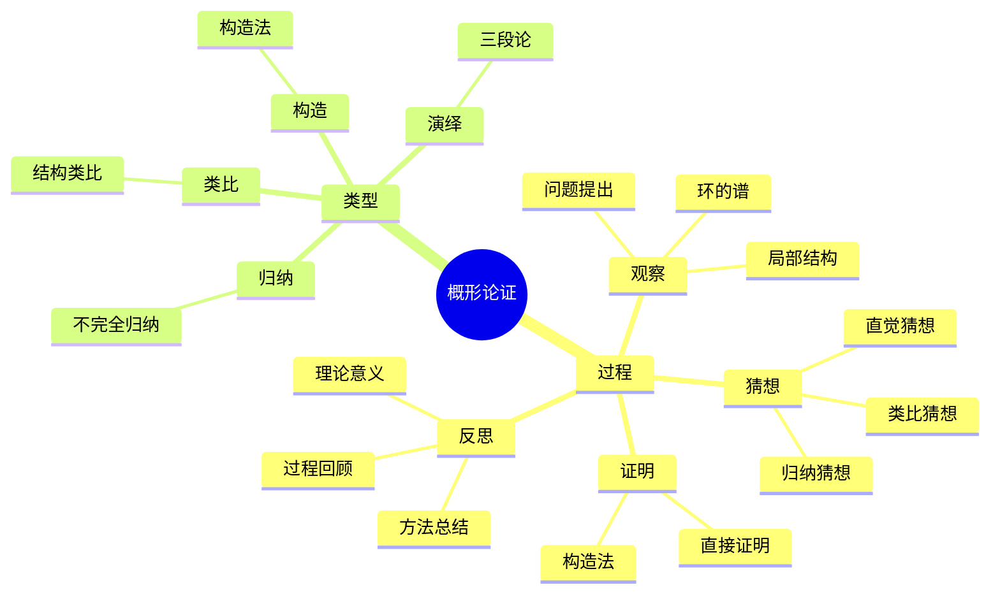
```mermaid
mindmap
  root((概形论证))
    过程
      观察
        环的谱
        局部结构
        问题提出
      猜想
        归纳猜想
        类比猜想
        直觉猜想
      证明
        直接证明
        构造法
      反思
        过程回顾
        方法总结
        理论意义
    类型
      归纳
        不完全归纳
      演绎
        三段论
      类比
        结构类比
      构造
        构造法
```

---

## 🔗 三视角整合 (编号: C.CORE.021.07)

### 三个视角的关联

**认知学视角 ↔ 教育学视角**:

- 认知学视角揭示的理解机制，指导教育学视角的教学设计
- 教育学视角的教学实践，验证认知学视角的理论

**认知学视角 ↔ 数学家视角**:

- 数学家视角的思维过程，启发认知学视角的认知路径
- 认知学视角的认知障碍，解释数学家视角的历史困难

**教育学视角 ↔ 数学家视角**:

- 数学家视角的历史发展，为教育学视角提供教学素材
- 教育学视角的教学策略，帮助学习者理解数学家视角的思维过程

### 如何综合运用三个视角

**学习建议**:

1. **从认知学视角开始**: 先建立直观理解
2. **用教育学视角深化**: 通过教学路径系统学习
3. **用数学家视角升华**: 理解概念的深层意义和历史背景

**教学建议**:

1. **引入阶段**: 用数学家视角的问题起源激发兴趣
2. **探索阶段**: 用认知学视角的认知过程引导发现
3. **形式化阶段**: 用教育学视角的教学策略系统教学
4. **巩固阶段**: 综合三个视角深化理解

---

## 📚 参考文献 (编号: C.CORE.021.08)

### 权威资源

- Wikipedia: [Scheme (Mathematics)](https://en.wikipedia.org/wiki/Scheme_(mathematics))
- Metamath: [Scheme](http://us.metamath.org/mpeuni/df-scheme.html)[需更新][需更新]

### 经典教材

- Hartshorne, R. (1977). *Algebraic Geometry*. Springer.
- Liu, Q. (2002). *Algebraic Geometry and Arithmetic Curves*. Oxford University Press.

### 研究论文

- Grothendieck, A. (1960). "Éléments de géométrie algébrique". *Publications Mathématiques de l'IHÉS*.
- Deligne, P. (1974). "La conjecture de Weil. I". *Publications Mathématiques de l'IHÉS*.

---

**创建日期**: 2025年1月
**最后更新**: 2026-04-05
**维护状态**: 持续更新中

---

## 📚 附录: 扩展分析


### 1. 多理论分析

---
msc_primary: "00A99"
---

# 概形概念的多理论分析示例 / Multi-Theory Analysis Example: Scheme Concept


---


## 🎯 一、Tall三个世界理论分析 / Tall's Three Worlds Theory Analysis (编号: C.CORE.021.MULTI.01)

### 1.1 感知-操作世界（Embodied World）

**概形在感知-操作世界中的理解 / Understanding Schemes in the Embodied World**：

- **具体经验 / Concrete Experience**：
  - 通过观察代数曲线理解概形：$y^2 = x^3 + ax + b$ / Understanding schemes through observing algebraic curves: $y^2 = x^3 + ax + b$
  - 例如：椭圆曲线、代数簇 / Examples: elliptic curves, algebraic varieties
  - 通过"局部像仿射概形"理解概形：在小范围内，概形看起来像仿射概形 / Understanding schemes through "locally like affine schemes": in small regions, schemes look like affine schemes

- **身体动作 / Bodily Actions**：
  - 通过"局部观察"的动作理解概形 / Understanding schemes through the action of "local observation"
  - 通过"粘合"理解概形的构造 / Understanding scheme construction through "gluing"
  - 通过操作图形理解概形的结构层、函数层 / Understanding structure sheaves and function sheaves of schemes through manipulating figures

- **直观理解 / Intuitive Understanding**：
  - 概形是"配备结构层的拓扑空间" / A scheme is a "topological space equipped with a structure sheaf"
  - 概形描述"代数几何对象"的结构 / Schemes describe the structure of "algebraic geometric objects"
  - 概形是代数几何的基础 / Schemes are the foundation of algebraic geometry

**教学建议 / Teaching Suggestions**：

- 使用具体例子（仿射概形、射影概形） / Use concrete examples (affine schemes, projective schemes)
- 通过局部观察理解概形 / Understand schemes through local observation
- 使用图形可视化概形结构 / Use graphics to visualize scheme structure

### 1.2 概念-符号世界（Symbolic World）

**概形在概念-符号世界的理解 / Understanding Schemes in the Symbolic World**：

- **符号表示 / Symbolic Representation**：
  - 使用概形符号：$X$、$Y$ 表示概形 / Using scheme notation: $X$, $Y$ to denote schemes
  - 使用结构层符号：$\mathcal{O}_X$、$\mathcal{O}_Y$ / Using structure sheaf notation: $\mathcal{O}_X$, $\mathcal{O}_Y$
  - 使用仿射概形符号：$\mathrm{Spec}(A)$、$\mathrm{Spec}(B)$ / Using affine scheme notation: $\mathrm{Spec}(A)$, $\mathrm{Spec}(B)$

- **概念理解 / Conceptual Understanding**：
  - 概形是配备结构层的拓扑空间 / A scheme is a topological space equipped with a structure sheaf
  - 概形通过仿射概形覆盖 / Schemes are covered by affine schemes
  - 概形是代数几何的研究对象 / Schemes are objects of study in algebraic geometry

- **抽象操作 / Abstract Operations**：
  - 通过粘合研究概形 / Studying schemes through gluing
  - 通过结构层研究概形的局部结构 / Studying local structure of schemes through structure sheaves
  - 通过层上同调研究概形的全局性质 / Studying global properties of schemes through sheaf cohomology

**教学建议 / Teaching Suggestions**：

- 逐步引入概形符号 / Gradually introduce scheme notation
- 通过仿射概形练习理解概形 / Understand schemes through affine scheme exercises
- 使用概形性质研究代数几何结构 / Use scheme properties to study algebraic geometric structures

### 1.3 形式-公理世界（Formal World）

**概形在形式-公理世界的理解 / Understanding Schemes in the Formal World**：

- **公理系统 / Axiomatic System**：
  - 概形的严格定义：概形$(X, \mathcal{O}_X)$是满足条件的局部环化空间 / Strict definition of scheme: scheme $(X, \mathcal{O}_X)$ is a locally ringed space satisfying conditions
  - 通过结构层严格定义概形 / Strictly defining schemes through structure sheaves
  - 通过公理推导演分性质 / Deriving differential properties through axioms

- **形式化定义 / Formal Definition**：
  - 概形的形式化定义 / Formal definition of scheme
  - 仿射概形的形式化定义 / Formal definition of affine scheme
  - 概形性质的形式化证明 / Formal proof of scheme properties

- **逻辑推理 / Logical Reasoning**：
  - 通过逻辑推理证明概形性质 / Proving scheme properties through logical reasoning
  - 通过形式化方法研究代数几何 / Studying algebraic geometry through formal methods
  - 通过范畴论研究概形的一般性质 / Studying general properties of schemes through category theory

**教学建议 / Teaching Suggestions**：

- 介绍概形定义 / Introduce scheme definition
- 通过形式化证明理解概形性质 / Understand scheme properties through formal proofs
- 研究概形在代数几何中的作用 / Study the role of schemes in algebraic geometry

### 1.4 三个世界的转换 / Transitions Between Worlds

**转换路径 / Transition Paths**：

1. **从感知-操作到概念-符号 / From Embodied to Symbolic**：
   - 将具体代数簇结构抽象为概形符号 / Abstracting concrete algebraic variety structures into scheme symbols
   - 从操作中提取概形概念 / Extracting scheme concepts from operations
   - 例如：从"代数簇"到"概形$(X, \mathcal{O}_X)$" / Example: from "algebraic variety" to "scheme $(X, \mathcal{O}_X)$"

2. **从概念-符号到形式-公理 / From Symbolic to Formal**：
   - 将概形概念形式化为局部环化空间定义 / Formalizing scheme concepts into locally ringed space definition
   - 从符号运算到逻辑推理 / From symbolic operations to logical reasoning
   - 例如：从"$(X, \mathcal{O}_X)$"到"局部环化空间公理" / Example: from "$(X, \mathcal{O}_X)$" to "locally ringed space axioms"

**转换支持 / Transition Support**：

- **识别转换困难 / Identifying Transition Difficulties**：
  - 识别从具体代数簇到抽象概形的困难 / Identifying difficulties in transitioning from concrete algebraic varieties to abstract schemes
  - 识别从符号运算到形式化定义的困难 / Identifying difficulties in transitioning from symbolic operations to formal definitions

- **设计转换活动 / Designing Transition Activities**：
  - 设计过渡活动支持转换 / Designing transition activities to support transitions
  - 提供渐进式支持 / Providing progressive support

- **评估转换效果 / Assessing Transition Effectiveness**：
  - 评估转换成功 / Assessing transition success
  - 提供反馈支持 / Providing feedback support

---

## 🔬 二、Dubinsky APOS理论分析 (编号: C.CORE.021.MULTI.02)

### 2.1 Action（动作）

**概形的Action阶段 / Action Stage of Scheme**：

- **具体操作 / Concrete Operations**：
  - 判断概形：给定局部环化空间，判断是否为概形 / Determining scheme: given a locally ringed space, determine if it is a scheme
  - 使用结构层：给定概形，构造结构层 / Using structure sheaves: given a scheme, construct structure sheaves
  - 构造概形：给定环，构造仿射概形 / Constructing schemes: given a ring, construct an affine scheme

- **操作特点 / Operation Characteristics**：
  - 需要外部指导（教师、教材） / Requires external guidance (teacher, textbook)
  - 操作是具体的、机械的 / Operations are concrete and mechanical
  - 需要逐步执行 / Requires step-by-step execution

- **学习活动 / Learning Activities**：
  - 练习判断概形 / Practice determining schemes
  - 练习使用结构层 / Practice using structure sheaves
  - 练习构造仿射概形 / Practice constructing affine schemes

**教学建议 / Teaching Suggestions**：

- 提供大量练习机会 / Provide ample practice opportunities
- 给予及时反馈 / Give timely feedback
- 逐步增加操作复杂度 / Gradually increase operation complexity

### 2.2 Process（过程）

**概形的Process阶段 / Process Stage of Scheme**：

- **内化过程 / Internalization Process**：
  - 将概形判断内化为心理过程 / Internalizing scheme determination as a mental process
  - 理解概形构造的内在逻辑 / Understanding the internal logic of scheme construction
  - 能够独立完成概形操作 / Being able to perform scheme operations independently

- **过程理解 / Process Understanding**：
  - 理解"概形"是"配备结构层的拓扑空间的过程" / Understanding that "scheme" is "the process of topological spaces equipped with structure sheaves"
  - 理解"结构层"是"局部函数的过程" / Understanding that "structure sheaves" are "the process of local functions"
  - 理解"粘合"是"构造概形的过程" / Understanding that "gluing" is "the process of constructing schemes"

- **灵活应用 / Flexible Application**：
  - 能够灵活应用概形概念 / Being able to flexibly apply scheme concepts
  - 能够处理复杂的概形问题 / Being able to handle complex scheme problems
  - 能够理解概形的各种性质 / Being able to understand various properties of schemes

**教学建议 / Teaching Suggestions**：

- 引导学生内化操作过程 / Guide students to internalize operation processes
- 通过变式练习加深理解 / Deepen understanding through variant exercises
- 鼓励学生探索概形应用 / Encourage students to explore scheme applications

### 2.3 Object（对象）

**概形的Object阶段 / Object Stage of Scheme**：

- **对象化理解 / Objectification Understanding**：
  - 将概形视为独立的对象 / Viewing schemes as independent objects
  - 理解概形作为数学对象的结构 / Understanding the structure of schemes as mathematical objects
  - 能够对概形进行运算和操作 / Being able to perform operations on schemes

- **对象操作 / Object Operations**：
  - 能够比较不同的概形 / Being able to compare different schemes
  - 能够构造概形的积概形 / Being able to construct product schemes
  - 能够研究概形的性质 / Being able to study properties of schemes

- **概念整合 / Conceptual Integration**：
  - 理解概形与环、层、代数几何的关系 / Understanding the relationship between schemes, rings, sheaves, and algebraic geometry
  - 理解概形在代数几何中的作用 / Understanding the role of schemes in algebraic geometry
  - 理解概形在数学中的作用 / Understanding the role of schemes in mathematics

**教学建议 / Teaching Suggestions**：

- 引导学生将概形对象化 / Guide students to objectify schemes
- 通过对象操作加深理解 / Deepen understanding through object operations
- 整合概形与其他概念 / Integrate schemes with other concepts

### 2.4 Schema（图式）

**概形的Schema阶段 / Schema Stage of Scheme**：

- **图式构建 / Schema Construction**：
  - 构建完整的概形图式 / Constructing a complete scheme schema
  - 整合概形的各种理解 / Integrating various understandings of schemes
  - 建立概形与其他概念的联系 / Establishing connections between schemes and other concepts

- **图式应用 / Schema Application**：
  - 能够灵活应用概形图式 / Being able to flexibly apply scheme schemas
  - 能够解决复杂的概形问题 / Being able to solve complex scheme problems
  - 能够研究代数几何理论 / Being able to study algebraic geometry theory

- **图式发展 / Schema Development**：
  - 不断发展概形图式 / Continuously developing scheme schemas
  - 探索概形的新应用 / Exploring new applications of schemes
  - 研究代数几何理论的发展 / Studying the development of algebraic geometry theory

**教学建议 / Teaching Suggestions**：

- 帮助学生构建概形图式 / Help students construct scheme schemas
- 通过应用发展图式 / Develop schemas through application
- 鼓励学生探索代数几何理论 / Encourage students to explore algebraic geometry theory

### 2.5 APOS发展路径 / APOS Development Path

**发展过程 / Development Process**：

1. **Action → Process / 动作到过程**：
   - 将外部概形操作内化为心理过程 / Internalizing external scheme operations as mental processes
   - 从需要指导到独立完成 / From needing guidance to independent completion
   - 例如：从"构造概形"到"理解概形过程" / Example: from "constructing schemes" to "understanding the scheme process"

2. **Process → Object / 过程到对象**：
   - 将概形过程对象化 / Objectifying scheme processes
   - 从过程理解到对象理解 / From process understanding to object understanding
   - 例如：从"理解概形过程"到"将概形视为对象" / Example: from "understanding the scheme process" to "treating schemes as objects"

3. **Object → Schema / 对象到图式**：
   - 整合概形的所有方面形成完整图式 / Integrating all aspects of schemes to form a complete schema
   - 从对象理解到系统理解 / From object understanding to systematic understanding
   - 例如：从"理解概形对象"到"形成代数几何图式" / Example: from "understanding scheme objects" to "forming an algebraic geometry schema"

**发展支持 / Development Support**：

- **识别发展困难 / Identifying Development Difficulties**：
  - 识别内化困难 / Identifying internalization difficulties
  - 识别对象化困难 / Identifying objectification difficulties
  - 识别图式化困难 / Identifying schematization difficulties

- **设计发展活动 / Designing Development Activities**：
  - 设计支持内化的活动 / Designing activities to support internalization
  - 设计支持对象化的活动 / Designing activities to support objectification
  - 设计支持图式化的活动 / Designing activities to support schematization

- **评估发展效果 / Assessing Development Effectiveness**：
  - 评估各阶段发展 / Assessing development at each stage
  - 提供反馈支持 / Providing feedback support

---

## 💬 三、Sfard交流理论分析 / Sfard's Commognitive Theory Analysis (编号: C.CORE.021.MULTI.03)

### 3.1 概形作为交流工具 / Scheme as a Communication Tool

**概形的交流功能 / Communicative Function of Schemes**：

- **数学交流 / Mathematical Communication**：
  - 概形用于表达"代数几何对象"：$X$ / Schemes are used to express "algebraic geometric objects": $X$
  - 概形用于描述"局部结构" / Schemes are used to describe "local structure"
  - 概形用于表达数学关系：态射、同构 / Schemes are used to express mathematical relationships: morphisms, isomorphisms

- **概念表达 / Conceptual Expression**：
  - 通过概形表达"局部像仿射概形"的概念 / Expressing the concept of "locally like affine schemes" through schemes
  - 通过概形符号表达"代数结构"的概念 / Expressing the concept of "algebraic structure" through scheme notation
  - 通过概形表达"几何结构"的概念 / Expressing the concept of "geometric structure" through schemes

- **问题解决 / Problem Solving**：
  - 使用概形语言表达问题 / Using scheme language to express problems
  - 使用概形方法解决问题 / Using scheme methods to solve problems
  - 使用代数几何方法证明定理 / Using algebraic geometry methods to prove theorems

### 3.2 概形学习的实践参与 / Practice Participation in Scheme Learning

**通过参与数学实践学习概形 / Learning Schemes through Participation in Mathematical Practice**：

- **实践场景 / Practice Scenarios**：
  - 通过代数问题学习概形 / Learning schemes through algebra problems
  - 通过几何问题学习概形 / Learning schemes through geometry problems
  - 通过数论应用学习概形 / Learning schemes through number theory applications
  - 通过代数几何研究学习概形理论 / Learning scheme theory through algebraic geometry research

- **实践方式 / Practice Methods**：
  - 参与数学讨论，使用概形语言 / Participating in mathematical discussions, using scheme language
  - 解决数学问题，应用概形方法 / Solving mathematical problems, applying scheme methods
  - 研究数学理论，理解概形作用 / Studying mathematical theory, understanding the role of schemes

- **学习效果 / Learning Outcomes**：
  - 通过实践理解概形概念 / Understanding scheme concepts through practice
  - 通过应用掌握概形方法 / Mastering scheme methods through application
  - 通过参与形成数学思维 / Forming mathematical thinking through participation

**教学建议 / Teaching Suggestions**：

- 设计数学实践活动 / Design mathematical practice activities
- 鼓励学生参与数学讨论 / Encourage students to participate in mathematical discussions
- 提供实际问题解决机会 / Provide opportunities for solving real-world problems

---

## 🧠 四、Piaget认知发展理论分析 / Piaget's Cognitive Development Theory Analysis (编号: C.CORE.021.MULTI.04)

### 4.1 具体运算阶段（7-12岁）/ Concrete Operational Stage (7-12 years)

**概形在具体运算阶段的理解 / Understanding Schemes in the Concrete Operational Stage**：

- **具体对象 / Concrete Objects**：
  - 通过具体概形理解概形 / Understanding schemes through concrete schemes
  - 例如：仿射概形、射影概形 / Examples: affine schemes, projective schemes
  - 需要具体例子支持理解 / Requires concrete examples to support understanding

- **逻辑思维 / Logical Thinking**：
  - 能够理解概形的基本概念 / Being able to understand basic scheme concepts
  - 能够进行简单的概形操作 / Being able to perform simple scheme operations
  - 但需要具体对象支持 / But requires concrete object support

- **教学建议 / Teaching Suggestions**：
  - 使用具体概形 / Use concrete schemes
  - 通过图形验证概形性质 / Verify scheme properties through graphics
  - 逐步引入抽象概念 / Gradually introduce abstract concepts

### 4.2 形式运算阶段（12+岁）/ Formal Operational Stage (12+ years)

**概形在形式运算阶段的理解 / Understanding Schemes in the Formal Operational Stage**：

- **抽象思维 / Abstract Thinking**：
  - 能够理解抽象的概形概念 / Being able to understand abstract scheme concepts
  - 能够进行符号操作 / Being able to perform symbolic operations
  - 能够进行逻辑推理 / Being able to perform logical reasoning

- **形式推理 / Formal Reasoning**：
  - 能够证明概形性质 / Being able to prove scheme properties
  - 能够理解概形定义 / Being able to understand scheme definition
  - 能够研究代数几何 / Being able to study algebraic geometry

- **教学建议 / Teaching Suggestions**：
  - 引入抽象概念和符号 / Introduce abstract concepts and symbols
  - 进行逻辑推理训练 / Conduct logical reasoning training
  - 研究代数几何理论 / Study algebraic geometry theory

---

## 🌍 五、Vygotsky社会文化理论分析 / Vygotsky's Sociocultural Theory Analysis (编号: C.CORE.021.MULTI.05)

### 5.1 最近发展区（ZPD）/ Zone of Proximal Development (ZPD)

**概形学习的最近发展区 / Zone of Proximal Development in Scheme Learning**：

- **独立能力 / Independent Ability**：
  - 能够理解概形的基本概念 / Being able to understand basic scheme concepts
  - 能够进行简单的概形操作 / Being able to perform simple scheme operations
  - 能够理解结构层 / Being able to understand structure sheaves

- **潜在能力 / Potential Ability**：
  - 能够理解概形定义 / Being able to understand scheme definition
  - 能够证明概形性质 / Being able to prove scheme properties
  - 能够研究代数几何理论 / Being able to study algebraic geometry theory

- **教学建议 / Teaching Suggestions**：
  - 识别学生的最近发展区 / Identify students' zone of proximal development
  - 提供适当的支持和指导 / Provide appropriate support and guidance
  - 逐步提高学习要求 / Gradually increase learning requirements

### 5.2 社会文化工具 / Sociocultural Tools

**概形作为社会文化工具 / Schemes as Sociocultural Tools**：

- **数学工具 / Mathematical Tools**：
  - 概形是数学研究的重要工具 / Schemes are important tools for mathematical research
  - 概形用于解决实际问题（编码理论、密码学） / Schemes are used to solve real-world problems (coding theory, cryptography)
  - 概形用于研究数学理论 / Schemes are used to study mathematical theory

- **文化意义 / Cultural Significance**：
  - 概形是数学文化的重要组成部分 / Schemes are an important part of mathematical culture
  - 概形反映了数学思维的发展 / Schemes reflect the development of mathematical thinking
  - 概形体现了数学的美感 / Schemes embody the beauty of mathematics

- **教学建议 / Teaching Suggestions**：
  - 介绍概形的历史和文化意义 / Introduce the history and cultural significance of schemes
  - 展示概形在数学中的作用 / Demonstrate the role of schemes in mathematics
  - 培养学生对数学文化的理解 / Cultivate students' understanding of mathematical culture

---

## 🔄 六、多理论整合分析 / Multi-Theory Integration Analysis (编号: C.CORE.021.MULTI.06)

### 6.1 理论共同点 / Theoretical Commonalities

**各理论在概形概念分析中的共同点 / Commonalities of Theories in Scheme Concept Analysis**：

1. **多层次理解 / Multi-Level Understanding**：
   - 都强调从具体到抽象的发展 / All emphasize development from concrete to abstract
   - Tall的三个世界、APOS的四个阶段、Piaget的发展阶段都体现这一点 / Tall's three worlds, APOS's four stages, and Piaget's developmental stages all reflect this

2. **实践重要性 / Importance of Practice**：
   - 都强调实践在学习中的作用 / All emphasize the role of practice in learning
   - Sfard的交流理论、Vygotsky的社会文化理论都强调这一点 / Sfard's communication theory and Vygotsky's sociocultural theory both emphasize this

3. **认知发展 / Cognitive Development**：
   - 都关注认知发展的过程 / All focus on the process of cognitive development
   - 各理论都描述了从简单到复杂的发展 / Each theory describes development from simple to complex

### 6.2 理论互补性 / Theoretical Complementarity

**各理论在概形概念分析中的互补性 / Complementarity of Theories in Scheme Concept Analysis**：

1. **Tall三个世界 / Tall's Three Worlds**：
   - 适用于理解概形概念的不同层次 / Applicable to understanding different levels of scheme concepts
   - 从感知操作到形式公理的发展 / Development from embodied operations to formal axioms

2. **APOS理论 / APOS Theory**：
   - 适用于分析概形概念的学习过程 / Applicable to analyzing the learning process of scheme concepts
   - 从动作到图式的发展 / Development from action to schema

3. **Sfard交流理论 / Sfard's Communication Theory**：
   - 适用于设计概形概念的实践活动 / Applicable to designing practice activities for scheme concepts
   - 通过数学实践学习概形 / Learning schemes through mathematical practice

4. **Piaget理论 / Piaget's Theory**：
   - 适用于理解概形概念的认知发展阶段 / Applicable to understanding cognitive development stages of scheme concepts
   - 从具体运算到形式运算的发展 / Development from concrete operations to formal operations

5. **Vygotsky理论 / Vygotsky's Theory**：
   - 适用于设计概形概念的学习支持 / Applicable to designing learning support for scheme concepts
   - 通过最近发展区促进学习 / Promoting learning through the zone of proximal development

### 6.3 整合应用框架

**多理论整合应用**：

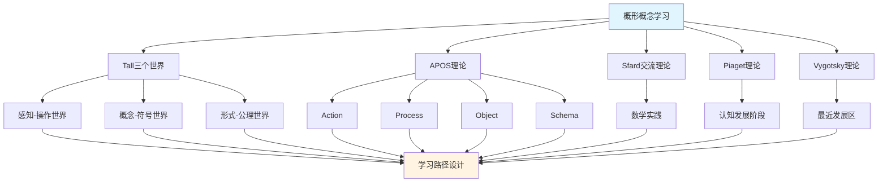
```mermaid
graph TB
    A[概形概念学习] --> B[Tall三个世界]
    A --> C[APOS理论]
    A --> D[Sfard交流理论]
    A --> E[Piaget理论]
    A --> F[Vygotsky理论]

    B --> G[感知-操作世界]
    B --> H[概念-符号世界]
    B --> I[形式-公理世界]

    C --> J[Action]
    C --> K[Process]
    C --> L[Object]
    C --> M[Schema]

    D --> N[数学实践]
    E --> O[认知发展阶段]
    F --> P[最近发展区]

    G --> Q[学习路径设计]
    H --> Q
    I --> Q
    J --> Q
    K --> Q
    L --> Q
    M --> Q
    N --> Q
    O --> Q
    P --> Q

    style A fill:#e1f5ff
    style Q fill:#fff4e1
```

---

## 📊 七、概形概念的多理论学习路径 / Multi-Theory Learning Path for Scheme Concept (编号: C.CORE.021.MULTI.07)

### 7.1 入门阶段（Tall感知-操作世界 + APOS Action）/ Entry Stage (Tall Embodied World + APOS Action)

**学习目标 / Learning Objectives**：

- 通过具体概形理解概形概念 / Understanding scheme concepts through concrete schemes
- 掌握基本概形操作 / Mastering basic scheme operations

**学习活动 / Learning Activities**：

- 使用具体概形（仿射概形、射影概形）进行观察 / Using concrete schemes (affine schemes, projective schemes) for observation
- 练习判断概形 / Practicing determining schemes
- 练习使用结构层 / Practicing using structure sheaves
- 练习基本概形操作 / Practicing basic scheme operations

**评估标准 / Assessment Criteria**：

- 能够独立完成基本概形操作 / Being able to independently complete basic scheme operations
- 能够理解概形的基本概念 / Being able to understand basic scheme concepts

### 7.2 中级阶段（Tall概念-符号世界 + APOS Process/Object）/ Intermediate Stage (Tall Symbolic World + APOS Process/Object)

**学习目标 / Learning Objectives**：

- 理解概形的符号表示 / Understanding symbolic representation of schemes
- 掌握概形运算的内在逻辑 / Mastering the internal logic of scheme operations
- 将概形视为对象 / Viewing schemes as objects

**学习活动 / Learning Activities**：

- 学习概形符号和结构层符号 / Learning scheme notation and structure sheaf notation
- 通过符号操作进行概形运算 / Performing scheme operations through symbolic operations
- 理解概形的性质 / Understanding properties of schemes
- 研究概形的积概形 / Studying product schemes

**评估标准 / Assessment Criteria**：

- 能够灵活应用概形符号 / Being able to flexibly apply scheme notation
- 能够理解概形运算的内在逻辑 / Being able to understand the internal logic of scheme operations
- 能够将概形视为对象进行操作 / Being able to operate on schemes as objects

### 7.3 高级阶段（Tall形式-公理世界 + APOS Schema + Sfard实践）/ Advanced Stage (Tall Formal World + APOS Schema + Sfard Practice)

**学习目标 / Learning Objectives**：

- 理解概形定义 / Understanding scheme definition
- 形成完整的概形概念图式 / Forming a complete scheme concept schema
- 通过数学实践应用概形 / Applying schemes through mathematical practice

**学习活动 / Learning Activities**：

- 学习概形定义 / Learning scheme definition
- 通过形式化证明理解概形性质 / Understanding scheme properties through formal proofs
- 研究概形在代数几何中的作用 / Studying the role of schemes in algebraic geometry
- 参与数学实践，应用概形方法 / Participating in mathematical practice, applying scheme methods

**评估标准 / Assessment Criteria**：

- 能够理解概形定义 / Being able to understand basic scheme definition
- 能够形成完整的概形概念图式 / Being able to form a complete scheme concept schema
- 能够通过数学实践应用概形 / Being able to apply schemes through mathematical practice

---

## 🧠 七、元认知理论分析 / Metacognitive Theory Analysis (编号: C.CORE.021.MULTI.07.5)

### 7.1 元认知知识（Metacognitive Knowledge）

**关于概形概念的知识 / Knowledge About the Scheme Concept**：

- **概念知识 / Conceptual Knowledge**：
  - 概形的定义：具有结构层的局部环空间 / Schemes are locally ringed spaces with structure sheaves
  - 概形的性质：局部性、仿射性、分离性 / Properties: locality, affineness, separatedness
  - 概形的表示方法：仿射概形、射影概形、概形态射 / Representation methods: affine schemes, projective schemes, scheme morphisms
  - 概形与其他概念的关系：概形是代数几何的基础，是研究代数簇的工具 / Relationship: schemes are foundations of algebraic geometry and tools for studying algebraic varieties

- **策略知识 / Strategy Knowledge**：
  - 学习策略：从仿射概形到一般概形，通过具体例子掌握概形构造 / Learning strategies: from affine schemes to general schemes, master scheme construction through concrete examples
  - 理解策略：从局部到整体，从简单到复杂 / Understanding strategies: from local to global, from simple to complex
  - 应用策略：将概形方法应用到实际问题中 / Application strategies: apply scheme methods to real-world problems

- **任务知识 / Task Knowledge**：
  - 典型任务：概形构造、概形态射、概形性质分析 / Typical tasks: scheme construction, scheme morphisms, scheme property analysis
  - 任务难度：基础任务（概形构造）→ 中级任务（概形态射）→ 高级任务（概形性质分析） / Task difficulty: basic (scheme construction) → intermediate (scheme morphisms) → advanced (scheme property analysis)
  - 任务要求：理解概形概念，掌握概形构造，能够进行概形推理 / Task requirements: understand scheme concepts, master scheme construction, be able to reason about schemes

### 7.2 元认知监控（Metacognitive Monitoring）

**理解监控 / Comprehension Monitoring**：

- **自我提问 / Self-Questioning**：
  - "我理解概形的基本概念了吗？" / "Do I understand the basic concept of schemes?"
  - "我能区分概形和其他几何结构吗？" / "Can I distinguish between schemes and other geometric structures?"
  - "我理解结构层的概念吗？" / "Do I understand the concept of structure sheaves?"

- **理解检查 / Comprehension Checking**：
  - 能否用自己的话解释概形概念？ / Can I explain the concept of schemes in my own words?
  - 能否识别概形构造的错误？ / Can I identify errors in scheme construction?
  - 能否判断空间的概形性？ / Can I determine whether a space is a scheme?

- **困难识别 / Difficulty Identification**：
  - 识别理解困难：抽象性、结构层、局部环、概形态射 / Identify comprehension difficulties: abstraction, structure sheaves, local rings, scheme morphisms
  - 识别运算困难：概形构造、概形态射、概形性质分析 / Identify operation difficulties: scheme construction, scheme morphisms, scheme property analysis

**过程监控 / Process Monitoring**：

- **学习过程监控 / Learning Process Monitoring**：
  - 监控学习进度：是否按计划学习？ / Monitor learning progress: Am I learning according to plan?
  - 监控学习效果：是否掌握了概形概念？ / Monitor learning effectiveness: Have I mastered the concept of schemes?
  - 监控学习困难：遇到了哪些困难？ / Monitor learning difficulties: What difficulties have I encountered?

- **策略使用监控 / Strategy Use Monitoring**：
  - 使用的策略是否有效？ / Is the strategy I'm using effective?
  - 是否需要调整策略？ / Do I need to adjust my strategy?
  - 策略使用是否正确？ / Am I using the strategy correctly?

### 7.3 元认知调节（Metacognitive Regulation）

**计划调节 / Planning Regulation**：

- **学习计划制定 / Learning Plan Development**：
  - 制定学习计划：先学概形基本概念，再学概形构造，最后学概形应用 / Develop learning plan: first learn basic scheme concepts, then learn scheme construction, finally learn scheme applications
  - 调整学习计划：根据学习情况调整计划 / Adjust learning plan: adjust plan based on learning situation
  - 优化学习路径：选择最适合自己的学习路径 / Optimize learning path: choose the learning path that best suits oneself

**策略调节 / Strategy Regulation**：

- **策略选择 / Strategy Selection**：
  - 根据任务类型选择策略：简单任务用直接方法，复杂任务用分步方法 / Select strategies based on task type: use direct methods for simple tasks, step-by-step methods for complex tasks
  - 根据学习阶段选择策略：入门阶段用具体例子，高级阶段用抽象方法 / Select strategies based on learning stage: use concrete examples in entry stage, abstract methods in advanced stage

- **策略调整 / Strategy Adjustment**：
  - 如果遇到困难，尝试不同的策略 / If encountering difficulties, try different strategies
  - 如果策略无效，调整策略 / If strategy is ineffective, adjust strategy
  - 如果策略有效，继续使用并优化 / If strategy is effective, continue using and optimize

**反思调节 / Reflection Regulation**：

- **学习反思 / Learning Reflection**：
  - 反思学习过程：从概形学习中获得了什么？ / Reflect on learning process: What have I gained from learning schemes?
  - 反思学习困难：遇到了哪些困难？如何克服？ / Reflect on learning difficulties: What difficulties did I encounter? How did I overcome them?
  - 反思学习策略：使用的策略是否有效？如何改进？ / Reflect on learning strategies: Were the strategies I used effective? How can I improve?

- **错误反思 / Error Reflection**：
  - 从错误中学习：分析错误原因，避免类似错误 / Learn from errors: analyze error causes, avoid similar errors
  - 改进学习方法：根据错误调整学习方法 / Improve learning methods: adjust learning methods based on errors

**教学建议 / Teaching Suggestions**：

- 教授元认知知识：帮助学生建立关于概形的元认知知识 / Teach metacognitive knowledge: help students build metacognitive knowledge about schemes
- 培养监控能力：引导学生自我监控理解过程 / Develop monitoring ability: guide students to self-monitor their comprehension process
- 训练调节能力：教授学生如何调节学习策略 / Train regulation ability: teach students how to regulate learning strategies
- 使用元认知提示语：在学习过程中使用提示语引导学生 / Use metacognitive prompts: use prompts to guide students during learning

---

## 🎓 八、教学建议 / Teaching Suggestions (编号: C.CORE.021.MULTI.08)

### 8.1 基于多理论的教学设计 / Multi-Theory Based Teaching Design

**教学设计原则 / Teaching Design Principles**：

1. **多层次设计 / Multi-Level Design**：
   - 从感知操作到形式公理 / From embodied operations to formal axioms
   - 从动作到图式 / From action to schema
   - 从具体运算到形式运算 / From concrete operations to formal operations

2. **实践导向 / Practice-Oriented**：
   - 设计数学实践活动 / Design mathematical practice activities
   - 鼓励学生参与数学交流 / Encourage students to participate in mathematical communication
   - 提供实际问题解决机会 / Provide opportunities for solving real-world problems

3. **学习支持 / Learning Support**：
   - 提供适当的学习支持 / Provide appropriate learning support
   - 设计最近发展区的学习活动 / Design learning activities in the zone of proximal development
   - 给予及时反馈 / Give timely feedback

4. **情感因素考虑 / Affective Considerations**：
   - **减少数学焦虑 / Reducing Math Anxiety**：
     - 从具体例子（仿射概形、射影概形）开始，降低概形概念的抽象难度 / Start with concrete examples (affine schemes, projective schemes) to reduce the abstract difficulty of scheme concepts
     - 通过局部观察理解概形 / Understand schemes through local observation
     - 允许学生犯错，营造安全的学习环境 / Allow students to make mistakes and create a safe learning environment
     - 提供逐步支持，帮助学生建立信心 / Provide progressive support to help students build confidence

   - **激发学习动机 / Motivating Learning**：
     - 展示概形在现实中的应用（代数几何、数论等） / Show applications of schemes in real life (algebraic geometry, number theory, etc.)
     - 设计有趣的概形问题 / Design interesting scheme problems
     - 介绍概形的历史和数学家的故事（Grothendieck、Serre） / Introduce the history of schemes and mathematician stories (Grothendieck, Serre)
     - 展示概形的结构美感 / Show the structural beauty of schemes

   - **培养数学兴趣 / Cultivating Math Interest**：
     - 展示概形的美感 / Show the beauty of schemes
     - 介绍Grothendieck、Serre等数学家的故事 / Introduce stories of mathematicians like Grothendieck and Serre
     - 探索概形在代数几何中的基础地位 / Explore the foundational role of schemes in algebraic geometry

### 8.2 具体教学策略 / Specific Teaching Strategies

**入门阶段策略 / Entry Stage Strategies**：

- 使用具体概形和图形 / Use concrete schemes and graphics
- 通过游戏和活动学习 / Learn through games and activities
- 提供大量练习机会 / Provide ample practice opportunities

**中级阶段策略 / Intermediate Stage Strategies**：

- 逐步引入抽象概念和符号 / Gradually introduce abstract concepts and symbols
- 通过变式练习加深理解 / Deepen understanding through variant exercises
- 鼓励学生独立思考和解决问题 / Encourage students to think independently and solve problems

**高级阶段策略 / Advanced Stage Strategies**：

- 引入定义和形式化方法 / Introduce definitions and formal methods
- 研究代数几何理论 / Study algebraic geometry theory
- 参与数学实践和研究 / Participate in mathematical practice and research

---

## 🔗 九、关联文档 / Related Documents (编号: C.CORE.021.MULTI.09)

### 9.1 核心概念文档 / Core Concept Documents

- [概形](./21-概形.md) / [Scheme](./21-概形.md)
- [概形-三视角版](./21-概形.md) / [Scheme-Three Perspectives Version](./21-概形.md)
- [环-多理论分析示例](./09-环.md) / [Ring-Multi-Theory Analysis Example](./09-环.md)

### 9.2 理论框架文档 / Theoretical Framework Documents

- [国际主流数学认知理论整合框架](../00-国际主流数学认知理论整合框架-2025年1月.md) / [International Mainstream Mathematical Cognitive Theories Integration Framework](../00-国际主流数学认知理论整合框架-2025年1月.md)
- [概念体系深度改进计划](./../00-概念体系全面梳理与推进计划-2025年1月.md) / [Concept System Deep Improvement Plan](./../00-概念体系全面梳理与推进计划-2025年1月.md)

---

## ✅ 十、总结 / Summary (编号: C.CORE.021.MULTI.10)

### 10.1 多理论分析的价值 / Value of Multi-Theory Analysis

**多理论分析的优势 / Advantages of Multi-Theory Analysis**：

1. **全面理解 / Comprehensive Understanding**：
   - 从多个角度理解概形概念 / Understanding scheme concepts from multiple perspectives
   - 理解概形概念的不同层次 / Understanding different levels of scheme concepts
   - 理解概形概念的学习过程 / Understanding the learning process of scheme concepts

2. **教学设计 / Teaching Design**：
   - 基于多理论设计教学 / Designing teaching based on multiple theories
   - 提供多层次学习支持 / Providing multi-level learning support
   - 设计实践活动 / Designing practice activities

3. **学习路径 / Learning Path**：
   - 设计基于多理论的学习路径 / Designing learning paths based on multiple theories
   - 支持不同认知发展阶段的学习 / Supporting learning at different cognitive development stages
   - 促进概念理解的发展 / Promoting the development of conceptual understanding

### 10.2 应用推广 / Application and Extension

**为其他核心概念建立多理论分析 / Establishing Multi-Theory Analysis for Other Core Concepts**：

- 使用本文档作为模板 / Using this document as a template
- 为每个概念建立多理论分析 / Establishing multi-theory analysis for each concept
- 建立33个核心概念的多理论分析体系 / Establishing a multi-theory analysis system for 33 core concepts

---

**维护状态**: 持续更新中
**状态**: ✅ 已完成


### 2. 决策导图

---
msc_primary: "00A99"
---

# 概形概念决策导图示例


---


## 🎓 一、学习决策导图 (编号: C.CORE.021.DECISION.01)

### 1.1 学习路径决策

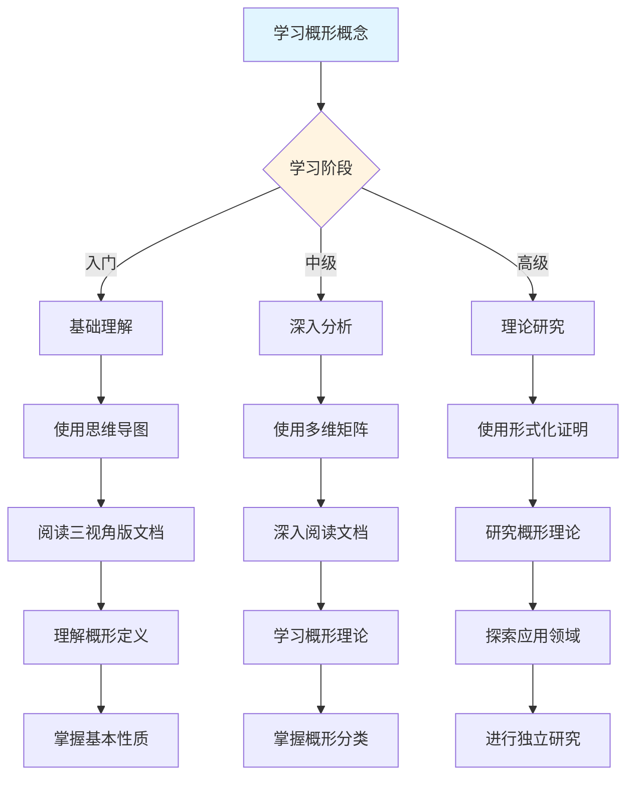
```mermaid
graph TD
    A[学习概形概念] --> B{学习阶段}
    B -->|入门| C[基础理解]
    B -->|中级| D[深入分析]
    B -->|高级| E[理论研究]

    C --> C1[使用思维导图]
    C1 --> C2[阅读三视角版文档]
    C2 --> C3[理解概形定义]
    C3 --> C4[掌握基本性质]

    D --> D1[使用多维矩阵]
    D1 --> D2[深入阅读文档]
    D2 --> D3[学习概形理论]
    D3 --> D4[掌握概形分类]

    E --> E1[使用形式化证明]
    E1 --> E2[研究概形理论]
    E2 --> E3[探索应用领域]
    E3 --> E4[进行独立研究]

    style A fill:#e1f5ff
    style B fill:#fff4e1
```

### 1.2 学习重点决策

**基于知识矩阵的学习重点**：

| 学习阶段 | 知识层次 | 学习重点 | 推荐资源 |
|---------|---------|---------|---------|
| **入门** | L0基础 | 概形的定义、基本例子 | 思维导图、三视角版文档 |
| **入门** | L0基础 | 概形的直观理解（代数几何、局部化） | 三视角版文档、应用实例 |
| **中级** | L1中级 | 概形理论 | 多维矩阵、形式化证明 |
| **中级** | L1中级 | 概形分类 | 三视角版文档、习题库 |
| **高级** | L2高级 | 概形几何 | 形式化证明系统 |
| **高级** | L2高级 | 概形上同调 | 形式化证明系统 |

### 1.3 学习方法决策

**基于认知维度的学习方法**：

1. **直观维度**（入门阶段）
   - 使用思维导图建立总体框架
   - 使用具体例子理解概念（仿射概形、射影概形）
   - 使用几何直观理解概形

2. **知性维度**（中级阶段）
   - 使用多维矩阵分析概念特征
   - 使用概念分类系统理解（仿射概形、射影概形、概形态射）
   - 使用关系分析建立联系（与代数几何、层、环的关系）

3. **理性维度**（高级阶段）
   - 使用形式化证明严格理解
   - 使用逻辑推理深入分析
   - 使用系统建构整体把握

---

## 🔬 二、研究决策导图 (编号: C.CORE.021.DECISION.02)

### 2.1 研究方向决策

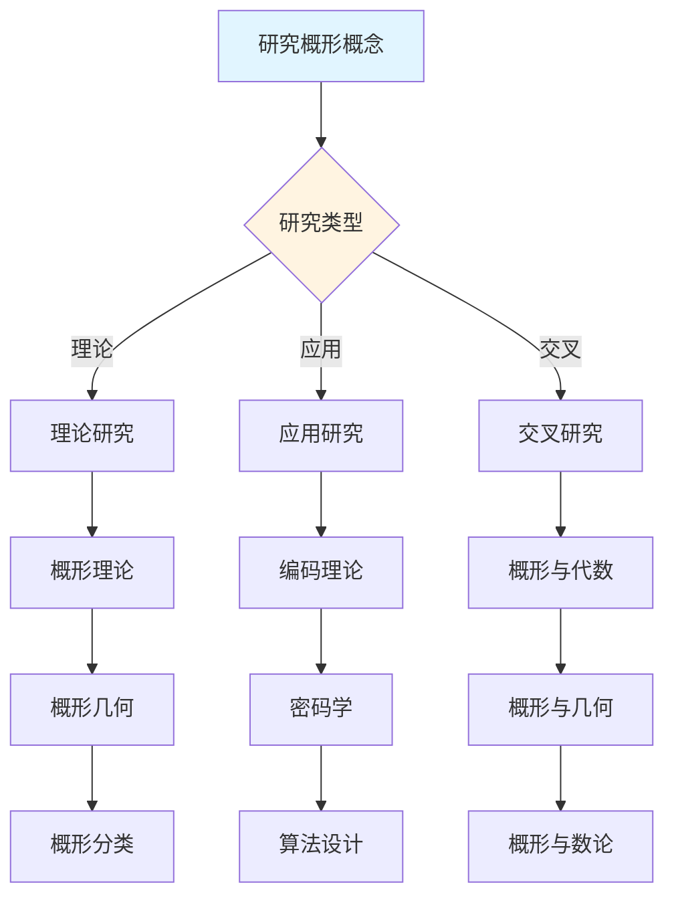
```mermaid
graph TD
    A[研究概形概念] --> B{研究类型}
    B -->|理论| C[理论研究]
    B -->|应用| D[应用研究]
    B -->|交叉| E[交叉研究]

    C --> C1[概形理论]
    C1 --> C2[概形几何]
    C2 --> C3[概形分类]

    D --> D1[编码理论]
    D1 --> D2[密码学]
    D2 --> D3[算法设计]

    E --> E1[概形与代数]
    E1 --> E2[概形与几何]
    E2 --> E3[概形与数论]

    style A fill:#e1f5ff
    style B fill:#fff4e1
```

### 2.2 研究问题决策

**基于知识矩阵的研究问题**：

1. **理论研究问题**
   - 概形理论：概形的分类和性质
   - 概形几何：概形的几何结构
   - 概形分类：概形的分类理论

2. **应用研究问题**
   - 编码理论：概形在编码理论中的应用（代数曲线码）
   - 密码学：概形在密码学中的应用（椭圆曲线密码）
   - 算法设计：概形在算法设计中的应用

3. **交叉研究问题**
   - 概形与代数：概形在代数中的应用
   - 概形与几何：概形在几何中的应用
   - 概形与数论：概形在数论中的应用

### 2.3 研究方法决策

**基于形式化证明的研究方法**：

1. **构造性证明** → 概形的构造
   - 直接构造概形
   - 适用于具体概形

2. **代数方法** → 概形理论
   - 使用代数方法
   - 适用于概形理论

3. **几何方法** → 概形几何
   - 使用几何方法
   - 适用于概形几何

---

## 💼 三、应用决策导图 (编号: C.CORE.021.DECISION.03)

### 3.1 应用场景决策

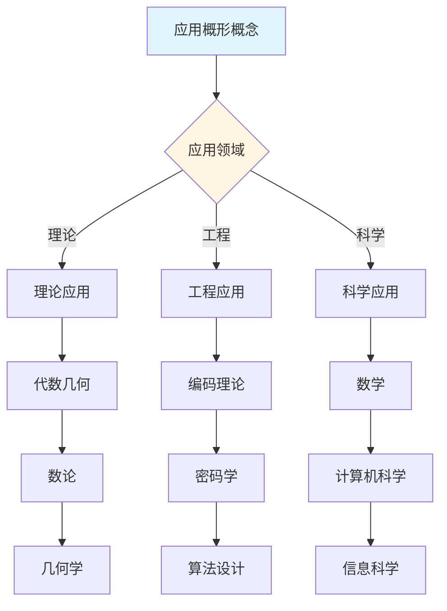
```mermaid
graph TD
    A[应用概形概念] --> B{应用领域}
    B -->|理论| C[理论应用]
    B -->|工程| D[工程应用]
    B -->|科学| E[科学应用]

    C --> C1[代数几何]
    C1 --> C2[数论]
    C2 --> C3[几何学]

    D --> D1[编码理论]
    D1 --> D2[密码学]
    D2 --> D3[算法设计]

    E --> E1[数学]
    E1 --> E2[计算机科学]
    E2 --> E3[信息科学]

    style A fill:#e1f5ff
    style B fill:#fff4e1
```

### 3.2 应用方法决策

**基于应用场景的应用方法**：

1. **理论应用** → 使用形式化证明
   - 代数几何：概形是代数几何的基础
   - 数论：概形在数论中的应用
   - 几何学：概形在几何中的应用

2. **工程应用** → 使用论证过程
   - 编码理论：概形在编码理论中的应用（代数曲线码）
   - 密码学：概形在密码学中的应用（椭圆曲线密码）
   - 算法设计：概形在算法设计中的应用

3. **科学应用** → 使用综合方法
   - 数学：概形在数学中的应用
   - 计算机科学：概形在计算机科学中的应用
   - 信息科学：概形在信息科学中的应用

---

## 🎓 四、教学决策导图 (编号: C.CORE.021.DECISION.04)

### 4.1 教学内容决策

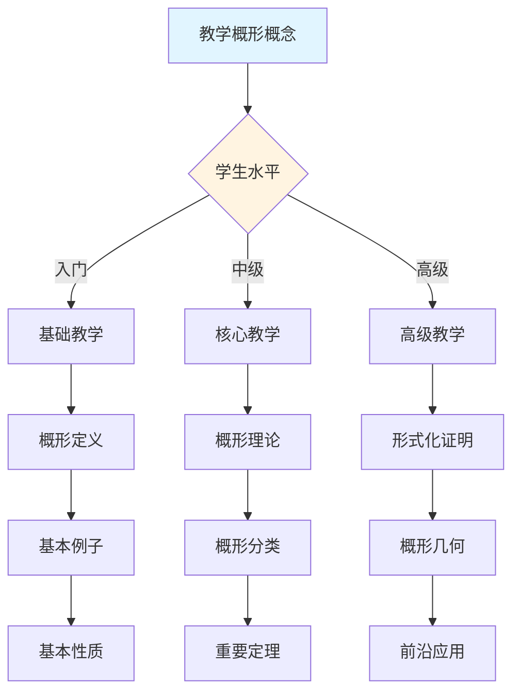
```mermaid
graph TD
    A[教学概形概念] --> B{学生水平}
    B -->|入门| C[基础教学]
    B -->|中级| D[核心教学]
    B -->|高级| E[高级教学]

    C --> C1[概形定义]
    C1 --> C2[基本例子]
    C2 --> C3[基本性质]

    D --> D1[概形理论]
    D1 --> D2[概形分类]
    D2 --> D3[重要定理]

    E --> E1[形式化证明]
    E1 --> E2[概形几何]
    E2 --> E3[前沿应用]

    style A fill:#e1f5ff
    style B fill:#fff4e1
```

### 4.2 教学方法决策

**基于认知维度的教学方法**：

1. **直观维度**（入门教学）
   - 使用思维导图建立框架
   - 使用具体例子（仿射概形、射影概形）
   - 使用几何直观理解

2. **知性维度**（中级教学）
   - 使用多维矩阵深入分析
   - 使用概念分类系统
   - 使用关系分析建立联系

3. **理性维度**（高级教学）
   - 使用形式化证明严格理解
   - 使用逻辑推理深入分析
   - 使用系统建构整体把握

---

## 🔄 五、整合应用示例 (编号: C.CORE.021.DECISION.05)

### 5.1 完整学习流程示例

**阶段1：入门理解**:

1. 使用学习决策导图 → 确定学习路径：基础概念 → 概形定义 → 基本性质 → 基本应用
2. 使用总体思维导图 → 了解概形在几何学中的位置
3. 阅读[概形-三视角版](./21-概形.md) → 理解概形的定义和基本性质
4. 使用论证过程 → 理解概形的直观意义（代数几何、局部化、结构层）

**阶段2：深入分析**:

1. 使用多维矩阵 → 分析概形的多维度特征（知识层次L0基础层、知识领域D4几何、学习难度很高）
2. 阅读[概形-三视角版](./21-概形.md) → 深入理解概形理论和概形分类
3. 使用形式化证明 → 学习概形相关定理的形式化证明
4. 使用分支关联思维导图 → 了解概形与代数几何、层、环的关系

**阶段3：应用研究**:

1. 使用研究决策导图 → 确定研究方向：概形理论
2. 使用知识关联网络 → 发现概形与代数、几何、数论的关系
3. 使用形式化证明系统 → 构建概形理论体系
4. 阅读[概形-三视角版](./21-概形.md) → 了解概形的历史发展和开放问题

---

## 🔗 六、关联文档 (编号: C.CORE.021.DECISION.06)

### 6.1 核心概念文档

- [概形-三视角版](./21-概形.md)
- [概形](./21-概形.md)

### 6.2 框架文档

- [决策思维导图体系](../01-总体思维导图/05-决策思维导图体系.md)
- [概念体系全面梳理与推进计划](../00-概念体系全面梳理与推进计划-2025年1月.md)
- [核心概念与新框架整合指南](../00-核心概念与新框架整合指南-2025年1月.md)

### 6.3 相关文档

- [核心概念索引](./00-核心概念索引.md)
- [知识矩阵总览](../02-知识矩阵/00-知识矩阵总览.md)
- [形式化证明系统](../00-形式化证明系统-2025年11月.md)

---

**维护状态**: 持续更新中

