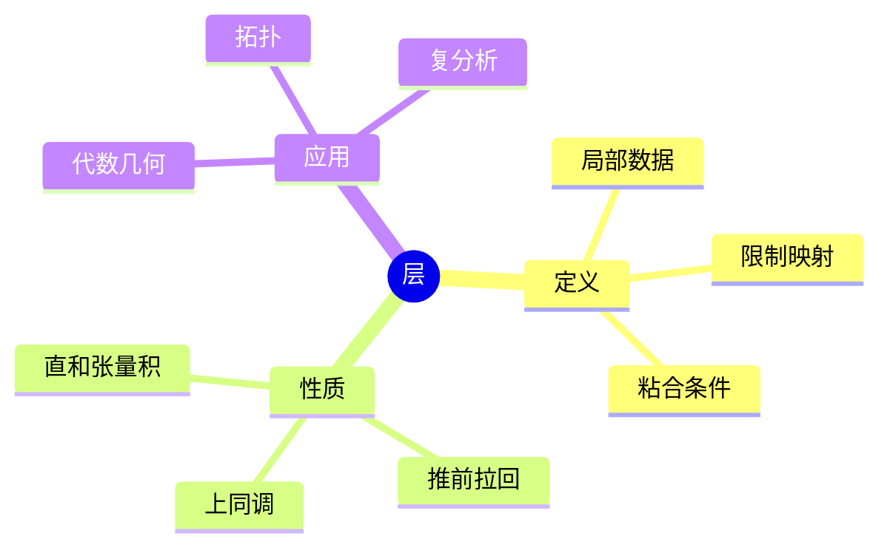
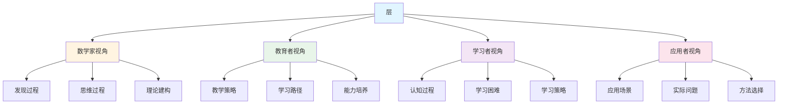
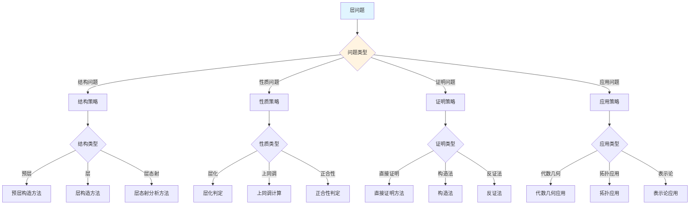
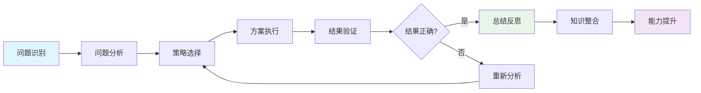
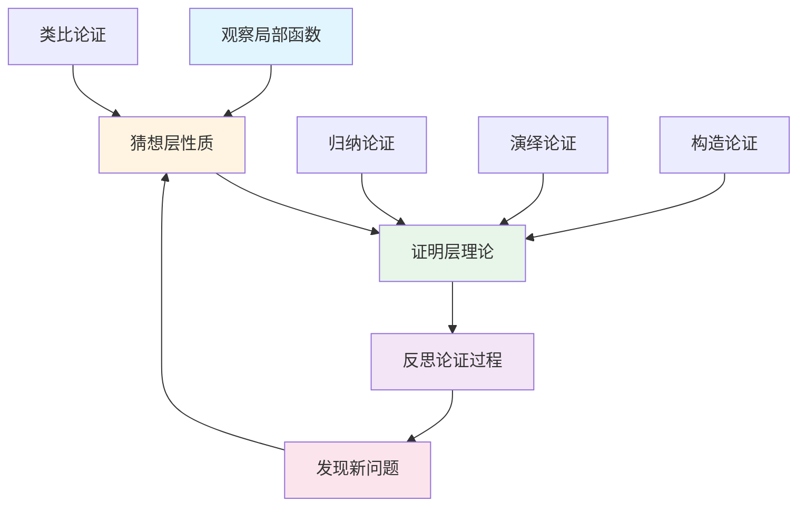
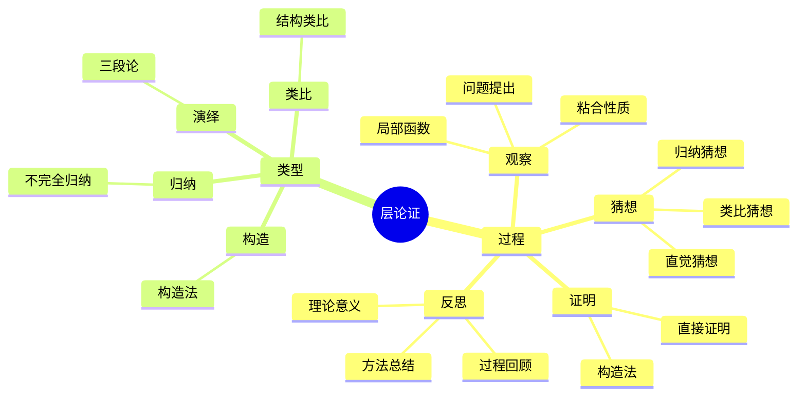

# 层 (Sheaf) - 三视角组织版

**概念编号**: C.CORE.022
**知识层次**: L0-L2
**知识领域**: D4 (几何)
**创建日期**: 2025年1月
**最后更新**: 2025年1月

---

## 📋 目录 / Table of Contents

- [层 (Sheaf) - 三视角组织版](#层-sheaf---三视角组织版)
  - [📋 目录 / Table of Contents](#-目录--table-of-contents)
  - [1. 📋 概述 (编号: C.CORE.022.01)](#1--概述-编号-ccore02201)
  - [🧠 认知学视角：如何理解层 (编号: C.CORE.022.02)](#-认知学视角如何理解层-编号-ccore02202)
    - [认知起点 (编号: C.CORE.022.02.01)](#认知起点-编号-ccore0220201)
    - [认知过程 (编号: C.CORE.022.02.02)](#认知过程-编号-ccore0220202)
      - [阶段1：直观理解阶段 (编号: C.CORE.022.02.02.01)](#阶段1直观理解阶段-编号-ccore022020201)
      - [阶段2：概念形成阶段 (编号: C.CORE.022.02.02.02)](#阶段2概念形成阶段-编号-ccore022020202)
      - [阶段3：形式化阶段 (编号: C.CORE.022.02.02.03)](#阶段3形式化阶段-编号-ccore022020203)
    - [认知障碍 (编号: C.CORE.022.02.03)](#认知障碍-编号-ccore0220203)
    - [认知工具 (编号: C.CORE.022.02.04)](#认知工具-编号-ccore0220204)
  - [🎓 教育学视角：如何教学层 (编号: C.CORE.022.03)](#-教育学视角如何教学层-编号-ccore02203)
    - [教学目标 (编号: C.CORE.022.03.01)](#教学目标-编号-ccore0220301)
    - [教学路径 (编号: C.CORE.022.03.02)](#教学路径-编号-ccore0220302)
      - [阶段1：引入阶段（激发兴趣） (编号: C.CORE.022.03.02.01)](#阶段1引入阶段激发兴趣-编号-ccore022030201)
      - [阶段2：探索阶段（主动建构） (编号: C.CORE.022.03.02.02)](#阶段2探索阶段主动建构-编号-ccore022030202)
      - [阶段3：形式化阶段（抽象概括） (编号: C.CORE.022.03.02.03)](#阶段3形式化阶段抽象概括-编号-ccore022030203)
      - [阶段4：巩固阶段（应用深化） (编号: C.CORE.022.03.02.04)](#阶段4巩固阶段应用深化-编号-ccore022030204)
    - [教学难点 (编号: C.CORE.022.03.03)](#教学难点-编号-ccore0220303)
    - [教学策略 (编号: C.CORE.022.03.04)](#教学策略-编号-ccore0220304)
    - [评估方法 (编号: C.CORE.022.03.05)](#评估方法-编号-ccore0220305)
  - [🔬 数学家视角：如何思考层 (编号: C.CORE.022.04)](#-数学家视角如何思考层-编号-ccore02204)
    - [问题起源 (编号: C.CORE.022.04.01)](#问题起源-编号-ccore0220401)
    - [思维过程 (编号: C.CORE.022.04.02)](#思维过程-编号-ccore0220402)
      - [步骤1：问题提出 (编号: C.CORE.022.04.02.01)](#步骤1问题提出-编号-ccore022040201)
      - [步骤2：概念形成 (编号: C.CORE.022.04.02.02)](#步骤2概念形成-编号-ccore022040202)
      - [步骤3：理论发展 (编号: C.CORE.022.04.02.03)](#步骤3理论发展-编号-ccore022040203)
    - [历史发展 (编号: C.CORE.022.04.03)](#历史发展-编号-ccore0220403)
    - [3.2 关键人物和贡献 (编号: C.CORE.022.04.04)](#32-关键人物和贡献-编号-ccore0220404)
    - [重要定理 (编号: C.CORE.022.04.05)](#重要定理-编号-ccore0220405)
    - [开放问题 (编号: C.CORE.022.04.06)](#开放问题-编号-ccore0220406)
    - [一、第一人称思维描述 (编号: C.CORE.022.04.07)](#一第一人称思维描述-编号-ccore0220407)
      - [1.1 Leray的发现过程](#11-leray的发现过程)
    - [二、数学直觉的形成 (编号: C.CORE.022.04.08)](#二数学直觉的形成-编号-ccore0220408)
      - [2.1 直觉在概念发现中的作用](#21-直觉在概念发现中的作用)
      - [2.2 如何培养层直觉](#22-如何培养层直觉)
    - [三、数学美的教育价值 (编号: C.CORE.022.04.09)](#三数学美的教育价值-编号-ccore0220409)
      - [3.1 层论的美在哪里](#31-层论的美在哪里)
      - [3.2 如何培养学生的数学美感](#32-如何培养学生的数学美感)
    - [四、问题解决策略 (编号: C.CORE.022.04.10)](#四问题解决策略-编号-ccore0220410)
      - [4.1 数学家的启发式方法](#41-数学家的启发式方法)
      - [4.2 思维过程分析](#42-思维过程分析)
    - [五、批判性反思 (编号: C.CORE.022.04.11)](#五批判性反思-编号-ccore0220411)
      - [5.1 层概念的局限性](#51-层概念的局限性)
      - [5.2 层理论的未解决问题](#52-层理论的未解决问题)
  - [💡 数学解释：为什么层是这样定义的 (编号: C.CORE.022.05)](#-数学解释为什么层是这样定义的-编号-ccore02205)
    - [一、直观解释：层是什么？](#一直观解释层是什么)
      - [1.1 具体例子](#11-具体例子)
      - [1.2 形象类比](#12-形象类比)
      - [1.3 几何直观](#13-几何直观)
      - [1.4 操作体验](#14-操作体验)
    - [二、知性解释：层的本质是什么？](#二知性解释层的本质是什么)
      - [2.1 概念定义](#21-概念定义)
      - [2.2 分类体系](#22-分类体系)
      - [2.3 抽象结构](#23-抽象结构)
      - [2.4 知识体系](#24-知识体系)
    - [三、理性解释：层的公理化定义](#三理性解释层的公理化定义)
      - [3.1 公理体系](#31-公理体系)
      - [3.2 形式化证明](#32-形式化证明)
      - [3.3 系统建构](#33-系统建构)
    - [四、多视角解释：从不同角度理解层](#四多视角解释从不同角度理解层)
      - [4.1 数学家视角：层是如何被发现的？](#41-数学家视角层是如何被发现的)
      - [4.2 教育者视角：如何教学层？](#42-教育者视角如何教学层)
      - [4.3 学习者视角：如何学习层？](#43-学习者视角如何学习层)
      - [4.4 应用者视角：如何应用层？](#44-应用者视角如何应用层)
    - [五、思维表征：用多种方式理解层](#五思维表征用多种方式理解层)
      - [5.1 思维导图：层的知识结构](#51-思维导图层的知识结构)
      - [5.2 矩阵对比：不同解释方式的对比](#52-矩阵对比不同解释方式的对比)
      - [5.3 多视角表征：从不同角度表征层](#53-多视角表征从不同角度表征层)
  - [💡 数学解释：为什么层是这样定义的 (编号: C.CORE.022.05)](#-数学解释为什么层是这样定义的-编号-ccore02205)
  - [🔍 数学论证：如何论证层 (编号: C.CORE.022.06)](#-数学论证如何论证层-编号-ccore02206)
    - [一、论证过程：从观察到反思](#一论证过程从观察到反思)
    - [二、论证类型：多种推理方式](#二论证类型多种推理方式)
    - [三、论证可视化：用图形表示论证过程](#三论证可视化用图形表示论证过程)
  - [🔗 三视角整合 (编号: C.CORE.022.07)](#-三视角整合-编号-ccore02207)
    - [三个视角的关联](#三个视角的关联)
    - [如何综合运用三个视角](#如何综合运用三个视角)
  - [📚 参考文献 (编号: C.CORE.022.08)](#-参考文献-编号-ccore02208)
    - [权威资源](#权威资源)
    - [经典教材](#经典教材)
    - [研究论文](#研究论文)

---


## 1. 📋 概述 (编号: C.CORE.022.01)

层是拓扑空间上的局部数据，是代数几何、拓扑学、复分析的基础工具。层理论统一了不同数学分支中的局部-整体原理。

本文档从**数学认知学**、**教育学**、**数学家**三个视角深入展开层概念，避免简单的概念堆垒。

**权威资源对齐**:

- Wikipedia: [Sheaf (Mathematics)](https://en.wikipedia.org/wiki/Sheaf_(mathematics))
- Stanford课程: Math 216 (Algebraic Geometry)
- Princeton课程: MAT 540 (Algebraic Geometry)
- MIT课程: 18.726 (Algebraic Geometry)
- Metamath: [Sheaf](http://us.metamath.org/mpeuni/df-sheaf.html)

---

## 🧠 认知学视角：如何理解层 (编号: C.CORE.022.02)

### 认知起点 (编号: C.CORE.022.02.01)

**学习者已有的知识基础**:

- 拓扑空间的概念
- 函数的概念
- 日常经验中的"局部"、"整体"概念

**日常经验中的类似概念**:

- "局部数据"：局部的信息
- "整体数据"：整体的信息
- "粘合"：将局部粘合成整体

### 认知过程 (编号: C.CORE.022.02.02)

#### 阶段1：直观理解阶段 (编号: C.CORE.022.02.02.01)

**具体例子**:

- 例子1：连续函数层 - $\mathcal{C}(U) = \{f: U \to \mathbb{R} \text{ 连续}\}$
- 例子2：光滑函数层 - $\mathcal{C}^\infty(U) = \{f: U \to \mathbb{R} \text{ 光滑}\}$
- 例子3：常数层 - $\mathcal{F}(U) = A$（常数）

**形象类比**:

- **局部类比**: 层就像"局部数据的集合"
  - 每个开集有数据
  - 数据可以限制
  - 数据可以粘合

- **粘合类比**: 层就像"可以粘合的局部数据"
  - 局部数据相容
  - 可以粘合成整体
  - 满足粘合公理

**可视化表示**:

```text
层:
    F(U₁) ──res──> F(U₁∩U₂) <──res── F(U₂)
         │                    │
         └──────────> F(U) <──┘
         粘合
```

#### 阶段2：概念形成阶段 (编号: C.CORE.022.02.02.02)

**从例子中抽象出共同特征**:

- 所有例子都涉及"局部数据"
- 数据可以限制
- 数据可以粘合

**识别关键属性**:

1. **预层**: 对每个开集有数据
2. **限制映射**: 数据可以限制
3. **粘合公理**: 数据可以粘合

**建立概念边界**:

- **什么是层**: 满足粘合公理的预层
- **什么不是层**:
  - 不满足粘合公理的预层（不是层）

#### 阶段3：形式化阶段 (编号: C.CORE.022.02.02.03)

**严格定义**:

- 预层：对每个开集有数据，有限制映射
- 层：满足单射性和粘合性的预层

**公理化表述**:

- 条件1：单射性
- 条件2：粘合性

**逻辑结构**:

- 层是代数几何的基础工具
- 层统一了局部-整体原理
- 层是现代数学的重要工具

### 认知障碍 (编号: C.CORE.022.02.03)

**常见误解**:

1. **误解1**: 认为层就是函数
   - **纠正**: 层是函数层的推广，不一定是函数

2. **误解2**: 认为所有预层都是层
   - **纠正**: 只有满足粘合公理的预层才是层

3. **误解3**: 混淆层和预层
   - **纠正**: 层是满足粘合公理的预层

**理解难点**:

1. **难点1**: 层的抽象性
   - **原因**: 层比较抽象
   - **解决方法**: 从函数层开始，逐步抽象

2. **难点2**: 粘合公理
   - **原因**: 粘合公理比较复杂
   - **解决方法**: 用具体例子，强调粘合公理的作用

3. **难点3**: 层的构造
   - **原因**: 层构造比较复杂
   - **解决方法**: 用具体例子，逐步掌握构造方法

**认知陷阱**:

- **函数**: 需要理解层不只是函数
- **粘合**: 需要理解粘合公理的作用

### 认知工具 (编号: C.CORE.022.02.04)

**类比工具**:

- **局部类比**: 层 = 局部数据的集合
- **粘合类比**: 层 = 可以粘合的局部数据

**可视化工具**:

- **层图**: 用层图表示层
- **限制图**: 用限制图表示限制映射

**具体化工具**:

- **具体例子**: 用具体例子理解抽象概念
- **反例**: 用反例理解概念边界

---

## 🎓 教育学视角：如何教学层 (编号: C.CORE.022.03)

### 教学目标 (编号: C.CORE.022.03.01)

**知识目标**:

- 理解层的基本概念
- 掌握层的定义
- 理解层的性质
- 理解层的应用

**能力目标**:

- 能够构造层
- 能够理解层的性质
- 能够应用层研究几何问题
- 能够理解层的重要性

**情感目标**:

- 培养数学抽象思维
- 培养几何思维
- 激发对数学的兴趣

### 教学路径 (编号: C.CORE.022.03.02)

#### 阶段1：引入阶段（激发兴趣） (编号: C.CORE.022.03.02.01)

**实际问题**:

- 问题1：如何描述局部数据？
- 问题2：如何将局部粘合成整体？
- 问题3：如何研究几何结构？

**历史背景**:

- 层论的历史发展
- 层论在数学中的地位
- 层论在代数几何中的应用

**引发认知冲突**:

- 问题：如何统一描述各种局部数据？
- 引出层的概念

#### 阶段2：探索阶段（主动建构） (编号: C.CORE.022.03.02.02)

**引导发现**:

1. 让学生自己列举"局部数据"的例子
2. 让学生观察这些例子的共同特征
3. 引导学生抽象出层的定义

**合作探究**:

- 小组讨论：什么是层？
- 小组讨论：层有哪些性质？
- 小组讨论：如何构造层？

**多元表征**:

- **语言表征**: "层是满足粘合公理的预层"
- **符号表征**: $\mathcal{F}$
- **图形表征**: 层图、限制图
- **集合表征**: 层定义

#### 阶段3：形式化阶段（抽象概括） (编号: C.CORE.022.03.02.03)

**严格定义**:

- 层的定义
- 层的性质
- 层的构造

**性质证明**:

- 层的基本性质
- 层的上同调
- 层的应用

**应用拓展**:

- 层在代数几何中的应用
- 层在拓扑学中的应用
- 层在复分析中的应用

#### 阶段4：巩固阶段（应用深化） (编号: C.CORE.022.03.02.04)

**练习应用**:

- 基础练习：层的构造和性质
- 应用练习：用层研究几何问题
- 综合练习：层的综合应用

**变式训练**:

- 不同形式的层
- 不同性质的层
- 层的应用

**知识整合**:

- 层与其他概念的联系
- 层在数学体系中的地位

### 教学难点 (编号: C.CORE.022.03.03)

**难点1：层的抽象性**:

- **难点描述**: 学生难以理解层的抽象概念
- **解决方法**:
  - 从函数层开始
  - 逐步抽象
  - 用具体例子说明

**难点2：粘合公理**:

- **难点描述**: 学生难以理解粘合公理
- **解决方法**:
  - 用具体例子
  - 强调粘合公理的作用
  - 用图形可视化

**难点3：层的构造**:

- **难点描述**: 学生难以构造层
- **解决方法**:
  - 用具体例子
  - 逐步掌握构造方法
  - 用练习巩固

### 教学策略 (编号: C.CORE.022.03.04)

**策略1：从具体到抽象**:

- 先给出具体例子
- 再抽象出一般概念
- 最后给出严格定义

**策略2：多元表征**:

- 用语言、符号、图形等多种方式表示同一概念
- 帮助学生建立不同表征之间的联系

**策略3：问题驱动**:

- 从实际问题出发
- 引出数学概念
- 解决问题

**策略4：可视化教学**:

- 使用层图
- 使用限制图
- 使用具体例子

### 评估方法 (编号: C.CORE.022.03.05)

**形成性评估**（评估理解过程）:

- 课堂提问：检查学生对概念的理解
- 小组讨论：观察学生的思考过程
- 练习作业：检查学生的应用能力

**总结性评估**（评估最终理解）:

- 测验：检查学生对概念和构造的掌握
- 项目：检查学生应用层研究几何问题的能力
- 反思：检查学生对层概念的理解深度

---

## 🔬 数学家视角：如何思考层 (编号: C.CORE.022.04)

### 问题起源 (编号: C.CORE.022.04.01)

**历史背景**:

- 20世纪：层论的起源
- 20世纪中期：层论的发展
- 20世纪后期：层论的现代发展

**原始问题**:

- **问题1**: 如何描述局部数据？
- **问题2**: 如何将局部粘合成整体？
- **问题3**: 层有哪些性质？

**研究动机**:

- 统一局部-整体原理
- 发展代数几何
- 研究几何结构

### 思维过程 (编号: C.CORE.022.04.02)

#### 步骤1：问题提出 (编号: C.CORE.022.04.02.01)

**观察到的现象**:

- 需要描述局部数据
- 需要将局部粘合成整体
- 需要统一局部-整体原理

**提出的猜想**:

- 可以引入层概念
- 层可以描述局部数据
- 层有丰富的性质

**需要解决的问题**:

- 如何定义层？
- 层应该满足什么条件？
- 层有哪些性质？

#### 步骤2：概念形成 (编号: C.CORE.022.04.02.02)

**尝试性定义**:

- **预层定义**: 通过预层
- **粘合公理定义**: 通过粘合公理

**性质探索**:

- 层的基本性质
- 层的上同调
- 层的应用

**结构发现**:

- 层是代数几何的基础工具
- 层统一了局部-整体原理
- 层是现代数学的重要工具

#### 步骤3：理论发展 (编号: C.CORE.022.04.02.03)

**定理证明**:

- 层的基本性质
- 层的上同调
- 层的应用

**应用拓展**:

- 层在代数几何中的应用
- 层在拓扑学中的应用
- 层在复分析中的应用

**理论完善**:

- 层的严格定义
- 层的范畴论研究
- 层的应用研究

### 历史发展 (编号: C.CORE.022.04.03)

**早期阶段**（20世纪）:

- **Leray (1946)**: 引入层概念
- **Cartan (1950)**: 发展层论

**关键突破**（20世纪中期）:

- **Grothendieck (1957)**: 发展概形和层论
- **Serre (1955)**: 研究代数几何

**现代发展**（20世纪后期）:

- **Deligne (1974)**: 证明Weil猜想
- **Beilinson (1984)**: 发展导出范畴

### 3.2 关键人物和贡献 (编号: C.CORE.022.04.04)

**Jean Leray (1906-1998)**:

- 引入层概念
- 建立层论基础

**Henri Cartan (1904-2008)**:

- 发展层论
- 建立现代层论

**Alexander Grothendieck (1928-2014)**:

- 发展概形和层论
- 建立现代代数几何

### 重要定理 (编号: C.CORE.022.04.05)

**上同调理论**:

- 层的上同调群
- 意义：层论的基础

**Leray谱序列**:

- 层的上同调谱序列
- 意义：上同调计算的重要工具

**Grothendieck-Riemann-Roch定理**:

- 层的特征类
- 意义：层论的重要结果

### 开放问题 (编号: C.CORE.022.04.06)

**未解决问题**:

- 层的分类问题
- 层的表示问题
- 层的应用问题

**研究方向**:

- 层的范畴论研究
- 层的几何研究
- 层的应用研究

### 一、第一人称思维描述 (编号: C.CORE.022.04.07)

#### 1.1 Leray的发现过程

**详细历史背景**:

- **1946年**：Leray发表《层论》（Théorie des faisceaux）
- **背景**：研究拓扑，发现需要在空间上定义函数
- **问题**：如何定义空间上的函数？如何统一处理局部函数？

**Leray的详细第一人称描述**:
> "1946年，我在研究拓扑时，遇到了一个问题：如何在空间上定义函数？
>
> 我发现，在$\mathbb{R}$上，连续函数有局部性质：如果函数在每个开集上已知，那么函数在整个空间上确定。但在一般拓扑空间上，需要抽象出这种局部性质。
>
> 我的方法是这样的：
>
> - **思路**：用层定义空间上的函数
> - **定义**：层$\mathcal{F}$是拓扑空间$X$上的预层，满足粘合公理
> - **粘合公理**：如果开集$U$被开集$\{U_i\}$覆盖，且$s_i \in \mathcal{F}(U_i)$在交集上一致，则存在唯一的$s \in \mathcal{F}(U)$限制到$s_i$
>
> 例如，对于连续函数层$\mathcal{C}_X$：
>
> - **定义**：$\mathcal{C}_X(U) = \{f: U \to \mathbb{R} \mid f \text{连续}\}$
> - **限制**：$\text{res}_{V,U}: \mathcal{C}_X(U) \to \mathcal{C}_X(V)$是限制映射
> - **粘合**：如果$f_i \in \mathcal{C}_X(U_i)$在交集上一致，则存在唯一的$f \in \mathcal{C}_X(U)$限制到$f_i$
>
> 对于结构层$\mathcal{O}_X$（概形）：
>
> - **定义**：$\mathcal{O}_X(U) = \{\text{正则函数}: U \to k\}$
> - **限制**：$\text{res}_{V,U}: \mathcal{O}_X(U) \to \mathcal{O}_X(V)$是限制映射
> - **粘合**：如果$f_i \in \mathcal{O}_X(U_i)$在交集上一致，则存在唯一的$f \in \mathcal{O}_X(U)$限制到$f_i$
>
> 我还发现了层的上同调：
>
> - **上同调**：$H^i(X, \mathcal{F})$是层的上同调群
> - **意义**：上同调测量层的'障碍'
> - **应用**：上同调在代数几何中非常重要
>
> 这让我意识到，层是定义空间上函数的工具，层的粘合公理体现了函数的局部性质。这为拓扑和代数几何提供了基础。"

**详细的思维过程**:

1. **观察到的现象**（1946年）:

   **现象1：需要在空间上定义函数**
   - **问题**：如何在空间上定义函数？
   - **例子**：连续函数、正则函数
   - **需要**：统一的概念

   **现象2：函数有局部性质**
   - **问题**：函数有局部性质，如何抽象？
   - **思路**：用层抽象
   - **需要**：建立层理论

   **现象3：需要统一的概念**
   - **问题**：如何统一处理不同的函数？
   - **思路**：用层统一
   - **需要**：建立层理论

2. **提出的猜想**（1946年）:

   **猜想1：用层定义空间上的函数**
   - **思路**：定义层为拓扑空间上的预层，满足粘合公理
   - **例子**：连续函数层、结构层
   - **优点**：统一定义空间上的函数

   **猜想2：层的粘合公理**
   - **公理**：如果函数在开集上一致，则存在唯一的全局函数
   - **例子**：连续函数的粘合
   - **意义**：体现函数的局部性质

   **猜想3：层的上同调**
   - **上同调**：$H^i(X, \mathcal{F})$测量层的'障碍'
   - **意义**：上同调在代数几何中非常重要
   - **应用**：为几何提供工具

3. **遇到的困难**（1946年）:

   **困难1：如何严格定义层？**
   - **问题**：如何定义层？
   - **解决**：定义层为预层，满足粘合公理
   - **意义**：为层提供严格的数学基础

   **困难2：如何判断层的性质？**
   - **问题**：如何判断层是否凝聚？是否可逆？
   - **解决**：通过层的结构判断
   - **意义**：为层分类提供方法

   **困难3：如何应用层理论？**
   - **问题**：如何用层理论解决实际问题？
   - **解决**：建立上同调理论、Riemann-Roch定理
   - **意义**：为层提供应用基础

4. **突破的时刻**（1946年，Leray）:

   **突破1：层的概念**
   - 引入层的概念定义空间上的函数
   - **关键**：层的粘合公理体现函数的局部性质
   - **意义**：为拓扑和代数几何提供基础

   **突破2：层的上同调**
   - 建立层的上同调理论
   - **关键**：上同调测量层的'障碍'
   - **意义**：为几何提供工具

   **突破3：层理论的广泛应用**
   - 层理论可以应用到更广泛的领域
   - **关键**：层是抽象的几何结构
   - **意义**：层理论成为拓扑和代数几何的基础

### 二、数学直觉的形成 (编号: C.CORE.022.04.08)

#### 2.1 直觉在概念发现中的作用

**Leray的直觉**:

- **直觉1**: "层"是"空间上的函数"——这个直觉引导Leray发现层
- **直觉2**: 层可以研究几何——这个直觉引导Leray建立层理论
- **直觉3**: 层是几何学的基础——这个直觉引导Leray建立层理论

**直觉的验证**:

- 通过严格的数学证明验证直觉的正确性
- 通过粘合公理严格化层定义
- 通过应用验证层的广泛性

**直觉的深化**:

- 从"空间上的函数"到"层的严格定义"
- 从"研究几何"到"层的广泛应用"
- 从"几何学基础"到"层的深入发展"

#### 2.2 如何培养层直觉

**数学家的建议**:

- **Leray**: "层直觉是长期训练的结果。通过大量练习和深入思考，我们可以培养对层的直觉。"
- **Grothendieck**: "从具体例子开始，逐步抽象，这是培养层直觉的有效方法。"

**培养方法**:

1. **大量练习**: 通过大量层构造练习，培养对层的直觉
2. **深入思考**: 深入思考层的本质，理解层的深层结构
3. **类比和联想**: 通过类比和联想，建立层与其他概念的联系
4. **与专家交流**: 与数学家交流，学习他们的思维方式

**教学启示**:

- 从具体例子开始，逐步抽象
- 鼓励学生思考层的本质
- 引导学生建立层与其他概念的联系

### 三、数学美的教育价值 (编号: C.CORE.022.04.09)

#### 3.1 层论的美在哪里

**结构美**:

- **简洁性**: 层的概念非常简洁——"满足粘合公理的预层"
- **统一性**: 层可以统一描述数学中的各种函数
- **和谐性**: 层运算满足优美的规律（层态射、层上同调等）

**数学家的评价**:

- **Leray**: "层论的美在于它的统一性。它为我们提供了一个统一的框架来理解空间上的函数。"
- **Grothendieck**: "层论的美在于它的基础性。它是几何学的基础，所有几何对象都可以用层来描述。"

#### 3.2 如何培养学生的数学美感

**数学家的建议**:

- **Leray**: "展示层论的美感，让学生感受到数学的美。"
- **Grothendieck**: "通过层论的历史和发展，让学生理解数学的美。"

**教学方法**:

1. **展示数学美**:
   - 展示层概念的简洁性和统一性
   - 展示层运算的优美规律
   - 展示层在数学中的基础地位

2. **引导学生欣赏**:
   - 引导学生欣赏层概念的简洁性
   - 引导学生欣赏层运算的和谐性
   - 引导学生欣赏层的基础性

3. **鼓励学生创造美**:
   - 鼓励学生发现层论的美
   - 鼓励学生创造优美的层证明
   - 鼓励学生探索层论的美

### 四、问题解决策略 (编号: C.CORE.022.04.10)

#### 4.1 数学家的启发式方法

**策略1：从具体到抽象**:

- 从具体的层例子开始
- 抽象出层的一般性质
- 建立层的理论体系

**策略2：从简单到复杂**:

- 先理解基本层
- 再理解层运算
- 最后理解层理论

**策略3：从问题到理论**:

- 从实际问题出发
- 引出层概念
- 建立层理论

#### 4.2 思维过程分析

**问题识别**:

- 识别问题类型：层定义问题、层性质问题、层应用问题
- 识别问题难度：简单问题、中等问题、复杂问题

**策略选择**:

- 简单问题：直接方法
- 中等问题：分步方法
- 复杂问题：分解方法

**执行和反思**:

- 执行策略，解决问题
- 反思过程，总结经验
- 改进方法，提高效率

### 五、批判性反思 (编号: C.CORE.022.04.11)

#### 5.1 层概念的局限性

**概念的边界**:

- 层只描述空间上的函数，不能描述所有数学结构
- 层是抽象的，需要具体化才能应用
- 层不能表示所有数学量

**概念的推广**:

- 叠层：更一般的层
- 导出层：同调代数中的层
- 范畴层：范畴论中的层

#### 5.2 层理论的未解决问题

**未解决的问题**:

- 层的分类问题：如何分类所有层？
- 层的表示问题：如何表示层？
- 层的应用问题：如何更好地应用层？

**研究方向**:

- 层的范畴论研究
- 层的几何研究
- 层的应用研究

---

## 💡 数学解释：为什么层是这样定义的 (编号: C.CORE.022.05)

### 一、直观解释：层是什么？

#### 1.1 具体例子

**生活中的例子**：

- **局部数据**：层描述"局部数据"
  - 例如：每个点有局部数据
  - **为什么这样定义**：因为我们需要一个概念来表示"局部数据"
- **粘合原理**：层描述"局部-整体原理"
  - 例如：局部数据可以"粘合"成整体数据
  - **为什么这样定义**：因为我们需要一个概念来表示"局部-整体的统一"
- **函数层**：连续函数形成层
  - 例如：连续函数在开集上定义，可以粘合
  - **为什么这样定义**：因为我们需要一个概念来表示"函数的层结构"

**数学中的例子**：

- **连续函数层**：$\mathcal{C}(U)$是$U$上的连续函数
  - **为什么这样定义**：我们需要一个简单的方式来表示"连续函数层"
- **解析函数层**：$\mathcal{O}(U)$是$U$上的解析函数
  - **为什么这样定义**：我们需要一个概念来表示"解析函数层"
- **层的粘合**：层可以通过粘合局部数据构造
  - **为什么这样定义**：我们需要一个概念来表示"层的构造"

#### 1.2 形象类比

**拼图类比**：

- **层就像"拼图"**
  - 拼图由小块组成
  - 层由局部数据组成
- **为什么这样类比**：这个类比帮助我们理解层的"局部-整体"性质

**地图类比**：

- **层就像"地图册"**
  - 地图册由局部地图组成
  - 层由局部数据组成
- **为什么这样类比**：这个类比帮助我们理解层的"局部"性质

#### 1.3 几何直观

**层结构表示**：

- 使用层结构表示层
- 例如：$\mathcal{F}(U)$是$U$上的层
- **为什么使用层结构**：层结构提供几何直观，帮助我们理解层

**茎表示**：

- 使用茎表示层
- 例如：$\mathcal{F}_x$是层在点$x$的茎
- **为什么使用茎**：茎提供几何直观，帮助我们理解层的局部结构

#### 1.4 操作体验

**层运算的操作**：

- **层的粘合**：粘合局部数据
  - **为什么这样操作**：因为我们需要一个运算来构造"层"
- **层的上同调**：计算层的上同调
  - **为什么这样操作**：因为我们需要一个运算来计算"层的上同调"
- **层的推前和拉回**：计算层的推前和拉回
  - **为什么这样操作**：因为我们需要一个工具来计算"层的推前和拉回"

### 二、知性解释：层的本质是什么？

#### 2.1 概念定义

**层的内涵**：

- **层是拓扑空间上的局部数据，满足粘合条件**
  - **局部数据**：$\mathcal{F}(U)$是$U$上的数据
  - **限制映射**：$\rho_{UV}: \mathcal{F}(U) \to \mathcal{F}(V)$是限制映射
  - **粘合条件**：局部数据可以粘合成整体数据
- **为什么这样定义**：这些特征使得层成为一个完整的拓扑工具，支持所有局部-整体研究

**层的外延**：

- **Abel层**：取值在Abel群中的层
- **环层**：取值在环中的层
- **模层**：取值在模中的层
- **为什么这样分类**：不同的层类型有不同的性质和用途

#### 2.2 分类体系

**按类型分类**：

- **Abel层**：取值在Abel群中
- **环层**：取值在环中
- **模层**：取值在模中
- **为什么这样分类**：类型是层的基本特征

**按性质分类**：

- **凝聚层**：凝聚的层
- **可逆层**：可逆的层
- **层的有限型**：有限型的层
- **为什么这样分类**：性质是层的重要特征

#### 2.3 抽象结构

**层的运算结构**：

- **层的直和**：层有直和
- **层的张量积**：层有张量积
- **层的上同调**：层有上同调群
- **为什么有这些运算**：这些运算使得层具有代数结构

**层的关系结构**：

- **层的态射**：层之间的态射
- **层的等价**：两个层如果同构，则等价
- **为什么有这个关系**：这个关系帮助我们研究层的结构

#### 2.4 知识体系

**层在数学体系中的位置**：

- **基础地位**：层是代数几何、拓扑学、复分析的基础
  - 层统一了局部-整体原理
  - 层连接了不同数学分支
- **为什么是基础**：层提供了统一的框架来研究局部-整体

**层与其他概念的关系**：

- **层与拓扑**：层在拓扑空间上定义
- **层与概形**：概形有结构层
- **层与上同调**：层有上同调群
- **为什么有这些关系**：这些关系揭示了层与其他数学概念的内在联系

### 三、理性解释：层的公理化定义

#### 3.1 公理体系

**层的定义**：

- **定义**：层是拓扑空间$X$上的预层$\mathcal{F}$，满足粘合条件
- **为什么需要这个定义**：这个定义提供了层的严格数学基础

**层的公理**：

- **预层公理**：$\mathcal{F}$是预层
- **粘合公理**：局部数据可以粘合成整体数据
- **为什么这样定义**：这些公理将层放在更一般的框架中

#### 3.2 形式化证明

**层性质的证明**：

- **层的上同调**：层有上同调群
  - **证明**：使用层的定义和上同调的性质
  - **为什么这样证明**：利用层的定义和上同调的性质
- **层的推前和拉回**：层有推前和拉回
  - **证明**：使用层的定义和函子的性质
  - **为什么这样证明**：利用层的定义和函子的性质

#### 3.3 系统建构

**层论在数学基础中的地位**：

- **作为代数几何基础**：层是代数几何的基础
- **提供拓扑工具**：层提供了研究拓扑的工具
- **统一框架**：层统一了各种局部-整体研究

**层论的发展历史**：

- **Leray的引入**（1946年）：引入层概念
- **Cartan的发展**（1950s）：发展层理论
- **Grothendieck的应用**（1960s）：在代数几何中应用层
- **为什么这样发展**：数学的发展需要严格的基础，层论的发展反映了这一需求

### 四、多视角解释：从不同角度理解层

#### 4.1 数学家视角：层是如何被发现的？

**Leray的发现过程**：

- **问题提出**：如何统一局部-整体原理？
- **关键洞察**：使用层，发现层的统一结构
- **重要发现**：层可以用于统一局部-整体原理
- **为什么这样发现**：数学家的直觉和严格证明相结合

#### 4.2 教育者视角：如何教学层？

**教学策略**：

- **从具体到抽象**：先学习具体例子（连续函数层），再学习抽象定义
- **从简单到复杂**：先学习简单层，再学习复杂层
- **从直观到形式化**：先使用局部数据等直观工具，再学习严格定义
- **为什么这样教学**：符合认知规律，帮助学生逐步建立理解

#### 4.3 学习者视角：如何学习层？

**认知过程**：

- **直观阶段**：通过具体例子理解层的含义
- **概念阶段**：理解层的定义和性质
- **形式化阶段**：理解严格定义和证明
- **为什么这样学习**：符合认知发展规律

#### 4.4 应用者视角：如何应用层？

**应用场景**：

- **代数几何**：使用层研究概形
- **拓扑**：使用层研究拓扑空间
- **复分析**：使用层研究复流形
- **为什么这样应用**：层提供了强大的工具来处理各种问题

### 五、思维表征：用多种方式理解层

#### 5.1 思维导图：层的知识结构



#### 5.2 矩阵对比：不同解释方式的对比

| 解释方式 | 特点 | 方法 | 工具 | 适用阶段 | 优势 | 局限 |
|---------|------|------|------|---------|------|------|
| **直观解释** | 具体、形象、可视 | 例子、类比、直观 | 局部数据、图形 | 入门阶段 | 易于理解 | 不够严格 |
| **知性解释** | 概念、分类、抽象 | 定义、分类、结构 | 概念图、知识图谱 | 中级阶段 | 系统完整 | 不够直观 |
| **理性解释** | 公理、证明、形式化 | 公理、证明、系统 | 形式化工具、证明系统 | 高级阶段 | 严格准确 | 不够具体 |
| **多视角解释** | 多角度、整合 | 多视角、整合 | 多视角工具 | 所有阶段 | 全面深入 | 可能复杂 |

#### 5.3 多视角表征：从不同角度表征层



#### 5.4 决策树：层问题分类和策略选择



**说明**：

- **问题分类**：根据问题类型（结构、性质、证明、应用）进行分类
- **策略选择**：根据问题类型选择相应的解决策略
- **方法应用**：根据具体问题选择合适的方法

#### 5.5 决策逻辑路径：层问题解决过程



**说明**：

- **问题识别**：识别层问题的类型和关键要素
- **问题分析**：分析问题的条件和目标
- **策略选择**：根据问题类型选择解决策略
- **方案执行**：执行选定的解决方案
- **结果验证**：验证结果的正确性
- **总结反思**：总结解题过程，反思解题方法
- **知识整合**：整合相关知识点
- **能力提升**：提升问题解决能力

#### 5.6 多维对比矩阵：层概念特征对比

| 对比维度 | 层定义 | 层结构 | 层性质 | 层应用 |
|---------|---------|---------|---------|---------|
| **核心特征** | 预层、层公理 | 预层、层、层态射 | 层化、上同调、正合性 | 代数几何、拓扑、表示论 |
| **理解难度** | ⭐⭐⭐⭐⭐ | ⭐⭐⭐⭐⭐ | ⭐⭐⭐⭐⭐ | ⭐⭐⭐⭐ |
| **应用频率** | ⭐⭐⭐⭐ | ⭐⭐⭐⭐ | ⭐⭐⭐⭐ | ⭐⭐⭐⭐ |
| **理论基础** | 层定义 | 层结构理论 | 层性质理论 | 层应用理论 |
| **教学重点** | 概念理解 | 结构分析 | 性质分析 | 应用能力 |
| **学习阶段** | 高级阶段 | 高级阶段 | 高级阶段 | 高级阶段 |
| **认知维度** | 知性+理性 | 理性 | 理性 | 理性+应用 |
| **思维表征** | 思维导图 | 决策树 | 决策逻辑路径 | 知识图谱 |

**说明**：

- **核心特征**：每个方面的核心特征
- **理解难度**：从1星到5星，表示理解难度
- **应用频率**：从1星到5星，表示应用频率
- **理论基础**：每个方面的理论基础
- **教学重点**：每个方面的教学重点
- **学习阶段**：每个方面的学习阶段
- **认知维度**：每个方面的认知维度
- **思维表征**：每个方面推荐的思维表征方法

---

## 🔍 数学论证：如何论证层 (编号: C.CORE.022.06)

### 一、论证过程：从观察到反思

#### 1.1 观察（Observation）

**具体现象观察**：

- **现象1**：函数可以局部定义
  - 例如：在拓扑空间上，函数可以在开集上定义，满足相容性条件
  - **为什么重要**：这个现象揭示了层的本质
- **现象2**：层的粘合性质
  - 例如：局部定义的函数可以粘合成全局函数
  - **为什么重要**：这个现象揭示了层的整体结构

**模式识别**：

- **模式1**：层的定义
  - 例如：层是预层，满足粘合公理
  - **为什么重要**：这个模式可能反映了层的本质
- **模式2**：层与上同调的关系
  - 例如：层的上同调群反映层的整体性质
  - **为什么重要**：这个模式可能反映了层的拓扑性质

**问题提出**：

- **问题1**：如何严格定义层，统一不同的函数结构？
  - **为什么提出**：这个问题可能揭示层的本质和基础
- **问题2**：如何证明层的上同调理论？
  - **为什么提出**：这个问题可能揭示层的拓扑性质

#### 1.2 猜想（Conjecture）

**归纳猜想**：

- **猜想1**：层是研究函数结构的统一工具
  - **依据**：观察不同函数结构都满足层定义
  - **为什么提出**：这个猜想可能揭示层的统一性
- **猜想2**：层的上同调理论
  - **依据**：观察具体层的上同调群
  - **为什么提出**：这个猜想可能揭示层的拓扑性质

**类比猜想**：

- **猜想1**：层类似于"局部函数"
  - **类比对象**：局部函数
  - **为什么提出**：这个类比可能揭示层的本质
- **猜想2**：粘合公理类似于"相容性"
  - **类比对象**：相容性
  - **为什么提出**：这个类比可能揭示粘合公理的作用

**直觉猜想**：

- **猜想1**：层是"最自然"的函数结构
  - **直觉来源**：层的直观
  - **为什么提出**：这个直觉可能揭示层的基础地位
- **猜想2**：层有"最小"的公理结构
  - **直觉来源**：层的公理结构
  - **为什么提出**：这个直觉可能揭示层的本质

#### 1.3 证明（Proof）

**直接证明**：

- **证明1**：层的上同调理论
  - **证明思路**：使用层的定义和同调代数的性质
  - **关键步骤**：构造层的分解，计算上同调群
  - **为什么这样证明**：这个证明方法直接、清晰
- **证明2**：层的粘合性质
  - **证明思路**：使用层的定义和粘合公理
  - **关键步骤**：证明局部定义的函数可以粘合成全局函数
  - **为什么这样证明**：这个证明方法直接、清晰

**构造法**：

- **构造法**：构造层作为预层的层化
  - **构造方法**：对预层进行层化，得到层
  - **验证**：验证构造的层满足层公理
  - **为什么这样证明**：构造法适合证明存在性命题

#### 1.4 反思（Reflection）

**过程回顾**：

- **论证回顾**：从观察函数可以局部定义，到猜想层的性质，再到严格证明
  - **成功之处**：成功建立了层的严格理论
  - **不足之处**：层概念需要进一步推广
  - **改进方向**：推广到导出层、模层等

**方法总结**：

- **证明方法**：使用了直接证明、构造法
  - **方法特点**：直接证明清晰，构造法明确
  - **适用范围**：不同方法适用于不同类型的命题
- **证明技巧**：使用层的定义、粘合公理、同调代数
  - **技巧要点**：将层问题转化为拓扑和代数问题，使用构造法处理存在性问题
  - **应用场景**：这些技巧可以应用于其他层论问题

**理论意义**：

- **理论贡献**：建立了层的严格理论，揭示了层的拓扑结构
  - **为什么重要**：这个论证揭示了代数几何的基础结构
- **应用价值**：层为代数几何、拓扑学、数论提供了基础
  - **为什么重要**：这个论证可以应用于所有函数结构问题

### 二、论证类型：多种推理方式

#### 2.1 归纳论证（Inductive Reasoning）

**不完全归纳**：

- **例子1**：从具体层的性质归纳一般规律
  - **观察**：观察连续函数层、解析函数层都满足粘合公理
  - **结论**：所有层都满足粘合公理
  - **局限性**：不完全归纳的结论需要严格证明

#### 2.2 演绎论证（Deductive Reasoning）

**三段论**：

- **例子1**：证明层的性质
  - **大前提**：所有层都满足粘合公理
  - **小前提**：结构层是层
  - **结论**：结构层满足粘合公理
  - **为什么有效**：三段论是严格的演绎推理

#### 2.3 类比论证（Analogical Reasoning）

**结构类比**：

- **例子1**：层与预层的类比
  - **类比对象**：预层
  - **相似性**：层是满足粘合公理的预层
  - **结论**：层可以理解为"粘合预层"
  - **局限性**：类比不能替代严格证明

#### 2.4 构造论证（Constructive Reasoning）

**构造法**：

- **例子1**：构造层作为预层的层化
  - **构造方法**：对预层进行层化
  - **验证**：验证构造的层满足层公理
  - **为什么有效**：构造法是严格的直接证明

### 三、论证可视化：用图形表示论证过程

#### 3.1 论证流程图



#### 3.2 论证类型对比

| 论证类型 | 特点 | 适用场景 | 优势 | 局限 |
|---------|------|---------|------|------|
| **归纳论证** | 从特殊到一般 | 发现规律、提出猜想 | 启发性强 | 结论或然 |
| **演绎论证** | 从一般到特殊 | 严格证明、逻辑推理 | 结论必然 | 需要前提 |
| **类比论证** | 基于相似性 | 启发思路、发现联系 | 创造性高 | 结论或然 |
| **构造论证** | 直接构造 | 证明存在性命题 | 直接明确 | 需要构造 |

#### 3.3 论证思维导图



---

## 🔗 三视角整合 (编号: C.CORE.022.07)

### 三个视角的关联

**认知学视角 ↔ 教育学视角**:

- 认知学视角揭示的理解机制，指导教育学视角的教学设计
- 教育学视角的教学实践，验证认知学视角的理论

**认知学视角 ↔ 数学家视角**:

- 数学家视角的思维过程，启发认知学视角的认知路径
- 认知学视角的认知障碍，解释数学家视角的历史困难

**教育学视角 ↔ 数学家视角**:

- 数学家视角的历史发展，为教育学视角提供教学素材
- 教育学视角的教学策略，帮助学习者理解数学家视角的思维过程

### 如何综合运用三个视角

**学习建议**:

1. **从认知学视角开始**: 先建立直观理解
2. **用教育学视角深化**: 通过教学路径系统学习
3. **用数学家视角升华**: 理解概念的深层意义和历史背景

**教学建议**:

1. **引入阶段**: 用数学家视角的问题起源激发兴趣
2. **探索阶段**: 用认知学视角的认知过程引导发现
3. **形式化阶段**: 用教育学视角的教学策略系统教学
4. **巩固阶段**: 综合三个视角深化理解

---

## 📚 参考文献 (编号: C.CORE.022.08)

### 权威资源

- Wikipedia: [Sheaf (Mathematics)](https://en.wikipedia.org/wiki/Sheaf_(mathematics))
- Metamath: [Sheaf](http://us.metamath.org/mpeuni/df-sheaf.html)

### 经典教材

- Hartshorne, R. (1977). *Algebraic Geometry*. Springer.
- Bredon, G. E. (1997). *Sheaf Theory*. Springer.

### 研究论文

- Leray, J. (1946). "L'anneau d'homologie d'une représentation". *Comptes Rendus de l'Académie des Sciences*.
- Grothendieck, A. (1957). "Sur quelques points d'algèbre homologique". *Tohoku Mathematical Journal*.

---

**创建日期**: 2025年1月
**最后更新**: 2025年1月
**维护状态**: 持续更新中
