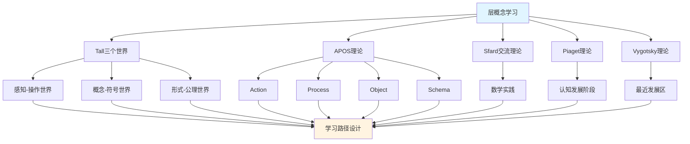

# 层概念的多理论分析示例 / Multi-Theory Analysis Example: Sheaf Concept

**主题编号 / Topic ID**: C.CORE.022.MULTI
**创建日期 / Created**: 2025年1月 / January 2025
**最后更新 / Last Updated**: 2025年1月 / January 2025
**关联概念 / Related Concepts**: [层 / Sheaf](./22-层.md) | [层-三视角版 / Sheaf-Three Perspectives](./22-层-三视角版.md)

---

## 📋 概述 / Overview

本文档为"层"概念提供多理论分析示例，展示如何运用国际主流数学认知理论来分析代数几何核心概念。

This document provides a multi-theory analysis example for the "Sheaf" concept, demonstrating how to apply international mainstream mathematical cognitive theories to analyze core concepts in algebraic geometry.

**分析目标 / Analysis Objectives**：

- 展示层概念的多理论分析方法 / Demonstrate multi-theory analysis methods for sheaf concepts
- 为其他代数几何概念提供分析参考 / Provide analysis reference for other algebraic geometry concepts
- 建立理论整合的应用示例 / Establish application examples of theoretical integration
- 强调层与拓扑空间、概形、代数几何的关系 / Emphasize the relationship between sheaves, topological spaces, schemes, and algebraic geometry

---

## 📑 目录 / Table of Contents

- [层概念的多理论分析示例 / Multi-Theory Analysis Example: Sheaf Concept](#层概念的多理论分析示例--multi-theory-analysis-example-sheaf-concept)
  - [📋 概述 / Overview](#-概述--overview)
  - [📑 目录 / Table of Contents](#-目录--table-of-contents)
  - [🎯 一、Tall三个世界理论分析 / Tall's Three Worlds Theory Analysis (编号: C.CORE.022.MULTI.01)](#-一tall三个世界理论分析--talls-three-worlds-theory-analysis-编号-ccore022multi01)
    - [1.1 感知-操作世界（Embodied World）](#11-感知-操作世界embodied-world)
    - [1.2 概念-符号世界（Symbolic World）](#12-概念-符号世界symbolic-world)
    - [1.3 形式-公理世界（Formal World）](#13-形式-公理世界formal-world)
    - [1.4 三个世界的转换 / Transitions Between Worlds](#14-三个世界的转换--transitions-between-worlds)
  - [🔬 二、Dubinsky APOS理论分析 (编号: C.CORE.022.MULTI.02)](#-二dubinsky-apos理论分析-编号-ccore022multi02)
    - [2.1 Action（动作）](#21-action动作)
    - [2.2 Process（过程）](#22-process过程)
    - [2.3 Object（对象）](#23-object对象)
    - [2.4 Schema（图式）](#24-schema图式)
    - [2.5 APOS发展路径 / APOS Development Path](#25-apos发展路径--apos-development-path)
  - [💬 三、Sfard交流理论分析 / Sfard's Commognitive Theory Analysis (编号: C.CORE.022.MULTI.03)](#-三sfard交流理论分析--sfards-commognitive-theory-analysis-编号-ccore022multi03)
    - [3.1 层作为交流工具 / Sheaf as a Communication Tool](#31-层作为交流工具--sheaf-as-a-communication-tool)
    - [3.2 层学习的实践参与 / Practice Participation in Sheaf Learning](#32-层学习的实践参与--practice-participation-in-sheaf-learning)
  - [🧠 四、Piaget认知发展理论分析 / Piaget's Cognitive Development Theory Analysis (编号: C.CORE.022.MULTI.04)](#-四piaget认知发展理论分析--piagets-cognitive-development-theory-analysis-编号-ccore022multi04)
    - [4.1 具体运算阶段（7-12岁）/ Concrete Operational Stage (7-12 years)](#41-具体运算阶段7-12岁-concrete-operational-stage-7-12-years)
    - [4.2 形式运算阶段（12+岁）/ Formal Operational Stage (12+ years)](#42-形式运算阶段12岁-formal-operational-stage-12-years)
  - [🌍 五、Vygotsky社会文化理论分析 / Vygotsky's Sociocultural Theory Analysis (编号: C.CORE.022.MULTI.05)](#-五vygotsky社会文化理论分析--vygotskys-sociocultural-theory-analysis-编号-ccore022multi05)
    - [5.1 最近发展区（ZPD）/ Zone of Proximal Development (ZPD)](#51-最近发展区zpd-zone-of-proximal-development-zpd)
    - [5.2 社会文化工具 / Sociocultural Tools](#52-社会文化工具--sociocultural-tools)
  - [🔄 六、多理论整合分析 / Multi-Theory Integration Analysis (编号: C.CORE.022.MULTI.06)](#-六多理论整合分析--multi-theory-integration-analysis-编号-ccore022multi06)
    - [6.1 理论共同点 / Theoretical Commonalities](#61-理论共同点--theoretical-commonalities)
    - [6.2 理论互补性 / Theoretical Complementarity](#62-理论互补性--theoretical-complementarity)
    - [6.3 整合应用框架](#63-整合应用框架)
  - [📊 七、层概念的多理论学习路径 / Multi-Theory Learning Path for Sheaf Concept (编号: C.CORE.022.MULTI.07)](#-七层概念的多理论学习路径--multi-theory-learning-path-for-sheaf-concept-编号-ccore022multi07)
    - [7.1 入门阶段（Tall感知-操作世界 + APOS Action）/ Entry Stage (Tall Embodied World + APOS Action)](#71-入门阶段tall感知-操作世界--apos-action-entry-stage-tall-embodied-world--apos-action)
    - [7.2 中级阶段（Tall概念-符号世界 + APOS Process/Object）/ Intermediate Stage (Tall Symbolic World + APOS Process/Object)](#72-中级阶段tall概念-符号世界--apos-processobject-intermediate-stage-tall-symbolic-world--apos-processobject)
    - [7.3 高级阶段（Tall形式-公理世界 + APOS Schema + Sfard实践）/ Advanced Stage (Tall Formal World + APOS Schema + Sfard Practice)](#73-高级阶段tall形式-公理世界--apos-schema--sfard实践-advanced-stage-tall-formal-world--apos-schema--sfard-practice)
  - [🎓 八、教学建议 / Teaching Suggestions (编号: C.CORE.022.MULTI.08)](#-八教学建议--teaching-suggestions-编号-ccore022multi08)
    - [8.1 基于多理论的教学设计 / Multi-Theory Based Teaching Design](#81-基于多理论的教学设计--multi-theory-based-teaching-design)
    - [8.2 具体教学策略 / Specific Teaching Strategies](#82-具体教学策略--specific-teaching-strategies)
  - [🔗 九、关联文档 / Related Documents (编号: C.CORE.022.MULTI.09)](#-九关联文档--related-documents-编号-ccore022multi09)
    - [9.1 核心概念文档 / Core Concept Documents](#91-核心概念文档--core-concept-documents)
    - [9.2 理论框架文档 / Theoretical Framework Documents](#92-理论框架文档--theoretical-framework-documents)
  - [✅ 十、总结 / Summary (编号: C.CORE.022.MULTI.10)](#-十总结--summary-编号-ccore022multi10)
    - [10.1 多理论分析的价值 / Value of Multi-Theory Analysis](#101-多理论分析的价值--value-of-multi-theory-analysis)
    - [10.2 应用推广 / Application and Extension](#102-应用推广--application-and-extension)

---

## 🎯 一、Tall三个世界理论分析 / Tall's Three Worlds Theory Analysis (编号: C.CORE.022.MULTI.01)

### 1.1 感知-操作世界（Embodied World）

**层在感知-操作世界中的理解 / Understanding Sheaves in the Embodied World**：

- **具体经验 / Concrete Experience**：
  - 通过观察"局部数据粘合"理解层：在拓扑空间的每个开集上定义数据，然后粘合 / Understanding sheaves through observing "gluing of local data": defining data on each open set of a topological space, then gluing
  - 例如：连续函数层、光滑函数层 / Examples: sheaves of continuous functions, sheaves of smooth functions
  - 通过"限制映射"理解层的局部结构：从大集合到小集合的限制 / Understanding local structure of sheaves through "restriction maps": restrictions from larger sets to smaller sets

- **身体动作 / Bodily Actions**：
  - 通过"粘合"的动作理解层 / Understanding sheaves through the action of "gluing"
  - 通过"限制"理解层的局部结构 / Understanding local structure of sheaves through "restriction"
  - 通过操作图形理解层的茎、截面 / Understanding stalks and sections of sheaves through manipulating figures

- **直观理解 / Intuitive Understanding**：
  - 层是"局部数据的粘合" / A sheaf is "gluing of local data"
  - 层描述"局部到整体"的结构 / Sheaves describe the structure of "local to global"
  - 层是代数几何的基础 / Sheaves are the foundation of algebraic geometry

**教学建议 / Teaching Suggestions**：

- 使用具体例子（连续函数层、常数层） / Use concrete examples (sheaves of continuous functions, constant sheaves)
- 通过粘合活动理解层 / Understand sheaves through gluing activities
- 使用图形可视化层结构 / Use graphics to visualize sheaf structure

### 1.2 概念-符号世界（Symbolic World）

**层在概念-符号世界的理解 / Understanding Sheaves in the Symbolic World**：

- **符号表示 / Symbolic Representation**：
  - 使用层符号：$\mathcal{F}$、$\mathcal{G}$ 表示层 / Using sheaf notation: $\mathcal{F}$, $\mathcal{G}$ to denote sheaves
  - 使用截面符号：$\Gamma(U, \mathcal{F})$、$\mathcal{F}(U)$ / Using section notation: $\Gamma(U, \mathcal{F})$, $\mathcal{F}(U)$
  - 使用茎符号：$\mathcal{F}_x$、$\mathcal{F}_p$ / Using stalk notation: $\mathcal{F}_x$, $\mathcal{F}_p$

- **概念理解 / Conceptual Understanding**：
  - 层是拓扑空间上的预层满足粘合条件 / A sheaf is a presheaf on a topological space satisfying gluing conditions
  - 层通过限制映射连接局部和整体 / Sheaves connect local and global through restriction maps
  - 层是代数几何的研究对象 / Sheaves are objects of study in algebraic geometry

- **抽象操作 / Abstract Operations**：
  - 通过限制映射研究层 / Studying sheaves through restriction maps
  - 通过层上同调研究层的全局性质 / Studying global properties of sheaves through sheaf cohomology
  - 通过层态射研究层的关系 / Studying relationships between sheaves through sheaf morphisms

**教学建议 / Teaching Suggestions**：

- 逐步引入层符号 / Gradually introduce sheaf notation
- 通过限制映射练习理解层 / Understand sheaves through restriction map exercises
- 使用层性质研究代数几何结构 / Use sheaf properties to study algebraic geometric structures

### 1.3 形式-公理世界（Formal World）

**层在形式-公理世界的理解 / Understanding Sheaves in the Formal World**：

- **公理系统 / Axiomatic System**：
  - 层的严格定义：层$\mathcal{F}$是满足粘合条件的预层 / Strict definition of sheaf: sheaf $\mathcal{F}$ is a presheaf satisfying gluing conditions
  - 通过粘合条件严格定义层 / Strictly defining sheaves through gluing conditions
  - 通过公理推导演分性质 / Deriving differential properties through axioms

- **形式化定义 / Formal Definition**：
  - 层的形式化定义 / Formal definition of sheaf
  - 层上同调的形式化定义 / Formal definition of sheaf cohomology
  - 层性质的形式化证明 / Formal proof of sheaf properties

- **逻辑推理 / Logical Reasoning**：
  - 通过逻辑推理证明层性质 / Proving sheaf properties through logical reasoning
  - 通过形式化方法研究代数几何 / Studying algebraic geometry through formal methods
  - 通过范畴论研究层的一般性质 / Studying general properties of sheaves through category theory

**教学建议 / Teaching Suggestions**：

- 介绍层定义 / Introduce sheaf definition
- 通过形式化证明理解层性质 / Understand sheaf properties through formal proofs
- 研究层在代数几何中的作用 / Study the role of sheaves in algebraic geometry

### 1.4 三个世界的转换 / Transitions Between Worlds

**转换路径 / Transition Paths**：

1. **从感知-操作到概念-符号 / From Embodied to Symbolic**：
   - 将具体局部数据抽象为层符号 / Abstracting concrete local data into sheaf symbols
   - 从操作中提取层概念 / Extracting sheaf concepts from operations
   - 例如：从"局部函数"到"层$\mathcal{F}$" / Example: from "local functions" to "sheaf $\mathcal{F}$"

2. **从概念-符号到形式-公理 / From Symbolic to Formal**：
   - 将层概念形式化为粘合条件定义 / Formalizing sheaf concepts into gluing condition definition
   - 从符号运算到逻辑推理 / From symbolic operations to logical reasoning
   - 例如：从"$\mathcal{F}$"到"粘合条件公理" / Example: from "$\mathcal{F}$" to "gluing condition axioms"

**转换支持 / Transition Support**：

- **识别转换困难 / Identifying Transition Difficulties**：
  - 识别从具体局部数据到抽象层的困难 / Identifying difficulties in transitioning from concrete local data to abstract sheaves
  - 识别从符号运算到形式化定义的困难 / Identifying difficulties in transitioning from symbolic operations to formal definitions

- **设计转换活动 / Designing Transition Activities**：
  - 设计过渡活动支持转换 / Designing transition activities to support transitions
  - 提供渐进式支持 / Providing progressive support

- **评估转换效果 / Assessing Transition Effectiveness**：
  - 评估转换成功 / Assessing transition success
  - 提供反馈支持 / Providing feedback support

---

## 🔬 二、Dubinsky APOS理论分析 (编号: C.CORE.022.MULTI.02)

### 2.1 Action（动作）

**层的Action阶段 / Action Stage of Sheaf**：

- **具体操作 / Concrete Operations**：
  - 判断层：给定预层，判断是否为层 / Determining sheaf: given a presheaf, determine if it is a sheaf
  - 使用限制映射：给定层，构造限制映射 / Using restriction maps: given a sheaf, construct restriction maps
  - 构造层：给定拓扑空间和函数，构造层 / Constructing sheaves: given a topological space and functions, construct a sheaf

- **操作特点 / Operation Characteristics**：
  - 需要外部指导（教师、教材） / Requires external guidance (teacher, textbook)
  - 操作是具体的、机械的 / Operations are concrete and mechanical
  - 需要逐步执行 / Requires step-by-step execution

- **学习活动 / Learning Activities**：
  - 练习判断层 / Practice determining sheaves
  - 练习使用限制映射 / Practice using restriction maps
  - 练习构造层 / Practice constructing sheaves

**教学建议 / Teaching Suggestions**：

- 提供大量练习机会 / Provide ample practice opportunities
- 给予及时反馈 / Give timely feedback
- 逐步增加操作复杂度 / Gradually increase operation complexity

### 2.2 Process（过程）

**层的Process阶段 / Process Stage of Sheaf**：

- **内化过程 / Internalization Process**：
  - 将层判断内化为心理过程 / Internalizing sheaf determination as a mental process
  - 理解层构造的内在逻辑 / Understanding the internal logic of sheaf construction
  - 能够独立完成层操作 / Being able to perform sheaf operations independently

- **过程理解 / Process Understanding**：
  - 理解"层"是"局部数据粘合的过程" / Understanding that "sheaf" is "the process of gluing local data"
  - 理解"限制映射"是"局部化的过程" / Understanding that "restriction maps" are "the process of localization"
  - 理解"层上同调"是"测量全局性质的过程" / Understanding that "sheaf cohomology" is "the process of measuring global properties"

- **灵活应用 / Flexible Application**：
  - 能够灵活应用层概念 / Being able to flexibly apply sheaf concepts
  - 能够处理复杂的层问题 / Being able to handle complex sheaf problems
  - 能够理解层的各种性质 / Being able to understand various properties of sheaves

**教学建议 / Teaching Suggestions**：

- 引导学生内化操作过程 / Guide students to internalize operation processes
- 通过变式练习加深理解 / Deepen understanding through variant exercises
- 鼓励学生探索层应用 / Encourage students to explore sheaf applications

### 2.3 Object（对象）

**层的Object阶段 / Object Stage of Sheaf**：

- **对象化理解 / Objectification Understanding**：
  - 将层视为独立的对象 / Viewing sheaves as independent objects
  - 理解层作为数学对象的结构 / Understanding the structure of sheaves as mathematical objects
  - 能够对层进行运算和操作 / Being able to perform operations on sheaves

- **对象操作 / Object Operations**：
  - 能够比较不同的层 / Being able to compare different sheaves
  - 能够构造层的直和、张量积 / Being able to construct direct sums and tensor products of sheaves
  - 能够研究层的性质 / Being able to study properties of sheaves

- **概念整合 / Conceptual Integration**：
  - 理解层与拓扑空间、概形、代数几何的关系 / Understanding the relationship between sheaves, topological spaces, schemes, and algebraic geometry
  - 理解层在代数几何中的作用 / Understanding the role of sheaves in algebraic geometry
  - 理解层在数学中的作用 / Understanding the role of sheaves in mathematics

**教学建议 / Teaching Suggestions**：

- 引导学生将层对象化 / Guide students to objectify sheaves
- 通过对象操作加深理解 / Deepen understanding through object operations
- 整合层与其他概念 / Integrate sheaves with other concepts

### 2.4 Schema（图式）

**层的Schema阶段 / Schema Stage of Sheaf**：

- **图式构建 / Schema Construction**：
  - 构建完整的层图式 / Constructing a complete sheaf schema
  - 整合层的各种理解 / Integrating various understandings of sheaves
  - 建立层与其他概念的联系 / Establishing connections between sheaves and other concepts

- **图式应用 / Schema Application**：
  - 能够灵活应用层图式 / Being able to flexibly apply sheaf schemas
  - 能够解决复杂的层问题 / Being able to solve complex sheaf problems
  - 能够研究代数几何理论 / Being able to study algebraic geometry theory

- **图式发展 / Schema Development**：
  - 不断发展层图式 / Continuously developing sheaf schemas
  - 探索层的新应用 / Exploring new applications of sheaves
  - 研究代数几何理论的发展 / Studying the development of algebraic geometry theory

**教学建议 / Teaching Suggestions**：

- 帮助学生构建层图式 / Help students construct sheaf schemas
- 通过应用发展图式 / Develop schemas through application
- 鼓励学生探索代数几何理论 / Encourage students to explore algebraic geometry theory

### 2.5 APOS发展路径 / APOS Development Path

**发展过程 / Development Process**：

1. **Action → Process / 动作到过程**：
   - 将外部层操作内化为心理过程 / Internalizing external sheaf operations as mental processes
   - 从需要指导到独立完成 / From needing guidance to independent completion
   - 例如：从"构造层"到"理解层过程" / Example: from "constructing sheaves" to "understanding the sheaf process"

2. **Process → Object / 过程到对象**：
   - 将层过程对象化 / Objectifying sheaf processes
   - 从过程理解到对象理解 / From process understanding to object understanding
   - 例如：从"理解层过程"到"将层视为对象" / Example: from "understanding the sheaf process" to "treating sheaves as objects"

3. **Object → Schema / 对象到图式**：
   - 整合层的所有方面形成完整图式 / Integrating all aspects of sheaves to form a complete schema
   - 从对象理解到系统理解 / From object understanding to systematic understanding
   - 例如：从"理解层对象"到"形成代数几何图式" / Example: from "understanding sheaf objects" to "forming an algebraic geometry schema"

**发展支持 / Development Support**：

- **识别发展困难 / Identifying Development Difficulties**：
  - 识别内化困难 / Identifying internalization difficulties
  - 识别对象化困难 / Identifying objectification difficulties
  - 识别图式化困难 / Identifying schematization difficulties

- **设计发展活动 / Designing Development Activities**：
  - 设计支持内化的活动 / Designing activities to support internalization
  - 设计支持对象化的活动 / Designing activities to support objectification
  - 设计支持图式化的活动 / Designing activities to support schematization

- **评估发展效果 / Assessing Development Effectiveness**：
  - 评估各阶段发展 / Assessing development at each stage
  - 提供反馈支持 / Providing feedback support

---

## 💬 三、Sfard交流理论分析 / Sfard's Commognitive Theory Analysis (编号: C.CORE.022.MULTI.03)

### 3.1 层作为交流工具 / Sheaf as a Communication Tool

**层的交流功能 / Communicative Function of Sheaves**：

- **数学交流 / Mathematical Communication**：
  - 层用于表达"局部到整体"：$\mathcal{F}$ / Sheaves are used to express "local to global": $\mathcal{F}$
  - 层用于描述"局部数据" / Sheaves are used to describe "local data"
  - 层用于表达数学关系：层态射、层上同调 / Sheaves are used to express mathematical relationships: sheaf morphisms, sheaf cohomology

- **概念表达 / Conceptual Expression**：
  - 通过层表达"局部数据粘合"的概念 / Expressing the concept of "gluing local data" through sheaves
  - 通过层符号表达"局部结构"的概念 / Expressing the concept of "local structure" through sheaf notation
  - 通过层表达"全局性质"的概念 / Expressing the concept of "global properties" through sheaves

- **问题解决 / Problem Solving**：
  - 使用层语言表达问题 / Using sheaf language to express problems
  - 使用层方法解决问题 / Using sheaf methods to solve problems
  - 使用代数几何方法证明定理 / Using algebraic geometry methods to prove theorems

### 3.2 层学习的实践参与 / Practice Participation in Sheaf Learning

**通过参与数学实践学习层 / Learning Sheaves through Participation in Mathematical Practice**：

- **实践场景 / Practice Scenarios**：
  - 通过代数问题学习层 / Learning sheaves through algebra problems
  - 通过几何问题学习层 / Learning sheaves through geometry problems
  - 通过拓扑应用学习层 / Learning sheaves through topology applications
  - 通过代数几何研究学习层理论 / Learning sheaf theory through algebraic geometry research

- **实践方式 / Practice Methods**：
  - 参与数学讨论，使用层语言 / Participating in mathematical discussions, using sheaf language
  - 解决数学问题，应用层方法 / Solving mathematical problems, applying sheaf methods
  - 研究数学理论，理解层作用 / Studying mathematical theory, understanding the role of sheaves

- **学习效果 / Learning Outcomes**：
  - 通过实践理解层概念 / Understanding sheaf concepts through practice
  - 通过应用掌握层方法 / Mastering sheaf methods through application
  - 通过参与形成数学思维 / Forming mathematical thinking through participation

**教学建议 / Teaching Suggestions**：

- 设计数学实践活动 / Design mathematical practice activities
- 鼓励学生参与数学讨论 / Encourage students to participate in mathematical discussions
- 提供实际问题解决机会 / Provide opportunities for solving real-world problems

---

## 🧠 四、Piaget认知发展理论分析 / Piaget's Cognitive Development Theory Analysis (编号: C.CORE.022.MULTI.04)

### 4.1 具体运算阶段（7-12岁）/ Concrete Operational Stage (7-12 years)

**层在具体运算阶段的理解 / Understanding Sheaves in the Concrete Operational Stage**：

- **具体对象 / Concrete Objects**：
  - 通过具体层理解层 / Understanding sheaves through concrete sheaves
  - 例如：连续函数层、常数层 / Examples: sheaves of continuous functions, constant sheaves
  - 需要具体例子支持理解 / Requires concrete examples to support understanding

- **逻辑思维 / Logical Thinking**：
  - 能够理解层的基本概念 / Being able to understand basic sheaf concepts
  - 能够进行简单的层操作 / Being able to perform simple sheaf operations
  - 但需要具体对象支持 / But requires concrete object support

- **教学建议 / Teaching Suggestions**：
  - 使用具体层 / Use concrete sheaves
  - 通过图形验证层性质 / Verify sheaf properties through graphics
  - 逐步引入抽象概念 / Gradually introduce abstract concepts

### 4.2 形式运算阶段（12+岁）/ Formal Operational Stage (12+ years)

**层在形式运算阶段的理解 / Understanding Sheaves in the Formal Operational Stage**：

- **抽象思维 / Abstract Thinking**：
  - 能够理解抽象的层概念 / Being able to understand abstract sheaf concepts
  - 能够进行符号操作 / Being able to perform symbolic operations
  - 能够进行逻辑推理 / Being able to perform logical reasoning

- **形式推理 / Formal Reasoning**：
  - 能够证明层性质 / Being able to prove sheaf properties
  - 能够理解层定义 / Being able to understand sheaf definition
  - 能够研究代数几何 / Being able to study algebraic geometry

- **教学建议 / Teaching Suggestions**：
  - 引入抽象概念和符号 / Introduce abstract concepts and symbols
  - 进行逻辑推理训练 / Conduct logical reasoning training
  - 研究代数几何理论 / Study algebraic geometry theory

---

## 🌍 五、Vygotsky社会文化理论分析 / Vygotsky's Sociocultural Theory Analysis (编号: C.CORE.022.MULTI.05)

### 5.1 最近发展区（ZPD）/ Zone of Proximal Development (ZPD)

**层学习的最近发展区 / Zone of Proximal Development in Sheaf Learning**：

- **独立能力 / Independent Ability**：
  - 能够理解层的基本概念 / Being able to understand basic sheaf concepts
  - 能够进行简单的层操作 / Being able to perform simple sheaf operations
  - 能够理解限制映射 / Being able to understand restriction maps

- **潜在能力 / Potential Ability**：
  - 能够理解层定义 / Being able to understand sheaf definition
  - 能够证明层性质 / Being able to prove sheaf properties
  - 能够研究代数几何理论 / Being able to study algebraic geometry theory

- **教学建议 / Teaching Suggestions**：
  - 识别学生的最近发展区 / Identify students' zone of proximal development
  - 提供适当的支持和指导 / Provide appropriate support and guidance
  - 逐步提高学习要求 / Gradually increase learning requirements

### 5.2 社会文化工具 / Sociocultural Tools

**层作为社会文化工具 / Sheaves as Sociocultural Tools**：

- **数学工具 / Mathematical Tools**：
  - 层是数学研究的重要工具 / Sheaves are important tools for mathematical research
  - 层用于解决实际问题（规范理论、数据粘合） / Sheaves are used to solve real-world problems (gauge theory, data gluing)
  - 层用于研究数学理论 / Sheaves are used to study mathematical theory

- **文化意义 / Cultural Significance**：
  - 层是数学文化的重要组成部分 / Sheaves are an important part of mathematical culture
  - 层反映了数学思维的发展 / Sheaves reflect the development of mathematical thinking
  - 层体现了数学的美感 / Sheaves embody the beauty of mathematics

- **教学建议 / Teaching Suggestions**：
  - 介绍层的历史和文化意义 / Introduce the history and cultural significance of sheaves
  - 展示层在数学中的作用 / Demonstrate the role of sheaves in mathematics
  - 培养学生对数学文化的理解 / Cultivate students' understanding of mathematical culture

---

## 🔄 六、多理论整合分析 / Multi-Theory Integration Analysis (编号: C.CORE.022.MULTI.06)

### 6.1 理论共同点 / Theoretical Commonalities

**各理论在层概念分析中的共同点 / Commonalities of Theories in Sheaf Concept Analysis**：

1. **多层次理解 / Multi-Level Understanding**：
   - 都强调从具体到抽象的发展 / All emphasize development from concrete to abstract
   - Tall的三个世界、APOS的四个阶段、Piaget的发展阶段都体现这一点 / Tall's three worlds, APOS's four stages, and Piaget's developmental stages all reflect this

2. **实践重要性 / Importance of Practice**：
   - 都强调实践在学习中的作用 / All emphasize the role of practice in learning
   - Sfard的交流理论、Vygotsky的社会文化理论都强调这一点 / Sfard's communication theory and Vygotsky's sociocultural theory both emphasize this

3. **认知发展 / Cognitive Development**：
   - 都关注认知发展的过程 / All focus on the process of cognitive development
   - 各理论都描述了从简单到复杂的发展 / Each theory describes development from simple to complex

### 6.2 理论互补性 / Theoretical Complementarity

**各理论在层概念分析中的互补性 / Complementarity of Theories in Sheaf Concept Analysis**：

1. **Tall三个世界 / Tall's Three Worlds**：
   - 适用于理解层概念的不同层次 / Applicable to understanding different levels of sheaf concepts
   - 从感知操作到形式公理的发展 / Development from embodied operations to formal axioms

2. **APOS理论 / APOS Theory**：
   - 适用于分析层概念的学习过程 / Applicable to analyzing the learning process of sheaf concepts
   - 从动作到图式的发展 / Development from action to schema

3. **Sfard交流理论 / Sfard's Communication Theory**：
   - 适用于设计层概念的实践活动 / Applicable to designing practice activities for sheaf concepts
   - 通过数学实践学习层 / Learning sheaves through mathematical practice

4. **Piaget理论 / Piaget's Theory**：
   - 适用于理解层概念的认知发展阶段 / Applicable to understanding cognitive development stages of sheaf concepts
   - 从具体运算到形式运算的发展 / Development from concrete operations to formal operations

5. **Vygotsky理论 / Vygotsky's Theory**：
   - 适用于设计层概念的学习支持 / Applicable to designing learning support for sheaf concepts
   - 通过最近发展区促进学习 / Promoting learning through the zone of proximal development

### 6.3 整合应用框架

**多理论整合应用**：

---

## 📊 七、层概念的多理论学习路径 / Multi-Theory Learning Path for Sheaf Concept (编号: C.CORE.022.MULTI.07)

### 7.1 入门阶段（Tall感知-操作世界 + APOS Action）/ Entry Stage (Tall Embodied World + APOS Action)

**学习目标 / Learning Objectives**：

- 通过具体层理解层概念 / Understanding sheaf concepts through concrete sheaves
- 掌握基本层操作 / Mastering basic sheaf operations

**学习活动 / Learning Activities**：

- 使用具体层（连续函数层、常数层）进行观察 / Using concrete sheaves (sheaves of continuous functions, constant sheaves) for observation
- 练习判断层 / Practicing determining sheaves
- 练习使用限制映射 / Practicing using restriction maps
- 练习基本层操作 / Practicing basic sheaf operations

**评估标准 / Assessment Criteria**：

- 能够独立完成基本层操作 / Being able to independently complete basic sheaf operations
- 能够理解层的基本概念 / Being able to understand basic sheaf concepts

### 7.2 中级阶段（Tall概念-符号世界 + APOS Process/Object）/ Intermediate Stage (Tall Symbolic World + APOS Process/Object)

**学习目标 / Learning Objectives**：

- 理解层的符号表示 / Understanding symbolic representation of sheaves
- 掌握层运算的内在逻辑 / Mastering the internal logic of sheaf operations
- 将层视为对象 / Viewing sheaves as objects

**学习活动 / Learning Activities**：

- 学习层符号和限制映射符号 / Learning sheaf notation and restriction map notation
- 通过符号操作进行层运算 / Performing sheaf operations through symbolic operations
- 理解层的性质 / Understanding properties of sheaves
- 研究层的直和、张量积 / Studying direct sums and tensor products of sheaves

**评估标准 / Assessment Criteria**：

- 能够灵活应用层符号 / Being able to flexibly apply sheaf notation
- 能够理解层运算的内在逻辑 / Being able to understand the internal logic of sheaf operations
- 能够将层视为对象进行操作 / Being able to operate on sheaves as objects

### 7.3 高级阶段（Tall形式-公理世界 + APOS Schema + Sfard实践）/ Advanced Stage (Tall Formal World + APOS Schema + Sfard Practice)

**学习目标 / Learning Objectives**：

- 理解层定义 / Understanding sheaf definition
- 形成完整的层概念图式 / Forming a complete sheaf concept schema
- 通过数学实践应用层 / Applying sheaves through mathematical practice

**学习活动 / Learning Activities**：

- 学习层定义 / Learning sheaf definition
- 通过形式化证明理解层性质 / Understanding sheaf properties through formal proofs
- 研究层在代数几何中的作用 / Studying the role of sheaves in algebraic geometry
- 参与数学实践，应用层方法 / Participating in mathematical practice, applying sheaf methods

**评估标准 / Assessment Criteria**：

- 能够理解层定义 / Being able to understand sheaf definition
- 能够形成完整的层概念图式 / Being able to form a complete sheaf concept schema
- 能够通过数学实践应用层 / Being able to apply sheaves through mathematical practice

---

## 🧠 七、元认知理论分析 / Metacognitive Theory Analysis (编号: C.CORE.022.MULTI.07.5)

### 7.1 元认知知识（Metacognitive Knowledge）

**关于层概念的知识 / Knowledge About the Sheaf Concept**：

- **概念知识 / Conceptual Knowledge**：
  - 层的定义：在拓扑空间上定义的预层，满足粘合公理 / Sheaves are presheaves on topological spaces satisfying gluing axioms
  - 层的性质：局部性、粘合性、限制映射 / Properties: locality, gluing, restriction maps
  - 层的表示方法：层态射、层上同调、层序列 / Representation methods: sheaf morphisms, sheaf cohomology, sheaf sequences
  - 层与其他概念的关系：层是代数几何的核心，是研究几何结构的工具 / Relationship: sheaves are core concepts of algebraic geometry and tools for studying geometric structures

- **策略知识 / Strategy Knowledge**：
  - 学习策略：从预层到层，通过具体例子掌握层构造 / Learning strategies: from presheaves to sheaves, master sheaf construction through concrete examples
  - 理解策略：从局部到整体，从简单到复杂 / Understanding strategies: from local to global, from simple to complex
  - 应用策略：将层方法应用到实际问题中 / Application strategies: apply sheaf methods to real-world problems

- **任务知识 / Task Knowledge**：
  - 典型任务：层构造、层态射、层上同调计算 / Typical tasks: sheaf construction, sheaf morphisms, sheaf cohomology computation
  - 任务难度：基础任务（层构造）→ 中级任务（层态射）→ 高级任务（层上同调计算） / Task difficulty: basic (sheaf construction) → intermediate (sheaf morphisms) → advanced (sheaf cohomology computation)
  - 任务要求：理解层概念，掌握层构造，能够进行层推理 / Task requirements: understand sheaf concepts, master sheaf construction, be able to reason about sheaves

### 7.2 元认知监控（Metacognitive Monitoring）

**理解监控 / Comprehension Monitoring**：

- **自我提问 / Self-Questioning**：
  - "我理解层的基本概念了吗？" / "Do I understand the basic concept of sheaves?"
  - "我能区分层和预层吗？" / "Can I distinguish between sheaves and presheaves?"
  - "我理解粘合公理吗？" / "Do I understand the gluing axioms?"

- **理解检查 / Comprehension Checking**：
  - 能否用自己的话解释层概念？ / Can I explain the concept of sheaves in my own words?
  - 能否识别层构造的错误？ / Can I identify errors in sheaf construction?
  - 能否判断预层的层性？ / Can I determine whether a presheaf is a sheaf?

- **困难识别 / Difficulty Identification**：
  - 识别理解困难：抽象性、粘合公理、限制映射、层上同调 / Identify comprehension difficulties: abstraction, gluing axioms, restriction maps, sheaf cohomology
  - 识别运算困难：层构造、层态射、层上同调计算 / Identify operation difficulties: sheaf construction, sheaf morphisms, sheaf cohomology computation

**过程监控 / Process Monitoring**：

- **学习过程监控 / Learning Process Monitoring**：
  - 监控学习进度：是否按计划学习？ / Monitor learning progress: Am I learning according to plan?
  - 监控学习效果：是否掌握了层概念？ / Monitor learning effectiveness: Have I mastered the concept of sheaves?
  - 监控学习困难：遇到了哪些困难？ / Monitor learning difficulties: What difficulties have I encountered?

- **策略使用监控 / Strategy Use Monitoring**：
  - 使用的策略是否有效？ / Is the strategy I'm using effective?
  - 是否需要调整策略？ / Do I need to adjust my strategy?
  - 策略使用是否正确？ / Am I using the strategy correctly?

### 7.3 元认知调节（Metacognitive Regulation）

**计划调节 / Planning Regulation**：

- **学习计划制定 / Learning Plan Development**：
  - 制定学习计划：先学层基本概念，再学层构造，最后学层应用 / Develop learning plan: first learn basic sheaf concepts, then learn sheaf construction, finally learn sheaf applications
  - 调整学习计划：根据学习情况调整计划 / Adjust learning plan: adjust plan based on learning situation
  - 优化学习路径：选择最适合自己的学习路径 / Optimize learning path: choose the learning path that best suits oneself

**策略调节 / Strategy Regulation**：

- **策略选择 / Strategy Selection**：
  - 根据任务类型选择策略：简单任务用直接方法，复杂任务用分步方法 / Select strategies based on task type: use direct methods for simple tasks, step-by-step methods for complex tasks
  - 根据学习阶段选择策略：入门阶段用具体例子，高级阶段用抽象方法 / Select strategies based on learning stage: use concrete examples in entry stage, abstract methods in advanced stage

- **策略调整 / Strategy Adjustment**：
  - 如果遇到困难，尝试不同的策略 / If encountering difficulties, try different strategies
  - 如果策略无效，调整策略 / If strategy is ineffective, adjust strategy
  - 如果策略有效，继续使用并优化 / If strategy is effective, continue using and optimize

**反思调节 / Reflection Regulation**：

- **学习反思 / Learning Reflection**：
  - 反思学习过程：从层学习中获得了什么？ / Reflect on learning process: What have I gained from learning sheaves?
  - 反思学习困难：遇到了哪些困难？如何克服？ / Reflect on learning difficulties: What difficulties did I encounter? How did I overcome them?
  - 反思学习策略：使用的策略是否有效？如何改进？ / Reflect on learning strategies: Were the strategies I used effective? How can I improve?

- **错误反思 / Error Reflection**：
  - 从错误中学习：分析错误原因，避免类似错误 / Learn from errors: analyze error causes, avoid similar errors
  - 改进学习方法：根据错误调整学习方法 / Improve learning methods: adjust learning methods based on errors

**教学建议 / Teaching Suggestions**：

- 教授元认知知识：帮助学生建立关于层的元认知知识 / Teach metacognitive knowledge: help students build metacognitive knowledge about sheaves
- 培养监控能力：引导学生自我监控理解过程 / Develop monitoring ability: guide students to self-monitor their comprehension process
- 训练调节能力：教授学生如何调节学习策略 / Train regulation ability: teach students how to regulate learning strategies
- 使用元认知提示语：在学习过程中使用提示语引导学生 / Use metacognitive prompts: use prompts to guide students during learning

---

## 🎓 八、教学建议 / Teaching Suggestions (编号: C.CORE.022.MULTI.08)

### 8.1 基于多理论的教学设计 / Multi-Theory Based Teaching Design

**教学设计原则 / Teaching Design Principles**：

1. **多层次设计 / Multi-Level Design**：
   - 从感知操作到形式公理 / From embodied operations to formal axioms
   - 从动作到图式 / From action to schema
   - 从具体运算到形式运算 / From concrete operations to formal operations

2. **实践导向 / Practice-Oriented**：
   - 设计数学实践活动 / Design mathematical practice activities
   - 鼓励学生参与数学交流 / Encourage students to participate in mathematical communication
   - 提供实际问题解决机会 / Provide opportunities for solving real-world problems

3. **学习支持 / Learning Support**：
   - 提供适当的学习支持 / Provide appropriate learning support
   - 设计最近发展区的学习活动 / Design learning activities in the zone of proximal development
   - 给予及时反馈 / Give timely feedback

4. **情感因素考虑 / Affective Considerations**：
   - **减少数学焦虑 / Reducing Math Anxiety**：
     - 从具体例子（连续函数层、常数层）开始，降低层概念的抽象难度 / Start with concrete examples (sheaves of continuous functions, constant sheaves) to reduce the abstract difficulty of sheaf concepts
     - 通过粘合活动理解层 / Understand sheaves through gluing activities
     - 允许学生犯错，营造安全的学习环境 / Allow students to make mistakes and create a safe learning environment
     - 提供逐步支持，帮助学生建立信心 / Provide progressive support to help students build confidence

   - **激发学习动机 / Motivating Learning**：
     - 展示层在现实中的应用（代数几何、拓扑等） / Show applications of sheaves in real life (algebraic geometry, topology, etc.)
     - 设计有趣的层问题 / Design interesting sheaf problems
     - 介绍层的历史和数学家的故事（Leray、Grothendieck） / Introduce the history of sheaves and mathematician stories (Leray, Grothendieck)
     - 展示层的结构美感 / Show the structural beauty of sheaves

   - **培养数学兴趣 / Cultivating Math Interest**：
     - 展示层的美感 / Show the beauty of sheaves
     - 介绍Leray、Grothendieck等数学家的故事 / Introduce stories of mathematicians like Leray and Grothendieck
     - 探索层在代数几何中的核心地位 / Explore the central role of sheaves in algebraic geometry

### 8.2 具体教学策略 / Specific Teaching Strategies

**入门阶段策略 / Entry Stage Strategies**：

- 使用具体层和图形 / Use concrete sheaves and graphics
- 通过游戏和活动学习 / Learn through games and activities
- 提供大量练习机会 / Provide ample practice opportunities

**中级阶段策略 / Intermediate Stage Strategies**：

- 逐步引入抽象概念和符号 / Gradually introduce abstract concepts and symbols
- 通过变式练习加深理解 / Deepen understanding through variant exercises
- 鼓励学生独立思考和解决问题 / Encourage students to think independently and solve problems

**高级阶段策略 / Advanced Stage Strategies**：

- 引入定义和形式化方法 / Introduce definitions and formal methods
- 研究代数几何理论 / Study algebraic geometry theory
- 参与数学实践和研究 / Participate in mathematical practice and research

---

## 🔗 九、关联文档 / Related Documents (编号: C.CORE.022.MULTI.09)

### 9.1 核心概念文档 / Core Concept Documents

- [层](./22-层.md) / [Sheaf](./22-层.md)
- [层-三视角版](./22-层-三视角版.md) / [Sheaf-Three Perspectives Version](./22-层-三视角版.md)
- [拓扑空间-多理论分析示例](./23-拓扑空间-多理论分析示例-2025年1月.md) / [Topological Space-Multi-Theory Analysis Example](./23-拓扑空间-多理论分析示例-2025年1月.md)

### 9.2 理论框架文档 / Theoretical Framework Documents

- [国际主流数学认知理论整合框架](../00-国际主流数学认知理论整合框架-2025年1月.md) / [International Mainstream Mathematical Cognitive Theories Integration Framework](../00-国际主流数学认知理论整合框架-2025年1月.md)
- [概念体系深度改进计划](../00-概念体系深度改进计划-2025年1月.md) / [Concept System Deep Improvement Plan](../00-概念体系深度改进计划-2025年1月.md)

---

## ✅ 十、总结 / Summary (编号: C.CORE.022.MULTI.10)

### 10.1 多理论分析的价值 / Value of Multi-Theory Analysis

**多理论分析的优势 / Advantages of Multi-Theory Analysis**：

1. **全面理解 / Comprehensive Understanding**：
   - 从多个角度理解层概念 / Understanding sheaf concepts from multiple perspectives
   - 理解层概念的不同层次 / Understanding different levels of sheaf concepts
   - 理解层概念的学习过程 / Understanding the learning process of sheaf concepts

2. **教学设计 / Teaching Design**：
   - 基于多理论设计教学 / Designing teaching based on multiple theories
   - 提供多层次学习支持 / Providing multi-level learning support
   - 设计实践活动 / Designing practice activities

3. **学习路径 / Learning Path**：
   - 设计基于多理论的学习路径 / Designing learning paths based on multiple theories
   - 支持不同认知发展阶段的学习 / Supporting learning at different cognitive development stages
   - 促进概念理解的发展 / Promoting the development of conceptual understanding

### 10.2 应用推广 / Application and Extension

**为其他核心概念建立多理论分析 / Establishing Multi-Theory Analysis for Other Core Concepts**：

- 使用本文档作为模板 / Using this document as a template
- 为每个概念建立多理论分析 / Establishing multi-theory analysis for each concept
- 建立33个核心概念的多理论分析体系 / Establishing a multi-theory analysis system for 33 core concepts

---

**创建日期**: 2025年1月
**最后更新**: 2025年1月
**维护状态**: 持续更新中
**状态**: ✅ 已完成
