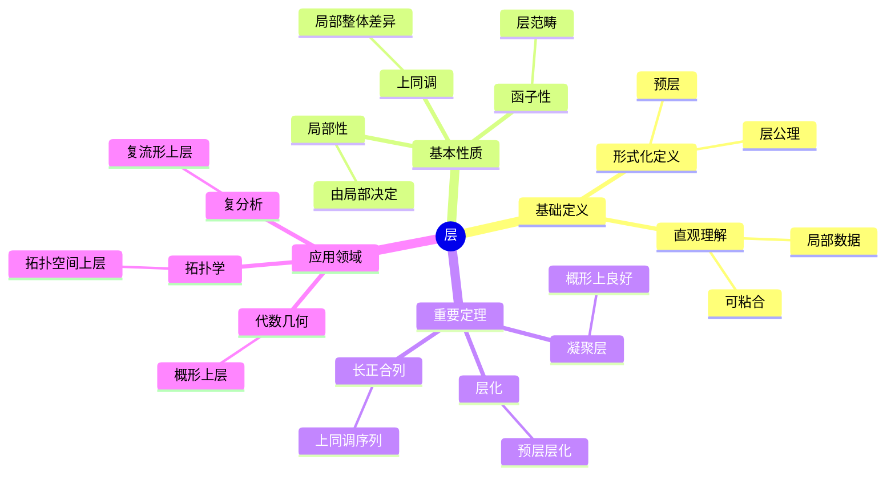
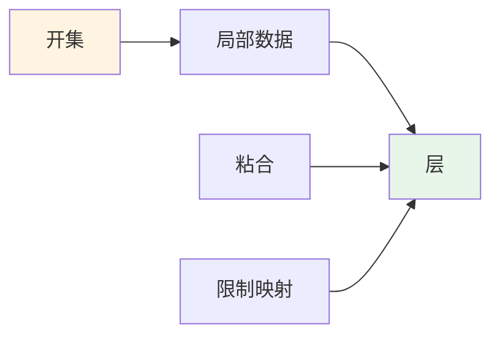
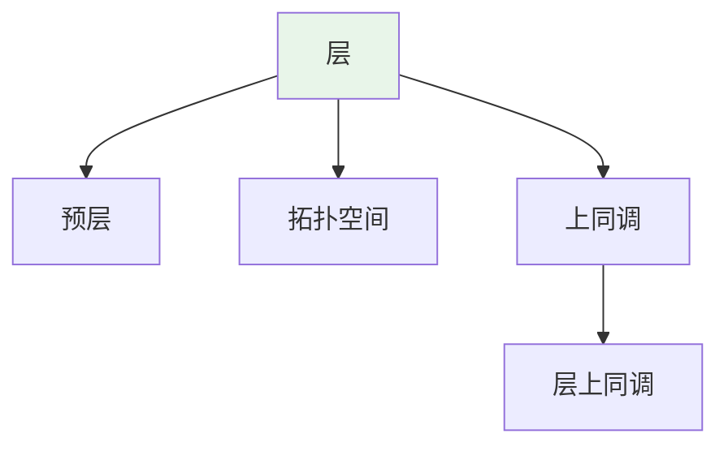
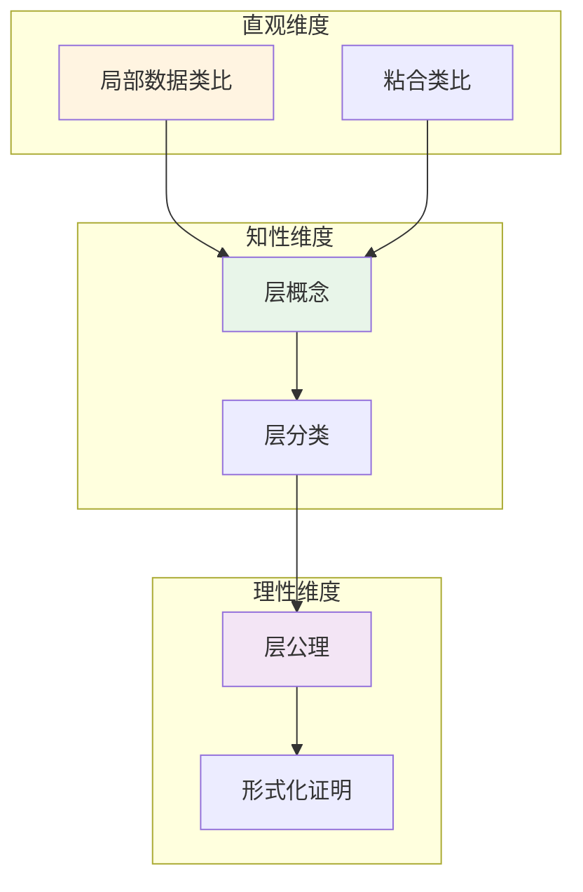

# 层 (Sheaf)

**概念编号**: C.CORE.022
**知识层次**: L0-L2
**知识领域**: D4 (几何)
**创建日期**: 2025年11月21日
**最后更新**: 2025年11月21日

---

## 📑 目录

- [层 (Sheaf)](#层-sheaf)
  - [📑 目录](#-目录)
  - [1. 📋 概述](#1--概述)
  - [2. 🎯 严格定义](#2--严格定义)
    - [2.1 基础定义 (L0)](#21-基础定义-l0)
    - [2.2 形式化定义 (L1)](#22-形式化定义-l1)
  - [3. 📚 历史背景](#3--历史背景)
    - [3.1 发展脉络](#31-发展脉络)
    - [3.2 关键人物](#32-关键人物)
    - [3.3 重要事件](#33-重要事件)
  - [4. 🔍 性质与定理](#4--性质与定理)
    - [4.1 基本性质 (L1)](#41-基本性质-l1)
    - [4.2 重要定理 (L2)](#42-重要定理-l2)
  - [6. 💡 应用实例](#6--应用实例)
    - [6.1 理论应用](#61-理论应用)
    - [6.2 实际应用](#62-实际应用)
      - [应用1: 物理学 - 规范理论中的层](#应用1-物理学---规范理论中的层)
      - [应用2: 计算机科学 - 数据粘合](#应用2-计算机科学---数据粘合)
      - [应用3: 工程学 - 局部-整体问题](#应用3-工程学---局部-整体问题)
  - [7. 🔗 关联概念](#7--关联概念)
    - [依赖关系](#依赖关系)
    - [推广关系](#推广关系)
  - [8. 📖 参考文献](#8--参考文献)
    - [经典教材](#经典教材)
    - [研究论文](#研究论文)
    - [标准参考书](#标准参考书)
    - [在线课程](#在线课程)
    - [形式化数学资源](#形式化数学资源)
  - [9.1 🗺️ 思维导图 (编号: C.CORE.022.MIND)](#91-️-思维导图-编号-ccore022mind)
    - [层概念思维导图](#层概念思维导图)
  - [9.2 📊 知识多维关系矩阵 (编号: C.CORE.022.MATRIX)](#92--知识多维关系矩阵-编号-ccore022matrix)
    - [层的多维关系矩阵](#层的多维关系矩阵)
  - [9.3 💭 形象化解释与论证 (编号: C.CORE.022.VISUAL)](#93--形象化解释与论证-编号-ccore022visual)
    - [形象化解释](#形象化解释)
    - [认知科学视角](#认知科学视角)
  - [9.6 👨‍🏫 专家观点与论证 (编号: C.CORE.022.EXPERT)](#96--专家观点与论证-编号-ccore022expert)
    - [数学家的观点](#数学家的观点)
    - [数学教育家的观点](#数学教育家的观点)
    - [数学认知学家的观点](#数学认知学家的观点)
  - [9.7 🎨 认知维度表征 (编号: C.CORE.022.COGNITIVE)](#97--认知维度表征-编号-ccore022cognitive)
    - [直观维度表征 (编号: C.CORE.022.INTUITIVE)](#直观维度表征-编号-ccore022intuitive)
      - [形象类比](#形象类比)
      - [具体例子](#具体例子)
      - [可视化表示](#可视化表示)
      - [几何直观](#几何直观)
    - [知性维度表征 (编号: C.CORE.022.INTELLECTUAL)](#知性维度表征-编号-ccore022intellectual)
      - [概念定义](#概念定义)
      - [概念分类](#概念分类)
      - [概念关系](#概念关系)
      - [知识矩阵](#知识矩阵)
    - [理性维度表征 (编号: C.CORE.022.RATIONAL)](#理性维度表征-编号-ccore022rational)
      - [公理体系](#公理体系)
      - [形式化定义](#形式化定义)
      - [逻辑推理](#逻辑推理)
      - [证明系统](#证明系统)
    - [综合整合表征 (编号: C.CORE.022.INTEGRATED)](#综合整合表征-编号-ccore022integrated)
      - [多维度整合](#多维度整合)
      - [图形转换](#图形转换)
      - [应用示例](#应用示例)
  - [9.5 📚 习题库](#95--习题库)
    - [L0基础题（2道）](#l0基础题2道)
    - [L1中级题（5道）](#l1中级题5道)
    - [L2高级题（8道）](#l2高级题8道)

---

## 1. 📋 概述

层是拓扑空间上的局部数据，是代数几何、拓扑学、复分析的基础工具。层理论统一了不同数学分支中的局部-整体原理。

**权威资源对齐**:

- Wikipedia: [Sheaf (Mathematics)](https://en.wikipedia.org/wiki/Sheaf_(mathematics))
- Stanford课程: Math 216 (Algebraic Geometry)
- Princeton课程: MAT 540 (Algebraic Geometry)
- MIT课程: 18.726 (Algebraic Geometry)
- Metamath: [Sheaf](http://us.metamath.org/mpeuni/df-sheaf.html)

---

## 2. 🎯 严格定义

### 2.1 基础定义 (L0)

**直观理解**: 层是拓扑空间上的"局部数据"，可以"粘合"成整体数据。例如连续函数层、光滑函数层。

**基本定义**: 层 $\mathcal{F}$ 是拓扑空间 $X$ 上的预层，满足粘合公理。

**简单例子**:

- 连续函数层：$\mathcal{C}(U) = \{f: U \to \mathbb{R} \text{ 连续}\}$
- 光滑函数层：$\mathcal{C}^\infty(U) = \{f: U \to \mathbb{R} \text{ 光滑}\}$
- 常数层：$\mathcal{F}(U) = A$（常数）

### 2.2 形式化定义 (L1)

**预层**: 拓扑空间 $X$ 上的预层 $\mathcal{F}$ 是：

- 对每个开集 $U$，有集合 $\mathcal{F}(U)$
- 对每个包含 $V \subseteq U$，有限制映射 $\text{res}_{U,V}: \mathcal{F}(U) \to \mathcal{F}(V)$
- 满足函子性：$\text{res}_{U,U} = \text{id}$，$\text{res}_{V,W} \circ \text{res}_{U,V} = \text{res}_{U,W}$

**层**: 预层 $\mathcal{F}$ 是层，若满足：

1. **单射性**: 若 $s, t \in \mathcal{F}(U)$ 在开覆盖 $\{U_i\}$ 上限制相同，则 $s = t$
2. **粘合性**: 若 $s_i \in \mathcal{F}(U_i)$ 在交集上相容，则存在 $s \in \mathcal{F}(U)$ 限制到 $s_i$

**记号**:

- $\mathcal{F}$: 层
- $\mathcal{F}(U)$: 在开集 $U$ 上的截面
- $\text{res}_{U,V}$: 限制映射
- $\Gamma(U, \mathcal{F})$: 全局截面

---

## 3. 📚 历史背景

### 3.1 发展脉络

**20世纪中期**: 层理论的建立

- **Leray (1946)**: 在研究偏微分方程时引入层概念，建立层上同调
- **Cartan (1950)**: 发展层上同调理论，建立Cartan定理
- **Serre (1955)**: 在代数几何中应用层，建立Serre对偶定理
- **Grothendieck (1957)**: 建立概形上的层理论，发展上同调理论

**20世纪后期**: 层理论的发展

- **Deligne (1974)**: 证明Weil猜想（使用层上同调）
- **Beilinson-Bernstein-Deligne (1982)**: 研究perverse层
- **Kashiwara-Schapira (1990)**: 发展D-模理论

**21世纪**: 层理论的前沿

- **Lurie (2009)**: 发展$\infty$-层理论
- **Scholze (2012)**: 在perfectoid空间中应用层理论

### 3.2 关键人物

- **Jean Leray (1906-1998)**: 层的引入者，建立层上同调
- **Henri Cartan (1904-2008)**: 发展层上同调理论
- **Jean-Pierre Serre (1926-)**: 在代数几何中应用层
- **Alexander Grothendieck (1928-2014)**: 建立概形上的层理论
- **Pierre Deligne (1944-)**: 证明Weil猜想
- **Masaki Kashiwara (1947-)**: 发展D-模理论
- **Jacob Lurie (1977-)**: 发展$\infty$-层理论

### 3.3 重要事件

- **1946**: Leray引入层概念
- **1950**: Cartan发展层上同调
- **1955**: Serre在代数几何中应用层
- **1957**: Grothendieck建立概形上的层理论
- **1974**: Deligne证明Weil猜想
- **1982**: Beilinson-Bernstein-Deligne研究perverse层
- **2009**: Lurie发展$\infty$-层理论

---

## 4. 🔍 性质与定理

### 4.1 基本性质 (L1)

**性质1: 层的局部性**:

- 层由局部数据决定
- 局部性质可以推广到整体

**性质2: 层的函子性**:

- 层构成范畴
- 连续映射诱导层之间的映射

**性质3: 层的上同调**:

- 层有上同调理论
- 上同调测量局部-整体的差异

### 4.2 重要定理 (L2)

**定理1: 层的存在性**:

- **陈述**: 每个预层有层化
- **应用**: 层的构造

**定理2: 层上同调的长正合列**:

- **陈述**: 层短正合列诱导上同调长正合列
- **应用**: 上同调的计算

**定理3: 概形上的凝聚层**:

- **陈述**: 概形上的凝聚层有良好性质
- **应用**: 代数几何的计算

---

## 6. 💡 应用实例

### 6.1 理论应用

- 代数几何（概形上的层）
- 拓扑学（拓扑空间上的层）
- 复分析（复流形上的层）

### 6.2 实际应用

#### 应用1: 物理学 - 规范理论中的层

**问题描述**:
在规范理论中，规范场是层，描述局部规范对称性。计算 $U(1)$ 规范理论的层。

**数学建模**:
规范场：$A_\mu$ 是1形式，满足规范变换 $A_\mu \to A_\mu + \partial_\mu \lambda$。这是层的数据。

**计算过程**:

- 规范群：$U(1)$
- 规范场：$A = A_\mu dx^\mu$
- 场强：$F = dA = \partial_\mu A_\nu - \partial_\nu A_\mu$
- 作用量：$S = \int F \wedge *F$

**结果解释**:
层用于规范理论，描述局部规范对称性。

**数据**:

- 规范群: $U(1)$
- 规范场: $A = A_\mu dx^\mu$
- 场强: $F = dA$

#### 应用2: 计算机科学 - 数据粘合

**问题描述**:
使用层的粘合性质合并分布式数据，数据分布在3个节点上，需要粘合成整体数据。

**数学建模**:
数据层：$\mathcal{F}(U_i)$ 是节点 $i$ 上的数据，粘合映射：$\text{res}_{U_i, U_i \cap U_j}$。

**计算过程**:

- 节点数：$n = 3$
- 数据：$\mathcal{F}(U_1) = \{a, b\}$，$\mathcal{F}(U_2) = \{b, c\}$，$\mathcal{F}(U_3) = \{c, d\}$
- 交集数据：$\mathcal{F}(U_1 \cap U_2) = \{b\}$，$\mathcal{F}(U_2 \cap U_3) = \{c\}$
- 粘合：$\mathcal{F}(U_1 \cup U_2 \cup U_3) = \{a, b, c, d\}$

**结果解释**:
层用于数据粘合，可以从局部数据构造整体数据。

**数据**:

- 节点数: 3
- 局部数据: $\{a, b\}$，$\{b, c\}$，$\{c, d\}$
- 整体数据: $\{a, b, c, d\}$

#### 应用3: 工程学 - 局部-整体问题

**问题描述**:
在工程设计中，使用层的局部-整体原理解决分布问题。温度场 $T(x)$ 在区域 $U$ 上局部给定，求整体温度场。

**数学建模**:
温度层：$\mathcal{T}(U)$ 是区域 $U$ 上的温度函数，满足粘合公理。

**计算过程**:

- 区域：$U = U_1 \cup U_2 \cup U_3$
- 局部温度：$T_1(x)$ 在 $U_1$，$T_2(x)$ 在 $U_2$，$T_3(x)$ 在 $U_3$
- 交集匹配：$T_1 = T_2$ 在 $U_1 \cap U_2$，$T_2 = T_3$ 在 $U_2 \cap U_3$
- 整体温度：$T(x)$ 在 $U$ 上

**结果解释**:
层用于局部-整体问题，可以从局部数据构造整体解。

**数据**:

- 区域数: 3
- 局部温度: $T_1, T_2, T_3$
- 整体温度: $T$

---

## 7. 🔗 关联概念

### 依赖关系

- 拓扑空间（层在拓扑空间上定义）
- 环（环层、模层）
- 概形（概形上的层）

### 推广关系

- 预层（一般预层）
- 层（满足粘合公理的预层）
- 叠（更高范畴的层）

---

## 8. 📖 参考文献

### 经典教材

1. **Hartshorne, R. (1977). *Algebraic Geometry*. Springer.**
   - **内容**: 代数几何的经典教材，深入讨论层理论
   - **适用层次**: L2-L3
   - **特点**: 严谨清晰，适合深入学习

2. **Tennison, B. R. (1975). *Sheaf Theory*. Cambridge University Press.**
   - **内容**: 层理论的专门教材，系统化层理论
   - **适用层次**: L2-L3
   - **特点**: 内容全面，适合研究

3. **Kashiwara, M., & Schapira, P. (2006). *Categories and Sheaves*. Springer.**
   - **内容**: 范畴与层的现代教材，讨论层理论
   - **适用层次**: L2-L3
   - **特点**: 范畴论视角，适合研究

### 研究论文

1. **Leray, J. (1946). L'anneau d'homologie d'une représentation. *Comptes Rendus de l'Académie des Sciences*, 222, 1366-1368.**
   - **内容**: 在研究偏微分方程时引入层概念
   - **重要性**: 层理论的起源

2. **Cartan, H. (1950). Cohomologie des espaces localement compacts, d'après J. Leray. *Séminaire Henri Cartan*, 2, 1-20.**
   - **内容**: 发展层上同调理论
   - **重要性**: 层上同调的基础

3. **Serre, J.-P. (1955). Faisceaux algébriques cohérents. *Annals of Mathematics*, 61(2), 197-278.**
   - **内容**: 在代数几何中应用层理论
   - **重要性**: 概形上层理论的基础

### 标准参考书

1. **Wikipedia contributors. (2024). Sheaf (mathematics). In *Wikipedia, The Free Encyclopedia*. Retrieved from <https://en.wikipedia.org/wiki/Sheaf_(mathematics)>**
   - **内容**: 层概念的全面介绍
   - **特点**: 易于访问，包含大量示例

2. **Wikipedia contributors. (2024). Sheaf cohomology. In *Wikipedia, The Free Encyclopedia*. Retrieved from <https://en.wikipedia.org/wiki/Sheaf_cohomology>**
   - **内容**: 层上同调的详细介绍
   - **特点**: 包含上同调理论和应用

### 在线课程

1. **MIT OpenCourseWare. (2024). 18.726 Algebraic Geometry. Retrieved from <https://ocw.mit.edu/>**
   - **内容**: 代数几何课程，深入讨论层理论
   - **特点**: 免费公开课程

2. **Stanford University. (2024). Math 216: Algebraic Geometry. Retrieved from <https://mathematics.stanford.edu/courses/>**
   - **内容**: 代数几何课程，讨论层理论
   - **特点**: 包含课程笔记和作业

### 形式化数学资源

1. **Metamath contributors. (2024). Sheaves. In *Metamath Proof Explorer*. Retrieved from <http://us.metamath.org/mpeuni/>**
   - **内容**: 层的形式化证明
   - **特点**: 完全形式化的证明系统

---

## 9.1 🗺️ 思维导图 (编号: C.CORE.022.MIND)

### 层概念思维导图

---

## 9.2 📊 知识多维关系矩阵 (编号: C.CORE.022.MATRIX)

### 层的多维关系矩阵

| 维度 | 指标 | 层 |
|------|------|------|
| **知识层次** | L0基础 | ⭐⭐ |
| | L1中级 | ⭐⭐⭐ |
| | L2高级 | ⭐⭐⭐⭐ |
| | L3研究 | ⭐⭐⭐⭐⭐ |
| **知识领域** | D1基础数学 | ⭐⭐ |
| | D2代数 | ⭐⭐⭐ |
| | D4几何 | ⭐⭐⭐⭐⭐ |
| | D5拓扑 | ⭐⭐⭐⭐ |
| **依赖关系** | 前置概念 | 拓扑空间、环 |
| | 后续概念 | 上同调、概形 |
| **应用关系** | 理论应用 | ⭐⭐⭐⭐⭐ |
| | 实际应用 | ⭐⭐ |
| | 交叉应用 | ⭐⭐⭐ |
| **学习难度** | 直观理解 | ⭐⭐⭐⭐ |
| | 形式化理解 | ⭐⭐⭐⭐⭐ |
| | 深入应用 | ⭐⭐⭐⭐⭐ |

---

## 9.3 💭 形象化解释与论证 (编号: C.CORE.022.VISUAL)

### 形象化解释

**1. 层的直观理解**

- **类比**: 层就像"局部数据的集合"，可以"粘合"成整体数据
- **例子**:
  - 连续函数层：每个开集上定义连续函数，可以粘合成整体连续函数
  - 光滑函数层：每个开集上定义光滑函数，可以粘合成整体光滑函数
  - 常数层：每个开集上都是常数，但整体可能不是常数

**2. 粘合公理的直观理解**

- **类比**: 粘合公理就像"局部数据相容时可以粘合"
- **解释**:
  - 单射性：如果两个截面在覆盖上限制相同，则它们相同
  - 粘合性：如果局部截面相容，则可以粘合成整体截面

**3. 上同调的直观理解**

- **类比**: 上同调就像"测量局部-整体的差异"
- **解释**:
  - 如果局部数据可以粘合成整体数据，上同调为0
  - 如果局部数据不能粘合成整体数据，上同调非0
  - 上同调测量这种"障碍"

### 认知科学视角

**1. 数学教育家Dienes的观点**

- **多表征原则**: 通过函数（连续函数层）、几何（概形上的层）、代数（模层）等多种方式理解层
- **变化性原则**: 通过不同的层例子理解层的本质
- **教学启示**: 使用具体函数层、层可视化、粘合过程等多种方法

**2. 数学认知学家Tall的观点**

- **过程-对象对偶**: 理解"层构造过程"（如何定义层）和"层"（对象）
- **认知层次**: 从直观理解（"局部数据"）到形式化理解（层公理）

---

## 9.6 👨‍🏫 专家观点与论证 (编号: C.CORE.022.EXPERT)

### 数学家的观点

**1. Jean Leray (1906-1998) - 层的引入者**
> "层是研究局部-整体问题的关键工具，它统一了不同数学分支中的局部-整体原理。"
>
> **意义**: Leray引入了层概念，为现代数学提供了重要工具。

**2. Henri Cartan (1904-2008) - 层上同调的奠基者**
> "层上同调是研究层的重要工具，它测量局部-整体的差异。"
>
> **意义**: Cartan发展了层上同调，为现代数学奠定了基础。

**3. Jean-Pierre Serre (1926-) - 代数几何中层的应用者**
> "层是研究概形的关键工具，它使我们可以用上同调研究概形。"
>
> **意义**: Serre在代数几何中应用层，推动了现代代数几何的发展。

**4. Alexander Grothendieck (1928-2014) - 概形上层理论的建立者**
> "概形上的层理论是代数几何的现代基础，它统一了代数几何、数论、交换代数。"
>
> **意义**: Grothendieck建立了概形上的层理论，开创了现代代数几何。

### 数学教育家的观点

**1. Zoltan Dienes (1916-2014) - 数学教育家**
> "层概念应该通过具体函数层、层可视化、粘合过程等多种方式学习。"
>
> **教学启示**:
>
> - 从连续函数层、光滑函数层等具体例子开始
> - 使用层可视化理解层的结构
> - 通过粘合过程理解层公理

**2. Hans Freudenthal (1905-1990) - 数学教育家**
> "层概念的学习需要从'局部数据'发展到'层结构'。"
>
> **认知发展**:
>
> - **局部阶段**: 理解层作为局部数据的集合
> - **结构阶段**: 理解层作为满足粘合公理的结构

### 数学认知学家的观点

**1. David Tall - 数学认知学家**
> "层概念的理解需要从'过程'（如何定义层）发展到'对象'（层本身）。"
>
> **认知层次**:
>
> - **过程层次**: 理解"如何定义层"（如$\mathcal{F}(U)$）
> - **对象层次**: 理解"层"（如$\mathcal{F}$是一个层）

---

## 9.7 🎨 认知维度表征 (编号: C.CORE.022.COGNITIVE)

### 直观维度表征 (编号: C.CORE.022.INTUITIVE)

#### 形象类比

- **局部数据类比**: 层就像"局部数据的集合"
  - 每个开集对应一个数据集合
  - 就像函数在每个开集上的值

- **粘合类比**: 层就像"可以粘合的局部数据"
  - 局部数据可以粘合成全局数据
  - 就像局部函数可以粘合成全局函数

#### 具体例子

- **例子1**: 连续函数层 $\mathcal{C}_X$
  - 每个开集对应连续函数集合
  - 这是最基本的层

- **例子2**: 结构层 $\mathcal{O}_X$
  - 概形上的结构层
  - 这是概形的核心结构

#### 可视化表示

#### 几何直观

- **函数层直观**: 通过函数层理解层
  - 连续函数层、光滑函数层
  - 层是函数的推广

- **粘合直观**: 通过粘合理解层
  - 局部数据可以粘合
  - 粘合公理保证一致性

---

### 知性维度表征 (编号: C.CORE.022.INTELLECTUAL)

#### 概念定义

- **严格定义**: 层是满足粘合公理的预层
- **等价定义**: 通过层化、茎定义
- **特征描述**: 层是研究拓扑空间和概形的关键工具

#### 概念分类

- **预层 vs 层**: 按粘合公理分类
- **Abel层 vs 一般层**: 按值域类型分类
- **凝聚层 vs 一般层**: 按有限性分类

#### 概念关系

#### 知识矩阵

| 维度 | 指标 | 层 |
|------|------|------|
| **知识层次** | L0基础 | ⭐⭐ |
| | L1中级 | ⭐⭐⭐ |
| | L2高级 | ⭐⭐⭐⭐⭐ |
| **知识领域** | D4几何 | ⭐⭐⭐⭐⭐ |
| **学习难度** | 直观理解 | ⭐⭐⭐⭐ |
| | 形式化理解 | ⭐⭐⭐⭐⭐ |
| **认知维度** | 直观维度 | ⭐⭐⭐⭐ |
| | 知性维度 | ⭐⭐⭐⭐⭐ |
| | 理性维度 | ⭐⭐⭐⭐⭐ |

---

### 理性维度表征 (编号: C.CORE.022.RATIONAL)

#### 公理体系

- **预层公理**: 预层是开集到集合的函子
- **粘合公理**: 层满足粘合公理
- **层化公理**: 预层可以层化

#### 形式化定义

- **形式化定义**: 使用一阶逻辑严格定义
- **符号系统**: $\mathcal{F}$, $\mathcal{F}(U)$, $\mathcal{F}_x$, $\text{Sh}(X)$
- **类型系统**: 层是拓扑空间类型到范畴类型的函子

#### 逻辑推理

- **基本定理**: 层的性质、层上同调、Leray谱序列
- **证明思路**: 使用范畴论和同调代数方法证明
- **推理链**: 定义 → 基本性质 → 层上同调 → 重要定理

#### 证明系统

- **证明方法**: 构造性证明、范畴方法、同调方法
- **形式化证明**: 可以使用Lean4等工具进行形式化
- **验证工具**: Metamath、Lean4等

---

### 综合整合表征 (编号: C.CORE.022.INTEGRATED)

#### 多维度整合

#### 图形转换

- **思维导图**: 展示层的知识结构
- **知识图谱**: 展示层与其他概念的关系
- **知识矩阵**: 展示层的多维度特征

#### 应用示例

- **应用1**: 代数几何（概形上的层、上同调）
- **应用2**: 拓扑学（层上同调、Leray谱序列）
- **应用3**: 微分几何（微分形式层、de Rham上同调）

---

## 9.5 📚 习题库

### L0基础题（2道）

**EX.CORE.022.01** (L0, 概念理解)

- **题目**: 判断：拓扑空间上的连续函数层是否是层。
- **答案**: 是（满足层的公理）。

**EX.CORE.022.02** (L0, 应用)

- **题目**: 给出拓扑空间 $X$ 上的常数层。
- **答案**: 对开集 $U$，$\mathcal{F}(U) = A$（$A$ 是Abel群），限制映射是恒等映射。

### L1中级题（5道）

**EX.CORE.022.03** (L1, 证明)

- **题目**: 证明：层的截面在开覆盖下的粘合是唯一的。
- **提示**: 使用层的公理。
- **答案**: 若 $s, t$ 是截面，在覆盖下一致，则 $s|_U = t|_U$ 对所有 $U$，因此 $s = t$。

**EX.CORE.022.04** (L1, 证明)

- **题目**: 证明：预层的层化是层。
- **提示**: 使用层化的构造。
- **答案**: 层化通过添加所有可能的粘合得到，满足层的公理。

**EX.CORE.022.05** (L1, 计算)

- **题目**: 计算：$H^0(X, \mathcal{O}_X)$（$X$ 是连通拓扑空间）。
- **答案**: $H^0(X, \mathcal{O}_X) = \mathcal{O}_X(X)$（全局截面）。

**EX.CORE.022.06** (L1, 证明)

- **题目**: 证明：层的正像 $f_*\mathcal{F}$ 是层。
- **提示**: 使用正像的定义。
- **答案**: $f_*\mathcal{F}(V) = \mathcal{F}(f^{-1}(V))$，满足层的公理。

**EX.CORE.022.07** (L1, 应用)

- **题目**: 证明：层的逆像 $f^{-1}\mathcal{G}$ 是层。
- **提示**: 使用逆像的定义。
- **答案**: $f^{-1}\mathcal{G}$ 是 $\mathcal{G}$ 的层化，因此是层。

### L2高级题（8道）

**EX.CORE.022.08** (L2, 证明)

- **题目**: 证明：层的上同调群 $H^i(X, \mathcal{F})$ 是δ函子。
- **提示**: 使用上同调的性质。
- **答案**: 上同调群满足函子性和长正合列，因此是δ函子。

**EX.CORE.022.09** (L2, 证明)

- **题目**: 证明：层的上同调群满足切除性质。
- **提示**: 使用上同调的计算。
- **答案**: 对闭子集 $Z$，$H^i(X, \mathcal{F}) \cong H^i(X \setminus Z, \mathcal{F}|_{X \setminus Z})$（在适当条件下）。

**EX.CORE.022.10** (L2, 综合)

- **题目**: 证明：层的Leray谱序列。
- **提示**: 使用谱序列理论。
- **答案**: 对层态射 $f: X \to Y$，有谱序列 $E_2^{p,q} = H^p(Y, R^q f_*\mathcal{F}) \Rightarrow H^{p+q}(X, \mathcal{F})$。

**EX.CORE.022.11** (L2, 证明)

- **题目**: 证明：层的Čech上同调与层上同调一致（在适当条件下）。
- **提示**: 使用Čech上同调的定义。
- **答案**: 若覆盖是Leray覆盖，则Čech上同调与层上同调一致。

**EX.CORE.022.12** (L2, 证明)

- **题目**: 证明：层的上同调群满足Künneth公式。
- **提示**: 使用张量积和上同调。
- **答案**: $H^n(X \times Y, \mathcal{F} \boxtimes \mathcal{G}) \cong \bigoplus_{p+q=n} H^p(X, \mathcal{F}) \otimes H^q(Y, \mathcal{G})$（在适当条件下）。

**EX.CORE.022.13** (L2, 证明)

- **题目**: 证明：层的上同调群满足对偶性。
- **提示**: 使用对偶层。
- **答案**: 对局部自由层 $\mathcal{F}$，$H^i(X, \mathcal{F}) \cong H^{n-i}(X, \mathcal{F}^\vee \otimes \omega_X)^*$（$n = \dim X$）。

**EX.CORE.022.14** (L2, 证明)

- **题目**: 证明：层的上同调群满足消失定理。
- **提示**: 使用上同调的性质。
- **答案**: 对充分正线丛 $\mathcal{L}$，$H^i(X, \mathcal{L}) = 0$（$i > 0$）。

**EX.CORE.022.15** (L2, 证明)

- **题目**: 证明：层的上同调群满足Riemann-Roch定理。
- **提示**: 使用上同调理论。
- **答案**: 对曲线 $C$ 和线丛 $\mathcal{L}$，$\chi(\mathcal{L}) = \deg(\mathcal{L}) + 1 - g$（$g$ 是亏格）。

---

**创建日期**: 2025年11月21日
**最后更新**: 2025年1月（与新框架整合）

**关联文档**：
- [层-三视角版](./22-层-三视角版.md) ⭐ 三视角版本
- [层-决策导图示例](./22-层-决策导图示例-2025年1月.md) ⭐ 最新 - 决策导图示例
- [概念体系全面梳理与推进计划](../00-概念体系全面梳理与推进计划-2025年1月.md) ⭐ 最新
- [核心概念与新框架整合指南](../00-核心概念与新框架整合指南-2025年1月.md) ⭐ 最新

**维护状态**: 持续更新中
