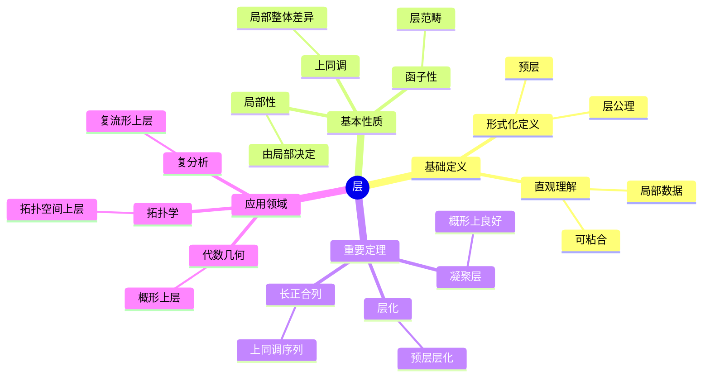
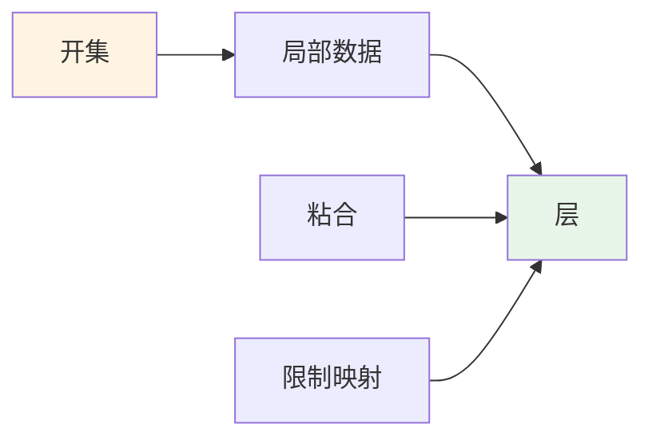
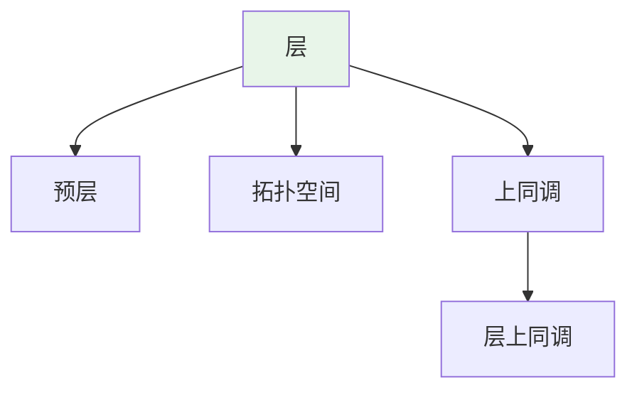
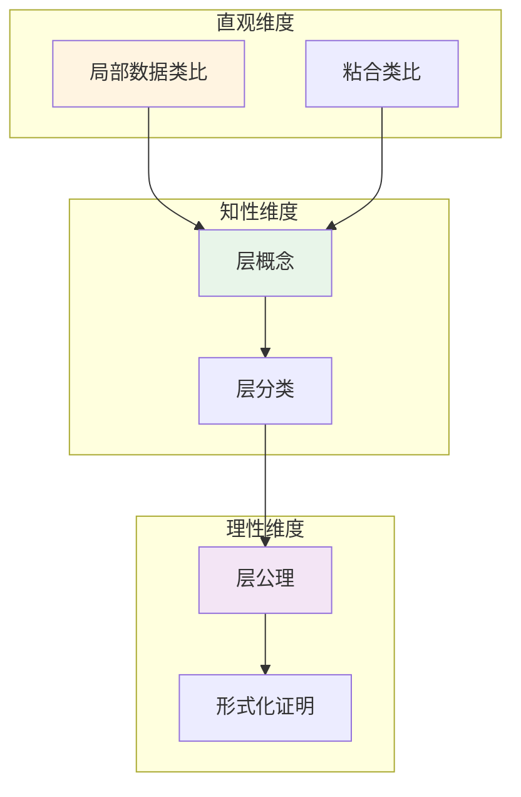

# 层 (Sheaf)

**概念编号**: C.CORE.022
**知识层次**: L0-L2
**知识领域**: D4 (几何)
**创建日期**: 2025年11月21日
**最后更新**: 2025年11月21日

---

## 📋 概述

层是拓扑空间上的局部数据，是代数几何、拓扑学、复分析的基础工具。层理论统一了不同数学分支中的局部-整体原理。

**权威资源对齐**:

- Wikipedia: [Sheaf (Mathematics)](https://en.wikipedia.org/wiki/Sheaf_(mathematics))
- Stanford课程: Math 216 (Algebraic Geometry)
- Princeton课程: MAT 540 (Algebraic Geometry)
- MIT课程: 18.726 (Algebraic Geometry)
- Metamath: [Sheaf](http://us.metamath.org/mpeuni/df-sheaf.html)

---

## 🎯 严格定义

### 基础定义 (L0)

**直观理解**: 层是拓扑空间上的"局部数据"，可以"粘合"成整体数据。例如连续函数层、光滑函数层。

**基本定义**: 层 $\mathcal{F}$ 是拓扑空间 $X$ 上的预层，满足粘合公理。

**简单例子**:

- 连续函数层：$\mathcal{C}(U) = \{f: U \to \mathbb{R} \text{ 连续}\}$
- 光滑函数层：$\mathcal{C}^\infty(U) = \{f: U \to \mathbb{R} \text{ 光滑}\}$
- 常数层：$\mathcal{F}(U) = A$（常数）

### 形式化定义 (L1)

**预层**: 拓扑空间 $X$ 上的预层 $\mathcal{F}$ 是：

- 对每个开集 $U$，有集合 $\mathcal{F}(U)$
- 对每个包含 $V \subseteq U$，有限制映射 $\text{res}_{U,V}: \mathcal{F}(U) \to \mathcal{F}(V)$
- 满足函子性：$\text{res}_{U,U} = \text{id}$，$\text{res}_{V,W} \circ \text{res}_{U,V} = \text{res}_{U,W}$

**层**: 预层 $\mathcal{F}$ 是层，若满足：

1. **单射性**: 若 $s, t \in \mathcal{F}(U)$ 在开覆盖 $\{U_i\}$ 上限制相同，则 $s = t$
2. **粘合性**: 若 $s_i \in \mathcal{F}(U_i)$ 在交集上相容，则存在 $s \in \mathcal{F}(U)$ 限制到 $s_i$

**记号**:

- $\mathcal{F}$: 层
- $\mathcal{F}(U)$: 在开集 $U$ 上的截面
- $\text{res}_{U,V}$: 限制映射
- $\Gamma(U, \mathcal{F})$: 全局截面

---

## 📚 历史背景

### 发展脉络

**20世纪中期**: 层理论的建立

- **Leray (1946)**: 在研究偏微分方程时引入层
- **Cartan (1950)**: 发展层上同调
- **Serre (1955)**: 在代数几何中应用层
- **Grothendieck (1957)**: 建立概形上的层理论

### 关键人物

- **Jean Leray (1906-1998)**: 层的引入者
- **Henri Cartan (1904-2008)**: 发展层上同调
- **Jean-Pierre Serre (1926-)**: 在代数几何中应用层
- **Alexander Grothendieck (1928-2014)**: 建立概形上的层理论

---

## 🔍 性质与定理

### 基本性质 (L1)

**性质1: 层的局部性**:

- 层由局部数据决定
- 局部性质可以推广到整体

**性质2: 层的函子性**:

- 层构成范畴
- 连续映射诱导层之间的映射

**性质3: 层的上同调**:

- 层有上同调理论
- 上同调测量局部-整体的差异

### 重要定理 (L2)

**定理1: 层的存在性**:

- **陈述**: 每个预层有层化
- **应用**: 层的构造

**定理2: 层上同调的长正合列**:

- **陈述**: 层短正合列诱导上同调长正合列
- **应用**: 上同调的计算

**定理3: 概形上的凝聚层**:

- **陈述**: 概形上的凝聚层有良好性质
- **应用**: 代数几何的计算

---

## 💡 应用实例

### 理论应用

- 代数几何（概形上的层）
- 拓扑学（拓扑空间上的层）
- 复分析（复流形上的层）

### 实际应用

#### 应用1: 物理学 - 规范理论中的层

**问题描述**:
在规范理论中，规范场是层，描述局部规范对称性。计算 $U(1)$ 规范理论的层。

**数学建模**:
规范场：$A_\mu$ 是1形式，满足规范变换 $A_\mu \to A_\mu + \partial_\mu \lambda$。这是层的数据。

**计算过程**:
- 规范群：$U(1)$
- 规范场：$A = A_\mu dx^\mu$
- 场强：$F = dA = \partial_\mu A_\nu - \partial_\nu A_\mu$
- 作用量：$S = \int F \wedge *F$

**结果解释**:
层用于规范理论，描述局部规范对称性。

**数据**:
- 规范群: $U(1)$
- 规范场: $A = A_\mu dx^\mu$
- 场强: $F = dA$

#### 应用2: 计算机科学 - 数据粘合

**问题描述**:
使用层的粘合性质合并分布式数据，数据分布在3个节点上，需要粘合成整体数据。

**数学建模**:
数据层：$\mathcal{F}(U_i)$ 是节点 $i$ 上的数据，粘合映射：$\text{res}_{U_i, U_i \cap U_j}$。

**计算过程**:
- 节点数：$n = 3$
- 数据：$\mathcal{F}(U_1) = \{a, b\}$，$\mathcal{F}(U_2) = \{b, c\}$，$\mathcal{F}(U_3) = \{c, d\}$
- 交集数据：$\mathcal{F}(U_1 \cap U_2) = \{b\}$，$\mathcal{F}(U_2 \cap U_3) = \{c\}$
- 粘合：$\mathcal{F}(U_1 \cup U_2 \cup U_3) = \{a, b, c, d\}$

**结果解释**:
层用于数据粘合，可以从局部数据构造整体数据。

**数据**:
- 节点数: 3
- 局部数据: $\{a, b\}$，$\{b, c\}$，$\{c, d\}$
- 整体数据: $\{a, b, c, d\}$

#### 应用3: 工程学 - 局部-整体问题

**问题描述**:
在工程设计中，使用层的局部-整体原理解决分布问题。温度场 $T(x)$ 在区域 $U$ 上局部给定，求整体温度场。

**数学建模**:
温度层：$\mathcal{T}(U)$ 是区域 $U$ 上的温度函数，满足粘合公理。

**计算过程**:
- 区域：$U = U_1 \cup U_2 \cup U_3$
- 局部温度：$T_1(x)$ 在 $U_1$，$T_2(x)$ 在 $U_2$，$T_3(x)$ 在 $U_3$
- 交集匹配：$T_1 = T_2$ 在 $U_1 \cap U_2$，$T_2 = T_3$ 在 $U_2 \cap U_3$
- 整体温度：$T(x)$ 在 $U$ 上

**结果解释**:
层用于局部-整体问题，可以从局部数据构造整体解。

**数据**:
- 区域数: 3
- 局部温度: $T_1, T_2, T_3$
- 整体温度: $T$

---

## 🔗 关联概念

### 依赖关系

- 拓扑空间（层在拓扑空间上定义）
- 环（环层、模层）
- 概形（概形上的层）

### 推广关系

- 预层（一般预层）
- 层（满足粘合公理的预层）
- 叠（更高范畴的层）

---

## 📖 参考文献

- Wikipedia: [Sheaf (Mathematics)](https://en.wikipedia.org/wiki/Sheaf_(mathematics))
- Hartshorne, R. (1977). *Algebraic Geometry*. Springer.
- Tennison, B. R. (1975). *Sheaf Theory*. Cambridge University Press.

---

## 🗺️ 思维导图 (编号: C.CORE.022.MIND)

### 层概念思维导图

---

## 📊 知识多维关系矩阵 (编号: C.CORE.022.MATRIX)

### 层的多维关系矩阵

| 维度 | 指标 | 层 |
|------|------|------|
| **知识层次** | L0基础 | ⭐⭐ |
| | L1中级 | ⭐⭐⭐ |
| | L2高级 | ⭐⭐⭐⭐ |
| | L3研究 | ⭐⭐⭐⭐⭐ |
| **知识领域** | D1基础数学 | ⭐⭐ |
| | D2代数 | ⭐⭐⭐ |
| | D4几何 | ⭐⭐⭐⭐⭐ |
| | D5拓扑 | ⭐⭐⭐⭐ |
| **依赖关系** | 前置概念 | 拓扑空间、环 |
| | 后续概念 | 上同调、概形 |
| **应用关系** | 理论应用 | ⭐⭐⭐⭐⭐ |
| | 实际应用 | ⭐⭐ |
| | 交叉应用 | ⭐⭐⭐ |
| **学习难度** | 直观理解 | ⭐⭐⭐⭐ |
| | 形式化理解 | ⭐⭐⭐⭐⭐ |
| | 深入应用 | ⭐⭐⭐⭐⭐ |

---

## 💭 形象化解释与论证 (编号: C.CORE.022.VISUAL)

### 形象化解释

**1. 层的直观理解**

- **类比**: 层就像"局部数据的集合"，可以"粘合"成整体数据
- **例子**:
  - 连续函数层：每个开集上定义连续函数，可以粘合成整体连续函数
  - 光滑函数层：每个开集上定义光滑函数，可以粘合成整体光滑函数
  - 常数层：每个开集上都是常数，但整体可能不是常数

**2. 粘合公理的直观理解**

- **类比**: 粘合公理就像"局部数据相容时可以粘合"
- **解释**:
  - 单射性：如果两个截面在覆盖上限制相同，则它们相同
  - 粘合性：如果局部截面相容，则可以粘合成整体截面

**3. 上同调的直观理解**

- **类比**: 上同调就像"测量局部-整体的差异"
- **解释**:
  - 如果局部数据可以粘合成整体数据，上同调为0
  - 如果局部数据不能粘合成整体数据，上同调非0
  - 上同调测量这种"障碍"

### 认知科学视角

**1. 数学教育家Dienes的观点**

- **多表征原则**: 通过函数（连续函数层）、几何（概形上的层）、代数（模层）等多种方式理解层
- **变化性原则**: 通过不同的层例子理解层的本质
- **教学启示**: 使用具体函数层、层可视化、粘合过程等多种方法

**2. 数学认知学家Tall的观点**

- **过程-对象对偶**: 理解"层构造过程"（如何定义层）和"层"（对象）
- **认知层次**: 从直观理解（"局部数据"）到形式化理解（层公理）

---

## 👨‍🏫 专家观点与论证 (编号: C.CORE.022.EXPERT)

### 数学家的观点

**1. Jean Leray (1906-1998) - 层的引入者**
> "层是研究局部-整体问题的关键工具，它统一了不同数学分支中的局部-整体原理。"
>
> **意义**: Leray引入了层概念，为现代数学提供了重要工具。

**2. Henri Cartan (1904-2008) - 层上同调的奠基者**
> "层上同调是研究层的重要工具，它测量局部-整体的差异。"
>
> **意义**: Cartan发展了层上同调，为现代数学奠定了基础。

**3. Jean-Pierre Serre (1926-) - 代数几何中层的应用者**
> "层是研究概形的关键工具，它使我们可以用上同调研究概形。"
>
> **意义**: Serre在代数几何中应用层，推动了现代代数几何的发展。

**4. Alexander Grothendieck (1928-2014) - 概形上层理论的建立者**
> "概形上的层理论是代数几何的现代基础，它统一了代数几何、数论、交换代数。"
>
> **意义**: Grothendieck建立了概形上的层理论，开创了现代代数几何。

### 数学教育家的观点

**1. Zoltan Dienes (1916-2014) - 数学教育家**
> "层概念应该通过具体函数层、层可视化、粘合过程等多种方式学习。"
>
> **教学启示**:
>
> - 从连续函数层、光滑函数层等具体例子开始
> - 使用层可视化理解层的结构
> - 通过粘合过程理解层公理

**2. Hans Freudenthal (1905-1990) - 数学教育家**
> "层概念的学习需要从'局部数据'发展到'层结构'。"
>
> **认知发展**:
>
> - **局部阶段**: 理解层作为局部数据的集合
> - **结构阶段**: 理解层作为满足粘合公理的结构

### 数学认知学家的观点

**1. David Tall - 数学认知学家**
> "层概念的理解需要从'过程'（如何定义层）发展到'对象'（层本身）。"
>
> **认知层次**:
>
> - **过程层次**: 理解"如何定义层"（如$\mathcal{F}(U)$）
> - **对象层次**: 理解"层"（如$\mathcal{F}$是一个层）

---

## 🎨 认知维度表征 (编号: C.CORE.022.COGNITIVE)

### 直观维度表征 (编号: C.CORE.022.INTUITIVE)

#### 形象类比

- **局部数据类比**: 层就像"局部数据的集合"
  - 每个开集对应一个数据集合
  - 就像函数在每个开集上的值

- **粘合类比**: 层就像"可以粘合的局部数据"
  - 局部数据可以粘合成全局数据
  - 就像局部函数可以粘合成全局函数

#### 具体例子

- **例子1**: 连续函数层 $\mathcal{C}_X$
  - 每个开集对应连续函数集合
  - 这是最基本的层

- **例子2**: 结构层 $\mathcal{O}_X$
  - 概形上的结构层
  - 这是概形的核心结构

#### 可视化表示

#### 几何直观

- **函数层直观**: 通过函数层理解层
  - 连续函数层、光滑函数层
  - 层是函数的推广

- **粘合直观**: 通过粘合理解层
  - 局部数据可以粘合
  - 粘合公理保证一致性

---

### 知性维度表征 (编号: C.CORE.022.INTELLECTUAL)

#### 概念定义

- **严格定义**: 层是满足粘合公理的预层
- **等价定义**: 通过层化、茎定义
- **特征描述**: 层是研究拓扑空间和概形的关键工具

#### 概念分类

- **预层 vs 层**: 按粘合公理分类
- **Abel层 vs 一般层**: 按值域类型分类
- **凝聚层 vs 一般层**: 按有限性分类

#### 概念关系

#### 知识矩阵

| 维度 | 指标 | 层 |
|------|------|------|
| **知识层次** | L0基础 | ⭐⭐ |
| | L1中级 | ⭐⭐⭐ |
| | L2高级 | ⭐⭐⭐⭐⭐ |
| **知识领域** | D4几何 | ⭐⭐⭐⭐⭐ |
| **学习难度** | 直观理解 | ⭐⭐⭐⭐ |
| | 形式化理解 | ⭐⭐⭐⭐⭐ |
| **认知维度** | 直观维度 | ⭐⭐⭐⭐ |
| | 知性维度 | ⭐⭐⭐⭐⭐ |
| | 理性维度 | ⭐⭐⭐⭐⭐ |

---

### 理性维度表征 (编号: C.CORE.022.RATIONAL)

#### 公理体系

- **预层公理**: 预层是开集到集合的函子
- **粘合公理**: 层满足粘合公理
- **层化公理**: 预层可以层化

#### 形式化定义

- **形式化定义**: 使用一阶逻辑严格定义
- **符号系统**: $\mathcal{F}$, $\mathcal{F}(U)$, $\mathcal{F}_x$, $\text{Sh}(X)$
- **类型系统**: 层是拓扑空间类型到范畴类型的函子

#### 逻辑推理

- **基本定理**: 层的性质、层上同调、Leray谱序列
- **证明思路**: 使用范畴论和同调代数方法证明
- **推理链**: 定义 → 基本性质 → 层上同调 → 重要定理

#### 证明系统

- **证明方法**: 构造性证明、范畴方法、同调方法
- **形式化证明**: 可以使用Lean4等工具进行形式化
- **验证工具**: Metamath、Lean4等

---

### 综合整合表征 (编号: C.CORE.022.INTEGRATED)

#### 多维度整合

#### 图形转换

- **思维导图**: 展示层的知识结构
- **知识图谱**: 展示层与其他概念的关系
- **知识矩阵**: 展示层的多维度特征

#### 应用示例

- **应用1**: 代数几何（概形上的层、上同调）
- **应用2**: 拓扑学（层上同调、Leray谱序列）
- **应用3**: 微分几何（微分形式层、de Rham上同调）

---

**创建日期**: 2025年11月21日
**最后更新**: 2025年11月21日
**维护状态**: 持续更新中
