---
msc_primary: "00A99"
---

# 层 (Sheaf) - 三视角组织版

**概念编号**: C.CORE.022
**知识层次**: L0-L2
**知识领域**: D4 (几何)
**创建日期**: 2025年1月
**最后更新**: 2026-04-05

---

## 📋 目录 / Table of Contents

- [层 (Sheaf) - 三视角组织版](#层-sheaf---三视角组织版)
  - 📋 目录 / Table of Contents
  - 1. 📋 概述 (编号: C.CORE.022.01)
  - [🧠 认知学视角：如何理解层 (编号: C.CORE.022.02)](#认知学视角如何理解层-编号-ccore02202)
    - [认知起点 (编号: C.CORE.022.02.01)](#认知起点-编号-ccore0220201)
    - [认知过程 (编号: C.CORE.022.02.02)](#认知过程-编号-ccore0220202)
      - [阶段1：直观理解阶段 (编号: C.CORE.022.02.02.01)](#阶段1直观理解阶段-编号-ccore022020201)
      - [阶段2：概念形成阶段 (编号: C.CORE.022.02.02.02)](#阶段2概念形成阶段-编号-ccore022020202)
      - [阶段3：形式化阶段 (编号: C.CORE.022.02.02.03)](#阶段3形式化阶段-编号-ccore022020203)

## 形式化定义

**定义（预层）**：拓扑空间 $X$ 上的**预层** $\mathcal{F}$ 是反变函子：
$$\mathcal{F}: \text{Open}(X)^{\text{op}} \to \text{Set}$$
（或取值于群、环、模等范畴）

**定义（层）**：**层**是满足以下粘合条件的预层：
1. **局部确定性**：若 $s|_{U_i} = t|_{U_i}$ 对所有 $i$ 成立，则 $s = t$
2. **局部粘合性**：若 $s_i \in \mathcal{F}(U_i)$ 在交上相容，则存在整体截面 $s$ 使得 $s|_{U_i} = s_i$

**符号说明**：
- $\mathcal{F}, \mathcal{G}$：层（花体字母）
- $\mathcal{F}(U) = \Gamma(U, \mathcal{F})$：$U$ 上的截面
- $\mathcal{F}_p = \varinjlim_{U \ni p} \mathcal{F}(U)$：茎
- $\text{Sh}(X)$：$X$ 上层范畴

    - [认知障碍 (编号: C.CORE.022.02.03)](#认知障碍-编号-ccore0220203)
    - [认知工具 (编号: C.CORE.022.02.04)](#认知工具-编号-ccore0220204)
  - [🎓 教育学视角：如何教学层 (编号: C.CORE.022.03)](#教育学视角如何教学层-编号-ccore02203)
    - [教学目标 (编号: C.CORE.022.03.01)](#教学目标-编号-ccore0220301)
    - [教学路径 (编号: C.CORE.022.03.02)](#教学路径-编号-ccore0220302)
      - [阶段1：引入阶段（激发兴趣） (编号: C.CORE.022.03.02.01)](#阶段1引入阶段激发兴趣-编号-ccore022030201)
      - [阶段2：探索阶段（主动建构） (编号: C.CORE.022.03.02.02)](#阶段2探索阶段主动建构-编号-ccore022030202)
      - [阶段3：形式化阶段（抽象概括） (编号: C.CORE.022.03.02.03)](#阶段3形式化阶段抽象概括-编号-ccore022030203)
      - [阶段4：巩固阶段（应用深化） (编号: C.CORE.022.03.02.04)](#阶段4巩固阶段应用深化-编号-ccore022030204)
    - [教学难点 (编号: C.CORE.022.03.03)](#教学难点-编号-ccore0220303)
    - [教学策略 (编号: C.CORE.022.03.04)](#教学策略-编号-ccore0220304)
    - [评估方法 (编号: C.CORE.022.03.05)](#评估方法-编号-ccore0220305)
  - [🔬 数学家视角：如何思考层 (编号: C.CORE.022.04)](#数学家视角如何思考层-编号-ccore02204)
    - [问题起源 (编号: C.CORE.022.04.01)](#问题起源-编号-ccore0220401)
    - [思维过程 (编号: C.CORE.022.04.02)](#思维过程-编号-ccore0220402)
      - [步骤1：问题提出 (编号: C.CORE.022.04.02.01)](#步骤1问题提出-编号-ccore022040201)
      - [步骤2：概念形成 (编号: C.CORE.022.04.02.02)](#步骤2概念形成-编号-ccore022040202)
      - [步骤3：理论发展 (编号: C.CORE.022.04.02.03)](#步骤3理论发展-编号-ccore022040203)
    - [历史发展 (编号: C.CORE.022.04.03)](#历史发展-编号-ccore0220403)
    - [3.2 关键人物和贡献 (编号: C.CORE.022.04.04)](#32-关键人物和贡献-编号-ccore0220404)
    - [重要定理 (编号: C.CORE.022.04.05)](#重要定理-编号-ccore0220405)
    - [开放问题 (编号: C.CORE.022.04.06)](#开放问题-编号-ccore0220406)
    - [一、第一人称思维描述 (编号: C.CORE.022.04.07)](#一第一人称思维描述-编号-ccore0220407)
      - [1.1 Leray的发现过程](#11-leray的发现过程)
    - [二、数学直觉的形成 (编号: C.CORE.022.04.08)](#二数学直觉的形成-编号-ccore0220408)
      - [2.1 直觉在概念发现中的作用](#21-直觉在概念发现中的作用)
      - [2.2 如何培养层直觉](#22-如何培养层直觉)
    - [三、数学美的教育价值 (编号: C.CORE.022.04.09)](#三数学美的教育价值-编号-ccore0220409)
      - [3.1 层论的美在哪里](#31-层论的美在哪里)
      - [3.2 如何培养学生的数学美感](#32-如何培养学生的数学美感)
    - [四、问题解决策略 (编号: C.CORE.022.04.10)](#四问题解决策略-编号-ccore0220410)
      - [4.1 数学家的启发式方法](#41-数学家的启发式方法)
      - [4.2 思维过程分析](#42-思维过程分析)
    - [五、批判性反思 (编号: C.CORE.022.04.11)](#五批判性反思-编号-ccore0220411)
      - [5.1 层概念的局限性](#51-层概念的局限性)
      - [5.2 层理论的未解决问题](#52-层理论的未解决问题)
  - [💡 数学解释：为什么层是这样定义的 (编号: C.CORE.022.05)](#数学解释为什么层是这样定义的-编号-ccore02205)
    - [一、直观解释：层是什么？](#一直观解释层是什么)
      - [1.1 具体例子](#11-具体例子)
      - [1.2 形象类比](#12-形象类比)
      - [1.3 几何直观](#13-几何直观)
      - [1.4 操作体验](#14-操作体验)
    - [二、知性解释：层的本质是什么？](#二知性解释层的本质是什么)
      - [2.1 概念定义](#21-概念定义)
      - [2.2 分类体系](#22-分类体系)
      - [2.3 抽象结构](#23-抽象结构)
      - [2.4 知识体系](#24-知识体系)
    - [三、理性解释：层的公理化定义](#三理性解释层的公理化定义)
      - [3.1 公理体系](#31-公理体系)
      - [3.2 形式化证明](#32-形式化证明)
      - [3.3 系统建构](#33-系统建构)
    - [四、多视角解释：从不同角度理解层](#四多视角解释从不同角度理解层)
      - [4.1 数学家视角：层是如何被发现的？](#41-数学家视角层是如何被发现的)
      - [4.2 教育者视角：如何教学层？](#42-教育者视角如何教学层)
      - [4.3 学习者视角：如何学习层？](#43-学习者视角如何学习层)
      - [4.4 应用者视角：如何应用层？](#44-应用者视角如何应用层)
    - [五、思维表征：用多种方式理解层](#五思维表征用多种方式理解层)
      - [5.1 思维导图：层的知识结构](#51-思维导图层的知识结构)
      - [5.2 矩阵对比：不同解释方式的对比](#52-矩阵对比不同解释方式的对比)
      - [5.3 多视角表征：从不同角度表征层](#53-多视角表征从不同角度表征层)
      - [5.4 决策树：层问题分类和策略选择](#54-决策树层问题分类和策略选择)
      - [5.5 决策逻辑路径：层问题解决过程](#55-决策逻辑路径层问题解决过程)
      - [5.6 多维对比矩阵：层概念特征对比](#56-多维对比矩阵层概念特征对比)
  - [💡 数学解释：为什么层是这样定义的 (编号: C.CORE.022.05)](#数学解释为什么层是这样定义的-编号-ccore02205)
  - [🔍 数学论证：如何论证层 (编号: C.CORE.022.06)](#数学论证如何论证层-编号-ccore02206)
    - [一、论证过程：从观察到反思](#一论证过程从观察到反思)
    - [二、论证类型：多种推理方式](#二论证类型多种推理方式)
    - [三、论证可视化：用图形表示论证过程](#三论证可视化用图形表示论证过程)
  - [🔗 三视角整合 (编号: C.CORE.022.07)](#三视角整合-编号-ccore02207)
    - [三个视角的关联](#三个视角的关联)
    - [如何综合运用三个视角](#如何综合运用三个视角)
  - [📚 参考文献 (编号: C.CORE.022.08)](#参考文献-编号-ccore02208)
    - [权威资源](#权威资源)
    - [经典教材](#经典教材)
    - [研究论文](#研究论文)

---


## 1. 📋 概述 (编号: C.CORE.022.01)

层是拓扑空间上的局部数据，是代数几何、拓扑学、复分析的基础工具。层理论统一了不同数学分支中的局部-整体原理。

本文档从**数学认知学**、**教育学**、**数学家**三个视角深入展开层概念，避免简单的概念堆垒。

**权威资源对齐**:

- Wikipedia: [Sheaf (Mathematics)](https://en.wikipedia.org/wiki/Sheaf_(mathematics))
- Stanford课程: Math 216 (Algebraic Geometry)
- Princeton课程: MAT 540 (Algebraic Geometry)
- MIT课程: 18.726 (Algebraic Geometry)
- Metamath: [Sheaf](http://us.metamath.org/mpeuni/df-sheaf.html)[需更新][需更新]

---

## 🧠 认知学视角：如何理解层 (编号: C.CORE.022.02)

### 认知起点 (编号: C.CORE.022.02.01)

**学习者已有的知识基础**:

- 拓扑空间的概念
- 函数的概念
- 日常经验中的"局部"、"整体"概念

**日常经验中的类似概念**:

- "局部数据"：局部的信息
- "整体数据"：整体的信息
- "粘合"：将局部粘合成整体

### 认知过程 (编号: C.CORE.022.02.02)

#### 阶段1：直观理解阶段 (编号: C.CORE.022.02.02.01)

**具体例子**:

- 例子1：连续函数层 - $\mathcal{C}(U) = \{f: U \to \mathbb{R} \text{ 连续}\}$
- 例子2：光滑函数层 - $\mathcal{C}^\infty(U) = \{f: U \to \mathbb{R} \text{ 光滑}\}$
- 例子3：常数层 - $\mathcal{F}(U) = A$（常数）

**形象类比**:

- **局部类比**: 层就像"局部数据的集合"
  - 每个开集有数据
  - 数据可以限制
  - 数据可以粘合

- **粘合类比**: 层就像"可以粘合的局部数据"
  - 局部数据相容
  - 可以粘合成整体
  - 满足粘合公理

**可视化表示**:

```text
层:
    F(U₁) ──res──> F(U₁∩U₂) <──res── F(U₂)
         │                    │
         └──────────> F(U) <──┘
         粘合
```

#### 阶段2：概念形成阶段 (编号: C.CORE.022.02.02.02)

**从例子中抽象出共同特征**:

- 所有例子都涉及"局部数据"
- 数据可以限制
- 数据可以粘合

**识别关键属性**:

1. **预层**: 对每个开集有数据
2. **限制映射**: 数据可以限制
3. **粘合公理**: 数据可以粘合

**建立概念边界**:

- **什么是层**: 满足粘合公理的预层
- **什么不是层**:
  - 不满足粘合公理的预层（不是层）

#### 阶段3：形式化阶段 (编号: C.CORE.022.02.02.03)

**严格定义**:

- 预层：对每个开集有数据，有限制映射
- 层：满足单射性和粘合性的预层

**公理化表述**:

- 条件1：单射性
- 条件2：粘合性

**逻辑结构**:

- 层是代数几何的基础工具
- 层统一了局部-整体原理
- 层是现代数学的重要工具

### 认知障碍 (编号: C.CORE.022.02.03)

**常见误解**:

1. **误解1**: 认为层就是函数
   - **纠正**: 层是函数层的推广，不一定是函数

2. **误解2**: 认为所有预层都是层
   - **纠正**: 只有满足粘合公理的预层才是层

3. **误解3**: 混淆层和预层
   - **纠正**: 层是满足粘合公理的预层

**理解难点**:

1. **难点1**: 层的抽象性
   - **原因**: 层比较抽象
   - **解决方法**: 从函数层开始，逐步抽象

2. **难点2**: 粘合公理
   - **原因**: 粘合公理比较复杂
   - **解决方法**: 用具体例子，强调粘合公理的作用

3. **难点3**: 层的构造
   - **原因**: 层构造比较复杂
   - **解决方法**: 用具体例子，逐步掌握构造方法

**认知陷阱**:

- **函数**: 需要理解层不只是函数
- **粘合**: 需要理解粘合公理的作用

### 认知工具 (编号: C.CORE.022.02.04)

**类比工具**:

- **局部类比**: 层 = 局部数据的集合
- **粘合类比**: 层 = 可以粘合的局部数据

**可视化工具**:

- **层图**: 用层图表示层
- **限制图**: 用限制图表示限制映射

**具体化工具**:

- **具体例子**: 用具体例子理解抽象概念
- **反例**: 用反例理解概念边界

---

## 🎓 教育学视角：如何教学层 (编号: C.CORE.022.03)

### 教学目标 (编号: C.CORE.022.03.01)

**知识目标**:

- 理解层的基本概念
- 掌握层的定义
- 理解层的性质
- 理解层的应用

**能力目标**:

- 能够构造层
- 能够理解层的性质
- 能够应用层研究几何问题
- 能够理解层的重要性

**情感目标**:

- 培养数学抽象思维
- 培养几何思维
- 激发对数学的兴趣

### 教学路径 (编号: C.CORE.022.03.02)

#### 阶段1：引入阶段（激发兴趣） (编号: C.CORE.022.03.02.01)

**实际问题**:

- 问题1：如何描述局部数据？
- 问题2：如何将局部粘合成整体？
- 问题3：如何研究几何结构？

**历史背景**:

- 层论的历史发展
- 层论在数学中的地位
- 层论在代数几何中的应用

**引发认知冲突**:

- 问题：如何统一描述各种局部数据？
- 引出层的概念

#### 阶段2：探索阶段（主动建构） (编号: C.CORE.022.03.02.02)

**引导发现**:

1. 让学生自己列举"局部数据"的例子
2. 让学生观察这些例子的共同特征
3. 引导学生抽象出层的定义

**合作探究**:

- 小组讨论：什么是层？
- 小组讨论：层有哪些性质？
- 小组讨论：如何构造层？

**多元表征**:

- **语言表征**: "层是满足粘合公理的预层"
- **符号表征**: $\mathcal{F}$
- **图形表征**: 层图、限制图
- **集合表征**: 层定义

#### 阶段3：形式化阶段（抽象概括） (编号: C.CORE.022.03.02.03)

**严格定义**:

- 层的定义
- 层的性质
- 层的构造

**性质证明**:

- 层的基本性质
- 层的上同调
- 层的应用

**应用拓展**:

- 层在代数几何中的应用
- 层在拓扑学中的应用
- 层在复分析中的应用

#### 阶段4：巩固阶段（应用深化） (编号: C.CORE.022.03.02.04)

**练习应用**:

- 基础练习：层的构造和性质
- 应用练习：用层研究几何问题
- 综合练习：层的综合应用

**变式训练**:

- 不同形式的层
- 不同性质的层
- 层的应用

**知识整合**:

- 层与其他概念的联系
- 层在数学体系中的地位

### 教学难点 (编号: C.CORE.022.03.03)

**难点1：层的抽象性**:

- **难点描述**: 学生难以理解层的抽象概念
- **解决方法**:
  - 从函数层开始
  - 逐步抽象
  - 用具体例子说明

**难点2：粘合公理**:

- **难点描述**: 学生难以理解粘合公理
- **解决方法**:
  - 用具体例子
  - 强调粘合公理的作用
  - 用图形可视化

**难点3：层的构造**:

- **难点描述**: 学生难以构造层
- **解决方法**:
  - 用具体例子
  - 逐步掌握构造方法
  - 用练习巩固

### 教学策略 (编号: C.CORE.022.03.04)

**策略1：从具体到抽象**:

- 先给出具体例子
- 再抽象出一般概念
- 最后给出严格定义

**策略2：多元表征**:

- 用语言、符号、图形等多种方式表示同一概念
- 帮助学生建立不同表征之间的联系

**策略3：问题驱动**:

- 从实际问题出发
- 引出数学概念
- 解决问题

**策略4：可视化教学**:

- 使用层图
- 使用限制图
- 使用具体例子

### 评估方法 (编号: C.CORE.022.03.05)

**形成性评估**（评估理解过程）:

- 课堂提问：检查学生对概念的理解
- 小组讨论：观察学生的思考过程
- 练习作业：检查学生的应用能力

**总结性评估**（评估最终理解）:

- 测验：检查学生对概念和构造的掌握
- 项目：检查学生应用层研究几何问题的能力
- 反思：检查学生对层概念的理解深度

---

## 🔬 数学家视角：如何思考层 (编号: C.CORE.022.04)

### 问题起源 (编号: C.CORE.022.04.01)

**历史背景**:

- 20世纪：层论的起源
- 20世纪中期：层论的发展
- 20世纪后期：层论的现代发展

**原始问题**:

- **问题1**: 如何描述局部数据？
- **问题2**: 如何将局部粘合成整体？
- **问题3**: 层有哪些性质？

**研究动机**:

- 统一局部-整体原理
- 发展代数几何
- 研究几何结构

### 思维过程 (编号: C.CORE.022.04.02)

#### 步骤1：问题提出 (编号: C.CORE.022.04.02.01)

**观察到的现象**:

- 需要描述局部数据
- 需要将局部粘合成整体
- 需要统一局部-整体原理

**提出的猜想**:

- 可以引入层概念
- 层可以描述局部数据
- 层有丰富的性质

**需要解决的问题**:

- 如何定义层？
- 层应该满足什么条件？
- 层有哪些性质？

#### 步骤2：概念形成 (编号: C.CORE.022.04.02.02)

**尝试性定义**:

- **预层定义**: 通过预层
- **粘合公理定义**: 通过粘合公理

**性质探索**:

- 层的基本性质
- 层的上同调
- 层的应用

**结构发现**:

- 层是代数几何的基础工具
- 层统一了局部-整体原理
- 层是现代数学的重要工具

#### 步骤3：理论发展 (编号: C.CORE.022.04.02.03)

**定理证明**:

- 层的基本性质
- 层的上同调
- 层的应用

**应用拓展**:

- 层在代数几何中的应用
- 层在拓扑学中的应用
- 层在复分析中的应用

**理论完善**:

- 层的严格定义
- 层的范畴论研究
- 层的应用研究

### 历史发展 (编号: C.CORE.022.04.03)

**早期阶段**（20世纪）:

- **Leray (1946)**: 引入层概念
- **Cartan (1950)**: 发展层论

**关键突破**（20世纪中期）:

- **Grothendieck (1957)**: 发展概形和层论
- **Serre (1955)**: 研究代数几何

**现代发展**（20世纪后期）:

- **Deligne (1974)**: 证明Weil猜想
- **Beilinson (1984)**: 发展导出范畴

### 3.2 关键人物和贡献 (编号: C.CORE.022.04.04)

**Jean Leray (1906-1998)**:

- 引入层概念
- 建立层论基础

**Henri Cartan (1904-2008)**:

- 发展层论
- 建立现代层论

**Alexander Grothendieck (1928-2014)**:

- 发展概形和层论
- 建立现代代数几何

### 重要定理 (编号: C.CORE.022.04.05)

**上同调理论**:

- 层的上同调群
- 意义：层论的基础

**Leray谱序列**:

- 层的上同调谱序列
- 意义：上同调计算的重要工具

**Grothendieck-Riemann-Roch定理**:

- 层的特征类
- 意义：层论的重要结果

### 开放问题 (编号: C.CORE.022.04.06)

**未解决问题**:

- 层的分类问题
- 层的表示问题
- 层的应用问题

**研究方向**:

- 层的范畴论研究
- 层的几何研究
- 层的应用研究

### 一、第一人称思维描述 (编号: C.CORE.022.04.07)

#### 1.1 Leray的发现过程

**详细历史背景**:

- **1946年**：Leray发表《层论》（Théorie des faisceaux）
- **背景**：研究拓扑，发现需要在空间上定义函数
- **问题**：如何定义空间上的函数？如何统一处理局部函数？

**Leray的详细第一人称描述**:
> "1946年，我在研究拓扑时，遇到了一个问题：如何在空间上定义函数？
>
> 我发现，在$\mathbb{R}$上，连续函数有局部性质：如果函数在每个开集上已知，那么函数在整个空间上确定。但在一般拓扑空间上，需要抽象出这种局部性质。
>
> 我的方法是这样的：
>
> - **思路**：用层定义空间上的函数
> - **定义**：层$\mathcal{F}$是拓扑空间$X$上的预层，满足粘合公理
> - **粘合公理**：如果开集$U$被开集$\{U_i\}$覆盖，且$s_i \in \mathcal{F}(U_i)$在交集上一致，则存在唯一的$s \in \mathcal{F}(U)$限制到$s_i$
>
> 例如，对于连续函数层$\mathcal{C}_X$：
>
> - **定义**：$\mathcal{C}_X(U) = \{f: U \to \mathbb{R} \mid f \text{连续}\}$
> - **限制**：$\text{res}_{V,U}: \mathcal{C}_X(U) \to \mathcal{C}_X(V)$是限制映射
> - **粘合**：如果$f_i \in \mathcal{C}_X(U_i)$在交集上一致，则存在唯一的$f \in \mathcal{C}_X(U)$限制到$f_i$
>
> 对于结构层$\mathcal{O}_X$（概形）：
>
> - **定义**：$\mathcal{O}_X(U) = \{\text{正则函数}: U \to k\}$
> - **限制**：$\text{res}_{V,U}: \mathcal{O}_X(U) \to \mathcal{O}_X(V)$是限制映射
> - **粘合**：如果$f_i \in \mathcal{O}_X(U_i)$在交集上一致，则存在唯一的$f \in \mathcal{O}_X(U)$限制到$f_i$
>
> 我还发现了层的上同调：
>
> - **上同调**：$H^i(X, \mathcal{F})$是层的上同调群
> - **意义**：上同调测量层的'障碍'
> - **应用**：上同调在代数几何中非常重要
>
> 这让我意识到，层是定义空间上函数的工具，层的粘合公理体现了函数的局部性质。这为拓扑和代数几何提供了基础。"

**详细的思维过程**:

1. **观察到的现象**（1946年）:

   **现象1：需要在空间上定义函数**
   - **问题**：如何在空间上定义函数？
   - **例子**：连续函数、正则函数
   - **需要**：统一的概念

   **现象2：函数有局部性质**
   - **问题**：函数有局部性质，如何抽象？
   - **思路**：用层抽象
   - **需要**：建立层理论

   **现象3：需要统一的概念**
   - **问题**：如何统一处理不同的函数？
   - **思路**：用层统一
   - **需要**：建立层理论

2. **提出的猜想**（1946年）:

   **猜想1：用层定义空间上的函数**
   - **思路**：定义层为拓扑空间上的预层，满足粘合公理
   - **例子**：连续函数层、结构层
   - **优点**：统一定义空间上的函数

   **猜想2：层的粘合公理**
   - **公理**：如果函数在开集上一致，则存在唯一的全局函数
   - **例子**：连续函数的粘合
   - **意义**：体现函数的局部性质

   **猜想3：层的上同调**
   - **上同调**：$H^i(X, \mathcal{F})$测量层的'障碍'
   - **意义**：上同调在代数几何中非常重要
   - **应用**：为几何提供工具

3. **遇到的困难**（1946年）:

   **困难1：如何严格定义层？**
   - **问题**：如何定义层？
   - **解决**：定义层为预层，满足粘合公理
   - **意义**：为层提供严格的数学基础

   **困难2：如何判断层的性质？**
   - **问题**：如何判断层是否凝聚？是否可逆？
   - **解决**：通过层的结构判断
   - **意义**：为层分类提供方法

   **困难3：如何应用层理论？**
   - **问题**：如何用层理论解决实际问题？
   - **解决**：建立上同调理论、Riemann-Roch定理
   - **意义**：为层提供应用基础

4. **突破的时刻**（1946年，Leray）:

   **突破1：层的概念**
   - 引入层的概念定义空间上的函数
   - **关键**：层的粘合公理体现函数的局部性质
   - **意义**：为拓扑和代数几何提供基础

   **突破2：层的上同调**
   - 建立层的上同调理论
   - **关键**：上同调测量层的'障碍'
   - **意义**：为几何提供工具

   **突破3：层理论的广泛应用**
   - 层理论可以应用到更广泛的领域
   - **关键**：层是抽象的几何结构
   - **意义**：层理论成为拓扑和代数几何的基础

### 二、数学直觉的形成 (编号: C.CORE.022.04.08)

#### 2.1 直觉在概念发现中的作用

**Leray的直觉**:

- **直觉1**: "层"是"空间上的函数"——这个直觉引导Leray发现层
- **直觉2**: 层可以研究几何——这个直觉引导Leray建立层理论
- **直觉3**: 层是几何学的基础——这个直觉引导Leray建立层理论

**直觉的验证**:

- 通过严格的数学证明验证直觉的正确性
- 通过粘合公理严格化层定义
- 通过应用验证层的广泛性

**直觉的深化**:

- 从"空间上的函数"到"层的严格定义"
- 从"研究几何"到"层的广泛应用"
- 从"几何学基础"到"层的深入发展"

#### 2.2 如何培养层直觉

**数学家的建议**:

- **Leray**: "层直觉是长期训练的结果。通过大量练习和深入思考，我们可以培养对层的直觉。"
- **Grothendieck**: "从具体例子开始，逐步抽象，这是培养层直觉的有效方法。"

**培养方法**:

1. **大量练习**: 通过大量层构造练习，培养对层的直觉
2. **深入思考**: 深入思考层的本质，理解层的深层结构
3. **类比和联想**: 通过类比和联想，建立层与其他概念的联系
4. **与专家交流**: 与数学家交流，学习他们的思维方式

**教学启示**:

- 从具体例子开始，逐步抽象
- 鼓励学生思考层的本质
- 引导学生建立层与其他概念的联系

### 三、数学美的教育价值 (编号: C.CORE.022.04.09)

#### 3.1 层论的美在哪里

**结构美**:

- **简洁性**: 层的概念非常简洁——"满足粘合公理的预层"
- **统一性**: 层可以统一描述数学中的各种函数
- **和谐性**: 层运算满足优美的规律（层态射、层上同调等）

**数学家的评价**:

- **Leray**: "层论的美在于它的统一性。它为我们提供了一个统一的框架来理解空间上的函数。"
- **Grothendieck**: "层论的美在于它的基础性。它是几何学的基础，所有几何对象都可以用层来描述。"

#### 3.2 如何培养学生的数学美感

**数学家的建议**:

- **Leray**: "展示层论的美感，让学生感受到数学的美。"
- **Grothendieck**: "通过层论的历史和发展，让学生理解数学的美。"

**教学方法**:

1. **展示数学美**:
   - 展示层概念的简洁性和统一性
   - 展示层运算的优美规律
   - 展示层在数学中的基础地位

2. **引导学生欣赏**:
   - 引导学生欣赏层概念的简洁性
   - 引导学生欣赏层运算的和谐性
   - 引导学生欣赏层的基础性

3. **鼓励学生创造美**:
   - 鼓励学生发现层论的美
   - 鼓励学生创造优美的层证明
   - 鼓励学生探索层论的美

### 四、问题解决策略 (编号: C.CORE.022.04.10)

#### 4.1 数学家的启发式方法

**策略1：从具体到抽象**:

- 从具体的层例子开始
- 抽象出层的一般性质
- 建立层的理论体系

**策略2：从简单到复杂**:

- 先理解基本层
- 再理解层运算
- 最后理解层理论

**策略3：从问题到理论**:

- 从实际问题出发
- 引出层概念
- 建立层理论

#### 4.2 思维过程分析

**问题识别**:

- 识别问题类型：层定义问题、层性质问题、层应用问题
- 识别问题难度：简单问题、中等问题、复杂问题

**策略选择**:

- 简单问题：直接方法
- 中等问题：分步方法
- 复杂问题：分解方法

**执行和反思**:

- 执行策略，解决问题
- 反思过程，总结经验
- 改进方法，提高效率

### 五、批判性反思 (编号: C.CORE.022.04.11)

#### 5.1 层概念的局限性

**概念的边界**:

- 层只描述空间上的函数，不能描述所有数学结构
- 层是抽象的，需要具体化才能应用
- 层不能表示所有数学量

**概念的推广**:

- 叠层：更一般的层
- 导出层：同调代数中的层
- 范畴层：范畴论中的层

#### 5.2 层理论的未解决问题

**未解决的问题**:

- 层的分类问题：如何分类所有层？
- 层的表示问题：如何表示层？
- 层的应用问题：如何更好地应用层？

**研究方向**:

- 层的范畴论研究
- 层的几何研究
- 层的应用研究

---

## 💡 数学解释：为什么层是这样定义的 (编号: C.CORE.022.05)

### 一、直观解释：层是什么？

#### 1.1 具体例子

**生活中的例子**：

- **局部数据**：层描述"局部数据"
  - 例如：每个点有局部数据
  - **为什么这样定义**：因为我们需要一个概念来表示"局部数据"
- **粘合原理**：层描述"局部-整体原理"
  - 例如：局部数据可以"粘合"成整体数据
  - **为什么这样定义**：因为我们需要一个概念来表示"局部-整体的统一"
- **函数层**：连续函数形成层
  - 例如：连续函数在开集上定义，可以粘合
  - **为什么这样定义**：因为我们需要一个概念来表示"函数的层结构"

**数学中的例子**：

- **连续函数层**：$\mathcal{C}(U)$是$U$上的连续函数
  - **为什么这样定义**：我们需要一个简单的方式来表示"连续函数层"
- **解析函数层**：$\mathcal{O}(U)$是$U$上的解析函数
  - **为什么这样定义**：我们需要一个概念来表示"解析函数层"
- **层的粘合**：层可以通过粘合局部数据构造
  - **为什么这样定义**：我们需要一个概念来表示"层的构造"

#### 1.2 形象类比

**拼图类比**：

- **层就像"拼图"**
  - 拼图由小块组成
  - 层由局部数据组成
- **为什么这样类比**：这个类比帮助我们理解层的"局部-整体"性质

**地图类比**：

- **层就像"地图册"**
  - 地图册由局部地图组成
  - 层由局部数据组成
- **为什么这样类比**：这个类比帮助我们理解层的"局部"性质

#### 1.3 几何直观

**层结构表示**：

- 使用层结构表示层
- 例如：$\mathcal{F}(U)$是$U$上的层
- **为什么使用层结构**：层结构提供几何直观，帮助我们理解层

**茎表示**：

- 使用茎表示层
- 例如：$\mathcal{F}_x$是层在点$x$的茎
- **为什么使用茎**：茎提供几何直观，帮助我们理解层的局部结构

#### 1.4 操作体验

**层运算的操作**：

- **层的粘合**：粘合局部数据
  - **为什么这样操作**：因为我们需要一个运算来构造"层"
- **层的上同调**：计算层的上同调
  - **为什么这样操作**：因为我们需要一个运算来计算"层的上同调"
- **层的推前和拉回**：计算层的推前和拉回
  - **为什么这样操作**：因为我们需要一个工具来计算"层的推前和拉回"

### 二、知性解释：层的本质是什么？

#### 2.1 概念定义

**层的内涵**：

- **层是拓扑空间上的局部数据，满足粘合条件**
  - **局部数据**：$\mathcal{F}(U)$是$U$上的数据
  - **限制映射**：$\rho_{UV}: \mathcal{F}(U) \to \mathcal{F}(V)$是限制映射
  - **粘合条件**：局部数据可以粘合成整体数据
- **为什么这样定义**：这些特征使得层成为一个完整的拓扑工具，支持所有局部-整体研究

**层的外延**：

- **Abel层**：取值在Abel群中的层
- **环层**：取值在环中的层
- **模层**：取值在模中的层
- **为什么这样分类**：不同的层类型有不同的性质和用途

#### 2.2 分类体系

**按类型分类**：

- **Abel层**：取值在Abel群中
- **环层**：取值在环中
- **模层**：取值在模中
- **为什么这样分类**：类型是层的基本特征

**按性质分类**：

- **凝聚层**：凝聚的层
- **可逆层**：可逆的层
- **层的有限型**：有限型的层
- **为什么这样分类**：性质是层的重要特征

#### 2.3 抽象结构

**层的运算结构**：

- **层的直和**：层有直和
- **层的张量积**：层有张量积
- **层的上同调**：层有上同调群
- **为什么有这些运算**：这些运算使得层具有代数结构

**层的关系结构**：

- **层的态射**：层之间的态射
- **层的等价**：两个层如果同构，则等价
- **为什么有这个关系**：这个关系帮助我们研究层的结构

#### 2.4 知识体系

**层在数学体系中的位置**：

- **基础地位**：层是代数几何、拓扑学、复分析的基础
  - 层统一了局部-整体原理
  - 层连接了不同数学分支
- **为什么是基础**：层提供了统一的框架来研究局部-整体

**层与其他概念的关系**：

- **层与拓扑**：层在拓扑空间上定义
- **层与概形**：概形有结构层
- **层与上同调**：层有上同调群
- **为什么有这些关系**：这些关系揭示了层与其他数学概念的内在联系

### 三、理性解释：层的公理化定义

#### 3.1 公理体系

**层的定义**：

- **定义**：层是拓扑空间$X$上的预层$\mathcal{F}$，满足粘合条件
- **为什么需要这个定义**：这个定义提供了层的严格数学基础

**层的公理**：

- **预层公理**：$\mathcal{F}$是预层
- **粘合公理**：局部数据可以粘合成整体数据
- **为什么这样定义**：这些公理将层放在更一般的框架中

#### 3.2 形式化证明

**层性质的证明**：

##### 定理1：层的上同调群存在性

**定理陈述**：对于拓扑空间$X$和层$\mathcal{F}$，存在上同调群$H^i(X, \mathcal{F})$。

**形式化表述**：
$$\forall X \text{拓扑空间}, \forall \mathcal{F} \text{层}, \exists H^i(X, \mathcal{F}) \text{Abel群}, \quad i \geq 0$$

**证明思路**：
1. **内射分解**：对层$\mathcal{F}$，存在内射分解$0 \to \mathcal{F} \to \mathcal{I}^0 \to \mathcal{I}^1 \to \cdots$
2. **全局截面函子**：应用全局截面函子$\Gamma(X, -)$，得到复形$0 \to \Gamma(X, \mathcal{I}^0) \to \Gamma(X, \mathcal{I}^1) \to \cdots$
3. **上同调定义**：$H^i(X, \mathcal{F}) = \ker(\Gamma(X, \mathcal{I}^i) \to \Gamma(X, \mathcal{I}^{i+1})) / \text{im}(\Gamma(X, \mathcal{I}^{i-1}) \to \Gamma(X, \mathcal{I}^i))$
4. **函子性**：上同调是$\delta$-函子，满足长正合列

**为什么这样证明**：利用同调代数的方法，通过内射分解计算上同调。

---

##### 定理2：层的推前函子

**定理陈述**：对于连续映射$f: X \to Y$和层$\mathcal{F}$在$X$上，推前$f_*\mathcal{F}$是$Y$上的层。

**形式化表述**：
$$\forall f: X \to Y \text{连续}, \forall \mathcal{F} \text{层在}X\text{上}, \quad f_*\mathcal{F} \text{是}Y\text{上的层}$$

**证明**：
1. **定义**：$(f_*\mathcal{F})(U) = \mathcal{F}(f^{-1}(U))$，其中$U \subseteq Y$是开集
2. **限制映射**：如果$V \subseteq U$，则$f^{-1}(V) \subseteq f^{-1}(U)$，定义限制映射$\rho_{VU}: (f_*\mathcal{F})(U) \to (f_*\mathcal{F})(V)$为$\mathcal{F}$的限制映射
3. **层公理验证**：
   - **恒等性**：$\rho_{UU} = \text{id}$
   - **传递性**：$\rho_{WV} \circ \rho_{VU} = \rho_{WU}$
   - **粘合性**：如果$\{U_i\}$覆盖$U$，且$s_i \in (f_*\mathcal{F})(U_i)$满足$s_i|_{U_i \cap U_j} = s_j|_{U_i \cap U_j}$，则存在唯一的$s \in (f_*\mathcal{F})(U)$使得$s|_{U_i} = s_i$

**为什么这样证明**：利用层的定义和连续映射的性质，通过直接验证层公理证明。

---

##### 定理3：层的拉回函子

**定理陈述**：对于连续映射$f: X \to Y$和层$\mathcal{G}$在$Y$上，拉回$f^{-1}\mathcal{G}$是$X$上的层。

**形式化表述**：
$$\forall f: X \to Y \text{连续}, \forall \mathcal{G} \text{层在}Y\text{上}, \quad f^{-1}\mathcal{G} \text{是}X\text{上的层}$$

**证明思路**：
1. **预层定义**：$(f^{-1}\mathcal{G})(U) = \varinjlim_{V \supseteq f(U)} \mathcal{G}(V)$，其中$U \subseteq X$是开集
2. **层化**：对预层进行层化，得到层$f^{-1}\mathcal{G}$
3. **泛性质**：$f^{-1}\mathcal{G}$满足拉回的泛性质：对任意层$\mathcal{F}$在$X$上，$\text{Hom}(f^{-1}\mathcal{G}, \mathcal{F}) \cong \text{Hom}(\mathcal{G}, f_*\mathcal{F})$

**为什么这样证明**：利用层的层化技术和泛性质，通过直接极限构造拉回。

#### 3.3 系统建构

**层论在数学基础中的地位**：

- **作为代数几何基础**：层是代数几何的基础
- **提供拓扑工具**：层提供了研究拓扑的工具
- **统一框架**：层统一了各种局部-整体研究

**层论的发展历史**：

- **Leray的引入**（1946年）：引入层概念
- **Cartan的发展**（1950s）：发展层理论
- **Grothendieck的应用**（1960s）：在代数几何中应用层
- **为什么这样发展**：数学的发展需要严格的基础，层论的发展反映了这一需求

### 四、多视角解释：从不同角度理解层

#### 4.1 数学家视角：层是如何被发现的？

**Leray的发现过程**：

- **问题提出**：如何统一局部-整体原理？
- **关键洞察**：使用层，发现层的统一结构
- **重要发现**：层可以用于统一局部-整体原理
- **为什么这样发现**：数学家的直觉和严格证明相结合

#### 4.2 教育者视角：如何教学层？

**教学策略**：

- **从具体到抽象**：先学习具体例子（连续函数层），再学习抽象定义
- **从简单到复杂**：先学习简单层，再学习复杂层
- **从直观到形式化**：先使用局部数据等直观工具，再学习严格定义
- **为什么这样教学**：符合认知规律，帮助学生逐步建立理解

#### 4.3 学习者视角：如何学习层？

**认知过程**：

- **直观阶段**：通过具体例子理解层的含义
- **概念阶段**：理解层的定义和性质
- **形式化阶段**：理解严格定义和证明
- **为什么这样学习**：符合认知发展规律

#### 4.4 应用者视角：如何应用层？

**应用场景**：

- **代数几何**：使用层研究概形
- **拓扑**：使用层研究拓扑空间
- **复分析**：使用层研究复流形
- **为什么这样应用**：层提供了强大的工具来处理各种问题

### 五、思维表征：用多种方式理解层

#### 5.1 思维导图：层的知识结构

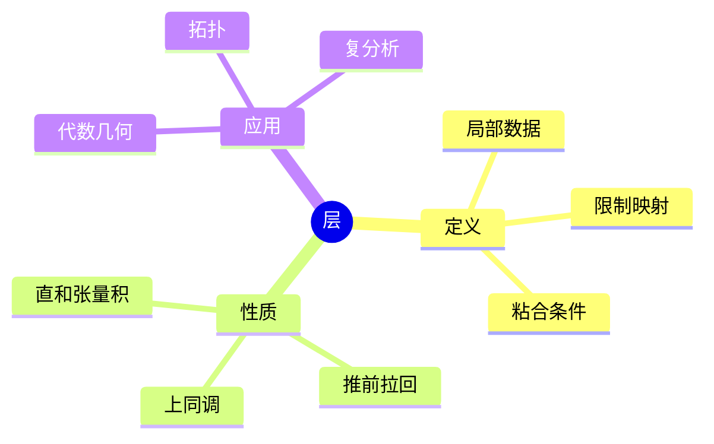
```mermaid
mindmap
  root((层))
    定义
      局部数据
      限制映射
      粘合条件
    性质
      上同调
      推前拉回
      直和张量积
    应用
      代数几何
      拓扑
      复分析
```

#### 5.2 矩阵对比：不同解释方式的对比

| 解释方式 | 特点 | 方法 | 工具 | 适用阶段 | 优势 | 局限 |
|---------|------|------|------|---------|------|------|
| **直观解释** | 具体、形象、可视 | 例子、类比、直观 | 局部数据、图形 | 入门阶段 | 易于理解 | 不够严格 |
| **知性解释** | 概念、分类、抽象 | 定义、分类、结构 | 概念图、知识图谱 | 中级阶段 | 系统完整 | 不够直观 |
| **理性解释** | 公理、证明、形式化 | 公理、证明、系统 | 形式化工具、证明系统 | 高级阶段 | 严格准确 | 不够具体 |
| **多视角解释** | 多角度、整合 | 多视角、整合 | 多视角工具 | 所有阶段 | 全面深入 | 可能复杂 |

#### 5.3 多视角表征：从不同角度表征层

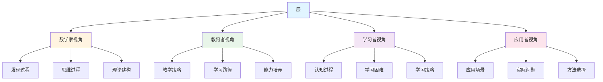
```mermaid
graph TD
    A[层] --> B[数学家视角]
    A --> C[教育者视角]
    A --> D[学习者视角]
    A --> E[应用者视角]

    B --> B1[发现过程]
    B --> B2[思维过程]
    B --> B3[理论建构]

    C --> C1[教学策略]
    C --> C2[学习路径]
    C --> C3[能力培养]

    D --> D1[认知过程]
    D --> D2[学习困难]
    D --> D3[学习策略]

    E --> E1[应用场景]
    E --> E2[实际问题]
    E --> E3[方法选择]

    style A fill:#e1f5ff
    style B fill:#fff4e1
    style C fill:#e8f5e9
    style D fill:#f3e5f5
    style E fill:#fce4ec
```

#### 5.4 决策树：层问题分类和策略选择

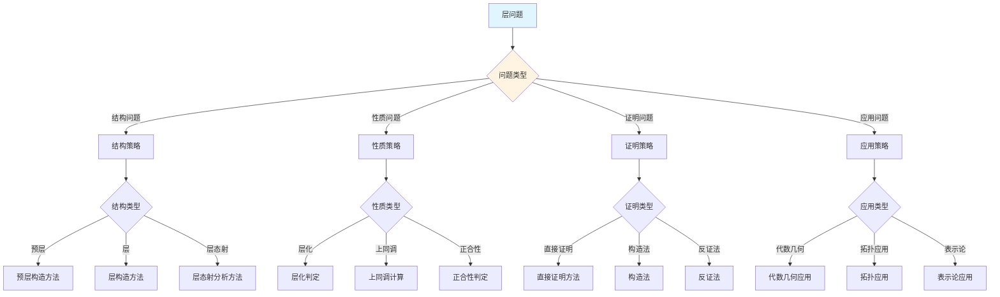
```mermaid
graph TD
    A[层问题] --> B{问题类型}
    B -->|结构问题| C[结构策略]
    B -->|性质问题| D[性质策略]
    B -->|证明问题| E[证明策略]
    B -->|应用问题| F[应用策略]

    C --> C1{结构类型}
    C1 -->|预层| C2[预层构造方法]
    C1 -->|层| C3[层构造方法]
    C1 -->|层态射| C4[层态射分析方法]

    D --> D1{性质类型}
    D1 -->|层化| D2[层化判定]
    D1 -->|上同调| D3[上同调计算]
    D1 -->|正合性| D4[正合性判定]

    E --> E1{证明类型}
    E1 -->|直接证明| E2[直接证明方法]
    E1 -->|构造法| E3[构造法]
    E1 -->|反证法| E4[反证法]

    F --> F1{应用类型}
    F1 -->|代数几何| F2[代数几何应用]
    F1 -->|拓扑应用| F3[拓扑应用]
    F1 -->|表示论| F4[表示论应用]

    style A fill:#e1f5ff
    style B fill:#fff4e1
```

**说明**：

- **问题分类**：根据问题类型（结构、性质、证明、应用）进行分类
- **策略选择**：根据问题类型选择相应的解决策略
- **方法应用**：根据具体问题选择合适的方法

#### 5.5 决策逻辑路径：层问题解决过程

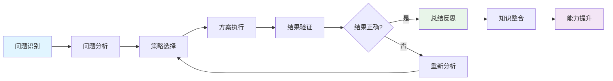
```mermaid
graph LR
    A[问题识别] --> B[问题分析]
    B --> C[策略选择]
    C --> D[方案执行]
    D --> E[结果验证]
    E --> F{结果正确?}
    F -->|是| G[总结反思]
    F -->|否| H[重新分析]
    H --> C

    G --> I[知识整合]
    I --> J[能力提升]

    style A fill:#e1f5ff
    style G fill:#e8f5e9
    style J fill:#f3e5f5
```

**说明**：

- **问题识别**：识别层问题的类型和关键要素
- **问题分析**：分析问题的条件和目标
- **策略选择**：根据问题类型选择解决策略
- **方案执行**：执行选定的解决方案
- **结果验证**：验证结果的正确性
- **总结反思**：总结解题过程，反思解题方法
- **知识整合**：整合相关知识点
- **能力提升**：提升问题解决能力

#### 5.6 多维对比矩阵：层概念特征对比

| 对比维度 | 层定义 | 层结构 | 层性质 | 层应用 |
|---------|---------|---------|---------|---------|
| **核心特征** | 预层、层公理 | 预层、层、层态射 | 层化、上同调、正合性 | 代数几何、拓扑、表示论 |
| **理解难度** | ⭐⭐⭐⭐⭐ | ⭐⭐⭐⭐⭐ | ⭐⭐⭐⭐⭐ | ⭐⭐⭐⭐ |
| **应用频率** | ⭐⭐⭐⭐ | ⭐⭐⭐⭐ | ⭐⭐⭐⭐ | ⭐⭐⭐⭐ |
| **理论基础** | 层定义 | 层结构理论 | 层性质理论 | 层应用理论 |
| **教学重点** | 概念理解 | 结构分析 | 性质分析 | 应用能力 |
| **学习阶段** | 高级阶段 | 高级阶段 | 高级阶段 | 高级阶段 |
| **认知维度** | 知性+理性 | 理性 | 理性 | 理性+应用 |
| **思维表征** | 思维导图 | 决策树 | 决策逻辑路径 | 知识图谱 |

**说明**：

- **核心特征**：每个方面的核心特征
- **理解难度**：从1星到5星，表示理解难度
- **应用频率**：从1星到5星，表示应用频率
- **理论基础**：每个方面的理论基础
- **教学重点**：每个方面的教学重点
- **学习阶段**：每个方面的学习阶段
- **认知维度**：每个方面的认知维度
- **思维表征**：每个方面推荐的思维表征方法

---

## 🔍 数学论证：如何论证层 (编号: C.CORE.022.06)

### 一、论证过程：从观察到反思

#### 1.1 观察（Observation）

**具体现象观察**：

- **现象1**：函数可以局部定义
  - 例如：在拓扑空间上，函数可以在开集上定义，满足相容性条件
  - **为什么重要**：这个现象揭示了层的本质
- **现象2**：层的粘合性质
  - 例如：局部定义的函数可以粘合成全局函数
  - **为什么重要**：这个现象揭示了层的整体结构

**模式识别**：

- **模式1**：层的定义
  - 例如：层是预层，满足粘合公理
  - **为什么重要**：这个模式可能反映了层的本质
- **模式2**：层与上同调的关系
  - 例如：层的上同调群反映层的整体性质
  - **为什么重要**：这个模式可能反映了层的拓扑性质

**问题提出**：

- **问题1**：如何严格定义层，统一不同的函数结构？
  - **为什么提出**：这个问题可能揭示层的本质和基础
- **问题2**：如何证明层的上同调理论？
  - **为什么提出**：这个问题可能揭示层的拓扑性质

#### 1.2 猜想（Conjecture）

**归纳猜想**：

- **猜想1**：层是研究函数结构的统一工具
  - **依据**：观察不同函数结构都满足层定义
  - **为什么提出**：这个猜想可能揭示层的统一性
- **猜想2**：层的上同调理论
  - **依据**：观察具体层的上同调群
  - **为什么提出**：这个猜想可能揭示层的拓扑性质

**类比猜想**：

- **猜想1**：层类似于"局部函数"
  - **类比对象**：局部函数
  - **为什么提出**：这个类比可能揭示层的本质
- **猜想2**：粘合公理类似于"相容性"
  - **类比对象**：相容性
  - **为什么提出**：这个类比可能揭示粘合公理的作用

**直觉猜想**：

- **猜想1**：层是"最自然"的函数结构
  - **直觉来源**：层的直观
  - **为什么提出**：这个直觉可能揭示层的基础地位
- **猜想2**：层有"最小"的公理结构
  - **直觉来源**：层的公理结构
  - **为什么提出**：这个直觉可能揭示层的本质

#### 1.3 证明（Proof）

**直接证明**：

- **证明1**：层的上同调理论
  - **证明思路**：使用层的定义和同调代数的性质
  - **关键步骤**：构造层的分解，计算上同调群
  - **为什么这样证明**：这个证明方法直接、清晰
- **证明2**：层的粘合性质
  - **证明思路**：使用层的定义和粘合公理
  - **关键步骤**：证明局部定义的函数可以粘合成全局函数
  - **为什么这样证明**：这个证明方法直接、清晰

**构造法**：

- **构造法**：构造层作为预层的层化
  - **构造方法**：对预层进行层化，得到层
  - **验证**：验证构造的层满足层公理
  - **为什么这样证明**：构造法适合证明存在性命题

#### 1.4 反思（Reflection）

**过程回顾**：

- **论证回顾**：从观察函数可以局部定义，到猜想层的性质，再到严格证明
  - **成功之处**：成功建立了层的严格理论
  - **不足之处**：层概念需要进一步推广
  - **改进方向**：推广到导出层、模层等

**方法总结**：

- **证明方法**：使用了直接证明、构造法
  - **方法特点**：直接证明清晰，构造法明确
  - **适用范围**：不同方法适用于不同类型的命题
- **证明技巧**：使用层的定义、粘合公理、同调代数
  - **技巧要点**：将层问题转化为拓扑和代数问题，使用构造法处理存在性问题
  - **应用场景**：这些技巧可以应用于其他层论问题

**理论意义**：

- **理论贡献**：建立了层的严格理论，揭示了层的拓扑结构
  - **为什么重要**：这个论证揭示了代数几何的基础结构
- **应用价值**：层为代数几何、拓扑学、数论提供了基础
  - **为什么重要**：这个论证可以应用于所有函数结构问题

### 二、论证类型：多种推理方式

#### 2.1 归纳论证（Inductive Reasoning）

**不完全归纳**：

- **例子1**：从具体层的性质归纳一般规律
  - **观察**：观察连续函数层、解析函数层都满足粘合公理
  - **结论**：所有层都满足粘合公理
  - **局限性**：不完全归纳的结论需要严格证明

#### 2.2 演绎论证（Deductive Reasoning）

**三段论**：

- **例子1**：证明层的性质
  - **大前提**：所有层都满足粘合公理
  - **小前提**：结构层是层
  - **结论**：结构层满足粘合公理
  - **为什么有效**：三段论是严格的演绎推理

#### 2.3 类比论证（Analogical Reasoning）

**结构类比**：

- **例子1**：层与预层的类比
  - **类比对象**：预层
  - **相似性**：层是满足粘合公理的预层
  - **结论**：层可以理解为"粘合预层"
  - **局限性**：类比不能替代严格证明

#### 2.4 构造论证（Constructive Reasoning）

**构造法**：

- **例子1**：构造层作为预层的层化
  - **构造方法**：对预层进行层化
  - **验证**：验证构造的层满足层公理
  - **为什么有效**：构造法是严格的直接证明

### 三、论证可视化：用图形表示论证过程

#### 3.1 论证流程图

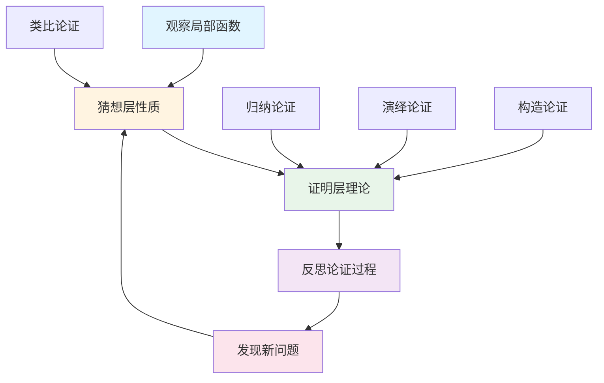
```mermaid
graph TD
    A[观察局部函数] --> B[猜想层性质]
    B --> C[证明层理论]
    C --> D[反思论证过程]
    D --> E[发现新问题]
    E --> B

    F[归纳论证] --> C
    G[演绎论证] --> C
    H[类比论证] --> B
    I[构造论证] --> C

    style A fill:#e1f5ff
    style B fill:#fff4e1
    style C fill:#e8f5e9
    style D fill:#f3e5f5
    style E fill:#fce4ec
```

#### 3.2 论证类型对比

| 论证类型 | 特点 | 适用场景 | 优势 | 局限 |
|---------|------|---------|------|------|
| **归纳论证** | 从特殊到一般 | 发现规律、提出猜想 | 启发性强 | 结论或然 |
| **演绎论证** | 从一般到特殊 | 严格证明、逻辑推理 | 结论必然 | 需要前提 |
| **类比论证** | 基于相似性 | 启发思路、发现联系 | 创造性高 | 结论或然 |
| **构造论证** | 直接构造 | 证明存在性命题 | 直接明确 | 需要构造 |

#### 3.3 论证思维导图

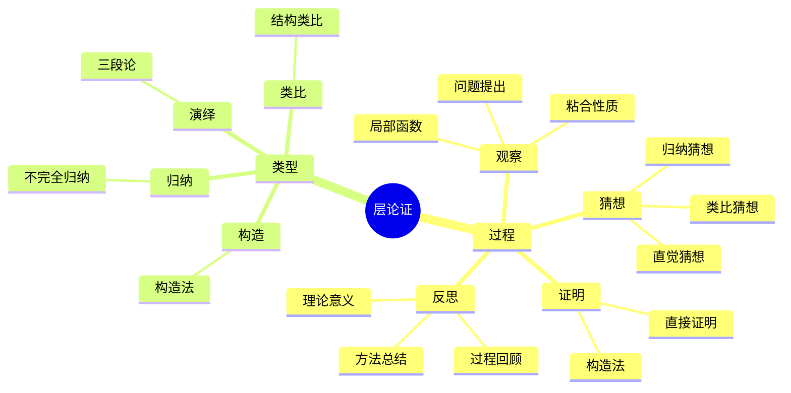
```mermaid
mindmap
  root((层论证))
    过程
      观察
        局部函数
        粘合性质
        问题提出
      猜想
        归纳猜想
        类比猜想
        直觉猜想
      证明
        直接证明
        构造法
      反思
        过程回顾
        方法总结
        理论意义
    类型
      归纳
        不完全归纳
      演绎
        三段论
      类比
        结构类比
      构造
        构造法
```

---

## 🔗 三视角整合 (编号: C.CORE.022.07)

### 三个视角的关联

**认知学视角 ↔ 教育学视角**:

- 认知学视角揭示的理解机制，指导教育学视角的教学设计
- 教育学视角的教学实践，验证认知学视角的理论

**认知学视角 ↔ 数学家视角**:

- 数学家视角的思维过程，启发认知学视角的认知路径
- 认知学视角的认知障碍，解释数学家视角的历史困难

**教育学视角 ↔ 数学家视角**:

- 数学家视角的历史发展，为教育学视角提供教学素材
- 教育学视角的教学策略，帮助学习者理解数学家视角的思维过程

### 如何综合运用三个视角

**学习建议**:

1. **从认知学视角开始**: 先建立直观理解
2. **用教育学视角深化**: 通过教学路径系统学习
3. **用数学家视角升华**: 理解概念的深层意义和历史背景

**教学建议**:

1. **引入阶段**: 用数学家视角的问题起源激发兴趣
2. **探索阶段**: 用认知学视角的认知过程引导发现
3. **形式化阶段**: 用教育学视角的教学策略系统教学
4. **巩固阶段**: 综合三个视角深化理解

---

## 📚 参考文献 (编号: C.CORE.022.08)

### 权威资源

- Wikipedia: [Sheaf (Mathematics)](https://en.wikipedia.org/wiki/Sheaf_(mathematics))
- Metamath: [Sheaf](http://us.metamath.org/mpeuni/df-sheaf.html)[需更新][需更新]

### 经典教材

- Hartshorne, R. (1977). *Algebraic Geometry*. Springer.
- Bredon, G. E. (1997). *Sheaf Theory*. Springer.

### 研究论文

- Leray, J. (1946). "L'anneau d'homologie d'une représentation". *Comptes Rendus de l'Académie des Sciences*.
- Grothendieck, A. (1957). "Sur quelques points d'algèbre homologique". *Tohoku Mathematical Journal*.

---

**创建日期**: 2025年1月
**最后更新**: 2026-04-05
**维护状态**: 持续更新中

---

## 📚 附录: 扩展分析


### 1. 多理论分析

---
msc_primary: "00A99"
---

# 层概念的多理论分析示例 / Multi-Theory Analysis Example: Sheaf Concept


---


## 🎯 一、Tall三个世界理论分析 / Tall's Three Worlds Theory Analysis (编号: C.CORE.022.MULTI.01)

### 1.1 感知-操作世界（Embodied World）

**层在感知-操作世界中的理解 / Understanding Sheaves in the Embodied World**：

- **具体经验 / Concrete Experience**：
  - 通过观察"局部数据粘合"理解层：在拓扑空间的每个开集上定义数据，然后粘合 / Understanding sheaves through observing "gluing of local data": defining data on each open set of a topological space, then gluing
  - 例如：连续函数层、光滑函数层 / Examples: sheaves of continuous functions, sheaves of smooth functions
  - 通过"限制映射"理解层的局部结构：从大集合到小集合的限制 / Understanding local structure of sheaves through "restriction maps": restrictions from larger sets to smaller sets

- **身体动作 / Bodily Actions**：
  - 通过"粘合"的动作理解层 / Understanding sheaves through the action of "gluing"
  - 通过"限制"理解层的局部结构 / Understanding local structure of sheaves through "restriction"
  - 通过操作图形理解层的茎、截面 / Understanding stalks and sections of sheaves through manipulating figures

- **直观理解 / Intuitive Understanding**：
  - 层是"局部数据的粘合" / A sheaf is "gluing of local data"
  - 层描述"局部到整体"的结构 / Sheaves describe the structure of "local to global"
  - 层是代数几何的基础 / Sheaves are the foundation of algebraic geometry

**教学建议 / Teaching Suggestions**：

- 使用具体例子（连续函数层、常数层） / Use concrete examples (sheaves of continuous functions, constant sheaves)
- 通过粘合活动理解层 / Understand sheaves through gluing activities
- 使用图形可视化层结构 / Use graphics to visualize sheaf structure

### 1.2 概念-符号世界（Symbolic World）

**层在概念-符号世界的理解 / Understanding Sheaves in the Symbolic World**：

- **符号表示 / Symbolic Representation**：
  - 使用层符号：$\mathcal{F}$、$\mathcal{G}$ 表示层 / Using sheaf notation: $\mathcal{F}$, $\mathcal{G}$ to denote sheaves
  - 使用截面符号：$\Gamma(U, \mathcal{F})$、$\mathcal{F}(U)$ / Using section notation: $\Gamma(U, \mathcal{F})$, $\mathcal{F}(U)$
  - 使用茎符号：$\mathcal{F}_x$、$\mathcal{F}_p$ / Using stalk notation: $\mathcal{F}_x$, $\mathcal{F}_p$

- **概念理解 / Conceptual Understanding**：
  - 层是拓扑空间上的预层满足粘合条件 / A sheaf is a presheaf on a topological space satisfying gluing conditions
  - 层通过限制映射连接局部和整体 / Sheaves connect local and global through restriction maps
  - 层是代数几何的研究对象 / Sheaves are objects of study in algebraic geometry

- **抽象操作 / Abstract Operations**：
  - 通过限制映射研究层 / Studying sheaves through restriction maps
  - 通过层上同调研究层的全局性质 / Studying global properties of sheaves through sheaf cohomology
  - 通过层态射研究层的关系 / Studying relationships between sheaves through sheaf morphisms

**教学建议 / Teaching Suggestions**：

- 逐步引入层符号 / Gradually introduce sheaf notation
- 通过限制映射练习理解层 / Understand sheaves through restriction map exercises
- 使用层性质研究代数几何结构 / Use sheaf properties to study algebraic geometric structures

### 1.3 形式-公理世界（Formal World）

**层在形式-公理世界的理解 / Understanding Sheaves in the Formal World**：

- **公理系统 / Axiomatic System**：
  - 层的严格定义：层$\mathcal{F}$是满足粘合条件的预层 / Strict definition of sheaf: sheaf $\mathcal{F}$ is a presheaf satisfying gluing conditions
  - 通过粘合条件严格定义层 / Strictly defining sheaves through gluing conditions
  - 通过公理推导演分性质 / Deriving differential properties through axioms

- **形式化定义 / Formal Definition**：
  - 层的形式化定义 / Formal definition of sheaf
  - 层上同调的形式化定义 / Formal definition of sheaf cohomology
  - 层性质的形式化证明 / Formal proof of sheaf properties

- **逻辑推理 / Logical Reasoning**：
  - 通过逻辑推理证明层性质 / Proving sheaf properties through logical reasoning
  - 通过形式化方法研究代数几何 / Studying algebraic geometry through formal methods
  - 通过范畴论研究层的一般性质 / Studying general properties of sheaves through category theory

**教学建议 / Teaching Suggestions**：

- 介绍层定义 / Introduce sheaf definition
- 通过形式化证明理解层性质 / Understand sheaf properties through formal proofs
- 研究层在代数几何中的作用 / Study the role of sheaves in algebraic geometry

### 1.4 三个世界的转换 / Transitions Between Worlds

**转换路径 / Transition Paths**：

1. **从感知-操作到概念-符号 / From Embodied to Symbolic**：
   - 将具体局部数据抽象为层符号 / Abstracting concrete local data into sheaf symbols
   - 从操作中提取层概念 / Extracting sheaf concepts from operations
   - 例如：从"局部函数"到"层$\mathcal{F}$" / Example: from "local functions" to "sheaf $\mathcal{F}$"

2. **从概念-符号到形式-公理 / From Symbolic to Formal**：
   - 将层概念形式化为粘合条件定义 / Formalizing sheaf concepts into gluing condition definition
   - 从符号运算到逻辑推理 / From symbolic operations to logical reasoning
   - 例如：从"$\mathcal{F}$"到"粘合条件公理" / Example: from "$\mathcal{F}$" to "gluing condition axioms"

**转换支持 / Transition Support**：

- **识别转换困难 / Identifying Transition Difficulties**：
  - 识别从具体局部数据到抽象层的困难 / Identifying difficulties in transitioning from concrete local data to abstract sheaves
  - 识别从符号运算到形式化定义的困难 / Identifying difficulties in transitioning from symbolic operations to formal definitions

- **设计转换活动 / Designing Transition Activities**：
  - 设计过渡活动支持转换 / Designing transition activities to support transitions
  - 提供渐进式支持 / Providing progressive support

- **评估转换效果 / Assessing Transition Effectiveness**：
  - 评估转换成功 / Assessing transition success
  - 提供反馈支持 / Providing feedback support

---

## 🔬 二、Dubinsky APOS理论分析 (编号: C.CORE.022.MULTI.02)

### 2.1 Action（动作）

**层的Action阶段 / Action Stage of Sheaf**：

- **具体操作 / Concrete Operations**：
  - 判断层：给定预层，判断是否为层 / Determining sheaf: given a presheaf, determine if it is a sheaf
  - 使用限制映射：给定层，构造限制映射 / Using restriction maps: given a sheaf, construct restriction maps
  - 构造层：给定拓扑空间和函数，构造层 / Constructing sheaves: given a topological space and functions, construct a sheaf

- **操作特点 / Operation Characteristics**：
  - 需要外部指导（教师、教材） / Requires external guidance (teacher, textbook)
  - 操作是具体的、机械的 / Operations are concrete and mechanical
  - 需要逐步执行 / Requires step-by-step execution

- **学习活动 / Learning Activities**：
  - 练习判断层 / Practice determining sheaves
  - 练习使用限制映射 / Practice using restriction maps
  - 练习构造层 / Practice constructing sheaves

**教学建议 / Teaching Suggestions**：

- 提供大量练习机会 / Provide ample practice opportunities
- 给予及时反馈 / Give timely feedback
- 逐步增加操作复杂度 / Gradually increase operation complexity

### 2.2 Process（过程）

**层的Process阶段 / Process Stage of Sheaf**：

- **内化过程 / Internalization Process**：
  - 将层判断内化为心理过程 / Internalizing sheaf determination as a mental process
  - 理解层构造的内在逻辑 / Understanding the internal logic of sheaf construction
  - 能够独立完成层操作 / Being able to perform sheaf operations independently

- **过程理解 / Process Understanding**：
  - 理解"层"是"局部数据粘合的过程" / Understanding that "sheaf" is "the process of gluing local data"
  - 理解"限制映射"是"局部化的过程" / Understanding that "restriction maps" are "the process of localization"
  - 理解"层上同调"是"测量全局性质的过程" / Understanding that "sheaf cohomology" is "the process of measuring global properties"

- **灵活应用 / Flexible Application**：
  - 能够灵活应用层概念 / Being able to flexibly apply sheaf concepts
  - 能够处理复杂的层问题 / Being able to handle complex sheaf problems
  - 能够理解层的各种性质 / Being able to understand various properties of sheaves

**教学建议 / Teaching Suggestions**：

- 引导学生内化操作过程 / Guide students to internalize operation processes
- 通过变式练习加深理解 / Deepen understanding through variant exercises
- 鼓励学生探索层应用 / Encourage students to explore sheaf applications

### 2.3 Object（对象）

**层的Object阶段 / Object Stage of Sheaf**：

- **对象化理解 / Objectification Understanding**：
  - 将层视为独立的对象 / Viewing sheaves as independent objects
  - 理解层作为数学对象的结构 / Understanding the structure of sheaves as mathematical objects
  - 能够对层进行运算和操作 / Being able to perform operations on sheaves

- **对象操作 / Object Operations**：
  - 能够比较不同的层 / Being able to compare different sheaves
  - 能够构造层的直和、张量积 / Being able to construct direct sums and tensor products of sheaves
  - 能够研究层的性质 / Being able to study properties of sheaves

- **概念整合 / Conceptual Integration**：
  - 理解层与拓扑空间、概形、代数几何的关系 / Understanding the relationship between sheaves, topological spaces, schemes, and algebraic geometry
  - 理解层在代数几何中的作用 / Understanding the role of sheaves in algebraic geometry
  - 理解层在数学中的作用 / Understanding the role of sheaves in mathematics

**教学建议 / Teaching Suggestions**：

- 引导学生将层对象化 / Guide students to objectify sheaves
- 通过对象操作加深理解 / Deepen understanding through object operations
- 整合层与其他概念 / Integrate sheaves with other concepts

### 2.4 Schema（图式）

**层的Schema阶段 / Schema Stage of Sheaf**：

- **图式构建 / Schema Construction**：
  - 构建完整的层图式 / Constructing a complete sheaf schema
  - 整合层的各种理解 / Integrating various understandings of sheaves
  - 建立层与其他概念的联系 / Establishing connections between sheaves and other concepts

- **图式应用 / Schema Application**：
  - 能够灵活应用层图式 / Being able to flexibly apply sheaf schemas
  - 能够解决复杂的层问题 / Being able to solve complex sheaf problems
  - 能够研究代数几何理论 / Being able to study algebraic geometry theory

- **图式发展 / Schema Development**：
  - 不断发展层图式 / Continuously developing sheaf schemas
  - 探索层的新应用 / Exploring new applications of sheaves
  - 研究代数几何理论的发展 / Studying the development of algebraic geometry theory

**教学建议 / Teaching Suggestions**：

- 帮助学生构建层图式 / Help students construct sheaf schemas
- 通过应用发展图式 / Develop schemas through application
- 鼓励学生探索代数几何理论 / Encourage students to explore algebraic geometry theory

### 2.5 APOS发展路径 / APOS Development Path

**发展过程 / Development Process**：

1. **Action → Process / 动作到过程**：
   - 将外部层操作内化为心理过程 / Internalizing external sheaf operations as mental processes
   - 从需要指导到独立完成 / From needing guidance to independent completion
   - 例如：从"构造层"到"理解层过程" / Example: from "constructing sheaves" to "understanding the sheaf process"

2. **Process → Object / 过程到对象**：
   - 将层过程对象化 / Objectifying sheaf processes
   - 从过程理解到对象理解 / From process understanding to object understanding
   - 例如：从"理解层过程"到"将层视为对象" / Example: from "understanding the sheaf process" to "treating sheaves as objects"

3. **Object → Schema / 对象到图式**：
   - 整合层的所有方面形成完整图式 / Integrating all aspects of sheaves to form a complete schema
   - 从对象理解到系统理解 / From object understanding to systematic understanding
   - 例如：从"理解层对象"到"形成代数几何图式" / Example: from "understanding sheaf objects" to "forming an algebraic geometry schema"

**发展支持 / Development Support**：

- **识别发展困难 / Identifying Development Difficulties**：
  - 识别内化困难 / Identifying internalization difficulties
  - 识别对象化困难 / Identifying objectification difficulties
  - 识别图式化困难 / Identifying schematization difficulties

- **设计发展活动 / Designing Development Activities**：
  - 设计支持内化的活动 / Designing activities to support internalization
  - 设计支持对象化的活动 / Designing activities to support objectification
  - 设计支持图式化的活动 / Designing activities to support schematization

- **评估发展效果 / Assessing Development Effectiveness**：
  - 评估各阶段发展 / Assessing development at each stage
  - 提供反馈支持 / Providing feedback support

---

## 💬 三、Sfard交流理论分析 / Sfard's Commognitive Theory Analysis (编号: C.CORE.022.MULTI.03)

### 3.1 层作为交流工具 / Sheaf as a Communication Tool

**层的交流功能 / Communicative Function of Sheaves**：

- **数学交流 / Mathematical Communication**：
  - 层用于表达"局部到整体"：$\mathcal{F}$ / Sheaves are used to express "local to global": $\mathcal{F}$
  - 层用于描述"局部数据" / Sheaves are used to describe "local data"
  - 层用于表达数学关系：层态射、层上同调 / Sheaves are used to express mathematical relationships: sheaf morphisms, sheaf cohomology

- **概念表达 / Conceptual Expression**：
  - 通过层表达"局部数据粘合"的概念 / Expressing the concept of "gluing local data" through sheaves
  - 通过层符号表达"局部结构"的概念 / Expressing the concept of "local structure" through sheaf notation
  - 通过层表达"全局性质"的概念 / Expressing the concept of "global properties" through sheaves

- **问题解决 / Problem Solving**：
  - 使用层语言表达问题 / Using sheaf language to express problems
  - 使用层方法解决问题 / Using sheaf methods to solve problems
  - 使用代数几何方法证明定理 / Using algebraic geometry methods to prove theorems

### 3.2 层学习的实践参与 / Practice Participation in Sheaf Learning

**通过参与数学实践学习层 / Learning Sheaves through Participation in Mathematical Practice**：

- **实践场景 / Practice Scenarios**：
  - 通过代数问题学习层 / Learning sheaves through algebra problems
  - 通过几何问题学习层 / Learning sheaves through geometry problems
  - 通过拓扑应用学习层 / Learning sheaves through topology applications
  - 通过代数几何研究学习层理论 / Learning sheaf theory through algebraic geometry research

- **实践方式 / Practice Methods**：
  - 参与数学讨论，使用层语言 / Participating in mathematical discussions, using sheaf language
  - 解决数学问题，应用层方法 / Solving mathematical problems, applying sheaf methods
  - 研究数学理论，理解层作用 / Studying mathematical theory, understanding the role of sheaves

- **学习效果 / Learning Outcomes**：
  - 通过实践理解层概念 / Understanding sheaf concepts through practice
  - 通过应用掌握层方法 / Mastering sheaf methods through application
  - 通过参与形成数学思维 / Forming mathematical thinking through participation

**教学建议 / Teaching Suggestions**：

- 设计数学实践活动 / Design mathematical practice activities
- 鼓励学生参与数学讨论 / Encourage students to participate in mathematical discussions
- 提供实际问题解决机会 / Provide opportunities for solving real-world problems

---

## 🧠 四、Piaget认知发展理论分析 / Piaget's Cognitive Development Theory Analysis (编号: C.CORE.022.MULTI.04)

### 4.1 具体运算阶段（7-12岁）/ Concrete Operational Stage (7-12 years)

**层在具体运算阶段的理解 / Understanding Sheaves in the Concrete Operational Stage**：

- **具体对象 / Concrete Objects**：
  - 通过具体层理解层 / Understanding sheaves through concrete sheaves
  - 例如：连续函数层、常数层 / Examples: sheaves of continuous functions, constant sheaves
  - 需要具体例子支持理解 / Requires concrete examples to support understanding

- **逻辑思维 / Logical Thinking**：
  - 能够理解层的基本概念 / Being able to understand basic sheaf concepts
  - 能够进行简单的层操作 / Being able to perform simple sheaf operations
  - 但需要具体对象支持 / But requires concrete object support

- **教学建议 / Teaching Suggestions**：
  - 使用具体层 / Use concrete sheaves
  - 通过图形验证层性质 / Verify sheaf properties through graphics
  - 逐步引入抽象概念 / Gradually introduce abstract concepts

### 4.2 形式运算阶段（12+岁）/ Formal Operational Stage (12+ years)

**层在形式运算阶段的理解 / Understanding Sheaves in the Formal Operational Stage**：

- **抽象思维 / Abstract Thinking**：
  - 能够理解抽象的层概念 / Being able to understand abstract sheaf concepts
  - 能够进行符号操作 / Being able to perform symbolic operations
  - 能够进行逻辑推理 / Being able to perform logical reasoning

- **形式推理 / Formal Reasoning**：
  - 能够证明层性质 / Being able to prove sheaf properties
  - 能够理解层定义 / Being able to understand sheaf definition
  - 能够研究代数几何 / Being able to study algebraic geometry

- **教学建议 / Teaching Suggestions**：
  - 引入抽象概念和符号 / Introduce abstract concepts and symbols
  - 进行逻辑推理训练 / Conduct logical reasoning training
  - 研究代数几何理论 / Study algebraic geometry theory

---

## 🌍 五、Vygotsky社会文化理论分析 / Vygotsky's Sociocultural Theory Analysis (编号: C.CORE.022.MULTI.05)

### 5.1 最近发展区（ZPD）/ Zone of Proximal Development (ZPD)

**层学习的最近发展区 / Zone of Proximal Development in Sheaf Learning**：

- **独立能力 / Independent Ability**：
  - 能够理解层的基本概念 / Being able to understand basic sheaf concepts
  - 能够进行简单的层操作 / Being able to perform simple sheaf operations
  - 能够理解限制映射 / Being able to understand restriction maps

- **潜在能力 / Potential Ability**：
  - 能够理解层定义 / Being able to understand sheaf definition
  - 能够证明层性质 / Being able to prove sheaf properties
  - 能够研究代数几何理论 / Being able to study algebraic geometry theory

- **教学建议 / Teaching Suggestions**：
  - 识别学生的最近发展区 / Identify students' zone of proximal development
  - 提供适当的支持和指导 / Provide appropriate support and guidance
  - 逐步提高学习要求 / Gradually increase learning requirements

### 5.2 社会文化工具 / Sociocultural Tools

**层作为社会文化工具 / Sheaves as Sociocultural Tools**：

- **数学工具 / Mathematical Tools**：
  - 层是数学研究的重要工具 / Sheaves are important tools for mathematical research
  - 层用于解决实际问题（规范理论、数据粘合） / Sheaves are used to solve real-world problems (gauge theory, data gluing)
  - 层用于研究数学理论 / Sheaves are used to study mathematical theory

- **文化意义 / Cultural Significance**：
  - 层是数学文化的重要组成部分 / Sheaves are an important part of mathematical culture
  - 层反映了数学思维的发展 / Sheaves reflect the development of mathematical thinking
  - 层体现了数学的美感 / Sheaves embody the beauty of mathematics

- **教学建议 / Teaching Suggestions**：
  - 介绍层的历史和文化意义 / Introduce the history and cultural significance of sheaves
  - 展示层在数学中的作用 / Demonstrate the role of sheaves in mathematics
  - 培养学生对数学文化的理解 / Cultivate students' understanding of mathematical culture

---

## 🔄 六、多理论整合分析 / Multi-Theory Integration Analysis (编号: C.CORE.022.MULTI.06)

### 6.1 理论共同点 / Theoretical Commonalities

**各理论在层概念分析中的共同点 / Commonalities of Theories in Sheaf Concept Analysis**：

1. **多层次理解 / Multi-Level Understanding**：
   - 都强调从具体到抽象的发展 / All emphasize development from concrete to abstract
   - Tall的三个世界、APOS的四个阶段、Piaget的发展阶段都体现这一点 / Tall's three worlds, APOS's four stages, and Piaget's developmental stages all reflect this

2. **实践重要性 / Importance of Practice**：
   - 都强调实践在学习中的作用 / All emphasize the role of practice in learning
   - Sfard的交流理论、Vygotsky的社会文化理论都强调这一点 / Sfard's communication theory and Vygotsky's sociocultural theory both emphasize this

3. **认知发展 / Cognitive Development**：
   - 都关注认知发展的过程 / All focus on the process of cognitive development
   - 各理论都描述了从简单到复杂的发展 / Each theory describes development from simple to complex

### 6.2 理论互补性 / Theoretical Complementarity

**各理论在层概念分析中的互补性 / Complementarity of Theories in Sheaf Concept Analysis**：

1. **Tall三个世界 / Tall's Three Worlds**：
   - 适用于理解层概念的不同层次 / Applicable to understanding different levels of sheaf concepts
   - 从感知操作到形式公理的发展 / Development from embodied operations to formal axioms

2. **APOS理论 / APOS Theory**：
   - 适用于分析层概念的学习过程 / Applicable to analyzing the learning process of sheaf concepts
   - 从动作到图式的发展 / Development from action to schema

3. **Sfard交流理论 / Sfard's Communication Theory**：
   - 适用于设计层概念的实践活动 / Applicable to designing practice activities for sheaf concepts
   - 通过数学实践学习层 / Learning sheaves through mathematical practice

4. **Piaget理论 / Piaget's Theory**：
   - 适用于理解层概念的认知发展阶段 / Applicable to understanding cognitive development stages of sheaf concepts
   - 从具体运算到形式运算的发展 / Development from concrete operations to formal operations

5. **Vygotsky理论 / Vygotsky's Theory**：
   - 适用于设计层概念的学习支持 / Applicable to designing learning support for sheaf concepts
   - 通过最近发展区促进学习 / Promoting learning through the zone of proximal development

### 6.3 整合应用框架

**多理论整合应用**：

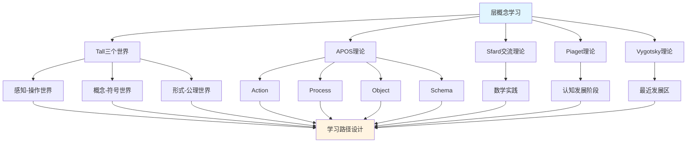
```mermaid
graph TB
    A[层概念学习] --> B[Tall三个世界]
    A --> C[APOS理论]
    A --> D[Sfard交流理论]
    A --> E[Piaget理论]
    A --> F[Vygotsky理论]

    B --> G[感知-操作世界]
    B --> H[概念-符号世界]
    B --> I[形式-公理世界]

    C --> J[Action]
    C --> K[Process]
    C --> L[Object]
    C --> M[Schema]

    D --> N[数学实践]
    E --> O[认知发展阶段]
    F --> P[最近发展区]

    G --> Q[学习路径设计]
    H --> Q
    I --> Q
    J --> Q
    K --> Q
    L --> Q
    M --> Q
    N --> Q
    O --> Q
    P --> Q

    style A fill:#e1f5ff
    style Q fill:#fff4e1
```

---

## 📊 七、层概念的多理论学习路径 / Multi-Theory Learning Path for Sheaf Concept (编号: C.CORE.022.MULTI.07)

### 7.1 入门阶段（Tall感知-操作世界 + APOS Action）/ Entry Stage (Tall Embodied World + APOS Action)

**学习目标 / Learning Objectives**：

- 通过具体层理解层概念 / Understanding sheaf concepts through concrete sheaves
- 掌握基本层操作 / Mastering basic sheaf operations

**学习活动 / Learning Activities**：

- 使用具体层（连续函数层、常数层）进行观察 / Using concrete sheaves (sheaves of continuous functions, constant sheaves) for observation
- 练习判断层 / Practicing determining sheaves
- 练习使用限制映射 / Practicing using restriction maps
- 练习基本层操作 / Practicing basic sheaf operations

**评估标准 / Assessment Criteria**：

- 能够独立完成基本层操作 / Being able to independently complete basic sheaf operations
- 能够理解层的基本概念 / Being able to understand basic sheaf concepts

### 7.2 中级阶段（Tall概念-符号世界 + APOS Process/Object）/ Intermediate Stage (Tall Symbolic World + APOS Process/Object)

**学习目标 / Learning Objectives**：

- 理解层的符号表示 / Understanding symbolic representation of sheaves
- 掌握层运算的内在逻辑 / Mastering the internal logic of sheaf operations
- 将层视为对象 / Viewing sheaves as objects

**学习活动 / Learning Activities**：

- 学习层符号和限制映射符号 / Learning sheaf notation and restriction map notation
- 通过符号操作进行层运算 / Performing sheaf operations through symbolic operations
- 理解层的性质 / Understanding properties of sheaves
- 研究层的直和、张量积 / Studying direct sums and tensor products of sheaves

**评估标准 / Assessment Criteria**：

- 能够灵活应用层符号 / Being able to flexibly apply sheaf notation
- 能够理解层运算的内在逻辑 / Being able to understand the internal logic of sheaf operations
- 能够将层视为对象进行操作 / Being able to operate on sheaves as objects

### 7.3 高级阶段（Tall形式-公理世界 + APOS Schema + Sfard实践）/ Advanced Stage (Tall Formal World + APOS Schema + Sfard Practice)

**学习目标 / Learning Objectives**：

- 理解层定义 / Understanding sheaf definition
- 形成完整的层概念图式 / Forming a complete sheaf concept schema
- 通过数学实践应用层 / Applying sheaves through mathematical practice

**学习活动 / Learning Activities**：

- 学习层定义 / Learning sheaf definition
- 通过形式化证明理解层性质 / Understanding sheaf properties through formal proofs
- 研究层在代数几何中的作用 / Studying the role of sheaves in algebraic geometry
- 参与数学实践，应用层方法 / Participating in mathematical practice, applying sheaf methods

**评估标准 / Assessment Criteria**：

- 能够理解层定义 / Being able to understand sheaf definition
- 能够形成完整的层概念图式 / Being able to form a complete sheaf concept schema
- 能够通过数学实践应用层 / Being able to apply sheaves through mathematical practice

---

## 🧠 七、元认知理论分析 / Metacognitive Theory Analysis (编号: C.CORE.022.MULTI.07.5)

### 7.1 元认知知识（Metacognitive Knowledge）

**关于层概念的知识 / Knowledge About the Sheaf Concept**：

- **概念知识 / Conceptual Knowledge**：
  - 层的定义：在拓扑空间上定义的预层，满足粘合公理 / Sheaves are presheaves on topological spaces satisfying gluing axioms
  - 层的性质：局部性、粘合性、限制映射 / Properties: locality, gluing, restriction maps
  - 层的表示方法：层态射、层上同调、层序列 / Representation methods: sheaf morphisms, sheaf cohomology, sheaf sequences
  - 层与其他概念的关系：层是代数几何的核心，是研究几何结构的工具 / Relationship: sheaves are core concepts of algebraic geometry and tools for studying geometric structures

- **策略知识 / Strategy Knowledge**：
  - 学习策略：从预层到层，通过具体例子掌握层构造 / Learning strategies: from presheaves to sheaves, master sheaf construction through concrete examples
  - 理解策略：从局部到整体，从简单到复杂 / Understanding strategies: from local to global, from simple to complex
  - 应用策略：将层方法应用到实际问题中 / Application strategies: apply sheaf methods to real-world problems

- **任务知识 / Task Knowledge**：
  - 典型任务：层构造、层态射、层上同调计算 / Typical tasks: sheaf construction, sheaf morphisms, sheaf cohomology computation
  - 任务难度：基础任务（层构造）→ 中级任务（层态射）→ 高级任务（层上同调计算） / Task difficulty: basic (sheaf construction) → intermediate (sheaf morphisms) → advanced (sheaf cohomology computation)
  - 任务要求：理解层概念，掌握层构造，能够进行层推理 / Task requirements: understand sheaf concepts, master sheaf construction, be able to reason about sheaves

### 7.2 元认知监控（Metacognitive Monitoring）

**理解监控 / Comprehension Monitoring**：

- **自我提问 / Self-Questioning**：
  - "我理解层的基本概念了吗？" / "Do I understand the basic concept of sheaves?"
  - "我能区分层和预层吗？" / "Can I distinguish between sheaves and presheaves?"
  - "我理解粘合公理吗？" / "Do I understand the gluing axioms?"

- **理解检查 / Comprehension Checking**：
  - 能否用自己的话解释层概念？ / Can I explain the concept of sheaves in my own words?
  - 能否识别层构造的错误？ / Can I identify errors in sheaf construction?
  - 能否判断预层的层性？ / Can I determine whether a presheaf is a sheaf?

- **困难识别 / Difficulty Identification**：
  - 识别理解困难：抽象性、粘合公理、限制映射、层上同调 / Identify comprehension difficulties: abstraction, gluing axioms, restriction maps, sheaf cohomology
  - 识别运算困难：层构造、层态射、层上同调计算 / Identify operation difficulties: sheaf construction, sheaf morphisms, sheaf cohomology computation

**过程监控 / Process Monitoring**：

- **学习过程监控 / Learning Process Monitoring**：
  - 监控学习进度：是否按计划学习？ / Monitor learning progress: Am I learning according to plan?
  - 监控学习效果：是否掌握了层概念？ / Monitor learning effectiveness: Have I mastered the concept of sheaves?
  - 监控学习困难：遇到了哪些困难？ / Monitor learning difficulties: What difficulties have I encountered?

- **策略使用监控 / Strategy Use Monitoring**：
  - 使用的策略是否有效？ / Is the strategy I'm using effective?
  - 是否需要调整策略？ / Do I need to adjust my strategy?
  - 策略使用是否正确？ / Am I using the strategy correctly?

### 7.3 元认知调节（Metacognitive Regulation）

**计划调节 / Planning Regulation**：

- **学习计划制定 / Learning Plan Development**：
  - 制定学习计划：先学层基本概念，再学层构造，最后学层应用 / Develop learning plan: first learn basic sheaf concepts, then learn sheaf construction, finally learn sheaf applications
  - 调整学习计划：根据学习情况调整计划 / Adjust learning plan: adjust plan based on learning situation
  - 优化学习路径：选择最适合自己的学习路径 / Optimize learning path: choose the learning path that best suits oneself

**策略调节 / Strategy Regulation**：

- **策略选择 / Strategy Selection**：
  - 根据任务类型选择策略：简单任务用直接方法，复杂任务用分步方法 / Select strategies based on task type: use direct methods for simple tasks, step-by-step methods for complex tasks
  - 根据学习阶段选择策略：入门阶段用具体例子，高级阶段用抽象方法 / Select strategies based on learning stage: use concrete examples in entry stage, abstract methods in advanced stage

- **策略调整 / Strategy Adjustment**：
  - 如果遇到困难，尝试不同的策略 / If encountering difficulties, try different strategies
  - 如果策略无效，调整策略 / If strategy is ineffective, adjust strategy
  - 如果策略有效，继续使用并优化 / If strategy is effective, continue using and optimize

**反思调节 / Reflection Regulation**：

- **学习反思 / Learning Reflection**：
  - 反思学习过程：从层学习中获得了什么？ / Reflect on learning process: What have I gained from learning sheaves?
  - 反思学习困难：遇到了哪些困难？如何克服？ / Reflect on learning difficulties: What difficulties did I encounter? How did I overcome them?
  - 反思学习策略：使用的策略是否有效？如何改进？ / Reflect on learning strategies: Were the strategies I used effective? How can I improve?

- **错误反思 / Error Reflection**：
  - 从错误中学习：分析错误原因，避免类似错误 / Learn from errors: analyze error causes, avoid similar errors
  - 改进学习方法：根据错误调整学习方法 / Improve learning methods: adjust learning methods based on errors

**教学建议 / Teaching Suggestions**：

- 教授元认知知识：帮助学生建立关于层的元认知知识 / Teach metacognitive knowledge: help students build metacognitive knowledge about sheaves
- 培养监控能力：引导学生自我监控理解过程 / Develop monitoring ability: guide students to self-monitor their comprehension process
- 训练调节能力：教授学生如何调节学习策略 / Train regulation ability: teach students how to regulate learning strategies
- 使用元认知提示语：在学习过程中使用提示语引导学生 / Use metacognitive prompts: use prompts to guide students during learning

---

## 🎓 八、教学建议 / Teaching Suggestions (编号: C.CORE.022.MULTI.08)

### 8.1 基于多理论的教学设计 / Multi-Theory Based Teaching Design

**教学设计原则 / Teaching Design Principles**：

1. **多层次设计 / Multi-Level Design**：
   - 从感知操作到形式公理 / From embodied operations to formal axioms
   - 从动作到图式 / From action to schema
   - 从具体运算到形式运算 / From concrete operations to formal operations

2. **实践导向 / Practice-Oriented**：
   - 设计数学实践活动 / Design mathematical practice activities
   - 鼓励学生参与数学交流 / Encourage students to participate in mathematical communication
   - 提供实际问题解决机会 / Provide opportunities for solving real-world problems

3. **学习支持 / Learning Support**：
   - 提供适当的学习支持 / Provide appropriate learning support
   - 设计最近发展区的学习活动 / Design learning activities in the zone of proximal development
   - 给予及时反馈 / Give timely feedback

4. **情感因素考虑 / Affective Considerations**：
   - **减少数学焦虑 / Reducing Math Anxiety**：
     - 从具体例子（连续函数层、常数层）开始，降低层概念的抽象难度 / Start with concrete examples (sheaves of continuous functions, constant sheaves) to reduce the abstract difficulty of sheaf concepts
     - 通过粘合活动理解层 / Understand sheaves through gluing activities
     - 允许学生犯错，营造安全的学习环境 / Allow students to make mistakes and create a safe learning environment
     - 提供逐步支持，帮助学生建立信心 / Provide progressive support to help students build confidence

   - **激发学习动机 / Motivating Learning**：
     - 展示层在现实中的应用（代数几何、拓扑等） / Show applications of sheaves in real life (algebraic geometry, topology, etc.)
     - 设计有趣的层问题 / Design interesting sheaf problems
     - 介绍层的历史和数学家的故事（Leray、Grothendieck） / Introduce the history of sheaves and mathematician stories (Leray, Grothendieck)
     - 展示层的结构美感 / Show the structural beauty of sheaves

   - **培养数学兴趣 / Cultivating Math Interest**：
     - 展示层的美感 / Show the beauty of sheaves
     - 介绍Leray、Grothendieck等数学家的故事 / Introduce stories of mathematicians like Leray and Grothendieck
     - 探索层在代数几何中的核心地位 / Explore the central role of sheaves in algebraic geometry

### 8.2 具体教学策略 / Specific Teaching Strategies

**入门阶段策略 / Entry Stage Strategies**：

- 使用具体层和图形 / Use concrete sheaves and graphics
- 通过游戏和活动学习 / Learn through games and activities
- 提供大量练习机会 / Provide ample practice opportunities

**中级阶段策略 / Intermediate Stage Strategies**：

- 逐步引入抽象概念和符号 / Gradually introduce abstract concepts and symbols
- 通过变式练习加深理解 / Deepen understanding through variant exercises
- 鼓励学生独立思考和解决问题 / Encourage students to think independently and solve problems

**高级阶段策略 / Advanced Stage Strategies**：

- 引入定义和形式化方法 / Introduce definitions and formal methods
- 研究代数几何理论 / Study algebraic geometry theory
- 参与数学实践和研究 / Participate in mathematical practice and research

---

## 🔗 九、关联文档 / Related Documents (编号: C.CORE.022.MULTI.09)

### 9.1 核心概念文档 / Core Concept Documents

- [层](./22-层.md) / [Sheaf](./22-层.md)
- [层-三视角版](./22-层.md) / [Sheaf-Three Perspectives Version](./22-层.md)
- [拓扑空间-多理论分析示例](./23-拓扑空间.md) / [Topological Space-Multi-Theory Analysis Example](./23-拓扑空间.md)

### 9.2 理论框架文档 / Theoretical Framework Documents

- [国际主流数学认知理论整合框架](../00-国际主流数学认知理论整合框架-2025年1月.md) / [International Mainstream Mathematical Cognitive Theories Integration Framework](../00-国际主流数学认知理论整合框架-2025年1月.md)
- [概念体系深度改进计划](./../00-概念体系全面梳理与推进计划-2025年1月.md) / [Concept System Deep Improvement Plan](./../00-概念体系全面梳理与推进计划-2025年1月.md)

---

## ✅ 十、总结 / Summary (编号: C.CORE.022.MULTI.10)

### 10.1 多理论分析的价值 / Value of Multi-Theory Analysis

**多理论分析的优势 / Advantages of Multi-Theory Analysis**：

1. **全面理解 / Comprehensive Understanding**：
   - 从多个角度理解层概念 / Understanding sheaf concepts from multiple perspectives
   - 理解层概念的不同层次 / Understanding different levels of sheaf concepts
   - 理解层概念的学习过程 / Understanding the learning process of sheaf concepts

2. **教学设计 / Teaching Design**：
   - 基于多理论设计教学 / Designing teaching based on multiple theories
   - 提供多层次学习支持 / Providing multi-level learning support
   - 设计实践活动 / Designing practice activities

3. **学习路径 / Learning Path**：
   - 设计基于多理论的学习路径 / Designing learning paths based on multiple theories
   - 支持不同认知发展阶段的学习 / Supporting learning at different cognitive development stages
   - 促进概念理解的发展 / Promoting the development of conceptual understanding

### 10.2 应用推广 / Application and Extension

**为其他核心概念建立多理论分析 / Establishing Multi-Theory Analysis for Other Core Concepts**：

- 使用本文档作为模板 / Using this document as a template
- 为每个概念建立多理论分析 / Establishing multi-theory analysis for each concept
- 建立33个核心概念的多理论分析体系 / Establishing a multi-theory analysis system for 33 core concepts

---

**维护状态**: 持续更新中
**状态**: ✅ 已完成


### 2. 决策导图

---
msc_primary: "00A99"
---

# 层概念决策导图示例


---


## 🎓 一、学习决策导图 (编号: C.CORE.022.DECISION.01)

### 1.1 学习路径决策

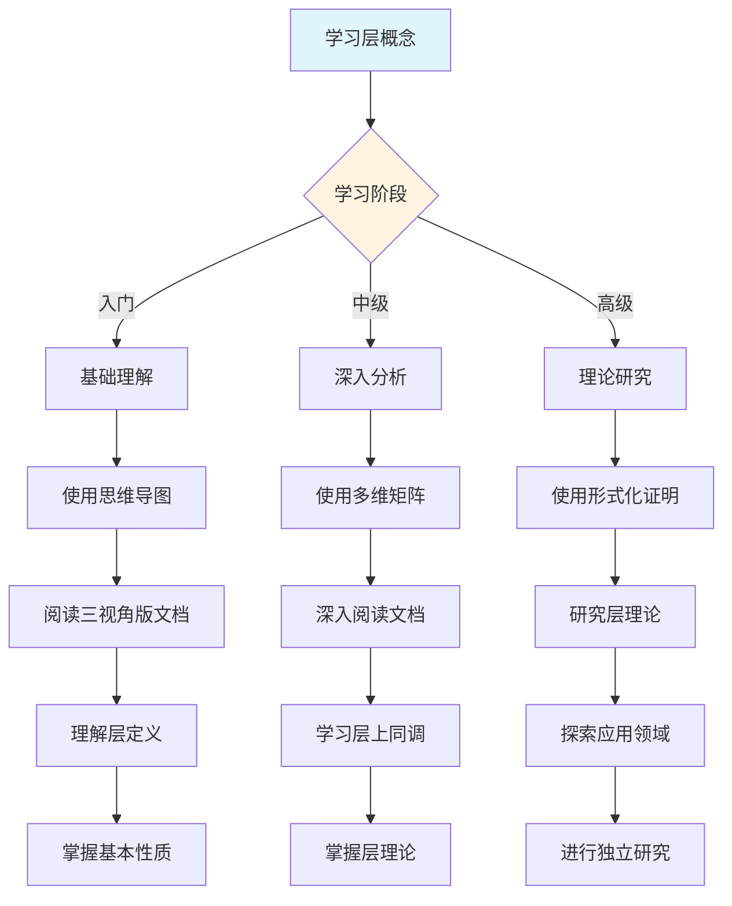
```mermaid
graph TD
    A[学习层概念] --> B{学习阶段}
    B -->|入门| C[基础理解]
    B -->|中级| D[深入分析]
    B -->|高级| E[理论研究]

    C --> C1[使用思维导图]
    C1 --> C2[阅读三视角版文档]
    C2 --> C3[理解层定义]
    C3 --> C4[掌握基本性质]

    D --> D1[使用多维矩阵]
    D1 --> D2[深入阅读文档]
    D2 --> D3[学习层上同调]
    D3 --> D4[掌握层理论]

    E --> E1[使用形式化证明]
    E1 --> E2[研究层理论]
    E2 --> E3[探索应用领域]
    E3 --> E4[进行独立研究]

    style A fill:#e1f5ff
    style B fill:#fff4e1
```

### 1.2 学习重点决策

**基于知识矩阵的学习重点**：

| 学习阶段 | 知识层次 | 学习重点 | 推荐资源 |
|---------|---------|---------|---------|
| **入门** | L0基础 | 层的定义、基本例子 | 思维导图、三视角版文档 |
| **入门** | L0基础 | 层的直观理解（局部数据、粘合、截面） | 三视角版文档、应用实例 |
| **中级** | L1中级 | 层上同调 | 多维矩阵、形式化证明 |
| **中级** | L1中级 | 层理论 | 三视角版文档、习题库 |
| **高级** | L2高级 | 导出范畴 | 形式化证明系统 |
| **高级** | L2高级 | 层范畴 | 形式化证明系统 |

### 1.3 学习方法决策

**基于认知维度的学习方法**：

1. **直观维度**（入门阶段）
   - 使用思维导图建立总体框架
   - 使用具体例子理解概念（连续函数层、常值层）
   - 使用几何直观理解层

2. **知性维度**（中级阶段）
   - 使用多维矩阵分析概念特征
   - 使用概念分类系统理解（预层、层、层态射）
   - 使用关系分析建立联系（与拓扑空间、概形、范畴的关系）

3. **理性维度**（高级阶段）
   - 使用形式化证明严格理解
   - 使用逻辑推理深入分析
   - 使用系统建构整体把握

---

## 🔬 二、研究决策导图 (编号: C.CORE.022.DECISION.02)

### 2.1 研究方向决策

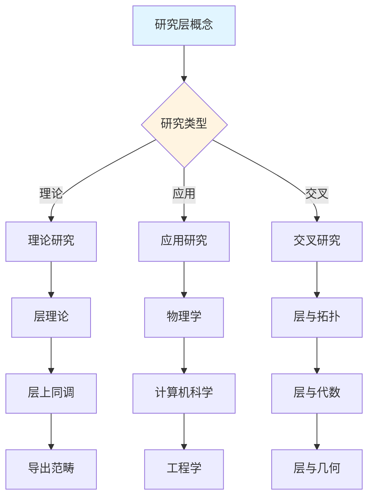
```mermaid
graph TD
    A[研究层概念] --> B{研究类型}
    B -->|理论| C[理论研究]
    B -->|应用| D[应用研究]
    B -->|交叉| E[交叉研究]

    C --> C1[层理论]
    C1 --> C2[层上同调]
    C2 --> C3[导出范畴]

    D --> D1[物理学]
    D1 --> D2[计算机科学]
    D2 --> D3[工程学]

    E --> E1[层与拓扑]
    E1 --> E2[层与代数]
    E2 --> E3[层与几何]

    style A fill:#e1f5ff
    style B fill:#fff4e1
```

### 2.2 研究问题决策

**基于知识矩阵的研究问题**：

1. **理论研究问题**
   - 层理论：层的分类和性质
   - 层上同调：层上同调的计算
   - 导出范畴：层的导出范畴

2. **应用研究问题**
   - 物理学：层在物理学中的应用（规范理论中的层）
   - 计算机科学：层在计算机科学中的应用（数据粘合）
   - 工程学：层在工程学中的应用

3. **交叉研究问题**
   - 层与拓扑：层在拓扑中的应用
   - 层与代数：层在代数中的应用
   - 层与几何：层在几何中的应用

### 2.3 研究方法决策

**基于形式化证明的研究方法**：

1. **构造性证明** → 层的构造
   - 直接构造层
   - 适用于具体层

2. **范畴方法** → 层理论
   - 使用范畴方法
   - 适用于层理论

3. **同调方法** → 层上同调
   - 使用同调方法
   - 适用于层上同调

---

## 💼 三、应用决策导图 (编号: C.CORE.022.DECISION.03)

### 3.1 应用场景决策

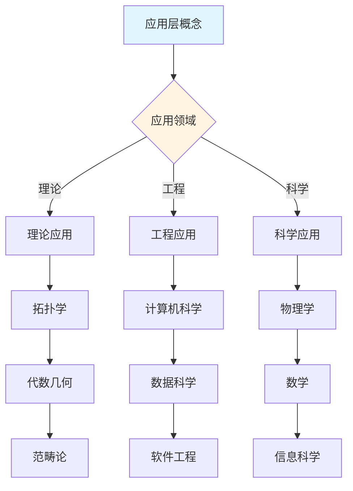
```mermaid
graph TD
    A[应用层概念] --> B{应用领域}
    B -->|理论| C[理论应用]
    B -->|工程| D[工程应用]
    B -->|科学| E[科学应用]

    C --> C1[拓扑学]
    C1 --> C2[代数几何]
    C2 --> C3[范畴论]

    D --> D1[计算机科学]
    D1 --> D2[数据科学]
    D2 --> D3[软件工程]

    E --> E1[物理学]
    E1 --> E2[数学]
    E2 --> E3[信息科学]

    style A fill:#e1f5ff
    style B fill:#fff4e1
```

### 3.2 应用方法决策

**基于应用场景的应用方法**：

1. **理论应用** → 使用形式化证明
   - 拓扑学：层是拓扑学的基础
   - 代数几何：层在代数几何中的应用
   - 范畴论：层在范畴论中的应用

2. **工程应用** → 使用论证过程
   - 计算机科学：层在计算机科学中的应用（数据粘合）
   - 数据科学：层在数据科学中的应用
   - 软件工程：层在软件工程中的应用

3. **科学应用** → 使用综合方法
   - 物理学：层在物理学中的应用（规范理论中的层）
   - 数学：层在数学中的应用
   - 信息科学：层在信息科学中的应用

---

## 🎓 四、教学决策导图 (编号: C.CORE.022.DECISION.04)

### 4.1 教学内容决策

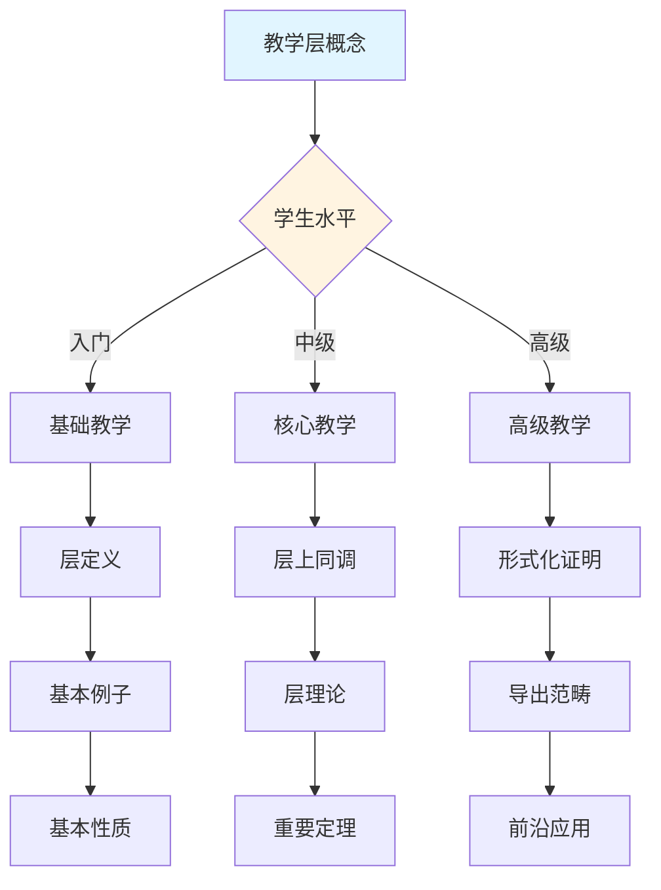
```mermaid
graph TD
    A[教学层概念] --> B{学生水平}
    B -->|入门| C[基础教学]
    B -->|中级| D[核心教学]
    B -->|高级| E[高级教学]

    C --> C1[层定义]
    C1 --> C2[基本例子]
    C2 --> C3[基本性质]

    D --> D1[层上同调]
    D1 --> D2[层理论]
    D2 --> D3[重要定理]

    E --> E1[形式化证明]
    E1 --> E2[导出范畴]
    E2 --> E3[前沿应用]

    style A fill:#e1f5ff
    style B fill:#fff4e1
```

### 4.2 教学方法决策

**基于认知维度的教学方法**：

1. **直观维度**（入门教学）
   - 使用思维导图建立框架
   - 使用具体例子（连续函数层、常值层）
   - 使用几何直观理解

2. **知性维度**（中级教学）
   - 使用多维矩阵深入分析
   - 使用概念分类系统
   - 使用关系分析建立联系

3. **理性维度**（高级教学）
   - 使用形式化证明严格理解
   - 使用逻辑推理深入分析
   - 使用系统建构整体把握

---

## 🔄 五、整合应用示例 (编号: C.CORE.022.DECISION.05)

### 5.1 完整学习流程示例

**阶段1：入门理解**:

1. 使用学习决策导图 → 确定学习路径：基础概念 → 层定义 → 基本性质 → 基本应用
2. 使用总体思维导图 → 了解层在几何学中的位置
3. 阅读[层-三视角版](./22-层.md) → 理解层的定义和基本性质
4. 使用论证过程 → 理解层的直观意义（局部数据、粘合、截面、限制映射）

**阶段2：深入分析**:

1. 使用多维矩阵 → 分析层的多维度特征（知识层次L0基础层、知识领域D4几何、学习难度很高）
2. 阅读[层-三视角版](./22-层.md) → 深入理解层上同调和层理论
3. 使用形式化证明 → 学习层相关定理的形式化证明
4. 使用分支关联思维导图 → 了解层与拓扑空间、概形、范畴的关系

**阶段3：应用研究**:

1. 使用研究决策导图 → 确定研究方向：层理论
2. 使用知识关联网络 → 发现层与拓扑、代数、几何的关系
3. 使用形式化证明系统 → 构建层理论体系
4. 阅读[层-三视角版](./22-层.md) → 了解层的历史发展和开放问题

---

## 🔗 六、关联文档 (编号: C.CORE.022.DECISION.06)

### 6.1 核心概念文档

- [层-三视角版](./22-层.md)
- [层](./22-层.md)

### 6.2 框架文档

- [决策思维导图体系](../01-总体思维导图/05-决策思维导图体系.md)
- [概念体系全面梳理与推进计划](../00-概念体系全面梳理与推进计划-2025年1月.md)
- [核心概念与新框架整合指南](../00-核心概念与新框架整合指南-2025年1月.md)

### 6.3 相关文档

- [核心概念索引](./00-核心概念索引.md)
- [知识矩阵总览](../02-知识矩阵/00-知识矩阵总览.md)
- [形式化证明系统](../00-形式化证明系统-2025年11月.md)

---

**维护状态**: 持续更新中

