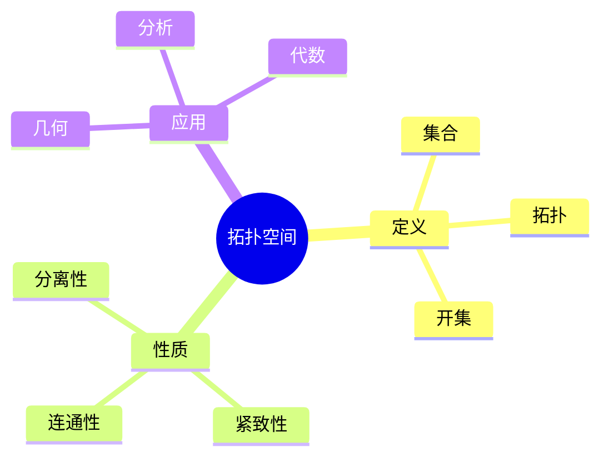
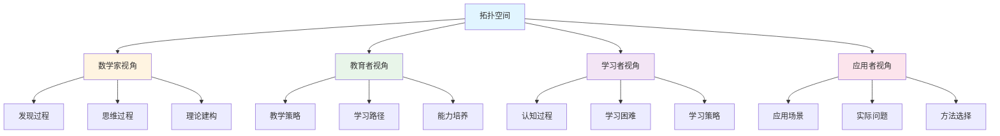
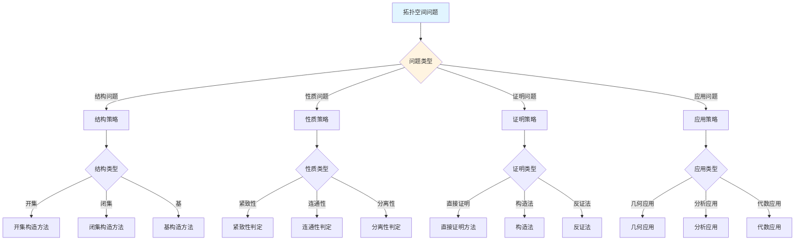
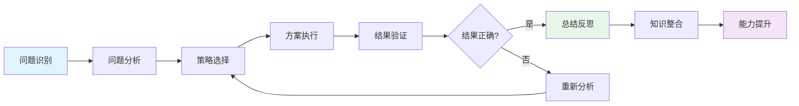
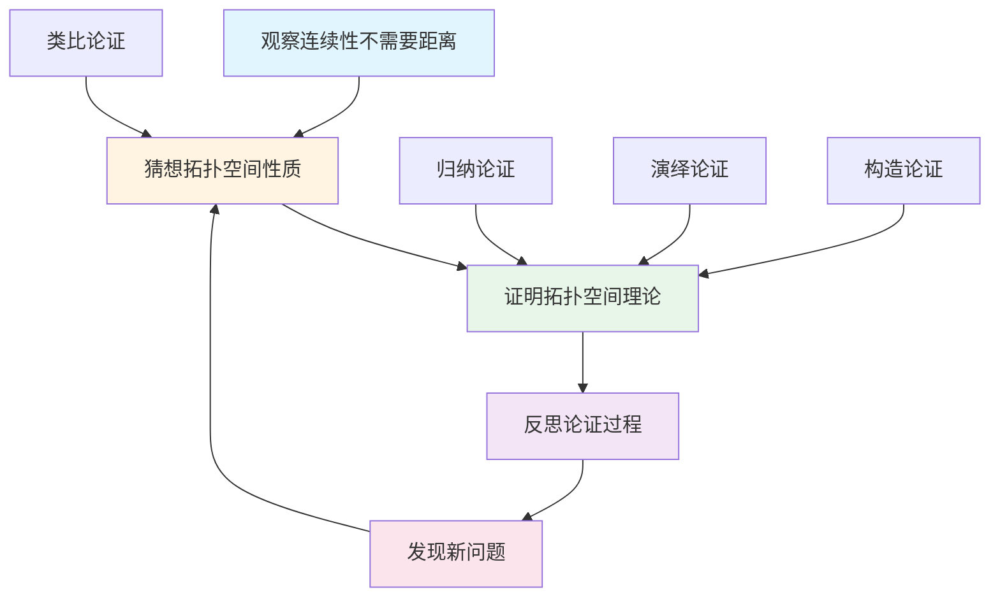
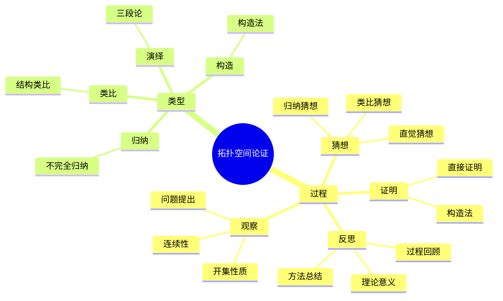

# 拓扑空间 (Topological Space) - 三视角组织版

**概念编号**: C.CORE.023
**知识层次**: L0-L2
**知识领域**: D5 (拓扑)
**创建日期**: 2025年1月
**最后更新**: 2025年1月

---

## 📋 目录 / Table of Contents

- [拓扑空间 (Topological Space) - 三视角组织版](#拓扑空间-topological-space---三视角组织版)
  - [📋 目录 / Table of Contents](#-目录--table-of-contents)
  - [1. 📋 概述 (编号: C.CORE.023.01)](#1--概述-编号-ccore02301)
  - [🧠 认知学视角：如何理解拓扑空间 (编号: C.CORE.023.02)](#-认知学视角如何理解拓扑空间-编号-ccore02302)
    - [认知起点 (编号: C.CORE.023.02.01)](#认知起点-编号-ccore0230201)
    - [认知过程 (编号: C.CORE.023.02.02)](#认知过程-编号-ccore0230202)
      - [阶段1：直观理解阶段 (编号: C.CORE.023.02.02.01)](#阶段1直观理解阶段-编号-ccore023020201)
      - [阶段2：概念形成阶段 (编号: C.CORE.023.02.02.02)](#阶段2概念形成阶段-编号-ccore023020202)
      - [阶段3：形式化阶段 (编号: C.CORE.023.02.02.03)](#阶段3形式化阶段-编号-ccore023020203)
    - [认知障碍 (编号: C.CORE.023.02.03)](#认知障碍-编号-ccore0230203)
    - [认知工具 (编号: C.CORE.023.02.04)](#认知工具-编号-ccore0230204)
  - [🎓 教育学视角：如何教学拓扑空间 (编号: C.CORE.023.03)](#-教育学视角如何教学拓扑空间-编号-ccore02303)
    - [教学目标 (编号: C.CORE.023.03.01)](#教学目标-编号-ccore0230301)
    - [教学路径 (编号: C.CORE.023.03.02)](#教学路径-编号-ccore0230302)
      - [阶段1：引入阶段（激发兴趣） (编号: C.CORE.023.03.02.01)](#阶段1引入阶段激发兴趣-编号-ccore023030201)
      - [阶段2：探索阶段（主动建构） (编号: C.CORE.023.03.02.02)](#阶段2探索阶段主动建构-编号-ccore023030202)
      - [阶段3：形式化阶段（抽象概括） (编号: C.CORE.023.03.02.03)](#阶段3形式化阶段抽象概括-编号-ccore023030203)
      - [阶段4：巩固阶段（应用深化） (编号: C.CORE.023.03.02.04)](#阶段4巩固阶段应用深化-编号-ccore023030204)
    - [教学难点 (编号: C.CORE.023.03.03)](#教学难点-编号-ccore0230303)
      - [难点1：拓扑的抽象性](#难点1拓扑的抽象性)
      - [难点2：开集的概念](#难点2开集的概念)
      - [难点3：拓扑的等价性](#难点3拓扑的等价性)
    - [教学策略 (编号: C.CORE.023.03.04)](#教学策略-编号-ccore0230304)
      - [策略1：从具体到抽象](#策略1从具体到抽象)
      - [策略2：多元表征](#策略2多元表征)
      - [策略3：问题驱动](#策略3问题驱动)
      - [策略4：可视化教学](#策略4可视化教学)
    - [评估方法 (编号: C.CORE.023.03.05)](#评估方法-编号-ccore0230305)
  - [🔬 数学家视角：如何思考拓扑空间 (编号: C.CORE.023.04)](#-数学家视角如何思考拓扑空间-编号-ccore02304)
    - [问题起源 (编号: C.CORE.023.04.01)](#问题起源-编号-ccore0230401)
    - [思维过程 (编号: C.CORE.023.04.02)](#思维过程-编号-ccore0230402)
      - [步骤1：问题提出 (编号: C.CORE.023.04.02.01)](#步骤1问题提出-编号-ccore023040201)
      - [步骤2：概念形成 (编号: C.CORE.023.04.02.02)](#步骤2概念形成-编号-ccore023040202)
      - [步骤3：理论发展 (编号: C.CORE.023.04.02.03)](#步骤3理论发展-编号-ccore023040203)
    - [历史发展 (编号: C.CORE.023.04.03)](#历史发展-编号-ccore0230403)
    - [3.2 关键人物和贡献 (编号: C.CORE.023.04.04)](#32-关键人物和贡献-编号-ccore0230404)
    - [重要定理 (编号: C.CORE.023.04.05)](#重要定理-编号-ccore0230405)
    - [开放问题 (编号: C.CORE.023.04.06)](#开放问题-编号-ccore0230406)
    - [一、第一人称思维描述 (编号: C.CORE.023.04.07)](#一第一人称思维描述-编号-ccore0230407)
      - [1.1 Hausdorff的发现过程](#11-hausdorff的发现过程)
    - [二、数学直觉的形成 (编号: C.CORE.023.04.08)](#二数学直觉的形成-编号-ccore0230408)
      - [2.1 直觉在概念发现中的作用](#21-直觉在概念发现中的作用)
      - [2.2 如何培养拓扑空间直觉](#22-如何培养拓扑空间直觉)
    - [三、数学美的教育价值 (编号: C.CORE.023.04.09)](#三数学美的教育价值-编号-ccore0230409)
      - [3.1 拓扑空间论的美在哪里](#31-拓扑空间论的美在哪里)
      - [3.2 如何培养学生的数学美感](#32-如何培养学生的数学美感)
    - [四、问题解决策略 (编号: C.CORE.023.04.10)](#四问题解决策略-编号-ccore0230410)
      - [4.1 数学家的启发式方法](#41-数学家的启发式方法)
      - [4.2 思维过程分析](#42-思维过程分析)
    - [五、批判性反思 (编号: C.CORE.023.04.11)](#五批判性反思-编号-ccore0230411)
      - [5.1 拓扑空间概念的局限性](#51-拓扑空间概念的局限性)
      - [5.2 拓扑空间理论的未解决问题](#52-拓扑空间理论的未解决问题)
  - [💡 数学解释：为什么拓扑空间是这样定义的 (编号: C.CORE.023.05)](#-数学解释为什么拓扑空间是这样定义的-编号-ccore02305)
    - [一、直观解释：拓扑空间是什么？](#一直观解释拓扑空间是什么)
      - [1.1 具体例子](#11-具体例子)
      - [1.2 形象类比](#12-形象类比)
      - [1.3 几何直观](#13-几何直观)
      - [1.4 操作体验](#14-操作体验)
    - [二、知性解释：拓扑空间的本质是什么？](#二知性解释拓扑空间的本质是什么)
      - [2.1 概念定义](#21-概念定义)
      - [2.2 分类体系](#22-分类体系)
      - [2.3 抽象结构](#23-抽象结构)
      - [2.4 知识体系](#24-知识体系)
    - [三、理性解释：拓扑空间的公理化定义](#三理性解释拓扑空间的公理化定义)
      - [3.1 公理体系](#31-公理体系)
      - [3.2 形式化证明](#32-形式化证明)
      - [3.3 系统建构](#33-系统建构)
    - [四、多视角解释：从不同角度理解拓扑空间](#四多视角解释从不同角度理解拓扑空间)
      - [4.1 数学家视角：拓扑空间是如何被发现的？](#41-数学家视角拓扑空间是如何被发现的)
      - [4.2 教育者视角：如何教学拓扑空间？](#42-教育者视角如何教学拓扑空间)
      - [4.3 学习者视角：如何学习拓扑空间？](#43-学习者视角如何学习拓扑空间)
      - [4.4 应用者视角：如何应用拓扑空间？](#44-应用者视角如何应用拓扑空间)
    - [五、思维表征：用多种方式理解拓扑空间](#五思维表征用多种方式理解拓扑空间)
      - [5.1 思维导图：拓扑空间的知识结构](#51-思维导图拓扑空间的知识结构)
      - [5.2 矩阵对比：不同解释方式的对比](#52-矩阵对比不同解释方式的对比)
      - [5.3 多视角表征：从不同角度表征拓扑空间](#53-多视角表征从不同角度表征拓扑空间)
      - [5.4 决策树：拓扑空间问题分类和策略选择](#54-决策树拓扑空间问题分类和策略选择)
      - [5.5 决策逻辑路径：拓扑空间问题解决过程](#55-决策逻辑路径拓扑空间问题解决过程)
      - [5.6 多维对比矩阵：拓扑空间概念特征对比](#56-多维对比矩阵拓扑空间概念特征对比)
  - [💡 数学解释：为什么拓扑空间是这样定义的 (编号: C.CORE.023.05)](#-数学解释为什么拓扑空间是这样定义的-编号-ccore02305)
  - [🔍 数学论证：如何论证拓扑空间 (编号: C.CORE.023.06)](#-数学论证如何论证拓扑空间-编号-ccore02306)
    - [一、论证过程：从观察到反思](#一论证过程从观察到反思)
    - [二、论证类型：多种推理方式](#二论证类型多种推理方式)
    - [三、论证可视化：用图形表示论证过程](#三论证可视化用图形表示论证过程)
  - [🔗 三视角整合 (编号: C.CORE.023.07)](#-三视角整合-编号-ccore02307)
    - [三个视角的关联](#三个视角的关联)
    - [如何综合运用三个视角](#如何综合运用三个视角)
  - [📚 参考文献 (编号: C.CORE.023.08)](#-参考文献-编号-ccore02308)
    - [权威资源](#权威资源)
    - [经典教材](#经典教材)
    - [研究论文](#研究论文)

---

## 1. 📋 概述 (编号: C.CORE.023.01)

拓扑空间是拓扑学的基础概念，定义了"接近"和"连续"的抽象概念。拓扑空间理论是现代数学的基础，在几何、分析、代数等领域有广泛应用。

本文档从**数学认知学**、**教育学**、**数学家**三个视角深入展开拓扑空间概念，避免简单的概念堆垒。

**权威资源对齐**:

- Wikipedia: [Topological Space](https://en.wikipedia.org/wiki/Topological_space)
- Stanford课程: Math 215A (Differential Topology)
- Princeton课程: MAT 530 (Topology)
- MIT课程: 18.901 (Introduction to Topology)
- Metamath: [Topological Space](http://us.metamath.org/mpeuni/df-top.html)

---

## 🧠 认知学视角：如何理解拓扑空间 (编号: C.CORE.023.02)

### 认知起点 (编号: C.CORE.023.02.01)

**学习者已有的知识基础**:

- 集合的概念
- 连续性的概念
- 日常经验中的"接近"、"邻域"概念

**日常经验中的类似概念**:

- "邻域"：周围的区域
- "接近"：距离很近
- "连续"：不间断

### 认知过程 (编号: C.CORE.023.02.02)

#### 阶段1：直观理解阶段 (编号: C.CORE.023.02.02.01)

**具体例子**:

- 例子1：离散拓扑 - 所有子集都是开集
- 例子2：平凡拓扑 - 只有$\emptyset$和$X$是开集
- 例子3：欧几里得拓扑 - $\mathbb{R}^n$的标准拓扑

**形象类比**:

- **邻域类比**: 拓扑空间就像"定义了邻域的空间"
  - 每个点有邻域
  - 邻域描述"接近"
  - 不需要距离

- **结构类比**: 拓扑空间就像"定义了开集的空间"
  - 开集描述"接近"
  - 开集满足公理
  - 不需要距离

**可视化表示**:

```text
拓扑空间:
    X
    ├─ 开集1
    ├─ 开集2
    └─ 开集3
    满足拓扑公理
```

#### 阶段2：概念形成阶段 (编号: C.CORE.023.02.02.02)

**从例子中抽象出共同特征**:

- 所有例子都涉及"开集"
- 开集满足公理
- 开集描述"接近"

**识别关键属性**:

1. **开集公理**: 空集和全集是开集
2. **并的封闭性**: 任意开集的并是开集
3. **有限交的封闭性**: 有限开集的交是开集

**建立概念边界**:

- **什么是拓扑空间**: 定义了开集族（拓扑）的集合
- **什么不是拓扑空间**:
  - 不满足开集公理的集合（不是拓扑空间）

#### 阶段3：形式化阶段 (编号: C.CORE.023.02.02.03)

**严格定义**:

- 公理化定义：通过开集公理
- 等价定义：通过闭集、邻域、闭包等

**公理化表述**:

- 公理1：空集和全集是开集
- 公理2：任意开集的并是开集
- 公理3：有限开集的交是开集

**逻辑结构**:

- 拓扑空间是拓扑学的基础
- 拓扑空间是连续性的基础
- 拓扑空间是几何学的基础

### 认知障碍 (编号: C.CORE.023.02.03)

**常见误解**:

1. **误解1**: 认为拓扑空间必须有距离
   - **纠正**: 拓扑空间不需要距离，只需要开集

2. **误解2**: 认为所有拓扑空间都相同
   - **纠正**: 不同的拓扑空间有不同的性质

3. **误解3**: 混淆拓扑和度量
   - **纠正**: 拓扑是更一般的概念，度量是特殊的拓扑

**理解难点**:

1. **难点1**: 拓扑的抽象性
   - **原因**: 拓扑比较抽象
   - **解决方法**: 从具体例子开始，逐步抽象

2. **难点2**: 开集的概念
   - **原因**: 开集的概念比较抽象
   - **解决方法**: 用具体例子，强调开集的作用

3. **难点3**: 拓扑的等价性
   - **原因**: 拓扑的等价性比较抽象
   - **解决方法**: 用具体例子，强调等价性的重要性

**认知陷阱**:

- **距离**: 需要理解拓扑不需要距离
- **开集**: 需要理解开集的作用

### 认知工具 (编号: C.CORE.023.02.04)

**类比工具**:

- **邻域类比**: 拓扑空间 = 定义了邻域的空间
- **结构类比**: 拓扑空间 = 定义了开集的空间

**可视化工具**:

- **开集图**: 用开集图表示拓扑
- **邻域图**: 用邻域图表示拓扑

**具体化工具**:

- **具体例子**: 用具体例子理解抽象概念
- **反例**: 用反例理解概念边界

---

## 🎓 教育学视角：如何教学拓扑空间 (编号: C.CORE.023.03)

### 教学目标 (编号: C.CORE.023.03.01)

**知识目标**:

- 理解拓扑空间的基本概念
- 掌握拓扑的公理化定义
- 理解拓扑的性质
- 理解拓扑的应用

**能力目标**:

- 能够判断一个结构是否是拓扑空间
- 能够理解拓扑的性质
- 能够应用拓扑解决实际问题
- 能够理解拓扑的重要性

**情感目标**:

- 培养数学抽象思维
- 培养几何思维
- 激发对数学的兴趣

### 教学路径 (编号: C.CORE.023.03.02)

#### 阶段1：引入阶段（激发兴趣） (编号: C.CORE.023.03.02.01)

**实际问题**:

- 问题1：如何描述"接近"而不需要距离？
- 问题2：如何研究连续性？
- 问题3：如何研究几何结构？

**历史背景**:

- 拓扑空间的历史发展
- 拓扑空间在数学中的地位
- 拓扑空间在几何中的应用

**引发认知冲突**:

- 问题：如何统一描述各种"接近"？
- 引出拓扑空间的概念

#### 阶段2：探索阶段（主动建构） (编号: C.CORE.023.03.02.02)

**引导发现**:

1. 让学生自己列举"接近"的例子
2. 让学生观察这些例子的共同特征
3. 引导学生抽象出拓扑空间的定义

**合作探究**:

- 小组讨论：什么是拓扑空间？
- 小组讨论：拓扑空间有哪些性质？
- 小组讨论：如何表示拓扑空间？

**多元表征**:

- **语言表征**: "拓扑空间是定义了开集族的集合"
- **符号表征**: $(X, \tau)$
- **图形表征**: 开集图、邻域图
- **集合表征**: 公理化定义

#### 阶段3：形式化阶段（抽象概括） (编号: C.CORE.023.03.02.03)

**严格定义**:

- 拓扑空间的公理化定义
- 拓扑的性质
- 拓扑的等价定义

**性质证明**:

- 拓扑空间的基本性质
- 分离公理
- 紧致性和连通性

**应用拓展**:

- 拓扑空间在拓扑学中的应用
- 拓扑空间在几何中的应用
- 拓扑空间在分析中的应用

#### 阶段4：巩固阶段（应用深化） (编号: C.CORE.023.03.02.04)

**练习应用**:

- 基础练习：拓扑空间的表示和性质
- 应用练习：用拓扑空间解决实际问题
- 综合练习：拓扑空间的综合应用

**变式训练**:

- 不同形式的拓扑空间
- 不同性质的拓扑空间
- 拓扑空间的应用

**知识整合**:

- 拓扑空间与其他概念的联系
- 拓扑空间在数学体系中的地位

### 教学难点 (编号: C.CORE.023.03.03)

#### 难点1：拓扑的抽象性

- **难点描述**: 学生难以理解拓扑的抽象概念
- **解决方法**:
  - 从具体例子开始
  - 逐步抽象
  - 用具体例子说明

#### 难点2：开集的概念

- **难点描述**: 学生难以理解开集的概念
- **解决方法**:
  - 用具体例子
  - 强调开集的作用
  - 用图形可视化

#### 难点3：拓扑的等价性

- **难点描述**: 学生难以理解拓扑的等价性
- **解决方法**:
  - 用具体例子
  - 强调等价性的重要性
  - 用反例说明

### 教学策略 (编号: C.CORE.023.03.04)

#### 策略1：从具体到抽象

- 先给出具体例子
- 再抽象出一般概念
- 最后给出严格定义

#### 策略2：多元表征

- 用语言、符号、图形等多种方式表示同一概念
- 帮助学生建立不同表征之间的联系

#### 策略3：问题驱动

- 从实际问题出发
- 引出数学概念
- 解决问题

#### 策略4：可视化教学

- 使用开集图
- 使用邻域图
- 使用具体例子

### 评估方法 (编号: C.CORE.023.03.05)

**形成性评估**（评估理解过程）:

- 课堂提问：检查学生对概念的理解
- 小组讨论：观察学生的思考过程
- 练习作业：检查学生的应用能力

**总结性评估**（评估最终理解）:

- 测验：检查学生对概念和性质的掌握
- 项目：检查学生应用拓扑空间解决实际问题的能力
- 反思：检查学生对拓扑空间概念的理解深度

---

## 🔬 数学家视角：如何思考拓扑空间 (编号: C.CORE.023.04)

### 问题起源 (编号: C.CORE.023.04.01)

**历史背景**:

- 19世纪：拓扑学的起源
- 20世纪初：拓扑空间的公理化
- 20世纪中期：拓扑空间的现代发展

**原始问题**:

- **问题1**: 如何描述"接近"而不需要距离？
- **问题2**: 如何研究连续性？
- **问题3**: 拓扑空间有哪些性质？

**研究动机**:

- 统一几何理论
- 建立拓扑学基础
- 发展现代数学

### 思维过程 (编号: C.CORE.023.04.02)

#### 步骤1：问题提出 (编号: C.CORE.023.04.02.01)

**观察到的现象**:

- 需要描述"接近"
- 需要研究连续性
- 需要统一几何理论

**提出的猜想**:

- 可以引入拓扑空间概念
- 拓扑空间可以描述"接近"
- 拓扑空间有丰富的性质

**需要解决的问题**:

- 如何定义拓扑空间？
- 拓扑空间应该满足什么条件？
- 拓扑空间有哪些性质？

#### 步骤2：概念形成 (编号: C.CORE.023.04.02.02)

**尝试性定义**:

- **公理化定义**: 通过开集公理
- **等价定义**: 通过闭集、邻域等

**性质探索**:

- 拓扑空间的基本性质
- 分离公理
- 紧致性和连通性

**结构发现**:

- 拓扑空间是拓扑学的基础
- 拓扑空间是连续性的基础
- 拓扑空间是几何学的基础

#### 步骤3：理论发展 (编号: C.CORE.023.04.02.03)

**定理证明**:

- 拓扑空间的基本性质
- 分离公理
- 紧致性和连通性

**应用拓展**:

- 拓扑空间在拓扑学中的应用
- 拓扑空间在几何中的应用
- 拓扑空间在分析中的应用

**理论完善**:

- 拓扑空间的公理化
- 拓扑空间的范畴论研究
- 拓扑空间的应用研究

### 历史发展 (编号: C.CORE.023.04.03)

**早期阶段**（19世纪）:

- **Riemann (1851)**: 研究黎曼面
- **Poincaré (1895)**: 建立拓扑学基础

**关键突破**（20世纪初）:

- **Hausdorff (1914)**: 提出Hausdorff空间
- **Kuratowski (1922)**: 研究闭包算子
- **Alexandrov (1925)**: 研究紧致性

**现代发展**（20世纪中期）:

- **Bourbaki (1940s)**: 统一拓扑学理论
- **Grothendieck (1957)**: 在代数几何中应用拓扑

### 3.2 关键人物和贡献 (编号: C.CORE.023.04.04)

**Henri Poincaré (1854-1912)**:

- 拓扑学的奠基者
- 建立拓扑学基础

**Felix Hausdorff (1868-1942)**:

- 提出Hausdorff空间
- 建立现代拓扑学

**Kazimierz Kuratowski (1896-1980)**:

- 研究闭包算子
- 建立拓扑学理论

### 重要定理 (编号: C.CORE.023.04.05)

**Tychonoff定理**:

- 任意多个紧致空间的乘积是紧致的
- 意义：紧致性的保持

**Urysohn引理**:

- 在正规空间中，不相交闭集可以用连续函数分离
- 意义：连续函数的构造
>

**紧致Hausdorff空间的唯一性**:

- 紧致Hausdorff拓扑在同胚意义下唯一
- 意义：拓扑的分类
>

### 开放问题 (编号: C.CORE.023.04.06)

**未解决问题**:

- 拓扑空间的分类问题
- 拓扑空间的表示问题
- 拓扑空间的应用问题
>

**研究方向**:

- 拓扑空间的范畴论研究
- 拓扑空间的几何研究
- 拓扑空间的应用研究

### 一、第一人称思维描述 (编号: C.CORE.023.04.07)

#### 1.1 Hausdorff的发现过程

**详细历史背景**:

- **1914年**：Hausdorff发表《集合论基础》（Grundzüge der Mengenlehre）
- **背景**：研究连续性和收敛性，发现需要抽象出开集的概念
- **问题**：如何抽象出开集的概念？如何统一处理连续性和收敛性？

**Hausdorff的详细第一人称描述**:
> "1914年，我在研究连续性时，遇到了一个问题：如何抽象出开集的概念？
>
> 我发现，在$\mathbb{R}$中，开集有特殊的性质：
>
> - **并集**：任意多个开集的并集是开集
> - **交集**：有限个开集的交集是开集
> - **全集和空集**：$\mathbb{R}$和$\emptyset$是开集
>
> 我的方法是这样的：
>
> - **思路**：用开集族定义拓扑空间
> - **定义**：拓扑空间$(X, \tau)$是集合$X$和开集族$\tau$，满足：
>   1. $\emptyset, X \in \tau$
>   2. 任意多个开集的并集是开集
>   3. 有限个开集的交集是开集
> - **例子**：$\mathbb{R}$配备标准拓扑是拓扑空间
>
> 例如，对于$\mathbb{R}$的标准拓扑：
>
> - **开集**：开区间$(a,b)$的任意并集
> - **闭集**：开集的补集
> - **连续性**：函数$f: \mathbb{R} \to \mathbb{R}$连续当且仅当开集的原像是开集
>
> 这让我意识到，拓扑空间是抽象开集的概念，可以统一处理连续性和收敛性。这为拓扑学提供了基础。"

**详细的思维过程**:

1. **观察到的现象**（1914年）:

   **现象1：连续性需要开集的概念**
   - **问题**：如何定义连续性？
   - **例子**：函数$f: \mathbb{R} \to \mathbb{R}$连续当且仅当开集的原像是开集
   - **需要**：抽象出开集的概念

   **现象2：开集有特殊的性质**
   - **问题**：开集有什么性质？
   - **例子**：任意多个开集的并集是开集，有限个开集的交集是开集
   - **需要**：建立拓扑理论

   **现象3：需要统一的概念**
   - **问题**：如何统一处理连续性和收敛性？
   - **思路**：用拓扑空间统一
   - **需要**：建立拓扑理论

2. **提出的猜想**（1914年）:

   **猜想1：用拓扑空间抽象开集**
   - **思路**：定义拓扑空间为集合和开集族，满足某些公理
   - **例子**：$\mathbb{R}$配备标准拓扑是拓扑空间
   - **优点**：统一抽象开集的概念

   **猜想2：拓扑空间的公理**
   - **公理**：$\emptyset, X \in \tau$，任意多个开集的并集是开集，有限个开集的交集是开集
   - **例子**：$\mathbb{R}$的标准拓扑满足这些公理
   - **意义**：为拓扑空间提供公理基础

   **猜想3：拓扑空间是拓扑学的基础**
   - **性质**：拓扑空间是抽象的拓扑结构
   - **应用**：拓扑空间可以应用到更广泛的领域
   - **意义**：拓扑空间是统一的拓扑结构

3. **遇到的困难**（1914年）:

   **困难1：如何严格定义拓扑空间？**
   - **问题**：如何定义拓扑空间？
   - **解决**：通过开集族定义拓扑空间
   - **意义**：为拓扑空间提供严格的数学基础

   **困难2：如何判断拓扑空间的性质？**
   - **问题**：如何判断拓扑空间是否Hausdorff？是否紧致？
   - **解决**：通过拓扑空间的结构判断
   - **意义**：为拓扑空间分类提供方法

   **困难3：如何应用拓扑理论？**
   - **问题**：如何用拓扑理论解决实际问题？
   - **解决**：建立连续映射理论、同伦理论、同调理论
   - **意义**：为拓扑提供应用基础

4. **突破的时刻**（1914年，Hausdorff）:

   **突破1：拓扑空间的概念**
   - 引入拓扑空间的概念抽象开集
   - **关键**：抽象出拓扑空间的结构
   - **意义**：为拓扑理论提供基础

   **突破2：拓扑空间的公理**
   - 建立拓扑空间的公理
   - **关键**：开集族满足某些公理
   - **意义**：为拓扑空间提供公理基础

   **突破3：拓扑理论的广泛应用**
   - 拓扑理论可以应用到更广泛的领域
   - **关键**：拓扑空间是抽象的拓扑结构
   - **意义**：拓扑理论成为数学的基础

### 二、数学直觉的形成 (编号: C.CORE.023.04.08)

#### 2.1 直觉在概念发现中的作用

**Hausdorff的直觉**:

- **直觉1**: "拓扑空间"是"开集的抽象"——这个直觉引导Hausdorff发现拓扑空间
- **直觉2**: 拓扑空间可以统一处理连续性——这个直觉引导Hausdorff建立拓扑理论
- **直觉3**: 拓扑空间是拓扑学的基础——这个直觉引导Hausdorff建立拓扑理论

**直觉的验证**:

- 通过严格的数学证明验证直觉的正确性
- 通过公理化严格化拓扑空间定义
- 通过应用验证拓扑空间的广泛性

**直觉的深化**:

- 从"开集的抽象"到"拓扑空间的严格定义"
- 从"统一处理连续性"到"拓扑的广泛应用"
- 从"拓扑学基础"到"拓扑的深入发展"

#### 2.2 如何培养拓扑空间直觉

**数学家的建议**:

- **Hausdorff**: "拓扑空间直觉是长期训练的结果。通过大量练习和深入思考，我们可以培养对拓扑空间的直觉。"
- **Kuratowski**: "从具体例子开始，逐步抽象，这是培养拓扑空间直觉的有效方法。"

**培养方法**:

1. **大量练习**: 通过大量拓扑空间构造练习，培养对拓扑空间的直觉
2. **深入思考**: 深入思考拓扑空间的本质，理解拓扑空间的深层结构
3. **类比和联想**: 通过类比和联想，建立拓扑空间与其他概念的联系
4. **与专家交流**: 与数学家交流，学习他们的思维方式

**教学启示**:

- 从具体例子开始，逐步抽象
- 鼓励学生思考拓扑空间的本质
- 引导学生建立拓扑空间与其他概念的联系

### 三、数学美的教育价值 (编号: C.CORE.023.04.09)

#### 3.1 拓扑空间论的美在哪里

**结构美**:

- **简洁性**: 拓扑空间的概念非常简洁——"具有开集族的集合"
- **统一性**: 拓扑空间可以统一描述数学中的各种连续性
- **和谐性**: 拓扑空间运算满足优美的规律（子空间、乘积空间等）

**数学家的评价**:

- **Hausdorff**: "拓扑空间论的美在于它的统一性。它为我们提供了一个统一的框架来理解连续性。"
- **Kuratowski**: "拓扑空间论的美在于它的基础性。它是拓扑学的基础，所有拓扑概念都可以用拓扑空间来描述。"

#### 3.2 如何培养学生的数学美感

**数学家的建议**:

- **Hausdorff**: "展示拓扑空间论的美感，让学生感受到数学的美。"
- **Kuratowski**: "通过拓扑空间论的历史和发展，让学生理解数学的美。"

**教学方法**:

1. **展示数学美**:
   - 展示拓扑空间概念的简洁性和统一性
   - 展示拓扑空间运算的优美规律
   - 展示拓扑空间在数学中的基础地位

2. **引导学生欣赏**:
   - 引导学生欣赏拓扑空间概念的简洁性
   - 引导学生欣赏拓扑空间运算的和谐性
   - 引导学生欣赏拓扑空间的基础性

3. **鼓励学生创造美**:
   - 鼓励学生发现拓扑空间论的美
   - 鼓励学生创造优美的拓扑空间证明
   - 鼓励学生探索拓扑空间论的美

### 四、问题解决策略 (编号: C.CORE.023.04.10)

#### 4.1 数学家的启发式方法

**策略1：从具体到抽象**:

- 从具体的拓扑空间例子开始
- 抽象出拓扑空间的一般性质
- 建立拓扑空间的理论体系

**策略2：从简单到复杂**:

- 先理解基本拓扑空间
- 再理解拓扑空间运算
- 最后理解拓扑空间理论

**策略3：从问题到理论**:

- 从实际问题出发
- 引出拓扑空间概念
- 建立拓扑空间理论

#### 4.2 思维过程分析

**问题识别**:

- 识别问题类型：拓扑空间定义问题、拓扑空间性质问题、拓扑空间应用问题
- 识别问题难度：简单问题、中等问题、复杂问题

**策略选择**:

- 简单问题：直接方法
- 中等问题：分步方法
- 复杂问题：分解方法

**执行和反思**:

- 执行策略，解决问题
- 反思过程，总结经验
- 改进方法，提高效率

### 五、批判性反思 (编号: C.CORE.023.04.11)

#### 5.1 拓扑空间概念的局限性

**概念的边界**:

- 拓扑空间只描述连续性，不能描述所有数学结构
- 拓扑空间是抽象的，需要具体化才能应用
- 拓扑空间不能表示所有数学量

**概念的推广**:

- 度量空间：更具体的拓扑空间
- 一致空间：更一般的拓扑空间
- 范畴拓扑：范畴论中的拓扑

#### 5.2 拓扑空间理论的未解决问题

**未解决的问题**:

- 拓扑空间的分类问题：如何分类所有拓扑空间？
- 拓扑空间的表示问题：如何表示拓扑空间？
- 拓扑空间的应用问题：如何更好地应用拓扑空间？

**研究方向**:

- 拓扑空间的范畴论研究
- 拓扑空间的几何研究
- 拓扑空间的应用研究

---

## 💡 数学解释：为什么拓扑空间是这样定义的 (编号: C.CORE.023.05)

### 一、直观解释：拓扑空间是什么？

#### 1.1 具体例子

**生活中的例子**：

- **接近的概念**：拓扑空间描述"接近"而不需要距离
  - 例如：在拓扑空间中，两个点可以"接近"而不需要定义距离
  - **为什么这样定义**：因为我们需要一个概念来表示"接近"的抽象概念
- **连续的概念**：拓扑空间描述"连续"而不需要度量
  - 例如：在拓扑空间中，函数可以"连续"而不需要定义距离
  - **为什么这样定义**：因为我们需要一个概念来表示"连续"的抽象概念
- **邻域的概念**：拓扑空间描述"邻域"而不需要距离
  - 例如：在拓扑空间中，每个点有"邻域"而不需要定义距离
  - **为什么这样定义**：因为我们需要一个概念来表示"邻域"的抽象概念

**数学中的例子**：

- **离散拓扑**：所有子集都是开集
  - **为什么这样定义**：我们需要一个简单的方式来表示"最细的拓扑"
- **平凡拓扑**：只有空集和全集是开集
  - **为什么这样定义**：我们需要一个概念来表示"最粗的拓扑"
- **度量拓扑**：由度量诱导的拓扑
  - **为什么这样定义**：我们需要一个概念来表示"由度量定义的拓扑"

#### 1.2 形象类比

**橡皮泥类比**：

- **拓扑空间就像"橡皮泥"**
  - 橡皮泥可以拉伸和弯曲，但不能撕裂
  - 拓扑空间可以连续变形，但不能改变拓扑性质
- **为什么这样类比**：这个类比帮助我们理解拓扑空间的"连续变形"性质

**邻域类比**：

- **拓扑空间就像"邻域系统"**
  - 每个点有邻域
  - 邻域描述"接近"的概念
- **为什么这样类比**：这个类比帮助我们理解拓扑空间的"邻域"性质

#### 1.3 几何直观

**开集表示**：

- 使用开集表示拓扑空间
- 例如：开集描述"内部"的概念
- **为什么使用开集**：开集提供几何直观，帮助我们理解拓扑空间

**邻域表示**：

- 使用邻域表示拓扑空间
- 例如：邻域描述"接近"的概念
- **为什么使用邻域**：邻域提供几何直观，帮助我们理解拓扑空间

#### 1.4 操作体验

**拓扑空间运算的操作**：

- **拓扑的并**：开集的并是开集
  - **为什么这样操作**：因为我们需要一个运算来表示"拓扑的并"
- **拓扑的交**：有限个开集的交是开集
  - **为什么这样操作**：因为我们需要一个运算来表示"拓扑的交"
- **子空间拓扑**：子集可以继承拓扑
  - **为什么这样操作**：因为我们需要一个工具来构造子空间拓扑

### 二、知性解释：拓扑空间的本质是什么？

#### 2.1 概念定义

**拓扑空间的内涵**：

- **拓扑空间是配备拓扑结构的集合**
  - **集合**：$X$是基础集合
  - **拓扑**：$\tau$是$X$的子集族，满足开集公理
  - **结构**：$(X, \tau)$是拓扑空间
- **为什么这样定义**：这些特征使得拓扑空间成为一个完整的拓扑工具，支持所有拓扑研究

**拓扑空间的外延**：

- **Hausdorff空间**：任意两点有不相交的邻域
- **紧致空间**：每个开覆盖有有限子覆盖
- **连通空间**：不能分解为两个非空开集
- **为什么这样分类**：不同的拓扑空间类型有不同的性质和用途

#### 2.2 分类体系

**按分离性分类**：

- **$T_0$空间**：任意两点有不同邻域
- **$T_1$空间**：单点集是闭集
- **$T_2$空间**：Hausdorff空间
- **为什么这样分类**：分离性是拓扑空间的基本特征

**按紧致性分类**：

- **紧致空间**：每个开覆盖有有限子覆盖
- **局部紧致空间**：每点有紧致邻域
- **为什么这样分类**：紧致性是拓扑空间的重要特征

#### 2.3 抽象结构

**拓扑空间的运算结构**：

- **拓扑的并**：开集的并是开集
- **拓扑的交**：有限个开集的交是开集
- **为什么有这些运算**：这些运算使得拓扑空间具有代数结构

**拓扑空间的关系结构**：

- **连续映射**：$f: X \to Y$是连续的如果开集的原像是开集
- **同胚**：两个拓扑空间如果存在双射连续映射，则同胚
- **为什么有这个关系**：这个关系帮助我们研究拓扑空间的结构

#### 2.4 知识体系

**拓扑空间在数学体系中的位置**：

- **基础地位**：拓扑空间是拓扑学的基础
  - 拓扑空间可以定义连续
  - 拓扑空间可以定义收敛
- **为什么是基础**：拓扑空间提供了统一的框架来研究拓扑

**拓扑空间与其他概念的关系**：

- **拓扑空间与度量空间**：度量空间是特殊的拓扑空间
- **拓扑空间与连续**：拓扑空间可以定义连续
- **拓扑空间与几何**：拓扑空间在几何中有重要应用
- **为什么有这些关系**：这些关系揭示了拓扑空间与其他数学概念的内在联系

### 三、理性解释：拓扑空间的公理化定义

#### 3.1 公理体系

**拓扑空间的定义**：

- **定义**：$(X, \tau)$是拓扑空间，其中$X$是集合，$\tau$是$X$的子集族，满足开集公理
- **为什么需要这个定义**：这个定义提供了拓扑空间的严格数学基础

**开集公理**：

- **空集和全集**：$\emptyset, X \in \tau$
- **并的封闭性**：任意多个开集的并是开集
- **交的封闭性**：有限个开集的交是开集
- **为什么这样定义**：这些公理将拓扑空间放在更一般的框架中

#### 3.2 形式化证明

**拓扑空间性质的证明**：

- **连续映射的性质**：连续映射的复合是连续的
  - **证明**：使用连续映射的定义和开集的性质
  - **为什么这样证明**：利用连续映射的定义和开集的性质
- **紧致性的性质**：紧致空间的连续像是紧致的
  - **证明**：使用紧致性的定义和连续映射的性质
  - **为什么这样证明**：利用紧致性的定义和连续映射的性质

#### 3.3 系统建构

**拓扑空间论在数学基础中的地位**：

- **作为拓扑学基础**：拓扑空间是拓扑学的基础
- **提供拓扑工具**：拓扑空间提供了研究拓扑的工具
- **统一框架**：拓扑空间统一了各种拓扑研究

**拓扑空间论的发展历史**：

- **Hausdorff的引入**（1914年）：引入Hausdorff空间
- **Bourbaki的统一**（1940s）：统一拓扑空间理论
- **为什么这样发展**：数学的发展需要严格的基础，拓扑空间论的发展反映了这一需求

### 四、多视角解释：从不同角度理解拓扑空间

#### 4.1 数学家视角：拓扑空间是如何被发现的？

**Hausdorff的发现过程**：

- **问题提出**：如何描述"接近"而不需要距离？
- **关键洞察**：使用开集公理，发现拓扑空间的结构
- **重要发现**：拓扑空间可以用于描述连续和接近
- **为什么这样发现**：数学家的直觉和严格证明相结合

#### 4.2 教育者视角：如何教学拓扑空间？

**教学策略**：

- **从具体到抽象**：先学习具体例子（度量空间），再学习抽象定义
- **从简单到复杂**：先学习简单拓扑空间，再学习复杂拓扑空间
- **从直观到形式化**：先使用开集等直观工具，再学习严格定义
- **为什么这样教学**：符合认知规律，帮助学生逐步建立理解

#### 4.3 学习者视角：如何学习拓扑空间？

**认知过程**：

- **直观阶段**：通过具体例子理解拓扑空间的含义
- **概念阶段**：理解拓扑空间的定义和性质
- **形式化阶段**：理解严格定义和证明
- **为什么这样学习**：符合认知发展规律

#### 4.4 应用者视角：如何应用拓扑空间？

**应用场景**：

- **几何**：使用拓扑空间研究几何结构
- **分析**：使用拓扑空间研究函数空间
- **代数**：使用拓扑空间研究代数结构
- **为什么这样应用**：拓扑空间提供了强大的工具来处理各种问题

### 五、思维表征：用多种方式理解拓扑空间

#### 5.1 思维导图：拓扑空间的知识结构



#### 5.2 矩阵对比：不同解释方式的对比

| 解释方式 | 特点 | 方法 | 工具 | 适用阶段 | 优势 | 局限 |
|---------|------|------|------|---------|------|------|
| **直观解释** | 具体、形象、可视 | 例子、类比、直观 | 开集、邻域 | 入门阶段 | 易于理解 | 不够严格 |
| **知性解释** | 概念、分类、抽象 | 定义、分类、结构 | 概念图、知识图谱 | 中级阶段 | 系统完整 | 不够直观 |
| **理性解释** | 公理、证明、形式化 | 公理、证明、系统 | 形式化工具、证明系统 | 高级阶段 | 严格准确 | 不够具体 |
| **多视角解释** | 多角度、整合 | 多视角、整合 | 多视角工具 | 所有阶段 | 全面深入 | 可能复杂 |

#### 5.3 多视角表征：从不同角度表征拓扑空间



#### 5.4 决策树：拓扑空间问题分类和策略选择



**说明**：

- **问题分类**：根据问题类型（结构、性质、证明、应用）进行分类
- **策略选择**：根据问题类型选择相应的解决策略
- **方法应用**：根据具体问题选择合适的方法

#### 5.5 决策逻辑路径：拓扑空间问题解决过程



**说明**：

- **问题识别**：识别拓扑空间问题的类型和关键要素
- **问题分析**：分析问题的条件和目标
- **策略选择**：根据问题类型选择解决策略
- **方案执行**：执行选定的解决方案
- **结果验证**：验证结果的正确性
- **总结反思**：总结解题过程，反思解题方法
- **知识整合**：整合相关知识点
- **能力提升**：提升问题解决能力

#### 5.6 多维对比矩阵：拓扑空间概念特征对比

| 对比维度 | 拓扑空间定义 | 拓扑空间结构 | 拓扑空间性质 | 拓扑空间应用 |
|---------|---------|---------|---------|---------|
| **核心特征** | 开集、拓扑公理 | 开集、闭集、基 | 紧致性、连通性、分离性 | 几何、分析、代数应用 |
| **理解难度** | ⭐⭐⭐⭐ | ⭐⭐⭐⭐ | ⭐⭐⭐⭐⭐ | ⭐⭐⭐⭐ |
| **应用频率** | ⭐⭐⭐⭐ | ⭐⭐⭐⭐ | ⭐⭐⭐⭐ | ⭐⭐⭐⭐ |
| **理论基础** | 拓扑空间定义 | 拓扑结构理论 | 拓扑性质理论 | 拓扑应用理论 |
| **教学重点** | 概念理解 | 结构分析 | 性质分析 | 应用能力 |
| **学习阶段** | 高级阶段 | 高级阶段 | 高级阶段 | 高级阶段 |
| **认知维度** | 知性+理性 | 理性 | 理性 | 理性+应用 |
| **思维表征** | 思维导图 | 决策树 | 决策逻辑路径 | 知识图谱 |

**说明**：

- **核心特征**：每个方面的核心特征
- **理解难度**：从1星到5星，表示理解难度
- **应用频率**：从1星到5星，表示应用频率
- **理论基础**：每个方面的理论基础
- **教学重点**：每个方面的教学重点
- **学习阶段**：每个方面的学习阶段
- **认知维度**：每个方面的认知维度
- **思维表征**：每个方面推荐的思维表征方法

---

## 🔍 数学论证：如何论证拓扑空间 (编号: C.CORE.023.06)

### 一、论证过程：从观察到反思

#### 1.1 观察（Observation）

**具体现象观察**：

- **现象1**：连续性不需要距离
  - 例如：可以定义开集来描述"接近"，不需要距离概念
  - **为什么重要**：这个现象揭示了拓扑空间的本质
- **现象2**：开集的性质
  - 例如：开集的并是开集，有限开集的交是开集
  - **为什么重要**：这个现象揭示了拓扑的公理结构

**模式识别**：

- **模式1**：拓扑的公理结构
  - 例如：空集和全集是开集，任意开集的并是开集，有限开集的交是开集
  - **为什么重要**：这个模式可能反映了拓扑的本质
- **模式2**：分离公理
  - 例如：Hausdorff空间（T2）中任意两点有不相交邻域
  - **为什么重要**：这个模式可能反映了拓扑的分离性质

**问题提出**：

- **问题1**：如何严格定义拓扑空间，统一不同的几何对象？
  - **为什么提出**：这个问题可能揭示拓扑空间的本质和基础
- **问题2**：如何证明Tychonoff定理？
  - **为什么提出**：这个问题可能揭示紧致性的保持

#### 1.2 猜想（Conjecture）

**归纳猜想**：

- **猜想1**：拓扑空间是研究连续性的统一工具
  - **依据**：观察不同几何对象都满足拓扑公理
  - **为什么提出**：这个猜想可能揭示拓扑空间的统一性
- **猜想2**：Tychonoff定理
  - **依据**：观察具体拓扑空间的紧致性
  - **为什么提出**：这个猜想可能揭示紧致性的保持

**类比猜想**：

- **猜想1**：拓扑空间类似于"没有距离的几何"
  - **类比对象**：度量空间（有距离）
  - **为什么提出**：这个类比可能揭示拓扑空间的本质
- **猜想2**：开集类似于"邻域"
  - **类比对象**：邻域
  - **为什么提出**：这个类比可能揭示开集的作用

**直觉猜想**：

- **猜想1**：拓扑空间是"最自然"的连续性概念
  - **直觉来源**：拓扑空间的直观
  - **为什么提出**：这个直觉可能揭示拓扑空间的基础地位
- **猜想2**：拓扑空间有"最小"的公理结构
  - **直觉来源**：拓扑空间的公理结构
  - **为什么提出**：这个直觉可能揭示拓扑空间的本质

#### 1.3 证明（Proof）

**直接证明**：

- **证明1**：Tychonoff定理
  - **证明思路**：使用Alexander子基定理
  - **关键步骤**：证明每个子基开覆盖有有限子覆盖
  - **为什么这样证明**：这个证明方法直接、清晰
- **证明2**：Urysohn引理
  - **证明思路**：使用正规空间的性质
  - **关键步骤**：构造连续函数分离不相交闭集
  - **为什么这样证明**：这个证明方法直接、清晰

**构造法**：

- **构造法**：构造拓扑空间作为度量空间的拓扑
  - **构造方法**：定义度量空间的开集为拓扑
  - **验证**：验证构造的拓扑满足拓扑公理
  - **为什么这样证明**：构造法适合证明存在性命题

#### 1.4 反思（Reflection）

**过程回顾**：

- **论证回顾**：从观察连续性不需要距离，到猜想拓扑空间的性质，再到严格证明
  - **成功之处**：成功建立了拓扑空间的严格理论
  - **不足之处**：拓扑空间概念需要进一步推广
  - **改进方向**：推广到一致空间、度量空间等

**方法总结**：

- **证明方法**：使用了直接证明、构造法
  - **方法特点**：直接证明清晰，构造法明确
  - **适用范围**：不同方法适用于不同类型的命题
- **证明技巧**：使用Alexander子基定理、分离公理、构造法
  - **技巧要点**：将拓扑问题转化为集合问题，使用构造法处理存在性问题
  - **应用场景**：这些技巧可以应用于其他拓扑问题

**理论意义**：

- **理论贡献**：建立了拓扑空间的严格理论，揭示了拓扑的连续性结构
  - **为什么重要**：这个论证揭示了拓扑学的基础结构
- **应用价值**：拓扑空间为拓扑学、几何学、分析学提供了基础
  - **为什么重要**：这个论证可以应用于所有连续性问题

### 二、论证类型：多种推理方式

#### 2.1 归纳论证（Inductive Reasoning）

**不完全归纳**：

- **例子1**：从具体拓扑空间的性质归纳一般规律
  - **观察**：观察$\mathbb{R}^n$、离散拓扑、平凡拓扑都满足拓扑公理
  - **结论**：拓扑空间有共同的性质
  - **局限性**：不完全归纳的结论需要严格证明

#### 2.2 演绎论证（Deductive Reasoning）

**三段论**：

- **例子1**：证明拓扑空间的性质
  - **大前提**：所有拓扑空间都满足分离公理
  - **小前提**：$\mathbb{R}^n$是拓扑空间
  - **结论**：$\mathbb{R}^n$满足分离公理
  - **为什么有效**：三段论是严格的演绎推理

#### 2.3 类比论证（Analogical Reasoning）

**结构类比**：

- **例子1**：拓扑空间与度量空间的类比
  - **类比对象**：度量空间
  - **相似性**：拓扑空间是度量空间的推广
  - **结论**：拓扑空间可以理解为"没有距离的度量空间"
  - **局限性**：类比不能替代严格证明

#### 2.4 构造论证（Constructive Reasoning）

**构造法**：

- **例子1**：构造拓扑空间作为度量空间的拓扑
  - **构造方法**：定义度量空间的开集为拓扑
  - **验证**：验证构造的拓扑满足拓扑公理
  - **为什么有效**：构造法是严格的直接证明

### 三、论证可视化：用图形表示论证过程

#### 3.1 论证流程图



#### 3.2 论证类型对比

| 论证类型 | 特点 | 适用场景 | 优势 | 局限 |
|---------|------|---------|------|------|
| **归纳论证** | 从特殊到一般 | 发现规律、提出猜想 | 启发性强 | 结论或然 |
| **演绎论证** | 从一般到特殊 | 严格证明、逻辑推理 | 结论必然 | 需要前提 |
| **类比论证** | 基于相似性 | 启发思路、发现联系 | 创造性高 | 结论或然 |
| **构造论证** | 直接构造 | 证明存在性命题 | 直接明确 | 需要构造 |

#### 3.3 论证思维导图



---

## 🔗 三视角整合 (编号: C.CORE.023.07)

### 三个视角的关联

**认知学视角 ↔ 教育学视角**:

- 认知学视角揭示的理解机制，指导教育学视角的教学设计
- 教育学视角的教学实践，验证认知学视角的理论

**认知学视角 ↔ 数学家视角**:

- 数学家视角的思维过程，启发认知学视角的认知路径
- 认知学视角的认知障碍，解释数学家视角的历史困难

**教育学视角 ↔ 数学家视角**:

- 数学家视角的历史发展，为教育学视角提供教学素材
- 教育学视角的教学策略，帮助学习者理解数学家视角的思维过程

### 如何综合运用三个视角

**学习建议**:

1. **从认知学视角开始**: 先建立直观理解
2. **用教育学视角深化**: 通过教学路径系统学习
3. **用数学家视角升华**: 理解概念的深层意义和历史背景

**教学建议**:

1. **引入阶段**: 用数学家视角的问题起源激发兴趣
2. **探索阶段**: 用认知学视角的认知过程引导发现
3. **形式化阶段**: 用教育学视角的教学策略系统教学
4. **巩固阶段**: 综合三个视角深化理解

---

## 📚 参考文献 (编号: C.CORE.023.08)

### 权威资源

- Wikipedia: [Topological Space](https://en.wikipedia.org/wiki/Topological_space)
- Metamath: [Topological Space](http://us.metamath.org/mpeuni/df-top.html)

### 经典教材

- Munkres, J. R. (2000). *Topology*. Prentice Hall.
- Hatcher, A. (2002). *Algebraic Topology*. Cambridge University Press.

### 研究论文

- Poincaré, H. (1895). "Analysis situs". *Journal de l'École Polytechnique*.
- Hausdorff, F. (1914). *Grundzüge der Mengenlehre*. Veit.

---

**创建日期**: 2025年1月
**最后更新**: 2025年1月
**维护状态**: 持续更新中
