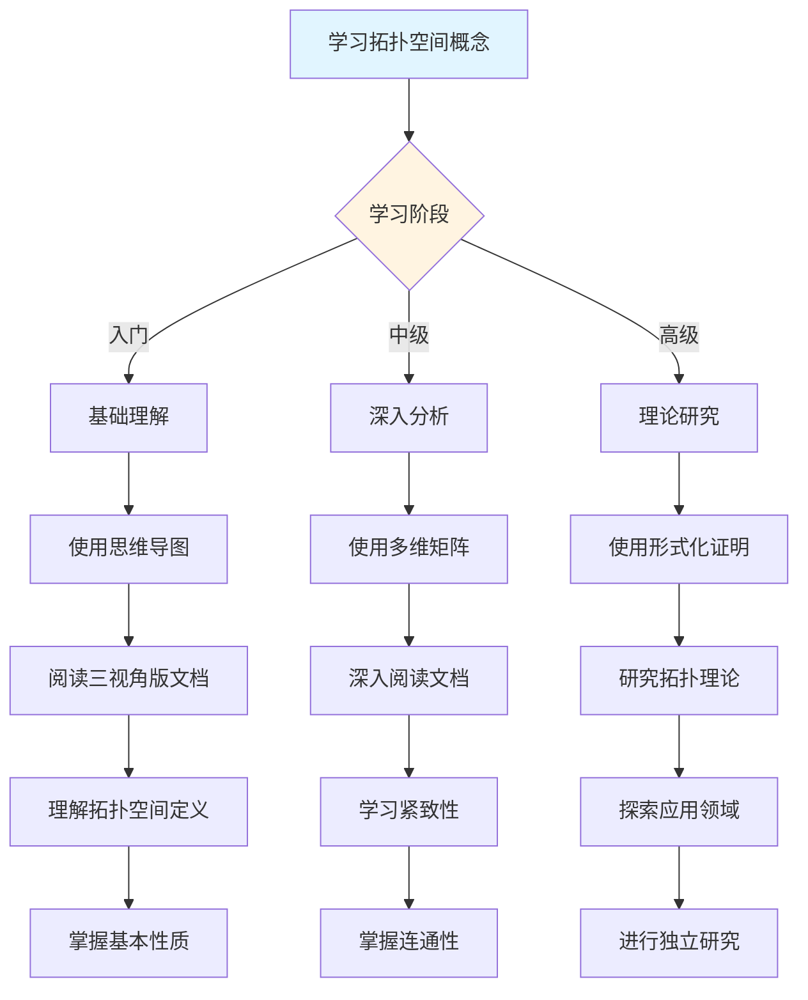
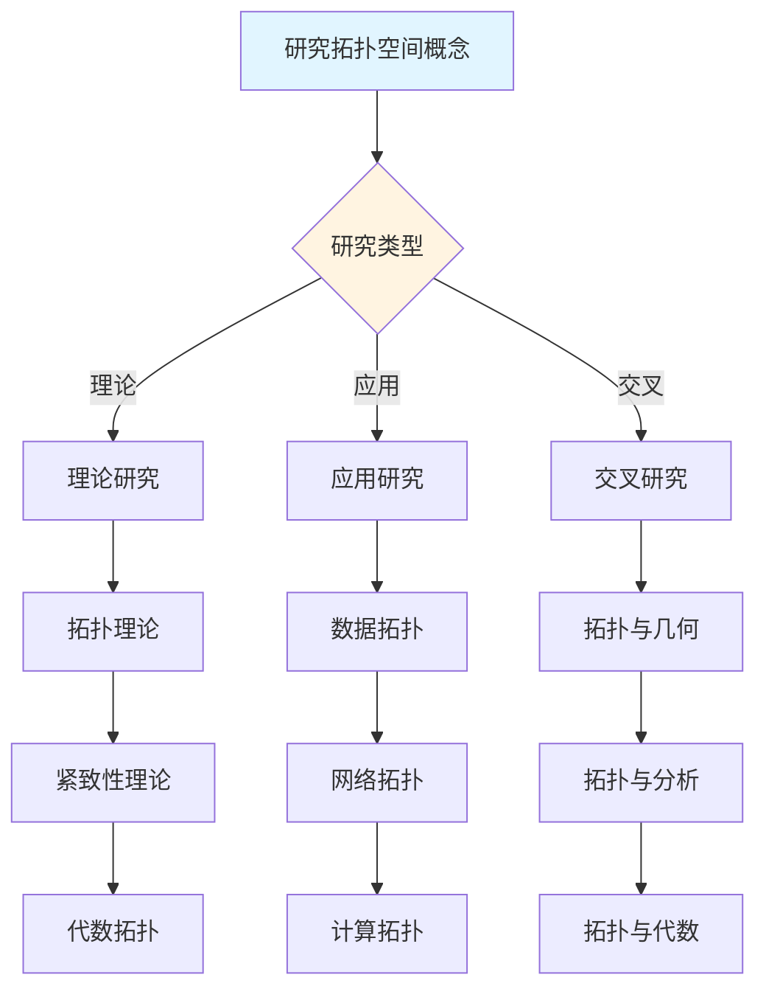
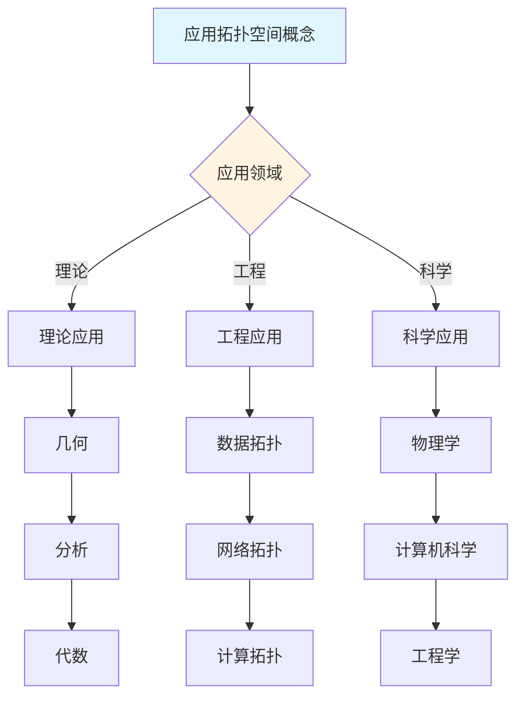
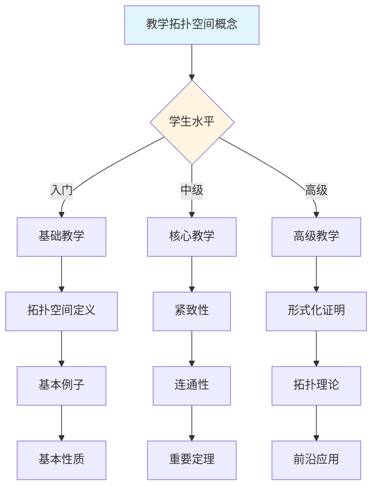

# 拓扑空间概念决策导图示例

**主题编号**: C.CORE.023.DECISION
**创建日期**: 2025年1月
**最后更新**: 2025年1月
**关联概念**: [拓扑空间-三视角版](./23-拓扑空间-三视角版.md)

---

## 📋 概述

本文档提供拓扑空间概念的详细决策导图示例，展示如何将[决策思维导图体系](../01-总体思维导图/05-决策思维导图体系.md)应用于拓扑空间概念的学习、研究、应用和教学。

**目标**：为拓扑空间概念提供完整的决策支持，包括：
- 学习决策导图
- 研究决策导图
- 应用决策导图
- 教学决策导图

---

## 🎓 一、学习决策导图 (编号: C.CORE.023.DECISION.01)

### 1.1 学习路径决策

### 1.2 学习重点决策

**基于知识矩阵的学习重点**：

| 学习阶段 | 知识层次 | 学习重点 | 推荐资源 |
|---------|---------|---------|---------|
| **入门** | L0基础 | 拓扑空间的定义、基本例子 | 思维导图、三视角版文档 |
| **入门** | L0基础 | 拓扑空间的直观理解（开集、邻域、连续） | 三视角版文档、应用实例 |
| **中级** | L1中级 | 紧致性和连通性 | 多维矩阵、形式化证明 |
| **中级** | L1中级 | Tychonoff定理 | 三视角版文档、习题库 |
| **高级** | L2高级 | 拓扑分类理论 | 形式化证明系统 |
| **高级** | L2高级 | 代数拓扑 | 形式化证明系统 |

### 1.3 学习方法决策

**基于认知维度的学习方法**：

1. **直观维度**（入门阶段）
   - 使用思维导图建立总体框架
   - 使用具体例子理解概念（欧氏空间、离散拓扑、平凡拓扑）
   - 使用几何直观理解拓扑空间

2. **知性维度**（中级阶段）
   - 使用多维矩阵分析概念特征
   - 使用概念分类系统理解（Hausdorff空间vs非Hausdorff空间、紧致空间vs非紧致空间）
   - 使用关系分析建立联系（与集合、度量空间、流形的关系）

3. **理性维度**（高级阶段）
   - 使用形式化证明严格理解
   - 使用逻辑推理深入分析
   - 使用系统建构整体把握

---

## 🔬 二、研究决策导图 (编号: C.CORE.023.DECISION.02)

### 2.1 研究方向决策

### 2.2 研究问题决策

**基于知识矩阵的研究问题**：

1. **理论研究问题**
   - 拓扑理论：拓扑空间的分类和性质
   - 紧致性理论：紧致性的判定和性质
   - 代数拓扑：拓扑空间的代数不变量

2. **应用研究问题**
   - 数据拓扑：拓扑在数据分析中的应用
   - 网络拓扑：拓扑在网络分析中的应用
   - 计算拓扑：拓扑在计算中的应用

3. **交叉研究问题**
   - 拓扑与几何：拓扑空间的几何性质
   - 拓扑与分析：拓扑在分析中的应用
   - 拓扑与代数：拓扑空间的代数结构

### 2.3 研究方法决策

**基于形式化证明的研究方法**：

1. **构造性证明** → 拓扑空间的构造
   - 直接构造拓扑空间
   - 适用于具体拓扑空间

2. **紧致性方法** → 紧致性判定
   - 使用紧致性方法
   - 适用于紧致性判定

3. **Tychonoff方法** → Tychonoff定理
   - 使用Tychonoff方法
   - 适用于乘积空间的紧致性

---

## 💼 三、应用决策导图 (编号: C.CORE.023.DECISION.03)

### 3.1 应用场景决策

### 3.2 应用方法决策

**基于应用场景的应用方法**：

1. **理论应用** → 使用形式化证明
   - 几何：拓扑空间是几何的基础
   - 分析：拓扑在分析中的应用
   - 代数：拓扑空间的代数结构

2. **工程应用** → 使用论证过程
   - 数据拓扑：拓扑在数据分析中的应用
   - 网络拓扑：拓扑在网络分析中的应用
   - 计算拓扑：拓扑在计算中的应用

3. **科学应用** → 使用综合方法
   - 物理学：拓扑在物理中的应用（相空间拓扑）
   - 计算机科学：拓扑在计算机科学中的应用（数据拓扑分析）
   - 工程学：拓扑在工程中的应用（网络拓扑分析）

---

## 🎓 四、教学决策导图 (编号: C.CORE.023.DECISION.04)

### 4.1 教学内容决策

### 4.2 教学方法决策

**基于认知维度的教学方法**：

1. **直观维度**（入门教学）
   - 使用思维导图建立框架
   - 使用具体例子（欧氏空间、离散拓扑、平凡拓扑）
   - 使用几何直观理解

2. **知性维度**（中级教学）
   - 使用多维矩阵深入分析
   - 使用概念分类系统
   - 使用关系分析建立联系

3. **理性维度**（高级教学）
   - 使用形式化证明严格理解
   - 使用逻辑推理深入分析
   - 使用系统建构整体把握

---

## 🔄 五、整合应用示例 (编号: C.CORE.023.DECISION.05)

### 5.1 完整学习流程示例

**阶段1：入门理解**
1. 使用学习决策导图 → 确定学习路径：基础概念 → 拓扑空间定义 → 基本性质 → 基本应用
2. 使用总体思维导图 → 了解拓扑空间在拓扑学中的位置
3. 阅读[拓扑空间-三视角版](./23-拓扑空间-三视角版.md) → 理解拓扑空间的定义和基本性质
4. 使用论证过程 → 理解拓扑空间的直观意义（开集、邻域、连续、接近）

**阶段2：深入分析**
1. 使用多维矩阵 → 分析拓扑空间的多维度特征（知识层次L1中级层、知识领域D5拓扑、学习难度中等偏难）
2. 阅读[拓扑空间-三视角版](./23-拓扑空间-三视角版.md) → 深入理解紧致性和连通性
3. 使用形式化证明 → 学习Tychonoff定理的形式化证明
4. 使用分支关联思维导图 → 了解拓扑空间与集合、度量空间、流形的关系

**阶段3：应用研究**
1. 使用研究决策导图 → 确定研究方向：拓扑理论
2. 使用知识关联网络 → 发现拓扑空间与几何、分析、代数的关系
3. 使用形式化证明系统 → 构建拓扑理论体系
4. 阅读[拓扑空间-三视角版](./23-拓扑空间-三视角版.md) → 了解拓扑空间的历史发展和开放问题

---

## 🔗 六、关联文档 (编号: C.CORE.023.DECISION.06)

### 6.1 核心概念文档

- [拓扑空间-三视角版](./23-拓扑空间-三视角版.md)
- [拓扑空间](./23-拓扑空间.md)

### 6.2 框架文档

- [决策思维导图体系](../01-总体思维导图/05-决策思维导图体系.md)
- [概念体系全面梳理与推进计划](../00-概念体系全面梳理与推进计划-2025年1月.md)
- [核心概念与新框架整合指南](../00-核心概念与新框架整合指南-2025年1月.md)

### 6.3 相关文档

- [核心概念索引](./00-核心概念索引.md)
- [知识矩阵总览](../02-知识矩阵/00-知识矩阵总览.md)
- [形式化证明系统](../00-形式化证明系统-2025年11月.md)

---

**创建日期**: 2025年1月
**最后更新**: 2025年1月
**维护状态**: 持续更新中
