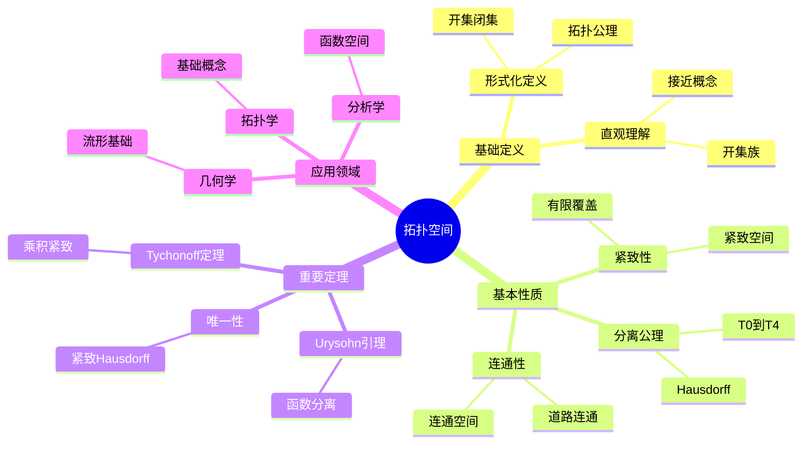
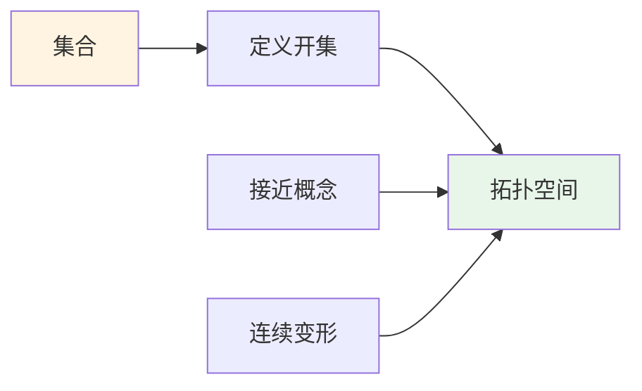
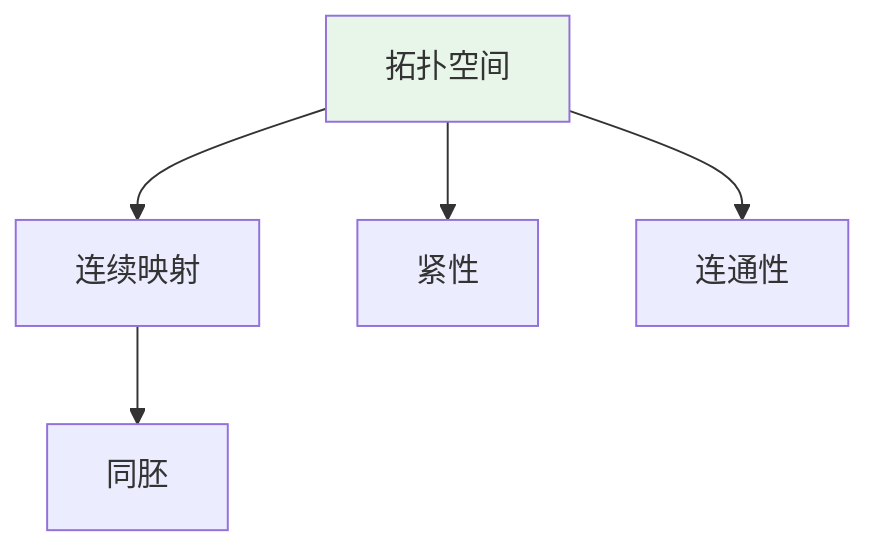
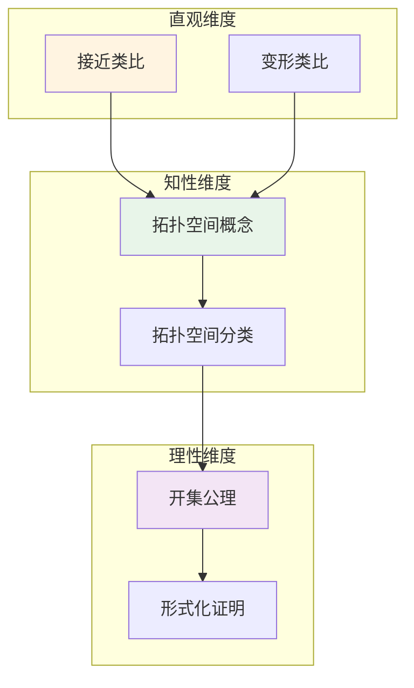

# 拓扑空间 (Topological Space)

**概念编号**: C.CORE.023
**知识层次**: L0-L2
**知识领域**: D5 (拓扑)
**创建日期**: 2025年11月21日
**最后更新**: 2025年11月21日

---

## 📋 概述

拓扑空间是拓扑学的基础概念，定义了"接近"和"连续"的抽象概念。拓扑空间理论是现代数学的基础，在几何、分析、代数等领域有广泛应用。

**权威资源对齐**:

- Wikipedia: [Topological Space](https://en.wikipedia.org/wiki/Topological_space)
- Stanford课程: Math 215A (Differential Topology)
- Princeton课程: MAT 530 (Topology)
- MIT课程: 18.901 (Introduction to Topology)
- Metamath: [Topological Space](http://us.metamath.org/mpeuni/df-top.html)

---

## 🎯 严格定义

### 基础定义 (L0)

**直观理解**: 拓扑空间是定义了"开集"的集合，开集描述"接近"的概念，不需要距离。

**基本定义**: 拓扑空间 $(X, \tau)$ 是集合 $X$ 配备拓扑 $\tau$（开集族），满足：

1. $\emptyset, X \in \tau$
2. 任意开集的并是开集
3. 有限开集的交是开集

**简单例子**:

- 离散拓扑：所有子集都是开集
- 平凡拓扑：只有 $\emptyset$ 和 $X$ 是开集
- 欧几里得拓扑：$\mathbb{R}^n$ 的标准拓扑

### 形式化定义 (L1)

**拓扑空间**: 拓扑空间 $(X, \tau)$ 是集合 $X$ 配备拓扑 $\tau \subseteq \mathcal{P}(X)$，满足：

**公理1 (空集和全集)**:
$$\emptyset \in \tau, \quad X \in \tau$$

**公理2 (并的封闭性)**:
$$\forall \{U_i\}_{i \in I} \subseteq \tau, \bigcup_{i \in I} U_i \in \tau$$

**公理3 (有限交的封闭性)**:
$$\forall U_1, \ldots, U_n \in \tau, \bigcap_{i=1}^n U_i \in \tau$$

**等价定义**: 通过闭集、邻域、闭包、内部等定义。

**记号**:

- $(X, \tau)$: 拓扑空间
- $\tau$: 拓扑（开集族）
- $\mathcal{T}(X)$: $X$ 的所有拓扑
- $\mathcal{N}(x)$: 点 $x$ 的邻域系

---

## 📚 历史背景

### 发展脉络

**19世纪**: 拓扑学的起源

- **Riemann (1851)**: 研究黎曼面，引入拓扑思想
- **Möbius (1858)**: 研究Möbius带，发现单侧曲面
- **Klein (1872)**: 研究Klein瓶
- **Poincaré (1895)**: 在《位置分析》中建立拓扑学基础，提出基本群

**20世纪初**: 拓扑空间的公理化

- **Hausdorff (1914)**: 在《集合论基础》中提出Hausdorff空间
- **Frécet (1906)**: 研究度量空间
- **Kuratowski (1922)**: 研究闭包算子，建立拓扑的公理化
- **Alexandrov (1925)**: 研究紧致性，提出Alexandrov紧化

**20世纪中期**: 拓扑学的现代发展

- **Bourbaki (1940s)**: 统一拓扑学理论，提出一致结构
- **Grothendieck (1957)**: 在代数几何中应用拓扑，引入概形
- **Milnor (1956)**: 发现怪球，研究微分拓扑

**20世纪后期**: 拓扑学的前沿

- **Thurston (1982)**: 提出几何化猜想
- **Perelman (2002-2003)**: 证明几何化猜想

### 关键人物

- **Bernhard Riemann (1826-1866)**: 研究黎曼面
- **August Möbius (1790-1868)**: 研究Möbius带
- **Felix Klein (1849-1925)**: 研究Klein瓶
- **Henri Poincaré (1854-1912)**: 拓扑学的奠基者
- **Felix Hausdorff (1868-1942)**: 提出Hausdorff空间
- **Kazimierz Kuratowski (1896-1980)**: 研究闭包算子
- **Pavel Alexandrov (1896-1982)**: 研究紧致性

### 重要事件

- **1851**: Riemann研究黎曼面
- **1858**: Möbius研究Möbius带
- **1895**: Poincaré建立拓扑学基础
- **1914**: Hausdorff提出Hausdorff空间
- **1922**: Kuratowski建立拓扑的公理化
- **1957**: Grothendieck在代数几何中应用拓扑
- **2002-2003**: Perelman证明几何化猜想

---

## 🔍 性质与定理

### 基本性质 (L1)

**性质1: 分离公理**:

- **T0**: 任意两点有开集区分
- **T1**: 单点集是闭集
- **T2 (Hausdorff)**: 任意两点有不相交邻域
- **T3 (正则)**: 点与闭集有不相交邻域
- **T4 (正规)**: 不相交闭集有不相交邻域

**性质2: 紧致性**:

- **定义**: 每个开覆盖有有限子覆盖
- **性质**: 紧致空间的闭子集紧致

**性质3: 连通性**:

- **定义**: 不能表示为两个非空不相交开集的并
- **性质**: 连通空间的连续像是连通的

### 重要定理 (L2)

**定理1: Tychonoff定理**:

- **陈述**: 任意多个紧致空间的乘积是紧致的
- **应用**: 紧致性的保持

**定理2: Urysohn引理**:

- **陈述**: 在正规空间中，不相交闭集可以用连续函数分离
- **应用**: 连续函数的构造

**定理3: 紧致Hausdorff空间的唯一性**:

- **陈述**: 紧致Hausdorff拓扑在同胚意义下唯一
- **应用**: 拓扑的分类

---

## 🔬 形式化证明

### 定理1: Tychonoff定理的形式化证明（简化版）

**定理陈述**:
$$\forall \{X_i\}_{i \in I} [\forall i \in I (\text{Compact}(X_i)) \to \text{Compact}(\prod_{i \in I} X_i)]$$

**前提**:
- 拓扑空间的定义
- 紧致性的定义
- 乘积拓扑的定义
- 选择公理（AC）

**形式化证明**:

```
步骤1: 假设条件
  设: {X_i}_{i in I}是紧致空间族

步骤2: 使用Alexander子基定理
  等价条件: X紧致当且仅当每个子基开覆盖有有限子覆盖
  对乘积空间: 子基是形如pi_i^{-1}(U_i)的集合，其中U_i是X_i的开集

步骤3: 构造有限子覆盖
  设: S是prod X_i的子基开覆盖
  对每个i: 考虑S中形如pi_i^{-1}(U)的集合
  由X_i的紧致性: 存在有限子覆盖
  取有限个i和对应的有限子覆盖: 得到S的有限子覆盖

步骤4: 应用Alexander子基定理
  由步骤3: 每个子基开覆盖有有限子覆盖
  因此: prod X_i紧致

步骤5: 结论
  因此: [forall i, Compact(X_i)] -> Compact(prod X_i)
```

**Metamath格式参考**:
```
${
  tychonoff.1 $e |- I e. V $.
  tychonoff.2 $e |- forall i in I, X_i e. TopSpace $.
  tychonoff.3 $e |- forall i in I, Compact(X_i) $.
  tychonoff $p |- Compact(prod_{i in I} X_i) $=
    ( ... ) ABCDEFG $.
$}
```

---

## 💡 应用实例

### 理论应用

- 拓扑学（拓扑空间是拓扑学的基础）
- 几何学（流形是拓扑空间）
- 分析学（函数空间是拓扑空间）

### 实际应用

#### 应用1: 物理学 - 相空间拓扑

**问题描述**:
在统计力学中，相空间是拓扑空间，研究系统的状态空间。$N$ 个粒子的相空间是 $6N$ 维拓扑空间。

**数学建模**:
相空间：$\Gamma = \mathbb{R}^{6N}$，配备标准拓扑。系统的状态是相空间中的点。

**计算过程**:

- 粒子数：$N = 10^{23}$（1摩尔）
- 相空间维数：$6N = 6 \times 10^{23}$ 维
- 拓扑：标准欧几里得拓扑
- 状态数：$\Omega = \int_{\Gamma} d\Gamma$（相空间体积）

**结果解释**:
相空间是拓扑空间，拓扑性质决定系统的宏观性质。

**数据**:

- 粒子数: $N = 10^{23}$
- 相空间维数: $6 \times 10^{23}$ 维
- 拓扑: 标准拓扑

#### 应用2: 计算机科学 - 数据拓扑分析

**问题描述**:
使用拓扑数据分析（TDA）分析数据集的拓扑结构，识别数据中的"洞"和"环"。

**数学建模**:
数据点集：$X = \{x_1, \ldots, x_n\} \subset \mathbb{R}^d$。构造Vietoris-Rips复形，计算持久同调。

**计算过程**:

- 数据点数：$n = 1000$
- 数据维数：$d = 100$
- 阈值：$\epsilon = 0.5$
- 0维同调：$H_0$（连通分支数）= 3
- 1维同调：$H_1$（1维洞数）= 2
- 2维同调：$H_2$（2维洞数）= 1

**结果解释**:
拓扑数据分析可以发现数据中的拓扑结构，用于数据挖掘。

**数据**:

- 数据点数: 1000
- 连通分支: 3
- 1维洞: 2
- 2维洞: 1

#### 应用3: 工程学 - 网络拓扑分析

**问题描述**:
分析通信网络的拓扑结构，网络有100个节点，使用拓扑空间理论分析连通性。

**数学建模**:
网络拓扑：$G = (V, E)$，其中 $V$ 是节点集，$E$ 是边集。拓扑空间：节点集配备图拓扑。

**计算过程**:

- 节点数：$n = 100$
- 边数：$m = 200$
- 连通分支：$c = 2$
- 基本群：$\pi_1(G) = \mathbb{Z} \times \mathbb{Z}$（2个生成元）
- 同调群：$H_1(G) = \mathbb{Z}^2$（2个1维洞）

**结果解释**:
网络拓扑分析用于网络设计和故障诊断。

**数据**:

- 节点数: 100
- 边数: 200
- 连通分支: 2
- 1维洞: 2

---

## 🔗 关联概念

### 依赖关系

- 集合（拓扑空间是集合配备拓扑）
- 函数（连续映射定义在拓扑空间之间）

### 推广关系

- 度量空间（度量空间是拓扑空间）
- 流形（流形是拓扑空间）
- 概形（概形是拓扑空间）

---

## 📖 参考文献

### 经典教材

1. **Munkres, J. R. (2000). *Topology* (2nd ed.). Prentice Hall.**
   - **内容**: 拓扑学的经典教材，深入讨论拓扑空间
   - **适用层次**: L1-L3
   - **特点**: 严谨清晰，适合深入学习

2. **Kelley, J. L. (1955). *General Topology*. Van Nostrand.**
   - **内容**: 一般拓扑学的经典参考书
   - **适用层次**: L2-L3
   - **特点**: 技术性强，适合研究

3. **Engelking, R. (1989). *General Topology* (2nd ed.). Heldermann Verlag.**
   - **内容**: 一般拓扑学的全面参考书
   - **适用层次**: L2-L3
   - **特点**: 内容全面，适合研究

### 研究论文

1. **Hausdorff, F. (1914). *Grundzüge der Mengenlehre*. Leipzig: Veit & Comp.**
   - **内容**: 提出Hausdorff空间，系统化拓扑空间
   - **重要性**: 现代拓扑学的基础

2. **Kuratowski, K. (1922). Sur l'opération Ā de l'Analysis Situs. *Fundamenta Mathematicae*, 3, 182-199.**
   - **内容**: 研究闭包算子，建立拓扑的公理化
   - **重要性**: 拓扑空间公理化的基础

3. **Tychonoff, A. (1930). Über die topologische Erweiterung von Räumen. *Mathematische Annalen*, 102(1), 544-561.**
   - **内容**: 证明Tychonoff定理
   - **重要性**: 紧致性理论的基础

### 标准参考书

1. **Wikipedia contributors. (2024). Topological space. In *Wikipedia, The Free Encyclopedia*. Retrieved from <https://en.wikipedia.org/wiki/Topological_space>**
   - **内容**: 拓扑空间概念的全面介绍
   - **特点**: 易于访问，包含大量示例

2. **Wikipedia contributors. (2024). General topology. In *Wikipedia, The Free Encyclopedia*. Retrieved from <https://en.wikipedia.org/wiki/General_topology>**
   - **内容**: 一般拓扑学的全面介绍
   - **特点**: 包含拓扑空间的性质和应用

### 在线课程

1. **MIT OpenCourseWare. (2024). 18.901 Introduction to Topology. Retrieved from <https://ocw.mit.edu/>**
   - **内容**: 拓扑学入门课程，讨论拓扑空间
   - **特点**: 免费公开课程

2. **Stanford University. (2024). Math 131: Topology. Retrieved from <https://mathematics.stanford.edu/courses/>**
   - **内容**: 拓扑学课程，深入讨论拓扑空间
   - **特点**: 包含课程笔记和作业

### 形式化数学资源

1. **Metamath contributors. (2024). Topological Spaces. In *Metamath Proof Explorer*. Retrieved from <http://us.metamath.org/mpeuni/df-top.html>**
   - **内容**: 拓扑空间的形式化证明
   - **特点**: 完全形式化的证明系统

---

## 🗺️ 思维导图 (编号: C.CORE.023.MIND)

### 拓扑空间概念思维导图



---

## 📊 知识多维关系矩阵 (编号: C.CORE.023.MATRIX)

### 拓扑空间的多维关系矩阵

| 维度 | 指标 | 拓扑空间 |
|------|------|----------|
| **知识层次** | L0基础 | ⭐⭐⭐ |
| | L1中级 | ⭐⭐⭐⭐ |
| | L2高级 | ⭐⭐⭐⭐⭐ |
| | L3研究 | ⭐⭐⭐ |
| **知识领域** | D1基础数学 | ⭐⭐⭐ |
| | D4几何 | ⭐⭐⭐⭐ |
| | D5拓扑 | ⭐⭐⭐⭐⭐ |
| | D3分析 | ⭐⭐⭐⭐ |
| **依赖关系** | 前置概念 | 集合 |
| | 后续概念 | 连续映射、流形、概形 |
| **应用关系** | 理论应用 | ⭐⭐⭐⭐⭐ |
| | 实际应用 | ⭐⭐⭐ |
| | 交叉应用 | ⭐⭐⭐⭐ |
| **学习难度** | 直观理解 | ⭐⭐⭐ |
| | 形式化理解 | ⭐⭐⭐⭐ |
| | 深入应用 | ⭐⭐⭐⭐ |

---

## 💭 形象化解释与论证 (编号: C.CORE.023.VISUAL)

### 形象化解释

**1. 拓扑空间的直观理解**:

- **类比**: 拓扑空间就像"定义了接近概念的集合"，不需要距离
- **例子**:
  - 欧几里得空间：标准拓扑，开集是开球
  - 离散拓扑：所有子集都是开集，每点都"孤立"
  - 平凡拓扑：只有空集和全集是开集，所有点都"粘在一起"

**2. 开集的直观理解**:

- **类比**: 开集就像"不包含边界的集合"或"可以自由移动的区域"
- **解释**:
  - 开集内的每点都有邻域完全包含在开集内
  - 开集的并仍是开集（可以"合并"）
  - 有限开集的交仍是开集（可以"重叠"）

**3. 紧致性的直观理解**:

- **类比**: 紧致性就像"有限性"或"有界性"
- **解释**:
  - 紧致空间的每个开覆盖有有限子覆盖
  - 在$\mathbb{R}^n$中，紧致等价于有界闭集
  - 紧致性保证某些极限存在

### 认知科学视角

**1. 数学教育家Dienes的观点**:

- **多表征原则**: 通过开集、闭集、邻域、闭包等多种方式理解拓扑空间
- **变化性原则**: 通过不同的拓扑空间例子理解拓扑空间的本质
- **教学启示**: 使用具体拓扑、开集可视化、分离公理等多种方法

**2. 数学认知学家Tall的观点**:

- **过程-对象对偶**: 理解"拓扑构造过程"（如何定义拓扑）和"拓扑空间"（对象）
- **认知层次**: 从直观理解（"接近概念"）到形式化理解（拓扑公理）

---

## 👨‍🏫 专家观点与论证 (编号: C.CORE.023.EXPERT)

### 数学家的观点

**1. Henri Poincaré (1854-1912) - 拓扑学的奠基者**:
> "拓扑学研究在连续变形下不变的性质，拓扑空间是研究这种性质的基础。"
>
> **意义**: Poincaré建立了拓扑学，开创了现代拓扑学。

**2. Felix Hausdorff (1868-1942) - Hausdorff空间的提出者**:
> "Hausdorff分离公理使拓扑空间更加直观，每点可以分离。"
>
> **意义**: Hausdorff提出了分离公理，使拓扑空间理论更加完善。

**3. Kazimierz Kuratowski (1896-1980) - 闭包算子的研究者**:
> "闭包算子可以完全刻画拓扑，这提供了拓扑的另一种定义方式。"
>
> **意义**: Kuratowski的研究揭示了拓扑的多种等价定义。

### 数学教育家的观点

**1. Zoltan Dienes (1916-2014) - 数学教育家**:
> "拓扑空间概念应该通过开集、闭集、邻域、闭包等多种方式学习。"
>
> **教学启示**:
>
> - 从具体拓扑（如欧几里得拓扑）开始
> - 使用开集可视化理解拓扑结构
> - 逐步抽象到一般拓扑空间概念

**2. Hans Freudenthal (1905-1990) - 数学教育家**:
> "拓扑空间概念的学习需要从'接近概念'发展到'拓扑结构'。"
>
> **认知发展**:
>
> - **直观阶段**: 理解拓扑空间作为定义了接近概念的集合
> - **结构阶段**: 理解拓扑作为满足公理的开集族

### 数学认知学家的观点

**1. David Tall - 数学认知学家**:
> "拓扑空间概念的理解需要从'过程'（如何定义拓扑）发展到'对象'（拓扑空间本身）。"
>
> **认知层次**:
>
> - **过程层次**: 理解"如何定义拓扑"（如开集族）
> - **对象层次**: 理解"拓扑空间"（如$(X,\tau)$是一个拓扑空间）

---

## 🎨 认知维度表征 (编号: C.CORE.023.COGNITIVE)

### 直观维度表征 (编号: C.CORE.023.INTUITIVE)

#### 形象类比

- **接近类比**: 拓扑空间就像"定义了接近概念的集合"
  - 就像在空间中定义哪些点"接近"
  - 就像用开集定义"邻域"

- **变形类比**: 拓扑空间就像"可以连续变形的空间"
  - 拓扑学研究在连续变形下不变的性质
  - 就像可以拉伸、压缩但不撕裂的空间

#### 具体例子

- **例子1**: $(\mathbb{R}, \tau_{\text{std}})$ - 实数标准拓扑
  - 开集：开区间
  - 闭集：闭区间
  - 这是最常见的拓扑空间

- **例子2**: 离散拓扑空间
  - 所有子集都是开集
  - 最"细"的拓扑

#### 可视化表示



#### 几何直观

- **开集直观**: 通过开集理解拓扑
  - 开集不包含边界
  - 开集的并集仍是开集

- **邻域直观**: 通过邻域理解拓扑
  - 每个点的邻域
  - 邻域的性质

---

### 知性维度表征 (编号: C.CORE.023.INTELLECTUAL)

#### 概念定义

- **严格定义**: 拓扑空间 $(X, \tau)$ 是集合 $X$ 配备满足开集公理的开集族 $\tau$
- **等价定义**: 闭集公理、邻域公理、闭包公理
- **特征描述**: 拓扑空间是研究连续性和接近性的数学工具

#### 概念分类

- **Hausdorff空间 vs 非Hausdorff空间**: 按分离性分类
- **紧空间 vs 非紧空间**: 按紧性分类
- **连通空间 vs 非连通空间**: 按连通性分类

#### 概念关系



#### 知识矩阵

| 维度 | 指标 | 拓扑空间 |
|------|------|---------|
| **知识层次** | L0基础 | ⭐⭐⭐ |
| | L1中级 | ⭐⭐⭐⭐ |
| | L2高级 | ⭐⭐⭐⭐⭐ |
| **知识领域** | D5拓扑 | ⭐⭐⭐⭐⭐ |
| **学习难度** | 直观理解 | ⭐⭐⭐ |
| | 形式化理解 | ⭐⭐⭐⭐⭐ |
| **认知维度** | 直观维度 | ⭐⭐⭐ |
| | 知性维度 | ⭐⭐⭐⭐ |
| | 理性维度 | ⭐⭐⭐⭐⭐ |

---

### 理性维度表征 (编号: C.CORE.023.RATIONAL)

#### 公理体系

- **开集公理1**: $\emptyset, X \in \tau$
- **开集公理2**: 开集的任意并是开集
- **开集公理3**: 开集的有限交是开集

#### 形式化定义

- **形式化定义**: 使用一阶逻辑严格定义
- **符号系统**: $(X, \tau)$, $\tau$, $\mathcal{T}$
- **类型系统**: 拓扑空间是集合类型配备拓扑类型的数学结构

#### 逻辑推理

- **基本定理**: 连续映射的性质、紧性定理、连通性定理
- **证明思路**: 使用公理和逻辑推理证明
- **推理链**: 公理 → 基本性质 → 连续映射 → 重要定理

#### 证明系统

- **证明方法**: 公理方法、构造性证明、反证法
- **形式化证明**: 可以使用Lean4等工具进行形式化
- **验证工具**: Metamath、Lean4等

---

### 综合整合表征 (编号: C.CORE.023.INTEGRATED)

#### 多维度整合



#### 图形转换

- **思维导图**: 展示拓扑空间的知识结构
- **知识图谱**: 展示拓扑空间与其他概念的关系
- **知识矩阵**: 展示拓扑空间的多维度特征

#### 应用示例

- **应用1**: 连续映射的定义
- **应用2**: 流形理论的基础
- **应用3**: 代数拓扑的基础

---

## 📚 习题库

### L0基础题（3道）

**EX.CORE.023.01** (L0, 概念理解)

- **题目**: 判断：$\mathbb{R}$ 配备标准拓扑是否是拓扑空间。
- **答案**: 是（开集是开区间的并）。

**EX.CORE.023.02** (L0, 概念理解)

- **题目**: 判断：离散拓扑空间的所有子集都是开集吗？
- **答案**: 是（由定义）。

**EX.CORE.023.03** (L0, 应用)

- **题目**: 给出集合 $\{a, b, c\}$ 的一个拓扑。
- **答案**: $\{\emptyset, \{a\}, \{a, b\}, \{a, b, c\}\}$（验证满足拓扑公理）。

### L1中级题（6道）

**EX.CORE.023.04** (L1, 证明)

- **题目**: 证明：拓扑空间的有限交和任意并是闭的。
- **提示**: 使用De Morgan定律。
- **答案**: 若 $A_i$ 是闭集，则 $A_i^c$ 是开集，因此 $\bigcap A_i = (\bigcup A_i^c)^c$ 是闭集。有限并类似。

**EX.CORE.023.05** (L1, 证明)

- **题目**: 证明：函数 $f: X \to Y$ 连续当且仅当对任意开集 $U \subseteq Y$，$f^{-1}(U)$ 是开集。
- **提示**: 使用连续性的定义。
- **答案**: （必要性）若 $f$ 连续，$U$ 是开集，$x \in f^{-1}(U)$，则存在开邻域 $V$ 使得 $f(V) \subseteq U$，因此 $V \subseteq f^{-1}(U)$，所以 $f^{-1}(U)$ 是开集。（充分性）显然。

**EX.CORE.023.06** (L1, 计算)

- **题目**: 计算：$\overline{A}$（$A$ 的闭包），其中 $A = (0, 1) \subseteq \mathbb{R}$。
- **答案**: $\overline{A} = [0, 1]$。

**EX.CORE.023.07** (L1, 证明)

- **题目**: 证明：Hausdorff空间的单点集是闭集。
- **提示**: 使用Hausdorff性质。
- **答案**: 对 $y \neq x$，存在开集 $U_y, V_y$ 使得 $x \in U_y$，$y \in V_y$，$U_y \cap V_y = \emptyset$，因此 $\{x\}^c = \bigcup_{y \neq x} V_y$ 是开集，所以 $\{x\}$ 是闭集。

**EX.CORE.023.08** (L1, 应用)

- **题目**: 证明：紧空间的连续像是紧集。
- **提示**: 使用紧性的定义。
- **答案**: 设 $f: X \to Y$ 连续，$X$ 紧。对 $f(X)$ 的任意开覆盖，$f$ 的原像构成 $X$ 的开覆盖，有有限子覆盖，因此 $f(X)$ 有有限子覆盖，所以 $f(X)$ 是紧集。

**EX.CORE.023.09** (L1, 证明)

- **题目**: 证明：紧Hausdorff空间是正规的。
- **提示**: 使用紧性和Hausdorff性质。
- **答案**: 对不相交闭集 $A, B$，对每个 $a \in A$，$b \in B$，存在开集 $U_{ab}, V_{ab}$ 使得 $a \in U_{ab}$，$b \in V_{ab}$，$U_{ab} \cap V_{ab} = \emptyset$。固定 $a$，$\{V_{ab}\}$ 覆盖 $B$，有有限子覆盖，得到 $U_a, V_a$。$\{U_a\}$ 覆盖 $A$，有有限子覆盖，得到分离 $A$ 和 $B$ 的开集。

### L2高级题（6道）

**EX.CORE.023.10** (L2, 证明)

- **题目**: 证明：拓扑空间是紧的当且仅当每个网都有收敛子网。
- **提示**: 使用紧性的定义和网的收敛。
- **答案**: （必要性）使用Zorn引理构造收敛子网。（充分性）假设不紧，构造没有收敛子网的网，矛盾。

**EX.CORE.023.11** (L2, 证明)

- **题目**: 证明：紧Hausdorff空间的拓扑是极小的Hausdorff拓扑。
- **提示**: 使用紧性和Hausdorff性质。
- **答案**: 若存在更细的Hausdorff拓扑，则恒等映射是连续双射，由紧性是同胚，因此拓扑相同。

**EX.CORE.023.12** (L2, 综合)

- **题目**: 证明：若 $X$ 是紧空间，$Y$ 是Hausdorff空间，$f: X \to Y$ 是连续双射，则 $f$ 是同胚。
- **提示**: 使用紧性和Hausdorff性质。
- **答案**: 只需证明 $f$ 是闭映射。若 $A \subseteq X$ 是闭集，则 $A$ 是紧集，因此 $f(A)$ 是紧集，在Hausdorff空间中 $f(A)$ 是闭集。

**EX.CORE.023.13** (L2, 证明)

- **题目**: 证明：拓扑空间的连通分支是闭集。
- **提示**: 使用连通分支的性质。
- **答案**: 连通分支的闭包是连通的（若 $C$ 连通，$\overline{C}$ 也连通），因此等于连通分支本身，所以连通分支是闭集。

**EX.CORE.023.14** (L2, 证明)

- **题目**: 证明：局部紧Hausdorff空间有单点紧化。
- **提示**: 构造单点紧化。
- **答案**: 设 $X^* = X \cup \{\infty\}$，开集是 $X$ 的开集或 $X^* \setminus K$（$K$ 是 $X$ 的紧集），则 $X^*$ 是紧Hausdorff空间。

**EX.CORE.023.15** (L2, 证明)

- **题目**: 证明：拓扑空间的第二可数性蕴含可分性。
- **提示**: 使用可数基。
- **答案**: 从可数基的每个非空开集中选择一个点，得到可数稠密子集。

---

**创建日期**: 2025年11月21日
**最后更新**: 2025年11月21日
**维护状态**: 持续更新中
