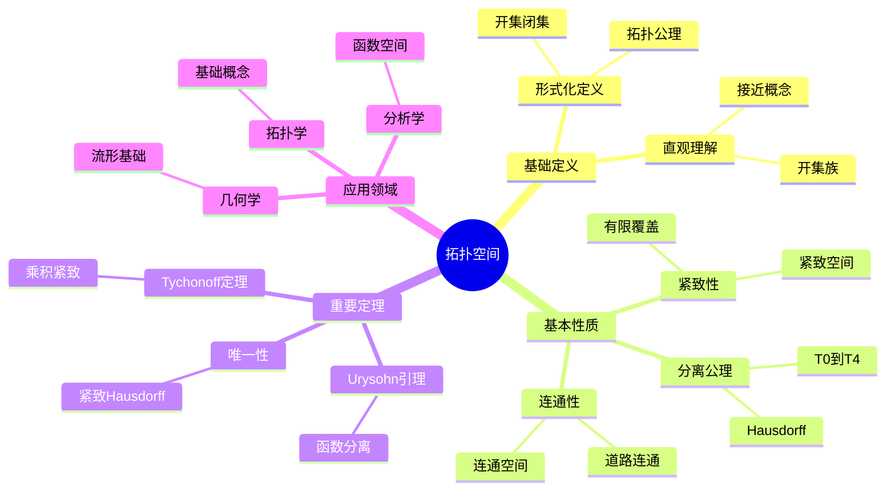

# 拓扑空间 (Topological Space)

**概念编号**: C.CORE.023
**知识层次**: L0-L2
**知识领域**: D5 (拓扑)
**创建日期**: 2025年11月21日
**最后更新**: 2025年11月21日

---

## 📋 概述

拓扑空间是拓扑学的基础概念，定义了"接近"和"连续"的抽象概念。拓扑空间理论是现代数学的基础，在几何、分析、代数等领域有广泛应用。

**权威资源对齐**:

- Wikipedia: [Topological Space](https://en.wikipedia.org/wiki/Topological_space)
- Stanford课程: Math 215A (Differential Topology)
- Princeton课程: MAT 530 (Topology)
- MIT课程: 18.901 (Introduction to Topology)
- Metamath: [Topological Space](http://us.metamath.org/mpeuni/df-top.html)

---

## 🎯 严格定义

### 基础定义 (L0)

**直观理解**: 拓扑空间是定义了"开集"的集合，开集描述"接近"的概念，不需要距离。

**基本定义**: 拓扑空间 $(X, \tau)$ 是集合 $X$ 配备拓扑 $\tau$（开集族），满足：

1. $\emptyset, X \in \tau$
2. 任意开集的并是开集
3. 有限开集的交是开集

**简单例子**:

- 离散拓扑：所有子集都是开集
- 平凡拓扑：只有 $\emptyset$ 和 $X$ 是开集
- 欧几里得拓扑：$\mathbb{R}^n$ 的标准拓扑

### 形式化定义 (L1)

**拓扑空间**: 拓扑空间 $(X, \tau)$ 是集合 $X$ 配备拓扑 $\tau \subseteq \mathcal{P}(X)$，满足：

**公理1 (空集和全集)**:
$$\emptyset \in \tau, \quad X \in \tau$$

**公理2 (并的封闭性)**:
$$\forall \{U_i\}_{i \in I} \subseteq \tau, \bigcup_{i \in I} U_i \in \tau$$

**公理3 (有限交的封闭性)**:
$$\forall U_1, \ldots, U_n \in \tau, \bigcap_{i=1}^n U_i \in \tau$$

**等价定义**: 通过闭集、邻域、闭包、内部等定义。

**记号**:

- $(X, \tau)$: 拓扑空间
- $\tau$: 拓扑（开集族）
- $\mathcal{T}(X)$: $X$ 的所有拓扑
- $\mathcal{N}(x)$: 点 $x$ 的邻域系

---

## 📚 历史背景

### 发展脉络

**19世纪**: 拓扑学的起源

- **Riemann (1851)**: 研究黎曼面
- **Poincaré (1895)**: 建立拓扑学基础

**20世纪初**: 拓扑空间的公理化

- **Hausdorff (1914)**: 提出Hausdorff空间
- **Kuratowski (1922)**: 研究闭包算子
- **Alexandrov (1925)**: 研究紧致性

**20世纪中期**: 拓扑学的现代发展

- **Bourbaki (1940s)**: 统一拓扑学理论
- **Grothendieck (1957)**: 在代数几何中应用拓扑

### 关键人物

- **Henri Poincaré (1854-1912)**: 拓扑学的奠基者
- **Felix Hausdorff (1868-1942)**: 提出Hausdorff空间
- **Kazimierz Kuratowski (1896-1980)**: 研究闭包算子

---

## 🔍 性质与定理

### 基本性质 (L1)

**性质1: 分离公理**:

- **T0**: 任意两点有开集区分
- **T1**: 单点集是闭集
- **T2 (Hausdorff)**: 任意两点有不相交邻域
- **T3 (正则)**: 点与闭集有不相交邻域
- **T4 (正规)**: 不相交闭集有不相交邻域

**性质2: 紧致性**:

- **定义**: 每个开覆盖有有限子覆盖
- **性质**: 紧致空间的闭子集紧致

**性质3: 连通性**:

- **定义**: 不能表示为两个非空不相交开集的并
- **性质**: 连通空间的连续像是连通的

### 重要定理 (L2)

**定理1: Tychonoff定理**:

- **陈述**: 任意多个紧致空间的乘积是紧致的
- **应用**: 紧致性的保持

**定理2: Urysohn引理**:

- **陈述**: 在正规空间中，不相交闭集可以用连续函数分离
- **应用**: 连续函数的构造

**定理3: 紧致Hausdorff空间的唯一性**:

- **陈述**: 紧致Hausdorff拓扑在同胚意义下唯一
- **应用**: 拓扑的分类

---

## 💡 应用实例

### 理论应用

- 拓扑学（拓扑空间是拓扑学的基础）
- 几何学（流形是拓扑空间）
- 分析学（函数空间是拓扑空间）

### 实际应用

- 物理学（相空间、状态空间）
- 计算机科学（数据拓扑）
- 工程学（网络拓扑）

---

## 🔗 关联概念

### 依赖关系

- 集合（拓扑空间是集合配备拓扑）
- 函数（连续映射定义在拓扑空间之间）

### 推广关系

- 度量空间（度量空间是拓扑空间）
- 流形（流形是拓扑空间）
- 概形（概形是拓扑空间）

---

## 📖 参考文献

- Wikipedia: [Topological Space](https://en.wikipedia.org/wiki/Topological_space)
- Munkres, J. R. (2000). *Topology*. Prentice Hall.
- Kelley, J. L. (1955). *General Topology*. Van Nostrand.

---

## 🗺️ 思维导图 (编号: C.CORE.023.MIND)

### 拓扑空间概念思维导图

---

## 📊 知识多维关系矩阵 (编号: C.CORE.023.MATRIX)

### 拓扑空间的多维关系矩阵

| 维度 | 指标 | 拓扑空间 |
|------|------|----------|
| **知识层次** | L0基础 | ⭐⭐⭐ |
| | L1中级 | ⭐⭐⭐⭐ |
| | L2高级 | ⭐⭐⭐⭐⭐ |
| | L3研究 | ⭐⭐⭐ |
| **知识领域** | D1基础数学 | ⭐⭐⭐ |
| | D4几何 | ⭐⭐⭐⭐ |
| | D5拓扑 | ⭐⭐⭐⭐⭐ |
| | D3分析 | ⭐⭐⭐⭐ |
| **依赖关系** | 前置概念 | 集合 |
| | 后续概念 | 连续映射、流形、概形 |
| **应用关系** | 理论应用 | ⭐⭐⭐⭐⭐ |
| | 实际应用 | ⭐⭐⭐ |
| | 交叉应用 | ⭐⭐⭐⭐ |
| **学习难度** | 直观理解 | ⭐⭐⭐ |
| | 形式化理解 | ⭐⭐⭐⭐ |
| | 深入应用 | ⭐⭐⭐⭐ |

---

## 💭 形象化解释与论证 (编号: C.CORE.023.VISUAL)

### 形象化解释

**1. 拓扑空间的直观理解**:

- **类比**: 拓扑空间就像"定义了接近概念的集合"，不需要距离
- **例子**:
  - 欧几里得空间：标准拓扑，开集是开球
  - 离散拓扑：所有子集都是开集，每点都"孤立"
  - 平凡拓扑：只有空集和全集是开集，所有点都"粘在一起"

**2. 开集的直观理解**:

- **类比**: 开集就像"不包含边界的集合"或"可以自由移动的区域"
- **解释**:
  - 开集内的每点都有邻域完全包含在开集内
  - 开集的并仍是开集（可以"合并"）
  - 有限开集的交仍是开集（可以"重叠"）

**3. 紧致性的直观理解**:

- **类比**: 紧致性就像"有限性"或"有界性"
- **解释**:
  - 紧致空间的每个开覆盖有有限子覆盖
  - 在$\mathbb{R}^n$中，紧致等价于有界闭集
  - 紧致性保证某些极限存在

### 认知科学视角

**1. 数学教育家Dienes的观点**:

- **多表征原则**: 通过开集、闭集、邻域、闭包等多种方式理解拓扑空间
- **变化性原则**: 通过不同的拓扑空间例子理解拓扑空间的本质
- **教学启示**: 使用具体拓扑、开集可视化、分离公理等多种方法

**2. 数学认知学家Tall的观点**:

- **过程-对象对偶**: 理解"拓扑构造过程"（如何定义拓扑）和"拓扑空间"（对象）
- **认知层次**: 从直观理解（"接近概念"）到形式化理解（拓扑公理）

---

## 👨‍🏫 专家观点与论证 (编号: C.CORE.023.EXPERT)

### 数学家的观点

**1. Henri Poincaré (1854-1912) - 拓扑学的奠基者**:
> "拓扑学研究在连续变形下不变的性质，拓扑空间是研究这种性质的基础。"
>
> **意义**: Poincaré建立了拓扑学，开创了现代拓扑学。

**2. Felix Hausdorff (1868-1942) - Hausdorff空间的提出者**:
> "Hausdorff分离公理使拓扑空间更加直观，每点可以分离。"
>
> **意义**: Hausdorff提出了分离公理，使拓扑空间理论更加完善。

**3. Kazimierz Kuratowski (1896-1980) - 闭包算子的研究者**:
> "闭包算子可以完全刻画拓扑，这提供了拓扑的另一种定义方式。"
>
> **意义**: Kuratowski的研究揭示了拓扑的多种等价定义。

### 数学教育家的观点

**1. Zoltan Dienes (1916-2014) - 数学教育家**:
> "拓扑空间概念应该通过开集、闭集、邻域、闭包等多种方式学习。"
>
> **教学启示**:
>
> - 从具体拓扑（如欧几里得拓扑）开始
> - 使用开集可视化理解拓扑结构
> - 逐步抽象到一般拓扑空间概念

**2. Hans Freudenthal (1905-1990) - 数学教育家**:
> "拓扑空间概念的学习需要从'接近概念'发展到'拓扑结构'。"
>
> **认知发展**:
>
> - **直观阶段**: 理解拓扑空间作为定义了接近概念的集合
> - **结构阶段**: 理解拓扑作为满足公理的开集族

### 数学认知学家的观点

**1. David Tall - 数学认知学家**:
> "拓扑空间概念的理解需要从'过程'（如何定义拓扑）发展到'对象'（拓扑空间本身）。"
>
> **认知层次**:
>
> - **过程层次**: 理解"如何定义拓扑"（如开集族）
> - **对象层次**: 理解"拓扑空间"（如$(X,\tau)$是一个拓扑空间）

---

**创建日期**: 2025年11月21日
**最后更新**: 2025年11月21日
**维护状态**: 持续更新中
