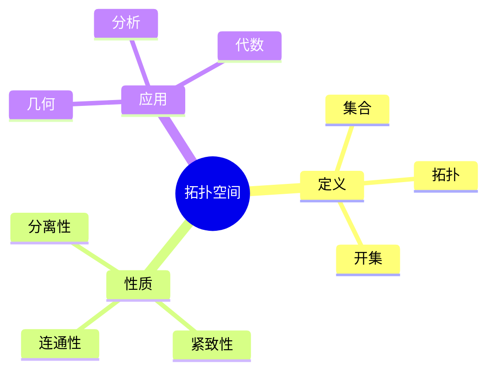
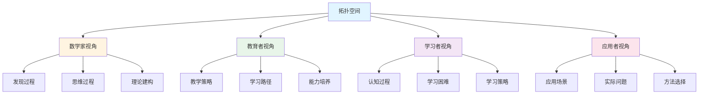
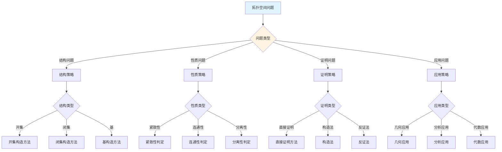
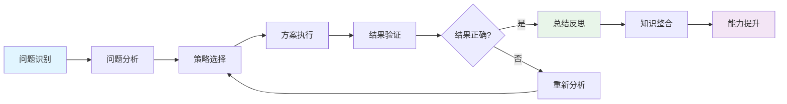
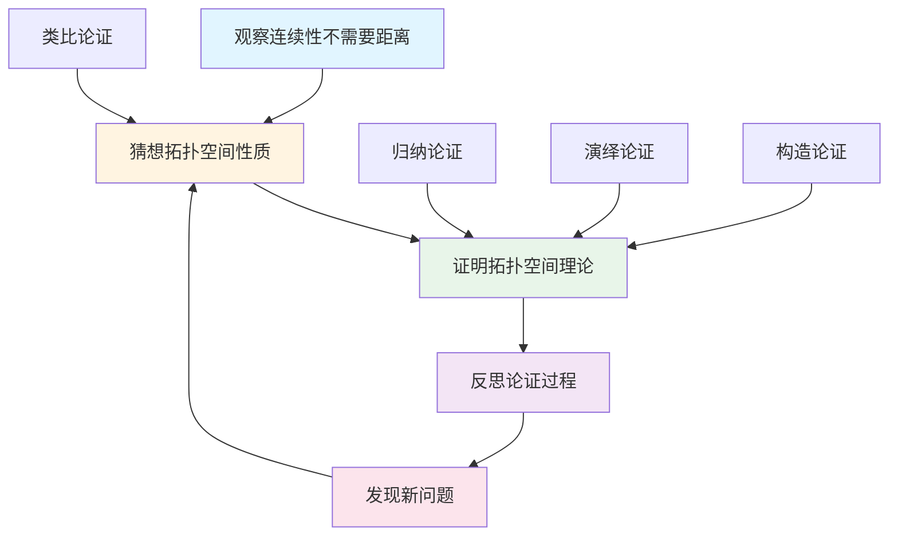
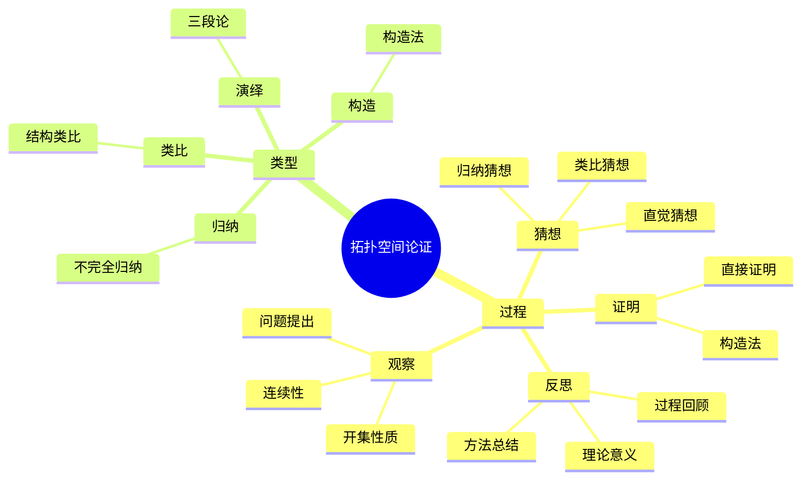
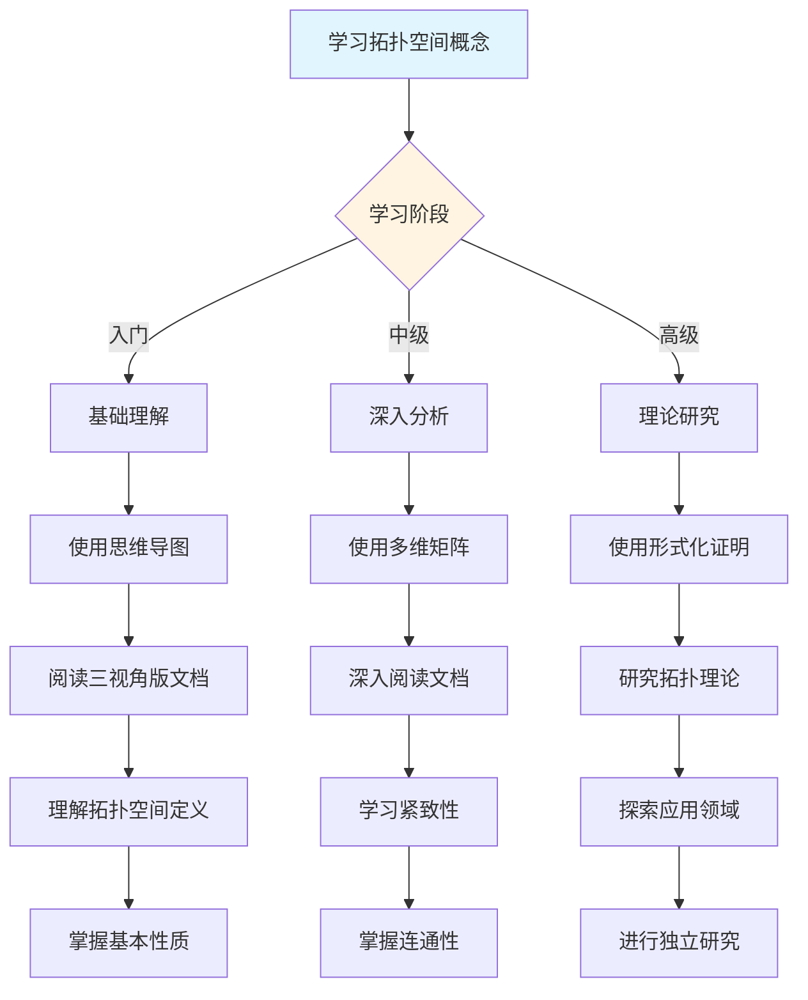
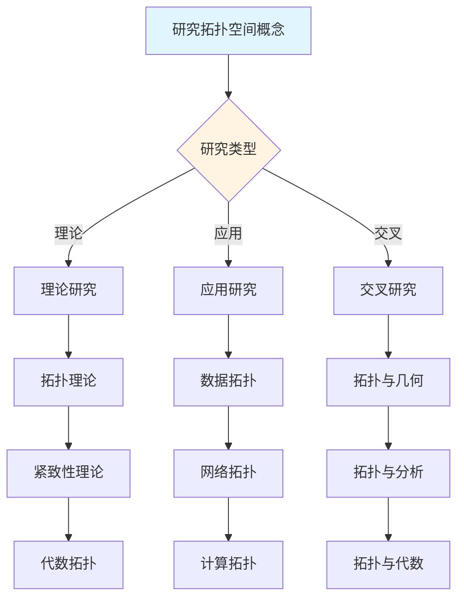
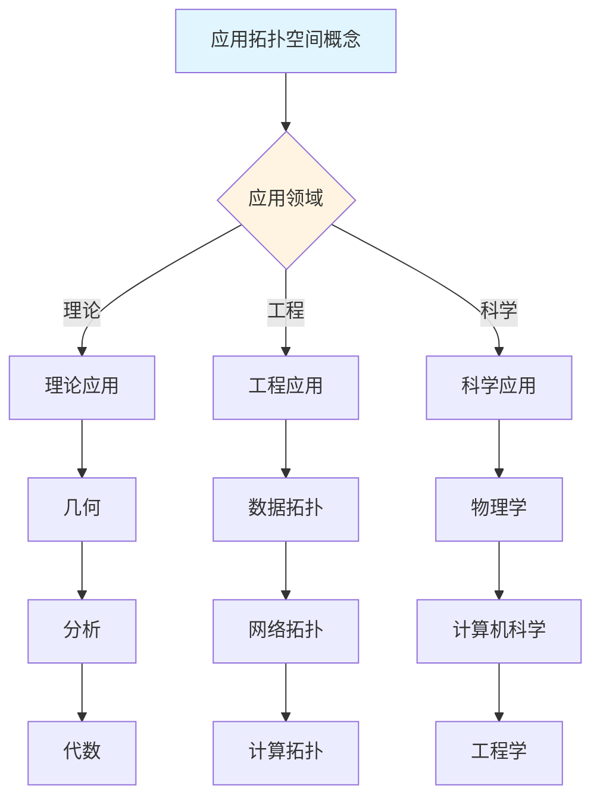
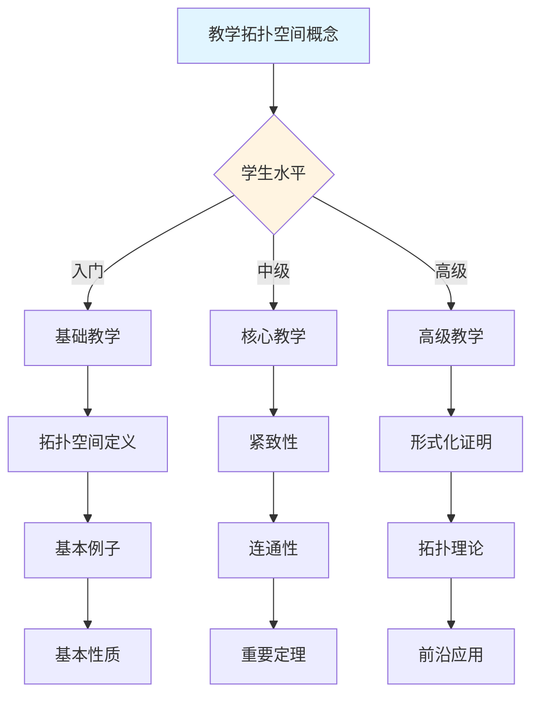

---
msc_primary: "00A99"
---

# 拓扑空间 (Topological Space) - 三视角组织版

**概念编号**: C.CORE.023
**知识层次**: L0-L2
**知识领域**: D5 (拓扑)
**创建日期**: 2025年1月
**最后更新**: 2026-04-05

---

## 📋 目录 / Table of Contents

- [拓扑空间 (Topological Space) - 三视角组织版](#拓扑空间-topological-space---三视角组织版)
  - 📋 目录 / Table of Contents
  - 1. 📋 概述 (编号: C.CORE.023.01)
  - [🧠 认知学视角：如何理解拓扑空间 (编号: C.CORE.023.02)](#认知学视角如何理解拓扑空间-编号-ccore02302)
    - [认知起点 (编号: C.CORE.023.02.01)](#认知起点-编号-ccore0230201)
    - [认知过程 (编号: C.CORE.023.02.02)](#认知过程-编号-ccore0230202)
      - [阶段1：直观理解阶段 (编号: C.CORE.023.02.02.01)](#阶段1直观理解阶段-编号-ccore023020201)
      - [阶段2：概念形成阶段 (编号: C.CORE.023.02.02.02)](#阶段2概念形成阶段-编号-ccore023020202)
      - [阶段3：形式化阶段 (编号: C.CORE.023.02.02.03)](#阶段3形式化阶段-编号-ccore023020203)

## 形式化定义

**定义（拓扑空间）**：**拓扑空间**是有序对 $(X, \tau)$，其中 $X$ 是集合，$\tau \subseteq \mathcal{P}(X)$ 是**拓扑**，满足：
1. $\emptyset, X \in \tau$
2. 任意并封闭：$\{U_i\}_{i \in I} \subseteq \tau \Rightarrow \bigcup_{i \in I} U_i \in \tau$
3. 有限交封闭：$U, V \in \tau \Rightarrow U \cap V \in \tau$

**开集**：$\tau$ 中的元素称为**开集**

**符号说明**：
- $(X, \tau)$ 或 $X$：拓扑空间
- $\tau$ 或 $\mathcal{T}$：拓扑
- $\mathring{A}$ 或 $A^\circ$：内部
- $\bar{A}$ 或 $\text{cl}(A)$：闭包
- $\partial A$：边界

    - [认知障碍 (编号: C.CORE.023.02.03)](#认知障碍-编号-ccore0230203)
    - [认知工具 (编号: C.CORE.023.02.04)](#认知工具-编号-ccore0230204)
  - [🎓 教育学视角：如何教学拓扑空间 (编号: C.CORE.023.03)](#教育学视角如何教学拓扑空间-编号-ccore02303)
    - [教学目标 (编号: C.CORE.023.03.01)](#教学目标-编号-ccore0230301)
    - [教学路径 (编号: C.CORE.023.03.02)](#教学路径-编号-ccore0230302)
      - [阶段1：引入阶段（激发兴趣） (编号: C.CORE.023.03.02.01)](#阶段1引入阶段激发兴趣-编号-ccore023030201)
      - [阶段2：探索阶段（主动建构） (编号: C.CORE.023.03.02.02)](#阶段2探索阶段主动建构-编号-ccore023030202)
      - [阶段3：形式化阶段（抽象概括） (编号: C.CORE.023.03.02.03)](#阶段3形式化阶段抽象概括-编号-ccore023030203)
      - [阶段4：巩固阶段（应用深化） (编号: C.CORE.023.03.02.04)](#阶段4巩固阶段应用深化-编号-ccore023030204)
    - [教学难点 (编号: C.CORE.023.03.03)](#教学难点-编号-ccore0230303)
      - [难点1：拓扑的抽象性](#难点1拓扑的抽象性)
      - [难点2：开集的概念](#难点2开集的概念)
      - [难点3：拓扑的等价性](#难点3拓扑的等价性)
    - [教学策略 (编号: C.CORE.023.03.04)](#教学策略-编号-ccore0230304)
      - [策略1：从具体到抽象](#策略1从具体到抽象)
      - [策略2：多元表征](#策略2多元表征)
      - [策略3：问题驱动](#策略3问题驱动)
      - [策略4：可视化教学](#策略4可视化教学)
    - [评估方法 (编号: C.CORE.023.03.05)](#评估方法-编号-ccore0230305)
  - [🔬 数学家视角：如何思考拓扑空间 (编号: C.CORE.023.04)](#数学家视角如何思考拓扑空间-编号-ccore02304)
    - [问题起源 (编号: C.CORE.023.04.01)](#问题起源-编号-ccore0230401)
    - [思维过程 (编号: C.CORE.023.04.02)](#思维过程-编号-ccore0230402)
      - [步骤1：问题提出 (编号: C.CORE.023.04.02.01)](#步骤1问题提出-编号-ccore023040201)
      - [步骤2：概念形成 (编号: C.CORE.023.04.02.02)](#步骤2概念形成-编号-ccore023040202)
      - [步骤3：理论发展 (编号: C.CORE.023.04.02.03)](#步骤3理论发展-编号-ccore023040203)
    - [历史发展 (编号: C.CORE.023.04.03)](#历史发展-编号-ccore0230403)
    - [3.2 关键人物和贡献 (编号: C.CORE.023.04.04)](#32-关键人物和贡献-编号-ccore0230404)
    - [重要定理 (编号: C.CORE.023.04.05)](#重要定理-编号-ccore0230405)
    - [开放问题 (编号: C.CORE.023.04.06)](#开放问题-编号-ccore0230406)
    - [一、第一人称思维描述 (编号: C.CORE.023.04.07)](#一第一人称思维描述-编号-ccore0230407)
      - [1.1 Hausdorff的发现过程](#11-hausdorff的发现过程)
    - [二、数学直觉的形成 (编号: C.CORE.023.04.08)](#二数学直觉的形成-编号-ccore0230408)
      - [2.1 直觉在概念发现中的作用](#21-直觉在概念发现中的作用)
      - [2.2 如何培养拓扑空间直觉](#22-如何培养拓扑空间直觉)
    - [三、数学美的教育价值 (编号: C.CORE.023.04.09)](#三数学美的教育价值-编号-ccore0230409)
      - [3.1 拓扑空间论的美在哪里](#31-拓扑空间论的美在哪里)
      - [3.2 如何培养学生的数学美感](#32-如何培养学生的数学美感)
    - [四、问题解决策略 (编号: C.CORE.023.04.10)](#四问题解决策略-编号-ccore0230410)
      - [4.1 数学家的启发式方法](#41-数学家的启发式方法)
      - [4.2 思维过程分析](#42-思维过程分析)
    - [五、批判性反思 (编号: C.CORE.023.04.11)](#五批判性反思-编号-ccore0230411)
      - [5.1 拓扑空间概念的局限性](#51-拓扑空间概念的局限性)
      - [5.2 拓扑空间理论的未解决问题](#52-拓扑空间理论的未解决问题)
  - [💡 数学解释：为什么拓扑空间是这样定义的 (编号: C.CORE.023.05)](#数学解释为什么拓扑空间是这样定义的-编号-ccore02305)
    - [一、直观解释：拓扑空间是什么？](#一直观解释拓扑空间是什么)
      - [1.1 具体例子](#11-具体例子)
      - [1.2 形象类比](#12-形象类比)
      - [1.3 几何直观](#13-几何直观)
      - [1.4 操作体验](#14-操作体验)
    - [二、知性解释：拓扑空间的本质是什么？](#二知性解释拓扑空间的本质是什么)
      - [2.1 概念定义](#21-概念定义)
      - [2.2 分类体系](#22-分类体系)
      - [2.3 抽象结构](#23-抽象结构)
      - [2.4 知识体系](#24-知识体系)
    - [三、理性解释：拓扑空间的公理化定义](#三理性解释拓扑空间的公理化定义)
      - [3.1 公理体系](#31-公理体系)
      - [3.2 形式化证明](#32-形式化证明)
      - [3.3 系统建构](#33-系统建构)
    - [四、多视角解释：从不同角度理解拓扑空间](#四多视角解释从不同角度理解拓扑空间)
      - [4.1 数学家视角：拓扑空间是如何被发现的？](#41-数学家视角拓扑空间是如何被发现的)
      - [4.2 教育者视角：如何教学拓扑空间？](#42-教育者视角如何教学拓扑空间)
      - [4.3 学习者视角：如何学习拓扑空间？](#43-学习者视角如何学习拓扑空间)
      - [4.4 应用者视角：如何应用拓扑空间？](#44-应用者视角如何应用拓扑空间)
    - [五、思维表征：用多种方式理解拓扑空间](#五思维表征用多种方式理解拓扑空间)
      - [5.1 思维导图：拓扑空间的知识结构](#51-思维导图拓扑空间的知识结构)
      - [5.2 矩阵对比：不同解释方式的对比](#52-矩阵对比不同解释方式的对比)
      - [5.3 多视角表征：从不同角度表征拓扑空间](#53-多视角表征从不同角度表征拓扑空间)
      - [5.4 决策树：拓扑空间问题分类和策略选择](#54-决策树拓扑空间问题分类和策略选择)
      - [5.5 决策逻辑路径：拓扑空间问题解决过程](#55-决策逻辑路径拓扑空间问题解决过程)
      - [5.6 多维对比矩阵：拓扑空间概念特征对比](#56-多维对比矩阵拓扑空间概念特征对比)
  - [💡 数学解释：为什么拓扑空间是这样定义的 (编号: C.CORE.023.05)](#数学解释为什么拓扑空间是这样定义的-编号-ccore02305)
  - [🔍 数学论证：如何论证拓扑空间 (编号: C.CORE.023.06)](#数学论证如何论证拓扑空间-编号-ccore02306)
    - [一、论证过程：从观察到反思](#一论证过程从观察到反思)
    - [二、论证类型：多种推理方式](#二论证类型多种推理方式)
    - [三、论证可视化：用图形表示论证过程](#三论证可视化用图形表示论证过程)
  - [🔗 三视角整合 (编号: C.CORE.023.07)](#三视角整合-编号-ccore02307)
    - [三个视角的关联](#三个视角的关联)
    - [如何综合运用三个视角](#如何综合运用三个视角)
  - [📚 参考文献 (编号: C.CORE.023.08)](#参考文献-编号-ccore02308)
    - [权威资源](#权威资源)
    - [经典教材](#经典教材)
    - [研究论文](#研究论文)

---

## 1. 📋 概述 (编号: C.CORE.023.01)

拓扑空间是拓扑学的基础概念，定义了"接近"和"连续"的抽象概念。拓扑空间理论是现代数学的基础，在几何、分析、代数等领域有广泛应用。

本文档从**数学认知学**、**教育学**、**数学家**三个视角深入展开拓扑空间概念，避免简单的概念堆垒。

**权威资源对齐**:

- Wikipedia: [Topological Space](https://en.wikipedia.org/wiki/Topological_space)
- Stanford课程: Math 215A (Differential Topology)
- Princeton课程: MAT 530 (Topology)
- MIT课程: 18.901 (Introduction to Topology)
- Metamath: [Topological Space](http://us.metamath.org/mpeuni/df-top.html)[需更新][需更新]

---

## 🧠 认知学视角：如何理解拓扑空间 (编号: C.CORE.023.02)

### 认知起点 (编号: C.CORE.023.02.01)

**学习者已有的知识基础**:

- 集合的概念
- 连续性的概念
- 日常经验中的"接近"、"邻域"概念

**日常经验中的类似概念**:

- "邻域"：周围的区域
- "接近"：距离很近
- "连续"：不间断

### 认知过程 (编号: C.CORE.023.02.02)

#### 阶段1：直观理解阶段 (编号: C.CORE.023.02.02.01)

**具体例子**:

- 例子1：离散拓扑 - 所有子集都是开集
- 例子2：平凡拓扑 - 只有$\emptyset$和$X$是开集
- 例子3：欧几里得拓扑 - $\mathbb{R}^n$的标准拓扑

**形象类比**:

- **邻域类比**: 拓扑空间就像"定义了邻域的空间"
  - 每个点有邻域
  - 邻域描述"接近"
  - 不需要距离

- **结构类比**: 拓扑空间就像"定义了开集的空间"
  - 开集描述"接近"
  - 开集满足公理
  - 不需要距离

**可视化表示**:

```text
拓扑空间:
    X
    ├─ 开集1
    ├─ 开集2
    └─ 开集3
    满足拓扑公理
```

#### 阶段2：概念形成阶段 (编号: C.CORE.023.02.02.02)

**从例子中抽象出共同特征**:

- 所有例子都涉及"开集"
- 开集满足公理
- 开集描述"接近"

**识别关键属性**:

1. **开集公理**: 空集和全集是开集
2. **并的封闭性**: 任意开集的并是开集
3. **有限交的封闭性**: 有限开集的交是开集

**建立概念边界**:

- **什么是拓扑空间**: 定义了开集族（拓扑）的集合
- **什么不是拓扑空间**:
  - 不满足开集公理的集合（不是拓扑空间）

#### 阶段3：形式化阶段 (编号: C.CORE.023.02.02.03)

**严格定义**:

- 公理化定义：通过开集公理
- 等价定义：通过闭集、邻域、闭包等

**公理化表述**:

- 公理1：空集和全集是开集
- 公理2：任意开集的并是开集
- 公理3：有限开集的交是开集

**逻辑结构**:

- 拓扑空间是拓扑学的基础
- 拓扑空间是连续性的基础
- 拓扑空间是几何学的基础

### 认知障碍 (编号: C.CORE.023.02.03)

**常见误解**:

1. **误解1**: 认为拓扑空间必须有距离
   - **纠正**: 拓扑空间不需要距离，只需要开集

2. **误解2**: 认为所有拓扑空间都相同
   - **纠正**: 不同的拓扑空间有不同的性质

3. **误解3**: 混淆拓扑和度量
   - **纠正**: 拓扑是更一般的概念，度量是特殊的拓扑

**理解难点**:

1. **难点1**: 拓扑的抽象性
   - **原因**: 拓扑比较抽象
   - **解决方法**: 从具体例子开始，逐步抽象

2. **难点2**: 开集的概念
   - **原因**: 开集的概念比较抽象
   - **解决方法**: 用具体例子，强调开集的作用

3. **难点3**: 拓扑的等价性
   - **原因**: 拓扑的等价性比较抽象
   - **解决方法**: 用具体例子，强调等价性的重要性

**认知陷阱**:

- **距离**: 需要理解拓扑不需要距离
- **开集**: 需要理解开集的作用

### 认知工具 (编号: C.CORE.023.02.04)

**类比工具**:

- **邻域类比**: 拓扑空间 = 定义了邻域的空间
- **结构类比**: 拓扑空间 = 定义了开集的空间

**可视化工具**:

- **开集图**: 用开集图表示拓扑
- **邻域图**: 用邻域图表示拓扑

**具体化工具**:

- **具体例子**: 用具体例子理解抽象概念
- **反例**: 用反例理解概念边界

---

## 🎓 教育学视角：如何教学拓扑空间 (编号: C.CORE.023.03)

### 教学目标 (编号: C.CORE.023.03.01)

**知识目标**:

- 理解拓扑空间的基本概念
- 掌握拓扑的公理化定义
- 理解拓扑的性质
- 理解拓扑的应用

**能力目标**:

- 能够判断一个结构是否是拓扑空间
- 能够理解拓扑的性质
- 能够应用拓扑解决实际问题
- 能够理解拓扑的重要性

**情感目标**:

- 培养数学抽象思维
- 培养几何思维
- 激发对数学的兴趣

### 教学路径 (编号: C.CORE.023.03.02)

#### 阶段1：引入阶段（激发兴趣） (编号: C.CORE.023.03.02.01)

**实际问题**:

- 问题1：如何描述"接近"而不需要距离？
- 问题2：如何研究连续性？
- 问题3：如何研究几何结构？

**历史背景**:

- 拓扑空间的历史发展
- 拓扑空间在数学中的地位
- 拓扑空间在几何中的应用

**引发认知冲突**:

- 问题：如何统一描述各种"接近"？
- 引出拓扑空间的概念

#### 阶段2：探索阶段（主动建构） (编号: C.CORE.023.03.02.02)

**引导发现**:

1. 让学生自己列举"接近"的例子
2. 让学生观察这些例子的共同特征
3. 引导学生抽象出拓扑空间的定义

**合作探究**:

- 小组讨论：什么是拓扑空间？
- 小组讨论：拓扑空间有哪些性质？
- 小组讨论：如何表示拓扑空间？

**多元表征**:

- **语言表征**: "拓扑空间是定义了开集族的集合"
- **符号表征**: $(X, \tau)$
- **图形表征**: 开集图、邻域图
- **集合表征**: 公理化定义

#### 阶段3：形式化阶段（抽象概括） (编号: C.CORE.023.03.02.03)

**严格定义**:

- 拓扑空间的公理化定义
- 拓扑的性质
- 拓扑的等价定义

**性质证明**:

- 拓扑空间的基本性质
- 分离公理
- 紧致性和连通性

**应用拓展**:

- 拓扑空间在拓扑学中的应用
- 拓扑空间在几何中的应用
- 拓扑空间在分析中的应用

#### 阶段4：巩固阶段（应用深化） (编号: C.CORE.023.03.02.04)

**练习应用**:

- 基础练习：拓扑空间的表示和性质
- 应用练习：用拓扑空间解决实际问题
- 综合练习：拓扑空间的综合应用

**变式训练**:

- 不同形式的拓扑空间
- 不同性质的拓扑空间
- 拓扑空间的应用

**知识整合**:

- 拓扑空间与其他概念的联系
- 拓扑空间在数学体系中的地位

### 教学难点 (编号: C.CORE.023.03.03)

#### 难点1：拓扑的抽象性

- **难点描述**: 学生难以理解拓扑的抽象概念
- **解决方法**:
  - 从具体例子开始
  - 逐步抽象
  - 用具体例子说明

#### 难点2：开集的概念

- **难点描述**: 学生难以理解开集的概念
- **解决方法**:
  - 用具体例子
  - 强调开集的作用
  - 用图形可视化

#### 难点3：拓扑的等价性

- **难点描述**: 学生难以理解拓扑的等价性
- **解决方法**:
  - 用具体例子
  - 强调等价性的重要性
  - 用反例说明

### 教学策略 (编号: C.CORE.023.03.04)

#### 策略1：从具体到抽象

- 先给出具体例子
- 再抽象出一般概念
- 最后给出严格定义

#### 策略2：多元表征

- 用语言、符号、图形等多种方式表示同一概念
- 帮助学生建立不同表征之间的联系

#### 策略3：问题驱动

- 从实际问题出发
- 引出数学概念
- 解决问题

#### 策略4：可视化教学

- 使用开集图
- 使用邻域图
- 使用具体例子

### 评估方法 (编号: C.CORE.023.03.05)

**形成性评估**（评估理解过程）:

- 课堂提问：检查学生对概念的理解
- 小组讨论：观察学生的思考过程
- 练习作业：检查学生的应用能力

**总结性评估**（评估最终理解）:

- 测验：检查学生对概念和性质的掌握
- 项目：检查学生应用拓扑空间解决实际问题的能力
- 反思：检查学生对拓扑空间概念的理解深度

---

## 🔬 数学家视角：如何思考拓扑空间 (编号: C.CORE.023.04)

### 问题起源 (编号: C.CORE.023.04.01)

**历史背景**:

- 19世纪：拓扑学的起源
- 20世纪初：拓扑空间的公理化
- 20世纪中期：拓扑空间的现代发展

**原始问题**:

- **问题1**: 如何描述"接近"而不需要距离？
- **问题2**: 如何研究连续性？
- **问题3**: 拓扑空间有哪些性质？

**研究动机**:

- 统一几何理论
- 建立拓扑学基础
- 发展现代数学

### 思维过程 (编号: C.CORE.023.04.02)

#### 步骤1：问题提出 (编号: C.CORE.023.04.02.01)

**观察到的现象**:

- 需要描述"接近"
- 需要研究连续性
- 需要统一几何理论

**提出的猜想**:

- 可以引入拓扑空间概念
- 拓扑空间可以描述"接近"
- 拓扑空间有丰富的性质

**需要解决的问题**:

- 如何定义拓扑空间？
- 拓扑空间应该满足什么条件？
- 拓扑空间有哪些性质？

#### 步骤2：概念形成 (编号: C.CORE.023.04.02.02)

**尝试性定义**:

- **公理化定义**: 通过开集公理
- **等价定义**: 通过闭集、邻域等

**性质探索**:

- 拓扑空间的基本性质
- 分离公理
- 紧致性和连通性

**结构发现**:

- 拓扑空间是拓扑学的基础
- 拓扑空间是连续性的基础
- 拓扑空间是几何学的基础

#### 步骤3：理论发展 (编号: C.CORE.023.04.02.03)

**定理证明**:

- 拓扑空间的基本性质
- 分离公理
- 紧致性和连通性

**应用拓展**:

- 拓扑空间在拓扑学中的应用
- 拓扑空间在几何中的应用
- 拓扑空间在分析中的应用

**理论完善**:

- 拓扑空间的公理化
- 拓扑空间的范畴论研究
- 拓扑空间的应用研究

### 历史发展 (编号: C.CORE.023.04.03)

**早期阶段**（19世纪）:

- **Riemann (1851)**: 研究黎曼面
- **Poincaré (1895)**: 建立拓扑学基础

**关键突破**（20世纪初）:

- **Hausdorff (1914)**: 提出Hausdorff空间
- **Kuratowski (1922)**: 研究闭包算子
- **Alexandrov (1925)**: 研究紧致性

**现代发展**（20世纪中期）:

- **Bourbaki (1940s)**: 统一拓扑学理论
- **Grothendieck (1957)**: 在代数几何中应用拓扑

### 3.2 关键人物和贡献 (编号: C.CORE.023.04.04)

**Henri Poincaré (1854-1912)**:

- 拓扑学的奠基者
- 建立拓扑学基础

**Felix Hausdorff (1868-1942)**:

- 提出Hausdorff空间
- 建立现代拓扑学

**Kazimierz Kuratowski (1896-1980)**:

- 研究闭包算子
- 建立拓扑学理论

### 重要定理 (编号: C.CORE.023.04.05)

**Tychonoff定理**:

- 任意多个紧致空间的乘积是紧致的
- 意义：紧致性的保持

**Urysohn引理**:

- 在正规空间中，不相交闭集可以用连续函数分离
- 意义：连续函数的构造
>

**紧致Hausdorff空间的唯一性**:

- 紧致Hausdorff拓扑在同胚意义下唯一
- 意义：拓扑的分类
>

### 开放问题 (编号: C.CORE.023.04.06)

**未解决问题**:

- 拓扑空间的分类问题
- 拓扑空间的表示问题
- 拓扑空间的应用问题
>

**研究方向**:

- 拓扑空间的范畴论研究
- 拓扑空间的几何研究
- 拓扑空间的应用研究

### 一、第一人称思维描述 (编号: C.CORE.023.04.07)

#### 1.1 Hausdorff的发现过程

**详细历史背景**:

- **1914年**：Hausdorff发表《集合论基础》（Grundzüge der Mengenlehre）
- **背景**：研究连续性和收敛性，发现需要抽象出开集的概念
- **问题**：如何抽象出开集的概念？如何统一处理连续性和收敛性？

**Hausdorff的详细第一人称描述**:
> "1914年，我在研究连续性时，遇到了一个问题：如何抽象出开集的概念？
>
> 我发现，在$\mathbb{R}$中，开集有特殊的性质：
>
> - **并集**：任意多个开集的并集是开集
> - **交集**：有限个开集的交集是开集
> - **全集和空集**：$\mathbb{R}$和$\emptyset$是开集
>
> 我的方法是这样的：
>
> - **思路**：用开集族定义拓扑空间
> - **定义**：拓扑空间$(X, \tau)$是集合$X$和开集族$\tau$，满足：
>   1. $\emptyset, X \in \tau$
>   2. 任意多个开集的并集是开集
>   3. 有限个开集的交集是开集
> - **例子**：$\mathbb{R}$配备标准拓扑是拓扑空间
>
> 例如，对于$\mathbb{R}$的标准拓扑：
>
> - **开集**：开区间$(a,b)$的任意并集
> - **闭集**：开集的补集
> - **连续性**：函数$f: \mathbb{R} \to \mathbb{R}$连续当且仅当开集的原像是开集
>
> 这让我意识到，拓扑空间是抽象开集的概念，可以统一处理连续性和收敛性。这为拓扑学提供了基础。"

**详细的思维过程**:

1. **观察到的现象**（1914年）:

   **现象1：连续性需要开集的概念**
   - **问题**：如何定义连续性？
   - **例子**：函数$f: \mathbb{R} \to \mathbb{R}$连续当且仅当开集的原像是开集
   - **需要**：抽象出开集的概念

   **现象2：开集有特殊的性质**
   - **问题**：开集有什么性质？
   - **例子**：任意多个开集的并集是开集，有限个开集的交集是开集
   - **需要**：建立拓扑理论

   **现象3：需要统一的概念**
   - **问题**：如何统一处理连续性和收敛性？
   - **思路**：用拓扑空间统一
   - **需要**：建立拓扑理论

2. **提出的猜想**（1914年）:

   **猜想1：用拓扑空间抽象开集**
   - **思路**：定义拓扑空间为集合和开集族，满足某些公理
   - **例子**：$\mathbb{R}$配备标准拓扑是拓扑空间
   - **优点**：统一抽象开集的概念

   **猜想2：拓扑空间的公理**
   - **公理**：$\emptyset, X \in \tau$，任意多个开集的并集是开集，有限个开集的交集是开集
   - **例子**：$\mathbb{R}$的标准拓扑满足这些公理
   - **意义**：为拓扑空间提供公理基础

   **猜想3：拓扑空间是拓扑学的基础**
   - **性质**：拓扑空间是抽象的拓扑结构
   - **应用**：拓扑空间可以应用到更广泛的领域
   - **意义**：拓扑空间是统一的拓扑结构

3. **遇到的困难**（1914年）:

   **困难1：如何严格定义拓扑空间？**
   - **问题**：如何定义拓扑空间？
   - **解决**：通过开集族定义拓扑空间
   - **意义**：为拓扑空间提供严格的数学基础

   **困难2：如何判断拓扑空间的性质？**
   - **问题**：如何判断拓扑空间是否Hausdorff？是否紧致？
   - **解决**：通过拓扑空间的结构判断
   - **意义**：为拓扑空间分类提供方法

   **困难3：如何应用拓扑理论？**
   - **问题**：如何用拓扑理论解决实际问题？
   - **解决**：建立连续映射理论、同伦理论、同调理论
   - **意义**：为拓扑提供应用基础

4. **突破的时刻**（1914年，Hausdorff）:

   **突破1：拓扑空间的概念**
   - 引入拓扑空间的概念抽象开集
   - **关键**：抽象出拓扑空间的结构
   - **意义**：为拓扑理论提供基础

   **突破2：拓扑空间的公理**
   - 建立拓扑空间的公理
   - **关键**：开集族满足某些公理
   - **意义**：为拓扑空间提供公理基础

   **突破3：拓扑理论的广泛应用**
   - 拓扑理论可以应用到更广泛的领域
   - **关键**：拓扑空间是抽象的拓扑结构
   - **意义**：拓扑理论成为数学的基础

### 二、数学直觉的形成 (编号: C.CORE.023.04.08)

#### 2.1 直觉在概念发现中的作用

**Hausdorff的直觉**:

- **直觉1**: "拓扑空间"是"开集的抽象"——这个直觉引导Hausdorff发现拓扑空间
- **直觉2**: 拓扑空间可以统一处理连续性——这个直觉引导Hausdorff建立拓扑理论
- **直觉3**: 拓扑空间是拓扑学的基础——这个直觉引导Hausdorff建立拓扑理论

**直觉的验证**:

- 通过严格的数学证明验证直觉的正确性
- 通过公理化严格化拓扑空间定义
- 通过应用验证拓扑空间的广泛性

**直觉的深化**:

- 从"开集的抽象"到"拓扑空间的严格定义"
- 从"统一处理连续性"到"拓扑的广泛应用"
- 从"拓扑学基础"到"拓扑的深入发展"

#### 2.2 如何培养拓扑空间直觉

**数学家的建议**:

- **Hausdorff**: "拓扑空间直觉是长期训练的结果。通过大量练习和深入思考，我们可以培养对拓扑空间的直觉。"
- **Kuratowski**: "从具体例子开始，逐步抽象，这是培养拓扑空间直觉的有效方法。"

**培养方法**:

1. **大量练习**: 通过大量拓扑空间构造练习，培养对拓扑空间的直觉
2. **深入思考**: 深入思考拓扑空间的本质，理解拓扑空间的深层结构
3. **类比和联想**: 通过类比和联想，建立拓扑空间与其他概念的联系
4. **与专家交流**: 与数学家交流，学习他们的思维方式

**教学启示**:

- 从具体例子开始，逐步抽象
- 鼓励学生思考拓扑空间的本质
- 引导学生建立拓扑空间与其他概念的联系

### 三、数学美的教育价值 (编号: C.CORE.023.04.09)

#### 3.1 拓扑空间论的美在哪里

**结构美**:

- **简洁性**: 拓扑空间的概念非常简洁——"具有开集族的集合"
- **统一性**: 拓扑空间可以统一描述数学中的各种连续性
- **和谐性**: 拓扑空间运算满足优美的规律（子空间、乘积空间等）

**数学家的评价**:

- **Hausdorff**: "拓扑空间论的美在于它的统一性。它为我们提供了一个统一的框架来理解连续性。"
- **Kuratowski**: "拓扑空间论的美在于它的基础性。它是拓扑学的基础，所有拓扑概念都可以用拓扑空间来描述。"

#### 3.2 如何培养学生的数学美感

**数学家的建议**:

- **Hausdorff**: "展示拓扑空间论的美感，让学生感受到数学的美。"
- **Kuratowski**: "通过拓扑空间论的历史和发展，让学生理解数学的美。"

**教学方法**:

1. **展示数学美**:
   - 展示拓扑空间概念的简洁性和统一性
   - 展示拓扑空间运算的优美规律
   - 展示拓扑空间在数学中的基础地位

2. **引导学生欣赏**:
   - 引导学生欣赏拓扑空间概念的简洁性
   - 引导学生欣赏拓扑空间运算的和谐性
   - 引导学生欣赏拓扑空间的基础性

3. **鼓励学生创造美**:
   - 鼓励学生发现拓扑空间论的美
   - 鼓励学生创造优美的拓扑空间证明
   - 鼓励学生探索拓扑空间论的美

### 四、问题解决策略 (编号: C.CORE.023.04.10)

#### 4.1 数学家的启发式方法

**策略1：从具体到抽象**:

- 从具体的拓扑空间例子开始
- 抽象出拓扑空间的一般性质
- 建立拓扑空间的理论体系

**策略2：从简单到复杂**:

- 先理解基本拓扑空间
- 再理解拓扑空间运算
- 最后理解拓扑空间理论

**策略3：从问题到理论**:

- 从实际问题出发
- 引出拓扑空间概念
- 建立拓扑空间理论

#### 4.2 思维过程分析

**问题识别**:

- 识别问题类型：拓扑空间定义问题、拓扑空间性质问题、拓扑空间应用问题
- 识别问题难度：简单问题、中等问题、复杂问题

**策略选择**:

- 简单问题：直接方法
- 中等问题：分步方法
- 复杂问题：分解方法

**执行和反思**:

- 执行策略，解决问题
- 反思过程，总结经验
- 改进方法，提高效率

### 五、批判性反思 (编号: C.CORE.023.04.11)

#### 5.1 拓扑空间概念的局限性

**概念的边界**:

- 拓扑空间只描述连续性，不能描述所有数学结构
- 拓扑空间是抽象的，需要具体化才能应用
- 拓扑空间不能表示所有数学量

**概念的推广**:

- 度量空间：更具体的拓扑空间
- 一致空间：更一般的拓扑空间
- 范畴拓扑：范畴论中的拓扑

#### 5.2 拓扑空间理论的未解决问题

**未解决的问题**:

- 拓扑空间的分类问题：如何分类所有拓扑空间？
- 拓扑空间的表示问题：如何表示拓扑空间？
- 拓扑空间的应用问题：如何更好地应用拓扑空间？

**研究方向**:

- 拓扑空间的范畴论研究
- 拓扑空间的几何研究
- 拓扑空间的应用研究

---

## 💡 数学解释：为什么拓扑空间是这样定义的 (编号: C.CORE.023.05)

### 一、直观解释：拓扑空间是什么？

#### 1.1 具体例子

**生活中的例子**：

- **接近的概念**：拓扑空间描述"接近"而不需要距离
  - 例如：在拓扑空间中，两个点可以"接近"而不需要定义距离
  - **为什么这样定义**：因为我们需要一个概念来表示"接近"的抽象概念
- **连续的概念**：拓扑空间描述"连续"而不需要度量
  - 例如：在拓扑空间中，函数可以"连续"而不需要定义距离
  - **为什么这样定义**：因为我们需要一个概念来表示"连续"的抽象概念
- **邻域的概念**：拓扑空间描述"邻域"而不需要距离
  - 例如：在拓扑空间中，每个点有"邻域"而不需要定义距离
  - **为什么这样定义**：因为我们需要一个概念来表示"邻域"的抽象概念

**数学中的例子**：

- **离散拓扑**：所有子集都是开集
  - **为什么这样定义**：我们需要一个简单的方式来表示"最细的拓扑"
- **平凡拓扑**：只有空集和全集是开集
  - **为什么这样定义**：我们需要一个概念来表示"最粗的拓扑"
- **度量拓扑**：由度量诱导的拓扑
  - **为什么这样定义**：我们需要一个概念来表示"由度量定义的拓扑"

#### 1.2 形象类比

**橡皮泥类比**：

- **拓扑空间就像"橡皮泥"**
  - 橡皮泥可以拉伸和弯曲，但不能撕裂
  - 拓扑空间可以连续变形，但不能改变拓扑性质
- **为什么这样类比**：这个类比帮助我们理解拓扑空间的"连续变形"性质

**邻域类比**：

- **拓扑空间就像"邻域系统"**
  - 每个点有邻域
  - 邻域描述"接近"的概念
- **为什么这样类比**：这个类比帮助我们理解拓扑空间的"邻域"性质

#### 1.3 几何直观

**开集表示**：

- 使用开集表示拓扑空间
- 例如：开集描述"内部"的概念
- **为什么使用开集**：开集提供几何直观，帮助我们理解拓扑空间

**邻域表示**：

- 使用邻域表示拓扑空间
- 例如：邻域描述"接近"的概念
- **为什么使用邻域**：邻域提供几何直观，帮助我们理解拓扑空间

#### 1.4 操作体验

**拓扑空间运算的操作**：

- **拓扑的并**：开集的并是开集
  - **为什么这样操作**：因为我们需要一个运算来表示"拓扑的并"
- **拓扑的交**：有限个开集的交是开集
  - **为什么这样操作**：因为我们需要一个运算来表示"拓扑的交"
- **子空间拓扑**：子集可以继承拓扑
  - **为什么这样操作**：因为我们需要一个工具来构造子空间拓扑

### 二、知性解释：拓扑空间的本质是什么？

#### 2.1 概念定义

**拓扑空间的内涵**：

- **拓扑空间是配备拓扑结构的集合**
  - **集合**：$X$是基础集合
  - **拓扑**：$\tau$是$X$的子集族，满足开集公理
  - **结构**：$(X, \tau)$是拓扑空间
- **为什么这样定义**：这些特征使得拓扑空间成为一个完整的拓扑工具，支持所有拓扑研究

**拓扑空间的外延**：

- **Hausdorff空间**：任意两点有不相交的邻域
- **紧致空间**：每个开覆盖有有限子覆盖
- **连通空间**：不能分解为两个非空开集
- **为什么这样分类**：不同的拓扑空间类型有不同的性质和用途

#### 2.2 分类体系

**按分离性分类**：

- **$T_0$空间**：任意两点有不同邻域
- **$T_1$空间**：单点集是闭集
- **$T_2$空间**：Hausdorff空间
- **为什么这样分类**：分离性是拓扑空间的基本特征

**按紧致性分类**：

- **紧致空间**：每个开覆盖有有限子覆盖
- **局部紧致空间**：每点有紧致邻域
- **为什么这样分类**：紧致性是拓扑空间的重要特征

#### 2.3 抽象结构

**拓扑空间的运算结构**：

- **拓扑的并**：开集的并是开集
- **拓扑的交**：有限个开集的交是开集
- **为什么有这些运算**：这些运算使得拓扑空间具有代数结构

**拓扑空间的关系结构**：

- **连续映射**：$f: X \to Y$是连续的如果开集的原像是开集
- **同胚**：两个拓扑空间如果存在双射连续映射，则同胚
- **为什么有这个关系**：这个关系帮助我们研究拓扑空间的结构

#### 2.4 知识体系

**拓扑空间在数学体系中的位置**：

- **基础地位**：拓扑空间是拓扑学的基础
  - 拓扑空间可以定义连续
  - 拓扑空间可以定义收敛
- **为什么是基础**：拓扑空间提供了统一的框架来研究拓扑

**拓扑空间与其他概念的关系**：

- **拓扑空间与度量空间**：度量空间是特殊的拓扑空间
- **拓扑空间与连续**：拓扑空间可以定义连续
- **拓扑空间与几何**：拓扑空间在几何中有重要应用
- **为什么有这些关系**：这些关系揭示了拓扑空间与其他数学概念的内在联系

### 三、理性解释：拓扑空间的公理化定义

#### 3.1 公理体系

**拓扑空间的定义**：

- **定义**：$(X, \tau)$是拓扑空间，其中$X$是集合，$\tau$是$X$的子集族，满足开集公理
- **为什么需要这个定义**：这个定义提供了拓扑空间的严格数学基础

**开集公理**：

- **空集和全集**：$\emptyset, X \in \tau$
- **并的封闭性**：任意多个开集的并是开集
- **交的封闭性**：有限个开集的交是开集
- **为什么这样定义**：这些公理将拓扑空间放在更一般的框架中

#### 3.2 形式化证明

**拓扑空间性质的证明**：

##### 定理1：连续映射的复合

**定理陈述**：如果$f: X \to Y$和$g: Y \to Z$都是连续映射，则$g \circ f: X \to Z$也是连续映射。

**形式化表述**：
$$\forall f: X \to Y, g: Y \to Z \text{连续}, \quad g \circ f: X \to Z \text{连续}$$

**证明**：
1. **给定**：对任意开集$U \subseteq Z$，需要证明$(g \circ f)^{-1}(U)$是$X$中的开集
2. **复合的原像**：$(g \circ f)^{-1}(U) = f^{-1}(g^{-1}(U))$
3. **连续性应用**：
   - 由于$g$连续，$g^{-1}(U)$是$Y$中的开集
   - 由于$f$连续，$f^{-1}(g^{-1}(U))$是$X$中的开集
4. **结论**：$(g \circ f)^{-1}(U)$是$X$中的开集，因此$g \circ f$连续

**为什么这样证明**：利用连续映射的定义（开集的原像是开集）和复合函数的性质。

---

##### 定理2：紧致空间的连续像是紧致的

**定理陈述**：如果$X$是紧致空间，$f: X \to Y$是连续映射，则$f(X)$是紧致的。

**形式化表述**：
$$\forall X \text{紧致}, \forall f: X \to Y \text{连续}, \quad f(X) \text{紧致}$$

**证明**：
1. **开覆盖**：设$\{U_i\}_{i \in I}$是$f(X)$的开覆盖
2. **原像覆盖**：$\{f^{-1}(U_i)\}_{i \in I}$是$X$的开覆盖（因为$f$连续）
3. **有限子覆盖**：由于$X$紧致，存在有限子覆盖$\{f^{-1}(U_{i_1}), \ldots, f^{-1}(U_{i_n})\}$
4. **像的覆盖**：$\{U_{i_1}, \ldots, U_{i_n}\}$覆盖$f(X)$，因为如果$y \in f(X)$，则存在$x \in X$使得$f(x) = y$，$x \in f^{-1}(U_{i_j})$对某个$j$，因此$y = f(x) \in U_{i_j}$
5. **结论**：$f(X)$有有限子覆盖，因此$f(X)$紧致

**为什么这样证明**：利用紧致性的定义（每个开覆盖有有限子覆盖）和连续映射的性质。

---

##### 定理3：Hausdorff空间的紧致子集是闭的

**定理陈述**：如果$X$是Hausdorff空间，$K \subseteq X$是紧致的，则$K$是闭的。

**形式化表述**：
$$\forall X \text{Hausdorff}, \forall K \subseteq X \text{紧致}, \quad K \text{是闭集}$$

**证明**：
1. **证明$X \setminus K$是开集**：对任意$x \in X \setminus K$，需要找到$x$的开邻域$U$使得$U \subseteq X \setminus K$
2. **Hausdorff性质**：对每个$y \in K$，存在不相交的开集$U_y$和$V_y$使得$x \in U_y$，$y \in V_y$
3. **开覆盖**：$\{V_y : y \in K\}$是$K$的开覆盖
4. **有限子覆盖**：由于$K$紧致，存在有限子覆盖$\{V_{y_1}, \ldots, V_{y_n}\}$
5. **构造邻域**：$U = \bigcap_{i=1}^n U_{y_i}$是$x$的开邻域
6. **验证**：$U \cap K = \emptyset$，因为$U \cap V_{y_i} = \emptyset$对所有$i$，而$\{V_{y_i}\}$覆盖$K$
7. **结论**：$U \subseteq X \setminus K$，因此$X \setminus K$是开集，$K$是闭集

**为什么这样证明**：利用Hausdorff性质、紧致性的定义和有限交的性质。

#### 3.3 系统建构

**拓扑空间论在数学基础中的地位**：

- **作为拓扑学基础**：拓扑空间是拓扑学的基础
- **提供拓扑工具**：拓扑空间提供了研究拓扑的工具
- **统一框架**：拓扑空间统一了各种拓扑研究

**拓扑空间论的发展历史**：

- **Hausdorff的引入**（1914年）：引入Hausdorff空间
- **Bourbaki的统一**（1940s）：统一拓扑空间理论
- **为什么这样发展**：数学的发展需要严格的基础，拓扑空间论的发展反映了这一需求

### 四、多视角解释：从不同角度理解拓扑空间

#### 4.1 数学家视角：拓扑空间是如何被发现的？

**Hausdorff的发现过程**：

- **问题提出**：如何描述"接近"而不需要距离？
- **关键洞察**：使用开集公理，发现拓扑空间的结构
- **重要发现**：拓扑空间可以用于描述连续和接近
- **为什么这样发现**：数学家的直觉和严格证明相结合

#### 4.2 教育者视角：如何教学拓扑空间？

**教学策略**：

- **从具体到抽象**：先学习具体例子（度量空间），再学习抽象定义
- **从简单到复杂**：先学习简单拓扑空间，再学习复杂拓扑空间
- **从直观到形式化**：先使用开集等直观工具，再学习严格定义
- **为什么这样教学**：符合认知规律，帮助学生逐步建立理解

#### 4.3 学习者视角：如何学习拓扑空间？

**认知过程**：

- **直观阶段**：通过具体例子理解拓扑空间的含义
- **概念阶段**：理解拓扑空间的定义和性质
- **形式化阶段**：理解严格定义和证明
- **为什么这样学习**：符合认知发展规律

#### 4.4 应用者视角：如何应用拓扑空间？

**应用场景**：

- **几何**：使用拓扑空间研究几何结构
- **分析**：使用拓扑空间研究函数空间
- **代数**：使用拓扑空间研究代数结构
- **为什么这样应用**：拓扑空间提供了强大的工具来处理各种问题

### 五、思维表征：用多种方式理解拓扑空间

#### 5.1 思维导图：拓扑空间的知识结构


```mermaid
mindmap
  root((拓扑空间))
    定义
      集合
      拓扑
      开集
    性质
      分离性
      紧致性
      连通性
    应用
      几何
      分析
      代数
```

#### 5.2 矩阵对比：不同解释方式的对比

| 解释方式 | 特点 | 方法 | 工具 | 适用阶段 | 优势 | 局限 |
|---------|------|------|------|---------|------|------|
| **直观解释** | 具体、形象、可视 | 例子、类比、直观 | 开集、邻域 | 入门阶段 | 易于理解 | 不够严格 |
| **知性解释** | 概念、分类、抽象 | 定义、分类、结构 | 概念图、知识图谱 | 中级阶段 | 系统完整 | 不够直观 |
| **理性解释** | 公理、证明、形式化 | 公理、证明、系统 | 形式化工具、证明系统 | 高级阶段 | 严格准确 | 不够具体 |
| **多视角解释** | 多角度、整合 | 多视角、整合 | 多视角工具 | 所有阶段 | 全面深入 | 可能复杂 |

#### 5.3 多视角表征：从不同角度表征拓扑空间


```mermaid
graph TD
    A[拓扑空间] --> B[数学家视角]
    A --> C[教育者视角]
    A --> D[学习者视角]
    A --> E[应用者视角]

    B --> B1[发现过程]
    B --> B2[思维过程]
    B --> B3[理论建构]

    C --> C1[教学策略]
    C --> C2[学习路径]
    C --> C3[能力培养]

    D --> D1[认知过程]
    D --> D2[学习困难]
    D --> D3[学习策略]

    E --> E1[应用场景]
    E --> E2[实际问题]
    E --> E3[方法选择]

    style A fill:#e1f5ff
    style B fill:#fff4e1
    style C fill:#e8f5e9
    style D fill:#f3e5f5
    style E fill:#fce4ec
```

#### 5.4 决策树：拓扑空间问题分类和策略选择


```mermaid
graph TD
    A[拓扑空间问题] --> B{问题类型}
    B -->|结构问题| C[结构策略]
    B -->|性质问题| D[性质策略]
    B -->|证明问题| E[证明策略]
    B -->|应用问题| F[应用策略]

    C --> C1{结构类型}
    C1 -->|开集| C2[开集构造方法]
    C1 -->|闭集| C3[闭集构造方法]
    C1 -->|基| C4[基构造方法]

    D --> D1{性质类型}
    D1 -->|紧致性| D2[紧致性判定]
    D1 -->|连通性| D3[连通性判定]
    D1 -->|分离性| D4[分离性判定]

    E --> E1{证明类型}
    E1 -->|直接证明| E2[直接证明方法]
    E1 -->|构造法| E3[构造法]
    E1 -->|反证法| E4[反证法]

    F --> F1{应用类型}
    F1 -->|几何应用| F2[几何应用]
    F1 -->|分析应用| F3[分析应用]
    F1 -->|代数应用| F4[代数应用]

    style A fill:#e1f5ff
    style B fill:#fff4e1
```

**说明**：

- **问题分类**：根据问题类型（结构、性质、证明、应用）进行分类
- **策略选择**：根据问题类型选择相应的解决策略
- **方法应用**：根据具体问题选择合适的方法

#### 5.5 决策逻辑路径：拓扑空间问题解决过程


```mermaid
graph LR
    A[问题识别] --> B[问题分析]
    B --> C[策略选择]
    C --> D[方案执行]
    D --> E[结果验证]
    E --> F{结果正确?}
    F -->|是| G[总结反思]
    F -->|否| H[重新分析]
    H --> C

    G --> I[知识整合]
    I --> J[能力提升]

    style A fill:#e1f5ff
    style G fill:#e8f5e9
    style J fill:#f3e5f5
```

**说明**：

- **问题识别**：识别拓扑空间问题的类型和关键要素
- **问题分析**：分析问题的条件和目标
- **策略选择**：根据问题类型选择解决策略
- **方案执行**：执行选定的解决方案
- **结果验证**：验证结果的正确性
- **总结反思**：总结解题过程，反思解题方法
- **知识整合**：整合相关知识点
- **能力提升**：提升问题解决能力

#### 5.6 多维对比矩阵：拓扑空间概念特征对比

| 对比维度 | 拓扑空间定义 | 拓扑空间结构 | 拓扑空间性质 | 拓扑空间应用 |
|---------|---------|---------|---------|---------|
| **核心特征** | 开集、拓扑公理 | 开集、闭集、基 | 紧致性、连通性、分离性 | 几何、分析、代数应用 |
| **理解难度** | ⭐⭐⭐⭐ | ⭐⭐⭐⭐ | ⭐⭐⭐⭐⭐ | ⭐⭐⭐⭐ |
| **应用频率** | ⭐⭐⭐⭐ | ⭐⭐⭐⭐ | ⭐⭐⭐⭐ | ⭐⭐⭐⭐ |
| **理论基础** | 拓扑空间定义 | 拓扑结构理论 | 拓扑性质理论 | 拓扑应用理论 |
| **教学重点** | 概念理解 | 结构分析 | 性质分析 | 应用能力 |
| **学习阶段** | 高级阶段 | 高级阶段 | 高级阶段 | 高级阶段 |
| **认知维度** | 知性+理性 | 理性 | 理性 | 理性+应用 |
| **思维表征** | 思维导图 | 决策树 | 决策逻辑路径 | 知识图谱 |

**说明**：

- **核心特征**：每个方面的核心特征
- **理解难度**：从1星到5星，表示理解难度
- **应用频率**：从1星到5星，表示应用频率
- **理论基础**：每个方面的理论基础
- **教学重点**：每个方面的教学重点
- **学习阶段**：每个方面的学习阶段
- **认知维度**：每个方面的认知维度
- **思维表征**：每个方面推荐的思维表征方法

---

## 🔍 数学论证：如何论证拓扑空间 (编号: C.CORE.023.06)

### 一、论证过程：从观察到反思

#### 1.1 观察（Observation）

**具体现象观察**：

- **现象1**：连续性不需要距离
  - 例如：可以定义开集来描述"接近"，不需要距离概念
  - **为什么重要**：这个现象揭示了拓扑空间的本质
- **现象2**：开集的性质
  - 例如：开集的并是开集，有限开集的交是开集
  - **为什么重要**：这个现象揭示了拓扑的公理结构

**模式识别**：

- **模式1**：拓扑的公理结构
  - 例如：空集和全集是开集，任意开集的并是开集，有限开集的交是开集
  - **为什么重要**：这个模式可能反映了拓扑的本质
- **模式2**：分离公理
  - 例如：Hausdorff空间（T2）中任意两点有不相交邻域
  - **为什么重要**：这个模式可能反映了拓扑的分离性质

**问题提出**：

- **问题1**：如何严格定义拓扑空间，统一不同的几何对象？
  - **为什么提出**：这个问题可能揭示拓扑空间的本质和基础
- **问题2**：如何证明Tychonoff定理？
  - **为什么提出**：这个问题可能揭示紧致性的保持

#### 1.2 猜想（Conjecture）

**归纳猜想**：

- **猜想1**：拓扑空间是研究连续性的统一工具
  - **依据**：观察不同几何对象都满足拓扑公理
  - **为什么提出**：这个猜想可能揭示拓扑空间的统一性
- **猜想2**：Tychonoff定理
  - **依据**：观察具体拓扑空间的紧致性
  - **为什么提出**：这个猜想可能揭示紧致性的保持

**类比猜想**：

- **猜想1**：拓扑空间类似于"没有距离的几何"
  - **类比对象**：度量空间（有距离）
  - **为什么提出**：这个类比可能揭示拓扑空间的本质
- **猜想2**：开集类似于"邻域"
  - **类比对象**：邻域
  - **为什么提出**：这个类比可能揭示开集的作用

**直觉猜想**：

- **猜想1**：拓扑空间是"最自然"的连续性概念
  - **直觉来源**：拓扑空间的直观
  - **为什么提出**：这个直觉可能揭示拓扑空间的基础地位
- **猜想2**：拓扑空间有"最小"的公理结构
  - **直觉来源**：拓扑空间的公理结构
  - **为什么提出**：这个直觉可能揭示拓扑空间的本质

#### 1.3 证明（Proof）

**直接证明**：

- **证明1**：Tychonoff定理
  - **证明思路**：使用Alexander子基定理
  - **关键步骤**：证明每个子基开覆盖有有限子覆盖
  - **为什么这样证明**：这个证明方法直接、清晰
- **证明2**：Urysohn引理
  - **证明思路**：使用正规空间的性质
  - **关键步骤**：构造连续函数分离不相交闭集
  - **为什么这样证明**：这个证明方法直接、清晰

**构造法**：

- **构造法**：构造拓扑空间作为度量空间的拓扑
  - **构造方法**：定义度量空间的开集为拓扑
  - **验证**：验证构造的拓扑满足拓扑公理
  - **为什么这样证明**：构造法适合证明存在性命题

#### 1.4 反思（Reflection）

**过程回顾**：

- **论证回顾**：从观察连续性不需要距离，到猜想拓扑空间的性质，再到严格证明
  - **成功之处**：成功建立了拓扑空间的严格理论
  - **不足之处**：拓扑空间概念需要进一步推广
  - **改进方向**：推广到一致空间、度量空间等

**方法总结**：

- **证明方法**：使用了直接证明、构造法
  - **方法特点**：直接证明清晰，构造法明确
  - **适用范围**：不同方法适用于不同类型的命题
- **证明技巧**：使用Alexander子基定理、分离公理、构造法
  - **技巧要点**：将拓扑问题转化为集合问题，使用构造法处理存在性问题
  - **应用场景**：这些技巧可以应用于其他拓扑问题

**理论意义**：

- **理论贡献**：建立了拓扑空间的严格理论，揭示了拓扑的连续性结构
  - **为什么重要**：这个论证揭示了拓扑学的基础结构
- **应用价值**：拓扑空间为拓扑学、几何学、分析学提供了基础
  - **为什么重要**：这个论证可以应用于所有连续性问题

### 二、论证类型：多种推理方式

#### 2.1 归纳论证（Inductive Reasoning）

**不完全归纳**：

- **例子1**：从具体拓扑空间的性质归纳一般规律
  - **观察**：观察$\mathbb{R}^n$、离散拓扑、平凡拓扑都满足拓扑公理
  - **结论**：拓扑空间有共同的性质
  - **局限性**：不完全归纳的结论需要严格证明

#### 2.2 演绎论证（Deductive Reasoning）

**三段论**：

- **例子1**：证明拓扑空间的性质
  - **大前提**：所有拓扑空间都满足分离公理
  - **小前提**：$\mathbb{R}^n$是拓扑空间
  - **结论**：$\mathbb{R}^n$满足分离公理
  - **为什么有效**：三段论是严格的演绎推理

#### 2.3 类比论证（Analogical Reasoning）

**结构类比**：

- **例子1**：拓扑空间与度量空间的类比
  - **类比对象**：度量空间
  - **相似性**：拓扑空间是度量空间的推广
  - **结论**：拓扑空间可以理解为"没有距离的度量空间"
  - **局限性**：类比不能替代严格证明

#### 2.4 构造论证（Constructive Reasoning）

**构造法**：

- **例子1**：构造拓扑空间作为度量空间的拓扑
  - **构造方法**：定义度量空间的开集为拓扑
  - **验证**：验证构造的拓扑满足拓扑公理
  - **为什么有效**：构造法是严格的直接证明

### 三、论证可视化：用图形表示论证过程

#### 3.1 论证流程图


```mermaid
graph TD
    A[观察连续性不需要距离] --> B[猜想拓扑空间性质]
    B --> C[证明拓扑空间理论]
    C --> D[反思论证过程]
    D --> E[发现新问题]
    E --> B

    F[归纳论证] --> C
    G[演绎论证] --> C
    H[类比论证] --> B
    I[构造论证] --> C

    style A fill:#e1f5ff
    style B fill:#fff4e1
    style C fill:#e8f5e9
    style D fill:#f3e5f5
    style E fill:#fce4ec
```

#### 3.2 论证类型对比

| 论证类型 | 特点 | 适用场景 | 优势 | 局限 |
|---------|------|---------|------|------|
| **归纳论证** | 从特殊到一般 | 发现规律、提出猜想 | 启发性强 | 结论或然 |
| **演绎论证** | 从一般到特殊 | 严格证明、逻辑推理 | 结论必然 | 需要前提 |
| **类比论证** | 基于相似性 | 启发思路、发现联系 | 创造性高 | 结论或然 |
| **构造论证** | 直接构造 | 证明存在性命题 | 直接明确 | 需要构造 |

#### 3.3 论证思维导图


```mermaid
mindmap
  root((拓扑空间论证))
    过程
      观察
        连续性
        开集性质
        问题提出
      猜想
        归纳猜想
        类比猜想
        直觉猜想
      证明
        直接证明
        构造法
      反思
        过程回顾
        方法总结
        理论意义
    类型
      归纳
        不完全归纳
      演绎
        三段论
      类比
        结构类比
      构造
        构造法
```

---

## 🔗 三视角整合 (编号: C.CORE.023.07)

### 三个视角的关联

**认知学视角 ↔ 教育学视角**:

- 认知学视角揭示的理解机制，指导教育学视角的教学设计
- 教育学视角的教学实践，验证认知学视角的理论

**认知学视角 ↔ 数学家视角**:

- 数学家视角的思维过程，启发认知学视角的认知路径
- 认知学视角的认知障碍，解释数学家视角的历史困难

**教育学视角 ↔ 数学家视角**:

- 数学家视角的历史发展，为教育学视角提供教学素材
- 教育学视角的教学策略，帮助学习者理解数学家视角的思维过程

### 如何综合运用三个视角

**学习建议**:

1. **从认知学视角开始**: 先建立直观理解
2. **用教育学视角深化**: 通过教学路径系统学习
3. **用数学家视角升华**: 理解概念的深层意义和历史背景

**教学建议**:

1. **引入阶段**: 用数学家视角的问题起源激发兴趣
2. **探索阶段**: 用认知学视角的认知过程引导发现
3. **形式化阶段**: 用教育学视角的教学策略系统教学
4. **巩固阶段**: 综合三个视角深化理解

---

## 📚 参考文献 (编号: C.CORE.023.08)

### 权威资源

- Wikipedia: [Topological Space](https://en.wikipedia.org/wiki/Topological_space)
- Metamath: [Topological Space](http://us.metamath.org/mpeuni/df-top.html)[需更新][需更新]

### 经典教材

- Munkres, J. R. (2000). *Topology*. Prentice Hall.
- Hatcher, A. (2002). *Algebraic Topology*. Cambridge University Press.

### 研究论文

- Poincaré, H. (1895). "Analysis situs". *Journal de l'École Polytechnique*.
- Hausdorff, F. (1914). *Grundzüge der Mengenlehre*. Veit.

---

**创建日期**: 2025年1月
**最后更新**: 2026-04-05
**维护状态**: 持续更新中

---

## 📚 附录: 扩展分析


### 1. 多理论分析

---
msc_primary: "00A99"
---

# 拓扑空间概念的多理论分析示例 / Multi-Theory Analysis Example: Topological Space Concept


---


## 🎯 一、Tall三个世界理论分析 / Tall's Three Worlds Theory Analysis (编号: C.CORE.023.MULTI.01)

### 1.1 感知-操作世界（Embodied World）

**拓扑空间在感知-操作世界中的理解 / Understanding Topological Spaces in the Embodied World**：

- **具体经验 / Concrete Experience**：
  - 通过"接近"的日常经验理解拓扑空间：两个点"接近"意味着什么？ / Understanding topological spaces through daily experience of "proximity": what does it mean for two points to be "close"?
  - 例如：欧几里得空间中的距离、网络中的连接 / Examples: distance in Euclidean space, connections in networks
  - 通过"变形"理解拓扑等价：可以拉伸但不能撕裂 / Understanding topological equivalence through "deformation": can stretch but cannot tear
  - 例如：球面与立方体拓扑等价、咖啡杯与甜甜圈拓扑等价 / Examples: sphere and cube are topologically equivalent, coffee cup and donut are topologically equivalent

- **身体动作 / Bodily Actions**：
  - 通过"变形"的动作理解拓扑等价 / Understanding topological equivalence through the action of "deformation"
  - 通过观察"接近"关系理解拓扑空间 / Understanding topological spaces through observing "proximity" relationships
  - 通过操作图形理解开集、闭集 / Understanding open sets and closed sets through manipulating figures

- **直观理解 / Intuitive Understanding**：
  - 拓扑空间是"定义了接近关系的集合" / A topological space is a "set equipped with proximity relationships"
  - 拓扑空间描述"形状"的本质特征 / Topological spaces describe essential features of "shapes"
  - 拓扑空间不需要距离概念 / Topological spaces do not require the concept of distance

**教学建议 / Teaching Suggestions**：

- 使用具体例子（欧几里得空间、离散拓扑、平凡拓扑） / Use concrete examples (Euclidean space, discrete topology, trivial topology)
- 通过变形演示理解拓扑等价 / Understand topological equivalence through deformation demonstrations
- 使用图形可视化开集、闭集 / Use graphics to visualize open sets and closed sets

### 1.2 概念-符号世界（Symbolic World）

**拓扑空间在概念-符号世界的理解 / Understanding Topological Spaces in the Symbolic World**：

- **符号表示 / Symbolic Representation**：
  - 使用拓扑空间符号：$(X, \tau)$、$(X, \mathcal{T})$ / Using topological space notation: $(X, \tau)$, $(X, \mathcal{T})$
  - 使用开集符号：$U \in \tau$、$U$ 是开集 / Using open set notation: $U \in \tau$, $U$ is an open set
  - 使用闭集符号：$F$ 是闭集、$F = X \setminus U$ / Using closed set notation: $F$ is a closed set, $F = X \setminus U$

- **概念理解 / Conceptual Understanding**：
  - 拓扑空间是集合配备开集族 / A topological space is a set equipped with a family of open sets
  - 开集满足三条公理（空集和全集、并的封闭性、有限交的封闭性） / Open sets satisfy three axioms (empty set and full set, closure under unions, closure under finite intersections)
  - 拓扑空间是连续性的抽象基础 / Topological spaces are the abstract foundation of continuity

- **抽象操作 / Abstract Operations**：
  - 通过符号操作研究拓扑空间 / Studying topological spaces through symbolic operations
  - 通过拓扑性质研究空间结构 / Studying space structure through topological properties
  - 通过连续映射研究空间关系 / Studying space relationships through continuous mappings

**教学建议 / Teaching Suggestions**：

- 逐步引入拓扑空间符号 / Gradually introduce topological space notation
- 通过公理练习理解拓扑空间 / Understand topological spaces through axiom exercises
- 使用拓扑性质研究空间 / Use topological properties to study spaces

### 1.3 形式-公理世界（Formal World）

**拓扑空间在形式-公理世界的理解 / Understanding Topological Spaces in the Formal World**：

- **公理系统 / Axiomatic System**：
  - 拓扑空间的严格定义：$(X, \tau)$ 满足三条公理 / Strict definition of topological space: $(X, \tau)$ satisfies three axioms
  - 通过公理严格定义拓扑空间 / Strictly defining topological spaces through axioms
  - 通过公理推导演分性质 / Deriving properties through axioms

- **形式化定义 / Formal Definition**：
  - 拓扑空间的形式化定义 / Formal definition of topological space
  - 连续映射的形式化定义 / Formal definition of continuous mapping
  - 拓扑性质的形式化证明 / Formal proof of topological properties

- **逻辑推理 / Logical Reasoning**：
  - 通过逻辑推理证明拓扑性质 / Proving topological properties through logical reasoning
  - 通过形式化方法研究拓扑学 / Studying topology through formal methods
  - 通过范畴论研究拓扑空间的一般性质 / Studying general properties of topological spaces through category theory

**教学建议 / Teaching Suggestions**：

- 介绍拓扑空间定义 / Introduce topological space definition
- 通过形式化证明理解拓扑性质 / Understand topological properties through formal proofs
- 研究拓扑空间在拓扑学中的作用 / Study the role of topological spaces in topology

### 1.4 三个世界的转换 / Transitions Between Worlds

**转换路径 / Transition Paths**：

1. **从感知-操作到概念-符号 / From Embodied to Symbolic**：
   - 将具体空间结构抽象为拓扑空间符号 / Abstracting concrete spatial structures into topological space symbols
   - 从操作中提取拓扑空间概念 / Extracting topological space concepts from operations
   - 例如：从"开集族"到"拓扑空间$(X, \tau)$" / Example: from "family of open sets" to "topological space $(X, \tau)$"

2. **从概念-符号到形式-公理 / From Symbolic to Formal**：
   - 将拓扑空间概念形式化为拓扑公理 / Formalizing topological space concepts into topology axioms
   - 从符号运算到逻辑推理 / From symbolic operations to logical reasoning
   - 例如：从"$(X, \tau)$"到"拓扑公理" / Example: from "$(X, \tau)$" to "topology axioms"

**转换支持 / Transition Support**：

- **识别转换困难 / Identifying Transition Difficulties**：
  - 识别从具体空间到抽象拓扑空间的困难 / Identifying difficulties in transitioning from concrete spaces to abstract topological spaces
  - 识别从符号运算到形式化定义的困难 / Identifying difficulties in transitioning from symbolic operations to formal definitions

- **设计转换活动 / Designing Transition Activities**：
  - 设计过渡活动支持转换 / Designing transition activities to support transitions
  - 提供渐进式支持 / Providing progressive support

- **评估转换效果 / Assessing Transition Effectiveness**：
  - 评估转换成功 / Assessing transition success
  - 提供反馈支持 / Providing feedback support

---

## 🔬 二、Dubinsky APOS理论分析 (编号: C.CORE.023.MULTI.02)

### 2.1 Action（动作）

**拓扑空间的Action阶段 / Action Stage of Topological Space**：

- **具体操作 / Concrete Operations**：
  - 判断拓扑：给定集合和子集族，判断是否为拓扑 / Determining topology: given a set and a family of subsets, determine if it is a topology
  - 使用拓扑规则：$\bigcup U_i \in \tau$、$\bigcap_{i=1}^n U_i \in \tau$ / Using topology rules: $\bigcup U_i \in \tau$, $\bigcap_{i=1}^n U_i \in \tau$
  - 构造拓扑：给定集合，构造拓扑 / Constructing topology: given a set, construct a topology

- **操作特点 / Operation Characteristics**：
  - 需要外部指导（教师、教材） / Requires external guidance (teacher, textbook)
  - 操作是具体的、机械的 / Operations are concrete and mechanical
  - 需要逐步执行 / Requires step-by-step execution

- **学习活动 / Learning Activities**：
  - 练习判断拓扑 / Practice determining topology
  - 练习使用拓扑规则 / Practice using topology rules
  - 练习构造拓扑 / Practice constructing topology

**教学建议 / Teaching Suggestions**：

- 提供大量练习机会 / Provide ample practice opportunities
- 给予及时反馈 / Give timely feedback
- 逐步增加操作复杂度 / Gradually increase operation complexity

### 2.2 Process（过程）

**拓扑空间的Process阶段 / Process Stage of Topological Space**：

- **内化过程 / Internalization Process**：
  - 将拓扑判断内化为心理过程 / Internalizing topology determination as a mental process
  - 理解拓扑构造的内在逻辑 / Understanding the internal logic of topology construction
  - 能够独立完成拓扑操作 / Being able to perform topology operations independently

- **过程理解 / Process Understanding**：
  - 理解"拓扑空间"是"定义了接近关系的集合的过程" / Understanding that "topological space" is "the process of sets defining proximity relationships"
  - 理解"拓扑构造"是"选择开集族的过程" / Understanding that "topology construction" is "the process of selecting a family of open sets"
  - 理解"连续性"是"保持接近关系的过程" / Understanding that "continuity" is "the process of preserving proximity relationships"

- **灵活应用 / Flexible Application**：
  - 能够灵活应用拓扑空间概念 / Being able to flexibly apply topological space concepts
  - 能够处理复杂的拓扑问题 / Being able to handle complex topology problems
  - 能够理解拓扑空间的各种性质 / Being able to understand various properties of topological spaces

**教学建议 / Teaching Suggestions**：

- 引导学生内化操作过程 / Guide students to internalize operation processes
- 通过变式练习加深理解 / Deepen understanding through variant exercises
- 鼓励学生探索拓扑应用 / Encourage students to explore topology applications

### 2.3 Object（对象）

**拓扑空间的Object阶段 / Object Stage of Topological Space**：

- **对象化理解 / Objectification Understanding**：
  - 将拓扑空间视为独立的对象 / Viewing topological spaces as independent objects
  - 理解拓扑空间作为数学对象的结构 / Understanding the structure of topological spaces as mathematical objects
  - 能够对拓扑空间进行运算和操作 / Being able to perform operations on topological spaces

- **对象操作 / Object Operations**：
  - 能够比较不同的拓扑空间 / Being able to compare different topological spaces
  - 能够构造拓扑空间的积空间 / Being able to construct product spaces of topological spaces
  - 能够研究拓扑空间的性质 / Being able to study properties of topological spaces

- **概念整合 / Conceptual Integration**：
  - 理解拓扑空间与集合、连续性的关系 / Understanding the relationship between topological spaces, sets, and continuity
  - 理解拓扑空间在拓扑学中的作用 / Understanding the role of topological spaces in topology
  - 理解拓扑空间在数学中的作用 / Understanding the role of topological spaces in mathematics

**教学建议 / Teaching Suggestions**：

- 引导学生将拓扑空间对象化 / Guide students to objectify topological spaces
- 通过对象操作加深理解 / Deepen understanding through object operations
- 整合拓扑空间与其他概念 / Integrate topological spaces with other concepts

### 2.4 Schema（图式）

**拓扑空间的Schema阶段 / Schema Stage of Topological Space**：

- **图式构建 / Schema Construction**：
  - 构建完整的拓扑空间图式 / Constructing a complete topological space schema
  - 整合拓扑空间的各种理解 / Integrating various understandings of topological spaces
  - 建立拓扑空间与其他概念的联系 / Establishing connections between topological spaces and other concepts

- **图式应用 / Schema Application**：
  - 能够灵活应用拓扑空间图式 / Being able to flexibly apply topological space schemas
  - 能够解决复杂的拓扑问题 / Being able to solve complex topology problems
  - 能够研究拓扑学理论 / Being able to study topology theory

- **图式发展 / Schema Development**：
  - 不断发展拓扑空间图式 / Continuously developing topological space schemas
  - 探索拓扑空间的新应用 / Exploring new applications of topological spaces
  - 研究拓扑学理论的发展 / Studying the development of topology theory

**教学建议 / Teaching Suggestions**：

- 帮助学生构建拓扑空间图式 / Help students construct topological space schemas
- 通过应用发展图式 / Develop schemas through application
- 鼓励学生探索拓扑学理论 / Encourage students to explore topology theory

### 2.5 APOS发展路径 / APOS Development Path

**发展过程 / Development Process**：

1. **Action → Process / 动作到过程**：
   - 将外部拓扑操作内化为心理过程 / Internalizing external topology operations as mental processes
   - 从需要指导到独立完成 / From needing guidance to independent completion
   - 例如：从"判断开集"到"理解拓扑过程" / Example: from "judging open sets" to "understanding the topology process"

2. **Process → Object / 过程到对象**：
   - 将拓扑过程对象化 / Objectifying topology processes
   - 从过程理解到对象理解 / From process understanding to object understanding
   - 例如：从"理解拓扑过程"到"将拓扑空间视为对象" / Example: from "understanding the topology process" to "treating topological spaces as objects"

3. **Object → Schema / 对象到图式**：
   - 整合拓扑空间的所有方面形成完整图式 / Integrating all aspects of topological spaces to form a complete schema
   - 从对象理解到系统理解 / From object understanding to systematic understanding
   - 例如：从"理解拓扑空间对象"到"形成拓扑学图式" / Example: from "understanding topological space objects" to "forming a topology schema"

**发展支持 / Development Support**：

- **识别发展困难 / Identifying Development Difficulties**：
  - 识别内化困难 / Identifying internalization difficulties
  - 识别对象化困难 / Identifying objectification difficulties
  - 识别图式化困难 / Identifying schematization difficulties

- **设计发展活动 / Designing Development Activities**：
  - 设计支持内化的活动 / Designing activities to support internalization
  - 设计支持对象化的活动 / Designing activities to support objectification
  - 设计支持图式化的活动 / Designing activities to support schematization

- **评估发展效果 / Assessing Development Effectiveness**：
  - 评估各阶段发展 / Assessing development at each stage
  - 提供反馈支持 / Providing feedback support

---

## 💬 三、Sfard交流理论分析 / Sfard's Commognitive Theory Analysis (编号: C.CORE.023.MULTI.03)

### 3.1 拓扑空间作为交流工具 / Topological Space as a Communication Tool

**拓扑空间的交流功能 / Communicative Function of Topological Spaces**：

- **数学交流 / Mathematical Communication**：
  - 拓扑空间用于表达"接近"和"连续"：$(X, \tau)$ / Topological spaces are used to express "proximity" and "continuity": $(X, \tau)$
  - 拓扑空间用于描述"形状"的本质特征 / Topological spaces are used to describe essential features of "shapes"
  - 拓扑空间用于表达数学关系：连续映射、同胚 / Topological spaces are used to express mathematical relationships: continuous maps, homeomorphisms

- **概念表达 / Conceptual Expression**：
  - 通过拓扑空间表达"接近"、"连续"等概念 / Expressing concepts such as "proximity" and "continuity" through topological spaces
  - 通过拓扑空间符号表达"拓扑结构"的概念 / Expressing the concept of "topological structure" through topological space notation
  - 通过拓扑空间表达"空间关系"的概念 / Expressing the concept of "spatial relationships" through topological spaces

- **问题解决 / Problem Solving**：
  - 使用拓扑空间语言表达问题 / Using topological space language to express problems
  - 使用拓扑空间方法解决问题 / Using topological space methods to solve problems
  - 使用拓扑学方法证明定理 / Using topology methods to prove theorems

### 3.2 拓扑空间学习的实践参与 / Practice Participation in Topological Space Learning

**通过参与数学实践学习拓扑空间 / Learning Topological Spaces through Participation in Mathematical Practice**：

- **实践场景 / Practice Scenarios**：
  - 通过几何问题学习拓扑空间 / Learning topological spaces through geometry problems
  - 通过分析问题学习拓扑空间 / Learning topological spaces through analysis problems
  - 通过物理应用学习拓扑空间 / Learning topological spaces through physics applications
  - 通过拓扑学研究学习拓扑空间理论 / Learning topological space theory through topology research

- **实践方式 / Practice Methods**：
  - 参与数学讨论，使用拓扑空间语言 / Participating in mathematical discussions, using topological space language
  - 解决数学问题，应用拓扑空间方法 / Solving mathematical problems, applying topological space methods
  - 研究数学理论，理解拓扑空间作用 / Studying mathematical theory, understanding the role of topological spaces

- **学习效果 / Learning Outcomes**：
  - 通过实践理解拓扑空间概念 / Understanding topological space concepts through practice
  - 通过应用掌握拓扑空间方法 / Mastering topological space methods through application
  - 通过参与形成数学思维 / Forming mathematical thinking through participation

**教学建议 / Teaching Suggestions**：

- 设计数学实践活动 / Design mathematical practice activities
- 鼓励学生参与数学讨论 / Encourage students to participate in mathematical discussions
- 提供实际问题解决机会 / Provide opportunities for solving real-world problems

---

## 🧠 四、Piaget认知发展理论分析 / Piaget's Cognitive Development Theory Analysis (编号: C.CORE.023.MULTI.04)

### 4.1 具体运算阶段（7-12岁）/ Concrete Operational Stage (7-12 years)

**拓扑空间在具体运算阶段的理解 / Understanding Topological Spaces in the Concrete Operational Stage**：

- **具体对象 / Concrete Objects**：
  - 通过具体拓扑空间理解拓扑 / Understanding topology through concrete topological spaces
  - 例如：欧几里得空间、离散拓扑 / Examples: Euclidean spaces, discrete topology
  - 需要具体例子支持理解 / Requires concrete examples to support understanding

- **逻辑思维 / Logical Thinking**：
  - 能够理解拓扑空间的基本概念 / Being able to understand basic topological space concepts
  - 能够进行简单的拓扑操作 / Being able to perform simple topological operations
  - 但需要具体对象支持 / But requires concrete object support

- **教学建议 / Teaching Suggestions**：
  - 使用具体拓扑空间 / Use concrete topological spaces
  - 通过图形验证拓扑性质 / Verify topological properties through graphics
  - 逐步引入抽象概念 / Gradually introduce abstract concepts

### 4.2 形式运算阶段（12+岁）/ Formal Operational Stage (12+ years)

**拓扑空间在形式运算阶段的理解 / Understanding Topological Spaces in the Formal Operational Stage**：

- **抽象思维 / Abstract Thinking**：
  - 能够理解抽象的拓扑空间概念 / Being able to understand abstract topological space concepts
  - 能够进行符号操作 / Being able to perform symbolic operations
  - 能够进行逻辑推理 / Being able to perform logical reasoning

- **形式推理 / Formal Reasoning**：
  - 能够证明拓扑空间性质 / Being able to prove topological space properties
  - 能够理解拓扑空间定义 / Being able to understand topological space definition
  - 能够研究拓扑学 / Being able to study topology

- **教学建议 / Teaching Suggestions**：
  - 引入抽象概念和符号 / Introduce abstract concepts and symbols
  - 进行逻辑推理训练 / Conduct logical reasoning training
  - 研究拓扑学理论 / Study topology theory

---

## 🌍 五、Vygotsky社会文化理论分析 / Vygotsky's Sociocultural Theory Analysis (编号: C.CORE.023.MULTI.05)

### 5.1 最近发展区（ZPD）/ Zone of Proximal Development (ZPD)

**拓扑空间学习的最近发展区 / Zone of Proximal Development in Topological Space Learning**：

- **独立能力 / Independent Ability**：
  - 能够理解拓扑空间的基本概念 / Being able to understand basic topological space concepts
  - 能够进行简单的拓扑操作 / Being able to perform simple topological operations
  - 能够理解开集、闭集 / Being able to understand open sets and closed sets

- **潜在能力 / Potential Ability**：
  - 能够理解拓扑空间定义 / Being able to understand topological space definition
  - 能够证明拓扑空间性质 / Being able to prove topological space properties
  - 能够研究拓扑学理论 / Being able to study topology theory

- **教学建议 / Teaching Suggestions**：
  - 识别学生的最近发展区 / Identify students' zone of proximal development
  - 提供适当的支持和指导 / Provide appropriate support and guidance
  - 逐步提高学习要求 / Gradually increase learning requirements

### 5.2 社会互动 / Social Interaction

**通过社会互动学习拓扑空间 / Learning Topological Spaces through Social Interaction**：

- **互动方式 / Interaction Methods**：
  - 与教师互动，学习拓扑空间概念 / Interacting with teachers to learn topological space concepts
  - 与同学互动，讨论拓扑空间问题 / Interacting with classmates to discuss topological space problems
  - 参与数学社区，研究拓扑学理论 / Participating in mathematical communities to study topology theory

- **互动效果 / Interaction Effects**：
  - 通过互动理解拓扑空间概念 / Understanding topological space concepts through interaction
  - 通过讨论深化理解 / Deepening understanding through discussion
  - 通过参与形成数学思维 / Forming mathematical thinking through participation

- **教学建议 / Teaching Suggestions**：
  - 设计互动学习活动 / Design interactive learning activities
  - 鼓励学生讨论和交流 / Encourage students to discuss and communicate
  - 提供合作学习机会 / Provide cooperative learning opportunities

### 5.3 文化工具 / Cultural Tools

**拓扑空间作为文化工具 / Topological Spaces as Cultural Tools**：

- **数学工具 / Mathematical Tools**：
  - 拓扑空间是数学研究的重要工具 / Topological spaces are important tools for mathematical research
  - 拓扑空间用于解决实际问题 / Topological spaces are used to solve real-world problems
  - 拓扑空间用于研究数学理论 / Topological spaces are used to study mathematical theory

- **文化意义 / Cultural Significance**：
  - 拓扑空间是数学文化的重要组成部分 / Topological spaces are an important part of mathematical culture
  - 拓扑空间反映了数学思维的发展 / Topological spaces reflect the development of mathematical thinking
  - 拓扑空间体现了数学的美感 / Topological spaces embody the beauty of mathematics

- **教学建议 / Teaching Suggestions**：
  - 介绍拓扑空间的历史和文化意义 / Introduce the history and cultural significance of topological spaces
  - 展示拓扑空间在数学中的作用 / Demonstrate the role of topological spaces in mathematics
  - 培养学生对数学文化的理解 / Cultivate students' understanding of mathematical culture

---

## 🔄 六、多理论整合分析框架 / Multi-Theory Integration Analysis Framework (编号: C.CORE.023.MULTI.06)

### 6.1 理论互补性 / Theoretical Complementarity

**各理论在拓扑空间学习中的互补作用 / Complementary Roles of Theories in Topological Space Learning**：

- **Tall理论 / Tall's Theory**：提供三个世界的理解框架 / Provides understanding framework of three worlds
  - 感知-操作世界：接近关系的直观理解 / Embodied world: intuitive understanding of proximity relationships
  - 概念-符号世界：拓扑空间符号和运算 / Symbolic world: topological space notation and operations
  - 形式-公理世界：拓扑空间定义和理论 / Formal world: topological space definitions and theory

- **APOS理论 / APOS Theory**：提供认知发展路径 / Provides cognitive development path
  - Action：拓扑空间操作 / Action: topological space operations
  - Process：拓扑空间过程 / Process: topological space process
  - Object：拓扑空间作为对象 / Object: topological spaces as objects
  - Schema：拓扑空间图式 / Schema: topological space schema

- **Sfard理论 / Sfard's Theory**：提供交流视角 / Provides communication perspective
  - 拓扑空间作为交流工具 / Topological spaces as communication tools
  - 通过实践参与学习 / Learning through practice participation

- **Piaget理论 / Piaget's Theory**：提供认知发展阶段 / Provides cognitive development stages
  - 具体运算阶段：具体拓扑空间 / Concrete operational stage: concrete topological spaces
  - 形式运算阶段：抽象拓扑空间概念 / Formal operational stage: abstract topological space concepts

- **Vygotsky理论 / Vygotsky's Theory**：提供社会文化视角 / Provides sociocultural perspective
  - 最近发展区：学习支持 / Zone of proximal development: learning support
  - 社会互动：合作学习 / Social interaction: cooperative learning
  - 文化工具：数学文化 / Cultural tools: mathematical culture

### 6.2 整合教学策略 / Integrated Teaching Strategies

**基于多理论的整合教学策略 / Integrated Teaching Strategies Based on Multiple Theories**：

1. **多层次理解 / Multi-Level Understanding**：
   - 从感知-操作世界开始（接近关系） / Start from embodied world (proximity relationships)
   - 过渡到概念-符号世界（拓扑空间符号） / Transition to symbolic world (topological space notation)
   - 最终达到形式-公理世界（拓扑空间定义） / Finally reach formal world (topological space definition)

2. **渐进式发展 / Progressive Development**：
   - 从Action开始（拓扑空间操作） / Start from Action (topological space operations)
   - 发展为Process（拓扑空间过程） / Develop into Process (topological space process)
   - 对象化为Object（拓扑空间作为对象） / Objectify into Object (topological spaces as objects)
   - 构建Schema（拓扑空间图式） / Construct Schema (topological space schema)

3. **实践参与 / Practice Participation**：
   - 通过数学实践学习拓扑空间 / Learning topological spaces through mathematical practice
   - 使用拓扑空间语言交流 / Using topological space language for communication
   - 解决实际问题 / Solving real-world problems

4. **认知发展支持 / Cognitive Development Support**：
   - 根据认知发展阶段设计教学 / Design teaching according to cognitive development stages
   - 提供适当的支持和指导 / Provide appropriate support and guidance
   - 促进认知发展 / Promote cognitive development

5. **社会文化融入 / Sociocultural Integration**：
   - 通过社会互动学习 / Learning through social interaction
   - 使用文化工具 / Using cultural tools
   - 理解数学文化 / Understanding mathematical culture

---

## 📊 七、与其他概念的比较分析 / Comparison Analysis with Other Concepts (编号: C.CORE.023.MULTI.07)

### 7.1 与集合的关系 / Relationship with Sets

**拓扑空间与集合的关系 / Relationship between Topological Spaces and Sets**：

- **基础关系 / Fundamental Relationship**：
  - 拓扑空间是集合的推广 / Topological spaces are generalizations of sets
  - 拓扑空间在集合上添加结构（拓扑） / Topological spaces add structure (topology) to sets
  - 集合是拓扑空间的基础 / Sets are the foundation of topological spaces

- **认知理解 / Cognitive Understanding**：
  - 集合：元素的无序组合 / Sets: unordered collections of elements
  - 拓扑空间：集合配备接近关系 / Topological spaces: sets equipped with proximity relationships
  - 拓扑空间是集合的结构化 / Topological spaces are structured sets

- **教学建议 / Teaching Suggestions**：
  - 强调拓扑空间与集合的关系 / Emphasize the relationship between topological spaces and sets
  - 通过集合理解拓扑空间 / Understand topological spaces through sets
  - 整合集合与拓扑空间的教学 / Integrate teaching of sets and topological spaces

### 7.2 与连续性的关系 / Relationship with Continuity

**拓扑空间与连续性的关系 / Relationship between Topological Spaces and Continuity**：

- **定义关系 / Definitional Relationship**：
  - 拓扑空间是连续性的抽象基础 / Topological spaces are the abstract foundation of continuity
  - 连续性通过拓扑空间定义 / Continuity is defined through topological spaces
  - 拓扑空间提供连续性的抽象框架 / Topological spaces provide the abstract framework for continuity

- **认知理解 / Cognitive Understanding**：
  - 连续性：保持接近关系 / Continuity: preserving proximity relationships
  - 拓扑空间：定义接近关系 / Topological spaces: defining proximity relationships
  - 拓扑空间是连续性的基础 / Topological spaces are the foundation of continuity

- **教学建议 / Teaching Suggestions**：
  - 强调拓扑空间与连续性的关系 / Emphasize the relationship between topological spaces and continuity
  - 通过连续性理解拓扑空间 / Understand topological spaces through continuity
  - 整合连续性与拓扑空间的教学 / Integrate teaching of continuity and topological spaces

### 7.3 在拓扑学中的地位 / Position in Topology

**拓扑空间在拓扑学中的地位 / Position of Topological Spaces in Topology**：

- **核心地位 / Core Position**：
  - 拓扑空间是拓扑学的核心概念 / Topological spaces are core concepts in topology
  - 拓扑空间与连续映射、同胚密切相关 / Topological spaces are closely related to continuous mappings and homeomorphisms
  - 拓扑空间是研究空间结构的基础 / Topological spaces are the foundation for studying spatial structures

- **应用广泛 / Wide Applications**：
  - 拓扑空间用于研究几何结构 / Topological spaces are used to study geometric structures
  - 拓扑空间用于研究分析问题 / Topological spaces are used to study analytical problems
  - 拓扑空间用于研究代数问题 / Topological spaces are used to study algebraic problems

- **教学建议 / Teaching Suggestions**：
  - 强调拓扑空间在拓扑学中的地位 / Emphasize the position of topological spaces in topology
  - 整合拓扑空间与其他概念 / Integrate topological spaces with other concepts
  - 展示拓扑空间的广泛应用 / Demonstrate the wide applications of topological spaces

---

## 🎓 八、学习路径设计 (编号: C.CORE.023.MULTI.08)

### 8.1 基础路径（L0→L1）

**从直观理解到严格定义**：

1. **感知-操作世界**：
   - 理解接近关系的直观概念
   - 通过具体例子理解拓扑空间
   - 使用图形可视化开集、闭集

2. **概念-符号世界**：
   - 引入拓扑空间符号
   - 学习拓扑空间公理
   - 练习拓扑空间构造

3. **形式-公理世界**：
   - 学习拓扑空间定义
   - 理解拓扑空间性质
   - 证明拓扑空间定理

### 8.2 进阶路径（L1→L2）

**从基本概念到深入应用**：

1. **APOS发展**：
   - 从Action到Process
   - 从Process到Object
   - 从Object到Schema

2. **实践参与**：
   - 通过数学实践学习
   - 使用拓扑空间解决问题
   - 研究拓扑学理论

3. **认知发展**：
   - 从具体运算到形式运算
   - 发展抽象思维能力
   - 形成数学思维

### 8.3 高级路径（L2→L3）

**从应用到研究**：

1. **理论深化**：
   - 研究拓扑学理论
   - 探索拓扑空间应用
   - 研究拓扑学发展

2. **图式发展**：
   - 发展拓扑空间图式
   - 整合拓扑空间与其他概念
   - 形成数学思维

3. **文化理解**：
   - 理解拓扑空间的历史
   - 理解拓扑空间的文化意义
   - 形成数学文化理解

### 8.4 元认知理论分析 / Metacognitive Theory Analysis

**元认知知识 / Metacognitive Knowledge**：

- **概念知识 / Conceptual Knowledge**：
  - 拓扑空间的定义：具有开集族的集合，满足特定公理 / Topological spaces are sets with families of open sets satisfying specific axioms
  - 拓扑空间的性质：分离性、紧致性、连通性 / Properties: separation, compactness, connectedness
  - 拓扑空间的表示方法：开集、闭集、邻域、基 / Representation methods: open sets, closed sets, neighborhoods, bases
  - 拓扑空间与其他概念的关系：拓扑空间是拓扑学的基础，是研究连续性的工具 / Relationship: topological spaces are foundations of topology and tools for studying continuity

- **策略知识 / Strategy Knowledge**：
  - 学习策略：从具体例子到抽象定义，通过开集掌握拓扑空间 / Learning strategies: from concrete examples to abstract definitions, master topological spaces through open sets
  - 理解策略：从度量空间到拓扑空间，从具体到抽象 / Understanding strategies: from metric spaces to topological spaces, from concrete to abstract
  - 应用策略：将拓扑空间方法应用到实际问题中 / Application strategies: apply topological space methods to real-world problems

- **任务知识 / Task Knowledge**：
  - 典型任务：拓扑空间构造、连续映射、拓扑性质分析 / Typical tasks: topological space construction, continuous maps, topological property analysis
  - 任务难度：基础任务（拓扑空间构造）→ 中级任务（连续映射）→ 高级任务（拓扑性质分析） / Task difficulty: basic (topological space construction) → intermediate (continuous maps) → advanced (topological property analysis)
  - 任务要求：理解拓扑空间概念，掌握拓扑构造，能够进行拓扑推理 / Task requirements: understand topological space concepts, master topological construction, be able to reason about topology

**元认知监控 / Metacognitive Monitoring**：

- **自我提问 / Self-Questioning**：
  - "我理解拓扑空间的基本概念了吗？" / "Do I understand the basic concept of topological spaces?"
  - "我能区分拓扑空间和其他空间吗？" / "Can I distinguish between topological spaces and other spaces?"
  - "我理解开集的概念吗？" / "Do I understand the concept of open sets?"

- **理解检查 / Comprehension Checking**：
  - 能否用自己的话解释拓扑空间概念？ / Can I explain the concept of topological spaces in my own words?
  - 能否识别拓扑构造的错误？ / Can I identify errors in topological construction?
  - 能否判断空间的拓扑性？ / Can I determine whether a space is topological?

**元认知调节 / Metacognitive Regulation**：

- **计划调节 / Planning Regulation**：
  - 制定学习计划：先学拓扑空间基本概念，再学拓扑构造，最后学拓扑应用 / Develop learning plan: first learn basic topological space concepts, then learn topological construction, finally learn topological applications
  - 调整学习计划：根据学习情况调整计划 / Adjust learning plan: adjust plan based on learning situation

- **策略调节 / Strategy Regulation**：
  - 根据任务类型选择策略：简单任务用直接方法，复杂任务用分步方法 / Select strategies based on task type: use direct methods for simple tasks, step-by-step methods for complex tasks
  - 如果遇到困难，尝试不同的策略 / If encountering difficulties, try different strategies

- **反思调节 / Reflection Regulation**：
  - 反思学习过程：从拓扑空间学习中获得了什么？ / Reflect on learning process: What have I gained from learning topological spaces?
  - 从错误中学习：分析错误原因，避免类似错误 / Learn from errors: analyze error causes, avoid similar errors

**教学建议 / Teaching Suggestions**：

- 教授元认知知识：帮助学生建立关于拓扑空间的元认知知识 / Teach metacognitive knowledge: help students build metacognitive knowledge about topological spaces
- 培养监控能力：引导学生自我监控理解过程 / Develop monitoring ability: guide students to self-monitor their comprehension process
- 训练调节能力：教授学生如何调节学习策略 / Train regulation ability: teach students how to regulate learning strategies

### 8.5 情感因素考虑 / Affective Considerations

**减少数学焦虑 / Reducing Math Anxiety**：

- 从具体例子（欧几里得空间、离散拓扑、平凡拓扑）开始，降低拓扑空间概念的抽象难度 / Start with concrete examples (Euclidean space, discrete topology, trivial topology) to reduce the abstract difficulty of topological space concepts
- 通过变形演示理解拓扑等价 / Understand topological equivalence through deformation demonstrations
- 允许学生犯错，营造安全的学习环境 / Allow students to make mistakes and create a safe learning environment
- 提供逐步支持，帮助学生建立信心 / Provide progressive support to help students build confidence

**激发学习动机 / Motivating Learning**：

- 展示拓扑空间在现实中的应用（网络、数据分析等） / Show applications of topological spaces in real life (networks, data analysis, etc.)
- 设计有趣的拓扑空间问题 / Design interesting topological space problems
- 介绍拓扑空间的历史和数学家的故事（Hausdorff、Brouwer） / Introduce the history of topological spaces and mathematician stories (Hausdorff, Brouwer)
- 展示拓扑空间的结构美感 / Show the structural beauty of topological spaces

**培养数学兴趣 / Cultivating Math Interest**：

- 展示拓扑空间的美感 / Show the beauty of topological spaces
- 介绍Hausdorff、Brouwer等数学家的故事 / Introduce stories of mathematicians like Hausdorff and Brouwer
- 探索拓扑空间在拓扑学中的基础地位 / Explore the foundational role of topological spaces in topology

---

## 🔗 九、关联文档 / Related Documents (编号: C.CORE.023.MULTI.09)

### 9.1 相关概念文档 / Related Concept Documents

- [拓扑空间](./23-拓扑空间.md) - 拓扑空间概念主文档 / [Topological Space](./23-拓扑空间.md) - Main document for topological space concept
- [拓扑空间-三视角版](./23-拓扑空间.md) - 拓扑空间三视角版文档 / [Topological Space-Three Perspectives Version](./23-拓扑空间.md) - Three perspectives version document for topological space
- [集合-多理论分析示例](./01-集合.md) - 集合多理论分析示例 / [Set-Multi-Theory Analysis Example](./01-集合.md) - Multi-theory analysis example for set
- [连续-多理论分析示例](./14-连续.md) - 连续多理论分析示例 / [Continuity-Multi-Theory Analysis Example](./14-连续.md) - Multi-theory analysis example for continuity

### 9.2 相关理论文档 / Related Theoretical Documents

- [国际主流数学认知理论整合框架](../00-国际主流数学认知理论整合框架-2025年1月.md) / [International Mainstream Mathematical Cognitive Theories Integration Framework](../00-国际主流数学认知理论整合框架-2025年1月.md)
- [概念体系深度改进计划](./../00-概念体系全面梳理与推进计划-2025年1月.md) / [Concept System Deep Improvement Plan](./../00-概念体系全面梳理与推进计划-2025年1月.md)

---

**维护状态**: 持续更新中
**状态**: ✅ 已完成


### 2. 决策导图

---
msc_primary: "00A99"
---

# 拓扑空间概念决策导图示例


---


## 🎓 一、学习决策导图 (编号: C.CORE.023.DECISION.01)

### 1.1 学习路径决策


```mermaid
graph TD
    A[学习拓扑空间概念] --> B{学习阶段}
    B -->|入门| C[基础理解]
    B -->|中级| D[深入分析]
    B -->|高级| E[理论研究]

    C --> C1[使用思维导图]
    C1 --> C2[阅读三视角版文档]
    C2 --> C3[理解拓扑空间定义]
    C3 --> C4[掌握基本性质]

    D --> D1[使用多维矩阵]
    D1 --> D2[深入阅读文档]
    D2 --> D3[学习紧致性]
    D3 --> D4[掌握连通性]

    E --> E1[使用形式化证明]
    E1 --> E2[研究拓扑理论]
    E2 --> E3[探索应用领域]
    E3 --> E4[进行独立研究]

    style A fill:#e1f5ff
    style B fill:#fff4e1
```

### 1.2 学习重点决策

**基于知识矩阵的学习重点**：

| 学习阶段 | 知识层次 | 学习重点 | 推荐资源 |
|---------|---------|---------|---------|
| **入门** | L0基础 | 拓扑空间的定义、基本例子 | 思维导图、三视角版文档 |
| **入门** | L0基础 | 拓扑空间的直观理解（开集、邻域、连续） | 三视角版文档、应用实例 |
| **中级** | L1中级 | 紧致性和连通性 | 多维矩阵、形式化证明 |
| **中级** | L1中级 | Tychonoff定理 | 三视角版文档、习题库 |
| **高级** | L2高级 | 拓扑分类理论 | 形式化证明系统 |
| **高级** | L2高级 | 代数拓扑 | 形式化证明系统 |

### 1.3 学习方法决策

**基于认知维度的学习方法**：

1. **直观维度**（入门阶段）
   - 使用思维导图建立总体框架
   - 使用具体例子理解概念（欧氏空间、离散拓扑、平凡拓扑）
   - 使用几何直观理解拓扑空间

2. **知性维度**（中级阶段）
   - 使用多维矩阵分析概念特征
   - 使用概念分类系统理解（Hausdorff空间vs非Hausdorff空间、紧致空间vs非紧致空间）
   - 使用关系分析建立联系（与集合、度量空间、流形的关系）

3. **理性维度**（高级阶段）
   - 使用形式化证明严格理解
   - 使用逻辑推理深入分析
   - 使用系统建构整体把握

---

## 🔬 二、研究决策导图 (编号: C.CORE.023.DECISION.02)

### 2.1 研究方向决策


```mermaid
graph TD
    A[研究拓扑空间概念] --> B{研究类型}
    B -->|理论| C[理论研究]
    B -->|应用| D[应用研究]
    B -->|交叉| E[交叉研究]

    C --> C1[拓扑理论]
    C1 --> C2[紧致性理论]
    C2 --> C3[代数拓扑]

    D --> D1[数据拓扑]
    D1 --> D2[网络拓扑]
    D2 --> D3[计算拓扑]

    E --> E1[拓扑与几何]
    E1 --> E2[拓扑与分析]
    E2 --> E3[拓扑与代数]

    style A fill:#e1f5ff
    style B fill:#fff4e1
```

### 2.2 研究问题决策

**基于知识矩阵的研究问题**：

1. **理论研究问题**
   - 拓扑理论：拓扑空间的分类和性质
   - 紧致性理论：紧致性的判定和性质
   - 代数拓扑：拓扑空间的代数不变量

2. **应用研究问题**
   - 数据拓扑：拓扑在数据分析中的应用
   - 网络拓扑：拓扑在网络分析中的应用
   - 计算拓扑：拓扑在计算中的应用

3. **交叉研究问题**
   - 拓扑与几何：拓扑空间的几何性质
   - 拓扑与分析：拓扑在分析中的应用
   - 拓扑与代数：拓扑空间的代数结构

### 2.3 研究方法决策

**基于形式化证明的研究方法**：

1. **构造性证明** → 拓扑空间的构造
   - 直接构造拓扑空间
   - 适用于具体拓扑空间

2. **紧致性方法** → 紧致性判定
   - 使用紧致性方法
   - 适用于紧致性判定

3. **Tychonoff方法** → Tychonoff定理
   - 使用Tychonoff方法
   - 适用于乘积空间的紧致性

---

## 💼 三、应用决策导图 (编号: C.CORE.023.DECISION.03)

### 3.1 应用场景决策


```mermaid
graph TD
    A[应用拓扑空间概念] --> B{应用领域}
    B -->|理论| C[理论应用]
    B -->|工程| D[工程应用]
    B -->|科学| E[科学应用]

    C --> C1[几何]
    C1 --> C2[分析]
    C2 --> C3[代数]

    D --> D1[数据拓扑]
    D1 --> D2[网络拓扑]
    D2 --> D3[计算拓扑]

    E --> E1[物理学]
    E1 --> E2[计算机科学]
    E2 --> E3[工程学]

    style A fill:#e1f5ff
    style B fill:#fff4e1
```

### 3.2 应用方法决策

**基于应用场景的应用方法**：

1. **理论应用** → 使用形式化证明
   - 几何：拓扑空间是几何的基础
   - 分析：拓扑在分析中的应用
   - 代数：拓扑空间的代数结构

2. **工程应用** → 使用论证过程
   - 数据拓扑：拓扑在数据分析中的应用
   - 网络拓扑：拓扑在网络分析中的应用
   - 计算拓扑：拓扑在计算中的应用

3. **科学应用** → 使用综合方法
   - 物理学：拓扑在物理中的应用（相空间拓扑）
   - 计算机科学：拓扑在计算机科学中的应用（数据拓扑分析）
   - 工程学：拓扑在工程中的应用（网络拓扑分析）

---

## 🎓 四、教学决策导图 (编号: C.CORE.023.DECISION.04)

### 4.1 教学内容决策


```mermaid
graph TD
    A[教学拓扑空间概念] --> B{学生水平}
    B -->|入门| C[基础教学]
    B -->|中级| D[核心教学]
    B -->|高级| E[高级教学]

    C --> C1[拓扑空间定义]
    C1 --> C2[基本例子]
    C2 --> C3[基本性质]

    D --> D1[紧致性]
    D1 --> D2[连通性]
    D2 --> D3[重要定理]

    E --> E1[形式化证明]
    E1 --> E2[拓扑理论]
    E2 --> E3[前沿应用]

    style A fill:#e1f5ff
    style B fill:#fff4e1
```

### 4.2 教学方法决策

**基于认知维度的教学方法**：

1. **直观维度**（入门教学）
   - 使用思维导图建立框架
   - 使用具体例子（欧氏空间、离散拓扑、平凡拓扑）
   - 使用几何直观理解

2. **知性维度**（中级教学）
   - 使用多维矩阵深入分析
   - 使用概念分类系统
   - 使用关系分析建立联系

3. **理性维度**（高级教学）
   - 使用形式化证明严格理解
   - 使用逻辑推理深入分析
   - 使用系统建构整体把握

---

## 🔄 五、整合应用示例 (编号: C.CORE.023.DECISION.05)

### 5.1 完整学习流程示例

**阶段1：入门理解**:

1. 使用学习决策导图 → 确定学习路径：基础概念 → 拓扑空间定义 → 基本性质 → 基本应用
2. 使用总体思维导图 → 了解拓扑空间在拓扑学中的位置
3. 阅读[拓扑空间-三视角版](./23-拓扑空间.md) → 理解拓扑空间的定义和基本性质
4. 使用论证过程 → 理解拓扑空间的直观意义（开集、邻域、连续、接近）

**阶段2：深入分析**:

1. 使用多维矩阵 → 分析拓扑空间的多维度特征（知识层次L1中级层、知识领域D5拓扑、学习难度中等偏难）
2. 阅读[拓扑空间-三视角版](./23-拓扑空间.md) → 深入理解紧致性和连通性
3. 使用形式化证明 → 学习Tychonoff定理的形式化证明
4. 使用分支关联思维导图 → 了解拓扑空间与集合、度量空间、流形的关系

**阶段3：应用研究**:

1. 使用研究决策导图 → 确定研究方向：拓扑理论
2. 使用知识关联网络 → 发现拓扑空间与几何、分析、代数的关系
3. 使用形式化证明系统 → 构建拓扑理论体系
4. 阅读[拓扑空间-三视角版](./23-拓扑空间.md) → 了解拓扑空间的历史发展和开放问题

---

## 🔗 六、关联文档 (编号: C.CORE.023.DECISION.06)

### 6.1 核心概念文档

- [拓扑空间-三视角版](./23-拓扑空间.md)
- [拓扑空间](./23-拓扑空间.md)

### 6.2 框架文档

- [决策思维导图体系](../01-总体思维导图/05-决策思维导图体系.md)
- [概念体系全面梳理与推进计划](../00-概念体系全面梳理与推进计划-2025年1月.md)
- [核心概念与新框架整合指南](../00-核心概念与新框架整合指南-2025年1月.md)

### 6.3 相关文档

- [核心概念索引](./00-核心概念索引.md)
- [知识矩阵总览](../02-知识矩阵/00-知识矩阵总览.md)
- [形式化证明系统](../00-形式化证明系统-2025年11月.md)

---

**维护状态**: 持续更新中

