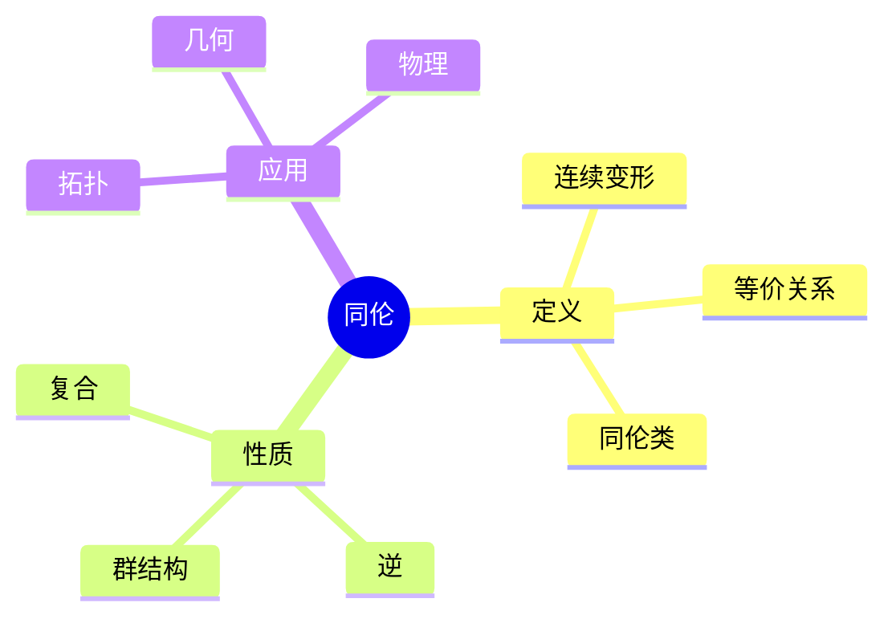
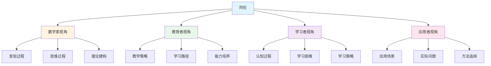
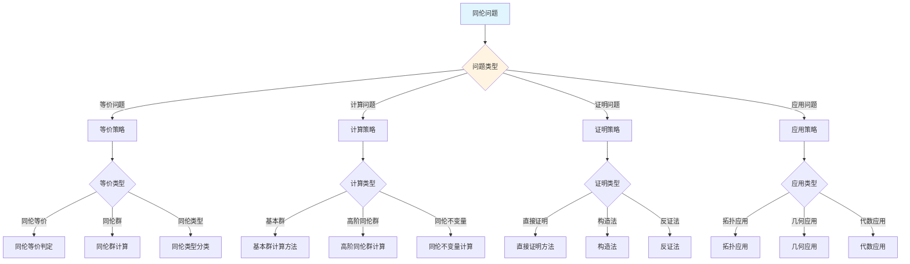
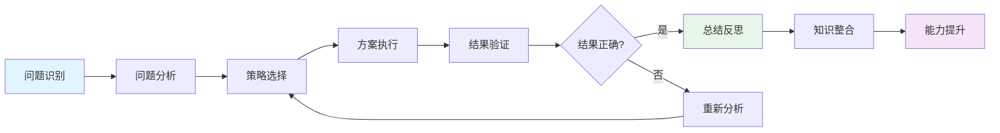
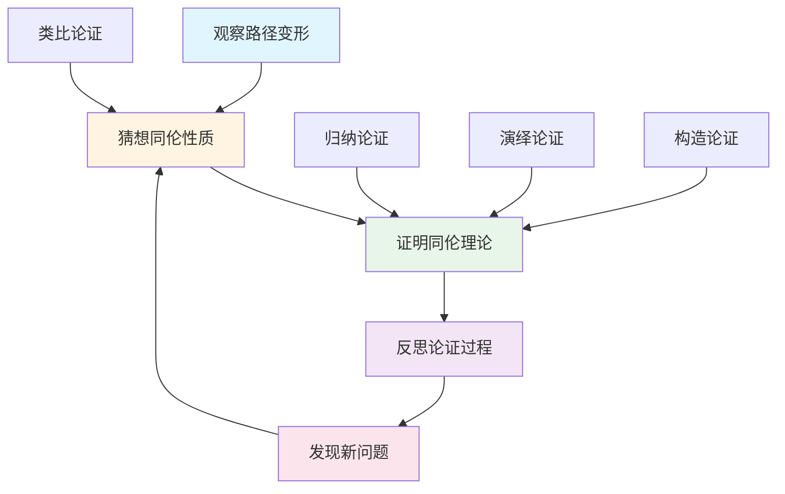
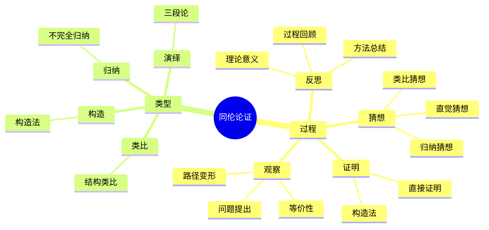

# 同伦 (Homotopy) - 三视角组织版

**概念编号**: C.CORE.024
**知识层次**: L0-L2
**知识领域**: D5 (拓扑)
**创建日期**: 2025年1月
**最后更新**: 2025年1月

---

## 📋 目录 / Table of Contents

- [同伦 (Homotopy) - 三视角组织版](#同伦-homotopy---三视角组织版)
  - [📋 目录 / Table of Contents](#-目录--table-of-contents)
  - [1. 📋 概述 (编号: C.CORE.024.01)](#1--概述-编号-ccore02401)
  - [🧠 认知学视角：如何理解同伦 (编号: C.CORE.024.02)](#-认知学视角如何理解同伦-编号-ccore02402)
    - [认知起点 (编号: C.CORE.024.02.01)](#认知起点-编号-ccore0240201)
    - [认知过程 (编号: C.CORE.024.02.02)](#认知过程-编号-ccore0240202)
      - [阶段1：直观理解阶段 (编号: C.CORE.024.02.02.01)](#阶段1直观理解阶段-编号-ccore024020201)
      - [阶段2：概念形成阶段 (编号: C.CORE.024.02.02.02)](#阶段2概念形成阶段-编号-ccore024020202)
      - [阶段3：形式化阶段 (编号: C.CORE.024.02.02.03)](#阶段3形式化阶段-编号-ccore024020203)
    - [认知障碍 (编号: C.CORE.024.02.03)](#认知障碍-编号-ccore0240203)
    - [认知工具 (编号: C.CORE.024.02.04)](#认知工具-编号-ccore0240204)
  - [🎓 教育学视角：如何教学同伦 (编号: C.CORE.024.03)](#-教育学视角如何教学同伦-编号-ccore02403)
    - [教学目标 (编号: C.CORE.024.03.01)](#教学目标-编号-ccore0240301)
    - [教学路径 (编号: C.CORE.024.03.02)](#教学路径-编号-ccore0240302)
      - [阶段1：引入阶段（激发兴趣） (编号: C.CORE.024.03.02.01)](#阶段1引入阶段激发兴趣-编号-ccore024030201)
      - [阶段2：探索阶段（主动建构） (编号: C.CORE.024.03.02.02)](#阶段2探索阶段主动建构-编号-ccore024030202)
      - [阶段3：形式化阶段（抽象概括） (编号: C.CORE.024.03.02.03)](#阶段3形式化阶段抽象概括-编号-ccore024030203)
      - [阶段4：巩固阶段（应用深化） (编号: C.CORE.024.03.02.04)](#阶段4巩固阶段应用深化-编号-ccore024030204)
    - [教学难点 (编号: C.CORE.024.03.03)](#教学难点-编号-ccore0240303)
    - [教学策略 (编号: C.CORE.024.03.04)](#教学策略-编号-ccore0240304)
    - [评估方法 (编号: C.CORE.024.03.05)](#评估方法-编号-ccore0240305)
  - [🔬 数学家视角：如何思考同伦 (编号: C.CORE.024.04)](#-数学家视角如何思考同伦-编号-ccore02404)
    - [问题起源 (编号: C.CORE.024.04.01)](#问题起源-编号-ccore0240401)
    - [思维过程 (编号: C.CORE.024.04.02)](#思维过程-编号-ccore0240402)
      - [步骤1：问题提出 (编号: C.CORE.024.04.02.01)](#步骤1问题提出-编号-ccore024040201)
      - [步骤2：概念形成 (编号: C.CORE.024.04.02.02)](#步骤2概念形成-编号-ccore024040202)
      - [步骤3：理论发展 (编号: C.CORE.024.04.02.03)](#步骤3理论发展-编号-ccore024040203)
    - [历史发展 (编号: C.CORE.024.04.03)](#历史发展-编号-ccore0240403)
    - [3.2 关键人物和贡献 (编号: C.CORE.024.04.04)](#32-关键人物和贡献-编号-ccore0240404)
    - [重要定理 (编号: C.CORE.024.04.05)](#重要定理-编号-ccore0240405)
    - [开放问题 (编号: C.CORE.024.04.06)](#开放问题-编号-ccore0240406)
    - [一、第一人称思维描述 (编号: C.CORE.024.04.07)](#一第一人称思维描述-编号-ccore0240407)
      - [1.1 Poincaré的发现过程](#11-poincaré的发现过程)
    - [二、数学直觉的形成 (编号: C.CORE.024.04.08)](#二数学直觉的形成-编号-ccore0240408)
      - [2.1 直觉在概念发现中的作用](#21-直觉在概念发现中的作用)
      - [2.2 如何培养同伦直觉](#22-如何培养同伦直觉)
    - [三、数学美的教育价值 (编号: C.CORE.024.04.09)](#三数学美的教育价值-编号-ccore0240409)
      - [3.1 同伦论的美在哪里](#31-同伦论的美在哪里)
      - [3.2 如何培养学生的数学美感](#32-如何培养学生的数学美感)
    - [四、问题解决策略 (编号: C.CORE.024.04.10)](#四问题解决策略-编号-ccore0240410)
      - [4.1 数学家的启发式方法](#41-数学家的启发式方法)
      - [4.2 思维过程分析](#42-思维过程分析)
    - [五、批判性反思 (编号: C.CORE.024.04.11)](#五批判性反思-编号-ccore0240411)
      - [5.1 同伦概念的局限性](#51-同伦概念的局限性)
      - [5.2 同伦理论的未解决问题](#52-同伦理论的未解决问题)
  - [💡 数学解释：为什么同伦是这样定义的 (编号: C.CORE.024.05)](#-数学解释为什么同伦是这样定义的-编号-ccore02405)
    - [一、直观解释：同伦是什么？](#一直观解释同伦是什么)
      - [1.1 具体例子](#11-具体例子)
      - [1.2 形象类比](#12-形象类比)
      - [1.3 几何直观](#13-几何直观)
      - [1.4 操作体验](#14-操作体验)
    - [二、知性解释：同伦的本质是什么？](#二知性解释同伦的本质是什么)
      - [2.1 概念定义](#21-概念定义)
      - [2.2 分类体系](#22-分类体系)
      - [2.3 抽象结构](#23-抽象结构)
      - [2.4 知识体系](#24-知识体系)
    - [三、理性解释：同伦的公理化定义](#三理性解释同伦的公理化定义)
      - [3.1 公理体系](#31-公理体系)
      - [3.2 形式化证明](#32-形式化证明)
      - [3.3 系统建构](#33-系统建构)
    - [四、多视角解释：从不同角度理解同伦](#四多视角解释从不同角度理解同伦)
      - [4.1 数学家视角：同伦是如何被发现的？](#41-数学家视角同伦是如何被发现的)
      - [4.2 教育者视角：如何教学同伦？](#42-教育者视角如何教学同伦)
      - [4.3 学习者视角：如何学习同伦？](#43-学习者视角如何学习同伦)
      - [4.4 应用者视角：如何应用同伦？](#44-应用者视角如何应用同伦)
    - [五、思维表征：用多种方式理解同伦](#五思维表征用多种方式理解同伦)
      - [5.1 思维导图：同伦的知识结构](#51-思维导图同伦的知识结构)
      - [5.2 矩阵对比：不同解释方式的对比](#52-矩阵对比不同解释方式的对比)
      - [5.3 多视角表征：从不同角度表征同伦](#53-多视角表征从不同角度表征同伦)
  - [💡 数学解释：为什么同伦是这样定义的 (编号: C.CORE.024.05)](#-数学解释为什么同伦是这样定义的-编号-ccore02405)
  - [🔍 数学论证：如何论证同伦 (编号: C.CORE.024.06)](#-数学论证如何论证同伦-编号-ccore02406)
    - [一、论证过程：从观察到反思](#一论证过程从观察到反思)
    - [二、论证类型：多种推理方式](#二论证类型多种推理方式)
    - [三、论证可视化：用图形表示论证过程](#三论证可视化用图形表示论证过程)
  - [🔗 三视角整合 (编号: C.CORE.024.07)](#-三视角整合-编号-ccore02407)
    - [三个视角的关联](#三个视角的关联)
    - [如何综合运用三个视角](#如何综合运用三个视角)
  - [📚 参考文献 (编号: C.CORE.024.08)](#-参考文献-编号-ccore02408)
    - [权威资源](#权威资源)
    - [经典教材](#经典教材)
    - [研究论文](#研究论文)

---

## 1. 📋 概述 (编号: C.CORE.024.01)

同伦是描述连续映射之间"连续变形"的概念，是代数拓扑的基础。同伦理论在拓扑学、几何学、物理学等领域有广泛应用。

本文档从**数学认知学**、**教育学**、**数学家**三个视角深入展开同伦概念，避免简单的概念堆垒。

**权威资源对齐**:

- Wikipedia: [Homotopy](https://en.wikipedia.org/wiki/Homotopy)
- Stanford课程: Math 215A (Differential Topology)
- Princeton课程: MAT 530 (Topology)
- MIT课程: 18.901 (Introduction to Topology)
- Metamath: [Homotopy](http://us.metamath.org/mpeuni/df-homotopy.html)

---

## 🧠 认知学视角：如何理解同伦 (编号: C.CORE.024.02)

### 认知起点 (编号: C.CORE.024.02.01)

**学习者已有的知识基础**:

- 连续映射的概念
- 拓扑空间的概念
- 日常经验中的"变形"、"连续变化"概念

**日常经验中的类似概念**:

- "变形"：连续变化
- "收缩"：连续收缩
- "拉伸"：连续拉伸

### 认知过程 (编号: C.CORE.024.02.02)

#### 阶段1：直观理解阶段 (编号: C.CORE.024.02.02.01)

**具体例子**:

- 例子1：任何映射与常值映射同伦（若空间道路连通）
- 例子2：圆上的恒等映射与常值映射不同伦
- 例子3：球面上的恒等映射与常值映射不同伦

**形象类比**:

- **变形类比**: 同伦就像"连续变形"
  - 两个映射同伦如果可以通过连续变形从一个变到另一个
  - 变形是"连续的"
  - 变形是"保持结构"的

- **路径类比**: 同伦就像"映射之间的路径"
  - 从$f$到$g$的路径
  - 路径是"连续的"
  - 路径描述"变形过程"

**可视化表示**:

```text
同伦:
    f ──H──> g
    |        |
    t=0      t=1
    连续变形
```

#### 阶段2：概念形成阶段 (编号: C.CORE.024.02.02.02)

**从例子中抽象出共同特征**:

- 所有例子都涉及"连续变形"
- 变形是"连续的"
- 变形是"保持结构"的

**识别关键属性**:

1. **连续性**: 变形是连续的
2. **参数化**: 变形通过参数$t \in [0,1]$参数化
3. **边界条件**: $H(x,0) = f(x)$，$H(x,1) = g(x)$

**建立概念边界**:

- **什么是同伦**: 连续映射之间的连续变形
- **什么不是同伦**:
  - 不连续的变形（不是同伦）
  - 不保持结构的变形（不是同伦）

#### 阶段3：形式化阶段 (编号: C.CORE.024.02.02.03)

**严格定义**:

- 同伦定义：存在连续映射$H: X \times [0,1] \to Y$使得$H(x,0) = f(x)$和$H(x,1) = g(x)$
- 同伦等价：拓扑空间之间的同伦等价

**公理化表述**:

- 同伦是连续映射之间的等价关系
- 同伦等价是拓扑空间之间的等价关系

**逻辑结构**:

- 同伦是代数拓扑的基础
- 同伦是研究拓扑不变量的工具
- 同伦是几何学的基础

### 认知障碍 (编号: C.CORE.024.02.03)

**常见误解**:

1. **误解1**: 认为所有映射都同伦
   - **纠正**: 不是所有映射都同伦，如同伦群非平凡

2. **误解2**: 认为同伦就是同胚
   - **纠正**: 同伦是映射之间的关系，同胚是空间之间的关系

3. **误解3**: 混淆同伦和同调
   - **纠正**: 同伦和同调是不同的不变量

**理解难点**:

1. **难点1**: 同伦的抽象性
   - **原因**: 同伦比较抽象
   - **解决方法**: 从直观理解开始，逐步形式化

2. **难点2**: 同伦群
   - **原因**: 同伦群比较抽象
   - **解决方法**: 用具体例子，强调同伦群的作用

3. **难点3**: 同伦等价
   - **原因**: 同伦等价比较抽象
   - **解决方法**: 用具体例子，强调同伦等价的重要性

**认知陷阱**:

- **同伦**: 需要理解"连续变形"的含义
- **同伦群**: 需要理解同伦群的作用

### 认知工具 (编号: C.CORE.024.02.04)

**类比工具**:

- **变形类比**: 同伦 = 连续变形
- **路径类比**: 同伦 = 映射之间的路径

**可视化工具**:

- **同伦图**: 用同伦图表示同伦
- **变形动画**: 用变形动画表示同伦

**具体化工具**:

- **具体例子**: 用具体例子理解抽象概念
- **反例**: 用反例理解概念边界

---

## 🎓 教育学视角：如何教学同伦 (编号: C.CORE.024.03)

### 教学目标 (编号: C.CORE.024.03.01)

**知识目标**:

- 理解同伦的基本概念
- 掌握同伦的定义
- 理解同伦的性质
- 理解同伦群

**能力目标**:

- 能够判断映射是否同伦
- 能够理解同伦的性质
- 能够应用同伦解决实际问题
- 能够理解同伦群

**情感目标**:

- 培养数学抽象思维
- 培养几何思维
- 激发对数学的兴趣

### 教学路径 (编号: C.CORE.024.03.02)

#### 阶段1：引入阶段（激发兴趣） (编号: C.CORE.024.03.02.01)

**实际问题**:

- 问题1：如何描述映射之间的"连续变形"？
- 问题2：如何研究拓扑不变量？
- 问题3：如何研究几何结构？

**历史背景**:

- 同伦的历史发展
- 同伦在数学中的地位
- 同伦在几何中的应用

**引发认知冲突**:

- 问题：如何统一描述各种"连续变形"？
- 引出同伦的概念

#### 阶段2：探索阶段（主动建构） (编号: C.CORE.024.03.02.02)

**引导发现**:

1. 让学生自己列举"连续变形"的例子
2. 让学生观察这些例子的共同特征
3. 引导学生抽象出同伦的定义

**合作探究**:

- 小组讨论：什么是同伦？
- 小组讨论：同伦有哪些性质？
- 小组讨论：如何表示同伦？

**多元表征**:

- **语言表征**: "同伦是连续映射之间的连续变形"
- **符号表征**: $f \simeq g$
- **图形表征**: 同伦图、变形动画
- **集合表征**: 同伦定义

#### 阶段3：形式化阶段（抽象概括） (编号: C.CORE.024.03.02.03)

**严格定义**:

- 同伦的定义
- 同伦的性质
- 同伦群

**性质证明**:

- 同伦的基本性质
- 同伦群的群结构
- 同伦等价

**应用拓展**:

- 同伦在拓扑学中的应用
- 同伦在几何中的应用
- 同伦在物理中的应用

#### 阶段4：巩固阶段（应用深化） (编号: C.CORE.024.03.02.04)

**练习应用**:

- 基础练习：同伦的判断和性质
- 应用练习：用同伦解决实际问题
- 综合练习：同伦的综合应用

**变式训练**:

- 不同形式的同伦
- 不同难度的同伦问题
- 同伦群的计算

**知识整合**:

- 同伦与其他概念的联系
- 同伦在数学体系中的地位

### 教学难点 (编号: C.CORE.024.03.03)

**难点1：同伦的抽象性**:

- **难点描述**: 学生难以理解同伦的抽象概念
- **解决方法**:
  - 从直观理解开始
  - 逐步形式化
  - 用具体例子说明

**难点2：同伦群**:

- **难点描述**: 学生难以理解同伦群
- **解决方法**:
  - 用具体例子
  - 强调同伦群的作用
  - 用图形可视化

**难点3：同伦等价**:

- **难点描述**: 学生难以理解同伦等价
- **解决方法**:
  - 用具体例子
  - 强调同伦等价的重要性
  - 用反例说明

### 教学策略 (编号: C.CORE.024.03.04)

**策略1：从具体到抽象**:

- 先给出具体例子
- 再抽象出一般概念
- 最后给出严格定义

**策略2：多元表征**:

- 用语言、符号、图形等多种方式表示同一概念
- 帮助学生建立不同表征之间的联系

**策略3：问题驱动**:

- 从实际问题出发
- 引出数学概念
- 解决问题

**策略4：可视化教学**:

- 使用同伦图
- 使用变形动画
- 使用具体例子

### 评估方法 (编号: C.CORE.024.03.05)

**形成性评估**（评估理解过程）:

- 课堂提问：检查学生对概念的理解
- 小组讨论：观察学生的思考过程
- 练习作业：检查学生的应用能力

**总结性评估**（评估最终理解）:

- 测验：检查学生对概念和性质的掌握
- 项目：检查学生应用同伦解决实际问题的能力
- 反思：检查学生对同伦概念的理解深度

---

## 🔬 数学家视角：如何思考同伦 (编号: C.CORE.024.04)

### 问题起源 (编号: C.CORE.024.04.01)

**历史背景**:

- 19世纪：同伦的起源
- 20世纪初：同伦的系统化
- 20世纪中期：同伦的现代发展

**原始问题**:

- **问题1**: 如何描述映射之间的"连续变形"？
- **问题2**: 如何研究拓扑不变量？
- **问题3**: 同伦有哪些性质？

**研究动机**:

- 研究拓扑不变量
- 发展代数拓扑
- 统一几何理论

### 思维过程 (编号: C.CORE.024.04.02)

#### 步骤1：问题提出 (编号: C.CORE.024.04.02.01)

**观察到的现象**:

- 映射可以"连续变形"
- 需要研究拓扑不变量
- 需要统一几何理论

**提出的猜想**:

- 可以引入同伦概念
- 同伦可以描述"连续变形"
- 同伦有丰富的性质

**需要解决的问题**:

- 如何定义同伦？
- 同伦应该满足什么条件？
- 同伦有哪些性质？

#### 步骤2：概念形成 (编号: C.CORE.024.04.02.02)

**尝试性定义**:

- **连续变形定义**: 通过连续映射$H: X \times [0,1] \to Y$
- **等价关系定义**: 同伦是等价关系

**性质探索**:

- 同伦的基本性质
- 同伦群的群结构
- 同伦等价

**结构发现**:

- 同伦是代数拓扑的基础
- 同伦是研究拓扑不变量的工具
- 同伦是几何学的基础

#### 步骤3：理论发展 (编号: C.CORE.024.04.02.03)

**定理证明**:

- 同伦的基本性质
- 同伦群的群结构
- 同伦等价

**应用拓展**:

- 同伦在拓扑学中的应用
- 同伦在几何中的应用
- 同伦在物理中的应用

**理论完善**:

- 同伦的严格定义
- 同伦的范畴论研究
- 同伦的应用研究

### 历史发展 (编号: C.CORE.024.04.03)

**早期阶段**（19世纪）:

- **Poincaré (1895)**: 引入同伦概念
- **Brouwer (1911)**: 研究同伦群

**关键突破**（20世纪初）:

- **Hurewicz (1935)**: 发展同伦群理论
- **Whitehead (1949)**: 研究同伦类型

**现代发展**（20世纪中期）:

- **Quillen (1967)**: 发展模型范畴
- **Grothendieck (1960s)**: 在代数几何中应用同伦

### 3.2 关键人物和贡献 (编号: C.CORE.024.04.04)

**Henri Poincaré (1854-1912)**:

- 引入同伦概念
- 建立代数拓扑基础

**Witold Hurewicz (1904-1956)**:

- 发展同伦群理论
- 建立现代代数拓扑

**Daniel Quillen (1940-2011)**:

- 发展模型范畴
- 建立现代同伦理论

### 重要定理 (编号: C.CORE.024.04.05)

**Hurewicz定理**:

- 同伦群和同调群的关系
- 意义：连接同伦和同调

**Whitehead定理**:

- 同伦等价的条件
- 意义：同伦分类的基础

**同伦群的群结构**:

- 同伦群构成群
- 意义：同伦群的计算基础

### 开放问题 (编号: C.CORE.024.04.06)

**未解决问题**:

- 同伦群的计算问题
- 同伦的应用问题
- 同伦的推广问题

**研究方向**:

- 同伦的范畴论研究
- 同伦的几何研究
- 同伦的应用研究

### 一、第一人称思维描述 (编号: C.CORE.024.04.07)

#### 1.1 Poincaré的发现过程

**详细历史背景**:

- **1895年**：Poincaré发表《位置分析》（Analysis Situs）
- **背景**：研究拓扑，发现映射可以连续变形
- **问题**：如何描述映射的连续变形？如何分类拓扑空间？

**Poincaré的详细第一人称描述**:
> "1895年，我在研究拓扑时，遇到了一个问题：如何分类拓扑空间？
>
> 我发现，有些映射可以连续变形。例如，从$S^1$到$\mathbb{R}^2$的映射$f$和$g$，如果$f$可以连续变形到$g$，则它们是同伦的。
>
> 我的方法是这样的：
>
> - **思路**：用同伦描述映射的连续变形
> - **定义**：映射$f, g: X \to Y$同伦，如果存在连续映射$H: X \times [0,1] \to Y$，使得$H(x,0) = f(x)$，$H(x,1) = g(x)$
> - **例子**：从$S^1$到$\mathbb{R}^2$的映射，如果它们绕原点转的圈数相同，则同伦
>
> 例如，对于$S^1$到$\mathbb{R}^2$的映射：
>
> - **映射1**：$f(\theta) = (\cos\theta, \sin\theta)$（绕原点1圈）
> - **映射2**：$g(\theta) = (\cos 2\theta, \sin 2\theta)$（绕原点2圈）
> - **同伦**：$f$和$g$不同伦，因为绕的圈数不同
> - **同伦群**：$\pi_1(S^1) = \mathbb{Z}$（基本群）
>
> 我还发现了同伦群：
>
> - **定义**：$\pi_n(X, x_0)$是$S^n$到$X$的映射的同伦类
> - **群结构**：$\pi_n(X, x_0)$构成群
> - **意义**：同伦群是拓扑不变量
>
> 这让我意识到，同伦是描述映射连续变形的工具，同伦群是拓扑不变量。这为拓扑学提供了基础。"

**详细的思维过程**:

1. **观察到的现象**（1895年）:

   **现象1：映射可以连续变形**
   - **问题**：如何描述映射的连续变形？
   - **例子**：从$S^1$到$\mathbb{R}^2$的映射
   - **需要**：统一的概念

   **现象2：这种变形有特殊的性质**
   - **问题**：同伦有什么性质？
   - **例子**：同伦是等价关系
   - **需要**：建立同伦理论

   **现象3：需要统一的概念**
   - **问题**：如何统一处理不同的映射？
   - **思路**：用同伦统一
   - **需要**：建立同伦理论

2. **提出的猜想**（1895年）:

   **猜想1：用同伦描述连续变形**
   - **思路**：定义同伦为连续映射$H: X \times [0,1] \to Y$
   - **例子**：从$S^1$到$\mathbb{R}^2$的映射
   - **优点**：统一描述连续变形

   **猜想2：同伦群的结构**
   - **群结构**：$\pi_n(X, x_0)$构成群
   - **例子**：$\pi_1(S^1) = \mathbb{Z}$
   - **意义**：同伦群是拓扑不变量

   **猜想3：同伦是拓扑学的基础**
   - **性质**：同伦是拓扑不变量
   - **应用**：同伦可以应用到更广泛的领域
   - **意义**：同伦是统一的拓扑结构

3. **遇到的困难**（1895年）:

   **困难1：如何严格定义同伦？**
   - **问题**：如何定义同伦？
   - **解决**：定义同伦为连续映射$H: X \times [0,1] \to Y$
   - **意义**：为同伦提供严格的数学基础

   **困难2：如何计算同伦群？**
   - **问题**：如何计算$\pi_n(X, x_0)$？
   - **解决**：使用同伦长正合列、谱序列
   - **意义**：为同伦提供计算方法

   **困难3：如何应用同伦理论？**
   - **问题**：如何用同伦理论解决实际问题？
   - **解决**：建立同伦分类理论、稳定同伦理论
   - **意义**：为同伦提供应用基础

4. **突破的时刻**（1895年，Poincaré）:

   **突破1：同伦的概念**
   - 引入同伦的概念描述连续变形
   - **关键**：同伦是等价关系
   - **意义**：为拓扑学提供基础

   **突破2：同伦群**
   - 建立同伦群理论
   - **关键**：$\pi_n(X, x_0)$构成群
   - **意义**：为拓扑分类提供工具

   **突破3：同伦理论的广泛应用**
   - 同伦理论可以应用到更广泛的领域
   - **关键**：同伦是拓扑不变量
   - **意义**：同伦理论成为拓扑学的基础

### 二、数学直觉的形成 (编号: C.CORE.024.04.08)

#### 2.1 直觉在概念发现中的作用

**Poincaré的直觉**:

- **直觉1**: "同伦"是"连续变形"——这个直觉引导Poincaré发现同伦
- **直觉2**: 同伦可以分类拓扑空间——这个直觉引导Poincaré建立同伦理论
- **直觉3**: 同伦是拓扑学的基础——这个直觉引导Poincaré建立同伦理论

**直觉的验证**:

- 通过严格的数学证明验证直觉的正确性
- 通过同伦群严格化同伦定义
- 通过应用验证同伦的广泛性

**直觉的深化**:

- 从"连续变形"到"同伦的严格定义"
- 从"分类拓扑空间"到"同伦的广泛应用"
- 从"拓扑学基础"到"同伦的深入发展"

#### 2.2 如何培养同伦直觉

**数学家的建议**:

- **Poincaré**: "同伦直觉是长期训练的结果。通过大量练习和深入思考，我们可以培养对同伦的直觉。"
- **Hurewicz**: "从具体例子开始，逐步抽象，这是培养同伦直觉的有效方法。"

**培养方法**:

1. **大量练习**: 通过大量同伦构造练习，培养对同伦的直觉
2. **深入思考**: 深入思考同伦的本质，理解同伦的深层结构
3. **类比和联想**: 通过类比和联想，建立同伦与其他概念的联系
4. **与专家交流**: 与数学家交流，学习他们的思维方式

**教学启示**:

- 从具体例子开始，逐步抽象
- 鼓励学生思考同伦的本质
- 引导学生建立同伦与其他概念的联系

### 三、数学美的教育价值 (编号: C.CORE.024.04.09)

#### 3.1 同伦论的美在哪里

**结构美**:

- **简洁性**: 同伦的概念非常简洁——"映射之间的连续变形"
- **统一性**: 同伦可以统一描述数学中的各种变形
- **和谐性**: 同伦运算满足优美的规律（同伦群、同伦等价等）

**数学家的评价**:

- **Poincaré**: "同伦论的美在于它的统一性。它为我们提供了一个统一的框架来理解拓扑变形。"
- **Hurewicz**: "同伦论的美在于它的基础性。它是拓扑学的基础，所有拓扑变形都可以用同伦来描述。"

#### 3.2 如何培养学生的数学美感

**数学家的建议**:

- **Poincaré**: "展示同伦论的美感，让学生感受到数学的美。"
- **Hurewicz**: "通过同伦论的历史和发展，让学生理解数学的美。"

**教学方法**:

1. **展示数学美**:
   - 展示同伦概念的简洁性和统一性
   - 展示同伦运算的优美规律
   - 展示同伦在数学中的基础地位

2. **引导学生欣赏**:
   - 引导学生欣赏同伦概念的简洁性
   - 引导学生欣赏同伦运算的和谐性
   - 引导学生欣赏同伦的基础性

3. **鼓励学生创造美**:
   - 鼓励学生发现同伦论的美
   - 鼓励学生创造优美的同伦证明
   - 鼓励学生探索同伦论的美

### 四、问题解决策略 (编号: C.CORE.024.04.10)

#### 4.1 数学家的启发式方法

**策略1：从具体到抽象**:

- 从具体的同伦例子开始
- 抽象出同伦的一般性质
- 建立同伦的理论体系

**策略2：从简单到复杂**:

- 先理解基本同伦
- 再理解同伦运算
- 最后理解同伦理论

**策略3：从问题到理论**:

- 从实际问题出发
- 引出同伦概念
- 建立同伦理论

#### 4.2 思维过程分析

**问题识别**:

- 识别问题类型：同伦定义问题、同伦性质问题、同伦应用问题
- 识别问题难度：简单问题、中等问题、复杂问题

**策略选择**:

- 简单问题：直接方法
- 中等问题：分步方法
- 复杂问题：分解方法

**执行和反思**:

- 执行策略，解决问题
- 反思过程，总结经验
- 改进方法，提高效率

### 五、批判性反思 (编号: C.CORE.024.04.11)

#### 5.1 同伦概念的局限性

**概念的边界**:

- 同伦只描述连续变形，不能描述所有数学变形
- 同伦是抽象的，需要具体化才能应用
- 同伦不能表示所有数学量

**概念的推广**:

- 同伦范畴：范畴论中的同伦
- 稳定同伦：更一般的同伦
- 导出同伦：同调代数中的同伦

#### 5.2 同伦理论的未解决问题

**未解决的问题**:

- 同伦群的计算问题：如何计算复杂同伦群？
- 同伦的应用问题：如何更好地应用同伦？
- 同伦的推广问题：如何推广同伦概念？

**研究方向**:

- 同伦的范畴论研究
- 同伦的几何研究
- 同伦的应用研究

---

## 💡 数学解释：为什么同伦是这样定义的 (编号: C.CORE.024.05)

### 一、直观解释：同伦是什么？

#### 1.1 具体例子

**生活中的例子**：

- **连续变形**：同伦描述"连续变形"
  - 例如：一个圆可以连续变形为另一个圆
  - **为什么这样定义**：因为我们需要一个概念来表示"连续变形"
- **橡皮筋变形**：橡皮筋可以连续变形
  - 例如：橡皮筋可以拉伸和弯曲，但不能撕裂
  - **为什么这样定义**：因为我们需要一个概念来表示"连续变形"
- **路径变形**：路径可以连续变形
  - 例如：一条路径可以连续变形为另一条路径
  - **为什么这样定义**：因为我们需要一个概念来表示"路径的连续变形"

**数学中的例子**：

- **映射的同伦**：$H: X \times [0,1] \to Y$是$f$到$g$的同伦
  - **为什么这样定义**：我们需要一个简单的方式来表示"映射的连续变形"
- **路径的同伦**：两条路径如果可以通过连续变形相互转换，则同伦
  - **为什么这样定义**：我们需要一个概念来表示"路径的连续变形"
- **同伦等价**：两个空间如果可以通过连续变形相互转换，则同伦等价
  - **为什么这样定义**：我们需要一个概念来表示"空间的连续变形"

#### 1.2 形象类比

**橡皮筋类比**：

- **同伦就像"橡皮筋变形"**
  - 橡皮筋可以拉伸和弯曲
  - 同伦也可以连续变形
- **为什么这样类比**：这个类比帮助我们理解同伦的"连续变形"性质

**路径类比**：

- **同伦就像"路径变形"**
  - 路径可以连续变形
  - 同伦也可以连续变形
- **为什么这样类比**：这个类比帮助我们理解同伦的"路径"性质

#### 1.3 几何直观

**同伦图形表示**：

- 使用图形表示同伦
- 例如：用动画表示连续变形
- **为什么使用图形**：图形提供几何直观，帮助我们理解同伦

**同伦参数表示**：

- 使用参数表示同伦
- 例如：$H_t(x) = H(x, t)$是$t$时刻的映射
- **为什么使用参数**：参数提供几何直观，帮助我们理解同伦的连续变形

#### 1.4 操作体验

**同伦运算的操作**：

- **同伦的复合**：同伦可以复合
  - **为什么这样操作**：因为我们需要一个运算来表示"同伦的复合"
- **同伦的逆**：同伦有逆
  - **为什么这样操作**：因为我们需要一个运算来表示"同伦的逆"
- **同伦的等价**：同伦是等价关系
  - **为什么这样操作**：因为我们需要一个工具来表示"同伦的等价"

### 二、知性解释：同伦的本质是什么？

#### 2.1 概念定义

**同伦的内涵**：

- **同伦是描述连续映射之间"连续变形"的概念**
  - **连续变形**：$H: X \times [0,1] \to Y$是连续映射
  - **等价关系**：同伦是等价关系
  - **结构**：同伦类形成等价类
- **为什么这样定义**：这些特征使得同伦成为一个完整的拓扑工具，支持所有连续变形研究

**同伦的外延**：

- **映射的同伦**：两个映射如果可以通过连续变形相互转换，则同伦
- **路径的同伦**：两条路径如果可以通过连续变形相互转换，则同伦
- **空间的同伦等价**：两个空间如果可以通过连续变形相互转换，则同伦等价
- **为什么这样分类**：不同的同伦类型有不同的性质和用途

#### 2.2 分类体系

**按类型分类**：

- **映射的同伦**：$f \simeq g$表示$f$和$g$同伦
- **路径的同伦**：两条路径如果同伦，则属于同一同伦类
- **空间的同伦等价**：两个空间如果同伦等价，则具有相同的同伦类型
- **为什么这样分类**：类型是同伦的基本特征

**按性质分类**：

- **相对同伦**：在同伦过程中保持某些点不变
- **自由同伦**：在同伦过程中没有限制
- **为什么这样分类**：性质是同伦的重要特征

#### 2.3 抽象结构

**同伦的运算结构**：

- **同伦的复合**：同伦可以复合
- **同伦的逆**：同伦有逆
- **为什么有这些运算**：这些运算使得同伦具有代数结构（群结构）

**同伦的关系结构**：

- **同伦的等价**：同伦是等价关系
- **同伦类**：同伦类形成等价类
- **为什么有这个关系**：这个关系帮助我们研究同伦的结构

#### 2.4 知识体系

**同伦在数学体系中的位置**：

- **基础地位**：同伦是代数拓扑的基础
  - 同伦可以定义同伦群
  - 同伦可以定义同伦类型
- **为什么是基础**：同伦提供了统一的框架来研究连续变形

**同伦与其他概念的关系**：

- **同伦与连续**：同伦是连续映射的连续变形
- **同伦与同调**：同伦和同调都是拓扑不变量
- **同伦与几何**：同伦在几何中有重要应用
- **为什么有这些关系**：这些关系揭示了同伦与其他数学概念的内在联系

### 三、理性解释：同伦的公理化定义

#### 3.1 公理体系

**同伦的定义**：

- **定义**：$H: X \times [0,1] \to Y$是$f$到$g$的同伦如果$H(x, 0) = f(x)$且$H(x, 1) = g(x)$
- **为什么需要这个定义**：这个定义提供了同伦的严格数学基础

**同伦的公理**：

- **自反性**：$f \simeq f$
- **对称性**：如果$f \simeq g$，则$g \simeq f$
- **传递性**：如果$f \simeq g$且$g \simeq h$，则$f \simeq h$
- **为什么这样定义**：这些公理将同伦放在更一般的框架中

#### 3.2 形式化证明

**同伦性质的证明**：

- **同伦的复合**：同伦的复合是同伦
  - **证明**：使用同伦的定义和连续映射的性质
  - **为什么这样证明**：利用同伦的定义和连续映射的性质
- **同伦群的群结构**：同伦群是群
  - **证明**：使用同伦的定义和群的公理
  - **为什么这样证明**：利用同伦的定义和群的公理

#### 3.3 系统建构

**同伦论在数学基础中的地位**：

- **作为代数拓扑基础**：同伦是代数拓扑的基础
- **提供拓扑工具**：同伦提供了研究拓扑的工具
- **统一框架**：同伦统一了各种连续变形研究

**同伦论的发展历史**：

- **Poincaré的引入**（1895年）：引入同伦概念
- **Hurewicz的发展**（1935年）：发展同伦群理论
- **为什么这样发展**：数学的发展需要严格的基础，同伦论的发展反映了这一需求

### 四、多视角解释：从不同角度理解同伦

#### 4.1 数学家视角：同伦是如何被发现的？

**Poincaré的发现过程**：

- **问题提出**：如何描述"连续变形"？
- **关键洞察**：使用同伦映射，发现同伦的代数结构
- **重要发现**：同伦可以用于研究拓扑不变量
- **为什么这样发现**：数学家的直觉和严格证明相结合

#### 4.2 教育者视角：如何教学同伦？

**教学策略**：

- **从具体到抽象**：先学习具体例子（路径的同伦），再学习抽象定义
- **从简单到复杂**：先学习简单同伦，再学习复杂同伦
- **从直观到形式化**：先使用动画等直观工具，再学习严格定义
- **为什么这样教学**：符合认知规律，帮助学生逐步建立理解

#### 4.3 学习者视角：如何学习同伦？

**认知过程**：

- **直观阶段**：通过具体例子理解同伦的含义
- **概念阶段**：理解同伦的定义和性质
- **形式化阶段**：理解严格定义和证明
- **为什么这样学习**：符合认知发展规律

#### 4.4 应用者视角：如何应用同伦？

**应用场景**：

- **拓扑**：使用同伦研究拓扑不变量
- **几何**：使用同伦研究几何结构
- **物理**：使用同伦研究物理系统
- **为什么这样应用**：同伦提供了强大的工具来处理各种问题

### 五、思维表征：用多种方式理解同伦

#### 5.1 思维导图：同伦的知识结构



#### 5.2 矩阵对比：不同解释方式的对比

| 解释方式 | 特点 | 方法 | 工具 | 适用阶段 | 优势 | 局限 |
|---------|------|------|------|---------|------|------|
| **直观解释** | 具体、形象、可视 | 例子、类比、直观 | 动画、图形 | 入门阶段 | 易于理解 | 不够严格 |
| **知性解释** | 概念、分类、抽象 | 定义、分类、结构 | 概念图、知识图谱 | 中级阶段 | 系统完整 | 不够直观 |
| **理性解释** | 公理、证明、形式化 | 公理、证明、系统 | 形式化工具、证明系统 | 高级阶段 | 严格准确 | 不够具体 |
| **多视角解释** | 多角度、整合 | 多视角、整合 | 多视角工具 | 所有阶段 | 全面深入 | 可能复杂 |

#### 5.3 多视角表征：从不同角度表征同伦



#### 5.4 决策树：同伦问题分类和策略选择



**说明**：

- **问题分类**：根据问题类型（等价、计算、证明、应用）进行分类
- **策略选择**：根据问题类型选择相应的解决策略
- **方法应用**：根据具体问题选择合适的方法

#### 5.5 决策逻辑路径：同伦问题解决过程



**说明**：

- **问题识别**：识别同伦问题的类型和关键要素
- **问题分析**：分析问题的条件和目标
- **策略选择**：根据问题类型选择解决策略
- **方案执行**：执行选定的解决方案
- **结果验证**：验证结果的正确性
- **总结反思**：总结解题过程，反思解题方法
- **知识整合**：整合相关知识点
- **能力提升**：提升问题解决能力

#### 5.6 多维对比矩阵：同伦概念特征对比

| 对比维度 | 同伦定义 | 同伦等价 | 同伦计算 | 同伦应用 |
|---------|---------|---------|---------|---------|
| **核心特征** | 同伦映射、同伦等价 | 同伦等价、同伦群 | 基本群、高阶同伦群 | 拓扑、几何、代数应用 |
| **理解难度** | ⭐⭐⭐⭐ | ⭐⭐⭐⭐⭐ | ⭐⭐⭐⭐⭐ | ⭐⭐⭐⭐ |
| **应用频率** | ⭐⭐⭐⭐ | ⭐⭐⭐⭐ | ⭐⭐⭐⭐ | ⭐⭐⭐⭐ |
| **理论基础** | 同伦定义 | 同伦等价理论 | 同伦计算理论 | 同伦应用理论 |
| **教学重点** | 概念理解 | 等价判定 | 计算方法 | 应用能力 |
| **学习阶段** | 高级阶段 | 高级阶段 | 高级阶段 | 高级阶段 |
| **认知维度** | 知性+理性 | 理性 | 理性 | 理性+应用 |
| **思维表征** | 思维导图 | 决策树 | 决策逻辑路径 | 知识图谱 |

**说明**：

- **核心特征**：每个方面的核心特征
- **理解难度**：从1星到5星，表示理解难度
- **应用频率**：从1星到5星，表示应用频率
- **理论基础**：每个方面的理论基础
- **教学重点**：每个方面的教学重点
- **学习阶段**：每个方面的学习阶段
- **认知维度**：每个方面的认知维度
- **思维表征**：每个方面推荐的思维表征方法

---

## 🔍 数学论证：如何论证同伦 (编号: C.CORE.024.06)

### 一、论证过程：从观察到反思

#### 1.1 观察（Observation）

**具体现象观察**：

- **现象1**：路径可以连续变形
  - 例如：在拓扑空间中，两条路径可以通过连续变形相互转换
  - **为什么重要**：这个现象揭示了同伦的本质
- **现象2**：同伦等价性
  - 例如：同伦等价的空间有相同的同伦群
  - **为什么重要**：这个现象揭示了同伦的拓扑性质

**模式识别**：

- **模式1**：同伦的定义
  - 例如：同伦是连续映射的连续变形
  - **为什么重要**：这个模式可能反映了同伦的本质
- **模式2**：基本群
  - 例如：基本群是同伦类的群
  - **为什么重要**：这个模式可能反映了同伦的代数结构

**问题提出**：

- **问题1**：如何严格定义同伦，统一不同的连续变形？
  - **为什么提出**：这个问题可能揭示同伦的本质和基础
- **问题2**：如何证明基本群的性质？
  - **为什么提出**：这个问题可能揭示同伦的代数性质

#### 1.2 猜想（Conjecture）

**归纳猜想**：

- **猜想1**：同伦是研究拓扑的统一工具
  - **依据**：观察不同拓扑问题都依赖于同伦
  - **为什么提出**：这个猜想可能揭示同伦的统一性
- **猜想2**：基本群
  - **依据**：观察具体空间的同伦类
  - **为什么提出**：这个猜想可能揭示同伦的代数性质

**类比猜想**：

- **猜想1**：同伦类似于"连续变形"
  - **类比对象**：连续变形
  - **为什么提出**：这个类比可能揭示同伦的本质
- **猜想2**：基本群类似于"路径群"
  - **类比对象**：路径群
  - **为什么提出**：这个类比可能揭示基本群的作用

**直觉猜想**：

- **猜想1**：同伦是"最自然"的拓扑等价概念
  - **直觉来源**：同伦的直观
  - **为什么提出**：这个直觉可能揭示同伦的基础地位
- **猜想2**：同伦有"最小"的公理结构
  - **直觉来源**：同伦的公理结构
  - **为什么提出**：这个直觉可能揭示同伦的本质

#### 1.3 证明（Proof）

**直接证明**：

- **证明1**：基本群的性质
  - **证明思路**：使用同伦的定义和群的性质
  - **关键步骤**：证明同伦类的复合满足群公理
  - **为什么这样证明**：这个证明方法直接、清晰
- **证明2**：同伦等价性
  - **证明思路**：使用同伦的定义和等价关系的性质
  - **关键步骤**：证明同伦关系是等价关系
  - **为什么这样证明**：这个证明方法直接、清晰

**构造法**：

- **构造法**：构造同伦
  - **构造方法**：定义连续映射的连续变形
  - **验证**：验证构造的同伦满足同伦公理
  - **为什么这样证明**：构造法适合证明存在性命题

#### 1.4 反思（Reflection）

**过程回顾**：

- **论证回顾**：从观察路径可以连续变形，到猜想同伦的性质，再到严格证明
  - **成功之处**：成功建立了同伦的严格理论
  - **不足之处**：同伦概念需要进一步推广
  - **改进方向**：推广到稳定同伦、导出同伦等

**方法总结**：

- **证明方法**：使用了直接证明、构造法
  - **方法特点**：直接证明清晰，构造法明确
  - **适用范围**：不同方法适用于不同类型的命题
- **证明技巧**：使用同伦的定义、连续映射的性质、构造法
  - **技巧要点**：将同伦问题转化为拓扑问题，使用构造法处理存在性问题
  - **应用场景**：这些技巧可以应用于其他拓扑问题

**理论意义**：

- **理论贡献**：建立了同伦的严格理论，揭示了同伦的拓扑结构
  - **为什么重要**：这个论证揭示了代数拓扑的基础结构
- **应用价值**：同伦为代数拓扑、几何学、物理提供了基础
  - **为什么重要**：这个论证可以应用于所有拓扑问题

### 二、论证类型：多种推理方式

#### 2.1 归纳论证（Inductive Reasoning）

**不完全归纳**：

- **例子1**：从具体空间的同伦性质归纳一般规律
  - **观察**：观察$\mathbb{R}^n$、球面、环面的同伦性质
  - **结论**：同伦反映拓扑性质
  - **局限性**：不完全归纳的结论需要严格证明

#### 2.2 演绎论证（Deductive Reasoning）

**三段论**：

- **例子1**：证明同伦的性质
  - **大前提**：所有同伦关系都是等价关系
  - **小前提**：路径同伦是同伦关系
  - **结论**：路径同伦是等价关系
  - **为什么有效**：三段论是严格的演绎推理

#### 2.3 类比论证（Analogical Reasoning）

**结构类比**：

- **例子1**：同伦与连续变形的类比
  - **类比对象**：连续变形
  - **相似性**：同伦是连续映射的连续变形
  - **结论**：同伦可以理解为"连续变形"
  - **局限性**：类比不能替代严格证明

#### 2.4 构造论证（Constructive Reasoning）

**构造法**：

- **例子1**：构造同伦
  - **构造方法**：定义连续映射的连续变形
  - **验证**：验证构造的同伦满足同伦公理
  - **为什么有效**：构造法是严格的直接证明

### 三、论证可视化：用图形表示论证过程

#### 3.1 论证流程图



#### 3.2 论证类型对比

| 论证类型 | 特点 | 适用场景 | 优势 | 局限 |
|---------|------|---------|------|------|
| **归纳论证** | 从特殊到一般 | 发现规律、提出猜想 | 启发性强 | 结论或然 |
| **演绎论证** | 从一般到特殊 | 严格证明、逻辑推理 | 结论必然 | 需要前提 |
| **类比论证** | 基于相似性 | 启发思路、发现联系 | 创造性高 | 结论或然 |
| **构造论证** | 直接构造 | 证明存在性命题 | 直接明确 | 需要构造 |

#### 3.3 论证思维导图



---

## 🔗 三视角整合 (编号: C.CORE.024.07)

### 三个视角的关联

**认知学视角 ↔ 教育学视角**:

- 认知学视角揭示的理解机制，指导教育学视角的教学设计
- 教育学视角的教学实践，验证认知学视角的理论

**认知学视角 ↔ 数学家视角**:

- 数学家视角的思维过程，启发认知学视角的认知路径
- 认知学视角的认知障碍，解释数学家视角的历史困难

**教育学视角 ↔ 数学家视角**:

- 数学家视角的历史发展，为教育学视角提供教学素材
- 教育学视角的教学策略，帮助学习者理解数学家视角的思维过程

### 如何综合运用三个视角

**学习建议**:

1. **从认知学视角开始**: 先建立直观理解
2. **用教育学视角深化**: 通过教学路径系统学习
3. **用数学家视角升华**: 理解概念的深层意义和历史背景

**教学建议**:

1. **引入阶段**: 用数学家视角的问题起源激发兴趣
2. **探索阶段**: 用认知学视角的认知过程引导发现
3. **形式化阶段**: 用教育学视角的教学策略系统教学
4. **巩固阶段**: 综合三个视角深化理解

---

## 📚 参考文献 (编号: C.CORE.024.08)

### 权威资源

- Wikipedia: [Homotopy](https://en.wikipedia.org/wiki/Homotopy)
- Metamath: [Homotopy](http://us.metamath.org/mpeuni/df-homotopy.html)

### 经典教材

- Hatcher, A. (2002). *Algebraic Topology*. Cambridge University Press.
- May, J. P. (1999). *A Concise Course in Algebraic Topology*. University of Chicago Press.

### 研究论文

- Poincaré, H. (1895). "Analysis situs". *Journal de l'École Polytechnique*.
- Hurewicz, W. (1935). "Beiträge zur Topologie der Deformationen". *Nederlandsche Akademie van Wetenschappen*.

---

**创建日期**: 2025年1月
**最后更新**: 2025年1月
**维护状态**: 持续更新中
