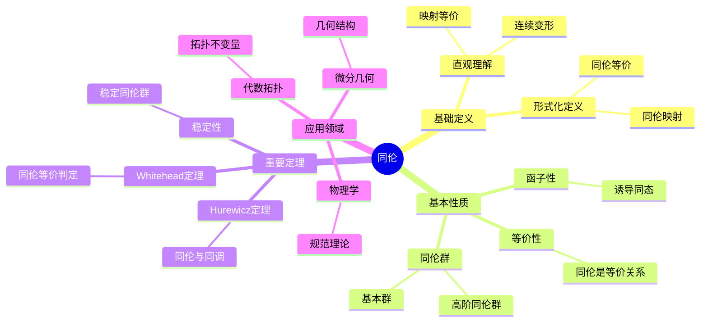
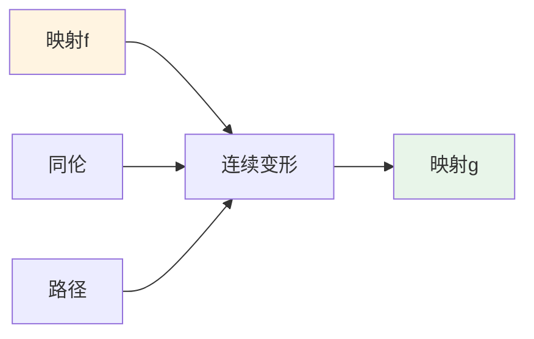
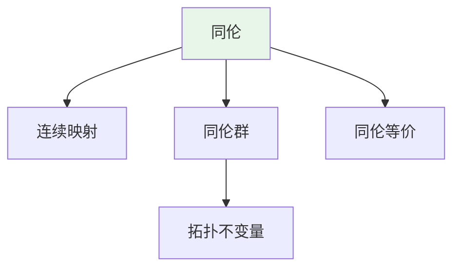
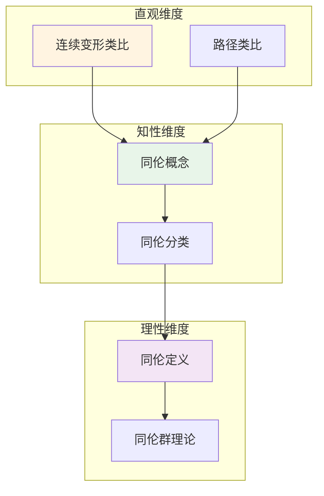

# 同伦 (Homotopy)

**概念编号**: C.CORE.024
**知识层次**: L0-L2
**知识领域**: D5 (拓扑)
**创建日期**: 2025年11月21日
**最后更新**: 2025年11月21日

---

## 📋 概述

同伦是描述连续映射之间"连续变形"的概念，是代数拓扑的基础。同伦理论在拓扑学、几何学、物理学等领域有广泛应用。

**权威资源对齐**:

- Wikipedia: [Homotopy](https://en.wikipedia.org/wiki/Homotopy)
- Stanford课程: Math 215A (Differential Topology)
- Princeton课程: MAT 530 (Topology)
- MIT课程: 18.901 (Introduction to Topology)
- Metamath: [Homotopy](http://us.metamath.org/mpeuni/df-homotopy.html)

---

## 🎯 严格定义

### 基础定义 (L0)

**直观理解**: 同伦是连续映射之间的"连续变形"，两个映射同伦如果可以通过连续变形从一个变到另一个。

**基本定义**: 映射 $f, g: X \to Y$ 同伦，如果存在连续映射 $H: X \times [0,1] \to Y$ 使得 $H(x,0) = f(x)$ 和 $H(x,1) = g(x)$。

**简单例子**:

- 任何映射与常值映射同伦（若空间道路连通）
- 圆上的恒等映射与常值映射不同伦
- 球面上的恒等映射与常值映射不同伦

### 形式化定义 (L1)

**同伦**: 映射 $f, g: X \to Y$ 同伦，记作 $f \simeq g$，若存在连续映射 $H: X \times [0,1] \to Y$ 使得：

$$H(x, 0) = f(x), \quad H(x, 1) = g(x), \quad \forall x \in X$$

**同伦等价**: 拓扑空间 $X$ 和 $Y$ 同伦等价，若存在映射 $f: X \to Y$ 和 $g: Y \to X$ 使得 $g \circ f \simeq \text{id}_X$ 和 $f \circ g \simeq \text{id}_Y$。

**同伦群**: $\pi_n(X, x_0)$ 是 $n$ 维球面到 $X$ 的映射的同伦类。

**记号**:

- $f \simeq g$: $f$ 与 $g$ 同伦
- $H: f \simeq g$: $H$ 是从 $f$ 到 $g$ 的同伦
- $X \simeq Y$: $X$ 与 $Y$ 同伦等价
- $\pi_n(X)$: $n$ 维同伦群

---

## 📚 历史背景

### 发展脉络

**20世纪初**: 同伦理论的起源

- **Poincaré (1895)**: 研究基本群
- **Brouwer (1911)**: 研究不动点定理

**20世纪中期**: 同伦理论的发展

- **Hurewicz (1935)**: 引入同伦群
- **Serre (1951)**: 研究同伦群的计算
- **Adams (1958)**: 研究稳定同伦群

### 关键人物

- **Henri Poincaré (1854-1912)**: 研究基本群
- **Luitzen Brouwer (1881-1966)**: 研究不动点定理
- **Witold Hurewicz (1904-1956)**: 引入同伦群

---

## 🔍 性质与定理

### 基本性质 (L1)

**性质1: 同伦的等价性**:

- 同伦是等价关系
- 同伦类构成集合

**性质2: 同伦的函子性**:

- 连续映射诱导同伦群之间的同态
- 同伦等价诱导同伦群的同构

**性质3: 同伦群的维数**:

- $\pi_n(X) = 0$ 对 $n > \dim X$（Hurewicz定理）

### 重要定理 (L2)

**定理1: Hurewicz定理**:

- **陈述**: 若 $\pi_i(X) = 0$ 对 $i < n$，则 $\pi_n(X) \cong H_n(X)$
- **应用**: 同伦群与同调群的关系

**定理2: Whitehead定理**:

- **陈述**: 若 $f: X \to Y$ 诱导所有同伦群的同构，则 $f$ 是同伦等价
- **应用**: 同伦等价的判定

**定理3: 同伦群的稳定性**:

- **陈述**: 稳定同伦群 $\pi_n^S$ 在 $n$ 充分大时稳定
- **应用**: 稳定同伦理论

---

## 💡 应用实例

### 理论应用

- 代数拓扑（同伦群是拓扑不变量）
- 微分几何（同伦群与几何结构）
- 物理学（规范理论、弦理论）

### 实际应用

- 物理学（拓扑缺陷、孤子）
- 计算机科学（路径规划）
- 工程学（形变分析）

---

## 🔗 关联概念

### 依赖关系

- 拓扑空间（同伦在拓扑空间上定义）
- 连续映射（同伦是连续映射之间的关系）

### 推广关系

- 同伦（一般同伦）
- 同伦等价（更强的等价关系）
- 稳定同伦（稳定同伦群）

---

## 📖 参考文献

- Wikipedia: [Homotopy](https://en.wikipedia.org/wiki/Homotopy)
- Hatcher, A. (2002). *Algebraic Topology*. Cambridge University Press.
- May, J. P. (1999). *A Concise Course in Algebraic Topology*. University of Chicago Press.

---

## 🗺️ 思维导图 (编号: C.CORE.024.MIND)

### 同伦概念思维导图

---

## 📊 知识多维关系矩阵 (编号: C.CORE.024.MATRIX)

### 同伦的多维关系矩阵

| 维度 | 指标 | 同伦 |
|------|------|------|
| **知识层次** | L0基础 | ⭐⭐⭐ |
| | L1中级 | ⭐⭐⭐ |
| | L2高级 | ⭐⭐⭐⭐ |
| | L3研究 | ⭐⭐⭐⭐⭐ |
| **知识领域** | D1基础数学 | ⭐⭐ |
| | D4几何 | ⭐⭐⭐ |
| | D5拓扑 | ⭐⭐⭐⭐⭐ |
| | D8交叉领域 | ⭐⭐⭐ |
| **依赖关系** | 前置概念 | 拓扑空间、连续映射 |
| | 后续概念 | 同调、基本群 |
| **应用关系** | 理论应用 | ⭐⭐⭐⭐ |
| | 实际应用 | ⭐⭐⭐ |
| | 交叉应用 | ⭐⭐⭐ |
| **学习难度** | 直观理解 | ⭐⭐⭐⭐ |
| | 形式化理解 | ⭐⭐⭐⭐⭐ |
| | 深入应用 | ⭐⭐⭐⭐⭐ |

---

## 💭 形象化解释与论证 (编号: C.CORE.024.VISUAL)

### 形象化解释

**1. 同伦的直观理解**:

- **类比**: 同伦就像"连续变形"或"可以连续从一个映射变到另一个映射"
- **例子**:
  - 圆上的恒等映射与常值映射不同伦（圆有"洞"）
  - 球面上的恒等映射与常值映射不同伦（球面有"洞"）
  - 在道路连通空间中，任何映射与常值映射同伦

**2. 同伦等价的直观理解**:

- **类比**: 同伦等价就像"可以连续变形互相转换的空间"
- **例子**:
  - 圆与环面不同伦等价（拓扑不同）
  - 球与点同伦等价（可以收缩到点）
  - 圆柱与圆同伦等价（可以收缩）

**3. 同伦群的直观理解**:

- **类比**: 同伦群就像"测量空间的洞"或"映射的分类"
- **解释**:
  - $\pi_1(X)$：基本群，测量1维洞（如圆）
  - $\pi_n(X)$：$n$维同伦群，测量$n$维洞（如球面）

### 认知科学视角

**1. 数学教育家Dienes的观点**:

- **多表征原则**: 通过几何（连续变形）、代数（同伦群）、拓扑（同伦等价）等多种方式理解同伦
- **变化性原则**: 通过不同的同伦例子理解同伦的本质
- **教学启示**: 使用具体映射、同伦可视化、同伦群计算等多种方法

**2. 数学认知学家Tall的观点**:

- **过程-对象对偶**: 理解"同伦构造过程"（如何定义同伦）和"同伦"（对象）
- **认知层次**: 从直观理解（"连续变形"）到形式化理解（同伦定义）

---

## 👨‍🏫 专家观点与论证 (编号: C.CORE.024.EXPERT)

### 数学家的观点

**1. Henri Poincaré (1854-1912) - 基本群的引入者**:
> "基本群是研究拓扑空间的重要工具，它测量空间的洞。"
>
> **意义**: Poincaré引入了基本群，开创了代数拓扑。

**2. Witold Hurewicz (1904-1956) - 同伦群的引入者**:
> "同伦群推广了基本群，是研究高维拓扑的关键工具。"
>
> **意义**: Hurewicz引入了同伦群，推动了代数拓扑的发展。

**3. Jean-Pierre Serre (1926-) - 同伦群计算的研究者**:
> "同伦群的计算是代数拓扑的核心问题，谱序列是计算的重要工具。"
>
> **意义**: Serre发展了同伦群的计算方法，推动了代数拓扑的发展。

### 数学教育家的观点

**1. Zoltan Dienes (1916-2014) - 数学教育家**:
> "同伦概念应该通过具体映射、同伦可视化、同伦群计算等多种方式学习。"
>
> **教学启示**:
>
> - 从具体映射（如圆上的映射）开始
> - 使用同伦可视化理解连续变形
> - 通过同伦群计算理解同伦的应用

**2. Hans Freudenthal (1905-1990) - 数学教育家**:
> "同伦概念的学习需要从'连续变形'发展到'同伦群结构'。"
>
> **认知发展**:
>
> - **直观阶段**: 理解同伦作为连续变形
> - **结构阶段**: 理解同伦群作为拓扑不变量

### 数学认知学家的观点

**1. David Tall - 数学认知学家**:
> "同伦概念的理解需要从'过程'（如何定义同伦）发展到'对象'（同伦本身）。"
>
> **认知层次**:
>
> - **过程层次**: 理解"如何定义同伦"（如$H: X \times [0,1] \to Y$）
> - **对象层次**: 理解"同伦"（如$f \simeq g$表示同伦关系）

---

## 🎨 认知维度表征 (编号: C.CORE.024.COGNITIVE)

### 直观维度表征 (编号: C.CORE.024.INTUITIVE)

#### 形象类比

- **连续变形类比**: 同伦就像"连续变形"
  - 就像可以连续拉伸、压缩的映射
  - 就像橡皮筋可以连续变形

- **路径类比**: 同伦就像"映射之间的路径"
  - 就像在映射空间中连接两个映射的路径
  - 就像可以连续变化的映射族

#### 具体例子

- **例子1**: $S^1 \to S^1$ 的映射
  - 恒等映射和常数映射同伦
  - 可以通过连续变形连接

- **例子2**: 圆上的映射
  - 绕圆$n$圈的映射与绕圆$m$圈的映射不同伦（如果$n \neq m$）
  - 同伦类由绕数决定

#### 可视化表示

#### 几何直观

- **连续变形**: 通过连续变形理解同伦
  - 映射可以连续变化
  - 同伦是等价关系

- **同伦群**: 通过同伦群理解同伦
  - 同伦群是拓扑不变量
  - 同伦群反映空间的"洞"

---

### 知性维度表征 (编号: C.CORE.024.INTELLECTUAL)

#### 概念定义

- **严格定义**: 映射 $f, g: X \to Y$ 同伦，如果存在连续映射 $H: X \times [0,1] \to Y$ 使得 $H(x,0) = f(x)$ 和 $H(x,1) = g(x)$
- **等价定义**: 通过同伦等价、同伦群定义
- **特征描述**: 同伦是研究连续映射的等价关系的工具

#### 概念分类

- **同伦映射 vs 不同伦映射**: 按同伦关系分类
- **同伦等价 vs 同胚**: 按等价强度分类
- **同伦群 vs 同调群**: 按不变量类型分类

#### 概念关系

#### 知识矩阵

| 维度 | 指标 | 同伦 |
|------|------|------|
| **知识层次** | L0基础 | ⭐⭐⭐ |
| | L1中级 | ⭐⭐⭐⭐ |
| | L2高级 | ⭐⭐⭐⭐⭐ |
| **知识领域** | D5拓扑 | ⭐⭐⭐⭐⭐ |
| **学习难度** | 直观理解 | ⭐⭐⭐⭐ |
| | 形式化理解 | ⭐⭐⭐⭐⭐ |
| **认知维度** | 直观维度 | ⭐⭐⭐⭐ |
| | 知性维度 | ⭐⭐⭐⭐ |
| | 理性维度 | ⭐⭐⭐⭐⭐ |

---

### 理性维度表征 (编号: C.CORE.024.RATIONAL)

#### 公理体系

- **同伦定义**: $H: X \times [0,1] \to Y$ 是连续映射
- **同伦等价关系**: 同伦是等价关系
- **同伦群公理**: 同伦群满足群公理

#### 形式化定义

- **形式化定义**: 使用一阶逻辑严格定义
- **符号系统**: $f \simeq g$, $[f]$, $\pi_n(X)$
- **类型系统**: 同伦是映射类型到等价关系类型的映射

#### 逻辑推理

- **基本定理**: 同伦群的同构、Hurewicz定理、Whitehead定理
- **证明思路**: 使用拓扑和同伦方法证明
- **推理链**: 定义 → 等价关系 → 同伦群 → 重要定理

#### 证明系统

- **证明方法**: 构造性证明、同伦方法、谱序列方法
- **形式化证明**: 可以使用Lean4等工具进行形式化
- **验证工具**: Metamath、Lean4等

---

### 综合整合表征 (编号: C.CORE.024.INTEGRATED)

#### 多维度整合

#### 图形转换

- **思维导图**: 展示同伦的知识结构
- **知识图谱**: 展示同伦与其他概念的关系
- **知识矩阵**: 展示同伦的多维度特征

#### 应用示例

- **应用1**: 代数拓扑（同伦群、同伦分类）
- **应用2**: 微分拓扑（同伦等价、同伦不变量）
- **应用3**: 代数几何（同伦理论、同伦类型论）

---

**创建日期**: 2025年11月21日
**最后更新**: 2025年11月21日
**维护状态**: 持续更新中
