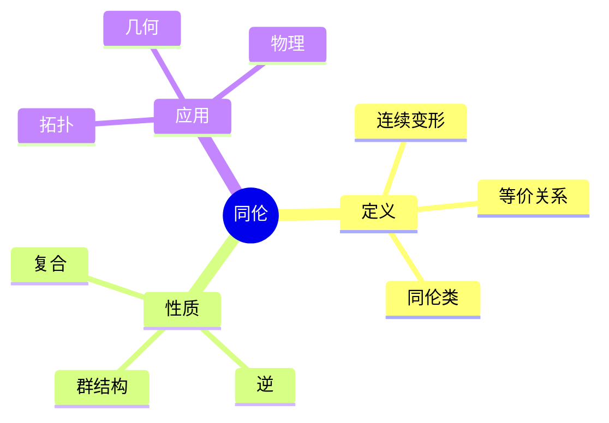
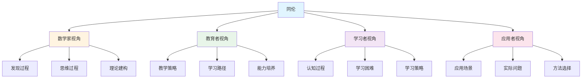
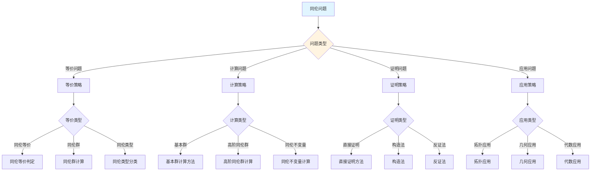
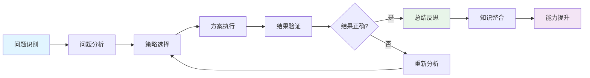
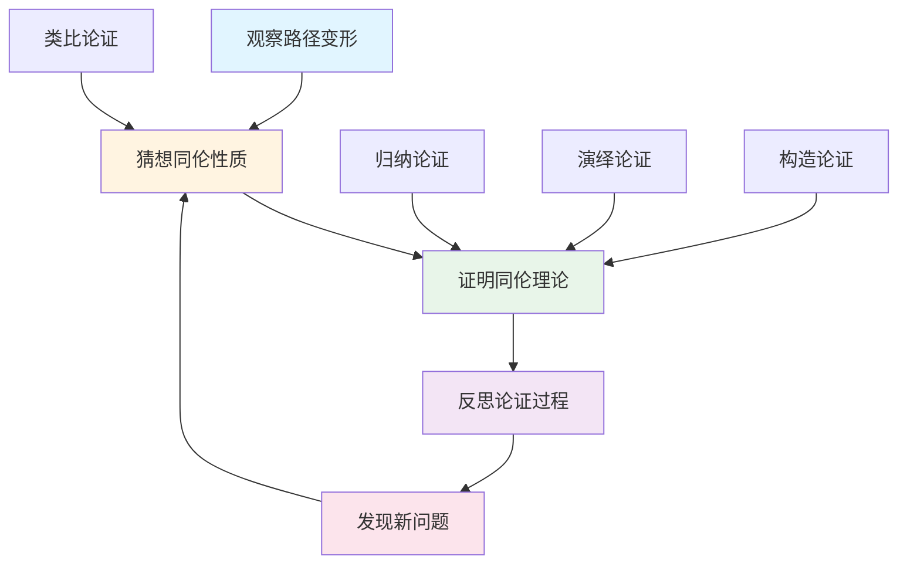
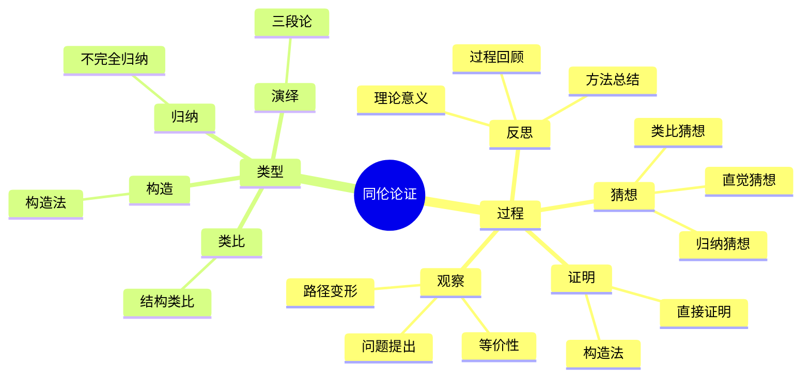
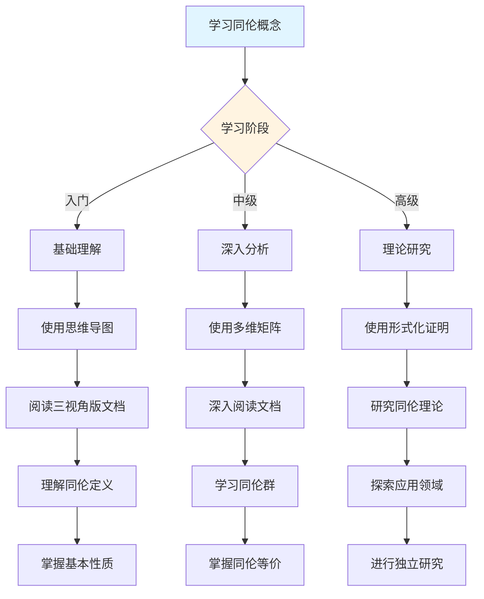
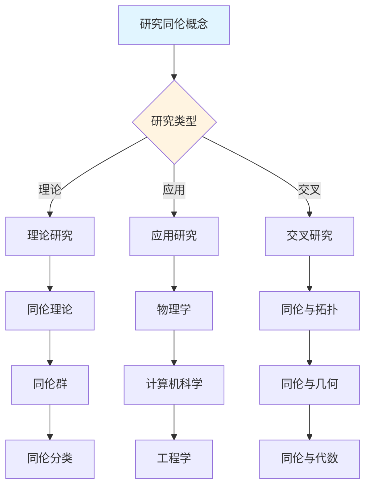
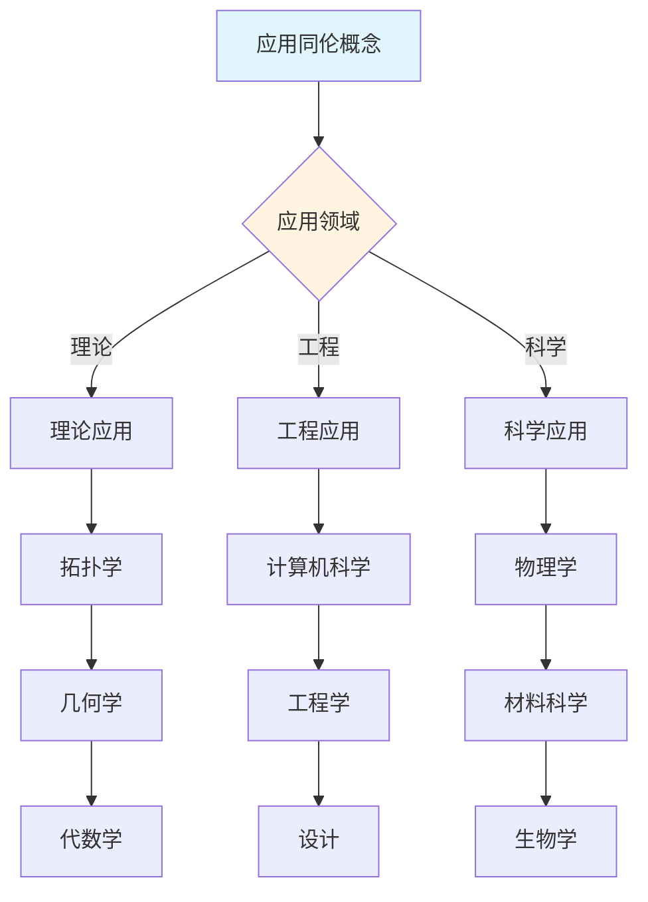
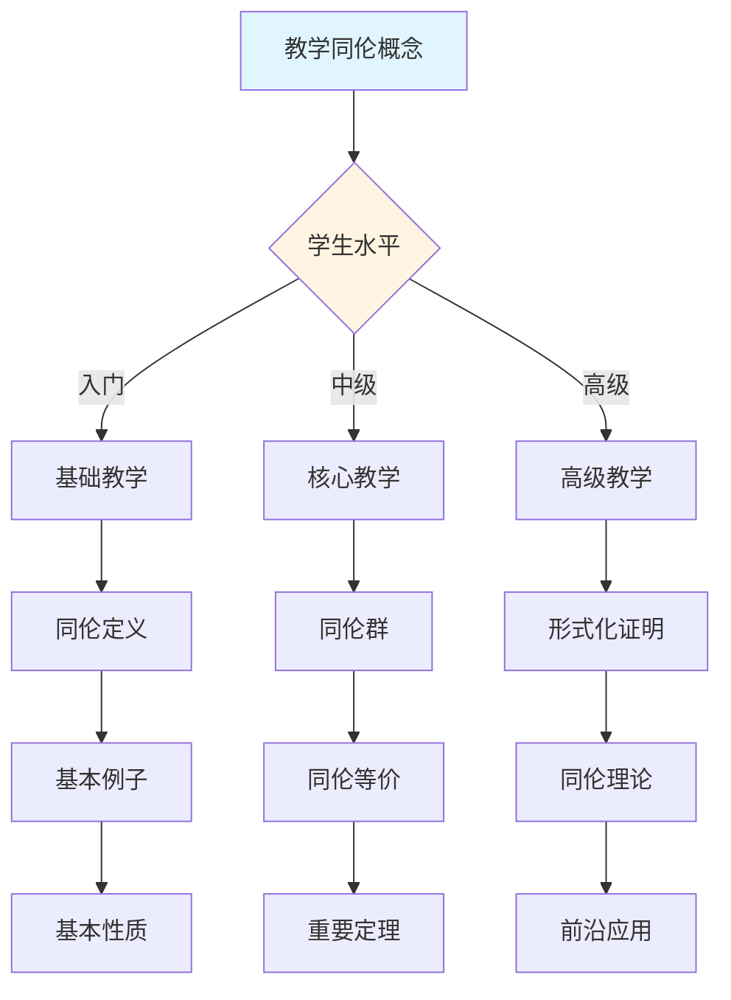

---
msc_primary: "00A99"
---

# 同伦 (Homotopy) - 三视角组织版

**概念编号**: C.CORE.024
**知识层次**: L0-L2
**知识领域**: D5 (拓扑)
**创建日期**: 2025年1月
**最后更新**: 2026-04-05

---

## 📋 目录 / Table of Contents

- [同伦 (Homotopy) - 三视角组织版](#同伦-homotopy---三视角组织版)
  - 📋 目录 / Table of Contents
  - 1. 📋 概述 (编号: C.CORE.024.01)
  - [🧠 认知学视角：如何理解同伦 (编号: C.CORE.024.02)](#认知学视角如何理解同伦-编号-ccore02402)
    - [认知起点 (编号: C.CORE.024.02.01)](#认知起点-编号-ccore0240201)
    - [认知过程 (编号: C.CORE.024.02.02)](#认知过程-编号-ccore0240202)
      - [阶段1：直观理解阶段 (编号: C.CORE.024.02.02.01)](#阶段1直观理解阶段-编号-ccore024020201)
      - [阶段2：概念形成阶段 (编号: C.CORE.024.02.02.02)](#阶段2概念形成阶段-编号-ccore024020202)
      - [阶段3：形式化阶段 (编号: C.CORE.024.02.02.03)](#阶段3形式化阶段-编号-ccore024020203)

## 形式化定义

**定义（同伦）**：设 $f, g: X \to Y$ 是连续映射，**同伦**是连续映射 $H: X \times [0,1] \to Y$，使得：
$$H(x, 0) = f(x), \quad H(x, 1) = g(x)$$
记作 $f \simeq g$ 或 $H: f \simeq g$

**同伦等价**：空间 $X$ 和 $Y$ **同伦等价**，如果存在映射 $f: X \to Y$, $g: Y \to X$ 使得：
$$g \circ f \simeq \text{id}_X, \quad f \circ g \simeq \text{id}_Y$$

**符号说明**：
- $\simeq$：同伦关系
- $[X, Y]$：同伦类集合
- $\pi_1(X, x_0)$：基本群
- $\pi_n(X, x_0)$：高阶同伦群

    - [认知障碍 (编号: C.CORE.024.02.03)](#认知障碍-编号-ccore0240203)
    - [认知工具 (编号: C.CORE.024.02.04)](#认知工具-编号-ccore0240204)
  - [🎓 教育学视角：如何教学同伦 (编号: C.CORE.024.03)](#教育学视角如何教学同伦-编号-ccore02403)
    - [教学目标 (编号: C.CORE.024.03.01)](#教学目标-编号-ccore0240301)
    - [教学路径 (编号: C.CORE.024.03.02)](#教学路径-编号-ccore0240302)
      - [阶段1：引入阶段（激发兴趣） (编号: C.CORE.024.03.02.01)](#阶段1引入阶段激发兴趣-编号-ccore024030201)
      - [阶段2：探索阶段（主动建构） (编号: C.CORE.024.03.02.02)](#阶段2探索阶段主动建构-编号-ccore024030202)
      - [阶段3：形式化阶段（抽象概括） (编号: C.CORE.024.03.02.03)](#阶段3形式化阶段抽象概括-编号-ccore024030203)
      - [阶段4：巩固阶段（应用深化） (编号: C.CORE.024.03.02.04)](#阶段4巩固阶段应用深化-编号-ccore024030204)
    - [教学难点 (编号: C.CORE.024.03.03)](#教学难点-编号-ccore0240303)
    - [教学策略 (编号: C.CORE.024.03.04)](#教学策略-编号-ccore0240304)
    - [评估方法 (编号: C.CORE.024.03.05)](#评估方法-编号-ccore0240305)
  - [🔬 数学家视角：如何思考同伦 (编号: C.CORE.024.04)](#数学家视角如何思考同伦-编号-ccore02404)
    - [问题起源 (编号: C.CORE.024.04.01)](#问题起源-编号-ccore0240401)
    - [思维过程 (编号: C.CORE.024.04.02)](#思维过程-编号-ccore0240402)
      - [步骤1：问题提出 (编号: C.CORE.024.04.02.01)](#步骤1问题提出-编号-ccore024040201)
      - [步骤2：概念形成 (编号: C.CORE.024.04.02.02)](#步骤2概念形成-编号-ccore024040202)
      - [步骤3：理论发展 (编号: C.CORE.024.04.02.03)](#步骤3理论发展-编号-ccore024040203)
    - [历史发展 (编号: C.CORE.024.04.03)](#历史发展-编号-ccore0240403)
    - [3.2 关键人物和贡献 (编号: C.CORE.024.04.04)](#32-关键人物和贡献-编号-ccore0240404)
    - [重要定理 (编号: C.CORE.024.04.05)](#重要定理-编号-ccore0240405)
    - [开放问题 (编号: C.CORE.024.04.06)](#开放问题-编号-ccore0240406)
    - [一、第一人称思维描述 (编号: C.CORE.024.04.07)](#一第一人称思维描述-编号-ccore0240407)
      - [1.1 Poincaré的发现过程](#11-poincaré的发现过程)
    - [二、数学直觉的形成 (编号: C.CORE.024.04.08)](#二数学直觉的形成-编号-ccore0240408)
      - [2.1 直觉在概念发现中的作用](#21-直觉在概念发现中的作用)
      - [2.2 如何培养同伦直觉](#22-如何培养同伦直觉)
    - [三、数学美的教育价值 (编号: C.CORE.024.04.09)](#三数学美的教育价值-编号-ccore0240409)
      - [3.1 同伦论的美在哪里](#31-同伦论的美在哪里)
      - [3.2 如何培养学生的数学美感](#32-如何培养学生的数学美感)
    - [四、问题解决策略 (编号: C.CORE.024.04.10)](#四问题解决策略-编号-ccore0240410)
      - [4.1 数学家的启发式方法](#41-数学家的启发式方法)
      - [4.2 思维过程分析](#42-思维过程分析)
    - [五、批判性反思 (编号: C.CORE.024.04.11)](#五批判性反思-编号-ccore0240411)
      - [5.1 同伦概念的局限性](#51-同伦概念的局限性)
      - [5.2 同伦理论的未解决问题](#52-同伦理论的未解决问题)
  - [💡 数学解释：为什么同伦是这样定义的 (编号: C.CORE.024.05)](#数学解释为什么同伦是这样定义的-编号-ccore02405)
    - [一、直观解释：同伦是什么？](#一直观解释同伦是什么)
      - [1.1 具体例子](#11-具体例子)
      - [1.2 形象类比](#12-形象类比)
      - [1.3 几何直观](#13-几何直观)
      - [1.4 操作体验](#14-操作体验)
    - [二、知性解释：同伦的本质是什么？](#二知性解释同伦的本质是什么)
      - [2.1 概念定义](#21-概念定义)
      - [2.2 分类体系](#22-分类体系)
      - [2.3 抽象结构](#23-抽象结构)
      - [2.4 知识体系](#24-知识体系)
    - [三、理性解释：同伦的公理化定义](#三理性解释同伦的公理化定义)
      - [3.1 公理体系](#31-公理体系)
      - [3.2 形式化证明](#32-形式化证明)
      - [3.3 系统建构](#33-系统建构)
    - [四、多视角解释：从不同角度理解同伦](#四多视角解释从不同角度理解同伦)
      - [4.1 数学家视角：同伦是如何被发现的？](#41-数学家视角同伦是如何被发现的)
      - [4.2 教育者视角：如何教学同伦？](#42-教育者视角如何教学同伦)
      - [4.3 学习者视角：如何学习同伦？](#43-学习者视角如何学习同伦)
      - [4.4 应用者视角：如何应用同伦？](#44-应用者视角如何应用同伦)
    - [五、思维表征：用多种方式理解同伦](#五思维表征用多种方式理解同伦)
      - [5.1 思维导图：同伦的知识结构](#51-思维导图同伦的知识结构)
      - [5.2 矩阵对比：不同解释方式的对比](#52-矩阵对比不同解释方式的对比)
      - [5.3 多视角表征：从不同角度表征同伦](#53-多视角表征从不同角度表征同伦)
      - [5.4 决策树：同伦问题分类和策略选择](#54-决策树同伦问题分类和策略选择)
      - [5.5 决策逻辑路径：同伦问题解决过程](#55-决策逻辑路径同伦问题解决过程)
      - [5.6 多维对比矩阵：同伦概念特征对比](#56-多维对比矩阵同伦概念特征对比)
  - [💡 数学解释：为什么同伦是这样定义的 (编号: C.CORE.024.05)](#数学解释为什么同伦是这样定义的-编号-ccore02405)
  - [🔍 数学论证：如何论证同伦 (编号: C.CORE.024.06)](#数学论证如何论证同伦-编号-ccore02406)
    - [一、论证过程：从观察到反思](#一论证过程从观察到反思)
    - [二、论证类型：多种推理方式](#二论证类型多种推理方式)
    - [三、论证可视化：用图形表示论证过程](#三论证可视化用图形表示论证过程)
  - [🔗 三视角整合 (编号: C.CORE.024.07)](#三视角整合-编号-ccore02407)
    - [三个视角的关联](#三个视角的关联)
    - [如何综合运用三个视角](#如何综合运用三个视角)
  - [📚 参考文献 (编号: C.CORE.024.08)](#参考文献-编号-ccore02408)
    - [权威资源](#权威资源)
    - [经典教材](#经典教材)
    - [研究论文](#研究论文)

---

## 1. 📋 概述 (编号: C.CORE.024.01)

同伦是描述连续映射之间"连续变形"的概念，是代数拓扑的基础。同伦理论在拓扑学、几何学、物理学等领域有广泛应用。

本文档从**数学认知学**、**教育学**、**数学家**三个视角深入展开同伦概念，避免简单的概念堆垒。

**权威资源对齐**:

- Wikipedia: [Homotopy](https://en.wikipedia.org/wiki/Homotopy)
- Stanford课程: Math 215A (Differential Topology)
- Princeton课程: MAT 530 (Topology)
- MIT课程: 18.901 (Introduction to Topology)
- Metamath: [Homotopy](http://us.metamath.org/mpeuni/df-homotopy.html)[需更新][需更新]

---

## 🧠 认知学视角：如何理解同伦 (编号: C.CORE.024.02)

### 认知起点 (编号: C.CORE.024.02.01)

**学习者已有的知识基础**:

- 连续映射的概念
- 拓扑空间的概念
- 日常经验中的"变形"、"连续变化"概念

**日常经验中的类似概念**:

- "变形"：连续变化
- "收缩"：连续收缩
- "拉伸"：连续拉伸

### 认知过程 (编号: C.CORE.024.02.02)

#### 阶段1：直观理解阶段 (编号: C.CORE.024.02.02.01)

**具体例子**:

- 例子1：任何映射与常值映射同伦（若空间道路连通）
- 例子2：圆上的恒等映射与常值映射不同伦
- 例子3：球面上的恒等映射与常值映射不同伦

**形象类比**:

- **变形类比**: 同伦就像"连续变形"
  - 两个映射同伦如果可以通过连续变形从一个变到另一个
  - 变形是"连续的"
  - 变形是"保持结构"的

- **路径类比**: 同伦就像"映射之间的路径"
  - 从$f$到$g$的路径
  - 路径是"连续的"
  - 路径描述"变形过程"

**可视化表示**:

```text
同伦:
    f ──H──> g
    |        |
    t=0      t=1
    连续变形
```

#### 阶段2：概念形成阶段 (编号: C.CORE.024.02.02.02)

**从例子中抽象出共同特征**:

- 所有例子都涉及"连续变形"
- 变形是"连续的"
- 变形是"保持结构"的

**识别关键属性**:

1. **连续性**: 变形是连续的
2. **参数化**: 变形通过参数$t \in [0,1]$参数化
3. **边界条件**: $H(x,0) = f(x)$，$H(x,1) = g(x)$

**建立概念边界**:

- **什么是同伦**: 连续映射之间的连续变形
- **什么不是同伦**:
  - 不连续的变形（不是同伦）
  - 不保持结构的变形（不是同伦）

#### 阶段3：形式化阶段 (编号: C.CORE.024.02.02.03)

**严格定义**:

- 同伦定义：存在连续映射$H: X \times [0,1] \to Y$使得$H(x,0) = f(x)$和$H(x,1) = g(x)$
- 同伦等价：拓扑空间之间的同伦等价

**公理化表述**:

- 同伦是连续映射之间的等价关系
- 同伦等价是拓扑空间之间的等价关系

**逻辑结构**:

- 同伦是代数拓扑的基础
- 同伦是研究拓扑不变量的工具
- 同伦是几何学的基础

### 认知障碍 (编号: C.CORE.024.02.03)

**常见误解**:

1. **误解1**: 认为所有映射都同伦
   - **纠正**: 不是所有映射都同伦，如同伦群非平凡

2. **误解2**: 认为同伦就是同胚
   - **纠正**: 同伦是映射之间的关系，同胚是空间之间的关系

3. **误解3**: 混淆同伦和同调
   - **纠正**: 同伦和同调是不同的不变量

**理解难点**:

1. **难点1**: 同伦的抽象性
   - **原因**: 同伦比较抽象
   - **解决方法**: 从直观理解开始，逐步形式化

2. **难点2**: 同伦群
   - **原因**: 同伦群比较抽象
   - **解决方法**: 用具体例子，强调同伦群的作用

3. **难点3**: 同伦等价
   - **原因**: 同伦等价比较抽象
   - **解决方法**: 用具体例子，强调同伦等价的重要性

**认知陷阱**:

- **同伦**: 需要理解"连续变形"的含义
- **同伦群**: 需要理解同伦群的作用

### 认知工具 (编号: C.CORE.024.02.04)

**类比工具**:

- **变形类比**: 同伦 = 连续变形
- **路径类比**: 同伦 = 映射之间的路径

**可视化工具**:

- **同伦图**: 用同伦图表示同伦
- **变形动画**: 用变形动画表示同伦

**具体化工具**:

- **具体例子**: 用具体例子理解抽象概念
- **反例**: 用反例理解概念边界

---

## 🎓 教育学视角：如何教学同伦 (编号: C.CORE.024.03)

### 教学目标 (编号: C.CORE.024.03.01)

**知识目标**:

- 理解同伦的基本概念
- 掌握同伦的定义
- 理解同伦的性质
- 理解同伦群

**能力目标**:

- 能够判断映射是否同伦
- 能够理解同伦的性质
- 能够应用同伦解决实际问题
- 能够理解同伦群

**情感目标**:

- 培养数学抽象思维
- 培养几何思维
- 激发对数学的兴趣

### 教学路径 (编号: C.CORE.024.03.02)

#### 阶段1：引入阶段（激发兴趣） (编号: C.CORE.024.03.02.01)

**实际问题**:

- 问题1：如何描述映射之间的"连续变形"？
- 问题2：如何研究拓扑不变量？
- 问题3：如何研究几何结构？

**历史背景**:

- 同伦的历史发展
- 同伦在数学中的地位
- 同伦在几何中的应用

**引发认知冲突**:

- 问题：如何统一描述各种"连续变形"？
- 引出同伦的概念

#### 阶段2：探索阶段（主动建构） (编号: C.CORE.024.03.02.02)

**引导发现**:

1. 让学生自己列举"连续变形"的例子
2. 让学生观察这些例子的共同特征
3. 引导学生抽象出同伦的定义

**合作探究**:

- 小组讨论：什么是同伦？
- 小组讨论：同伦有哪些性质？
- 小组讨论：如何表示同伦？

**多元表征**:

- **语言表征**: "同伦是连续映射之间的连续变形"
- **符号表征**: $f \simeq g$
- **图形表征**: 同伦图、变形动画
- **集合表征**: 同伦定义

#### 阶段3：形式化阶段（抽象概括） (编号: C.CORE.024.03.02.03)

**严格定义**:

- 同伦的定义
- 同伦的性质
- 同伦群

**性质证明**:

- 同伦的基本性质
- 同伦群的群结构
- 同伦等价

**应用拓展**:

- 同伦在拓扑学中的应用
- 同伦在几何中的应用
- 同伦在物理中的应用

#### 阶段4：巩固阶段（应用深化） (编号: C.CORE.024.03.02.04)

**练习应用**:

- 基础练习：同伦的判断和性质
- 应用练习：用同伦解决实际问题
- 综合练习：同伦的综合应用

**变式训练**:

- 不同形式的同伦
- 不同难度的同伦问题
- 同伦群的计算

**知识整合**:

- 同伦与其他概念的联系
- 同伦在数学体系中的地位

### 教学难点 (编号: C.CORE.024.03.03)

**难点1：同伦的抽象性**:

- **难点描述**: 学生难以理解同伦的抽象概念
- **解决方法**:
  - 从直观理解开始
  - 逐步形式化
  - 用具体例子说明

**难点2：同伦群**:

- **难点描述**: 学生难以理解同伦群
- **解决方法**:
  - 用具体例子
  - 强调同伦群的作用
  - 用图形可视化

**难点3：同伦等价**:

- **难点描述**: 学生难以理解同伦等价
- **解决方法**:
  - 用具体例子
  - 强调同伦等价的重要性
  - 用反例说明

### 教学策略 (编号: C.CORE.024.03.04)

**策略1：从具体到抽象**:

- 先给出具体例子
- 再抽象出一般概念
- 最后给出严格定义

**策略2：多元表征**:

- 用语言、符号、图形等多种方式表示同一概念
- 帮助学生建立不同表征之间的联系

**策略3：问题驱动**:

- 从实际问题出发
- 引出数学概念
- 解决问题

**策略4：可视化教学**:

- 使用同伦图
- 使用变形动画
- 使用具体例子

### 评估方法 (编号: C.CORE.024.03.05)

**形成性评估**（评估理解过程）:

- 课堂提问：检查学生对概念的理解
- 小组讨论：观察学生的思考过程
- 练习作业：检查学生的应用能力

**总结性评估**（评估最终理解）:

- 测验：检查学生对概念和性质的掌握
- 项目：检查学生应用同伦解决实际问题的能力
- 反思：检查学生对同伦概念的理解深度

---

## 🔬 数学家视角：如何思考同伦 (编号: C.CORE.024.04)

### 问题起源 (编号: C.CORE.024.04.01)

**历史背景**:

- 19世纪：同伦的起源
- 20世纪初：同伦的系统化
- 20世纪中期：同伦的现代发展

**原始问题**:

- **问题1**: 如何描述映射之间的"连续变形"？
- **问题2**: 如何研究拓扑不变量？
- **问题3**: 同伦有哪些性质？

**研究动机**:

- 研究拓扑不变量
- 发展代数拓扑
- 统一几何理论

### 思维过程 (编号: C.CORE.024.04.02)

#### 步骤1：问题提出 (编号: C.CORE.024.04.02.01)

**观察到的现象**:

- 映射可以"连续变形"
- 需要研究拓扑不变量
- 需要统一几何理论

**提出的猜想**:

- 可以引入同伦概念
- 同伦可以描述"连续变形"
- 同伦有丰富的性质

**需要解决的问题**:

- 如何定义同伦？
- 同伦应该满足什么条件？
- 同伦有哪些性质？

#### 步骤2：概念形成 (编号: C.CORE.024.04.02.02)

**尝试性定义**:

- **连续变形定义**: 通过连续映射$H: X \times [0,1] \to Y$
- **等价关系定义**: 同伦是等价关系

**性质探索**:

- 同伦的基本性质
- 同伦群的群结构
- 同伦等价

**结构发现**:

- 同伦是代数拓扑的基础
- 同伦是研究拓扑不变量的工具
- 同伦是几何学的基础

#### 步骤3：理论发展 (编号: C.CORE.024.04.02.03)

**定理证明**:

- 同伦的基本性质
- 同伦群的群结构
- 同伦等价

**应用拓展**:

- 同伦在拓扑学中的应用
- 同伦在几何中的应用
- 同伦在物理中的应用

**理论完善**:

- 同伦的严格定义
- 同伦的范畴论研究
- 同伦的应用研究

### 历史发展 (编号: C.CORE.024.04.03)

**早期阶段**（19世纪）:

- **Poincaré (1895)**: 引入同伦概念
- **Brouwer (1911)**: 研究同伦群

**关键突破**（20世纪初）:

- **Hurewicz (1935)**: 发展同伦群理论
- **Whitehead (1949)**: 研究同伦类型

**现代发展**（20世纪中期）:

- **Quillen (1967)**: 发展模型范畴
- **Grothendieck (1960s)**: 在代数几何中应用同伦

### 3.2 关键人物和贡献 (编号: C.CORE.024.04.04)

**Henri Poincaré (1854-1912)**:

- 引入同伦概念
- 建立代数拓扑基础

**Witold Hurewicz (1904-1956)**:

- 发展同伦群理论
- 建立现代代数拓扑

**Daniel Quillen (1940-2011)**:

- 发展模型范畴
- 建立现代同伦理论

### 重要定理 (编号: C.CORE.024.04.05)

**Hurewicz定理**:

- 同伦群和同调群的关系
- 意义：连接同伦和同调

**Whitehead定理**:

- 同伦等价的条件
- 意义：同伦分类的基础

**同伦群的群结构**:

- 同伦群构成群
- 意义：同伦群的计算基础

### 开放问题 (编号: C.CORE.024.04.06)

**未解决问题**:

- 同伦群的计算问题
- 同伦的应用问题
- 同伦的推广问题

**研究方向**:

- 同伦的范畴论研究
- 同伦的几何研究
- 同伦的应用研究

### 一、第一人称思维描述 (编号: C.CORE.024.04.07)

#### 1.1 Poincaré的发现过程

**详细历史背景**:

- **1895年**：Poincaré发表《位置分析》（Analysis Situs）
- **背景**：研究拓扑，发现映射可以连续变形
- **问题**：如何描述映射的连续变形？如何分类拓扑空间？

**Poincaré的详细第一人称描述**:
> "1895年，我在研究拓扑时，遇到了一个问题：如何分类拓扑空间？
>
> 我发现，有些映射可以连续变形。例如，从$S^1$到$\mathbb{R}^2$的映射$f$和$g$，如果$f$可以连续变形到$g$，则它们是同伦的。
>
> 我的方法是这样的：
>
> - **思路**：用同伦描述映射的连续变形
> - **定义**：映射$f, g: X \to Y$同伦，如果存在连续映射$H: X \times [0,1] \to Y$，使得$H(x,0) = f(x)$，$H(x,1) = g(x)$
> - **例子**：从$S^1$到$\mathbb{R}^2$的映射，如果它们绕原点转的圈数相同，则同伦
>
> 例如，对于$S^1$到$\mathbb{R}^2$的映射：
>
> - **映射1**：$f(\theta) = (\cos\theta, \sin\theta)$（绕原点1圈）
> - **映射2**：$g(\theta) = (\cos 2\theta, \sin 2\theta)$（绕原点2圈）
> - **同伦**：$f$和$g$不同伦，因为绕的圈数不同
> - **同伦群**：$\pi_1(S^1) = \mathbb{Z}$（基本群）
>
> 我还发现了同伦群：
>
> - **定义**：$\pi_n(X, x_0)$是$S^n$到$X$的映射的同伦类
> - **群结构**：$\pi_n(X, x_0)$构成群
> - **意义**：同伦群是拓扑不变量
>
> 这让我意识到，同伦是描述映射连续变形的工具，同伦群是拓扑不变量。这为拓扑学提供了基础。"

**详细的思维过程**:

1. **观察到的现象**（1895年）:

   **现象1：映射可以连续变形**
   - **问题**：如何描述映射的连续变形？
   - **例子**：从$S^1$到$\mathbb{R}^2$的映射
   - **需要**：统一的概念

   **现象2：这种变形有特殊的性质**
   - **问题**：同伦有什么性质？
   - **例子**：同伦是等价关系
   - **需要**：建立同伦理论

   **现象3：需要统一的概念**
   - **问题**：如何统一处理不同的映射？
   - **思路**：用同伦统一
   - **需要**：建立同伦理论

2. **提出的猜想**（1895年）:

   **猜想1：用同伦描述连续变形**
   - **思路**：定义同伦为连续映射$H: X \times [0,1] \to Y$
   - **例子**：从$S^1$到$\mathbb{R}^2$的映射
   - **优点**：统一描述连续变形

   **猜想2：同伦群的结构**
   - **群结构**：$\pi_n(X, x_0)$构成群
   - **例子**：$\pi_1(S^1) = \mathbb{Z}$
   - **意义**：同伦群是拓扑不变量

   **猜想3：同伦是拓扑学的基础**
   - **性质**：同伦是拓扑不变量
   - **应用**：同伦可以应用到更广泛的领域
   - **意义**：同伦是统一的拓扑结构

3. **遇到的困难**（1895年）:

   **困难1：如何严格定义同伦？**
   - **问题**：如何定义同伦？
   - **解决**：定义同伦为连续映射$H: X \times [0,1] \to Y$
   - **意义**：为同伦提供严格的数学基础

   **困难2：如何计算同伦群？**
   - **问题**：如何计算$\pi_n(X, x_0)$？
   - **解决**：使用同伦长正合列、谱序列
   - **意义**：为同伦提供计算方法

   **困难3：如何应用同伦理论？**
   - **问题**：如何用同伦理论解决实际问题？
   - **解决**：建立同伦分类理论、稳定同伦理论
   - **意义**：为同伦提供应用基础

4. **突破的时刻**（1895年，Poincaré）:

   **突破1：同伦的概念**
   - 引入同伦的概念描述连续变形
   - **关键**：同伦是等价关系
   - **意义**：为拓扑学提供基础

   **突破2：同伦群**
   - 建立同伦群理论
   - **关键**：$\pi_n(X, x_0)$构成群
   - **意义**：为拓扑分类提供工具

   **突破3：同伦理论的广泛应用**
   - 同伦理论可以应用到更广泛的领域
   - **关键**：同伦是拓扑不变量
   - **意义**：同伦理论成为拓扑学的基础

### 二、数学直觉的形成 (编号: C.CORE.024.04.08)

#### 2.1 直觉在概念发现中的作用

**Poincaré的直觉**:

- **直觉1**: "同伦"是"连续变形"——这个直觉引导Poincaré发现同伦
- **直觉2**: 同伦可以分类拓扑空间——这个直觉引导Poincaré建立同伦理论
- **直觉3**: 同伦是拓扑学的基础——这个直觉引导Poincaré建立同伦理论

**直觉的验证**:

- 通过严格的数学证明验证直觉的正确性
- 通过同伦群严格化同伦定义
- 通过应用验证同伦的广泛性

**直觉的深化**:

- 从"连续变形"到"同伦的严格定义"
- 从"分类拓扑空间"到"同伦的广泛应用"
- 从"拓扑学基础"到"同伦的深入发展"

#### 2.2 如何培养同伦直觉

**数学家的建议**:

- **Poincaré**: "同伦直觉是长期训练的结果。通过大量练习和深入思考，我们可以培养对同伦的直觉。"
- **Hurewicz**: "从具体例子开始，逐步抽象，这是培养同伦直觉的有效方法。"

**培养方法**:

1. **大量练习**: 通过大量同伦构造练习，培养对同伦的直觉
2. **深入思考**: 深入思考同伦的本质，理解同伦的深层结构
3. **类比和联想**: 通过类比和联想，建立同伦与其他概念的联系
4. **与专家交流**: 与数学家交流，学习他们的思维方式

**教学启示**:

- 从具体例子开始，逐步抽象
- 鼓励学生思考同伦的本质
- 引导学生建立同伦与其他概念的联系

### 三、数学美的教育价值 (编号: C.CORE.024.04.09)

#### 3.1 同伦论的美在哪里

**结构美**:

- **简洁性**: 同伦的概念非常简洁——"映射之间的连续变形"
- **统一性**: 同伦可以统一描述数学中的各种变形
- **和谐性**: 同伦运算满足优美的规律（同伦群、同伦等价等）

**数学家的评价**:

- **Poincaré**: "同伦论的美在于它的统一性。它为我们提供了一个统一的框架来理解拓扑变形。"
- **Hurewicz**: "同伦论的美在于它的基础性。它是拓扑学的基础，所有拓扑变形都可以用同伦来描述。"

#### 3.2 如何培养学生的数学美感

**数学家的建议**:

- **Poincaré**: "展示同伦论的美感，让学生感受到数学的美。"
- **Hurewicz**: "通过同伦论的历史和发展，让学生理解数学的美。"

**教学方法**:

1. **展示数学美**:
   - 展示同伦概念的简洁性和统一性
   - 展示同伦运算的优美规律
   - 展示同伦在数学中的基础地位

2. **引导学生欣赏**:
   - 引导学生欣赏同伦概念的简洁性
   - 引导学生欣赏同伦运算的和谐性
   - 引导学生欣赏同伦的基础性

3. **鼓励学生创造美**:
   - 鼓励学生发现同伦论的美
   - 鼓励学生创造优美的同伦证明
   - 鼓励学生探索同伦论的美

### 四、问题解决策略 (编号: C.CORE.024.04.10)

#### 4.1 数学家的启发式方法

**策略1：从具体到抽象**:

- 从具体的同伦例子开始
- 抽象出同伦的一般性质
- 建立同伦的理论体系

**策略2：从简单到复杂**:

- 先理解基本同伦
- 再理解同伦运算
- 最后理解同伦理论

**策略3：从问题到理论**:

- 从实际问题出发
- 引出同伦概念
- 建立同伦理论

#### 4.2 思维过程分析

**问题识别**:

- 识别问题类型：同伦定义问题、同伦性质问题、同伦应用问题
- 识别问题难度：简单问题、中等问题、复杂问题

**策略选择**:

- 简单问题：直接方法
- 中等问题：分步方法
- 复杂问题：分解方法

**执行和反思**:

- 执行策略，解决问题
- 反思过程，总结经验
- 改进方法，提高效率

### 五、批判性反思 (编号: C.CORE.024.04.11)

#### 5.1 同伦概念的局限性

**概念的边界**:

- 同伦只描述连续变形，不能描述所有数学变形
- 同伦是抽象的，需要具体化才能应用
- 同伦不能表示所有数学量

**概念的推广**:

- 同伦范畴：范畴论中的同伦
- 稳定同伦：更一般的同伦
- 导出同伦：同调代数中的同伦

#### 5.2 同伦理论的未解决问题

**未解决的问题**:

- 同伦群的计算问题：如何计算复杂同伦群？
- 同伦的应用问题：如何更好地应用同伦？
- 同伦的推广问题：如何推广同伦概念？

**研究方向**:

- 同伦的范畴论研究
- 同伦的几何研究
- 同伦的应用研究

---

## 💡 数学解释：为什么同伦是这样定义的 (编号: C.CORE.024.05)

### 一、直观解释：同伦是什么？

#### 1.1 具体例子

**生活中的例子**：

- **连续变形**：同伦描述"连续变形"
  - 例如：一个圆可以连续变形为另一个圆
  - **为什么这样定义**：因为我们需要一个概念来表示"连续变形"
- **橡皮筋变形**：橡皮筋可以连续变形
  - 例如：橡皮筋可以拉伸和弯曲，但不能撕裂
  - **为什么这样定义**：因为我们需要一个概念来表示"连续变形"
- **路径变形**：路径可以连续变形
  - 例如：一条路径可以连续变形为另一条路径
  - **为什么这样定义**：因为我们需要一个概念来表示"路径的连续变形"

**数学中的例子**：

- **映射的同伦**：$H: X \times [0,1] \to Y$是$f$到$g$的同伦
  - **为什么这样定义**：我们需要一个简单的方式来表示"映射的连续变形"
- **路径的同伦**：两条路径如果可以通过连续变形相互转换，则同伦
  - **为什么这样定义**：我们需要一个概念来表示"路径的连续变形"
- **同伦等价**：两个空间如果可以通过连续变形相互转换，则同伦等价
  - **为什么这样定义**：我们需要一个概念来表示"空间的连续变形"

#### 1.2 形象类比

**橡皮筋类比**：

- **同伦就像"橡皮筋变形"**
  - 橡皮筋可以拉伸和弯曲
  - 同伦也可以连续变形
- **为什么这样类比**：这个类比帮助我们理解同伦的"连续变形"性质

**路径类比**：

- **同伦就像"路径变形"**
  - 路径可以连续变形
  - 同伦也可以连续变形
- **为什么这样类比**：这个类比帮助我们理解同伦的"路径"性质

#### 1.3 几何直观

**同伦图形表示**：

- 使用图形表示同伦
- 例如：用动画表示连续变形
- **为什么使用图形**：图形提供几何直观，帮助我们理解同伦

**同伦参数表示**：

- 使用参数表示同伦
- 例如：$H_t(x) = H(x, t)$是$t$时刻的映射
- **为什么使用参数**：参数提供几何直观，帮助我们理解同伦的连续变形

#### 1.4 操作体验

**同伦运算的操作**：

- **同伦的复合**：同伦可以复合
  - **为什么这样操作**：因为我们需要一个运算来表示"同伦的复合"
- **同伦的逆**：同伦有逆
  - **为什么这样操作**：因为我们需要一个运算来表示"同伦的逆"
- **同伦的等价**：同伦是等价关系
  - **为什么这样操作**：因为我们需要一个工具来表示"同伦的等价"

### 二、知性解释：同伦的本质是什么？

#### 2.1 概念定义

**同伦的内涵**：

- **同伦是描述连续映射之间"连续变形"的概念**
  - **连续变形**：$H: X \times [0,1] \to Y$是连续映射
  - **等价关系**：同伦是等价关系
  - **结构**：同伦类形成等价类
- **为什么这样定义**：这些特征使得同伦成为一个完整的拓扑工具，支持所有连续变形研究

**同伦的外延**：

- **映射的同伦**：两个映射如果可以通过连续变形相互转换，则同伦
- **路径的同伦**：两条路径如果可以通过连续变形相互转换，则同伦
- **空间的同伦等价**：两个空间如果可以通过连续变形相互转换，则同伦等价
- **为什么这样分类**：不同的同伦类型有不同的性质和用途

#### 2.2 分类体系

**按类型分类**：

- **映射的同伦**：$f \simeq g$表示$f$和$g$同伦
- **路径的同伦**：两条路径如果同伦，则属于同一同伦类
- **空间的同伦等价**：两个空间如果同伦等价，则具有相同的同伦类型
- **为什么这样分类**：类型是同伦的基本特征

**按性质分类**：

- **相对同伦**：在同伦过程中保持某些点不变
- **自由同伦**：在同伦过程中没有限制
- **为什么这样分类**：性质是同伦的重要特征

#### 2.3 抽象结构

**同伦的运算结构**：

- **同伦的复合**：同伦可以复合
- **同伦的逆**：同伦有逆
- **为什么有这些运算**：这些运算使得同伦具有代数结构（群结构）

**同伦的关系结构**：

- **同伦的等价**：同伦是等价关系
- **同伦类**：同伦类形成等价类
- **为什么有这个关系**：这个关系帮助我们研究同伦的结构

#### 2.4 知识体系

**同伦在数学体系中的位置**：

- **基础地位**：同伦是代数拓扑的基础
  - 同伦可以定义同伦群
  - 同伦可以定义同伦类型
- **为什么是基础**：同伦提供了统一的框架来研究连续变形

**同伦与其他概念的关系**：

- **同伦与连续**：同伦是连续映射的连续变形
- **同伦与同调**：同伦和同调都是拓扑不变量
- **同伦与几何**：同伦在几何中有重要应用
- **为什么有这些关系**：这些关系揭示了同伦与其他数学概念的内在联系

### 三、理性解释：同伦的公理化定义

#### 3.1 公理体系

**同伦的定义**：

- **定义**：$H: X \times [0,1] \to Y$是$f$到$g$的同伦如果$H(x, 0) = f(x)$且$H(x, 1) = g(x)$
- **为什么需要这个定义**：这个定义提供了同伦的严格数学基础

**同伦的公理**：

- **自反性**：$f \simeq f$
- **对称性**：如果$f \simeq g$，则$g \simeq f$
- **传递性**：如果$f \simeq g$且$g \simeq h$，则$f \simeq h$
- **为什么这样定义**：这些公理将同伦放在更一般的框架中

#### 3.2 形式化证明

**同伦性质的证明**：

##### 定理1：同伦的复合

**定理陈述**：如果$f_0 \simeq f_1: X \to Y$和$g_0 \simeq g_1: Y \to Z$，则$g_0 \circ f_0 \simeq g_1 \circ f_1: X \to Z$。

**形式化表述**：
$$\forall f_0, f_1: X \to Y, \forall g_0, g_1: Y \to Z,$$
$$(f_0 \simeq f_1 \land g_0 \simeq g_1) \implies (g_0 \circ f_0 \simeq g_1 \circ f_1)$$

**证明**：
1. **构造同伦**：
   - 设$H: X \times I \to Y$是$f_0$到$f_1$的同伦
   - 设$K: Y \times I \to Z$是$g_0$到$g_1$的同伦
   - 定义$L: X \times I \to Z$为：
     $$L(x, t) = \begin{cases}
     K(H(x, 2t), 0) & \text{如果 } t \in [0, 1/2] \\
     K(f_1(x), 2t-1) & \text{如果 } t \in [1/2, 1]
     \end{cases}$$

2. **验证连续性**：
   - 在$t = 1/2$处，$K(H(x, 1), 0) = K(f_1(x), 0) = g_0(f_1(x))$
   - 且$K(f_1(x), 0) = K(f_1(x), 0)$，因此$L$在$t = 1/2$处连续
   - 在其他点，$L$是连续映射的复合，因此连续

3. **验证边界条件**：
   - $L(x, 0) = K(H(x, 0), 0) = K(f_0(x), 0) = g_0(f_0(x))$
   - $L(x, 1) = K(f_1(x), 1) = g_1(f_1(x))$

**为什么这样证明**：利用同伦的定义和连续映射的复合性质，通过"先同伦$f$，再同伦$g$"的策略构造复合同伦。

---

##### 定理2：同伦群的群结构

**定理陈述**：对于带基点的拓扑空间$(X, x_0)$，$n$次同伦群$\pi_n(X, x_0)$是群。

**形式化表述**：
$$\forall (X, x_0), \forall n \geq 1, (\pi_n(X, x_0), \cdot)\text{是群}$$

**证明**（以$n = 1$为例，即基本群）：
1. **群运算定义**：
   - 对$[f], [g] \in \pi_1(X, x_0)$，定义：
     $$[f] \cdot [g] = [f * g]$$
   - 其中$f * g$是路径的复合：
     $$(f * g)(t) = \begin{cases}
     f(2t) & \text{如果 } t \in [0, 1/2] \\
     g(2t-1) & \text{如果 } t \in [1/2, 1]
     \end{cases}$$

2. **验证结合律**：
   - 需要证明$([f] \cdot [g]) \cdot [h] = [f] \cdot ([g] \cdot [h])$
   - 构造显式同伦证明$(f * g) * h \simeq f * (g * h)$

3. **单位元**：
   - 常值路径$c_{x_0}$是单位元
   - 证明$[f] \cdot [c_{x_0}] = [f]$和$[c_{x_0}] \cdot [f] = [f]$

4. **逆元**：
   - $[f]^{-1} = [f^{-1}]$，其中$f^{-1}(t) = f(1-t)$
   - 证明$[f] \cdot [f^{-1}] = [c_{x_0}]$

**为什么这样证明**：利用路径的复合和同伦的等价关系，通过显式构造验证群的公理。

---

##### 定理3：同伦等价是等价关系

**定理陈述**：拓扑空间之间的同伦等价关系是等价关系。

**形式化表述**：
- **自反性**：$X \simeq X$
- **对称性**：$X \simeq Y \implies Y \simeq X$
- **传递性**：$(X \simeq Y \land Y \simeq Z) \implies X \simeq Z$

**证明**：
1. **自反性**：
   - 恒等映射$\text{id}_X: X \to X$是同伦等价
   - 因为$\text{id}_X \circ \text{id}_X = \text{id}_X \simeq \text{id}_X$

2. **对称性**：
   - 如果$f: X \to Y$和$g: Y \to X$是同伦逆，则$g: Y \to X$和$f: X \to Y$也是同伦逆

3. **传递性**：
   - 如果$f: X \to Y$，$g: Y \to Z$是同伦等价
   - 则$g \circ f: X \to Z$是同伦等价
   - 其同伦逆是$f^{-1} \circ g^{-1}$

**为什么这样证明**：利用同伦等价的定义和同伦的复合性质，从局部性质推导全局性质。

#### 3.3 系统建构

**同伦论在数学基础中的地位**：

- **作为代数拓扑基础**：同伦是代数拓扑的基础
- **提供拓扑工具**：同伦提供了研究拓扑的工具
- **统一框架**：同伦统一了各种连续变形研究

**同伦论的发展历史**：

- **Poincaré的引入**（1895年）：引入同伦概念
- **Hurewicz的发展**（1935年）：发展同伦群理论
- **为什么这样发展**：数学的发展需要严格的基础，同伦论的发展反映了这一需求

### 四、多视角解释：从不同角度理解同伦

#### 4.1 数学家视角：同伦是如何被发现的？

**Poincaré的发现过程**：

- **问题提出**：如何描述"连续变形"？
- **关键洞察**：使用同伦映射，发现同伦的代数结构
- **重要发现**：同伦可以用于研究拓扑不变量
- **为什么这样发现**：数学家的直觉和严格证明相结合

#### 4.2 教育者视角：如何教学同伦？

**教学策略**：

- **从具体到抽象**：先学习具体例子（路径的同伦），再学习抽象定义
- **从简单到复杂**：先学习简单同伦，再学习复杂同伦
- **从直观到形式化**：先使用动画等直观工具，再学习严格定义
- **为什么这样教学**：符合认知规律，帮助学生逐步建立理解

#### 4.3 学习者视角：如何学习同伦？

**认知过程**：

- **直观阶段**：通过具体例子理解同伦的含义
- **概念阶段**：理解同伦的定义和性质
- **形式化阶段**：理解严格定义和证明
- **为什么这样学习**：符合认知发展规律

#### 4.4 应用者视角：如何应用同伦？

**应用场景**：

- **拓扑**：使用同伦研究拓扑不变量
- **几何**：使用同伦研究几何结构
- **物理**：使用同伦研究物理系统
- **为什么这样应用**：同伦提供了强大的工具来处理各种问题

### 五、思维表征：用多种方式理解同伦

#### 5.1 思维导图：同伦的知识结构


```mermaid
mindmap
  root((同伦))
    定义
      连续变形
      等价关系
      同伦类
    性质
      复合
      逆
      群结构
    应用
      拓扑
      几何
      物理
```

#### 5.2 矩阵对比：不同解释方式的对比

| 解释方式 | 特点 | 方法 | 工具 | 适用阶段 | 优势 | 局限 |
|---------|------|------|------|---------|------|------|
| **直观解释** | 具体、形象、可视 | 例子、类比、直观 | 动画、图形 | 入门阶段 | 易于理解 | 不够严格 |
| **知性解释** | 概念、分类、抽象 | 定义、分类、结构 | 概念图、知识图谱 | 中级阶段 | 系统完整 | 不够直观 |
| **理性解释** | 公理、证明、形式化 | 公理、证明、系统 | 形式化工具、证明系统 | 高级阶段 | 严格准确 | 不够具体 |
| **多视角解释** | 多角度、整合 | 多视角、整合 | 多视角工具 | 所有阶段 | 全面深入 | 可能复杂 |

#### 5.3 多视角表征：从不同角度表征同伦


```mermaid
graph TD
    A[同伦] --> B[数学家视角]
    A --> C[教育者视角]
    A --> D[学习者视角]
    A --> E[应用者视角]

    B --> B1[发现过程]
    B --> B2[思维过程]
    B --> B3[理论建构]

    C --> C1[教学策略]
    C --> C2[学习路径]
    C --> C3[能力培养]

    D --> D1[认知过程]
    D --> D2[学习困难]
    D --> D3[学习策略]

    E --> E1[应用场景]
    E --> E2[实际问题]
    E --> E3[方法选择]

    style A fill:#e1f5ff
    style B fill:#fff4e1
    style C fill:#e8f5e9
    style D fill:#f3e5f5
    style E fill:#fce4ec
```

#### 5.4 决策树：同伦问题分类和策略选择


```mermaid
graph TD
    A[同伦问题] --> B{问题类型}
    B -->|等价问题| C[等价策略]
    B -->|计算问题| D[计算策略]
    B -->|证明问题| E[证明策略]
    B -->|应用问题| F[应用策略]

    C --> C1{等价类型}
    C1 -->|同伦等价| C2[同伦等价判定]
    C1 -->|同伦群| C3[同伦群计算]
    C1 -->|同伦类型| C4[同伦类型分类]

    D --> D1{计算类型}
    D1 -->|基本群| D2[基本群计算方法]
    D1 -->|高阶同伦群| D3[高阶同伦群计算]
    D1 -->|同伦不变量| D4[同伦不变量计算]

    E --> E1{证明类型}
    E1 -->|直接证明| E2[直接证明方法]
    E1 -->|构造法| E3[构造法]
    E1 -->|反证法| E4[反证法]

    F --> F1{应用类型}
    F1 -->|拓扑应用| F2[拓扑应用]
    F1 -->|几何应用| F3[几何应用]
    F1 -->|代数应用| F4[代数应用]

    style A fill:#e1f5ff
    style B fill:#fff4e1
```

**说明**：

- **问题分类**：根据问题类型（等价、计算、证明、应用）进行分类
- **策略选择**：根据问题类型选择相应的解决策略
- **方法应用**：根据具体问题选择合适的方法

#### 5.5 决策逻辑路径：同伦问题解决过程


```mermaid
graph LR
    A[问题识别] --> B[问题分析]
    B --> C[策略选择]
    C --> D[方案执行]
    D --> E[结果验证]
    E --> F{结果正确?}
    F -->|是| G[总结反思]
    F -->|否| H[重新分析]
    H --> C

    G --> I[知识整合]
    I --> J[能力提升]

    style A fill:#e1f5ff
    style G fill:#e8f5e9
    style J fill:#f3e5f5
```

**说明**：

- **问题识别**：识别同伦问题的类型和关键要素
- **问题分析**：分析问题的条件和目标
- **策略选择**：根据问题类型选择解决策略
- **方案执行**：执行选定的解决方案
- **结果验证**：验证结果的正确性
- **总结反思**：总结解题过程，反思解题方法
- **知识整合**：整合相关知识点
- **能力提升**：提升问题解决能力

#### 5.6 多维对比矩阵：同伦概念特征对比

| 对比维度 | 同伦定义 | 同伦等价 | 同伦计算 | 同伦应用 |
|---------|---------|---------|---------|---------|
| **核心特征** | 同伦映射、同伦等价 | 同伦等价、同伦群 | 基本群、高阶同伦群 | 拓扑、几何、代数应用 |
| **理解难度** | ⭐⭐⭐⭐ | ⭐⭐⭐⭐⭐ | ⭐⭐⭐⭐⭐ | ⭐⭐⭐⭐ |
| **应用频率** | ⭐⭐⭐⭐ | ⭐⭐⭐⭐ | ⭐⭐⭐⭐ | ⭐⭐⭐⭐ |
| **理论基础** | 同伦定义 | 同伦等价理论 | 同伦计算理论 | 同伦应用理论 |
| **教学重点** | 概念理解 | 等价判定 | 计算方法 | 应用能力 |
| **学习阶段** | 高级阶段 | 高级阶段 | 高级阶段 | 高级阶段 |
| **认知维度** | 知性+理性 | 理性 | 理性 | 理性+应用 |
| **思维表征** | 思维导图 | 决策树 | 决策逻辑路径 | 知识图谱 |

**说明**：

- **核心特征**：每个方面的核心特征
- **理解难度**：从1星到5星，表示理解难度
- **应用频率**：从1星到5星，表示应用频率
- **理论基础**：每个方面的理论基础
- **教学重点**：每个方面的教学重点
- **学习阶段**：每个方面的学习阶段
- **认知维度**：每个方面的认知维度
- **思维表征**：每个方面推荐的思维表征方法

---

## 🔍 数学论证：如何论证同伦 (编号: C.CORE.024.06)

### 一、论证过程：从观察到反思

#### 1.1 观察（Observation）

**具体现象观察**：

- **现象1**：路径可以连续变形
  - 例如：在拓扑空间中，两条路径可以通过连续变形相互转换
  - **为什么重要**：这个现象揭示了同伦的本质
- **现象2**：同伦等价性
  - 例如：同伦等价的空间有相同的同伦群
  - **为什么重要**：这个现象揭示了同伦的拓扑性质

**模式识别**：

- **模式1**：同伦的定义
  - 例如：同伦是连续映射的连续变形
  - **为什么重要**：这个模式可能反映了同伦的本质
- **模式2**：基本群
  - 例如：基本群是同伦类的群
  - **为什么重要**：这个模式可能反映了同伦的代数结构

**问题提出**：

- **问题1**：如何严格定义同伦，统一不同的连续变形？
  - **为什么提出**：这个问题可能揭示同伦的本质和基础
- **问题2**：如何证明基本群的性质？
  - **为什么提出**：这个问题可能揭示同伦的代数性质

#### 1.2 猜想（Conjecture）

**归纳猜想**：

- **猜想1**：同伦是研究拓扑的统一工具
  - **依据**：观察不同拓扑问题都依赖于同伦
  - **为什么提出**：这个猜想可能揭示同伦的统一性
- **猜想2**：基本群
  - **依据**：观察具体空间的同伦类
  - **为什么提出**：这个猜想可能揭示同伦的代数性质

**类比猜想**：

- **猜想1**：同伦类似于"连续变形"
  - **类比对象**：连续变形
  - **为什么提出**：这个类比可能揭示同伦的本质
- **猜想2**：基本群类似于"路径群"
  - **类比对象**：路径群
  - **为什么提出**：这个类比可能揭示基本群的作用

**直觉猜想**：

- **猜想1**：同伦是"最自然"的拓扑等价概念
  - **直觉来源**：同伦的直观
  - **为什么提出**：这个直觉可能揭示同伦的基础地位
- **猜想2**：同伦有"最小"的公理结构
  - **直觉来源**：同伦的公理结构
  - **为什么提出**：这个直觉可能揭示同伦的本质

#### 1.3 证明（Proof）

**直接证明**：

- **证明1**：基本群的性质
  - **证明思路**：使用同伦的定义和群的性质
  - **关键步骤**：证明同伦类的复合满足群公理
  - **为什么这样证明**：这个证明方法直接、清晰
- **证明2**：同伦等价性
  - **证明思路**：使用同伦的定义和等价关系的性质
  - **关键步骤**：证明同伦关系是等价关系
  - **为什么这样证明**：这个证明方法直接、清晰

**构造法**：

- **构造法**：构造同伦
  - **构造方法**：定义连续映射的连续变形
  - **验证**：验证构造的同伦满足同伦公理
  - **为什么这样证明**：构造法适合证明存在性命题

#### 1.4 反思（Reflection）

**过程回顾**：

- **论证回顾**：从观察路径可以连续变形，到猜想同伦的性质，再到严格证明
  - **成功之处**：成功建立了同伦的严格理论
  - **不足之处**：同伦概念需要进一步推广
  - **改进方向**：推广到稳定同伦、导出同伦等

**方法总结**：

- **证明方法**：使用了直接证明、构造法
  - **方法特点**：直接证明清晰，构造法明确
  - **适用范围**：不同方法适用于不同类型的命题
- **证明技巧**：使用同伦的定义、连续映射的性质、构造法
  - **技巧要点**：将同伦问题转化为拓扑问题，使用构造法处理存在性问题
  - **应用场景**：这些技巧可以应用于其他拓扑问题

**理论意义**：

- **理论贡献**：建立了同伦的严格理论，揭示了同伦的拓扑结构
  - **为什么重要**：这个论证揭示了代数拓扑的基础结构
- **应用价值**：同伦为代数拓扑、几何学、物理提供了基础
  - **为什么重要**：这个论证可以应用于所有拓扑问题

### 二、论证类型：多种推理方式

#### 2.1 归纳论证（Inductive Reasoning）

**不完全归纳**：

- **例子1**：从具体空间的同伦性质归纳一般规律
  - **观察**：观察$\mathbb{R}^n$、球面、环面的同伦性质
  - **结论**：同伦反映拓扑性质
  - **局限性**：不完全归纳的结论需要严格证明

#### 2.2 演绎论证（Deductive Reasoning）

**三段论**：

- **例子1**：证明同伦的性质
  - **大前提**：所有同伦关系都是等价关系
  - **小前提**：路径同伦是同伦关系
  - **结论**：路径同伦是等价关系
  - **为什么有效**：三段论是严格的演绎推理

#### 2.3 类比论证（Analogical Reasoning）

**结构类比**：

- **例子1**：同伦与连续变形的类比
  - **类比对象**：连续变形
  - **相似性**：同伦是连续映射的连续变形
  - **结论**：同伦可以理解为"连续变形"
  - **局限性**：类比不能替代严格证明

#### 2.4 构造论证（Constructive Reasoning）

**构造法**：

- **例子1**：构造同伦
  - **构造方法**：定义连续映射的连续变形
  - **验证**：验证构造的同伦满足同伦公理
  - **为什么有效**：构造法是严格的直接证明

### 三、论证可视化：用图形表示论证过程

#### 3.1 论证流程图


```mermaid
graph TD
    A[观察路径变形] --> B[猜想同伦性质]
    B --> C[证明同伦理论]
    C --> D[反思论证过程]
    D --> E[发现新问题]
    E --> B

    F[归纳论证] --> C
    G[演绎论证] --> C
    H[类比论证] --> B
    I[构造论证] --> C

    style A fill:#e1f5ff
    style B fill:#fff4e1
    style C fill:#e8f5e9
    style D fill:#f3e5f5
    style E fill:#fce4ec
```

#### 3.2 论证类型对比

| 论证类型 | 特点 | 适用场景 | 优势 | 局限 |
|---------|------|---------|------|------|
| **归纳论证** | 从特殊到一般 | 发现规律、提出猜想 | 启发性强 | 结论或然 |
| **演绎论证** | 从一般到特殊 | 严格证明、逻辑推理 | 结论必然 | 需要前提 |
| **类比论证** | 基于相似性 | 启发思路、发现联系 | 创造性高 | 结论或然 |
| **构造论证** | 直接构造 | 证明存在性命题 | 直接明确 | 需要构造 |

#### 3.3 论证思维导图


```mermaid
mindmap
  root((同伦论证))
    过程
      观察
        路径变形
        等价性
        问题提出
      猜想
        归纳猜想
        类比猜想
        直觉猜想
      证明
        直接证明
        构造法
      反思
        过程回顾
        方法总结
        理论意义
    类型
      归纳
        不完全归纳
      演绎
        三段论
      类比
        结构类比
      构造
        构造法
```

---

## 🔗 三视角整合 (编号: C.CORE.024.07)

### 三个视角的关联

**认知学视角 ↔ 教育学视角**:

- 认知学视角揭示的理解机制，指导教育学视角的教学设计
- 教育学视角的教学实践，验证认知学视角的理论

**认知学视角 ↔ 数学家视角**:

- 数学家视角的思维过程，启发认知学视角的认知路径
- 认知学视角的认知障碍，解释数学家视角的历史困难

**教育学视角 ↔ 数学家视角**:

- 数学家视角的历史发展，为教育学视角提供教学素材
- 教育学视角的教学策略，帮助学习者理解数学家视角的思维过程

### 如何综合运用三个视角

**学习建议**:

1. **从认知学视角开始**: 先建立直观理解
2. **用教育学视角深化**: 通过教学路径系统学习
3. **用数学家视角升华**: 理解概念的深层意义和历史背景

**教学建议**:

1. **引入阶段**: 用数学家视角的问题起源激发兴趣
2. **探索阶段**: 用认知学视角的认知过程引导发现
3. **形式化阶段**: 用教育学视角的教学策略系统教学
4. **巩固阶段**: 综合三个视角深化理解

---

## 📚 参考文献 (编号: C.CORE.024.08)

### 权威资源

- Wikipedia: [Homotopy](https://en.wikipedia.org/wiki/Homotopy)
- Metamath: [Homotopy](http://us.metamath.org/mpeuni/df-homotopy.html)[需更新][需更新]

### 经典教材

- Hatcher, A. (2002). *Algebraic Topology*. Cambridge University Press.
- May, J. P. (1999). *A Concise Course in Algebraic Topology*. University of Chicago Press.

### 研究论文

- Poincaré, H. (1895). "Analysis situs". *Journal de l'École Polytechnique*.
- Hurewicz, W. (1935). "Beiträge zur Topologie der Deformationen". *Nederlandsche Akademie van Wetenschappen*.

---

**创建日期**: 2025年1月
**最后更新**: 2026-04-05
**维护状态**: 持续更新中

---

## 📚 附录: 扩展分析


### 1. 多理论分析

---
msc_primary: "00A99"
---

# 同伦概念的多理论分析示例 / Multi-Theory Analysis Example: Homotopy Concept


---


## 🎯 一、Tall三个世界理论分析 / Tall's Three Worlds Theory Analysis (编号: C.CORE.024.MULTI.01)

### 1.1 感知-操作世界（Embodied World）

**同伦在感知-操作世界中的理解 / Understanding Homotopys in the Embodied World**：

- **具体经验 / Concrete Experience**：
  - 通过"接近"的日常经验理解同伦：两个点"接近"意味着什么？ / Understanding homotopys through daily experience of "proximity": what does it mean for two points to be "close"?
  - 例如：欧几里得空间中的距离、网络中的连接 / Examples: distance in Euclidean space, connections in networks
  - 通过"变形"理解拓扑等价：可以拉伸但不能撕裂 / Understanding topological equivalence through "deformation": can stretch but cannot tear
  - 例如：球面与立方体拓扑等价、咖啡杯与甜甜圈拓扑等价 / Examples: sphere and cube are topologically equivalent, coffee cup and donut are topologically equivalent

- **身体动作 / Bodily Actions**：
  - 通过"变形"的动作理解拓扑等价 / Understanding topological equivalence through the action of "deformation"
  - 通过观察"接近"关系理解同伦 / Understanding homotopys through observing "proximity" relationships
  - 通过操作图形理解开集、闭集 / Understanding open sets and closed sets through manipulating figures

- **直观理解 / Intuitive Understanding**：
  - 同伦是"定义了接近关系的集合" / A homotopy is a "set equipped with proximity relationships"
  - 同伦描述"映射的等价性" / Homotopy describes "equivalence of maps"
  - 同伦不需要距离概念 / Homotopy does not require the concept of distance

**教学建议 / Teaching Suggestions**：

- 使用具体例子（路径同伦、映射同伦） / Use concrete examples (path homotopy, map homotopy)
- 通过变形演示理解同伦 / Understand homotopy through deformation demonstrations
- 使用图形可视化同伦类 / Use graphics to visualize homotopy classes

### 1.2 概念-符号世界（Symbolic World）

**同伦在概念-符号世界的理解 / Understanding Homotopys in the Symbolic World**：

- **符号表示 / Symbolic Representation**：
  - 使用同伦符号：$(X, \tau)$、$(X, \mathcal{T})$ / Using homotopy notation: $(X, \tau)$, $(X, \mathcal{T})$
  - 使用开集符号：$U \in \tau$、$U$ 是开集 / Using open set notation: $U \in \tau$, $U$ is an open set
  - 使用闭集符号：$F$ 是闭集、$F = X \setminus U$ / Using closed set notation: $F$ is a closed set, $F = X \setminus U$

- **概念理解 / Conceptual Understanding**：
  - 同伦是集合配备开集族 / A homotopy is a set equipped with a family of open sets
  - 开集满足三条公理（空集和全集、并的封闭性、有限交的封闭性） / Open sets satisfy three axioms (empty set and full set, closure under unions, closure under finite intersections)
  - 同伦是连续性的抽象基础 / Topological spaces are the abstract foundation of continuity

- **抽象操作 / Abstract Operations**：
  - 通过符号操作研究同伦 / Studying homotopys through symbolic operations
  - 通过拓扑性质研究空间结构 / Studying space structure through topological properties
  - 通过连续映射研究空间关系 / Studying space relationships through continuous mappings

**教学建议 / Teaching Suggestions**：

- 逐步引入同伦符号 / Gradually introduce homotopy notation
- 通过公理练习理解同伦 / Understand homotopys through axiom exercises
- 使用拓扑性质研究空间 / Use topological properties to study spaces

### 1.3 形式-公理世界（Formal World）

**同伦在形式-公理世界的理解 / Understanding Homotopys in the Formal World**：

- **公理系统 / Axiomatic System**：
  - 同伦的严格定义：$(X, \tau)$ 满足三条公理 / Strict definition of homotopy: $(X, \tau)$ satisfies three axioms
  - 通过公理严格定义同伦 / Strictly defining homotopys through axioms
  - 通过公理推导演分性质 / Deriving properties through axioms

- **形式化定义 / Formal Definition**：
  - 同伦的形式化定义 / Formal definition of homotopy
  - 连续映射的形式化定义 / Formal definition of continuous mapping
  - 拓扑性质的形式化证明 / Formal proof of topological properties

- **逻辑推理 / Logical Reasoning**：
  - 通过逻辑推理证明拓扑性质 / Proving topological properties through logical reasoning
  - 通过形式化方法研究拓扑学 / Studying topology through formal methods
  - 通过范畴论研究同伦的一般性质 / Studying general properties of homotopys through category theory

**教学建议 / Teaching Suggestions**：

- 介绍同伦定义 / Introduce homotopy definition
- 通过形式化证明理解拓扑性质 / Understand topological properties through formal proofs
- 研究同伦在拓扑学中的作用 / Study the role of homotopys in topology

### 1.4 三个世界的转换 / Transitions Between Worlds

**转换路径 / Transition Paths**：

1. **从感知-操作到概念-符号 / From Embodied to Symbolic**：
   - 将具体连续变形抽象为同伦符号 / Abstracting concrete continuous deformations into homotopy symbols
   - 从操作中提取同伦概念 / Extracting homotopy concepts from operations
   - 例如：从"连续变形"到"同伦$f \simeq g$" / Example: from "continuous deformation" to "homotopy $f \simeq g$"

2. **从概念-符号到形式-公理 / From Symbolic to Formal**：
   - 将同伦概念形式化为同伦映射定义 / Formalizing homotopy concepts into homotopy map definition
   - 从符号运算到逻辑推理 / From symbolic operations to logical reasoning
   - 例如：从"$f \simeq g$"到"同伦映射$H: X \times I \to Y$" / Example: from "$f \simeq g$" to "homotopy map $H: X \times I \to Y$"

**转换支持 / Transition Support**：

- **识别转换困难 / Identifying Transition Difficulties**：
  - 识别从具体变形到抽象同伦的困难 / Identifying difficulties in transitioning from concrete deformations to abstract homotopy
  - 识别从符号运算到形式化定义的困难 / Identifying difficulties in transitioning from symbolic operations to formal definitions

- **设计转换活动 / Designing Transition Activities**：
  - 设计过渡活动支持转换 / Designing transition activities to support transitions
  - 提供渐进式支持 / Providing progressive support

- **评估转换效果 / Assessing Transition Effectiveness**：
  - 评估转换成功 / Assessing transition success
  - 提供反馈支持 / Providing feedback support

---

## 🔬 二、Dubinsky APOS理论分析 (编号: C.CORE.024.MULTI.02)

### 2.1 Action（动作）

**同伦的Action阶段 / Action Stage of Homotopy**：

- **具体操作 / Concrete Operations**：
  - 判断拓扑：给定集合和子集族，判断是否为拓扑 / Determining topology: given a set and a family of subsets, determine if it is a topology
  - 使用拓扑规则：$\bigcup U_i \in \tau$、$\bigcap_{i=1}^n U_i \in \tau$ / Using topology rules: $\bigcup U_i \in \tau$, $\bigcap_{i=1}^n U_i \in \tau$
  - 构造拓扑：给定集合，构造拓扑 / Constructing topology: given a set, construct a topology

- **操作特点 / Operation Characteristics**：
  - 需要外部指导（教师、教材） / Requires external guidance (teacher, textbook)
  - 操作是具体的、机械的 / Operations are concrete and mechanical
  - 需要逐步执行 / Requires step-by-step execution

- **学习活动 / Learning Activities**：
  - 练习判断同伦 / Practice determining homotopy
  - 练习使用同伦映射 / Practice using homotopy maps
  - 练习构造同伦 / Practice constructing homotopy

**教学建议 / Teaching Suggestions**：

- 提供大量练习机会 / Provide ample practice opportunities
- 给予及时反馈 / Give timely feedback
- 逐步增加操作复杂度 / Gradually increase operation complexity

### 2.2 Process（过程）

**同伦的Process阶段 / Process Stage of Homotopy**：

- **内化过程 / Internalization Process**：
  - 将拓扑判断内化为心理过程 / Internalizing topology determination as a mental process
  - 理解拓扑构造的内在逻辑 / Understanding the internal logic of topology construction
  - 能够独立完成拓扑操作 / Being able to perform topology operations independently

- **过程理解 / Process Understanding**：
  - 理解"同伦"是"定义了接近关系的集合的过程" / Understanding that "homotopy" is "the process of sets defining proximity relationships"
  - 理解"拓扑构造"是"选择开集族的过程" / Understanding that "topology construction" is "the process of selecting a family of open sets"
  - 理解"连续性"是"保持接近关系的过程" / Understanding that "continuity" is "the process of preserving proximity relationships"

- **灵活应用 / Flexible Application**：
  - 能够灵活应用同伦概念 / Being able to flexibly apply homotopy concepts
  - 能够处理复杂的拓扑问题 / Being able to handle complex topology problems
  - 能够理解同伦的各种性质 / Being able to understand various properties of homotopys

**教学建议 / Teaching Suggestions**：

- 引导学生内化操作过程 / Guide students to internalize operation processes
- 通过变式练习加深理解 / Deepen understanding through variant exercises
- 鼓励学生探索拓扑应用 / Encourage students to explore topology applications

### 2.3 Object（对象）

**同伦的Object阶段 / Object Stage of Homotopy**：

- **对象化理解 / Objectification Understanding**：
  - 将同伦视为独立的对象 / Viewing homotopys as independent objects
  - 理解同伦作为数学对象的结构 / Understanding the structure of homotopys as mathematical objects
  - 能够对同伦进行运算和操作 / Being able to perform operations on homotopys

- **对象操作 / Object Operations**：
  - 能够比较不同的同伦 / Being able to compare different homotopys
  - 能够构造同伦的积空间 / Being able to construct product spaces of homotopys
  - 能够研究同伦的性质 / Being able to study properties of homotopys

- **概念整合 / Conceptual Integration**：
  - 理解同伦与集合、连续性的关系 / Understanding the relationship between homotopys, sets, and continuity
  - 理解同伦在拓扑学中的作用 / Understanding the role of homotopys in topology
  - 理解同伦在数学中的作用 / Understanding the role of homotopys in mathematics

**教学建议 / Teaching Suggestions**：

- 引导学生将同伦对象化 / Guide students to objectify homotopys
- 通过对象操作加深理解 / Deepen understanding through object operations
- 整合同伦与其他概念 / Integrate homotopys with other concepts

### 2.4 Schema（图式）

**同伦的Schema阶段 / Schema Stage of Homotopy**：

- **图式构建 / Schema Construction**：
  - 构建完整的同伦图式 / Constructing a complete homotopy schema
  - 整合同伦的各种理解 / Integrating various understandings of homotopys
  - 建立同伦与其他概念的联系 / Establishing connections between homotopys and other concepts

- **图式应用 / Schema Application**：
  - 能够灵活应用同伦图式 / Being able to flexibly apply homotopy schemas
  - 能够解决复杂的拓扑问题 / Being able to solve complex topology problems
  - 能够研究拓扑学理论 / Being able to study topology theory

- **图式发展 / Schema Development**：
  - 不断发展同伦图式 / Continuously developing homotopy schemas
  - 探索同伦的新应用 / Exploring new applications of homotopys
  - 研究拓扑学理论的发展 / Studying the development of topology theory

**教学建议 / Teaching Suggestions**：

- 帮助学生构建同伦图式 / Help students construct homotopy schemas
- 通过应用发展图式 / Develop schemas through application
- 鼓励学生探索拓扑学理论 / Encourage students to explore topology theory

### 2.5 APOS发展路径 / APOS Development Path

**发展过程 / Development Process**：

1. **Action → Process / 动作到过程**：
   - 将外部同伦操作内化为心理过程 / Internalizing external homotopy operations as mental processes
   - 从需要指导到独立完成 / From needing guidance to independent completion
   - 例如：从"构造同伦"到"理解同伦过程" / Example: from "constructing homotopy" to "understanding the homotopy process"

2. **Process → Object / 过程到对象**：
   - 将同伦过程对象化 / Objectifying homotopy processes
   - 从过程理解到对象理解 / From process understanding to object understanding
   - 例如：从"理解同伦过程"到"将同伦视为对象" / Example: from "understanding the homotopy process" to "treating homotopy as objects"

3. **Object → Schema / 对象到图式**：
   - 整合同伦的所有方面形成完整图式 / Integrating all aspects of homotopy to form a complete schema
   - 从对象理解到系统理解 / From object understanding to systematic understanding
   - 例如：从"理解同伦对象"到"形成代数拓扑图式" / Example: from "understanding homotopy objects" to "forming an algebraic topology schema"

**发展支持 / Development Support**：

- **识别发展困难 / Identifying Development Difficulties**：
  - 识别内化困难 / Identifying internalization difficulties
  - 识别对象化困难 / Identifying objectification difficulties
  - 识别图式化困难 / Identifying schematization difficulties

- **设计发展活动 / Designing Development Activities**：
  - 设计支持内化的活动 / Designing activities to support internalization
  - 设计支持对象化的活动 / Designing activities to support objectification
  - 设计支持图式化的活动 / Designing activities to support schematization

- **评估发展效果 / Assessing Development Effectiveness**：
  - 评估各阶段发展 / Assessing development at each stage
  - 提供反馈支持 / Providing feedback support

---

## 💬 三、Sfard交流理论分析 / Sfard's Commognitive Theory Analysis (编号: C.CORE.024.MULTI.03)

### 3.1 同伦作为交流工具 / Homotopy as a Communication Tool

**同伦的交流功能 / Communicative Function of Homotopys**：

- **数学交流 / Mathematical Communication**：
  - 同伦用于表达"连续变形"：$f \simeq g$ / Homotopy is used to express "continuous deformation": $f \simeq g$
  - 同伦用于描述"映射的等价性" / Homotopy is used to describe "equivalence of maps"
  - 同伦用于表达数学关系：同伦等价、同伦群 / Homotopy is used to express mathematical relationships: homotopy equivalence, homotopy groups

- **概念表达 / Conceptual Expression**：
  - 通过同伦表达"接近"、"连续"等概念 / Expressing concepts such as "proximity" and "continuity" through homotopys
  - 通过同伦符号表达"拓扑结构"的概念 / Expressing the concept of "topological structure" through homotopy notation
  - 通过同伦表达"空间关系"的概念 / Expressing the concept of "spatial relationships" through homotopys

- **问题解决 / Problem Solving**：
  - 使用同伦语言表达问题 / Using homotopy language to express problems
  - 使用同伦方法解决问题 / Using homotopy methods to solve problems
  - 使用拓扑学方法证明定理 / Using topology methods to prove theorems

### 3.2 同伦学习的实践参与 / Practice Participation in Homotopy Learning

**通过参与数学实践学习同伦 / Learning Homotopys through Participation in Mathematical Practice**：

- **实践场景 / Practice Scenarios**：
  - 通过几何问题学习同伦 / Learning homotopys through geometry problems
  - 通过分析问题学习同伦 / Learning homotopys through analysis problems
  - 通过物理应用学习同伦 / Learning homotopys through physics applications
  - 通过拓扑学研究学习同伦理论 / Learning homotopy theory through topology research

- **实践方式 / Practice Methods**：
  - 参与数学讨论，使用同伦语言 / Participating in mathematical discussions, using homotopy language
  - 解决数学问题，应用同伦方法 / Solving mathematical problems, applying homotopy methods
  - 研究数学理论，理解同伦作用 / Studying mathematical theory, understanding the role of homotopys

- **学习效果 / Learning Outcomes**：
  - 通过实践理解同伦概念 / Understanding homotopy concepts through practice
  - 通过应用掌握同伦方法 / Mastering homotopy methods through application
  - 通过参与形成数学思维 / Forming mathematical thinking through participation

**教学建议 / Teaching Suggestions**：

- 设计数学实践活动 / Design mathematical practice activities
- 鼓励学生参与数学讨论 / Encourage students to participate in mathematical discussions
- 提供实际问题解决机会 / Provide opportunities for solving real-world problems

---

## 🧠 四、Piaget认知发展理论分析 / Piaget's Cognitive Development Theory Analysis (编号: C.CORE.024.MULTI.04)

### 4.1 具体运算阶段（7-12岁）/ Concrete Operational Stage (7-12 years)

**同伦在具体运算阶段的理解 / Understanding Homotopys in the Concrete Operational Stage**：

- **具体对象 / Concrete Objects**：
  - 通过具体同伦理解拓扑 / Understanding topology through concrete homotopys
  - 例如：欧几里得空间、离散拓扑 / Examples: Euclidean spaces, discrete topology
  - 需要具体例子支持理解 / Requires concrete examples to support understanding

- **逻辑思维 / Logical Thinking**：
  - 能够理解同伦的基本概念 / Being able to understand basic homotopy concepts
  - 能够进行简单的拓扑操作 / Being able to perform simple topological operations
  - 但需要具体对象支持 / But requires concrete object support

- **教学建议 / Teaching Suggestions**：
  - 使用具体同伦 / Use concrete homotopys
  - 通过图形验证拓扑性质 / Verify topological properties through graphics
  - 逐步引入抽象概念 / Gradually introduce abstract concepts

### 4.2 形式运算阶段（12+岁）/ Formal Operational Stage (12+ years)

**同伦在形式运算阶段的理解 / Understanding Homotopys in the Formal Operational Stage**：

- **抽象思维 / Abstract Thinking**：
  - 能够理解抽象的同伦概念 / Being able to understand abstract homotopy concepts
  - 能够进行符号操作 / Being able to perform symbolic operations
  - 能够进行逻辑推理 / Being able to perform logical reasoning

- **形式推理 / Formal Reasoning**：
  - 能够证明同伦性质 / Being able to prove homotopy properties
  - 能够理解同伦定义 / Being able to understand homotopy definition
  - 能够研究拓扑学 / Being able to study topology

- **教学建议 / Teaching Suggestions**：
  - 引入抽象概念和符号 / Introduce abstract concepts and symbols
  - 进行逻辑推理训练 / Conduct logical reasoning training
  - 研究拓扑学理论 / Study topology theory

---

## 🌍 五、Vygotsky社会文化理论分析 / Vygotsky's Sociocultural Theory Analysis (编号: C.CORE.024.MULTI.05)

### 5.1 最近发展区（ZPD）/ Zone of Proximal Development (ZPD)

**同伦学习的最近发展区 / Zone of Proximal Development in Homotopy Learning**：

- **独立能力 / Independent Ability**：
  - 能够理解同伦的基本概念 / Being able to understand basic homotopy concepts
  - 能够进行简单的拓扑操作 / Being able to perform simple topological operations
  - 能够理解开集、闭集 / Being able to understand open sets and closed sets

- **潜在能力 / Potential Ability**：
  - 能够理解同伦定义 / Being able to understand homotopy definition
  - 能够证明同伦性质 / Being able to prove homotopy properties
  - 能够研究拓扑学理论 / Being able to study topology theory

- **教学建议 / Teaching Suggestions**：
  - 识别学生的最近发展区 / Identify students' zone of proximal development
  - 提供适当的支持和指导 / Provide appropriate support and guidance
  - 逐步提高学习要求 / Gradually increase learning requirements

### 5.2 社会互动 / Social Interaction

**通过社会互动学习同伦 / Learning Homotopys through Social Interaction**：

- **互动方式 / Interaction Methods**：
  - 与教师互动，学习同伦概念 / Interacting with teachers to learn homotopy concepts
  - 与同学互动，讨论同伦问题 / Interacting with classmates to discuss homotopy problems
  - 参与数学社区，研究拓扑学理论 / Participating in mathematical communities to study topology theory

- **互动效果 / Interaction Effects**：
  - 通过互动理解同伦概念 / Understanding homotopy concepts through interaction
  - 通过讨论深化理解 / Deepening understanding through discussion
  - 通过参与形成数学思维 / Forming mathematical thinking through participation

- **教学建议 / Teaching Suggestions**：
  - 设计互动学习活动 / Design interactive learning activities
  - 鼓励学生讨论和交流 / Encourage students to discuss and communicate
  - 提供合作学习机会 / Provide cooperative learning opportunities

### 5.3 文化工具 / Cultural Tools

**同伦作为文化工具 / Homotopys as Cultural Tools**：

- **数学工具 / Mathematical Tools**：
  - 同伦是数学研究的重要工具 / Homotopy is an important tool for mathematical research
  - 同伦用于解决实际问题（拓扑缺陷、路径规划） / Homotopy is used to solve real-world problems (topological defects, path planning)
  - 同伦用于研究数学理论 / Homotopy is used to study mathematical theory

- **文化意义 / Cultural Significance**：
  - 同伦是数学文化的重要组成部分 / Homotopy is an important part of mathematical culture
  - 同伦反映了数学思维的发展 / Homotopy reflects the development of mathematical thinking
  - 同伦体现了数学的美感 / Homotopy embodies the beauty of mathematics

- **教学建议 / Teaching Suggestions**：
  - 介绍同伦的历史和文化意义 / Introduce the history and cultural significance of homotopys
  - 展示同伦在数学中的作用 / Demonstrate the role of homotopys in mathematics
  - 培养学生对数学文化的理解 / Cultivate students' understanding of mathematical culture

---

## 🔄 六、多理论整合分析框架 / Multi-Theory Integration Analysis Framework (编号: C.CORE.024.MULTI.06)

### 6.1 理论互补性 / Theoretical Complementarity

**各理论在同伦学习中的互补作用 / Complementary Roles of Theories in Homotopy Learning**：

- **Tall理论 / Tall's Theory**：提供三个世界的理解框架 / Provides understanding framework of three worlds
  - 感知-操作世界：接近关系的直观理解 / Embodied world: intuitive understanding of proximity relationships
  - 概念-符号世界：同伦符号和运算 / Symbolic world: homotopy notation and operations
  - 形式-公理世界：同伦定义和理论 / Formal world: homotopy definitions and theory

- **APOS理论 / APOS Theory**：提供认知发展路径 / Provides cognitive development path
  - Action：同伦操作 / Action: homotopy operations
  - Process：同伦过程 / Process: homotopy process
  - Object：同伦作为对象 / Object: homotopys as objects
  - Schema：同伦图式 / Schema: homotopy schema

- **Sfard理论 / Sfard's Theory**：提供交流视角 / Provides communication perspective
  - 同伦作为交流工具 / Topological spaces as communication tools
  - 通过实践参与学习 / Learning through practice participation

- **Piaget理论 / Piaget's Theory**：提供认知发展阶段 / Provides cognitive development stages
  - 具体运算阶段：具体同伦 / Concrete operational stage: concrete homotopys
  - 形式运算阶段：抽象同伦概念 / Formal operational stage: abstract homotopy concepts

- **Vygotsky理论 / Vygotsky's Theory**：提供社会文化视角 / Provides sociocultural perspective
  - 最近发展区：学习支持 / Zone of proximal development: learning support
  - 社会互动：合作学习 / Social interaction: cooperative learning
  - 文化工具：数学文化 / Cultural tools: mathematical culture

### 6.2 整合教学策略 / Integrated Teaching Strategies

**基于多理论的整合教学策略 / Integrated Teaching Strategies Based on Multiple Theories**：

1. **多层次理解 / Multi-Level Understanding**：
   - 从感知-操作世界开始（接近关系） / Start from embodied world (proximity relationships)
   - 过渡到概念-符号世界（同伦符号） / Transition to symbolic world (homotopy notation)
   - 最终达到形式-公理世界（同伦定义） / Finally reach formal world (homotopy definition)

2. **渐进式发展 / Progressive Development**：
   - 从Action开始（同伦操作） / Start from Action (homotopy operations)
   - 发展为Process（同伦过程） / Develop into Process (homotopy process)
   - 对象化为Object（同伦作为对象） / Objectify into Object (homotopys as objects)
   - 构建Schema（同伦图式） / Construct Schema (homotopy schema)

3. **实践参与 / Practice Participation**：
   - 通过数学实践学习同伦 / Learning homotopys through mathematical practice
   - 使用同伦语言交流 / Using homotopy language for communication
   - 解决实际问题 / Solving real-world problems

4. **认知发展支持 / Cognitive Development Support**：
   - 根据认知发展阶段设计教学 / Design teaching according to cognitive development stages
   - 提供适当的支持和指导 / Provide appropriate support and guidance
   - 促进认知发展 / Promote cognitive development

5. **社会文化融入 / Sociocultural Integration**：
   - 通过社会互动学习 / Learning through social interaction
   - 使用文化工具 / Using cultural tools
   - 理解数学文化 / Understanding mathematical culture

---

## 📊 七、与其他概念的比较分析 / Comparison Analysis with Other Concepts (编号: C.CORE.024.MULTI.07)

### 7.1 与集合的关系 / Relationship with Sets

**同伦与集合的关系 / Relationship between Homotopys and Sets**：

- **基础关系 / Fundamental Relationship**：
  - 同伦是集合的推广 / Topological spaces are generalizations of sets
  - 同伦在集合上添加结构（拓扑） / Topological spaces add structure (topology) to sets
  - 集合是同伦的基础 / Sets are the foundation of homotopys

- **认知理解 / Cognitive Understanding**：
  - 集合：元素的无序组合 / Sets: unordered collections of elements
  - 同伦：集合配备接近关系 / Topological spaces: sets equipped with proximity relationships
  - 同伦是集合的结构化 / Topological spaces are structured sets

- **教学建议 / Teaching Suggestions**：
  - 强调同伦与集合的关系 / Emphasize the relationship between homotopys and sets
  - 通过集合理解同伦 / Understand homotopys through sets
  - 整合集合与同伦的教学 / Integrate teaching of sets and homotopys

### 7.2 与连续性的关系 / Relationship with Continuity

**同伦与连续性的关系 / Relationship between Homotopys and Continuity**：

- **定义关系 / Definitional Relationship**：
  - 同伦是连续性的抽象基础 / Topological spaces are the abstract foundation of continuity
  - 连续性通过同伦定义 / Continuity is defined through homotopys
  - 同伦提供连续性的抽象框架 / Topological spaces provide the abstract framework for continuity

- **认知理解 / Cognitive Understanding**：
  - 连续性：保持接近关系 / Continuity: preserving proximity relationships
  - 同伦：定义接近关系 / Topological spaces: defining proximity relationships
  - 同伦是连续性的基础 / Topological spaces are the foundation of continuity

- **教学建议 / Teaching Suggestions**：
  - 强调同伦与连续性的关系 / Emphasize the relationship between homotopys and continuity
  - 通过连续性理解同伦 / Understand homotopys through continuity
  - 整合连续性与同伦的教学 / Integrate teaching of continuity and homotopys

### 7.3 在拓扑学中的地位 / Position in Topology

**同伦在拓扑学中的地位 / Position of Homotopys in Topology**：

- **核心地位 / Core Position**：
  - 同伦是拓扑学的核心概念 / Topological spaces are core concepts in topology
  - 同伦与连续映射、同胚密切相关 / Topological spaces are closely related to continuous mappings and homeomorphisms
  - 同伦是研究空间结构的基础 / Topological spaces are the foundation for studying spatial structures

- **应用广泛 / Wide Applications**：
  - 同伦用于研究几何结构 / Topological spaces are used to study geometric structures
  - 同伦用于研究分析问题 / Topological spaces are used to study analytical problems
  - 同伦用于研究代数问题 / Topological spaces are used to study algebraic problems

- **教学建议 / Teaching Suggestions**：
  - 强调同伦在拓扑学中的地位 / Emphasize the position of homotopys in topology
  - 整合同伦与其他概念 / Integrate homotopys with other concepts
  - 展示同伦的广泛应用 / Demonstrate the wide applications of homotopys

---

## 🎓 八、学习路径设计 (编号: C.CORE.024.MULTI.08)

### 8.1 基础路径（L0→L1）

**从直观理解到严格定义**：

1. **感知-操作世界**：
   - 理解接近关系的直观概念
   - 通过具体例子理解同伦
   - 使用图形可视化开集、闭集

2. **概念-符号世界**：
   - 引入同伦符号
   - 学习同伦公理
   - 练习同伦构造

3. **形式-公理世界**：
   - 学习同伦定义
   - 理解同伦性质
   - 证明同伦定理

### 8.2 进阶路径（L1→L2）

**从基本概念到深入应用**：

1. **APOS发展**：
   - 从Action到Process
   - 从Process到Object
   - 从Object到Schema

2. **实践参与**：
   - 通过数学实践学习
   - 使用同伦解决问题
   - 研究拓扑学理论

3. **认知发展**：
   - 从具体运算到形式运算
   - 发展抽象思维能力
   - 形成数学思维

### 8.3 高级路径（L2→L3）

**从应用到研究**：

1. **理论深化**：
   - 研究拓扑学理论
   - 探索同伦应用
   - 研究拓扑学发展

2. **图式发展**：
   - 发展同伦图式
   - 整合同伦与其他概念
   - 形成数学思维

3. **文化理解**：
   - 理解同伦的历史
   - 理解同伦的文化意义
   - 形成数学文化理解

### 8.4 元认知理论分析 / Metacognitive Theory Analysis

**元认知知识 / Metacognitive Knowledge**：

- **概念知识 / Conceptual Knowledge**：
  - 同伦的定义：两个映射之间的连续变形 / Homotopy is continuous deformation between two maps
  - 同伦的性质：等价性、传递性、对称性 / Properties: equivalence, transitivity, symmetry
  - 同伦的表示方法：同伦类、同伦群、同伦等价 / Representation methods: homotopy classes, homotopy groups, homotopy equivalence
  - 同伦与其他概念的关系：同伦是代数拓扑的基础，是研究拓扑不变量的工具 / Relationship: homotopy is a foundation of algebraic topology and a tool for studying topological invariants

- **策略知识 / Strategy Knowledge**：
  - 学习策略：从直观理解（连续变形）到严格定义，通过具体例子掌握同伦 / Learning strategies: from intuitive understanding (continuous deformation) to strict definition, master homotopy through concrete examples
  - 理解策略：从路径同伦到映射同伦，从低维到高维 / Understanding strategies: from path homotopy to map homotopy, from low-dimensional to high-dimensional
  - 应用策略：将同伦方法应用到实际问题中 / Application strategies: apply homotopy methods to real-world problems

- **任务知识 / Task Knowledge**：
  - 典型任务：同伦判断、同伦群计算、同伦等价证明 / Typical tasks: homotopy judgment, homotopy group computation, homotopy equivalence proofs
  - 任务难度：基础任务（同伦判断）→ 中级任务（同伦群计算）→ 高级任务（同伦等价证明） / Task difficulty: basic (homotopy judgment) → intermediate (homotopy group computation) → advanced (homotopy equivalence proofs)
  - 任务要求：理解同伦概念，掌握同伦方法，能够进行同伦推理 / Task requirements: understand homotopy concepts, master homotopy methods, be able to reason about homotopy

**元认知监控 / Metacognitive Monitoring**：

- **自我提问 / Self-Questioning**：
  - "我理解同伦的基本概念了吗？" / "Do I understand the basic concept of homotopy?"
  - "我能区分同伦和同调吗？" / "Can I distinguish between homotopy and homology?"
  - "我理解同伦等价的概念吗？" / "Do I understand the concept of homotopy equivalence?"

- **理解检查 / Comprehension Checking**：
  - 能否用自己的话解释同伦概念？ / Can I explain the concept of homotopy in my own words?
  - 能否识别同伦判断的错误？ / Can I identify errors in homotopy judgment?
  - 能否判断映射的同伦性？ / Can I determine the homotopy of maps?

**元认知调节 / Metacognitive Regulation**：

- **计划调节 / Planning Regulation**：
  - 制定学习计划：先学同伦基本概念，再学同伦方法，最后学同伦应用 / Develop learning plan: first learn basic homotopy concepts, then learn homotopy methods, finally learn homotopy applications
  - 调整学习计划：根据学习情况调整计划 / Adjust learning plan: adjust plan based on learning situation

- **策略调节 / Strategy Regulation**：
  - 根据任务类型选择策略：简单任务用直接方法，复杂任务用分步方法 / Select strategies based on task type: use direct methods for simple tasks, step-by-step methods for complex tasks
  - 如果遇到困难，尝试不同的策略 / If encountering difficulties, try different strategies

- **反思调节 / Reflection Regulation**：
  - 反思学习过程：从同伦学习中获得了什么？ / Reflect on learning process: What have I gained from learning homotopy?
  - 从错误中学习：分析错误原因，避免类似错误 / Learn from errors: analyze error causes, avoid similar errors

**教学建议 / Teaching Suggestions**：

- 教授元认知知识：帮助学生建立关于同伦的元认知知识 / Teach metacognitive knowledge: help students build metacognitive knowledge about homotopy
- 培养监控能力：引导学生自我监控理解过程 / Develop monitoring ability: guide students to self-monitor their comprehension process
- 训练调节能力：教授学生如何调节学习策略 / Train regulation ability: teach students how to regulate learning strategies

### 8.5 情感因素考虑 / Affective Considerations

**减少数学焦虑 / Reducing Math Anxiety**：

- 从具体例子（路径同伦、映射同伦）开始，降低同伦概念的抽象难度 / Start with concrete examples (path homotopy, map homotopy) to reduce the abstract difficulty of homotopy concepts
- 通过变形演示理解同伦 / Understand homotopy through deformation demonstrations
- 允许学生犯错，营造安全的学习环境 / Allow students to make mistakes and create a safe learning environment
- 提供逐步支持，帮助学生建立信心 / Provide progressive support to help students build confidence

**激发学习动机 / Motivating Learning**：

- 展示同伦在现实中的应用（拓扑数据分析等） / Show applications of homotopy in real life (topological data analysis, etc.)
- 设计有趣的同伦问题 / Design interesting homotopy problems
- 介绍同伦的历史和数学家的故事（Poincaré、Hurewicz） / Introduce the history of homotopy and mathematician stories (Poincaré, Hurewicz)
- 展示同伦的规律和美感 / Show the patterns and beauty of homotopy

**培养数学兴趣 / Cultivating Math Interest**：

- 展示同伦的美感 / Show the beauty of homotopy
- 介绍Poincaré、Hurewicz等数学家的故事 / Introduce stories of mathematicians like Poincaré and Hurewicz
- 探索同伦在代数拓扑中的基础地位 / Explore the foundational role of homotopy in algebraic topology

---

## 🔗 九、关联文档 / Related Documents (编号: C.CORE.024.MULTI.09)

### 9.1 相关概念文档 / Related Concept Documents

- [同伦](./24-同伦.md) - 同伦概念主文档 / [Homotopy](./24-同伦.md) - Main document for homotopy concept
- [同伦-三视角版](./24-同伦.md) - 同伦三视角版文档 / [Homotopy-Three Perspectives Version](./24-同伦.md) - Three perspectives version document for homotopy
- [集合-多理论分析示例](./01-集合.md) - 集合多理论分析示例 / [Set-Multi-Theory Analysis Example](./01-集合.md) - Multi-theory analysis example for set
- [连续-多理论分析示例](./14-连续.md) - 连续多理论分析示例 / [Continuity-Multi-Theory Analysis Example](./14-连续.md) - Multi-theory analysis example for continuity

### 9.2 相关理论文档 / Related Theoretical Documents

- [国际主流数学认知理论整合框架](../00-国际主流数学认知理论整合框架-2025年1月.md) / [International Mainstream Mathematical Cognitive Theories Integration Framework](../00-国际主流数学认知理论整合框架-2025年1月.md)
- [概念体系深度改进计划](./../00-概念体系全面梳理与推进计划-2025年1月.md) / [Concept System Deep Improvement Plan](./../00-概念体系全面梳理与推进计划-2025年1月.md)

---

**维护状态**: 持续更新中
**状态**: ✅ 已完成


### 2. 决策导图

---
msc_primary: "00A99"
---

# 同伦概念决策导图示例


---


## 🎓 一、学习决策导图 (编号: C.CORE.024.DECISION.01)

### 1.1 学习路径决策


```mermaid
graph TD
    A[学习同伦概念] --> B{学习阶段}
    B -->|入门| C[基础理解]
    B -->|中级| D[深入分析]
    B -->|高级| E[理论研究]

    C --> C1[使用思维导图]
    C1 --> C2[阅读三视角版文档]
    C2 --> C3[理解同伦定义]
    C3 --> C4[掌握基本性质]

    D --> D1[使用多维矩阵]
    D1 --> D2[深入阅读文档]
    D2 --> D3[学习同伦群]
    D3 --> D4[掌握同伦等价]

    E --> E1[使用形式化证明]
    E1 --> E2[研究同伦理论]
    E2 --> E3[探索应用领域]
    E3 --> E4[进行独立研究]

    style A fill:#e1f5ff
    style B fill:#fff4e1
```

### 1.2 学习重点决策

**基于知识矩阵的学习重点**：

| 学习阶段 | 知识层次 | 学习重点 | 推荐资源 |
|---------|---------|---------|---------|
| **入门** | L0基础 | 同伦的定义、基本例子 | 思维导图、三视角版文档 |
| **入门** | L0基础 | 同伦的直观理解（连续形变、路径） | 三视角版文档、应用实例 |
| **中级** | L1中级 | 同伦群 | 多维矩阵、形式化证明 |
| **中级** | L1中级 | 同伦等价 | 三视角版文档、习题库 |
| **高级** | L2高级 | 同伦理论 | 形式化证明系统 |
| **高级** | L2高级 | 同伦分类 | 形式化证明系统 |

### 1.3 学习方法决策

**基于认知维度的学习方法**：

1. **直观维度**（入门阶段）
   - 使用思维导图建立总体框架
   - 使用具体例子理解概念（路径形变、连续映射）
   - 使用几何直观理解同伦

2. **知性维度**（中级阶段）
   - 使用多维矩阵分析概念特征
   - 使用概念分类系统理解（同伦等价、同伦群、同伦类型）
   - 使用关系分析建立联系（与拓扑空间、同调、几何的关系）

3. **理性维度**（高级阶段）
   - 使用形式化证明严格理解
   - 使用逻辑推理深入分析
   - 使用系统建构整体把握

---

## 🔬 二、研究决策导图 (编号: C.CORE.024.DECISION.02)

### 2.1 研究方向决策


```mermaid
graph TD
    A[研究同伦概念] --> B{研究类型}
    B -->|理论| C[理论研究]
    B -->|应用| D[应用研究]
    B -->|交叉| E[交叉研究]

    C --> C1[同伦理论]
    C1 --> C2[同伦群]
    C2 --> C3[同伦分类]

    D --> D1[物理学]
    D1 --> D2[计算机科学]
    D2 --> D3[工程学]

    E --> E1[同伦与拓扑]
    E1 --> E2[同伦与几何]
    E2 --> E3[同伦与代数]

    style A fill:#e1f5ff
    style B fill:#fff4e1
```

### 2.2 研究问题决策

**基于知识矩阵的研究问题**：

1. **理论研究问题**
   - 同伦理论：同伦的分类和性质
   - 同伦群：同伦群的计算
   - 同伦分类：空间的同伦分类

2. **应用研究问题**
   - 物理学：同伦在物理学中的应用（拓扑缺陷）
   - 计算机科学：同伦在计算机科学中的应用（路径规划）
   - 工程学：同伦在工程学中的应用（形变分析）

3. **交叉研究问题**
   - 同伦与拓扑：同伦在拓扑中的应用
   - 同伦与几何：同伦在几何中的应用
   - 同伦与代数：同伦在代数中的应用

### 2.3 研究方法决策

**基于形式化证明的研究方法**：

1. **构造性证明** → 同伦的构造
   - 直接构造同伦
   - 适用于具体同伦

2. **拓扑方法** → 同伦群
   - 使用拓扑方法
   - 适用于同伦群计算

3. **代数方法** → 同伦分类
   - 使用代数方法
   - 适用于同伦分类理论

---

## 💼 三、应用决策导图 (编号: C.CORE.024.DECISION.03)

### 3.1 应用场景决策


```mermaid
graph TD
    A[应用同伦概念] --> B{应用领域}
    B -->|理论| C[理论应用]
    B -->|工程| D[工程应用]
    B -->|科学| E[科学应用]

    C --> C1[拓扑学]
    C1 --> C2[几何学]
    C2 --> C3[代数学]

    D --> D1[计算机科学]
    D1 --> D2[工程学]
    D2 --> D3[设计]

    E --> E1[物理学]
    E1 --> E2[材料科学]
    E2 --> E3[生物学]

    style A fill:#e1f5ff
    style B fill:#fff4e1
```

### 3.2 应用方法决策

**基于应用场景的应用方法**：

1. **理论应用** → 使用形式化证明
   - 拓扑学：同伦是拓扑学的基础
   - 几何学：同伦在几何中的应用
   - 代数学：同伦在代数中的应用

2. **工程应用** → 使用论证过程
   - 计算机科学：同伦在计算机科学中的应用（路径规划）
   - 工程学：同伦在工程学中的应用（形变分析）
   - 设计：同伦在设计中的应用

3. **科学应用** → 使用综合方法
   - 物理学：同伦在物理学中的应用（拓扑缺陷）
   - 材料科学：同伦在材料科学中的应用
   - 生物学：同伦在生物学中的应用

---

## 🎓 四、教学决策导图 (编号: C.CORE.024.DECISION.04)

### 4.1 教学内容决策


```mermaid
graph TD
    A[教学同伦概念] --> B{学生水平}
    B -->|入门| C[基础教学]
    B -->|中级| D[核心教学]
    B -->|高级| E[高级教学]

    C --> C1[同伦定义]
    C1 --> C2[基本例子]
    C2 --> C3[基本性质]

    D --> D1[同伦群]
    D1 --> D2[同伦等价]
    D2 --> D3[重要定理]

    E --> E1[形式化证明]
    E1 --> E2[同伦理论]
    E2 --> E3[前沿应用]

    style A fill:#e1f5ff
    style B fill:#fff4e1
```

### 4.2 教学方法决策

**基于认知维度的教学方法**：

1. **直观维度**（入门教学）
   - 使用思维导图建立框架
   - 使用具体例子（路径形变、连续映射）
   - 使用几何直观理解

2. **知性维度**（中级教学）
   - 使用多维矩阵深入分析
   - 使用概念分类系统
   - 使用关系分析建立联系

3. **理性维度**（高级教学）
   - 使用形式化证明严格理解
   - 使用逻辑推理深入分析
   - 使用系统建构整体把握

---

## 🔄 五、整合应用示例 (编号: C.CORE.024.DECISION.05)

### 5.1 完整学习流程示例

**阶段1：入门理解**:

1. 使用学习决策导图 → 确定学习路径：基础概念 → 同伦定义 → 基本性质 → 基本应用
2. 使用总体思维导图 → 了解同伦在拓扑学中的位置
3. 阅读[同伦-三视角版](./24-同伦.md) → 理解同伦的定义和基本性质
4. 使用论证过程 → 理解同伦的直观意义（连续形变、路径、等价类）

**阶段2：深入分析**:

1. 使用多维矩阵 → 分析同伦的多维度特征（知识层次L0基础层、知识领域D5拓扑、学习难度较高）
2. 阅读[同伦-三视角版](./24-同伦.md) → 深入理解同伦群和同伦等价
3. 使用形式化证明 → 学习同伦相关定理的形式化证明
4. 使用分支关联思维导图 → 了解同伦与拓扑空间、同调、几何的关系

**阶段3：应用研究**:

1. 使用研究决策导图 → 确定研究方向：同伦理论
2. 使用知识关联网络 → 发现同伦与拓扑、几何、代数的关系
3. 使用形式化证明系统 → 构建同伦理论体系
4. 阅读[同伦-三视角版](./24-同伦.md) → 了解同伦的历史发展和开放问题

---

## 🔗 六、关联文档 (编号: C.CORE.024.DECISION.06)

### 6.1 核心概念文档

- [同伦-三视角版](./24-同伦.md)
- [同伦](./24-同伦.md)

### 6.2 框架文档

- [决策思维导图体系](../01-总体思维导图/05-决策思维导图体系.md)
- [概念体系全面梳理与推进计划](../00-概念体系全面梳理与推进计划-2025年1月.md)
- [核心概念与新框架整合指南](../00-核心概念与新框架整合指南-2025年1月.md)

### 6.3 相关文档

- [核心概念索引](./00-核心概念索引.md)
- [知识矩阵总览](../02-知识矩阵/00-知识矩阵总览.md)
- [形式化证明系统](../00-形式化证明系统-2025年11月.md)

---

**维护状态**: 持续更新中

