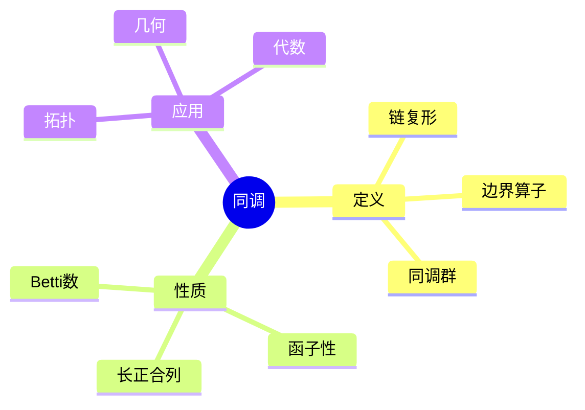
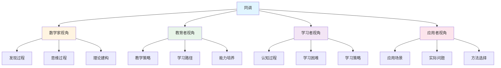

# 同调 (Homology) - 三视角组织版

**概念编号**: C.CORE.025
**知识层次**: L0-L2
**知识领域**: D5 (拓扑)
**创建日期**: 2025年1月
**最后更新**: 2025年1月

---

## 📋 目录 / Table of Contents

- [同调 (Homology) - 三视角组织版](#同调-homology---三视角组织版)
  - [📋 目录 / Table of Contents](#-目录--table-of-contents)
  - [1. 📋 概述 (编号: C.CORE.025.01)](#1--概述-编号-ccore02501)
  - [🧠 认知学视角：如何理解同调 (编号: C.CORE.025.02)](#-认知学视角如何理解同调-编号-ccore02502)
    - [认知起点 (编号: C.CORE.025.02.01)](#认知起点-编号-ccore0250201)
    - [认知过程 (编号: C.CORE.025.02.02)](#认知过程-编号-ccore0250202)
      - [阶段1：直观理解阶段 (编号: C.CORE.025.02.02.01)](#阶段1直观理解阶段-编号-ccore025020201)
      - [阶段2：概念形成阶段 (编号: C.CORE.025.02.02.02)](#阶段2概念形成阶段-编号-ccore025020202)
      - [阶段3：形式化阶段 (编号: C.CORE.025.02.02.03)](#阶段3形式化阶段-编号-ccore025020203)
    - [认知障碍 (编号: C.CORE.025.02.03)](#认知障碍-编号-ccore0250203)
    - [认知工具 (编号: C.CORE.025.02.04)](#认知工具-编号-ccore0250204)
  - [🎓 教育学视角：如何教学同调 (编号: C.CORE.025.03)](#-教育学视角如何教学同调-编号-ccore02503)
    - [教学目标 (编号: C.CORE.025.03.01)](#教学目标-编号-ccore0250301)
    - [教学路径 (编号: C.CORE.025.03.02)](#教学路径-编号-ccore0250302)
      - [阶段1：引入阶段（激发兴趣） (编号: C.CORE.025.03.02.01)](#阶段1引入阶段激发兴趣-编号-ccore025030201)
      - [阶段2：探索阶段（主动建构） (编号: C.CORE.025.03.02.02)](#阶段2探索阶段主动建构-编号-ccore025030202)
      - [阶段3：形式化阶段（抽象概括） (编号: C.CORE.025.03.02.03)](#阶段3形式化阶段抽象概括-编号-ccore025030203)
      - [阶段4：巩固阶段（应用深化） (编号: C.CORE.025.03.02.04)](#阶段4巩固阶段应用深化-编号-ccore025030204)
    - [教学难点 (编号: C.CORE.025.03.03)](#教学难点-编号-ccore0250303)
    - [教学策略 (编号: C.CORE.025.03.04)](#教学策略-编号-ccore0250304)
    - [评估方法 (编号: C.CORE.025.03.05)](#评估方法-编号-ccore0250305)
  - [🔬 数学家视角：如何思考同调 (编号: C.CORE.025.04)](#-数学家视角如何思考同调-编号-ccore02504)
    - [问题起源 (编号: C.CORE.025.04.01)](#问题起源-编号-ccore0250401)
    - [思维过程 (编号: C.CORE.025.04.02)](#思维过程-编号-ccore0250402)
      - [步骤1：问题提出 (编号: C.CORE.025.04.02.01)](#步骤1问题提出-编号-ccore025040201)
      - [步骤2：概念形成 (编号: C.CORE.025.04.02.02)](#步骤2概念形成-编号-ccore025040202)
      - [步骤3：理论发展 (编号: C.CORE.025.04.02.03)](#步骤3理论发展-编号-ccore025040203)
    - [历史发展 (编号: C.CORE.025.04.03)](#历史发展-编号-ccore0250403)
    - [3.2 关键人物和贡献 (编号: C.CORE.025.04.04)](#32-关键人物和贡献-编号-ccore0250404)
    - [重要定理 (编号: C.CORE.025.04.05)](#重要定理-编号-ccore0250405)
    - [开放问题 (编号: C.CORE.025.04.06)](#开放问题-编号-ccore0250406)
    - [一、第一人称思维描述 (编号: C.CORE.025.04.07)](#一第一人称思维描述-编号-ccore0250407)
      - [1.1 Poincaré的发现过程](#11-poincaré的发现过程)
    - [二、数学直觉的形成 (编号: C.CORE.025.04.08)](#二数学直觉的形成-编号-ccore0250408)
      - [2.1 直觉在概念发现中的作用](#21-直觉在概念发现中的作用)
      - [2.2 如何培养同调直觉](#22-如何培养同调直觉)
    - [三、数学美的教育价值 (编号: C.CORE.025.04.09)](#三数学美的教育价值-编号-ccore0250409)
      - [3.1 同调论的美在哪里](#31-同调论的美在哪里)
      - [3.2 如何培养学生的数学美感](#32-如何培养学生的数学美感)
    - [四、问题解决策略 (编号: C.CORE.025.04.10)](#四问题解决策略-编号-ccore0250410)
      - [4.1 数学家的启发式方法](#41-数学家的启发式方法)
      - [4.2 思维过程分析](#42-思维过程分析)
    - [五、批判性反思 (编号: C.CORE.025.04.11)](#五批判性反思-编号-ccore0250411)
      - [5.1 同调概念的局限性](#51-同调概念的局限性)
      - [5.2 同调理论的未解决问题](#52-同调理论的未解决问题)
  - [💡 数学解释：为什么同调是这样定义的 (编号: C.CORE.025.05)](#-数学解释为什么同调是这样定义的-编号-ccore02505)
    - [一、直观解释：同调是什么？](#一直观解释同调是什么)
      - [1.1 具体例子](#11-具体例子)
      - [1.2 形象类比](#12-形象类比)
      - [1.3 几何直观](#13-几何直观)
      - [1.4 操作体验](#14-操作体验)
    - [二、知性解释：同调的本质是什么？](#二知性解释同调的本质是什么)
      - [2.1 概念定义](#21-概念定义)
      - [2.2 分类体系](#22-分类体系)
      - [2.3 抽象结构](#23-抽象结构)
      - [2.4 知识体系](#24-知识体系)
    - [三、理性解释：同调的公理化定义](#三理性解释同调的公理化定义)
      - [3.1 公理体系](#31-公理体系)
      - [3.2 形式化证明](#32-形式化证明)
      - [3.3 系统建构](#33-系统建构)
    - [四、多视角解释：从不同角度理解同调](#四多视角解释从不同角度理解同调)
      - [4.1 数学家视角：同调是如何被发现的？](#41-数学家视角同调是如何被发现的)
      - [4.2 教育者视角：如何教学同调？](#42-教育者视角如何教学同调)
      - [4.3 学习者视角：如何学习同调？](#43-学习者视角如何学习同调)
      - [4.4 应用者视角：如何应用同调？](#44-应用者视角如何应用同调)
    - [五、思维表征：用多种方式理解同调](#五思维表征用多种方式理解同调)
      - [5.1 思维导图：同调的知识结构](#51-思维导图同调的知识结构)
      - [5.2 矩阵对比：不同解释方式的对比](#52-矩阵对比不同解释方式的对比)
      - [5.3 多视角表征：从不同角度表征同调](#53-多视角表征从不同角度表征同调)
  - [🔗 三视角整合 (编号: C.CORE.025.06)](#-三视角整合-编号-ccore02506)
    - [三个视角的关联](#三个视角的关联)
    - [如何综合运用三个视角](#如何综合运用三个视角)
  - [📚 参考文献 (编号: C.CORE.025.07)](#-参考文献-编号-ccore02507)
    - [权威资源](#权威资源)
    - [经典教材](#经典教材)
    - [研究论文](#研究论文)

---

## 1. 📋 概述 (编号: C.CORE.025.01)

同调是代数拓扑的核心工具，通过链复形计算拓扑不变量。同调理论在拓扑学、几何学、代数等领域有广泛应用。

本文档从**数学认知学**、**教育学**、**数学家**三个视角深入展开同调概念，避免简单的概念堆垒。

**权威资源对齐**:

- Wikipedia: [Homology (Mathematics)](https://en.wikipedia.org/wiki/Homology_(mathematics))
- Stanford课程: Math 215A (Differential Topology)
- Princeton课程: MAT 530 (Topology)
- MIT课程: 18.901 (Introduction to Topology)
- Metamath: [Homology](http://us.metamath.org/mpeuni/df-homology.html)

---

## 🧠 认知学视角：如何理解同调 (编号: C.CORE.025.02)

### 认知起点 (编号: C.CORE.025.02.01)

**学习者已有的知识基础**:

- 群的概念
- 拓扑空间的概念
- 日常经验中的"洞"、"边界"概念

**日常经验中的类似概念**:

- "洞"：空间中的空洞
- "边界"：区域的边界
- "循环"：封闭的路径

### 认知过程 (编号: C.CORE.025.02.02)

#### 阶段1：直观理解阶段 (编号: C.CORE.025.02.02.01)

**具体例子**:

- 例子1：$H_0(S^1) = \mathbb{Z}$（连通分支）
- 例子2：$H_1(S^1) = \mathbb{Z}$（1维洞）
- 例子3：$H_n(S^n) = \mathbb{Z}$（$n$维洞）

**形象类比**:

- **洞类比**: 同调就像"计算洞的个数"
  - $H_0$：连通分支的个数
  - $H_1$：1维洞的个数
  - $H_n$：$n$维洞的个数

- **边界类比**: 同调就像"边界和循环"
  - 循环：没有边界的链
  - 边界：某个链的边界
  - 同调：循环模边界

**可视化表示**:

```text
同调:
    循环 (没有边界)
         ↓
    边界 (某个链的边界)
         ↓
    同调群 = 循环 / 边界
```

#### 阶段2：概念形成阶段 (编号: C.CORE.025.02.02.02)

**从例子中抽象出共同特征**:

- 所有例子都涉及"洞"
- 洞通过"循环"和"边界"描述
- 同调群衡量"洞"的个数

**识别关键属性**:

1. **循环**: 没有边界的链
2. **边界**: 某个链的边界
3. **同调群**: 循环模边界

**建立概念边界**:

- **什么是同调**: 通过链复形计算拓扑不变量
- **什么不是同调**:
  - 同伦（不同的不变量）
  - 其他拓扑不变量

#### 阶段3：形式化阶段 (编号: C.CORE.025.02.02.03)

**严格定义**:

- 链复形：$(C_\bullet, \partial_\bullet)$
- 同调群：$H_n(C_\bullet) = \frac{\ker(\partial_n)}{\text{im}(\partial_{n+1})}$

**公理化表述**:

- 链复形是Abel群序列和边界算子
- 同调群是循环模边界

**逻辑结构**:

- 同调是代数拓扑的核心工具
- 同调是计算拓扑不变量的方法
- 同调是几何学的基础

### 认知障碍 (编号: C.CORE.025.02.03)

**常见误解**:

1. **误解1**: 认为同调就是同伦
   - **纠正**: 同调和同伦是不同的不变量

2. **误解2**: 认为同调群就是洞的个数
   - **纠正**: 同调群衡量洞的个数，但不只是个数

3. **误解3**: 混淆同调和上同调
   - **纠正**: 同调和上同调是对偶的，但不同

**理解难点**:

1. **难点1**: 链复形的抽象性
   - **原因**: 链复形比较抽象
   - **解决方法**: 从具体例子开始，逐步抽象

2. **难点2**: 边界算子的概念
   - **原因**: 边界算子比较抽象
   - **解决方法**: 用具体例子，强调边界算子的作用

3. **难点3**: 同调群的计算
   - **原因**: 同调群计算比较复杂
   - **解决方法**: 用具体例子，逐步掌握计算方法

**认知陷阱**:

- **洞**: 需要理解同调不只是计算洞的个数
- **边界**: 需要理解边界算子的作用

### 认知工具 (编号: C.CORE.025.02.04)

**类比工具**:

- **洞类比**: 同调 = 计算洞的个数
- **边界类比**: 同调 = 边界和循环

**可视化工具**:

- **链复形图**: 用链复形图表示同调
- **洞图**: 用洞图表示同调群

**具体化工具**:

- **具体例子**: 用具体例子理解抽象概念
- **反例**: 用反例理解概念边界

---

## 🎓 教育学视角：如何教学同调 (编号: C.CORE.025.03)

### 教学目标 (编号: C.CORE.025.03.01)

**知识目标**:

- 理解同调的基本概念
- 掌握链复形的定义
- 理解同调群的计算
- 理解同调的应用

**能力目标**:

- 能够计算同调群
- 能够理解同调的性质
- 能够应用同调解决实际问题
- 能够理解同调的重要性

**情感目标**:

- 培养数学抽象思维
- 培养代数思维
- 激发对数学的兴趣

### 教学路径 (编号: C.CORE.025.03.02)

#### 阶段1：引入阶段（激发兴趣） (编号: C.CORE.025.03.02.01)

**实际问题**:

- 问题1：如何计算拓扑空间的"洞"？
- 问题2：如何研究拓扑不变量？
- 问题3：如何研究几何结构？

**历史背景**:

- 同调的历史发展
- 同调在数学中的地位
- 同调在几何中的应用

**引发认知冲突**:

- 问题：如何统一计算各种"洞"？
- 引出同调的概念

#### 阶段2：探索阶段（主动建构） (编号: C.CORE.025.03.02.02)

**引导发现**:

1. 让学生自己列举"洞"的例子
2. 让学生观察这些例子的共同特征
3. 引导学生抽象出同调的定义

**合作探究**:

- 小组讨论：什么是同调？
- 小组讨论：同调有哪些性质？
- 小组讨论：如何计算同调群？

**多元表征**:

- **语言表征**: "同调通过链复形计算拓扑不变量"
- **符号表征**: $H_n(C_\bullet) = \frac{\ker(\partial_n)}{\text{im}(\partial_{n+1})}$
- **图形表征**: 链复形图、洞图
- **集合表征**: 链复形定义

#### 阶段3：形式化阶段（抽象概括） (编号: C.CORE.025.03.02.03)

**严格定义**:

- 链复形的定义
- 同调群的定义
- 同调的性质

**性质证明**:

- 同调群的基本性质
- 同调群的函子性
- 同调长正合列

**应用拓展**:

- 同调在拓扑学中的应用
- 同调在几何中的应用
- 同调在代数中的应用

#### 阶段4：巩固阶段（应用深化） (编号: C.CORE.025.03.02.04)

**练习应用**:

- 基础练习：同调群的计算
- 应用练习：用同调解决实际问题
- 综合练习：同调的综合应用

**变式训练**:

- 不同形式的同调群计算
- 不同难度的同调问题
- 同调的应用

**知识整合**:

- 同调与其他概念的联系
- 同调在数学体系中的地位

### 教学难点 (编号: C.CORE.025.03.03)

**难点1：链复形的抽象性**:

- **难点描述**: 学生难以理解链复形
- **解决方法**:
  - 从具体例子开始
  - 逐步抽象
  - 用具体例子说明

**难点2：边界算子的概念**:

- **难点描述**: 学生难以理解边界算子
- **解决方法**:
  - 用具体例子
  - 强调边界算子的作用
  - 用图形可视化

**难点3：同调群的计算**:

- **难点描述**: 学生难以计算同调群
- **解决方法**:
  - 用具体例子
  - 逐步掌握计算方法
  - 用练习巩固

### 教学策略 (编号: C.CORE.025.03.04)

**策略1：从具体到抽象**:

- 先给出具体例子
- 再抽象出一般概念
- 最后给出严格定义

**策略2：多元表征**:

- 用语言、符号、图形等多种方式表示同一概念
- 帮助学生建立不同表征之间的联系

**策略3：问题驱动**:

- 从实际问题出发
- 引出数学概念
- 解决问题

**策略4：可视化教学**:

- 使用链复形图
- 使用洞图
- 使用具体例子

### 评估方法 (编号: C.CORE.025.03.05)

**形成性评估**（评估理解过程）:

- 课堂提问：检查学生对概念的理解
- 小组讨论：观察学生的思考过程
- 练习作业：检查学生的应用能力

**总结性评估**（评估最终理解）:

- 测验：检查学生对概念和计算的掌握
- 项目：检查学生应用同调解决实际问题的能力
- 反思：检查学生对同调概念的理解深度

---

## 🔬 数学家视角：如何思考同调 (编号: C.CORE.025.04)

### 问题起源 (编号: C.CORE.025.04.01)

**历史背景**:

- 19世纪：同调的起源
- 20世纪初：同调的系统化
- 20世纪中期：同调的现代发展

**原始问题**:

- **问题1**: 如何计算拓扑空间的"洞"？
- **问题2**: 如何研究拓扑不变量？
- **问题3**: 同调有哪些性质？

**研究动机**:

- 计算拓扑不变量
- 发展代数拓扑
- 统一几何理论

### 思维过程 (编号: C.CORE.025.04.02)

#### 步骤1：问题提出 (编号: C.CORE.025.04.02.01)

**观察到的现象**:

- 拓扑空间有"洞"
- 需要计算拓扑不变量
- 需要统一几何理论

**提出的猜想**:

- 可以引入同调概念
- 同调可以计算"洞"
- 同调有丰富的性质

**需要解决的问题**:

- 如何定义同调？
- 同调应该满足什么条件？
- 同调有哪些性质？

#### 步骤2：概念形成 (编号: C.CORE.025.04.02.02)

**尝试性定义**:

- **链复形定义**: 通过链复形
- **同调群定义**: 通过循环模边界

**性质探索**:

- 同调群的基本性质
- 同调群的函子性
- 同调长正合列

**结构发现**:

- 同调是代数拓扑的核心工具
- 同调是计算拓扑不变量的方法
- 同调是几何学的基础

#### 步骤3：理论发展 (编号: C.CORE.025.04.02.03)

**定理证明**:

- 同调群的基本性质
- 同调群的函子性
- 同调长正合列

**应用拓展**:

- 同调在拓扑学中的应用
- 同调在几何中的应用
- 同调在代数中的应用

**理论完善**:

- 同调的严格定义
- 同调的范畴论研究
- 同调的应用研究

### 历史发展 (编号: C.CORE.025.04.03)

**早期阶段**（19世纪）:

- **Poincaré (1895)**: 引入同调概念
- **Betti (1871)**: 研究Betti数

**关键突破**（20世纪初）:

- **Noether (1926)**: 发展同调群理论
- **Lefschetz (1926)**: 研究Lefschetz不动点定理

**现代发展**（20世纪中期）:

- **Eilenberg-Steenrod (1952)**: 发展公理化同调
- **Grothendieck (1957)**: 在代数几何中应用同调

### 3.2 关键人物和贡献 (编号: C.CORE.025.04.04)

**Henri Poincaré (1854-1912)**:

- 引入同调概念
- 建立代数拓扑基础

**Emmy Noether (1882-1935)**:

- 发展同调群理论
- 建立现代代数拓扑

**Samuel Eilenberg (1913-1998)**:

- 发展公理化同调
- 建立现代同调理论

### 重要定理 (编号: C.CORE.025.04.05)

**同调长正合列**:

- 短正合列诱导长正合列
- 意义：同调计算的重要工具

**Mayer-Vietoris序列**:

- 空间的并的同调与交的同调的关系
- 意义：同调计算的重要工具

**Künneth公式**:

- 乘积空间的同调与因子空间的同调的关系
- 意义：同调计算的重要工具

### 开放问题 (编号: C.CORE.025.04.06)

**未解决问题**:

- 同调群的计算问题
- 同调的应用问题
- 同调的推广问题

**研究方向**:

- 同调的范畴论研究
- 同调的几何研究
- 同调的应用研究

### 一、第一人称思维描述 (编号: C.CORE.025.04.07)

#### 1.1 Poincaré的发现过程

**详细历史背景**:

- **1895年**：Poincaré发表《位置分析》（Analysis Situs）
- **背景**：研究拓扑，发现空间的"洞"是拓扑不变量
- **问题**：如何描述空间的"洞"？如何分类拓扑空间？

**Poincaré的详细第一人称描述**:
> "1895年，我在研究拓扑时，遇到了一个问题：如何描述空间的'洞'？
>
> 我发现，$S^2$（球面）有0个洞，$T^2$（环面）有1个洞，$S^1$（圆）有1个洞。这些'洞'是拓扑不变量。
>
> 我的方法是这样的：
>
> - **思路**：用同调描述空间的'洞'
> - **定义**：$H_n(X)$是$n$维同调群，测量$n$维'洞'的数量
> - **例子**：$H_0(S^2) = \mathbb{Z}$（连通分支），$H_1(S^2) = 0$（无1维洞），$H_2(S^2) = \mathbb{Z}$（2维洞）
>
> 例如，对于$S^2$（球面）：
>
> - **$H_0(S^2)$**：$\mathbb{Z}$（1个连通分支）
> - **$H_1(S^2)$**：$0$（无1维洞）
> - **$H_2(S^2)$**：$\mathbb{Z}$（1个2维洞）
>
> 对于$T^2$（环面）：
>
> - **$H_0(T^2)$**：$\mathbb{Z}$（1个连通分支）
> - **$H_1(T^2)$**：$\mathbb{Z}^2$（2个1维洞）
> - **$H_2(T^2)$**：$\mathbb{Z}$（1个2维洞）
>
> 对于$S^1$（圆）：
>
> - **$H_0(S^1)$**：$\mathbb{Z}$（1个连通分支）
> - **$H_1(S^1)$**：$\mathbb{Z}$（1个1维洞）
> - **$H_2(S^1)$**：$0$（无2维洞）
>
> 我还发现了同调长正合列：
>
> - **定理**：短正合列$0 \to A \to B \to C \to 0$诱导长正合列$\cdots \to H_n(A) \to H_n(B) \to H_n(C) \to H_{n-1}(A) \to \cdots$
> - **意义**：同调长正合列是计算同调的重要工具
>
> 这让我意识到，同调是描述空间'洞'的工具，同调群是拓扑不变量。这为代数拓扑提供了基础。"

**详细的思维过程**:

1. **观察到的现象**（1895年）:

   **现象1：空间有"洞"**
   - **问题**：如何描述空间的"洞"？
   - **例子**：$S^2$有0个1维洞，$T^2$有2个1维洞
   - **需要**：统一的概念

   **现象2：这种"洞"是拓扑不变量**
   - **问题**：同调是否是拓扑不变量？
   - **发现**：同调群是拓扑不变量
   - **需要**：建立同调理论

   **现象3：需要统一的概念**
   - **问题**：如何统一处理不同的空间？
   - **思路**：用同调统一
   - **需要**：建立同调理论

2. **提出的猜想**（1895年）:

   **猜想1：用同调描述"洞"**
   - **思路**：定义$H_n(X)$为$n$维同调群，测量$n$维"洞"的数量
   - **例子**：$H_1(S^1) = \mathbb{Z}$，$H_1(T^2) = \mathbb{Z}^2$
   - **优点**：统一描述"洞"

   **猜想2：同调群是拓扑不变量**
   - **性质**：同调群在同胚下不变
   - **例子**：$H_1(S^1) = \mathbb{Z}$，$H_1(T^2) = \mathbb{Z}^2$
   - **意义**：同调群可以分类拓扑空间

   **猜想3：同调长正合列**
   - **定理**：短正合列诱导长正合列
   - **意义**：同调长正合列是计算同调的重要工具
   - **应用**：为同调提供计算方法

3. **遇到的困难**（1895年）:

   **困难1：如何严格定义同调？**
   - **问题**：如何定义同调？
   - **解决**：定义同调为链复形的同调群
   - **意义**：为同调提供严格的数学基础

   **困难2：如何计算同调群？**
   - **问题**：如何计算$H_n(X)$？
   - **解决**：使用同调长正合列、Mayer-Vietoris序列
   - **意义**：为同调提供计算方法

   **困难3：如何应用同调理论？**
   - **问题**：如何用同调理论解决实际问题？
   - **解决**：建立同调分类理论、上同调理论
   - **意义**：为同调提供应用基础

4. **突破的时刻**（1895年，Poincaré）:

   **突破1：同调的概念**
   - 引入同调的概念描述"洞"
   - **关键**：同调群是拓扑不变量
   - **意义**：为代数拓扑提供基础

   **突破2：同调长正合列**
   - 建立同调长正合列理论
   - **关键**：短正合列诱导长正合列
   - **意义**：为同调提供计算方法

   **突破3：同调理论的广泛应用**
   - 同调理论可以应用到更广泛的领域
   - **关键**：同调是拓扑不变量
   - **意义**：同调理论成为代数拓扑的基础

### 二、数学直觉的形成 (编号: C.CORE.025.04.08)

#### 2.1 直觉在概念发现中的作用

**Poincaré的直觉**:

- **直觉1**: "同调"是"洞的计数"——这个直觉引导Poincaré发现同调
- **直觉2**: 同调是拓扑不变量——这个直觉引导Poincaré建立同调理论
- **直觉3**: 同调是代数拓扑的基础——这个直觉引导Poincaré建立同调理论

**直觉的验证**:

- 通过严格的数学证明验证直觉的正确性
- 通过链复形严格化同调定义
- 通过应用验证同调的广泛性

**直觉的深化**:

- 从"洞的计数"到"同调的严格定义"
- 从"拓扑不变量"到"同调的广泛应用"
- 从"代数拓扑基础"到"同调的深入发展"

#### 2.2 如何培养同调直觉

**数学家的建议**:

- **Poincaré**: "同调直觉是长期训练的结果。通过大量练习和深入思考，我们可以培养对同调的直觉。"
- **Eilenberg**: "从具体例子开始，逐步抽象，这是培养同调直觉的有效方法。"

**培养方法**:

1. **大量练习**: 通过大量同调计算练习，培养对同调的直觉
2. **深入思考**: 深入思考同调的本质，理解同调的深层结构
3. **类比和联想**: 通过类比和联想，建立同调与其他概念的联系
4. **与专家交流**: 与数学家交流，学习他们的思维方式

**教学启示**:

- 从具体例子开始，逐步抽象
- 鼓励学生思考同调的本质
- 引导学生建立同调与其他概念的联系

### 三、数学美的教育价值 (编号: C.CORE.025.04.09)

#### 3.1 同调论的美在哪里

**结构美**:

- **简洁性**: 同调的概念非常简洁——"通过链复形定义的拓扑不变量"
- **统一性**: 同调可以统一描述数学中的各种"洞"
- **和谐性**: 同调运算满足优美的规律（Mayer-Vietoris序列、Künneth公式等）

**数学家的评价**:

- **Poincaré**: "同调论的美在于它的统一性。它为我们提供了一个统一的框架来理解拓扑不变量。"
- **Eilenberg**: "同调论的美在于它的基础性。它是代数拓扑的基础，所有拓扑不变量都可以用同调来描述。"

#### 3.2 如何培养学生的数学美感

**数学家的建议**:

- **Poincaré**: "展示同调论的美感，让学生感受到数学的美。"
- **Eilenberg**: "通过同调论的历史和发展，让学生理解数学的美。"

**教学方法**:

1. **展示数学美**:
   - 展示同调概念的简洁性和统一性
   - 展示同调运算的优美规律
   - 展示同调在数学中的基础地位

2. **引导学生欣赏**:
   - 引导学生欣赏同调概念的简洁性
   - 引导学生欣赏同调运算的和谐性
   - 引导学生欣赏同调的基础性

3. **鼓励学生创造美**:
   - 鼓励学生发现同调论的美
   - 鼓励学生创造优美的同调证明
   - 鼓励学生探索同调论的美

### 四、问题解决策略 (编号: C.CORE.025.04.10)

#### 4.1 数学家的启发式方法

**策略1：从具体到抽象**:

- 从具体的同调例子开始
- 抽象出同调的一般性质
- 建立同调的理论体系

**策略2：从简单到复杂**:

- 先理解基本同调
- 再理解同调运算
- 最后理解同调理论

**策略3：从问题到理论**:

- 从实际问题出发
- 引出同调概念
- 建立同调理论

#### 4.2 思维过程分析

**问题识别**:

- 识别问题类型：同调定义问题、同调计算问题、同调应用问题
- 识别问题难度：简单问题、中等问题、复杂问题

**策略选择**:

- 简单问题：直接方法
- 中等问题：分步方法
- 复杂问题：分解方法

**执行和反思**:

- 执行策略，解决问题
- 反思过程，总结经验
- 改进方法，提高效率

### 五、批判性反思 (编号: C.CORE.025.04.11)

#### 5.1 同调概念的局限性

**概念的边界**:

- 同调只描述拓扑不变量，不能描述所有拓扑性质
- 同调是抽象的，需要具体化才能应用
- 同调不能表示所有数学量

**概念的推广**:

- 广义同调：更一般的同调
- 上同调：对偶的同调
- 导出同调：同调代数中的同调

#### 5.2 同调理论的未解决问题

**未解决的问题**:

- 同调群的计算问题：如何计算复杂同调群？
- 同调的应用问题：如何更好地应用同调？
- 同调的推广问题：如何推广同调概念？

**研究方向**:

- 同调的范畴论研究
- 同调的几何研究
- 同调的应用研究

---

## 💡 数学解释：为什么同调是这样定义的 (编号: C.CORE.025.05)

### 一、直观解释：同调是什么？

#### 1.1 具体例子

**生活中的例子**：

- **洞的计数**：同调可以"数洞"
  - 例如：球面没有洞，环面有一个洞
  - **为什么这样定义**：因为我们需要一个概念来表示"洞的数量"
- **形状的分类**：同调可以分类形状
  - 例如：球面和环面有不同的同调群
  - **为什么这样定义**：因为我们需要一个概念来表示"形状的拓扑不变量"
- **结构的识别**：同调可以识别结构
  - 例如：同调可以区分不同的拓扑空间
  - **为什么这样定义**：因为我们需要一个概念来表示"拓扑不变量"

**数学中的例子**：

- **链复形**：$C_n$是$n$维链群
  - **为什么这样定义**：我们需要一个简单的方式来表示"链复形"
- **同调群**：$H_n = Z_n / B_n$是$n$维同调群
  - **为什么这样定义**：我们需要一个概念来表示"同调群"
- **Betti数**：$b_n = \dim H_n$是$n$维Betti数
  - **为什么这样定义**：我们需要一个概念来表示"Betti数"

#### 1.2 形象类比

**洞的类比**：

- **同调就像"数洞"**
  - 球面没有洞，$b_0 = 1, b_1 = 0, b_2 = 1$
  - 环面有一个洞，$b_0 = 1, b_1 = 2, b_2 = 1$
- **为什么这样类比**：这个类比帮助我们理解同调的"洞"性质

**指纹类比**：

- **同调就像"指纹"**
  - 每个拓扑空间有独特的同调群
  - 同调群是拓扑空间的"指纹"
- **为什么这样类比**：这个类比帮助我们理解同调的"不变量"性质

#### 1.3 几何直观

**链复形表示**：

- 使用链复形表示同调
- 例如：$C_n$是$n$维链群，$\partial_n$是边界算子
- **为什么使用链复形**：链复形提供几何直观，帮助我们理解同调

**同调群表示**：

- 使用同调群表示同调
- 例如：$H_n = Z_n / B_n$是$n$维同调群
- **为什么使用同调群**：同调群提供几何直观，帮助我们理解同调

#### 1.4 操作体验

**同调计算的操作**：

- **链复形的构造**：构造链复形
  - **为什么这样操作**：因为我们需要一个运算来构造"链复形"
- **同调群的计算**：计算同调群
  - **为什么这样操作**：因为我们需要一个运算来计算"同调群"
- **Betti数的计算**：计算Betti数
  - **为什么这样操作**：因为我们需要一个工具来计算"Betti数"

### 二、知性解释：同调的本质是什么？

#### 2.1 概念定义

**同调的内涵**：

- **同调是计算拓扑不变量的代数工具**
  - **链复形**：$C_*$是链复形
  - **边界算子**：$\partial_n$是边界算子
  - **同调群**：$H_n = Z_n / B_n$是$n$维同调群
- **为什么这样定义**：这些特征使得同调成为一个完整的拓扑工具，支持所有拓扑不变量研究

**同调的外延**：

- **单纯同调**：基于单纯复形的同调
- **奇异同调**：基于奇异单形的同调
- **de Rham同调**：基于微分形式的同调
- **为什么这样分类**：不同的同调类型有不同的性质和用途

#### 2.2 分类体系

**按类型分类**：

- **单纯同调**：基于单纯复形
- **奇异同调**：基于奇异单形
- **de Rham同调**：基于微分形式
- **为什么这样分类**：类型是同调的基本特征

**按性质分类**：

- **同调群**：$H_n$是$n$维同调群
- **Betti数**：$b_n = \dim H_n$是$n$维Betti数
- **Euler特征数**：$\chi = \sum (-1)^n b_n$
- **为什么这样分类**：性质是同调的重要特征

#### 2.3 抽象结构

**同调的运算结构**：

- **同调的加法**：同调群是Abel群
- **同调的函子性**：同调是函子
- **为什么有这些运算**：这些运算使得同调具有代数结构

**同调的关系结构**：

- **同调与拓扑**：同调是拓扑不变量
- **同调与同伦**：同调和同伦都是拓扑不变量
- **为什么有这个关系**：这个关系帮助我们研究同调的性质

#### 2.4 知识体系

**同调在数学体系中的位置**：

- **基础地位**：同调是代数拓扑的基础
  - 同调可以计算拓扑不变量
  - 同调可以分类拓扑空间
- **为什么是基础**：同调提供了统一的框架来研究拓扑不变量

**同调与其他概念的关系**：

- **同调与链复形**：同调由链复形定义
- **同调与拓扑**：同调是拓扑不变量
- **同调与几何**：同调在几何中有重要应用
- **为什么有这些关系**：这些关系揭示了同调与其他数学概念的内在联系

### 三、理性解释：同调的公理化定义

#### 3.1 公理体系

**同调的定义**：

- **定义**：$H_n = Z_n / B_n$，其中$Z_n = \ker \partial_n$是$n$维循环群，$B_n = \operatorname{im} \partial_{n+1}$是$n$维边界群
- **为什么需要这个定义**：这个定义提供了同调的严格数学基础

**同调的公理**：

- **Eilenberg-Steenrod公理**：同调满足Eilenberg-Steenrod公理
- **为什么这样定义**：这些公理将同调放在更一般的框架中

#### 3.2 形式化证明

**同调性质的证明**：

- **同调的函子性**：同调是函子
  - **证明**：使用同调的定义和函子的性质
  - **为什么这样证明**：利用同调的定义和函子的性质
- **同调长正合列**：同调有长正合列
  - **证明**：使用同调的定义和正合列的性质
  - **为什么这样证明**：利用同调的定义和正合列的性质

#### 3.3 系统建构

**同调论在数学基础中的地位**：

- **作为代数拓扑基础**：同调是代数拓扑的基础
- **提供拓扑工具**：同调提供了计算拓扑不变量的工具
- **统一框架**：同调统一了各种拓扑不变量研究

**同调论的发展历史**：

- **Poincaré的引入**（1895年）：引入同调概念
- **Noether的发展**（1926年）：发展同调群理论
- **Eilenberg-Steenrod的公理化**（1952年）：公理化同调理论
- **为什么这样发展**：数学的发展需要严格的基础，同调论的发展反映了这一需求

### 四、多视角解释：从不同角度理解同调

#### 4.1 数学家视角：同调是如何被发现的？

**Poincaré的发现过程**：

- **问题提出**：如何计算拓扑不变量？
- **关键洞察**：使用链复形，发现同调的代数结构
- **重要发现**：同调可以用于计算拓扑不变量
- **为什么这样发现**：数学家的直觉和严格证明相结合

#### 4.2 教育者视角：如何教学同调？

**教学策略**：

- **从具体到抽象**：先学习具体例子（球面、环面），再学习抽象定义
- **从简单到复杂**：先学习简单同调，再学习复杂同调
- **从直观到形式化**：先使用链复形等直观工具，再学习严格定义
- **为什么这样教学**：符合认知规律，帮助学生逐步建立理解

#### 4.3 学习者视角：如何学习同调？

**认知过程**：

- **直观阶段**：通过具体例子理解同调的含义
- **概念阶段**：理解同调的定义和性质
- **形式化阶段**：理解严格定义和证明
- **为什么这样学习**：符合认知发展规律

#### 4.4 应用者视角：如何应用同调？

**应用场景**：

- **拓扑**：使用同调计算拓扑不变量
- **几何**：使用同调研究几何结构
- **代数**：使用同调研究代数结构
- **为什么这样应用**：同调提供了强大的工具来处理各种问题

### 五、思维表征：用多种方式理解同调

#### 5.1 思维导图：同调的知识结构



#### 5.2 矩阵对比：不同解释方式的对比

| 解释方式 | 特点 | 方法 | 工具 | 适用阶段 | 优势 | 局限 |
|---------|------|------|------|---------|------|------|
| **直观解释** | 具体、形象、可视 | 例子、类比、直观 | 链复形、图形 | 入门阶段 | 易于理解 | 不够严格 |
| **知性解释** | 概念、分类、抽象 | 定义、分类、结构 | 概念图、知识图谱 | 中级阶段 | 系统完整 | 不够直观 |
| **理性解释** | 公理、证明、形式化 | 公理、证明、系统 | 形式化工具、证明系统 | 高级阶段 | 严格准确 | 不够具体 |
| **多视角解释** | 多角度、整合 | 多视角、整合 | 多视角工具 | 所有阶段 | 全面深入 | 可能复杂 |

#### 5.3 多视角表征：从不同角度表征同调



---

## 🔗 三视角整合 (编号: C.CORE.025.06)

### 三个视角的关联

**认知学视角 ↔ 教育学视角**:

- 认知学视角揭示的理解机制，指导教育学视角的教学设计
- 教育学视角的教学实践，验证认知学视角的理论

**认知学视角 ↔ 数学家视角**:

- 数学家视角的思维过程，启发认知学视角的认知路径
- 认知学视角的认知障碍，解释数学家视角的历史困难

**教育学视角 ↔ 数学家视角**:

- 数学家视角的历史发展，为教育学视角提供教学素材
- 教育学视角的教学策略，帮助学习者理解数学家视角的思维过程

### 如何综合运用三个视角

**学习建议**:

1. **从认知学视角开始**: 先建立直观理解
2. **用教育学视角深化**: 通过教学路径系统学习
3. **用数学家视角升华**: 理解概念的深层意义和历史背景

**教学建议**:

1. **引入阶段**: 用数学家视角的问题起源激发兴趣
2. **探索阶段**: 用认知学视角的认知过程引导发现
3. **形式化阶段**: 用教育学视角的教学策略系统教学
4. **巩固阶段**: 综合三个视角深化理解

---

## 📚 参考文献 (编号: C.CORE.025.07)

### 权威资源

- Wikipedia: [Homology (Mathematics)](https://en.wikipedia.org/wiki/Homology_(mathematics))
- Metamath: [Homology](http://us.metamath.org/mpeuni/df-homology.html)

### 经典教材

- Hatcher, A. (2002). *Algebraic Topology*. Cambridge University Press.
- Rotman, J. J. (1988). *An Introduction to Algebraic Topology*. Springer.

### 研究论文

- Poincaré, H. (1895). "Analysis situs". *Journal de l'École Polytechnique*.
- Noether, E. (1926). "Der Endlichkeitssatz der Invarianten endlicher Gruppen". *Mathematische Annalen*.

---

**创建日期**: 2025年1月
**最后更新**: 2025年1月
**维护状态**: 持续更新中
