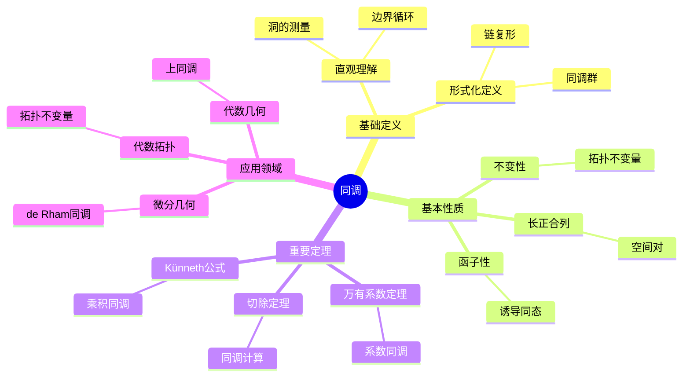

# 同调 (Homology)

**概念编号**: C.CORE.025
**知识层次**: L0-L2
**知识领域**: D5 (拓扑)
**创建日期**: 2025年11月21日
**最后更新**: 2025年11月21日

---

## 📋 概述

同调是代数拓扑的核心工具，通过链复形计算拓扑不变量。同调理论在拓扑学、几何学、代数等领域有广泛应用。

**权威资源对齐**:

- Wikipedia: [Homology (Mathematics)](https://en.wikipedia.org/wiki/Homology_(mathematics))
- Stanford课程: Math 215A (Differential Topology)
- Princeton课程: MAT 530 (Topology)
- MIT课程: 18.901 (Introduction to Topology)
- Metamath: [Homology](http://us.metamath.org/mpeuni/df-homology.html)

---

## 🎯 严格定义

### 基础定义 (L0)

**直观理解**: 同调通过"边界"和"循环"的概念描述拓扑空间的"洞"，同调群衡量不同维数的"洞"的个数。

**基本定义**: 同调群 $H_n(X)$ 是 $n$ 维循环模 $n$ 维边界的商群，衡量 $n$ 维"洞"的个数。

**简单例子**:

- $H_0(S^1) = \mathbb{Z}$（连通分支）
- $H_1(S^1) = \mathbb{Z}$（1维洞）
- $H_n(S^n) = \mathbb{Z}$（$n$ 维洞）

### 形式化定义 (L1)

**链复形**: 链复形 $(C_\bullet, \partial_\bullet)$ 是Abel群序列和边界算子：

$$\cdots \to C_{n+1} \xrightarrow{\partial_{n+1}} C_n \xrightarrow{\partial_n} C_{n-1} \to \cdots$$

满足 $\partial_n \circ \partial_{n+1} = 0$。

**同调群**: 同调群定义为：

$$H_n(C_\bullet) = \frac{\ker(\partial_n)}{\text{im}(\partial_{n+1})}$$

**奇异同调**: 拓扑空间 $X$ 的奇异同调 $H_n(X)$ 是奇异链复形的同调。

**记号**:

- $C_n$: $n$ 维链群
- $\partial_n$: $n$ 维边界算子
- $H_n(X)$: $n$ 维同调群
- $b_n = \text{rank } H_n(X)$: Betti数

---

## 📚 历史背景

### 发展脉络

**19世纪**: 同调的起源

- **Poincaré (1895)**: 在研究拓扑时引入同调
- **Betti (1871)**: 研究Betti数

**20世纪初**: 同调的公理化

- **Noether (1925)**: 将同调群化
- **Eilenberg-Steenrod (1945)**: 公理化同调理论

**20世纪中期**: 同调的现代发展

- **Serre (1951)**: 研究谱序列
- **Grothendieck (1957)**: 在代数几何中应用同调

### 关键人物

- **Henri Poincaré (1854-1912)**: 同调的引入者
- **Emmy Noether (1882-1935)**: 将同调群化
- **Samuel Eilenberg (1913-1998)**: 公理化同调理论

---

## 🔍 性质与定理

### 基本性质 (L1)

**性质1: 同调的不变性**

- 同调群是拓扑不变量
- 同胚空间有同构的同调群

**性质2: 同调的函子性**

- 连续映射诱导同调群之间的同态
- 同调是函子

**性质3: 同调的长正合列**

- 空间对 $(X, A)$ 有长正合列
- 用于计算同调群

### 重要定理 (L2)

**定理1: 切除定理**

- **陈述**: 若 $U \subseteq A$ 且 $\bar{U} \subseteq \text{int}(A)$，则 $H_n(X, A) \cong H_n(X \setminus U, A \setminus U)$
- **应用**: 同调群的计算

**定理2: 万有系数定理**

- **陈述**: $H_n(X; G) \cong H_n(X) \otimes G \oplus \text{Tor}(H_{n-1}(X), G)$
- **应用**: 系数同调群的计算

**定理3: Künneth公式**

- **陈述**: $H_n(X \times Y) \cong \bigoplus_{p+q=n} H_p(X) \otimes H_q(Y)$
- **应用**: 乘积空间的同调

---

## 💡 应用实例

### 理论应用

- 代数拓扑（同调群是拓扑不变量）
- 微分几何（de Rham同调）
- 代数几何（上同调）

### 实际应用

- 物理学（拓扑相、拓扑序）
- 计算机科学（拓扑数据分析）
- 工程学（形状分析）

---

## 🔗 关联概念

### 依赖关系

- 拓扑空间（同调在拓扑空间上定义）
- 群（同调群是Abel群）
- 链复形（同调由链复形计算）

### 推广关系

- 奇异同调（一般同调）
- 胞腔同调（胞腔复形的同调）
- 上同调（对偶理论）

---

## 📖 参考文献

- Wikipedia: [Homology (Mathematics)](https://en.wikipedia.org/wiki/Homology_(mathematics))
- Hatcher, A. (2002). *Algebraic Topology*. Cambridge University Press.
- Munkres, J. R. (1984). *Elements of Algebraic Topology*. Addison-Wesley.

---

## 🗺️ 思维导图 (编号: C.CORE.025.MIND)

### 同调概念思维导图

---

## 📊 知识多维关系矩阵 (编号: C.CORE.025.MATRIX)

### 同调的多维关系矩阵

| 维度 | 指标 | 同调 |
|------|------|------|
| **知识层次** | L0基础 | ⭐⭐⭐ |
| | L1中级 | ⭐⭐⭐ |
| | L2高级 | ⭐⭐⭐⭐ |
| | L3研究 | ⭐⭐⭐⭐⭐ |
| **知识领域** | D1基础数学 | ⭐⭐ |
| | D2代数 | ⭐⭐⭐ |
| | D4几何 | ⭐⭐⭐ |
| | D5拓扑 | ⭐⭐⭐⭐⭐ |
| **依赖关系** | 前置概念 | 拓扑空间、群、链复形 |
| | 后续概念 | 上同调、K理论 |
| **应用关系** | 理论应用 | ⭐⭐⭐⭐ |
| | 实际应用 | ⭐⭐⭐ |
| | 交叉应用 | ⭐⭐⭐ |
| **学习难度** | 直观理解 | ⭐⭐⭐⭐ |
| | 形式化理解 | ⭐⭐⭐⭐⭐ |
| | 深入应用 | ⭐⭐⭐⭐⭐ |

---

## 💭 形象化解释与论证 (编号: C.CORE.025.VISUAL)

### 形象化解释

**1. 同调的直观理解**

- **类比**: 同调就像"测量空间的洞"或"边界和循环的关系"
- **例子**:
  - $H_0(S^1) = \mathbb{Z}$：连通分支数
  - $H_1(S^1) = \mathbb{Z}$：1维洞（圆有1个洞）
  - $H_2(S^2) = \mathbb{Z}$：2维洞（球面有1个2维洞）

**2. 边界和循环的直观理解**

- **类比**: 边界和循环就像"有边界的形状"和"没有边界的形状"
- **解释**:
  - 边界：有边界的链（如线段、三角形）
  - 循环：没有边界的链（如圆、球面）
  - 同调群：循环模边界，测量"真正的洞"

**3. 链复形的直观理解**

- **类比**: 链复形就像"不同维数的链的序列"
- **解释**:
  - $C_n$：$n$维链群
  - $\partial_n$：边界算子，将$n$维链映射到$(n-1)$维链
  - 边界算子的复合为0：$\partial \circ \partial = 0$

### 认知科学视角

**1. 数学教育家Dienes的观点**

- **多表征原则**: 通过几何（洞）、代数（链复形）、拓扑（同调群）等多种方式理解同调
- **变化性原则**: 通过不同的同调例子理解同调的本质
- **教学启示**: 使用具体空间、链复形可视化、同调群计算等多种方法

**2. 数学认知学家Tall的观点**

- **过程-对象对偶**: 理解"同调计算过程"（如何计算）和"同调群"（对象）
- **认知层次**: 从直观理解（"测量洞"）到形式化理解（链复形定义）

---

## 👨‍🏫 专家观点与论证 (编号: C.CORE.025.EXPERT)

### 数学家的观点

**1. Henri Poincaré (1854-1912) - 同调的引入者**
> "同调是研究拓扑空间的重要工具，它通过边界和循环测量空间的洞。"
>
> **意义**: Poincaré引入了同调，开创了代数拓扑。

**2. Emmy Noether (1882-1935) - 同调群化的推动者**
> "同调应该用群来研究，这使同调理论更加抽象和强大。"
>
> **意义**: Noether将同调群化，推动了代数拓扑的发展。

**3. Samuel Eilenberg (1913-1998) - 同调公理化的建立者**
> "Eilenberg-Steenrod公理统一了不同的同调理论，这使同调理论更加系统。"
>
> **意义**: Eilenberg公理化了同调理论，为现代代数拓扑奠定了基础。

### 数学教育家的观点

**1. Zoltan Dienes (1916-2014) - 数学教育家**
> "同调概念应该通过具体空间、链复形可视化、同调群计算等多种方式学习。"
>
> **教学启示**:
>
> - 从具体空间（如圆、球面）开始
> - 使用链复形可视化理解边界和循环
> - 通过同调群计算理解同调的应用

**2. Hans Freudenthal (1905-1990) - 数学教育家**
> "同调概念的学习需要从'洞的测量'发展到'链复形结构'。"
>
> **认知发展**:
>
> - **直观阶段**: 理解同调作为洞的测量
> - **结构阶段**: 理解同调作为链复形的同调群

### 数学认知学家的观点

**1. David Tall - 数学认知学家**
> "同调概念的理解需要从'过程'（如何计算）发展到'对象'（同调群本身）。"
>
> **认知层次**:
>
> - **过程层次**: 理解"如何计算同调群"（如链复形、边界算子）
> - **对象层次**: 理解"同调群"（如$H_n(X)$是一个群）

---

**创建日期**: 2025年11月21日
**最后更新**: 2025年11月21日
**维护状态**: 持续更新中
