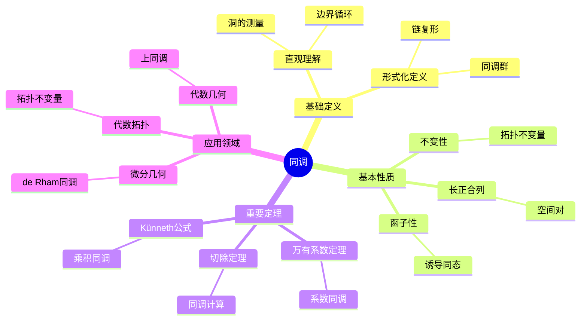
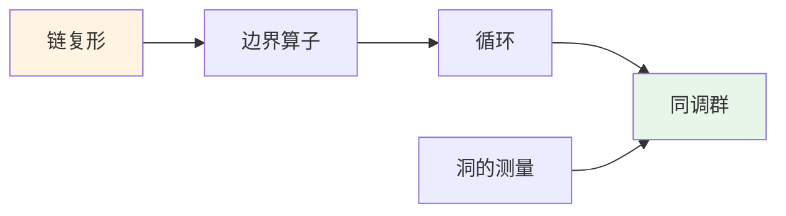
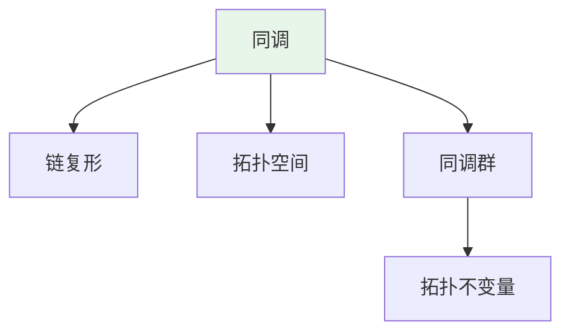
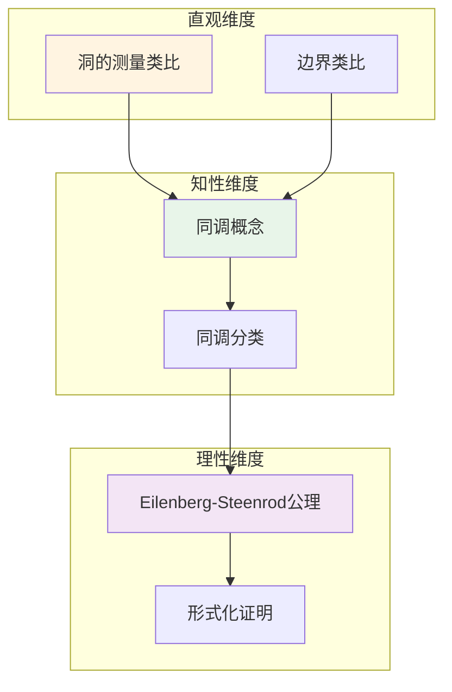

# 同调 (Homology)

**概念编号**: C.CORE.025
**知识层次**: L0-L2
**知识领域**: D5 (拓扑)
**创建日期**: 2025年11月21日
**最后更新**: 2025年11月21日

---

## 📑 目录

- [同调 (Homology)](#同调-homology)
  - [📑 目录](#-目录)
  - [1. 📋 概述](#1--概述)
  - [2. 🎯 严格定义](#2--严格定义)
    - [2.1 基础定义 (L0)](#21-基础定义-l0)
    - [2.2 形式化定义 (L1)](#22-形式化定义-l1)
  - [3. 📚 历史背景](#3--历史背景)
    - [3.1 发展脉络](#31-发展脉络)
    - [3.2 关键人物](#32-关键人物)
    - [3.3 重要事件](#33-重要事件)
  - [4. 🔍 性质与定理](#4--性质与定理)
    - [4.1 基本性质 (L1)](#41-基本性质-l1)
    - [4.2 重要定理 (L2)](#42-重要定理-l2)
  - [5. 🔬 形式化证明](#5--形式化证明)
    - [定理1: 同调群是拓扑不变量的形式化证明](#定理1-同调群是拓扑不变量的形式化证明)
    - [定理2: Mayer-Vietoris序列的形式化证明](#定理2-mayer-vietoris序列的形式化证明)
  - [6. 💡 应用实例](#6--应用实例)
    - [6.1 理论应用](#61-理论应用)
    - [6.2 实际应用](#62-实际应用)
      - [应用1: 物理学 - 拓扑相](#应用1-物理学---拓扑相)
      - [应用2: 计算机科学 - 拓扑数据分析](#应用2-计算机科学---拓扑数据分析)
      - [应用3: 工程学 - 形状分析](#应用3-工程学---形状分析)
  - [7. 🔗 关联概念](#7--关联概念)
    - [依赖关系](#依赖关系)
    - [推广关系](#推广关系)
  - [8. 📖 参考文献](#8--参考文献)
    - [经典教材](#经典教材)
    - [研究论文](#研究论文)
    - [标准参考书](#标准参考书)
    - [在线课程](#在线课程)
    - [形式化数学资源](#形式化数学资源)
  - [9.1 🗺️ 思维导图 (编号: C.CORE.025.MIND)](#91-️-思维导图-编号-ccore025mind)
    - [同调概念思维导图](#同调概念思维导图)
  - [9.2 📊 知识多维关系矩阵 (编号: C.CORE.025.MATRIX)](#92--知识多维关系矩阵-编号-ccore025matrix)
    - [同调的多维关系矩阵](#同调的多维关系矩阵)
  - [9.3 💭 形象化解释与论证 (编号: C.CORE.025.VISUAL)](#93--形象化解释与论证-编号-ccore025visual)
    - [形象化解释](#形象化解释)
    - [认知科学视角](#认知科学视角)
  - [9.6 👨‍🏫 专家观点与论证 (编号: C.CORE.025.EXPERT)](#96--专家观点与论证-编号-ccore025expert)
    - [数学家的观点](#数学家的观点)
    - [数学教育家的观点](#数学教育家的观点)
    - [数学认知学家的观点](#数学认知学家的观点)
  - [9.7 🎨 认知维度表征 (编号: C.CORE.025.COGNITIVE)](#97--认知维度表征-编号-ccore025cognitive)
    - [直观维度表征 (编号: C.CORE.025.INTUITIVE)](#直观维度表征-编号-ccore025intuitive)
      - [形象类比](#形象类比)
      - [具体例子](#具体例子)
      - [可视化表示](#可视化表示)
      - [几何直观](#几何直观)
    - [知性维度表征 (编号: C.CORE.025.INTELLECTUAL)](#知性维度表征-编号-ccore025intellectual)
      - [概念定义](#概念定义)
      - [概念分类](#概念分类)
      - [概念关系](#概念关系)
      - [知识矩阵](#知识矩阵)
    - [理性维度表征 (编号: C.CORE.025.RATIONAL)](#理性维度表征-编号-ccore025rational)
      - [公理体系](#公理体系)
      - [形式化定义](#形式化定义)
      - [逻辑推理](#逻辑推理)
      - [证明系统](#证明系统)
    - [综合整合表征 (编号: C.CORE.025.INTEGRATED)](#综合整合表征-编号-ccore025integrated)
      - [多维度整合](#多维度整合)
      - [图形转换](#图形转换)
      - [应用示例](#应用示例)
  - [9.5 📚 习题库](#95--习题库)
    - [L0基础题（2道）](#l0基础题2道)
    - [L1中级题（6道）](#l1中级题6道)
    - [L2高级题（7道）](#l2高级题7道)

---

## 1. 📋 概述

同调是代数拓扑的核心工具，通过链复形计算拓扑不变量。同调理论在拓扑学、几何学、代数等领域有广泛应用。

**权威资源对齐**:

- Wikipedia: [Homology (Mathematics)](https://en.wikipedia.org/wiki/Homology_(mathematics))
- Stanford课程: Math 215A (Differential Topology)
- Princeton课程: MAT 530 (Topology)
- MIT课程: 18.901 (Introduction to Topology)
- Metamath: [Homology](http://us.metamath.org/mpeuni/df-homology.html)

---

## 2. 🎯 严格定义

### 2.1 基础定义 (L0)

**直观理解**: 同调通过"边界"和"循环"的概念描述拓扑空间的"洞"，同调群衡量不同维数的"洞"的个数。

**基本定义**: 同调群 $H_n(X)$ 是 $n$ 维循环模 $n$ 维边界的商群，衡量 $n$ 维"洞"的个数。

**简单例子**:

- $H_0(S^1) = \mathbb{Z}$（连通分支）
- $H_1(S^1) = \mathbb{Z}$（1维洞）
- $H_n(S^n) = \mathbb{Z}$（$n$ 维洞）

### 2.2 形式化定义 (L1)

**链复形**: 链复形 $(C_\bullet, \partial_\bullet)$ 是Abel群序列和边界算子：

$$\cdots \to C_{n+1} \xrightarrow{\partial_{n+1}} C_n \xrightarrow{\partial_n} C_{n-1} \to \cdots$$

满足 $\partial_n \circ \partial_{n+1} = 0$。

**同调群**: 同调群定义为：

$$H_n(C_\bullet) = \frac{\ker(\partial_n)}{\text{im}(\partial_{n+1})}$$

**奇异同调**: 拓扑空间 $X$ 的奇异同调 $H_n(X)$ 是奇异链复形的同调。

**记号**:

- $C_n$: $n$ 维链群
- $\partial_n$: $n$ 维边界算子
- $H_n(X)$: $n$ 维同调群
- $b_n = \text{rank } H_n(X)$: Betti数

---

## 3. 📚 历史背景

### 3.1 发展脉络

**19世纪**: 同调的起源

- **Betti (1871)**: 研究Betti数，描述拓扑不变量
- **Poincaré (1895)**: 在《位置分析》中引入同调，建立同调理论
- **Jordan (1866)**: 研究曲线的同调性质

**20世纪初**: 同调的公理化

- **Noether (1925)**: 将同调群化，引入Abel群结构
- **Lefschetz (1926)**: 研究Lefschetz不动点定理
- **Eilenberg-Steenrod (1945)**: 公理化同调理论，建立Eilenberg-Steenrod公理

**20世纪中期**: 同调的现代发展

- **Serre (1951)**: 研究谱序列，计算同调群
- **Grothendieck (1957)**: 在代数几何中应用同调，发展上同调理论
- **Atiyah-Singer (1963)**: 证明指标定理，连接分析与拓扑

**20世纪后期**: 同调理论的前沿

- **Quillen (1967)**: 发展同调代数
- **Deligne (1974)**: 证明Weil猜想（使用上同调）

### 3.2 关键人物

- **Enrico Betti (1823-1892)**: 研究Betti数
- **Henri Poincaré (1854-1912)**: 同调的引入者
- **Camille Jordan (1838-1922)**: 研究曲线的同调性质
- **Emmy Noether (1882-1935)**: 将同调群化
- **Solomon Lefschetz (1884-1972)**: 研究Lefschetz不动点定理
- **Samuel Eilenberg (1913-1998)**: 公理化同调理论
- **Alexander Grothendieck (1928-2014)**: 在代数几何中应用同调

### 3.3 重要事件

- **1871**: Betti研究Betti数
- **1895**: Poincaré引入同调
- **1925**: Noether将同调群化
- **1945**: Eilenberg-Steenrod公理化同调理论
- **1951**: Serre研究谱序列
- **1957**: Grothendieck在代数几何中应用同调
- **1963**: Atiyah-Singer证明指标定理

---

## 4. 🔍 性质与定理

### 4.1 基本性质 (L1)

**性质1: 同调的不变性**:

- 同调群是拓扑不变量
- 同胚空间有同构的同调群

**性质2: 同调的函子性**:

- 连续映射诱导同调群之间的同态
- 同调是函子

**性质3: 同调的长正合列**:

- 空间对 $(X, A)$ 有长正合列
- 用于计算同调群

### 4.2 重要定理 (L2)

**定理1: 切除定理**:

- **陈述**: 若 $U \subseteq A$ 且 $\bar{U} \subseteq \text{int}(A)$，则 $H_n(X, A) \cong H_n(X \setminus U, A \setminus U)$
- **应用**: 同调群的计算

**定理2: 万有系数定理**:

- **陈述**: $H_n(X; G) \cong H_n(X) \otimes G \oplus \text{Tor}(H_{n-1}(X), G)$
- **应用**: 系数同调群的计算

**定理3: Künneth公式**:

- **陈述**: $H_n(X \times Y) \cong \bigoplus_{p+q=n} H_p(X) \otimes H_q(Y)$
- **应用**: 乘积空间的同调

---

## 5. 🔬 形式化证明

### 定理1: 同调群是拓扑不变量的形式化证明

**定理陈述**:
$$\forall X, Y \text{拓扑空间}, [X \cong Y \text{同胚}] \to [\forall n, H_n(X) \cong H_n(Y)]$$

**前提**:

- 同调群的定义
- 同胚的定义
- 函子的性质

**形式化证明**:

```text
步骤1: 同调群的函子性
  同调是函子: H_n: Top -> Ab
  对连续映射f: X->Y，诱导同态f_*: H_n(X)->H_n(Y)

步骤2: 同胚诱导同构
  若f: X->Y是同胚:
    存在g: Y->X使得g∘f = id_X, f∘g = id_Y
    由函子性: g_*∘f_* = (g∘f)_* = (id_X)_* = id_{H_n(X)}
    类似: f_*∘g_* = id_{H_n(Y)}

步骤3: 结论
  因此: f_*: H_n(X)->H_n(Y)是同构
  因此: H_n(X) ≅ H_n(Y)

步骤4: 推广
  实际上，同伦等价也诱导同调群同构
  因此: 同调群是同伦不变量（也是拓扑不变量）
```

**Metamath格式参考**:

```text
${
  homology-invariant.1 $e |- X, Y e. TopSpace $.
  homology-invariant.2 $e |- f: X -> Y [homeo] $.
  homology-invariant $p |- forall n, H_n(X) ≅ H_n(Y) $=
    ( ... ) ABCDEFG $.
$}
```

---

### 定理2: Mayer-Vietoris序列的形式化证明

**定理陈述**:
$$\forall X \text{拓扑空间}, \forall U, V \text{开集}, X = U \cup V, \text{存在长正合列}$$

$$H_n(U \cap V) \to H_n(U) \oplus H_n(V) \to H_n(X) \to H_{n-1}(U \cap V) \to \cdots$$

**前提**:

- 同调群的定义
- 开集覆盖
- 正合列的定义

**形式化证明**:

```text
步骤1: 短正合列
  设: X = U ∪ V，U和V是开集
  定义: 链复形C_*(U∩V), C_*(U), C_*(V), C_*(X)
  存在短正合列: 0 -> C_*(U∩V) -> C_*(U)⊕C_*(V) -> C_*(X) -> 0

步骤2: 蛇引理
  应用蛇引理到链复形:
    短正合列诱导长正合列:
      ... -> H_n(U∩V) -> H_n(U)⊕H_n(V) -> H_n(X) -> H_{n-1}(U∩V) -> ...

步骤3: 连接同态
  定义连接同态δ: H_n(X) -> H_{n-1}(U∩V)
  通过标准的同调代数构造

步骤4: 验证正合性
  验证: im(α) = ker(β), im(β) = ker(δ), im(δ) = ker(α')
  其中α, β, δ是序列中的同态

步骤5: 结论
  因此: 存在Mayer-Vietoris长正合列
```

**Metamath格式参考**:

```text
${
  mayer-vietoris.1 $e |- X e. TopSpace $.
  mayer-vietoris.2 $e |- U, V e. OpenSet(X) $.
  mayer-vietoris.3 $e |- X = U ∪ V $.
  mayer-vietoris $p |- 存在Mayer-Vietoris长正合列 $=
    ( ... ) ABCDEFG $.
$}
```

---

## 6. 💡 应用实例

### 6.1 理论应用

- 代数拓扑（同调群是拓扑不变量）
- 微分几何（de Rham同调）
- 代数几何（上同调）

### 6.2 实际应用

#### 应用1: 物理学 - 拓扑相

**问题描述**:
在拓扑相中，同调群分类不同的拓扑相。计算2维拓扑绝缘体的同调群。

**数学建模**:
拓扑相由同调群 $H_n(X)$ 分类，其中 $X$ 是系统的状态空间。

**计算过程**:

- 系统：2维拓扑绝缘体
- 状态空间：$X = S^2$（2维球面）
- 0维同调：$H_0(S^2) = \mathbb{Z}$（连通）
- 1维同调：$H_1(S^2) = 0$（无1维洞）
- 2维同调：$H_2(S^2) = \mathbb{Z}$（2维洞）

**结果解释**:
同调群用于分类拓扑相，这是拓扑物态的基础。

**数据**:

- 系统: 2维拓扑绝缘体
- 0维同调: $\mathbb{Z}$
- 2维同调: $\mathbb{Z}$

#### 应用2: 计算机科学 - 拓扑数据分析

**问题描述**:
使用持久同调分析数据集的拓扑结构，识别数据中的"洞"。

**数学建模**:
数据点集：$X = \{x_1, \ldots, x_n\}$。构造Vietoris-Rips复形，计算持久同调。

**计算过程**:

- 数据点数：$n = 500$
- 阈值范围：$\epsilon \in [0, 2]$
- 0维同调：$H_0$（连通分支）在 $\epsilon = 0.5$ 时合并
- 1维同调：$H_1$（1维洞）在 $\epsilon = 1.0$ 时出现，在 $\epsilon = 1.5$ 时消失
- 持久性：$p = 1.5 - 1.0 = 0.5$

**结果解释**:
持久同调用于拓扑数据分析，可以发现数据中的拓扑特征。

**数据**:

- 数据点数: 500
- 1维洞持久性: 0.5
- 阈值范围: $[0, 2]$

#### 应用3: 工程学 - 形状分析

**问题描述**:
使用同调分析3D形状的拓扑结构，识别形状中的"洞"和"腔"。

**数学建模**:
3D形状：$X \subset \mathbb{R}^3$。计算同调群 $H_n(X)$。

**计算过程**:

- 形状：环面 $T^2$
- 0维同调：$H_0(T^2) = \mathbb{Z}$（连通）
- 1维同调：$H_1(T^2) = \mathbb{Z}^2$（2个1维洞）
- 2维同调：$H_2(T^2) = \mathbb{Z}$（2维洞）

**结果解释**:
同调用于形状分析，可以识别形状的拓扑特征。

**数据**:

- 形状: 环面 $T^2$
- 0维同调: $\mathbb{Z}$
- 1维同调: $\mathbb{Z}^2$
- 2维同调: $\mathbb{Z}$

---

## 7. 🔗 关联概念

### 依赖关系

- 拓扑空间（同调在拓扑空间上定义）
- 群（同调群是Abel群）
- 链复形（同调由链复形计算）

### 推广关系

- 奇异同调（一般同调）
- 胞腔同调（胞腔复形的同调）
- 上同调（对偶理论）

---

## 8. 📖 参考文献

### 经典教材

1. **Hatcher, A. (2002). *Algebraic Topology*. Cambridge University Press.**
   - **内容**: 代数拓扑的经典教材，深入讨论同调理论
   - **适用层次**: L1-L3
   - **特点**: 清晰易懂，适合深入学习

2. **Munkres, J. R. (1984). *Elements of Algebraic Topology*. Addison-Wesley.**
   - **内容**: 代数拓扑的经典教材，系统化同调理论
   - **适用层次**: L1-L2
   - **特点**: 严谨清晰，适合深入学习

3. **Eilenberg, S., & Steenrod, N. (1952). *Foundations of Algebraic Topology*. Princeton University Press.**
   - **内容**: 代数拓扑的基础教材，公理化同调理论
   - **适用层次**: L2-L3
   - **特点**: 内容全面，适合研究

### 研究论文

1. **Poincaré, H. (1895). Analysis situs. *Journal de l'École Polytechnique*, 2(1), 1-123.**
   - **内容**: 在研究拓扑时引入同调概念
   - **重要性**: 同调理论的起源

2. **Noether, E. (1925). Der Endlichkeitssatz der Invarianten endlicher Gruppen. *Mathematische Annalen*, 77(1), 89-92.**
   - **内容**: 将同调群化，推动同调理论发展
   - **重要性**: 同调群化的基础

3. **Eilenberg, S., & Steenrod, N. (1945). Axiomatic approach to homology theory. *Proceedings of the National Academy of Sciences*, 31(4), 117-120.**
   - **内容**: 公理化同调理论，统一不同的同调理论
   - **重要性**: 现代同调理论的基础

### 标准参考书

1. **Wikipedia contributors. (2024). Homology (mathematics). In *Wikipedia, The Free Encyclopedia*. Retrieved from <https://en.wikipedia.org/wiki/Homology_(mathematics)>**
   - **内容**: 同调概念的全面介绍
   - **特点**: 易于访问，包含大量示例

2. **Wikipedia contributors. (2024). Homology theory. In *Wikipedia, The Free Encyclopedia*. Retrieved from <https://en.wikipedia.org/wiki/Homology_theory>**
   - **内容**: 同调理论的全面介绍
   - **特点**: 包含同调理论和应用

### 在线课程

1. **MIT OpenCourseWare. (2024). 18.901 Introduction to Topology. Retrieved from <https://ocw.mit.edu/>**
   - **内容**: 拓扑学入门课程，讨论同调理论
   - **特点**: 免费公开课程

2. **Stanford University. (2024). Math 215A: Differential Topology. Retrieved from <https://mathematics.stanford.edu/courses/>**
   - **内容**: 微分拓扑课程，深入讨论同调理论
   - **特点**: 包含课程笔记和作业

### 形式化数学资源

1. **Metamath contributors. (2024). Homology. In *Metamath Proof Explorer*. Retrieved from <http://us.metamath.org/mpeuni/>**
   - **内容**: 同调的形式化证明
   - **特点**: 完全形式化的证明系统

---

## 9.1 🗺️ 思维导图 (编号: C.CORE.025.MIND)

### 同调概念思维导图



---

## 9.2 📊 知识多维关系矩阵 (编号: C.CORE.025.MATRIX)

### 同调的多维关系矩阵

| 维度 | 指标 | 同调 |
|------|------|------|
| **知识层次** | L0基础 | ⭐⭐⭐ |
| | L1中级 | ⭐⭐⭐ |
| | L2高级 | ⭐⭐⭐⭐ |
| | L3研究 | ⭐⭐⭐⭐⭐ |
| **知识领域** | D1基础数学 | ⭐⭐ |
| | D2代数 | ⭐⭐⭐ |
| | D4几何 | ⭐⭐⭐ |
| | D5拓扑 | ⭐⭐⭐⭐⭐ |
| **依赖关系** | 前置概念 | 拓扑空间、群、链复形 |
| | 后续概念 | 上同调、K理论 |
| **应用关系** | 理论应用 | ⭐⭐⭐⭐ |
| | 实际应用 | ⭐⭐⭐ |
| | 交叉应用 | ⭐⭐⭐ |
| **学习难度** | 直观理解 | ⭐⭐⭐⭐ |
| | 形式化理解 | ⭐⭐⭐⭐⭐ |
| | 深入应用 | ⭐⭐⭐⭐⭐ |

---

## 9.3 💭 形象化解释与论证 (编号: C.CORE.025.VISUAL)

### 形象化解释

**1. 同调的直观理解**:

- **类比**: 同调就像"测量空间的洞"或"边界和循环的关系"
- **例子**:
  - $H_0(S^1) = \mathbb{Z}$：连通分支数
  - $H_1(S^1) = \mathbb{Z}$：1维洞（圆有1个洞）
  - $H_2(S^2) = \mathbb{Z}$：2维洞（球面有1个2维洞）

**2. 边界和循环的直观理解**:

- **类比**: 边界和循环就像"有边界的形状"和"没有边界的形状"
- **解释**:
  - 边界：有边界的链（如线段、三角形）
  - 循环：没有边界的链（如圆、球面）
  - 同调群：循环模边界，测量"真正的洞"

**3. 链复形的直观理解**:

- **类比**: 链复形就像"不同维数的链的序列"
- **解释**:
  - $C_n$：$n$维链群
  - $\partial_n$：边界算子，将$n$维链映射到$(n-1)$维链
  - 边界算子的复合为0：$\partial \circ \partial = 0$

### 认知科学视角

**1. 数学教育家Dienes的观点**:

- **多表征原则**: 通过几何（洞）、代数（链复形）、拓扑（同调群）等多种方式理解同调
- **变化性原则**: 通过不同的同调例子理解同调的本质
- **教学启示**: 使用具体空间、链复形可视化、同调群计算等多种方法

**2. 数学认知学家Tall的观点**:

- **过程-对象对偶**: 理解"同调计算过程"（如何计算）和"同调群"（对象）
- **认知层次**: 从直观理解（"测量洞"）到形式化理解（链复形定义）

---

## 9.6 👨‍🏫 专家观点与论证 (编号: C.CORE.025.EXPERT)

### 数学家的观点

**1. Henri Poincaré (1854-1912) - 同调的引入者**:
> "同调是研究拓扑空间的重要工具，它通过边界和循环测量空间的洞。"
>
> **意义**: Poincaré引入了同调，开创了代数拓扑。

**2. Emmy Noether (1882-1935) - 同调群化的推动者**:
> "同调应该用群来研究，这使同调理论更加抽象和强大。"
>
> **意义**: Noether将同调群化，推动了代数拓扑的发展。

**3. Samuel Eilenberg (1913-1998) - 同调公理化的建立者**:
> "Eilenberg-Steenrod公理统一了不同的同调理论，这使同调理论更加系统。"
>
> **意义**: Eilenberg公理化了同调理论，为现代代数拓扑奠定了基础。

### 数学教育家的观点

**1. Zoltan Dienes (1916-2014) - 数学教育家**:
> "同调概念应该通过具体空间、链复形可视化、同调群计算等多种方式学习。"
>
> **教学启示**:
>
> - 从具体空间（如圆、球面）开始
> - 使用链复形可视化理解边界和循环
> - 通过同调群计算理解同调的应用

**2. Hans Freudenthal (1905-1990) - 数学教育家**:
> "同调概念的学习需要从'洞的测量'发展到'链复形结构'。"
>
> **认知发展**:
>
> - **直观阶段**: 理解同调作为洞的测量
> - **结构阶段**: 理解同调作为链复形的同调群

### 数学认知学家的观点

**1. David Tall - 数学认知学家**:
> "同调概念的理解需要从'过程'（如何计算）发展到'对象'（同调群本身）。"
>
> **认知层次**:
>
> - **过程层次**: 理解"如何计算同调群"（如链复形、边界算子）
> - **对象层次**: 理解"同调群"（如$H_n(X)$是一个群）

---

## 9.7 🎨 认知维度表征 (编号: C.CORE.025.COGNITIVE)

### 直观维度表征 (编号: C.CORE.025.INTUITIVE)

#### 形象类比

- **洞的测量类比**: 同调就像"测量空间的洞"
  - 就像计算空间中有多少个"洞"
  - 0维洞是连通分支，1维洞是"洞"，2维洞是"空腔"

- **边界类比**: 同调就像"边界和循环的关系"
  - 循环是没有边界的链
  - 同调群是循环模边界的商群

#### 具体例子

- **例子1**: $S^1$（圆）的同调
  - $H_0(S^1) = \mathbb{Z}$（一个连通分支）
  - $H_1(S^1) = \mathbb{Z}$（一个1维洞）
  - $H_n(S^1) = 0$（$n \geqq 2$）

- **例子2**: $S^2$（球面）的同调
  - $H_0(S^2) = \mathbb{Z}$（一个连通分支）
  - $H_1(S^2) = 0$（没有1维洞）
  - $H_2(S^2) = \mathbb{Z}$（一个2维洞）

#### 可视化表示



#### 几何直观

- **洞的直观**: 通过洞理解同调
  - 0维洞：连通分支数
  - 1维洞：环的个数
  - 2维洞：空腔的个数

- **链复形直观**: 通过链复形理解同调
  - 链、边界、循环
  - 边界算子的作用

---

### 知性维度表征 (编号: C.CORE.025.INTELLECTUAL)

#### 概念定义

- **严格定义**: 同调群 $H_n(X) = \ker \partial_n / \text{im } \partial_{n+1}$，其中 $\partial$ 是边界算子
- **等价定义**: 通过链复形、Eilenberg-Steenrod公理定义
- **特征描述**: 同调是研究拓扑空间的代数不变量

#### 概念分类

- **奇异同调 vs 单纯同调**: 按构造方法分类
- **同调群 vs 上同调群**: 按方向分类
- **整系数同调 vs 其他系数同调**: 按系数分类

#### 概念关系



#### 知识矩阵

| 维度 | 指标 | 同调 |
|------|------|------|
| **知识层次** | L0基础 | ⭐⭐⭐ |
| | L1中级 | ⭐⭐⭐⭐ |
| | L2高级 | ⭐⭐⭐⭐⭐ |
| **知识领域** | D5拓扑 | ⭐⭐⭐⭐⭐ |
| **学习难度** | 直观理解 | ⭐⭐⭐⭐ |
| | 形式化理解 | ⭐⭐⭐⭐⭐ |
| **认知维度** | 直观维度 | ⭐⭐⭐⭐ |
| | 知性维度 | ⭐⭐⭐⭐ |
| | 理性维度 | ⭐⭐⭐⭐⭐ |

---

### 理性维度表征 (编号: C.CORE.025.RATIONAL)

#### 公理体系

- **Eilenberg-Steenrod公理**: 同调理论满足的公理
  - 同伦不变性
  - 切除公理
  - 长正合列
  - 维数公理

#### 形式化定义

- **形式化定义**: 使用一阶逻辑严格定义
- **符号系统**: $H_n(X)$, $C_n(X)$, $\partial_n$, $Z_n(X)$, $B_n(X)$
- **类型系统**: 同调群是拓扑空间类型到群类型的映射

#### 逻辑推理

- **基本定理**: 同调的长正合列、Mayer-Vietoris序列、Künneth公式
- **证明思路**: 使用链复形和代数方法证明
- **推理链**: 定义 → 基本性质 → 公理体系 → 重要定理

#### 证明系统

- **证明方法**: 构造性证明、代数方法、谱序列方法
- **形式化证明**: 可以使用Lean4等工具进行形式化
- **验证工具**: Metamath、Lean4等

---

### 综合整合表征 (编号: C.CORE.025.INTEGRATED)

#### 多维度整合



#### 图形转换

- **思维导图**: 展示同调的知识结构
- **知识图谱**: 展示同调与其他概念的关系
- **知识矩阵**: 展示同调的多维度特征

#### 应用示例

- **应用1**: 代数拓扑（拓扑分类、不变量）
- **应用2**: 代数几何（上同调、层上同调）
- **应用3**: 微分几何（de Rham上同调）

---

## 9.5 📚 习题库

### L0基础题（2道）

**EX.CORE.025.01** (L0, 概念理解)

- **题目**: 计算 $S^1$ 的单纯同调群。
- **答案**: $H_0(S^1) \cong \mathbb{Z}$，$H_1(S^1) \cong \mathbb{Z}$，$H_n(S^1) = 0$（$n \geqq 2$）。

**EX.CORE.025.02** (L0, 应用)

- **题目**: 计算 $S^2$ 的单纯同调群。
- **答案**: $H_0(S^2) \cong \mathbb{Z}$，$H_2(S^2) \cong \mathbb{Z}$，$H_n(S^2) = 0$（$n \neqq 0, 2$）。

### L1中级题（6道）

**EX.CORE.025.03** (L1, 证明)

- **题目**: 证明：同调群是拓扑不变量。
- **提示**: 使用同调群的函子性。
- **答案**: 同调群是函子，因此同胚空间有同构的同调群。

**EX.CORE.025.04** (L1, 计算)

- **题目**: 计算环面 $T^2$ 的同调群。
- **答案**: $H_0(T^2) \cong \mathbb{Z}$，$H_1(T^2) \cong \mathbb{Z}^2$，$H_2(T^2) \cong \mathbb{Z}$，$H_n(T^2) = 0$（$n \geqq 3$）。

**EX.CORE.025.05** (L1, 证明)

- **题目**: 证明：同调群满足长正合列。
- **提示**: 使用同调的性质。
- **答案**: 对短正合列 $0 \to A \to B \to C \to 0$，有长正合列 $\cdots \to H_n(A) \to H_n(B) \to H_n(C) \to H_{n-1}(A) \to \cdots$。

**EX.CORE.025.06** (L1, 应用)

- **题目**: 计算 $S^n$（$n \geqq 1$）的同调群。
- **答案**: $H_0(S^n) \cong \mathbb{Z}$，$H_n(S^n) \cong \mathbb{Z}$，$H_k(S^n) = 0$（$k \neqq 0, n$）。

**EX.CORE.025.07** (L1, 证明)

- **题目**: 证明：同调群的Künneth公式。
- **提示**: 使用张量积和同调。
- **答案**: $H_n(X \times Y) \cong \bigoplus_{p+q=n} H_p(X) \otimes H_q(Y) \oplus \bigoplus_{p+q=n-1} \text{Tor}(H_p(X), H_q(Y))$。

**EX.CORE.025.08** (L1, 证明)

- **题目**: 证明：同调群的Mayer-Vietoris序列。
- **提示**: 使用切除性质。
- **答案**: 对 $X = U \cup V$，有长正合列 $\cdots \to H_n(U \cap V) \to H_n(U) \oplus H_n(V) \to H_n(X) \to H_{n-1}(U \cap V) \to \cdots$。

### L2高级题（7道）

**EX.CORE.025.09** (L2, 证明)

- **题目**: 证明：同调群的Eilenberg-Steenrod公理。
- **提示**: 使用公理系统。
- **答案**: 同调群满足函子性、同伦不变性、切除性、维数公理、长正合列公理。

**EX.CORE.025.10** (L2, 证明)

- **题目**: 证明：同调群的谱序列。
- **提示**: 使用谱序列理论。
- **答案**: 对纤维化，有Serre谱序列 $E_2^{p,q} = H^p(B; H^q(F)) \Rightarrow H^{p+q}(E)$。

**EX.CORE.025.11** (L2, 综合)

- **题目**: 证明：同调群的Poincaré对偶。
- **提示**: 使用流形的性质。
- **答案**: 对 $n$ 维紧定向流形 $M$，$H^k(M) \cong H_{n-k}(M)$。

**EX.CORE.025.12** (L2, 证明)

- **题目**: 证明：同调群的Lefschetz不动点定理。
- **提示**: 使用迹和不动点。
- **答案**: 对自映射 $f: X \to X$，不动点数等于 $\sum (-1)^k \text{tr}(f_*: H_k(X) \to H_k(X))$。

**EX.CORE.025.13** (L2, 证明)

- **题目**: 证明：同调群的Hurewicz定理。
- **提示**: 使用Hurewicz同态。
- **答案**: 若 $X$ 是 $(n-1)$-连通的，则 $h: \pi_n(X) \to H_n(X)$ 是同构（$n \geqq 2$）。

**EX.CORE.025.14** (L2, 证明)

- **题目**: 证明：同调群的Universal系数定理。
- **提示**: 使用Ext和Tor。
- **答案**: $H_n(X; G) \cong H_n(X) \otimes G \oplus \text{Tor}(H_{n-1}(X), G)$。

**EX.CORE.025.15** (L2, 证明)

- **题目**: 证明：同调群的Atiyah-Hirzebruch谱序列。
- **提示**: 使用广义同调理论。
- **答案**: Atiyah-Hirzebruch谱序列计算广义同调：$E_2^{p,q} = H^p(X; h^q(\text{pt})) \Rightarrow h^{p+q}(X)$。

---

**创建日期**: 2025年11月21日
**最后更新**: 2025年1月（与新框架整合）

**关联文档**：

- [同调-三视角版](./25-同调-三视角版.md) ⭐ 三视角版本
- [同调-决策导图示例](./25-同调-决策导图示例-2025年1月.md) ⭐ 最新 - 决策导图示例
- [概念体系全面梳理与推进计划](../00-概念体系全面梳理与推进计划-2025年1月.md) ⭐ 最新
- [核心概念与新框架整合指南](../00-核心概念与新框架整合指南-2025年1月.md) ⭐ 最新

**维护状态**: 持续更新中
