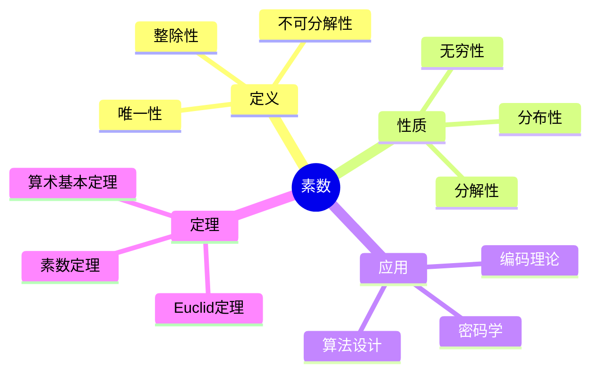
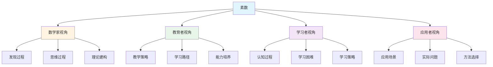
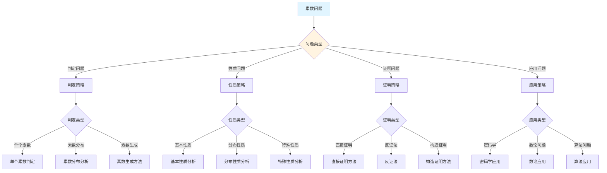
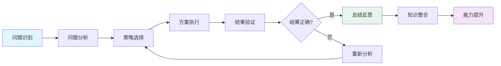
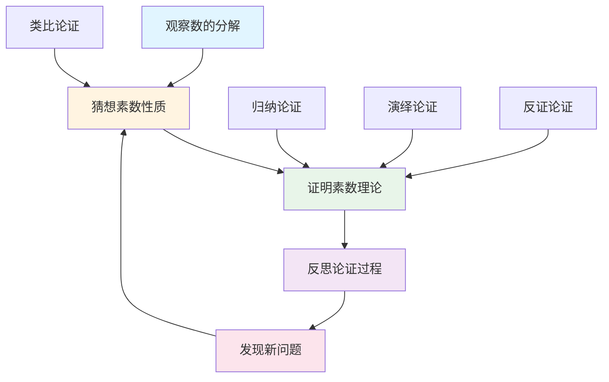
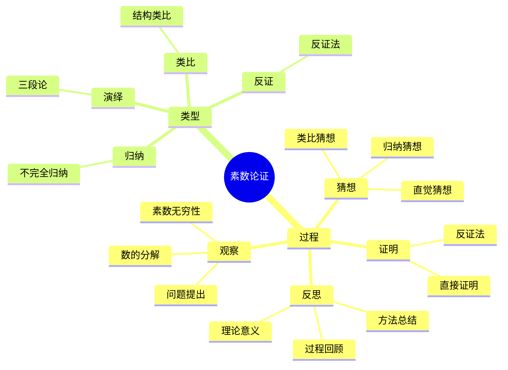

# 素数 (Prime Number) - 三视角组织版

**概念编号**: C.CORE.026
**知识层次**: L0-L2
**知识领域**: D6 (数论)
**创建日期**: 2025年1月
**最后更新**: 2025年1月

---

## 📋 目录 / Table of Contents

- [素数 (Prime Number) - 三视角组织版](#素数-prime-number---三视角组织版)
  - [📋 目录 / Table of Contents](#-目录--table-of-contents)
  - [1. 📋 概述 (编号: C.CORE.026.01)](#1--概述-编号-ccore02601)
  - [🧠 认知学视角：如何理解素数 (编号: C.CORE.026.02)](#-认知学视角如何理解素数-编号-ccore02602)
    - [认知起点 (编号: C.CORE.026.02.01)](#认知起点-编号-ccore0260201)
    - [认知过程 (编号: C.CORE.026.02.02)](#认知过程-编号-ccore0260202)
      - [阶段1：直观理解阶段 (编号: C.CORE.026.02.02.01)](#阶段1直观理解阶段-编号-ccore026020201)
      - [阶段2：概念形成阶段 (编号: C.CORE.026.02.02.02)](#阶段2概念形成阶段-编号-ccore026020202)
      - [阶段3：形式化阶段 (编号: C.CORE.026.02.02.03)](#阶段3形式化阶段-编号-ccore026020203)
    - [认知障碍 (编号: C.CORE.026.02.03)](#认知障碍-编号-ccore0260203)
    - [认知工具 (编号: C.CORE.026.02.04)](#认知工具-编号-ccore0260204)
  - [🎓 教育学视角：如何教学素数 (编号: C.CORE.026.03)](#-教育学视角如何教学素数-编号-ccore02603)
    - [教学目标 (编号: C.CORE.026.03.01)](#教学目标-编号-ccore0260301)
    - [教学路径 (编号: C.CORE.026.03.02)](#教学路径-编号-ccore0260302)
      - [阶段1：引入阶段（激发兴趣） (编号: C.CORE.026.03.02.01)](#阶段1引入阶段激发兴趣-编号-ccore026030201)
      - [阶段2：探索阶段（主动建构） (编号: C.CORE.026.03.02.02)](#阶段2探索阶段主动建构-编号-ccore026030202)
      - [阶段3：形式化阶段（抽象概括） (编号: C.CORE.026.03.02.03)](#阶段3形式化阶段抽象概括-编号-ccore026030203)
      - [阶段4：巩固阶段（应用深化） (编号: C.CORE.026.03.02.04)](#阶段4巩固阶段应用深化-编号-ccore026030204)
    - [教学难点 (编号: C.CORE.026.03.03)](#教学难点-编号-ccore0260303)
    - [教学策略 (编号: C.CORE.026.03.04)](#教学策略-编号-ccore0260304)
    - [评估方法 (编号: C.CORE.026.03.05)](#评估方法-编号-ccore0260305)
  - [🔬 数学家视角：如何思考素数 (编号: C.CORE.026.04)](#-数学家视角如何思考素数-编号-ccore02604)
    - [问题起源 (编号: C.CORE.026.04.01)](#问题起源-编号-ccore0260401)
    - [思维过程 (编号: C.CORE.026.04.02)](#思维过程-编号-ccore0260402)
      - [步骤1：问题提出 (编号: C.CORE.026.04.02.01)](#步骤1问题提出-编号-ccore026040201)
      - [步骤2：概念形成 (编号: C.CORE.026.04.02.02)](#步骤2概念形成-编号-ccore026040202)
      - [步骤3：理论发展 (编号: C.CORE.026.04.02.03)](#步骤3理论发展-编号-ccore026040203)
    - [历史发展 (编号: C.CORE.026.04.03)](#历史发展-编号-ccore0260403)
    - [3.2 关键人物和贡献 (编号: C.CORE.026.04.04)](#32-关键人物和贡献-编号-ccore0260404)
    - [重要定理 (编号: C.CORE.026.04.05)](#重要定理-编号-ccore0260405)
    - [开放问题 (编号: C.CORE.026.04.06)](#开放问题-编号-ccore0260406)
    - [一、第一人称思维描述 (编号: C.CORE.026.04.07)](#一第一人称思维描述-编号-ccore0260407)
      - [1.1 Euclid的发现过程](#11-euclid的发现过程)
    - [二、数学直觉的形成 (编号: C.CORE.026.04.08)](#二数学直觉的形成-编号-ccore0260408)
      - [2.1 直觉在概念发现中的作用](#21-直觉在概念发现中的作用)
      - [2.2 如何培养素数直觉](#22-如何培养素数直觉)
    - [三、数学美的教育价值 (编号: C.CORE.026.04.09)](#三数学美的教育价值-编号-ccore0260409)
      - [3.1 素数论的美在哪里](#31-素数论的美在哪里)
      - [3.2 如何培养学生的数学美感](#32-如何培养学生的数学美感)
    - [四、问题解决策略 (编号: C.CORE.026.04.10)](#四问题解决策略-编号-ccore0260410)
      - [4.1 数学家的启发式方法](#41-数学家的启发式方法)
      - [4.2 思维过程分析](#42-思维过程分析)
    - [五、批判性反思 (编号: C.CORE.026.04.11)](#五批判性反思-编号-ccore0260411)
      - [5.1 素数概念的局限性](#51-素数概念的局限性)
      - [5.2 素数理论的未解决问题](#52-素数理论的未解决问题)
  - [💡 数学解释：为什么素数是这样定义的 (编号: C.CORE.026.05)](#-数学解释为什么素数是这样定义的-编号-ccore02605)
    - [一、直观解释：素数是什么？](#一直观解释素数是什么)
      - [1.1 具体例子](#11-具体例子)
      - [1.2 形象类比](#12-形象类比)
      - [1.3 几何直观](#13-几何直观)
      - [1.4 操作体验](#14-操作体验)
    - [二、知性解释：素数的本质是什么？](#二知性解释素数的本质是什么)
      - [2.1 概念定义](#21-概念定义)
      - [2.2 分类体系](#22-分类体系)
      - [2.3 抽象结构](#23-抽象结构)
      - [2.4 知识体系](#24-知识体系)
    - [三、理性解释：素数的公理化定义](#三理性解释素数的公理化定义)
      - [3.1 公理体系](#31-公理体系)
      - [3.2 形式化证明](#32-形式化证明)
      - [3.3 系统建构](#33-系统建构)
    - [四、多视角解释：从不同角度理解素数](#四多视角解释从不同角度理解素数)
      - [4.1 数学家视角：素数是如何被发现的？](#41-数学家视角素数是如何被发现的)
      - [4.2 教育者视角：如何教学素数？](#42-教育者视角如何教学素数)
      - [4.3 学习者视角：如何学习素数？](#43-学习者视角如何学习素数)
      - [4.4 应用者视角：如何应用素数？](#44-应用者视角如何应用素数)
    - [五、思维表征：用多种方式理解素数](#五思维表征用多种方式理解素数)
      - [5.1 思维导图：素数的知识结构](#51-思维导图素数的知识结构)
      - [5.2 矩阵对比：不同解释方式的对比](#52-矩阵对比不同解释方式的对比)
      - [5.3 多视角表征：从不同角度表征素数](#53-多视角表征从不同角度表征素数)
      - [5.4 决策树：素数问题分类和策略选择](#54-决策树素数问题分类和策略选择)
      - [5.5 决策逻辑路径：素数问题解决过程](#55-决策逻辑路径素数问题解决过程)
      - [5.6 多维对比矩阵：素数概念特征对比](#56-多维对比矩阵素数概念特征对比)
  - [� 数学论证：如何论证素数 (编号: C.CORE.026.06)](#-数学论证如何论证素数-编号-ccore02606)
    - [一、论证过程：从观察到反思](#一论证过程从观察到反思)
      - [1.1 观察（Observation）](#11-观察observation)
      - [1.2 猜想（Conjecture）](#12-猜想conjecture)
      - [1.3 证明（Proof）](#13-证明proof)
      - [1.4 反思（Reflection）](#14-反思reflection)
    - [二、论证类型：多种推理方式](#二论证类型多种推理方式)
      - [2.1 归纳论证（Inductive Reasoning）](#21-归纳论证inductive-reasoning)
      - [2.2 演绎论证（Deductive Reasoning）](#22-演绎论证deductive-reasoning)
      - [2.3 类比论证（Analogical Reasoning）](#23-类比论证analogical-reasoning)
      - [2.4 反证论证（Proof by Contradiction）](#24-反证论证proof-by-contradiction)
    - [三、论证可视化：用图形表示论证过程](#三论证可视化用图形表示论证过程)
      - [3.1 论证流程图](#31-论证流程图)
      - [3.2 论证类型对比](#32-论证类型对比)
      - [3.3 论证思维导图](#33-论证思维导图)
  - [🔗 三视角整合 (编号: C.CORE.026.07)](#-三视角整合-编号-ccore02607)
    - [三个视角的关联](#三个视角的关联)
    - [如何综合运用三个视角](#如何综合运用三个视角)
  - [📚 参考文献 (编号: C.CORE.026.08)](#-参考文献-编号-ccore02608)
    - [权威资源](#权威资源)
    - [经典教材](#经典教材)
    - [研究论文](#研究论文)

---

## 1. 📋 概述 (编号: C.CORE.026.01)

素数是只能被1和自身整除的正整数，是数论的基础。素数理论在密码学、编码理论、算法设计等领域有重要应用。

本文档从**数学认知学**、**教育学**、**数学家**三个视角深入展开素数概念，避免简单的概念堆垒。

**权威资源对齐**:

- Wikipedia: [Prime Number](https://en.wikipedia.org/wiki/Prime_number)
- Stanford课程: Math 154 (Number Theory)
- Princeton课程: MAT 320 (Number Theory)
- MIT课程: 18.781 (Theory of Numbers)
- Metamath: [Prime Number](http://us.metamath.org/mpeuni/df-prm.html)

---

## 🧠 认知学视角：如何理解素数 (编号: C.CORE.026.02)

### 认知起点 (编号: C.CORE.026.02.01)

**学习者已有的知识基础**:

- 整数的概念
- 整除的概念
- 日常经验中的"不可分解"概念

**日常经验中的类似概念**:

- "不可分解"：不能再分解
- "基本单位"：最基本的单位
- "原子"：不可分割的粒子

### 认知过程 (编号: C.CORE.026.02.02)

#### 阶段1：直观理解阶段 (编号: C.CORE.026.02.02.01)

**具体例子**:

- 例子1：$2, 3, 5, 7, 11, 13, 17, 19, 23, 29, \ldots$
- 例子2：$2$是唯一的偶素数
- 例子3：$1$不是素数（约定）

**形象类比**:

- **原子类比**: 素数就像"数的原子"
  - 每个数可以分解为素数的乘积
  - 素数是"不可分解"的
  - 素数是"基本单位"

- **分解类比**: 素数就像"不可分解的数"
  - 合数可以分解
  - 素数不能分解
  - 素数是"基本单位"

**可视化表示**:

```text
素数:
    2, 3, 5, 7, 11, 13, ...
    只能被1和自身整除
    不可分解
```

#### 阶段2：概念形成阶段 (编号: C.CORE.026.02.02.02)

**从例子中抽象出共同特征**:

- 所有例子都涉及"不可分解"
- 只能被1和自身整除
- 是"基本单位"

**识别关键属性**:

1. **不可分解性**: 若$p = ab$，则$a = 1$或$b = 1$
2. **整除性**: 若$p \mid ab$，则$p \mid a$或$p \mid b$
3. **基本性**: 每个数可以分解为素数的乘积

**建立概念边界**:

- **什么是素数**: 只能被1和自身整除的正整数
- **什么不是素数**:
  - $1$（不是素数，约定）
  - 合数（可以分解）

#### 阶段3：形式化阶段 (编号: C.CORE.026.02.02.03)

**严格定义**:

- 素数定义：$p > 1$且$\forall a, b \in \mathbb{Z}^+, p = ab \Rightarrow (a = 1 \lor b = 1)$
- 等价定义：若$p \mid ab$，则$p \mid a$或$p \mid b$

**公理化表述**:

- 条件1：$p > 1$
- 条件2：不可分解性

**逻辑结构**:

- 素数是数论的基础
- 素数是算术基本定理的基础
- 素数是密码学的基础

### 认知障碍 (编号: C.CORE.026.02.03)

**常见误解**:

1. **误解1**: 认为$1$是素数
   - **纠正**: $1$不是素数，这是约定

2. **误解2**: 认为所有奇数都是素数
   - **纠正**: 不是所有奇数都是素数，如$9 = 3 \times 3$

3. **误解3**: 认为素数有规律
   - **纠正**: 素数的分布看似随机，但有深层规律

**理解难点**:

1. **难点1**: 素数的无穷性
   - **原因**: 需要理解Euclid定理
   - **解决方法**: 用反证法证明，强调无穷性

2. **难点2**: 素数分布
   - **原因**: 素数分布比较复杂
   - **解决方法**: 用具体例子，强调分布的复杂性

3. **难点3**: 素数判定
   - **原因**: 素数判定算法比较复杂
   - **解决方法**: 用具体例子，逐步掌握判定方法

**认知陷阱**:

- **1**: 需要理解$1$不是素数的约定
- **分布**: 需要理解素数分布的复杂性

### 认知工具 (编号: C.CORE.026.02.04)

**类比工具**:

- **原子类比**: 素数 = 数的原子
- **分解类比**: 素数 = 不可分解的数

**可视化工具**:

- **素数表**: 用素数表表示素数
- **分解图**: 用分解图表示数的分解

**具体化工具**:

- **具体例子**: 用具体例子理解抽象概念
- **反例**: 用反例理解概念边界

---

## 🎓 教育学视角：如何教学素数 (编号: C.CORE.026.03)

### 教学目标 (编号: C.CORE.026.03.01)

**知识目标**:

- 理解素数的基本概念
- 掌握素数的定义
- 理解素数的性质
- 理解素数的应用

**能力目标**:

- 能够判断一个数是否是素数
- 能够理解素数的性质
- 能够应用素数解决实际问题
- 能够理解素数的重要性

**情感目标**:

- 培养数学抽象思维
- 培养数论思维
- 激发对数学的兴趣

### 教学路径 (编号: C.CORE.026.03.02)

#### 阶段1：引入阶段（激发兴趣） (编号: C.CORE.026.03.02.01)

**实际问题**:

- 问题1：如何分解一个数？
- 问题2：如何研究数的性质？
- 问题3：如何设计密码？

**历史背景**:

- 素数的历史发展
- 素数在数学中的地位
- 素数在密码学中的应用

**引发认知冲突**:

- 问题：如何统一描述"不可分解"的数？
- 引出素数的概念

#### 阶段2：探索阶段（主动建构） (编号: C.CORE.026.03.02.02)

**引导发现**:

1. 让学生自己列举"不可分解"的数
2. 让学生观察这些数的共同特征
3. 引导学生抽象出素数的定义

**合作探究**:

- 小组讨论：什么是素数？
- 小组讨论：素数有哪些性质？
- 小组讨论：如何判断素数？

**多元表征**:

- **语言表征**: "素数是只能被1和自身整除的正整数"
- **符号表征**: $p$
- **图形表征**: 素数表、分解图
- **集合表征**: 素数定义

#### 阶段3：形式化阶段（抽象概括） (编号: C.CORE.026.03.02.03)

**严格定义**:

- 素数的定义
- 素数的性质
- 素数的判定

**性质证明**:

- 素数的基本性质
- Euclid定理
- 算术基本定理

**应用拓展**:

- 素数在数论中的应用
- 素数在密码学中的应用
- 素数在算法设计中的应用

#### 阶段4：巩固阶段（应用深化） (编号: C.CORE.026.03.02.04)

**练习应用**:

- 基础练习：素数的判断和性质
- 应用练习：用素数解决实际问题
- 综合练习：素数的综合应用

**变式训练**:

- 不同形式的素数判断
- 不同性质的素数
- 素数的应用

**知识整合**:

- 素数与其他概念的联系
- 素数在数学体系中的地位

### 教学难点 (编号: C.CORE.026.03.03)

**难点1：素数的无穷性**:

- **难点描述**: 学生难以理解素数的无穷性
- **解决方法**:
  - 用反证法证明
  - 强调无穷性
  - 用具体例子说明

**难点2：素数分布**:

- **难点描述**: 学生难以理解素数分布
- **解决方法**:
  - 用具体例子
  - 强调分布的复杂性
  - 用图形可视化

**难点3：素数判定**:

- **难点描述**: 学生难以掌握素数判定算法
- **解决方法**:
  - 用具体例子
  - 逐步掌握判定方法
  - 用练习巩固

### 教学策略 (编号: C.CORE.026.03.04)

**策略1：从具体到抽象**:

- 先给出具体例子
- 再抽象出一般概念
- 最后给出严格定义

**策略2：多元表征**:

- 用语言、符号、图形等多种方式表示同一概念
- 帮助学生建立不同表征之间的联系

**策略3：问题驱动**:

- 从实际问题出发
- 引出数学概念
- 解决问题

**策略4：可视化教学**:

- 使用素数表
- 使用分解图
- 使用具体例子

### 评估方法 (编号: C.CORE.026.03.05)

**形成性评估**（评估理解过程）:

- 课堂提问：检查学生对概念的理解
- 小组讨论：观察学生的思考过程
- 练习作业：检查学生的应用能力

**总结性评估**（评估最终理解）:

- 测验：检查学生对概念和判断的掌握
- 项目：检查学生应用素数解决实际问题的能力
- 反思：检查学生对素数概念的理解深度

---

## 🔬 数学家视角：如何思考素数 (编号: C.CORE.026.04)

### 问题起源 (编号: C.CORE.026.04.01)

**历史背景**:

- 古代：素数的早期研究
- 17-18世纪：素数的深入研究
- 19-20世纪：素数理论的现代发展

**原始问题**:

- **问题1**: 如何分解一个数？
- **问题2**: 素数有多少个？
- **问题3**: 素数如何分布？

**研究动机**:

- 统一数论理论
- 发展解析数论
- 研究密码学

### 思维过程 (编号: C.CORE.026.04.02)

#### 步骤1：问题提出 (编号: C.CORE.026.04.02.01)

**观察到的现象**:

- 有些数可以分解，有些数不能分解
- 需要研究"不可分解"的数
- 需要统一数论理论

**提出的猜想**:

- 可以引入素数概念
- 素数可以统一描述"不可分解"的数
- 素数有丰富的性质

**需要解决的问题**:

- 如何定义素数？
- 素数应该满足什么条件？
- 素数有哪些性质？

#### 步骤2：概念形成 (编号: C.CORE.026.04.02.02)

**尝试性定义**:

- **不可分解定义**: 通过不可分解性
- **整除定义**: 通过整除性

**性质探索**:

- 素数的基本性质
- Euclid定理
- 算术基本定理

**结构发现**:

- 素数是数论的基础
- 素数是算术基本定理的基础
- 素数是密码学的基础

#### 步骤3：理论发展 (编号: C.CORE.026.04.02.03)

**定理证明**:

- 素数的基本性质
- Euclid定理
- 算术基本定理

**应用拓展**:

- 素数在数论中的应用
- 素数在密码学中的应用
- 素数在算法设计中的应用

**理论完善**:

- 素数的严格定义
- 素数分布理论
- 素数的应用研究

### 历史发展 (编号: C.CORE.026.04.03)

**早期阶段**（古代）:

- **Euclid (约公元前300年)**: 证明素数有无穷多个
- **Eratosthenes (约公元前200年)**: 发明筛法

**关键突破**（17-18世纪）:

- **Fermat (1640)**: 研究Fermat小定理
- **Euler (1737)**: 研究素数分布
- **Gauss (1792)**: 提出素数定理猜想

**现代发展**（19-20世纪）:

- **Riemann (1859)**: 研究Riemann zeta函数
- **Hadamard, de la Vallée Poussin (1896)**: 证明素数定理
- **Zhang (2013)**: 证明有界间隔素数定理

### 3.2 关键人物和贡献 (编号: C.CORE.026.04.04)

**Euclid (约公元前300年)**:

- 证明素数有无穷多个
- 建立数论基础

**Carl Friedrich Gauss (1777-1855)**:

- 提出素数定理猜想
- 建立解析数论基础

**Bernhard Riemann (1826-1866)**:

- 研究Riemann zeta函数
- 建立现代解析数论

### 重要定理 (编号: C.CORE.026.04.05)

**Euclid定理**:

- 素数有无穷多个
- 意义：素数理论的基础

**素数定理**:

- $\lim_{x \to \infty} \frac{\pi(x)}{x/\ln x} = 1$
- 意义：素数分布的渐近估计

**算术基本定理**:

- 每个大于1的整数可以唯一分解为素数的乘积
- 意义：数论的基础

### 开放问题 (编号: C.CORE.026.04.06)

**未解决问题**:

- 孪生素数猜想
- Goldbach猜想
- Riemann假设

**研究方向**:

- 素数分布理论
- 素数的应用研究
- 素数的计算研究

### 一、第一人称思维描述 (编号: C.CORE.026.04.07)

#### 1.1 Euclid的发现过程

**详细历史背景**:

- **约公元前300年**：Euclid发表《几何原本》（Elements）
- **背景**：研究数的性质，发现有些数只能被1和自身整除
- **问题**：如何描述这些数？素数有什么性质？

**Euclid的详细第一人称描述**:
> "约公元前300年，我在研究数的性质时，遇到了一个问题：如何描述那些只能被1和自身整除的数？
>
> 我发现，$2, 3, 5, 7, 11, 13, \ldots$这些数只能被1和自身整除，而$4, 6, 8, 9, 10, \ldots$这些数可以被其他数整除。
>
> 我的发现是：
>
> - **素数的概念**：素数是大于1的整数，只能被1和自身整除
> - **基本性**：每个大于1的整数都可以唯一分解为素数的乘积（算术基本定理）
> - **无穷性**：素数有无穷多个（Euclid定理）
>
> 例如，要证明素数有无穷多个：
>
> - **假设**：素数只有有限个，设为$p_1, p_2, \ldots, p_n$
> - **构造**：$N = p_1 p_2 \cdots p_n + 1$
> - **矛盾**：$N$不能被任何$p_i$整除，所以$N$是素数或$N$有新的素因子
> - **结论**：素数有无穷多个
>
> 我还发现了算术基本定理：
>
> - **定理**：每个大于1的整数可以唯一分解为素数的乘积
> - **例子**：$12 = 2^2 \times 3$，$30 = 2 \times 3 \times 5$
> - **意义**：素数是数的基本单位
>
> 这让我意识到，素数是数的基本单位，每个数都可以唯一分解为素数的乘积。这为数论提供了基础。"

**详细的思维过程**:

1. **观察到的现象**（约公元前300年）:

   **现象1：有些数只能被1和自身整除**
   - **问题**：如何描述这些数？
   - **例子**：$2, 3, 5, 7, 11, 13, \ldots$是素数
   - **需要**：统一的概念

   **现象2：这些数有特殊的性质**
   - **问题**：素数有什么性质？
   - **例子**：每个数都可以唯一分解为素数的乘积
   - **需要**：研究素数的性质

   **现象3：需要统一的概念**
   - **问题**：如何统一处理不同的数？
   - **思路**：用素数统一
   - **需要**：建立素数理论

2. **提出的猜想**（约公元前300年）:

   **猜想1：用素数描述只能被1和自身整除的数**
   - **思路**：定义素数为大于1的整数，只能被1和自身整除
   - **例子**：$2, 3, 5, 7, 11, 13, \ldots$是素数
   - **优点**：统一描述只能被1和自身整除的数

   **猜想2：素数有无穷多个**
   - **思路**：用反证法证明
   - **例子**：Euclid定理的证明
   - **意义**：素数是无穷的

   **猜想3：算术基本定理**
   - **定理**：每个大于1的整数可以唯一分解为素数的乘积
   - **例子**：$12 = 2^2 \times 3$
   - **意义**：素数是数的基本单位

3. **遇到的困难**（约公元前300年）:

   **困难1：如何严格定义素数？**
   - **问题**：如何定义素数？
   - **解决**：定义素数为大于1的整数，只能被1和自身整除
   - **意义**：为素数提供严格的数学基础

   **困难2：如何判断素数？**
   - **问题**：如何判断一个数是否是素数？
   - **解决**：用试除法判断
   - **意义**：为素数提供判断方法

   **困难3：如何应用素数理论？**
   - **问题**：如何用素数理论解决实际问题？
   - **解决**：建立算术基本定理、素数分布理论
   - **意义**：为素数提供应用基础

4. **突破的时刻**（约公元前300年，Euclid）:

   **突破1：素数的概念**
   - 引入素数的概念描述只能被1和自身整除的数
   - **关键**：抽象出素数的结构
   - **意义**：为素数理论提供基础

   **突破2：Euclid定理**
   - 证明素数有无穷多个
   - **关键**：用反证法证明
   - **意义**：为素数理论提供基础

   **突破3：算术基本定理**
   - 证明每个大于1的整数可以唯一分解为素数的乘积
   - **关键**：素数是数的基本单位
   - **意义**：为数论提供基础

### 二、数学直觉的形成 (编号: C.CORE.026.04.08)

#### 2.1 直觉在概念发现中的作用

**Euclid的直觉**:

- **直觉1**: "素数"是"数的基本单位"——这个直觉引导Euclid发现素数
- **直觉2**: 素数可以分解所有数——这个直觉引导Euclid建立算术基本定理
- **直觉3**: 素数是数论的基础——这个直觉引导Euclid建立素数理论

**直觉的验证**:

- 通过严格的数学证明验证直觉的正确性
- 通过算术基本定理验证素数的基本性
- 通过应用验证素数的广泛性

**直觉的深化**:

- 从"数的基本单位"到"素数的严格定义"
- 从"分解所有数"到"素数的广泛应用"
- 从"数论基础"到"素数的深入发展"

#### 2.2 如何培养素数直觉

**数学家的建议**:

- **Euclid**: "素数直觉是长期训练的结果。通过大量练习和深入思考，我们可以培养对素数的直觉。"
- **Gauss**: "从具体例子开始，逐步抽象，这是培养素数直觉的有效方法。"

**培养方法**:

1. **大量练习**: 通过大量素数判断练习，培养对素数的直觉
2. **深入思考**: 深入思考素数的本质，理解素数的深层结构
3. **类比和联想**: 通过类比和联想，建立素数与其他概念的联系
4. **与专家交流**: 与数学家交流，学习他们的思维方式

**教学启示**:

- 从具体例子开始，逐步抽象
- 鼓励学生思考素数的本质
- 引导学生建立素数与其他概念的联系

### 三、数学美的教育价值 (编号: C.CORE.026.04.09)

#### 3.1 素数论的美在哪里

**结构美**:

- **简洁性**: 素数的概念非常简洁——"只能被1和自身整除的数"
- **统一性**: 素数可以统一描述数的结构
- **和谐性**: 素数分布满足优美的规律（素数定理等）

**数学家的评价**:

- **Euclid**: "素数论的美在于它的基础性。它为我们提供了一个基础的框架来理解数的结构。"
- **Gauss**: "素数论的美在于它的神秘性。素数的分布规律至今仍是数学的未解之谜。"

#### 3.2 如何培养学生的数学美感

**数学家的建议**:

- **Euclid**: "展示素数论的美感，让学生感受到数学的美。"
- **Gauss**: "通过素数论的历史和发展，让学生理解数学的美。"

**教学方法**:

1. **展示数学美**:
   - 展示素数概念的简洁性和基础性
   - 展示素数分布的优美规律
   - 展示素数在数学中的基础地位

2. **引导学生欣赏**:
   - 引导学生欣赏素数概念的简洁性
   - 引导学生欣赏素数分布的神秘性
   - 引导学生欣赏素数的基础性

3. **鼓励学生创造美**:
   - 鼓励学生发现素数论的美
   - 鼓励学生创造优美的素数证明
   - 鼓励学生探索素数论的美

### 四、问题解决策略 (编号: C.CORE.026.04.10)

#### 4.1 数学家的启发式方法

**策略1：从具体到抽象**:

- 从具体的素数例子开始
- 抽象出素数的一般性质
- 建立素数的理论体系

**策略2：从简单到复杂**:

- 先理解基本素数
- 再理解素数分布
- 最后理解素数理论

**策略3：从问题到理论**:

- 从实际问题出发
- 引出素数概念
- 建立素数理论

#### 4.2 思维过程分析

**问题识别**:

- 识别问题类型：素数定义问题、素数判断问题、素数应用问题
- 识别问题难度：简单问题、中等问题、复杂问题

**策略选择**:

- 简单问题：直接方法
- 中等问题：分步方法
- 复杂问题：分解方法

**执行和反思**:

- 执行策略，解决问题
- 反思过程，总结经验
- 改进方法，提高效率

### 五、批判性反思 (编号: C.CORE.026.04.11)

#### 5.1 素数概念的局限性

**概念的边界**:

- 素数只描述整数的性质，不能描述所有数学结构
- 素数是抽象的，需要具体化才能应用
- 素数不能表示所有数学量

**概念的推广**:

- 素理想：代数中的素数
- 素元：更一般的素数
- 范畴素数：范畴论中的素数

#### 5.2 素数理论的未解决问题

**未解决的问题**:

- 孪生素数猜想：是否存在无穷多对孪生素数？
- Goldbach猜想：每个大于2的偶数是否可以表示为两个素数的和？
- Riemann假设：Riemann zeta函数的非平凡零点是否都在临界线上？

**研究方向**:

- 素数分布理论
- 素数的应用研究
- 素数的计算研究

---

## 💡 数学解释：为什么素数是这样定义的 (编号: C.CORE.026.05)

### 一、直观解释：素数是什么？

#### 1.1 具体例子

**生活中的例子**：

- **不可分解的数字**：素数就像"原子"一样，不能再分解
  - 例如：$7$是素数，只能写成$7 = 7 \times 1$
  - **为什么这样定义**：因为我们需要一个概念来表示"不可分解的整数"
- **密码学中的应用**：素数在密码学中用于加密
  - 例如：RSA加密算法使用两个大素数的乘积
  - **为什么这样定义**：因为素数的分解困难，使得加密安全
- **周期性现象**：素数在自然界中也有周期性
  - 例如：蝉的周期是素数年（13年、17年）
  - **为什么这样定义**：因为素数可以避免与较小周期重合

**数学中的例子**：

- **小素数**：$2, 3, 5, 7, 11, 13, 17, 19, 23, 29, \ldots$
  - **为什么这样定义**：我们需要一个简单的方式来表示"不可分解的整数"
- **唯一分解**：每个正整数都可以唯一地分解为素数的乘积
  - 例如：$12 = 2^2 \times 3$，$30 = 2 \times 3 \times 5$
  - **为什么这样定义**：我们需要一个概念来表示"算术基本定理的基础"

#### 1.2 形象类比

**原子类比**：

- **素数就像"原子"**
  - 原子是物质的基本单位，不能再分解
  - 素数是整数的基本单位，不能再分解
- **为什么这样类比**：这个类比帮助我们理解素数的"不可分解"性质

**建筑块类比**：

- **素数就像"建筑块"**
  - 所有整数都可以用素数"建造"出来
  - 例如：$12 = 2 \times 2 \times 3$（用素数2和3建造）
- **为什么这样类比**：这个类比帮助我们理解素数的"基础地位"

#### 1.3 几何直观

**数轴表示**：

- 使用数轴表示素数
- 例如：在数轴上标记素数位置
- **为什么使用数轴**：数轴提供几何直观，帮助我们理解素数的分布

**筛法表示**：

- 使用Eratosthenes筛法找出素数
- 例如：从2开始，划掉所有2的倍数，然后划掉所有3的倍数，...
- **为什么使用筛法**：筛法提供直观的方法来找出素数

#### 1.4 操作体验

**素数判断的操作**：

- **试除法**：判断$n$是否为素数，只需要检查$2$到$\sqrt{n}$之间的数
  - 例如：判断$17$是否为素数，检查$2, 3, 4$（$4 > \sqrt{17}$）
  - **为什么这样操作**：因为我们需要一个运算来判断"是否为素数"
- **分解操作**：将整数分解为素数的乘积
  - 例如：$12 = 2^2 \times 3$
  - **为什么这样操作**：因为我们需要一个运算来表示"整数的分解"

### 二、知性解释：素数的本质是什么？

#### 2.1 概念定义

**素数的内涵**：

- **素数是大于1的正整数，只能被1和自身整除**
  - **整除性**：如果$p$是素数，且$p \mid ab$，则$p \mid a$或$p \mid b$
  - **不可分解性**：素数不能写成两个大于1的整数的乘积
  - **唯一性**：每个正整数都有唯一的素数分解（算术基本定理）
- **为什么这样定义**：这些特征使得素数成为一个完整的数论工具，支持所有整数研究

**素数的外延**：

- **奇素数**：除了2以外的所有素数
- **孪生素数**：相差2的素数对（如$(3, 5)$，$(5, 7)$）
- **梅森素数**：形如$2^p - 1$的素数
- **为什么这样分类**：不同的素数类型有不同的性质和用途

#### 2.2 分类体系

**按大小分类**：

- **小素数**：$2, 3, 5, 7, 11, 13, \ldots$
- **大素数**：非常大的素数（如用于密码学）
- **为什么这样分类**：大小是素数的基本特征

**按性质分类**：

- **孪生素数**：相差2的素数对
- **梅森素数**：$2^p - 1$形式的素数
- **费马素数**：$2^{2^n} + 1$形式的素数
- **为什么这样分类**：性质是素数的重要特征

#### 2.3 抽象结构

**素数的运算结构**：

- **素数的乘积**：两个素数的乘积是合数
- **素数的幂**：$p^n$有$n+1$个正因子
- **为什么有这些运算**：这些运算使得素数具有代数结构

**素数的关系结构**：

- **整除关系**：如果$p$是素数，且$p \mid ab$，则$p \mid a$或$p \mid b$
- **唯一分解**：每个正整数都有唯一的素数分解
- **为什么有这个关系**：这个关系帮助我们研究整数的结构

#### 2.4 知识体系

**素数在数学体系中的位置**：

- **基础地位**：素数是数论的基础
  - 算术基本定理：每个正整数都有唯一的素数分解
  - 素数定理：描述素数的分布
- **为什么是基础**：素数提供了统一的框架来研究整数

**素数与其他概念的关系**：

- **素数与整数**：整数可以分解为素数的乘积
- **素数与同余**：素数在模运算中有特殊性质
- **素数与密码学**：素数在密码学中有重要应用
- **为什么有这些关系**：这些关系揭示了素数与其他数学概念的内在联系

### 三、理性解释：素数的公理化定义

#### 3.1 公理体系

**素数的定义**：

- **定义**：$p$是素数当且仅当$p > 1$且$\forall a, b \in \mathbb{Z}$，如果$p \mid ab$，则$p \mid a$或$p \mid b$
- **为什么需要这个定义**：这个定义提供了素数的严格数学基础

**算术基本定理**：

- **定理**：每个正整数都有唯一的素数分解
- **为什么这样定义**：这个定理将素数放在更一般的框架中

#### 3.2 形式化证明

**素数性质的证明**：

##### 定理1：Euclid定理

**定理陈述**：素数有无穷多个。

**形式化表述**：
$$|\mathbb{P}| = \infty$$

**证明**（反证法）：
1. **假设**：假设素数只有有限个，设为$p_1, p_2, \ldots, p_n$
2. **构造**：考虑数$N = p_1 p_2 \cdots p_n + 1$
3. **整除性**：$N$不能被任何$p_i$整除（因为$N \equiv 1 \pmod{p_i}$）
4. **素因子**：$N$要么是素数，要么有素因子不在$\{p_1, \ldots, p_n\}$中
5. **矛盾**：这与假设矛盾，因此素数有无穷多个

**为什么这样证明**：利用反证法和带余除法的性质。

---

##### 定理2：算术基本定理

**定理陈述**：每个大于1的正整数可以唯一地（不计顺序）表示为素数的乘积。

**形式化表述**：
$$\forall n > 1, \exists! \text{ 素数 } p_1 \leqqq p_2 \leqqq \cdots \leqqq p_k, \quad n = p_1 p_2 \cdots p_k$$

**存在性证明**（数学归纳法）：
1. **基础情况**：$n = 2$是素数，成立
2. **归纳假设**：假设所有小于$n$的数都有素因子分解
3. **归纳步骤**：
   - 如果$n$是素数，则$n = n$是素因子分解
   - 如果$n$是合数，则$n = ab$，其中$1 < a, b < n$
   - 由归纳假设，$a$和$b$都有素因子分解
   - 因此$n = ab$也有素因子分解
4. **结论**：所有大于1的正整数都有素因子分解

**唯一性证明**：
1. **假设**：假设$n = p_1 \cdots p_k = q_1 \cdots q_\ell$是两个素因子分解
2. **整除性**：$p_1 \mid q_1 \cdots q_\ell$，由于$p_1$是素数，存在$j$使得$p_1 \mid q_j$
3. **相等**：由于$q_j$是素数，$p_1 = q_j$
4. **约简**：约去$p_1$和$q_j$，得到$p_2 \cdots p_k = q_1 \cdots q_{j-1} q_{j+1} \cdots q_\ell$
5. **归纳**：重复此过程，最终$k = \ell$且（重排后）$p_i = q_i$
6. **结论**：素因子分解唯一

**为什么这样证明**：利用数学归纳法和素数的整除性质。

---

##### 定理3：素数定理

**定理陈述**：设$\pi(x)$表示不超过$x$的素数个数，则$\lim_{x \to \infty} \frac{\pi(x)}{x/\ln x} = 1$。

**形式化表述**：
$$\lim_{x \to \infty} \frac{\pi(x)}{x/\ln x} = 1$$

**证明思路**（Hadamard-de la Vallée Poussin，1896）：
1. **Riemann zeta函数**：利用$\zeta(s) = \sum_{n=1}^{\infty} \frac{1}{n^s} = \prod_p (1 - p^{-s})^{-1}$
2. **对数**：$\ln \zeta(s) = -\sum_p \ln(1 - p^{-s}) = \sum_p \sum_{k=1}^{\infty} \frac{p^{-ks}}{k}$
3. **Mellin变换**：通过Mellin变换将$\pi(x)$与$\zeta(s)$联系起来
4. **零点**：证明$\zeta(s)$在直线$\text{Re}(s) = 1$上无零点
5. **Tauberian定理**：应用Tauberian定理得到渐近公式
6. **结论**：$\pi(x) \sim \frac{x}{\ln x}$

**为什么这样证明**：利用解析数论的方法和Riemann zeta函数的性质。

#### 3.3 系统建构

**素数论在数学基础中的地位**：

- **作为数论基础**：素数是数论的基础
- **提供分解工具**：素数提供了分解整数的工具
- **统一框架**：素数统一了各种整数研究

**素数论的发展历史**：

- **Euclid的证明**（约公元前300年）：证明素数有无穷多个
- **Eratosthenes的筛法**（约公元前200年）：发明筛法找出素数
- **素数定理的证明**（1896年）：Hadamard和de la Vallée Poussin证明素数定理
- **为什么这样发展**：数学的发展需要严格的基础，素数论的发展反映了这一需求

### 四、多视角解释：从不同角度理解素数

#### 4.1 数学家视角：素数是如何被发现的？

**Euclid的发现过程**：

- **问题提出**：素数有多少个？
- **关键洞察**：使用反证法，证明素数有无穷多个
- **重要发现**：算术基本定理，每个正整数都有唯一的素数分解
- **为什么这样发现**：数学家的直觉和严格证明相结合

**Gauss的素数定理猜想**：

- **问题识别**：需要描述素数的分布
- **策略选择**：使用$\pi(x) \sim \frac{x}{\ln x}$
- **定义设计**：素数定理描述素数的渐近分布
- **为什么这样设计**：需要提供严格的基础

#### 4.2 教育者视角：如何教学素数？

**教学策略**：

- **从具体到抽象**：先学习具体例子（$2, 3, 5, 7$），再学习抽象定义
- **从简单到复杂**：先学习小素数，再学习大素数
- **从直观到形式化**：先使用筛法等直观工具，再学习严格定义
- **为什么这样教学**：符合认知规律，帮助学生逐步建立理解

**学习路径**：

- **阶段1**：直观理解（使用具体例子和筛法）
- **阶段2**：概念形成（学习素数的定义和性质）
- **阶段3**：形式化（学习严格定义和证明）
- **为什么这样设计**：循序渐进，逐步深入

#### 4.3 学习者视角：如何学习素数？

**认知过程**：

- **直观阶段**：通过具体例子理解素数的含义
- **概念阶段**：理解素数的定义和性质
- **形式化阶段**：理解严格定义和证明
- **为什么这样学习**：符合认知发展规律

**学习困难**：

- **困难1**：理解"不可分解"的概念
- **困难2**：理解"唯一分解"的概念
- **困难3**：理解"素数分布"的概念
- **如何克服**：通过具体例子、类比、历史背景等方式帮助理解

#### 4.4 应用者视角：如何应用素数？

**应用场景**：

- **密码学**：使用素数进行加密（RSA算法）
- **编码理论**：使用素数进行错误检测和纠正
- **算法设计**：使用素数进行哈希和随机化
- **为什么这样应用**：素数提供了强大的工具来处理各种问题

**应用方法**：

- **建立模型**：将实际问题转化为素数问题
- **使用理论**：使用素数理论解决问题
- **验证结果**：验证结果的正确性
- **为什么这样应用**：素数论提供了强大的工具来解决实际问题

### 五、思维表征：用多种方式理解素数

#### 5.1 思维导图：素数的知识结构



#### 5.2 矩阵对比：不同解释方式的对比

| 解释方式 | 特点 | 方法 | 工具 | 适用阶段 | 优势 | 局限 |
|---------|------|------|------|---------|------|------|
| **直观解释** | 具体、形象、可视 | 例子、类比、直观 | 数轴、筛法 | 入门阶段 | 易于理解 | 不够严格 |
| **知性解释** | 概念、分类、抽象 | 定义、分类、结构 | 概念图、知识图谱 | 中级阶段 | 系统完整 | 不够直观 |
| **理性解释** | 公理、证明、形式化 | 公理、证明、系统 | 形式化工具、证明系统 | 高级阶段 | 严格准确 | 不够具体 |
| **多视角解释** | 多角度、整合 | 多视角、整合 | 多视角工具 | 所有阶段 | 全面深入 | 可能复杂 |

#### 5.3 多视角表征：从不同角度表征素数



#### 5.4 决策树：素数问题分类和策略选择



**说明**：

- **问题分类**：根据问题类型（判定、性质、证明、应用）进行分类
- **策略选择**：根据问题类型选择相应的解决策略
- **方法应用**：根据具体问题选择合适的方法

#### 5.5 决策逻辑路径：素数问题解决过程



**说明**：

- **问题识别**：识别素数问题的类型和关键要素
- **问题分析**：分析问题的条件和目标
- **策略选择**：根据问题类型选择解决策略
- **方案执行**：执行选定的解决方案
- **结果验证**：验证结果的正确性
- **总结反思**：总结解题过程，反思解题方法
- **知识整合**：整合相关知识点
- **能力提升**：提升问题解决能力

#### 5.6 多维对比矩阵：素数概念特征对比

| 对比维度 | 素数定义 | 素数判定 | 素数性质 | 素数应用 |
|---------|---------|---------|---------|---------|
| **核心特征** | 整除性、唯一分解、基本性质 | 单个素数判定、素数分布、素数生成 | 基本性质、分布性质、特殊性质 | 密码学、数论、算法应用 |
| **理解难度** | ⭐⭐⭐ | ⭐⭐⭐⭐ | ⭐⭐⭐⭐ | ⭐⭐⭐⭐ |
| **应用频率** | ⭐⭐⭐⭐⭐ | ⭐⭐⭐⭐ | ⭐⭐⭐⭐ | ⭐⭐⭐⭐⭐ |
| **理论基础** | 素数定义理论 | 素数判定理论 | 素数性质理论 | 素数应用理论 |
| **教学重点** | 概念理解 | 判定技能 | 性质分析 | 应用能力 |
| **学习阶段** | 入门-中级 | 中级阶段 | 中级-高级 | 中级-高级 |
| **认知维度** | 直观+知性 | 知性+理性 | 理性 | 理性+应用 |
| **思维表征** | 思维导图 | 决策树 | 决策逻辑路径 | 知识图谱 |

**说明**：

- **核心特征**：每个方面的核心特征
- **理解难度**：从1星到5星，表示理解难度
- **应用频率**：从1星到5星，表示应用频率
- **理论基础**：每个方面的理论基础
- **教学重点**：每个方面的教学重点
- **学习阶段**：每个方面的学习阶段
- **认知维度**：每个方面的认知维度
- **思维表征**：每个方面推荐的思维表征方法

---

## 🔍 数学论证：如何论证素数 (编号: C.CORE.026.06)

### 一、论证过程：从观察到反思

#### 1.1 观察（Observation）

**具体现象观察**：

- **现象1**：有些数可以分解，有些数不能分解
  - 例如：$4 = 2 \times 2$可以分解，$2, 3, 5, 7$不能分解
  - **为什么重要**：这个现象揭示了素数的本质
- **现象2**：素数有无穷多个
  - 例如：$2, 3, 5, 7, 11, 13, \ldots$，素数序列无限
  - **为什么重要**：这个现象揭示了素数的无穷性

**模式识别**：

- **模式1**：算术基本定理
  - 例如：每个大于1的整数可以唯一分解为素数的乘积
  - **为什么重要**：这个模式可能反映了素数的基本地位
- **模式2**：素数分布
  - 例如：素数定理$\pi(x) \sim \frac{x}{\ln x}$
  - **为什么重要**：这个模式可能反映了素数的分布规律

**问题提出**：

- **问题1**：如何严格定义素数，统一不同的"不可分解"数？
  - **为什么提出**：这个问题可能揭示素数的本质和基础
- **问题2**：如何证明素数有无穷多个？
  - **为什么提出**：这个问题可能揭示素数的无穷性

#### 1.2 猜想（Conjecture）

**归纳猜想**：

- **猜想1**：素数是数论的基础
  - **依据**：观察每个整数都可以分解为素数
  - **为什么提出**：这个猜想可能揭示素数的基础地位
- **猜想2**：素数有无穷多个
  - **依据**：观察素数序列
  - **为什么提出**：这个猜想可能揭示素数的无穷性

**类比猜想**：

- **猜想1**：素数类似于"原子"
  - **类比对象**：原子（不可再分）
  - **为什么提出**：这个类比可能揭示素数的本质
- **猜想2**：算术基本定理类似于"化学式"
  - **类比对象**：化学式（唯一分解）
  - **为什么提出**：这个类比可能揭示算术基本定理的作用

**直觉猜想**：

- **猜想1**：素数是"最自然"的不可分解数
  - **直觉来源**：素数的直观
  - **为什么提出**：这个直觉可能揭示素数的基础地位
- **猜想2**：素数有"最小"的公理结构
  - **直觉来源**：素数的公理结构
  - **为什么提出**：这个直觉可能揭示素数的本质

#### 1.3 证明（Proof）

**直接证明**：

- **证明1**：Euclid定理（素数有无穷多个）
  - **证明思路**：使用反证法
  - **关键步骤**：假设素数只有有限个$p_1, \ldots, p_n$，考虑$N = p_1 \cdots p_n + 1$，则$N$有新的素因子，矛盾
  - **为什么这样证明**：这个证明方法直接、清晰
- **证明2**：算术基本定理
  - **证明思路**：使用素数的性质和数学归纳法
  - **关键步骤**：证明存在性和唯一性
  - **为什么这样证明**：这个证明方法直接、清晰

**反证法**：

- **反证法**：证明素数有无穷多个
  - **假设**：假设素数只有有限个
  - **矛盾**：构造$N = p_1 \cdots p_n + 1$，导出矛盾
  - **为什么这样证明**：反证法适合证明无穷性命题

#### 1.4 反思（Reflection）

**过程回顾**：

- **论证回顾**：从观察有些数可以分解有些数不能分解，到猜想素数的性质，再到严格证明
  - **成功之处**：成功建立了素数的严格理论
  - **不足之处**：素数分布理论需要进一步完善
  - **改进方向**：推广到代数数域、函数域等

**方法总结**：

- **证明方法**：使用了直接证明、反证法
  - **方法特点**：直接证明清晰，反证法有效
  - **适用范围**：不同方法适用于不同类型的命题
- **证明技巧**：使用反证法、构造法、数学归纳法
  - **技巧要点**：将素数问题转化为整除问题，使用反证法处理无穷性问题
  - **应用场景**：这些技巧可以应用于其他数论问题

**理论意义**：

- **理论贡献**：建立了素数的严格理论，揭示了素数的数论结构
  - **为什么重要**：这个论证揭示了数论的基础结构
- **应用价值**：素数为数论、密码学、算法设计提供了基础
  - **为什么重要**：这个论证可以应用于所有数论问题

### 二、论证类型：多种推理方式

#### 2.1 归纳论证（Inductive Reasoning）

**不完全归纳**：

- **例子1**：从具体数的分解归纳一般规律
  - **观察**：观察$4 = 2^2$，$6 = 2 \times 3$，$12 = 2^2 \times 3$的规律
  - **结论**：每个整数可以分解为素数
  - **局限性**：不完全归纳的结论需要严格证明

#### 2.2 演绎论证（Deductive Reasoning）

**三段论**：

- **例子1**：证明素数的性质
  - **大前提**：所有素数都大于1
  - **小前提**：$7$是素数
  - **结论**：$7 > 1$
  - **为什么有效**：三段论是严格的演绎推理

#### 2.3 类比论证（Analogical Reasoning）

**结构类比**：

- **例子1**：素数与原子的类比
  - **类比对象**：原子
  - **相似性**：素数不可再分，原子不可再分
  - **结论**：素数可以理解为"数的原子"
  - **局限性**：类比不能替代严格证明

#### 2.4 反证论证（Proof by Contradiction）

**反证法**：

- **例子1**：证明素数有无穷多个
  - **假设**：假设素数只有有限个
  - **矛盾**：构造$N = p_1 \cdots p_n + 1$，导出矛盾
  - **结论**：素数有无穷多个
  - **为什么有效**：反证法是严格的间接证明

### 三、论证可视化：用图形表示论证过程

#### 3.1 论证流程图



#### 3.2 论证类型对比

| 论证类型 | 特点 | 适用场景 | 优势 | 局限 |
|---------|------|---------|------|------|
| **归纳论证** | 从特殊到一般 | 发现规律、提出猜想 | 启发性强 | 结论或然 |
| **演绎论证** | 从一般到特殊 | 严格证明、逻辑推理 | 结论必然 | 需要前提 |
| **类比论证** | 基于相似性 | 启发思路、发现联系 | 创造性高 | 结论或然 |
| **反证论证** | 假设否定 | 证明无穷性命题 | 间接有效 | 需要矛盾 |

#### 3.3 论证思维导图



---

## 🔗 三视角整合 (编号: C.CORE.026.07)

### 三个视角的关联

**认知学视角 ↔ 教育学视角**:

- 认知学视角揭示的理解机制，指导教育学视角的教学设计
- 教育学视角的教学实践，验证认知学视角的理论

**认知学视角 ↔ 数学家视角**:

- 数学家视角的思维过程，启发认知学视角的认知路径
- 认知学视角的认知障碍，解释数学家视角的历史困难

**教育学视角 ↔ 数学家视角**:

- 数学家视角的历史发展，为教育学视角提供教学素材
- 教育学视角的教学策略，帮助学习者理解数学家视角的思维过程

### 如何综合运用三个视角

**学习建议**:

1. **从认知学视角开始**: 先建立直观理解
2. **用教育学视角深化**: 通过教学路径系统学习
3. **用数学家视角升华**: 理解概念的深层意义和历史背景

**教学建议**:

1. **引入阶段**: 用数学家视角的问题起源激发兴趣
2. **探索阶段**: 用认知学视角的认知过程引导发现
3. **形式化阶段**: 用教育学视角的教学策略系统教学
4. **巩固阶段**: 综合三个视角深化理解

---

## 📚 参考文献 (编号: C.CORE.026.08)

### 权威资源

- Wikipedia: [Prime Number](https://en.wikipedia.org/wiki/Prime_number)
- Metamath: [Prime Number](http://us.metamath.org/mpeuni/df-prm.html)

### 经典教材

- Hardy, G. H., & Wright, E. M. (2008). *An Introduction to the Theory of Numbers*. Oxford University Press.
- Apostol, T. M. (1976). *Introduction to Analytic Number Theory*. Springer.

### 研究论文

- Euclid. (约公元前300年). *Elements*. Book IX, Proposition 20.
- Riemann, B. (1859). "Über die Anzahl der Primzahlen unter einer gegebenen Größe". *Monatsberichte der Königlich Preußischen Akademie der Wissenschaften*.

---

**创建日期**: 2025年1月
**最后更新**: 2025年1月
**维护状态**: 持续更新中
