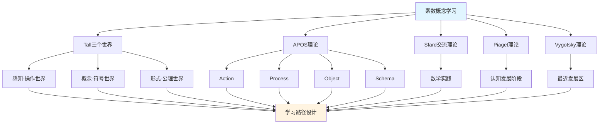

# 素数概念的多理论分析示例 / Multi-Theory Analysis Example: Prime Number Concept

**主题编号 / Topic ID**: C.CORE.026.MULTI
**创建日期 / Created**: 2025年1月 / January 2025
**最后更新 / Last Updated**: 2025年1月 / January 2025
**关联概念 / Related Concepts**: [素数 / Prime Number](./01-素数.md) | [素数-三视角版 / Prime Number-Three Perspectives](./01-素数-三视角版.md)

---

## 📋 概述 / Overview

本文档为"素数"概念提供多理论分析示例，展示如何运用国际主流数学认知理论来分析数论核心概念。

This document provides a multi-theory analysis example for the "Prime Number" concept, demonstrating how to apply international mainstream mathematical cognitive theories to analyze core concepts in number theory.

**分析目标 / Analysis Objectives**：

- 展示素数概念的多理论分析方法 / Demonstrate multi-theory analysis methods for prime number concepts
- 为其他数论概念提供分析参考 / Provide analysis reference for other number theory concepts
- 建立理论整合的应用示例 / Establish application examples of theoretical integration
- 强调素数与整数、因数分解、密码学的关系 / Emphasize the relationship between prime numbers, integers, factorization, and cryptography

---

## 📑 目录 / Table of Contents

- [素数概念的多理论分析示例 / Multi-Theory Analysis Example: Prime Number Concept](#素数概念的多理论分析示例--multi-theory-analysis-example-prime-number-concept)
  - [📋 概述 / Overview](#-概述--overview)
  - [📑 目录 / Table of Contents](#-目录--table-of-contents)
  - [🎯 一、Tall三个世界理论分析 / Tall's Three Worlds Theory Analysis (编号: C.CORE.026.MULTI.01)](#-一tall三个世界理论分析--talls-three-worlds-theory-analysis-编号-ccore026multi01)
    - [1.1 感知-操作世界（Embodied World）](#11-感知-操作世界embodied-world)
    - [1.2 概念-符号世界（Symbolic World）](#12-概念-符号世界symbolic-world)
    - [1.3 形式-公理世界（Formal World）](#13-形式-公理世界formal-world)
    - [1.4 三个世界的转换 / Transitions Between Worlds](#14-三个世界的转换--transitions-between-worlds)
  - [🔬 二、Dubinsky APOS理论分析 (编号: C.CORE.026.MULTI.02)](#-二dubinsky-apos理论分析-编号-ccore026multi02)
    - [2.1 Action（动作）](#21-action动作)
    - [2.2 Process（过程）](#22-process过程)
    - [2.3 Object（对象）](#23-object对象)
    - [2.4 Schema（图式）](#24-schema图式)
    - [2.5 APOS发展路径 / APOS Development Path](#25-apos发展路径--apos-development-path)
  - [💬 三、Sfard交流理论分析 / Sfard's Commognitive Theory Analysis (编号: C.CORE.026.MULTI.03)](#-三sfard交流理论分析--sfards-commognitive-theory-analysis-编号-ccore026multi03)
    - [3.1 素数作为交流工具 / Prime Number as a Communication Tool](#31-素数作为交流工具--prime-number-as-a-communication-tool)
    - [3.2 素数学习的实践参与 / Practice Participation in Prime Number Learning](#32-素数学习的实践参与--practice-participation-in-prime-number-learning)
  - [🧠 四、Piaget认知发展理论分析 / Piaget's Cognitive Development Theory Analysis (编号: C.CORE.026.MULTI.04)](#-四piaget认知发展理论分析--piagets-cognitive-development-theory-analysis-编号-ccore026multi04)
    - [4.1 具体运算阶段（7-12岁）/ Concrete Operational Stage (7-12 years)](#41-具体运算阶段7-12岁-concrete-operational-stage-7-12-years)
    - [4.2 形式运算阶段（12+岁）/ Formal Operational Stage (12+ years)](#42-形式运算阶段12岁-formal-operational-stage-12-years)
  - [🌍 五、Vygotsky社会文化理论分析 / Vygotsky's Sociocultural Theory Analysis (编号: C.CORE.026.MULTI.05)](#-五vygotsky社会文化理论分析--vygotskys-sociocultural-theory-analysis-编号-ccore026multi05)
    - [5.1 最近发展区（ZPD）/ Zone of Proximal Development (ZPD)](#51-最近发展区zpd-zone-of-proximal-development-zpd)
    - [5.2 社会文化工具 / Sociocultural Tools](#52-社会文化工具--sociocultural-tools)
  - [🔄 六、多理论整合分析 / Multi-Theory Integration Analysis (编号: C.CORE.026.MULTI.06)](#-六多理论整合分析--multi-theory-integration-analysis-编号-ccore026multi06)
    - [6.1 理论共同点 / Theoretical Commonalities](#61-理论共同点--theoretical-commonalities)
    - [6.2 理论互补性 / Theoretical Complementarity](#62-理论互补性--theoretical-complementarity)
    - [6.3 整合应用框架](#63-整合应用框架)
  - [📊 七、素数概念的多理论学习路径 / Multi-Theory Learning Path for Prime Number Concept (编号: C.CORE.026.MULTI.07)](#-七素数概念的多理论学习路径--multi-theory-learning-path-for-prime-number-concept-编号-ccore026multi07)
    - [7.1 入门阶段（Tall感知-操作世界 + APOS Action）/ Entry Stage (Tall Embodied World + APOS Action)](#71-入门阶段tall感知-操作世界--apos-action-entry-stage-tall-embodied-world--apos-action)
    - [7.2 中级阶段（Tall概念-符号世界 + APOS Process/Object）/ Intermediate Stage (Tall Symbolic World + APOS Process/Object)](#72-中级阶段tall概念-符号世界--apos-processobject-intermediate-stage-tall-symbolic-world--apos-processobject)
    - [7.3 高级阶段（Tall形式-公理世界 + APOS Schema + Sfard实践）/ Advanced Stage (Tall Formal World + APOS Schema + Sfard Practice)](#73-高级阶段tall形式-公理世界--apos-schema--sfard实践-advanced-stage-tall-formal-world--apos-schema--sfard-practice)
  - [🎓 八、教学建议 / Teaching Suggestions (编号: C.CORE.026.MULTI.08)](#-八教学建议--teaching-suggestions-编号-ccore026multi08)
    - [8.1 基于多理论的教学设计 / Multi-Theory Based Teaching Design](#81-基于多理论的教学设计--multi-theory-based-teaching-design)
    - [8.2 具体教学策略 / Specific Teaching Strategies](#82-具体教学策略--specific-teaching-strategies)
  - [🔗 九、关联文档 / Related Documents (编号: C.CORE.026.MULTI.09)](#-九关联文档--related-documents-编号-ccore026multi09)
    - [9.1 核心概念文档 / Core Concept Documents](#91-核心概念文档--core-concept-documents)
    - [9.2 理论框架文档 / Theoretical Framework Documents](#92-理论框架文档--theoretical-framework-documents)
  - [✅ 十、总结 / Summary (编号: C.CORE.026.MULTI.10)](#-十总结--summary-编号-ccore026multi10)
    - [10.1 多理论分析的价值 / Value of Multi-Theory Analysis](#101-多理论分析的价值--value-of-multi-theory-analysis)
    - [10.2 应用推广 / Application and Extension](#102-应用推广--application-and-extension)

---

## 🎯 一、Tall三个世界理论分析 / Tall's Three Worlds Theory Analysis (编号: C.CORE.026.MULTI.01)

### 1.1 感知-操作世界（Embodied World）

**素数在感知-操作世界中的理解 / Understanding Prime Numbers in the Embodied World**：

- **具体经验 / Concrete Experience**：
  - 通过"分解"的日常经验理解素数：一个数能否分解为更小的数的乘积？ / Understanding prime numbers through daily experience of "factorization": can a number be decomposed into a product of smaller numbers?
  - 例如：6 = 2×3（可分解）、7（不可分解） / Examples: 6 = 2×3 (decomposable), 7 (indecomposable)
  - 通过"因数"理解素数：素数只有1和自身两个因数 / Understanding prime numbers through "factors": prime numbers have only 1 and themselves as factors
  - 例如：2的因数是1和2、4的因数是1、2、4 / Examples: factors of 2 are 1 and 2, factors of 4 are 1, 2, 4

- **身体动作 / Bodily Actions**：
  - 通过"分解"的动作理解素数 / Understanding prime numbers through the action of "factorization"
  - 通过"数因数"理解素数 / Understanding prime numbers through "counting factors"
  - 通过操作数字理解素数的性质 / Understanding properties of prime numbers through manipulating numbers

- **直观理解 / Intuitive Understanding**：
  - 素数是"不可分解的数" / Prime numbers are "indecomposable numbers"
  - 素数是"只有两个因数的数" / Prime numbers are "numbers with only two factors"
  - 素数是数论的基础 / Prime numbers are the foundation of number theory

**教学建议 / Teaching Suggestions**：

- 使用具体例子（2, 3, 5, 7, 11等） / Use concrete examples (2, 3, 5, 7, 11, etc.)
- 通过分解活动理解素数 / Understand prime numbers through factorization activities
- 使用图形可视化素数的分布 / Use graphics to visualize the distribution of prime numbers

### 1.2 概念-符号世界（Symbolic World）

**素数在概念-符号世界的理解 / Understanding Prime Numbers in the Symbolic World**：

- **符号表示 / Symbolic Representation**：
  - 使用素数符号：$p$、$\mathbb{P}$、$\pi(x)$、$p_n$ / Using prime number notation: $p$, $\mathbb{P}$, $\pi(x)$, $p_n$
  - 使用整除符号：$p \mid n$、$p \nmid n$ / Using divisibility notation: $p \mid n$, $p \nmid n$
  - 使用因数分解符号：$n = p_1^{e_1} p_2^{e_2} \cdots p_k^{e_k}$ / Using prime factorization notation: $n = p_1^{e_1} p_2^{e_2} \cdots p_k^{e_k}$

- **概念理解 / Conceptual Understanding**：
  - 素数是只能被1和自身整除的正整数 / Prime numbers are positive integers divisible only by 1 and themselves
  - 素数满足：若 $p = ab$，则 $a = 1$ 或 $b = 1$ / Prime numbers satisfy: if $p = ab$, then $a = 1$ or $b = 1$
  - 素数是算术基本定理的基础 / Prime numbers are the foundation of the fundamental theorem of arithmetic

- **抽象操作 / Abstract Operations**：
  - 通过符号操作判断素数 / Determining prime numbers through symbolic operations
  - 通过逻辑推理证明素数性质 / Proving prime number properties through logical reasoning
  - 通过数论语言表达数学概念 / Expressing mathematical concepts through number-theoretic language

**教学建议 / Teaching Suggestions**：

- 逐步引入素数符号 / Gradually introduce prime number notation
- 通过符号操作练习素数判断 / Practice prime number determination through symbolic operations
- 使用数论语言表达数学概念 / Use number-theoretic language to express mathematical concepts

### 1.3 形式-公理世界（Formal World）

**素数在形式-公理世界的理解 / Understanding Prime Numbers in the Formal World**：

- **公理系统 / Axiomatic System**：
  - 素数的严格定义：$p > 1$ 且 $\forall a, b \in \mathbb{Z}^+, p = ab \Rightarrow (a = 1 \lor b = 1)$ / Strict definition of prime numbers: $p > 1$ and $\forall a, b \in \mathbb{Z}^+, p = ab \Rightarrow (a = 1 \lor b = 1)$
  - 算术基本定理：每个大于1的整数可以唯一分解为素数的乘积 / Fundamental theorem of arithmetic: every integer greater than 1 can be uniquely factored into a product of primes
  - 通过公理严格定义素数 / Strictly defining prime numbers through axioms

- **形式化定义 / Formal Definition**：
  - 素数的形式化定义：$\text{Prime}(p) \Leftrightarrow p > 1 \land \forall a, b \in \mathbb{Z}^+, p = ab \Rightarrow (a = 1 \lor b = 1)$ / Formal definition of prime numbers: $\text{Prime}(p) \Leftrightarrow p > 1 \land \forall a, b \in \mathbb{Z}^+, p = ab \Rightarrow (a = 1 \lor b = 1)$
  - 素数分布的形式化定义 / Formal definition of prime distribution
  - 素数性质的严格证明 / Strict proof of prime number properties

- **逻辑推理 / Logical Reasoning**：
  - 通过逻辑推理证明素数性质（如Euclid定理） / Proving prime number properties (such as Euclid's theorem) through logical reasoning
  - 通过形式化方法研究数论 / Studying number theory through formal methods
  - 通过公理系统建立数论基础 / Establishing number theory foundations through axiom systems

**教学建议 / Teaching Suggestions**：

- 介绍素数的严格定义 / Introduce strict definition of prime numbers
- 通过形式化证明理解素数性质 / Understand prime number properties through formal proofs
- 研究素数在数论中的作用 / Study the role of prime numbers in number theory

### 1.4 三个世界的转换 / Transitions Between Worlds

**转换路径 / Transition Paths**：

1. **从感知-操作到概念-符号 / From Embodied to Symbolic**：
   - 将具体不可分解数抽象为素数符号 / Abstracting concrete indecomposable numbers into prime number symbols
   - 从操作中提取素数概念 / Extracting prime number concepts from operations
   - 例如：从"不可分解的数"到"素数$p$" / Example: from "indecomposable number" to "prime number $p$"

2. **从概念-符号到形式-公理 / From Symbolic to Formal**：
   - 将素数概念形式化为素数定义 / Formalizing prime number concepts into prime definition
   - 从符号运算到逻辑推理 / From symbolic operations to logical reasoning
   - 例如：从"$p$"到"$\text{Prime}(p) \Leftrightarrow p > 1 \land \forall a, b, p = ab \Rightarrow (a = 1 \lor b = 1)$" / Example: from "$p$" to "$\text{Prime}(p) \Leftrightarrow p > 1 \land \forall a, b, p = ab \Rightarrow (a = 1 \lor b = 1)$"

**转换支持 / Transition Support**：

- **识别转换困难 / Identifying Transition Difficulties**：
  - 识别从具体数到抽象素数的困难 / Identifying difficulties in transitioning from concrete numbers to abstract prime numbers
  - 识别从符号运算到形式化定义的困难 / Identifying difficulties in transitioning from symbolic operations to formal definitions

- **设计转换活动 / Designing Transition Activities**：
  - 设计过渡活动支持转换 / Designing transition activities to support transitions
  - 提供渐进式支持 / Providing progressive support

- **评估转换效果 / Assessing Transition Effectiveness**：
  - 评估转换成功 / Assessing transition success
  - 提供反馈支持 / Providing feedback support

---

## 🔬 二、Dubinsky APOS理论分析 (编号: C.CORE.026.MULTI.02)

### 2.1 Action（动作）

**素数的Action阶段 / Action Stage of Prime Number**：

- **具体操作 / Concrete Operations**：
  - 判断素数：给定正整数，判断是否为素数 / Determining prime numbers: given a positive integer, determine if it is prime
  - 使用Eratosthenes筛法：找出一定范围内的所有素数 / Using Eratosthenes sieve: find all prime numbers within a certain range
  - 分解因数：给定正整数，分解为素数的乘积 / Factorizing: given a positive integer, factorize into a product of primes

- **操作特点 / Operation Characteristics**：
  - 需要外部指导（教师、教材） / Requires external guidance (teacher, textbook)
  - 操作是具体的、机械的 / Operations are concrete and mechanical
  - 需要逐步执行 / Requires step-by-step execution

- **学习活动 / Learning Activities**：
  - 练习判断素数 / Practice determining prime numbers
  - 练习使用筛法 / Practice using sieve methods
  - 练习因数分解 / Practice factorization

**教学建议 / Teaching Suggestions**：

- 提供大量练习机会 / Provide ample practice opportunities
- 给予及时反馈 / Give timely feedback
- 逐步增加操作复杂度 / Gradually increase operation complexity

### 2.2 Process（过程）

**素数的Process阶段 / Process Stage of Prime Number**：

- **内化过程 / Internalization Process**：
  - 将素数判断内化为心理过程 / Internalizing prime number determination as a mental process
  - 理解因数分解的内在逻辑 / Understanding the internal logic of factorization
  - 能够独立完成素数操作 / Being able to perform prime number operations independently

- **过程理解 / Process Understanding**：
  - 理解"素数"是"只能被1和自身整除的数" / Understanding that "prime numbers" are "numbers divisible only by 1 and themselves"
  - 理解"因数分解"是"将数分解为素数乘积的过程" / Understanding that "factorization" is "the process of decomposing numbers into products of primes"
  - 理解"算术基本定理"是"每个数可以唯一分解为素数的乘积" / Understanding that "fundamental theorem of arithmetic" is "every number can be uniquely factored into a product of primes"

- **灵活应用 / Flexible Application**：
  - 能够灵活应用素数概念 / Being able to flexibly apply prime number concepts
  - 能够处理复杂的数论问题 / Being able to handle complex number theory problems
  - 能够理解素数的各种性质 / Being able to understand various properties of prime numbers

**教学建议 / Teaching Suggestions**：

- 引导学生内化操作过程 / Guide students to internalize operation processes
- 通过变式练习加深理解 / Deepen understanding through variant exercises
- 鼓励学生独立思考和解决问题 / Encourage students to think independently and solve problems

### 2.3 Object（对象）

**素数的Object阶段 / Object Stage of Prime Number**：

- **对象化理解 / Objectification Understanding**：
  - 将素数视为独立的对象 / Viewing prime numbers as independent objects
  - 理解素数作为数学对象的结构 / Understanding the structure of prime numbers as mathematical objects
  - 能够对素数进行运算和操作 / Being able to perform operations on prime numbers

- **对象操作 / Object Operations**：
  - 能够比较不同的素数 / Being able to compare different prime numbers
  - 能够研究素数的分布 / Being able to study the distribution of prime numbers
  - 能够研究素数的性质 / Being able to study properties of prime numbers

- **概念整合 / Conceptual Integration**：
  - 理解素数与整数、因数分解、密码学的关系 / Understanding the relationship between prime numbers, integers, factorization, and cryptography
  - 理解素数在数论中的作用 / Understanding the role of prime numbers in number theory
  - 理解素数在数学中的作用 / Understanding the role of prime numbers in mathematics

**教学建议 / Teaching Suggestions**：

- 引导学生将素数对象化 / Guide students to objectify prime numbers
- 通过对象操作加深理解 / Deepen understanding through object operations
- 整合素数与其他概念 / Integrate prime numbers with other concepts

### 2.4 Schema（图式）

**素数的Schema阶段 / Schema Stage of Prime Number**：

- **图式构建 / Schema Construction**：
  - 构建完整的素数图式 / Constructing a complete prime number schema
  - 整合素数的各种理解 / Integrating various understandings of prime numbers
  - 建立素数与其他概念的联系 / Establishing connections between prime numbers and other concepts

- **图式应用 / Schema Application**：
  - 能够灵活应用素数图式 / Being able to flexibly apply prime number schemas
  - 能够解决复杂的数论问题 / Being able to solve complex number theory problems
  - 能够研究数论理论 / Being able to study number theory

- **图式发展 / Schema Development**：
  - 不断发展素数图式 / Continuously developing prime number schemas
  - 探索素数的新应用（密码学、编码理论） / Exploring new applications of prime numbers (cryptography, coding theory)
  - 研究数论理论的发展 / Studying the development of number theory

**教学建议 / Teaching Suggestions**：

- 帮助学生构建素数图式 / Help students construct prime number schemas
- 通过应用发展图式 / Develop schemas through application
- 鼓励学生探索数论理论 / Encourage students to explore number theory

### 2.5 APOS发展路径 / APOS Development Path

**发展过程 / Development Process**：

1. **Action → Process / 动作到过程**：
   - 将外部素数判断操作内化为心理过程 / Internalizing external prime number determination operations as mental processes
   - 从需要指导到独立完成 / From needing guidance to independent completion
   - 例如：从"判断$p$是否为素数"到"理解素数判断过程" / Example: from "determining whether $p$ is prime" to "understanding the prime determination process"

2. **Process → Object / 过程到对象**：
   - 将素数判断过程对象化 / Objectifying prime number determination processes
   - 从过程理解到对象理解 / From process understanding to object understanding
   - 例如：从"理解素数判断过程"到"将素数视为对象" / Example: from "understanding the prime determination process" to "treating prime numbers as objects"

3. **Object → Schema / 对象到图式**：
   - 整合素数的所有方面形成完整图式 / Integrating all aspects of prime numbers to form a complete schema
   - 从对象理解到系统理解 / From object understanding to systematic understanding
   - 例如：从"理解素数对象"到"形成数论图式" / Example: from "understanding prime number objects" to "forming a number theory schema"

**发展支持 / Development Support**：

- **识别发展困难 / Identifying Development Difficulties**：
  - 识别内化困难 / Identifying internalization difficulties
  - 识别对象化困难 / Identifying objectification difficulties
  - 识别图式化困难 / Identifying schematization difficulties

- **设计发展活动 / Designing Development Activities**：
  - 设计支持内化的活动 / Designing activities to support internalization
  - 设计支持对象化的活动 / Designing activities to support objectification
  - 设计支持图式化的活动 / Designing activities to support schematization

- **评估发展效果 / Assessing Development Effectiveness**：
  - 评估各阶段发展 / Assessing development at each stage
  - 提供反馈支持 / Providing feedback support

---

## 💬 三、Sfard交流理论分析 / Sfard's Commognitive Theory Analysis (编号: C.CORE.026.MULTI.03)

### 3.1 素数作为交流工具 / Prime Number as a Communication Tool

**素数的交流功能 / Communicative Function of Prime Numbers**：

- **数学交流 / Mathematical Communication**：
  - 素数用于表达"不可分解的数"：$p$ / Prime numbers are used to express "indecomposable numbers": $p$
  - 素数用于描述"因数分解"：$n = p_1^{e_1} p_2^{e_2} \cdots p_k^{e_k}$ / Prime numbers are used to describe "prime factorization": $n = p_1^{e_1} p_2^{e_2} \cdots p_k^{e_k}$
  - 素数用于表达数学关系：算术基本定理、RSA加密 / Prime numbers are used to express mathematical relationships: fundamental theorem of arithmetic, RSA encryption

- **概念表达 / Conceptual Expression**：
  - 通过素数表达"不可分解性"的概念 / Expressing the concept of "indecomposability" through prime numbers
  - 通过素数符号表达"因数分解"的概念 / Expressing the concept of "factorization" through prime number notation
  - 通过素数表达"数论基础"的概念 / Expressing the concept of "foundation of number theory" through prime numbers

- **问题解决 / Problem Solving**：
  - 使用素数语言表达问题 / Using prime number language to express problems
  - 使用素数方法解决问题（密码学、编码理论） / Using prime number methods to solve problems (cryptography, coding theory)
  - 使用数论方法证明定理 / Using number theory methods to prove theorems

### 3.2 素数学习的实践参与 / Practice Participation in Prime Number Learning

**通过参与数学实践学习素数 / Learning Prime Numbers through Participation in Mathematical Practice**：

- **实践场景 / Practice Scenarios**：
  - 通过数论问题学习素数 / Learning prime numbers through number theory problems
  - 通过因数分解活动学习素数 / Learning prime numbers through factorization activities
  - 通过密码学应用学习素数 / Learning prime numbers through cryptography applications
  - 通过数论研究学习素数理论 / Learning prime number theory through number theory research

- **实践方式 / Practice Methods**：
  - 参与数学讨论，使用素数语言 / Participating in mathematical discussions, using prime number language
  - 解决数学问题，应用素数方法 / Solving mathematical problems, applying prime number methods
  - 研究数学理论，理解素数作用 / Studying mathematical theory, understanding the role of prime numbers

- **学习效果 / Learning Outcomes**：
  - 通过实践理解素数概念 / Understanding prime number concepts through practice
  - 通过应用掌握素数方法 / Mastering prime number methods through application
  - 通过参与形成数学思维 / Forming mathematical thinking through participation

**教学建议 / Teaching Suggestions**：

- 设计数学实践活动 / Design mathematical practice activities
- 鼓励学生参与数学讨论 / Encourage students to participate in mathematical discussions
- 提供实际问题解决机会 / Provide opportunities for solving real-world problems

---

## 🧠 四、Piaget认知发展理论分析 / Piaget's Cognitive Development Theory Analysis (编号: C.CORE.026.MULTI.04)

### 4.1 具体运算阶段（7-12岁）/ Concrete Operational Stage (7-12 years)

**素数在具体运算阶段的理解 / Understanding Prime Numbers in the Concrete Operational Stage**：

- **具体对象 / Concrete Objects**：
  - 通过具体素数理解素数 / Understanding prime numbers through concrete prime numbers
  - 例如：2, 3, 5, 7, 11, 13 / Examples: 2, 3, 5, 7, 11, 13
  - 需要具体例子支持理解 / Requires concrete examples to support understanding

- **逻辑思维 / Logical Thinking**：
  - 能够理解素数的基本概念 / Being able to understand basic prime number concepts
  - 能够进行简单的素数判断 / Being able to perform simple prime number determination
  - 但需要具体对象支持 / But requires concrete object support

- **教学建议 / Teaching Suggestions**：
  - 使用具体素数和图形 / Use concrete prime numbers and graphics
  - 通过游戏和活动学习 / Learn through games and activities
  - 逐步引入抽象概念 / Gradually introduce abstract concepts

### 4.2 形式运算阶段（12+岁）/ Formal Operational Stage (12+ years)

**素数在形式运算阶段的理解 / Understanding Prime Numbers in the Formal Operational Stage**：

- **抽象思维 / Abstract Thinking**：
  - 能够理解抽象的素数概念 / Being able to understand abstract prime number concepts
  - 能够进行符号操作 / Being able to perform symbolic operations
  - 能够进行逻辑推理 / Being able to perform logical reasoning

- **形式推理 / Formal Reasoning**：
  - 能够证明素数性质（如Euclid定理） / Being able to prove prime number properties (such as Euclid's theorem)
  - 能够理解素数定义 / Being able to understand prime number definition
  - 能够研究数论理论 / Being able to study number theory

- **教学建议 / Teaching Suggestions**：
  - 引入抽象概念和符号 / Introduce abstract concepts and symbols
  - 进行逻辑推理训练 / Conduct logical reasoning training
  - 研究数论理论 / Study number theory

---

## 🌍 五、Vygotsky社会文化理论分析 / Vygotsky's Sociocultural Theory Analysis (编号: C.CORE.026.MULTI.05)

### 5.1 最近发展区（ZPD）/ Zone of Proximal Development (ZPD)

**素数学习的最近发展区 / Zone of Proximal Development in Prime Number Learning**：

- **独立能力 / Independent Ability**：
  - 能够理解素数的基本概念 / Being able to understand basic prime number concepts
  - 能够进行简单的素数判断 / Being able to perform simple prime number determination
  - 能够理解素数的基本性质 / Being able to understand basic prime number properties

- **潜在能力 / Potential Ability**：
  - 能够理解素数定义 / Being able to understand prime number definition
  - 能够证明素数性质（如Euclid定理） / Being able to prove prime number properties (such as Euclid's theorem)
  - 能够研究数论理论 / Being able to study number theory

### 5.2 社会文化工具 / Sociocultural Tools

**素数作为社会文化工具 / Prime Numbers as Sociocultural Tools**：

- **数学工具 / Mathematical Tools**：
  - 素数是数学研究的重要工具 / Prime numbers are important tools for mathematical research
  - 素数用于解决实际问题（密码学、编码理论） / Prime numbers are used to solve real-world problems (cryptography, coding theory)
  - 素数用于研究数学理论 / Prime numbers are used to study mathematical theory

- **文化意义 / Cultural Significance**：
  - 素数是数学文化的重要组成部分 / Prime numbers are an important part of mathematical culture
  - 素数反映了数学思维的发展 / Prime numbers reflect the development of mathematical thinking
  - 素数体现了数学的美感 / Prime numbers embody the beauty of mathematics

**教学建议 / Teaching Suggestions**：

- 提供适当的学习支持 / Provide appropriate learning support
- 设计最近发展区的学习活动 / Design learning activities in the zone of proximal development
- 鼓励学生参与数学实践和交流 / Encourage students to participate in mathematical practice and communication

---

## 🔄 六、多理论整合分析 / Multi-Theory Integration Analysis (编号: C.CORE.026.MULTI.06)

### 6.1 理论共同点 / Theoretical Commonalities

**各理论在素数概念分析中的共同点 / Commonalities of Theories in Prime Number Concept Analysis**：

1. **多层次理解 / Multi-Level Understanding**：
   - 都强调从具体到抽象的发展 / All emphasize development from concrete to abstract
   - Tall的三个世界、APOS的四个阶段、Piaget的发展阶段都体现这一点 / Tall's three worlds, APOS's four stages, and Piaget's developmental stages all reflect this

2. **实践重要性 / Importance of Practice**：
   - 都强调实践在学习中的作用 / All emphasize the role of practice in learning
   - Sfard的交流理论、Vygotsky的社会文化理论都强调这一点 / Sfard's communication theory and Vygotsky's sociocultural theory both emphasize this

3. **认知发展 / Cognitive Development**：
   - 都关注认知发展的过程 / All focus on the process of cognitive development
   - 各理论都描述了从简单到复杂的发展 / Each theory describes development from simple to complex

### 6.2 理论互补性 / Theoretical Complementarity

**各理论在素数概念分析中的互补性 / Complementarity of Theories in Prime Number Concept Analysis**：

1. **Tall三个世界 / Tall's Three Worlds**：
   - 适用于理解素数概念的不同层次 / Applicable to understanding different levels of prime number concepts
   - 从感知操作到形式公理的发展 / Development from embodied operations to formal axioms

2. **APOS理论 / APOS Theory**：
   - 适用于分析素数概念的学习过程 / Applicable to analyzing the learning process of prime number concepts
   - 从动作到图式的发展 / Development from action to schema

3. **Sfard交流理论 / Sfard's Communication Theory**：
   - 适用于设计素数概念的实践活动 / Applicable to designing practice activities for prime number concepts
   - 通过数学实践学习素数 / Learning prime numbers through mathematical practice

4. **Piaget理论 / Piaget's Theory**：
   - 适用于理解素数概念的认知发展阶段 / Applicable to understanding cognitive development stages of set concepts
   - 从具体运算到形式运算的发展 / Development from concrete operations to formal operations

5. **Vygotsky理论 / Vygotsky's Theory**：
   - 适用于设计素数概念的学习支持 / Applicable to designing learning support for set concepts
   - 通过最近发展区促进学习 / Promoting learning through the zone of proximal development

### 6.3 整合应用框架

**多理论整合应用**：

---

## 📊 七、素数概念的多理论学习路径 / Multi-Theory Learning Path for Prime Number Concept (编号: C.CORE.026.MULTI.07)

### 7.1 入门阶段（Tall感知-操作世界 + APOS Action）/ Entry Stage (Tall Embodied World + APOS Action)

**学习目标 / Learning Objectives**：

- 通过具体素数理解素数概念 / Understanding prime number concepts through concrete prime numbers
- 掌握基本素数操作 / Mastering basic prime number operations

**学习活动 / Learning Activities**：

- 使用具体例子（2, 3, 5, 7, 11等）进行素数操作 / Using concrete examples (2, 3, 5, 7, 11, etc.) for prime number operations
- 练习判断素数 / Practicing determining prime numbers
- 练习使用Eratosthenes筛法 / Practicing using Eratosthenes sieve
- 练习基本因数分解 / Practicing basic factorization

**评估标准 / Assessment Criteria**：

- 能够独立完成基本素数操作 / Being able to independently complete basic prime number operations
- 能够理解素数的基本概念 / Being able to understand basic prime number concepts

### 7.2 中级阶段（Tall概念-符号世界 + APOS Process/Object）/ Intermediate Stage (Tall Symbolic World + APOS Process/Object)

**学习目标 / Learning Objectives**：

- 理解素数的符号表示 / Understanding symbolic representation of prime numbers
- 掌握因数分解的内在逻辑 / Mastering the internal logic of factorization
- 将素数视为对象 / Viewing prime numbers as objects

**学习活动 / Learning Activities**：

- 学习素数符号和因数分解符号 / Learning prime number notation and factorization notation
- 通过符号操作进行因数分解 / Performing factorization through symbolic operations
- 理解素数的性质 / Understanding properties of prime numbers
- 研究素数的分布 / Studying the distribution of prime numbers

**评估标准 / Assessment Criteria**：

- 能够灵活应用素数符号 / Being able to flexibly apply prime number notation
- 能够理解因数分解的内在逻辑 / Being able to understand the internal logic of factorization
- 能够将素数视为对象进行操作 / Being able to operate on prime numbers as objects

### 7.3 高级阶段（Tall形式-公理世界 + APOS Schema + Sfard实践）/ Advanced Stage (Tall Formal World + APOS Schema + Sfard Practice)

**学习目标 / Learning Objectives**：

- 理解素数的严格定义 / Understanding strict definition of prime numbers
- 形成完整的素数概念图式 / Forming a complete prime number concept schema
- 通过数学实践应用素数 / Applying prime numbers through mathematical practice

**学习活动 / Learning Activities**：

- 学习素数的严格定义 / Learning strict definition of prime numbers
- 通过形式化证明理解素数性质（如Euclid定理） / Understanding prime number properties (such as Euclid's theorem) through formal proofs
- 研究素数在数论中的作用 / Studying the role of prime numbers in number theory
- 参与数学实践，应用素数方法（密码学、编码理论） / Participating in mathematical practice, applying prime number methods (cryptography, coding theory)

**评估标准 / Assessment Criteria**：

- 能够理解素数的严格定义 / Being able to understand strict definition of prime numbers
- 能够形成完整的素数概念图式 / Being able to form a complete prime number concept schema
- 能够通过数学实践应用素数 / Being able to apply prime numbers through mathematical practice

---

## 🎓 八、教学建议 / Teaching Suggestions (编号: C.CORE.026.MULTI.08)

### 8.1 基于多理论的教学设计 / Multi-Theory Based Teaching Design

**教学设计原则 / Teaching Design Principles**：

1. **多层次设计 / Multi-Level Design**：
   - 从感知操作到形式公理 / From embodied operations to formal axioms
   - 从动作到图式 / From action to schema
   - 从具体运算到形式运算 / From concrete operations to formal operations

2. **实践导向 / Practice-Oriented**：
   - 设计数学实践活动 / Design mathematical practice activities
   - 鼓励学生参与数学交流 / Encourage students to participate in mathematical communication
   - 提供实际问题解决机会 / Provide opportunities for solving real-world problems

3. **学习支持 / Learning Support**：
   - 提供适当的学习支持 / Provide appropriate learning support
   - 设计最近发展区的学习活动 / Design learning activities in the zone of proximal development
   - 给予及时反馈 / Give timely feedback

4. **情感因素考虑 / Affective Considerations**：
   - **减少数学焦虑 / Reducing Math Anxiety**：
     - 从具体例子（2, 3, 5, 7, 11等）开始，降低素数概念的抽象难度 / Start with concrete examples (2, 3, 5, 7, 11, etc.) to reduce the abstract difficulty of prime number concepts
     - 通过分解活动理解素数 / Understand prime numbers through factorization activities
     - 允许学生犯错，营造安全的学习环境 / Allow students to make mistakes and create a safe learning environment
     - 提供逐步支持，帮助学生建立信心 / Provide progressive support to help students build confidence

   - **激发学习动机 / Motivating Learning**：
     - 展示素数在现实中的应用（密码学、编码理论等） / Show applications of prime numbers in real life (cryptography, coding theory, etc.)
     - 设计有趣的素数问题（如Goldbach猜想） / Design interesting prime number problems (e.g., Goldbach conjecture)
     - 介绍素数的历史和数学家的故事（Euclid、Euler、Riemann） / Introduce the history of prime numbers and mathematician stories (Euclid, Euler, Riemann)
     - 展示素数的规律和美感 / Show the patterns and beauty of prime numbers

   - **培养数学兴趣 / Cultivating Math Interest**：
     - 展示素数的美感 / Show the beauty of prime numbers
     - 介绍Euclid、Euler、Riemann等数学家的故事 / Introduce stories of mathematicians like Euclid, Euler, and Riemann
     - 探索素数在数论中的基础地位 / Explore the foundational role of prime numbers in number theory

### 8.2 具体教学策略 / Specific Teaching Strategies

**入门阶段策略 / Entry Stage Strategies**：

- 使用具体物体和图形 / Use concrete objects and graphics
- 通过游戏和活动学习 / Learn through games and activities
- 提供大量练习机会 / Provide ample practice opportunities

**中级阶段策略 / Intermediate Stage Strategies**：

- 逐步引入抽象概念和符号 / Gradually introduce abstract concepts and symbols
- 通过变式练习加深理解 / Deepen understanding through variant exercises
- 鼓励学生独立思考和解决问题 / Encourage students to think independently and solve problems

**高级阶段策略 / Advanced Stage Strategies**：

- 引入严格定义和形式化方法 / Introduce strict definitions and formal methods
- 研究数论理论 / Study number theory
- 参与数学实践和研究（密码学、编码理论） / Participate in mathematical practice and research (cryptography, coding theory)

---

## 🔗 九、关联文档 / Related Documents (编号: C.CORE.026.MULTI.09)

### 9.1 核心概念文档 / Core Concept Documents

- [素数](./26-素数.md) / [Prime Number](./26-素数.md)
- [素数-三视角版](./26-素数-三视角版.md) / [Prime Number-Three Perspectives Version](./26-素数-三视角版.md)
- [整数-多理论分析示例](./04-整数-多理论分析示例-2025年1月.md) - 整数多理论分析示例 / [Integer-Multi-Theory Analysis Example](./04-整数-多理论分析示例-2025年1月.md) - Multi-theory analysis example for integer

### 9.2 理论框架文档 / Theoretical Framework Documents

- [国际主流数学认知理论整合框架](../00-国际主流数学认知理论整合框架-2025年1月.md) / [International Mainstream Mathematical Cognitive Theories Integration Framework](../00-国际主流数学认知理论整合框架-2025年1月.md)
- [概念体系深度改进计划](../00-概念体系深度改进计划-2025年1月.md) / [Concept System Deep Improvement Plan](../00-概念体系深度改进计划-2025年1月.md)

---

## ✅ 十、总结 / Summary (编号: C.CORE.026.MULTI.10)

### 10.1 多理论分析的价值 / Value of Multi-Theory Analysis

**多理论分析的优势 / Advantages of Multi-Theory Analysis**：

1. **全面理解 / Comprehensive Understanding**：
   - 从多个角度理解素数概念 / Understanding prime number concepts from multiple perspectives
   - 理解素数概念的不同层次 / Understanding different levels of prime number concepts
   - 理解素数概念的学习过程 / Understanding the learning process of prime number concepts

2. **教学设计 / Teaching Design**：
   - 基于多理论设计教学 / Designing teaching based on multiple theories
   - 提供多层次学习支持 / Providing multi-level learning support
   - 设计实践活动 / Designing practice activities

3. **学习路径 / Learning Path**：
   - 设计基于多理论的学习路径 / Designing learning paths based on multiple theories
   - 支持不同认知发展阶段的学习 / Supporting learning at different cognitive development stages
   - 促进概念理解的发展 / Promoting the development of conceptual understanding

### 10.2 应用推广 / Application and Extension

**为其他32个核心概念建立多理论分析 / Establishing Multi-Theory Analysis for Other 32 Core Concepts**：

- 使用本文档作为模板 / Using this document as a template
- 为每个概念建立多理论分析 / Establishing multi-theory analysis for each concept
- 建立33个核心概念的多理论分析体系 / Establishing a multi-theory analysis system for 33 core concepts

---

**创建日期**: 2025年1月
**最后更新**: 2025年1月
**维护状态**: 持续更新中
**状态**: ✅ 示例完成
