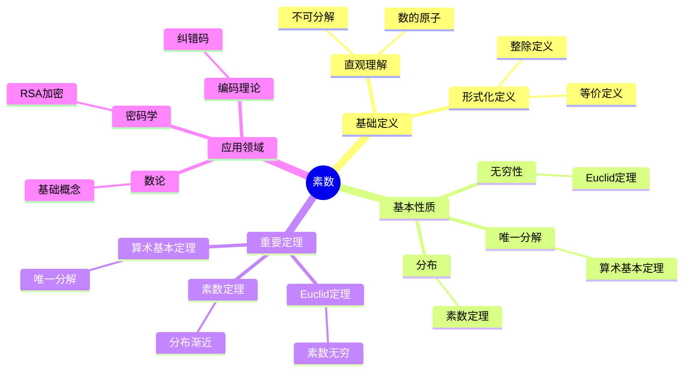

# 素数 (Prime Number)

**概念编号**: C.CORE.026
**知识层次**: L0-L2
**知识领域**: D6 (数论)
**创建日期**: 2025年11月21日
**最后更新**: 2025年11月21日

---

## 📋 概述

素数是只能被1和自身整除的正整数，是数论的基础。素数理论在密码学、编码理论、算法设计等领域有重要应用。

**权威资源对齐**:

- Wikipedia: [Prime Number](https://en.wikipedia.org/wiki/Prime_number)
- Stanford课程: Math 154 (Number Theory)
- Princeton课程: MAT 320 (Number Theory)
- MIT课程: 18.781 (Theory of Numbers)
- Metamath: [Prime Number](http://us.metamath.org/mpeuni/df-prm.html)

---

## 🎯 严格定义

### 基础定义 (L0)

**直观理解**: 素数是只能被1和自身整除的正整数，是"不可分解"的数。

**基本定义**: 素数 $p$ 是大于1的正整数，满足：若 $p = ab$（$a, b$ 为正整数），则 $a = 1$ 或 $b = 1$。

**简单例子**:

- $2, 3, 5, 7, 11, 13, 17, 19, 23, 29, \ldots$
- $2$ 是唯一的偶素数
- $1$ 不是素数（约定）

### 形式化定义 (L1)

**素数**: 素数 $p$ 是满足以下条件的正整数：

1. $p > 1$
2. $\forall a, b \in \mathbb{Z}^+, p = ab \Rightarrow (a = 1 \lor b = 1)$

**等价定义**: 素数 $p$ 满足：若 $p \mid ab$，则 $p \mid a$ 或 $p \mid b$。

**合数**: 大于1的非素数为合数。

**记号**:

- $p$: 素数
- $\mathbb{P}$: 素数集合
- $\pi(x)$: 不超过 $x$ 的素数个数
- $p_n$: 第 $n$ 个素数

---

## 📚 历史背景

### 发展脉络

**古代**: 素数的早期研究

- **Euclid (约公元前300年)**: 证明素数有无穷多个
- **Eratosthenes (约公元前200年)**: 发明筛法

**17-18世纪**: 素数的深入研究

- **Fermat (1640)**: 研究Fermat小定理
- **Euler (1737)**: 研究素数分布
- **Gauss (1792)**: 提出素数定理猜想

**19-20世纪**: 素数理论的现代发展

- **Riemann (1859)**: 研究Riemann zeta函数
- **Hadamard, de la Vallée Poussin (1896)**: 证明素数定理
- **Zhang (2013)**: 证明有界间隔素数定理

### 关键人物

- **Euclid (约公元前300年)**: 证明素数有无穷多个
- **Carl Friedrich Gauss (1777-1855)**: 提出素数定理猜想
- **Bernhard Riemann (1826-1866)**: 研究Riemann zeta函数

---

## 🔍 性质与定理

### 基本性质 (L1)

**性质1: 素数的基本性质**:

- 每个大于1的整数有素因子分解
- 素数有无穷多个（Euclid定理）

**性质2: 素数的判定**:

- 试除法：检查 $\leq \sqrt{n}$ 的素数
- 概率算法：Miller-Rabin算法

**性质3: 素数的分布**:

- 素数定理：$\pi(x) \sim \frac{x}{\ln x}$
- 素数间隔：存在任意长的素数间隔

### 重要定理 (L2)

**定理1: Euclid定理**:

- **陈述**: 素数有无穷多个
- **证明思路**: 假设有限个素数 $p_1, \ldots, p_n$，考虑 $N = p_1 \cdots p_n + 1$，则 $N$ 有新的素因子

**定理2: 素数定理**:

- **陈述**: $\lim_{x \to \infty} \frac{\pi(x)}{x/\ln x} = 1$
- **应用**: 素数分布的渐近估计

**定理3: 算术基本定理**:

- **陈述**: 每个大于1的整数可以唯一分解为素数的乘积
- **应用**: 数论的基础

---

## 💡 应用实例

### 理论应用

- 数论（素数是数论的基础）
- 代数数论（素理想）
- 解析数论（素数分布）

### 实际应用

- 密码学（RSA加密）
- 编码理论（纠错码）
- 算法设计（素数生成）

---

## 🔗 关联概念

### 依赖关系

- 整数（素数在整数中定义）
- 整除（素数的定义需要整除）

### 推广关系

- 素数（整数中的素数）
- 素理想（环中的素数）
- 素元（一般整环中的素数）

---

## 📖 参考文献

- Wikipedia: [Prime Number](https://en.wikipedia.org/wiki/Prime_number)
- Hardy, G. H., & Wright, E. M. (2008). *An Introduction to the Theory of Numbers*. Oxford University Press.
- Apostol, T. M. (1976). *Introduction to Analytic Number Theory*. Springer.

---

## 🗺️ 思维导图 (编号: C.CORE.026.MIND)

### 素数概念思维导图

---

## 📊 知识多维关系矩阵 (编号: C.CORE.026.MATRIX)

### 素数的多维关系矩阵

| 维度 | 指标 | 素数 |
|------|------|------|
| **知识层次** | L0基础 | ⭐⭐⭐⭐⭐ |
| | L1中级 | ⭐⭐⭐⭐ |
| | L2高级 | ⭐⭐⭐ |
| | L3研究 | ⭐⭐⭐ |
| **知识领域** | D1基础数学 | ⭐⭐⭐⭐ |
| | D6数论 | ⭐⭐⭐⭐⭐ |
| | D7离散数学 | ⭐⭐⭐ |
| | D8交叉领域 | ⭐⭐ |
| **依赖关系** | 前置概念 | 整数、整除 |
| | 后续概念 | 同余、L函数 |
| **应用关系** | 理论应用 | ⭐⭐⭐⭐ |
| | 实际应用 | ⭐⭐⭐⭐⭐ |
| | 交叉应用 | ⭐⭐⭐ |
| **学习难度** | 直观理解 | ⭐ |
| | 形式化理解 | ⭐⭐ |
| | 深入应用 | ⭐⭐⭐ |

---

## 💭 形象化解释与论证 (编号: C.CORE.026.VISUAL)

### 形象化解释

**1. 素数的直观理解**

- **类比**: 素数就像"数的原子"或"不可分解的数"
- **例子**:
  - 原子：物质的基本单位，不能再分解
  - 素数：数的基本单位，不能再分解为更小的数的乘积
  - 例如：$12 = 2 \times 2 \times 3$，其中$2$和$3$是素数

**2. 唯一分解的直观理解**

- **类比**: 唯一分解就像"每个数有唯一的素因子分解"
- **解释**:
  - 每个大于1的整数可以唯一分解为素数的乘积
  - 这类似于化学中的分子式（如$H_2O$）
  - 例如：$60 = 2^2 \times 3 \times 5$（唯一）

**3. 素数分布的直观理解**

- **类比**: 素数分布就像"素数在整数中的分布"
- **解释**:
  - 素数越来越稀疏（随着数增大）
  - 素数定理：$\pi(x) \sim \frac{x}{\ln x}$
  - 但素数间隔可以是任意长

### 认知科学视角

**1. 数学教育家Dienes的观点**

- **多表征原则**: 通过具体例子、分解过程、分布图等多种方式理解素数
- **变化性原则**: 通过不同的素数例子理解素数的本质
- **教学启示**: 使用素数表、分解游戏、分布可视化等多种方法

**2. 数学认知学家Tall的观点**

- **过程-对象对偶**: 理解"素数判定过程"（如何判断）和"素数"（对象）
- **认知层次**: 从直观理解（"不可分解"）到形式化理解（整除定义）

---

## 👨‍🏫 专家观点与论证 (编号: C.CORE.026.EXPERT)

### 数学家的观点

**1. Euclid (约公元前300年) - 素数理论的奠基者**
> "素数有无穷多个，这是数论中最基本的定理。"
>
> **意义**: Euclid证明了素数有无穷多个，奠定了素数理论的基础。

**2. Carl Friedrich Gauss (1777-1855) - 素数定理的提出者**
> "素数定理描述了素数的分布，这是数论中最深刻的定理之一。"
>
> **意义**: Gauss提出了素数定理猜想，推动了解析数论的发展。

**3. Bernhard Riemann (1826-1866) - Riemann zeta函数的研究者**
> "Riemann zeta函数的零点分布决定了素数的分布，Riemann假设是数论的核心问题。"
>
> **意义**: Riemann建立了素数分布与zeta函数零点的联系，提出了Riemann假设。

### 数学教育家的观点

**1. Zoltan Dienes (1916-2014) - 数学教育家**
> "素数概念应该通过具体例子、分解过程、分布图等多种方式学习。"
>
> **教学启示**:
>
> - 从具体素数（如2, 3, 5, 7）开始
> - 使用分解游戏理解唯一分解
> - 通过分布图理解素数分布

**2. Hans Freudenthal (1905-1990) - 数学教育家**
> "素数概念的学习需要从'不可分解'发展到'唯一分解结构'。"
>
> **认知发展**:
>
> - **直观阶段**: 理解素数作为不可分解的数
> - **结构阶段**: 理解唯一分解定理

### 数学认知学家的观点

**1. David Tall - 数学认知学家**
> "素数概念的理解需要从'过程'（如何判定）发展到'对象'（素数本身）。"
>
> **认知层次**:
>
> - **过程层次**: 理解"如何判断素数"（如试除法）
> - **对象层次**: 理解"素数"（如$p$是一个素数）

---

**创建日期**: 2025年11月21日
**最后更新**: 2025年11月21日
**维护状态**: 持续更新中
