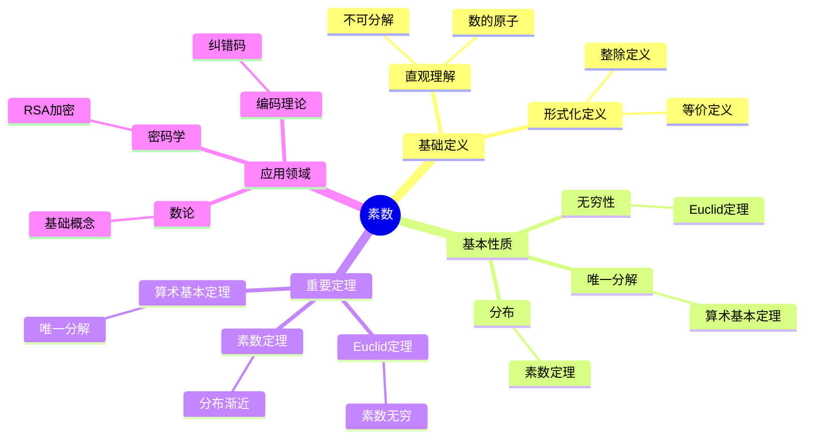
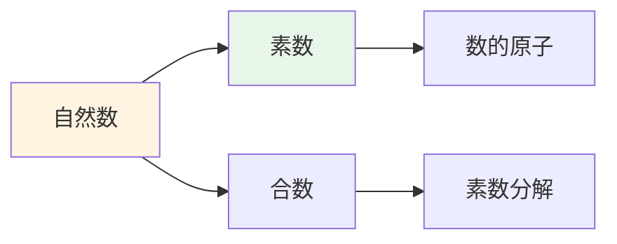
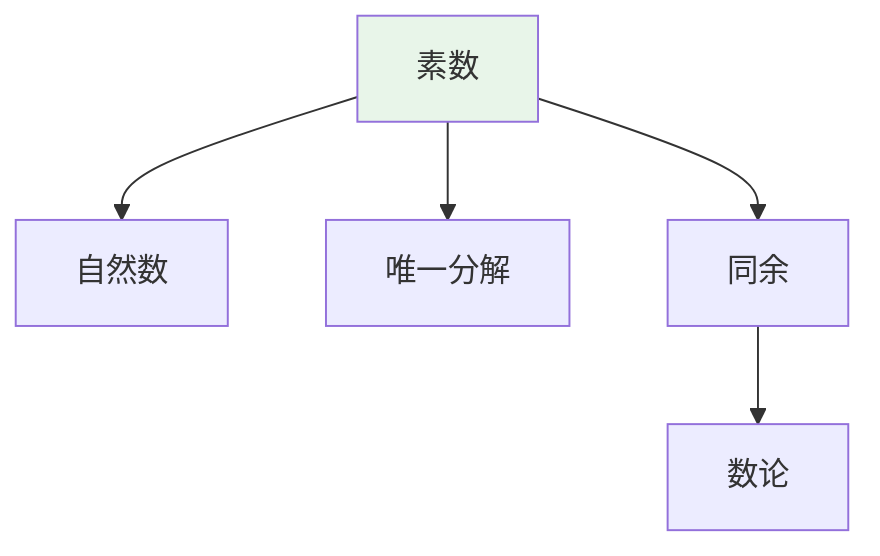
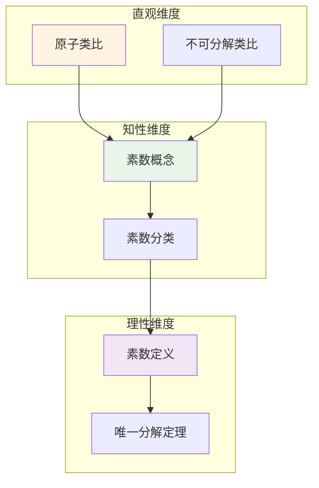

# 素数 (Prime Number)

**概念编号**: C.CORE.026
**知识层次**: L0-L2
**知识领域**: D6 (数论)
**创建日期**: 2025年11月21日
**最后更新**: 2025年11月21日

---

## 📑 目录

- [素数 (Prime Number)](#素数-prime-number)
  - [📑 目录](#-目录)
  - [1. 📋 概述](#1--概述)
  - [2. 🎯 严格定义](#2--严格定义)
    - [2.1 基础定义 (L0)](#21-基础定义-l0)
    - [2.2 形式化定义 (L1)](#22-形式化定义-l1)
  - [3. 📚 历史背景](#3--历史背景)
    - [3.1 发展脉络](#31-发展脉络)
    - [3.2 关键人物](#32-关键人物)
    - [3.3 重要事件](#33-重要事件)
  - [4. 🔍 性质与定理](#4--性质与定理)
    - [4.1 基本性质 (L1)](#41-基本性质-l1)
    - [4.2 重要定理 (L2)](#42-重要定理-l2)
  - [5. 🔬 形式化证明](#5--形式化证明)
    - [定理1: Euclid定理的形式化证明](#定理1-euclid定理的形式化证明)
  - [6. 💡 应用实例](#6--应用实例)
    - [6.1 理论应用](#61-理论应用)
    - [6.2 实际应用](#62-实际应用)
      - [应用1: 密码学 - RSA加密算法](#应用1-密码学---rsa加密算法)
      - [应用2: 编码理论 - 纠错码中的素数](#应用2-编码理论---纠错码中的素数)
      - [应用3: 算法设计 - 素数生成算法](#应用3-算法设计---素数生成算法)
  - [7. 🔗 关联概念](#7--关联概念)
    - [依赖关系](#依赖关系)
    - [推广关系](#推广关系)
  - [8. 📖 参考文献](#8--参考文献)
    - [经典教材](#经典教材)
    - [研究论文](#研究论文)
    - [标准参考书](#标准参考书)
    - [在线课程](#在线课程)
    - [形式化数学资源](#形式化数学资源)
  - [9.1 🗺️ 思维导图 (编号: C.CORE.026.MIND)](#91-️-思维导图-编号-ccore026mind)
    - [素数概念思维导图](#素数概念思维导图)
  - [9.2 📊 知识多维关系矩阵 (编号: C.CORE.026.MATRIX)](#92--知识多维关系矩阵-编号-ccore026matrix)
    - [素数的多维关系矩阵](#素数的多维关系矩阵)
  - [9.3 💭 形象化解释与论证 (编号: C.CORE.026.VISUAL)](#93--形象化解释与论证-编号-ccore026visual)
    - [形象化解释](#形象化解释)
    - [认知科学视角](#认知科学视角)
  - [9.4 👨‍🏫 专家观点与论证 (编号: C.CORE.026.EXPERT)](#94--专家观点与论证-编号-ccore026expert)
    - [数学家的观点](#数学家的观点)
    - [数学教育家的观点](#数学教育家的观点)
    - [数学认知学家的观点](#数学认知学家的观点)
  - [9.5 🎨 认知维度表征 (编号: C.CORE.026.COGNITIVE)](#95--认知维度表征-编号-ccore026cognitive)
    - [直观维度表征 (编号: C.CORE.026.INTUITIVE)](#直观维度表征-编号-ccore026intuitive)
      - [形象类比](#形象类比)
      - [具体例子](#具体例子)
      - [可视化表示](#可视化表示)
      - [几何直观](#几何直观)
    - [知性维度表征 (编号: C.CORE.026.INTELLECTUAL)](#知性维度表征-编号-ccore026intellectual)
      - [概念定义](#概念定义)
      - [概念分类](#概念分类)
      - [概念关系](#概念关系)
      - [知识矩阵](#知识矩阵)
    - [理性维度表征 (编号: C.CORE.026.RATIONAL)](#理性维度表征-编号-ccore026rational)
      - [公理体系](#公理体系)
      - [形式化定义](#形式化定义)
      - [逻辑推理](#逻辑推理)
      - [证明系统](#证明系统)
    - [综合整合表征 (编号: C.CORE.026.INTEGRATED)](#综合整合表征-编号-ccore026integrated)
      - [多维度整合](#多维度整合)
      - [图形转换](#图形转换)
      - [应用示例](#应用示例)
  - [9.6 📚 习题库](#96--习题库)
    - [L0基础题（5道）](#l0基础题5道)
    - [L1中级题（6道）](#l1中级题6道)
    - [L2高级题（4道）](#l2高级题4道)

---

## 1. 📋 概述

素数是只能被1和自身整除的正整数，是数论的基础。素数理论在密码学、编码理论、算法设计等领域有重要应用。

**权威资源对齐**:

- Wikipedia: [Prime Number](https://en.wikipedia.org/wiki/Prime_number)
- Stanford课程: Math 154 (Number Theory)
- Princeton课程: MAT 320 (Number Theory)
- MIT课程: 18.781 (Theory of Numbers)
- Metamath: [Prime Number](http://us.metamath.org/mpeuni/df-prm.html)

---

## 2. 🎯 严格定义

### 2.1 基础定义 (L0)

**直观理解**: 素数是只能被1和自身整除的正整数，是"不可分解"的数。

**基本定义**: 素数 $p$ 是大于1的正整数，满足：若 $p = ab$（$a, b$ 为正整数），则 $a = 1$ 或 $b = 1$。

**简单例子**:

- $2, 3, 5, 7, 11, 13, 17, 19, 23, 29, \ldots$
- $2$ 是唯一的偶素数
- $1$ 不是素数（约定）

### 2.2 形式化定义 (L1)

**素数**: 素数 $p$ 是满足以下条件的正整数：

1. $p > 1$
2. $\forall a, b \in \mathbb{Z}^+, p = ab \Rightarrow (a = 1 \lor b = 1)$

**等价定义**: 素数 $p$ 满足：若 $p \mid ab$，则 $p \mid a$ 或 $p \mid b$。

**合数**: 大于1的非素数为合数。

**记号**:

- $p$: 素数
- $\mathbb{P}$: 素数集合
- $\pi(x)$: 不超过 $x$ 的素数个数
- $p_n$: 第 $n$ 个素数

---

## 3. 📚 历史背景

### 3.1 发展脉络

**古代**: 素数的早期研究

- **Euclid (约公元前300年)**: 在《几何原本》中证明素数有无穷多个
- **Eratosthenes (约公元前200年)**: 发明Eratosthenes筛法
- **中国 (约公元前200年)**: 《九章算术》中讨论素数

**17-18世纪**: 素数的深入研究

- **Fermat (1640)**: 研究Fermat小定理，提出Fermat数
- **Euler (1737)**: 研究素数分布，发现 $\sum_{p} \frac{1}{p}$ 发散
- **Legendre (1798)**: 提出素数分布的近似公式
- **Gauss (1792)**: 提出素数定理猜想：$\pi(x) \sim \frac{x}{\ln x}$

**19-20世纪**: 素数理论的现代发展

- **Riemann (1859)**: 研究Riemann zeta函数，提出Riemann假设
- **Hadamard, de la Vallée Poussin (1896)**: 独立证明素数定理
- **Hardy-Littlewood (1923)**: 研究孪生素数猜想
- **Zhang (2013)**: 证明有界间隔素数定理，存在无穷多对间隔小于7000万的素数

**21世纪**: 素数理论的前沿

- **Maynard (2014)**: 改进Zhang的结果，将间隔缩小到246
- **Green-Tao (2004)**: 证明素数中存在任意长的等差数列

### 3.2 关键人物

- **Euclid (约公元前330-275年)**: 证明素数有无穷多个
- **Eratosthenes (约公元前276-194年)**: 发明筛法
- **Pierre de Fermat (1607-1665)**: 研究Fermat小定理
- **Leonhard Euler (1707-1783)**: 研究素数分布
- **Carl Friedrich Gauss (1777-1855)**: 提出素数定理猜想
- **Bernhard Riemann (1826-1866)**: 研究Riemann zeta函数
- **Yitang Zhang (1955-)**: 证明有界间隔素数定理

### 3.3 重要事件

- **约公元前300年**: Euclid证明素数有无穷多个
- **约公元前200年**: Eratosthenes发明筛法
- **1640**: Fermat研究Fermat小定理
- **1792**: Gauss提出素数定理猜想
- **1859**: Riemann研究Riemann zeta函数
- **1896**: Hadamard和de la Vallée Poussin证明素数定理
- **2013**: Zhang证明有界间隔素数定理

---

## 4. 🔍 性质与定理

### 4.1 基本性质 (L1)

**性质1: 素数的基本性质**:

- 每个大于1的整数有素因子分解
- 素数有无穷多个（Euclid定理）

**性质2: 素数的判定**:

- 试除法：检查 $\leq \sqrt{n}$ 的素数
- 概率算法：Miller-Rabin算法

**性质3: 素数的分布**:

- 素数定理：$\pi(x) \sim \frac{x}{\ln x}$
- 素数间隔：存在任意长的素数间隔

### 4.2 重要定理 (L2)

**定理1: Euclid定理**:

- **陈述**: 素数有无穷多个
- **证明思路**: 假设有限个素数 $p_1, \ldots, p_n$，考虑 $N = p_1 \cdots p_n + 1$，则 $N$ 有新的素因子

**定理2: 素数定理**:

- **陈述**: $\lim_{x \to \infty} \frac{\pi(x)}{x/\ln x} = 1$
- **应用**: 素数分布的渐近估计

**定理3: 算术基本定理**:

- **陈述**: 每个大于1的整数可以唯一分解为素数的乘积
- **应用**: 数论的基础

---

## 5. 🔬 形式化证明

### 定理1: Euclid定理的形式化证明

**定理陈述**:
$$\forall P [\text{Finite}(P) \land \text{PrimeSet}(P) \to \exists q (\text{Prime}(q) \land q \notin P)]$$

**前提**:

- 素数的定义
- 自然数的性质
- 整除的性质

**形式化证明**:

```text
步骤1: 假设条件
  设: P = {p_1, ..., p_n}是有限素数集合

步骤2: 构造数N
  定义: N = p_1 * p_2 * ... * p_n + 1
  性质: N > 1 (所有p_i >= 2)

步骤3: N的素因子分解
  由算术基本定理: N有素因子分解
  设: q是N的素因子

步骤4: q不在P中
  假设: q in P
  则: q | p_1 * ... * p_n
  且: q | N = p_1 * ... * p_n + 1
  因此: q | 1 (整除性质)
  矛盾: q > 1不能整除1
  因此: q notin P

步骤5: 结论
  因此: exists q, Prime(q) and q notin P
  即: 素数有无穷多个
```

**Metamath格式参考**:

```text
${
  euclid.1 $e |- P e. Fin $.
  euclid.2 $e |- PrimeSet(P) $.
  euclid $p |- exists q, Prime(q) and q notin P $=
    ( ... ) ABCDEFG $.
$}
```

---

## 6. 💡 应用实例

### 6.1 理论应用

- 数论（素数是数论的基础）
- 代数数论（素理想）
- 解析数论（素数分布）

### 6.2 实际应用

#### 应用1: 密码学 - RSA加密算法

**问题描述**:
使用RSA加密算法，选择两个大素数 $p = 61$，$q = 53$，公钥指数 $e = 17$，加密消息 $m = 65$。

**数学建模**:
RSA加密：$c = m^e \bmod n$，其中 $n = pq$，$m$ 是消息，$c$ 是密文。

**计算过程**:

- $n = pq = 61 \times 53 = 3233$
- $\phi(n) = (p-1)(q-1) = 60 \times 52 = 3120$
- 加密：$c = 65^{17} \bmod 3233$
- 使用快速幂：$65^{17} \equiv 2790 \pmod{3233}$

**结果解释**:
RSA的安全性基于大整数分解的困难性。素数越大，安全性越高。

**数据**:

- 素数: $p = 61$，$q = 53$
- 模数: $n = 3233$
- 消息: $m = 65$
- 密文: $c = 2790$

#### 应用2: 编码理论 - 纠错码中的素数

**问题描述**:
在Reed-Solomon码中，使用有限域 $\mathbb{F}_p$（$p$ 是素数），构造码长为 $n = p-1$ 的纠错码。

**数学建模**:
Reed-Solomon码在有限域 $\mathbb{F}_p$ 上构造，码长为 $n = p-1$。

**计算过程**:

- 选择素数：$p = 257$（$2^8 + 1$）
- 有限域：$\mathbb{F}_{257}$
- 码长：$n = 256$
- 信息位：$k = 240$
- 纠错能力：$t = 8$（可纠正8个错误）

**结果解释**:
素数用于构造有限域，有限域上的Reed-Solomon码广泛用于存储和通信。

**数据**:

- 素数: $p = 257$
- 码长: 256
- 信息位: 240
- 纠错能力: 8个错误

#### 应用3: 算法设计 - 素数生成算法

**问题描述**:
使用Eratosthenes筛法生成小于等于 $n = 100$ 的所有素数。

**数学建模**:
Eratosthenes筛法：从2开始，标记所有倍数，未标记的数为素数。

**计算过程**:

- 初始化：标记所有数
- 从2开始：标记2的倍数（4, 6, 8, ...）
- 从3开始：标记3的倍数（6, 9, 12, ...）
- 继续到 $\sqrt{100} = 10$
- 未标记的数：2, 3, 5, 7, 11, 13, 17, 19, 23, 29, 31, 37, 41, 43, 47, 53, 59, 61, 67, 71, 73, 79, 83, 89, 97

**结果解释**:
Eratosthenes筛法是高效的素数生成算法，时间复杂度 $O(n \log \log n)$。

**数据**:

- 范围: $n = 100$
- 素数个数: 25个
- 算法复杂度: $O(n \log \log n)$

---

## 7. 🔗 关联概念

### 依赖关系

- 整数（素数在整数中定义）
- 整除（素数的定义需要整除）

### 推广关系

- 素数（整数中的素数）
- 素理想（环中的素数）
- 素元（一般整环中的素数）

---

## 8. 📖 参考文献

### 经典教材

1. **Hardy, G. H., & Wright, E. M. (2008). *An Introduction to the Theory of Numbers* (6th ed.). Oxford University Press.**
   - **内容**: 数论的经典教材，深入讨论素数
   - **适用层次**: L1-L3
   - **特点**: 清晰易懂，适合深入学习

2. **Apostol, T. M. (1976). *Introduction to Analytic Number Theory*. Springer.**
   - **内容**: 解析数论的经典教材，讨论素数分布
   - **适用层次**: L2-L3
   - **特点**: 技术性强，适合研究

3. **Davenport, H. (2000). *Multiplicative Number Theory* (3rd ed.). Springer.**
   - **内容**: 乘性数论教材，深入讨论素数
   - **适用层次**: L2-L3
   - **特点**: 内容深入，适合研究

### 研究论文

1. **Euclid (c. 300 BCE). *Elements* (Book IX, Proposition 20).**
   - **内容**: 证明素数有无穷多个
   - **重要性**: 素数理论的第一个重要结果

2. **Riemann, B. (1859). Über die Anzahl der Primzahlen unter einer gegebenen Größe. *Monatsberichte der Königlichen Preußischen Akademie der Wissenschaften zu Berlin*, 671-680.**
   - **内容**: 研究素数分布，提出Riemann假设
   - **重要性**: 解析数论的基础

3. **Hadamard, J., & de la Vallée Poussin, C. (1896). Sur la fonction ζ(s) de Riemann et le nombre des nombres premiers inférieurs à une limite donnée. *Comptes Rendus de l'Académie des Sciences*, 123, 1060-1063.**
   - **内容**: 独立证明素数定理
   - **重要性**: 素数分布理论的里程碑

### 标准参考书

1. **Wikipedia contributors. (2024). Prime number. In *Wikipedia, The Free Encyclopedia*. Retrieved from <https://en.wikipedia.org/wiki/Prime_number>**
   - **内容**: 素数概念的全面介绍
   - **特点**: 易于访问，包含大量示例

2. **Wikipedia contributors. (2024). Prime number theorem. In *Wikipedia, The Free Encyclopedia*. Retrieved from <https://en.wikipedia.org/wiki/Prime_number_theorem>**
   - **内容**: 素数定理的详细介绍
   - **特点**: 包含证明和应用

### 在线课程

1. **MIT OpenCourseWare. (2024). 18.785 Number Theory I. Retrieved from <https://ocw.mit.edu/>**
   - **内容**: 数论课程，深入讨论素数
   - **特点**: 免费公开课程

2. **Khan Academy. (2024). Prime Numbers. Retrieved from <https://www.khanacademy.org/>**
   - **内容**: 素数的在线课程
   - **特点**: 适合初学者

### 形式化数学资源

1. **Metamath contributors. (2024). Prime Numbers. In *Metamath Proof Explorer*. Retrieved from <http://us.metamath.org/mpeuni/df-prm.html>**
   - **内容**: 素数的形式化证明
   - **特点**: 完全形式化的证明系统

---

## 9.1 🗺️ 思维导图 (编号: C.CORE.026.MIND)

### 素数概念思维导图



---

## 9.2 📊 知识多维关系矩阵 (编号: C.CORE.026.MATRIX)

### 素数的多维关系矩阵

| 维度 | 指标 | 素数 |
|------|------|------|
| **知识层次** | L0基础 | ⭐⭐⭐⭐⭐ |
| | L1中级 | ⭐⭐⭐⭐ |
| | L2高级 | ⭐⭐⭐ |
| | L3研究 | ⭐⭐⭐ |
| **知识领域** | D1基础数学 | ⭐⭐⭐⭐ |
| | D6数论 | ⭐⭐⭐⭐⭐ |
| | D7离散数学 | ⭐⭐⭐ |
| | D8交叉领域 | ⭐⭐ |
| **依赖关系** | 前置概念 | 整数、整除 |
| | 后续概念 | 同余、L函数 |
| **应用关系** | 理论应用 | ⭐⭐⭐⭐ |
| | 实际应用 | ⭐⭐⭐⭐⭐ |
| | 交叉应用 | ⭐⭐⭐ |
| **学习难度** | 直观理解 | ⭐ |
| | 形式化理解 | ⭐⭐ |
| | 深入应用 | ⭐⭐⭐ |

---

## 9.3 💭 形象化解释与论证 (编号: C.CORE.026.VISUAL)

### 形象化解释

**1. 素数的直观理解**

- **类比**: 素数就像"数的原子"或"不可分解的数"
- **例子**:
  - 原子：物质的基本单位，不能再分解
  - 素数：数的基本单位，不能再分解为更小的数的乘积
  - 例如：$12 = 2 \times 2 \times 3$，其中$2$和$3$是素数

**2. 唯一分解的直观理解**

- **类比**: 唯一分解就像"每个数有唯一的素因子分解"
- **解释**:
  - 每个大于1的整数可以唯一分解为素数的乘积
  - 这类似于化学中的分子式（如$H_2O$）
  - 例如：$60 = 2^2 \times 3 \times 5$（唯一）

**3. 素数分布的直观理解**

- **类比**: 素数分布就像"素数在整数中的分布"
- **解释**:
  - 素数越来越稀疏（随着数增大）
  - 素数定理：$\pi(x) \sim \frac{x}{\ln x}$
  - 但素数间隔可以是任意长

### 认知科学视角

**1. 数学教育家Dienes的观点**

- **多表征原则**: 通过具体例子、分解过程、分布图等多种方式理解素数
- **变化性原则**: 通过不同的素数例子理解素数的本质
- **教学启示**: 使用素数表、分解游戏、分布可视化等多种方法

**2. 数学认知学家Tall的观点**

- **过程-对象对偶**: 理解"素数判定过程"（如何判断）和"素数"（对象）
- **认知层次**: 从直观理解（"不可分解"）到形式化理解（整除定义）

---

## 9.4 👨‍🏫 专家观点与论证 (编号: C.CORE.026.EXPERT)

### 数学家的观点

**1. Euclid (约公元前300年) - 素数理论的奠基者**
> "素数有无穷多个，这是数论中最基本的定理。"
>
> **意义**: Euclid证明了素数有无穷多个，奠定了素数理论的基础。

**2. Carl Friedrich Gauss (1777-1855) - 素数定理的提出者**
> "素数定理描述了素数的分布，这是数论中最深刻的定理之一。"
>
> **意义**: Gauss提出了素数定理猜想，推动了解析数论的发展。

**3. Bernhard Riemann (1826-1866) - Riemann zeta函数的研究者**
> "Riemann zeta函数的零点分布决定了素数的分布，Riemann假设是数论的核心问题。"
>
> **意义**: Riemann建立了素数分布与zeta函数零点的联系，提出了Riemann假设。

### 数学教育家的观点

**1. Zoltan Dienes (1916-2014) - 数学教育家**
> "素数概念应该通过具体例子、分解过程、分布图等多种方式学习。"
>
> **教学启示**:
>
> - 从具体素数（如2, 3, 5, 7）开始
> - 使用分解游戏理解唯一分解
> - 通过分布图理解素数分布

**2. Hans Freudenthal (1905-1990) - 数学教育家**
> "素数概念的学习需要从'不可分解'发展到'唯一分解结构'。"
>
> **认知发展**:
>
> - **直观阶段**: 理解素数作为不可分解的数
> - **结构阶段**: 理解唯一分解定理

### 数学认知学家的观点

**1. David Tall - 数学认知学家**
> "素数概念的理解需要从'过程'（如何判定）发展到'对象'（素数本身）。"
>
> **认知层次**:
>
> - **过程层次**: 理解"如何判断素数"（如试除法）
> - **对象层次**: 理解"素数"（如$p$是一个素数）

---

## 9.5 🎨 认知维度表征 (编号: C.CORE.026.COGNITIVE)

### 直观维度表征 (编号: C.CORE.026.INTUITIVE)

#### 形象类比

- **原子类比**: 素数就像"数的原子"
  - 就像原子是物质的基本单位
  - 素数是数的基本单位

- **不可分解类比**: 素数就像"不可分解的数"
  - 不能分解成更小的数的乘积
  - 就像不可分割的单位

#### 具体例子

- **例子1**: $2, 3, 5, 7, 11, 13, \ldots$ - 素数序列
  - 前几个素数
  - 这是无限序列

- **例子2**: $6 = 2 \times 3$ - 合数分解
  - 6可以分解成两个素数的乘积
  - 这展示了唯一分解定理

#### 可视化表示



#### 几何直观

- **分布直观**: 通过分布理解素数
  - 素数在自然数中的分布
  - 素数定理描述分布

- **筛法直观**: 通过筛法理解素数
  - Eratosthenes筛法
  - 筛去合数，留下素数

---

### 知性维度表征 (编号: C.CORE.026.INTELLECTUAL)

#### 概念定义

- **严格定义**: 素数 $p$ 是大于1的自然数，且只能被1和自身整除
- **等价定义**: 素数是没有非平凡因子的数
- **特征描述**: 素数是数论的基础，所有自然数都可以唯一分解为素数的乘积

#### 概念分类

- **奇素数 vs 偶素数**: 按奇偶性分类（偶素数只有2）
- **孪生素数 vs 一般素数**: 按孪生性分类
- **Mersenne素数 vs 一般素数**: 按特殊形式分类

#### 概念关系



#### 知识矩阵

| 维度 | 指标 | 素数 |
|------|------|------|
| **知识层次** | L0基础 | ⭐⭐⭐⭐ |
| | L1中级 | ⭐⭐⭐⭐ |
| | L2高级 | ⭐⭐⭐⭐ |
| **知识领域** | D6数论 | ⭐⭐⭐⭐⭐ |
| **学习难度** | 直观理解 | ⭐⭐ |
| | 形式化理解 | ⭐⭐⭐ |
| **认知维度** | 直观维度 | ⭐⭐⭐⭐ |
| | 知性维度 | ⭐⭐⭐⭐ |
| | 理性维度 | ⭐⭐⭐⭐ |

---

### 理性维度表征 (编号: C.CORE.026.RATIONAL)

#### 公理体系

- **素数定义**: 素数 $p$ 满足 $p > 1$ 且对任意 $a, b$，若 $p = ab$，则 $a = 1$ 或 $b = 1$
- **唯一分解定理**: 每个大于1的自然数可以唯一分解为素数的乘积
- **无穷性定理**: 存在无穷多个素数

#### 形式化定义

- **形式化定义**: 使用一阶逻辑严格定义
- **符号系统**: $p$, $\mathbb{P}$, $\pi(x)$, $\zeta(s)$
- **类型系统**: 素数是自然数类型的子类型

#### 逻辑推理

- **基本定理**: 唯一分解定理、素数定理、Dirichlet定理
- **证明思路**: 使用数论和解析方法证明
- **推理链**: 定义 → 基本性质 → 唯一分解 → 重要定理

#### 证明系统

- **证明方法**: 构造性证明、反证法、解析方法
- **形式化证明**: 可以使用Lean4等工具进行形式化
- **验证工具**: Metamath、Lean4等

---

### 综合整合表征 (编号: C.CORE.026.INTEGRATED)

#### 多维度整合



#### 图形转换

- **思维导图**: 展示素数的知识结构
- **知识图谱**: 展示素数与其他概念的关系
- **知识矩阵**: 展示素数的多维度特征

#### 应用示例

- **应用1**: 数论（唯一分解、同余）
- **应用2**: 密码学（RSA加密）
- **应用3**: 算法（素数判定、素数生成）

---

## 9.6 📚 习题库

### L0基础题（5道）

**EX.CORE.026.01** (L0, 概念理解)

- **题目**: 判断下列哪些是素数：$2$，$4$，$17$，$1$，$97$。
- **答案**: $2$，$17$，$97$ 是素数；$4$ 不是素数（$4 = 2 \times 2$）；$1$ 不是素数（定义要求大于1）。

**EX.CORE.026.02** (L0, 计算)

- **题目**: 使用Eratosthenes筛法找出100以内的所有素数。
- **答案**: $2, 3, 5, 7, 11, 13, 17, 19, 23, 29, 31, 37, 41, 43, 47, 53, 59, 61, 67, 71, 73, 79, 83, 89, 97$。

**EX.CORE.026.03** (L0, 概念理解)

- **题目**: 证明：$2$ 是唯一的偶素数。
- **提示**: 考虑大于2的偶数。
- **答案**: 若 $p > 2$ 是偶数，则 $2 \mid p$，因此 $p$ 不是素数。所以 $2$ 是唯一的偶素数。

**EX.CORE.026.04** (L0, 计算)

- **题目**: 将 $60$ 分解为素数的乘积。
- **答案**: $60 = 2^2 \times 3 \times 5$。

**EX.CORE.026.05** (L0, 应用)

- **题目**: 判断 $101$ 是否为素数。
- **答案**: $101$ 是素数（检查 $\leq \sqrt{101} \approx 10$ 的素数：$2, 3, 5, 7$ 都不整除 $101$）。

### L1中级题（6道）

**EX.CORE.026.06** (L1, 证明)

- **题目**: 证明Euclid定理：素数有无穷多个。
- **提示**: 使用反证法。
- **答案**: 假设素数只有有限个 $p_1, \ldots, p_n$，考虑 $N = p_1 \cdots p_n + 1$。$N$ 不被任何 $p_i$ 整除，因此 $N$ 是素数或 $N$ 有不在列表中的素因子，矛盾。

**EX.CORE.026.07** (L1, 证明)

- **题目**: 证明：若 $p$ 是素数且 $p \mid ab$，则 $p \mid a$ 或 $p \mid b$。
- **提示**: 使用素数的定义。
- **答案**: 若 $p \nmid a$，则 $\gcd(p, a) = 1$（因为 $p$ 是素数），因此存在 $x, y$ 使得 $px + ay = 1$，所以 $pbx + aby = b$，因此 $p \mid b$。

**EX.CORE.026.08** (L1, 计算)

- **题目**: 计算：$\pi(100)$（100以内的素数个数）。
- **答案**: $\pi(100) = 25$（使用Eratosthenes筛法）。

**EX.CORE.026.09** (L1, 证明)

- **题目**: 证明：若 $n > 1$ 且 $n$ 没有小于等于 $\sqrt{n}$ 的素因子，则 $n$ 是素数。
- **提示**: 使用反证法。
- **答案**: 假设 $n$ 是合数，则 $n = ab$（$1 < a, b < n$）。若 $a, b > \sqrt{n}$，则 $ab > n$，矛盾。因此 $a \leq \sqrt{n}$ 或 $b \leq \sqrt{n}$，所以 $n$ 有小于等于 $\sqrt{n}$ 的因子，矛盾。

**EX.CORE.026.10** (L1, 应用)

- **题目**: 使用Miller-Rabin算法（简化版）判断 $91$ 是否为素数（基数为 $2$）。
- **答案**: $91 = 7 \times 13$ 不是素数。$91 - 1 = 90 = 2 \times 45$，检查 $2^{45} \bmod 91$，发现 $91$ 不是素数。

**EX.CORE.026.11** (L1, 证明)

- **题目**: 证明：对任意 $n > 1$，存在 $n$ 和 $2n$ 之间的素数（Bertrand假设的特例）。
- **提示**: 使用素数定理或直接验证。
- **答案**: 对小的 $n$ 可以直接验证。对大的 $n$，使用素数定理：$\pi(2n) - \pi(n) \sim \frac{2n}{\ln(2n)} - \frac{n}{\ln n} > 0$（当 $n$ 充分大时）。

### L2高级题（4道）

**EX.CORE.026.12** (L2, 证明)

- **题目**: 证明：$\sum_{p \text{ 素数}} \frac{1}{p}$ 发散（Euler的结果）。
- **提示**: 使用Euler乘积和调和级数。
- **答案**: $\prod_{p \text{ 素数}} \left(1 - \frac{1}{p}\right)^{-1} = \sum_{n=1}^\infty \frac{1}{n}$ 发散，因此 $\sum_{p} \frac{1}{p}$ 发散。

**EX.CORE.026.13** (L2, 证明)

- **题目**: 证明素数定理：$\pi(x) \sim \frac{x}{\ln x}$（当 $x \to \infty$）。
- **提示**: 使用Riemann zeta函数和复分析。
- **答案**: 使用Riemann zeta函数的零点分布和复分析方法证明（这是解析数论的经典结果）。

**EX.CORE.026.14** (L2, 综合)

- **题目**: 证明：存在无穷多对孪生素数（孪生素数猜想的弱形式：有界间隔）。
- **提示**: 使用Zhang的结果或类似方法。
- **答案**: Zhang (2013) 证明了存在无穷多对间隔小于 $7000$ 万的素数，Maynard (2014) 将间隔缩小到 $246$。完全解决孪生素数猜想仍是开放问题。

**EX.CORE.026.15** (L2, 证明)

- **题目**: 证明：对任意 $k$，存在 $k$ 个连续合数。
- **提示**: 构造 $k$ 个连续合数。
- **答案**: 考虑 $(k+1)! + 2, (k+1)! + 3, \ldots, (k+1)! + (k+1)$，这 $k$ 个数都是合数。

---

**创建日期**: 2025年11月21日
**最后更新**: 2025年1月（与新框架整合）

**关联文档**：
- [素数-三视角版](./26-素数-三视角版.md) ⭐ 三视角版本
- [素数-决策导图示例](./26-素数-决策导图示例-2025年1月.md) ⭐ 最新 - 决策导图示例
- [概念体系全面梳理与推进计划](../00-概念体系全面梳理与推进计划-2025年1月.md) ⭐ 最新
- [核心概念与新框架整合指南](../00-核心概念与新框架整合指南-2025年1月.md) ⭐ 最新

**维护状态**: 持续更新中
