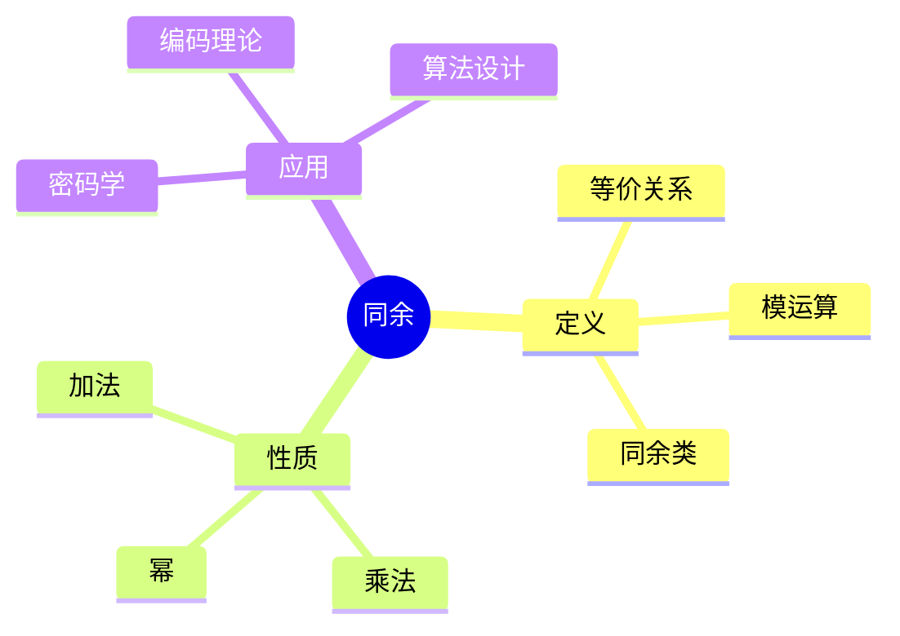
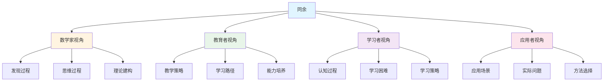
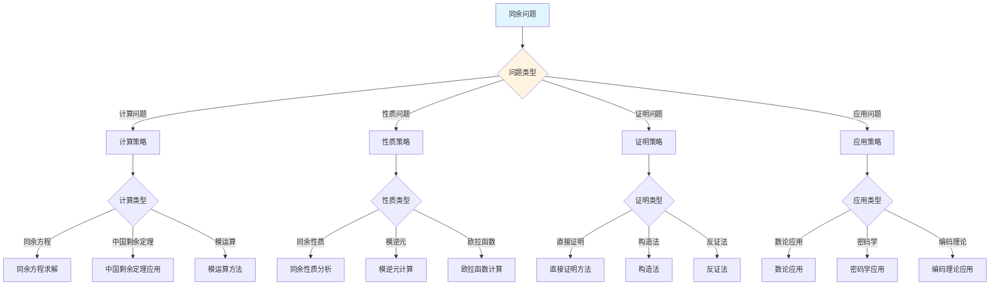
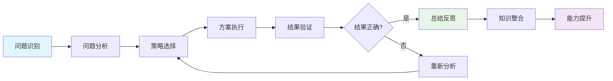
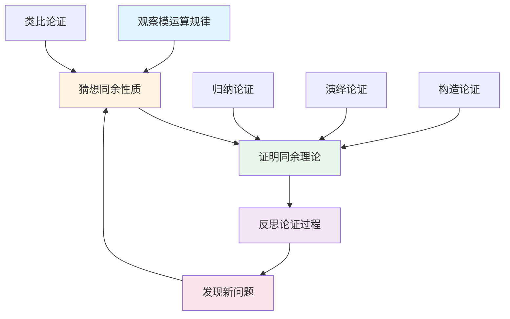
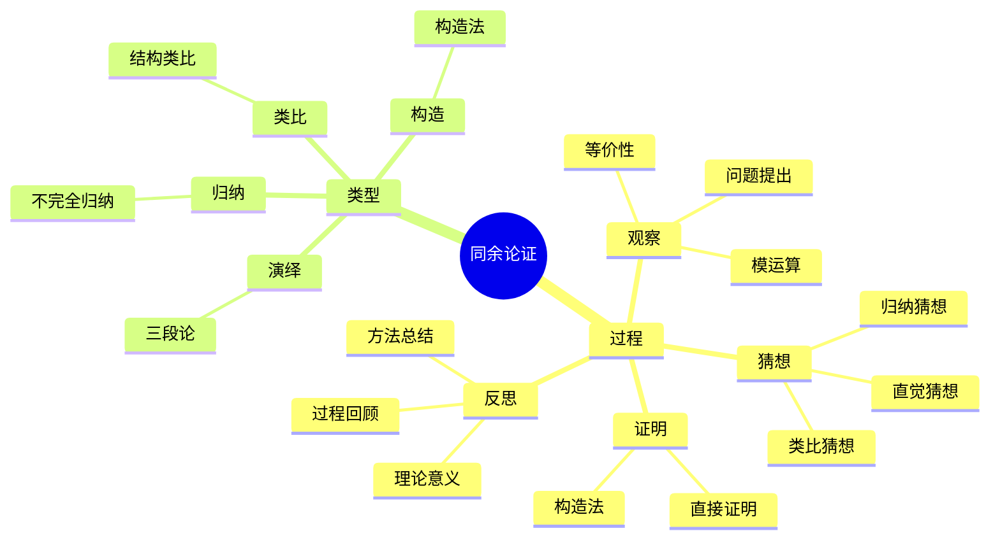

# 同余 (Congruence) - 三视角组织版

**概念编号**: C.CORE.027
**知识层次**: L0-L2
**知识领域**: D6 (数论)
**创建日期**: 2025年1月
**最后更新**: 2025年1月

---

## 📋 目录 / Table of Contents

- [同余 (Congruence) - 三视角组织版](#同余-congruence---三视角组织版)
  - [📋 目录 / Table of Contents](#-目录--table-of-contents)
  - [1. 📋 概述 (编号: C.CORE.027.01)](#1--概述-编号-ccore02701)
  - [🧠 认知学视角：如何理解同余 (编号: C.CORE.027.02)](#-认知学视角如何理解同余-编号-ccore02702)
    - [认知起点 (编号: C.CORE.027.02.01)](#认知起点-编号-ccore0270201)
    - [认知过程 (编号: C.CORE.027.02.02)](#认知过程-编号-ccore0270202)
      - [阶段1：直观理解阶段 (编号: C.CORE.027.02.02.01)](#阶段1直观理解阶段-编号-ccore027020201)
      - [阶段2：概念形成阶段 (编号: C.CORE.027.02.02.02)](#阶段2概念形成阶段-编号-ccore027020202)
      - [阶段3：形式化阶段 (编号: C.CORE.027.02.02.03)](#阶段3形式化阶段-编号-ccore027020203)
    - [认知障碍 (编号: C.CORE.027.02.03)](#认知障碍-编号-ccore0270203)
    - [认知工具 (编号: C.CORE.027.02.04)](#认知工具-编号-ccore0270204)
  - [🎓 教育学视角：如何教学同余 (编号: C.CORE.027.03)](#-教育学视角如何教学同余-编号-ccore02703)
    - [教学目标 (编号: C.CORE.027.03.01)](#教学目标-编号-ccore0270301)
    - [教学路径 (编号: C.CORE.027.03.02)](#教学路径-编号-ccore0270302)
      - [阶段1：引入阶段（激发兴趣） (编号: C.CORE.027.03.02.01)](#阶段1引入阶段激发兴趣-编号-ccore027030201)
      - [阶段2：探索阶段（主动建构） (编号: C.CORE.027.03.02.02)](#阶段2探索阶段主动建构-编号-ccore027030202)
      - [阶段3：形式化阶段（抽象概括） (编号: C.CORE.027.03.02.03)](#阶段3形式化阶段抽象概括-编号-ccore027030203)
      - [阶段4：巩固阶段（应用深化） (编号: C.CORE.027.03.02.04)](#阶段4巩固阶段应用深化-编号-ccore027030204)
    - [教学难点 (编号: C.CORE.027.03.03)](#教学难点-编号-ccore0270303)
      - [难点1：模运算的抽象性](#难点1模运算的抽象性)
      - [难点2：同余类的概念](#难点2同余类的概念)
      - [难点3：同余的运算](#难点3同余的运算)
    - [教学策略 (编号: C.CORE.027.03.04)](#教学策略-编号-ccore0270304)
      - [策略1：从具体到抽象](#策略1从具体到抽象)
      - [策略2：多元表征](#策略2多元表征)
      - [策略3：问题驱动](#策略3问题驱动)
      - [策略4：可视化教学](#策略4可视化教学)
    - [评估方法 (编号: C.CORE.027.03.05)](#评估方法-编号-ccore0270305)
  - [🔬 数学家视角：如何思考同余 (编号: C.CORE.027.04)](#-数学家视角如何思考同余-编号-ccore02704)
    - [问题起源 (编号: C.CORE.027.04.01)](#问题起源-编号-ccore0270401)
    - [思维过程 (编号: C.CORE.027.04.02)](#思维过程-编号-ccore0270402)
      - [步骤1：问题提出 (编号: C.CORE.027.04.02.01)](#步骤1问题提出-编号-ccore027040201)
      - [步骤2：概念形成 (编号: C.CORE.027.04.02.02)](#步骤2概念形成-编号-ccore027040202)
      - [步骤3：理论发展 (编号: C.CORE.027.04.02.03)](#步骤3理论发展-编号-ccore027040203)
    - [历史发展 (编号: C.CORE.027.04.03)](#历史发展-编号-ccore0270403)
    - [3.2 关键人物和贡献 (编号: C.CORE.027.04.04)](#32-关键人物和贡献-编号-ccore0270404)
    - [重要定理 (编号: C.CORE.027.04.05)](#重要定理-编号-ccore0270405)
    - [开放问题 (编号: C.CORE.027.04.06)](#开放问题-编号-ccore0270406)
    - [一、第一人称思维描述 (编号: C.CORE.027.04.07)](#一第一人称思维描述-编号-ccore0270407)
      - [1.1 Gauss的发现过程](#11-gauss的发现过程)
    - [二、数学直觉的形成 (编号: C.CORE.027.04.08)](#二数学直觉的形成-编号-ccore0270408)
      - [2.1 直觉在概念发现中的作用](#21-直觉在概念发现中的作用)
      - [2.2 如何培养同余直觉](#22-如何培养同余直觉)
    - [三、数学美的教育价值 (编号: C.CORE.027.04.09)](#三数学美的教育价值-编号-ccore0270409)
      - [3.1 同余论的美在哪里](#31-同余论的美在哪里)
      - [3.2 如何培养学生的数学美感](#32-如何培养学生的数学美感)
    - [四、问题解决策略 (编号: C.CORE.027.04.10)](#四问题解决策略-编号-ccore0270410)
      - [4.1 数学家的启发式方法](#41-数学家的启发式方法)
      - [4.2 思维过程分析](#42-思维过程分析)
    - [五、批判性反思 (编号: C.CORE.027.04.11)](#五批判性反思-编号-ccore0270411)
      - [5.1 同余概念的局限性](#51-同余概念的局限性)
      - [5.2 同余理论的未解决问题](#52-同余理论的未解决问题)
  - [💡 数学解释：为什么同余是这样定义的 (编号: C.CORE.027.05)](#-数学解释为什么同余是这样定义的-编号-ccore02705)
    - [一、直观解释：同余是什么？](#一直观解释同余是什么)
      - [1.1 具体例子](#11-具体例子)
      - [1.2 形象类比](#12-形象类比)
      - [1.3 几何直观](#13-几何直观)
      - [1.4 操作体验](#14-操作体验)
    - [二、知性解释：同余的本质是什么？](#二知性解释同余的本质是什么)
      - [2.1 概念定义](#21-概念定义)
      - [2.2 分类体系](#22-分类体系)
      - [2.3 抽象结构](#23-抽象结构)
      - [2.4 知识体系](#24-知识体系)
    - [三、理性解释：同余的公理化定义](#三理性解释同余的公理化定义)
      - [3.1 公理体系](#31-公理体系)
      - [3.2 形式化证明](#32-形式化证明)
      - [3.3 系统建构](#33-系统建构)
    - [四、多视角解释：从不同角度理解同余](#四多视角解释从不同角度理解同余)
      - [4.1 数学家视角：同余是如何被发现的？](#41-数学家视角同余是如何被发现的)
      - [4.2 教育者视角：如何教学同余？](#42-教育者视角如何教学同余)
      - [4.3 学习者视角：如何学习同余？](#43-学习者视角如何学习同余)
      - [4.4 应用者视角：如何应用同余？](#44-应用者视角如何应用同余)
    - [五、思维表征：用多种方式理解同余](#五思维表征用多种方式理解同余)
      - [5.1 思维导图：同余的知识结构](#51-思维导图同余的知识结构)
      - [5.2 矩阵对比：不同解释方式的对比](#52-矩阵对比不同解释方式的对比)
      - [5.3 多视角表征：从不同角度表征同余](#53-多视角表征从不同角度表征同余)
  - [💡 数学解释：为什么同余是这样定义的 (编号: C.CORE.027.05)](#-数学解释为什么同余是这样定义的-编号-ccore02705)
  - [🔍 数学论证：如何论证同余 (编号: C.CORE.027.06)](#-数学论证如何论证同余-编号-ccore02706)
    - [一、论证过程：从观察到反思](#一论证过程从观察到反思)
    - [二、论证类型：多种推理方式](#二论证类型多种推理方式)
    - [三、论证可视化：用图形表示论证过程](#三论证可视化用图形表示论证过程)
  - [🔗 三视角整合 (编号: C.CORE.027.07)](#-三视角整合-编号-ccore02707)
    - [三个视角的关联](#三个视角的关联)
    - [如何综合运用三个视角](#如何综合运用三个视角)
  - [📚 参考文献 (编号: C.CORE.027.08)](#-参考文献-编号-ccore02708)
    - [权威资源](#权威资源)
    - [经典教材](#经典教材)
    - [研究论文](#研究论文)

---

## 1. 📋 概述 (编号: C.CORE.027.01)

同余是数论的核心概念，描述整数在模运算下的等价关系。同余理论在密码学、编码理论、算法设计等领域有重要应用。

本文档从**数学认知学**、**教育学**、**数学家**三个视角深入展开同余概念，避免简单的概念堆垒。

**权威资源对齐**:

- Wikipedia: [Modular Arithmetic](https://en.wikipedia.org/wiki/Modular_arithmetic)
- Stanford课程: Math 154 (Number Theory)
- Princeton课程: MAT 320 (Number Theory)
- MIT课程: 18.781 (Theory of Numbers)
- Metamath: [Congruence](http://us.metamath.org/mpeuni/df-congruence.html)

---

## 🧠 认知学视角：如何理解同余 (编号: C.CORE.027.02)

### 认知起点 (编号: C.CORE.027.02.01)

**学习者已有的知识基础**:

- 整数的概念
- 整除的概念
- 日常经验中的"余数"、"周期"概念

**日常经验中的类似概念**:

- "余数"：除法后的余数
- "周期"：周期性重复
- "模"：模运算

### 认知过程 (编号: C.CORE.027.02.02)

#### 阶段1：直观理解阶段 (编号: C.CORE.027.02.02.01)

**具体例子**:

- 例子1：$7 \equiv 2 \pmod{5}$（因为$5 \mid (7-2)$）
- 例子2：$15 \equiv 0 \pmod{5}$（因为$5 \mid 15$）
- 例子3：$a \equiv a \pmod{m}$（自反性）

**形象类比**:

- **余数类比**: 同余就像"余数相同"
  - 两个数除以$m$后余数相同
  - 余数相同则同余
  - 同余描述"余数关系"

- **周期类比**: 同余就像"周期性"
  - 模$m$运算有周期性
  - 每$m$个数重复一次
  - 同余描述"周期关系"

**可视化表示**:

```text
同余:
    7 ≡ 2 (mod 5)
    因为 7 - 2 = 5
    余数相同
```

#### 阶段2：概念形成阶段 (编号: C.CORE.027.02.02.02)

**从例子中抽象出共同特征**:

- 所有例子都涉及"余数相同"
- 余数相同则同余
- 同余是等价关系

**识别关键属性**:

1. **整除性**: $a \equiv b \pmod{m} \Leftrightarrow m \mid (a - b)$
2. **余数性**: $a \equiv b \pmod{m} \Leftrightarrow a \bmod m = b \bmod m$
3. **等价性**: 同余是等价关系

**建立概念边界**:

- **什么是同余**: 两个整数模$m$余数相同
- **什么不是同余**:
  - 余数不同（不同余）

#### 阶段3：形式化阶段 (编号: C.CORE.027.02.02.03)

**严格定义**:

- 同余定义：$a \equiv b \pmod{m} \Leftrightarrow m \mid (a - b)$
- 等价定义：$a \equiv b \pmod{m} \Leftrightarrow a \bmod m = b \bmod m$

**公理化表述**:

- 条件1：整除性
- 条件2：等价性

**逻辑结构**:

- 同余是数论的核心概念
- 同余是模运算的基础
- 同余是密码学的基础

### 认知障碍 (编号: C.CORE.027.02.03)

**常见误解**:

1. **误解1**: 认为同余就是相等
   - **纠正**: 同余是模运算下的等价，不是相等

2. **误解2**: 认为同余运算就是除法
   - **纠正**: 同余是模运算，不是除法

3. **误解3**: 混淆同余和整除
   - **纠正**: 同余是等价关系，整除是关系

**理解难点**:

1. **难点1**: 模运算的抽象性
   - **原因**: 模运算比较抽象
   - **解决方法**: 从具体例子开始，逐步抽象

2. **难点2**: 同余类的概念
   - **原因**: 同余类比较抽象
   - **解决方法**: 用具体例子，强调同余类的作用

3. **难点3**: 同余的运算
   - **原因**: 同余运算规则较多
   - **解决方法**: 用具体例子，逐步掌握运算规则

**认知陷阱**:

- **相等**: 需要理解同余不是相等
- **模运算**: 需要理解模运算的作用

### 认知工具 (编号: C.CORE.027.02.04)

**类比工具**:

- **余数类比**: 同余 = 余数相同
- **周期类比**: 同余 = 周期性

**可视化工具**:

- **同余表**: 用同余表表示同余
- **周期图**: 用周期图表示模运算

**具体化工具**:

- **具体例子**: 用具体例子理解抽象概念
- **反例**: 用反例理解概念边界

---

## 🎓 教育学视角：如何教学同余 (编号: C.CORE.027.03)

### 教学目标 (编号: C.CORE.027.03.01)

**知识目标**:

- 理解同余的基本概念
- 掌握同余的定义
- 理解同余的性质
- 理解同余的应用

**能力目标**:

- 能够判断两个数是否同余
- 能够进行同余运算
- 能够应用同余解决实际问题
- 能够理解同余的重要性

**情感目标**:

- 培养数学抽象思维
- 培养数论思维
- 激发对数学的兴趣

### 教学路径 (编号: C.CORE.027.03.02)

#### 阶段1：引入阶段（激发兴趣） (编号: C.CORE.027.03.02.01)

**实际问题**:

- 问题1：如何描述"余数相同"？
- 问题2：如何研究周期性？
- 问题3：如何设计密码？

**历史背景**:

- 同余的历史发展
- 同余在数学中的地位
- 同余在密码学中的应用

**引发认知冲突**:

- 问题：如何统一描述"余数相同"？
- 引出同余的概念

#### 阶段2：探索阶段（主动建构） (编号: C.CORE.027.03.02.02)

**引导发现**:

1. 让学生自己列举"余数相同"的例子
2. 让学生观察这些例子的共同特征
3. 引导学生抽象出同余的定义

**合作探究**:

- 小组讨论：什么是同余？
- 小组讨论：同余有哪些性质？
- 小组讨论：如何进行同余运算？

**多元表征**:

- **语言表征**: "同余是整数在模运算下的等价关系"
- **符号表征**: $a \equiv b \pmod{m}$
- **图形表征**: 同余表、周期图
- **集合表征**: 同余定义

#### 阶段3：形式化阶段（抽象概括） (编号: C.CORE.027.03.02.03)

**严格定义**:

- 同余的定义
- 同余的性质
- 同余的运算

**性质证明**:

- 同余的基本性质
- 同余的运算性质
- 中国剩余定理

**应用拓展**:

- 同余在数论中的应用
- 同余在密码学中的应用
- 同余在算法设计中的应用

#### 阶段4：巩固阶段（应用深化） (编号: C.CORE.027.03.02.04)

**练习应用**:

- 基础练习：同余的判断和运算
- 应用练习：用同余解决实际问题
- 综合练习：同余的综合应用

**变式训练**:

- 不同形式的同余判断
- 不同难度的同余运算
- 同余的应用

**知识整合**:

- 同余与其他概念的联系
- 同余在数学体系中的地位

### 教学难点 (编号: C.CORE.027.03.03)

#### 难点1：模运算的抽象性

- **难点描述**: 学生难以理解模运算
- **解决方法**:
  - 从具体例子开始
  - 逐步抽象
  - 用具体例子说明

#### 难点2：同余类的概念

- **难点描述**: 学生难以理解同余类
- **解决方法**:
  - 用具体例子
  - 强调同余类的作用
  - 用图形可视化

#### 难点3：同余的运算

- **难点描述**: 学生难以掌握同余运算规则
- **解决方法**:
  - 用具体例子
  - 逐步掌握运算规则
  - 用练习巩固

### 教学策略 (编号: C.CORE.027.03.04)

#### 策略1：从具体到抽象

- 先给出具体例子
- 再抽象出一般概念
- 最后给出严格定义

#### 策略2：多元表征

- 用语言、符号、图形等多种方式表示同一概念
- 帮助学生建立不同表征之间的联系

#### 策略3：问题驱动

- 从实际问题出发
- 引出数学概念
- 解决问题

#### 策略4：可视化教学

- 使用同余表
- 使用周期图
- 使用具体例子

### 评估方法 (编号: C.CORE.027.03.05)

**形成性评估**（评估理解过程）:

- 课堂提问：检查学生对概念的理解
- 小组讨论：观察学生的思考过程
- 练习作业：检查学生的应用能力

**总结性评估**（评估最终理解）:

- 测验：检查学生对概念和运算的掌握
- 项目：检查学生应用同余解决实际问题的能力
- 反思：检查学生对同余概念的理解深度

---

## 🔬 数学家视角：如何思考同余 (编号: C.CORE.027.04)

### 问题起源 (编号: C.CORE.027.04.01)

**历史背景**:

- 18世纪：同余的起源
- 19世纪：同余的发展
- 20世纪：同余的现代发展

**原始问题**:

- **问题1**: 如何描述"余数相同"？
- **问题2**: 如何研究周期性？
- **问题3**: 同余有哪些性质？

**研究动机**:

- 统一数论理论
- 发展模运算理论
- 研究密码学

### 思维过程 (编号: C.CORE.027.04.02)

#### 步骤1：问题提出 (编号: C.CORE.027.04.02.01)

**观察到的现象**:

- 需要描述"余数相同"
- 需要研究周期性
- 需要统一数论理论

**提出的猜想**:

- 可以引入同余概念
- 同余可以描述"余数相同"
- 同余有丰富的性质

**需要解决的问题**:

- 如何定义同余？
- 同余应该满足什么条件？
- 同余有哪些性质？

#### 步骤2：概念形成 (编号: C.CORE.027.04.02.02)

**尝试性定义**:

- **整除定义**: 通过整除性
- **余数定义**: 通过余数性

**性质探索**:

- 同余的基本性质
- 同余的运算性质
- 中国剩余定理

**结构发现**:

- 同余是数论的核心概念
- 同余是模运算的基础
- 同余是密码学的基础

#### 步骤3：理论发展 (编号: C.CORE.027.04.02.03)

**定理证明**:

- 同余的基本性质
- 同余的运算性质
- 中国剩余定理

**应用拓展**:

- 同余在数论中的应用
- 同余在密码学中的应用
- 同余在算法设计中的应用

**理论完善**:

- 同余的严格定义
- 同余的范畴论研究
- 同余的应用研究

### 历史发展 (编号: C.CORE.027.04.03)

**早期阶段**（18世纪）:

- **Gauss (1801)**: 引入同余概念
- **Euler (1760)**: 研究同余理论

**关键突破**（19世纪）:

- **Dirichlet (1837)**: 发展同余理论
- **Kummer (1847)**: 研究理想数

**现代发展**（20世纪）:

- **Artin (1927)**: 发展类域论
- **Langlands (1967)**: 朗兰兹纲领

### 3.2 关键人物和贡献 (编号: C.CORE.027.04.04)

**Carl Friedrich Gauss (1777-1855)**:

- 引入同余概念
- 建立数论基础

**Leonhard Euler (1707-1783)**:

- 研究同余理论
- 建立现代数论

**Peter Gustav Lejeune Dirichlet (1805-1859)**:

- 发展同余理论
- 建立解析数论

### 重要定理 (编号: C.CORE.027.04.05)

**中国剩余定理**:

- 模互素的同余方程组有解
- 意义：同余计算的重要工具

**Fermat小定理**:

- 若$p$是素数，则$a^p \equiv a \pmod{p}$
- 意义：同余的重要性质

**Wilson定理**:

- $(p-1)! \equiv -1 \pmod{p}$当且仅当$p$是素数
- 意义：素数的判定

### 开放问题 (编号: C.CORE.027.04.06)

**未解决问题**:

- 同余的计算问题
- 同余的应用问题
- 同余的推广问题

**研究方向**:

- 同余的范畴论研究
- 同余的应用研究
- 同余的计算研究

### 一、第一人称思维描述 (编号: C.CORE.027.04.07)

#### 1.1 Gauss的发现过程

**详细历史背景**:

- **1801年**：Gauss发表《算术研究》（Disquisitiones Arithmeticae）
- **背景**：研究数论，发现有些数除以某个数后余数相同
- **问题**：如何描述这种关系？如何统一处理模运算？

**Gauss的详细第一人称描述**:
> "1801年，我在研究数论时，遇到了一个问题：如何描述那些除以某个数后余数相同的数？
>
> 我发现，$7$和$12$除以$5$后余数都是$2$，$13$和$18$除以$5$后余数都是$3$。这种关系有特殊的性质。
>
> 我的方法是这样的：
>
> - **思路**：用同余描述余数相同的关系
> - **定义**：$a \equiv b \pmod{m}$当且仅当$m \mid (a-b)$
> - **例子**：$7 \equiv 12 \pmod{5}$，因为$5 \mid (12-7) = 5$
>
> 例如，对于模$5$：
>
> - **同余类**：$[0] = \{0, 5, 10, 15, \ldots\}$，$[1] = \{1, 6, 11, 16, \ldots\}$，$[2] = \{2, 7, 12, 17, \ldots\}$，$[3] = \{3, 8, 13, 18, \ldots\}$，$[4] = \{4, 9, 14, 19, \ldots\}$
> - **运算**：$[a] + [b] = [a+b]$，$[a] \cdot [b] = [ab]$
> - **意义**：$\mathbb{Z}/5\mathbb{Z}$构成环
>
> 我还发现了中国剩余定理：
>
> - **定理**：如果$m_1, \ldots, m_k$两两互素，则同余方程组$x \equiv a_i \pmod{m_i}$有解
> - **例子**：$x \equiv 2 \pmod{3}$，$x \equiv 3 \pmod{5}$，$x \equiv 2 \pmod{7}$有解$x = 23$
> - **意义**：中国剩余定理是同余计算的重要工具
>
> 这让我意识到，同余是描述余数相同关系的工具，同余运算有良好的性质。这为数论提供了基础。"

**详细的思维过程**:

1. **观察到的现象**（1801年）:

   **现象1：有些数除以某个数后余数相同**
   - **问题**：如何描述这种关系？
   - **例子**：$7 \equiv 12 \pmod{5}$，$13 \equiv 18 \pmod{5}$
   - **需要**：统一的概念

   **现象2：这种关系有特殊的性质**
   - **问题**：同余有什么性质？
   - **例子**：同余关系是等价关系，同余运算有良好的性质
   - **需要**：建立同余理论

   **现象3：需要统一的概念**
   - **问题**：如何统一处理模运算？
   - **思路**：用同余统一
   - **需要**：建立同余理论

2. **提出的猜想**（1801年）:

   **猜想1：用同余描述余数相同的关系**
   - **思路**：定义$a \equiv b \pmod{m}$当且仅当$m \mid (a-b)$
   - **例子**：$7 \equiv 12 \pmod{5}$
   - **优点**：统一描述余数相同的关系

   **猜想2：同余运算的性质**
   - **性质**：同余关系是等价关系，同余运算有良好的性质
   - **例子**：$\mathbb{Z}/m\mathbb{Z}$构成环
   - **意义**：同余运算有良好的代数结构

   **猜想3：中国剩余定理**
   - **定理**：模互素的同余方程组有解
   - **例子**：$x \equiv 2 \pmod{3}$，$x \equiv 3 \pmod{5}$，$x \equiv 2 \pmod{7}$有解
   - **意义**：中国剩余定理是同余计算的重要工具

3. **遇到的困难**（1801年）:

   **困难1：如何严格定义同余？**
   - **问题**：如何定义同余？
   - **解决**：定义$a \equiv b \pmod{m}$当且仅当$m \mid (a-b)$
   - **意义**：为同余提供严格的数学基础

   **困难2：如何判断同余的性质？**
   - **问题**：如何判断同余方程是否有解？
   - **解决**：使用中国剩余定理、Fermat小定理
   - **意义**：为同余提供判断方法

   **困难3：如何应用同余理论？**
   - **问题**：如何用同余理论解决实际问题？
   - **解决**：建立同余方程理论、密码学应用
   - **意义**：为同余提供应用基础

4. **突破的时刻**（1801年，Gauss）:

   **突破1：同余的概念**
   - 引入同余的概念描述余数相同的关系
   - **关键**：同余关系是等价关系
   - **意义**：为数论提供基础

   **突破2：中国剩余定理**
   - 证明中国剩余定理
   - **关键**：模互素的同余方程组有解
   - **意义**：为同余计算提供工具

   **突破3：同余理论的广泛应用**
   - 同余理论可以应用到更广泛的领域
   - **关键**：同余运算有良好的性质
   - **意义**：同余理论成为数论的基础

### 二、数学直觉的形成 (编号: C.CORE.027.04.08)

#### 2.1 直觉在概念发现中的作用

**Gauss的直觉**:

- **直觉1**: "同余"是"余数相同"——这个直觉引导Gauss发现同余
- **直觉2**: 同余可以统一处理模运算——这个直觉引导Gauss建立同余理论
- **直觉3**: 同余是数论的基础——这个直觉引导Gauss建立同余理论

**直觉的验证**:

- 通过严格的数学证明验证直觉的正确性
- 通过同余运算严格化同余定义
- 通过应用验证同余的广泛性

**直觉的深化**:

- 从"余数相同"到"同余的严格定义"
- 从"统一处理模运算"到"同余的广泛应用"
- 从"数论基础"到"同余的深入发展"

#### 2.2 如何培养同余直觉

**数学家的建议**:

- **Gauss**: "同余直觉是长期训练的结果。通过大量练习和深入思考，我们可以培养对同余的直觉。"
- **Euler**: "从具体例子开始，逐步抽象，这是培养同余直觉的有效方法。"

**培养方法**:

1. **大量练习**: 通过大量同余计算练习，培养对同余的直觉
2. **深入思考**: 深入思考同余的本质，理解同余的深层结构
3. **类比和联想**: 通过类比和联想，建立同余与其他概念的联系
4. **与专家交流**: 与数学家交流，学习他们的思维方式

**教学启示**:

- 从具体例子开始，逐步抽象
- 鼓励学生思考同余的本质
- 引导学生建立同余与其他概念的联系

### 三、数学美的教育价值 (编号: C.CORE.027.04.09)

#### 3.1 同余论的美在哪里

**结构美**:

- **简洁性**: 同余的概念非常简洁——"两个数除以某个数后余数相同"
- **统一性**: 同余可以统一描述数学中的各种模运算
- **和谐性**: 同余运算满足优美的规律（Fermat小定理、Wilson定理等）

**数学家的评价**:

- **Gauss**: "同余论的美在于它的统一性。它为我们提供了一个统一的框架来理解模运算。"
- **Euler**: "同余论的美在于它的基础性。它是数论的基础，所有模运算都可以用同余来描述。"

#### 3.2 如何培养学生的数学美感

**数学家的建议**:

- **Gauss**: "展示同余论的美感，让学生感受到数学的美。"
- **Euler**: "通过同余论的历史和发展，让学生理解数学的美。"

**教学方法**:

1. **展示数学美**:
   - 展示同余概念的简洁性和统一性
   - 展示同余运算的优美规律
   - 展示同余在数学中的基础地位

2. **引导学生欣赏**:
   - 引导学生欣赏同余概念的简洁性
   - 引导学生欣赏同余运算的和谐性
   - 引导学生欣赏同余的基础性

3. **鼓励学生创造美**:
   - 鼓励学生发现同余论的美
   - 鼓励学生创造优美的同余证明
   - 鼓励学生探索同余论的美

### 四、问题解决策略 (编号: C.CORE.027.04.10)

#### 4.1 数学家的启发式方法

**策略1：从具体到抽象**:

- 从具体的同余例子开始
- 抽象出同余的一般性质
- 建立同余的理论体系

**策略2：从简单到复杂**:

- 先理解基本同余
- 再理解同余运算
- 最后理解同余理论

**策略3：从问题到理论**:

- 从实际问题出发
- 引出同余概念
- 建立同余理论

#### 4.2 思维过程分析

**问题识别**:

- 识别问题类型：同余定义问题、同余计算问题、同余应用问题
- 识别问题难度：简单问题、中等问题、复杂问题

**策略选择**:

- 简单问题：直接方法
- 中等问题：分步方法
- 复杂问题：分解方法

**执行和反思**:

- 执行策略，解决问题
- 反思过程，总结经验
- 改进方法，提高效率

### 五、批判性反思 (编号: C.CORE.027.04.11)

#### 5.1 同余概念的局限性

**概念的边界**:

- 同余只描述整数的模运算，不能描述所有数学运算
- 同余是抽象的，需要具体化才能应用
- 同余不能表示所有数学量

**概念的推广**:

- 模同余：更一般的同余
- 范畴同余：范畴论中的同余
- 代数同余：代数中的同余

#### 5.2 同余理论的未解决问题

**未解决的问题**:

- 同余的计算问题：如何计算复杂同余？
- 同余的应用问题：如何更好地应用同余？
- 同余的推广问题：如何推广同余概念？

**研究方向**:

- 同余的范畴论研究
- 同余的应用研究
- 同余的计算研究

---

## 💡 数学解释：为什么同余是这样定义的 (编号: C.CORE.027.05)

### 一、直观解释：同余是什么？

#### 1.1 具体例子

**生活中的例子**：

- **时钟算术**：时钟上的时间就是同余
  - 例如：$13 \equiv 1 \pmod{12}$（13点和1点相同）
  - **为什么这样定义**：因为我们需要一个概念来表示"周期性"
- **星期计算**：星期几的计算就是同余
  - 例如：如果今天是星期一，那么7天后也是星期一
  - **为什么这样定义**：因为我们需要一个概念来表示"循环"
- **日历计算**：月份的计算就是同余
  - 例如：12个月后回到同一个月
  - **为什么这样定义**：因为我们需要一个概念来表示"周期性"

**数学中的例子**：

- **模运算**：$a \equiv b \pmod{m}$表示$a$和$b$除以$m$的余数相同
  - **为什么这样定义**：我们需要一个简单的方式来表示"余数相同"
- **同余类**：所有与$a$同余的数组成一个同余类
  - **为什么这样定义**：我们需要一个概念来表示"同余的等价类"
- **模$m$的剩余系**：$\{0, 1, 2, \ldots, m-1\}$是模$m$的完全剩余系
  - **为什么这样定义**：我们需要一个概念来表示"模$m$的所有余数"

#### 1.2 形象类比

**时钟类比**：

- **同余就像"时钟"**
  - 时钟上的时间循环
  - 同余也是循环的
- **为什么这样类比**：这个类比帮助我们理解同余的"周期性"性质

**循环类比**：

- **同余就像"循环"**
  - 循环有周期
  - 同余也有周期（模）
- **为什么这样类比**：这个类比帮助我们理解同余的"循环"性质

#### 1.3 几何直观

**数轴表示**：

- 使用数轴表示同余
- 例如：将数轴分成$m$段，每段内的数同余
- **为什么使用数轴**：数轴提供几何直观，帮助我们理解同余的分布

**圆表示**：

- 使用圆表示同余
- 例如：将圆分成$m$等份，每份内的数同余
- **为什么使用圆**：圆提供几何直观，帮助我们理解同余的循环性

#### 1.4 操作体验

**同余运算的操作**：

- **同余的加法**：如果$a \equiv b \pmod{m}$且$c \equiv d \pmod{m}$，则$a+c \equiv b+d \pmod{m}$
  - **为什么这样操作**：因为我们需要一个运算来表示"同余的加法"
- **同余的乘法**：如果$a \equiv b \pmod{m}$且$c \equiv d \pmod{m}$，则$ac \equiv bd \pmod{m}$
  - **为什么这样操作**：因为我们需要一个运算来表示"同余的乘法"
- **同余的幂**：如果$a \equiv b \pmod{m}$，则$a^n \equiv b^n \pmod{m}$
  - **为什么这样操作**：因为我们需要一个工具来计算同余的幂

### 二、知性解释：同余的本质是什么？

#### 2.1 概念定义

**同余的内涵**：

- **同余是整数在模运算下的等价关系**
  - **等价性**：$a \equiv a \pmod{m}$（自反性）
  - **对称性**：如果$a \equiv b \pmod{m}$，则$b \equiv a \pmod{m}$
  - **传递性**：如果$a \equiv b \pmod{m}$且$b \equiv c \pmod{m}$，则$a \equiv c \pmod{m}$
- **为什么这样定义**：这些特征使得同余成为一个完整的数论工具，支持所有模运算研究

**同余的外延**：

- **模$m$同余**：$a \equiv b \pmod{m}$表示$a$和$b$除以$m$的余数相同
- **同余类**：所有与$a$同余的数组成一个同余类$[a]_m$
- **为什么这样分类**：不同的同余类型有不同的性质和用途

#### 2.2 分类体系

**按模分类**：

- **模$m$同余**：$a \equiv b \pmod{m}$
- **模$p$同余**：$p$是素数时的特殊性质
- **为什么这样分类**：模是同余的基本特征

**按性质分类**：

- **线性同余**：$ax \equiv b \pmod{m}$
- **二次同余**：$x^2 \equiv a \pmod{m}$
- **为什么这样分类**：性质是同余的重要特征

#### 2.3 抽象结构

**同余的运算结构**：

- **同余的加法**：$[a]_m + [b]_m = [a+b]_m$
- **同余的乘法**：$[a]_m \cdot [b]_m = [ab]_m$
- **为什么有这些运算**：这些运算使得同余具有代数结构（环结构）

**同余的关系结构**：

- **同余的等价关系**：同余是等价关系
- **同余类**：同余类形成等价类
- **为什么有这个关系**：这个关系帮助我们研究同余的结构

#### 2.4 知识体系

**同余在数学体系中的位置**：

- **基础地位**：同余是数论的基础
  - 同余是模运算的基础
  - 同余是密码学的基础
- **为什么是基础**：同余提供了统一的框架来研究模运算

**同余与其他概念的关系**：

- **同余与整除**：$a \equiv b \pmod{m}$当且仅当$m \mid (a-b)$
- **同余与群**：模$m$的同余类形成群
- **同余与密码学**：同余在密码学中有重要应用
- **为什么有这些关系**：这些关系揭示了同余与其他数学概念的内在联系

### 三、理性解释：同余的公理化定义

#### 3.1 公理体系

**同余的定义**：

- **定义**：$a \equiv b \pmod{m}$当且仅当$m \mid (a-b)$
- **为什么需要这个定义**：这个定义提供了同余的严格数学基础

**同余的公理**：

- **自反性**：$a \equiv a \pmod{m}$
- **对称性**：如果$a \equiv b \pmod{m}$，则$b \equiv a \pmod{m}$
- **传递性**：如果$a \equiv b \pmod{m}$且$b \equiv c \pmod{m}$，则$a \equiv c \pmod{m}$
- **为什么这样定义**：这些公理将同余放在更一般的框架中

#### 3.2 形式化证明

**同余性质的证明**：

- **同余的加法**：如果$a \equiv b \pmod{m}$且$c \equiv d \pmod{m}$，则$a+c \equiv b+d \pmod{m}$
  - **证明**：使用同余的定义和整除的性质
  - **为什么这样证明**：利用同余的定义和整除的性质
- **Fermat小定理**：如果$p$是素数且$\gcd(a, p) = 1$，则$a^{p-1} \equiv 1 \pmod{p}$
  - **证明**：使用群论和Lagrange定理
  - **为什么这样证明**：利用同余的群结构和Lagrange定理

#### 3.3 系统建构

**同余论在数学基础中的地位**：

- **作为数论基础**：同余是数论的基础
- **提供模运算工具**：同余提供了模运算的工具
- **统一框架**：同余统一了各种模运算研究

**同余论的发展历史**：

- **Gauss的引入**（1801年）：在《算术研究》中引入同余概念
- **Euler的研究**（1760年）：研究同余理论
- **为什么这样发展**：数学的发展需要严格的基础，同余论的发展反映了这一需求

### 四、多视角解释：从不同角度理解同余

#### 4.1 数学家视角：同余是如何被发现的？

**Gauss的发现过程**：

- **问题提出**：如何描述"余数相同"？
- **关键洞察**：使用同余符号$\equiv$，发现同余的代数性质
- **重要发现**：同余可以用于解决数论问题
- **为什么这样发现**：数学家的直觉和严格证明相结合

#### 4.2 教育者视角：如何教学同余？

**教学策略**：

- **从具体到抽象**：先学习具体例子（时钟算术），再学习抽象定义
- **从简单到复杂**：先学习小模数，再学习大模数
- **从直观到形式化**：先使用时钟等直观工具，再学习严格定义
- **为什么这样教学**：符合认知规律，帮助学生逐步建立理解

#### 4.3 学习者视角：如何学习同余？

**认知过程**：

- **直观阶段**：通过具体例子理解同余的含义
- **概念阶段**：理解同余的定义和性质
- **形式化阶段**：理解严格定义和证明
- **为什么这样学习**：符合认知发展规律

#### 4.4 应用者视角：如何应用同余？

**应用场景**：

- **密码学**：使用同余进行加密（RSA算法）
- **编码理论**：使用同余进行错误检测
- **算法设计**：使用同余进行哈希和随机化
- **为什么这样应用**：同余提供了强大的工具来处理各种问题

### 五、思维表征：用多种方式理解同余

#### 5.1 思维导图：同余的知识结构



#### 5.2 矩阵对比：不同解释方式的对比

| 解释方式 | 特点 | 方法 | 工具 | 适用阶段 | 优势 | 局限 |
|---------|------|------|------|---------|------|------|
| **直观解释** | 具体、形象、可视 | 例子、类比、直观 | 时钟、数轴 | 入门阶段 | 易于理解 | 不够严格 |
| **知性解释** | 概念、分类、抽象 | 定义、分类、结构 | 概念图、知识图谱 | 中级阶段 | 系统完整 | 不够直观 |
| **理性解释** | 公理、证明、形式化 | 公理、证明、系统 | 形式化工具、证明系统 | 高级阶段 | 严格准确 | 不够具体 |
| **多视角解释** | 多角度、整合 | 多视角、整合 | 多视角工具 | 所有阶段 | 全面深入 | 可能复杂 |

#### 5.3 多视角表征：从不同角度表征同余



#### 5.4 决策树：同余问题分类和策略选择



**说明**：

- **问题分类**：根据问题类型（计算、性质、证明、应用）进行分类
- **策略选择**：根据问题类型选择相应的解决策略
- **方法应用**：根据具体问题选择合适的方法

#### 5.5 决策逻辑路径：同余问题解决过程



**说明**：

- **问题识别**：识别同余问题的类型和关键要素
- **问题分析**：分析问题的条件和目标
- **策略选择**：根据问题类型选择解决策略
- **方案执行**：执行选定的解决方案
- **结果验证**：验证结果的正确性
- **总结反思**：总结解题过程，反思解题方法
- **知识整合**：整合相关知识点
- **能力提升**：提升问题解决能力

#### 5.6 多维对比矩阵：同余概念特征对比

| 对比维度 | 同余定义 | 同余计算 | 同余性质 | 同余应用 |
|---------|---------|---------|---------|---------|
| **核心特征** | 模运算、同余关系 | 同余方程、中国剩余定理 | 同余性质、模逆元、欧拉函数 | 数论、密码学、编码理论 |
| **理解难度** | ⭐⭐⭐ | ⭐⭐⭐⭐ | ⭐⭐⭐⭐ | ⭐⭐⭐⭐ |
| **应用频率** | ⭐⭐⭐⭐ | ⭐⭐⭐⭐⭐ | ⭐⭐⭐⭐ | ⭐⭐⭐⭐ |
| **理论基础** | 同余定义 | 同余计算理论 | 同余性质理论 | 同余应用理论 |
| **教学重点** | 概念理解 | 计算方法 | 性质分析 | 应用能力 |
| **学习阶段** | 中级阶段 | 中级-高级 | 中级-高级 | 中级-高级 |
| **认知维度** | 知性+理性 | 理性 | 理性 | 理性+应用 |
| **思维表征** | 思维导图 | 决策树 | 决策逻辑路径 | 知识图谱 |

**说明**：

- **核心特征**：每个方面的核心特征
- **理解难度**：从1星到5星，表示理解难度
- **应用频率**：从1星到5星，表示应用频率
- **理论基础**：每个方面的理论基础
- **教学重点**：每个方面的教学重点
- **学习阶段**：每个方面的学习阶段
- **认知维度**：每个方面的认知维度
- **思维表征**：每个方面推荐的思维表征方法

---

## 🔍 数学论证：如何论证同余 (编号: C.CORE.027.06)

### 一、论证过程：从观察到反思

#### 1.1 观察（Observation）

**具体现象观察**：

- **现象1**：模运算的规律性
  - 例如：$7 \equiv 2 \pmod{5}$，$12 \equiv 2 \pmod{5}$，模5下等价
  - **为什么重要**：这个现象揭示了同余的本质
- **现象2**：同余关系的等价性
  - 例如：同余关系是等价关系，满足自反性、对称性、传递性
  - **为什么重要**：这个现象揭示了同余的结构性质

**模式识别**：

- **模式1**：同余的定义
  - 例如：$a \equiv b \pmod{n}$当且仅当$n \mid (a-b)$
  - **为什么重要**：这个模式可能反映了同余的本质
- **模式2**：中国剩余定理
  - 例如：模互素的同余方程组有唯一解
  - **为什么重要**：这个模式可能反映了同余的代数结构

**问题提出**：

- **问题1**：如何严格定义同余，统一不同的模运算？
  - **为什么提出**：这个问题可能揭示同余的本质和基础
- **问题2**：如何证明中国剩余定理？
  - **为什么提出**：这个问题可能揭示同余的代数性质

#### 1.2 猜想（Conjecture）

**归纳猜想**：

- **猜想1**：同余是研究模运算的统一工具
  - **依据**：观察不同模运算都满足同余定义
  - **为什么提出**：这个猜想可能揭示同余的统一性
- **猜想2**：中国剩余定理
  - **依据**：观察具体同余方程组的解
  - **为什么提出**：这个猜想可能揭示同余的代数性质

**类比猜想**：

- **猜想1**：同余类似于"模等价"
  - **类比对象**：等价关系
  - **为什么提出**：这个类比可能揭示同余的本质
- **猜想2**：同余类类似于"等价类"
  - **类比对象**：等价类
  - **为什么提出**：这个类比可能揭示同余类的作用

**直觉猜想**：

- **猜想1**：同余是"最自然"的模运算概念
  - **直觉来源**：同余的直观
  - **为什么提出**：这个直觉可能揭示同余的基础地位
- **猜想2**：同余有"最小"的公理结构
  - **直觉来源**：同余的公理结构
  - **为什么提出**：这个直觉可能揭示同余的本质

#### 1.3 证明（Proof）

**直接证明**：

- **证明1**：中国剩余定理
  - **证明思路**：使用同余的定义和互素的性质
  - **关键步骤**：构造解，证明存在性和唯一性
  - **为什么这样证明**：这个证明方法直接、清晰
- **证明2**：同余关系的等价性
  - **证明思路**：使用同余的定义
  - **关键步骤**：证明自反性、对称性、传递性
  - **为什么这样证明**：这个证明方法直接、清晰

**构造法**：

- **构造法**：构造同余类的代表元
  - **构造方法**：选择每个同余类的最小非负代表元
  - **验证**：验证构造的代表元满足同余关系
  - **为什么这样证明**：构造法适合证明存在性命题

#### 1.4 反思（Reflection）

**过程回顾**：

- **论证回顾**：从观察模运算的规律性，到猜想同余的性质，再到严格证明
  - **成功之处**：成功建立了同余的严格理论
  - **不足之处**：同余概念需要进一步推广
  - **改进方向**：推广到环的同余、群的同余等

**方法总结**：

- **证明方法**：使用了直接证明、构造法
  - **方法特点**：直接证明清晰，构造法明确
  - **适用范围**：不同方法适用于不同类型的命题
- **证明技巧**：使用同余的定义、互素的性质、构造法
  - **技巧要点**：将同余问题转化为整除问题，使用构造法处理存在性问题
  - **应用场景**：这些技巧可以应用于其他数论问题

**理论意义**：

- **理论贡献**：建立了同余的严格理论，揭示了同余的数论结构
  - **为什么重要**：这个论证揭示了数论的基础结构
- **应用价值**：同余为数论、密码学、编码理论提供了基础
  - **为什么重要**：这个论证可以应用于所有模运算问题

### 二、论证类型：多种推理方式

#### 2.1 归纳论证（Inductive Reasoning）

**不完全归纳**：

- **例子1**：从具体同余的性质归纳一般规律
  - **观察**：观察$7 \equiv 2 \pmod{5}$，$12 \equiv 2 \pmod{5}$的规律
  - **结论**：同余关系满足等价性
  - **局限性**：不完全归纳的结论需要严格证明

#### 2.2 演绎论证（Deductive Reasoning）

**三段论**：

- **例子1**：证明同余的性质
  - **大前提**：所有同余关系都满足传递性
  - **小前提**：$7 \equiv 2 \pmod{5}$且$12 \equiv 2 \pmod{5}$
  - **结论**：$7 \equiv 12 \pmod{5}$
  - **为什么有效**：三段论是严格的演绎推理

#### 2.3 类比论证（Analogical Reasoning）

**结构类比**：

- **例子1**：同余与等价关系的类比
  - **类比对象**：等价关系
  - **相似性**：同余关系是等价关系
  - **结论**：同余可以理解为"模等价"
  - **局限性**：类比不能替代严格证明

#### 2.4 构造论证（Constructive Reasoning）

**构造法**：

- **例子1**：构造同余类的代表元
  - **构造方法**：选择每个同余类的最小非负代表元
  - **验证**：验证构造的代表元满足同余关系
  - **为什么有效**：构造法是严格的直接证明

### 三、论证可视化：用图形表示论证过程

#### 3.1 论证流程图



#### 3.2 论证类型对比

| 论证类型 | 特点 | 适用场景 | 优势 | 局限 |
|---------|------|---------|------|------|
| **归纳论证** | 从特殊到一般 | 发现规律、提出猜想 | 启发性强 | 结论或然 |
| **演绎论证** | 从一般到特殊 | 严格证明、逻辑推理 | 结论必然 | 需要前提 |
| **类比论证** | 基于相似性 | 启发思路、发现联系 | 创造性高 | 结论或然 |
| **构造论证** | 直接构造 | 证明存在性命题 | 直接明确 | 需要构造 |

#### 3.3 论证思维导图



---

## 🔗 三视角整合 (编号: C.CORE.027.07)

### 三个视角的关联

**认知学视角 ↔ 教育学视角**:

- 认知学视角揭示的理解机制，指导教育学视角的教学设计
- 教育学视角的教学实践，验证认知学视角的理论

**认知学视角 ↔ 数学家视角**:

- 数学家视角的思维过程，启发认知学视角的认知路径
- 认知学视角的认知障碍，解释数学家视角的历史困难

**教育学视角 ↔ 数学家视角**:

- 数学家视角的历史发展，为教育学视角提供教学素材
- 教育学视角的教学策略，帮助学习者理解数学家视角的思维过程

### 如何综合运用三个视角

**学习建议**:

1. **从认知学视角开始**: 先建立直观理解
2. **用教育学视角深化**: 通过教学路径系统学习
3. **用数学家视角升华**: 理解概念的深层意义和历史背景

**教学建议**:

1. **引入阶段**: 用数学家视角的问题起源激发兴趣
2. **探索阶段**: 用认知学视角的认知过程引导发现
3. **形式化阶段**: 用教育学视角的教学策略系统教学
4. **巩固阶段**: 综合三个视角深化理解

---

## 📚 参考文献 (编号: C.CORE.027.08)

### 权威资源

- Wikipedia: [Modular Arithmetic](https://en.wikipedia.org/wiki/Modular_arithmetic)
- Metamath: [Congruence](http://us.metamath.org/mpeuni/df-congruence.html)

### 经典教材

- Hardy, G. H., & Wright, E. M. (2008). *An Introduction to the Theory of Numbers*. Oxford University Press.
- Niven, I., Zuckerman, H. S., & Montgomery, H. L. (1991). *An Introduction to the Theory of Numbers*. Wiley.

### 研究论文

- Gauss, C. F. (1801). *Disquisitiones Arithmeticae*. Leipzig.
- Euler, L. (1760). "Theorematum quorundam arithmeticorum demonstrationes". *Commentarii academiae scientiarum Petropolitanae*.

---

**创建日期**: 2025年1月
**最后更新**: 2025年1月
**维护状态**: 持续更新中
