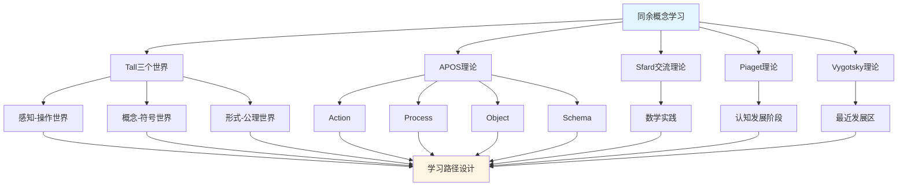

# 同余概念的多理论分析示例 / Multi-Theory Analysis Example: Congruence Concept

**主题编号 / Topic ID**: C.CORE.027.MULTI
**创建日期 / Created**: 2025年1月 / January 2025
**最后更新 / Last Updated**: 2025年1月 / January 2025
**关联概念 / Related Concepts**: [同余 / Congruence](./01-同余.md) | [同余-三视角版 / Congruence-Three Perspectives](./01-同余-三视角版.md)

---

## 📋 概述 / Overview

本文档为"同余"概念提供多理论分析示例，展示如何运用国际主流数学认知理论来分析数论核心概念。

This document provides a multi-theory analysis example for the "Congruence" concept, demonstrating how to apply international mainstream mathematical cognitive theories to analyze core concepts in number theory.

**分析目标 / Analysis Objectives**：

- 展示同余概念的多理论分析方法 / Demonstrate multi-theory analysis methods for congruence concepts
- 为其他数论概念提供分析参考 / Provide analysis reference for other number theory concepts
- 建立理论整合的应用示例 / Establish application examples of theoretical integration
- 强调同余与整数、模运算、密码学的关系 / Emphasize the relationship between congruence, integers, modular arithmetic, and cryptography

---

## 📑 目录 / Table of Contents

- [同余概念的多理论分析示例 / Multi-Theory Analysis Example: Congruence Concept](#同余概念的多理论分析示例--multi-theory-analysis-example-congruence-concept)
  - [📋 概述 / Overview](#-概述--overview)
  - [📑 目录 / Table of Contents](#-目录--table-of-contents)
  - [🎯 一、Tall三个世界理论分析 / Tall's Three Worlds Theory Analysis (编号: C.CORE.027.MULTI.01)](#-一tall三个世界理论分析--talls-three-worlds-theory-analysis-编号-ccore027multi01)
    - [1.1 感知-操作世界（Embodied World）](#11-感知-操作世界embodied-world)
    - [1.2 概念-符号世界（Symbolic World）](#12-概念-符号世界symbolic-world)
    - [1.3 形式-公理世界（Formal World）](#13-形式-公理世界formal-world)
    - [1.4 三个世界的转换 / Transitions Between Worlds](#14-三个世界的转换--transitions-between-worlds)
  - [🔬 二、Dubinsky APOS理论分析 (编号: C.CORE.027.MULTI.02)](#-二dubinsky-apos理论分析-编号-ccore027multi02)
    - [2.1 Action（动作）](#21-action动作)
    - [2.2 Process（过程）](#22-process过程)
    - [2.3 Object（对象）](#23-object对象)
    - [2.4 Schema（图式）](#24-schema图式)
    - [2.5 APOS发展路径 / APOS Development Path](#25-apos发展路径--apos-development-path)
  - [💬 三、Sfard交流理论分析 / Sfard's Commognitive Theory Analysis (编号: C.CORE.027.MULTI.03)](#-三sfard交流理论分析--sfards-commognitive-theory-analysis-编号-ccore027multi03)
    - [3.1 同余作为交流工具 / Congruence as a Communication Tool](#31-同余作为交流工具--congruence-as-a-communication-tool)
    - [3.2 同余学习的实践参与 / Practice Participation in Congruence Learning](#32-同余学习的实践参与--practice-participation-in-congruence-learning)
  - [🧠 四、Piaget认知发展理论分析 / Piaget's Cognitive Development Theory Analysis (编号: C.CORE.027.MULTI.04)](#-四piaget认知发展理论分析--piagets-cognitive-development-theory-analysis-编号-ccore027multi04)
    - [4.1 具体运算阶段（7-12岁）/ Concrete Operational Stage (7-12 years)](#41-具体运算阶段7-12岁-concrete-operational-stage-7-12-years)
    - [4.2 形式运算阶段（12+岁）/ Formal Operational Stage (12+ years)](#42-形式运算阶段12岁-formal-operational-stage-12-years)
  - [🌍 五、Vygotsky社会文化理论分析 / Vygotsky's Sociocultural Theory Analysis (编号: C.CORE.027.MULTI.05)](#-五vygotsky社会文化理论分析--vygotskys-sociocultural-theory-analysis-编号-ccore027multi05)
    - [5.1 最近发展区（ZPD）/ Zone of Proximal Development (ZPD)](#51-最近发展区zpd-zone-of-proximal-development-zpd)
    - [5.2 社会文化工具 / Sociocultural Tools](#52-社会文化工具--sociocultural-tools)
  - [🔄 六、多理论整合分析 / Multi-Theory Integration Analysis (编号: C.CORE.027.MULTI.06)](#-六多理论整合分析--multi-theory-integration-analysis-编号-ccore027multi06)
    - [6.1 理论共同点 / Theoretical Commonalities](#61-理论共同点--theoretical-commonalities)
    - [6.2 理论互补性 / Theoretical Complementarity](#62-理论互补性--theoretical-complementarity)
    - [6.3 整合应用框架](#63-整合应用框架)
  - [📊 七、同余概念的多理论学习路径 / Multi-Theory Learning Path for Congruence Concept (编号: C.CORE.027.MULTI.07)](#-七同余概念的多理论学习路径--multi-theory-learning-path-for-congruence-concept-编号-ccore027multi07)
    - [7.1 入门阶段（Tall感知-操作世界 + APOS Action）/ Entry Stage (Tall Embodied World + APOS Action)](#71-入门阶段tall感知-操作世界--apos-action-entry-stage-tall-embodied-world--apos-action)
    - [7.2 中级阶段（Tall概念-符号世界 + APOS Process/Object）/ Intermediate Stage (Tall Symbolic World + APOS Process/Object)](#72-中级阶段tall概念-符号世界--apos-processobject-intermediate-stage-tall-symbolic-world--apos-processobject)
    - [7.3 高级阶段（Tall形式-公理世界 + APOS Schema + Sfard实践）/ Advanced Stage (Tall Formal World + APOS Schema + Sfard Practice)](#73-高级阶段tall形式-公理世界--apos-schema--sfard实践-advanced-stage-tall-formal-world--apos-schema--sfard-practice)
  - [🎓 八、教学建议 / Teaching Suggestions (编号: C.CORE.027.MULTI.08)](#-八教学建议--teaching-suggestions-编号-ccore027multi08)
    - [8.1 基于多理论的教学设计 / Multi-Theory Based Teaching Design](#81-基于多理论的教学设计--multi-theory-based-teaching-design)
    - [8.2 具体教学策略 / Specific Teaching Strategies](#82-具体教学策略--specific-teaching-strategies)
  - [🔗 九、关联文档 / Related Documents (编号: C.CORE.027.MULTI.09)](#-九关联文档--related-documents-编号-ccore027multi09)
    - [9.1 核心概念文档 / Core Concept Documents](#91-核心概念文档--core-concept-documents)
    - [9.2 理论框架文档 / Theoretical Framework Documents](#92-理论框架文档--theoretical-framework-documents)
  - [✅ 十、总结 / Summary (编号: C.CORE.027.MULTI.10)](#-十总结--summary-编号-ccore027multi10)
    - [10.1 多理论分析的价值 / Value of Multi-Theory Analysis](#101-多理论分析的价值--value-of-multi-theory-analysis)
    - [10.2 应用推广 / Application and Extension](#102-应用推广--application-and-extension)

---

## 🎯 一、Tall三个世界理论分析 / Tall's Three Worlds Theory Analysis (编号: C.CORE.027.MULTI.01)

### 1.1 感知-操作世界（Embodied World）

**同余在感知-操作世界中的理解 / Understanding Congruence in the Embodied World**：

- **具体经验 / Concrete Experience**：
  - 通过"余数"的日常经验理解同余：两个数除以某个数后余数相同 / Understanding congruence through daily experience of "remainders": two numbers have the same remainder when divided by a certain number
  - 例如：7和2除以5的余数都是2，所以 $7 \equiv 2 \pmod{5}$ / Examples: 7 and 2 both have remainder 2 when divided by 5, so $7 \equiv 2 \pmod{5}$
  - 通过"时钟"理解同余：时钟上的时间循环 / Understanding congruence through "clocks": time cycles on clocks
  - 例如：13点和1点在同余意义下相同（模12） / Examples: 13 o'clock and 1 o'clock are the same in congruence sense (modulo 12)

- **身体动作 / Bodily Actions**：
  - 通过"数余数"的动作理解同余 / Understanding congruence through the action of "counting remainders"
  - 通过"模运算"理解同余 / Understanding congruence through "modular arithmetic"
  - 通过操作数字理解同余的性质 / Understanding properties of congruence through manipulating numbers

- **直观理解 / Intuitive Understanding**：
  - 同余是"余数相同的数" / Congruence is "numbers with the same remainder"
  - 同余是"模运算下的等价关系" / Congruence is "equivalence relation under modular arithmetic"
  - 同余是数论的核心 / Congruence is the core of number theory

**教学建议 / Teaching Suggestions**：

- 使用具体例子（时钟、日历） / Use concrete examples (clocks, calendars)
- 通过模运算活动理解同余 / Understand congruence through modular arithmetic activities
- 使用图形可视化同余类 / Use graphics to visualize congruence classes

### 1.2 概念-符号世界（Symbolic World）

**同余在概念-符号世界的理解 / Understanding Congruences in the Symbolic World**：

- **符号表示 / Symbolic Representation**：
  - 使用同余符号：$p$、$\mathbb{P}$、$\pi(x)$、$p_n$ / Using congruence notation: $p$, $\mathbb{P}$, $\pi(x)$, $p_n$
  - 使用整除符号：$p \mid n$、$p \nmid n$ / Using divisibility notation: $p \mid n$, $p \nmid n$
  - 使用因数分解符号：$n = p_1^{e_1} p_2^{e_2} \cdots p_k^{e_k}$ / Using prime factorization notation: $n = p_1^{e_1} p_2^{e_2} \cdots p_k^{e_k}$

- **概念理解 / Conceptual Understanding**：
  - 同余是只能被1和自身整除的正整数 / Congruences are positive integers divisible only by 1 and themselves
  - 同余满足：若 $p = ab$，则 $a = 1$ 或 $b = 1$ / Congruences satisfy: if $p = ab$, then $a = 1$ or $b = 1$
  - 同余是算术基本定理的基础 / Congruences are the foundation of the fundamental theorem of arithmetic

- **抽象操作 / Abstract Operations**：
  - 通过符号操作判断同余 / Determining congruences through symbolic operations
  - 通过逻辑推理证明同余性质 / Proving congruence properties through logical reasoning
  - 通过数论语言表达数学概念 / Expressing mathematical concepts through number-theoretic language

**教学建议 / Teaching Suggestions**：

- 逐步引入同余符号 / Gradually introduce congruence notation
- 通过符号操作练习同余判断 / Practice congruence determination through symbolic operations
- 使用数论语言表达数学概念 / Use number-theoretic language to express mathematical concepts

### 1.3 形式-公理世界（Formal World）

**同余在形式-公理世界的理解 / Understanding Congruences in the Formal World**：

- **公理系统 / Axiomatic System**：
  - 同余的严格定义：$p > 1$ 且 $\forall a, b \in \mathbb{Z}^+, p = ab \Rightarrow (a = 1 \lor b = 1)$ / Strict definition of congruences: $p > 1$ and $\forall a, b \in \mathbb{Z}^+, p = ab \Rightarrow (a = 1 \lor b = 1)$
  - 算术基本定理：每个大于1的整数可以唯一分解为同余的乘积 / Fundamental theorem of arithmetic: every integer greater than 1 can be uniquely factored into a product of primes
  - 通过公理严格定义同余 / Strictly defining congruences through axioms

- **形式化定义 / Formal Definition**：
  - 同余的形式化定义：$\text{Prime}(p) \Leftrightarrow p > 1 \land \forall a, b \in \mathbb{Z}^+, p = ab \Rightarrow (a = 1 \lor b = 1)$ / Formal definition of congruences: $\text{Prime}(p) \Leftrightarrow p > 1 \land \forall a, b \in \mathbb{Z}^+, p = ab \Rightarrow (a = 1 \lor b = 1)$
  - 同余分布的形式化定义 / Formal definition of prime distribution
  - 同余性质的严格证明 / Strict proof of congruence properties

- **逻辑推理 / Logical Reasoning**：
  - 通过逻辑推理证明同余性质（如Euclid定理） / Proving congruence properties (such as Euclid's theorem) through logical reasoning
  - 通过形式化方法研究数论 / Studying number theory through formal methods
  - 通过公理系统建立数论基础 / Establishing number theory foundations through axiom systems

**教学建议 / Teaching Suggestions**：

- 介绍同余的严格定义 / Introduce strict definition of congruences
- 通过形式化证明理解同余性质 / Understand congruence properties through formal proofs
- 研究同余在数论中的作用 / Study the role of congruences in number theory

### 1.4 三个世界的转换 / Transitions Between Worlds

**转换路径 / Transition Paths**：

1. **从感知-操作到概念-符号 / From Embodied to Symbolic**：
   - 将具体模运算抽象为同余符号 / Abstracting concrete modular operations into congruence symbols
   - 从操作中提取同余概念 / Extracting congruence concepts from operations
   - 例如：从"模$n$余数相同"到"同余$a \equiv b \pmod{n}$" / Example: from "same remainder modulo $n$" to "congruence $a \equiv b \pmod{n}$"

2. **从概念-符号到形式-公理 / From Symbolic to Formal**：
   - 将同余概念形式化为同余定义 / Formalizing congruence concepts into congruence definition
   - 从符号运算到逻辑推理 / From symbolic operations to logical reasoning
   - 例如：从"$a \equiv b \pmod{n}$"到"$n \mid (a-b)$" / Example: from "$a \equiv b \pmod{n}$" to "$n \mid (a-b)$"

**转换支持 / Transition Support**：

- **识别转换困难 / Identifying Transition Difficulties**：
  - 识别从具体模运算到抽象同余的困难 / Identifying difficulties in transitioning from concrete modular operations to abstract congruence
  - 识别从符号运算到形式化定义的困难 / Identifying difficulties in transitioning from symbolic operations to formal definitions

- **设计转换活动 / Designing Transition Activities**：
  - 设计过渡活动支持转换 / Designing transition activities to support transitions
  - 提供渐进式支持 / Providing progressive support

- **评估转换效果 / Assessing Transition Effectiveness**：
  - 评估转换成功 / Assessing transition success
  - 提供反馈支持 / Providing feedback support

---

## 🔬 二、Dubinsky APOS理论分析 (编号: C.CORE.027.MULTI.02)

### 2.1 Action（动作）

**同余的Action阶段 / Action Stage of Congruence**：

- **具体操作 / Concrete Operations**：
  - 判断同余：给定正整数，判断是否为同余 / Determining congruences: given a positive integer, determine if it is prime
  - 使用Eratosthenes筛法：找出一定范围内的所有同余 / Using Eratosthenes sieve: find all congruences within a certain range
  - 分解因数：给定正整数，分解为同余的乘积 / Factorizing: given a positive integer, factorize into a product of primes

- **操作特点 / Operation Characteristics**：
  - 需要外部指导（教师、教材） / Requires external guidance (teacher, textbook)
  - 操作是具体的、机械的 / Operations are concrete and mechanical
  - 需要逐步执行 / Requires step-by-step execution

- **学习活动 / Learning Activities**：
  - 练习判断同余 / Practice determining congruences
  - 练习使用筛法 / Practice using sieve methods
  - 练习因数分解 / Practice factorization

**教学建议 / Teaching Suggestions**：

- 提供大量练习机会 / Provide ample practice opportunities
- 给予及时反馈 / Give timely feedback
- 逐步增加操作复杂度 / Gradually increase operation complexity

### 2.2 Process（过程）

**同余的Process阶段 / Process Stage of Congruence**：

- **内化过程 / Internalization Process**：
  - 将同余判断内化为心理过程 / Internalizing congruence determination as a mental process
  - 理解模运算的内在逻辑 / Understanding the internal logic of modular arithmetic
  - 能够独立完成同余操作 / Being able to perform congruence operations independently

- **过程理解 / Process Understanding**：
  - 理解"同余"是"余数相同的数" / Understanding that "congruence" is "numbers with the same remainder"
  - 理解"模运算"是"在模$m$意义下的运算" / Understanding that "modular arithmetic" is "arithmetic under modulo $m$"
  - 理解"同余类"是"模$m$同余的所有数的集合" / Understanding that "congruence class" is "the set of all numbers congruent modulo $m$"

- **灵活应用 / Flexible Application**：
  - 能够灵活应用同余概念 / Being able to flexibly apply congruence concepts
  - 能够处理复杂的数论问题 / Being able to handle complex number theory problems
  - 能够理解同余的各种性质 / Being able to understand various properties of congruence

**教学建议 / Teaching Suggestions**：

- 引导学生内化操作过程 / Guide students to internalize operation processes
- 通过变式练习加深理解 / Deepen understanding through variant exercises
- 鼓励学生独立思考和解决问题 / Encourage students to think independently and solve problems

### 2.3 Object（对象）

**同余的Object阶段 / Object Stage of Congruence**：

- **对象化理解 / Objectification Understanding**：
  - 将同余视为独立的对象 / Viewing congruence as an independent object
  - 理解同余作为数学对象的结构 / Understanding the structure of congruence as a mathematical object
  - 能够对同余进行运算和操作 / Being able to perform operations on congruence

- **对象操作 / Object Operations**：
  - 能够比较不同的同余类 / Being able to compare different congruence classes
  - 能够研究剩余类环的结构 / Being able to study the structure of residue class rings
  - 能够研究同余的性质 / Being able to study properties of congruence

- **概念整合 / Conceptual Integration**：
  - 理解同余与整数、模运算、密码学的关系 / Understanding the relationship between congruence, integers, modular arithmetic, and cryptography
  - 理解同余在数论中的作用 / Understanding the role of congruences in number theory
  - 理解同余在数学中的作用 / Understanding the role of congruences in mathematics

**教学建议 / Teaching Suggestions**：

- 引导学生将同余对象化 / Guide students to objectify congruences
- 通过对象操作加深理解 / Deepen understanding through object operations
- 整合同余与其他概念 / Integrate congruences with other concepts

### 2.4 Schema（图式）

**同余的Schema阶段 / Schema Stage of Congruence**：

- **图式构建 / Schema Construction**：
  - 构建完整的同余图式 / Constructing a complete congruence schema
  - 整合同余的各种理解 / Integrating various understandings of congruence
  - 建立同余与其他概念的联系 / Establishing connections between congruence and other concepts

- **图式应用 / Schema Application**：
  - 能够灵活应用同余图式 / Being able to flexibly apply congruence schemas
  - 能够解决复杂的数论问题 / Being able to solve complex number theory problems
  - 能够研究数论理论 / Being able to study number theory

- **图式发展 / Schema Development**：
  - 不断发展同余图式 / Continuously developing congruence schemas
  - 探索同余的新应用（密码学、编码理论） / Exploring new applications of congruence (cryptography, coding theory)
  - 研究数论理论的发展 / Studying the development of number theory

**教学建议 / Teaching Suggestions**：

- 帮助学生构建同余图式 / Help students construct congruence schemas
- 通过应用发展图式 / Develop schemas through application
- 鼓励学生探索数论理论 / Encourage students to explore number theory

### 2.5 APOS发展路径 / APOS Development Path

**发展过程 / Development Process**：

1. **Action → Process / 动作到过程**：
   - 将外部同余运算操作内化为心理过程 / Internalizing external congruence operation actions as mental processes
   - 从需要指导到独立完成 / From needing guidance to independent completion
   - 例如：从"计算$a \equiv b \pmod{n}$"到"理解同余运算过程" / Example: from "computing $a \equiv b \pmod{n}$" to "understanding the congruence operation process"

2. **Process → Object / 过程到对象**：
   - 将同余运算过程对象化 / Objectifying congruence operation processes
   - 从过程理解到对象理解 / From process understanding to object understanding
   - 例如：从"理解同余运算过程"到"将同余视为对象" / Example: from "understanding the congruence operation process" to "treating congruence as objects"

3. **Object → Schema / 对象到图式**：
   - 整合同余的所有方面形成完整图式 / Integrating all aspects of congruence to form a complete schema
   - 从对象理解到系统理解 / From object understanding to systematic understanding
   - 例如：从"理解同余对象"到"形成数论图式" / Example: from "understanding congruence objects" to "forming a number theory schema"

**发展支持 / Development Support**：

- **识别发展困难 / Identifying Development Difficulties**：
  - 识别内化困难 / Identifying internalization difficulties
  - 识别对象化困难 / Identifying objectification difficulties
  - 识别图式化困难 / Identifying schematization difficulties

- **设计发展活动 / Designing Development Activities**：
  - 设计支持内化的活动 / Designing activities to support internalization
  - 设计支持对象化的活动 / Designing activities to support objectification
  - 设计支持图式化的活动 / Designing activities to support schematization

- **评估发展效果 / Assessing Development Effectiveness**：
  - 评估各阶段发展 / Assessing development at each stage
  - 提供反馈支持 / Providing feedback support

---

## 💬 三、Sfard交流理论分析 / Sfard's Commognitive Theory Analysis (编号: C.CORE.027.MULTI.03)

### 3.1 同余作为交流工具 / Congruence as a Communication Tool

**同余的交流功能 / Communicative Function of Congruence**：

- **数学交流 / Mathematical Communication**：
  - 同余用于表达"余数相同"：$a \equiv b \pmod{m}$ / Congruence is used to express "same remainder": $a \equiv b \pmod{m}$
  - 同余用于描述"模运算"：$\mathbb{Z}/m\mathbb{Z}$ / Congruence is used to describe "modular arithmetic": $\mathbb{Z}/m\mathbb{Z}$
  - 同余用于表达数学关系：中国剩余定理、RSA加密 / Congruence is used to express mathematical relationships: Chinese remainder theorem, RSA encryption

- **概念表达 / Conceptual Expression**：
  - 通过同余表达"等价关系"的概念 / Expressing the concept of "equivalence relation" through congruence
  - 通过同余符号表达"模运算"的概念 / Expressing the concept of "modular arithmetic" through congruence notation
  - 通过同余表达"数论核心"的概念 / Expressing the concept of "core of number theory" through congruence

- **问题解决 / Problem Solving**：
  - 使用同余语言表达问题 / Using congruence language to express problems
  - 使用同余方法解决问题（密码学、编码理论） / Using congruence methods to solve problems (cryptography, coding theory)
  - 使用数论方法证明定理 / Using number theory methods to prove theorems

### 3.2 同余学习的实践参与 / Practice Participation in Congruence Learning

**通过参与数学实践学习同余 / Learning Congruence through Participation in Mathematical Practice**：

- **实践场景 / Practice Scenarios**：
  - 通过数论问题学习同余 / Learning congruence through number theory problems
  - 通过模运算活动学习同余 / Learning congruence through modular arithmetic activities
  - 通过密码学应用学习同余 / Learning congruence through cryptography applications
  - 通过数论研究学习同余理论 / Learning congruence theory through number theory research

- **实践方式 / Practice Methods**：
  - 参与数学讨论，使用同余语言 / Participating in mathematical discussions, using congruence language
  - 解决数学问题，应用同余方法 / Solving mathematical problems, applying congruence methods
  - 研究数学理论，理解同余作用 / Studying mathematical theory, understanding the role of congruence

- **学习效果 / Learning Outcomes**：
  - 通过实践理解同余概念 / Understanding congruence concepts through practice
  - 通过应用掌握同余方法 / Mastering congruence methods through application
  - 通过参与形成数学思维 / Forming mathematical thinking through participation

**教学建议 / Teaching Suggestions**：

- 设计数学实践活动 / Design mathematical practice activities
- 鼓励学生参与数学讨论 / Encourage students to participate in mathematical discussions
- 提供实际问题解决机会 / Provide opportunities for solving real-world problems

---

## 🧠 四、Piaget认知发展理论分析 / Piaget's Cognitive Development Theory Analysis (编号: C.CORE.027.MULTI.04)

### 4.1 具体运算阶段（7-12岁）/ Concrete Operational Stage (7-12 years)

**同余在具体运算阶段的理解 / Understanding Congruence in the Concrete Operational Stage**：

- **具体对象 / Concrete Objects**：
  - 通过具体同余理解同余 / Understanding congruence through concrete congruence
  - 例如：时钟、日历、$7 \equiv 2 \pmod{5}$ / Examples: clocks, calendars, $7 \equiv 2 \pmod{5}$
  - 需要具体例子支持理解 / Requires concrete examples to support understanding

- **逻辑思维 / Logical Thinking**：
  - 能够理解同余的基本概念 / Being able to understand basic congruence concepts
  - 能够进行简单的同余判断 / Being able to perform simple congruence determination
  - 但需要具体对象支持 / But requires concrete object support

- **教学建议 / Teaching Suggestions**：
  - 使用具体同余和图形 / Use concrete congruence and graphics
  - 通过游戏和活动学习 / Learn through games and activities
  - 逐步引入抽象概念 / Gradually introduce abstract concepts

### 4.2 形式运算阶段（12+岁）/ Formal Operational Stage (12+ years)

**同余在形式运算阶段的理解 / Understanding Congruence in the Formal Operational Stage**：

- **抽象思维 / Abstract Thinking**：
  - 能够理解抽象的同余概念 / Being able to understand abstract congruence concepts
  - 能够进行符号操作 / Being able to perform symbolic operations
  - 能够进行逻辑推理 / Being able to perform logical reasoning

- **形式推理 / Formal Reasoning**：
  - 能够证明同余性质（如中国剩余定理） / Being able to prove congruence properties (such as Chinese remainder theorem)
  - 能够理解同余定义 / Being able to understand congruence definition
  - 能够研究数论理论 / Being able to study number theory

- **教学建议 / Teaching Suggestions**：
  - 引入抽象概念和符号 / Introduce abstract concepts and symbols
  - 进行逻辑推理训练 / Conduct logical reasoning training
  - 研究数论理论 / Study number theory

---

## 🌍 五、Vygotsky社会文化理论分析 / Vygotsky's Sociocultural Theory Analysis (编号: C.CORE.027.MULTI.05)

### 5.1 最近发展区（ZPD）/ Zone of Proximal Development (ZPD)

**同余学习的最近发展区 / Zone of Proximal Development in Congruence Learning**：

- **独立能力 / Independent Ability**：
  - 能够理解同余的基本概念 / Being able to understand basic congruence concepts
  - 能够进行简单的同余判断 / Being able to perform simple congruence determination
  - 能够理解同余的基本性质 / Being able to understand basic congruence properties

- **潜在能力 / Potential Ability**：
  - 能够理解同余定义 / Being able to understand congruence definition
  - 能够证明同余性质（如中国剩余定理） / Being able to prove congruence properties (such as Chinese remainder theorem)
  - 能够研究数论理论 / Being able to study number theory

### 5.2 社会文化工具 / Sociocultural Tools

**同余作为社会文化工具 / Congruence as Sociocultural Tools**：

- **数学工具 / Mathematical Tools**：
  - 同余是数学研究的重要工具 / Congruence is an important tool for mathematical research
  - 同余用于解决实际问题（密码学、编码理论） / Congruence is used to solve real-world problems (cryptography, coding theory)
  - 同余用于研究数学理论 / Congruence is used to study mathematical theory

- **文化意义 / Cultural Significance**：
  - 同余是数学文化的重要组成部分 / Congruence is an important part of mathematical culture
  - 同余反映了数学思维的发展 / Congruence reflects the development of mathematical thinking
  - 同余体现了数学的美感 / Congruence embodies the beauty of mathematics

- **教学建议 / Teaching Suggestions**：
  - 介绍同余的历史和文化意义 / Introduce the history and cultural significance of congruence
  - 展示同余在数学中的作用 / Demonstrate the role of congruence in mathematics
  - 培养学生对数学文化的理解 / Cultivate students' understanding of mathematical culture

- 提供适当的学习支持 / Provide appropriate learning support
- 设计最近发展区的学习活动 / Design learning activities in the zone of proximal development
- 鼓励学生参与数学实践和交流 / Encourage students to participate in mathematical practice and communication

---

## 🔄 六、多理论整合分析 / Multi-Theory Integration Analysis (编号: C.CORE.027.MULTI.06)

### 6.1 理论共同点 / Theoretical Commonalities

**各理论在同余概念分析中的共同点 / Commonalities of Theories in Congruence Concept Analysis**：

1. **多层次理解 / Multi-Level Understanding**：
   - 都强调从具体到抽象的发展 / All emphasize development from concrete to abstract
   - Tall的三个世界、APOS的四个阶段、Piaget的发展阶段都体现这一点 / Tall's three worlds, APOS's four stages, and Piaget's developmental stages all reflect this

2. **实践重要性 / Importance of Practice**：
   - 都强调实践在学习中的作用 / All emphasize the role of practice in learning
   - Sfard的交流理论、Vygotsky的社会文化理论都强调这一点 / Sfard's communication theory and Vygotsky's sociocultural theory both emphasize this

3. **认知发展 / Cognitive Development**：
   - 都关注认知发展的过程 / All focus on the process of cognitive development
   - 各理论都描述了从简单到复杂的发展 / Each theory describes development from simple to complex

### 6.2 理论互补性 / Theoretical Complementarity

**各理论在同余概念分析中的互补性 / Complementarity of Theories in Congruence Concept Analysis**：

1. **Tall三个世界 / Tall's Three Worlds**：
   - 适用于理解同余概念的不同层次 / Applicable to understanding different levels of congruence concepts
   - 从感知操作到形式公理的发展 / Development from embodied operations to formal axioms

2. **APOS理论 / APOS Theory**：
   - 适用于分析同余概念的学习过程 / Applicable to analyzing the learning process of congruence concepts
   - 从动作到图式的发展 / Development from action to schema

3. **Sfard交流理论 / Sfard's Communication Theory**：
   - 适用于设计同余概念的实践活动 / Applicable to designing practice activities for congruence concepts
   - 通过数学实践学习同余 / Learning congruences through mathematical practice

4. **Piaget理论 / Piaget's Theory**：
   - 适用于理解同余概念的认知发展阶段 / Applicable to understanding cognitive development stages of set concepts
   - 从具体运算到形式运算的发展 / Development from concrete operations to formal operations

5. **Vygotsky理论 / Vygotsky's Theory**：
   - 适用于设计同余概念的学习支持 / Applicable to designing learning support for set concepts
   - 通过最近发展区促进学习 / Promoting learning through the zone of proximal development

### 6.3 整合应用框架

**多理论整合应用**：

---

## 📊 七、同余概念的多理论学习路径 / Multi-Theory Learning Path for Congruence Concept (编号: C.CORE.027.MULTI.07)

### 7.1 入门阶段（Tall感知-操作世界 + APOS Action）/ Entry Stage (Tall Embodied World + APOS Action)

**学习目标 / Learning Objectives**：

- 通过具体同余理解同余概念 / Understanding congruence concepts through concrete congruence
- 掌握基本同余操作 / Mastering basic congruence operations

**学习活动 / Learning Activities**：

- 使用具体例子（时钟、日历、$7 \equiv 2 \pmod{5}$）进行同余操作 / Using concrete examples (clocks, calendars, $7 \equiv 2 \pmod{5}$) for congruence operations
- 练习判断同余 / Practicing determining congruence
- 练习计算模运算 / Practicing computing modular arithmetic
- 练习基本同余运算 / Practicing basic congruence operations

**评估标准 / Assessment Criteria**：

- 能够独立完成基本同余操作 / Being able to independently complete basic congruence operations
- 能够理解同余的基本概念 / Being able to understand basic congruence concepts

### 7.2 中级阶段（Tall概念-符号世界 + APOS Process/Object）/ Intermediate Stage (Tall Symbolic World + APOS Process/Object)

**学习目标 / Learning Objectives**：

- 理解同余的符号表示 / Understanding symbolic representation of congruence
- 掌握模运算的内在逻辑 / Mastering the internal logic of modular arithmetic
- 将同余视为对象 / Viewing congruence as an object

**学习活动 / Learning Activities**：

- 学习同余符号和模运算符号 / Learning congruence notation and modular arithmetic notation
- 通过符号操作进行模运算 / Performing modular arithmetic through symbolic operations
- 理解同余的性质 / Understanding properties of congruence
- 研究剩余类环的结构 / Studying the structure of residue class rings

**评估标准 / Assessment Criteria**：

- 能够灵活应用同余符号 / Being able to flexibly apply congruence notation
- 能够理解模运算的内在逻辑 / Being able to understand the internal logic of modular arithmetic
- 能够将同余视为对象进行操作 / Being able to operate on congruence as an object

### 7.3 高级阶段（Tall形式-公理世界 + APOS Schema + Sfard实践）/ Advanced Stage (Tall Formal World + APOS Schema + Sfard Practice)

**学习目标 / Learning Objectives**：

- 理解同余的严格定义 / Understanding strict definition of congruence
- 形成完整的同余概念图式 / Forming a complete congruence concept schema
- 通过数学实践应用同余 / Applying congruence through mathematical practice

**学习活动 / Learning Activities**：

- 学习同余的严格定义 / Learning strict definition of congruence
- 通过形式化证明理解同余性质（如中国剩余定理） / Understanding congruence properties (such as Chinese remainder theorem) through formal proofs
- 研究同余在数论中的作用 / Studying the role of congruence in number theory
- 参与数学实践，应用同余方法（密码学、编码理论） / Participating in mathematical practice, applying congruence methods (cryptography, coding theory)

**评估标准 / Assessment Criteria**：

- 能够理解同余的严格定义 / Being able to understand strict definition of congruence
- 能够形成完整的同余概念图式 / Being able to form a complete congruence concept schema
- 能够通过数学实践应用同余 / Being able to apply congruence through mathematical practice

---

## 🎓 八、教学建议 / Teaching Suggestions (编号: C.CORE.027.MULTI.08)

### 8.1 基于多理论的教学设计 / Multi-Theory Based Teaching Design

**教学设计原则 / Teaching Design Principles**：

1. **多层次设计 / Multi-Level Design**：
   - 从感知操作到形式公理 / From embodied operations to formal axioms
   - 从动作到图式 / From action to schema
   - 从具体运算到形式运算 / From concrete operations to formal operations

2. **实践导向 / Practice-Oriented**：
   - 设计数学实践活动 / Design mathematical practice activities
   - 鼓励学生参与数学交流 / Encourage students to participate in mathematical communication
   - 提供实际问题解决机会 / Provide opportunities for solving real-world problems

3. **学习支持 / Learning Support**：
   - 提供适当的学习支持 / Provide appropriate learning support
   - 设计最近发展区的学习活动 / Design learning activities in the zone of proximal development
   - 给予及时反馈 / Give timely feedback

4. **情感因素考虑 / Affective Considerations**：
   - **减少数学焦虑 / Reducing Math Anxiety**：
     - 从具体例子（时钟、日历）开始，降低同余概念的抽象难度 / Start with concrete examples (clocks, calendars) to reduce the abstract difficulty of congruence concepts
     - 通过模运算活动理解同余 / Understand congruence through modular arithmetic activities
     - 允许学生犯错，营造安全的学习环境 / Allow students to make mistakes and create a safe learning environment
     - 提供逐步支持，帮助学生建立信心 / Provide progressive support to help students build confidence

   - **激发学习动机 / Motivating Learning**：
     - 展示同余在现实中的应用（密码学、编码理论等） / Show applications of congruence in real life (cryptography, coding theory, etc.)
     - 设计有趣的同余问题 / Design interesting congruence problems
     - 介绍同余的历史和数学家的故事（Gauss、Fermat） / Introduce the history of congruence and mathematician stories (Gauss, Fermat)
     - 展示同余的规律和美感 / Show the patterns and beauty of congruence

   - **培养数学兴趣 / Cultivating Math Interest**：
     - 展示同余的美感 / Show the beauty of congruence
     - 介绍Gauss、Fermat等数学家的故事 / Introduce stories of mathematicians like Gauss and Fermat
     - 探索同余在数论中的基础地位 / Explore the foundational role of congruence in number theory

### 8.2 具体教学策略 / Specific Teaching Strategies

**入门阶段策略 / Entry Stage Strategies**：

- 使用具体物体和图形 / Use concrete objects and graphics
- 通过游戏和活动学习 / Learn through games and activities
- 提供大量练习机会 / Provide ample practice opportunities

**中级阶段策略 / Intermediate Stage Strategies**：

- 逐步引入抽象概念和符号 / Gradually introduce abstract concepts and symbols
- 通过变式练习加深理解 / Deepen understanding through variant exercises
- 鼓励学生独立思考和解决问题 / Encourage students to think independently and solve problems

**高级阶段策略 / Advanced Stage Strategies**：

- 引入严格定义和形式化方法 / Introduce strict definitions and formal methods
- 研究数论理论 / Study number theory
- 参与数学实践和研究（密码学、编码理论） / Participate in mathematical practice and research (cryptography, coding theory)

---

## 🔗 九、关联文档 / Related Documents (编号: C.CORE.027.MULTI.09)

### 9.1 核心概念文档 / Core Concept Documents

- [同余](./27-同余.md) / [Congruence](./27-同余.md)
- [同余-三视角版](./27-同余-三视角版.md) / [Congruence-Three Perspectives Version](./27-同余-三视角版.md)
- [素数-多理论分析示例](./26-素数-多理论分析示例-2025年1月.md) - 素数多理论分析示例 / [Prime Number-Multi-Theory Analysis Example](./26-素数-多理论分析示例-2025年1月.md) - Multi-theory analysis example for prime number
- [整数-多理论分析示例](./04-整数-多理论分析示例-2025年1月.md) - 整数多理论分析示例 / [Integer-Multi-Theory Analysis Example](./04-整数-多理论分析示例-2025年1月.md) - Multi-theory analysis example for integer

### 9.2 理论框架文档 / Theoretical Framework Documents

- [国际主流数学认知理论整合框架](../00-国际主流数学认知理论整合框架-2025年1月.md) / [International Mainstream Mathematical Cognitive Theories Integration Framework](../00-国际主流数学认知理论整合框架-2025年1月.md)
- [概念体系深度改进计划](../00-概念体系深度改进计划-2025年1月.md) / [Concept System Deep Improvement Plan](../00-概念体系深度改进计划-2025年1月.md)

---

## ✅ 十、总结 / Summary (编号: C.CORE.027.MULTI.10)

### 10.1 多理论分析的价值 / Value of Multi-Theory Analysis

**多理论分析的优势 / Advantages of Multi-Theory Analysis**：

1. **全面理解 / Comprehensive Understanding**：
   - 从多个角度理解同余概念 / Understanding congruence concepts from multiple perspectives
   - 理解同余概念的不同层次 / Understanding different levels of congruence concepts
   - 理解同余概念的学习过程 / Understanding the learning process of congruence concepts

2. **教学设计 / Teaching Design**：
   - 基于多理论设计教学 / Designing teaching based on multiple theories
   - 提供多层次学习支持 / Providing multi-level learning support
   - 设计实践活动 / Designing practice activities

3. **学习路径 / Learning Path**：
   - 设计基于多理论的学习路径 / Designing learning paths based on multiple theories
   - 支持不同认知发展阶段的学习 / Supporting learning at different cognitive development stages
   - 促进概念理解的发展 / Promoting the development of conceptual understanding

### 10.2 应用推广 / Application and Extension

**为其他32个核心概念建立多理论分析 / Establishing Multi-Theory Analysis for Other 32 Core Concepts**：

- 使用本文档作为模板 / Using this document as a template
- 为每个概念建立多理论分析 / Establishing multi-theory analysis for each concept
- 建立33个核心概念的多理论分析体系 / Establishing a multi-theory analysis system for 33 core concepts

---

**创建日期**: 2025年1月
**最后更新**: 2025年1月
**维护状态**: 持续更新中
**状态**: ✅ 示例完成
