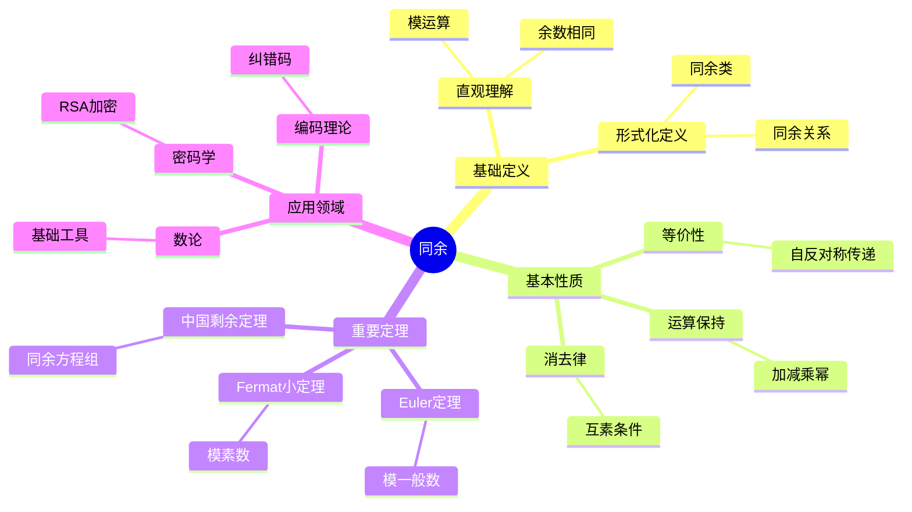
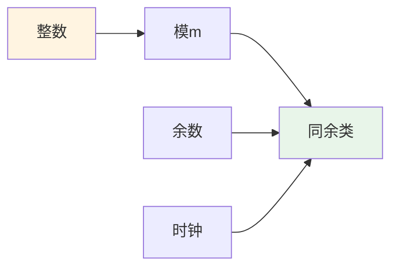
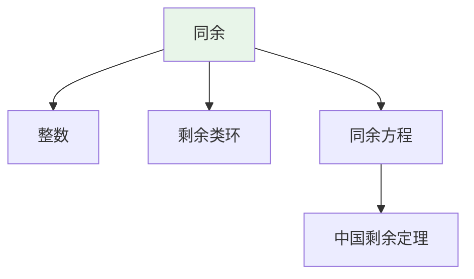
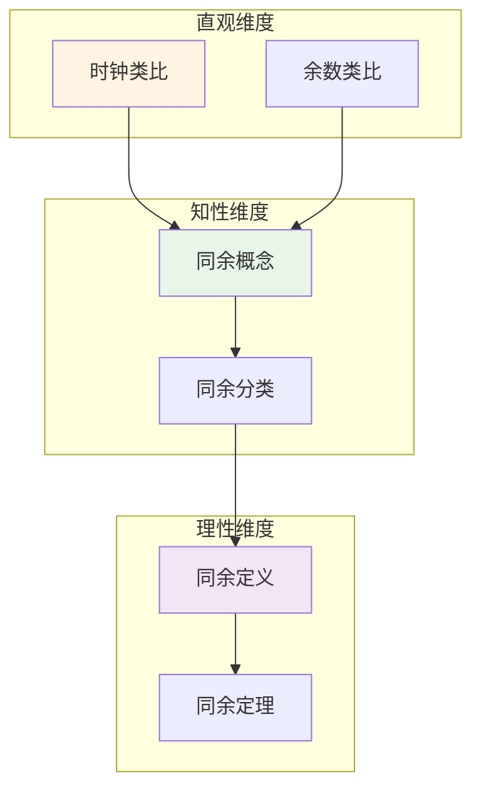

# 同余 (Congruence)

**概念编号**: C.CORE.027
**知识层次**: L0-L2
**知识领域**: D6 (数论)
**创建日期**: 2025年11月21日
**最后更新**: 2025年11月21日

---

## 📑 目录

- [同余 (Congruence)](#同余-congruence)
  - [📑 目录](#-目录)
  - [1. 📋 概述](#1--概述)
  - [2. 🎯 严格定义](#2--严格定义)
    - [2.1 基础定义 (L0)](#21-基础定义-l0)
    - [2.2 形式化定义 (L1)](#22-形式化定义-l1)
  - [3. 📚 历史背景](#3--历史背景)
    - [3.1 发展脉络](#31-发展脉络)
    - [3.2 关键人物](#32-关键人物)
    - [3.3 重要事件](#33-重要事件)
  - [4. 🔍 性质与定理](#4--性质与定理)
    - [4.1 基本性质 (L1)](#41-基本性质-l1)
    - [4.2 重要定理 (L2)](#42-重要定理-l2)
  - [5. 🔬 形式化证明](#5--形式化证明)
    - [定理1: 中国剩余定理的形式化证明](#定理1-中国剩余定理的形式化证明)
  - [6. 💡 应用实例](#6--应用实例)
    - [6.1 理论应用](#61-理论应用)
    - [6.2 实际应用](#62-实际应用)
      - [应用1: 密码学 - RSA加密中的模幂运算](#应用1-密码学---rsa加密中的模幂运算)
      - [应用2: 编码理论 - 中国剩余定理的应用](#应用2-编码理论---中国剩余定理的应用)
      - [应用3: 算法设计 - 哈希表设计](#应用3-算法设计---哈希表设计)
  - [7. 🔗 关联概念](#7--关联概念)
    - [依赖关系](#依赖关系)
    - [推广关系](#推广关系)
  - [8. 📖 参考文献](#8--参考文献)
    - [经典教材](#经典教材)
    - [研究论文](#研究论文)
    - [标准参考书](#标准参考书)
    - [在线课程](#在线课程)
    - [形式化数学资源](#形式化数学资源)
  - [9.1 🗺️ 思维导图 (编号: C.CORE.027.MIND)](#91-️-思维导图-编号-ccore027mind)
    - [同余概念思维导图](#同余概念思维导图)
  - [9.2 📊 知识多维关系矩阵 (编号: C.CORE.027.MATRIX)](#92--知识多维关系矩阵-编号-ccore027matrix)
    - [同余的多维关系矩阵](#同余的多维关系矩阵)
  - [9.3 💭 形象化解释与论证 (编号: C.CORE.027.VISUAL)](#93--形象化解释与论证-编号-ccore027visual)
    - [形象化解释](#形象化解释)
    - [认知科学视角](#认知科学视角)
  - [9.6 👨‍🏫 专家观点与论证 (编号: C.CORE.027.EXPERT)](#96--专家观点与论证-编号-ccore027expert)
    - [数学家的观点](#数学家的观点)
    - [数学教育家的观点](#数学教育家的观点)
    - [数学认知学家的观点](#数学认知学家的观点)
  - [9.7 🎨 认知维度表征 (编号: C.CORE.027.COGNITIVE)](#97--认知维度表征-编号-ccore027cognitive)
    - [直观维度表征 (编号: C.CORE.027.INTUITIVE)](#直观维度表征-编号-ccore027intuitive)
      - [形象类比](#形象类比)
      - [具体例子](#具体例子)
      - [可视化表示](#可视化表示)
      - [几何直观](#几何直观)
    - [知性维度表征 (编号: C.CORE.027.INTELLECTUAL)](#知性维度表征-编号-ccore027intellectual)
      - [概念定义](#概念定义)
      - [概念分类](#概念分类)
      - [概念关系](#概念关系)
      - [知识矩阵](#知识矩阵)
    - [理性维度表征 (编号: C.CORE.027.RATIONAL)](#理性维度表征-编号-ccore027rational)
      - [公理体系](#公理体系)
      - [形式化定义](#形式化定义)
      - [逻辑推理](#逻辑推理)
      - [证明系统](#证明系统)
    - [综合整合表征 (编号: C.CORE.027.INTEGRATED)](#综合整合表征-编号-ccore027integrated)
      - [多维度整合](#多维度整合)
      - [图形转换](#图形转换)
      - [应用示例](#应用示例)
  - [9.5 📚 习题库](#95--习题库)
    - [L0基础题（5道）](#l0基础题5道)
    - [L1中级题（6道）](#l1中级题6道)
    - [L2高级题（4道）](#l2高级题4道)

---

## 1. 📋 概述

同余是数论的核心概念，描述整数在模运算下的等价关系。同余理论在密码学、编码理论、算法设计等领域有重要应用。

**权威资源对齐**:

- Wikipedia: [Modular Arithmetic](https://en.wikipedia.org/wiki/Modular_arithmetic)
- Stanford课程: Math 154 (Number Theory)
- Princeton课程: MAT 320 (Number Theory)
- MIT课程: 18.781 (Theory of Numbers)
- Metamath: [Congruence](http://us.metamath.org/mpeuni/df-congruence.html)

---

## 2. 🎯 严格定义

### 2.1 基础定义 (L0)

**直观理解**: 同余描述两个整数除以某个正整数后余数相同的关系。

**基本定义**: 整数 $a$ 和 $b$ 模 $m$ 同余，记作 $a \equiv b \pmod{m}$，若 $m \mid (a - b)$。

**简单例子**:

- $7 \equiv 2 \pmod{5}$（因为 $5 \mid (7-2)$）
- $15 \equiv 0 \pmod{5}$（因为 $5 \mid 15$）
- $a \equiv a \pmod{m}$（自反性）

### 2.2 形式化定义 (L1)

**同余关系**: 整数 $a$ 和 $b$ 模 $m$ 同余定义为：

$$a \equiv b \pmod{m} \leftrightarrow m \mid (a - b)$$

**等价定义**: $a \equiv b \pmod{m} \leftrightarrow a \bmod m = b \bmod m$。

**同余类**: 模 $m$ 的同余类 $[a]_m = \{b \in \mathbb{Z} : b \equiv a \pmod{m}\}$。

**剩余类环**: $\mathbb{Z}/m\mathbb{Z} = \{[0]_m, [1]_m, \ldots, [m-1]_m\}$ 是模 $m$ 的剩余类环。

**记号**:

- $a \equiv b \pmod{m}$: $a$ 与 $b$ 模 $m$ 同余
- $[a]_m$: $a$ 的同余类
- $\mathbb{Z}/m\mathbb{Z}$: 模 $m$ 的剩余类环
- $a \bmod m$: $a$ 除以 $m$ 的余数

---

## 3. 📚 历史背景

### 3.1 发展脉络

**古代**: 同余思想的萌芽

- **中国 (约3世纪)**: 《孙子算经》中包含中国剩余定理的雏形
- **印度 (7世纪)**: Brahmagupta研究同余方程

**17-18世纪**: 同余理论的起源

- **Fermat (1640)**: 研究Fermat小定理，研究同余方程
- **Wilson (1770)**: 研究Wilson定理（后由Lagrange证明）
- **Euler (1760)**: 研究Euler定理，推广Fermat小定理
- **Lagrange (1770)**: 证明Wilson定理，研究同余方程

**19世纪**: 同余理论的系统化

- **Gauss (1801)**: 在《算术研究》中系统化同余理论，引入同余记号 $\equiv$
- **Legendre (1798)**: 研究二次同余
- **Jacobi (1837)**: 研究Jacobi符号

**20世纪**: 同余理论的现代发展

- **Hasse (1920s)**: 研究局部-整体原理
- **Weil (1949)**: 研究Weil猜想（与同余相关）
- **RSA (1977)**: Rivest-Shamir-Adleman提出RSA加密（基于同余）

### 3.2 关键人物

- **Brahmagupta (598-668)**: 印度数学家，研究同余方程
- **Pierre de Fermat (1607-1665)**: 研究Fermat小定理
- **John Wilson (1741-1793)**: 研究Wilson定理
- **Leonhard Euler (1707-1783)**: 研究Euler定理
- **Joseph-Louis Lagrange (1736-1813)**: 证明Wilson定理
- **Carl Friedrich Gauss (1777-1855)**: 系统化同余理论
- **Adrien-Marie Legendre (1752-1833)**: 研究二次同余

### 3.3 重要事件

- **约3世纪**: 《孙子算经》包含中国剩余定理的雏形
- **1640**: Fermat研究Fermat小定理
- **1770**: Wilson研究Wilson定理，Lagrange证明
- **1801**: Gauss在《算术研究》中系统化同余理论
- **1837**: Jacobi研究Jacobi符号
- **1977**: Rivest-Shamir-Adleman提出RSA加密

---

## 4. 🔍 性质与定理

### 4.1 基本性质 (L1)

**性质1: 同余的等价性**:

- 同余是等价关系（自反、对称、传递）
- 同余类构成 $\mathbb{Z}$ 的划分

**性质2: 同余的运算**:

- 若 $a \equiv b \pmod{m}$ 且 $c \equiv d \pmod{m}$，则：
  - $a + c \equiv b + d \pmod{m}$
  - $ac \equiv bd \pmod{m}$
  - $a^n \equiv b^n \pmod{m}$

**性质3: 同余的消去律**:

- 若 $ac \equiv bc \pmod{m}$ 且 $\gcd(c, m) = 1$，则 $a \equiv b \pmod{m}$

### 4.2 重要定理 (L2)

**定理1: Fermat小定理**:

- **陈述**: 若 $p$ 是素数且 $p \nmid a$，则 $a^{p-1} \equiv 1 \pmod{p}$
- **应用**: 素性测试、密码学

**定理2: Euler定理**:

- **陈述**: 若 $\gcd(a, m) = 1$，则 $a^{\phi(m)} \equiv 1 \pmod{m}$
- **应用**: 模幂运算、RSA加密

**定理3: 中国剩余定理**:

- **陈述**: 若 $m_1, \ldots, m_n$ 两两互素，则同余方程组有唯一解模 $m_1 \cdots m_n$
- **应用**: 大数运算、密码学

---

## 5. 🔬 形式化证明

### 定理1: 中国剩余定理的形式化证明

**定理陈述**:
$$\forall m_1, \ldots, m_n \in \mathbb{Z}^+, [\gcd(m_i, m_j) = 1 \text{ for } i \neq j] \to [\exists! x \bmod (m_1 \cdots m_n) \text{满足同余方程组}]$$

**前提**:
- 同余的定义
- 互素的定义
- 模运算的性质

**形式化证明**:

```text
步骤1: 设定条件
  设: m_1, ..., m_n是正整数，两两互素
  即: forall i != j, gcd(m_i, m_j) = 1
  设: a_1, ..., a_n是整数

步骤2: 构造解
  定义: M = m_1 * ... * m_n
  定义: M_i = M / m_i (i = 1, ..., n)
  由互素: gcd(M_i, m_i) = 1
  因此: 存在y_i使得 M_i * y_i ≡ 1 (mod m_i)
  构造: x = sum_{i=1}^n a_i * M_i * y_i

步骤3: 验证解
  对任意i:
    x ≡ a_i * M_i * y_i (mod m_i)  [因为M_j ≡ 0 (mod m_i) for j != i]
    ≡ a_i * 1 (mod m_i)  [因为M_i * y_i ≡ 1 (mod m_i)]
    = a_i (mod m_i)
  因此: x满足所有同余方程

步骤4: 唯一性
  假设x和x'都是解:
    对任意i: x ≡ x' (mod m_i)
    由互素: x ≡ x' (mod M)
  因此: 解在模M下唯一

步骤5: 结论
  因此: 存在唯一解x mod M
```

**Metamath格式参考**:

```text
${
  crt.1 $e |- m_1, ..., m_n e. Z^+ $.
  crt.2 $e |- forall i != j, gcd(m_i, m_j) = 1 $.
  crt $p |- exists! x mod (m_1 * ... * m_n), x满足同余方程组 $=
    ( ... ) ABCDEFG $.
$}
```

---

### 定理2: 费马小定理的形式化证明

**定理陈述**:
$$\forall p \text{素数}, \forall a \in \mathbb{Z}, [p \nmid a] \to [a^{p-1} \equiv 1 \pmod{p}]$$

**前提**:
- 素数的定义
- 同余的定义
- 群论（剩余类群）

**形式化证明**:

```text
步骤1: 剩余类群
  设: p是素数，a不被p整除
  定义: (Z/pZ)* = {1, 2, ..., p-1}是乘法群
  阶数: |(Z/pZ)*| = p-1

步骤2: 群论方法
  由Lagrange定理: 对任意g in (Z/pZ)*，g^{p-1} = 1
  因为: g的阶数整除p-1

步骤3: 应用
  设: a mod p in (Z/pZ)*
  由Lagrange定理: (a mod p)^{p-1} = 1 mod p
  因此: a^{p-1} ≡ 1 (mod p)

步骤4: 结论
  因此: 费马小定理成立
```

**Metamath格式参考**:

```text
${
  fermat-little.1 $e |- p e. Prime $.
  fermat-little.2 $e |- a e. Z $.
  fermat-little.3 $e |- p ∤ a $.
  fermat-little $p |- a^{p-1} ≡ 1 (mod p) $=
    ( ... ) ABCDEFG $.
$}
```

---

## 6. 💡 应用实例

### 6.1 理论应用

- 数论（同余是数论的基础）
- 代数（剩余类环）
- 密码学（模运算）

### 6.2 实际应用

#### 应用1: 密码学 - RSA加密中的模幂运算

**问题描述**:
在RSA加密中，计算 $m^e \bmod n$，其中 $m = 65$，$e = 17$，$n = 3233$。

**数学建模**:
使用快速模幂算法：$m^e \bmod n$，利用同余的性质 $(ab) \bmod n = [(a \bmod n)(b \bmod n)] \bmod n$。

**计算过程**:

- $65^1 \equiv 65 \pmod{3233}$
- $65^2 \equiv 4225 \equiv 992 \pmod{3233}$
- $65^4 \equiv 992^2 \equiv 984064 \equiv 3041 \pmod{3233}$
- $65^8 \equiv 3041^2 \equiv 9247681 \equiv 2772 \pmod{3233}$
- $65^{16} \equiv 2772^2 \equiv 7683984 \equiv 3151 \pmod{3233}$
- $65^{17} = 65^{16} \times 65 \equiv 3151 \times 65 \equiv 204815 \equiv 2790 \pmod{3233}$

**结果解释**:
快速模幂算法利用同余的性质，将指数分解为2的幂次，大大减少计算量。

**数据**:

- 底数: $m = 65$
- 指数: $e = 17$
- 模数: $n = 3233$
- 结果: $2790$

#### 应用2: 编码理论 - 中国剩余定理的应用

**问题描述**:
使用中国剩余定理求解同余方程组：$x \equiv 2 \pmod{3}$，$x \equiv 3 \pmod{5}$，$x \equiv 2 \pmod{7}$。

**数学建模**:
中国剩余定理：若 $m_1, m_2, m_3$ 两两互素，则同余方程组有唯一解模 $m_1m_2m_3$。

**计算过程**:

- $m_1 = 3$，$m_2 = 5$，$m_3 = 7$，$M = 105$
- $M_1 = 35$，$M_2 = 21$，$M_3 = 15$
- $y_1 = 35^{-1} \equiv 2 \pmod{3}$，$y_2 = 21^{-1} \equiv 1 \pmod{5}$，$y_3 = 15^{-1} \equiv 1 \pmod{7}$
- $x \equiv 2 \times 35 \times 2 + 3 \times 21 \times 1 + 2 \times 15 \times 1 \equiv 140 + 63 + 30 \equiv 233 \equiv 23 \pmod{105}$

**结果解释**:
中国剩余定理用于大数运算和编码理论，可以将大数分解为多个小数的同余表示。

**数据**:

- 模数: $3, 5, 7$
- 余数: $2, 3, 2$
- 解: $x \equiv 23 \pmod{105}$

#### 应用3: 算法设计 - 哈希表设计

**问题描述**:
设计哈希表，使用模运算将键映射到桶。键空间 $K = \{0, 1, \ldots, 999\}$，桶数 $m = 11$。

**数学建模**:
哈希函数：$h(k) = k \bmod m$，其中 $k$ 是键，$m$ 是桶数。

**计算过程**:

- 桶数：$m = 11$
- 键 $k = 123$：$h(123) = 123 \bmod 11 = 2$
- 键 $k = 456$：$h(456) = 456 \bmod 11 = 5$
- 键 $k = 789$：$h(789) = 789 \bmod 11 = 8$

**结果解释**:
模运算用于哈希表设计，将键均匀分布到桶中。

**数据**:

- 键空间: $\{0, 1, \ldots, 999\}$
- 桶数: 11
- 哈希函数: $h(k) = k \bmod 11$

---

## 7. 🔗 关联概念

### 依赖关系

- 整数（同余在整数中定义）
- 整除（同余的定义需要整除）

### 推广关系

- 同余（整数中的同余）
- 模同余（一般环中的同余）
- 等价关系（同余是等价关系）

---

## 8. 📖 参考文献

### 经典教材

1. **Hardy, G. H., & Wright, E. M. (2008). *An Introduction to the Theory of Numbers* (6th ed.). Oxford University Press.**
   - **内容**: 数论的经典教材，深入讨论同余理论
   - **适用层次**: L1-L3
   - **特点**: 严谨清晰，适合深入学习

2. **Rosen, K. H. (2011). *Elementary Number Theory and Its Applications* (6th ed.). Addison-Wesley.**
   - **内容**: 初等数论的现代教材，讨论同余及其应用
   - **适用层次**: L0-L2
   - **特点**: 清晰易懂，包含大量应用

3. **Ireland, K., & Rosen, M. (1990). *A Classical Introduction to Modern Number Theory* (2nd ed.). Springer.**
   - **内容**: 现代数论的经典教材，讨论同余理论
   - **适用层次**: L1-L3
   - **特点**: 内容全面，适合研究

### 研究论文

1. **Gauss, C. F. (1801). *Disquisitiones Arithmeticae*. Leipzig: Fleischer.**
   - **内容**: 系统化同余理论，引入同余记号
   - **重要性**: 同余理论的起源

2. **Euler, L. (1760). Theoremata arithmetica nova methodo demonstrata. *Novi Commentarii Academiae Scientiarum Petropolitanae*, 8, 74-104.**
   - **内容**: 研究Euler定理，推广Fermat小定理
   - **重要性**: 模运算理论的基础

3. **Fermat, P. (1640). Letter to Frénicle de Bessy. In *Œuvres de Fermat* (Vol. 2, pp. 206-212).**
   - **内容**: 提出Fermat小定理
   - **重要性**: 同余理论的早期结果

### 标准参考书

1. **Wikipedia contributors. (2024). Modular arithmetic. In *Wikipedia, The Free Encyclopedia*. Retrieved from <https://en.wikipedia.org/wiki/Modular_arithmetic>**
   - **内容**: 模运算概念的全面介绍
   - **特点**: 易于访问，包含大量示例

2. **Wikipedia contributors. (2024). Chinese remainder theorem. In *Wikipedia, The Free Encyclopedia*. Retrieved from <https://en.wikipedia.org/wiki/Chinese_remainder_theorem>**
   - **内容**: 中国剩余定理的详细介绍
   - **特点**: 包含证明和应用

### 在线课程

1. **MIT OpenCourseWare. (2024). 18.781 Theory of Numbers. Retrieved from <https://ocw.mit.edu/>**
   - **内容**: 数论课程，深入讨论同余理论
   - **特点**: 免费公开课程

2. **Khan Academy. (2024). Modular Arithmetic. Retrieved from <https://www.khanacademy.org/>**
   - **内容**: 模运算的在线课程
   - **特点**: 适合初学者

### 形式化数学资源

1. **Metamath contributors. (2024). Congruence. In *Metamath Proof Explorer*. Retrieved from <http://us.metamath.org/mpeuni/>**
   - **内容**: 同余的形式化证明
   - **特点**: 完全形式化的证明系统

---

## 9.1 🗺️ 思维导图 (编号: C.CORE.027.MIND)

### 同余概念思维导图



---

## 9.2 📊 知识多维关系矩阵 (编号: C.CORE.027.MATRIX)

### 同余的多维关系矩阵

| 维度 | 指标 | 同余 |
|------|------|------|
| **知识层次** | L0基础 | ⭐⭐⭐⭐ |
| | L1中级 | ⭐⭐⭐⭐⭐ |
| | L2高级 | ⭐⭐⭐ |
| | L3研究 | ⭐⭐ |
| **知识领域** | D1基础数学 | ⭐⭐⭐ |
| | D2代数 | ⭐⭐⭐ |
| | D6数论 | ⭐⭐⭐⭐⭐ |
| | D7离散数学 | ⭐⭐⭐ |
| **依赖关系** | 前置概念 | 整数、整除 |
| | 后续概念 | 剩余类环、密码学 |
| **应用关系** | 理论应用 | ⭐⭐⭐⭐ |
| | 实际应用 | ⭐⭐⭐⭐⭐ |
| | 交叉应用 | ⭐⭐⭐ |
| **学习难度** | 直观理解 | ⭐⭐ |
| | 形式化理解 | ⭐⭐⭐ |
| | 深入应用 | ⭐⭐⭐ |

---

## 9.3 💭 形象化解释与论证 (编号: C.CORE.027.VISUAL)

### 形象化解释

**1. 同余的直观理解**:

- **类比**: 同余就像"时钟算术"或"余数相同"
- **例子**:
  - 时钟：13点 ≡ 1点 (mod 12)
  - 星期：15天后 ≡ 1天后 (mod 7)
  - 余数：$7 \equiv 2 \pmod{5}$（因为$7$和$2$除以$5$的余数都是$2$）

**2. 同余类的直观理解**:

- **类比**: 同余类就像"余数相同的数的集合"
- **例子**:
  - 模5的同余类：$[0]_5 = \{0, 5, 10, 15, \ldots\}$，$[1]_5 = \{1, 6, 11, 16, \ldots\}$
  - 同余类构成整数的划分

**3. 中国剩余定理的直观理解**:

- **类比**: 中国剩余定理就像"用多个条件确定一个数"
- **例子**:
  - 一个数除以3余2，除以5余3，除以7余2，求这个数
  - 中国剩余定理保证这样的数存在且唯一（模105）

### 认知科学视角

**1. 数学教育家Dienes的观点**:

- **多表征原则**: 通过时钟、余数、同余类等多种方式理解同余
- **变化性原则**: 通过不同的同余例子理解同余的本质
- **教学启示**: 使用时钟模型、同余类可视化、模运算游戏等多种方法

**2. 数学认知学家Tall的观点**:

- **过程-对象对偶**: 理解"同余运算过程"（如何计算）和"同余"（对象）
- **认知层次**: 从直观理解（"余数相同"）到形式化理解（整除定义）

---

## 9.6 👨‍🏫 专家观点与论证 (编号: C.CORE.027.EXPERT)

### 数学家的观点

**1. Carl Friedrich Gauss (1777-1855) - 同余理论的系统化者**:
> "同余是数论的基础，同余记号使数论计算更加简洁。"
>
> **意义**: Gauss系统化了同余理论，引入了同余记号，推动了数论的发展。

**2. Leonhard Euler (1707-1783) - Euler定理的提出者**:
> "Euler定理是模运算的基础，它推广了Fermat小定理。"
>
> **意义**: Euler提出了Euler定理，为模运算理论奠定了基础。

**3. Pierre de Fermat (1607-1665) - Fermat小定理的提出者**:
> "Fermat小定理揭示了模素数的幂运算规律，这是数论的重要发现。"
>
> **意义**: Fermat提出了Fermat小定理，为现代数论奠定了基础。

### 数学教育家的观点

**1. Zoltan Dienes (1916-2014) - 数学教育家**:
> "同余概念应该通过时钟、余数、同余类等多种方式学习。"
>
> **教学启示**:
>
> - 使用时钟模型理解模运算
> - 使用同余类可视化理解同余关系
> - 通过模运算游戏理解同余的应用

**2. Hans Freudenthal (1905-1990) - 数学教育家**:
> "同余概念的学习需要从'余数相同'发展到'剩余类环结构'。"
>
> **认知发展**:
>
> - **直观阶段**: 理解同余作为余数相同
> - **结构阶段**: 理解剩余类环作为环的结构

### 数学认知学家的观点

**1. David Tall - 数学认知学家**:
> "同余概念的理解需要从'过程'（如何计算）发展到'对象'（同余本身）。"
>
> **认知层次**:
>
> - **过程层次**: 理解"如何做同余运算"（如$a \equiv b \pmod{m}$）
> - **对象层次**: 理解"同余"（如同余是等价关系）

---

## 9.7 🎨 认知维度表征 (编号: C.CORE.027.COGNITIVE)

### 直观维度表征 (编号: C.CORE.027.INTUITIVE)

#### 形象类比

- **时钟类比**: 同余就像"时钟的运算"
  - 就像12小时制时钟，12点后回到1点
  - 模$m$同余就像$m$小时制时钟

- **余数类比**: 同余就像"余数相同"
  - 两个数除以$m$的余数相同
  - 就像"同余类"

#### 具体例子

- **例子1**: $7 \equiv 2 \pmod{5}$
  - 7和2除以5的余数都是2
  - 它们在模5下同余

- **例子2**: 时钟例子
  - 13点 ≡ 1点（模12）
  - 就像12小时制时钟

#### 可视化表示



#### 几何直观

- **同余类直观**: 通过同余类理解同余
  - 同余类是对整数的分类
  - 每个同余类对应一个余数

- **剩余类环直观**: 通过剩余类环理解同余
  - 剩余类环是环的结构
  - 同余运算对应环的运算

---

### 知性维度表征 (编号: C.CORE.027.INTELLECTUAL)

#### 概念定义

- **严格定义**: 整数$a$和$b$模$m$同余，如果$m$整除$a-b$，记作$a \equiv b \pmod{m}$
- **等价定义**: 通过余数、同余类定义
- **特征描述**: 同余是数论的基础，是研究整数的重要工具

#### 概念分类

- **模素数同余 vs 模合数同余**: 按模的类型分类
- **一次同余 vs 高次同余**: 按次数分类
- **同余方程 vs 同余关系**: 按形式分类

#### 概念关系



#### 知识矩阵

| 维度 | 指标 | 同余 |
|------|------|------|
| **知识层次** | L0基础 | ⭐⭐⭐ |
| | L1中级 | ⭐⭐⭐⭐ |
| | L2高级 | ⭐⭐⭐⭐ |
| **知识领域** | D6数论 | ⭐⭐⭐⭐⭐ |
| **学习难度** | 直观理解 | ⭐⭐ |
| | 形式化理解 | ⭐⭐⭐ |
| **认知维度** | 直观维度 | ⭐⭐⭐⭐ |
| | 知性维度 | ⭐⭐⭐⭐ |
| | 理性维度 | ⭐⭐⭐⭐ |

---

### 理性维度表征 (编号: C.CORE.027.RATIONAL)

#### 公理体系

- **同余定义**: $a \equiv b \pmod{m}$ 当且仅当 $m \mid (a-b)$
- **同余性质**: 同余是等价关系
- **同余运算**: 同余保持加法和乘法

#### 形式化定义

- **形式化定义**: 使用一阶逻辑严格定义
- **符号系统**: $\equiv$, $\pmod{m}$, $\mathbb{Z}/m\mathbb{Z}$, $[a]_m$
- **类型系统**: 同余是整数类型到等价关系类型的映射

#### 逻辑推理

- **基本定理**: 同余的性质、Fermat小定理、Euler定理、中国剩余定理
- **证明思路**: 使用数论和代数方法证明
- **推理链**: 定义 → 基本性质 → 同余运算 → 重要定理

#### 证明系统

- **证明方法**: 构造性证明、反证法、归纳法
- **形式化证明**: 可以使用Lean4等工具进行形式化
- **验证工具**: Metamath、Lean4等

---

### 综合整合表征 (编号: C.CORE.027.INTEGRATED)

#### 多维度整合



#### 图形转换

- **思维导图**: 展示同余的知识结构
- **知识图谱**: 展示同余与其他概念的关系
- **知识矩阵**: 展示同余的多维度特征

#### 应用示例

- **应用1**: 数论（同余方程、剩余类）
- **应用2**: 密码学（RSA加密、离散对数）
- **应用3**: 计算机科学（哈希函数、校验码）

---

## 9.5 📚 习题库

### L0基础题（5道）

**EX.CORE.027.01** (L0, 计算)

- **题目**: 计算：$17 \equiv ? \pmod{5}$。
- **答案**: $17 = 3 \times 5 + 2$，因此 $17 \equiv 2 \pmod{5}$。

**EX.CORE.027.02** (L0, 计算)

- **题目**: 计算：$23 + 45 \pmod{7}$。
- **答案**: $23 \equiv 2 \pmod{7}$，$45 \equiv 3 \pmod{7}$，因此 $23 + 45 \equiv 2 + 3 = 5 \pmod{7}$。

**EX.CORE.027.03** (L0, 概念理解)

- **题目**: 判断：$15 \equiv 3 \pmod{4}$ 是否正确。
- **答案**: 正确（$15 = 3 \times 4 + 3$）。

**EX.CORE.027.04** (L0, 计算)

- **题目**: 计算：$7 \times 8 \pmod{9}$。
- **答案**: $7 \times 8 = 56 \equiv 2 \pmod{9}$（因为 $56 = 6 \times 9 + 2$）。

**EX.CORE.027.05** (L0, 应用)

- **题目**: 找出所有满足 $x \equiv 2 \pmod{5}$ 的整数 $x$（$0 \leq x < 20$）。
- **答案**: $x = 2, 7, 12, 17$。

### L1中级题（6道）

**EX.CORE.027.06** (L1, 证明)

- **题目**: 证明：若 $a \equiv b \pmod{m}$ 且 $c \equiv d \pmod{m}$，则 $a + c \equiv b + d \pmod{m}$。
- **提示**: 使用同余的定义。
- **答案**: $a = b + km$，$c = d + lm$，因此 $a + c = b + d + (k + l)m$，所以 $a + c \equiv b + d \pmod{m}$。

**EX.CORE.027.07** (L1, 证明)

- **题目**: 证明：若 $\gcd(a, m) = 1$，则 $ax \equiv b \pmod{m}$ 有唯一解。
- **提示**: 使用Euclid算法。
- **答案**: 存在 $x_0, y_0$ 使得 $ax_0 + my_0 = 1$，因此 $x = bx_0$ 是解。若 $x_1, x_2$ 都是解，则 $a(x_1 - x_2) \equiv 0 \pmod{m}$，由于 $\gcd(a, m) = 1$，$x_1 \equiv x_2 \pmod{m}$。

**EX.CORE.027.08** (L1, 计算)

- **题目**: 求解同余方程：$3x \equiv 1 \pmod{7}$。
- **答案**: $3 \times 5 = 15 \equiv 1 \pmod{7}$，因此 $x \equiv 5 \pmod{7}$。

**EX.CORE.027.09** (L1, 证明)

- **题目**: 证明中国剩余定理：若 $m_1, \ldots, m_k$ 两两互质，则同余方程组 $x \equiv a_i \pmod{m_i}$（$i = 1, \ldots, k$）有唯一解模 $m_1 \cdots m_k$。
- **提示**: 构造解。
- **答案**: 设 $M = m_1 \cdots m_k$，$M_i = M/m_i$，存在 $y_i$ 使得 $M_i y_i \equiv 1 \pmod{m_i}$，则 $x = \sum_{i=1}^k a_i M_i y_i$ 是解，且唯一模 $M$。

**EX.CORE.027.10** (L1, 应用)

- **题目**: 求解同余方程组：$x \equiv 2 \pmod{3}$，$x \equiv 3 \pmod{5}$。
- **答案**: $x \equiv 8 \pmod{15}$（验证：$8 \equiv 2 \pmod{3}$，$8 \equiv 3 \pmod{5}$）。

**EX.CORE.027.11** (L1, 证明)

- **题目**: 证明Fermat小定理：若 $p$ 是素数且 $\gcd(a, p) = 1$，则 $a^{p-1} \equiv 1 \pmod{p}$。
- **提示**: 使用群论或组合论证。
- **答案**: 集合 $\{a, 2a, \ldots, (p-1)a\}$ 是 $\{1, 2, \ldots, p-1\}$ 的排列模 $p$，因此 $\prod_{i=1}^{p-1} (ia) \equiv \prod_{i=1}^{p-1} i \pmod{p}$，所以 $a^{p-1} \equiv 1 \pmod{p}$。

### L2高级题（4道）

**EX.CORE.027.12** (L2, 证明)

- **题目**: 证明：若 $a \equiv b \pmod{m}$，则 $\gcd(a, m) = \gcd(b, m)$。
- **提示**: 使用最大公约数的性质。
- **答案**: $a = b + km$，因此 $\gcd(a, m) = \gcd(b + km, m) = \gcd(b, m)$。

**EX.CORE.027.13** (L2, 证明)

- **题目**: 证明：同余关系是等价关系。
- **提示**: 验证自反性、对称性、传递性。
- **答案**: 自反性：$a \equiv a \pmod{m}$（因为 $m \mid 0$）。对称性：若 $a \equiv b \pmod{m}$，则 $b \equiv a \pmod{m}$。传递性：若 $a \equiv b \pmod{m}$ 且 $b \equiv c \pmod{m}$，则 $a \equiv c \pmod{m}$。

**EX.CORE.027.14** (L2, 综合)

- **题目**: 证明：若 $m = p_1^{e_1} \cdots p_k^{e_k}$，则同余方程 $x^2 \equiv a \pmod{m}$ 有解当且仅当对每个 $i$，$x^2 \equiv a \pmod{p_i^{e_i}}$ 有解。
- **提示**: 使用中国剩余定理。
- **答案**: （必要性）显然。（充分性）对每个 $i$，设 $x_i$ 是 $x^2 \equiv a \pmod{p_i^{e_i}}$ 的解，由中国剩余定理存在 $x$ 使得 $x \equiv x_i \pmod{p_i^{e_i}}$，则 $x^2 \equiv a \pmod{m}$。

**EX.CORE.027.15** (L2, 证明)

- **题目**: 证明：模 $m$ 的乘法群 $(\mathbb{Z}/m\mathbb{Z})^*$ 的阶是 $\phi(m)$（Euler函数）。
- **提示**: 使用Euler函数的定义。
- **答案**: $(\mathbb{Z}/m\mathbb{Z})^*$ 的元素是与 $m$ 互质的剩余类，个数为 $\phi(m)$。

---

**创建日期**: 2025年11月21日
**最后更新**: 2025年1月（与新框架整合）

**关联文档**：

- [同余-三视角版](./27-同余-三视角版.md) ⭐ 三视角版本
- [同余-决策导图示例](./27-同余-决策导图示例-2025年1月.md) ⭐ 最新 - 决策导图示例
- [概念体系全面梳理与推进计划](../00-概念体系全面梳理与推进计划-2025年1月.md) ⭐ 最新
- [核心概念与新框架整合指南](../00-核心概念与新框架整合指南-2025年1月.md) ⭐ 最新

**维护状态**: 持续更新中
