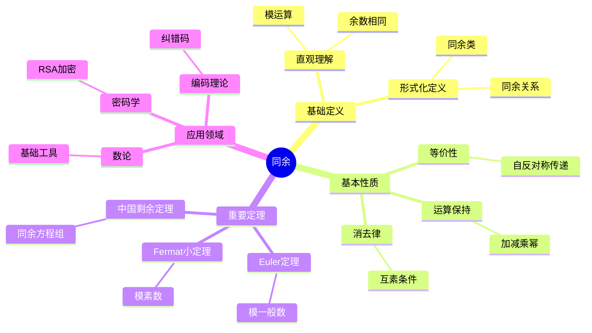
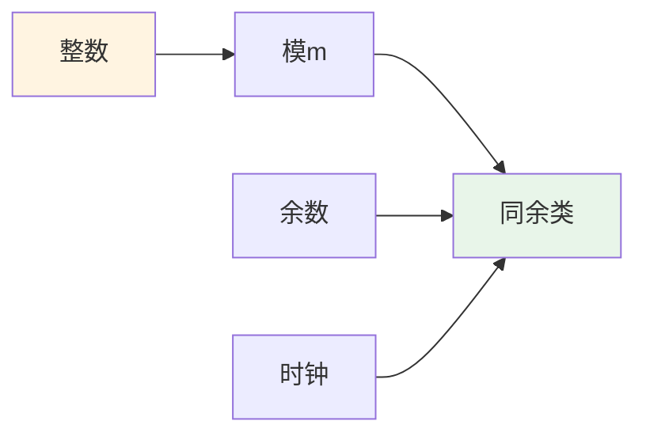
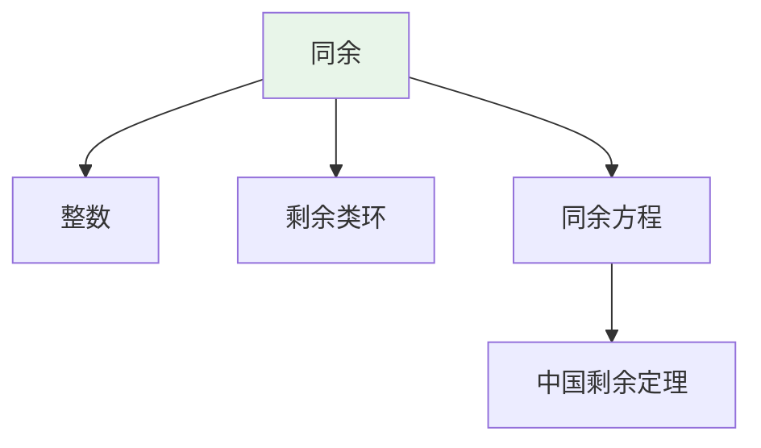
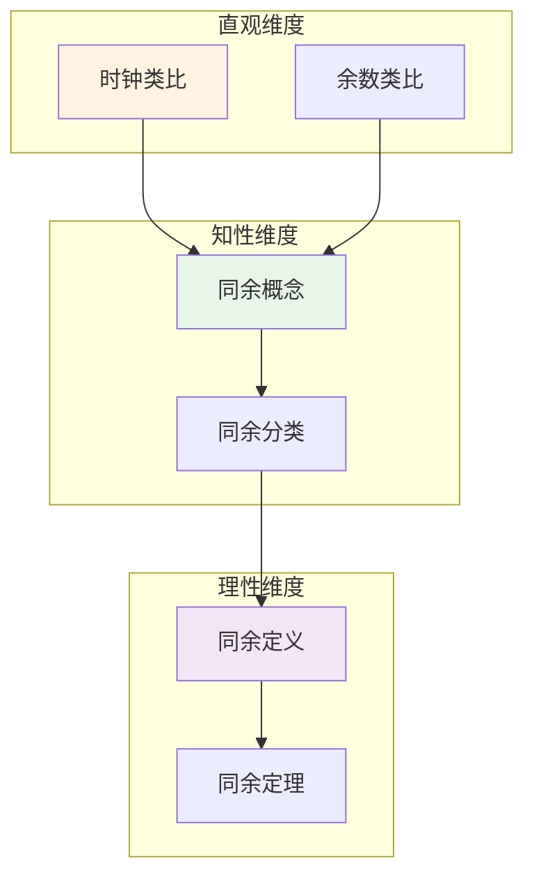

# 同余 (Congruence)

**概念编号**: C.CORE.027
**知识层次**: L0-L2
**知识领域**: D6 (数论)
**创建日期**: 2025年11月21日
**最后更新**: 2025年11月21日

---

## 📋 概述

同余是数论的核心概念，描述整数在模运算下的等价关系。同余理论在密码学、编码理论、算法设计等领域有重要应用。

**权威资源对齐**:

- Wikipedia: [Modular Arithmetic](https://en.wikipedia.org/wiki/Modular_arithmetic)
- Stanford课程: Math 154 (Number Theory)
- Princeton课程: MAT 320 (Number Theory)
- MIT课程: 18.781 (Theory of Numbers)
- Metamath: [Congruence](http://us.metamath.org/mpeuni/df-congruence.html)

---

## 🎯 严格定义

### 基础定义 (L0)

**直观理解**: 同余描述两个整数除以某个正整数后余数相同的关系。

**基本定义**: 整数 $a$ 和 $b$ 模 $m$ 同余，记作 $a \equiv b \pmod{m}$，若 $m \mid (a - b)$。

**简单例子**:

- $7 \equiv 2 \pmod{5}$（因为 $5 \mid (7-2)$）
- $15 \equiv 0 \pmod{5}$（因为 $5 \mid 15$）
- $a \equiv a \pmod{m}$（自反性）

### 形式化定义 (L1)

**同余关系**: 整数 $a$ 和 $b$ 模 $m$ 同余定义为：

$$a \equiv b \pmod{m} \Leftrightarrow m \mid (a - b)$$

**等价定义**: $a \equiv b \pmod{m} \Leftrightarrow a \bmod m = b \bmod m$。

**同余类**: 模 $m$ 的同余类 $[a]_m = \{b \in \mathbb{Z} : b \equiv a \pmod{m}\}$。

**剩余类环**: $\mathbb{Z}/m\mathbb{Z} = \{[0]_m, [1]_m, \ldots, [m-1]_m\}$ 是模 $m$ 的剩余类环。

**记号**:

- $a \equiv b \pmod{m}$: $a$ 与 $b$ 模 $m$ 同余
- $[a]_m$: $a$ 的同余类
- $\mathbb{Z}/m\mathbb{Z}$: 模 $m$ 的剩余类环
- $a \bmod m$: $a$ 除以 $m$ 的余数

---

## 📚 历史背景

### 发展脉络

**18世纪**: 同余理论的起源

- **Gauss (1801)**: 在《算术研究》中系统化同余理论
- **Euler (1760)**: 研究Euler定理

**19-20世纪**: 同余理论的发展

- **Fermat (1640)**: 研究Fermat小定理
- **Wilson (1770)**: 研究Wilson定理
- **Chinese Remainder Theorem**: 中国剩余定理

### 关键人物

- **Carl Friedrich Gauss (1777-1855)**: 系统化同余理论
- **Leonhard Euler (1707-1783)**: 研究Euler定理
- **Pierre de Fermat (1607-1665)**: 研究Fermat小定理

---

## 🔍 性质与定理

### 基本性质 (L1)

**性质1: 同余的等价性**:

- 同余是等价关系（自反、对称、传递）
- 同余类构成 $\mathbb{Z}$ 的划分

**性质2: 同余的运算**:

- 若 $a \equiv b \pmod{m}$ 且 $c \equiv d \pmod{m}$，则：
  - $a + c \equiv b + d \pmod{m}$
  - $ac \equiv bd \pmod{m}$
  - $a^n \equiv b^n \pmod{m}$

**性质3: 同余的消去律**:

- 若 $ac \equiv bc \pmod{m}$ 且 $\gcd(c, m) = 1$，则 $a \equiv b \pmod{m}$

### 重要定理 (L2)

**定理1: Fermat小定理**:

- **陈述**: 若 $p$ 是素数且 $p \nmid a$，则 $a^{p-1} \equiv 1 \pmod{p}$
- **应用**: 素性测试、密码学

**定理2: Euler定理**:

- **陈述**: 若 $\gcd(a, m) = 1$，则 $a^{\phi(m)} \equiv 1 \pmod{m}$
- **应用**: 模幂运算、RSA加密

**定理3: 中国剩余定理**:

- **陈述**: 若 $m_1, \ldots, m_n$ 两两互素，则同余方程组有唯一解模 $m_1 \cdots m_n$
- **应用**: 大数运算、密码学

---

## 💡 应用实例

### 理论应用

- 数论（同余是数论的基础）
- 代数（剩余类环）
- 密码学（模运算）

### 实际应用

#### 应用1: 密码学 - RSA加密中的模幂运算

**问题描述**:
在RSA加密中，计算 $m^e \bmod n$，其中 $m = 65$，$e = 17$，$n = 3233$。

**数学建模**:
使用快速模幂算法：$m^e \bmod n$，利用同余的性质 $(ab) \bmod n = [(a \bmod n)(b \bmod n)] \bmod n$。

**计算过程**:
- $65^1 \equiv 65 \pmod{3233}$
- $65^2 \equiv 4225 \equiv 992 \pmod{3233}$
- $65^4 \equiv 992^2 \equiv 984064 \equiv 3041 \pmod{3233}$
- $65^8 \equiv 3041^2 \equiv 9247681 \equiv 2772 \pmod{3233}$
- $65^{16} \equiv 2772^2 \equiv 7683984 \equiv 3151 \pmod{3233}$
- $65^{17} = 65^{16} \times 65 \equiv 3151 \times 65 \equiv 204815 \equiv 2790 \pmod{3233}$

**结果解释**:
快速模幂算法利用同余的性质，将指数分解为2的幂次，大大减少计算量。

**数据**:
- 底数: $m = 65$
- 指数: $e = 17$
- 模数: $n = 3233$
- 结果: $2790$

#### 应用2: 编码理论 - 中国剩余定理的应用

**问题描述**:
使用中国剩余定理求解同余方程组：$x \equiv 2 \pmod{3}$，$x \equiv 3 \pmod{5}$，$x \equiv 2 \pmod{7}$。

**数学建模**:
中国剩余定理：若 $m_1, m_2, m_3$ 两两互素，则同余方程组有唯一解模 $m_1m_2m_3$。

**计算过程**:
- $m_1 = 3$，$m_2 = 5$，$m_3 = 7$，$M = 105$
- $M_1 = 35$，$M_2 = 21$，$M_3 = 15$
- $y_1 = 35^{-1} \equiv 2 \pmod{3}$，$y_2 = 21^{-1} \equiv 1 \pmod{5}$，$y_3 = 15^{-1} \equiv 1 \pmod{7}$
- $x \equiv 2 \times 35 \times 2 + 3 \times 21 \times 1 + 2 \times 15 \times 1 \equiv 140 + 63 + 30 \equiv 233 \equiv 23 \pmod{105}$

**结果解释**:
中国剩余定理用于大数运算和编码理论，可以将大数分解为多个小数的同余表示。

**数据**:
- 模数: $3, 5, 7$
- 余数: $2, 3, 2$
- 解: $x \equiv 23 \pmod{105}$

#### 应用3: 算法设计 - 哈希表设计

**问题描述**:
设计哈希表，使用模运算将键映射到桶。键空间 $K = \{0, 1, \ldots, 999\}$，桶数 $m = 11$。

**数学建模**:
哈希函数：$h(k) = k \bmod m$，其中 $k$ 是键，$m$ 是桶数。

**计算过程**:
- 桶数：$m = 11$
- 键 $k = 123$：$h(123) = 123 \bmod 11 = 2$
- 键 $k = 456$：$h(456) = 456 \bmod 11 = 5$
- 键 $k = 789$：$h(789) = 789 \bmod 11 = 8$

**结果解释**:
模运算用于哈希表设计，将键均匀分布到桶中。

**数据**:
- 键空间: $\{0, 1, \ldots, 999\}$
- 桶数: 11
- 哈希函数: $h(k) = k \bmod 11$

---

## 🔗 关联概念

### 依赖关系

- 整数（同余在整数中定义）
- 整除（同余的定义需要整除）

### 推广关系

- 同余（整数中的同余）
- 模同余（一般环中的同余）
- 等价关系（同余是等价关系）

---

## 📖 参考文献

- Wikipedia: [Modular Arithmetic](https://en.wikipedia.org/wiki/Modular_arithmetic)
- Hardy, G. H., & Wright, E. M. (2008). *An Introduction to the Theory of Numbers*. Oxford University Press.
- Rosen, K. H. (2011). *Elementary Number Theory and Its Applications*. Addison-Wesley.

---

## 🗺️ 思维导图 (编号: C.CORE.027.MIND)

### 同余概念思维导图

---

## 📊 知识多维关系矩阵 (编号: C.CORE.027.MATRIX)

### 同余的多维关系矩阵

| 维度 | 指标 | 同余 |
|------|------|------|
| **知识层次** | L0基础 | ⭐⭐⭐⭐ |
| | L1中级 | ⭐⭐⭐⭐⭐ |
| | L2高级 | ⭐⭐⭐ |
| | L3研究 | ⭐⭐ |
| **知识领域** | D1基础数学 | ⭐⭐⭐ |
| | D2代数 | ⭐⭐⭐ |
| | D6数论 | ⭐⭐⭐⭐⭐ |
| | D7离散数学 | ⭐⭐⭐ |
| **依赖关系** | 前置概念 | 整数、整除 |
| | 后续概念 | 剩余类环、密码学 |
| **应用关系** | 理论应用 | ⭐⭐⭐⭐ |
| | 实际应用 | ⭐⭐⭐⭐⭐ |
| | 交叉应用 | ⭐⭐⭐ |
| **学习难度** | 直观理解 | ⭐⭐ |
| | 形式化理解 | ⭐⭐⭐ |
| | 深入应用 | ⭐⭐⭐ |

---

## 💭 形象化解释与论证 (编号: C.CORE.027.VISUAL)

### 形象化解释

**1. 同余的直观理解**

- **类比**: 同余就像"时钟算术"或"余数相同"
- **例子**:
  - 时钟：13点 ≡ 1点 (mod 12)
  - 星期：15天后 ≡ 1天后 (mod 7)
  - 余数：$7 \equiv 2 \pmod{5}$（因为$7$和$2$除以$5$的余数都是$2$）

**2. 同余类的直观理解**

- **类比**: 同余类就像"余数相同的数的集合"
- **例子**:
  - 模5的同余类：$[0]_5 = \{0, 5, 10, 15, \ldots\}$，$[1]_5 = \{1, 6, 11, 16, \ldots\}$
  - 同余类构成整数的划分

**3. 中国剩余定理的直观理解**

- **类比**: 中国剩余定理就像"用多个条件确定一个数"
- **例子**:
  - 一个数除以3余2，除以5余3，除以7余2，求这个数
  - 中国剩余定理保证这样的数存在且唯一（模105）

### 认知科学视角

**1. 数学教育家Dienes的观点**

- **多表征原则**: 通过时钟、余数、同余类等多种方式理解同余
- **变化性原则**: 通过不同的同余例子理解同余的本质
- **教学启示**: 使用时钟模型、同余类可视化、模运算游戏等多种方法

**2. 数学认知学家Tall的观点**

- **过程-对象对偶**: 理解"同余运算过程"（如何计算）和"同余"（对象）
- **认知层次**: 从直观理解（"余数相同"）到形式化理解（整除定义）

---

## 👨‍🏫 专家观点与论证 (编号: C.CORE.027.EXPERT)

### 数学家的观点

**1. Carl Friedrich Gauss (1777-1855) - 同余理论的系统化者**
> "同余是数论的基础，同余记号使数论计算更加简洁。"
>
> **意义**: Gauss系统化了同余理论，引入了同余记号，推动了数论的发展。

**2. Leonhard Euler (1707-1783) - Euler定理的提出者**
> "Euler定理是模运算的基础，它推广了Fermat小定理。"
>
> **意义**: Euler提出了Euler定理，为模运算理论奠定了基础。

**3. Pierre de Fermat (1607-1665) - Fermat小定理的提出者**
> "Fermat小定理揭示了模素数的幂运算规律，这是数论的重要发现。"
>
> **意义**: Fermat提出了Fermat小定理，为现代数论奠定了基础。

### 数学教育家的观点

**1. Zoltan Dienes (1916-2014) - 数学教育家**
> "同余概念应该通过时钟、余数、同余类等多种方式学习。"
>
> **教学启示**:
>
> - 使用时钟模型理解模运算
> - 使用同余类可视化理解同余关系
> - 通过模运算游戏理解同余的应用

**2. Hans Freudenthal (1905-1990) - 数学教育家**
> "同余概念的学习需要从'余数相同'发展到'剩余类环结构'。"
>
> **认知发展**:
>
> - **直观阶段**: 理解同余作为余数相同
> - **结构阶段**: 理解剩余类环作为环的结构

### 数学认知学家的观点

**1. David Tall - 数学认知学家**
> "同余概念的理解需要从'过程'（如何计算）发展到'对象'（同余本身）。"
>
> **认知层次**:
>
> - **过程层次**: 理解"如何做同余运算"（如$a \equiv b \pmod{m}$）
> - **对象层次**: 理解"同余"（如同余是等价关系）

---

## 🎨 认知维度表征 (编号: C.CORE.027.COGNITIVE)

### 直观维度表征 (编号: C.CORE.027.INTUITIVE)

#### 形象类比

- **时钟类比**: 同余就像"时钟的运算"
  - 就像12小时制时钟，12点后回到1点
  - 模$m$同余就像$m$小时制时钟

- **余数类比**: 同余就像"余数相同"
  - 两个数除以$m$的余数相同
  - 就像"同余类"

#### 具体例子

- **例子1**: $7 \equiv 2 \pmod{5}$
  - 7和2除以5的余数都是2
  - 它们在模5下同余

- **例子2**: 时钟例子
  - 13点 ≡ 1点（模12）
  - 就像12小时制时钟

#### 可视化表示

#### 几何直观

- **同余类直观**: 通过同余类理解同余
  - 同余类是对整数的分类
  - 每个同余类对应一个余数

- **剩余类环直观**: 通过剩余类环理解同余
  - 剩余类环是环的结构
  - 同余运算对应环的运算

---

### 知性维度表征 (编号: C.CORE.027.INTELLECTUAL)

#### 概念定义

- **严格定义**: 整数$a$和$b$模$m$同余，如果$m$整除$a-b$，记作$a \equiv b \pmod{m}$
- **等价定义**: 通过余数、同余类定义
- **特征描述**: 同余是数论的基础，是研究整数的重要工具

#### 概念分类

- **模素数同余 vs 模合数同余**: 按模的类型分类
- **一次同余 vs 高次同余**: 按次数分类
- **同余方程 vs 同余关系**: 按形式分类

#### 概念关系

#### 知识矩阵

| 维度 | 指标 | 同余 |
|------|------|------|
| **知识层次** | L0基础 | ⭐⭐⭐ |
| | L1中级 | ⭐⭐⭐⭐ |
| | L2高级 | ⭐⭐⭐⭐ |
| **知识领域** | D6数论 | ⭐⭐⭐⭐⭐ |
| **学习难度** | 直观理解 | ⭐⭐ |
| | 形式化理解 | ⭐⭐⭐ |
| **认知维度** | 直观维度 | ⭐⭐⭐⭐ |
| | 知性维度 | ⭐⭐⭐⭐ |
| | 理性维度 | ⭐⭐⭐⭐ |

---

### 理性维度表征 (编号: C.CORE.027.RATIONAL)

#### 公理体系

- **同余定义**: $a \equiv b \pmod{m}$ 当且仅当 $m \mid (a-b)$
- **同余性质**: 同余是等价关系
- **同余运算**: 同余保持加法和乘法

#### 形式化定义

- **形式化定义**: 使用一阶逻辑严格定义
- **符号系统**: $\equiv$, $\pmod{m}$, $\mathbb{Z}/m\mathbb{Z}$, $[a]_m$
- **类型系统**: 同余是整数类型到等价关系类型的映射

#### 逻辑推理

- **基本定理**: 同余的性质、Fermat小定理、Euler定理、中国剩余定理
- **证明思路**: 使用数论和代数方法证明
- **推理链**: 定义 → 基本性质 → 同余运算 → 重要定理

#### 证明系统

- **证明方法**: 构造性证明、反证法、归纳法
- **形式化证明**: 可以使用Lean4等工具进行形式化
- **验证工具**: Metamath、Lean4等

---

### 综合整合表征 (编号: C.CORE.027.INTEGRATED)

#### 多维度整合

#### 图形转换

- **思维导图**: 展示同余的知识结构
- **知识图谱**: 展示同余与其他概念的关系
- **知识矩阵**: 展示同余的多维度特征

#### 应用示例

- **应用1**: 数论（同余方程、剩余类）
- **应用2**: 密码学（RSA加密、离散对数）
- **应用3**: 计算机科学（哈希函数、校验码）

---

**创建日期**: 2025年11月21日
**最后更新**: 2025年11月21日
**维护状态**: 持续更新中
